# 80/20 原则


在这一章中，你将了解*80/20 原则*对你作为程序员生活的深远影响。它有很多名字，包括以其发现者维尔弗雷多·帕累托命名的*帕累托原则*。那么，这个原则是如何运作的，为什么你应该关心它？80/20 原则指的是，大多数效果（80%）来自少数原因（20%）。它为你指明了一条道路，让你作为一名专业编码员，通过集中精力在少数重要的事情上，忽略那些几乎无法产生影响的事务，从而获得更多的成果。

## 80/20 原则基础

该原则表示，大多数效果来自少数原因。例如，大多数收入由少数人获得，大多数创新来自少数研究人员，大多数书籍是由少数作者写的，等等。

你可能听说过 80/20 原则——它在个人生产力的文献中随处可见。它之所以如此流行，有两个原因。首先，原则让你能够既放松又高效，只要你能找出那些重要的事情，这些事情构成了 20%的活动，能够带来 80%的结果，并且全力以赴地专注于这些事情。第二，我们可以在各种情境中观察到这个原则，从而赋予它相当的可信度。甚至很难想出反例，其中效果与原因的比例相等。试着找到一些 50/50 分布的例子，其中 50%的效果来自 50%的原因！当然，分布不总是 80/20——具体的数字可以是 70/30、90/10，甚至是 95/5——但分布总是严重倾向于少数原因产生大多数效果。

我们用帕累托分布来表示帕累托原则，如图 2-1 所示。

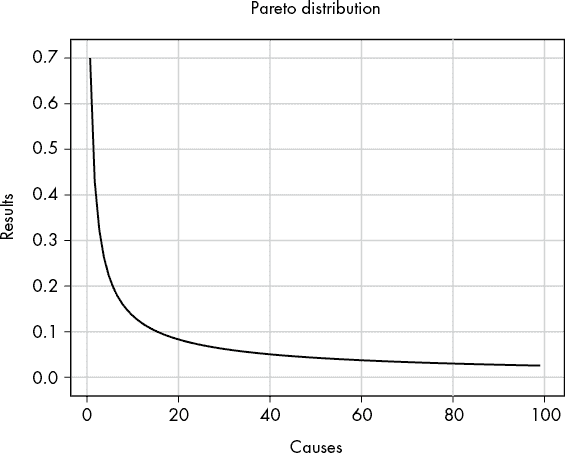

图 2-1：一般帕累托分布的示例

帕累托分布将结果（y 轴）与原因（x 轴）绘制在一起。结果可以是任何衡量成功或失败的标准，比如收入、生产力，或者软件项目中的错误数量。原因可以是与这些结果相关的任何实体，比如员工、企业，或者软件项目等。为了得到典型的帕累托曲线，我们根据产生结果的原因对其进行排序。例如，收入最高的人排在 x 轴的最前面，接着是收入第二高的人，依此类推。

让我们来看一个实际的例子。

## 应用软件优化

图 2-2 显示了在一个虚拟软件项目中帕累托原则的实际应用：少数代码负责大部分的运行时间。x 轴显示按运行时间排序的代码函数，y 轴显示这些代码函数的运行时间。图表下方阴影区域的面积表明，大部分代码函数对整体运行时间的贡献远低于少数选定的代码函数。帕累托原则的早期发现者之一 Joseph Juran 将后者称为 *关键少数*，前者称为琐碎多数。花费大量时间优化琐碎多数几乎无法改善整体运行时间。帕累托分布在软件项目中的存在得到了科学证据的支持，例如 Louridas、Spinellis 和 Vlachos（2008）在《软件中的幂律》一文中的研究。

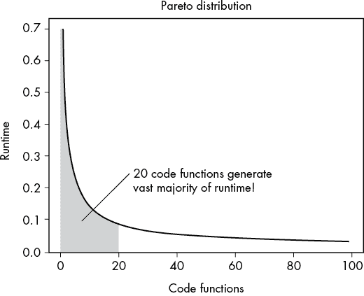

图 2-2：软件工程中的帕累托分布示例

像 IBM、微软和苹果这样的公司运用帕累托原则，通过将焦点集中在少数关键部分上来构建更快、更易于使用的计算机，也就是通过反复优化平均用户最常执行的 20% 代码来实现。并非所有代码都一样重要。少量的代码对用户体验有主导作用，而大部分代码的影响很小。你可能每天多次双击文件资源管理器图标，但很少会更改文件的访问权限。80/20 原则告诉你在哪里集中优化工作！

这个原则容易理解，但要知道如何在自己的生活中应用这一原则，可能会更难。

## 生产力

通过专注于少数关键部分，而非琐碎的多数部分，你的生产力可以提高 10 倍，甚至 100 倍。你不相信吗？让我们计算一下这些数字的来源，假设底层存在 80/20 分布。

我们将使用保守的 80/20 参数（80% 的结果来自 20% 的人），然后计算每个组的生产率。在某些领域（例如编程），这种分布可能会更倾斜。

图 2-3 显示，在一个拥有 10 名员工的公司中，只有 2 名员工产生了 80% 的结果，而 8 名员工只产生了 20% 的结果。我们将 80% 结果除以 2 名员工，得出每个高绩效员工的平均产出为 40%。如果我们将 8 名员工产生的 20% 结果除以 8，得出每个低绩效员工的平均产出为 2.5%。绩效差异是 16 倍！

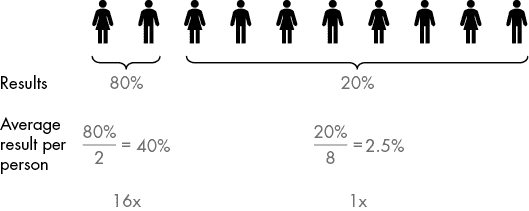

图 2-3：排名前 20%的表现者的平均产出是排名后 80%表现者平均产出的 16 倍。

这种 16 倍的平均表现差异是全球数百万组织中的普遍现象。帕累托分布也是分形的，这意味着排名前 20%的前 20%的人产生了 80%结果中的 80%，在有成千上万名员工的大型组织中，这会导致更为显著的表现差异。

结果的差异不能仅通过智力来解释——一个人不可能比另一个人聪明 1,000 倍。相反，结果的差异来自于个人或组织的具体行为。如果你做相同的事情，你也能得到相同的结果。然而，在改变行为之前，你必须清楚你想要达成的结果，因为研究表明，几乎任何你能想到的指标都会存在极度不平等的结果分布。

1.  收入 美国 10%的人获得了近 50%的收入。

1.  幸福感 在北美，少于 25%的人将自己的幸福感评为 9 或 10（0-10 分制，其中“最糟糕的生活”是 0 分，“最好的生活”是 10 分）。

1.  每月活跃用户 仅 2 个面向所有受众的前 10 大网站就获得了 48%的累计流量，如表 2-1 所示（基于[`www.ahrefs.com/`](https://www.ahrefs.com/)提供的信息）。

1.  图书销售 仅 20%的作者可能会获得 97%的销售额。

1.  科学生产力 例如，5.2%的科学家占据了 38%的已发表文章。

本章末尾的资源部分提供了一些文章链接，以支持这些数据。结果的不平等是社会科学中一个广泛认可的现象，通常通过一个叫做*基尼系数*的指标来衡量。

表 2-1：美国十大流量网站的累计流量

| # | **域名** | **月度流量** | **累计** |
| --- | --- | --- | --- |
| 1 | en.wikipedia.org | 1,134,008,294 | 26% |
| 2 | youtube.com | 935,537,251 | 48% |
| 3 | amazon.com | 585,497,848 | 62% |
| 4 | facebook.com | 467,339,001 | 72% |
| 5 | twitter.com | 285,460,434 | 79% |
| 6 | fandom.com | 228,808,284 | 84% |
| 7 | pinterest.com | 203,270,264 | 89% |
| 8 | imdb.com | 168,810,268 | 93% |
| 9 | reddit.com | 166,277,100 | 97% |
| 10 | yelp.com | 139,979,616 | 100% |
|  |  | 4,314,988,360 |  |

那么，如何才能成为表现最出色的人之一呢？或者更一般地说：如何在你的组织中*向左移动*，在帕累托分布曲线中向左移动（见图 2-4）？

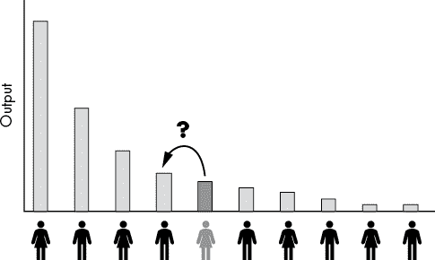

图 2-4：为了创造更多产出，你需要向曲线的左侧移动。

## 成功指标

假设你想优化收入。那么，如何在帕累托曲线的左侧移动呢？我们这里不再谈精确的科学，因为你需要找到在你特定行业中成功的人的原因，并制定可以控制和执行的可操作成功指标。我们将*成功指标*定义为衡量导致在你领域取得更多成功的行为的标准。关键在于，不同行业中的最重要的成功指标是不同的。80/20 原则也适用于成功指标：一些成功指标对你在某个领域的表现有较大影响，而其他指标几乎毫无影响。

例如，当我在做博士研究时，我很快意识到成功就是被其他研究者引用。作为研究者，你的引用越多，你的可信度、可见性和机会就越大。然而，*增加引用次数*几乎不是一个可以每天优化的可操作成功指标。引用次数是一个*滞后指标*，因为它基于你过去采取的行动。滞后指标的问题在于，它们只记录过去行动的结果，而不会告诉你每天该采取什么行动来取得成功。

为了获得做对事情的衡量标准，引入了领先指标的概念。*领先指标*是一种在滞后指标发生变化之前预测变化的指标。如果你多做领先指标，滞后指标很可能会因此得到改善。作为研究者，你通过发表更多高质量的研究论文（领先指标），将获得更多的引用（滞后指标）。这意味着写高质量论文是大多数科学家最重要的活动，而不是像准备演讲、组织活动、教学或喝咖啡这样的次要活动。因此，研究者的成功指标就是产生尽可能多的高质量论文，如图 2-5 所示。

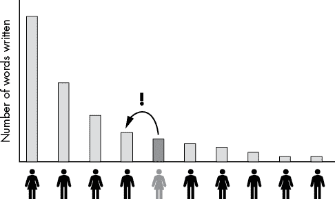

图 2-5：研究中的成功指标：写作字数与高质量论文的关系

要在研究中向左推进，你必须今天写更多的字，尽快发布下一篇高质量的论文，更快地获得更多引用，扩大你的科研影响力，成为一名更成功的科学家。粗略来说，许多不同的成功指标都可以作为“在科学中取得成功”的代表。例如，将它们按滞后指标到领先指标的顺序排列，你可能会得到*引用次数*、*撰写的高质量论文数量*、*一生中写的总字数*和*今天写的字数*。

80/20 方法让你能够识别出必须关注的活动。更多地关注成功指标，尤其是可操作的领先指标，将会提升你的职业成功，而这才是最重要的。把时间从其他任务中剥离出来，拒绝陷入“千刀万剐”的死法。对于所有活动都要懒惰，除了一个：*每天写更多的字*。

假设你每天工作 8 小时，并将一天分为八个 1 小时的活动。在完成成功指标练习后，你意识到每天可以跳过两个 1 小时的活动，并通过不那么完美的方式在半小时内完成另外四项活动。你节省了 4 小时，但仍然完成了 80%的成果。现在，你可以每天投入 2 小时来写更多的高质量论文字数。几个月内，你会提交额外的论文，随着时间的推移，你提交的论文数量会超过你的任何同事。你每天只工作 6 小时，且大多数工作任务的质量并不完美。但你在关键地方发光：你提交的研究论文比你周围的任何人都多。结果，你很快就会成为顶尖的 20%研究人员之一。你用更少的时间创造更多的成果。

你不再成为那种“什么都懂，但什么都不精”的人，而是专注于你最重要的领域。你会将精力集中在少数关键点上，忽视琐碎的无关紧要的事物。你过上了更轻松的生活，但你从投入的劳动、努力、时间和金钱中收获更多的成果。

## 专注与帕累托分布

一个我想讨论的相关话题是*专注*。我们将在本书的多个地方讨论专注——例如，第九章详细讨论了专注的力量——但是 80/20 原则解释了*为什么*专注如此强大。让我们深入探讨这个论点！

考虑图 2-6，它展示了向分布顶部移动时的百分比改善。Alice 是组织中第五高产的人。如果她超越组织中的一个人，成为第四高产的人，她的输出（薪水）将增加 10%。再进一步，她的输出将增加 *额外* 20%。在帕累托分布中，每个排名的增长呈指数爆炸式增长，因此即使是小幅度的生产力提高，也能带来收入的巨大增加。提高生产力会导致收入、幸福感和工作中的快乐有超线性的提升。有些人称这种现象为“赢家通吃”。

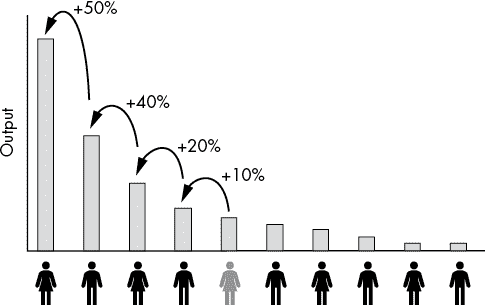

图 2-6：在帕累托分布中提高排名的收益不成比例

这就是为什么分散注意力没有好处的原因：*如果你不专注，你就会参与许多帕累托分布*。考虑图 2-7：Alice 和 Bob 每天都可以投入三单位的学习精力。Alice 专注于一件事：编程。她将三单位的精力投入到学习编程上。Bob 将精力分散到多个学科：一单位时间用来提高他的国际象棋技能，一单位用来提高编程技能，另一单位用来提高政治技能。他在这三项技能中都达到了平均水平。但帕累托分布会不成比例地奖励顶尖表现者，因此 Alice 能获得更多的总输出奖励。

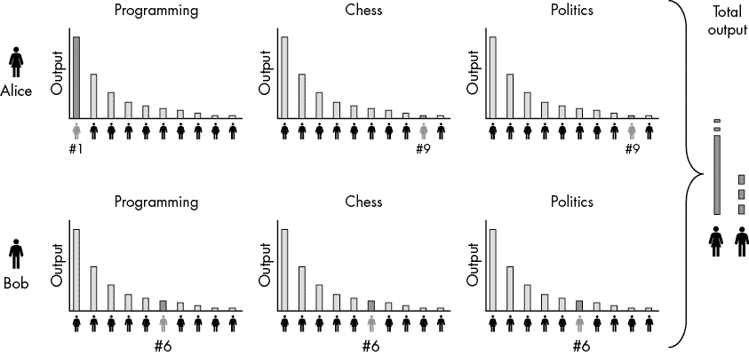

图 2-7：排名输出的非线性——专注力强大力量的战略解释

每个领域中的不成比例的回报也存在。例如，Bob 可能花时间阅读三本通用书籍（我们称它们为*Python 入门*、*C++入门*和*Java 入门*），而 Alice 则阅读三本深入探讨使用 Python 进行机器学习的书籍（我们称它们为*Python 入门*、*使用 Python 进行机器学习入门*和*专家级机器学习*）。结果，Alice 会专注于成为机器学习专家，并能为她的专业技能要求更高的薪水。

## 对编码人员的启示

在编程领域，结果往往比大多数其他领域更加倾斜于顶端。不是 80/20，而是 90/10 或 95/5 的分布更为常见。比尔·盖茨曾说过：“*一位优秀的车床操作员的薪资是普通车床操作员的几倍，而一位优秀的软件代码作者的价值是普通软件开发者的 10,000 倍*。”盖茨认为，一位优秀的软件开发者和一位普通软件开发者的差距不是 16 倍，而是 10,000 倍！以下是软件领域容易出现极端帕累托分布的几个原因：

+   一位优秀的程序员能够解决一些普通程序员根本无法解决的问题。在某些情况下，这使得他们的生产力比普通程序员高出无限倍。

+   一个优秀的程序员可以写出比普通程序员快 10,000 倍的代码。

+   一位优秀的程序员编写的代码漏洞更少。想想一个安全漏洞对微软声誉和品牌的影响！此外，每一个额外的漏洞都会为后续的代码修改和功能添加带来时间、精力和资金的成本——漏洞带来的不利影响是逐步累积的。

+   一位优秀的程序员编写的代码更容易扩展，这可能提高成千上万开发人员在软件开发过程后期对该代码进行维护时的生产力。

+   一位优秀的程序员能够跳出框架思考，找到创造性的解决方案，以避免成本高昂的开发工作，并帮助专注于最重要的事情。

实际上，这些因素的结合在起作用，因此差距可能会更大。

所以，对你来说，关键问题可能是：你如何成为一名优秀的程序员？

### 程序员的成功指标

不幸的是，"成为一名优秀程序员" 这个说法并不是你可以直接优化的成功指标——这个问题是多维度的。一个优秀的程序员能够迅速理解代码，掌握算法和数据结构，了解不同的技术及其优缺点，能够与他人协作，具备沟通和创造力，保持学习并了解如何组织软件开发过程，并拥有数百项软技能和硬技能。但你不可能在所有方面都做到精通！如果你不专注于少数关键要素，你就会被琐事所淹没。要成为一名优秀的程序员，你必须专注于少数关键的要素。

需要专注的关键活动之一就是编写更多的代码行。你写的代码行数越多，你就会成为更好的程序员。这是一个多维问题的简化：通过优化代理指标（编写更多代码行），你增加了成功达到目标指标（成为一名优秀的软件编写者）的机会。参见图 2-8。

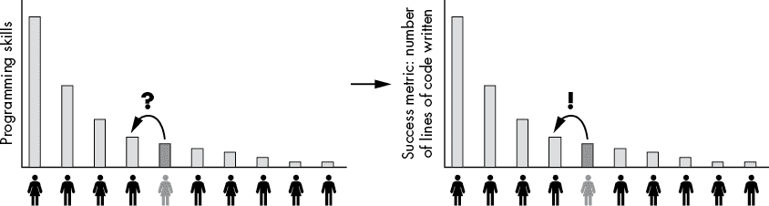

图 2-8：编程中的成功指标：编写的代码行数

通过编写更多的代码，你会更好地理解代码，并且你的言谈举止也会更像一名专家程序员。你将吸引更多优秀的程序员加入你的网络，找到更多有挑战性的编程任务，因此你会写更多的代码，并且变得更好。你写的每行代码都会让你获得更多的报酬。你或者你的公司可以外包那些琐碎的任务。

这里有一个你可以每天跟进的 80/20 活动：记录你每天编写的代码行数并加以优化。将其作为一个游戏，至少每天达到你的平均值。

### 现实世界中的帕累托分布

我们将快速浏览一下帕累托分布在现实世界中的一些例子。

#### GitHub 仓库 TensorFlow 贡献

我们可以看到 GitHub 仓库贡献中的帕累托分布极端示例。让我们以一个广受欢迎的 Python 机器学习计算库仓库：*TensorFlow* 为例。图 2-9 展示了该 GitHub 仓库的前七名贡献者。表 2-2 以数字形式展示了相同的数据。

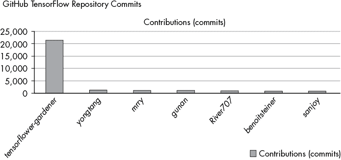

图 2-9：GitHub TensorFlow 仓库提交分布

表 2-2：TensorFlow 提交次数及其贡献者

| **贡献者** | **提交次数** |
| --- | --- |
| *tensorflower-gardener* | 21,426 |
| *yongtang* | 1,251 |
| *mrry* | 1,120 |
| *gunan* | 1,091 |
| *River707* | 868 |
| *benoitsteiner* | 838 |
| *sanjoy* | 795 |

用户*tensorflow-gardener*贡献了这个代码库中 93,000 次提交的超过 20%。考虑到有成千上万的贡献者，这个分布比 80/20 分布要极端得多。原因在于，贡献者*tensorflow-gardener*实际上是谷歌的一个开发团队，这个团队创造并维护了这个代码库。然而，即使过滤掉这个团队，其余的顶尖个人贡献者也是非常成功的程序员，拥有令人印象深刻的履历。你可以在公开的 GitHub 页面上查看他们。许多人已经找到为非常有吸引力的公司工作的激动人心的职位。无论他们是在大量提交开源代码库之前还是之后成功的，这只是一个理论上的讨论。从实际角度来看，你应该开始培养自己的成功习惯：每天写更多的代码。从现在开始，什么也不会阻止你成为 TensorFlow 代码库的第二名——只要在接下来的两到三年里，每天提交两到三次有价值的代码到 TensorFlow 代码库。如果你坚持下去，你就能通过选择一个强大的习惯并坚持几年，加入世界上最成功的程序员行列！

#### 程序员净资产

果然，程序员的净资产也呈现帕累托分布。出于隐私原因，很难获取个人的净资产数据，但网站[`www.networthshare.com/`](https://www.networthshare.com/)确实展示了包括程序员在内的各类职业的自报净资产。数据有点杂乱，但它显示了现实世界中帕累托分布的独特偏斜性（图 2-10）。

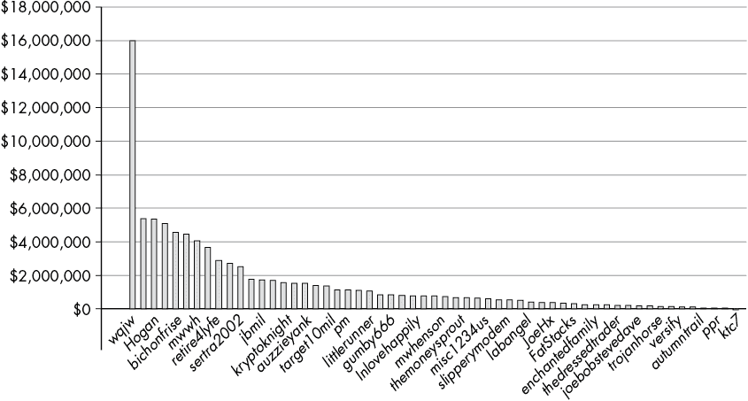

图 2-10：60 位程序员的自报净资产

在我们这个小样本 29 个数据点中，确实有相当多的软件百万富翁！但在现实世界中，曲线可能会更加偏斜，因为也有很多亿万富翁程序员——马可·扎克伯格、比尔·盖茨、埃隆·马斯克和史蒂夫·沃兹尼亚克等人不禁浮现在脑海。这些技术天才每个人都亲自创造了他们服务的原型，动手编写了源代码。最近，我们在区块链领域也见到了更多这样的软件亿万富翁。

#### 自由职业项目

自由职业开发领域由两个主流平台主导，程序员可以在这些平台上提供服务，客户也可以雇佣自由职业者：Upwork 和 Fiverr。两个平台的用户和收入每年都呈现两位数增长，且都致力于颠覆全球人才的组织模式。

自由职业开发者的平均收入为每小时$51。但这只是平均水平——自由职业开发者的前 10%赚取的时薪要高得多。在或多或少开放的市场中，收入呈帕累托分布。

我从三个角度观察到这种收入分布的不均衡：（1）作为自由职业者，（2）作为雇佣了数百名自由职业者的客户，（3）作为提供 Python 自由职业教育的课程创作者。大多数学生未能达到甚至是平均的收入潜力，因为他们的坚持时间不到一个月。那些每天坚持做自由职业业务几个月的人通常能达到平均的每小时$51 收入目标。而少数非常有野心并且专注的学生能够达到每小时$100 甚至更高。

那么，为什么有些学生失败而有些学生成功呢？让我们绘制出 Fiverr 平台上成功完成的工作数，要求平均评分至少为 4 分（满分 5 分）的自由职业开发者。我关注的是机器学习这一热门领域的图 2-11。我从 Fiverr 网站收集了数据，追踪了在机器学习类别的前两条搜索结果中，71 名自由职业者完成的工作数。不出所料，对我们来说，分布呈现帕累托分布。

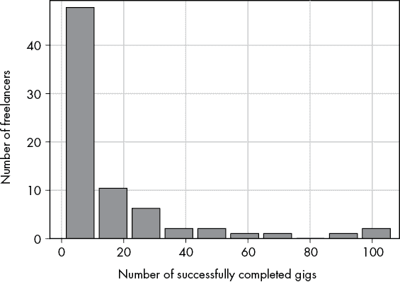

图 2-11：Fiverr 平台自由职业者及其完成的工作数的直方图

根据我作为成千上万自由职业学生的教师经验，我发现绝大多数学生完成的工作少于 10 个。我敢肯定，其中很多学生以后会说：“自由职业不行。”对我来说，这个说法像“工作不起作用”或“生意不起作用”一样自相矛盾。这些自由职业学生之所以失败，是因为他们没有足够努力和持之以恒。他们以为可以轻松赚钱，当意识到必须坚持不懈地工作才能成为自由职业的赢家时，他们很快就放弃了。

这种缺乏自由职业坚持的现象，实际上为你提供了一个很好的机会，可以在帕累托分布中向上移动。一个几乎能确保你最终进入自由职业前 1-3%的简单成功标准是：*完成更多的工作*。坚持更久。任何人都可以做到这一点。你正在阅读这本书，说明你有决心、雄心和动力，成为前 1-3%的自由职业编程专业人士。大多数人缺乏专注力，即使他们有技能、聪明且有很好的社会联系，也无法与专注、敬业、懂得帕累托法则的程序员竞争。

## 帕累托是分形的

Pareto 分布是分形的。如果你放大，只观察整体分布的一部分，你会看到另一个 Pareto 分布！只要数据不太稀疏，这种情况就成立；如果数据过于稀疏，它就失去了分形性质。例如，单个数据点不能被视为 Pareto 分布。我们在图 2-12 中可以看到这个特性。

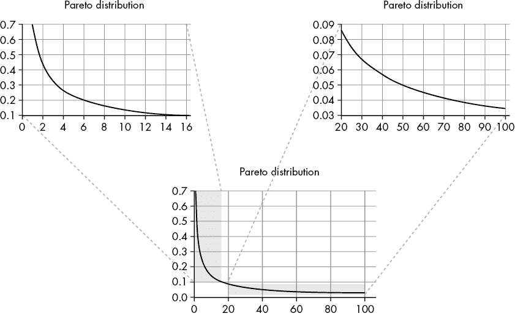

图 2-12：Pareto 分布的分形特性

在图 2-12 的中心，是来自图 2-1 的 Pareto 分布。我使用清单 2-1 中的简单 Python 脚本放大了这个 Pareto 分布：

```py
import numpy as np
import matplotlib.pyplot as plt

alpha = 0.7

x = np.arange(100)
y = alpha * x / x**(alpha+1)

plt.plot(x, y)

plt.grid()
plt.title('Pareto Distribution')
plt.show()
```

清单 2-1：一个交互式脚本，让你放大 Pareto 分布

你可以自己玩代码；只需将其复制到你的 Python 终端并运行。如果你在 Python 终端中执行此操作，你将能够放大 Pareto 分布的不同区域。

Pareto 分布在生活和编程中有各种实际应用，我将在本书中讨论其中的一些，但根据我的经验，对你来说最具变革性的应用将是成为一名*80/20 思维者*；也就是说，你会不断寻找用更少的资源完成更多任务的方法。请注意，虽然具体的 Pareto 数字——80/20、70/30 或 90/10——在你自己的生活中可能会有所不同，但你可以从生产力和产出分布的分形性质中得到一些启发。例如，总是有这样的事实：少数程序员赚得比其他人多，而且这些高收入者中的一部分人赚得比其他高收入者还要多。只有在数据变得过于稀疏时，这种模式才会停止。以下是一些例子：

1.  收入：前 20% 的程序员将赚取 80% 的 80% 收入。换句话说，4% 的程序员将赚取 64% 的收入！这意味着，即使你已经属于前 20% 的程序员，你也永远不会被困在当前的财务状况中。（这篇论文只是许多展示收入分布分形特性的论文之一：[`journalarticle.ukm.my/12411/1/29%20Fatimah%20Abdul%20Razak.pdf`](http://journalarticle.ukm.my/12411/1/29%20Fatimah%20Abdul%20Razak.pdf)*。）*

1.  活动：你这周做的 20%的最有影响力的 20%的活动，通常会占到 80%的结果。在这种情况下，0.8%的活动将导致 51%的结果。粗略来说，如果你每周工作 40 小时，那么 20 分钟可能就能占据你工作周的一半成果！一个这样的 20 分钟活动的例子是编写一个自动化商业任务的脚本，每几周节省几个小时的时间，你可以将这些时间投入到其他活动中。如果你是程序员，决定跳过实现一个不必要的功能，可以为你节省数十小时的无谓工作。如果你开始应用一些 80/20 的思维方式，你会迅速在自己的工作中发现许多具有杠杆效应的活动。

1.  进展：无论你在任何帕累托分布中处于何种位置，通过运用你的成功习惯和专注的力量，“向左移动”都能指数级提高你的产出。只要最优状态尚未达到，总有进步的空间，有机会以更少的投入获得更多成果——即便你已经是一个高度发展的个体、公司或经济体。

让你在帕累托曲线上前进的活动并不总是显而易见的，但它们从来不是随机的。许多人因为认为结果的概率性质使得成功完全是随机的，而放弃了在他们领域中寻找成功衡量标准。这是一个错误的结论！要成为一名大师级程序员，每天少写代码是无法做到的，就像每天少练习棋艺不能让你成为职业棋手一样。其他因素也会发挥作用，但这并不意味着成功是随机的游戏。通过专注于你所在行业的成功衡量标准，你将使概率向你有利。作为一个 80/20 思维者，你是赌场，而赌场*通常*是赢家。

## 80/20 实践技巧

让我们通过九个技巧来结束本章，利用帕累托原则的力量。

**弄清楚你的成功衡量标准。**

1.  首先定义你的行业。识别你所在行业中最成功的专业人士在做哪些事情做得异常出色，以及你每天可以做哪些任务将你推向前 20%的位置。如果你是程序员，你的成功衡量标准可能是编写的代码行数。如果你是作家，你的成功衡量标准可能是为下一本书写下的字数。创建一个电子表格，每天追踪你的成功衡量标准。把它当作一个游戏，坚持下去并超越自己。设定一个最低标准，直到完成最低标准才结束一天的工作。更好的是，在你没有完成这个标准之前，不要开始一天的工作！

**弄清楚你的人生大目标。**

1.  把它们写下来。没有明确的长期目标（例如：10 年目标），你就无法坚持做一件事足够长的时间。你已经看到了，提升帕累托曲线的关键策略之一是：在游戏中坚持更长时间，而参与更少的游戏。

**寻找用更少的资源实现相同目标的方法。**

1.  如何在 20%的时间里完成 80%的结果？你能否去除那些占用了 80%时间但只带来 20%成果的活动？如果不能，你能外包它们吗？Fiverr 和 Upwork 是寻找人才的便宜途径，利用他人的技能是值得的。

**反思你自己的成功。**

1.  你做了什么事情，取得了很大的成果？你如何能做得更多？

**反思你自己的失败。**

1.  如何做得更少，减少那些导致失败的事情？

**多读些行业书籍。**

1.  通过阅读更多书籍，你可以模拟实际经验，而无需花费大量的时间和精力亲身经历。你从他人的错误中学习。你学习到新的做事方式。你在你的领域获得了更多的技能。一位高学历的专家程序员能够比初学者快 10 到 100 倍解决问题。在你的领域里，读书可能是成功的关键指标之一，它将把你推向成功。

**将大部分时间花在改进和调整现有产品上。**

1.  做这个，而不是发明新产品。再一次，这来自帕累托分布。如果你的业务只有一个产品，你可以将所有精力投入到提升这个产品在帕累托曲线上的位置，为你和你的公司带来指数级增长的成果。但如果你一直创造新产品，而不改进和优化旧产品，你就永远会有低于平均水平的产品。永远不要忘记：大成果是在帕累托分布的左侧找到的。

**微笑。**

1.  有些结果看起来很简单，令人惊讶。如果你是一个积极的人，许多事情都会变得更容易。更多的人会与你合作。你会体验到更多的正能量、幸福和支持。微笑是一项高效的活动，具有巨大的影响力且成本低廉。

**不要做那些减少价值的事情。**

1.  这些东西包括吸烟、不健康饮食、睡眠不足、饮酒和看太多 Netflix。避免那些让你陷入困境的事情是你最大的一项杠杆点。如果你能避免做那些伤害你的事，你将变得更健康、更快乐、更成功。而且你将有更多的时间和金钱去享受生活中的美好事物：人际关系、大自然和积极的体验。

在下一章，你将学习一个关键概念，帮助你专注于软件的关键特性：你将学习如何构建一个最小可行产品。

## 资源

让我们来看看本章中使用的来源——可以进一步探索它们，找到更多帕累托原则的应用！

1.  Panagiotis Louridas，Diomidis Spinellis 和 Vasileios Vlachos，“软件中的幂律，”*ACM Transactions on Software Engineering and Methodology* 18，1 号（2008 年 9 月），[`doi.org/10.1145/1391984.1391986/`](https://doi.org/10.1145/1391984.1391986/)。

科学证据表明，开源项目的贡献是帕累托分布的：

1.  Mathieu Goeminne 和 Tom Mens，“开源软件活动中的帕累托原则证据，”会议：CSMR 2011 软件质量与可维护性研讨会（SQM），2011 年 1 月，[`www.researchgate.net/publication/228728263_Evidence_for_the_Pareto_principle_in_Open_Source_Software_Activity/`](https://www.researchgate.net/publication/228728263_Evidence_for_the_Pareto_principle_in_Open_Source_Software_Activity/)。

GitHub 仓库 TensorFlow 中提交分布的来源：

1.  [`github.com/tensorflow/tensorflow/graphs/contributors/`](https://github.com/tensorflow/tensorflow/graphs/contributors/)。

*我关于自由开发者收入分配的博客文章：*

1.  Christian Mayer，“Python 自由职业者的小时费率是多少？”*Finxter*（博客），[`blog.finxter.com/whats-the-hourly-rate-of-a-python-freelancer/`](https://blog.finxter.com/whats-the-hourly-rate-of-a-python-freelancer/)。

科学证据表明，开放市场遵循帕累托原则：

1.  William J. Reed，“收入的帕累托法则——解释与扩展，”*Physica A: Statistical Mechanics and its Applications* 319（2003 年 3 月），[`doi.org/10.1016/S0378-4371(02)01507-8/`](https://doi.org/10.1016/S0378-4371(02)01507-8/)。

一篇展示收入分配分形特性的论文：

1.  Fatimah Abdul Razak 和 Faridatulazna Ahmad Shahabuddin，“马来西亚家庭收入分配：从分形的角度看，”*Sains Malaysianna* 47，9 号（2018），[`dx.doi.org/10.17576/jsm-2018-4709-29/`](http://dx.doi.org/10.17576/jsm-2018-4709-29/)。

关于如何通过 Python 作为自由开发者建立副业的信息：

1.  Christian Mayer，“如何建立你的高收入技能 Python。”视频，[`blog.finxter.com/webinar-freelancer/`](https://blog.finxter.com/webinar-freelancer/)。

1.  Python 自由职业者资源页面，*Finxter*（博客），[`blog.finxter.com/python-freelancing/`](https://blog.finxter.com/python-freelancing/)。

更深入了解 80/20 思维的力量：

1.  Richard Koch，*The 80/20 Principle: The Secret to Achieving More with Less*，伦敦：Nicholas Brealey，1997。

美国 10% 的人几乎赚取了 50% 的收入：

1.  Facundo Alvaredo，Lucas Chancel，Thomas Piketty，Emmanuel Saez 和 Gabriel Zucman，*World Inequality Report 2018*，World Inequality Lab，[`wir2018.wid.world/files/download/wir2018-summary-english.pdf`](https://wir2018.wid.world/files/download/wir2018-summary-english.pdf)。

北美不到 25%的人在 0 到 10 的幸福评分中给自己打 9 或 10，其中“最糟糕的生活”是 0，“最好的生活”是 10：

1.  John Helliwell, Richard Layard 和 Jeffrey Sachs，编，《2016 年世界幸福报告，更新版》（第一卷）。纽约：可持续发展解决方案网络，[`worldhappiness.report/ed/2016/`](https://worldhappiness.report/ed/2016/)。

20%的书籍作者可能占据 97%的图书销量：

1.  Xindi Wang, Burcu Yucesoy, Onur Varol, Tina Eliassi-Rad 和 Albert-László Barabási，“书籍成功：在出版前预测图书销量”，*《EPJ 数据科学》* 8 卷，第 31 期（2019 年 10 月），[`doi.org/10.1140/epjds/s13688-019-0208-6/`](https://doi.org/10.1140/epjds/s13688-019-0208-6/)。

1.  Jordi Prats，“哈利·波特与帕累托的胖尾”，*《显著性》*（2011 年 8 月 10 日），[`www.significancemagazine.com/14-the-statistics-dictionary/105-harry-potter-and-pareto-s-fat-tail/`](https://www.significancemagazine.com/14-the-statistics-dictionary/105-harry-potter-and-pareto-s-fat-tail/)。

在科学家中，5.2%的人占据了 38%的期刊文章：

1.  Javier Ruiz-Castillo 和 Rodrigo Costas，“29 个广泛科学领域中的个人和领域引用分布”，*《信息计量学期刊》* 12 卷，第 3 期（2018 年 8 月），[`doi.org/10.1016/j.joi.2018.07.002/`](https://doi.org/10.1016/j.joi.2018.07.002/)。
