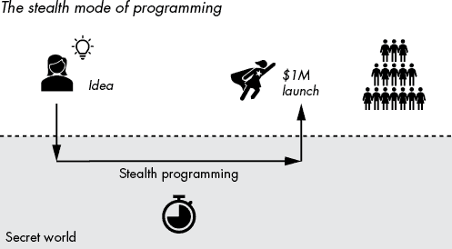
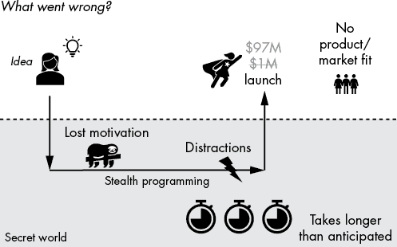
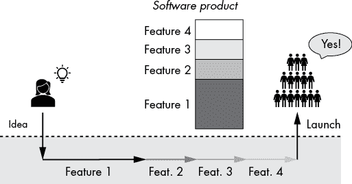
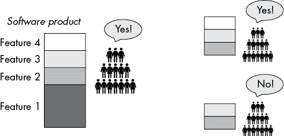
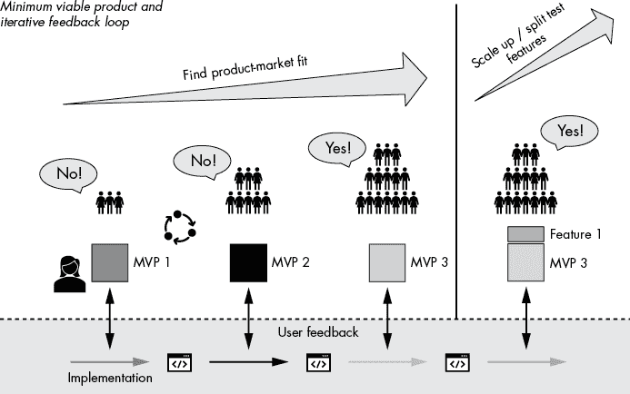

# 第三章：构建最小可行产品

本章介绍了一个在埃里克·里斯（Eric Ries）的《精益创业》一书中普及但仍然被低估的著名理念（Crown Business，2011 年）。这个理念是构建一个*最小可行产品*（*MVP*），即一个只保留最必要功能的产品版本，以便快速测试和验证你的假设，而不必浪费大量时间去实现用户可能根本不会使用的功能。特别是，你将学习如何通过专注于用户确认过的他们需要的功能，来大幅简化软件开发周期，因为这些功能在你的 MVP 中得到了确认。

在本章中，我们将通过分析没有使用 MVP 进行软件开发的陷阱来介绍 MVP。然后我们将更详细地阐述这个概念，并为你提供一些实用的建议，帮助你在自己的项目中使用 MVP，加速进展。

## 一个问题场景

构建 MVP 的想法是为了应对在隐形模式下编程时出现的问题（见图 3-1）。*隐形模式*是指在没有寻求潜在用户反馈的情况下，完成一个项目。假设你想出了一个改变世界的绝妙程序创意：一个专为搜索代码而设计的、增强型的机器学习搜索引擎。你开始兴奋地连续几个晚上编写这个创意的代码。

图 3-1：隐形编程模式包括在最终的完善版本发布之前保持应用程序的保密，以期望能迅速取得成功。在大多数情况下，这是一个谬论。

然而，在实际操作中，一次性编写完整应用程序几乎不可能马上取得成功。这种方式的成功结果非常、非常、非常罕见。以下是遵循隐形编程模式更可能的结果：

你很快就开发出原型，但当你尝试你的搜索引擎时，发现推荐结果中的许多搜索词并不相关。当你搜索`Quicksort`时，你得到一个`MergeSort`的代码片段，并附有评论`# This is not Quicksort`。这似乎不对劲。所以，你不断调整模型，但每次你改善一个关键词的结果时，其他搜索结果却出现了新的问题。你始终对结果不满意，而且你觉得无法将你那糟糕的代码搜索引擎展示给世界，原因有三：没人会觉得它有用；第一个用户会因为它不够专业且不够完善而在你的网页上制造负面宣传；你还担心如果竞争对手看到你那个实现不佳的概念，他们会窃取它并做得更好。这些令人沮丧的想法让你失去了信心和动力，应用程序的进展几乎停滞不前。

图 3-2 展示了在隐形模式下编程中可能会出现的问题。

图 3-2：编程隐形模式中的常见陷阱

在这里，我将讨论在隐形模式下工作的六个最常见的陷阱。

### 动力丧失

在隐形模式下，你和自己的想法独处，怀疑会定期出现。最初，你会抵抗这些怀疑，因为你对项目的热情足够大，但随着你在项目上投入的时间越来越长，怀疑也会随之加剧。也许你遇到了类似的现有工具，或者你开始相信这个项目是做不成的。缺乏动力可能会彻底扼杀你的项目。

另一方面，如果你发布了工具的早期版本，来自早期用户的鼓励性话语可能会激励你坚持下去，而用户的反馈可能会激发你改善工具或克服问题。你获得了外部动力。

### 分心

当你独自在隐形模式下工作时，日常的干扰很难忽视。你有日常工作，要花时间陪伴家人和朋友，其他的想法也会时常浮现。这些天，注意力是一种稀缺的资源，许多设备和服务都在争夺它。你处于隐形模式的时间越长，在没有完成打磨好的应用之前被干扰的可能性越大。

最小可行产品（MVP）可以通过减少从想法到市场反馈的时间来应对这一点，创造一个能更快反馈的环境，帮助你重新集中注意力。谁知道呢——也许你会发现一些积极的早期用户，他们能够推动应用开发的进展。

### 超过预定时间

项目完成的另一个强大敌人是错误的规划。假设你估计产品需要 60 小时才能完成，因此你最初计划每天花 2 小时来工作，持续一个月。然而，动力丧失和分心使得你每天平均只能工作 1 小时。进一步的延误是由于你必须进行的研究、外部干扰以及你必须处理的突发事件和 bug。无数因素会延长你预期的项目持续时间，几乎没有什么能缩短它。到第一个月结束时，你距离原计划的目标还远得很，这又回到了动力丧失的恶性循环中。

最小可行产品（MVP）去掉了所有不必要的功能。因此，你的规划错误会减少，进展也会更具可预测性。功能减少意味着出错的可能性也会降低。此外，项目的可预测性越强，你或者投资于项目的人越容易相信项目的成功。投资者和利益相关者喜欢可预测性！

### 缺乏反馈

假设你克服了低动机并完成了产品。你最终发布它，但什么也没有发生。只有少数用户查看了它，而且他们对它并不热情。任何软件项目最可能的结果就是沉默——没有正面或负面的反馈。一个常见的原因是你的产品没有提供用户所要求的特定价值。在第一次尝试中几乎不可能找到所谓的*产品市场契合点*。如果在开发过程中没有从真实世界获得任何反馈，你就会开始脱离现实，开发出没人使用的功能。

你的 MVP 将帮助你更快地找到产品与市场的契合点，因为正如你将在本章稍后看到的，基于 MVP 的方法将项目发展为直接解决最迫切的客户需求，增加客户参与的机会，从而提高早期产品版本得到反馈的可能性。

### 错误的假设

潜伏模式失败的主要原因是你自己的假设。你以一堆假设开始一个项目，比如假设用户是谁，他们的职业是什么，他们面临什么问题，或者他们多频繁地使用你的产品。这些假设往往是错误的，如果没有外部测试，你就会盲目地创造出你的目标受众并不需要的产品。一旦没有反馈或负面反馈，这会侵蚀任何动力。

当我创建我的 Finxter.com 应用程序时，它是通过解决评分的编程难题来学习 Python。我假设大多数用户会是计算机科学专业的学生，因为我曾是（现实情况是：大多数用户并不是计算机科学家）。我假设在我发布应用程序时，用户会自动来（现实情况是：最初没人来）。我假设很多用户会通过社交媒体账号分享他们在 Finxter 上的成功（现实情况是：只有极少数用户分享了他们的编程排名）。我假设用户会提交自己的编程难题（现实情况是：从数十万用户中，只有少数人提交了难题）。我假设用户会喜欢花哨的设计，带有颜色和图片（现实情况是：简单的极客风格设计反而提升了使用行为——见第八章关于简洁设计的内容）。所有这些假设导致了具体的实施决策，浪费了我数十小时甚至数百小时的时间，实施了许多我目标受众根本不需要的功能。如果我当时更懂得，我会在 MVP 中测试这些假设，回应用户反馈，节省时间和精力，并降低项目成功受威胁的可能性。

### 不必要的复杂性

隐形编程模式的另一个问题是：*不必要的复杂性*。假设你实现了一个包含四个特性的软体产品（见图 3-3）。你运气不错——市场接受了它。你花了相当多的时间实现这四个特性，并且将积极的反馈视为对这四个特性的强化。所有未来的产品发布都会包含这四个特性——除此之外，还会包含你未来新增的特性。

图 3-3：由四个特性组成的有价值的软件产品

然而，如果你一次性发布四个特性的包，而不是一次发布一到两个特性，你就不知道市场是否会接受，甚至偏好任何特性子集（见图 3-4）。

图 3-4：市场接受的特性子集有哪些？

特性 1 可能完全无关紧要，尽管它是你实现过程中花费最多时间的一个特性。同时，特性 4 可能是市场高度需求的有价值特性。从*n*个特性中可以组成 2*n*种不同的软件产品组合。如果你把它们作为特性包发布，你怎么可能知道哪个有价值，哪个是浪费时间呢？

实现错误特性的成本已经很高，而发布一堆错误特性则会产生维护不必要特性所带来的累积成本：

+   更长、更重特性的项目需要更多时间来“加载”整个项目到你的大脑中。

+   每个特性都有可能引入新的错误。

+   每一行代码都会增加项目打开、加载和编译的时间成本。

+   实现特性*n*需要你检查所有之前的特性 1、2、...、*n* – 1，以确保特性*n*不会干扰它们的功能。

+   每一个新特性都需要新的单元测试，必须在你发布下一个版本的代码之前编译并运行通过。

+   每新增一个特性，都会让代码库变得更加复杂，新加入项目的程序员理解起来会更加困难，从而增加了学习时间。

这并不是一个详尽的列表，但你明白了要点。如果每个特性都将你未来的实现成本增加*x*个百分点，维护不必要的特性可能会导致编码生产力的数量级差异。你不能在你的代码项目中系统地保留不必要的特性！

所以，你可能会问：如果编程的隐形模式不太可能成功，那么解决方案是什么？

## 构建最小可行产品

解决方案很简单：构建一系列 MVP。明确提出一个假设——例如*用户喜欢解决 Python 难题*——并创建一个只验证这个假设的产品。去除所有不帮助验证这个假设的功能。基于这个特性构建一个 MVP。通过每次发布仅实现一个功能，你能够更深入地理解市场接受哪些功能，哪些假设是正确的。但无论如何，都要避免复杂性。毕竟，如果用户不喜欢解决 Python 难题，那为什么还要继续实施 Finxter.com 网站呢？一旦你在实际市场上测试了你的 MVP，并分析它是否有效，你就可以构建第二个 MVP，添加下一个最重要的功能。通过一系列 MVP 寻找合适产品的策略被称为*快速原型开发*。每个原型都基于你从前一个版本中学到的经验，每个原型的设计都旨在以最小的时间和精力获取最大的信息。你*早发布，频繁发布*，以便找到*产品-市场契合度*，这意味着明确你的目标市场的产品需求和欲望（即使这个目标市场在最初非常小）。

让我们看一个使用代码搜索引擎的例子。你首先提出一个假设进行验证：程序员需要一种搜索代码的方式。想一想，针对你的代码搜索引擎应用，初始的 MVP 可能是什么样子？一个基于 shell 的 API？一个执行数据库查询的后台服务器，查找所有开源 GitHub 项目中的精确单词匹配？第一个 MVP 必须验证主要假设。因此，你决定验证这个假设并获得一些可能查询的见解最简单的方式是建立一个用户界面，而没有复杂的后台功能，自动获取查询的结果。你建立了一个网站，设立了一个输入框，并通过在编码小组和社交媒体上分享你的想法，并花一点钱做广告来吸引一些流量。应用界面很简单：用户输入他们想要搜索的代码并点击搜索按钮。你并不打算对搜索结果进行太多优化；这不是你第一个 MVP 的重点。相反，你决定简单地将谷歌搜索结果进行快速后处理后转发。重点是收集前 100 个搜索查询，找出一些常见的用户行为模式，甚至在你开始开发搜索引擎之前！

你分析数据后发现，90%的搜索查询与错误信息有关；程序员们只是将他们的编码错误复制并粘贴到搜索框中。此外，你发现 90 个查询中有 60 个与 JavaScript 相关。你得出结论，最初的假设得到了验证：程序员确实在搜索代码。然而，你获得了一个宝贵的信息：大多数程序员搜索的是错误信息，而不是比如说函数等内容。根据你的分析，你决定将第二版 MVP 从一个通用的代码搜索引擎缩小到一个*错误*搜索引擎。通过这种方式，你可以根据实际的用户需求来调整产品，并从一部分程序员那里获得更多互动反馈，从而迅速学习并将你的学习整合到一个有用的产品中。随着你获得越来越多的市场关注和洞察，你总是可以随着时间的推移扩展到其他语言和查询类型。如果没有第一个 MVP，你可能会花费数月时间开发几乎没人使用的功能，比如查找代码中任意模式的正则表达式功能，而牺牲了每个程序员都在使用的功能，比如错误信息搜索。

图 3-5 概述了这一软件开发和产品创建的黄金标准。首先，你通过反复推出 MVP 来找到产品与市场的契合点，直到用户爱上你的产品。MVP 的连续发布随着时间的推移积累了兴趣，并允许你根据用户反馈逐步改进软件的核心理念。一旦你达到了产品与市场的契合点，就开始添加新功能——每次一个功能。只有当一个功能能够证明它能改善关键用户指标时，它才会留在产品中。

图 3-5：软件开发的两个阶段包括：（1）通过迭代创建 MVP 来找到产品与市场的契合点，并随着时间的推移建立兴趣；（2）通过精心设计的拆分测试，添加和验证新功能来扩展规模。

以 Finxter.com 为例，如果我从一开始就遵循 MVP 规则，我可能会创建一个简单的 Instagram 账号，分享代码难题并检查用户是否喜欢解决它们。在没有验证的情况下花费一年时间开发 Finxter 应用，我本可以花几周甚至几个月时间在社交网络上分享难题。然后，我可以通过与社区互动得到的经验教训，构建一个具有稍多功能的第二版 MVP，比如一个专门托管编程难题及其正确解答的网站。这种方法将使我能在大大缩短时间的同时，避免开发一些不必要的功能。开发去除所有不必要功能的 MVP 这一教训，我是通过亲身经历学到的。

在*精益创业*中，埃里克·里斯讨论了价值十亿美元的公司 Dropbox 如何著名地采用了 MVP 方法。创始人并没有花时间和精力在一个未经验证的想法上，去实现同步文件夹结构到云端的复杂 Dropbox 功能——这一功能需要在不同操作系统中进行紧密集成，并彻底实现一些繁琐的分布式系统概念，比如副本同步——而是通过一个简单的产品视频验证了这个想法，尽管视频中展示的产品当时并不存在。经过无数次迭代，验证过的 Dropbox MVP 加入了更多有助于简化用户生活的核心功能。从那时起，这一概念已经被成千上万的成功软件公司（甚至其他行业）所验证。

如果市场信号表明用户喜欢并重视你的产品创意，那么你就已经通过一个简单、精心设计的 MVP 达到了产品与市场的契合。从这里开始，你可以不断迭代构建和优化你的 MVP。

当你使用基于 MVP 的方法进行软件开发时，逐步添加一个功能，能够识别应该保留哪个功能、拒绝哪个功能至关重要。MVP 软件创建过程的最后一步是*分割测试*：与其将带有新功能的迭代版本发布给全部用户，不如先将新产品发布给一小部分用户，并观察他们的隐性和显性反应。只有当你喜欢看到的结果时——例如，用户在你网站上的平均停留时间增加——你才会保留这个功能。否则，你就拒绝它，并继续使用没有这个功能的上一个版本。这意味着你必须牺牲开发这个功能所花费的时间和精力，但它确实让你保持产品尽可能简单，从而保持灵活、敏捷和高效。通过使用分割测试，你能够进行数据驱动的软件开发。

### 最小可行产品的四大支柱

在基于 MVP 思维构建第一个软件时，请考虑以下四个支柱：

1.  功能性 产品向用户提供了一个明确的功能，并且做得很好。这个功能不必具备很高的经济效率。你为聊天机器人设计的 MVP 可能实际上只是你自己与用户聊天；这显然无法扩展，但你展示了高质量聊天的功能——即使你还没找到如何以经济可行的方式提供这一功能。

1.  设计 产品设计良好且聚焦，其设计支持你的产品为目标用户群体提供的价值。一个常见的 MVP 生成错误是创建一个界面，未能准确反映你单一功能的 MVP 网站。设计可以是简单直接的，但必须支持价值主张。想想 Google 搜索——他们在发布搜索引擎的第一个版本时，确实没有花费大量精力在设计上，但该设计却非常适合他们提供的产品：无干扰的搜索体验。

1.  可靠性 仅仅因为你的产品是极简的，并不意味着它就不可靠。确保写出测试用例并严格测试你代码中的所有功能。否则，你从 MVP 中获得的学习将会被基于其不可靠性的负面用户反馈所污染，而非针对功能的反馈。记住：你想在最小的努力下最大化学习效果。

1.  可用性 MVP 必须易于使用。功能清晰明了，设计也要支持这一点。用户不需要花费大量时间去弄清楚该做什么或点击哪个按钮。MVP 需要足够响应迅速且快速，以便允许流畅的交互。对于一个专注且极简的产品来说，这通常更容易实现：当页面只有一个按钮和一个输入框时，如何使用页面是显而易见的。同样，Google 搜索引擎的初始原型就是一个典型例子，其可用性强到足以维持了超过二十年。

许多人误解了 MVP 的这一特性：他们错误地认为，MVP 作为产品的极简版本，必定提供较少的价值、差的可用性和懒散的设计。然而，极简主义者知道，MVP 的简洁实际上源于对一个核心功能的严格聚焦，而非懒散的产品创造。以 Dropbox 为例，制作一个有效展示意图的视频，比实现该服务本身更容易。MVP 是一个高质量的产品，具有出色的功能、设计、可靠性和可用性。

### 最小可行产品（MVP）的优势

MVP 驱动的软件设计有着多方面的优势。

+   你可以以最便宜的方式测试你的假设。

+   你通常可以在确认确实需要时再编写代码，而当你开始编写代码时，可以最大程度地减少在收集真实世界反馈之前所做的工作量。

+   你花费更少的时间编写代码和找寻 bug——而你所花的时间对你的用户来说将会非常有价值。

+   你发布给用户的任何新特性都会提供即时反馈，持续的进展让你和你的团队保持动力，源源不断地推出新特性。这大大降低了你在编程隐形阶段所面临的风险。

+   你将大幅降低未来的维护成本，因为 MVP 方法通过减少代码库的复杂性，为你未来的所有特性提供了更简单、更少出错的开发路径。

+   你将取得更快的进展，并且在整个软件生命周期中，实施将变得更加容易——这会让你保持动力，并走向成功之路。

+   你将更快地推出产品，更快地从软件中赚取收入，并且更可预测、可靠地建立你的品牌。

### 隐秘编程 vs. 最小可行产品方法

一个常见的反对快速原型制作、支持隐秘编程的论点是，隐秘编程可以保护你的创意。人们认为他们的创意是独特而特别的，如果他们以原始形式发布，即 MVP，它就会被那些能够更快实现它的大公司偷走。坦率地说，这是一个谬论。创意便宜，执行才是王道。任何一个创意都不太可能是独一无二的，很有可能你想出来的创意已经被其他人想过。隐秘编程并不会减少竞争，反而可能会促使其他人也开始开发同样的创意，因为像你一样，他们认为没有别人已经想到这个点子。要使一个创意成功，必须有一个人将它变为现实。如果快进几年，最终成功的人会是那个采取快速、果断行动、早发布、频繁发布、根据真实用户的反馈进行改进并利用之前发布的动力逐步完善软件的人。将创意保密只是限制了它的成长潜力。

## 结论

在编写代码之前，设想你的最终产品，并考虑用户的需求。专注于你的 MVP，确保它有价值、设计合理、响应迅速且易于使用。去除所有不必要的功能，仅保留实现目标所必需的功能。一次专注于一项任务。然后，快速且频繁地发布 MVP——随着时间的推移，通过逐步测试和添加更多功能来改进它们。少即是多！比起实际实施每个功能，花更多时间思考下一个功能如何实现。每个功能不仅带来直接的实现成本，还会为未来的所有功能带来间接成本。通过分割测试同时测试两个产品变体，并快速舍弃那些没有带来关键用户指标（如留存率、页面停留时间或活跃度）提升的功能。这会使你对业务采取更全面的方式——认识到软件开发只是整个产品创作和价值传递过程中的一步。

在下一章中，你将学习为什么以及如何编写干净简洁的代码，但请记住：不编写不必要的代码是实现干净简洁代码的最可靠途径！
