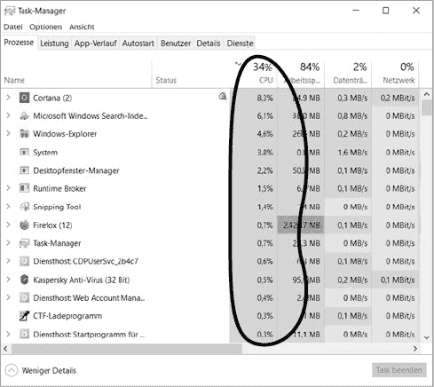
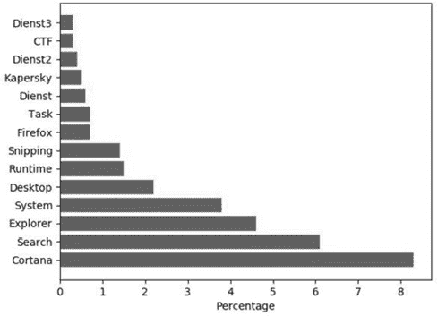
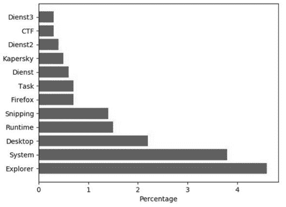

# 第五章：提前优化是万恶之源


在本章中，你将了解提前优化如何妨碍你的生产力。*提前优化*是指将宝贵的资源——时间、精力、代码行数——浪费在不必要的代码优化上，尤其是在你还没有掌握所有相关信息之前。这是编写糟糕代码的主要问题之一。提前优化有很多种形式；本章将介绍其中一些最相关的情况。我们将通过实际案例来研究提前优化可能发生的地方，这些案例对你的代码项目也具有相关性。最后，我们将提供关于性能调优的可操作建议，确保它不是*提前优化*。

## 六种提前优化的类型

优化代码本身并没有错，但它总是伴随着成本，无论是额外的编程时间还是更多的代码行数。当你优化代码片段时，通常是在用复杂性换取性能。有时你可以同时获得低复杂性和高性能，例如通过编写简洁的代码，但你必须花费编程时间来实现这一点！如果在过程中过早地进行优化，你往往会花时间优化那些在实际中可能永远不会用到的代码，或者对程序的整体运行时影响甚微。你还可能在没有足够信息的情况下进行优化，比如不了解代码何时被调用或可能的输入值。浪费宝贵的资源，如编程时间和代码行数，可能会大幅降低你的生产力，因此，知道如何明智地投资这些资源非常重要。

但不要仅仅听我说的。看看计算机科学史上最具影响力的科学家之一，唐纳德·克努斯（Donald Knuth）如何评价提前优化：

> 程序员会浪费大量时间去思考或担心他们程序中非关键部分的速度，而这种效率尝试在调试和维护时实际上会产生强烈的负面影响。我们应该忘记那些小的效率提升，大约 97%的时间如此：提前优化是万恶之源。^(1)

提前优化可以有多种形式，因此，为了探讨这个问题，我们将看看我遇到的六个常见案例，可能你也会在这些情况下忍不住过早地关注小的效率，从而拖慢了进度。

### 优化代码函数

小心在你还不清楚这些功能会被使用多少的情况下，浪费时间优化它们。假设你遇到一个自己无法忍受不优化的功能。你推理自己，使用简单的方法是糟糕的编程风格，应该使用更高效的数据结构或算法来解决这个问题。于是你进入研究模式，花费数小时进行算法的研究和微调。然而，结果是，这个功能在最终项目中仅执行了几次：优化并未带来显著的性能提升。

### 优化功能

避免添加那些并非严格必要的功能，并浪费时间去优化这些功能。假设你正在开发一款将文本翻译成摩尔斯电码并通过闪烁的灯光表示的智能手机应用程序。在第三章中，你已经学到，先实现一个最小可行产品（MVP），而不是创建一个具有许多可能不必要功能的完美终端产品，是最好的做法。在这个案例中，MVP 将是一个简单的应用程序，只有一个功能：通过简单的输入表单输入文本，点击按钮后，应用将这个文本翻译成摩尔斯电码。然而，你认为 MVP 规则并不适用于你的项目，决定增加一些额外的功能：一个文本转语音转换器和一个接收器，将光信号翻译成文本。发布应用后，你发现用户从未使用过这些功能。过早优化显著拖慢了你的产品开发周期，并延迟了你吸纳用户反馈的能力。

### 优化规划

如果你在规划阶段过早优化，试图解决尚未发生的问题，你可能会延迟接收到宝贵反馈的能力。虽然你当然不应该完全避免规划，但在规划阶段停滞不前同样代价高昂。要向现实世界交付有价值的产品，你必须接受不完美。你需要用户反馈和来自测试人员的理智检查，来帮助你确定应该集中在哪些方面。规划可以帮助你避免某些陷阱，但如果你不采取行动，你将永远无法完成项目，依旧困于理论的象牙塔中。

### 优化可扩展性

在你对受众的实际需求还没有清晰认识之前，过早优化应用程序的可扩展性可能成为一个主要干扰因素，并且很容易让你花费数万美元的开发和服务器时间。假设你预期会有数百万用户，你设计了一个分布式架构，在必要时动态地添加虚拟机来处理峰值负载。然而，创建分布式系统是一个复杂且容易出错的任务，可能需要几个月才能完成。许多项目最终都会失败；即使你真的像梦想中那样成功了，也会有充足的机会随着需求的增加来扩展系统。更糟糕的是，分布式系统可能*减少*应用程序的可扩展性，因为它增加了通信和数据一致性的开销。可扩展的分布式系统是有代价的——你确定你需要支付这个代价吗？在你服务了第一个用户之前，不要试图扩展到数百万用户。

### 优化测试设计

过早优化测试也是浪费开发者时间的主要原因之一。测试驱动开发有许多热心的追随者，他们误解了*在功能之前实现测试*的思想，认为始终应该先写测试——即使代码功能的目的是纯粹的实验，或者该功能本身并不适合进行测试。编写实验性代码是为了测试概念和想法，而为实验代码增加额外的测试层会妨碍进展，并且不符合快速原型开发的哲学。此外，假设你相信严格的测试驱动开发并坚持要求百分之百的测试覆盖率。有些功能——例如，处理用户输入的自由文本的功能——由于其不可预测的人类输入，并不适合单元测试。对于这些功能，只有真实的用户才能以有意义的方式进行测试——在这种情况下，现实世界的用户*是唯一重要的测试*。然而，你却过早优化了单元测试的完美覆盖率。这种做法几乎没有价值：它拖慢了软件开发周期，同时引入了不必要的复杂性。

*### 优化面向对象的世界构建

面向对象的方法常常引入不必要的复杂性和过早的“概念性”优化。假设你想通过一个复杂的类层次结构来建模你的应用程序世界。你写了一个关于赛车的小游戏。你创建了一个类层次结构，其中 `Porsche` 类继承自 `Car` 类，`Car` 类又继承自 `Vehicle` 类。毕竟，每一辆 Porsche 都是车，而每一辆车都是交通工具。然而，多个层级的类继承导致了代码库的复杂性，未来的程序员很难弄清楚你的代码在做什么。在很多情况下，这种堆叠的继承结构增加了不必要的复杂性。通过使用 MVP（最简模型）的思想来避免这种情况：从最简单的模型开始，只有在必要时才扩展它。不要为了建模一个世界的更多细节而优化你的代码，应用程序并不需要那么多细节。

## 过早优化：一个故事

既然你已经对过早优化可能带来的问题有了大致的了解，让我们编写一个小的 Python 应用程序，实时演示过早优化如何为一个不需要优雅地扩展到成千上万用户的小型交易跟踪应用程序增加不必要的复杂性。

Alice、Bob 和 Carl 每周五晚上玩扑克。经过几轮游戏后，他们决定需要开发一个系统，用来记录每个玩家在某个游戏夜后的欠款。Alice 是一位热衷的程序员，她创建了一个小型应用程序来跟踪玩家的余额，见 Listing 5-1。

```py
transactions = []
balances = {}

❶ def transfer(sender, receiver, amount): 
    transactions.append((sender, receiver, amount))
    if not sender in balances:
        balances[sender] = 0
    if not receiver in balances:
        balances[receiver] = 0
  ❷ balances[sender] -= amount 
    balances[receiver] += amount

def get_balance(user):
    return balances[user]

def max_transaction():
    return max(transactions, key=lambda x:x[2])

❸ transfer('Alice', 'Bob', 2000) 
❹ transfer('Bob', 'Carl', 4000) 
❺ transfer('Alice', 'Carl', 2000) 

print('Balance Alice: ' + str(get_balance('Alice')))
print('Balance Bob: ' + str(get_balance('Bob')))
print('Balance Carl: ' + str(get_balance('Carl')))

print('Max Transaction: ' + str(max_transaction()))

❻ transfer('Alice', 'Bob', 1000) 
❼ transfer('Carl', 'Alice', 8000) 

print('Balance Alice: ' + str(get_balance('Alice')))
print('Balance Bob: ' + str(get_balance('Bob')))
print('Balance Carl: ' + str(get_balance('Carl')))

print('Max Transaction: ' + str(max_transaction()))
```

Listing 5-1: 跟踪交易和余额的简单脚本

该脚本有两个全局变量，`transactions` 和 `balances`。列表 `transactions` 跟踪玩家之间发生的交易。每一笔交易都是一个元组，包含 `sender` 标识符、`receiver` 标识符，以及要从发送方转移到接收方的 `amount` ❶。字典 `balances` 跟踪玩家的当前余额：一个将用户标识符映射到该用户根据目前为止的交易所拥有的积分数量的字典 ❷。

函数 `transfer(sender, receiver, amount)` 创建并存储一个新的交易到全局列表中，如果 `sender` 和 `receiver` 不存在，则为它们创建新的余额，并根据给定的 `amount` 更新余额。函数 `get_balance(user)` 返回给定用户的余额，而 `max_transaction()` 会遍历所有交易并返回其中交易金额最大的一个，即元组的第三个元素。

最初所有余额为零。应用程序将 2,000 单位从 Alice 转给 Bob ❸，4,000 单位从 Bob 转给 Carl ❹，以及 2,000 单位从 Alice 转给 Carl ❺。此时，Alice 欠 4,000（负余额为 −4,000），Bob 欠 2,000，而 Carl 有 6,000 单位。打印出最大交易后，Alice 将 1,000 单位转给 Bob ❻，Carl 将 8,000 单位转给 Alice ❼。现在，账户余额发生了变化：Alice 有 3,000，Bob 有 −1,000，而 Carl 有 −2,000 单位。特别地，应用程序返回以下输出：

```py
Balance Alice: -4000
Balance Bob: -2000
Balance Carl: 6000
Max Transaction: ('Bob', 'Carl', 4000)
Balance Alice: 3000
Balance Bob: -1000
Balance Carl: -2000
Max Transaction: ('Carl', 'Alice', 8000)
```

但是 Alice 对这个应用程序不满意。她意识到调用`max_transaction()`会导致冗余计算——因为该函数被调用了两次，脚本需要遍历列表`transactions`两次来找到最大交易金额。但当第二次计算 `max_transaction()` 时，它部分地重复了之前的计算，遍历所有交易以找到最大值——包括那些它已经知道最大值的交易，即前面的三笔交易❸–❺。Alice 正确地看到了通过引入一个新变量 `max_transaction` 来优化的潜力，这个变量跟踪每当创建新交易时已经看到的最大交易。

列表 5-2 显示了 Alice 添加的三行代码来实现这一变化。

```py
transactions = []
balances = {}
**max_transaction = ('X', 'Y', float('-Inf'))**

def transfer(sender, receiver, amount):
...
    **if amount > max_transaction[2]:**
 **max_transaction = (sender, receiver, amount)**
```

列表 5-2：应用优化以减少冗余计算

变量`max_transaction`维护了到目前为止所有交易中的最大交易金额。因此，不需要在每个游戏夜晚后重新计算最大值。最初，您将最大交易值设置为负无穷大，这样第一个真实交易就一定会大于该值。每次添加新交易时，程序会将新交易与当前最大值进行比较，如果新交易更大，则当前交易变为当前最大值。如果没有优化，如果您在一个包含 1,000 笔交易的列表上调用`max_transaction()` 1,000 次，您将不得不执行 1,000,000 次比较来找到 1,000 个最大值，因为您需要遍历 1,000 个元素的列表 1,000 次（1,000 * 1,000 = 1,000,000）。有了优化，您只需为每个函数调用检索 `max_transaction` 中当前存储的值一次。由于列表中有 1,000 个元素，您最多需要 1,000 次操作来维护当前最大值。这将使所需的操作数量减少三个数量级。

很多程序员无法抗拒实施这种优化，但它们的复杂性会逐渐累积。在爱丽丝的案例中，她很快就需要跟踪一些额外的变量，以记录她朋友们可能感兴趣的额外统计信息：`min_transaction`、`avg_transaction`、`median_transaction` 和 `alice_max_transaction`（用于跟踪她自己最大交易值）。每添加一个变量，就会增加几行代码，从而提高了出现 bug 的概率。例如，如果爱丽丝忘记在正确的位置更新一个变量，她将不得不花费宝贵的时间去修复它。更糟糕的是，她可能完全忽略这个 bug，导致爱丽丝账户的余额被损坏，甚至造成几百美元的损失。她的朋友们甚至可能怀疑爱丽丝是为了自己的利益写了这段代码！这一点听起来可能有些讽刺，但在现实情况下，后果可能更为严重。二阶后果比起复杂性的首阶后果，往往更加难以预测和可怕。

所有这些潜在问题本来可以通过爱丽丝避免实施*过早优化*来避免。这个应用程序的目标是为三位朋友在一个晚上进行交易撮合。实际上，最多也不过几百笔交易和十几次 `max_transaction` 的调用，而不是为成千上万的交易而设计的优化代码。爱丽丝的电脑能够在一瞬间执行未优化的代码，鲍勃和卡尔甚至不会意识到代码没有经过优化。而且，未优化的代码更简单，维护起来也更容易。

然而，假设消息传开，一家依赖高性能、可扩展性和长期交易历史的赌场联系到爱丽丝，希望她实施同样的系统。在这种情况下，她仍然可以通过避免重新计算最大值，改为快速跟踪最大值来解决瓶颈。但此时她就能确信，增加的代码复杂度确实是一项值得的投资。通过将优化推迟到应用程序真正需要它时，爱丽丝能够避免数十次不必要的过早优化。

## 性能调优的六个技巧

爱丽丝的故事不仅为我们提供了过早优化实践中的详细画面，还暗示了成功优化的正确方式。重要的是要记住，唐纳德·克努斯并没有认为优化*本身*是万恶之源。真正的问题是*过早*优化。如今，克努斯的名言已经变得相当流行，但许多人错误地认为这是一种反对所有优化的论点。然而，在合适的时机，优化可能是至关重要的。

近几十年来，技术的快速进步在很大程度上得益于优化：芯片上的电路布局、算法以及软件的可用性都在不断优化中。摩尔定律指出，使计算变得极其便宜和高效的计算机芯片技术改进将在未来很长一段时间内继续呈指数增长。芯片技术的进步潜力巨大，不能被认为是过早的优化。如果这些优化为很多人创造价值，它们便是进步的核心。

一般来说，只有在你有明确证据——例如来自性能优化工具的测量——证明需要优化的代码部分或功能确实是瓶颈，而且应用的用户会欣赏甚至要求更好的性能时，你才应该进行优化。比如，优化 Windows 操作系统启动速度并不是过早优化，因为它将直接惠及数百万用户；然而，优化一个每月最多 1000 名用户、仅请求静态网站的 Web 应用的可扩展性就是过早优化了。*开发*应用的成本远不及数千名用户*使用*它的成本。如果你能花一个小时的时间来为用户节省几秒钟，通常来说这就是一种双赢！用户的时间比你的时间更宝贵。这就是我们最初使用计算机的原因——提前投入一些资源，之后获得更多资源。优化并不总是过早的。有时候，你必须进行优化，以便首先创造出有价值的产品——为什么要发布一个没有经过优化、不产生任何价值的产品呢？在看到避免过早优化的几个理由后，我们将看六个性能优化的建议，帮助你选择如何以及何时优化你的代码。

### 先测量，再改进

测量你的软件性能，这样你才能知道哪些地方可以和应该进行改进。你没有测量的东西是无法改进的，因为你没有办法追踪进展。

过早优化通常是在你还没有进行任何衡量的情况下就进行的优化，这也是“过早优化是万恶之源”这一观点的直接依据。你应该在开始衡量尚未优化代码的性能后再进行优化，比如内存占用或速度。这就是你的基准。比如，如果你不知道原始的运行时间，尝试优化运行时间就毫无意义。除非你有明确的基准，否则无法判断你的“优化”是否真正增加了总运行时间，或是否根本没有任何可测量的效果。

作为测量性能的一般策略，首先编写最简单、最直观且易读的代码。你可以称之为你的*原型*、*朴素方法*或*MVP*。将你的测量记录在电子表格中，这就是你的第一个基准。然后创建一个替代的代码解决方案，并将其性能与基准进行比较。一旦你严格证明你的优化提升了代码性能，那么新的优化代码就成为你的新基准，所有后续的改进都应该超过这个基准。如果某个优化没有明显提高代码性能，就把它丢弃。

通过这种方式，你可以跟踪代码随时间的改进情况。你还可以记录、证明并为优化方案辩护，无论是对老板、同事，还是对科学界。

### **帕累托法则**是王道

第二章中讨论的 80/20 原则，或称*帕累托原则*，同样适用于性能优化。一些功能会比其他功能占用更多的资源，如时间和内存，因此专注于改善这些瓶颈将帮助你有效地优化代码。

为了举例说明我操作系统中不同进程并行运行时的高度不平衡，可以看看我当前的中央处理单元（CPU）使用情况，如图 5-1 所示。



图 5-1：Windows PC 上不同应用程序 CPU 需求的不平衡分布

如果你在 Python 中绘制这个图，你会看到一个类似帕累托分布的模式，如图 5-2 所示。



图 5-2：Windows PC 上不同应用程序的 CPU 使用情况

一小部分应用程序代码占用了大量 CPU 资源。如果我想减少计算机的 CPU 使用率，只需关闭 Cortana 和 Search，然后—瞧—大部分的 CPU 负载消失了，如图 5-3 所示。



图 5-3：通过关闭不需要的应用程序来“优化”Windows 系统后的结果

移除两个最昂贵的任务大大降低了 CPU 的负载，但请注意，新的图表乍一看与第一个图表相似：这次是 Explorer 和 System 两个任务，它们仍然比其他任务贵得多。这证明了一个重要的性能调优规则：性能优化是分形的。只要你移除了一个瓶颈，另一个瓶颈就会悄悄出现。瓶颈在任何系统中都会存在，但如果你不断地移除它们，你就能获得最大化的“性价比”。在实际的代码项目中，你会看到同样的分布：相对少量的函数占用了大部分资源（例如，CPU 周期）。通常，你可以将优化工作集中在占用最多资源的瓶颈函数上，比如通过用更复杂的算法重写它，或者考虑避免计算的方式（例如，缓存中间结果）。当然，在解决当前瓶颈后，下一个瓶颈会随之出现；这就是为什么你需要衡量代码，并决定何时停止优化的原因。例如，当用户根本感受不到差异时，将 Web 应用程序的响应时间从 2 毫秒提高到 1 毫秒就没有太大意义。由于优化的分形性质和帕累托原则（见第二章），获得这些小的提升通常需要大量的努力和开发时间，并且可能在可用性或应用程序效用上带来的收益非常有限。

### 算法优化的胜利

假设你已经决定你的代码需要某种优化，因为用户反馈和统计数据显示你的应用程序太慢。你已经测量了当前的速度（以秒或字节为单位），并知道你要达到的目标速度，并且你找到了瓶颈。你的下一步是弄清楚如何克服这个瓶颈。

许多瓶颈可以通过调整你的*[算法和数据结构](https://www.cs.bham.ac.uk/~jxb/DSA/dsa.pdf)?* 来解决。例如，假设你正在开发一个财务应用程序。你知道你的瓶颈是函数 `calculate_ROI()`，它遍历所有可能的买入和卖出点的组合来计算最大利润。由于这个函数是整个应用程序的瓶颈，你希望为它找到一个更好的算法。经过一番研究，你发现了 *最大利润算法*，这是一种简单且强大的替代方案，能够显著加速你的计算。同样的研究也可以应用于造成瓶颈的数据结构。

为了减少瓶颈并优化性能，请问问自己：

+   你能找到已经验证过的更好的算法吗？例如，在书籍、研究论文或甚至维基百科中？

+   你能为你的特定问题调整现有算法吗？

+   你能改进数据结构吗？一些常见的简单解决方案包括使用[集合](https://blog.finxter.com/sets-in-python/)代替列表（例如，检查成员资格时，集合比列表快得多）或使用[字典](https://blog.finxter.com/python-dictionary/)代替元组集合。

花时间研究这些问题，不仅对你的应用有帮助，对你个人也大有裨益。在这个过程中，你将成为一个更优秀的计算机科学家。

### 万岁，缓存！

一旦你根据前面的提示做了必要的修改，你可以继续使用这个简单而粗暴的技巧来去除不必要的计算：将你已经执行过的一部分计算结果存储在缓存中。这个技巧在各种应用中出奇地有效。在执行任何新的计算之前，你首先检查缓存，看看你是否已经做过这个计算。这类似于你在脑海中进行简单计算时的方式——在某个时候，你并不会*实际*计算 6 * 5，而是依靠记忆迅速给出结果。因此，缓存只有在应用程序中多次出现相同类型的中间计算时才有意义。幸运的是，这在大多数现实世界的应用中都成立——例如，成千上万的用户可能在一天内观看同一个 YouTube 视频，所以将其缓存到离用户更近的地方（而不是远在几千英里外的一个数据中心）能节省宝贵的网络带宽资源。

让我们通过一个简单的代码示例来探索缓存如何显著提高性能：[斐波那契算法](https://blog.finxter.com/fibonacci-in-one-line-python/)。

```py
def fib(n):
    if n < 2:
        return n
    fib_n = fib(n-1) + fib(n-2)
    return fib_n

print(fib(100))
```

这将输出通过反复加和数列中的最后一个和倒数第二个元素，直到第 100 个元素的结果：

```py
354224848179261915075
```

这个算法运行缓慢，因为 `fib(n-1)` 和 `fib(n-2)` 函数计算的内容几乎是相同的。例如，它们分别计算 `(n−3)` 位置的斐波那契数，而不是复用彼此的计算结果。冗余计算累积——即使对于这个简单的函数调用，计算也花费了太长时间。

提高性能的一种方法是创建一个缓存。*缓存*允许你存储之前计算的结果，这样在这种情况下，`fib2(n-3)` 只会计算一次，当你需要它时，可以直接从缓存中提取结果。

在 Python 中，我们可以通过创建一个字典来制作一个简单的缓存，将每个函数输入（例如作为输入字符串）与函数输出关联起来。然后，你可以让缓存返回你已经执行过的计算结果。

这是 Python 斐波那契的缓存变体：

```py
cache = dict()

def fib(n):
    if n in cache:
        return cache[n]
    if n < 2:
        return n
    fib_n = fib(n-1) + fib(n-2)
  ❶ cache[n] = fib_n 
    return fib_n

print(fib(100))
# 354224848179261915075
```

你将`fib(n-1) + fib(n-2)`的结果存储在缓存中 ❶。如果你已经有了第`n`个斐波那契数的结果，你可以直接从缓存中提取，而不是一次又一次地重新计算。在我的机器上，当计算前 40 个斐波那契数时，这样做使速度提升了近 2000 倍！

有两种有效缓存的基本策略：

****提前进行计算（“离线”）并将结果存储在缓存中。****

1.  这是一个非常适合 Web 应用的策略，你可以一次性填满一个大缓存，或者每天填充一次，然后将预计算的结果提供给用户。对他们来说，你的计算看起来非常迅速。地图服务 heavily 使用这个技巧来加速最短路径计算。

****在计算出现时进行计算（“在线”）并将结果存储在缓存中。****

1.  一个例子是一个在线比特币地址检查器，它将所有进入的交易求和，并扣除所有出去的交易，以计算给定比特币地址的余额。计算完成后，它可以缓存这个地址的中间结果，以避免用户再次检查时重新计算相同的交易。这种反应式的形式是最基本的缓存形式，你不需要提前决定执行哪些计算。

在这两种情况下，你存储的计算越多，*缓存命中*的可能性就越高，即相关的计算可以立即返回。然而，由于缓存条目数量通常有内存限制，因此你需要一个合理的*[缓存替换策略](https://en.wikipedia.org/wiki/Cache_replacement_policies)*：由于缓存大小有限，可能会很快填满。此时，缓存只能通过替换旧的条目来存储新的值。一个常见的替换策略是*先进先出（FIFO）*，它会用新的条目替换最旧的缓存条目。最佳策略取决于具体的应用场景，但 FIFO 是一个不错的初步选择。

### 少即是多

你的问题是否太难以高效解决？让它变得更简单！这听起来显而易见，但许多程序员都是完美主义者。他们接受庞大的复杂性和计算开销，只是为了实现一个用户可能根本不会注意到的小特性。与其优化，通常更好的做法是减少复杂性，去除不必要的特性和计算。举个例子，考虑搜索引擎开发者面临的问题：“给定搜索查询，什么是完美匹配？”解决这个问题的最优方案非常困难，并且需要在数十亿个网站中进行搜索。然而，像谷歌这样的搜索引擎并没有找到最优解；相反，它们通过使用启发式方法，在有限的时间内尽力而为。它们不是在数十亿个网站中逐一与用户搜索查询进行匹配，而是通过粗略的启发式方法估算个别网站的质量（例如著名的 PageRank 算法），并在没有其他高质量网站提供答案的情况下，参考次优网站。在大多数情况下，你也应该使用启发式方法，而不是最优算法。问问自己以下问题：你当前的瓶颈是什么？它为什么存在？解决这个问题值得投入精力吗？你能移除这个特性或者提供一个简化版本吗？如果该特性仅为 1%的用户所用，但 100%的用户感知到了增加的延迟，那么可能是时候考虑极简主义了（移除那些很少使用但对使用它的用户体验造成负面影响的特性）。

为了简化你的代码，思考一下是否有以下其中一项操作是合理的：

+   通过直接跳过该特性，完全消除你当前的瓶颈。

+   通过将问题替换为一个更简单版本来简化问题。

+   根据 80/20 原则，移除一个昂贵的特性，增加 10 个便宜的特性。

+   放弃一个重要的特性，以便你可以追求一个更重要的特性；考虑机会成本。

### 知道何时停止

性能优化可能是编程中最费时的方面之一。总有改进的空间，但当你已经用尽了最基础的优化方法后，进一步提升性能所需的努力会逐渐增加。到某个时候，提升性能可能就成为浪费时间。

定期问问自己：继续优化值得吗？答案通常可以通过研究你应用程序的用户来找到。他们需要什么样的性能？他们能分辨出应用程序的原版与优化版之间的差异吗？其中一些用户是否抱怨性能差？回答这些问题将帮助你大致估算应用程序的最大运行时间。现在，你可以开始优化瓶颈，直到达到这个阈值，然后停止。

## 结论

在本章中，你已经了解了为什么避免过早优化很重要。如果一个优化所需的代价超过了它所带来的价值，那么这个优化就是过早的。根据项目的不同，价值通常可以通过开发者时间、可用性指标、应用程序或功能的预期收入，或者它对特定用户子群体的效用来衡量。例如，如果一个优化能够为成千上万的用户节省时间或金钱，那么即使你必须投入大量开发资源来优化代码库，它也很可能不是过早优化。然而，如果该优化无法显著改善用户或程序员的生活质量，那么它很可能是过早优化。是的，确实存在许多更先进的软件工程模型，但常识和对过早优化危险的基本认识已经足够，而你不需要研究复杂的书籍或软件开发模型的研究论文。例如，一个有用的经验法则是：一开始写出可读且简洁的代码，不必过于关注性能，然后基于经验、性能追踪工具的硬数据和用户研究的实际结果，优化那些预期价值较高的部分。

在下一章中，你将学习关于“心流”概念——程序员最好的朋友。*
