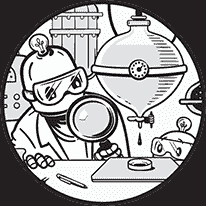
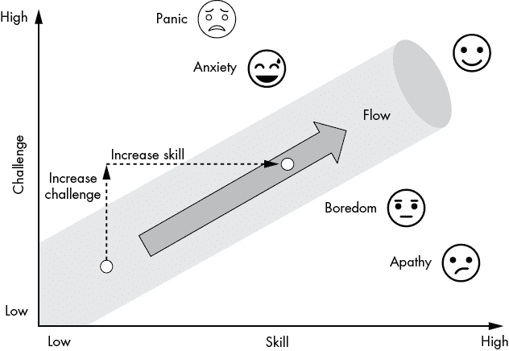

# 心流

> 心流是极致人类表现的源代码。
> 
> —Steven Kotler

在这一章中，你将了解心流的概念，以及如何利用它提升你的编程生产力。许多程序员发现自己身处充满不断干扰、会议和其他分心事物的办公环境中，这使得他们几乎不可能进入纯粹的高效编程状态。为了更深入地理解什么是心流，以及如何在实践中实现它，我们将在本章中探讨许多例子，但一般来说，*心流*是一种纯粹的集中和专注状态——有些人可能称之为“进入状态”。

心流不是一个严格的程序化概念，而是一种可以应用于任何领域中任何任务的状态。在这里，我们将探讨如何达到心流状态，以及它如何对你有益。

## 什么是心流？

心流这一概念由米哈伊·奇克森米哈伊（Mihaly Csikszentmihalyi）普及，他是克莱蒙特研究生大学的心理学和管理学杰出教授，曾任芝加哥大学心理学系主任。1990 年，奇克森米哈伊出版了关于他一生工作的开创性著作，名为*心流*。

但什么是心流呢？我们从心流的主观定义开始，看看它的感觉如何。之后，你将学到一个更具可衡量性的心流定义——作为程序员，你会更喜欢第二个定义！

经历心流就是完全沉浸在手头任务中的状态：专注且集中。你忘记了时间，你进入了状态，超常觉醒。你可能会感受到一种欣喜，仿佛从日常生活的重担中解脱出来。你的内在清晰度提高了，你能清楚地知道接下来该做什么——活动自然而然地从一个接一个地进行。你对完成下一个活动的信心毫不动摇。完成任务本身就是一种奖励，你享受每一秒钟。你的表现和结果飞速提升。

根据由 Csikszentmihalyi 主导的心理学研究，心流状态有六个组成部分。

1.  注意力 你会感到一种深度的专注和完全的集中。

1.  行动 你会产生一种行动偏向，你迅速而高效地推进当前的任务——你的专注意识帮助推动动能。每个动作都为下一个动作提供动力，形成一个成功行动的流动。

1.  自我 你变得不那么意识到自己，关闭了内心的批评、怀疑和恐惧。你少考虑自己（*反思*），更多地专注于手头的任务（*行动*）。你会完全投入到任务中。

1.  控制 即使你变得较少自我意识，你也会享受到一种更强的对当前情境的控制感，这赋予你冷静的自信，并让你跳出框架思考，发展创造性的解决方案。

1.  时间 你失去了体验时间流逝的能力。

1.  奖励 活动的劳动本身就是你想做的；可能没有外部奖励，但沉浸在活动中本身就是内在的奖励。

*心流*和*注意力*这两个术语是密切相关的。在 2013 年关于注意力缺陷多动症（ADHD）的论文中，Rony Sklar 指出，*注意力缺陷*这个术语错误地暗示患者无法集中注意力。心流的另一个术语是*超专注*，大量心理学研究人员（例如，Kaufmann 等，2000 年）已经证明，ADHD 患者完全能够进行超专注；他们只是无法长时间集中注意力于那些没有内在奖励的任务。你不需要被诊断为 ADHD 就知道，专注于你不喜欢做的事情是很困难的。

但是，如果你曾经完全沉浸在玩一款刺激的游戏、编写有趣的应用程序或观看一部有趣的电影中——你就知道，如果你喜欢这项活动，进入心流状态有多么容易。在心流状态下，你的身体会分泌五种*令人愉悦*的神经化学物质，如内啡肽、多巴胺和血清素。这就像体验服用娱乐性药物的“好处”，但没有一些负面后果——甚至 Csikszentmihalyi 也警告过，心流可能会上瘾。学会进入心流状态让你变得更聪明、更高效——如果你能够将这种心流活动引导到像编程这样的高效工作中。

现在，你可能会问：告诉我方法——我该如何进入心流？接下来我们来回答这个问题！

## 如何实现心流

Csikszentmihalyi 提出了实现心流的三个条件：（1）你的目标必须明确，（2）你环境中的反馈机制必须是即时的，（3）机会与能力之间必须保持平衡。

### 明确的目标

如果你在写代码，你必须有一个明确的目标，所有的小动作都应围绕这个目标进行。在心流状态下，每一个动作自然会引导到下一个动作，接着是下一个动作，所以必须有一个最终目标。人们在玩电子游戏时常常会进入心流状态，因为如果你成功完成了小的动作——比如跳过一个移动的障碍物——你最终会成功达成大目标——比如通过关卡。要利用心流加速你的编程效率，你必须有一个明确的项目目标。每一行代码都让你离完成更大的代码项目更近。追踪你写过的代码行数是一种将编程工作游戏化的方法！

### 反馈机制

反馈机制奖励期望的行为，并惩罚不期望的行为。机器学习工程师知道，他们需要一个很好的反馈机制来训练高效的模型。例如，你可以通过奖励机器人每一秒不摔倒，来教它如何走路，并要求它优化以获得最大总奖励。这样，机器人就能自动调整它的行动，以在一段时间内获得最大奖励。我们人类在学习新事物时的行为非常相似。我们寻求来自父母、老师、朋友或导师的认可——甚至来自我们不喜欢的邻居——并调整我们的行为以最大化认可，同时最小化（社交）惩罚。通过这种方式，我们学会了采取特定的行动并避免其他行为。接收反馈对于这种学习方式至关重要。

反馈是心流的前提条件。为了在工作中实现更多的心流，寻求更多的反馈。每周与项目合作伙伴会面，讨论你的代码和项目目标，然后结合伙伴们的反馈。将你的代码发布到 Reddit 或 StackOverflow，并请求反馈。早期并频繁地发布你的 MVP，以便获取用户反馈。寻求编程工作反馈效果显著，即使它带有延迟的满足感，因为它会提高你在完成导致反馈的活动中的参与度。当我发布了 Finxter，我的 Python 学习软件应用程序时，我开始接收到源源不断的用户反馈，我被深深吸引。反馈让我不断回到代码中工作，并在改进应用程序的过程中经历了许多心流状态。

### 平衡机会与能力

心流是一种积极的心理状态。如果任务过于简单，你会感到无聊，失去沉浸感。如果任务过于困难，你会很早就放弃。任务必须具有挑战性，但又不能让人感到压倒性。

图 6-1 展示了可能的心理状态图；该图像取自 Csikszentmihalyi 的原始研究，并进行了重新绘制。

图 6-1：在心流状态下，你会发现挑战既不太难也不太容易，正好符合你当前的技能水平。

横坐标量化你的技能水平，从低到高；纵坐标量化任务的难度，从低到高。所以，举个例子，如果任务对于你的技能水平来说太难，你会感到恐慌；如果任务太简单，你会感到冷漠。但如果任务的难度与你当前的技能相匹配，你就能最大化进入心流的可能性。

诀窍是不断寻求更难的挑战，但不要让自己陷入焦虑状态，并根据挑战增加相应的技能水平。这种学习循环会让你不断提升生产力和技能，并且在同时享受更多的工作乐趣。

## 编程人员流畅状态小贴士

在 2015 年，Owen Schaffer 在他题为《打造有趣的用户体验：一种促进流畅状态的方法》的白皮书中，提出了七个流畅状态的条件：（1）知道该做什么，（2）知道如何做，（3）知道自己做得怎么样，（4）知道该去哪里，（5）寻求挑战，（6）提升技能以应对更高的挑战，（7）从干扰中解脱出来（Human Factors International）。基于这些条件和我自己的考虑，我整理了一些针对编程领域的快速流畅状态技巧和策略。

1.  **总是有一个实际的编程项目在进行中，** 而不是将时间花费在无目的的学习状态中。当新信息与某个你关心的事物产生实际影响时，你能更快地吸收它。我建议将学习时间分配成 70%的时间用于选择并完成一个实际的有趣项目，剩下 30%的时间用来读书、看教程或观看教育课程。我从在 Finxter 社区与成千上万的程序员互动和交流中学到，很多编码学生做反了这个分配，卡在学习的循环中，始终没有准备好投入到真正的项目中。故事总是一样：这些程序员一直困在编程理论中，不断学习却没有实际应用，这让他们更加意识到自己知识的局限性——这是一个负向的螺旋，最终导致停滞不前。解决的办法是设定清晰的项目目标，并无论如何都将项目推进到完成，这也与流畅状态的三个前提条件之一相吻合。

1.  **做一些能实现你目标的有趣项目。** 流畅状态是一种兴奋的状态，所以你必须对你的工作充满兴奋。如果你是一个职业程序员，花时间思考你工作的目的。找到你项目的价值。如果你正在学习编程，真幸运——你可以选择一个令你兴奋的有趣项目！做对你有意义的项目。你会更享受其中，成功的概率也会更高，面对暂时的挫折时也能保持更多的韧性。如果你早上醒来就迫不及待地想投入到项目中，说明流畅状态已经触手可及。

1.  **发挥你的优势。** 这是管理顾问彼得·德鲁克的黄金建议。你在很多领域的弱点总是比强项更多。在大多数活动中，你的技能可能低于平均水平。如果你只关注自己的弱点，实际上是在为失败铺路。相反，应该聚焦于你的优势，在这些优势周围构建大量的技能岛屿，并基本忽略大部分弱点。你独特的擅长是什么？你在计算机科学这个广泛领域里的具体兴趣是什么？列出清单，回答这些问题。最有助于你进步的活动之一就是找出自己的优势，并围绕这些优势强力安排你的日程。

1.  **将你的编码时间安排成大块时间。** 这样你就能有足够的时间来理解面前的问题和任务——每个程序员都知道，加载一个复杂的代码项目到脑海中是需要时间的——并进入任务的节奏。假设艾丽斯和鲍勃共同参与一个代码项目。花费 20 分钟他们就能理解项目的需求，浏览项目，深入几个代码函数，并思考全局。艾丽斯每三天花三个小时工作在项目上，而鲍勃每天花一个小时。谁在项目中会取得更多进展？艾丽斯每天在项目上工作的时间是 53 分钟（[3 小时 – 20 分钟] / 3）。考虑到加载时间的高消耗，鲍勃每天在项目上工作的时间只有 40 分钟。因此，在其他条件相同的情况下，艾丽斯每天将比鲍勃多工作 13 分钟。她有更高的几率进入“心流”状态，因为她能深入问题并完全沉浸其中。

1.  **在“心流”时间内消除干扰。** 这看起来很明显，但有多少人做到了呢！那些能减少干扰的程序员——社交网络、娱乐应用、同事闲聊——比不能的程序员更容易进入心流状态。要取得成功，你必须做大多数人不愿意做的事：关闭干扰。关掉你的智能手机，关闭那个社交媒体标签页。

1.  **做你知道必须做的显而易见的事情，** 这些事情是当下任务之外的：充足的睡眠、健康的饮食和规律的运动。作为程序员，你知道“垃圾进，垃圾出”这个道理：如果你给系统输入糟糕的信息，就会得到糟糕的结果。试着用变质的食材做一顿美味的饭菜——几乎不可能！高质量的输入会带来高质量的输出。

1.  **消耗高质量的信息，** 因为输入越好，输出越好。读编程书籍而不是浅显的博客文章；更好的是，阅读发表在顶级期刊上的研究论文，这是最优质的信息。

## 结论

总结一下，以下是一些你可以尝试获得心流的最简单方法：阻塞较长时间的时间段，专注于一项任务，保持健康和良好的睡眠，设定明确的目标，找到你喜欢做的工作，积极寻求心流。

如果你追求心流，你最终会找到它。如果你每天系统地在心流状态下工作，你的工作效率将提高一个数量级。这是一个简单却强大的概念，适用于程序员和其他知识工作者。正如 Mihaly Csikszentmihalyi 所说：

> 我们生活中最美好的时刻不是那些被动、接收和放松的时光……最美好的时刻通常发生在人们的身体或大脑在自愿努力下，努力完成某个困难且有价值的事情时。

在下一章，你将深入探讨关于*专注做好一件事*的 Unix 哲学，这一原则被证明不仅是创建可扩展操作系统的优秀方法，也是一个很好的生活方式！

## 资源

1.  Troy Erstling, “心流状态的神经化学”，*Troy Erstling*（博客），[`troyerstling.com/the-neurochemistry-of-flow-states/`](https://troyerstling.com/the-neurochemistry-of-flow-states/)。

1.  Steven Kotler, “如何进入心流状态”，拍摄于 A-Fest 牙买加，2019 年 2 月 19 日，Mindvalley 视频，[`youtu.be/XG_hNZ5T4nY/`](https://youtu.be/XG_hNZ5T4nY/)。

1.  F. Massimini, M. Csikszentmihalyi, 和 M. Carli, “最佳体验的监测：精神病康复工具”，*神经与精神疾病杂志* 175, 第 9 期（1987 年 9 月）。

1.  Kevin Rathunde, “蒙特梭利教育与最佳体验：新研究框架”，*NAMTA 期刊* 26, 第 1 期（2001 年 1 月）：11-43。

1.  Owen Schaffer, “*[打造有趣的用户体验：促进心流的方法](http://humanfactors.com/funexperiences.asp)*”，Human Factors International 白皮书（2015），[`humanfactors.com/hfi_new/whitepapers/crafting_fun_ux.asp`](https://humanfactors.com/hfi_new/whitepapers/crafting_fun_ux.asp)。

1.  Rony Sklar, “成人 ADHD 中的超专注：休息与唤醒状态下大脑皮层活动差异的 EEG 研究”（MA 论文，约翰内斯堡大学，2013），[`hdl.handle.net/10210/8640`](https://hdl.handle.net/10210/8640)。
