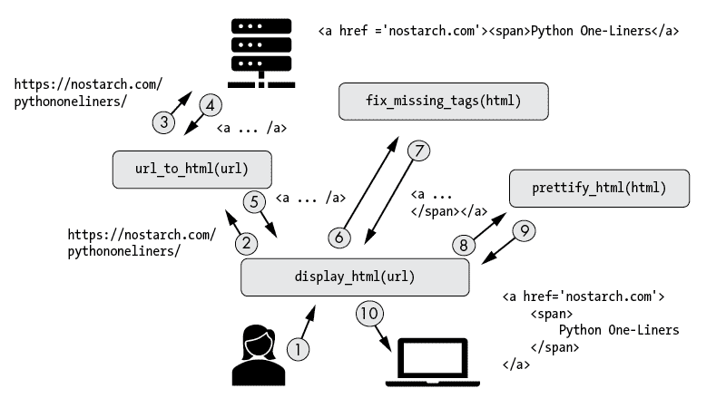
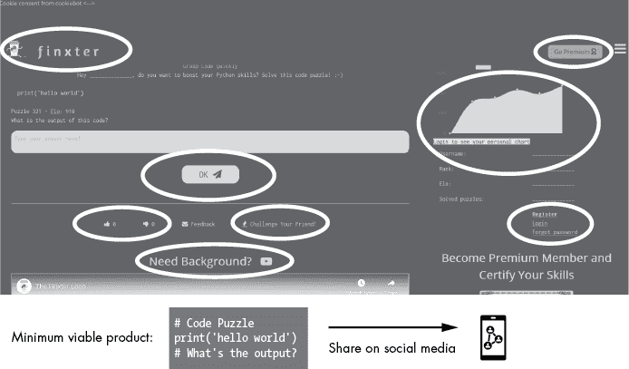
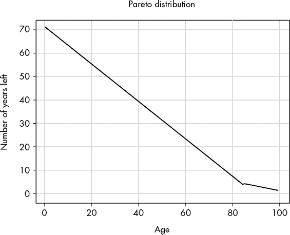
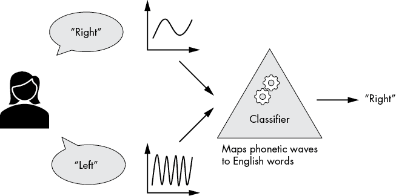

# 第七章：专注做好一件事及其他 Unix 原则

> 这就是 Unix 哲学：编写做一件事并做好它的程序。编写能够协作的程序。编写处理文本流的程序，因为文本流是一种通用接口。
> 
> —Douglas McIlroy


Unix 操作系统的主流哲学很简单：做好一件事。这意味着，举个例子，通常创建一个能够可靠且高效地解决一个问题的函数或模块，比尝试同时解决多个问题更好。在本章稍后，你将看到一些展示“专注做好一件事”的 Python 代码示例，并学习 Unix 哲学如何应用于编程。我还会介绍一些世界上最出色的计算机工程师在创建当今操作系统时所采用的顶级原则。如果你是软件工程师，你将发现一些关于如何在自己项目中编写更好代码的宝贵建议。

但首先：Unix 到底是什么？为什么你应该关心它？

## Unix 的崛起

Unix 是一种设计哲学，启发了今天许多最流行的操作系统，包括 Linux 和 macOS。Unix 操作系统家族出现在 1970 年代末期，当时 Bell Systems 将其技术的源代码公开。此后，许多扩展和新版本由大学、个人和公司开发。

今天，注册商标 Unix 标准认证了操作系统是否符合特定的质量要求。Unix 及类 Unix 操作系统对计算机产生了重大影响。大约 7 成的网络服务器运行的是基于 Unix 的 Linux 系统。今天的大部分超级计算机也都运行 Unix 系统。甚至 macOS 也是一个注册的 Unix 系统。

Linus Torvalds、Ken Thompson、Brian Kernighan——Unix 的开发者和维护者名单中包含了全球一些最具影响力的程序员。你可能会想，必须有一个很好的组织系统，才能让全球的程序员合作构建庞大的 Unix 生态系统，涵盖数百万行代码。确实如此！促成这种规模合作的哲学理念就是 DOTADIW（没错，真的！）——或者说是*专注做好一件事*。关于 Unix 哲学已经有许多书籍被写出来，因此在这里我们将重点关注最相关的思想，并通过 Python 代码片段来展示一些示例。据我所知，迄今为止还没有一本书将 Unix 原则与 Python 编程语言结合在一起讲解。那么，我们开始吧！

## 哲学概述

Unix 哲学的基本理念是构建简单、清晰、简洁、模块化的代码，易于扩展和维护。这可能意味着很多不同的事情——稍后在本章会有更多内容——但目标是通过优先考虑可读性而非效率，偏向组合性而非单体设计，来让多人可以共同在同一个代码库上工作。单体应用程序设计时没有模块化，意味着代码的大片逻辑无法在不访问整个应用程序的情况下被重用、执行或调试。

假设你写了一个程序，它接受一个统一资源定位符（URL），并在命令行上打印该 URL 的 HTML。我们把这个程序叫做`url_to_html()`。根据 Unix 哲学，这个程序应该做好一件事，而这件事就是从 URL 获取 HTML 并将其打印到 shell 中（见清单 7-1）。就这么简单。

```py
import urllib.request

def url_to_html(url):
    html = urllib.request.urlopen(url).read()
    return html
```

清单 7-1：一个简单的代码函数，它读取给定 URL 的 HTML 并返回字符串

这就是你所需要的。不要添加更多功能，比如过滤掉标签或修复错误。例如，你可能会有冲动添加代码来修复用户可能犯的常见错误，比如忘记关闭标签，比如一个`<span>`标签没有用`</span>`关闭，如这里所示：

```py
<a href='nostarch.com'>**<span>**Python One-Liners</a>
```

根据 Unix 哲学，即使你发现了这些类型的错误，你也不应该在这个特定的函数中修复它们。

另一个诱惑是为这个简单的 HTML 函数自动修复格式。例如，下面的 HTML 代码看起来并不漂亮：

```py
<a href='nostarch.com'><span>Python One-Liners</span></a>
```

你可能更喜欢这种代码格式：

```py
<a href='nostarch.com'>
    <span>
        Python One-Liners
    </span>
</a>
```

然而，你的函数名称是`url_to_html()`，而不是`prettify_html()`。添加像代码美化这样的功能，会增加第二个功能，而这个功能可能并不是某些用户所需要的。

相反，你会被鼓励创建另一个名为`prettify_html(url)`的函数，它的“唯一目标”是修复 HTML 的样式问题。这个函数可以内部使用`url_to_html()`函数来获取 HTML，然后再进行进一步处理。

通过让每个函数只专注于一个目标，你可以提高代码的可维护性和可扩展性。一个程序的输出是另一个程序的输入。你减少了复杂性，避免了输出中的杂乱无章，并专注于将一件事做到最好。

尽管单个子程序看起来可能很小，甚至微不足道，但你可以将这些子程序组合起来，创建更复杂的程序，同时保持它们易于调试。

## 15 个有用的 Unix 原则

接下来我们将深入探讨 15 个与今天最相关的 Unix 原则，并在可能的情况下用 Python 示例加以实现。我已经从 Unix 编码专家 Eric Raymond 和 Mike Gancarz 那里整理了这些原则，并将其调整为现代 Python 编程的要求。你会发现这些原则中的许多都与本书中的其他原则相符或有重叠。

### 1. 让每个函数专注于做好一件事

Unix 哲学的基本原则是*做一件事并做好它*。让我们看看这在代码中是如何表现的。在清单 7-2 中，你实现了一个函数`display_html()`，它接受一个 URL 字符串并显示该 URL 上的美化 HTML。

```py
import urllib.request
import re

def url_to_html(url):
    html = urllib.request.urlopen(url).read()
    return html

def prettify_html(html):
    return re.sub('<\s+', '<', html)

def fix_missing_tags(html):
    if not re.match('<!DOCTYPE html>', html):
        html = '<!DOCTYPE html>\n' + html
    return html

def display_html(url):
    html = url_to_html(url)
    fixed_html = fix_missing_tags(html)
    prettified_html = prettify_html(fixed_html)
    return prettified_html
```

清单 7-2：让每个函数或程序做一件事，并做好它。

这段代码在图 7-1 中有所展示。



图 7-1：多个简单函数概览——每个函数都做一件事，但做得很好——共同协作完成更大的任务

这段代码提供了一个示例实现，执行以下步骤：

1.  从给定的 URL 位置获取 HTML。

1.  修复一些缺失的标签。

1.  美化 HTML。

1.  返回结果给函数调用者。

如果你用一个指向不太美观的 HTML 代码`'< a href="https://finxter.com">Solve next Puzzle</a>'`的 URL 运行代码，函数`display_html`会通过协调小型代码函数的输入输出，修复格式不正确（且错误的）HTML，因为每个小函数都只做它自己擅长的事。

你可以用这一行打印主函数的结果：

```py
print(display_html('https://finxter.com'))
```

这段代码会将 HTML 代码打印到你的 shell 中，同时新标签已添加，且多余的空格被移除：

```py
<!DOCTYPE html>
<a href="https://finxter.com">Solve next Puzzle</a>
```

想象这个程序就像终端中的浏览器。Alice 调用函数`display_html(url)`，它接收 URL 并将其传递给另一个函数`url_to_html(url)`，该函数从给定的 URL 位置获取 HTML。这样就不需要实现重复的功能。幸运的是，`url_to_html()`函数的编写者保持了该函数的简洁性，因此你可以直接使用它返回的 HTML 输出作为`fix_missing_tags(html)`函数的输入。在 Unix 中，这叫做*管道*：一个程序的输出作为另一个程序的输入传递。`fix_missing_tags()`的返回值是修复后的 HTML 代码，补充了原始 HTML 中缺失的`</span>`闭合标签。然后你把输出传递给`prettify_html(html)`函数，等待结果：经过缩进修正后的 HTML 代码，让它更具用户友好性。只有在此之后，`display_html(url)`函数才会将美化和修复后的 HTML 代码返回给 Alice。你会发现，一系列的小函数通过连接和管道组合起来，能够完成相当大的任务！

在你的项目中，你可以实现另一个函数，该函数不美化 HTML，而仅仅添加`<!DOCTYPE html>`标签。然后你可以实现第三个函数，它美化 HTML 但不添加新标签。通过保持函数简洁，你可以基于现有功能轻松创建新的代码，而且不会有太多冗余。代码的模块化设计使得它具备了可重用性、可维护性和可扩展性。

将此版本与可能的单一实现进行比较，在后者中，`display_html(url)`函数必须自己完成所有那些小任务。你无法部分重用某些功能，比如从 URL 获取 HTML 代码或修复 HTML 代码。如果你使用一个单一的代码函数来做所有的事情，它会像这样：

```py
def display_html(url):
    html = urllib.request.urlopen(url).read()
    if not re.match('<!DOCTYPE html>', html):
        html = '<!DOCTYPE html>\n' + html
    html = re.sub('<\s+', '<', html)
    return html
```

这个函数现在更复杂了：它处理多个任务，而不是专注于一个任务。更糟糕的是，如果你没有去掉打开标签 `'<'` 后的空格，且实现了同一函数的多个变种，你就必须复制并粘贴其余的代码行。这会导致代码冗余和可读性下降。你添加的功能越多，问题就会越严重！

### 2\. 简单优于复杂

*简单优于复杂* 是本书的核心原则。你已经在许多不同的地方见过它——我强调这一点是因为，如果你不果断地简化，你就会滋生复杂性。在 Python 中，*简单优于复杂* 甚至进入了非官方的规则书。如果你打开 Python 的 shell 并输入 `import this`，你将获得著名的 *Python 之禅*（见 Listing 7-3）。

```py
> import this
The Zen of Python, by Tim Peters

Beautiful is better than ugly.
Explicit is better than implicit.
**Simple is better than complex.**
Complex is better than complicated.
Flat is better than nested.
Sparse is better than dense.
Readability counts.
Special cases aren't special enough to break the rules.
Although practicality beats purity.
Errors should never pass silently.
Unless explicitly silenced.
In the face of ambiguity, refuse the temptation to guess.
There should be one-- and preferably only one --obvious way to do it.
Although that way may not be obvious at first unless you're Dutch.
Now is better than never.
Although never is often better than *right* now.
If the implementation is hard to explain, it's a bad idea.
If the implementation is easy to explain, it may be a good idea.
Namespaces are one honking great idea -- let's do more of those!
```

Listing 7-3: Python 之禅

既然我们已经详细讨论过简单的概念，我这里就不再赘述。如果你仍然想知道*为什么*简单优于复杂，请回到第一章，了解高复杂性带来的负面生产力效应。

### 3\. 小而美

与其编写庞大的代码块，不如编写小函数并像一个架构师一样调度这些函数之间的交互，如 Figure 7-1 所示。保持程序小型化有三个主要原因：

**降低复杂性。**

1.  随着代码行数的增加，代码变得更难理解。这是一个认知事实：大脑一次只能处理有限的信息块。信息块过多会让你难以看清全貌。通过将代码做得更小，减少函数中的代码行数，你可以*提高可读性*，并减少向代码库中引入错误的可能性。

**提高可维护性。**

1.  将代码拆分成许多小的功能块使得代码更容易维护。增加更多小函数不太可能产生副作用，而在一个庞大的、单一的代码块中，你所做的任何改动都可能轻易产生意外的全局效应，尤其是在多个程序员同时工作时。

**提高可测试性。**

1.  许多现代软件公司采用*测试驱动开发*，该方法通过使用单元测试来对每个函数和单元的输入进行压力测试，并将输出与预期结果进行比较。这使得你能够找到并隔离错误。单元测试在小规模代码中更为有效且更容易实现，因为每个函数只专注于一件事，所以你能清楚知道预期的结果是什么。

Python 本身，而不是 Python 中的某个小型代码示例，正是这一原则的最佳例子。任何大师级程序员都会使用他人的代码来提升自己的编码生产力。数百万开发者花费了无数小时优化代码，而你可以在一瞬间将这些代码导入到自己的项目中。像大多数其他编程语言一样，Python 通过库提供这种功能。许多不常用的库不会随默认实现一起提供，需要显式安装。通过不将所有库作为内建功能提供，Python 安装在你的电脑上依然保持相对小巧，但不牺牲外部库的潜力。此外，这些库本身也很小——每个库都专注于一个有限的功能子集。与其拥有一个解决所有问题的庞大库，我们更倾向于拥有多个小型库，每个库负责解决一小部分问题。小即是美。

每隔几年，新的架构模式就会出现，承诺将大型单体应用拆分成优雅的小型应用，以便扩展软件开发周期。近期的例子有通用对象请求代理架构（CORBA）、面向服务的架构（SOA）和微服务。它们的思路是将一个大型的软件模块拆分为一系列独立可部署的组件，然后多个程序可以访问这些组件，而不仅仅是一个程序。希望通过相互共享和构建各自的微服务，来加速软件开发领域的整体进展。

这些趋势背后的根本驱动力是编写模块化和可重用代码的理念。通过学习本章中提出的思想，你已经为快速而深刻地理解这些趋势以及未来的趋势做好了准备，并且这些趋势也朝着模块化的方向发展。从一开始就应用正确的原则，能够让你始终走在前沿。

### 4\. 尽早构建原型

Unix 团队是我们在第三章讨论的原则——*构建 MVP*——的热衷支持者。这能帮助你避免陷入完美主义的循环，不断添加功能，毫无必要地成倍增加复杂性。如果你从事的是像操作系统这样的庞大软件应用，你就无法承受复杂性的增加！

图 7-2 展示了一个早期应用启动的例子，充满了不必要的功能，完全违背了 MVP 原则。



图 7-2：Finxter.com 应用与 Finxter MVP 对比

这个应用程序具有如交互式解题检查、拼图投票、用户统计、用户管理、付费功能以及相关视频等特点，同时也有一些简单功能，如标志。这些在产品初次发布时都是不必要的。事实上，Finxter 应用的 MVP（最简可行产品）应该仅仅是一个简单的代码拼图图像，分享在社交媒体上。这足以验证用户需求的假设，而不需要花费多年时间来构建应用程序。*早失败，常失败，向前失败。*

### 5. 优先选择可移植性而非效率

*可移植性*是指一个系统或程序可以从一个环境迁移到另一个环境，并且仍然能够正常工作。软件的一个主要优势是它的可移植性：你可以在自己的电脑上编写程序，数百万用户也可以在他们的电脑上运行相同的程序，而无需进行任何适配。

然而，可移植性是以效率为代价的。这种*可移植性/效率权衡*在技术文献中有很多讨论：通过将软件量身定制为单一环境，可以实现更高的效率，但这会牺牲可移植性。*虚拟化*就是这种权衡的一个典型例子：通过在软件和运行该软件的底层基础设施之间添加一层额外的软件，程序几乎可以在任何*物理机器*上运行。此外，虚拟机还可以将当前执行状态从一台物理机器传输到另一台。这提高了软件的可移植性。然而，虚拟化所需的附加层会降低运行时和内存效率，因为它在程序和物理机器之间增加了中介开销。

Unix 哲学提倡优先选择可移植性而非效率；这一点是合理的，因为操作系统被如此多的用户使用。

但是，倾向于可移植性的经验法则同样适用于更广泛的软件开发者群体。降低可移植性意味着降低了你应用程序的价值。如今，极大提高可移植性已经变得很常见——即使是以牺牲效率为代价。基于网页的应用程序预期能够在任何有浏览器的计算机上运行，无论是 macOS、Windows 还是 Linux。网页应用程序还越来越注重无障碍功能，例如为视力障碍者提供便利，尽管托管一个能够促进无障碍访问的网站可能效率较低。许多资源比计算周期更有价值：人类的生命、人类的时间以及计算机所带来的其他二级后果。

那么，除了这些一般性考虑外，为可移植性编程意味着什么呢？在列表 7-4 中，我们创建了一个计算指定参数平均值的函数——按照我们编写的方式，它并没有为可移植性进行优化。

```py
import numpy as np

def calculate_average_age(*args):
    a = np.array(args)
    return np.average(a)

print(calculate_average_age(19, 20, 21))
# 20.0
```

列表 7-4：平均值函数，不是最大化可移植性

这段代码因两点原因而不可移植。首先，函数名`calculate_average_age()`不够通用，无法在任何其他上下文中使用，尽管它只是计算一个平均值。例如，你可能不会想到使用它来计算网站访问者的平均人数。其次，它不必要地使用了一个库，因为你完全可以在不依赖任何外部库的情况下轻松计算平均值（参见 Listing 7-5）。通常使用库是个好主意，但前提是它们能带来实际价值。在这种情况下，添加一个库反而降低了可移植性，因为用户可能没有安装这个库；此外，效率的提升几乎为零。

在 Listing 7-5 中，我们重新创建了具有更高可移植性的函数。

```py
def average(*args):
    return sum(args) / len(args)

print(average(19, 20, 21))
# 20.0
```

Listing 7-5：平均函数，可移植

我们将函数重命名为更通用的名称，并去除了不必要的导入。现在，你不必担心这个库会被弃用，并且可以将相同的代码移植到其他项目中。

### 6\. 将数据存储在平面文本文件中

Unix 哲学提倡使用*平面文本文件*来存储数据。平面文本文件是简单的文本或二进制文件，没有高级机制来访问文件内容——与例如数据库社区使用的许多更高效但更复杂的文件格式不同。这些是简单的、可供人类阅读的数据文件。常见的逗号分隔值（CSV）格式就是平面文件格式的一个例子，其中每一行都对应一个数据条目（参见 Listing 7-6），而且任何不熟悉这些数据的人，通过查看这些文件也能获得一些基本理解。

```py
Property Number,Date,Brand,Model,Color,Stolen,Stolen From,Status,Incident number,Agency
P13827,01/06/2016,HI POINT,9MM,BLK,Stolen Locally,Vehicle,Recovered Locally,B16-00694,BPD
P14174,01/15/2016,JENNINGS J22,,COM,Stolen Locally,Residence,Not Recovered,B16-01892,BPD
P14377,01/24/2016,CENTURY ARMS,M92,,Stolen Locally,Residence,Recovered Locally,B16-03125,BPD
P14707,02/08/2016,TAURUS,PT740 SLIM,,Stolen Locally,Residence,Not Recovered,B16-05095,BPD
P15042,02/23/2016,HIGHPOINT,CARBINE,,Stolen Locally,Residence,Recovered Locally,B16-06990,BPD
P15043,02/23/2016,RUGAR,,,Stolen Locally,Residence,Recovered Locally,B16-06990,BPD
P15556,03/18/2016,HENRY ARMS,.17 CALIBRE,,Stolen Locally,Residence,Recovered Locally,B16-08308,BPD
```

Listing 7-6：来自[Data.gov](https://catalog.data.gov/dataset/stolen-gun)的被盗枪支数据，采用平面文件格式（CSV）提供

你可以轻松地共享平面文本文件，在任何文本编辑器中打开并手动修改它们。然而，这种便利性是以效率为代价的：为特定用途定制的数据格式可以更高效地存储和读取数据。例如，数据库使用自己在磁盘上的数据文件，并利用优化手段，如详细的索引和压缩方案来表示数据。如果你打开这些文件，你根本不会理解它们的内容。这些优化使得程序能够以比一般平面文本文件更少的内存消耗和更低的开销读取数据。在平面文件中，系统必须扫描整个文件才能读取特定的行。Web 应用程序也需要一种更高效的优化数据表示方式，以便允许用户快速访问并减少延迟，因此它们很少使用平面表示法和数据库。

然而，你应该仅在确认需要时才使用优化的数据表示——例如，如果你创建的是一个对性能要求极高的应用，如 Google 搜索引擎，它能够在毫秒级别找到与用户查询最相关的网页文档！对于许多较小的应用，例如从具有 10,000 条记录的现实世界数据集训练机器学习模型，推荐使用 CSV 格式来存储数据。使用具有专用格式的数据库会减少移植性并增加不必要的复杂性。

列表 7-7 给出了一个在平面格式更为优越的情况下的示例。它使用 Python，这是一种在数据科学和机器学习应用中最受欢迎的编程语言之一。在这里，我们希望对一个人脸图像数据集执行数据分析任务，因此我们从一个平面 CSV 文件加载数据并进行处理，选择便于移植的方式，而非使用数据库的更高效方式。

```py
From sklearn.datasets import fetch_olivetti_faces
From numpy.random import RandomState

rng = RandomState(0)

# Load faces data
faces, _ = fetch_olivetti_faces(...)
```

列表 7-7：从平面文件加载数据进行 Python 数据分析任务

在函数`fetch_olivetti_faces`中，我们加载了 scikit-learn 的*Olivetti faces*数据集，该数据集包含一组人脸图像。加载函数仅仅是读取这些数据并将其加载到内存中，然后再开始实际的计算。无需数据库或层级数据结构。该程序是自包含的，无需安装数据库或设置复杂的数据库连接。

### 7\. 利用软件杠杆获得优势

使用*杠杆*意味着用少量的精力来放大你努力的效果。例如，在金融领域，杠杆意味着使用他人的资金进行投资和增长。在大型公司中，它可能意味着利用广泛的分销网络将产品放置到全球的商店中。作为程序员，你应该利用前人编程者的集体智慧：使用库来实现复杂功能，而不是从头编写代码；使用 StackOverflow 和群体智慧来修复代码中的 bug；或者请其他程序员审查你的代码。这些都是杠杆的形式，可以让你用更少的努力完成更多的事情。

第二种杠杆来源是计算能力。计算机可以比人类更快地执行工作（且成本更低）。创造更好的软件，与更多的人分享，利用更多的计算能力，并更加频繁地使用他人的库和软件。优秀的程序员能够快速编写出优质的源代码，而伟大的程序员则能够利用众多可用的杠杆来源来提升他们的代码。

作为示例，列表 7-8 展示了我书中《*Python One-Liners*》（No Starch Press，2020）中的一个单行程序，它可以抓取给定的 HTML 文档，找到所有包含子字符串 `'finxter'` 并且同时包含 `'test'` 或 `'puzzle'` 的 URL。

```py
## Dependencies
import re

## Data
page = '''
<!DOCTYPE html>
<html>
<body>

<h1>My Programming Links</h1>
<a href="https://app.finxter.com/">test your Python skills</a>
<a href="https://blog.finxter.com/recursion/">Learn recursion</a>
<a href="https://nostarch.com/">Great books from NoStarchPress</a>
<a href="http://finxter.com/">Solve more Python puzzles</a>

</body>
</html>
'''

## One-Liner
practice_tests = re.findall("(<a.*?finxter.*?(test|puzzle).*?>)", page)

## Result
print(practice_tests)
# [('<a href="https://app.finxter.com/ ">test your Python skills</a>', 'test'),
#  ('<a href="http://finxter.com/">Solve more Python puzzles</a>', 'puzzle')]
```

列表 7-8：分析网页链接的单行代码解决方案

通过导入`re`库，我们利用了正则表达式的强大技术，瞬间将成千上万行代码转化为可用代码，并让我们用一行代码编写整个程序。杠杆效应是你成为一名优秀程序员的重要伙伴。例如，使用代码库而不是自己从头实现一切，就像用应用程序来规划你的旅行，而不是通过纸质地图来逐步确定每一个细节。

### 8. 避免使用封闭式用户界面

*封闭式用户界面*是指要求用户在继续执行程序主流程之前必须与程序交互的界面。典型的例子包括小程序如 Secure Shell (SSH)、`top`、`cat` 和 `vim`，以及编程语言中的功能如 Python 的`input()`函数。封闭式用户界面限制了代码的可用性，因为它们只能在人类的参与下运行。然而，通常封闭式用户界面背后的代码功能对于需要无需人工交互就能运行的自动化程序也很有用。大致来说，如果你把优秀的代码放在封闭式用户界面后面，那么没有用户交互是无法访问的！

比如，你创建了一个简单的寿命预测计算器，它接收用户的年龄作为输入，并根据简单的启发式方法返回预期的剩余寿命。

“如果你不到 85 岁，寿命预测为 72 减去你年龄的 80%。否则，寿命预测为 22 减去你年龄的 20%。”

你最初的 Python 代码可能类似于清单 7-9。

```py
def your_life_expectancy():
    age = int(input('how old are you? '))

    if age<85:
        exp_years = 72 - 0.8 * age
    else:
        exp_years = 22 - 0.2 * age

    print(f'People your age have on average {exp_years} years left - use them wisely!')

your_life_expectancy()
```

清单 7-9：寿命预测计算器——一个简单的启发式方法——作为封闭式用户界面实现

以下是清单 7-9 中的一些代码执行示例。

```py
> how old are you? 10
People your age have on average 64.0 years left - use them wisely!
> how old are you? 20
People your age have on average 56.0 years left - use them wisely!
> how old are you? 77
People your age have on average 10.399999999999999 years left - use them wisely!
```

如果你想自己试试，我已经在 Jupyter notebook 中分享了该程序，链接在这里：[`blog.finxter.com/clean-code/#Life_Expectancy_Calculator/`](https://blog.finxter.com/clean-code/#Life_Expectancy_Calculator/)。不过，请不要太认真对待它！

在清单 7-9 中，我们使用了 Python 的`input()`函数，它会阻塞程序的执行，直到接收到用户输入。在没有用户输入的情况下，代码什么也不做。这个封闭式用户界面限制了代码的可用性。如果你想计算从 1 到 100 每个年龄的寿命预测并绘制图表，你必须手动输入 100 个不同的年龄，并将结果存储在单独的文件中。然后，你必须复制并粘贴结果到一个新的脚本中来绘制它们。现在的功能实际上做了两件事：处理用户输入并计算寿命预测，这也违反了 Unix 的第一个原则：每个函数只做一件事并做得好。

为了使代码符合这个原则，我们将用户界面与功能性分离，这通常是提升代码质量的好方法（见清单 7-10）。

```py
# Functionality
def your_life_expectancy(age):
    if age<85:
        return 72 - 0.8 * age
    return 22 - 0.2 * age

# User Interface
age = int(input('how old are you? '))

# Combine user input with functionality and print result
exp_years = your_life_expectancy(age)
print(f'People your age have on average {exp_years} years left - use them wisely!')
```

清单 7-10：寿命预测计算器——一个简单的启发式方法——没有封闭式用户界面

列表 7-10 中的代码在功能上与列表 7-9 完全相同，但有一个显著的优势：我们可以在各种场景下使用这个新函数，甚至是初始开发者未曾预料到的情况。在列表 7-11 中，我们使用该函数计算 0 到 99 岁之间的预期寿命，并绘制结果；注意到去除用户输入界面带来的可移植性。

```py
import matplotlib.pyplot as plt

def your_life_expectancy(age):
    '''Returns the expected remaining number of years.'''
    if age<85:
 return 72 - 0.8 * age
    return 22 - 0.2 * age

# Plot for first 100 years
plt.plot(range(100), [your_life_expectancy(i) for i in range(100)])

# Style plot
plt.xlabel('Age')
plt.ylabel('No. Years Left')
plt.grid()

# Show and save plot
plt.savefig('age_plot.jpg')
plt.savefig('age_plot.pdf')
plt.show()
```

列表 7-11：计算 0-99 岁预期寿命并绘制图表的代码

图 7-3 展示了最终的图表。



图 7-3：启发式方法如何处理 0-99 岁输入

好的，任何启发式方法本质上都是粗糙的——但这里的重点是，避免使用限制性的用户界面帮助我们将代码付诸实践，绘制出这个图表。如果我们没有遵循这个原则，我们就无法复用原始代码函数`your_life_expectancy`，因为限制性用户界面要求每年（0 到 99 岁）都要有用户输入。通过遵循这一原则，我们简化了代码，并为未来的所有程序打开了使用和扩展这个启发式方法的可能性。我们没有针对某一个特定的用例进行优化，而是将代码编写得更加通用，能够被数百个不同的应用程序使用。为什么不把它做成一个库呢？

### 9\. 使每个程序都成为一个过滤器

可以提出一个合理的观点，即每个程序本身已经是一个过滤器。过滤器使用特定的过滤机制将输入转化为输出。这使得我们可以通过将一个程序的输出作为另一个程序的输入，轻松地将多个程序串联起来，从而大大提高代码的可重用性。例如，通常来说，在函数内部打印计算结果并不是一个好的做法——而是建议程序返回一个字符串，之后可以打印出来、写入文件或用作另一个程序的输入。

例如，一个排序列表的程序可以被视为一个过滤器，它将未排序的元素过滤成排序后的顺序，正如列表 7-12 所示。

```py
def insert_sort(lst):

    # Check if the list is empty
    if not lst:
        return []

    # Start with sorted 1-element list
    new = [lst[0]]

    # Insert each remaining element
    for x in lst[1:]:
        i = 0
        while i<len(new) and x>new[i]:
            i = i + 1
        new.insert(i, x)

    return new

print(insert_sort([42, 11, 44, 33, 1]))
print(insert_sort([0, 0, 0, 1]))
print(insert_sort([4, 3, 2, 1]))
```

列表 7-12：这个插入排序算法将一个未排序的列表过滤成一个已排序的列表。

该算法创建一个新列表，并将每个元素插入到所有左侧元素都小于该插入元素的位置。此函数使用复杂的过滤机制来改变元素的顺序，将输入列表转换为排序后的输出列表。

如果任何程序本身已经是一个过滤器，你应该通过直观的输入/输出映射将其设计为一个过滤器。接下来，我将为你解释这个概念。

过滤器的黄金标准是*同质*的输入/输出映射，其中一种类型的输入映射到相同类型的输出。例如，如果有人用英语和你交谈，他们期望你用英语回应，而不是用另一种语言。类似地，如果一个函数接受一个输入参数，期望的输出是函数的返回值。如果一个程序从文件中读取，期望的输出是一个文件。如果一个程序从标准输入中读取，它应该把程序输出到标准输出。你明白了吧：设计一个过滤器的最直观方法就是保持数据在相同的类别中。

示例 7-13 展示了一个负面例子，使用*异质*输入/输出映射，在这个例子中，我们构建了一个`average()`函数，将输入参数转换为它们的平均值——但它没有返回平均值，而是将结果打印到终端。

```py
def average(*args):
    print(sum(args)/len(args))

average(1, 2, 3)
# 2.0
```

示例 7-13：异质输入/输出映射的负面例子

更好的方法，如示例 7-14 所示，是让函数`average()`返回平均值（同质输入/输出映射），然后你可以在另一个函数调用中使用`print()`函数将其打印到标准输出。这更好，因为它允许你将输出写入文件而不是打印，或者甚至将其作为另一个函数的输入。

```py
def average(*args):
    return sum(args)/len(args)

avg = average(1, 2, 3)
print(avg)
# 2.0
```

示例 7-14：同质输入/输出映射的正面例子

当然，一些程序会从一种类别过滤到另一种类别——例如，将文件写入标准输出，或者将英语翻译成西班牙语。但遵循编写只做一件事且做得好的程序的原则（参见 Unix 原则 1），这些程序不应做任何其他事情。这就是编写直观且自然的程序的黄金标准——将它们设计为过滤器！

### 10\. 更差的就是更好的

这一原则表明，在实际开发中，功能较少的代码往往是更好的方法。当资源有限时，发布一个较差的产品并率先进入市场，往往比在发布之前不断改进它要好。这一原则由列表处理（LISP）开发者理查德·加布里埃尔（Richard Gabriel）在八十年代末提出，类似于第三章中的 MVP 原则。不要过于字面地理解这一反直觉的原则。从质量角度来看，较差并不意味着更好。如果你拥有无限的时间和资源，最好总是使程序完美。然而，在有限资源的世界里，发布一个较差的版本通常更有效。例如，一个粗糙而直接的问题解决方案可以让你占据先发优势，吸引早期采用者的快速反馈，并在软件开发过程中早期获得动力和关注。许多从业者认为，后发者必须投入更多的精力和资源，才能创造出远超前者的产品，吸引用户。

### 11\. 清晰的代码优于聪明的代码

我稍微修改了 Unix 哲学中的原始原则，*清晰胜于巧妙*，首先将这个原则专注于编程代码，其次将其与您已经学到的原则对齐：如何*编写简洁的代码*（参见第四章）。

这个原则强调了简洁和巧妙代码之间的权衡：巧妙的代码不应以简洁为代价。

例如，看看清单 7-15 中的简单冒泡排序算法。冒泡排序算法通过迭代遍历列表并交换任何未排序的相邻元素的位置来对列表进行排序：较小的元素移到左边，较大的元素移到右边。每当发生这种交换时，列表就会变得更加有序。

```py
def bubblesort(l):
    for boundary in range(len(l)-1, 0, -1):
        for i in range(boundary):
            if l[i] > l[i+1]:
                l[i], l[i+1] = l[i+1], l[i]
    return l

l = [5, 3, 4, 1, 2, 0]
print(bubblesort(l))
# [0, 1, 2, 3, 4, 5]
```

清单 7-15：Python 中的冒泡排序算法

清单 7-15 中的算法可读性高，清晰明了，达到了目标，并且没有包含不必要的代码。

现在，假设你聪明的同事辩称，你可以通过使用*条件赋值*来缩短代码，用一行更少的代码来表达`if`语句（参见清单 7-16）。

```py
def bubblesort_clever(l):
    for boundary in range(len(l)-1, 0, -1):
        for i in range(boundary):
            l[i], l[i+1] = (l[i+1], l[i]) if l[i] > l[i+1] else (l[i], l[i+1])            
    return l    

print(bubblesort_clever(l))
# [0, 1, 2, 3, 4, 5]
```

清单 7-16：“聪明的”Python 冒泡排序算法

这个技巧并没有改善代码，反而降低了可读性和清晰度。条件赋值特性可能很聪明，但使用它们是以表达想法时不够简洁的代价为前提的。想了解更多如何编写简洁代码的技巧，请参考第四章。

### 12. 设计程序以与其他程序连接

你的程序并非孤立存在。程序被调用来执行任务，无论是由人类还是由其他程序。因此，你需要设计 API 以便与外部世界——用户或其他程序——进行交互。通过遵循 Unix 原则 9，*让任何程序都成为过滤器*，即确保输入/输出映射直观易懂，你已经在设计可以连接的程序，而不是让它们孤立存在。伟大的程序员既是架构师，也是工匠。他们创造的新程序是旧功能和新功能以及其他人程序的独特组合。因此，接口能够成为开发周期的核心。

### 13. 使你的代码健壮

如果一个代码库是*健壮*的，它就不容易被破坏。代码健壮性有两种视角：程序员的视角和用户的视角。

作为程序员，你可能会通过修改代码而破坏它。因此，代码库*对变更具有稳健性*，即使是一个粗心的程序员也可以在不轻易破坏功能的情况下对代码库进行工作。假设你有一个大的单体代码块，并且你组织中的每个程序员都对这个代码块具有*编辑权限*。任何小的修改都可能破坏整个系统。现在，拿这个和像 Netflix 或 Google 这样的公司开发的代码进行比较，在这些公司，每个更改都必须经过多个审批级别才能部署到实际环境中；更改会经过充分的测试，因此部署的代码能有效防止破坏性更改。通过增加保护层，Google 和 Netflix 使他们的代码比脆弱的单体代码库更加稳健。

确保代码库的稳健性的一种方法是控制访问权限，以便个别开发人员在未经至少一个额外人员验证的情况下，不能修改应用程序，确保修改更可能为代码增加价值而不是造成破坏。这个过程可能会以较低的敏捷性为代价，但如果你不是一个单人创业公司，这个代价是值得支付的。我们在本书中已经看到了确保代码稳健性的其他方法：简洁即美，创建做一件事做得很好的函数，使用测试驱动开发，保持简单。还有一些其他容易应用的技术如下：

+   使用像 Git 这样的版本控制系统，以便你可以恢复代码的先前版本。

+   定期备份你的应用程序数据，使其可恢复（数据不属于版本控制系统的范畴）。

+   使用分布式系统来避免单点故障：将你的应用程序运行在多台机器上，以降低单台机器故障对应用程序的负面影响。假设一台机器的故障概率是每天 1%，它大约每 100 天就会故障。创建一个由五台独立故障的机器组成的分布式系统，可以理论上将故障概率降低到 0.01⁵ × 100% = 0.00000001%。

对于用户而言，如果你不能通过提供有缺陷甚至恶意的输入轻易破坏一个应用程序，那么这个应用程序是稳健的。假设你的用户像一群猩猩一样乱按键盘，提交随机的字符序列，并且那些技术高超的黑客比你更了解应用程序，准备利用任何即便是最小的安全问题。你的应用程序必须能够抵御这两类用户。

对于前一类错误，防范相对简单。单元测试是一个强有力的工具：测试任何函数，针对你能想到的任何函数输入，特别是边界情况。例如，如果你的函数接受一个整数并计算平方根，检查它是否能处理负数输入和 0，因为未处理的异常会破坏可靠、简单、可链式的程序链条。然而，未处理的异常会引发另一个更微妙的问题，安全专家和本书技术编辑 Noah Spahn 提醒了我这一点：提供输入来破坏程序可能会为攻击者提供进入宿主操作系统的立足点。因此，检查你的程序处理各种输入的能力，从而使你的代码更健壮！

### 14\. 修复你能修复的错误——但要尽早且大声地失败

虽然你应该尽可能修复代码中的问题，但你不应隐藏无法修复的错误。隐藏的错误会迅速积累，长时间隐藏后会变得越来越严重。

错误可能会积累。例如，假设你在驾驶辅助应用中的语音识别系统接收了错误的训练数据，将两个完全不同的语音波形错误地分类为同一个单词（参见图 7-4）。于是你的代码在试图将这两种完全不同的语音波形映射到同一个英文单词时抛出错误（例如，当你尝试将这种矛盾信息存储到一个将英语术语映射到语音波形的倒排索引中时，错误可能就会发生）。你可以通过两种方式编写代码：隐藏错误或将错误传播给应用程序、用户或程序员。虽然许多程序员直觉上希望通过隐藏错误来提高可用性，但这并不是最明智的方法。错误信息应该包含有用的信息。如果你的代码能让你及早意识到这个问题，你可以提前找到解决方案。你最好在错误的后果积累并摧毁数百万美元甚至人命之前，尽早意识到这些错误。



图 7-4：训练阶段的分类器将两种不同的语音波形映射到相同的英文单词上。

与其埋藏无法修复的错误，宁可抛出错误并交给用户处理，即便用户可能不会欣赏错误信息，且你的应用程序的可用性因此下降。另一种做法是将错误埋藏起来，直到它们变得无法处理。

继续我们错误训练数据的例子，示例 7-17 展示了一个例子，其中 Python 的 `classify()` 函数接受一个输入参数——需要分类的波形——并返回与该分类相关的英文单词。假设你已经实现了一个 `duplicate_check(wave, word)` 函数，用来检查数据库中是否存在与某个波形相似的波形，且它们返回相同的分类结果（`wave` 和 `word` 配对）。在这种情况下，分类是模糊的，因为两种完全不同的波形映射到相同的英文单词，你应该通过抛出一个 `ClassificationError` 来与用户分享这个问题，而不是返回一个随机的分类结果。是的，用户会不高兴，但至少他们有机会自己处理错误带来的后果。*修复你能修复的——但要尽早且显著地失败！*

```py
def classify(wave):
    # Do the classification
    word = wave_to_word(wave)    # to be implemented

    # Check if another wave
 # results in the same word
    if duplicate_check(wave, word):

        # Do not return a random guess
 # and hide the error!
        raise ClassificationError('Not Understood')

    return word
```

示例 7-17：如果波形无法明确分类，使用带有噪声失败的代码片段，而不是随机猜测

### 15\. 避免手动编写代码：如果可以，写程序来写程序

该原则建议，应该自动生成的代码*应该*由机器完成，因为人类在这类重复且枯燥的活动中容易出错。有许多方式可以实现这一点——事实上，现代的高级编程语言，如 Python，都是通过此类程序编译成机器码的。通过编写程序来编写程序，这些编译器的创造者帮助高级程序员创建各种应用软件，而无需担心低级硬件编程语言。如果没有这些为我们编写程序的程序，计算机行业仍然处于初期阶段。

代码生成器和编译器今天已经能够生成大量的源代码。让我们从另一个角度来思考这个原则。如今，机器学习和人工智能的技术将“写程序来写程序”这一概念提升到了另一个层次。智能机器（机器学习模型）由人类组装，然后根据数据进行自我重写（和调优）。从技术上讲，机器学习模型就是一个已经经过多次自我重写的程序，直到其行为最大化某个设定的适应函数（通常由人类设置）。随着机器学习在计算机科学领域的普及（并逐渐占据主导地位），这一原则在现代计算中将变得越来越相关。人类程序员仍将在人类使用这些强大工具的过程中发挥重要作用；毕竟，编译器并没有取代人类的劳动，而是为人类程序员打开了一个全新的应用世界。我预计在编程领域也会发生同样的事情：机器学习工程师和软件架构师将通过连接不同的低级程序（如机器学习模型）来设计高级应用程序。好吧，这只是我对这个话题的一种看法——你的看法可能更乐观或更悲观！

## 结论

在这一章中，你已经学习了由 Unix 创始人设计的 15 条原则，用于编写更好的代码。值得一再强调它们——在阅读这些原则时，思考每一条是如何应用到你当前的代码项目中的。

+   让每个函数都做好一件事。

+   简单优于复杂。

+   小就是美。

+   尽早构建一个原型。

+   在效率和可移植性之间，选择可移植性。

+   将数据存储在纯文本文件中。

+   利用软件杠杆发挥你的优势。

+   避免封闭的用户界面。

+   让每个程序都成为一个过滤器。

+   更差的东西反而更好。

+   干净的代码优于巧妙的代码。

+   设计程序时要考虑到与其他程序的连接。

+   使你的代码更加健壮。

+   修复你能修复的东西——但要尽早失败，并发出明显的信号。

+   编写程序来编写程序。

在下一章中，你将学习极简主义对设计的影响，以及它如何帮助你设计出让用户满意的应用程序，尽管这些程序做的事情更少。

## 资源

1.  Mike Gancarz，*《Unix 哲学》*，波士顿：数字出版社，1994 年。

1.  Eric Raymond，*《Unix 的艺术》*，波士顿：Addison-Wesley，2004 年，[`www.catb.org/~esr/writings/taoup/html/`](http://www.catb.org/~esr/writings/taoup/html/)。
