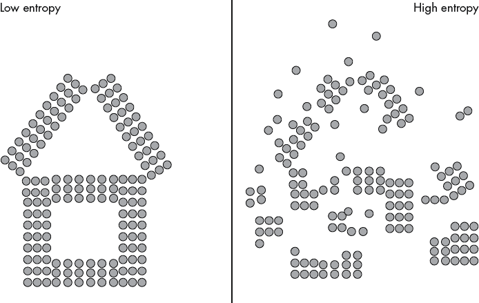
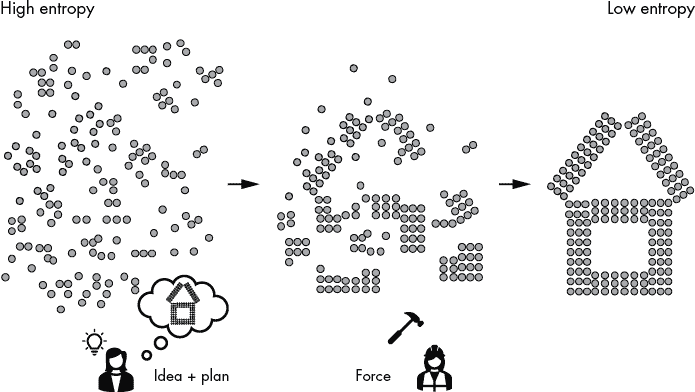
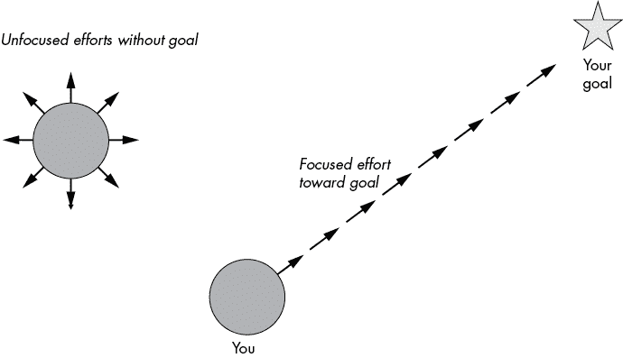

# 第九章：集中注意力

在这一短章中，你将快速了解本书中最重要的课程：如何集中注意力。我们从讨论复杂性开始，这也是许多生产力障碍的根源。在这里，我们总结了如何根据你在本书中学到的内容来应对复杂性。

## 对抗复杂性的武器

本书的主要论点是，复杂性导致混乱。混乱是集中注意力的对立面。要解决复杂性带来的挑战，你需要使用强大的武器——*集中注意力*。

为了证明这一论点，让我们看看*熵*这一科学概念，它在热力学和信息理论等许多科学领域中都广为人知。熵定义了一个系统中的随机性、无序性和不确定性的程度。高熵意味着高度的随机性和混乱。低熵意味着秩序和可预测性。熵是著名的热力学第二定律的核心内容，该定律指出：*一个系统的熵随着时间的推移而增加——最终导致高熵状态*。

图 9-1 通过一个固定数量粒子排列的例子展示了熵。在左侧，你看到一个低熵状态，其中粒子的结构类似于一座房子。每个粒子的位置是可预测的，遵循更高层次的秩序和结构。粒子的排列有一个更大的计划。在右侧，你看到一个高熵状态：房屋结构已经崩溃。粒子的模式失去了秩序，进入了混乱状态。如果没有外力施加能量来减少熵，熵将随着时间的推移增加，所有秩序将被摧毁。比如，废墟中的城堡就是热力学第二定律的见证。你可能会问：热力学和编程效率有什么关系？稍后会变得清楚。让我们从基本原理继续思考。

图 9-1：低熵和高熵状态的对比

生产力意味着创造某些东西，无论是建造房屋、写书，还是编写软件应用程序。实质上，要想提高生产力，你必须*减少熵*，使资源按照一定方式排列，从而使你的大计划得以完成。

图 9-2 展示了熵与生产力之间的关系。你是一个创造者和建设者。你把原材料从高熵状态转移到低熵状态，通过专注的努力实现更宏大的计划。就这么简单！这是你生活中要超高效和成功的秘密，也是你需要的一切：花时间仔细*规划*你的行动路线，设定具体目标，并设计出规律的习惯和行动步骤，确保你得到你想要的结果。然后，运用*专注的努力*，利用你所拥有的所有资源——时间、精力、金钱和人力——直到你的计划得以实现。

图 9-2：熵与生产力之间的关系

这听起来可能微不足道，但大多数人做错了。他们可能从未将这种专注的努力应用到一个想法的实现上，因此这个想法一直困在他们的脑海中。也有些人可能只是从一天过到另一天，什么新计划都没有。只有当你两者都做到——仔细规划并集中精力——你才会成为一个高效的人。所以，要成为比如说，智能手机应用的开发者，你必须通过规划和集中精力，将混乱中的事情整理有序，直到你实现目标。

如果这真的那么简单，为什么不是每个人都在这么做呢？主要的障碍，正如你所猜测的，是复杂性，通常是因为缺乏专注。如果你有多个计划，或者你允许计划随着时间的推移变化太多，你很可能只会朝着目标迈出几步就放弃了整个计划。只有当你专注于*一个*计划足够长时间时，你才能真正完成它。这适用于小成就，比如读完一本书（你快完成了！），也适用于大成就，比如编写和发布你的第一个应用程序。专注是缺失的关键。

图 9-3 是一个简单明了的图示，解释了专注的力量。

图 9-3：相同的努力，不同的结果

你有限的时间和精力。假设你一天有八个小时的全力工作时间，你可以决定如何分配这些时间单位。大多数人会把时间分散到许多活动上。例如，Bob 可能会花一小时开会、一小时编程、一小时浏览社交媒体、一小时进行项目讨论、一小时闲聊、一小时编辑代码文档、一小时思考新项目、以及一小时写小说。Bob 在这些活动中最多只能取得平均水平的结果，因为他在每项活动上投入的时间和精力太少。Alice 可能会花八个小时做一件事：编程。她每天都这么做，并朝着发布一款成功应用的目标快速前进。她在少数几项事情上变得异常出色，而不是在许多事情上表现平平。事实上，她在一项强大的技能上表现出色：编程。而她朝着目标前进的步伐是不可阻挡的。

## 统一原则

我开始写这本书时，认为专注只是许多生产力原则之一，但很快我意识到，专注是这本书中所有原则的统一原则。让我们来看一看：

**80/20 法则**

1.  专注于少数关键任务：记住，20%的工作能够带来 80%的结果，忽略那些琐碎的任务，从而将你的生产力提高一到两个数量级。

**构建最简可行产品**

1.  一次只专注于一个假设，从而减少产品的复杂性，减少特性膨胀，并最大化向产品市场契合的进展速度。在你编写任何一行代码之前，先明确你对用户需求的假设。去除所有除了绝对必要的功能之外的特性。少即是多！花更多的时间去思考要实现哪些功能，而不是实际编写它们。快速而频繁地发布你的 MVP，并通过测试和逐步添加来持续改进它。使用 A/B 测试来测试两个产品变体的反应，丢弃那些无法提升关键用户指标的特性。

**编写简洁而清晰的代码**

1.  复杂性会减缓你对代码的理解，并增加出错的风险。正如我们从 Robert C. Martin 了解到的，“阅读与写作的时间比例远远超过 10:1。我们不断阅读旧代码，这是写新代码的一部分工作。”让你的代码更易读，可以简化新代码的编写。在他们著名的书籍《写作风格的元素》（Macmillan，1959 年）中，作者 Strunk 和 White 提出了一个永恒的原则来提升写作：*省略不必要的词语*。我建议你将这个原则扩展到编程中，并*省略不必要的代码*。

**过早的优化是万恶之源**

1.  将你的优化努力集中在重要的地方。过早优化是指在代码优化上花费宝贵资源，而这些优化最终证明是不必要的。正如 Donald Knuth 所说：“忘掉小的效率问题，大约 97% 的时间：过早优化是万恶之源。”我讨论了我的六个性能调优建议：进行对比度量、考虑 80/20 原则、投资改进算法、应用少即是多原则、缓存重复结果以及知道何时停止——这些都可以用一个词来总结，那就是*聚焦*。

**流状态**

1.  流状态是一种你完全投入于当前任务的状态——你专注且集中。流状态研究者 Csikszentmihalyi 提出了实现流状态的三个条件。(1) 你的目标必须明确。每一行代码都使你离成功完成更大的代码项目更近一步。(2) 你的环境中必须存在反馈机制，并且最好是即时反馈。找人，面对面或在线，来审查你的工作，并遵循 MVP 原则。(3) 机会和能力之间要保持平衡。如果任务太简单，你会失去兴奋感；如果任务太难，你可能会早早放弃。如果你遵循这些条件，你更有可能进入纯粹专注的状态。每天问自己：今天我可以做什么来将我的软件项目推向下一个水平？这个问题具有挑战性，但不会让你感到不堪重负。

**做好一件事（Unix）**

1.  Unix 哲学的基本思想是构建简单、清晰、简洁、模块化的代码，易于扩展和维护。这可以意味着许多不同的事情，但目标是通过优先考虑人的效率而非计算机的效率，推动多个人共同在一个代码库上工作，偏向可组合性而非单一设计。你需要让每个功能只关注一个目的。你已经学习了 15 条 Unix 原则来编写更好的代码，包括“小即美”、让每个函数只做好一件事、尽早构建原型，以及尽早并且大声地失败。如果你时刻牢记*聚焦*规则，在遵循这些原则时，你不一定需要记住每一条。

**设计中的少即是多**

1.  这是关于用极简主义来聚焦你的设计。想想 Yahoo 搜索和 Google 搜索的差异，Blackberry 和 iPhone，OkCupid 和 Tinder：赢家通常是那些拥有极简用户界面的技术。通过使用极简的网页或应用设计，你可以专注于做得最好的那件事。将用户的注意力集中在你产品提供的独特价值上！

## 结论

复杂性是你的敌人，因为它最大化了熵。作为建设者和创造者，你想要最小化熵：纯粹的创造行为就是最小化熵。你通过施加集中的努力来实现这一点。专注是每个创造者成功的秘密。记住沃伦·巴菲特和比尔·盖茨都认为专注是他们成功的秘诀：*专注*。

要在工作中实现专注，问问自己以下问题：

+   我想将精力集中在哪个软件项目上？

+   我想集中精力开发哪些特性来创建我的 MVP？

+   我可以实现的最少设计元素是什么，用来测试我的产品的可行性？

+   谁将使用我的产品，为什么？

+   我可以从我的代码中移除什么？

+   我的函数是否只做一件事？

+   我怎样才能在更短的时间内实现相同的结果？

如果你不断问自己这些或类似的专注问题，那么你在这本书上花费的钱和时间都是非常值得的。
