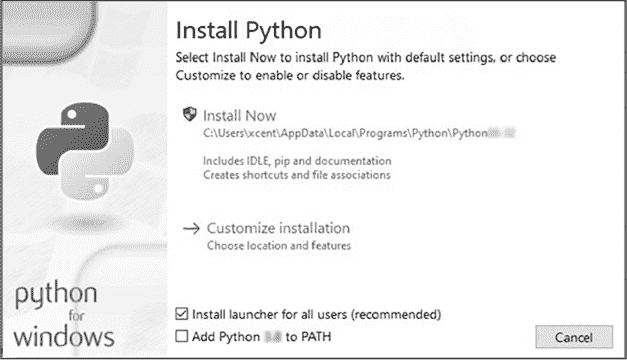
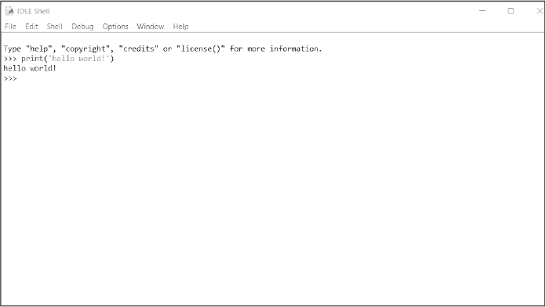
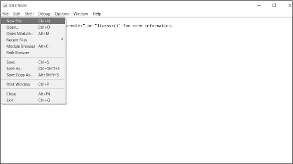
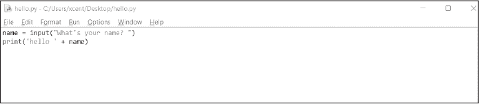
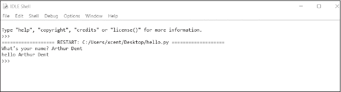

# 附录

PYTHON 基础知识

本附录的重点是快速回顾 Python 的基础知识。Dash 书籍的范围不包括完整的 Python 速成课程，我们只会介绍关键词、数据结构、控制流和函数等基础知识。您可以通过一些优秀的资源全面学习 Python，包括我们的免费电子邮件学院：[*https://<wbr>blog<wbr>.finxter<wbr>.com<wbr>/email<wbr>-academy*](https://blog.finxter.com/email-academy)。

注意

*介绍部分使用了* Python One-Liners *(No Starch Press, 2020)* 中的代码示例和文本片段，该书是本书的一位作者所著。我们建议您阅读此书，以全面了解 Python 单行代码的含义。

## 安装和入门

如果您尚未安装 Python，则需要在计算机上设置 Python。由于 Python 不断发展，我们将保持这些信息的概括。

1.  首先，请访问官方 Python 网站[*https://<wbr>www<wbr>.python<wbr>.org<wbr>/downloads*](https://www.python.org/downloads)，下载适合你操作系统的最新版本的 Python。

2.  在你的计算机上运行安装程序。根据版本和操作系统的不同，你应该会看到一个类似于图 A-1 的对话框。确保点击框以将 Python 添加到 PATH 中，以便通过 Python 访问计算机上的任何目录。

图 A-1：安装 Python 弹出窗口

3.  通过在命令行（Windows）、终端（macOS）或 shell（Linux）中运行以下命令，检查您的 Python 安装是否正常运行：

$ python—version

Python 3.x.x

注意

*美元符号（$）只是一个提示，告诉你在终端或代码 shell 中运行接下来的代码。粗体文本是你应输入的命令。*

恭喜！您已在计算机上安装了 Python。您可以开始使用系统内置的 IDLE 编辑器编写自己的程序。只需在操作系统中搜索 *IDLE* 并打开该程序即可。

作为第一个程序，将以下命令输入到您的 shell 中：

print('hello world!')

Python 将解释您的命令并将所需的文字打印到您的 shell（参见图 A-2）：

hello world!

图 A-2：Python 中的 hello world 程序

与 Python 解释器进行交互式双向通信的这种模式称为*交互模式*。它的优点是能够立即反馈。然而，编程计算机最令人兴奋的结果是自动化：编写一次程序并多次运行它。

让我们从一个简单的程序开始，每次运行时都用你的名字打招呼。你可以保存该程序，并在任何时候重新运行。此类程序称为*脚本*，你可以将它们保存为 *.py* 后缀文件，如 *my_first_program.py*，以保存为 Python 文件。

你可以通过 IDLE shell 的菜单创建脚本，如 图 A-3 所示。

图 A-3：创建你自己的模块

点击 **文件** ► **新建文件**，并将以下代码复制粘贴到你的新文件中：

name = input("What's your name?")

print('hello' + name)

将文件保存为 *hello.py*，存放在桌面或其他任何位置。你当前的脚本应该类似于 图 A-4。

图 A-4：一个接受用户输入并将响应打印到标准输出的程序

现在，让我们开始一些操作：点击 **运行** ► **运行模块**。Python 程序将在交互式 shell 中开始执行，无需你逐行输入。它会逐行执行代码文件。第一行会提示你输入名字，并等待你输入。第二行则会接收你的名字并将其打印到 shell 中。图 A-5 展示了程序的执行效果。

图 A-5：程序在图 A-4 中的示例执行

## 数据类型

现在你已经看到一个 Python 程序的运行，我们将回顾一些基本数据类型。

布尔值

布尔数据类型表示的是关键字 False 或 True。在 Python 中，布尔和整数数据类型紧密相关，因为布尔类型在内部使用整数值：False 表示整数 0，True 表示整数 1。布尔值通常用于断言或作为比较的结果。以下代码片段展示了这两个布尔关键字的使用示例：

 2

print(x)

# False

 1

print(y)

# True

在评估给定的表达式后，变量 x 代表值 False，变量 y 代表值 True。布尔值允许我们创建条件执行的代码，因此它们在处理数据时非常重要，因为它们可以让我们在使用某个值之前检查它是否超过阈值（有关基于阈值的数据分类，请参见 第七章 中的 SVM Explorer 应用）。

布尔值有几个主要运算符，表示基本的逻辑运算符：and、or 和 not。关键字 and 在表达式 x and y 中，当 x 为 True 且 y 为 True 时，评估为 True。如果其中只有一个为 False，则整个表达式为 False。

关键字 or 在表达式 x or y 中，如果 x 为 True *或* y 为 True *或* 两者都是 True，则评估为 True。如果其中只有一个为 True，则整个表达式为 True。

关键字 not 在表达式 not x 中，当 x 为 False 时，评估为 True。考虑以下使用每个布尔运算符的 Python 代码示例：

x, y = True, False

print(x or y)

# True

print(x and y)

# True

print(not y)

# True

通过使用这三种操作符——and、or 和 not——你可以表达你所需要的所有逻辑表达式。

布尔运算符按优先级排序。运算符 not 具有最高优先级，其次是运算符 and，最后是运算符 or。请考虑以下示例：

x, y = True, False

print(x and not y)

# True

print(not x and y or x)

# True

我们将变量 x 设置为 True，将 y 设置为 False。当调用 not x and y or x 时，Python 会将其解释为 ((not x) and y) or x，这与例如 (not x) and (y or x) 不同。作为练习，弄明白*为什么*。

数值类型

两种最重要的数值数据类型是整数和浮点数。*整数*是没有浮动精度的正数或负数（例如，3）。*浮点数*是具有浮动精度的正数或负数（例如，3.14159265359）。Python 提供了多种内置的数值操作，还可以将不同的数值数据类型之间进行转换。以下是几个算术操作的示例。首先，我们将创建一个值为 3 的 x 变量和一个值为 2 的 y 变量：

 x, y = 3, 2

 x + y

5

 x — y

1

 x * y

6

 x / y

1.5

 x // y

1

 x % y

1

 -x

-3

 abs(-x)

3

 int(3.9)

3

 float(3)

3.0

 x ** y

9

前四种运算分别是加法、减法、乘法和除法。// 运算符执行整数除法。结果是一个整数值，会向下舍入到较小的整数（例如，3 // 2 == 1）。% 运算是 *取模运算*，它仅返回除法的余数。减号运算符 – 将值转换为负数。abs() 给出绝对值（即值作为非负数）。int() 将值转换为整数，舍弃小数点后的任何数字。float() 将给定值转换为浮动点数。双星号 ** 表示乘方运算。运算符优先级与您在学校学到的一样：括号优先于指数运算，指数优先于乘法，乘法优先于加法，依此类推。

字符串

Python 字符串是字符序列。字符串是不可变的，因此一旦创建就不能更改；如果需要更改字符串，必须创建一个新的字符串。字符串通常是引号内的文本（包括数字）："this is a string"。以下是创建字符串的五种最常见方法：

单引号：'Yes'

双引号："Yes"

三引号（用于多行字符串）：'''Yes''' 或 " ""Yes" ""

字符串方法：str(yes) == 'yes' 是 True

字符串连接：'Py' + 'thon' 变为 'Python'

要在字符串中使用空白字符，您需要明确地指定它们。要在字符串内开始新的一行，请使用换行符 '\n'。要添加一个制表符的空格，请使用制表符字符 '\t'。

字符串也有自己的一组方法。strip() 方法移除字符串的前导和尾随空白字符，包括空格、制表符和换行符：

y = " This is lazy\t\n "

print(y.strip())

结果更加整洁：

'This is lazy'

lower() 方法将整个字符串转为小写：

print("DrDre".lower())

我们得到了：

'drdre'

upper() 方法将整个字符串转换为大写：

print("attention".upper())

这给我们带来了：

'ATTENTION'

startswith() 方法检查您提供的参数是否出现在字符串的开头：

print("smartphone".startswith("smart"))

它返回一个布尔值：

True

endswith() 方法检查您提供的参数是否出现在字符串的末尾：

print("smartphone".endswith("phone"))

这也返回一个布尔值：

True

find() 方法返回子字符串在原始字符串中第一次出现的索引：

print("another".find("other"))

如下所示：

Match index: 2

replace() 方法将第一个参数中的字符替换为第二个参数中的字符：

print("cheat".replace("ch", "m"))

cheat 变成：

meat

join() 方法将可迭代参数中的所有值组合起来，使用调用它的字符串作为分隔符：

print(','.join(["F", "B", "I"]))

我们得到了：

F,B,I

len() 方法返回字符串中的字符数量，包括空白字符：

print(len("Rumpelstiltskin"))

这给我们带来了：

String length: 15

in 关键字在与字符串操作数一起使用时，会检查一个字符串是否出现在另一个字符串中：

print("ear" in "earth")

这也返回一个布尔值：

Contains: True

这个非排他性的字符串方法列表表明，Python 的字符串数据类型是灵活且强大的，你可以利用内置的 Python 功能解决许多常见的字符串问题。

## 控制流

让我们深入了解一些让我们的代码做出决策的编程逻辑。算法就像一个烹饪食谱：如果这个食谱只是一个顺序的命令列表——将水倒入锅中，加入盐，加入米，倒掉水，最后上桌——你可能几秒钟内就完成了步骤，却得到了一碗未煮熟的米饭。我们需要根据不同的情况作出不同的反应：只有*当*米饭变软时，才从锅中去除水；*当*水开始沸腾时，才把米饭放入锅中。根据不同条件做出不同响应的代码被称为*条件执行*代码。在 Python 中，条件执行的关键字有 if、else 和 elif。

这是一个比较两个数字的基本示例：

half_truth = 21

if 2 * half_truth == 42:

   print('Truth!')

else:

   print('Lie!')

这将打印：

Truth!

if 条件 2 * half_truth == 42 会生成一个结果，结果可以是 True 或 False。如果表达式的结果是 True，则进入第一个分支并打印 Truth!。如果表达式的结果是 False，则进入第二个分支并打印 Lie!。由于表达式的结果是 True，所以进入第一个分支，shell 输出为 Truth!。

每个 Python 对象，如变量或列表，都有一个隐式关联的布尔值，这意味着我们可以将 Python 对象用作条件。例如，一个空列表的布尔值为 False，而非空列表的布尔值为 True：

lst = []

if lst:

   print('Full!')

else:

   print('Empty!')

这会打印：

Empty!

如果你不需要 else 分支，可以简单跳过它，当条件评估为 False 时，Python 会跳过整个代码块：

if 2 + 2 == 4:

   print('FOUR')

这会打印：

FOUR

只有当 if 条件评估为 True 时，才会打印输出。否则，不会发生任何事情。代码没有副作用，因为它会被执行流跳过。

你也可以有超过两个条件的代码。在这种情况下，你可以使用 elif 语句：

x = input('Your Number: ')

if x == '1':

   print('ONE')

elif x == '2':

   print('TWO')

elif x == '3':

   print('THREE')

else:

   print('MANY')

这段代码会接收你的输入并将其与字符串 '1'、'2' 和 '3' 进行比较。在每种情况下，都会输出不同的结果。如果输入与任何字符串都不匹配，则进入最后一个分支，输出 'MANY'。

以下代码片段获取用户输入，将其转换为整数，并将其存储在变量x中。然后，它测试该变量是否大于、等于或小于 3，并根据评估结果打印不同的消息。换句话说，这段代码对现实世界中不可预测的输入做出有差异的响应：

x = int(input('请输入您的值: '))

 3:

   print('Big')

elif x == 3:

   print('Medium')

else:

   print('Small')

我们给出关键字if，后跟一个条件，该条件决定执行路径。若条件为True，执行路径将沿着紧接着的缩进代码块中的第一分支。如果条件为False，执行流会继续向下，执行以下三种情况之一：

1.  根据任意数量的elif分支进一步评估其他条件

2.  如果没有满足条件的if或elif条件，则进入else分支

3.  当没有给出else分支，并且没有满足条件的elif分支时，跳过整个结构

规则是，执行路径从顶部开始，向下移动，直到某个条件匹配——在这种情况下，执行相应的代码分支——或者所有条件都被探查过，但没有任何条件匹配。

这里你可以看到，将对象传入if条件并像布尔值一样使用它们是可能的：

if None or 0 or 0.0 or ' ' or [] or {} or set():

   print('Dead code') # 不会到达

if 条件计算结果为 False，因此 print 语句永远不会被执行。这是因为以下值会被计算为布尔值 False：关键字 None、整数值 0、浮点值 0.0、空字符串和空容器类型。表达式 None or 0 or 0.0 or ' ' or [] or {} or set() 会被计算为 True，如果 Python 能隐式地将任何操作数转换为 True，但在这里并不会，因为所有这些值都会被转换为 False。

## 重复执行

为了允许重复执行类似的代码片段，Python 提供了两种循环类型：for 循环和 while 循环。我们将创建一个 for 循环和一个 while 循环，以不同的方式实现相同的功能：将整数 0、1 和 2 打印到 Python shell 中。

下面是 for 循环：

for i in [0, 1, 2]:

   print(i)

这将输出：

0

1

2

for 循环通过声明一个循环变量 i，该变量会依次取出列表 [0, 1, 2] 中的所有值。然后它会打印变量 i，直到列表中的值用尽。

下面是具有相似语义的 while 循环版本：

i = 0

while i < 3:

   print(i)

   i = i + 1

这也将输出：

0

1

2

while循环只要条件满足，就会执行循环体——在我们的例子中，只要i < 3。使用哪种方法取决于你的具体情况。通常，当你遍历一个固定数量的元素时（例如，遍历列表中的所有元素），你会使用for循环；当你希望重复某个操作，直到达成某个结果时（例如，猜密码直到成功），你会使用while循环。

终止循环有两种基本方式：定义一个循环条件，使其评估为False，如前面的例子所示，或者在循环体内的确切位置使用关键字break来停止循环。这里我们使用break来退出原本会变成无限循环的情况：

while True:

   break # No infinite loop

print('hello world')

从中我们得到：

hello world

我们创建了一个while循环，循环条件始终评估为True，因为循环条件while True本身就固有地为True。循环在break处提前结束，因此代码会继续执行并输出print('hello world')。

你可能会想，如果我们不希望它一直运行，为什么还要创建一个无限循环呢？这是一个常见的做法，例如，在开发需要使用无限循环等待新网页请求并提供服务的 Web 服务器时。然而，你仍然希望能够在循环未完成时提前终止它。在 Web 服务器的例子中，如果服务器检测到遭受攻击，可能会希望停止提供文件服务。在这些情况下，你可以使用关键字break，当满足某个条件时停止循环。

也可以强制 Python 解释器跳过循环中的某些部分，而不是提前结束循环。在我们的 Web 服务器示例中，你可能希望跳过恶意的 Web 请求，而不是完全停止服务器。你可以使用 continue 关键字实现这一点，它会结束当前的循环迭代，并将执行流带回到循环条件的开始：

while True:

   continue

   print('43') # 死代码

这段代码将永远执行下去，而不会执行一次 print 语句，因为 continue 语句结束了当前的循环迭代，并将执行流带回到循环开始处，未到达 print() 语句。因此，print() 语句现在被视为 *死代码*：即永远不会被执行的代码。continue 语句和 break 语句通常只有在与 if-else 语句配合使用时才有意义，像这样：

while True:

   user_input = input('请输入密码: ')

   if user_input == '42':

      break

   print('错误！') # 死代码

print('恭喜，你找到了秘密密码！')

这段代码会请求一个密码，并会一直执行下去，直到用户猜到正确的密码。如果他们输入正确的密码 42，程序会执行到 break 语句，结束循环，并执行成功的 print 语句。如果密码错误，循环会中断，执行返回到开始位置，用户需要重新尝试。以下是一个示例用法：

your password: 41

错误！

your password: 21

错误！

your password: 42

恭喜，你找到了秘密密码！

这些是控制程序执行流程的最重要关键字。

## 其他有用的关键字

让我们来看一些额外有用的关键字。in 关键字检查某个元素是否存在于给定的序列或容器类型中。这里我们检查 42 是否在后面的列表中，然后检查 21 是否可以作为字符串在集合中找到：

print(42 in [2, 39, 42])

# True

print('21' in {'2', '39', '42'})

# False

in 关键字返回一个布尔值，因此第一个语句会返回 True，第二个语句会返回 False。

is 关键字检查两个变量是否指向内存中的同一个对象。Python 初学者通常会对 is 关键字的确切含义感到困惑，但值得花时间理解它的真正含义。在这里，我们可以看到两个变量指向内存中的同一个对象与两个看似相似但指向不同对象的列表之间的区别：

x = 3

y = x

print(x is y)

# True

print([3] is [3])

# False

如你在后面的例子中所见，如果你创建了两个列表——即使它们包含相同的元素——它们仍然在内存中指向两个不同的列表对象。如果你后来决定修改其中一个列表对象，这不会影响另一个列表对象。如果你检查某个列表是否指向内存中的同一个对象，结果是 False。在这里，当我们检查 x 是否与 y 相同时，得到的是 True，因为我们显式地将 y 设置为指向 x。然而，当我们检查列表 [3] 是否与 [3] 相同时，我们得到的是 False，因为这两个列表指向内存中的不同对象。如果你修改其中一个，另一个不会改变！

## 函数

*函数* 是可重用的代码片段，用来完成特定任务。程序员可以并且经常将函数与其他程序员共享，以应对特定的任务，节省自己编写代码的时间和精力。

你可以使用 def 关键字定义一个函数。这里我们定义了两个简单的函数，每个函数都打印一个字符串：

def say_hi():

   print('hi!')

def say_hello():

   print('hello!')

函数由函数名和括号组成，前面加上关键字 def，后面跟随函数体，它是一个缩进的代码块。这个代码块可以包含其他缩进的块，比如 if 语句，甚至是更多的函数定义。和 Python 中任何的块定义一样，函数体必须缩进。

这是一个打印两个字符串并分别换行的函数：

def say_bye():

   print('Time to go…')

   print('Bye! ')

像这样在你的 Python shell 中运行这三个函数：

Say_hi()

Say_hello()

Say_bye()

这是输出结果：

hi!

hello!

Time to go…

Bye!

函数按顺序执行。

参数

函数还可以在括号内接受参数。*参数* 允许你定制输出。考虑这个函数，它以名字作为唯一参数，并向 shell 打印一个定制的字符串：

def say_hi(name):

   print('hi ' + name)

say_hi('Alice')

say_hi('Bob')

我们定义了函数，然后用不同的参数分别运行它两次：首先是 'Alice'，然后是 'Bob'。因此，函数执行的输出是不同的：

hi Alice

hi Bob

函数还可以接受多个参数：

def say_hi(a, b):

   print(a + ' 向 ' + b + ' 打招呼')

say_hi('Alice', 'Bob')

say_hi('Bob', 'Alice')

输出结果如下：

Alice 向 Bob 打招呼

Bob 向 Alice 打招呼

在第一次函数执行时，参数变量 a 的值为 'Alice'，参数变量 b 的值为 'Bob'。第二次执行函数时，这两个值会交换，输出结果也不同。

函数也可以有返回值，因此你可以将一个值传入函数，并获得一个返回值，之后可以在代码中使用它，正如在清单 A-1 中所示。

def f(a, b):

   return a + b

x = f(2, 2)

y = f(40, 2)

print(x)

print(y)

清单 A-1：使用 return 关键字

返回值是紧跟在 return 关键字后面的表达式，这也会终止函数的执行。Python 在遇到 return 关键字时检查返回值并结束函数，立即将该值返回给函数的调用者。

如果你没有显式提供返回表达式，Python 会隐式地在函数末尾加上表达式 return None。关键字 None 意味着 *没有值*。其他编程语言（例如 Java）使用关键字 null，这常常会导致初学者误认为它等于整数值 0。实际上，Python 使用关键字 None 来表示它是一个空对象，比如一个空列表或空字符串，而不是数字 0。

当一个函数执行完成时，执行权总是返回给调用该函数的地方；return 关键字只是让你更精确地控制 *何时* 结束函数和 *返回什么* 值。

我们将 a=2 和 b=2 传入函数 列表 A-1，得到结果 4。然后我们传入 a=40 和 b=2，并得到（唯一的）答案 42。这是输出结果：

4

42

几乎每个仪表板应用程序都包含至少一个增加交互性的函数。通常，你可能有一个根据用户输入更新图表的函数，类似这样的：

def update_graph(value):

   if value == 2:

      return 'something'

接下来，我们将讨论 Python 的一个更高级且高度相关的特性：*默认函数参数*。

默认函数参数

默认参数允许你在 Python 中定义带有可选参数的函数。如果用户在调用函数时选择不提供参数，则会使用默认参数。你可以通过在参数名后使用等号 (=) 并附加默认值来设置默认参数。

附录 A-2 展示了一个更有趣的例子。在这里，我们定义了一个函数 add()，它返回函数参数 a 和 b 的和。因此，add(1,2) 将返回 3，add(41,1) 将返回 42。我们为函数参数指定了默认值：a 默认为 0，b 默认为 1。如果在函数调用中未传递任何值给这些参数中的一个或两个，它将使用其默认值。因此，add(1) 将返回 2，add(-1) 将返回 0，add() 将返回 1，因为分别使用了 a 和 b 的默认值 0 和 1。

def add(a=0, b=1):

   return a + b

print(add(add(add())))

附录 A-2：定义具有默认参数的函数

这将打印：

3

在我们在 print(add(add(add()))) 中突出显示的最内层函数调用中，我们调用了函数 add()，没有传递任何参数，因此它使用了 a 和 b 的默认值（分别为 0 和 1）。

对于剩余的两个调用，你只需传递一个参数给 add()，该参数是前一个函数调用的返回值。这个参数将接收 a，根据参数的位置来决定将哪个参数传递给哪个变量，而 b 将具有默认值 1。第一个，最内层的 add() 调用返回 1。这个值传递给第二次调用的 add()，然后增加 1，接着这个值在第三次调用时再增加 1。

以下是我们执行 Listing A-2 时发生的幕后步骤：

add(add(add()))

   = add(add(1))

   = add(2)

   = 3

你可以看到，默认参数可以帮助你让函数在处理输入时更加灵活。

## Python 资源与进一步阅读

+   随时查看 *Python 一行代码* 的入门 Python 视频，视频免费提供，地址是 [*https://<wbr>pythononeliners<wbr>.com*](https://pythononeliners.com)。

+   可以在 [*https://<wbr>www<wbr>.python<wbr>.org*](https://www.python.org) 找到最新版 Python 的官方下载网站。

+   你可以在 Finxter 博客上找到关于 Python 列表的完整教程，包含详细的视频内容，地址是 [*https://<wbr>blog<wbr>.finxter<wbr>.com<wbr>/python<wbr>-lists*](https://blog.finxter.com/python-lists)。

+   要查看关于 Python 切片的完整教程和视频，请访问 [*https://<wbr>blog<wbr>.finxter<wbr>.com<wbr>/introduction<wbr>-to<wbr>-slicing<wbr>-in<wbr>-python*](https://blog.finxter.com/introduction-to-slicing-in-python)。

+   你可以在 [*https://<wbr>blog<wbr>.finxter<wbr>.com<wbr>/python<wbr>-dictionary*](https://blog.finxter.com/python-dictionary) 找到有关 Python 字典的完整指南。

+   关于列表推导的教程和视频，请访问 [*https://<wbr>blog<wbr>.finxter<wbr>.com<wbr>/list<wbr>-comprehension*](https://blog.finxter.com/list-comprehension)。

+   一份面向面向对象编程（OOP）的备忘单可以作为 PDF 文件下载，地址是 [*https://<wbr>blog<wbr>.finxter<wbr>.com<wbr>/object<wbr>-oriented<wbr>-programming<wbr>-terminology<wbr>-cheat<wbr>-sheet<wbr>*](https://blog.finxter.com/object-oriented-programming-terminology-cheat-sheet)。

+   在 [*https://<wbr>blog<wbr>.finxter<wbr>.com<wbr>/python<wbr>-crash<wbr>-course*](https://blog.finxter.com/python-crash-course) 找到更多备忘单和免费的 Python 快速入门课程。
