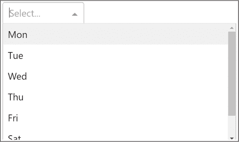

## 第三章：1 PYTHON 刷新器

如果你打算做 Dash 应用开发，你可能已经至少了解一点 Python。然而，这本书并不假设你是专家，因此我们将回顾一些在 Dash 中更为相关的 Python 概念，包括列表、字典、面向对象编程以及装饰器函数。如果你已经对这些领域非常自信，可以直接跳到 第二章，该章将介绍我们在整本书中使用的 Python IDE：PyCharm。

### 列表

让我们快速回顾一下几乎所有 Dash 应用程序中都使用的最重要的容器数据类型：Python 列表！列表在 Dash 中很重要，因为它们用于定义布局、结合 Dash Bootstrap 主题，并且常见于回调函数和由 Plotly 构建的图形中。

列表容器类型用于存储元素的序列。列表是可变的，这意味着你可以在创建后修改它们。这里我们创建一个名为 lst 的列表并打印其长度：

lst = [1, 2, 2]

print(len(lst))

我们的输出仅为：

3

我们通过使用方括号和逗号分隔的元素来创建一个列表。列表可以包含任意的 Python 对象、重复值，甚至是其他列表，因此它们是 Python 中最灵活的容器类型之一。这里我们将列表 lst 填充了三个整数元素。len() 函数返回列表中元素的数量。

添加元素

有三种常见的方式可以向一个已存在的列表中添加元素：附加、插入和连接。

append() 方法将其参数放在列表的末尾。以下是附加的示例：

lst = [1, 2, 2]

lst.append(4)

print(lst)

这将打印：

[1, 2, 2, 4]

insert() 方法在给定位置插入一个元素，并将所有后续元素向右移动。下面是一个插入的示例：

lst = [1, 2, 4]

lst.insert(2,2)

print(lst)

这将打印相同的结果：

[1, 2, 2, 4]

最后，拼接操作：

print([1, 2, 2] + [4])

我们得到：

[1, 2, 2, 4]

对于拼接操作，我们使用加号（+）运算符。这样可以通过将两个现有列表连接起来，创建一个新列表。

所有操作都会生成相同的列表，[1, 2, 2, 4]。其中 append 操作是最快的，因为它不需要像插入操作那样遍历列表来将元素插入到正确的位置，也不需要像拼接操作那样通过两个子列表创建一个新列表。

若要向给定列表追加多个元素，可以使用 extend() 方法：

lst = [1, 2]

lst.extend([2, 4])

print(lst)

代码将按如下方式更改现有的列表对象 lst：

[1, 2, 2, 4]

上面的代码是一个示例，展示了一个可以容纳重复值的列表。

删除元素

我们可以使用 lst.remove(x) 从列表中移除一个元素 x，例如：

lst = [1, 2, 2, 4]

lst.remove(1)

print(lst)

这会给我们返回结果：

[2, 2, 4]

该方法直接操作列表对象本身——不会创建新列表，原始列表会被修改。

反转列表

你可以使用方法 lst.reverse() 来反转列表元素的顺序：

lst = [1, 2, 2, 4]

lst.reverse()

print(l)

这将打印：

[4, 2, 2, 1]

反转列表也会修改原始列表对象，而不是创建一个新列表对象。

排序列表

你可以使用方法 lst.sort() 来对列表元素进行排序：

lst = [2, 1, 4, 2]

lst.sort()

print(lst)

我们看到了排序后的列表：

[1, 2, 2, 4]

再次提醒，排序列表会修改原始列表对象。默认情况下，结果列表是按升序排序的。如果要按降序排序，可以传入 reverse=True，如下所示：

lst = [2, 1, 4, 2]

lst.sort(reverse=True)

print(lst)

我们看到结果是按相反顺序排列的：

[4, 2, 2, 1]

你还可以指定一个 key 函数，并将其作为参数传递给 sort() 以自定义排序行为。key 函数只是将一个列表元素转换成一个可排序的元素。例如，它可以通过使用 Dash 组件的字符串标识符作为关键字，将一个不可排序的对象（如 Dash 组件）转换为可排序类型。通常，这些 key 函数允许你对自定义对象列表进行排序；例如，按年龄对员工对象列表进行排序。以下示例对列表进行排序，但使用元素的相反值（负值）作为 key：

lst = [2, 1, 4, 2]

lst.sort(key=lambda x: −x)

print(lst)

这给我们带来了：

[4, 2, 2, 1]

元素 4 的 key 是负值 −4，它是所有列表元素中最小的值。因为列表是按升序排序的，所以这是结果排序列表的第一个值。

索引列表元素

你可以使用 list.index(x) 方法来确定指定列表元素 x 的索引，像这样：

print([2, 2, 4].index(2))

print([2, 2, 4].index(2,1))

`index(x)` 方法查找列表中元素 `x` 的第一次出现，并返回其索引。

你可以通过传递第二个参数来指定起始索引，从而设置搜索开始的位置。因此，第一行打印出值 2 第一次出现的索引，而第二行打印出值 2 第一次出现的索引，但从索引 1 开始搜索。该方法在两种情况下都会立即找到值 2 并打印：

0

1

索引基础

这里是 Python 中索引的快速概览，通过示例说明。假设我们有字符串 'universe'，索引就是该字符串中字符的位置，从 0 开始：

索引             0      1      2      3      4      5      6      7

字符      u      n      i       v       e      r      s      e

第一个字符的索引是 0，第二个字符的索引是 1，而第 i个字符的索引是 i−1。

### 切片

*切片* 是从给定字符串中截取子字符串的过程。我们称这个子字符串为 *切片*。切片的表示方法如下：

string[start:stop:step]

`start` 参数是我们希望开始字符串的位置，它会包含在切片中，而 `stop` 参数是我们希望字符串停止的位置，它不包括在切片内。忘记 `stop` 索引不包含在内是一个常见的 bug 来源，所以请记住这一点。`step` 参数告诉 Python 包含哪些元素，因此 `step` 为 2 时会包含每隔一个的元素，而 `step` 为 3 时会包含每隔两个的元素。以下是一个步长为 2 的示例：

s = '----p-y-t-h-o-n----'

print(s[4:15:2])

这将给我们带来：

python

三个参数都是可选的，因此你可以跳过它们，使用默认值 start=0、stop=len(string) 和 step=1。如果在切片的冒号前省略了 start 参数，表示切片从第一个位置开始；如果省略了 stop 参数，表示切片直到字符串的最后一个元素；如果省略了 step 参数，则默认为步长 1。这里我们省略了 step 参数：

x = 'universe'

print(x[2:4])

这给我们带来了：

iv

在这里，我们指定了起始位置，但没有指定结束位置，并且给出了步长为 2，因此我们会得到每隔一个字符的子字符串，从第三个字符开始，一直到字符串的末尾：

x = 'universe'

print(x[2::2])

这给我们带来了：

ies

如果我们不小心给出一个超出最大序列索引的 stop 索引，Python 会假设我们是想在原始字符串的末尾结束切片。这里是一个例子：

word = "galaxy"

print(word[4:50])

这将打印：

xy

只需记住，如果切片超出了序列索引，什么意外的事情都不会发生。

你也可以为所有三个参数提供负整数。对于 start 或 stop 的负索引，会告诉 Python 从末尾开始计数。例如，string[–3:] 会从倒数第三个元素开始切片，string[–10:–5] 会从倒数第十个元素（包括）开始切片，并在倒数第五个元素（不包括）结束。负步长意味着 Python 会从右向左切片。例如，string[::–1] 会将字符串反转，string[::–2] 会从最后一个字符开始，逐个取每隔一个字符向左移动。

### 字典

*字典* 是一个非常有用的数据结构，用于存储键值对。我们用花括号定义一个字典，如下所示：

calories = {'apple': 52, 'banana': 89, 'choco': 546}

键位于前面，后面跟一个冒号，再后面是值。键值对应该用逗号分隔。这里 'apple' 是第一个键，52 是它的值。你可以通过指定字典和在方括号中指定键来访问字典中的单个元素。在以下示例中，我们将苹果的卡路里与一块巧克力的卡路里进行比较：

print(calories['apple'] < calories['choco'])

当然，它会返回：

True

字典是一个可变的数据结构，因此可以在创建后进行修改。例如，你可以添加、删除或更新现有的键值对。在这里，我们向字典中添加一个新的键值对，存储一杯卡布奇诺有 74 卡路里的信息：

calories['cappu'] = 74

print(calories['banana'] < calories['cappu'])

当我们断言卡布奇诺比香蕉含有更多的卡路里时，结果是：

False

我们使用 keys() 和 values() 函数来访问字典的所有键和值。在这里，我们检查字符串 'apple' 是否是字典的键之一，以及整数 52 是否是字典的值之一。实际上这两者的结果都是 True：

print('apple' in calories.keys())

print(52 in calories.values())

要访问字典的所有键值对，我们使用 dictionary.items() 方法。在下面的 for 循环中，我们遍历字典 calories 中的每个 (key, value) 对，并检查每个值是否大于 500 卡路里。如果是，它会打印出相关的键：

for key, value in calories.items():

 500:

      print(key)

我们唯一的结果是：

'choco'

这为我们提供了一种简单的方法，可以遍历字典中的所有键和值，而无需单独访问它们。

### 列表推导式

列表推导式是一种创建列表的紧凑方式，采用简单的一行公式 [expression + context]。其中的 context 告诉 Python 要将哪些元素添加到新的列表中，而 expression 则定义了在添加这些元素之前要对它们进行什么操作。例如，列表推导式语句

[x for x in range(3)]

创建了一个新的列表 [0, 1, 2]。这个例子中的 context 是 for x in range(3)，因此循环变量 x 会依次取值 0、1 和 2。这里的表达式 x 非常简单：它只是将当前的循环变量添加到列表中而没有任何修改。然而，列表推导式能够处理更为复杂的表达式。

列表推导式通常用于仪表盘应用中；例如，它用于动态创建下拉菜单的多个选项。这里我们创建了一个字符串列表——工作日，然后使用列表推导式创建一个字典列表。我们将使用这些字典来创建 Dash 下拉菜单的标签和选项，正如图 1-1 所示：

days = ['Mon', 'Tue', 'Wed', 'Thu', 'Fri', 'Sat', 'Sun']

options = [{'label': day, 'value': day} for day in days]

图 1-1：一个 Dash 下拉菜单

上下文是 for day in days，所以我们遍历每个工作日 'Mon',…, 'Sun'。该表达式创建了一个字典，包含两个键值对： {'label': day, 'value': day}。这是创建以下字典列表的一种简洁方式：

[{'label': 'Mon', 'value': 'Mon'}, {'label': 'Tue', 'value': 'Tue'},

{'label': 'Wed', 'value': 'Wed'}, {'label': 'Thu', 'value': 'Thu'},

{'label': 'Fri', 'value': 'Fri'}, {'label': 'Sat', 'value': 'Sat'},

{'label': 'Sun', 'value': 'Sun'}]

另一种方法是使用常规的 Python for 循环，如下所示的三行代码：

options = []

for day in days:

   options.append({'label': day, 'value': day})

你创建了一个字典列表，其中标签和对应的值与每个特定的日期相关联。在这里，下拉菜单将显示标签 'Mon'，如果用户选择该标签，标签将与值 'Mon' 关联。

上下文包含任意数量的 for 和 if 语句。我们可以在列表推导式中使用 if 语句来过滤结果；例如，我们可以只创建包含工作日的下拉菜单选项：

options = [{'label': day, 'value': day} for day in days if day not in ['Sat', 'Sun']]

这里我们使用了if语句来排除结果列表中的Sat和Sun。这是在一个for循环中写这个常规if语句的一种更快速、更简洁的方式。

### 面向对象编程

在 Python 中，一切都是对象。即使是整数值也是对象。这与 C 语言等编程语言不同，在 C 语言中，整数、浮动值和布尔值是原始数据类型。这样，Python 是基于严格一致的面向对象范式构建的。

类与对象

面向对象的 Python 编程的核心是类。类是创建对象的蓝图。类的描述告诉你一个对象的外观和它的功能，分别称为对象的*数据*和*功能*。数据通过*属性*来定义，属性是与特定对象相关联的变量。功能则通过*方法*来定义，方法是与特定对象相关联的函数。

让我们通过哈利·波特的例子来看这些概念如何应用。首先，我们将创建一个具有属性但没有方法的类。在这里，我们创建了一个Muggle类，并从中创建了两个Muggle对象：

class Muggle:

   def __init__(self, age, name, liking_person):

      self.age = age

      self.name = name

      self.likes = liking_person

Vernon = Muggle(52, "Vernon", None)

Petunia = Muggle(49, "Petunia", Vernon)

我们使用关键字class为Muggle对象创建一个新的蓝图。这决定了每个Muggle对象将具备的数据和功能。在这里，我们声明每个Muggle对象应该有一个年龄、一个名字和一个他们喜欢的人。

对于每个类，您必须使用方法<code>__init__()</code>来初始化包含数据的类。 每个<code>Muggle</code>对象都将具有属性<code>age</code>、<code>name</code>和<code>likes</code>。 通过将它们作为参数传递给<code>def</code>语句，我们使它们在创建对象时成为必需的参数。 任何类方法的第一个值都是对对象本身的引用，表示为<code>self</code>。 一旦您在代码中调用初始化方法，Python 就会创建一个空对象，您可以使用名称<code>self</code>访问它。

注意

*尽管在定义方法时第一个参数是 self，但在调用方法时不需要指定此参数。 Python 会在内部为您执行这些操作。*

创建一个来自该类的对象时，初始化方法<code>__init__</code>会自动首先调用，通过使用类名作为函数调用来实例化一个新对象。 调用<code>Muggle(52, "Vernon", None)</code>和<code>Muggle(49, "Petunia", Vernon)</code>创建两个新的类对象，均定义了三个属性，如下所示：

<code>Muggle</code>

<code>   age = 52</code>

<code>   name = "Vernon"</code>

<code>   likes = None</code>

<code>Muggle</code>

<code>   age = 49</code>

<code>   name = "Petunia"</code>

<code>   likes = "Vernon"</code>

您可以看到这些对象遵循相同的蓝图，但是是<code>Muggle</code>的不同实例；它们具有相同的属性但不同的 DNA。

从现在起，这些对象将存储在您计算机的内存中，直到 Python 在程序终止时将它们清除。

目前故事中有令人伤感的元素吗？ 佩图尼亚喜欢弗农，但弗农谁也不喜欢。 让我们稍微振作一点，好吗？ 我们将为<code>Vernon</code>的<code>likes</code>属性更改为<code>Petunia</code>。 我们可以使用对象的名称、点符号和属性的名称来访问对象的不同属性，如下所示：

Vernon.likes = "Petunia"

print(Vernon.likes)

这将输出：

Petunia

让我们定义 Wizard 类，这样我们就可以在我们的小世界里创建一些巫师。这次我们将增加一些功能：

class Wizard:

   def __init__(self, age, name):

      self.age = age

      self.name = name

      self.mana = 100

   def love_me(self, victim):

= 100:

         victim.likes = self.name

         self.mana = self.mana – 100

Wiz = Wizard(42, "Tom")

每个 Wizard 对象有三个属性：age、name 和 mana 等级（表示巫师剩余的魔法力量）。age 和 name 属性是在创建 Wizard 对象时，根据传入的参数值进行设置的。mana 属性则在 __init__ 方法中被硬编码为 100。例如，调用 Wizard(42, "Tom") 将会把 self.age 设置为 42，self.name 设置为 "Tom"，并将 self.mana 设置为 100。

我们还添加了一个方法 love_me()，它会对目标施下爱的魔法。如果法师的法力足够，他们可以通过将目标的 likes 属性设置为施法者的名字来强迫目标爱上他们。然而，这只有在法师的法力值大于或等于 100（self.mana = 100）时才有效。成功时，目标的 likes 属性指向施法者的名字，施法者的法力值减少 100。

我们创建了一个 42 岁的法师名叫 Tom。Tom 孤独且希望被喜欢。让我们让 Petunia 和 Vernon 爱上他。我们使用点符号访问对象的方法，并传入 Petunia 和 Vernon 对象：

Wiz.love_me(Petunia)

Wiz.love_me(Vernon)

print(Petunia.likes=="Tom" and Vernon.likes=="Tom")

你能判断 Tom 是否成功让 Petunia 和 Vernon 都爱上他吗？

面向对象编程中最常见的困惑之一是忘记在定义方法时包含 self 参数。另一个常见的困惑是初始化方法的定义使用了语法 __init__()，而你应该使用语法 ClassName() 来调用类创建方法，而不是像你预期的那样调用 ClassName.__init__()。这在代码中有所展示，我们并没有调用 Wizard.__init__(20, 'Ron')，而是直接调用 Wizard(20, 'Ron') 来创建一个新的 Wizard 对象。

这只是 Python 中面向对象编程的简要概述，但确保你完全理解如何在 Python 中构建类和对象是非常值得的。

如需更多信息，可以查看面向对象编程的备忘单，链接为 [*https://<wbr>blog<wbr>.finxter<wbr>.com<wbr>/object<wbr>-oriented<wbr>-programming<wbr>-terminology<wbr>-cheat<wbr>-sheet*](https://blog.finxter.com/object-oriented-programming-terminology-cheat-sheet)。

术语

在这里，我们将快速浏览面向对象 Python 中的一些关键定义。

**类**      是创建对象的蓝图。类定义了对象的属性（数据）和功能（方法）。您可以通过点符号访问属性和方法。

**对象**      是根据类定义构建的一个封装数据及其相关功能的单元。对象也被称为类的*实例*。通常，一个对象用于模拟现实世界中的某个事物。例如，我们可以根据类定义<Person>创建对象<Obama>。一个对象由任意数量的属性和方法组成，这些属性和方法被封装在一个单一的单元中。

**实例化**      是创建类的对象的过程。

**方法**      是与特定对象相关联的函数。我们在类定义中使用关键字 def 来定义方法。一个对象可以有任意数量的方法。

**属性**      是用于存储与类或实例相关数据的变量。

**类属性**是静态创建的变量，在类定义中创建，并且被从该类创建的所有对象共享。这些也被称为*类变量*、*静态变量*和*静态属性*。

**动态属性**      是在程序执行过程中动态定义的对象属性，并未在任何方法中定义。例如，您可以通过调用o.my_attribute = 42来将新的属性<my_attribute>添加到任何对象o中。

**实例属性**是仅属于一个对象的变量。其他对象不能共享该变量，正如它们共享类属性一样。在大多数情况下，您在使用<self>变量名创建实例时，会创建一个实例属性x，例如 self.x = 42。这些也被称为*实例变量*。

**继承**       是一种编程概念，允许你通过在定义新类时重用部分或全部数据和功能，来创建作为现有类修改的新类。也就是说，类 A 可以从类B继承属性或方法，这样它就具有与类B相同的数据和功能，但类A可以改变行为或添加数据和方法。例如，类Dog可以从类 Animal 继承属性number_of_legs。在这种情况下，你将定义继承类Dog如下：class Dog(Animal):，然后是类的主体。

如果你已经理解了这些术语，你可以跟上大多数关于面向对象编程的讨论。掌握面向对象是精通 Python 的重要一步。

### 装饰器函数和注解

Dash 在很大程度上依赖于 Python 的*装饰器*或*装饰器函数*的概念，它们在不修改代码本身的情况下，为现有代码添加功能。这在你想要修改或自定义现有函数的输出时非常有用，而无需更改函数的实际代码。例如，你可能无法访问某个函数的定义，但仍然想改变它的行为。装饰器函数正是来拯救你的！

把装饰器函数看作一个包装器。它接受一个原始函数，调用它，并根据程序员的需求修改它的行为。这样，你可以在函数最初定义后动态地改变它的行为。

让我们从一个简单的例子开始。我们定义一个函数，将一些文本打印到标准输出：

def print_text():

   print("Hello world!")

print_text()

输出是：

Hello world!

这个函数始终会打印相同的消息。假设你想装饰这个输出，让它变得更有趣。一种方法是定义一个新的pretty_print()函数；但这还不是一个装饰器函数，因为它并没有改变另一个函数的行为。然而，它确实展示了如何包装另一个函数并修改它的行为：

def print_text():

   print("Hello world!")

def pretty_print():

   annotate = '+'

   print(annotate * 30)

   print_text()

   print(annotate * 30)

pretty_print()

现在输出如下所示：

++++++++++++++++++++++++++++++

你好，世界！

++++++++++++++++++++++++++++++

外部函数 pretty_print() 调用内部函数 print_text()，并通过在内部函数 print_text() 输出前后添加 30 个加号（+）符号来修饰结果。本质上，你是 *包装* 内部函数的结果，并通过附加功能进行增强。

装饰器函数允许你像这样通用化代码。例如，你可能希望将一个任意的内部函数传递给 pretty_print() 函数，这样你就可以将它应用于任何 Python 函数。在这里，我们创建了一个装饰器函数，但请注意，为了展示它是如何工作的，我们采用了比较长的方法。稍后我们将查看 Python 提供的更简短的方法来实现相同的功能。这是长版本：

def pretty_print_decorator(f):

   annotate = '+'

   def pretty_print():

      print(annotate * 50)

      f()

      print(annotate * 50)

   return pretty_print

def print_text():

   print("你好，世界！")

def print_text_2():

   print("你好，宇宙！")

当我们像这样使用时：

pretty_print_decorator(print_text)()

pretty_print_decorator(print_text_2)()

我们将得到如下输出：

++++++++++++++++++++++++++++++++++++++++++++++++++

你好，世界！

++++++++++++++++++++++++++++++++++++++++++++++++++

++++++++++++++++++++++++++++++++++++++++++++++++++

Hello universe!

++++++++++++++++++++++++++++++++++++++++++++++++++

这里，装饰器函数接受一个函数作为输入，并返回另一个通过将输出包裹在 + 符号中来修改行为的函数。你可以传递任何打印输出的函数，并创建一个类似的函数，额外地将输出包裹在一系列的 + 符号中。

这个简单的装饰器函数接受一个函数对象，并应用一些输出修改，但装饰器函数可以做各种复杂的事情，比如分析输出、应用额外的逻辑，或者过滤掉一些不需要的信息。

这是一种不切实际的复杂方式来构建装饰器函数。由于这种模式非常常见，Python 提供了一种便捷的方法，通过更少的代码实现相同的功能：你只需在要装饰的函数前添加一行代码。这一行包括一个 "@" 符号，后面跟着你之前定义的装饰器函数的名称。这里我们定义了 pretty_print_decorator(f) 函数，然后在定义两个打印函数时应用它：

def pretty_print_decorator(f):

   annotate = '+'

   def pretty_print():

      print(annotate * 50)

      f()

      print(annotate * 50)

   return pretty_print

@pretty_print_decorator

def print_text():

   print("Hello world!")

@pretty_print_decorator

def print_text_2():

   print("Hello universe!")

我们像这样调用我们定义的两个函数：

print_text()

print_text_2()

然后我们应该得到这样的输出：

++++++++++++++++++++++++++++++++++++++++++++++++++

Hello world!

++++++++++++++++++++++++++++++++++++++++++++++++++

++++++++++++++++++++++++++++++++++++++++++++++++++

Hello universe!

++++++++++++++++++++++++++++++++++++++++++++++++++

你可以看到输出与之前完全相同。但这次，我们不是显式地调用装饰器函数pretty_print_factory，比如在pretty_print_decorator(print_text)中装饰现有函数print_text，而是直接使用带有@前缀的装饰器函数修改print_text()的行为。每次调用被装饰的函数时，它会自动通过装饰器函数。这种方式使我们能够堆叠任意复杂的函数层级，每个层级通过装饰另一个函数的输出，增加新的复杂性。

装饰器函数是 Dash 框架的核心。Dash 提供了高级功能，你可以通过将 Dash 已经定义的装饰器函数应用到你的任何函数上，利用@注解来访问这些功能。Dash 将这些装饰器函数称为*回调装饰器*。你将在本书讨论的仪表盘应用中看到许多这样的例子。

### 总结

这是对一些与使用 Dash 创建应用最相关的 Python 概念的简要概述。如果你觉得这些内容难以理解，建议在开始构建应用之前查看“Python 基础”附录。

但在我们开始创建仪表盘应用之前，让我们先深入了解我们推荐你用于本书的 PyCharm 框架。如果你已经是 PyCharm 专家，或者你有其他偏好的编程环境，可以直接跳到第三章。
