## 第四章：2 PYCHARM 教程

本章将向你介绍 PyCharm IDE。*IDE*是*集成开发环境*的缩写，它是一个文本编辑器，提供各种工具来帮助你编写代码，并有可能显著提高你的编程效率。现代 IDE 通常具有代码高亮、动态提示、自动补全、语法检查、检查代码风格问题的代码检查器、版本控制（用于保护编辑历史）、调试工具、可视化辅助工具以及性能优化工具和分析器等功能。

随着你的 Python 仪表盘应用程序逐渐增多，你也会需要将所有源代码汇聚到一个地方并使用一个统一的开发环境。日益复杂的项目很快就会要求使用集成开发环境（IDE）。为了跟随本书中的代码示例，我们建议使用 PyCharm，这是专为 Python 设计的 IDE。PyCharm 是最受欢迎的 IDE 之一，支持所有操作系统。它简化了高级应用程序的开发，并且丰富的在线教程和文档为支持提供了极大的帮助。PyCharm 还与 Dash 应用程序的集成非常好，它允许你运行和调试应用，快速轻松地安装所需的库，并使用语法检查和代码检查工具。然而，如果你更喜欢使用其他 IDE，例如 VS Code，本书中的说明也很容易适应。

### 安装 PyCharm

让我们从下载最新版本的 PyCharm 开始。这里的示例是基于 Windows 操作系统，但在 macOS 上步骤相似。如果你使用的是 Linux，可以查看我们在 PyCharm 教程中提供的有关解压和安装 IDE 的说明，网址为[*https://<wbr>blog<wbr>.finxter<wbr>.com<wbr>/pycharm<wbr>-a<wbr>-simple<wbr>-illustrated<wbr>-guide*](https://blog.finxter.com/pycharm-a-simple-illustrated-guide)。在不同操作系统上使用 PyCharm 的方式非常相似。请访问[*https://<wbr>www<wbr>.jetbrains<wbr>.com<wbr>/pycharm<wbr>/download*](https://www.jetbrains.com/pycharm/download)，你应该会看到类似于图 2-1 的页面。 

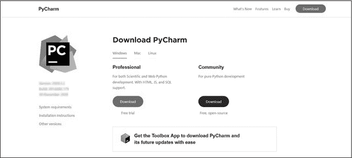

图 2-1：PyCharm 下载页面

点击**下载**以获取免费的社区版本（图 2-1），下载完成后，运行可执行安装程序并按照安装步骤操作。我们建议直接接受安装程序推荐的所有默认设置。

### 创建一个项目

在系统中找到 PyCharm 并运行它。选择 **新建项目**，你应该会看到一个类似于图 2-2 的窗口。在这个用户界面中，有几个选项需要注意：项目名称，你需要在“位置”字段中的后缀部分输入；虚拟环境；Python 解释器；以及创建 *main.py* 脚本的复选框。

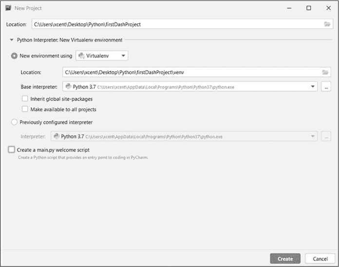

图 2-2：设置 PyCharm 项目

我们将把我们的项目命名为 *firstDashProject*，但你可以使用任何你喜欢的名称。短小的全小写项目名称更符合惯例，但我们暂时使用一个更直观的名称。如果想换个名称，只需修改“位置”字段中最后一个反斜杠（\）后的文本即可。

虚拟环境和解释器字段应该会自动填充 PyCharm 在你的系统上检测到的内容。在图 2-2 中，就是 Python 3.7。因此，我们将使用与标准 Python 安装一起提供的虚拟环境 Virtualenv。使用虚拟环境意味着你安装的所有软件包默认只会安装在项目环境中，而不会安装到你的机器上，从而将所有与项目相关的内容保持在一个整洁的地方。像这样虚拟化项目的依赖关系有很多优点，其中之一是你可以为不同的项目安装冲突的版本，而不会弄乱操作系统。例如，如果一个项目使用旧版本的 Dash，而你需要为另一个项目使用新版本的 Dash，全球安装 Dash 几乎肯定会导致问题。当你在不同的虚拟环境中安装不同版本的 Dash——每个项目一个——就可以避免这些版本冲突。

最后，通过取消勾选底部的框，选择不创建 *main.py* 欢迎脚本。许多 Python 程序使用 *main.py* 作为程序的主要入口点。为了执行项目，它们会执行 *main.py* 文件，进而启动程序提供的所有其他功能。然而，对于 Dash 应用程序来说，根据约定，代码的主要入口点是 *app.py* 文件——尽管通常可以使用任意文件名。因此，我们建议在所有 Dash 项目中取消勾选 *main.py* 框。

其余的我们保持默认设置。

点击 **创建**，你应该会看到你的第一个 PyCharm 仪表板项目！它应该类似于图 2-3。

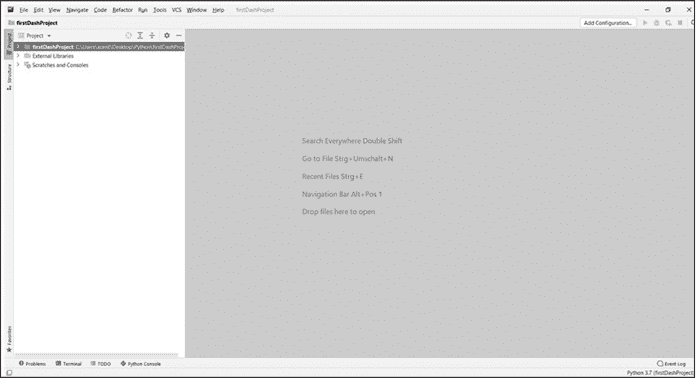

图 2-3：你的第一个 PyCharm 仪表板项目

在我们深入了解如何在 PyCharm 中创建仪表板应用程序之前，让我们快速浏览一下 PyCharm 界面（参见图 2-4）。

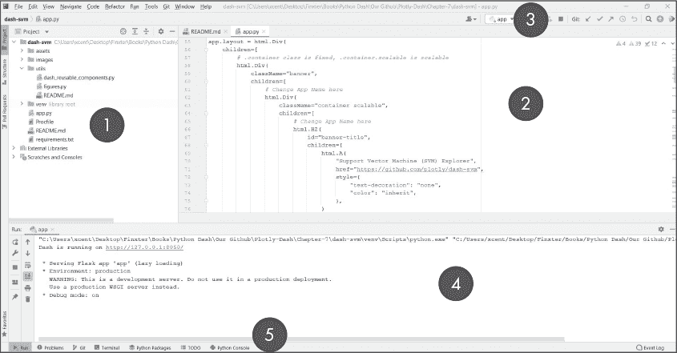

图 2-4：PyCharm 界面概览

图 2-4 展示了界面中最重要的元素：

1.  *项目工具窗口*让你查看项目文件夹的结构。对于较大的项目，保持对所有代码功能和模块如何协同工作以提供一个完整的整体的高层次概览至关重要。

2.  *编辑窗口*允许你打开、编写和编辑项目中的多个代码文件。你可以在项目工具窗口中浏览项目，并双击文件在编辑窗口中打开它们。这就是你编写和编辑代码的地方。

3.  *导航栏*提供了按钮和快捷键，用于快速执行最重要的功能，例如启动和停止应用程序、选择要执行的主模块、搜索文件和调试应用程序。

4.  在你启动应用程序后，你将会在*运行工具窗口*中看到其输出和执行状态。在图 2-4 中，我们刚刚启动了第一个仪表盘应用，因此运行窗口显示了我们可以点击或输入到浏览器中的 URL 来查看我们的仪表盘应用。如果你在代码中使用了 print() 语句，这就是打印输出将出现的位置。

5.  运行工具窗口还提供了另一个导航栏，允许你在不同的*标签*之间切换。例如，你可以打开一个 Python shell，打开 Windows 的命令行或 macOS 的终端，以访问操作系统的功能，或者以逐步方式调试你的应用程序。

PyCharm 提供了许多额外的窗口，但这些是你在任何应用程序中都会使用到的最重要窗口，无论它是否是一个仪表盘应用。其余的部分留给你在闲暇时探索。

### 运行一个 Dash 应用

现在，我们将看看一个来自官方 Dash 文档的示例仪表盘应用。此代码创建了示例仪表盘应用，在图 2-5 中展示了一个简单的条形图。它还在你的本地计算机上启动了一个服务器，以便你可以在浏览器中查看仪表盘应用。

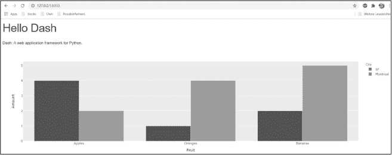

图 2-5：一个示例 Dash 应用

在 PyCharm 中，右键点击左侧菜单面板中的项目，选择 **新建**►**文件**。将文件命名为 *app.py* 并将代码从 [*https://<wbr>dash<wbr>.plotly<wbr>.com<wbr>/layout*](https://dash.plotly.com/layout) 中复制到文件中，代码也展示在清单 2-1 中。

# 使用 'python app.py' 运行此应用，并

# 访问 http://127.0.0.1:8050/ 在你的网页浏览器中。

from dash import Dash, html, dcc

import plotly.express as px

import pandas as pd

import pandas as pd

# 假设你有一个“长格式”的数据框

# 参见 https://plotly.com/python/px-arguments/ 了解更多选项

df = pd.DataFrame({

   "水果": ["苹果", "橙子", "香蕉", "苹果", "橙子", "香蕉"],

   "数量": [4, 1, 2, 2, 4, 5],

   "城市": ["旧金山", "旧金山", "旧金山", "蒙特利尔", "蒙特利尔", "蒙特利尔"]

})

fig = px.bar(df, x="水果", y="数量", color="城市", barmode="group")

app.layout = html.Div(children=[

   html.H1(children='你好 Dash'),

   html.Div(children='''

      Dash: 一个用于数据的 web 应用框架。

   '''),

   dcc.Graph(

      id='example-graph',

      figure=fig

   )

])

if __name__ == '__main__':

   app.run_server(debug=True)

示例 2-1：来自 Dash 文档的示例应用

我们并不指望你现在就理解这些代码，也不会在此详细解释。大体来说，这段代码导入了必要的库，构建了应用并设置了样式，创建了数据并在条形图中进行了可视化，并设置了总体布局以包含标题等内容。最后两行启动了服务器，以便你可以在浏览器中查看它（参见图 2-6）。在学习了后续章节后，你会发现这段代码其实很简单。

现在运行你的项目：去顶部菜单选择 **Run**►**app.py**。你也可以点击导航栏中的绿色播放按钮。然而，你会发现我们遇到了一些问题：运行程序时，在底部的运行工具窗口显示了一个错误，如 图 2-6 所示。我们的应用还不能正常工作，因为我们在导入 Dash，但 PyCharm 并未识别 Dash！原因是 Dash 不是 Python 标准库的一部分：你需要手动安装它才能在项目中使用。

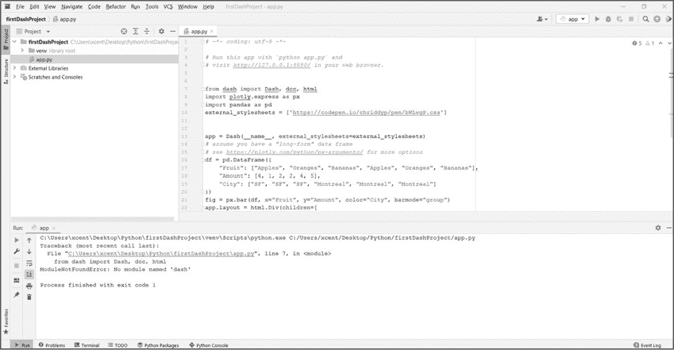

图 2-6：PyCharm Dash 错误

你可能会好奇为什么我们没有早点安装 Dash。正如你将很快看到的那样，因为每个项目都在自己的虚拟环境中隔离，这样做是为了将来在实际使用 Dash 时遵循良好的实践。

### 通过 PyCharm 安装 Dash

有两种方式可以安装 Dash：一种是全局安装在您的计算机上，这意味着每个未来的项目都能导入 Dash；另一种是在虚拟环境中本地安装，这意味着只有当前项目能够导入 Dash，且您需要为其他虚拟环境中的项目重新安装它。推荐的方式是在虚拟环境中安装。

注意

*PyCharm 在不同系统上的运行可能略有不同，因此如果您在此步骤遇到问题，请查看我们的完整指南，获得帮助：* [`<wbr>blog<wbr>.finxter<wbr>.com<wbr>/how<wbr>-to<wbr>-install<wbr>-a<wbr>-library<wbr>-on<wbr>-pycharm`](https://blog.finxter.com/how-to-install-a-library-on-pycharm) *。*

PyCharm 允许我们直接通过应用代码安装 Dash。点击红色下划线的 dash 库导入行并将光标悬停在那里；应该会出现一个小的红色灯泡，并显示一个菜单。选择图 2-7 中显示的 **安装 Dash 包** 选项。

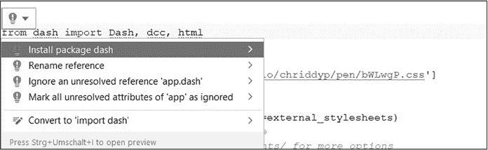

图 2-7：通过 PyCharm 安装 Dash

请注意，此选项仅在您已在虚拟环境中创建了 PyCharm 项目时才会出现（请参见 图 2-2）。如果看不到安装包的选项，您可以打开运行工具窗口中的终端标签，并输入：

$ pip install dash

安装 Dash 库需要一些时间。请记住，库仅安装在此 *虚拟环境* 中——也就是说，不是在您的全局操作系统上，而仅在项目级别。如果是不同的项目，您可能需要再次安装 Dash。

根据你的本地环境，你可能还需要重复相同的步骤来安装 pandas 库。请访问 pandas 安装指南：[*https://<wbr>blog<wbr>.finxter<wbr>.com<wbr>/how<wbr>-to<wbr>-install<wbr>-pandas<wbr>-on<wbr>-pycharm*](https://blog.finxter.com/how-to-install-pandas-on-pycharm)。我们将在第三章中讲解 pandas 的安装。

现在再次尝试运行 *app.py*，你应该会看到类似这样的内容：

Dash 正在运行于 http://127.0.0.1:8050/

   * 正在服务 Flask 应用程序 "app"（懒加载）

   * 环境：生产

     警告：这是一个开发服务器。请勿在生产环境中使用。

     请改用生产环境的 WSGI 服务器。

   * 调试模式：开启

你的应用正在本地机器上托管，因此外部无法访问它。在内部，Dash 使用 Python 的 Flask 库来为用户提供网站。要测试你的应用，请将 *http://127.0.0.1:8050/* 复制到浏览器中，或者在 PyCharm 的输出窗口中点击它。这个 URL 表示仪表盘应用运行在本地服务器上，服务器托管在你的机器上，IP 地址是 127.0.0.1——这是一个通常被称为 *localhost* 的 *回环* 地址，可以理解为“你的本地计算机”——端口是 8050。

欲了解更多有关 PyCharm 的信息，请查看我们的多页博客教程：[*https://<wbr>blog<wbr>.finxter<wbr>.com<wbr>/pycharm<wbr>-a<wbr>-simple<wbr>-illustrated<wbr>-guide*](https://blog.finxter.com/pycharm-a-simple-illustrated-guide)。

### 使用 Dash 与 GitHub

学习 Dash 和熟悉 PyCharm 的一个绝佳方法是复制专家的现有 Dash 项目，并尝试修改它们的代码。从专家那里学习代码项目是测试和改进你思维的最佳方法之一。之前，你通过复制粘贴文件 *app.py* 中的代码来尝试了示例应用程序。考虑到许多代码项目包含多个文件和更复杂的文件夹结构，这并不总是最方便的方法。这里我们将克隆一个 GitHub 项目。大多数开源项目都可以在 GitHub 上找到，所以有很多可供你查看的项目。

注意

*在我们开始之前，你需要安装 GitHub。如果还没有安装，你可以从官方网站下载 Git（*[`git-scm.com/downloads`](https://git-scm.com/downloads)）*或者通过 PyCharm 安装它。*

要将 GitHub 项目克隆到新的 PyCharm 项目中，首先获取你想要克隆的 GitHub 仓库的 URL；在[*https://<wbr>github<wbr>.com<wbr>/plotly<wbr>/dash<wbr>-sample<wbr>-apps*](https://github.com/plotly/dash-sample-apps)上有许多项目可供选择。图 2-8 展示了来自 Plotly 的一些 Dash Gallery 示例应用。

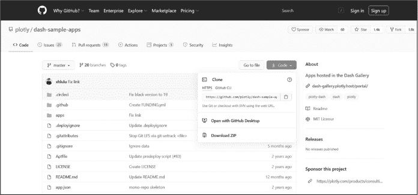

图 2-8：GitHub 上的 Dash Gallery 示例应用

点击仓库中的**代码**并复制 URL。例如，你可以使用[*https://<wbr>github<wbr>.com<wbr>/plotly<wbr>/dash<wbr>-sample<wbr>-apps<wbr>.git*](https://github.com/plotly/dash-sample-apps.git)访问包含所有 Dash 应用的仓库。

打开 PyCharm 并点击**VCS**►**从版本控制获取**，如图 2-9 所示。输入 URL 地址。请注意，构建这个项目将从 Git 项目的 URL 创建一个新的项目，因此你从哪个项目开始都无所谓。

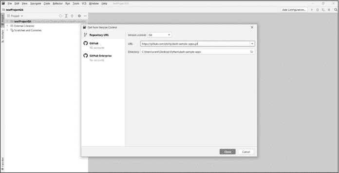

图 2-9：在 PyCharm 中打开 GitHub 仓库

点击**克隆**并等待操作完成。这个过程可能需要一些时间，因为该仓库包含了所有的 Dash Gallery 项目。安装整个仓库使你能够快速尝试许多不同的 Dash 项目，并查看专家是如何实现你感兴趣的 Dash 功能的。

接下来，PyCharm 会要求你设置一个虚拟环境，以安装示例应用所需的库（参见图 2-10）。点击**确定**。如需故障排除，请按照[*https://<wbr>www<wbr>.jetbrains<wbr>.com<wbr>/help<wbr>/pycharm<wbr>/creating<wbr>-virtual<wbr>-environment<wbr>.html*](https://www.jetbrains.com/help/pycharm/creating-virtual-environment.html)中列出的详细策略操作。

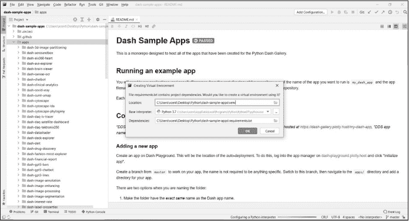

图 2-10：在 PyCharm 中为已签出的 GitHub 仓库安装虚拟环境中的库

恭喜！你的 PyCharm 项目现在应该可以正常工作了。你已经创建了原始 GitHub 项目的克隆。*克隆*只是原始项目的副本，所以如果你更改了克隆中的代码，除了你自己，其他人是看不到这些更改的。

图 2-11 展示了如何打开单个仪表板应用的主入口点：文件*app.py*。在 PyCharm 中打开该文件，安装它依赖的任何库，运行它，并在你的浏览器中查看。

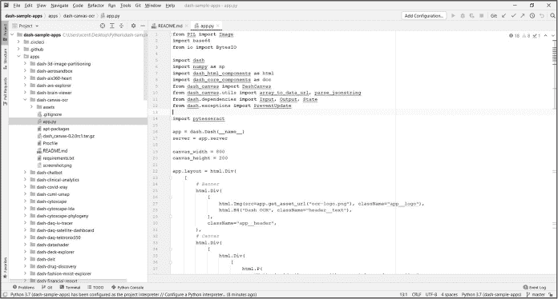

图 2-11：打开来自 Dash Gallery 的仪表板应用的 app.py 文件

如果你想查看更多示例 Dash 应用程序，Dash 画廊中的 [*https://<wbr>dash<wbr>.gallery<wbr>/Portal*](https://dash.gallery/Portal) 指向许多由 Dash 专家创建的 GitHub 仓库。克隆它们就像使用 Dash 画廊提供的网址重复这些步骤一样简单。如果你没有使用 PyCharm，可以查看这份关于如何克隆现有仓库的指南：[*https://<wbr>docs<wbr>.github<wbr>.com<wbr>/en<wbr>/github<wbr>/creating<wbr>-cloning<wbr>-and<wbr>-archiving<wbr>-repositories<wbr>/cloning<wbr>-a<wbr>-repository*](https://docs.github.com/en/github/creating-cloning-and-archiving-repositories/cloning-a-repository)。别担心——你无法破坏任何东西，所以可以放心地玩转代码。像 Git 这样的版本控制系统可以让你轻松地回到初始状态。

### 总结

在本章中，你学习了如何设置 PyCharm，它是最流行的 Python IDE 之一。PyCharm 与 Python Dash 的集成非常好。具体来说，你学习了如何通过 PyCharm 安装 PyCharm 和第三方库（如 Dash），创建第一个简单的 Dash 项目，运行该项目，并在浏览器中查看你的仪表板应用。此外，你还学习了如何将 PyCharm 与最流行的版本控制系统 Git 集成，这样你就可以查看现有的 Dash 应用程序，与他人一起学习和协作。

事实上，现在正是跟随本教程的步骤、克隆画廊中现有的仪表板应用程序、运行它并调整一些简单的内容（如颜色和文本标签）以熟悉 Dash 的好时机！我们将在接下来的章节中详细解释所有内容，但在尝试关闭知识差距之前先打开它，难道不是更好的吗？

安装了 PyCharm 后，我们将继续介绍 pandas 库。pandas 库帮助你组织和处理要在仪表板应用中可视化的数据！
