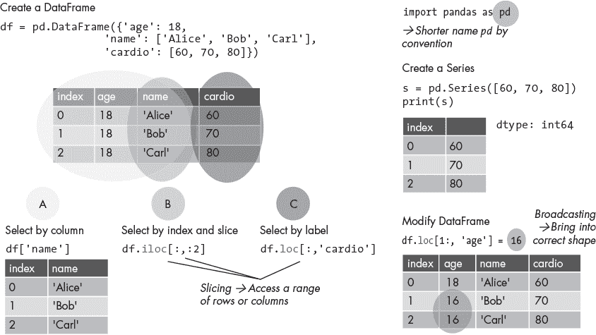
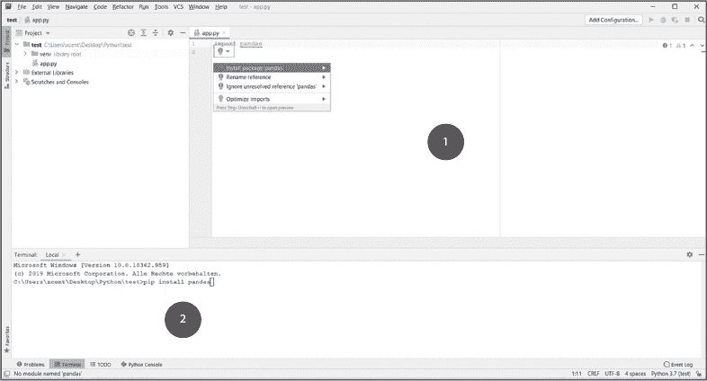
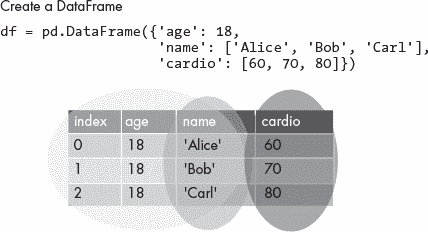
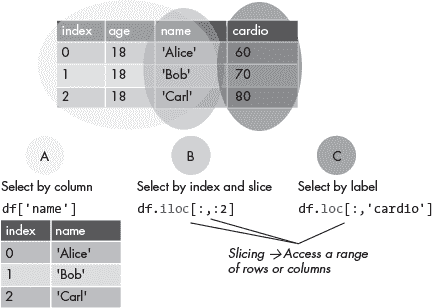
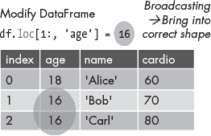

## <samp class="SANS_Futura_Std_Bold_Condensed_B_11">3</samp> <samp class="SANS_Dogma_OT_Bold_B_11">PANDAS 速成课程</samp>

仪表盘应用程序主要用于可视化数据。但在此之前，你需要对数据进行预处理、清理和分析。为了帮助你完成这些任务，Python 提供了一整套强大的数据分析模块，包括流行的 pandas 库。*pandas 库*提供了用于表示和操作数据的数据结构和功能。可以把它看作是代码中的高级电子表格程序，带有额外的功能，包括创建电子表格、通过名称访问单独的行、计算基本统计信息、对满足特定条件的单元格进行操作等。

本章快速介绍了最重要的 pandas 特性。它松散地基于官方的“10 分钟掌握 pandas”指南，但在这里我们将内容压缩为本书中最相关的信息。你可以在[*https://<wbr>blog<wbr>.finxter<wbr>.com<wbr>/pandas<wbr>-quickstart*](https://blog.finxter.com/pandas-quickstart)找到一个 8 分钟的 pandas 速成视频教程。

### <samp class="SANS_Futura_Std_Bold_B_11">视觉概览备忘单</samp>

图 3-1 提供了本章所述主题的图形化概览。

<samp class="SANS_Futura_Std_Book_Oblique_I_11">图 3-1：pandas 备忘单</samp>

在阅读本章时，随时可以返回查看此图形。接下来，我们将深入逐步解释以下各部分内容。

### <samp class="SANS_Futura_Std_Bold_B_11">安装 pandas</samp>

使用以下命令在你的虚拟环境或系统中通过终端、命令行或 shell 安装 pandas 库：

<samp class="SANS_TheSansMonoCd_W5Regular_11">$</samp> <samp class="SANS_TheSansMonoCd_W7Bold_B_11">pip install pandas</samp>

如果你已经安装了 pandas，我们建议使用命令<samp class="SANS_TheSansMonoCd_W5Regular_11">pip install -U pandas</samp>更新到最新版本。

一些编辑器和 IDE 集成了终端，你可以用它来安装 pandas，包括 PyCharm，如图 3-2 所示。如果你使用的是其他 IDE，你可以使用它提供的终端，或者操作系统自带的终端。如果你已安装 PyCharm，可以在主编辑器中输入<samp class="SANS_TheSansMonoCd_W5Regular_11">import pandas</samp>，此时工具提示会显示出来。当你点击工具提示时，它会给你提供安装 pandas 的选项，如图 3-2 所示。

安装 pandas 的两种方式在图 3-2 中展示。

<samp class="SANS_Futura_Std_Book_Oblique_I_11">图 3-2：使用工具提示（1）或集成终端并输入命令 pip install pandas（2）在 PyCharm 中安装 pandas。</samp>

要在你的 Python 脚本中访问 pandas 库，只需使用 <samp class="SANS_TheSansMonoCd_W5Regular_11">import pandas</samp> 语句导入它。通常，为了方便访问和简洁起见，pandas 会被赋予别名 <samp class="SANS_TheSansMonoCd_W5Regular_11">pd</samp>，因此添加到脚本顶部的完整行将是：

<samp class="SANS_TheSansMonoCd_W5Regular_11">import pandas as pd</samp>

这样，你就可以用 <samp class="SANS_TheSansMonoCd_W5Regular_11">pd.somefunction()</samp> 来替代 <samp class="SANS_TheSansMonoCd_W5Regular_11">pandas.somefunction()</samp>。

<samp class="SANS_Dogma_OT_Bold_B_11">故障排除</samp>

<samp class="SANS_Futura_Std_Book_11">如果在尝试运行带有 pandas 的代码时发现它仍未正确安装，请按照以下步骤在 PyCharm 项目中正确安装 pandas：</samp>

<samp class="SANS_Futura_Std_Book_11">1. 在 PyCharm 菜单中选择</samp> <samp class="SANS_Futura_Std_Bold_B_11">文件</samp>►<samp class="SANS_Futura_Std_Bold_B_11">设置</samp>►<samp class="SANS_Futura_Std_Bold_B_11">项目</samp> <samp class="SANS_Futura_Std_Book_11">。</samp>

<samp class="SANS_Futura_Std_Book_11">2. 选择你当前的项目。</samp>

<samp class="SANS_Futura_Std_Book_11">3. 点击项目选项卡中的</samp> <samp class="SANS_Futura_Std_Bold_B_11">Python 解释器</samp> <samp class="SANS_Futura_Std_Book_11">选项卡。</samp>

<samp class="SANS_Futura_Std_Book_11">4. 点击小加号符号 (</samp>+<samp class="SANS_Futura_Std_Book_11">) 以向项目添加新的库。</samp>

<samp class="SANS_Futura_Std_Book_11">5. 输入要安装的库名称，这里是</samp> <samp class="SANS_Futura_Std_Bold_B_11">pandas</samp><samp class="SANS_Futura_Std_Book_11">，然后点击</samp> <samp class="SANS_Futura_Std_Bold_B_11">安装包</samp><samp class="SANS_Futura_Std_Book_11">。</samp>

<samp class="SANS_Futura_Std_Book_11">6. 等待安装完成，然后关闭所有弹出窗口。</samp>

### <samp class="SANS_Futura_Std_Bold_B_11">在 pandas 中创建对象</samp>

pandas 中最重要的两种数据类型是 Series 和 DataFrame。一个 pandas Series 是一个一维数据数组，类似于 Excel 表格中的一列。一个 pandas DataFrame 是一个二维标记的数据结构，很像一个完整的电子表格。Series 和 DataFrame 结构的目的是方便数据的存储、访问和分析。

为了便于使用索引访问单独的行或列，pandas 在创建 DataFrame 结构时会自动添加行和列索引。默认情况下，pandas 使用从零开始的索引，因此它从索引 0 开始，并将后续的索引按顺序递增，直到数据结构的末尾。

<samp class="SANS_Futura_Std_Bold_Condensed_Oblique_I_11">Series</samp>

要在 PyCharm IDE 中跟随 pandas 示例，请选择 **文件**►**新建项目**，然后通过 **文件**►**新建**►**Python 文件** 创建一个新的空 Python 文件。你可以为项目和 Python 文件指定任何你喜欢的名称。在新的项目文件中，复制以下代码来创建一个简单的 Series 对象（确保你已安装 pandas）：

<samp class="SANS_TheSansMonoCd_W5Regular_11">import pandas as pd</samp>

<samp class="SANS_TheSansMonoCd_W5Regular_11">s = pd.Series([42, 21, 7, 3.5])</samp>

<samp class="SANS_TheSansMonoCd_W5Regular_11">print(s)</samp>

运行代码后，你应该会看到以下输出：

<samp class="SANS_TheSansMonoCd_W5Regular_11">0      42.0</samp>

<samp class="SANS_TheSansMonoCd_W5Regular_11">1      21.0</samp>

<samp class="SANS_TheSansMonoCd_W5Regular_11">2      7.0</samp>

<samp class="SANS_TheSansMonoCd_W5Regular_11">3      3.5</samp>

<samp class="SANS_TheSansMonoCd_W5Regular_11">数据类型：float64</samp>

你刚刚通过 <samp class="SANS_TheSansMonoCd_W5Regular_11">pd.Series()</samp> 构造函数创建了一个 Series，并传递给它一个值的列表。你也可以通过传递其他数据类型来创建 Series，例如整数列表、布尔元组或任何其他可迭代的数据值，pandas 会自动确定整个 Series 的数据类型并将其分配给 Series 对象，如输出的最后一行所示。

<samp class="SANS_Futura_Std_Bold_Condensed_Oblique_I_11">数据框</samp>

pandas 数据框类似于你代码中的数据表，包含行、列和填充了特定类型数据的单元格，如图 3-3 所示。

<samp class="SANS_Futura_Std_Book_Oblique_I_11">图 3-3：创建一个包含三列（不包括索引列）和三行的 pandas 数据框对象</samp>

列表 3-1 展示了如何创建一个简单的 DataFrame 对象。

<samp class="SANS_TheSansMonoCd_W5Regular_11">import pandas as pd</samp>

<samp class="SANS_TheSansMonoCd_W5Regular_11">df = pd.DataFrame({'age': 18,</samp>

<samp class="SANS_TheSansMonoCd_W5Regular_11">                   'name': ['Alice', 'Bob', 'Carl'],</samp>

<samp class="SANS_TheSansMonoCd_W5Regular_11">                   'cardio': [60, 70, 80]})</samp>

<samp class="SANS_TheSansMonoCd_W5Regular_11">print(df)</samp>

<samp class="SANS_Futura_Std_Book_Oblique_I_11">列表 3-1：名为 df 的示例数据框</samp>

这将给我们一个如下所示的 DataFrame：

|  | <samp class="SANS_TheSansMonoCd_W5Regular_11">age</samp> | <samp class="SANS_TheSansMonoCd_W5Regular_11">name</samp> | <samp class="SANS_TheSansMonoCd_W5Regular_11">cardio</samp> |
| --- | --- | --- | --- |
| <samp class="SANS_TheSansMonoCd_W5Regular_11">0</samp> | <samp class="SANS_TheSansMonoCd_W5Regular_11">18</samp> | <samp class="SANS_TheSansMonoCd_W5Regular_11">Alice</samp> | <samp class="SANS_TheSansMonoCd_W5Regular_11">60</samp> |
| <samp class="SANS_TheSansMonoCd_W5Regular_11">1</samp> | <samp class="SANS_TheSansMonoCd_W5Regular_11">18</samp> | <samp class="SANS_TheSansMonoCd_W5Regular_11">Bob</samp> | <samp class="SANS_TheSansMonoCd_W5Regular_11">70</samp> |
| <samp class="SANS_TheSansMonoCd_W5Regular_11">2</samp> | <samp class="SANS_TheSansMonoCd_W5Regular_11">18</samp> | <samp class="SANS_TheSansMonoCd_W5Regular_11">Carl</samp> | <samp class="SANS_TheSansMonoCd_W5Regular_11">80</samp> |

使用 <samp class="SANS_TheSansMonoCd_W5Regular_11">pd.DataFrame()</samp> 构造函数来创建 DataFrame。当你使用字典初始化 DataFrame 时，就像我们在这里做的那样，字典的键是列名，字典的值是该列的行值。你也可以仅提供一个列值，例如 <samp class="SANS_TheSansMonoCd_W5Regular_11">18</samp>，并将其分配给整个列名，例如 <samp class="SANS_TheSansMonoCd_W5Regular_11">age</samp>，这样该列中的每个单元格都会填充值 <samp class="SANS_TheSansMonoCd_W5Regular_11">18</samp>。

<samp class="SANS_Dogma_OT_Bold_B_15">注意</samp>

*从技术上讲，如果为某一特定列的所有行只提供一个单一的值，pandas 会自动将该值设置为 DataFrame 中所有现有行的值，这一过程被称为* 广播 *。*

DataFrame 还可以通过从 CSV 文件中读取数据来构建。你可以使用 pandas 的 <samp class="SANS_TheSansMonoCd_W5Regular_11">read_csv()</samp> 函数将 CSV 文件加载为 DataFrame，像这样：

<samp class="SANS_TheSansMonoCd_W5Regular_11">import pandas as pd</samp>

<samp class="SANS_TheSansMonoCd_W5Regular_11">path = "</samp><samp class="SANS_TheSansMonoCd_W5Regular_Italic_I_11">your</samp><samp class="SANS_TheSansMonoCd_W5Regular_11">/</samp><samp class="SANS_TheSansMonoCd_W5Regular_Italic_I_11">path</samp><samp class="SANS_TheSansMonoCd_W5Regular_11">/</samp><samp class="SANS_TheSansMonoCd_W5Regular_Italic_I_11">to</samp><samp class="SANS_TheSansMonoCd_W5Regular_11">/</samp><samp class="SANS_TheSansMonoCd_W5Regular_Italic_I_11">CSV</samp><samp class="SANS_TheSansMonoCd_W5Regular_11">/</samp><samp class="SANS_TheSansMonoCd_W5Regular_Italic_I_11">file</samp><samp class="SANS_TheSansMonoCd_W5Regular_11">.csv"</samp>

<samp class="SANS_TheSansMonoCd_W5Regular_11">df =</samp> <samp class="SANS_TheSansMonoCd_W5Regular_11">pd.read_csv(path)</samp>

你需要将文件的路径替换为你的具体路径；这个路径可以是绝对路径，也可以是相对于你脚本所在位置的相对路径。例如，如果 CSV 文件与 Python 脚本在同一目录下，你可以直接给出文件名作为相对路径。

### <samp class="SANS_Futura_Std_Bold_B_11">在 DataFrame 中选择元素</samp>

Series 对象和 DataFrame 允许轻松访问单个元素。接下来我们将看到如何以简单、高效且可读的方式存储、访问和分析来自 DataFrame 的数据。Series 对象可以看作是仅有一维的 DataFrame，因此理解 DataFrame 的访问方式也有助于理解 Series 的访问方式。图 3-4 为你提供了便捷的备忘单，展示了数据访问的三种方式：按列选择（A），按索引和切片选择（B），按标签选择（C）。接下来的小节将简要概述每种方法，我们将在后续章节中深入探讨。

<samp class="SANS_Futura_Std_Book_Oblique_I_11">图 3-4：三种不同的 DataFrame 元素选择方式</samp>

<samp class="SANS_Futura_Std_Bold_Condensed_Oblique_I_11">按列选择</samp>

你可以使用已经熟悉的方括号表示法来访问列，这种表示法在 Python 列表和字典中也有使用。使用来自清单 3-1 的 <samp class="SANS_TheSansMonoCd_W5Regular_11">df</samp> 数据框，我们可以像这样选择 <samp class="SANS_TheSansMonoCd_W5Regular_11">age</samp> 列中的所有元素：

<samp class="SANS_TheSansMonoCd_W5Regular_11">print(df['age'])</samp>

这将打印：

<samp class="SANS_TheSansMonoCd_W5Regular_11">0     18</samp>

<samp class="SANS_TheSansMonoCd_W5Regular_11">1     18</samp>

<samp class="SANS_TheSansMonoCd_W5Regular_11">2     18</samp>

<samp class="SANS_TheSansMonoCd_W5Regular_11">Name: age, dtype: int64</samp>

你可以使用访问的 DataFrame 名称和方括号中的列名来选择标记为 <samp class="SANS_TheSansMonoCd_W5Regular_11">age</samp> 的列中的所有值。

注意，pandas 也允许使用替代语法 <samp class="SANS_TheSansMonoCd_W5Regular_11">df.age</samp> 来访问列。尽管你会在某些 pandas 代码库中看到这种写法，但更常见的做法是使用方括号表示法 <samp class="SANS_TheSansMonoCd_W5Regular_11">df['age']</samp>，这与标准的 Python 列表、字符串和字典索引类似。

<samp class="SANS_Futura_Std_Bold_Condensed_Oblique_I_11">按索引和切片选择</samp>

要访问 DataFrame 中的特定行，我们使用切片表示法 <samp class="SANS_TheSansMonoCd_W5Regular_11">df[start:stop]</samp>。如第一章中所提到的，<samp class="SANS_TheSansMonoCd_W5Regular_11">start</samp> 索引所在的行会被包括在内，而 <samp class="SANS_TheSansMonoCd_W5Regular_11">stop</samp> 索引所在的行则会被排除在选择之外。不过，要小心使用 <samp class="SANS_TheSansMonoCd_W5Regular_11">df.loc[start:stop]</samp>，因为在这种情况下，<samp class="SANS_TheSansMonoCd_W5Regular_11">stop</samp> 索引实际上是*包含*的，这是一个常见的混淆来源！

<samp class="SANS_Dogma_OT_Bold_B_15">注意</samp>

*你可以在* [`blog.finxter.com/introduction-to-slicing-in-python`](https://blog.finxter.com/introduction-to-slicing-in-python) *找到关于 Python 切片的详细教程，以及在* [`blog.finxter.com/numpy-tutorial`](https://blog.finxter.com/numpy-tutorial) *中的切片教程。*

要仅访问一行，设置相应的 <samp class="SANS_TheSansMonoCd_W5Regular_11">start</samp> 和 <samp class="SANS_TheSansMonoCd_W5Regular_11">stop</samp> 索引：

<samp class="SANS_TheSansMonoCd_W5Regular_11">print(df[2:3])</samp>

这将打印索引为 2 的行，并通过指定 <samp class="SANS_TheSansMonoCd_W5Regular_11">stop</samp> 索引为 3，表示不再打印更多行：

|  | <samp class="SANS_TheSansMonoCd_W5Regular_11">年龄</samp> | <samp class="SANS_TheSansMonoCd_W5Regular_11">姓名</samp> | <samp class="SANS_TheSansMonoCd_W5Regular_11">心脏健康</samp> |
| --- | --- | --- | --- |
| <samp class="SANS_TheSansMonoCd_W5Regular_11">2</samp> | <samp class="SANS_TheSansMonoCd_W5Regular_11">18</samp> | <samp class="SANS_TheSansMonoCd_W5Regular_11">Carl</samp> | <samp class="SANS_TheSansMonoCd_W5Regular_11">80</samp> |

你还可以使用 <samp class="SANS_TheSansMonoCd_W5Regular_11">iloc</samp> 索引来访问 DataFrame 元素，访问第 <samp class="SANS_TheSansMonoCd_W5Regular_11">i</samp> 行和第 <samp class="SANS_TheSansMonoCd_W5Regular_11">j</samp> 列。这里我们通过零基索引 2 和 1，分别访问 <samp class="SANS_TheSansMonoCd_W5Regular_11">df</samp> DataFrame 的第三行和第二列：

<samp class="SANS_TheSansMonoCd_W5Regular_11">print(df.iloc[2, 1])</samp>

第一个参数 <samp class="SANS_TheSansMonoCd_W5Regular_11">i</samp> 访问第 <samp class="SANS_TheSansMonoCd_W5Regular_11">i</samp> 行，第二个参数 <samp class="SANS_TheSansMonoCd_W5Regular_11">j</samp> 访问第 <samp class="SANS_TheSansMonoCd_W5Regular_11">j</samp> 列的数据值。此操作将打印第三行（索引为 2）和第二列（索引为 1）的数据，结果是 <samp class="SANS_TheSansMonoCd_W5Regular_11">'Carl'</samp>。

<samp class="SANS_Futura_Std_Bold_Condensed_B_11">布尔索引</samp>

访问符合某个条件的行的一个强大方法是使用 *布尔索引*。我们将再次使用 <samp class="SANS_TheSansMonoCd_W5Regular_11">df</samp> DataFrame，并访问心脏健康（<samp class="SANS_TheSansMonoCd_W5Regular_11">cardio</samp>）列中大于 60 的行（请稍等，我们稍后会解释）：

<samp class="SANS_TheSansMonoCd_W5Regular_11">print(df[df['cardio']>60])</samp>

这将提取最后两行：

|  | <samp class="SANS_TheSansMonoCd_W5Regular_11">年龄</samp> | <samp class="SANS_TheSansMonoCd_W5Regular_11">姓名</samp> | <samp class="SANS_TheSansMonoCd_W5Regular_11">心脏健康</samp> |
| --- | --- | --- | --- |
| <samp class="SANS_TheSansMonoCd_W5Regular_11">1</samp> | <samp class="SANS_TheSansMonoCd_W5Regular_11">18</samp> | <samp class="SANS_TheSansMonoCd_W5Regular_11">Bob</samp> | <samp class="SANS_TheSansMonoCd_W5Regular_11">70</samp> |
| <samp class="SANS_TheSansMonoCd_W5Regular_11">2</samp> | <samp class="SANS_TheSansMonoCd_W5Regular_11">18</samp> | <samp class="SANS_TheSansMonoCd_W5Regular_11">Carl</samp> | <samp class="SANS_TheSansMonoCd_W5Regular_11">80</samp> |

虽然这种语法一开始看起来可能有些奇怪，但它实际上是由 pandas 的创建者精心设计的。内部条件 <samp class="SANS_TheSansMonoCd_W5Regular_11">df['cardio']>60</samp> 产生了一个布尔值的序列，如果<samp class="SANS_TheSansMonoCd_W5Regular_11">cardio</samp>列的第<samp class="SANS_TheSansMonoCd_W5Regular_11">i</samp>个元素大于 60，结果为<samp class="SANS_TheSansMonoCd_W5Regular_11">'True'</samp>。这对于 DataFrame 中的最后两行成立。因此，<samp class="SANS_TheSansMonoCd_W5Regular_11">df['cardio']>60</samp> 产生了如下的序列：

<samp class="SANS_TheSansMonoCd_W5Regular_11">0    False</samp>

<samp class="SANS_TheSansMonoCd_W5Regular_11">1     True</samp>

<samp class="SANS_TheSansMonoCd_W5Regular_11">2     True</samp>

<samp class="SANS_TheSansMonoCd_W5Regular_11">Name: Cardio, dtype: bool</samp>

这些布尔值随后作为索引传递给<DataFrame> <samp class="SANS_TheSansMonoCd_W5Regular_11">df</samp>，结果是一个只包含两行而不是三行的 DataFrame。

<samp class="SANS_Futura_Std_Bold_Condensed_Oblique_I_11">按标签选择</samp>

就像在电子表格中一样，pandas 中的每一行和每一列都有标签。标签可以是整数索引号码，例如行索引，或者是字符串名称，例如<DataFrame>中的<samp class="SANS_TheSansMonoCd_W5Regular_11">cardio</samp>列名。要通过标签访问数据，我们使用索引机制 <samp class="SANS_TheSansMonoCd_W5Regular_11">df.loc[rows, columns]</samp>。在这里，我们访问<DataFrame>中的所有行<samp class="SANS_TheSansMonoCd_W5Regular_11">name</samp>列：

<samp class="SANS_TheSansMonoCd_W5Regular_11">print(df.loc[:, 'name'])</samp>

这将给我们以下结果：

<samp class="SANS_TheSansMonoCd_W5Regular_11">0    Alice</samp>

<samp class="SANS_TheSansMonoCd_W5Regular_11">1      Bob</samp>

<samp class="SANS_TheSansMonoCd_W5Regular_11">2     Carl</samp>

<samp class="SANS_TheSansMonoCd_W5Regular_11">Name: name, dtype: object</samp>

<samp class="SANS_TheSansMonoCd_W5Regular_11">'''</samp>

我们在方括号内使用逗号分隔的切片索引方案 <samp class="SANS_TheSansMonoCd_W5Regular_11">df.loc[:, 'name']</samp>，其中第一部分 <samp class="SANS_TheSansMonoCd_W5Regular_11">:</samp> 用来选择行，第二部分 <samp class="SANS_TheSansMonoCd_W5Regular_11">'name'</samp> 用来选择从 DataFrame 中提取的列。空的切片符号（没有指定起始和结束索引）表示你想访问所有行，不加任何限制。字符串 <samp class="SANS_TheSansMonoCd_W5Regular_11">'name'</samp> 表示你只想提取 <samp class="SANS_TheSansMonoCd_W5Regular_11">name</samp> 列的值，忽略其他列。

要访问 <samp class="SANS_TheSansMonoCd_W5Regular_11">age</samp> 和 <samp class="SANS_TheSansMonoCd_W5Regular_11">cardio</samp> 两列的所有行，我们可以传递一个包含列标签的列表，如下所示：

<samp class="SANS_TheSansMonoCd_W5Regular_11">print(df.loc[:, ['age', 'cardio']])</samp>

这将得到以下结果：

|  | <samp class="SANS_TheSansMonoCd_W5Regular_11">age</samp> | <samp class="SANS_TheSansMonoCd_W5Regular_11">cardio</samp> |
| --- | --- | --- |
| <samp class="SANS_TheSansMonoCd_W5Regular_11">0</samp> | <samp class="SANS_TheSansMonoCd_W5Regular_11">18</samp> | <samp class="SANS_TheSansMonoCd_W5Regular_11">60</samp> |
| <samp class="SANS_TheSansMonoCd_W5Regular_11">1</samp> | <samp class="SANS_TheSansMonoCd_W5Regular_11">18</samp> | <samp class="SANS_TheSansMonoCd_W5Regular_11">70</samp> |
| <samp class="SANS_TheSansMonoCd_W5Regular_11">2</samp> | <samp class="SANS_TheSansMonoCd_W5Regular_11">18</samp> | <samp class="SANS_TheSansMonoCd_W5Regular_11">80</samp> |

### <samp class="SANS_Futura_Std_Bold_B_11">修改现有的 DataFrame</samp>

你可以使用赋值操作符 <samp class="SANS_TheSansMonoCd_W5Regular_11">=</samp> 来修改甚至覆盖 DataFrame 中的部分数据，方法是选择要替换的数据并将新的数据放到右侧。这里我们将 <samp class="SANS_TheSansMonoCd_W5Regular_11">age</samp> 列中的所有整数值覆盖为 16：

<samp class="SANS_TheSansMonoCd_W5Regular_11">df['age'] = 16</samp>

<samp class="SANS_TheSansMonoCd_W5Regular_11">print(s)</samp>

这里是结果：

|  | <samp class="SANS_TheSansMonoCd_W5Regular_11">age</samp> | <samp class="SANS_TheSansMonoCd_W5Regular_11">name</samp> | <samp class="SANS_TheSansMonoCd_W5Regular_11">cardio</samp> |
| --- | --- | --- | --- |
| <samp class="SANS_TheSansMonoCd_W5Regular_11">0</samp> | <samp class="SANS_TheSansMonoCd_W5Regular_11">16</samp> | <samp class="SANS_TheSansMonoCd_W5Regular_11">Alice</samp> | <samp class="SANS_TheSansMonoCd_W5Regular_11">60</samp> |
| <samp class="SANS_TheSansMonoCd_W5Regular_11">1</samp> | <samp class="SANS_TheSansMonoCd_W5Regular_11">16</samp> | <samp class="SANS_TheSansMonoCd_W5Regular_11">Bob</samp> | <samp class="SANS_TheSansMonoCd_W5Regular_11">70</samp> |
| <samp class="SANS_TheSansMonoCd_W5Regular_11">2</samp> | <samp class="SANS_TheSansMonoCd_W5Regular_11">16</samp> | <samp class="SANS_TheSansMonoCd_W5Regular_11">Carl</samp> | <samp class="SANS_TheSansMonoCd_W5Regular_11">80</samp> |

你首先使用 <samp class="SANS_TheSansMonoCd_W5Regular_11">df['age']</samp> 选择 <samp class="SANS_TheSansMonoCd_W5Regular_11">age</samp> 列，并将与 <samp class="SANS_TheSansMonoCd_W5Regular_11">age</samp> 相关联的值覆盖为整数值 <samp class="SANS_TheSansMonoCd_W5Regular_11">16</samp>。为了将单个整数复制到该列的所有行中，pandas 使用了广播。

图 3-5 显示了 pandas 备忘单的相关部分。

<samp class="SANS_Futura_Std_Book_Oblique_I_11">图 3-5：使用切片和广播修改 DataFrame 中年龄列的第 2 行和第 3 行</samp>

这是一个更高级的示例，使用切片和 <samp class="SANS_TheSansMonoCd_W5Regular_11">loc</samp> 索引来覆盖 <samp class="SANS_TheSansMonoCd_W5Regular_11">age</samp> 列的所有行（除了第一行）。首先我们将重新构建原始的 <samp class="SANS_TheSansMonoCd_W5Regular_11">df</samp> DataFrame：

<samp class="SANS_TheSansMonoCd_W5Regular_11">import pandas as pd</samp>

<samp class="SANS_TheSansMonoCd_W5Regular_11">df = pd.DataFrame({'age': 18,</samp>

<samp class="SANS_TheSansMonoCd_W5Regular_11">                  'name': ['Alice', 'Bob', 'Carl'],</samp>

<samp class="SANS_TheSansMonoCd_W5Regular_11">  </samp><samp class="SANS_TheSansMonoCd_W5Regular_11">                'cardio': [60, 70, 80]})</samp>

这给我们带来了：

|  | <samp class="SANS_TheSansMonoCd_W5Regular_11">年龄</samp> | <samp class="SANS_TheSansMonoCd_W5Regular_11">姓名</samp> | <samp class="SANS_TheSansMonoCd_W5Regular_11">心血管</samp> |
| --- | --- | --- | --- |
| <samp class="SANS_TheSansMonoCd_W5Regular_11">0</samp> | <samp class="SANS_TheSansMonoCd_W5Regular_11">18</samp> | <samp class="SANS_TheSansMonoCd_W5Regular_11">Alice</samp> | <samp class="SANS_TheSansMonoCd_W5Regular_11">60</samp> |
| <samp class="SANS_TheSansMonoCd_W5Regular_11">1</samp> | <samp class="SANS_TheSansMonoCd_W5Regular_11">18</samp> | <samp class="SANS_TheSansMonoCd_W5Regular_11">Bob</samp> | <samp class="SANS_TheSansMonoCd_W5Regular_11">70</samp> |
| <samp class="SANS_TheSansMonoCd_W5Regular_11">2</samp> | <samp class="SANS_TheSansMonoCd_W5Regular_11">18</samp> | <samp class="SANS_TheSansMonoCd_W5Regular_11">Carl</samp> | <samp class="SANS_TheSansMonoCd_W5Regular_11">80</samp> |

现在，我们通过使用标准的切片符号选择第二行和第三行来排除第一行的更改：

<samp class="SANS_TheSansMonoCd_W5Regular_11">df.loc[1:,'age'] = 16</samp>

<samp class="SANS_TheSansMonoCd_W5Regular_11">print(df)</samp>

我们可以看到 Alice 的年龄保持为 18：

|  | <samp class="SANS_TheSansMonoCd_W5Regular_11">age</samp> | <samp class="SANS_TheSansMonoCd_W5Regular_11">name</samp> | <samp class="SANS_TheSansMonoCd_W5Regular_11">cardio</samp> |
| --- | --- | --- | --- |
| <samp class="SANS_TheSansMonoCd_W5Regular_11">0</samp> | <samp class="SANS_TheSansMonoCd_W5Regular_11">18</samp> | <samp class="SANS_TheSansMonoCd_W5Regular_11">Alice</samp> | <samp class="SANS_TheSansMonoCd_W5Regular_11">60</samp> |
| <samp class="SANS_TheSansMonoCd_W5Regular_11">1</samp> | <samp class="SANS_TheSansMonoCd_W5Regular_11">16</samp> | <samp class="SANS_TheSansMonoCd_W5Regular_11">Bob</samp> | <samp class="SANS_TheSansMonoCd_W5Regular_11">70</samp> |
| <samp class="SANS_TheSansMonoCd_W5Regular_11">2</samp> | <samp class="SANS_TheSansMonoCd_W5Regular_11">16</samp> | <samp class="SANS_TheSansMonoCd_W5Regular_11">Carl</samp> | <samp class="SANS_TheSansMonoCd_W5Regular_11">80</samp> |

为了丰富我们的示例，我们将使用一个新的系统，因为 pandas 非常灵活。通过理解不同的索引方式——括号表示法、切片、<samp class="SANS_TheSansMonoCd_W5Regular_11">loc</samp> 和 <samp class="SANS_TheSansMonoCd_W5Regular_11">iloc</samp>——你将能够覆盖现有数据并添加新数据。在这里，我们通过 <samp class="SANS_TheSansMonoCd_W5Regular_11">loc</samp> 索引、切片和广播添加了一个新的列 <samp class="SANS_TheSansMonoCd_W5Regular_11">friend</samp>：

<samp class="SANS_TheSansMonoCd_W5Regular_11">df.loc[:,'friend'] = 'Alice'</samp>

<samp class="SANS_TheSansMonoCd_W5Regular_11">print(df)</samp>

这将给我们以下结果：

|  | <samp class="SANS_TheSansMonoCd_W5Regular_11">age</samp> | <samp class="SANS_TheSansMonoCd_W5Regular_11">name</samp> | <samp class="SANS_TheSansMonoCd_W5Regular_11">cardio</samp> | <samp class="SANS_TheSansMonoCd_W5Regular_11">friend</samp> |
| --- | --- | --- | --- | --- |
| <samp class="SANS_TheSansMonoCd_W5Regular_11">0</samp> | <samp class="SANS_TheSansMonoCd_W5Regular_11">18</samp> | <samp class="SANS_TheSansMonoCd_W5Regular_11">Alice</samp> | <samp class="SANS_TheSansMonoCd_W5Regular_11">60</samp> | <samp class="SANS_TheSansMonoCd_W5Regular_11">Alice</samp> |
| <samp class="SANS_TheSansMonoCd_W5Regular_11">1</samp> | <samp class="SANS_TheSansMonoCd_W5Regular_11">16</samp> | <samp class="SANS_TheSansMonoCd_W5Regular_11">Bob</samp> | <samp class="SANS_TheSansMonoCd_W5Regular_11">70</samp> | <samp class="SANS_TheSansMonoCd_W5Regular_11">Alice</samp> |
| <samp class="SANS_TheSansMonoCd_W5Regular_11">2</samp> | <samp class="SANS_TheSansMonoCd_W5Regular_11">16</samp> | <samp class="SANS_TheSansMonoCd_W5Regular_11">Carl</samp> | <samp class="SANS_TheSansMonoCd_W5Regular_11">80</samp> | <samp class="SANS_TheSansMonoCd_W5Regular_11">Alice</samp> |

请注意，使用这里显示的更简洁代码也可以达到相同的效果：

<samp class="SANS_TheSansMonoCd_W5Regular_11">df['friend'] = 'Alice'</samp>

<samp class="SANS_TheSansMonoCd_W5Regular_11">print(df)</samp>

然后我们得到了相同的结果：

|  | <samp class="SANS_TheSansMonoCd_W5Regular_11">年龄</samp> | <samp class="SANS_TheSansMonoCd_W5Regular_11">姓名</samp> | <samp class="SANS_TheSansMonoCd_W5Regular_11">心脏健康</samp> | <samp class="SANS_TheSansMonoCd_W5Regular_11">朋友</samp> |
| --- | --- | --- | --- | --- |
| <samp class="SANS_TheSansMonoCd_W5Regular_11">0</samp> | <samp class="SANS_TheSansMonoCd_W5Regular_11">18</samp> | <samp class="SANS_TheSansMonoCd_W5Regular_11">Alice</samp> | <samp class="SANS_TheSansMonoCd_W5Regular_11">60</samp> | <samp class="SANS_TheSansMonoCd_W5Regular_11">Alice</samp> |
| <samp class="SANS_TheSansMonoCd_W5Regular_11">1</samp> | <samp class="SANS_TheSansMonoCd_W5Regular_11">16</samp> | <samp class="SANS_TheSansMonoCd_W5Regular_11">Bob</samp> | <samp class="SANS_TheSansMonoCd_W5Regular_11">70</samp> | <samp class="SANS_TheSansMonoCd_W5Regular_11">Alice</samp> |
| <samp class="SANS_TheSansMonoCd_W5Regular_11">2</samp> | <samp class="SANS_TheSansMonoCd_W5Regular_11">16</samp> | <samp class="SANS_TheSansMonoCd_W5Regular_11">Carl</samp> | <samp class="SANS_TheSansMonoCd_W5Regular_11">80</samp> | <samp class="SANS_TheSansMonoCd_W5Regular_11">Alice</samp> |

### <samp class="SANS_Futura_Std_Bold_B_11">总结</samp>

这是一本关于 pandas 最相关特性的快速入门课程，这些特性将在本书中使用。pandas 库还有更多功能，包括统计计算、绘图、分组和重塑等，仅举几例。我们建议你通过本章资源部分中的链接，按自己的节奏探索 pandas。一旦你理解了本章讨论的概念，你将能够阅读和理解许多其他 Dash 项目中现有的 pandas 代码。

现在，让我们开始你的第一个仪表盘应用吧！

### <samp class="SANS_Futura_Std_Bold_B_11">资源</samp>

+   “10 分钟学习 pandas”：[*https://<wbr>pandas<wbr>.pydata<wbr>.org<wbr>/pandas<wbr>-docs<wbr>/stable<wbr>/user<wbr>_guide<wbr>/10min<wbr>.html*](https://pandas.pydata.org/pandas-docs/stable/user_guide/10min.html)

+   *咖啡休息时间熊猫*，一本在本书附属网站提供的免费电子书， [*https://<wbr>learnplotlydash<wbr>.com*](https://learnplotlydash.com)
