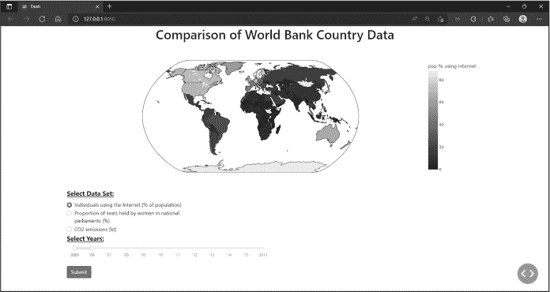
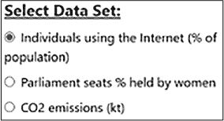
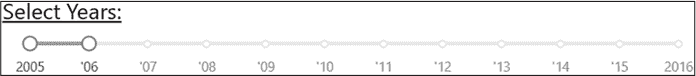
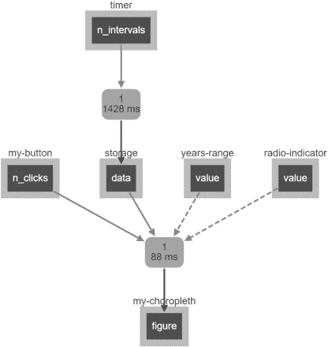
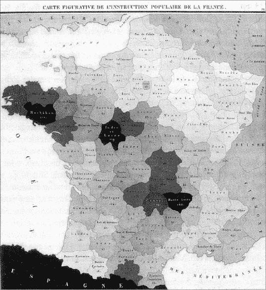

## 第五章：5 全球数据分析：高级布局 与图表

在本章中，你将通过构建一个应用程序来扩展你对 Dash 的知识，该应用程序比较和分析世界数据的三个指标：互联网使用率、女性在议会中的比例和二氧化碳（CO[2]）排放量。我们将这些指标称为*指标*。我们将更深入地了解 Dash 回调函数，并学习绘制*热力图*，这是一种通过在地图上特定区域（如国家、州、省等）内的阴影和颜色来表示定量数据的方式。你还将发现一种新的布局和样式管理方法，使用 dash-bootstrap-components 库，该库提供了复杂且响应式的布局。

为了收集这个应用程序的数据，我们将使用 pandas 访问世界银行的应用程序编程接口（API）。*API* 提供了一个接口，允许你连接到外部服务器并请求数据以供应用程序使用。

在本章结束时，你将能够更自如地在地图上绘制数据，管理更复杂的布局，理解回调函数，并使用 dash-core-components。但首先，让我们先设置应用程序和相应的代码。

### 设置项目

像往常一样，首先你需要创建项目文件夹并将应用程序代码放入其中。创建一个新的项目文件夹，命名为*world-bank-app*，并将 ZIP 文件中包含的* 第五章 *文件夹放入其中，该文件夹可以从 [*https://<wbr>github<wbr>.com<wbr>/DashBookProject<wbr>/Plotly<wbr>-Dash*](https://github.com/DashBookProject/Plotly-Dash) 下载，下载位置在第四章开始时提供。该文件夹应该包含两个文件：*worldbank.py* 和 *our_indicator.py*。将这些文件复制到你的 world-bank-app 文件夹中。

项目文件夹应该如下所示：

- world-bank-app

|--our_indicator.py

|--worldbank.py

我们需要四个库：常用的 pandas 和 Dash 库，以及 dash-bootstrap-components 和 pandas datareader。打开命令提示符（Mac 用户使用 Terminal）或在 PyCharm 或你选择的 Python IDE 中打开 Terminal 标签。然后，逐行输入以下命令来安装这四个库：

$ pip install pandas

$ pip install dash

$ pip install dash-bootstrap-components

$ pip install pandas-datareader

为了检查库是否已正确安装，请输入：

$ pip list

这将列出你当前安装的所有 Python 包。如果我们需要的四个库中有任何一个没有列出，请尝试重新输入相应的安装命令。

在查看代码之前，我们先来了解一下这个应用程序。打开你的 IDE 中的*worldbank.py*文件并运行脚本。你应该会看到一条带有 HTTP 链接的消息。点击该链接或将其复制到浏览器中：

Dash 正在运行于 http://127.0.0.1:8050/

   * 正在服务 Flask 应用 "worldbank"（懒加载）

   * 环境：生产

     警告：这是一个开发服务器，勿在生产环境中使用。

     请改用生产环境中的 WSGI 服务器。

   * 调试模式：开启

你现在应该能看到世界银行数据分析仪表板应用，如图 5-1 所示。

图 5-1：世界银行数据分析应用

玩得开心一点！使用滑块更改日期，并使用单选按钮选择一个不同的世界银行数据指标，例如议会席位或 CO[2] 排放量的指标。移动地图，鼠标悬停在某些国家上以比较它们的数据。哪个国家在议会中女性的比例最高？哪个国家的互联网使用比例在时间上增长最大？熟悉一下应用程序，随着我们逐步分析代码，你会更容易理解。

导入库

在这个应用程序中，我们引入了两个新的 Python 库：dash-bootstrap-components 和 pandas datareader。

dash-bootstrap-components 是一个使得管理应用布局更加便捷的包。Bootstrap 提供了一些组件，可以让你精确地将应用元素放置在页面上，创建更多的组件（如图表和单选按钮），并且对每个元素进行非常详细的样式设计。它基本上是 Dash 内置布局能力的一个附加功能。

我们将使用 pandas 来过滤并准备数据进行绘图，就像我们在第四章中的应用一样。然而，这个应用还将使用 pandas datareader，这是一个通过 API 获取数据并从中创建 DataFrame 的 pandas 扩展。pandas datareader 扩展提供了从多个常见的互联网来源提取数据的方法，如 NASDAQ、加拿大银行、世界银行等。我们的应用只使用世界银行的数据，因此为了访问这些数据，我们需要从 datareader 扩展中导入 wb 世界银行模块，如清单 5-1 所示。

import dash_bootstrap_components as dbc

from pandas_datareader import wb

清单 5-1：worldbank.py 应用的导入部分

数据管理

下一部分是数据管理代码，我们将通过世界银行 API 将数据导入到我们的应用中。我们还将清理数据，去除损坏的值，提取我们需要的数据，并将其与另一个 DataFrame 合并以获取缺失的值。

连接到 API

连接到 API 使我们的应用能够动态读取数据，让我们能够即时添加和更改正在读取的数据，而不需要修改和上传静态的 Excel 文件。通过使用 pandas datareader 连接到 API，我们可以在请求时立即将新数据上传到应用中。

需要注意的是，一些 API 对个人请求的次数有限制，以防止 API 受到过载。如果超过这个限制，可能会被阻止在一段时间内继续发起请求。请求之间设置超时是避免过载 API 的一种方式。

wb 模块包含用于获取与世界银行相关的不同类型数据的函数。例如，download() 函数在传入一个指标作为参数时，会从世界银行的《世界发展指标》提取信息，而 get_countries() 会查询指定国家的信息。我们将在应用中重点使用这两个函数。

让我们从下载所需的国家数据开始，将其导入到我们的应用中，如清单 5-2 所示。

countries = wb.get_countries()

countries["capitalCity"].replace({" ": None}, inplace=True)

❶ countries.dropna(subset=["capitalCity"], inplace=True)

❷ countries = countries[["name", "iso3c"]]

countries = countries[countries["name"] != "Kosovo"]

countries = countries.rename(columns={"name": "country"})

清单 5-2：从世界银行 API 下载国家数据 worldbank.py 应用程序

首先，我们连接到世界银行 API，并使用 get_countries() 提取所有国家的名称。然而，数据并不像我们希望的那样干净，其中一些行实际上包含的是地区名称而不是国家名称。例如，如果你使用以下代码打印前 10 行：

countries = wb.get_countries()

print(countries.head(10)[['name']])

exit()

你会发现，第 1 行包含的是“非洲东部和南部”地区。我们的应用程序只关注国家，因此我们使用 dropna() 来排除地区，删除所有没有首都城市的行 ❶，这样我们应该只剩下国家名称。

为了在地图上绘制点，Plotly 使用国家代码而不是国家名称，因此接下来我们需要为应用程序提供国家代码。这些代码称为 *alpha-3* 或 *ISO3* 代码，每个国家都有不同的代码。例如，奥地利的代码是 AUT，阿塞拜疆是 AZE，布隆迪是 BDI，等等。

我们不需要 get_countries() 返回的其他信息，因此我们将数据框限制为两个必要的列：name 列和 iso3c 国家代码列 ❷。

作者之前对我们的应用程序进行的实验表明，科索沃的 ISO3 数据已损坏，因此我们过滤掉数据框中的科索沃行。最后，我们将 name 列重命名为 country，以便后续更容易与另一个数据框合并（参见 清单 5-4）。

识别指标

构建好国家的 DataFrame 后，我们需要提取与三个指标相关的世界银行数据：互联网使用、女性政治家和排放数据。我们首先需要找到指标的确切名称，然后找到相应的 ID，以便正确查询 API。我们直接从世界银行网站获取指标名称。访问[*https://<wbr>data<wbr>.worldbank<wbr>.org<wbr>/indicator*](https://data.worldbank.org/indicator)。要获取互联网使用指标的名称，点击页面顶部的 **All Indicators** 标签。然后，在基础设施部分，点击 **Individuals Using the Internet (% of Population)**。这就是我们将在应用中使用的指标的确切名称。如果世界银行网站更改了指标名称，确保你搜索相似的名称并获取准确的名称。如果你遇到困难，我们也会保持书中的代码资源更新。

接下来，我们使用指标名称通过你从书籍资源下载的 *our_indicator.py* 文件来获取其 ID。在你的项目文件夹中，打开 *our_indicator.py* 文件，并在新的 IDE 窗口中运行它：

df = wb.get_indicators()[['id','name']]

df = df[df.name == 'Individuals using the Internet (% of population)']

print(df)

这只是从 DataFrame 中抓取与世界银行网站相关的 name 和 id 列的条目。输出应该显示与该指标相关的 ID：

|  | id | name |  |  |  |  |
| --- | --- | --- | --- | --- | --- | --- |
| 8045 | IT.NET.USER.ZS | Individuals using the Internet (% of population) |

你需要重复这个过程，从世界银行网站获取其余两个指标的名称，方法是将 'Individuals using the Internet (% of population)' 替换为另外两个指标的名称：'Proportion of seats held by women in national parliaments (%)'，位于性别部分，以及 'CO2 emissions (kt)'，位于气候变化部分。同样，这些名称会不时变化，因此如果没有结果，确保你在世界银行的指标页面上进行搜索，找到最接近的匹配项。然后，我们将指标的名称和 ID 存储在 *worldbank.py* 文件中的字典里，后续会用到，如清单 5-3 所示。

indicators = {

   "IT.NET.USER.ZS": "使用互联网的个人（占人口比例）",

   "SG.GEN.PARL.ZS": "女性在国家议会中所占席位比例（%）",

   "EN.ATM.CO2E.KT": "二氧化碳排放量（千吨）",

}

列表 5-3：在 worldbank.py 中定义指标

你下载的主要代码会有这些 ID，但自己练习获取这些 ID 是很有用的，因为它们会不时发生变化。

提取数据

现在我们可以构建一个函数，下载这三个世界银行指标的历史数据，如列表 5-4 所示。我们将把数据保存到一个新的 DataFrame 中，名为 df。

def update_wb_data():

   # 从 API 获取特定的世界银行数据

   df = wb.download(

      indicator=(list(indicators)), country=countries["iso3c"],

      start=2005, end=2016

   )

   df = df.reset_index()

   df.year = df.year.astype(int)

   # 将国家 ISO3 ID 添加到主数据框

   df = pd.merge(df, countries, on="country")

   df = df.rename(columns=indicators)

   return df

列表 5-4：历史数据下载部分 worldbank.py 中的代码

我们使用 wb.download() 方法来获取数据，该方法有一些参数。第一个是 indicator，它接受一个表示指标 ID 的字符串列表。在这里，我们将其赋值为 Listing 5-3 中 indicators 字典的键。下一个参数是 country，它接受一个表示国家 ISO3 代码的字符串列表。我们将其赋值为 Listing 5-2 中创建的 countries DataFrame 的 iso3c 列。最后，start 和 end 参数允许我们定义要拉取数据的年份范围。我们停留在 2016 年，因为那是世界银行为 CO[2]指标提供完整数据的最后一年。

然后，我们重置索引，使得 country 和 year 成为新的列，而不再是索引的一部分，并且我们拥有一个专门的 index 列，其中只包含整数，这将在后续的过滤操作中派上用场。你可以在 Listing 5-5 中看到重置索引的效果，我们展示了重置前后的 DataFrame。

|  |  | IT.NET.USER.ZS | SG.GEN.PARL.ZS | EN.ATM.CO2E.KT |  |
| --- | --- | --- | --- | --- | --- |
| country | year |  |  |  |  |
| 阿鲁巴 | 2016 | 93.542454 | NaN | NaN |  |
|  | 2015 | 88.661227 | NaN | NaN |  |
|  | 2014 | 83.780000 | NaN | NaN |  |
|  | 2013 | 78.900000 | NaN | NaN |  |
|  | 2012 | 74.000000 | NaN | NaN |  |
| … | … | … | … | … |  |
| 津巴布韦 | 2009 | 4.000000 | 14.953271 | 7750.0 |  |
|  | 2008 | 3.500000 | 15.238095 | 7600.0 |  |
|  | 2007 | 3.000000 | 16.000000 | 9760.0 |  |
|  | 2006 | 2.400000 | 16.666667 | 9830.0 |  |
|  | 2005 | 2.400000 | 16.000000 | 10510.0 |  |
| [2520 行 x 3 列] |
|  df.reset_index() |  |  |  |  |
|  | 国家 | 年份 | IT.NET.USER.ZS | SG.GEN.PARL.ZS | EN.ATM.CO2E.KT |
| 0 | 阿鲁巴 | 2016 | 93.542454 | NaN | NaN |
| 1 | 阿鲁巴 | 2015 | 88.661227 | NaN | NaN |
| 2 | 阿鲁巴 | 2014 | 83.780000 | NaN | NaN |
| 3 | 阿鲁巴 | 2013 | 78.900000 | NaN | NaN |
| 4 | 阿鲁巴 | 2012 | 74.000000 | NaN | NaN |
| … | … | … | … | … | … |
| 2515 | 津巴布韦 | 2009 | 4.000000 | 14.953271 | 7750.0 |
| 2516 | 津巴布韦 | 2008 | 3.500000 | 15.238095 | 7600.0 |
| 2517 | 津巴布韦 | 2007 | 3.000000 | 16.000000 | 9760.0 |
| 2518 | 津巴布韦 | 2006 | 2.400000 | 16.666667 | 9830.0 |
| 2519 | 津巴布韦 | 2005 | 2.400000 | 16.000000 | 10510.0 |
| [2520 rows x 5 columns] |

列表 5-5：重置索引前后的 DataFrame

在重置索引之前，country 和 year 是索引的一部分，但不是与索引元素相关联的结果行的一部分。重置索引后，它们都变成了 DataFrame 的独立列，这使得访问包含国家和年份数据的各行变得更加容易。

接下来，我们将 year 列中的值从字符串转换为整数，以便以后能用 pandas 正确地过滤数据。原始的 df DataFrame 中不包含我们需要的 ISO3 国家代码来查询 API，因此我们从 countries DataFrame 中提取这些代码，并通过 pd.merge 将两个 DataFrame 按照 country 列进行合并。最后，我们重命名列名，使其显示指标名称而非 ID，以便于人类阅读。例如，列 IT.NET.USER.ZS 现在将被命名为 使用互联网的个人（占总人口的百分比）。

update_wb_data() 函数现在已经完成，并将在应用启动时在第一个回调中被调用。你将在本章稍后学习这个过程。与此同时，我们来学习如何使用 dash-bootstrap-components 创建布局并为应用添加样式。

Dash Bootstrap 样式

Dash Bootstrap 是一个强大的工具，可以为 Dash 应用添加样式，帮助我们创建布局、为应用加样式，并添加 Bootstrap 组件，如按钮和单选项。按钮和单选项在 dash-core-components 中也存在，但我们将使用 dash-bootstrap-components 版本，以便与其他 Bootstrap 样式更好地兼容。Bootstrap 还包含存储各种样式表主题的模块，这些模块将项作为字符串存储，使我们可以简单地包含这些模块的链接来样式化元素。

为了将 Bootstrap 纳入 Dash 应用，我们首先必须选择一个主题，并将其分配给 external_stylesheets 参数，该参数位于导入部分下方，如 列表 5-6 所示。

import dash_bootstrap_components as dbc

from pandas_datareader import wb

app = Dash(__name__, external_stylesheets=[dbc.themes.BOOTSTRAP])

列表 5-6：Dash 被实例化的 worldbank.py 部分

Bootstrap 主题是一个在线托管的样式表，用于决定页面元素的字体类型、颜色、形状和大小。

在这个应用中，我们使用默认主题 BOOTSTRAP，它是主题列表中的第一个主题。Bootstrap 还有其他几个主题可以选择。要查看这些主题，你可以访问 [*https://<wbr>hellodash<wbr>.pythonanywhere<wbr>.com*](https://hellodash.pythonanywhere.com)，然后点击页面左侧的 **Change Theme** 按钮。如果你喜欢，可以更换本应用的主题；只需确保在将其分配给 external_stylesheets 参数时使用大写的准确名称。每次只能分配一个主题，因此如果选择了新主题，请确保替换掉 BOOTSTRAP。

若要观看完整的 Dash Bootstrap 视频教程，请查看视频“完整的 Bootstrap 仪表盘应用指南”，网址为 [*https://<wbr>learnplotlydash<wbr>.com*](https://learnplotlydash.com)。

布局

正如你所知，我们通常将应用的布局称为网格，网格通常由 12 列和无限行组成。为了开始构建布局，我们需要创建一个容器来容纳所有的行和列，以及将放置在其中的组件。dbc.Container 语法与 html.Div 非常相似，但它更兼容 Bootstrap 样式。首先，我们声明行，然后声明每行内部的列。最后，我们将应用组件放入列中。最后一步确定了每个组件在页面上的位置。

为了避免向你展示我们应用中用于创建布局的 80 行代码，列表 5-7 提供了一个简化版本，去除了每个 html、dcc 和 dbc 组件中的 props，只显示了整体结构。

app.layout = dbc.Container(

   [

     ❶ dbc.Row(

          dbc.Col(

              [

                html.H1(),

                dcc.Graph()

              ],

              width=12,

          )

       ),

     ❷ dbc.Row(

          dbc.Col(

              [

                dbc.Label(),

                dbc.RadioItems(),

              ],

              width=4,

          )

       ),

     ❸ dbc.Row(

          [

              dbc.Col(

                  [

                    dbc.Label()，

                    dcc.RangeSlider()，

                    dbc.Button()

                  ]，

                  width=6，

              )，

          ]

     )，

   ]

)

列 5-7：简化的应用布局

该应用包含三行。第一行 ❶ 有一个列组件，宽度为 12 列，其中包含 H1 标题和 Graph 可视化组件。这些对应于应用中的标题和区域图，见 图 5-1。

第二行 ❷ 中，我们放置了一个仅占四列宽度的列组件，里面放置了 Label 和 RadioItems。这些对应于应用中的“选择数据集”副标题和其下的三个单选按钮。

最后一行 ❸ 包含了 Label、RangeSlider 和 Button，它们都被包裹在一个宽度为六列的列组件中。

多组件行

需要重申的是，构建仪表板时，一种有效且受欢迎的方法是每页设置最多 12 列，并允许组件跨越多个列的宽度。在这个应用中，每行只有一个列组件，但如果我们要在一行中添加多个组件，我们必须确保它们的总宽度不超过 12。让我们来看一个例子：

dbc.Row([

     dbc.Col([dropdown, button, checkbox], width=6)，

     dbc.Col([dropdown, slider, date-picker], width=5)，

])，

在上面的代码中，总宽度为 11，这意味着所有的 Dash 组件会显示在同一行。以下是一个不推荐的示例：

dbc.Row([

     dbc.Col([dropdown, button, checkbox], width=8),

     dbc.Col([dropdown, slider, date-picker], width=6),

]),

当总宽度为 14 时，第二个 dbc.Col 中的 Dash 组件将换行显示在第一个 dbc.Col下面，导致出现两行而非一行，这可能会破坏你的布局。

组件与样式

Dash Bootstrap 组件类似于 Dash Core 组件，但其优势在于它们更易于使用，并且能与 Bootstrap 样式表更好地集成。在我们的应用中，我们使用了三个 Bootstrap 组件：Label、RadioItems 和 Button。让我们来看一下 Button 和 RadioItems 组件。

我们通过五个属性来定义 Button：id、children、n_clicks、color 和 className，如 Listing 5-8 所示。

dbc.Button(

   id="my-button",

   children="Submit",

   n_clicks=0,

   color="primary",

   className="mt-4",

)，

Listing 5-8: 定义一个 Bootstrap 按钮

id 属性用于唯一标识该组件，并将在 Dash 回调中分配给 component_id，以便与其他组件进行交互。这里我们将它命名为 my-button。children 属性表示按钮上显示的文本。n_clicks 属性计算按钮被用户点击的次数，因此我们将其初始化为 0。color 属性设置按钮背景的颜色。这里，它被分配了 Bootstrap 上下文颜色 primary，表示蓝色（我们也可以使用 secondary 来使其为灰色，success 表示绿色，warning 表示橙色，或 danger 表示红色）。请注意，primary 所代表的颜色取决于你选择的主题；如果你为 Dash 应用选择了 LUX 主题，那么 primary 将代表黑色，而 secondary 将是白色。

className 控制组件的样式。在这里，我们为它分配了 Bootstrap 类 mt-4，它控制按钮顶部和组件之间的边距大小。mt 代表 *margin top*，而 –4 在组件上方创建了四个单位的边距。这一切共同构成了图 Figure 5-2 中所示的按钮。

Figure 5-2: 我们应用的提交按钮

尝试将边距改为 mt-1，看看按钮和上方的范围滑块之间的空隙如何缩小。

你还可以在 className 属性中组合多个类，通过在每个附加类之间加空格来添加更多样式。例如，尝试在 mt-4 后添加 fw-bold，将其作为一个字符串传递给 className 属性，这样可以让“Submit”文本变为粗体，如下所示：

dbc.Button(

   id="my-button",

   children="Submit",

   n_clicks=0,

   color="primary",

   className="mt-4 fw-bold",

),

还有一些我们没有使用，但值得注意的 Button 属性。href 属性可以分配一个 URL，点击按钮后会将用户带到一个新网站。size 属性通过赋值以下之一来控制按钮的大小：'lg'、'md' 或 'sm'。disabled 属性可以禁用按钮，当我们将 True 赋值给它时；例如，我们可能想创建一个回调，指示应用在不再需要按钮时禁用它。

接下来是 RadioItems（也称为单选按钮），它是一个小圆圈或框，旁边有标签，用户可以点击它。单选按钮与复选框类似，不同的是，复选框允许用户选择多个标签，而单选按钮一次只允许选择一个标签。用户将使用它来选择他们想要显示数据的指示器，如 图 5-3 所示。

图 5-3：指示器选择 RadioItems 组件

我们通过 清单 5-9 中显示的四个属性来定义 RadioItems。

dbc.RadioItems(

   id="radio-indicator",

❶  options=[{"label": i, "value": i} for i in indicators.values()],

❷  value=list(indicators.values()) [0],

   input_class_name="me-2",

),

清单 5-9：layout 部分中的 RadioItems 组件 worldbank.py

我们首先给 RadioItems 分配一个 id 名称。options 属性负责显示标签。我们传递给它一个字典列表 ❶，每个字典代表一个标签；我们使用列表推导遍历所有指示器并为每个项目创建一个标签。或者，如果以下面这种较长的方式编写代码，我们也可以像这个（简化版）一样将一个包含三个字典的列表分配给 RadioItems options 属性，这将实现完全相同的效果：

options=[

   {"label": "使用中的个人…", "value": "使用中的个人…"},

   {"label": "座位比例…", "value": "座位比例…"},

   {"label": "CO2 排放量（kt）", "value": "CO2 排放量（kt）"}

]

每个字典有两个键：label 键决定要显示给用户的文本，而 value 键是指示器的实际值。例如，我们使用确切的文本“CO2 排放量（kt）”作为值，以便与指示器的字典键值匹配，如 列表 5-3 所示。这样，在回调部分过滤数据时会更容易。label 键可以是任何你想显示的内容，但在这里我们使用相同的字符串作为 label 和 value，因为这个字符串已经很清晰、信息量大，而且长度适中，适合显示。

下一个属性是 value ❷，它注册用户选择的值，取决于用户点击了哪个单选按钮；分配给 value 属性的对象在 列表 5-9 中表示应用首次加载时默认选择的值。我们使用 input_class_name 属性来设置单选按钮的样式；在这个例子中，我们将它设置为 Bootstrap 类 me-2，将圆形左边的间距设置为两单位。尝试更改数字，看看这如何影响外观。请注意，我们可以使用 Bootstrap 类来为 Dash Core 组件以及 Bootstrap 组件设置样式。

有无数的 Bootstrap 类，已在 [*https://<wbr>dashcheatsheet<wbr>.pythonanywhere<wbr>.com*](https://dashcheatsheet.pythonanywhere.com) 的备忘单中做了有益的总结和组织。例如，mt-4 类位于 Spacing 工具部分，而 fw-bold 类位于 Text 工具部分。可以尝试其他工具并为应用添加自己的个性化样式。由于 Bootstrap 类的数量庞大，我们在这里不会一一列举；而是建议您使用备忘单并尝试整合不同的类。

始终将一个 Bootstrap 主题分配给 external_stylesheets 参数，正如我们在 Listing 5-6 中所做的，否则 Bootstrap 布局、样式和元素将在整个应用中无法正常工作。

### Dash 核心组件

我们将向应用程序中添加几个新的 Dash 核心组件，即 RangeSlider、Store 和 Interval。

RangeSlider 通常用于展示一个广泛的可选值范围，或者当用户可以选择一个范围而不是离散值时。在这个例子中，我们将使用它来让用户选择单个年份或一段年份范围，如 Figure 5-4 所示。

图 5-4：年份选择 RangeSlider 组件

我们将通过六个属性来定义我们的 RangeSlider，如 Listing 5-10 所示。

dcc.RangeSlider(

   id="years-range",

   min=2005,

   max=2016,

   step=1,

   value=[2005, 2006],

   marks={

         2005: "2005",

         2006: " '06",

         2007: " '07",

         2008: " '08",

         2009: " '09",

         2010：" '10"，

         2011：" '11"，

         2012：" '12"，

         2013：" '13"，

         2014：" '14"，

         2015：" '15"，

         2016："2016"，

   }，

)，

列表 5-10：布局部分的 RangeSlider 组件 worldbank.py

min 和 max 属性定义了 RangeSlider 上的最小值和最大值，通常是从左到右。step 属性决定了移动滑块时的增量。我们将其值设置为 1，使得每次滑块的移动都会改变一年。但是，因为我们为每个年份都设置了标记，所以将 step 设置为另一个值，比如 3，也会得到相同的结果；用户的选择会自动对齐到最接近的标记。如果我们移除了 2005 年到 2016 年之间所有年份的标记，只保留这两个年份，假设你将 step 设置为 3，那么滑块就会以三为增量移动到最接近的值。

value 属性决定了应用加载时默认选中的初始范围；它还会检测应用用户选择的年份范围。marks 属性标记了标记点。我们为它分配一个字典：键决定年份在滑块上的位置，而值表示在该位置上显示的文本。

另一个常见的RangeSlider属性，这里没有使用，是allowCross，它允许RangeSlider的滑块（即你在图 5-4 中看到的 2005 年和'06 年上方的蓝色圆圈）在设置为True时相互交叉。默认情况下，allowCross=False，但如果你将其改为True，你就能够将 2005 年的滑块拉到右侧，跨过'06 年的滑块。关于RangeSlider的完整属性列表，参见 Dash 组件文档（*http://dash.plotly.com/dash-core-components*），并选择dcc.RangeSlider。属性可以在页面底部找到。有关 Dash RangeSlider的完整视频教程，请观看视频“Range Slider—Python Dash Plotly”，网址为[*https://<wbr>learnplotlydash<wbr>.com*](https://learnplotlydash.com)。

Dash Store组件通常用于将仪表板数据保存在用户的 Web 浏览器的内存中，以便快速高效地调用和恢复这些数据。该存储是不可见的，不会出现在用户的页面上，但我们仍然需要在布局部分声明它，如列表 5-11 所示。

dcc.Store(id="storage", storage_type="local", data={}),

列表 5-11：布局中最后部分的 Store 组件 worldbank.py

该组件允许在回调之间无缝且快速地共享数据。然而，它能够存储的数据量是有限的：在移动环境中大约为 2MB，在大多数仅限桌面的应用中则为 5MB 到大约 10MB。我们将在下一节中看到回调如何使用这个存储。

id属性将在回调中用于标识此组件。data属性表示存储的数据；这些数据可以是字典、列表、整数、字符串或布尔值的形式。实际上，我们并不需要声明<data属性或分配一个空字典，正如我们在列表 5-11 中所做的那样，但我们在这里添加它是为了说明问题。Store组件会假定它存在，这就是为什么我们不需要声明它的原因。

prop storage_type 声明了我们希望如何存储数据。它有三个选项：session、local 和 memory。session 选项会保留数据，直到浏览器标签页或浏览器本身关闭，并且新标签页被打开。local 选项会将数据保存到浏览器中，直到所有浏览历史和 cookies 被删除。memory 选项会在浏览器刷新时重置数据。

我们的最后一个组件是 Dash 的 Interval，用于自动更新应用程序，而不需要手动刷新浏览器页面。这个通常与需要实时数据的应用程序一起使用，比如金融应用，它们需要每隔几秒更新一次数据。在我们的应用程序中，Interval 激活第一个回调，该回调从世界银行的 pandas API 拉取数据并创建 DataFrame。然后，每隔 60 秒，Interval 重新激活回调，再次拉取数据并创建一个新的 DataFrame。

Interval 有几个重要的属性，见 Listing 5-12。

dcc.Interval(id="timer", interval=1000 * 60, n_intervals=0),

Listing 5-12: 上一节布局中的 Interval 组件 worldbank.py

interval 属性告诉应用程序每次激活 Interval 之间应该间隔多少时间。我们将这个间隔设定为毫秒，因此在这里我们使用 1000 * 60，即 60 秒。每 60 秒，你应该看到浏览器标签页中出现“Updating”字样。n_intervals 属性计数 Interval 被激活的次数：60 秒后 n_intervals=1，120 秒后 n_intervals=2，以此类推，直到结束。这里没有展示的另一个常见属性是 max_intervals，它定义了 Interval 激活的最大次数。例如，如果 max_intervals=2 且 interval=1000*60，那么在 120 秒后，应用程序将停止更新。

实际上，我们并不需要每 60 秒更新一次数据，因为世界银行可能每隔几周才更新一次数据。我们选择了 60 秒的间隔，以便你能看到 Interval 组件的实际效果。

关于 Dash Interval 的完整视频教程，请观看视频 “Dash Interval 概述”：[*https://<wbr>learnplotlydash<wbr>.com*](https://learnplotlydash.com)。

### Dash 回调

我们的应用使用了两个回调。第一个回调负责通过 pandas datareader API 从世界银行获取数据，而第二个回调负责在应用中创建并显示 choropleth 地图。

数据获取回调

数据获取回调会调用适当的组件，每 60 秒检索一次所选数据，并返回该数据的 DataFrame，该数据将存储在用户的网页浏览器中。像往常一样，回调有两个部分：回调装饰器和回调函数，如 Listing 5-13 所示。

❶ @app.callback(Output("storage", "data"), Input("timer", "n_intervals"))

❷ def store_data(n_time):

   dataframe = update_wb_data()

   return dataframe.to_dict("records")

清单 5-13：第一个回调函数在 worldbank.py

在回调装饰器❶内，Input 和 Output 参数各自包含一个 component_id 和一个 component_property，这些值对应应用程序布局部分中的组件。此处 Input 参数的 component_id 为 "timer"，而 component_property 对应 "n_intervals"。这些是位置参数，因此我们无需在装饰器函数的代码中包含这些参数。事实上，若将这行代码写得更长，应该是这样的：

@app.callback(

   Output(component_id="storage", component_property="data"),

   Input(component_id="timer", component_property="n_intervals")

)

如清单 5-13 所示，"timer"指的是 Dash Interval 组件的 id，而 "n_intervals" 指的是表示 Interval 被触发次数的属性。按照相同的逻辑，"storage" 指的是 Dash Store 组件的 id，而 "data" 指的是表示存储在用户浏览器中的数据的属性。

在回调函数内 ❷ 我们传入了唯一的 Input 参数 n_time。n_time 参数指的是分配给 Input 的 component_property，即 n_intervals。因为 n_time 指代的是 n_intervals，所以每当 Interval 被触发（每 60 秒一次）时，回调函数也会被触发。第一次触发发生在应用程序首次渲染页面时，或者页面被刷新时。

你可以将这个参数命名为你喜欢的任何名称；它不一定要叫做 n_time。然而，重要的是要注意，只有一个参数被传递到回调函数中，因为回调装饰器只有一个 Input。

一旦触发该函数，它会激活应用程序开始时的 update_wb_data 函数（见 Listing 5-4），并将结果保存到 dataframe 对象中。这个 DataFrame 现在包含来自世界银行的数据。接着，DataFrame 被返回。回调函数中返回的每个对象都对应着 Output 参数的 component_property。在这种情况下，返回的 DataFrame 对应于 Store 组件的 data 属性，具体参见 Listing 5-13。因此，检索到的世界银行数据会存储在用户的网页浏览器中以供未来使用。

我们的回调装饰器只有一个输出，因此回调函数中只返回一个对象。在回调装饰器有多个输出的应用中，你需要在回调函数中返回相同数量的对象。例如，这里回调函数返回了两个消息，因为装饰器函数有两个输出：

@app.callback(

   Output("example-content1", "children"),

   Output("example-content2", "children"),

   Input("timer", "n_intervals")

)

def update_data(n_time):

   message1 = "在第一个输出的 children prop 中显示的文本。"

   message2 = "在第二个输出的 children prop 中显示的文本。"

   return message1, message2

要查看有关 Dash 回调函数的完整视频教程，请观看视频“Dash 回调——输入、输出、状态等”，访问 [*https://<wbr>learnplotlydash<wbr>.com*](https://learnplotlydash.com)。

禁用启动时的回调

默认情况下，所有回调在应用程序启动时都会触发。然而，有时你需要阻止这种情况的发生。例如，你可能有一个回调，只有在按钮被点击时才会返回一个图形，因此你不希望该回调在按钮被点击之前就激活。在应用程序首次加载时，有两种方法可以阻止回调自动触发。一种是在应用程序启动时添加 prevent_initial_callbacks 行，并将其设置为 True，如下所示：

app = Dash(__name__, external_stylesheets=[dbc.themes.BOOTSTRAP],

           prevent_initial_callbacks=True)

这将阻止所有回调在页面首次加载或页面刷新时触发。第二种方法是将 prevent_initial_call=True 放入你不希望在页面加载时触发的特定回调中。如果我们在第一个回调中这样做，它将是这样的：

@app.callback(Output("storage", "data"), Input("timer", "n_intervals"),

              prevent_initial_call=True)

图形创建回调

图形创建回调将从用户浏览器中检索存储的 DataFrame，基于用户选择的年份和数据集过滤 DataFrame，并返回一个可视化的图表来展示这些数据。装饰器函数有两个 Input 参数，两个 State 参数和一个 Output 参数，如 清单 5-14 所示。

@app.callback(

   Output("my-choropleth", "figure"),

   Input("my-button", "n_clicks"),

   Input("storage", "data"),

   State("years-range", "value"),

   State("radio-indicator", "value"),

)

清单 5-14：第二个回调函数的回调装饰器 worldbank.py

第一个 Input 表示按钮被点击的次数，第二个则表示第一个回调函数在用户浏览器中存储的数据。接下来，我们定义了几个 State 参数。State 参数不会在其组件发生变化时触发回调，而是记录用户的选择。在这里，第一个 State 参数检查用户在 RangeSlider 上选择了哪个年份范围，第二个则指示用户从 RadioItems 中选择的指标。

当用户更改 RangeSlider 上选择的年份，或者选择了不同的 RadioItems 世界银行指标时，值会被保存，但 choropleth 地图不会更新，直到按钮被点击。这是因为按钮的 n_clicks 是一个 Input 参数的组件属性（见 清单 5-14）。记住，Input 参数总是会触发回调，而 State 参数则不会。

现在让我们来看回调函数。回调装饰器有四个非<	samp class="SANS_TheSansMonoCd_W5Regular_11">Output的参数，因此回调函数也必须赋予四个参数，如列表 5-15 所示。

def update_graph(n_clicks, stored_dataframe, years_chosen, indct_chosen):

   ❶  dff = pd.DataFrame.from_records(stored_dataframe)

      print(years_chosen)

   ❷  if years_chosen[0] != years_chosen[1]:

      ❸   dff = dff[dff.year.between(years_chosen[0], years_chosen[1])]

      ❹   dff = dff.groupby(["iso3c", "country"])[indct_chosen].mean()

         dff = dff.reset_index()

         fig = px.choropleth(

                    data_frame=dff,

                    locations="iso3c",

                    color=indct_chosen,

                    scope="world",

                    hover_data={"iso3c": False, "country": True},

                    labels={

                           indicators["SG.GEN.PARL.ZS"]: "% parliament women",

                           indicators["IT.NET.USER.ZS"]: "pop % using internet",

                    },

           )

           fig.update_layout(

                    geo={"projection": {"type": "natural earth"}},

                    margin=dict(l=50, r=50, t=50, b=50),

      )

      return fig

   ❺  if years_chosen[0] == years_chosen[1]:

      ❻   dff = dff[dff["year"].isin(years_chosen)]

      ❼   fig = px.choropleth(

                    data_frame=dff,

                    locations="iso3c",

                    color=indct_chosen,

                    scope="world",

                    hover_data={"iso3c": False, "country": True},

                    labels={

                            indicators["SG.GEN.PARL.ZS"]: "% parliament women",

                            indicators["IT.NET.USER.ZS"]: "pop % using internet",

                    },

           )

           fig.update_layout(

                    geo={"projection": {"type": "natural earth"}},

                    margin=dict(l=50, r=50, t=50, b=50),

      )

      return fig

列表 5-15：定义第二个回调函数的回调函数 worldbank.py

这四个参数对应于列表 5-14 中 State 和 Input 组件属性的定义方式：

n_clicks 转换为 n_clicks

stored_dataframe 转换为 data

years_chosen 转换为 value

indct_chosen 转换为 value

回调函数中的第一行代码❶将存储的数据（目前是字典列表）转换为 pandas DataFrame，以便更容易创建 Plotly Express 图表。

接下来，我们需要过滤数据，为绘制 Choropleth 地图做准备。要了解如何最好地过滤 RangeSlider 数据，可以进入应用程序，尝试移动滑块句柄选择多个年份或仅选择一个年份，然后点击 **提交**。查看 Python IDE 中打印出来的内容。你应该会看到类似这样的内容：

[2005, 2006]

[2005, 2009]

[2009, 2009]

我们可以看到，应用程序必须区分 years_chosen 列表中的两个值是不同的❷，还是相同的❺，以便知道是使用年份范围的数据还是单一年份的数据。现在我们知道数据的结构，过滤起来更容易。

如果这两个值不同，则意味着用户选择了一个范围。首先，我们创建一个只包含用户选择的年份范围的行的 DataFrame❸。如果用户将滑块句柄移动到选择[2005, 2009]，则新的 DataFrame 将包括 2005 到 2009 年之间的所有年份。接下来，对于每个国家，我们提取所选指标的平均值。因为每个国家在多个行中出现——每年一次——我们还按 country 和 iso3c 列进行分组❹。这样可以确保每个国家在新的 DataFrame 中只出现一次。

如果你不确定某些代码行的作用，可以在行与行之间添加打印语句，以明确每次操作前后数据的变化。

如果 years_chosen 列表中的两个值相同❺，则意味着用户只选择了一个年份（例如，[2009, 2009]）。因此，不需要使用 groupby，因为每个国家只会出现一次。最后，我们过滤 DataFrame 以确保它只包含所选年份的行❻。

数据完全过滤后，现在可以用来绘制 Choropleth 地图。我们将在本章的最后部分“Plotly Express Choropleth 地图”中讲解 Choropleth 图的创建❼。

回调图表

为了更清晰地描述回调中发生的情况，我们将查看回调图示，正如在第四章中所做的那样，以便获取回调触发的顺序、每个回调完全渲染所需的时间以及回调中被激活的组件信息。

首先，如清单 5-16 所示，将布局部分的间隔时间减少到 10 秒，这样回调会更频繁地触发，你可以看到每隔 10 秒钟回调图示的变化。同时检查代码末尾是否有 debug=True；否则，图示不会显示。

dcc.Interval(id="timer", interval=1000 * 10, n_intervals=0),

if __name__ == "__main__":

   app.run_server(debug=True)

清单 5-16：Interval 组件和代码中的最后一行，位于 worldbank.py

现在运行应用程序，并在浏览器中点击右下角的**回调**按钮。图 5-5 展示了应显示的图示。

图 5-5：回调图示

每个回调参数（Input，Output，或 State）由一个框表示，另一个框告诉你回调被触发的次数以及触发的速度。如你所见，第一个输入指的是 Interval 组件。第二行的框告诉我们回调已被触发一次（页面加载时），并且回调完成并将数据存储到浏览器中大约花费了一秒多（1,428 毫秒）。观察箭头如何从该框指向第三行的存储组件。你应该会看到第二行框中的顶部数字每 10 秒增加一次。

第三行的四个框代表第二个回调中的两个 Input 和两个 State 参数。下面的框告诉我们第二个回调已经触发一次，并且返回一个**区域图**的结果，耗时不到十分之一秒，作为一个 Output。

在第一次回调完成约一秒钟后，您应该会看到存储组件的轮廓在屏幕上以紫色突出显示。这是因为存储组件激活了第二次回调。

让我们看看当用户与应用程序交互时，图表如何变化。点击按钮，选择不同的 RadioItem，并调整 RangeSlider 的年份。每当您与组件交互时，图表中相应的蓝色框应该会突出显示。请注意，RadioItem 和 RangeSlider 并不会触发第二次回调；只有 Button 和 Store 组件会触发第二次回调，因为它们是 Input 参数，而不是 State 参数。

别忘了在布局部分将时间间隔设置回 60 秒，以避免因请求过多而导致 API 超载。

回调顺序

在继续之前，重要的是讨论我们编写回调的顺序。如果回调之间没有相互依赖，顺序无关紧要，因为页面首次加载时，回调可以按任意顺序调用。然而，对于那些相互依赖的回调（如本应用程序中的回调），编写顺序非常重要。需要首先触发的回调应该写在依赖于它的回调之上；因此，我们将存储数据的回调放在了使用存储数据绘制图形的回调之上。

若要查看完整的视频教程，了解 Dash 链式回调，请访问视频“Dash 中的链式回调”：[*https://<wbr>learnplotlydash<wbr>.com*](https://learnplotlydash.com)。

### Plotly Express 分层地图

分层地图通过不同的色调和颜色展示特定空间区域的定量数据。分层地图是一个非常有效的数据可视化工具，用于展示不同区域数据的变化。已知最早的分层地图由查尔斯·杜潘（Charles Dupin）于 1826 年创建，用来展示法国各部门基本教育的可用性，如图 5-6 所示。分层地图最初被称为*cartes teintées*，即“彩色地图”。

图 5-6：已知最早的分层地图（来源： [https://en.wikipedia.org/wiki/Choropleth_map](https://en.wikipedia.org/wiki/Choropleth_map))

我们使用 Plotly Express 方法 px.choropleth 将数据可视化为一个分级色图。以下是 Plotly Express 中与分级色图相关的所有属性列表：

plotly.express.choropleth(data_frame=None, lat=None, lon=None, locations=None, locationmode=None, geojson=None, featureidkey=None, color=None, facet_row=None, facet_col=None, facet_col_wrap=0, facet_row_spacing=None, facet_col_spacing=None, hover_name=None, hover_data=None, custom_data=None, animation_frame=None, animation_group=None, category_orders=None, labels=None, color_discrete_sequence=None, color_discrete_map=None, color_continuous_scale=None, range_color=None, color_continuous_midpoint=None, projection=None, scope=None, center=None, fitbounds=None, basemap_visible=None, title=None, template=None, width=None, height=None)

为了构建我们的分级色图，我们只需要六个这些属性，如列表 5-17 所示。

fig = px.choropleth(

   data_frame=dff,

   locations="iso3c",

   color=indct_chosen,

   scope="world",

   hover_data={"iso3c": False, "country": True},

   labels={indicators["SG.GEN.PARL.ZS"]: "% 女性议员",

           indicators["IT.NET.USER.ZS"]: "使用互联网的总人口百分比"},

)

列表 5-17：第二个回调函数中的分级色图，来自 worldbank.py

对于 data_frame 属性，我们分配了之前根据 years_chosen 参数筛选过的数据集。对于 locations，我们将 iso3c 列分配给它，其中包含根据 Natural Earth 网站定义的三字母国家代码（[`<wbr>www<wbr>.naturalearthdata<wbr>.com`](https://www.naturalearthdata.com)）。color 属性控制了地图如何使用颜色区分。我们将 indct_chosen 传递给它，该值对应于用户从 RadioItem 中选择的指标。

scope 属性描述了图形将要展示的地图区域，并且有一些我们可以为其分配的特定关键字：world、usa、africa、asia、europe、north america 或 south america。例如，如果绘制的数据仅仅是关于非洲的，那么应选择 africa 作为 scope，而不是 world。在这里，我们选择的是整个世界。hover_data 属性控制了当用户将鼠标悬停在地图上时，工具提示中显示的信息。在这里，我们将 "country": True 赋值给它，以显示国家名称，但隐藏国家代码。labels 属性指示应用程序更改某些列的名称。因为在这种情况下，这些名称既用于悬停工具提示，也用于图表右侧颜色条的标题，空间有限。因此，我们更改了标签的名称，以便它们更短并且能够适应在应用程序中显示的位置。

要调整 choropleth 布局的某些方面，我们必须使用 Plotly Graph Objects：这是一个低级接口，用于从底层创建图表。由于 Plotly Express 是构建在 Plotly Graph Objects 之上的，当图表需要更多复杂的自定义功能，而这些功能在 Plotly Express 中不存在时，可以使用 Graph Objects 中的图形属性。在示例 5-18 中，我们使用它来改变地图的显示形状，并减少地图周围的空白边距，从而放大地图本身。

fig.update_layout(

   geo={"projection": {"type": "natural earth"}},

   margin=dict(l=50, r=50, t=50, b=50),

)

示例 5-18：在第二个回调函数中更新 choropleth 图表的布局 worldbank.py

geo 属性可以包含许多字典键，用于更改地图的布局，包括 projection、oceancolor 和 resolution 等。projection 键有一个名为 type 的字典键，用于决定地图框架的形状。将 natural earth 赋值给 type 键，会使地图显示为椭圆形框架，而不是方框。尝试将 natural earth 改为 satellite 或 bonne，观察地图的形状如何变化。第二个属性 margin 通过将边距从默认的 80 像素减少到 50 像素，从而放大了显示的地图尺寸。关于 choropleth 图表的完整 Plotly Graph Objects 属性列表，请访问 [*https://<wbr>plotly<wbr>.com<wbr>/python<wbr>/reference<wbr>/choropleth*](https://plotly.com/python/reference/choropleth)。

### 总结

在本章中，你学到了几个新概念：你学会了使用 pandas datareader 从网络中提取数据；你了解了 Dash Bootstrap 组件来管理应用的布局和样式，以及一些新的重要 Dash Core 组件，如 Store 和 Interval；你学会了如何创建具有多个回调的应用；并且你深入探讨了流行的分级地图。凭借这些技能，你可以创建越来越有效且复杂的实时更新仪表板。
