## 第八章：6 投资组合：构建更大的应用

在本章中，我们将展示如何创建一个投资组合应用，探索资产配置如何影响投资组合的回报。我们将从介绍资产配置以及它为何在投资中是一个重要概念开始。然后，我们将创建一个仪表板来探索一个包含自 1929 年以来现金、股票和债券年度回报数据的数据集。这个应用将展示使用 Dash 创建的交互式仪表板如何真正让数据栩栩如生。

这个应用包含比 第五章 中的应用更多的代码行。我们将介绍如何组织更大的应用，并提供一些维护和调试大型应用的技巧和窍门。同时，我们还会涉及一些高级回调技术。

到本章结束时，你将学会如何：

+   结构化一个更大的项目，使其更易于维护和调试

+   在你的应用中包含 FontAwesome 图标

+   使用新的 Dash 核心组件：DataTable，Slider，和 Markdown

+   使用新的 Dash Bootstrap 组件：Card，InputGroup，Table，Tabs，和 Tooltip

+   使用 Plotly 图形对象制作颜色编码的图形

我们还将介绍一些高级回调技术，例如使用多个输入和输出的回调、在不触发回调的情况下从组件获取数据，以及通过回调同步组件。在我们开始编写代码之前，你需要对资产配置有一些基本的了解。

### 资产配置

投资的主要目标之一是以最低的风险获取最高的回报。*资产配置*是将投资组合划分为不同类别资产（如股票、债券和现金）的一种策略。其目的是通过多样化来降低风险。历史上，这些资产类别的回报并不是同步变化的。例如，当股票下跌时，债券往往会上涨。在你的投资组合中同时拥有这两种资产可以降低风险，因为它们相互抵消。

配置到每个资产类别的金额取决于你的目标、时间框架和风险承受能力。例如，股票比债券或现金更为波动，但通常长期回报更高。如果你为几十年后的退休做投资，你可能会更倾向于将更多的资产配置到股票中，因为你有时间等待市场的波动。尽管如此，很难提前知道当你看到账户余额下降时你的感受如何，而人们在看到股市下跌时容易惊慌失措，低位卖出股票，锁定损失。拥有其他不同时期不随股票下跌的资产可以帮助你坚持长期策略。

保守投资也存在风险。如果你将过多的资金配置为现金，你可能面临退休时资金不足的风险。然而，对于短期目标，例如能够应对突发的生活开支，持有现金是合适的。

如果你是投资新手，且目前这部分内容还不太明白，使用该应用程序可以帮助你理清这些概念。这正是数据可视化的优点之一。通过快速查看色彩编码的图表，你可以看到股票、债券和现金在一段时间内的表现。该应用将分析并直观地展示资产配置如何影响你选择的投资组合，允许你调整配置比例，查看不同配置的投资组合随时间的表现。

### 下载并运行应用

首先，我们来看一下完成后的应用。你可以在[*https://<wbr>github<wbr>.com<wbr>/DashBookProject<wbr>/Plotly<wbr>-Dash*](https://github.com/DashBookProject/Plotly-Dash)找到完整的代码。按照第二章中的说明下载并在本地运行，或者在[*https://<wbr>wealthdashboard<wbr>.app*](https://wealthdashboard.app)上查看实时版本。图 6-1 展示了应用的截图。

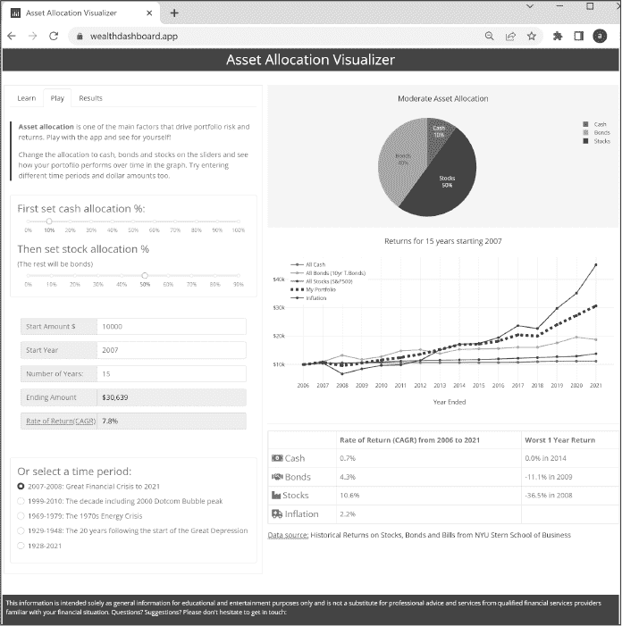

图 6-1：资产配置可视化应用的截图

你可以看到，这个应用比我们之前的 Dash 应用包含了更多的元素。试着使用应用，看看它是如何运作的。输入不同的数字到输入框中。移动滑块来选择不同的资产配置。看看如果你将所有资金投入现金、股票或债券，或者三者的不同组合时，你的投资回报将会是什么。使用单选按钮选择不同的时间段，看看如果你在互联网泡沫高峰期或大萧条低谷期开始投资，你的投资组合会有怎样的表现。

注意应用中的各个组件是如何交互的，以及饼图、折线图、表格和结果字段是如何更新的。你将在本章稍后的“Dash 回调”部分学到如何实现这一点。

同时，请注意布局设计。这个应用程序的左侧有滑块、输入框和复选框选项，右侧则显示饼图、折线图和汇总表格等输出。你将在本章的“布局与样式”部分学习如何实现这一点。

### 应用程序结构

Dash 的一个显著特点是，使用少量代码就能轻松创建视觉交互式应用程序。本书中的前两个应用就是很好的例子，您可以在 Dash 教程和 Dash 企业应用程序画廊中查看更多实例。然而，当你开始创建自己的应用时，你会发现随着添加更多的功能和组件、构建多页应用，代码容易增长，可能达到数百行甚至上千行。本章中的应用大约有 700 行代码，但它仍然相对简单。

当你开始处理更大的应用程序时，你会迅速理解为什么应用程序结构很重要。在小型应用程序中，直接在布局或回调中定义组件可能非常方便，但随着你添加更多功能，这种方法会使布局变得庞大，难以管理、修改和调试。

在更大的应用程序中，我们可能会将不同的部分分离到各自的文件中。在这个应用程序中，由于它仍然相对较小，我们将所有代码保持在一个文件中，但通过将相关元素组织在一起，使代码结构清晰。例如，我们将图表、表格、标签页和 Markdown 组件分别归类。每个组件要么在一个函数中定义，要么分配一个变量名。因为这些组件是这样结构化的，它们就变成了构建块，我们可以根据需要使用函数调用或变量名来将它们放入布局中。这样的结构也使得在其他应用中重用这些组件变得容易。我们还将执行数据处理的辅助函数，比如计算投资回报率，拆分成独立部分。通过这种方式组织组件，我们能够使布局部分的代码保持简洁，仅需 30 行。最后一部分是应用回调。

有许多方法可以组织应用程序。例如，您可以将一些部分放在不同的模块中，并将其导入主应用程序。对于多页应用，通常的做法是将每个页面放在不同的模块中。您将在第七章中看到这种做法的例子。重要的是，要有一种一致的应用程序组织和结构方法，这对你来说有效，并且对项目有意义。对于这个应用程序，鉴于它的规模并且是单页应用，我们更倾向于将所有内容放在一起。

### 设置项目

和往常一样，我们将从导入库和管理数据开始。

导入库

我们从导入我们在应用中使用的模块开始（清单 6-1）。此应用中新增的模块有 data_table、State、callback_context 和 plotly.graph_objects。

from dash import Dash, dcc, html, dash_table, Input, Output, State, callback_context

import dash_bootstrap_components as dbc

import plotly.graph_objects as go

import pandas as pd

清单 6-1：应用的导入部分 app.py

我们使用 data_table 来显示结果和源数据。我们在回调中使用 State 和 callback_context，并且我们使用 Plotly 图形对象（Plotly Graph Objects）而不是 Plotly Express 来创建图表。我们将在稍后详细讨论这些内容。

添加样式表

接下来，我们将添加 Bootstrap CSS 和 FontAwesome 图标作为外部样式表。在第五章中，我们为应用添加了 BOOTSTRAP 主题，而在此应用中，我们使用的是 SPACELAB 主题，如下所示：

app = Dash(__name__, external_stylesheets=[dbc.themes.SPACELAB, dbc.icons.FONT_AWESOME])

SPACELAB 主题为我们提供了字体、配色方案、形状和页面元素的大小，这些都可以在图 6-1 中看到。

FontAwesome 库拥有丰富的图标集合，可以帮助让应用程序更加吸引眼球。图 6-2 展示了我们在应用中使用的 FontAwesome 图标。

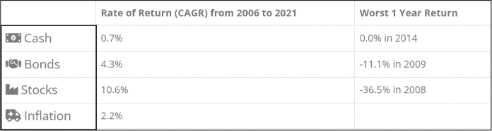

图 6-2：我们在应用中使用的 FontAwesome 图标

Dash Bootstrap Components 库有一个模块，包含 FontAwesome 和 Bootstrap 图标的 URL，以及各种 Bootstrap 主题的 URL。这使得将它们添加到应用中更加方便。例如，你可以指定主题为 dbc.themes.SPACELAB，而不是 [*https://<wbr>cdn<wbr>.jsdelivr<wbr>.net<wbr>/npm<wbr>/bootswatch@5<wbr>.1<wbr>.3<wbr>/dist<wbr>/spacelab<wbr>/bootstrap<wbr>.min<wbr>.css*](https://cdn.jsdelivr.net/npm/bootswatch@5.1.3/dist/spacelab/bootstrap.min.css)。

数据管理

本应用的数据来源于阿斯瓦斯·达莫达兰教授，他在纽约大学斯特恩商学院教授公司金融和估值课程。数据包含了三种资产类别的回报——现金、债券和股票——分别由三个月期美国国债、十年期美国国债和标准普尔 500 指数表示。你可以在 [*http://<wbr>people<wbr>.stern<wbr>.nyu<wbr>.edu<wbr>/adamodar<wbr>/New<wbr>_Home<wbr>_Page<wbr>/data<wbr>.html*](http://people.stern.nyu.edu/adamodar/New_Home_Page/data.html) 了解更多关于此数据的信息。

我们已经下载了数据，并将其保存为名为 *historic.csv* 的 Excel 表格，存放在 *assets* 文件夹中。这里我们在应用中包含了这些数据：

df = pd.read_csv("assets/historic.csv")

接下来，我们采取一些步骤使得应用程序更易于维护。首先，我们将数据系列的起始年份和结束年份设为全局变量，因为我们在应用中的多个地方都会用到这些日期。现在，每年我们更新应用时，只需要更新新数据，而不必修改代码中的日期：

MAX_YR = df.Year.max()

MIN_YR = df.Year.min()

START_YR = 2007

START_YR 是应用程序首次运行时投资周期的默认起始年份。我们使用这个全局变量，而不是在应用的多个地方硬编码“2007”。如果你决定想要更改起始年份，只需修改这行代码即可。

我们还将颜色设置为全局变量。我们为股票、债券和现金的图表使用自定义颜色，选择的颜色与我们的 Bootstrap 主题相匹配。如果你想切换到不同的 Bootstrap 主题，可以通过在 COLORS 字典中更新颜色值来更新图表的颜色，应用中的颜色会随之更新：

COLORS = {

   "cash": "#3cb521",

   "bonds": "#fd7e14",

   "stocks": "#446e9b",

   "inflation": "#cd0200",

   "background": "whitesmoke",

}

使用这个字典还使代码更具可读性和自文档性，因为你可以像这样指定颜色：

COLORS["stocks"]

而不是像这样：

"#446e9b"

### 布局与样式

在本节中，我们将所有组件和图形分离出来，进行模块化，这样我们就可以将它们添加到布局中的任何地方，正如本章开始时所提到的。主要布局仅占应用程序 700 行代码中的大约 30 行。为了保持布局简洁，我们在应用程序的其他部分定义组件和图形，并为它们指定变量名，以便在布局部分调用它们。以这种方式构建布局可以明确应用程序结构，并简化设计更改。

列表 6-2 展示了主布局的 app.layout 代码。

app.layout = dbc.Container(

   [

      ❶ dbc.Row(

           dbc.Col(

              html.H2(

                 "资产配置可视化工具",

                 className="text-center bg-primary text-white p-2",

              ),

           )

         ),

      ❷ dbc.Row(

           [

              dbc.Col(tabs, width=12, lg=5, className="mt-4 border"),

              dbc.Col(

                 [

                    dcc.Graph(id="allocation_pie_chart", className="mb-2"),

                    dcc.Graph(id="returns_chart", className="pb-4"),

                    html.Hr(),

                    html.Div(id="summary_table"),

                    html.H6(datasource_text, className="my-2"),

                 ],

                 width=12,

                 lg=7,

                 className="pt-4",

              ),

           ],

           className="ms-1",

     ),

     dbc.Row(dbc.Col(footer)),

   ],

   ❸ fluid=True,

)

清单 6-2：布局代码

整个应用程序的内容被包装在一个dbc.Container中，这是 Bootstrap 中最基本的布局元素，使用行和列网格系统时是必需的。

布局的第一行❶定义了蓝色的头部栏，如图 6-3 所示，定义为一个包含单列的 Bootstrap 行，列宽度为整个屏幕的宽度。

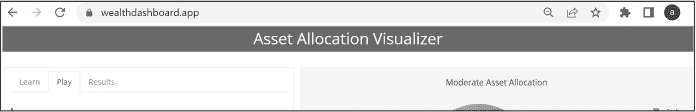

图 6-3：资产配置可视化应用程序的头部栏

我们使用 Bootstrap 的工具类来美化头部。我们使用text-center来使文本居中，使用bg-primary将背景设置为SPACELAB主题的主色，使用text-white设置文本颜色，并使用p-2添加内边距。要查看所有可用于美化应用程序的 Bootstrap 工具类，请参见 Dash Bootstrap 备忘单，网址为[*https://<wbr>dashcheatsheet<wbr>.pythonanywhere<wbr>.com*](https://dashcheatsheet.pythonanywhere.com)。

第二行❷有两列，包含应用程序的主要内容，如图 6-4 所示。左侧列包含用户输入控制面板标签，右侧列则包含主要输出，包括饼图、折线图和汇总表格可视化。在这一行中有很多信息。如果屏幕是静态的，某人如果在小屏幕上查看，将需要缩放并进行大量滚动才能看到信息。好消息是，Bootstrap 可以轻松使我们的应用程序响应使用设备的大小。我们只需将小于平板尺寸的屏幕设置为一次只显示一列，而大于平板尺寸的屏幕则同时显示两列。

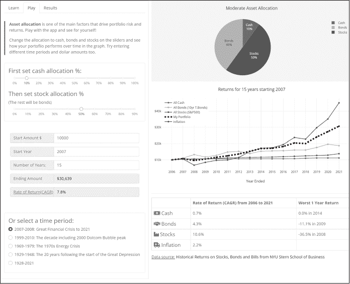

图 6-4：生成的应用程序的主要内容

由于 Bootstrap 的行有 12 列，我们通过将宽度设置为 12 来使行跨越整个屏幕。然后，在大屏幕上，我们将第一列的宽度设置为 5，第二列的宽度设置为 7，这样它们就会并排显示。以下是一个简化的示例：

dbc.Row(

   [

      dbc.Col("column 1", width=12, lg=5),

      dbc.Col("column 2", width=12, lg=7)

   ]

)

在底部我们放置了页脚，如图 6-5 所示。为了保持一致性，页脚的样式与页头相同。一个网站的页脚通常位于每个页面的底部，通常包括次要信息，如联系信息、法律声明和网站地图。

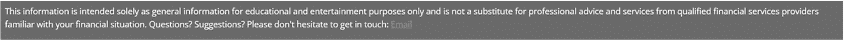

图 6-5：应用程序的页脚

最后，我们设置属性 fluid=True ❸。这使得内容跨越*视口*的宽度，视口是网页中对用户可见的区域，并且随着设备的不同而变化。手机和平板电脑上的视口比计算机屏幕上的视口要小，因此设置 fluid=True 使得应用程序具备响应式设计，适应这一变化。稍后我们会详细讨论这个话题。这就是主布局的全部内容！

### 组件

现在我们将更详细地描述如何定义我们添加到布局中的每个组件。你会注意到，应用程序有不同的*标签*，定义了不同的内容面板，如教程（学习标签）、应用控制（播放标签）和数据（结果标签）。如果你在标签之间切换，你会看到只有第一列的内容发生变化；第二列显示的图表和汇总表格在切换标签时始终保持不变。

**播放**标签是最繁忙的，我们将详细查看以下每个元素：

+   dcc.Markdown 用于格式化和显示介绍文本

+   dbc.Card 和 dcc.Slider 组件用于设置资产配置百分比

+   dbc.Input、dbc.InputGroup 和 dbc.InputGroupText 用于创建输入数字数据的表单

+   dbc.Tooltip 用于在悬停时显示附加数据

在 Results 标签中，我们使用 DataTable 来显示源数据和可视化的结果。

标签

在 Dash 中，Tabs 组件提供了一种方便的方法来将内容分隔到不同的面板中。用户可以点击一个标签来查看该面板，最棒的是该组件会自动为我们处理这个导航。我们需要做的就是定义每个标签中的内容。图 6-6 展示了我们应用中的标签。

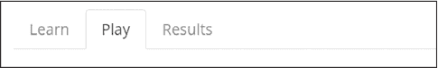

图 6-6：资产配置可视化器标签

Learn 标签包含一些文本。Play 标签是应用程序的主要控制面板，允许用户输入他们的选择。Results 标签包含关于投资组合年回报和数据源的详细表格。这些数据将在第二列中进行可视化。

在 app.layout 中，我们通过将变量名 tabs 放在第二行的第一列来包含这些标签：

--snip--

   dbc.Row(

      

        dbc.Col(tabs, width=12, lg=5, className="mt-4 border"),

--snip--

我们定义了我们的 tab，如[清单 6-3 所示。

tabs = dbc.Tabs(

   [

      dbc.Tab(learn_card, tab_id="tab1", label="Learn"),

   ❶  dbc.Tab(

             [asset_allocation_text, slider_card, input_groups,

             time_period_card],

             tab_id="tab-2",

             label="Play",

             className="pb-4",

      ),

      dbc.Tab([results_card, data_source_card],

             tab_id="tab-3", label="Results"),

   ],

   id="tabs",

   ❷  active_tab="tab-2",

)

清单 6-3：定义标签

我们创建了一个 tabs 容器，使用了 dbc.Tabs 组件，该组件包含我们的三个独立的 Tab 面板。我们为每个 dbc.Tab 提供了要显示的内容、ID 和将在屏幕上显示的标签。看看第二个 dbc.Tab ❶，也就是在图 6-7 中显示的 Play 标签，你会发现 children 属性包括了一系列变量名，这些变量名对应了我们在代码的组件部分单独定义的组件。asset_allocation_text 包含了介绍文字。slider_card 包含了两个 dcc.Slider，用户可以通过它们设置现金、股票和债券之间的配置比例。input_groups 定义了用于输入所有用户数据的区域：初始金额、年数和起始年份。我们使用这些输入来计算投资回报。time_period_card 让用户选择一些有趣的时间段，比如互联网泡沫或大萧条。

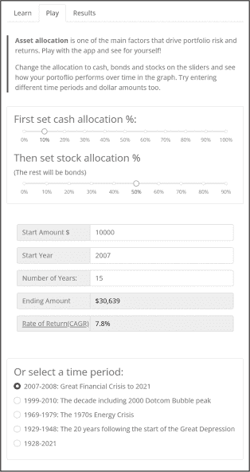

图 6-7：Play 标签的完整内容

现在尝试将 asset_allocation_text 变量名移动到列表的最后一个项目。当你运行这个更改后的应用时，你会看到介绍文字被移到了标签页面的底部。这展示了使用这种技术结构化应用时，进行设计更改是多么容易。在接下来的部分，我们将更详细地讨论每个部分是如何定义的。

active_tab 属性 ❷ 指定了应用启动时显示的默认标签。通过将其设置为 2，我们确保应用总是打开在“Play”标签上。

卡片容器与滑块

Bootstrap dbc.Card 是一个方便的容器，用于存放相关内容。它通常是一个带有边框和填充的框，提供标题、页脚和其他内容的选项。我们还可以使用 Bootstrap 工具类轻松地对卡片进行样式和定位。

我们在应用中的多个地方使用了 dbc.Card，但我们将只检查图 6-8 中显示的卡片代码作为代表性示例。

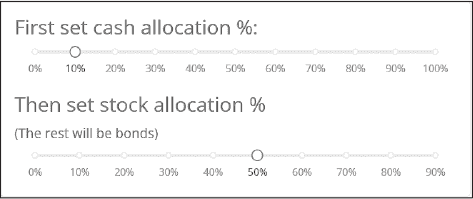

图 6-8：示例 dbc.Card

清单 6-4 显示了图 6-6 中展示的 Card 组件的代码。

slider_card = dbc.Card(

   [

      html.H4("First set cash allocation %:", className="card-title"),

      dcc.Slider(

         id="cash",

         marks={i: f"{i}%" for i in range(0, 101, 10)},

         min=0,

         max=100,

         step=5,

         value=10,

         included=False,

      ),

      html.H4("Then set stock allocation % ", className="card-title mt-3",),

      html.Div("(其余将是债券)", className="card-title"),

      dcc.Slider(

         id="stock_bond",

         marks={i: f"{i}%" for i in range(0, 91, 10)},

         min=0,

         max=90,

         step=5,

         value=50,

         included=False,

      ),

   ],

   body=True,

   className="mt-4",

)

清单 6-4：分配滑块卡片

对于滑块标签，我们使用 Dash 组件 html.H4 来设置一个 4 级标题，并使用 Bootstrap 类 card-title 来设置选定主题的一致间距。

dcc.Slider 是 Dash 核心组件。在 第五章 中，我们看到了 dcc.RangeSlider，它允许用户选择一个范围的起始值和结束值。dcc.Slider 类似，但只允许选择一个单一的值。我们为滑块指定一个 id，以便在回调中引用，并设置 marks、min、max、step 和 value 作为滑块的初始设置。这些是应用启动时看到的默认设置。

included 属性设置了滑块轨道的样式。默认情况下，滑块轨道在滑块手柄之前的部分会被高亮显示。然而，在我们的应用中，我们指定了一个离散的值，因此仅高亮显示该值而不是一个范围是有意义的。我们通过设置 included=False 来实现这一点。

寻找应用中的其他卡片，你会看到它们的构建方式相似，但包含不同的组件，如 dbc.RadioItems、dbc.InputGroup 和 dcc.Markdown。

输入容器

dbc.Input 组件处理用户输入，而 dbc.InputGroup 是一个容器，通过更多功能增强了 dbc.Input，如图标、文本、按钮和下拉菜单。

图 6-9 展示了我们如何在应用程序中使用 dbc.InputGroup 创建一个包含变量名 input_groups 的表单。

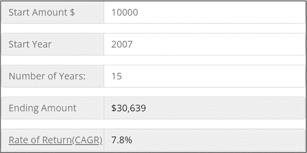

图 6-9：输入表单

每一行都是一个 dbc.InputGroup 项目，所以这里我们将五个项目一起放入一个容器中。在这种情况下，虽然可以使用 Card 作为容器，但我们使用 html.Div 容器，因为它默认没有边框和内边距。下面是包含的 Div：

input_groups = html.Div(

   [start_amount, start_year, number_of_years, end_amount, rate_of_return],

   className="mt-4 p-4",

)

我们分别定义每个 InputGroup 项目，并将其添加到 html.Div 容器中。每个项目都非常相似，所以我们只需要详细查看其中的几个。这里我们定义第二个项目——“开始年份”：

start_year = dbc.InputGroup(

   [

      dbc.InputGroupText("Start Year"),

      dbc.Input(

         id="start_yr",

         placeholder=f"min {MIN_YR}  max {MAX_YR}",

         type="number",

         min=MIN_YR,

         max=MAX_YR,

         value=START_YR,

      ),

   ],

   className="mb-3",

)

你可以使用 dbc.InputGroupText 组件在输入字段的前后或两侧添加文本，这使得表单更加美观。例如，下面我们使用 dbc.InputGroupText("Start Year") 在 dbc.Input 前面显示文本“开始年份”。

我们设置了 min 和 max，这两个是 dbc.Input 的属性，用来提供一个接受的值范围，并且将 type 设置为只接受数字；这有助于数据验证。对于 min 和 max 的值，我们使用了之前讨论的全局变量 MIN_YR 和 MAX_YR。如果输入框为空，placeholder 会显示有关有效范围的提示信息。因为我们在更新数据文件时使用了全局变量，所以在更改日期范围时，我们不需要对该组件做任何修改。

最后两个 InputGroup 项目实际上并不是用来输入的，而是用来显示一些结果的。我们设置了 disabled=True，这样就不能输入内容，并且将背景颜色设置为灰色以便区分这些项目。在回调中，我们将用投资结果更新此字段。使用输入组件作为输出字段可能看起来有些奇怪，但这样做能使这个组件保持一致的外观。此外，将来我们可能决定允许在这里输入数据。例如，用户可以输入最终的金额，然后查看在不同市场条件下，需要投资多少金额以及多长时间才能达到这个目标。rate_of_return 输入组的代码如下：

rate_of_return = dbc.InputGroup(

   [

      dbc.InputGroupText(

         "年复合增长率（CAGR）",

         id="tooltip_target",

         className="text-decoration-underline",

      ),

      dbc.Input(id="cagr", disabled=True, className="text-black"),

      dbc.Tooltip(cagr_text, target="tooltip_target")

   ],

   className="mb-3",

)

工具提示

*工具提示* 是当用户将鼠标悬停在某个组件上时出现的文本提示，如 图 6-10 所示。要添加工具提示，我们使用 dbc.Tooltip 组件并用 Bootstrap 进行样式设置。你只需指定 Tooltip 的 target id——无需回调！我们在应用中使用它来提供 CAGR 的定义，因为这是许多人不太熟悉的术语。前一部分结尾的代码片段展示了 Tooltip 在 rate_of_return 输入组中的代码。

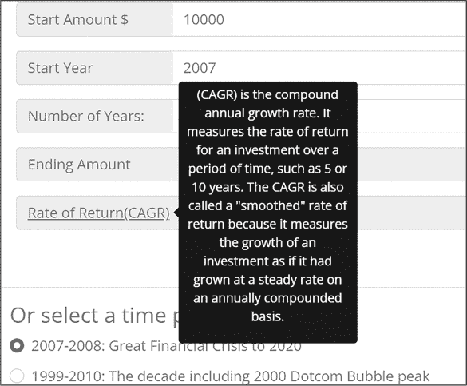

图 6-10：工具提示示例

数据表

DataTable 是一个交互式表格，用于查看、编辑和探索大规模数据集。这个应用程序只使用了其部分功能，所以一定要查看 Dash 文档，了解更多如何使用这个强大工具的示例。我们使用 DataTable 在结果标签页中显示 total_returns_table，如 图 6-11 所示。

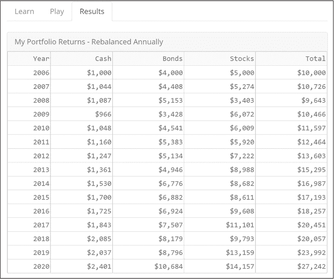

图 6-11：完整的结果标签页

列表 6-5 显示了 DataTable 的代码。

total_returns_table = dash_table.DataTable(

   id="total_returns",

   columns=[{"id": "Year", "name": "Year", "type": "text"}]

   + [

        {"id": col, "name": col, "type": "numeric", "format": {"specifier": "$,.0f"}}

        for col in ["Cash", "Bonds", "Stocks", "Total"]

   ],

   page_size=15,

   style_table={"overflowX": "scroll"},

)

列表 6-5：显示在 图 6-11 中的 DataTable 代码

和应用中的其他元素一样，我们将<DataTable>分配给一个变量，以便在布局中方便调用。

我们使用以下组件属性来定义我们的表格：

+   表格id是"total_returns"；我们用它来在回调中标识此组件。

+   列id与我们 pandas DataFrame 中的列名匹配，这就是我们用来更新表格单元格中的数据的字段。

+   列name是列头中显示的文本。

+   列type设置数据类型为text或numeric。

+   "format": {"specifier": "$,.0f"}格式化单元格，显示美元符号($)并且没有小数(0)，使得数据以整数美元显示。请注意，数据type必须是numeric，格式才会正确应用。

+   page_size属性控制表格高度，并在表格底部添加分页按钮。我们将其设置为15，以便每页显示 15 行数据。style_table={"overflowX": "scroll"}语法通过添加滚动条来控制宽度，以防表格溢出父容器。

内容表格

dbc.Table组件是使用 Bootstrap 主题为基本 HTML 表格样式的绝佳方式。HTML 表格在你只需要显示少量项目时非常方便，而且它们还可以包含其他 Dash 组件，如dcc.Graph或dbc.Button作为内容。当前，使用 Dash 的DataTable是无法做到这一点的。

我们在应用中使用dbc.Table来显示图 6-12 中的汇总表格。这使我们能够在汇总表格中包含 Dash 组件，并使用 FontAwesome 图标。

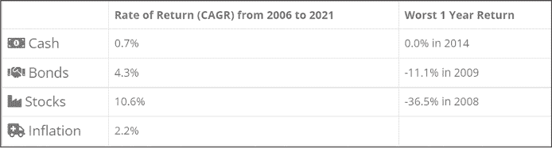

图 6-12：资产配置可视化应用中的汇总表格

清单 6-6 显示了部分代码，但总体来说，我们通过一个函数创建了这个表格。

def make_summary_table(dff):

   # 创建包含表格信息的新数据框

   df_table = pd.DataFrame(…)

   return dbc.Table.from_dataframe (df_table, bordered=True, hover=True)

清单 6-6：汇总表代码摘录

我们将在本章后面的回调函数中使用这个功能。函数的参数是从用户输入中创建的 DataFrame。然后，我们创建另一个 DataFrame，里面仅包含我们想在汇总表中显示的信息。我们使用 dash-bootstrap-components 辅助函数dbc.Table.from_dataframe()来构建 HTML 表格。

Markdown 文本

*Markdown*是一种用于格式化网页文本的标记语言，它是最流行的方式之一，可以用来添加并格式化粗体、斜体、标题、列表等文本。要了解更多 Markdown 语法，请查看[*https://<wbr>commonmark<wbr>.org<wbr>/help*](https://commonmark.org/help)的教程。

我们使用dcc.Markdown组件将格式化的文本添加到应用程序中。在这个应用中，我们用它来添加资产配置的描述，如图 6-13 所示。Markdown 语法使用**来突出显示文本，使用来将文本格式化为引用块。

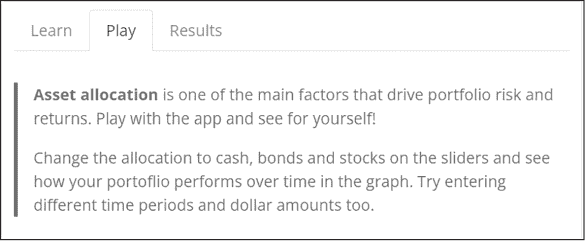

图 6-13：使用 Markdown 添加文本

这是Markdown组件的代码：

asset_allocation_text = dcc.Markdown(

   " ""

 **资产配置**是影响投资组合风险和收益的主要因素之一。动手试试应用，亲自体验吧！

 在滑动条上更改现金、债券和股票的配置，查看你的投资组合在图表中随时间的表现。

   也可以尝试输入不同的时间段和金额。

" ""

)

我们需要再进行一步设置，使块引用在应用中显示为所见的样式。*块引用*通常是来自不同来源的扩展引用，但也可以用于重复或突出显示某些内容。块引用通常具有额外的边距或填充，或者其他格式设置，使其更加突出，这也是我们在此情境下选择它的原因。

Bootstrap 中块引用的默认样式是：

blockquote {

   margin: 0 0 1rem;

}

这不会在顶部或右侧添加边距，仅在底部添加 1rem 的边距。（*rem* 是根元素的字体大小，通常是 16 像素。）这并没有使文本突出显示，所以我们再增加一些边距并添加颜色，如下所示：

blockquote {

   border-left: 4px var(--bs-primary) solid;

   padding-left: 1rem;

   margin-top: 2rem;

   margin-bottom: 2rem;

   margin-left: 0rem;

}

这段代码为块引用添加了一个宽度为 4 像素的左边框，并将颜色与页眉和页脚的颜色匹配。它还添加了一些额外的边距和填充。这里有一个在使用 Bootstrap 时非常有用的 CSS 小技巧：你可以不用指定颜色的十六进制数（如 #446e9b），而是使用 Bootstrap 的颜色名称，如：var(--bs-primary)。这段代码会使颜色与 Bootstrap 主题中的“主色”相匹配。如果你在应用中更改了 Bootstrap 主题，这个块引用的左边框颜色会自动更新为该主题的主色，以保持应用中一致的外观。

这个自定义 CSS 文件保存在 *mycss.css* 文件中，位于 *assets* 文件夹中。你可以根据自己的喜好命名该文件，只要它有 *.css* 扩展名，Dash 会自动在应用中包含这个自定义 CSS。

### 使用 Plotly Graph Objects 创建饼图

这是一个简短的介绍，讲解如何使用 Plotly Graph Objects 创建图表，Plotly Graph Objects 提供了比更简单的 Plotly Express 更加精细的图表和图形创建选项。应用中的饼图，见 图 6-14，在用户移动滑块时会实时更新资产配置。

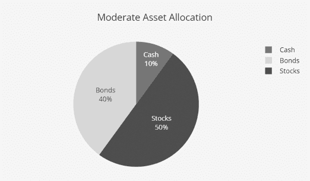

图 6-14：Plotly 饼图示例

与我们在前几章中使用 Plotly Express 制作图表不同，在这里我们使用 Plotly Graph Objects。Plotly Express 会预配置许多常见的参数，使得你能够快速制作图表并且代码更少。然而，当你需要更多自定义时，可能会更喜欢使用 Plotly Graph Objects。列表 6-7 显示了创建饼图的代码。

def make_pie(slider_input, title):

   fig = go.Figure(

      data=[

         go.Pie(❶

            labels=["现金", "债券", "股票"],

            values=slider_input,

            textinfo="label+"percent",

            textposition="inside",

            marker={"colors": [COLORS["cash"], COLORS["bonds"], COLORS["stocks"]]}, ❷

            sort=False, ❸

            hoverinfo="none",

         )

      ]

   )

   fig.update_layout(

      title_text=title,

      title_x=0.5,

      margin=dict(b=25, t=75, l=35, r=25),

      height=325,

      paper_bgcolor=COLORS["background"],

   )

   return fig

清单 6-7：创建一个 Plotly 图形对象的饼图

要创建我们的饼图，我们首先创建一个图形实例，使用 fig = go.Figure。这里的 Figure 语法指的是在 plotly.graph_objects 模块中定义的主要类之一（通常作为 go 导入），并表示整个图形。我们使用这个类是因为该类的实例自带了许多方便的方法，可以操作它们的属性，包括 .update.layout() 和 .add.trace()。事实上，Plotly Express 函数使用图形对象，并返回一个 plotly.graph_objects.Figure 实例。

Plotly 图形对象中的饼图对象是 go.Pie ❶，它允许我们轻松地为每个扇区设置自定义颜色。请注意，这里我们使用的是 COLORS 字典作为全局变量 ❷，而不是直接为 marker 设置颜色。这意味着，如果我们以后决定更改颜色，只需要更新 COLORS 字典中的代码，而不需要修改图形中的代码。在我们的应用中，我们希望每个资产的颜色保持不变，即使其值发生变化。我们通过设置 sort=False ❸ 来实现这一点。（默认值为 True，会按降序排序值，因此最大值总是拥有相同的颜色。）

与 清单 6-6 中的表格一样，我们将这个饼图创建在一个函数中，以便在回调中更新它。输入参数是滑块的值和标题。

### 使用 Plotly 图形对象的折线图

我们将再次使用 Plotly 图形对象来绘制折线图，以便为每个轨迹定制颜色和标记——这在使用 Plotly Express 时会显得比较繁琐。

再次，我们将折线图创建在一个函数中，并将一个 DataFrame 作为参数输入。这个 DataFrame 基于用户的选择：资产配置、时间段、起始金额和年数。你将在本章稍后的回调中了解如何创建这个 DataFrame。图 6-15 显示了折线图。

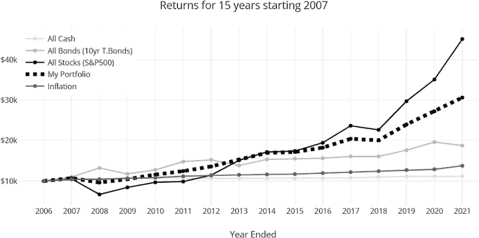

图 6-15：Plotly 折线图示例

清单 6-8 提供了折线图的代码。

def make_line_chart(dff):

   start = dff.loc[1, "Year"]

   yrs = dff["Year"].size - 1

   dtick = 1 if yrs < 16 else 2 if yrs in range(16, 30) else 5

   fig = go.Figure() ❶

   fig.add_trace(

      go.Scatter(

        x=dff["Year"],

        y=dff["all_cash"],

        name="所有现金",

        marker_color=COLORS["cash"],

      )

   )

   fig.add_trace(

      go.Scatter(

        x=dff["Year"],

        y=dff["all_bonds"],

        name="所有债券（10 年期国债）",

        marker_color=COLORS["bonds"],

      )

   )

   # 为简洁起见，省略了“所有股票”、“我的投资组合”和“通货膨胀”的数据追踪

   fig.update_layout(

      title=f"从 {start} 开始的 {yrs} 年回报率",

      template="none",

      showlegend=True,

      legend=dict(x=0.01, y=0.99),

      height=400,

      margin=dict(l=40, r=10, t=60, b=55),

      yaxis=dict(tickprefix="$", fixedrange=True),

      xaxis=dict(title="Year Ended", fixedrange=True, dtick=dtick),

   )

   return fig

清单 6-8：创建一个 Plotly Graph Objects 折线图

通过使用 graph_objects，我们可以轻松自定义每个轨迹（在本例中是折线）。我们首先通过 fig=go.Figure() ❶ 创建图形，然后使用 fig.add_trace() 单独将每个轨迹添加到图表中。对于这个函数，x 和 y 属性分别是图形的 x 轴和 y 轴数据。每个轨迹的 x 数据来自 DataFrame 的 Year 列，表示年份。y 数据包含在 DataFrame 对应的列中。例如，“All Cash”线的数据位于 DataFrame 列 dff["all_cash"] 中。name 属性将在图例中和悬停时显示每个轨迹的名称。marker_color 属性设置每个轨迹的颜色。还有许多其他自定义轨迹的属性，可以在 Plotly 文档中查看。

我们使用 fig.update_layout() 方法来自定义图形中非数据部分的定位和配置，例如设置标题、高度和边距。yaxis 和 xaxis 属性需要稍作解释：

+   tickprefix=$ 在 y 轴标签上添加了美元符号。

+   fixedrange=True 禁用了 x 轴和 y 轴的缩放。这可以防止在触摸屏上不小心放大；当你试图滚动页面却意外放大图形时，可能会很烦人。

+   dtict=dict 用于设置 x 轴标签之间的步长。你可以看到，当用户选择不同的时间段时，标签是如何变化的。我们是这样计算的：

dtick = 1 if yrs < 16 else 2 if yrs in range(16, 30) else 5

### Dash 回调

现在进入有趣的部分。回调函数让应用变得互动。当输入组件的属性发生变化时，回调函数会自动被调用。我们从一个简单的回调开始，它根据两个滑块的值更新饼图。

接下来我们将展示如何使用 State 获取数据，而不触发回调。

然后我们将讨论一个通过将相同的参数作为输入和输出来同步组件的回调。

最后，我们将展示一个包含多个输入和输出的回调，并展示如何在回调中使用函数来使大型回调变得更易于管理。

交互式图形

让我们从更新饼图的回调开始。以下是定义：

@app.callback(

   Output("allocation_pie_chart", "figure"),

   Input("stock_bond", "value"),

   Input("cash", "value"),

)

首先，我们有回调的 Output，它通过更新 dcc.Graph 的 figure 属性来更新饼图。你可以在 app.layout 中找到这个 dcc.Graph：

dcc.Graph(id="allocation_pie_chart", className="mb-2")

然后，我们定义回调的输入，这些输入是滑动条的值属性，分别为 id "stock_bond" 和 id "cash"。

接下来是回调函数，详见列表 6-9。

def update_pie(stocks, cash):

   bonds = 100 - stocks - cash

   slider_input = [cash, bonds, stocks]

= 70:

      investment_style = "进取型"

   elif stocks <= 30:

      investment_style = "保守型"

   else:

      investment_style = "稳健型"

   figure = make_pie(slider_input, investment_style + " 资产配置")

   return figure

列表 6-9：update_pie() 回调函数

我们首先根据用户在滑动条上选择的现金和股票的比例来计算债券的百分比，使用操作 bonds = 100 – stocks – cash。

接下来，我们更新饼图的标题文本。我们的经验法则是，股票配置超过 70% 的投资组合为“进取型”投资风格，股票配置低于 30% 的投资组合为“保守型”，其余则为“稳健型”。随着用户移动滑块，标题会动态更新。我们将该标题作为属性传递给 make_pie() 函数。

最后，我们通过调用我们的函数 make_pie() 来创建图形，该函数在列表 6-7 中定义。通过使用函数来创建图形，我们减少了回调中代码的数量，并且可以在其他回调中重用该函数。结果是，代码更易读、更易维护。

现在，你可以回到应用程序，查看移动滑块如何更新饼图，并了解其实现方式。

使用状态的回调

第二个回调函数通过单向同步来同步这两个滑块：一个滑块用于更新另一个滑块的值。"cash" 滑块将更新 "stock_bond" 滑块，但 "stock_bond" 滑块不会更新 "cash" 滑块。在用户选择了 "cash" 滑块上的现金分配后，我们更新 "stock_bond" 滑块组件：

@app.callback(

   Output("stock_bond", "max"),

   Output("stock_bond", "marks"),

   Output("stock_bond", "value"),

   Input("cash", "value"),

❶  State("stock_bond", "value"),

 )

❷  def update_stock_slider(cash, initial_stock_value):

   max_slider = 100 - int(cash)

   stocks = min(max_slider, initial_stock_value)

   # 格式化滑块比例

 50:

      marks_slider = {i: f"{i}%" for i in range(0, max_slider + 1, 10)}

   elif max_slider <= 15:

      marks_slider = {i: f"{i}%" for i in range(0, max_slider + 1, 1)}

   else:

      marks_slider = {i: f"{i}%" for i in range(0, max_slider + 1, 5)}

   return max_slider, marks_slider, stocks

我们在函数定义中使用了State ❶，因为我们需要知道滑块的当前输入值，以便计算新的输出值。State 不会触发回调；它的目的是提供在回调触发时该属性的当前值（即状态）。

在 ❷，我们开始回调函数。当用户选择现金配置时，我们会调整可以分配给股票或债券的金额。例如，如果用户将现金配置更改为 20%，则股票配置的最大值为 80%，因此我们需要将 "stock_bond" 滑块的值从当前值更新为新的最大值 80%。

我们还通过更新标记来更新滑块上的比例。请注意，图 6-16 的上半部分股票配置百分比滑块的刻度按十进制递增，而下半部分按个位数递增。

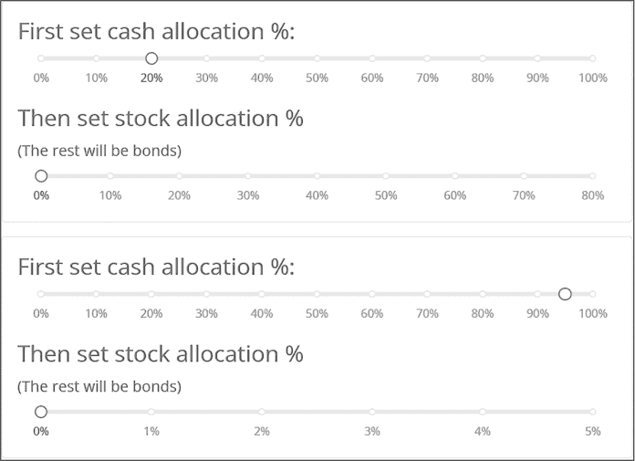

图 6-16：现金与股票配置滑块的更新前（顶部）和更新后（底部）

我们根据滑块的最大值计算滑块标记。例如，在底部的滑块设置中，现金配置是 95%，所以股票配置的最大值是 5%。这意味着在创建滑块标记的函数中，max_slider的值是5：

marks_slider = {i: f"{i}%" for i in range(0, max_slider + 1)}

这比以下这种写法更简洁：

marks_slider={

      0: '0%',

      1: '1%',

      2: '2%',

      3: '3%',

      4: '4%',

      5: '5%'

      },

现在你可以回到应用程序，看看如何移动 "cash" 滑块更新 "max"、"marks" 和 "value"，进而影响 "stock_bond" 滑块。

圆形回调与同步组件

Dash 还支持组件的双向同步。例如，如果你希望用户能够通过输入框输入一个数字*或者*通过移动滑块来设置某个值，那么就需要确保这两个值匹配。在这种情况下，滑块会更新输入框，输入框也会更新滑块。这就是一个 *圆形回调* 的例子。

我们在应用程序中使用循环回调来同步控制面板中的某些组件。回想一下，用户可以在输入框中输入开始年份和年数来计算投资回报，但也可以从列表中选择某个感兴趣的时间段，例如大萧条。这个回调函数保持这三个输入的同步。当你从列表中选择“大萧条”时，它会将输入框中的开始年份更改为 1929 年，并将规划时间更改为 20 年，以突出股票恢复的时间。如果用户随后在输入框中输入 2010 年，这就不再是大萧条时期，因此该单选按钮会被取消选择。

现在让我们更仔细地看一下这个回调函数：

@app.callback(

   Output("planning_time", "value"),

   Output("start_yr", "value"),

   Output("time_period", "value"),

   Input("planning_time", "value"),

   Input("start_yr", "value"),

   Input("time_period", "value"),

)

请注意，在 @app.callback 装饰器函数下，三个输出与三个输入完全相同。这使得能够同步这三个组件的值。列表 6-10 展示了回调函数。

def update_time_period(planning_time, start_yr, period_number):

   " ""同步输入和选择的时间段" ""

❶ ctx = callback_context

❷ input_id = ctx.triggered[0]["prop_id"].split(".")[0]

   如果 input_id == "time_period":

      planning_time = time_period_data[period_number]["planning_time"]

      start_yr = time_period_data[period_number]["start_yr"]

   如果 input_id 在 ["planning_time", "start_yr"] 中：

      period_number = None

   返回 planning_time, start_yr, period_number

列表 6-10：用于同步的回调函数

为了正确更新输出，回调函数必须知道是哪一个输入触发了回调，我们可以通过另一个高级回调特性来找出：callback_context ❶。这是一个全局变量，仅在 Dash 回调内部有效。callback_context 有一个属性叫做 triggered，它是一个变更属性的列表。我们解析这个列表来找到触发输入的 id ❷。

接下来，我们使用 input_id 来根据触发回调的输入更新不同的内容。如果是用户选择了某个时间周期触发的回调，我们会更新年份和计划时间的输入框。如果是用户在输入框中输入了内容触发的回调，我们会取消选中时间周期的单选按钮。这样可以保持用户界面的同步。

请注意，要实现这种同步组件，必须在同一个回调中包含输入和输出，接下来我们将讨论这一点。

多个输入和多个输出的回调

Dash 的一个当前局限是，它不允许多个回调更新同一个输出。目前唯一可用的解决方案是将所有更新输出的输入包含在同一个回调中。这样做的缺点是回调可能变得非常庞大和复杂，难以理解、维护和调试。解决这一问题的策略是为回调中的每个过程创建独立的函数。在列表 6-11 中的回调就展示了这种做法。

这个回调是应用程序的核心。每当滑块或输入框中的任何输入发生变化时，都会触发该回调，更新总回报表、折线图、摘要表、最终金额和回报率。哇。如果我们把所有这些代码都包含在回调中，它将有数百行长。相反，它只有 15 行（不包括注释和空白）。我们能做到这么简洁，是因为我们创建并调用了处理特定变更的函数。列表 6-11 显示了完整的回调代码。

@app.callback(

   Output("total_returns", "data"),

   Output("returns_chart", "figure"),

   Output("summary_table", "children"),

   Output("ending_amount", "value"),

   Output("cagr", "value"),

   Input("stock_bond", "value"),

   Input("cash", "value"),

   Input("starting_amount", "value"),

   Input("planning_time", "value"),

   Input("start_yr", "value"),

)

def update_totals(stocks, cash, start_bal, planning_time, start_yr):

   # 设置无效输入的默认值

   start_bal = 10 if start_bal is None else start_bal

   planning_time = 1 if planning_time is None else planning_time

   start_yr = MIN_YR if start_yr is None else int(start_yr)

   # 计算有效的规划时间起始年份

   max_time = MAX_YR + 1 - start_yr

   planning_time = min(max_time, planning_time)

   if start_yr +  MAX_YR:

      start_yr = min(df.iloc[-planning_time, 0], MAX_YR) # 0 是年份列

   # 创建投资回报的数据框

   dff = backtest(stocks, cash, start_bal, planning_time, start_yr)

   # 创建 DataTable 的数据

   data = dff.to_dict("records")

   fig = make_line_chart(dff) ❶

   summary_table = make_summary_table(dff) ❷

   # 格式化结算余额

   ending_amount = f"${dff['Total'].iloc[-1]:0,.0f}"

   # 计算 cagr

   ending_cagr = cagr(dff["Total"])

   return data, fig, summary_table, ending_amount, ending_cagr

Listing 6-11: 更新多个输出的完整回调

❶和❷行是我们使用两个函数的例子，这两个函数在本章前面的“使用 Plotly 图形对象绘制折线图”和“内容表格”部分中有描述。第一个函数生成折线图，第二个函数生成摘要表格。我们使用两个函数backtest()和cagr()来计算投资回报。这些函数在本章中没有详细讨论，但你可以在 GitHub 上的辅助函数部分看到它们。

### 总结

我们将在本章的最后总结大型应用结构化的策略：

+   对于常量应用数据，如主题颜色和启动默认值，使用全局变量。

+   给组件分配变量名，以便在布局中更容易调用。这也意味着我们可以像搭积木一样在其他应用中复用这些组件。

+   组织代码以保持相似元素的集中；例如，将视觉元素如表格、图表和输入分开成独立的部分。

+   使用函数将逻辑打包，使代码更易读易懂。这在有多个输入和输出的回调函数中尤为有用。

在开发大型应用或为现有应用添加新功能时，先创建一个独立的最小可工作示例来实现新功能会很有帮助。这个小版本更容易调试，因为你不需要在数百或数千行代码中寻找错误源。

在下一章，你将学习更多应用结构化的技巧，例如使用多个文件和可重用组件。
