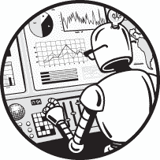

## 第七章：7 探索机器学习

本章解释了如何使用 Dash 以可视化的方式探索和展示机器学习模型及分类算法的内部结构。例如，假设你为自动驾驶汽车创建了一个机器学习模型，能够将物体分类为人类、植物和其他汽车，并且你需要向其他程序员和非技术管理人员解释你的模型是如何工作的以及为什么如此。仪表盘应用可以帮助你以快速、令人信服且视觉吸引的方式完成这项任务。

本章特别从概念性介绍开始，介绍了*支持向量机（SVM）*，这一流行的机器学习分类算法。SVM 提供了一种通过告诉我们如何准确地划分数据，从而将其放入正确类别的方法。我们将通过在仪表盘应用中使用各种图表和图形来可视化 SVM 的工作原理。

接下来，我们将使用强大的 NumPy 库进行数值计算，并使用 scikit-learn 提供的易用机器学习算法。最重要的是，你将体验到使用画廊作为基础深入了解由专业人士编写的更高级仪表盘应用程序的巨大好处。

本章还介绍了*包装函数*，这是 Dash 的新概念，用于创建自定义、可重用的组件，提供比预定义的 Dash 和 HTML 组件更多的选择。你还将了解一些新的 Dash 标准组件，如等高线图和图表，我们还将介绍 Dash 的*加载旋转器*，当特定的仪表盘组件正在加载时，它会为用户提供视觉反馈。加载旋转器对于构建较慢的复杂仪表盘应用特别有用，通常由于计算负载较重。

注意

*本章的目的是向你提供 Dash 能够实现的功能概述，并帮助你进一步提升技能。我们不会深入探讨任何一个话题。我们的目的是提供信息性内容，而非全面性内容，因此如果你对某个内容特别感兴趣，我们建议你查看 Charming Data YouTube 频道和本书配套网站上的补充资料：* [`learnplotlydash.com`](https://learnplotlydash.com)。

### 仪表盘应用让机器学习模型 变得更加直观

随着机器学习在计算机科学和我们日常生活中的普及，理解计算机如何得出结论变得越来越重要。机器能够在国际象棋和围棋中击败人类大师，减少许多交通场景中的事故率，并在工厂环境中生产出比人类工人更多的商品。在可衡量的性能方面，机器通常能够证明其优越性，甚至能够说服最激烈的批评者，认为它们的力量能够解放人类劳动力。

然而，仅通过机器的性能指标来观察其有效性可能是危险的。我们无法知道机器在那些无法从数据集中学到的极端情况中的表现；数据驱动的方法总是倾向于过去的经验。如果一台机器在 100 年的股市历史中从未观察到 95%的股市崩盘，它很可能不会在其模型中考虑这种情况，但这种情况很可能在未来某天发生。

为了降低这种风险，组织必须更好地理解机器“智能”的来源。它们的假设是什么？它们基于什么来得出结论？当面对极端输入时，它们的行为会如何变化？1960 年代的机器学习模型无疑会将负利率视为“极端”甚至是“不可能”的。但今天我们已经知道更好。

这引出了机器学习仪表板的动机。仪表板是可视化机器内部运作的强大工具。你可以训练一个模型，并观察它在不同输入下的表现。你可以测试极端情况。你可以查看模型的内部，并通过将学习过度拟合到过去的数据来评估潜在的风险。

可视化机器学习模型使你能够*展示*你的模型给客户，让他们能够调整输入参数，并建立对模型的信任，这是命令行模型无法实现的。仪表板帮助将机器的智能变得可触摸。

分类：简短指南

你不需要深入理解分类或支持向量机（SVM）就能跟随本章中的应用。我们会详细讲解一些内容，方便那些感兴趣的读者理解，但如果你想跳过这一部分以及后面的 SVM 部分，完全可以这样做，并将 SVM 算法当作一个黑盒，继续阅读本章其余内容。

还在这里吗？好吧，让我们深入探讨机器学习中分类问题的基本概念。

通常，分类问题试图根据一组提供的带标签（已分类）训练数据中的学习结果，将类别（即类别）分配给输入数据。例如，如果我们想根据训练数据预测学生在大学可能选择的专业，我们可能会测量每个学生的创造性和逻辑性思维能力。目标是创建一个分类算法，通过特征：创造性与逻辑性思维的能力，来预测标签——学生的预测专业。

支持向量机（SVMs），如此仪表板应用中可视化的那样，是*分类*算法。分类算法获取一组数据，并根据训练数据的模型学习，为每个数据点分配一个对应于特定类别的标签。更具体地说，分类算法会寻找一个*决策边界*，将数据分为两个或多个类别。线性 SVM 将决策边界在*n*维空间中建模为一个*(n – 1)*维平面，该平面将数据点划分为两个类别。所有位于决策边界一侧的数据点属于一个类别，而所有位于另一侧的数据点属于另一个类别。因此，假设你可以将所有数据点表示在*n*维空间中，并且你有一个*(n – 1)*维决策边界，你可以利用决策边界对新数据进行分类，因为任何新的数据点都恰好位于边界的一侧。粗略地说，分类的目标就是识别出能够很好地将训练数据和测试数据分开的决策边界。

图 7-1 给出了一个例子，灵感来源于但稍作修改的*Python One-Liners*（作者：Christian Mayer，出版商：No Starch Press，2020 年）。

图 7-1：示例分类问题：不同的决策边界会导致对新数据点的不同分类（即“计算机科学”或“艺术”）

这个分类场景创建了一个分类模型，帮助有志向的大学生找到可能适合他们优势的学习领域。我们拥有来自两个领域的前学生的训练数据：计算机科学和艺术。幸运的是，学生们已经向我们提供了他们自己在逻辑和创造性思维方面的估算。当这些数据被映射到一个二维空间中，逻辑思维和创造性思维作为独立的轴时，数据似乎被聚集成簇，计算机科学的学生通常在逻辑思维上较强，而艺术家则在创造性思维上较强。我们使用这些数据来找到一个决策边界，从而最大化训练数据的分类准确度。从技术角度来看，得到的分类模型只会给有志的学生提供一个关于他们可能根据自己的优势选择什么的提示。它不一定帮助他们决定应该选择什么（例如，为了最大化他们的幸福感）。那是一个更难的问题。

我们将使用决策边界来对新用户进行分类，这些用户只有关于他们逻辑和创造力的数据。图中展示了两个线性分类器（用线条表示），当作为决策边界使用时，它们能完美地将数据分开。在分类测试数据时，它们的准确率达到了 100%，因此两条线似乎都同样优秀。为了使机器学习算法表现良好，它必须明智地选择决策边界。那么我们如何找到最佳的决策边界呢？

支持向量机

SVMs 尝试最大化来自两类的最接近数据点与决策边界之间的距离；这个距离被称为*安全边距*，*边界安全*，或简单称为*边距*。这些最接近的数据点被称为*支持向量*。通过最大化安全边距，SVM 旨在最小化在分类接近决策边界的新点时的误差。

作为一个视觉示例，请查看图 7-2。

图 7-2：具有决策边界和支持向量的 SVM 分类示例

SVM 分类器为每个类别找到支持向量，并将线放置在离每个支持向量最远的地方（两者之间的中点），以使不同支持向量之间的区域尽可能厚。这条线就是决策边界。在 图 7-2 中，添加了一个需要分类的新数据点；然而，由于该数据点位于间隔区，模型无法自信地决定它属于艺术类还是计算机科学类。这很好地展示了 SVM 自带一个机制，可以明确告诉我们模型是否进行的是边界分类。例如，SVM 可能告诉我们，一个在创造力上排名高的学生属于艺术类，而一个在逻辑思维上排名高的学生属于计算机科学类，但一个在创造力 *和* 逻辑上都排名高的学生则无法自信地归入任何一个类别。

请注意，SVM 模型还可以以允许训练数据中有 *异常值* 的方式进行训练；这些点位于决策边界的一侧，但属于另一侧。这是现实世界数据中最常见的情况。然而，在不进一步探讨这些 SVM 优化的情况下，我们建议您查看本章末尾列出的优秀 SVM 分类教程，这样我们就可以立刻深入了解这个令人兴奋的仪表板应用程序。

### SVM Explorer 应用程序

图 7-3 展示了如何使用 SVM Explorer 应用程序可视化 SVM，该应用程序是一个来自图库的 Python 仪表板应用程序，使用各种类型的图表和图形。欢迎在 [*https://<wbr>dash<wbr>-gallery<wbr>.plotly<wbr>.host<wbr>/dash<wbr>-svm*](https://dash-gallery.plotly.host/dash-svm) 上玩转这个实时项目。

图 7-3：来自图库的 SVM Explorer 应用程序

我们首先为您概述 SVM Explorer 应用程序，以便您能大致了解。该应用程序展示了给定的 SVM 模型如何分类给定的训练数据集。您通过仪表板控件（如滑块、下拉框和单选按钮）控制模型。根据您的选择，输出图表和图形会发生变化，以反映 SVM 模型实例的变化。

该应用程序的作者之一，邢涵，慷慨地为我们提供了 SVM Explorer 应用程序的快速概述：

该应用程序完全用 Dash 和 scikit-learn 编写。所有组件都作为输入参数用于 scikit-learn 函数，这些函数根据用户更改的参数生成模型。然后，模型执行预测，并在等高线图上显示其预测结果，同时评估这些预测以创建 ROC [接收者操作特性] 曲线和混淆矩阵。除了创建模型外，它还使用 scikit-learn 生成您看到的数据集，以及用于指标图的所需数据。

让我们快速检查每个可见组件。仪表板的左列包含多个输入组件：

+   *选择数据集*下拉菜单允许你选择用于训练和测试的合成数据集。默认选择是 Moon 数据集，因其数据形态像月亮而得名。此输入下拉菜单允许你探索 SVM 模型如何处理具有不同固有特性的不同数据。例如，你可以选择 Circles 数据集（图中未显示），这是一个非线性数据集，其中两个待分类的数据集形状像一个内圈和围绕该内圈的外环。SVM 模型也可以处理这类数据！

+   *样本大小*滑块允许你控制用于测试和训练模型的数据点数量。较大的样本大小通常会导致更准确的模型，这也是为什么机器学习公司不断收集更多数据的原因！然而，在我们的玩具仪表板中，较大的样本大小可能会导致可视化变得更加拥挤。

+   *噪声级别*滑块允许你控制添加到数据中的高斯噪声的标准差。更高的噪声级别会导致模型的准确性降低，因为噪声会减少数据中模式的清晰度，并使得在训练阶段更难找到分隔决策边界。然而，你可以使用噪声级别滑块来检查 SVM 模型在实际应用中的鲁棒性，因为现实世界的数据通常是噪声较大的。

+   *阈值*滑块允许你对某个类或另一个类添加偏置。粗略来说，通过增加阈值，你可以将决策边界从 A 类更多地推向 B 类（或者通过降低阈值反之），从而对于给定的输入，增加被分类为 A 类的可能性。例如，如果阈值是 0.4，那么任何大于 0.4 的分数都被视为正预测，任何小于 0.4 的分数则被视为负预测，用以判断某个点是否属于某个特定类别。

+   *重置阈值*按钮将阈值重置为默认值，而不使用自定义的阈值或偏置。

+   *核函数*下拉菜单、*成本*滑块以及其他控件，如*伽玛*滑块和*收缩*单选按钮，允许你进一步控制 SVM 的其他参数及其对分类准确性的影响。讨论这些参数需要的不仅仅是一个或两个句子，在这个简要概述中我们将跳过。如果你有兴趣了解这些控件背后的理论，可以查阅《信息检索导论》一书的第十五章（剑桥大学出版社，2008）。你可以在[*https://<wbr>nlp<wbr>.stanford<wbr>.edu<wbr>/IR<wbr>-book<wbr>/pdf<wbr>/15svm<wbr>.pdf*](https://nlp.stanford.edu/IR-book/pdf/15svm.pdf)免费阅读该章节。

模型变化时，三个输出组件会发生变化：

+   *Dash Graph 组件* 是一个等高线图，能够在热力图叠加上可视化训练和测试数据，以及模型分类的置信度。数据点代表训练数据，三角形代表测试数据。红色数据点属于一个类别，蓝色数据点属于另一个类别。首先，我们根据一部分样本数据训练 SVM 模型。然后，我们使用训练好的模型对测试数据进行分类，并在可视化中绘制预测类别。

+   *ROC 曲线图* 是衡量 SVM 模型在给定数据集上质量的指标。它衡量的是 *真正率*，即正确分类的数据点比例，和 *假正率*，即错误分类的数据点比例。

+   *混淆矩阵* 指的是预测类别与实际类别的对比。具体来说，它是一个条形图，显示了测试数据中真正正例、真正负例、假正例和假负例的数量。你可以把它看作是衡量 SVM 模型在给定数据集上进行训练和分类任务的另一种方式。

我们在本章末尾提供了有关 Dash Graph、ROC 曲线图和混淆矩阵的更详细解释链接。然而，一个更好的理解方式是玩一下 SVM Explorer 应用。我们建议花 10 到 20 分钟玩一玩这个应用，以充分理解每个组件的概念。

你可以在 GitHub 仓库中找到该应用的代码，网址为[*https://<wbr>github<wbr>.com<wbr>/DashBookProject<wbr>/Plotly<wbr>-Dash<wbr>/tree<wbr>/master<wbr>/Chapter<wbr>-7*](https://github.com/DashBookProject/Plotly-Dash/tree/master/Chapter-7)。完整的代码有超过 650 行，但不用担心，我们将只关注最重要的部分。请注意，维护良好的代码很少会永远保持不变。自本章写作以来，作者们已经通过为应用添加新样式等方式更新了原始代码库。但由于应用的核心没有改变，我们已经在指定的 GitHub 仓库中提供了原始代码，你可以下载并重现本章中解释的完整应用。我们强烈建议你下载代码以加速你的学习。

事不宜迟，让我们直接进入代码吧！

Python 库

我们将借助巨人的肩膀，依赖几个 Python 库来创建我们的 SVM 仪表板应用。列表 7-1 显示了本项目中使用的库。

import time

import importlib

from dash import Dash, dcc, html, Input, Output, State

import numpy as np

from dash.dependencies import Input, Output, State

❶ from sklearn.model_selection import train_test_split

from sklearn.preprocessing import StandardScaler

from sklearn import datasets

from sklearn.svm import SVC

示例 7-1: SVM 应用的依赖项

你已经看到 Dash 库的语句，它们导入了核心组件和 HTML 组件，以及整个 Dash 应用的功能。本章的核心代码包括 SVM 的计算。我们不会从零实现自己的 SVM，而是依赖于 scikit-learn 库提供的优秀实现。因此，我们从这个库中导入了一些模块，我们会在它们出现时详细讲解 ❶。如果你对机器学习感兴趣，scikit-learn 是你最好的朋友！

数据管理

scikit-learn 提供了一些很棒的合成数据集，用于测试各种分类和预测算法。在示例 7-2 中，我们展示了如何使用函数 generate_data() 动态生成数据集，参数包括样本点数、数据集类型和噪声水平，这些参数在 SVM Explorer 应用程序的左侧列中指定，如图 7-3 所示。我们将使用函数 datasets.make_moons()、datasets.make_circles() 和 datasets.make_classification() 来根据输入下拉菜单中的值生成不同的数据集（分别为 "moons"、"circles" 和 "linear"）。这些数据集稍后将用于训练和测试我们的 SVM。

def generate_data(n_samples, dataset, noise):

   if dataset == "moons":

      return datasets.make_moons(n_samples=n_samples,

                                 noise=noise, random_state=0)

   elif dataset == "circles":

      return datasets.make_circles(

         n_samples=n_samples, noise=noise, factor=0.5, random_state=1

    )

   elif dataset == "linear":

      X, y = datasets.make_classification(

         n_samples=n_samples,

         n_features=2,

         n_redundant=0,

         n_informative=2,

         random_state=2,

         n_clusters_per_class=1,

      )

      rng = np.random.RandomState(2)

      X += noise * rng.uniform(size=X.shape)

      linearly_separable = (X, y)

      return linearly_separable

   else:

      raise ValueError(

        "数据类型指定错误。请选择一个已有的数据集。"

      )

清单 7-2: SVM 应用程序的数据管理

从高层次来看，代码由 if…elif…elif…else 语句组成，用于区分用户输入。这使得用户可以在三个数据集之间进行选择： "moons"、"circles" 和 "linear"。在每种情况下，都会使用 scikit-learn 的 dataset.make_X() 函数创建一个新数据集，该函数接收不同的输入参数（例如样本点的数量）并返回 NumPy 数组格式的数据。感兴趣的读者可以在 [*https://<wbr>scikit<wbr>-learn<wbr>.org<wbr>/stable<wbr>/modules<wbr>/classes<wbr>.html#module<wbr>-sklearn<wbr>.datasets*](https://scikit-learn.org/stable/modules/classes.html#module-sklearn.datasets) 上了解更多我们在此使用的输入参数。

### 布局与样式

布局和样式部分为你展示了 SVM Explorer 应用程序的结构以及它是由哪些基本的 Dash 组件构成的。让我们从项目的整体布局开始。

布局

当你开始开发更大的应用程序时，*app.py* 文件中的代码行数会迅速变得难以管理。为了帮助管理代码，SVM Explorer 应用程序包括一个 *utils* 文件夹，里面有两个辅助模块，*dash_resuable_components.py* 和 *figures.py*，它们包含一些自定义的 Dash 组件定义，稍后我们会在本章中更详细地探讨这些组件，以及一些绘图和样式功能。从 *app.py* 文件中提取出实用功能到一些外部模块中进行导入是一个好的实践，它有助于保持主 *app.py* 文件的简洁和专注，适用于你自己的更大仪表板项目。

SVM Explorer 应用程序的结构如下：

- app.py

- utils/

   |--dash_reusable_components.py

   |--figures.py

应用程序的布局是一个层级嵌套的 HTML 元素结构，如列表 7-3 所示。

app.layout = html.Div(

   children=[html.Div(…), # 标题等

      html.Div(…)] # 主体

)

列表 7-3：SVM 应用程序布局的放大显示

外层的第一个子元素是包含应用程序标题、徽标和其他元信息的 Div。第二个子元素包含应用程序的主体，这是应用程序的核心部分。列表 7-4 显示了我们 SVM Explorer 应用程序布局部分的完整代码。只需浏览一下，尝试理解应用程序的结构；我们稍后会讨论相关部分。

❶ app.layout = html.Div(

   children=[

     # .container 类是固定的，.container.scalable 是可伸缩的

   ❷ html.Div(

        className="banner",

        children=[

           html.Div(

              className="container scalable",

              children=[

                 # 在此更改应用名称

                 html.H2(

                    id="banner-title",

                    children=[

                       html.A(

                          "支持向量机 (SVM) 探索器",

                          href=("https://github.com/"

                            "plotly/dash-svm"),

                          style={

                            "text-decoration": "none",

                            "color": "inherit",

                          },

                      )

                    ],

                 ),

                 html.A(

                    id="banner-logo",

                    children=[

                       html.Img(src=app.get_asset_url(

                          "dash-logo-new.png"))

                    ],

                    href="https://plot.ly/products/dash/",

                 ),

             ],

          )

        ],

     ),

    ❸ html.Div(

        id="body",

        className="container scalable",

        children=[

           html.Div(

              id="app-container",

              # className="row",

              children=[

                  html.Div(

                    # className="three columns",

                    id="left-column",

                    children=[

# … 查看 Dash 组件

                    ],

                  ),

                  html.Div(

                    id="div-graphs",

                    children=dcc.Graph(

                      id="graph-sklearn-svm",

                      figure=dict(

                         layout=dict(

                            plot_bgcolor="#282b38",

                            paper_bgcolor="#282b38"

                          )

                      ),

                    ),

                  ),

              ],

            )

        ],

    ),

  ]

)

示例 7-4：在 SVM 应用布局中进行多级缩放

这段代码引用了样式表和 Dash 组件，我们将在后面的章节中讨论，因此目前可能不太清楚这一部分是如何工作的。但它展示了一个非平凡的 Dash 应用的外观：层级嵌套的 HTML 组件，使用 dash-html-components。在大型应用中，您将使用这种结构来添加更多组件，随着应用外观和感觉的修改而改变。

与我们在前面章节中看到的小型应用一样，应用由一个外部的Div ❶组成，该元素包含两个内部的Div元素，分别位于❷和❸。第一个内部的Div包含元信息，如标题和徽标。第二个内部的Div包含应用的主体内容。

在本章稍后的“可重用组件”部分，我们将重点介绍不同的 Dash 组件，了解它们是如何独立工作的。

接下来，我们将查看用于为 SVM Explorer 应用设置样式的 CSS 样式表。

样式设计

我们从第四章和第五章了解到，我们可以使用 CSS 样式表或 dash-bootstrap-components 来为 HTML 元素设置样式。在这个应用中，我们选择了 CSS 样式表，因为它允许我们通过设置边距、内边距、颜色、字体和边框来创建更个性化的外观和感觉。请注意，主要的样式已经内置在默认的 Plotly Dash 组件中，因此使用自定义样式表是 SVM Explorer 应用开发者的一个相对较小的设计决策。

我们在*assets*子文件夹中定义了样式表，结构如下：

- app.py

- assets/

   |--base-styles.css

   |--custom-styles.css

--snip--

我们将使用两个样式表：*base-styles.css*和*custom-styles.css*，这两个文件是由应用开发者添加到 SVM Explorer 应用中的。*base-styles.css*样式表定义了如何为基本 HTML 元素（如标题和段落）设置样式。*custom-styles.css*样式表定义了如何为 Dash 特定的元素（如命名滑块、图表容器和卡片）设置样式。让我们快速浏览一下*base-styles.css*，看看如何调整默认样式。

*base-styles.css*样式表由 13 个部分组成，如示例 7-5 所示，每个部分都定义了特定类型 HTML 元素的外观。

/* 目录

—————————————————————————

- 网格

- 基本样式

- 排版

- 链接

- 按钮

- 表单

- 列表

- 代码

- 表格

- 间距

- 工具类

- 清除浮动

- 媒体查询

*/

示例 7-5: base-styles.css 概述

该样式表允许您定义字体、背景颜色、边距和填充等基本元素的样式。例如，在排版部分（如示例 7-6 所示），我们为不同的标题定义了字体大小、粗细和间距。

/* 排版

—————————————————————————*/

h1, h2, h3, h4, h5, h6 {

   margin-top: 0;

   margin-bottom: 0;

   font-weight: 300;}

h1 {font-size: 4.5rem; line-height: 1.2; letter-spacing: -.1rem; margin-bottom: 2rem;}

h2 {font-size: 3.6rem; line-height: 1.25; letter-spacing: -.1rem; margin-bottom: 1.8rem; margin-top: 1.8rem;}

h3 {font-size: 3.0rem; line-height: 1.3; letter-spacing: -.1rem; margin-bottom: 1.5rem; margin-top: 1.5rem;}

h4 {font-size: 2.6rem; line-height: 1.35; letter-spacing: -.08rem; margin-bottom: 1.2rem; margin-top: 1.2rem;}

h5 {font-size: 2.2rem; line-height: 1.5; letter-spacing: -.05rem; margin-bottom: 0.6rem; margin-top: 0.6rem;}

h6 {font-size: 2.0rem; line-height: 1.6; letter-spacing: 0; margin-bottom: 0.75rem; margin-top: 0.75rem;}

p {

   margin-top: 0;}

列表 7-6：放大查看 base-styles.css 中的排版部分

你可以看到，我们将顶级标题 h1 的字体大小设置为 4.5rem，使其成为最大的。

在本章中，我们不会深入讨论每个元素的具体内容，尽管我们确实建议你快速查看一下代码，看看我们是如何对不同元素应用自定义样式的。

让我们不要在小的 CSS 细节中迷失（你可以选择在自己的仪表盘应用中忽略这些细节，使用 Dash 默认的样式），而是来看看 SVM 应用的核心部分：Dash 组件。

### 可重用组件

在这里，我们将介绍 Dash 中的一个新概念——*可重用组件*，它允许你为现有组件添加自己的样式和功能。我们在 SVM Explorer 应用中使用了几个组件，这些组件的模式类似于内置组件，但有一些细微的差异，比如具有不同标签和值范围的下拉菜单。我们在 *dash_reusable_components.py* 文件中定义这些组件，并在 *app.py* 中实例化它们并赋予自定义特性。首先，我们将 *dash_reusable_components.py* 模块添加到 *utils* 文件夹中：

- app.py

- assets/

- utils/

   |--dash_reusable_components.py

--省略--

假设我们的目标是创建一个自定义按钮，我们将在代码中多次使用它。自定义按钮组件可以非常复杂；它可能只是包含一个按钮标签，或者可能包含更复杂的内容，比如一个图表，显示按钮随时间点击的频率（没错，Dash 可以做到这一点！）。为了清晰和简洁，我们希望避免在 *app.py* 文件中重复创建自定义按钮。为此，我们将此自定义按钮作为自定义类 CustomButton 的实例来创建。我们在 *dash_reusable_components.py* 模块中定义该类一次，然后可以在主 *app.py* 文件中根据需要多次实例化自定义按钮组件，每次都可以有不同的特性，如不同的背景颜色或文本。

定义一个卡片

在第六章中，我们使用了一个 Bootstrap Card组件来创建一个用于内容的小容器区域。在这里，我们将创建一个包含多个组件的<code>Card</code>：一个标签、一个滑动条和一个按钮。你可以把<code>Card</code>看作是一个包含多个子组件的元组件，使用特定的（相对）宽度和内边距，并在底部添加一个实心灰色边框，以便在视觉上将这些组件分组。Card实际上是 HTML 组件html.Section的一个包装器，它是一个容器，用来将不同的 HTML 元素或文本分组在一个（可能）有样式的区域内。Section中的所有内容在语义或主题上是相关联的。图 7-4 展示了我们在 SVM Explorer 应用中使用的一个<code>Card</code>示例，它利用html.Section元素将三个组件分组在一起：一个标签、一个滑动条和一个按钮。

图 7-4：自定义 Card 的示例

什么是包装器？

包装器是一个功能，它的唯一目的是调用另一个函数。通过这样做，包装器将调用者与不必要的复杂性或冗余隔离开来。例如，内部函数调用可能很复杂，带有许多调用者不了解的特定参数。包装器函数调用通过要求较少的参数并硬编码其余参数来简化访问内部函数。这提高了代码的可读性，减少了复杂性，并提升了代码的可维护性。

列表 7-7 展示了来自*dash_reusable_components.py*的<code>Card</code>包装器函数的实际定义。

def Card(children, **kwargs):

   return html.Section(className="card", children=children, **_omit(["style"], kwargs))

列表 7-7：定义 Card 组件

为了全面了解<code>Card</code>组件的工作原理，让我们深入研究这些参数：

children    是一个其他 Dash 元素的列表，这些元素被包含在 Card** 中，因此在仪表盘应用中会一起显示。你可以创建各种嵌套和层级的 HTML 树，并将任何可迭代的 HTML 元素传递给 Card**。然后，Card 会将这些元素包装成一个类似物理卡片的共同元素：一个 2D 的框，具有一致的样式，包含其他设计元素。

**kwargs   代表 *任意关键字参数*。**kwargs 参数将所有传入函数调用的关键字参数打包成一个单一的 kwargs 字典。关键字参数的名称是字典的键，而关键字参数的值是字典的值。例如，如果某人调用了函数 Card(children, example = "123")，我们可以在函数内部使用 kwargs['example'] 来获取值 "123"。我们还可以稍后使用这个字典将可能大量的参数解包到 html.Section() 构造函数中，包括一些元数据，比如该部分的语言或该组件被用户点击的次数。我们在 SVM Explorer 应用中并未充分利用传递任意关键字参数的机会，但这是 Card 组件的一个有趣方面。你可以在 [*https://blog.finxter.com/python-double-asterisk*](https://blog.finxter.com/python-double-asterisk) 上找到关于双星号操作符的详细教程。

另一个参数实际上是一个函数。让我们更仔细地看一下它：

_omit    允许我们在不需要的情况下排除某些元素。例如，我们可能会移除字典中的 "style" 键，因为在 html.Section() 构造函数中并不需要它，因为我们已经通过 CSS 样式表定义了样式。_omit() 函数接受两个参数：一个包含字符串的列表 omitted_keys 和一个字典 d。该函数返回一个新的字典，包含原字典 d 中的元素，所有在 omitted_keys 中的键及其对应的值会被过滤掉。以下是 SVM Explorer 应用的作者如何简洁地完成这一任务：

def _omit(omitted_keys, d):

 return {k: v for k, v in d.items() if k not in omitted_keys}

在 SVM Explorer 应用中，你调用 **_omit(["style"], kwargs) 来传递关键字参数字典 kwargs，该字典来自 Card() 调用，并在使用 _omit() 函数移除 "style" 键后传递。双星号前缀将字典中的所有值解包，并传递给 html.Section() 构造函数的参数列表。

在 *app.py* 中，我们现在可以使用 Card 可重用组件来创建一个包含命名滑块和按钮的卡片，如 列表 7-8 所示。

.drc.Card(

   id="button-card",

   children=[

      drc.NamedSlider(

         name="Threshold",

         id="slider-threshold",

         min=0,

         max=1,

         value=0.5,

         step=0.01,

      ),

      html.Button(

         "Reset Threshold",

         id="button-zero-threshold",

      )，

      ],

)

列表 7-8：在 Card 定义中结合命名的滑块和按钮组件

请注意，drc.NamedSlider 本身就是一个可重用的组件，因此我们将另一个可重用组件 drc.Card 层叠在这个可重用组件上。

图 7-4 展示了 drc.Card 在 SVM Explorer 应用中的样子。这个命名的滑块由两个组件组成：一个 HTML 组件用于显示文本 "Threshold"，另一个是 Dash Slider 组件，用于设置介于 0 和 1 之间的浮动值。

阈值稍后将作为我们 SVM 模型的输入值，用于控制分类模型对某一类别的偏向。虽然这是一个特定分类模型中的参数，但你可以使用相同的策略来展示机器学习中不同模型参数的性能影响。探索关键参数的影响变得和在智能手机上使用滑块一样简单！当你向公众展示下一个机器学习模型时，难道这不会给人留下深刻印象吗？

现在你已经知道如何通过为另一个组件包裹一个函数来创建可重用的组件。如果你没有掌握所有细节也不用担心；我们只希望你理解大概的思路：如何通过包装函数来创建可重用的组件。接下来让我们深入了解应用程序中使用的下一个自定义组件：格式化滑块。

定义格式化滑块

格式化滑块是另一个自定义包装器，由一个 HTML Div 元素和一个 dcc.Slider 组成，后者是 第六章中介绍的 Dash 核心组件。格式化滑块是一个已应用预定义格式化的 dcc.Slider 组件，通常与填充（padding）相关。为了简化使用，我们通常会使用简单的 CSS 将格式与滑块组件关联，但该应用的作者可能考虑以后添加一些更高级的组件或功能，因此他们将其设计为一个易于扩展的可重用组件。

Listing 7-9 展示了我们放置在*dash_reusable_components.py*中的包装函数代码。

def FormattedSlider(**kwargs):

   return html.Div(

      style=kwargs.get("style", {}),

      children=dcc.Slider(**_omit(["style"], kwargs))

   )

Listing 7-9：定义 FormattedSlider 组件

在*app.py*中，我们创建了一个特定实例的格式化滑块，如 Figure 7-5 所示，使用以下滑块创建代码片段：

drc.FormattedSlider(

   id="slider-svm-parameter-C-coef",

   min=1,

   max=9,

   value=1,

)

这将创建一个格式化的滑块，最小值为 1，最大值为 9，两个连续值之间的滑块粒度为 1。我们将四个关键字参数传递给< s amp class="SANS_TheSansMonoCd_W5Regular_11">FormattedSlider()函数，它们随后被打包到< s amp class="SANS_TheSansMonoCd_W5Regular_11">kwargs字典中。字典中没有< s amp class="SANS_TheSansMonoCd_W5Regular_11">style键，因此 Listing 7-9 中的< s amp class="SANS_TheSansMonoCd_W5Regular_11">kwargs.get("style", {})调用返回空字典。在这种情况下，Dash 使用默认样式。我们将字典中的其余键值对作为关键字参数传递给< s amp class="SANS_TheSansMonoCd_W5Regular_11">dcc.Slider()创建例程。这些参数构建了一个具有指定范围的新滑块；请注意，Dash 自动为 SVM Explorer 应用程序中显示的特定格式化滑块添加了 1、3、5、7 和 9 的标签（参见 Figure 7-5）。如果您自己试用该滑块，您会意识到滑块的粒度为 1，即使刻度标记只显示每隔一个值。当然，如果需要，您可以通过添加另一个< s amp class="SANS_TheSansMonoCd_W5Regular_11">marks参数，按字典映射滑块值到文本标签，从而自定义刻度标记。

图 7-5：格式化滑块示例

定义命名滑块

命名滑块是 dcc.Slider 组件的另一种封装，它添加了一个自定义标题。图 7-6 显示了我们在 SVM Explorer 应用中命名为 Degree 的滑块。

图 7-6：命名滑块示例

定义 NamedSlider 组件的代码在 *dash_reusable_components.py* 文件中展示，见清单 7-10。

def NamedSlider(name, **kwargs):

   return html.Div(

      style={"padding": "20px 10px 25px 4px"},

      children=[

        html.P(f"{name}:"),

        html.Div(style={"margin-left": "6px"},

          children=dcc.Slider(**kwargs)),

    ],

   )

清单 7-10：定义 NamedSlider 组件

我们创建了一个 HTML Div 容器，里面包含两个元素：一个 HTML 段落元素，使用 html.P() 为命名滑块添加标签，另一个 Div 容器包含一个常规的 Dash dcc.Slider() 元素。这里我们通过设置外层 Div 的样式字典中的 padding 属性来硬编码一些样式元素。这正是我们为什么可能选择使用 _omit() 从字典中移除 style 键的一个很好的例子；如果我们想要更改样式，我们将使用 Dash HTML 组件的这个特定样式参数。在我们的例子中，自定义样式扩展了命名滑块组件周围的框宽度。如果我们在 *dash_reusable_components.py* 中更改这个设置，那么我们在 *app.py* 中创建的每个实例都会自动调整以匹配这个变化！

我们使用格式化字符串 f"{name}:" 来访问 NamedSlider() 调用中 name 参数的值，并将其放入作为滑块标签的字符串中。这使得我们能够为每个滑块提供唯一的标签。

内部 Div 的 "margin-left" 属性将整个滑块稍微向右移动，给人一种滑块组件缩进的效果。

注意

*在 dash_reusable_components.py 中的自定义函数名称按约定以大写字母开头，因为 Dash 组件本身也是大写的。这样，调用一个可重用的组件就像调用一个预定义的 Dash 组件一样。*

Listing 7-11 显示了 *app.py* 中的代码，该代码实例化了命名滑块，参见 图 7-6。

drc.NamedSlider(

   name="Degree",

   id="slider-svm-parameter-degree",

   min=2,

   max=10,

   value=3,

   step=1,

   marks={

      str(i): str(i) for i in range(2, 11, 2)

   },

)

Listing 7-11: 实例化 NamedSlider 组件

滑块的最小值为 2，最大值为 10。我们还将滑块的标记设置为整数 2、4、6、8 和 10，这些标记是通过生成器表达式 str(i) for i in range(2, 11, 2) 创建的。

定义一个命名下拉框

与 Slider 一样，我们将基于 dcc.Dropdown() 来创建一个带标签的命名下拉框。这个过程与创建命名滑块类似，因此我们将非常简要地介绍，向你展示它在不同上下文中的应用。Listing 7-12 显示了定义内容，位于 *dash_reusable_components.py* 文件中。

def NamedDropdown(name, **kwargs):

   return html.Div(

      style={"margin": "10px 0px"},

      children=[

        html.P(children=f"{name}:", style={"margin-left": "3px"}),

        dcc.Dropdown(**kwargs),

      ],

   )

清单 7-12：定义 NamedDropdown 组件

我们通过双星号运算符传递关键字参数列表，以便同时捕获所有关键字参数到kwargs字典中，并将所有这些关键字参数解包到dcc.Dropdown()创建例程中。创建NamedDropdown实例时传入的函数参数name将作为 HTML 段落元素中的文本标签。

结果生成的NamedDropdown可重用组件看起来类似于图 7-7。

图 7-7：命名下拉框示例

在清单 7-13 中，我们在*app.py*中创建了这个组件。

drc.NamedDropdown(

   name="Select Dataset",

   id="dropdown-select-dataset",

   options=[

      {"label": "Moons", "value": "moons"},

      {

        "label": "Linearly Separable",

        "value": "linear",

      },

      {

        "label": "Circles",

        "value": "circles",

      },

   ],

   clearable=False,

   searchable=False,

   value="moons",

)

清单 7-13：实例化命名的下拉组件 组件

我们调用新创建的 drc.NamedDropdown() 函数，并为命名的下拉菜单组件指定我们想要的名称。剩余的关键字参数 id（HTML 元素的标识符），options（下拉菜单的标签和值），clearable（布尔值，决定是否允许用户通过点击小图标清除当前选择的条目），searchable（布尔值，决定是否允许用户搜索下拉菜单中的特定值），以及 value（默认下拉值）被打包进 kwargs 字典并传递给 dcc.Dropdown() 创建例程。

此实例化将在图 7-8 中创建命名的下拉菜单，默认数据集设置为“Moons”，并且禁用了searchable和clearable功能。

图 7-8：命名下拉菜单点击状态

使用可重用组件是扩展应用程序并为全球使用创建全新库的极为高效的方式。只需在 *dash_reusable_components.py* 文件中定义自己的组件，并在主程序文件中使用现有 Dash 和 HTML 组件的包装函数。可重用组件让你可以轻松自定义应用的外观和感觉，并使代码更容易理解、更加简洁，并且更容易维护，即使你的应用程序需要数千行代码！

接下来，我们将深入探讨 SVM Explorer 应用中一些尚未介绍的新 Dash 组件。

使用 Dash 图表

整个 SVM Explorer 应用的核心组件当然是可视化所选训练数据的学习和分类性能的图表。图 7-9 展示了最终的图表。

图 7-9：Dash 图表示例

首先，我们使用仪表板中不同控件的输入参数来训练模型。然后，我们测试模型在测试数据集上的准确性。圆点表示训练数据，三角形表示测试数据。红色数据点属于一类，蓝色数据点属于另一类；我们将它们分别称为类别 X 和类别 Y。对于每一条训练数据，我们已经知道它是 X 类还是 Y 类；也就是说，它是位于决策边界的哪一侧。然后，模型基于从训练数据学到的决策边界，估计每一条测试数据属于哪个类别。

以下的函数调用实现了这一强大的可视化（在 *app.py* 示例项目中的第 434 行）：

dcc.Graph(id="graph-sklearn-svm", figure=prediction_figure)

我们创建了一个 dcc.Graph 组件，并指定 id "graph-sklearn-svm"。作为 figure 参数，我们传入了在 *app.py* 中第 410 到 421 行定义的 prediction_figure 变量（参见 Listing 7-14）。

prediction_figure = figs.serve_prediction_plot(

   model=clf,

   X_train=X_train,

   X_test=X_test,

   y_train=y_train,

   y_test=y_test,

   Z=Z,

   xx=xx,

   yy=yy,

   mesh_step=h,

   threshold=threshold,

)

Listing 7-14: 定义图形的属性

我们在这里不会深入讨论太多的技术细节，但请注意，函数调用使用了四个主要数据集：X_train 和 y_train，以及 X_test 和 y_test。与所有监督学习一样，我们使用由 *(X, y)* 元组组成的训练数据集训练模型，其中 *X* 是输入数据，*y* 是输出数据，以获得映射关系 *X* → *y*。我们将所有这些信息传递给以下函数：

figs.serve_prediction_plot()

该函数绘制了 SVM 的预测轮廓、阈值线以及测试和训练散点数据。然后，它返回生成的图形对象，可以将其传递给如前所示的dcc.Graph组件。我们将分解并讨论其组成部分。首先，figs部分指的是在*app.py*的头部引用的此导入语句：

import utils.figures as figs

我们从*utils*文件夹中导入了figures模块并命名为figs。该模块包含用于创建仪表板中显示的各种图表的工具函数，其中包括用于 SVM 模型训练和测试数据可视化的serve_prediction_plot()函数。

函数serve_prediction_plot()创建了一个 Plotly 图形对象，用于可视化训练数据和测试数据以及轮廓图（见图 7-10）。我们在*figures.py*模块的第 7 行到 96 行中定义了它，见清单 7-15。

import plotly.graph_objs as go

def serve_prediction_plot(...):

...

   # 创建图形

   # 绘制 SVM 的预测轮廓

   trace0 = go.Contour(

...

   )

   # 绘制阈值

   trace1 = go.Contour(

...

   )

   # 绘制训练数据

   trace2 = go.Scatter(

...

   )

   trace3 = go.Scatter(

...

   )

   layout = go.Layout(

...

   )

   data = [trace0, trace1, trace2, trace3]

   figure = go.Figure(data=data, layout=layout)

   return figure

列表 7-15：创建图形对象并填充数据

这个代码框架展示了如何创建在图 7-10 中展示的轮廓图，这些图可视化了 SVM 信心水平，以及训练数据和测试数据的两个散点图。我们将这些图存储在四个变量中：trace0、trace1、trace2 和 trace3。然后，我们将这些变量作为数据输入参数传递给 go.Figure() 构造函数，该构造函数创建一个包含四个数据集的 Plotly 图形对象。

我们接下来将查看 go.Contour 组件。

创建 Plotly 轮廓图

*轮廓线*是将三维数据可视化为二维图形的一个好方法。二维空间中的每个点 *(x,y)* 都有一个对应的 *z* 值，可以将其视为该点的“高度”（例如，二维地图中的海拔值）。所有在同一轮廓线上的点具有相同的 *z* 值。图 7-10 展示了轮廓线的示例。

图 7-10：示例轮廓图

为了定义这些轮廓线，我们在二维数组中定义 *z* 值，其中单元格 *(x,y)* 定义了空间中相应 *x* 和 *y* 点的 *z* 值。然后，Python 会自动“连接”这些点形成轮廓线。列表 7-16 中的代码片段生成了此图。

import plotly.graph_objects as go

fig = go.Figure(data =

   go.Contour(

      z = [[1, 2, 3],

          [2, 3, 4],

          [3, 4, 5]]

   ))

fig.show()

列表 7-16：创建基本的轮廓图

在 *z* 数组中，哪些单元格 *(x,y)* 的 *z* 值为 3？这三个单元格分别是 (0,2)、(1,1) 和 (2,0)。现在，检查等高线图，找到这些 2D 空间中的点 *(x,y)*。可视化的 *z* 值是否与 3 相同？

你可以看到，通过定义几个具有相似 *z* 值的点，Plotly 完成了所有的重任，帮助你可视化等高线图，甚至为它着色！如果你想了解更多关于等高线图的内容（例如，如何自定义 *x* 和 *y* 值，或等高线的形状），请访问 [*https://<wbr>plotly<wbr>.com<wbr>/python<wbr>/contour<wbr>-plots*](https://plotly.com/python/contour-plots)。

在 SVM 模型的等高线图中，等高线表示生成相同确定性的点，即点属于某个特定类别的概率。这种“确定性”叫做 *决策函数*，它为空间中的每个点关联一个值。它是机器学习模型的核心。你可以认为决策函数 *就是* 模型。对于给定的输入 *x*，决策函数 *f(x)* 的符号定义了模型 *f* 是否预测 *x* 属于某个类别。如果是正值，则属于类别 X；如果是负值，则属于类别 Y。决策函数的值越大或越小，输入点属于该类别的确定性就越高。

使用 Dash 加载

在前面“使用 Dash 图形”一节中，你了解了带有 prediction_figure 参数的 dcc.Graph 组件。涉及的计算比较复杂，可能需要一些加载或初始化时间。用户可能需要等待，这会影响可用性并显得有些笨拙。因此，SVM Explorer 应用的设计者决定将 dcc.Graph 组件包装在 dcc.Loading 组件中。这个想法很简单：当 Python 解释器处理计算时，Dash 会显示一个加载符号（加载旋转器）。始终保持用户的知情！

图 7-11 展示了在不同时间点上该加载符号的样子。

图 7-11：示例 Dash 加载符号

这个动态加载符号会一直展示给用户，直到加载被 dcc.Loading 组件包装的 Dash 组件完成。

现在让我们看看在 SVM Explorer 应用中是如何使用 dcc.Loading 组件的（请参见 清单 7-17）。

children=dcc.Loading(

   className="graph-wrapper",

   children=dcc.Graph(id="graph-sklearn-svm", figure=prediction_figure),

   style={"display": "none"},

)，

Listing 7-17: 设置加载行为

这个函数调用有三个参数：

className   我们从 CSS 样式表中关联了 graph-wrapper 类定义。这只是定义了组件的一些宽度和高度限制。

children   这是要被 dcc.Graph 对象包裹的 dcc.Loading 组件。在此对象加载时，应显示加载符号。

style   我们向元素添加了一个样式属性字典。特别地，我们将 "display" 属性设置为 "none"，这基本上隐藏了整个元素。然而，在样式表中，我们将 "display" 属性覆盖为 "flex"，这使得元素根据可用空间灵活调整大小。代码永远不是完美的，SVM 应用的创建者本可以更简洁地编写这一部分代码。

事实证明，即使我们运行 SVM Explorer 应用，我们也不会看到加载符号，因为组件加载得非常快。我们怀疑这个应用最初是为较慢版本的 Dash 实现的。但是 Dash 的速度和可用性都在迅速提升，因此现在这个 SVM 应用可以很快完成计算——我们甚至可以跳过 dcc.Loading 包裹器。

要查看关于在 Dash 应用中使用加载旋转器的完整视频教程，请参考视频“Dash Bootstrap Spinner & Progress Bar”，可以在[*https://<wbr>learnplotlydash<wbr>.com*](https://learnplotlydash.com)观看。

### Dash 回调

SVM Explorer 应用是一个高级应用，包含许多交互式代码模块。到目前为止，我们已专注于那些你在其他应用中未见过的独立组件。现在是时候再次查看全局视角，探索不同组件是如何相互作用的。

为了快速概览该集中哪些部分，让我们从 Dash 框架在你运行应用时提供的回调图开始（参见 Listing 7-18）。

# 运行服务器

if __name__ == "__main__":

   app.run_server(debug=True)

清单 7-18：启用调试

现在，你可以通过图 7-12 中显示的按钮菜单访问自动生成的回调图。

图 7-12：回调图按钮菜单

此按钮菜单应出现在浏览器中 Dash 应用程序的右下角。点击**回调图**以获得图 7-13 中显示的内容。

图 7-13：SVM Explorer 应用程序的回调图

框上方的名称是你在 *app.py* 文件中定义的 Dash 组件。清单 7-19 显示了一个命名滑块的代码示例。

drc.NamedSlider(

   name="成本 (C)",

   id="slider-svm-parameter-C-power",

   min=-2,

   max=4,

   value=0,

   marks={

      i: "{}".format(10 ** i)

      for i in range(-2, 5)

   },

)

清单 7-19：NamedSlider 组件定义，展示回调图中名称的来源

你可以在四个上方框中的一个找到名称 slider-svm-parameter-C-power。使用命名滑块，你可以将其传递给 slider-svm-parameter-C-coef 组件。所有组件都会传递给包含我们所有 SVM 图形的 div-graphs 组件。

所以，让我们专注于回调函数，它将所有这些输入映射到 *app.py* 主文件中的单个输出组件 div-graphs，该函数在 346 至 453 行之间。在这里，我们特别从输入和输出注解以及函数定义开始，如清单 7-20 所示。

@app.callback(

   Output("div-graphs", "children"),

   [

      Input("dropdown-svm-parameter-kernel", "value"),

      Input("slider-svm-parameter-degree", "value"),

      Input("slider-svm-parameter-C-coef", "value"),

      Input("slider-svm-parameter-C-power", "value"),

      Input("slider-svm-parameter-gamma-coef", "value"),

      Input("slider-svm-parameter-gamma-power", "value"),

      Input("dropdown-select-dataset", "value"),

      Input("slider-dataset-noise-level", "value"),

      Input("radio-svm-parameter-shrinking", "value"),

      Input("slider-threshold", "value"),

      Input("slider-dataset-sample-size", "value"),

   ],

)

def update_svm_graph(

   kernel,

   degree,

   C_coef,

   C_power,

   gamma_coef,

   gamma_power,

   dataset,

   noise,

   shrinking,

   threshold,

   sample_size,

):

Listing 7-20: SVM 图形的输入和输出注解

函数并非只有单一输入，而是包含了一个输入列表，如回调图中所示。所有这些输入都需要用于计算 SVM 模型。然后，使用此 SVM 模型来生成你在 SVM Explorer 应用中看到的所有图形。

Listing 7-21 显示了生成不同图形的代码。

   # … 为了可读性省略了模型计算部分 …

   return [

      html.Div(

         id="svm-graph-container",

         children=dcc.Loading(

            className="graph-wrapper",

            children=dcc.Graph(id="graph-sklearn-svm",

                               figure=prediction_figure),

           style={"display": "none"},

        ),

      ),

      html.Div(

        id="graphs-container",

        children=[

           dcc.Loading(

              className="graph-wrapper",

              children=dcc.Graph(id="graph-line-roc-curve",

                                 figure=roc_figure),

           ),

           dcc.Loading(

              className="graph-wrapper",

              children=dcc.Graph(

                 id="graph-pie-confusion-matrix",

                 figure=confusion_figure

              ),

           ),

        ],

    ),

   ]

列表 7-21: 返回值的 update_svm_graph 函数，该函数生成 SVM Explorer 应用中的图表

返回值是一个包含两个 Div 元素的列表。第一个包含本章前面“创建 Plotly 等高线图”部分讨论的预测图。第二个包含另外两个 dcc.Graph 元素：一个折线图和一个饼图。图 7-14 显示了这三张生成的图。

图 7-14：三个 dcc.Graph 元素

### 总结

本章介绍了许多高级 Dash 概念。你学习了强大的 SVM 分类算法，以及仪表盘如何帮助你可视化机器学习模型。你学习了如何将 NumPy 和 scikit-learn 集成到你的仪表盘应用中，以及如何创建可重用的组件。你还学习或加深了对 Dash HTML 组件的理解，如 html.Div、html.A、html.Section、html.P、html.Button 和 html.H2，以及标准 Dash 组件，如 dcc.Graph、dcc.Slider 和 dcc.Dropdown。

现在你掌握了创建自己复杂仪表盘应用的技能，并可以深入图库学习更多关于 Dash 组件和功能的高级内容。我们不仅仅给了你现成的成果；我们告诉了你如何以及在哪里自己去获取这些成果。图库就像是一片鱼的海洋，如果你将来想要更多，你就知道该去哪里了！

### 资源

若想深入了解 SVM Explorer 应用，欢迎查阅 Xing Han（该应用的创建者之一）向我们推荐的以下资源：

+   分类器比较：[*https://<wbr>scikit<wbr>-learn<wbr>.org<wbr>/stable<wbr>/auto<wbr>_examples<wbr>/classification<wbr>/plot<wbr>_classifier<wbr>_comparison<wbr>.html*](https://scikit-learn.org/stable/auto_examples/classification/plot_classifier_comparison.html)

+   ROC 指标：[*https://<wbr>scikit<wbr>-learn<wbr>.org<wbr>/stable<wbr>/auto<wbr>_examples<wbr>/model<wbr>_selection<wbr>/plot<wbr>_roc<wbr>.html*](https://scikit-learn.org/stable/auto_examples/model_selection/plot_roc.html)

+   混淆矩阵：[*https://<wbr>scikit<wbr>-learn<wbr>.org<wbr>/stable<wbr>/modules<wbr>/model<wbr>_evaluation<wbr>.html#confusion<wbr>-matrix*](https://scikit-learn.org/stable/modules/model_evaluation.html#confusion-matrix)

+   SVM 分类器 (SVC): [*https://<wbr>scikit<wbr>-learn<wbr>.org<wbr>/stable<wbr>/modules<wbr>/generated<wbr>/sklearn<wbr>.svm<wbr>.SVC<wbr>.html*](https://scikit-learn.org/stable/modules/generated/sklearn.svm.SVC.html)

+   “支持向量分类（SVC）实用指南”: [*https://<wbr>www<wbr>.csie<wbr>.ntu<wbr>.edu<wbr>.tw<wbr>/~cjlin<wbr>/papers<wbr>/guide<wbr>/guide<wbr>.pdf*](https://www.csie.ntu.edu.tw/~cjlin/papers/guide/guide.pdf)
