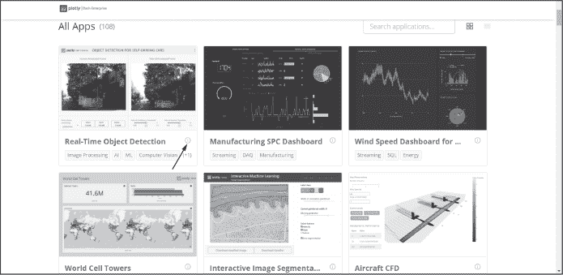
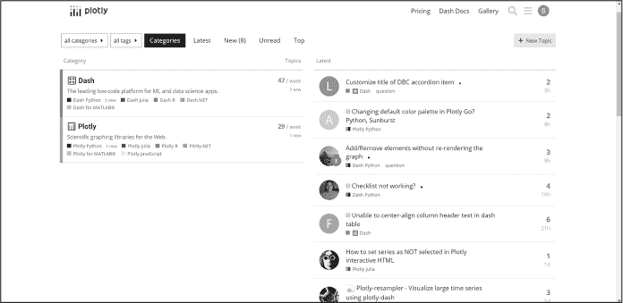
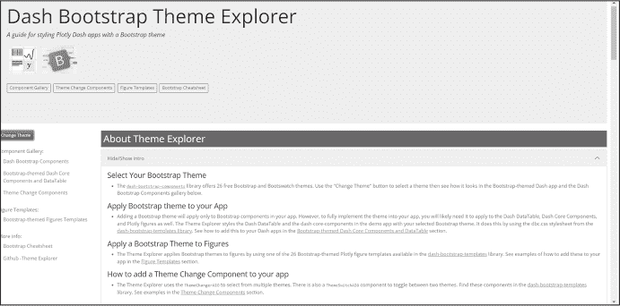
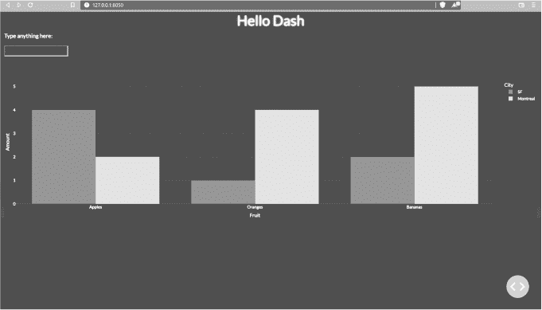
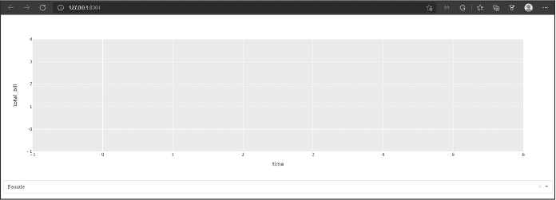
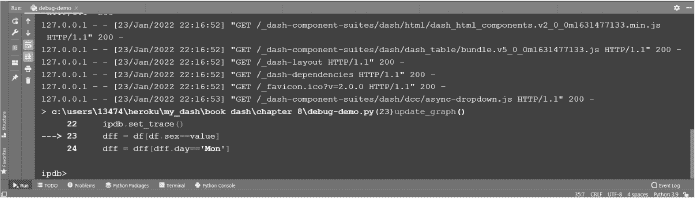
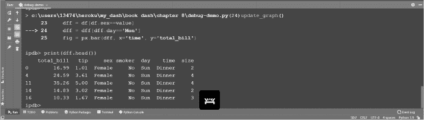
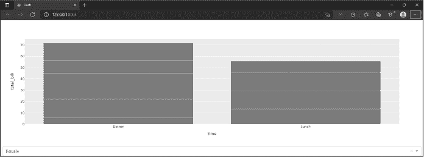
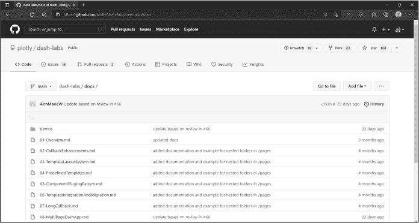

## 第八章：8 技巧与窍门

在丰富的 Dash 库中，还有很多内容等待你去探索。在本章中，我们整理了一些提示，帮助你在 Dash 之旅中迈出下一步。这些都是我们在学习 Dash 并开始构建更复杂应用时发现的有用技巧。

我们将深入探讨 Dash 企业应用库，在这里你可以发现用于构建特定行业内更先进应用的开源代码。你还将学会利用 Plotly 社区帮助你解决编程过程中的问题。我们将分享一些 Bootstrap 主题和调试工具，帮助你美化应用并解决 bug。我们还会指导你如何浏览 dash-labs 仓库，在那里最前沿的 Dash 功能正在不断开发。最后，本章还将为你提供一套 Dash 学习资源，帮助你提升知识，并让使用 Dash 编程变得更加有趣和激动人心。

### Dash 企业应用库

正如我们在本书中提到的，一个学习更高级和复杂 Dash 应用的有效方式是探索 Dash 企业应用库（[*https://<wbr>dash<wbr>.gallery<wbr>/Portal*](https://dash.gallery/Portal)）。这些应用中的许多都是开源的，意味着你可以在 GitHub 上完全访问其代码。要查看某个应用是否为开源，可以点击位于应用卡片右下角的信息图标（如图 8-1 所示）；这时会弹出一个模态框，如果显示类似“未经认证：任何人都可以访问此应用”的信息，那么该应用就是开源的。该信息卡片还会告诉你该应用使用的编程语言；如你所料，绝大多数应用都是用 Python 编写的。

图 8-1：Dash 应用库中应用卡片上的信息图标

应用库正在不断更新。为了找到与你需求最相关的应用，你可以通过点击页面顶部的特定行业来筛选页面。一个小提示：当你浏览这些应用时，考虑一下自己当前应用项目的布局。如果你发现某个布局很有趣，可以访问其开源代码，看看能否在你的应用中复制这个布局。

### 通过 Plotly 论坛提升你的学习

Plotly 论坛（[*https://<wbr>community<wbr>.plotly<wbr>.com*](https://community.plotly.com)）是一个为 Plotly 和 Dash 用户提供的社区论坛。如果你还没有 Plotly 论坛的账号，现在就应该注册一个。在你使用 Dash 开发的过程中，论坛社区的成员会帮助你更好地了解 Dash 和 Plotly 图表库，克服困难，并解决特定的 bug。即使你现在没有代码问题，我们也建议你抽时间浏览论坛，阅读一些你感兴趣的话题。通过阅读其他用户的经验，你会学到很多；最重要的是，浏览论坛将帮助你了解如何创建话题、提供有用的答案，并以一种能够得到可操作回答的方式提问。你很快就会看到，论坛如何为社区的成长做出贡献。图 8-2 显示了论坛的登录页面；当然，每次访问时它会有所不同，所以它看起来不会完全一样。

图 8-2: Plotly 论坛登录页面

在页面的左侧，你会找到主要的类别，*Dash* 和 *Plotly*。在右侧，你会看到这两个类别中最新的帖子，不论主题是什么。

论坛上的社区通常非常活跃并乐于助人。为了确保你的问题能够被看到并得到回答，务必使用一个适合你问题的帖子标题，并清晰地陈述你遇到的问题；另外，确保你附上与你的问题相关的代码。这个代码通常被称为 *最小工作示例*，它使得潜在的回复者能够复制你的代码并在他们的系统上进行测试，看是否能复现相同的问题或错误。确保代码格式正确，使用编辑工具箱中的预格式化文本符号 </>。

随着你在 Dash 中获得更多经验，花时间回馈社区，帮助他人解答问题。最后，我们鼓励你通过使用 *展示和讲解* 标记你的帖子，将你创建的应用与社区分享。

### 应用主题浏览器

在 第五章 中，你学习了如何将 Bootstrap 主题添加到你的应用中，如下所示：

app = Dash(__name__, external_stylesheets=[dbc.themes.BOOTSTRAP])

这些主题将仅应用于应用程序中的 Bootstrap 组件。要将主题完全应用到你的应用中，还需要将其应用到 Dash DataTable、Dash 核心组件和 Plotly 图形中。位于[*https://<wbr>hellodash<wbr>.pythonanywhere<wbr>.com*](https://hellodash.pythonanywhere.com)的*Dash Bootstrap 主题浏览器*，如图 8-3 所示，允许你选择一个主题并查看它在页面上所有组件、文本和图形中的效果。要查看可用的主题，点击页面左侧的**更改主题**。一个面板应该会滑出，列出可用的主题。点击其中一个，看看下拉框、复选框组件、标题、文本、图表和DataTable的样式和颜色变化。

图 8-3：Dash Bootstrap 主题浏览器登陆页面

选择一个适合你应用程序的主题，并按照以下四个步骤将其添加到应用程序的所有元素中。我们将在一个示例应用程序中实现<VAPOR>主题作为例子；完整的*app.py*文件可以在书籍资源的* Chapter-8 *文件夹中找到，网址为[*https://<wbr>github<wbr>.com<wbr>/DashBookProject<wbr>/Plotly<wbr>-Dash*](https://github.com/DashBookProject/Plotly-Dash)。

1. 安装*dash_bootstrap_templates*库，然后导入*load_figure_template*和*dash_bootstrap_components*。为此，请打开 PyCharm 终端并输入：

$ pip install dash-bootstrap-templates

要导入必要的库，请在主应用程序文件中键入以下内容：

import dash_bootstrap_components as dbc

from dash_bootstrap_templates import load_figure_template

2. 将预构建的 Dash Bootstrap 样式表添加到你的应用程序，并选择一个主题。在这里我们选择了VAPOR。确保在替换主题时保持大写风格：

dbc_css = "https://cdn.jsdelivr.net/gh/AnnMarieW/dash-bootstrap-templates

@V1.0.4/dbc.min.css"

app = Dash(__name__, external_stylesheets=[dbc.themes.VAPOR, dbc_css])

load_figure_template(["vapor"])

3. 将选定的主题纳入条形图的template属性：

fig = px.bar(df, x="Fruit", y="Amount", color="City", barmode="group",

template="vapor")

4.  最后，将 className="dbc" 添加到应用程序的外部容器中，如下代码所示：

app.layout = dbc.Container([

    html.H1("Hello Dash", style={'textAlign': 'center'}),

    html.P("在此处输入内容："),

    dcc.Input(className="mb-2"),

    dcc.Graph(

       id='example-graph',

       figure=fig

    )

],

    fluid=True,

    className="dbc"

)

这个 *app.py* 文件在本示例中执行后，应该会生成图 8-4 中所示的应用程序。

图 8-4：完整的示例应用程序

### 调试 Dash 应用程序

了解如何有效地调试你的应用程序将为你节省许多试错的时间。当出现错误时，掌握调试的完整技能超出了本章的范围；然而，我们在这里整理了一些资料，帮助你入门。

Python 提供了一些免费的调试器包。对于 Dash，我们推荐使用 ipdb 包。要安装它，请打开终端并输入：

$ pip install ipdb

让我们看一个调试可能有帮助的例子。找到书中的 *debug-demo.py* 文件，位于 [*https://<wbr>github<wbr>.com<wbr>/DashBookProject<wbr>/Plotly<wbr>-Dash*](https://github.com/DashBookProject/Plotly-Dash) 上。当你在计算机上运行它时，应该会看到类似图 8-5 的效果。这个应用程序本应图示随时间变化的账单总额。

图 8-5：调试演示应用程序执行后的效果

这非常令人沮丧：我们的应用程序没有抛出任何错误，但显然有问题，因为图表没有显示任何数据。让我们调试应用程序，找出问题所在。

首先，取消注释 *debug-demo.py* 中的第一行代码，以 import ipdb。然后，通过取消注释这行代码，激活回调函数中的调试功能：

ipdb.set_trace()

当然，你可以调试应用程序的任何部分；在我们的案例中，我们将从构建图表的回调函数开始，因为问题出在图表上。最后，关闭原生 Dash 调试机制，并关闭应用程序的多线程功能，以免由于重叠的 ipdb 实例而中断会话，就像在 *debug-demo.py* 中那样：

if __name__ == '__main__':

   app.run_server(debug=False, threaded=False, port=8004)

保存并运行修改后的 *debug-demo.py* 文件，然后点击 HTTP 链接在浏览器中打开你的应用程序。返回到运行工具窗口，你应该会看到类似 图 8-6 的内容。

图 8-6：在 PyCharm 运行窗口中激活调试

如果你尝试在运行窗口执行 print(dff.head())，你会收到一个错误，提示 dff 未定义。这是因为创建和定义 dff 的代码行在第 23 行，而该行尚未执行。为了告诉调试器执行下一行代码，在运行窗口输入小写字母**n**。现在，如果你再次执行 print(dff.head())，你应该能看到 DataFrame 的前五行，如 图 8-7 所示。

图 8-7：在运行窗口中打印的 DataFrame

然而，当你下一次按下**n**以执行代码行 24，并再次输入 print(dff.head()) 时，你会在运行窗口看到一个通知，告诉你 DataFrame 是空的：

空的 DataFrame

Columns: [total_bill, tip, sex, smoker, day, time, size]

Index: []

这是因为第 24 行将 day 列过滤，只保留包含 'Mon' 的行。看起来没有任何行的 day 列值是 'Mon'，这就是为什么 DataFrame 是空的。要检查 day 列中存在的唯一值，可以在运行窗口中输入 print(df.day.unique())。你会发现 day 列中只有 ['Sun' 'Sat' 'Thur' 'Fri'] 这些值。这就是当应用程序执行时，图表没有绘制任何内容的原因：没有数据可供绘制。

要修复你的应用程序，请将第 24 行的 'Mon' 改为 'Fri'，然后重新启动 *debug-demo.py* 文件。（如果你的应用无法重启，可以将最后的端口号从 8004 改为其他任何数字。）回到终端时，不必为每一行代码输入 **n**，你可以输入 **c** 来继续执行程序直到完成。因为应用中没有其他错误（断点），所以它将成功执行，并且应该像 图 8-8 所示。

图 8-8：该 debug-demo.py 应用程序在调试后成功执行

如需获取 ipdb 的备忘单，请访问 [*https://<wbr>wangchuan<wbr>.github<wbr>.io<wbr>/coding<wbr>/2017<wbr>/07<wbr>/12<wbr>/ipdb<wbr>-cheat<wbr>-sheet<wbr>.html<wbr>*](https://wangchuan.github.io/coding/2017/07/12/ipdb-cheat-sheet.html)。

调试愉快！

### dash-labs

*dash-labs* 是一个由 Plotly 启动的 GitHub 仓库，作为潜在未来 Dash 特性的一项技术预览，地址为 [*https://<wbr>github<wbr>.com<wbr>/plotly<wbr>/dash<wbr>-labs*](https://github.com/plotly/dash-labs)。社区反馈和积极参与对该仓库的成功至关重要，因为这些功能是为社区并与社区的帮助下开发的。过去几年里，dash-labs 中开发的一些功能包括灵活的回调签名（[*https://<wbr>dash<wbr>.plotly<wbr>.com<wbr>/flexible<wbr>-callback<wbr>-signatures*](https://dash.plotly.com/flexible-callback-signatures)）和长回调（[*https://<wbr>dash<wbr>.plotly<wbr>.com<wbr>/long<wbr>-callbacks*](https://dash.plotly.com/long-callbacks)）。

在撰写本文时，dash-labs 中有两个活跃的项目，包括用于快速和无缝编写多页面应用程序的 Multipage Apps 功能和允许通过 Dash 执行 Markdown 文档的 Dashdown 功能。要开始探索 dash-labs，请点击 dash-labs 仓库中的 ***docs*** 文件夹（图 8-9），并了解目前已开发的功能。

图 8-9：与 dash-labs 仓库相关的 文档文件夹

要亲自试试其中的一些功能，你可以 git clone dash-labs 并运行 *demos* 文件夹中的任意 *app.py* 或 *app_dbc.py* 文件。

### 使用 Black 格式化代码

以一种良好格式编写代码不仅具有视觉上的美感，而且对于可读性至关重要。随着你技能的提升，你所编写的程序会变得越来越大、越来越复杂。如果这些程序没有良好的格式，你很容易在自己的代码中迷失方向。手动按照 PEP8 格式（Python 官方风格指南）格式化代码是非常耗时的。幸运的是，我们有 Python 工具 *Black*：一个代码格式化工具。

让我们看看 Black 是如何工作的。首先，安装 Black：

$ pip install black

然后从 [*https://<wbr>github<wbr>.com<wbr>/DashBookProject<wbr>/Plotly<wbr>-Dash*](https://github.com/DashBookProject/Plotly-Dash) 下载 *pre-black-formatting.py* 文件并打开它（列表 8-1）。

from dash import Dash, dcc, html

import plotly.express as px

import pandas as pd

app = Dash(__name__)

df = pd.DataFrame({

   ❶ 'Fruit': ["Apples", "Oranges", "Bananas", "Apples", "Oranges",

              "Bananas"],

      "Amount": [4, 1, 2, 2, 4, 5],

      "City": ["SF", "SF", "SF", "Montreal", "Montreal", "Montreal"]

})

❷ fig=px.bar(df, x="Fruit", y="Amount", color="City")

app.layout = html.Div([

   html.H1("Fruit Analysis App", style={'textAlign':'center'}),

   ❸  dcc.Graph(

      id='example-graph',

      figure=fig

   )

],

)

if __name__ == '__main__':

   app.run_server(debug=True)

清单 8-1：The pre-black-formatting.py 文件

代码中存在一些格式不一致的地方。例如，Fruit 键❶ 被单引号括起来，而< sampa class="SANS_TheSansMonoCd_W5Regular_11">Amount和< samp class="SANS_TheSansMonoCd_W5Regular_11">City 键则被双引号括起来。同样，Fruit 键的值跨越了两行代码，而其他键值都写在了一行代码上。而且，在构建 Plotly Express 柱状图的那行代码❷中，我们可以看到等号前后没有空格（fig=px.bar）。最后，我们看到 Dash 的 Graph 组件跨越了四行代码❸，而位于其上方的 html.H1 组件仅用了一行代码。代码中还有一些其他的不一致之处，看看在使用 Black 之前你能发现多少。

要使用 Black，打开终端并进入包含*pre-black-formatting.py*的目录。进入后，输入命令并跟上文件名，如下所示：

$ black pre-black-formatting.py

Black 会自动格式化文件而不更改文件名。为了本演示的目的，我们将文件重命名为 *post-black-formatting.py*，该文件也位于书籍的 GitHub 仓库中（清单 8-2）。

from dash import Dash, dcc, html

import plotly.express as px

import pandas as pd

app = Dash(__name__)

df = pd.DataFrame(

   {

        "Fruit": ["苹果", "橙子", "香蕉", "苹果", "橙子", "香蕉"], ❶

        "Amount": [4, 1, 2, 2, 4, 5],

        "City": ["SF", "SF", "SF", "Montreal", "Montreal", "Montreal"],

   }

)

     fig = px.bar(df, x="Fruit", y="Amount", color="City") ❷

app.layout = html.Div(

   [

      html.H1("水果分析应用", style={"textAlign": "center"}),

      dcc.Graph(id="example-graph", figure=fig), ❸

   ],

)

if __name__ == "__main__":

   app.run_server(debug=True)

示例 8-2：用 Black 格式化的 post-black-formatting.py 文件

我们可以看到，所有的单引号都已被替换为双引号，Fruit 键的值已经写在一行代码中，而不是两行 ❶，等号前后也有相等的空格 ❷，而 Graph 组件也被写在一行，而不是四行 ❸。正如你所看到的，Black 格式化的代码一致且更易读。

### 后续资源

*重要的事情不是停止提问；好奇心有其存在的理由。*

—阿尔伯特·爱因斯坦

理解到学习永无止境，我们整理了一些资源，帮助你成为 Dash 的专家：

+   我们专门为教学 Dash 和分享本书相关更新而设立的网站，也提供了建议的视频列表，帮助你加深对 Dash 的了解：[*https://<wbr>learnplotlydash<wbr>.com*](https://learnplotlydash.com)。

+   Dash Bootstrap Cheat Sheet 网站，由我们的合著者 Ann Marie Ward 构建，提供了主要 Bootstrap 样式语法的总结，所有 Dash Bootstrap 组件文档的快捷链接，以及指向 Dash 文档不同部分的链接：[*https://<wbr>dashcheatsheet<wbr>.pythonanywhere<wbr>.com*](https://dashcheatsheet.pythonanywhere.com)。

+   Finxter 是一个 Python 教育网站，每月吸引超过 50 万名学生，由我们的合著者 Chris Mayer 创办，是学习 Python 和提升 pandas 技能的好地方。访问 [*https://<wbr>app<wbr>.finxter<wbr>.com*](https://app.finxter.com)。要免费阅读 Chris 的书《Coffee Break Pandas》，请访问 [*https://<wbr>blog<wbr>.finxter<wbr>.com<wbr>/coffee<wbr>-break<wbr>-pandas<wbr>-book<wbr>-page*](https://blog.finxter.com/coffee-break-pandas-book-page)。

+   Charming Data 的 YouTube 频道及其相应的 GitHub 仓库，由我们的合著者 Adam Schroeder 创建并维护，是学习 Dash 和跟进最新 Dash 发展动态的极佳资源：[*https://<wbr>www<wbr>.youtube<wbr>.com<wbr>/c<wbr>/CharmingData*](https://www.youtube.com/c/CharmingData) 和 [*https://<wbr>github<wbr>.com<wbr>/Coding<wbr>-with<wbr>-Adam<wbr>/Dash<wbr>-by<wbr>-Plotly<wbr>*](https://github.com/Coding-with-Adam/Dash-by-Plotly)。

+   由社区创建并维护的 Dash 组件综合列表将帮助你为应用程序增添更多功能和特点，使其看起来更加专业：[*https://<wbr>community<wbr>.plotly<wbr>.com<wbr>/t<wbr>/community<wbr>-components<wbr>-index<wbr>/60098<wbr>*](https://community.plotly.com/t/community-components-index/60098)。

+   以下是一些专门教授 Dash 和 Plotly 的在线课程。在决定选择哪个课程之前，请务必阅读评论：

+   *https://www.datacamp.com/courses/building-dashboards-with-dash-and-plotly*

+   *https://www.coursera.org/projects/interactive-dashboards-plotly-dash*

+   *https://www.pluralsight.com/courses/plotly-building-data-visualizations*

+   *https://www.udemy.com/course/interactive-python-dashboards-with-plotly-and-dash*
