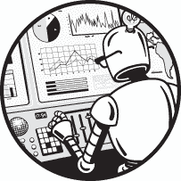
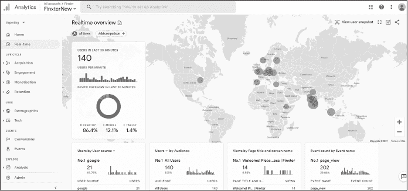
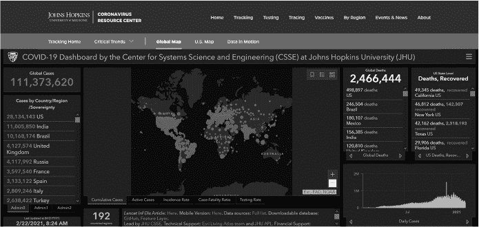
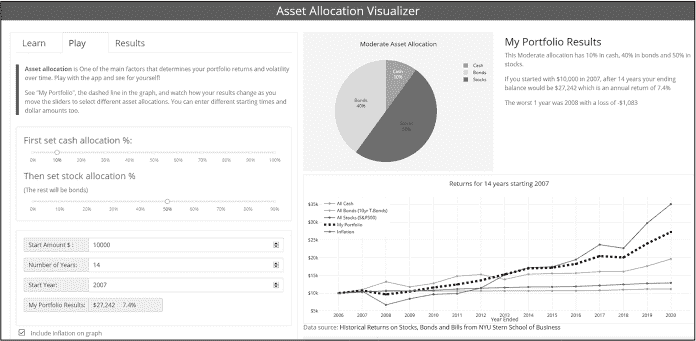
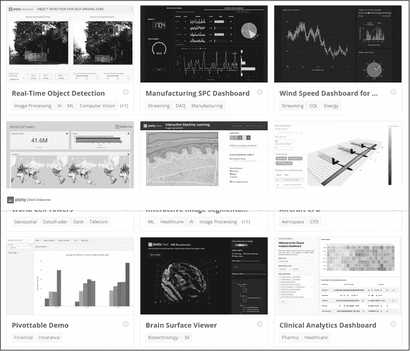

# 第十六章：简介

有人说信息就是力量，其他人则宣称数据是新的黄金。但是，原始信息和数据在没有背景的情况下往往是没有意义的。只有在适当分析、解读和理解的情况下，数据才是有价值的资产。因此，新的领域不断涌现。数据科学家、数据工程师、数据分析师、商业智能顾问和机器学习工程师都是越来越受欢迎的职业，它们都有一个共同的职责：使用图形和仪表盘等可视化工具来解读数据。

本书的目标是帮助你创建美观的仪表盘应用，让你能够用几行代码就能可视化数据。无论你是一个有抱负的专业人士，定期处理数据，还是仅仅喜欢玩数字，本书将为你提供工具和教育，帮助你充分利用数据的力量。

## 为什么是这本书

Plotly Dash 框架使你能够轻松构建自己的仪表盘。*仪表盘*是网络应用，允许你和你的用户通过交互式小部件动态地探索数据，这些小部件接收用户输入并展示输出。例如，它们可能包含滑块、文本框、按钮和下拉菜单，允许用户选择要在结果图表和图形中显示的数据，就像图 1 中你看到的地图和条形图。仪表盘应用的交互性是它们近年来日益流行的原因。

图 1：Google Analytics 仪表盘用于追踪网站使用情况

如果没有正确的指导，构建一个 Plotly Dash 应用可能会很困难。本书将教你如何使用实用的指引和易懂的教程创建第一个交互式、具有高度可视化的分析仪表盘应用。它将从 Dash 新手带领你快速、充满信心地创建自己的仪表盘应用。

阅读本书还将帮助你锻炼 21 世纪的关键技能，包括编程、数据分析和数据科学，以及数据可视化和展示。社区对动态增长数据集的惊人数据可视化需求不断增加，这些数据集来源于各种各样的数据源，如智能家居、工厂、网络商店、社交网络、视频托管服务和健康追踪设备。

随着数据规模和复杂性的激增，我们将看到对仪表盘应用程序的需求不断增长，这些应用可以为用户提供实时的数据驱动概览，展示世界上发生的事情。你很可能已经在自己的生活中使用过基于浏览器的仪表盘：Google Analytics、Facebook Ad Manager 和 Salesforce Dashboards 就是一些现实生活中的仪表盘应用示例。图 1 显示了 Google Analytics 仪表盘应用的截图，帮助你追踪实时网站流量。

这个仪表板告诉我们，在截图记录时，大多数美国和亚洲的用户仍在睡觉，而欧洲的用户已经在忙着搜索网络。当你通过仪表板应用正确地可视化数据时，这些洞察是如何无缝产生的！创建这种类型的应用程序一直以来只有熟练的编码人员和那些能够将实时数据源与动态网站连接的大型组织才能做到，从而创造出仪表板应用所提供的独特价值。

图 2 显示了约翰·霍普金斯大学的仪表板应用的截图，它使用最新和动态的数据流可视化 COVID-19 的传播情况。

图 2：约翰·霍普金斯大学仪表板可视化全球疾病传播

你可以在 [*https://coronavirus.jhu.edu/map.html*](https://coronavirus.jhu.edu/map.html) 实时查看该仪表板。该仪表板显示了一个动态计数器，追踪全球病例数，一个追踪热点的地图，按国家划分的病例数据，传播情况随时间变化的进程，以及更多静态和动态统计数据。这个仪表板应用每月能够帮助数十万人从数据中获得洞察——这些洞察是通过仅使用电子表格和表格数据无法获得的。

图 3 显示了本书作者之一创建的资产配置工具的截图 ([*https://<wbr>wealthdashboard<wbr>.app*](https://wealthdashboard.app))。

图 3： Wealthdashboard.com 应用程序可视化你的资产配置

这个工具允许你通过输入分配给股票、债券和现金的财富百分比，并使用历史数据来可视化资产配置的回报和风险概况，从而建模投资回报。这是你将在本书中学习制作的一个仪表板！

仪表板应用的潜在用途几乎是无限的。对于每个数据源，都有一个有用的仪表板应用等待着你来创建。

我们，作为作者，度过了无数个不眠之夜进行编码、调试，并摸索如何让我们的第一个 Dash 应用程序正常工作。关于 Dash 的书籍非常稀缺，更不用说那些既易于理解又适合 Python 初学者的书籍了。所以，开始这个项目时，我们决定是时候改变这种状况了！

查看 Dash 企业应用程序画廊中的许多示例应用程序，网址是 [*https://<wbr>dash<wbr>.gallery<wbr>/Portal*](https://dash.gallery/Portal)（参见 图 4）。其中一些应用程序，如 AI 语音识别应用程序，代码行数不到 100 行！

图 4：官方 Dash 画廊截图，展示了仪表板应用的多种用途和功能

## 为何选择 Plotly Dash

我们已经确认仪表板非常出色，那么让我们来看看为什么你应该选择 Plotly Dash 来完成这个工作。虽然有很多优秀的替代框架可以用来创建仪表板，包括 Streamlit、Shiny、Jupyter、Tableau、Infogram 等等，但我们发现有若干令人信服的理由，让 Dash 在各种使用场景中优于它的竞争对手：

+   Dash 应用程序可以用纯 Python 编写，这意味着如果你熟悉 Python，你将能够非常快速地启动和运行。这也意味着你可以轻松地将现有 Python 工作中的数据和结果集成到 Dash 应用程序中。

+   Python 非常具有表现力，Dash 代码可以相对紧凑，这意味着你可以更快速地进行原型设计和迭代，这在开发需要在截止日期前完成的应用程序，或者在需求经常变化的敏捷环境中非常有用。

+   Dash 会隐藏复杂性，例如 JavaScript 前端和 Python 后端之间的通信。因此，你无需承担复杂的任务，如序列化、反序列化、定义 API 端点或发起 HTTP 请求。这可以显著减少样板代码。

+   Dash 是由 Plotly 团队开发的，这意味着它与 Plotly 图形库有着出色的集成。Plotly，因此 Dash，是创建 web 应用程序的绝佳选择，因为这些交互式图形本身就是基于 web 技术的。

+   Dash 是建立在广泛使用的 Flask 框架之上的，这为我们提供了多种部署选项，从完全托管到自托管不等。

+   虽然 Dash 仅能与 Python 一起使用，但它非常具有扩展性，允许你混合使用 CSS 和 JavaScript，甚至可以使用 React 和 Dash 组件生成器编写你自己的组件。

尽管 Dash 具有许多优点，但没有软件是完美的。为了帮助你决定最适合你的工具，以下是 Dash 的一些局限性：

+   Dash 性能良好，但如果你的应用程序包含大量组件，或者非常复杂，或者正在处理巨大的数据集，你可能会开始看到应用程序变慢。

+   Dash 启动和运行的复杂度稍高于一些无代码或低代码的替代方案，且与其他企业软件的集成没有替代框架那么完善；例如，PowerBI 与微软企业软件的集成非常紧密。

+   虽然 Dash 是纯 Python 编写的，但要真正理解其中的工作原理，你需要掌握 HTML 和 CSS 的基础知识。

## 本书适合谁阅读

我们写这本书时考虑到了完全没有 Dash 经验的读者。虽然一些 Python 的基础知识会帮助你更好地理解本书内容，但我们并不假设你有很多编程经验，因此我们会解释一些基础知识，比如如何安装 Dash 和相关库，如何设置编程环境，以及如何使用像 pandas 这样的库。本书的范围并不包括完整的 Python 课程，但第一章将介绍一些构建 Dash 应用程序所需的 Python 基础知识，并引导你查找更多资源，帮助你在需要时深入学习。

在实践中，许多读者可能已经有一些 Python 编程经验。如果你知道 Python，但还没有经验设置编程环境，可以从第二章开始。

如果你已经知道 Python，并且已经设置好了编程环境（最好是 PyCharm），你可以直接跳到第三章，我们将在那里为你提供一个关于 pandas 库的简短教程。如果你是一个精通编码的专家，已经掌握了这些内容，直接跳过所有入门章节，从第四章开始，在那里我们将向你展示如何创建你的第一个 Dash 应用程序。

## 本书内容

本书分为两部分：第一部分将帮助你安装和设置构建 Dash 应用所需的所有工具；第二部分将带你构建四个逐渐复杂的应用程序，并在最后提供一些实用的建议。

**第一部分：速成课程**

**第一章，Python 基础回顾**，讨论了构建数据驱动应用程序时最重要的 Python 基础知识，包括数据类型和结构、函数，甚至包括一些面向对象编程的内容。

**第二章，PyCharm 教程**，指导你安装 PyCharm 编程环境、安装库、创建项目，并运行你的 Dash 应用程序。

**第三章，pandas 速成课程**，为你提供了一个关于处理表格数据的 pandas 库的视觉概览和 10 分钟回顾。

**第二部分：构建应用程序**

**第四章，第一个 Dash 应用程序**，展示了如何通过一个基于社交媒体分析的实际例子创建你的第一个 Dash 应用程序。它介绍了 Dash 应用的构建模块，包括布局和样式部分、Dash 组件、回调函数，以及使用 Plotly Express 进行可视化。阅读完这一章后，你将知道如何创建自己的基础 Dash 应用程序。

**第五章，全球数据分析：高级布局与图表**，使用世界银行的全球数据集来介绍更多的组件和样式功能。本章细化并扩展了你基本的 Dash 技能：你将与 API 进行交互，实时获取数据，并学习使用 dash-bootstrap-components 来创建更复杂的布局。

**第六章，投资组合：构建更大的应用程序**，深入探讨了更多高级的 Dash 组件，使用一个基于财富的仪表盘应用作为示例。你将学习如何构建和调试更大的 Dash 应用，使用更复杂的 Dash 和 Bootstrap 组件，并通过低级的 Plotly 图形对象库来构建图表。

**第七章，探索机器学习**，带你通过一个可视化机器学习模型的应用，并提供有关支持向量机的背景知识。这展示了 Dash 的另一个应用：可视化和探索算法的工作原理。你将深入了解两个常与 Dash 一起使用的数值库：NumPy 和 scikit-learn。我们将介绍等高线图，并探讨 Dash 回调的更复杂用法。

**第八章，技巧与窍门**，总结了本书的最佳技巧与窍门，并提供了一些进一步阅读的参考资料，内容涵盖调试、应用自动格式化、利用 Dash 社区以及探索更多的应用程序。

## 在线资源

在本书中，我们将推荐由我们这些作者制作的资源，以帮助你的学习。一本书所能包含的内容有限，因此为了保持专注，我们已将大量的代码、视频和文档提供在线。

+   带有附加材料的书籍页面：[*https://<wbr>learnplotlydash<wbr>.com*](https://learnplotlydash.com)

+   Adam 的 YouTube 频道：[*https://<wbr>www<wbr>.youtube<wbr>.com<wbr>/c<wbr>/CharmingData*](https://www.youtube.com/c/CharmingData)

+   GitHub 仓库：[*https://<wbr>github<wbr>.com<wbr>/DashBookProject<wbr>/Plotly<wbr>-Dash*](https://github.com/DashBookProject/Plotly-Dash)

+   出版商更新：[*https://<wbr>nostarch<wbr>.com<wbr>/python<wbr>-dash*](https://nostarch.com/python-dash)

+   免费的 Python 邮件学院和备忘单：[*https://<wbr>blog<wbr>.finxter<wbr>.com<wbr>/email<wbr>-academy*](https://blog.finxter.com/email-academy)
