# 3

动态数据结构


本章介绍了*动态数据结构*，这些数据结构会随着数据的变化而改变其结构。这些结构的适应性可能包括根据需求扩展数据结构的大小、在不同值之间创建动态的可变链接等。动态数据结构是几乎所有计算机程序的核心，并且是计算机科学中一些最令人兴奋、有趣和强大的算法的基础。

之前章节中介绍的基本数据结构就像停车场——它们为我们提供了存储信息的地方，但没有太多适应变化的能力。的确，我们可以对数组中的值（或者说停车场中的车）进行排序，并使用这种结构使二分查找变得高效。但我们仅仅是改变了数组内数据的顺序。数据结构本身既没有变化，也没有响应数据的变化。如果我们稍后更改已排序数组中的数据，比如修改某个元素的值，我们需要重新排序数组。更糟糕的是，当我们需要改变数据结构本身——例如通过扩展或缩小数组——时，简单的静态数据结构无法提供任何帮助。

本章通过将第一章介绍的静态数据结构——数组，与一种简单的动态数据结构——链表进行比较，来展示后者的优势。在某些方面，这两种数据结构是相似的：它们都允许程序员通过单一的引用来存储和访问多个值，不论是数组还是链表的头部。然而，数组在创建时就固定了结构，就像是停放车辆的停车位。相比之下，链表可以在程序的内存中扩展。它们更像是一队长长短短的队伍，可以随时加入或移除元素。理解这些差异为理解本书接下来介绍的更高级数据结构打下了基础。

## 数组的局限性

虽然数组是存储多个值的优秀数据结构，但它们存在一个重要的局限性：它们的大小和内存中的布局在创建时是固定的。如果我们想存储比数组能够容纳更多的值，就需要创建一个新的、更大的数组，并将旧数组中的数据复制过来。这种固定大小的内存适用于我们需要存储的项目数量有明确上限的情况。如果我们有足够的空间来容纳数据，就可以不断地插入单独的元素，而不必担心数组在内存中的静态布局。然而，许多应用程序需要能够随着程序变化而增长和变化的动态数据结构。

为了满足动态数据结构的需求，许多现代编程语言提供了动态“数组”，这些数组会随着元素的添加而增长或缩小。然而，这些数组实际上是静态数组或其他数据结构的封装，隐藏了与其动态特性相关的复杂性和成本。虽然这样对程序员很方便，但也可能导致隐藏的低效。当我们在数组末尾添加元素时，程序仍然需要增加使用的内存，只是这一过程发生在幕后。为了理解为什么动态数据结构如此重要，我们需要讨论静态数据结构的局限性。在本书中，我们将使用 *数组* 一词来指代一个简单的静态数组。

为了说明数组的限制，假设你花费了一整周的时间，掌握了最新的复古视频游戏现象——《太空青蛙 2000》。每次主屏幕显示你的五个最高分时，你都会欣喜地笑出声。这些伟大的成就代表了数小时的汗水、泪水、喊叫，和更多的泪水。然而，第二天，你那（即将成为前）最好的朋友来访，并连续五次打破了你的最高分。把那个背叛的前朋友赶出家门后，你回到游戏中，盯着新显示的高分，见图 3-1，忍不住喊道：“为什么游戏不能存储更多的分数？保存一个前十名列表难道就那么难吗？或者至少在最末尾加一个？”

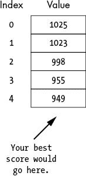

图 3-1：一个包含视频游戏高分的五个元素的数组。遗憾的是，里面没有你的分数。

这是任何固定大小的数据结构及其在内存中固定布局的基本限制之一——它无法随数据增长。如下面所示，这一限制使得某些常见操作变得昂贵。更实际地说，想象一下，如果文字处理软件只能容纳有限数量的字符，电子表格只能有固定行数，照片存储程序只能存储有限数量的图片，或者一个咖啡日志只能记录一千条条目，这些限制带来的影响。

由于数组的大小在创建时是固定的，如果我们想扩展数组以存储更多数据，就必须创建一个新的、更大的内存块。考虑向数组末尾添加一个元素的最简单情况。由于数组是一个单一的固定大小的内存块，我们不能直接把另一个值插入到末尾。因为内存中可能已经有其他变量占据了那个位置。为了避免覆盖那个变量的值，我们必须分配一个新的（更大的）内存块，将原数组的所有值复制到新块中，并把新值写入末尾。对于一个单一的添加操作来说，这会带来很大的开销，如 图 3-2 所示。

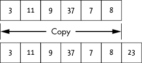

图 3-2：将元素添加到满的数组末尾。

可以把数组想象成酒店自助餐台上那些有固定位置的热菜盘。很容易把空的炒蛋盘拿出来，换上一个新的。但你不能随便把一个新盘子放到末尾，因为没有位置。如果厨师决定添加煎饼到菜单中，那么必须移走其他的菜肴。

如果你知道需要插入很多新值，你可能会将成本分摊到多个更新中，*摊销*这些成本。你可能会采取类似于*数组倍增*的策略，在数组扩展时，其大小会翻倍。例如，如果我们尝试向一个大小为 128 的数组添加第 129 个元素，我们首先会分配一个新的大小为 256 的数组，并将原来的 128 个元素复制过去。这使得我们在下一次需要分配新空间之前，可以继续扩展数组。然而，代价是可能会浪费空间。如果我们只需要 129 个元素，我们就会多分配了 127 个空间。

数组倍增提供了一种合理的平衡，既避免了昂贵的数组复制，又避免了浪费内存。随着数组的增长，倍增的频率会越来越低。同时，通过在数组满时倍增，我们可以保证浪费的空间少于一半。然而，即使采用这种平衡的方式，我们也能明显看到使用固定大小数组的成本，无论是复制成本还是内存使用。

```py
ArrayDouble(Array: old_array):
    Integer: length = length of old_array
    Array: new_array = empty array of size length * 2

    Integer: j = 0
    WHILE j < length:
        new_array[j] = old_array[j]
        j = j + 1
    return new_array
```

数组倍增的代码首先分配一个新数组，大小是当前数组的两倍。一个 `WHILE` 循环遍历当前数组的元素，将它们的值复制到新数组中。然后返回新数组。

想象一下将这一策略应用到货架空间上。我们在一个地方开设了一家书店《数据结构与更多》，并安装了五个简陋的书架。开业当天，需求出乎意料地大，人们要求更多种类的书籍：我们需要扩充库存。慌乱之下，我们搬到了一个有 10 个书架的新地点，并将书籍迁移过去。需求暂时得到了满足。由于缺乏一个综合的数据结构书店，零售图书市场存在这一明显的空缺，我们的书店大获成功，需求持续增长。我们可能会多次升级店铺，搬到有 20、40、甚至 80 个书架的地方。每次我们都需要支付费用，来确保新位置并迁移书籍。

数组值在内存中的固定位置带来了另一个限制。我们无法轻松地将新元素插入数组的中间部分。即使在原数组的末尾有足够的空位来容纳新元素，因此我们不需要将整个数组移动到新的内存块中，我们仍然需要将每个现有元素依次移动，以为新值腾出空间。不同于书架上的书籍，我们不能仅凭一次推力将所有元素推开。如果我们有 10,000 个元素，想在第二个位置添加一个元素，那么我们就得移动 9,999 个元素。这是插入一个元素所需要付出的巨大努力。

当我们尝试将新值插入到一个已经满的数组的中间时，问题会变得更加复杂。我们不仅需要分配一个新的内存块并复制旧值，还需要将新值后面的元素依次向下移动一个位置，为新值腾出空间。例如，假设我们想将值 23 插入到一个已有六个元素的数组中的第四个位置，如图 3-3 所示。

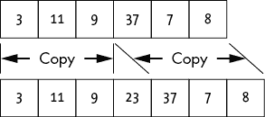

图 3-3：向满数组中间添加一个元素

为了解决数组的不足，我们需要转向更灵活的数据结构，这些结构可以在添加新数据时扩展：动态数据结构。在深入细节之前，让我们先介绍一下指针，这是一种关键的变量类型，用于重新配置和扩展数据结构。

## 指针与引用

有一种变量类型，在其强大功能和可能使新程序员感到困惑的能力方面，超越了其他所有类型：*指针*。指针是一个只存储计算机内存中地址的变量。因此，指针指向内存中的另一个位置，该位置存储着实际数据，如图 3-4 所示。

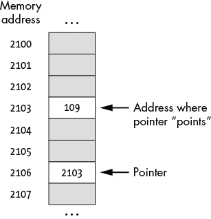

图 3-4：指针指向计算机内存中的一个地址

聪明的读者可能会问：“一个变量只是指向内存中的另一个位置，那它有什么意义？我以为变量的名字已经完成了这个功能。为什么不把数据直接存储在变量中，像普通人一样？为什么总是要把事情弄得这么复杂？”不要听那些怀疑者的声音。指针是动态数据结构的核心组成部分，稍后我们会看到这一点。

假设我们正在办公室做一个大型的建筑项目，并且已经整理了一些示例图纸，准备与团队共享。很快，项目文件夹中包含了大量的平面图、成本估算和艺术效果图。为了避免复制这个庞大的文件并随意放置，我们留下了一张便条，告诉同事们去三楼的档案室，文件柜#3，第二个抽屉，下方第五个文件夹里查找文件。这个便条充当了指针的角色。它没有详细列出文件中的所有信息，而是让我们的同事能够找到并提取这些信息。更重要的是，我们可以将这个“地址”分享给每位同事，而无需为他们复制整个文件。他们每个人都可以利用这些信息查找并在需要时修改文件夹。我们甚至可以在每位团队成员的桌上留下一个单独的便签，提供 10 个指向相同信息的变量。

除了存储一块内存的位置外，指针还可以为空值（在某些编程语言中表示为 None、Nil 或 0）。空值仅表示指针当前没有指向一个有效的内存位置。换句话说，它表示指针实际上还没有指向任何东西。

不同的编程语言提供不同的机制来实现指针任务，并非所有语言都会向程序员提供原始内存地址。像 C 和 C++这样的低级语言提供原始指针，并允许你直接访问它们存储的内存位置。其他编程语言，如 Python，使用引用，它们的语法与普通变量相似，但仍然允许你引用另一个变量。这些不同的变体有不同的行为和使用方式（解除引用、指针运算、空值的形式等）。为了简单起见，在本书中我们将使用*指针*一词来涵盖所有由指针、引用或索引实现的变量，这些变量指向预分配的内存块。我们不会担心访问内存块所需的复杂语法（这让不少编程爱好者哭泣过）。我们还将在伪代码中定义指针变量时使用最终数据的类型（而不是更通用的类型指针）。对我们来说，关键概念是指针提供了一种机制，用于链接到内存块，就像我们第一个动态数据结构：链表中的实现一样。

## 链表

*链表*是最简单的动态数据结构示例，且与数组有着密切的关系。像数组一样，链表也是用来存储多个值的数据结构。与数组不同的是，链表由一系列由指针连接的节点组成。链表中的基本*节点*是一个复合数据结构，包含两个部分：一个值（可以是任何类型）和指向链表中下一个节点的指针：

```py
LinkedListNode {
    Type: value
    LinkedListNode: next
}
```

我们可以将链表想象为一系列相互链接的箱子，如图 3-5 所示。每个箱子存储一个单一的值，并包含指向下一个箱子的指针。

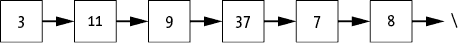

图 3-5：通过指针链接的一系列节点表示的链表

链表末尾的斜杠表示一个空值，指示链表的结束。实际上我们是在说，最后一个节点的`next`指针并不指向有效的节点。

链表就像是我们最喜欢的咖啡店门口排队的长队伍。人们通常不知道自己在队伍中的绝对位置——“我在距离柜台五十三级砖的位置。”他们关注的是自己在队伍中的相对位置，也就是他们前面那一个人，而这个位置我们存储在指针中。即使队伍在店内（甚至停车场）绕来绕去，形成复杂的循环，我们仍然可以通过询问每个人面前是谁，来重新构建队伍的顺序。我们可以通过询问每个人前面的人，沿着队伍向柜台走去。

因为链表包含指针和数值，链表需要比数组更多的内存来存储相同的元素。如果我们有一个大小为*K*的数组，每个元素为*N*字节，我们只需要*K* × *N*字节。而如果每个指针需要额外的*M*字节，那么我们的数据结构的内存开销就变为*K* × (*M* + *N*)字节。除非指针的大小远小于值的大小，否则这个开销是显著的。然而，增加的内存使用通常是值得的，因为指针提供的灵活性。

虽然教科书中通常将链表表示为整齐、有序的结构（如图 3-5 所示，或在我们的人物排队示例中所暗示），但我们的链表实际上可能分散在程序的内存中。如图 3-6 所示，链表的节点仅通过它们的指针连接。

这就是指针和动态数据结构的真正强大之处。我们不需要将整个链表保存在单一的连续内存块中。我们可以自由地在任何有空间的地方为新节点分配内存。

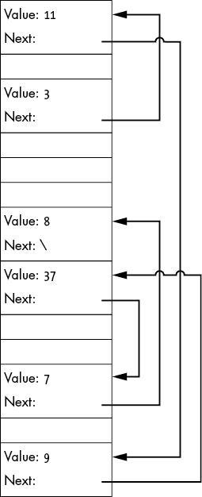

图 3-6：计算机内存中的链表。节点不一定是相邻的。

程序通常通过保持一个指向链表头部的单一指针来存储链表。程序可以通过从头开始，并通过指针迭代节点，来访问链表中的任何元素：

```py
LinkedListLookUp(LinkedListNode: head, Integer: element_number):
  ❶ LinkedListNode: current = head
    Integer: count = 0

  ❷ WHILE count < element_number AND current != null:
        current = current.next
        count = count + 1
    return current
```

代码从列表的头节点 ❶ 开始。我们维护一个第二个变量 `count` 来跟踪当前节点的索引。然后 `WHILE` 循环遍历链表中的每个节点，直到找到正确的数字，`count == element_number`，或遍历到链表的末尾，`current == null` ❷。在任何一种情况下，代码都会返回 `current`。如果循环因遍历到链表末尾而终止，那么索引不在列表中，代码返回 `null`。

例如，如果我们想访问链表中的第四个元素，程序将首先访问头节点，然后依次访问第二、第三和第四个元素，以找到正确的内存位置。图 3-7 展示了这个过程，其中值为 3 的节点是链表的头节点。

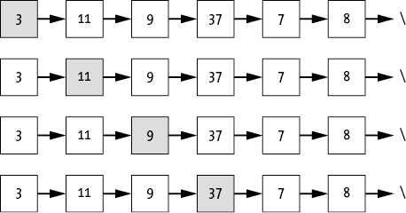

图 3-7：遍历链表需要沿着指针链逐个访问节点。

然而，值得注意的是，这里有一个权衡：链表的计算开销比数组大。访问数组中的元素时，我们只需要计算一个偏移量并查找正确的内存地址。无论选择哪个索引，数组访问只需要进行一次数学计算和一次内存查找。而链表则需要我们从列表的开头开始迭代，直到找到感兴趣的元素。对于较长的链表，缺乏直接访问会增加显著的开销。

初看之下，这种受限的访问模式似乎是链表的一个缺点。我们大大增加了查找任意元素的成本！想想这对二分查找意味着什么。一次查找需要遍历许多元素，失去了排序列表的优势。

然而，尽管有这些成本，链表在实际程序中仍然可以成为真正的资产。数据结构几乎总是涉及到复杂性、效率和使用模式之间的权衡。那些使数据结构无法用于某种应用的行为，可能会让它成为支持其他算法的完美选择。理解这些权衡是有效结合算法和数据结构的关键。在链表的例子中，增加元素访问开销的权衡是显著增加了整个数据结构的灵活性，正如我们在下一节中将看到的那样。

## 链表操作

尽管有人 lament 认为链表比起紧凑的数组来说显得杂乱无章，正是这种能够在不同内存块之间建立链接的能力，使得链表这一数据结构如此强大，从而让我们能够*动态*地重新排列数据结构。让我们比较一下向数组插入新值与向链表中添加值的区别。

### 向链表插入元素

正如我们所见，将新元素插入数组中可能需要我们分配一个新的（更大的）内存块，并将原数组的所有值复制到新的内存块中。此外，插入操作本身可能还需要我们遍历数组并移动元素。

然而，链表不需要保持在一个连续的内存块中——它可能一开始就不在一个单独的内存块里。我们只需要知道新节点的位置，更新前一个节点的 `next` 指针指向新节点，并让新节点的 `next` 指针指向正确的节点。如果我们想在图 3-5 中将值为 23 的节点添加到链表的前端，我们只需要将新节点的 `next` 指针指向原来链表的起始节点（值 = 3）。这个过程在图 3-8 中展示了。任何之前指向链表起始节点（第一个节点）的变量也需要更新，指向新的第一个节点。

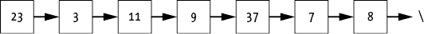

图 3-8：通过在前端添加新节点来扩展链表

类似地，我们可以将一个节点添加到链表的末尾，正如在图 3-9 中所示，方法是遍历链表直到末尾，更新最后一个节点（值 = 8）的 `next` 指针，使其指向新节点，并将新节点的 `next` 指针设置为 `null`。这种做法直接的话需要遍历整个链表才能到达末尾，但正如我们将在下一章看到的那样，有一些方法可以避免这种额外的开销。

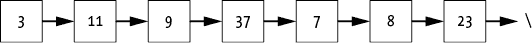

图 3-9：通过在末尾添加一个新节点来扩展链表

如果我们想在中间插入一个值，我们需要更新两个指针：前一个节点和插入的节点。例如，要将节点 *N* 插入到 *X* 和 *Y* 之间，我们需要进行两个步骤：

1.  将 *N* 的 `next` 指针设置为指向 *Y*（即 *X* 的 `next` 指针当前指向的地方）。

1.  将 *X* 的 `next` 指针设置为指向 *N*。

这两个步骤的顺序很重要。指针和其他变量一样，只能存储单一的值——在此情况下是内存中的一个地址。如果我们先设置 *X* 的 `next` 指针，那么就会丢失 *Y* 的地址信息。

一旦完成，*X* 指向 *N*，而 *N* 指向 *Y*。图 3-10 展示了这个过程。


图 3-10：将新节点 *N* 插入到链表中，位于节点 *X* 和 *Y* 之间的过程

尽管指针的顺序发生了变化，但这种操作的代码相对简单：

```py
LinkedListInsertAfter(LinkedListNode: previous,
                      LinkedListNode: new_node):
    new_node.next = previous.next
    previous.next = new_node
```

假设我们想在当前链表中的节点 9 和 37 之间插入一个值为 23 的节点。结果指针链将如图 3-11 所示。

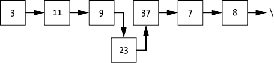

图 3-11：将节点 23 插入到链表中，需要更新前一个节点（9）和下一个节点（37）的指针。

同样，当顾客让他们的朋友站在自己前面加入队伍时，两个指针发生了变化。回想一下，在这个类比中，每个人都“指向”或追踪自己前面的人。过于慷慨的顾客现在指向站在自己前面的跳队朋友。与此同时，开心的跳队者指向原本在他们的朋友前面的人。队伍中其他人都投来了不满的目光，并低声抱怨。

再次强调，图示和咖啡馆排队的类比掩盖了插入过程的真正复杂性。虽然我们没有在最后一个节点旁边的内存位置插入新节点，但从逻辑上讲，我们是将其插入到队伍的下一个位置。节点本身可能位于计算机内存的另一端，靠近记录我们拼写错误或日常咖啡杯数的变量。只要我们保持列表中的指针是最新的，我们就可以把它们以及它们指向的节点当作一个整体列表来处理。

当然，在插入节点到头节点前（`index == 0`）或插入到超出列表末尾的索引时，我们必须格外小心。如果我们要在头节点前插入节点，我们需要更新头指针本身；否则，头指针将继续指向旧的列表开头，我们将失去访问新第一个元素的能力。如果我们尝试插入节点到超出列表末尾的索引，则在`index - 1`处没有有效的前一个节点。在这种情况下，我们可以使插入失败，返回错误，或将元素附加到列表的末尾（使用较小的索引）。无论选择哪种方法，都必须清楚地记录代码。我们可以将这些额外的逻辑打包成一个辅助函数，将我们的线性查找代码与在给定位置插入新节点的逻辑结合起来：

```py
LinkedListInsert(LinkedListNode: head, Integer: index,
                 Type: value):
    # Special case inserting a new head node.
  ❶ IF index == 0:
        LinkedListNode: new_head = LinkedListNode(value)
        new_head.next = head
        return new_head

    LinkedListNode: current = head
    LinkedListNode: previous = null
    Integer: count = 0
  ❷ WHILE count < index AND current != null:
        previous = current
        current = current.next
        count = count + 1

    # Check if we've run off the end of the list before
    # getting to the necessary index.
  ❸ IF count < index:
        Produce an invalid index error.

  ❹ LinkedListNode: new_node = LinkedListNode(value)
    new_node.next = previous.next
    previous.next = new_node

  ❺ return head
```

插入的代码从插入新节点到`index = 0`，即列表的开头❶开始。它创建一个新的头节点，将新头节点的`next`指针指向列表的原头节点，并返回新的头节点。由于新头节点前面没有节点，我们在这种情况下无需更新前一个节点的`next`指针。

对于位于链表中间的元素，代码需要遍历链表，找到正确的位置❷。这类似于`LinkedListLookUp`的查找：代码跟随每个节点的`next`指针，同时跟踪`current`节点和已查看的`count`，直到到达链表末尾或找到正确的位置。代码还会跟踪一个额外的信息，即`previous`，它是指向当前节点*之前*的节点的指针。跟踪`previous`使我们能够更新指向插入节点的指针。

然后，代码检查是否已到达期望的插入索引❸。通过将检查条件设置为`count < index`，我们仍然允许在链表的末尾插入。只有在尝试插入超过链表末尾的位置时，我们才会发生错误。

如果代码已经找到了插入节点的正确位置，它会将新节点插入到`previous`和`current`之间。代码通过创建一个新节点来执行插入，将该节点的`next`指针设置为`previous.next`指向的地址，然后将`previous.next`设置为指向新节点❹。这种逻辑同样适用于将新节点立即追加到链表末尾的情况。由于在这种情况下`previous.next == null`，新节点的`next`指针将被赋值为`null`，正确地指示链表的新末尾。

通过返回链表的头节点❺，我们可以处理在头节点之前插入的情况。或者，我们可以将头节点包装在一个`LinkedList`复合数据结构中，直接操作它。我们将在本书后面使用这种替代方法来处理二叉搜索树。

### 从链表中删除

要在链表中的任意位置删除一个元素，我们只需要删除该节点并调整前一个节点的指针，如图 3-12 所示。

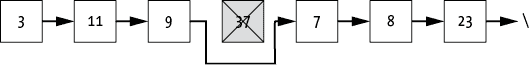

图 3-12：从链表中移除一个节点（37）需要更新前一个节点（9）中的指针，使其跳过当前节点，指向下一个节点（7）。

这类似于某人做出一个值得怀疑的决定，认为排队等咖啡不值得。他们看看手表，嘟囔着自己家里有速溶咖啡，然后离开。只要离开顾客后面的人知道自己现在排在谁后面，队伍的完整性就得以保持。

在数组的情况下，删除一个元素的成本要高得多，因为我们需要将包含 37 的节点后面的所有元素向前移动一个位置，以便填补空隙。这可能需要遍历整个数组。

再次强调，在删除链表的第一个元素或删除超过链表末尾的元素时，必须特别小心。当删除第一个节点时，我们将更新列表的头指针，指向新头节点的地址，从而使该节点成为链表的新头。删除超出链表末尾的节点时，我们可以采取类似于插入时的处理方式：我们可以跳过删除操作或返回错误。以下代码执行了后者：

```py
LinkedListDelete(LinkedListNode: head, Integer: index):
  ❶ IF head == null:
        return null

  ❷ IF index == 0:
        new_head = head.next
        head.next = null
        return new_head

    LinkedListNode: current = head
    LinkedListNode: previous = null
    Integer: count = 0
  ❸ WHILE count < index AND current != null:
        previous = current
        current = current.next
        count = count + 1

  ❹ IF current != null:
      ❺ previous.next = current.next
      ❻ current.next = null
    ELSE:
        Produce an invalid index error.
  ❼ return head
```

这段代码与插入方法遵循相同的思路。这次我们增加了一个额外的检查 ❶。如果列表为空，无法删除任何元素，我们可以返回值`null`来表示列表仍然为空。否则，我们检查是否正在删除第一个节点 ❷，如果是，移除列表中的第一个节点，并返回新头节点的地址。

为了删除任何后续节点（`index > 0`），代码必须遍历到列表中的正确位置。使用与插入时相同的逻辑，代码在遍历节点时跟踪`current`、`count`和`previous`，直到找到正确的位置或遇到链表末尾 ❸。如果代码找到了正确索引的节点 ❹，它通过将`previous.next`指向当前节点之后的一个节点 ❺ 来将该节点从链表中移除。然而，如果`WHILE`循环越过了链表末尾且`current`为`null`，则没有节点可删除，因此代码会抛出错误。该函数还将已删除节点的`next`指针设置为`null`，既为了确保一致性（因为该节点在链表中不再有`next`节点），又为了允许具有内存管理功能的编程语言正确释放不再使用的内存 ❻。最后，函数返回链表头节点的地址 ❼。

我们可以调整这段代码，使用节点的其他信息进行删除。如果我们有待删除节点的值，可以更新循环条件 ❸，以删除第一个具有该值的节点：

```py
 WHILE current != null AND current.value != value:
```

在这种情况下，我们需要颠倒比较的顺序，首先检查`current`是否为`null`，然后再访问它的值。类似地，如果我们需要通过指针删除某个节点，可以将该指针存储的地址与当前节点的地址进行比较。

```py`The strength of linked lists is that they allow us to insert or remove elements without shifting those elements around in the computer’s memory. We can leave the nodes where they are and just update the pointers to indicate their movement.    ## Doubly Linked Lists    There are many additional ways we can add structure with pointers, many of which we’ll examine in later chapters. For now, we’ll discuss just one simple extension of the linked list: the *doubly linked list*, which includes backward as well as forward pointers, as shown in Figure 3-13.  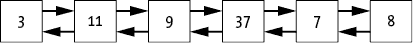    Figure 3-13: A doubly linked list contains pointers to both the next and previous entries.      For algorithms that need to iterate lists in both directions, or just for adventurous programmers looking to expand the number of pointers in their data structures, it is easy to adapt a linked list to a doubly linked one:    ``` 双向链表节点 {     类型: 值     双向链表节点: 下一个     双向链表节点: 上一个 } ```py    The code for operating on doubly linked lists is similar to the code for singly linked lists. Lookups, insertions, and deletions often require traversing the list to find the correct element. Updating the appropriate nodes’ `previous` pointers in addition to their `next` pointers requires additional logic. Yet this small amount of additional information can enable shortcuts to some of the operations. Given the pointer to any node in a doubly linked list, we can also access the node before it without having to traverse the entire list from the beginning, as we would have to do for a singly linked list.    ## Arrays and Linked Lists of Items    So far, we have primarily used arrays to store individual (numeric) values. We might be storing a list of top scores, a list of reminder times for a smart alarm clock, or a log of how much coffee we consume each day. This is useful in a variety of applications but is only the most basic way to use an array. We can use the concept of pointers to store more complex and differently sized items.    Suppose you’re planning a party. We will make the generous assumption that, unlike many parties thrown by the author, your gathering is popular enough to require an RSVP list. As you begin to receive responses to your invitations, you write a new program using an array to keep track of the guests. You’d like to store at least a single string in each entry, indicating the name of the person who has responded. However, you immediately run into the problem that strings might not be fixed size, so you can’t guarantee they will fit in the array’s fixed-size bin. You could expand the bin size to fit all possible strings. But how much is enough? Can you reliably say all your invitees will have fewer than 1,000 characters in their name? And if we allow for 1,000 characters, what about the waste? If we are reserving space for 1,000 characters per invitee, then entries for “John Smith” are using only a tiny fraction of their bins. What if we want to include even more dynamic data with each record, such as a list of each guest’s music preferences or nicknames?    The natural solution is to combine arrays and pointers, as shown in Figure 3-14. Each bin in the array stores a single pointer to the data of interest. In this case, each bin stores a pointer to a string located somewhere else in memory. This allows the data for each entry to vary in size. We can allocate as much space as we need for each string and point to those strings from the array. We could even create a detailed composite data structure for our RSVP records and link those from the array.  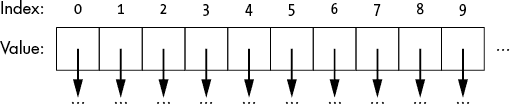    Figure 3-14: Arrays can store a series of pointers, allowing them to link to larger data structures.      The RSVP records don’t need to fit into the array bins, because their data lives somewhere else in memory. The array bins only hold (fixed-size) pointers. Similarly, a linked list’s nodes can contain pointers to other data. Unlike the `next` pointers in a linked list, which are pointing to other nodes, these pointers can point to arbitrary other blocks of data.    The rest of the book includes many cases where individual “values” are actually pointers to complex and even dynamic data structures.    ## Why This Matters    Linked lists and arrays are only the simplest example of how we can trade off among complexity, efficiency, and flexibility in our data structures. By using a pointer, a variable that stores addresses in memory, we can link across blocks of memory. A single fixed-size array bin can point to complex data records or strings of different lengths. Further, we can use pointers to create dynamically linked structures through the computer’s memory. By changing a pointer’s value to point to a new address, we can change this structure as needed at any time.    Over the remaining chapters, we will see numerous examples of how dynamic data structures can be used to both improve organization of the data and make certain computations more efficient. However, it is important to keep the relative tradeoffs in mind. As we saw with arrays and linked lists, each data structure comes with its own advantages and disadvantages in terms of flexibility, space requirements, efficiency of operations, and complexity. In the next chapter, we will show how can build on these fundamental concepts to create two data structures, stacks and queues, that enable different behavior.```
