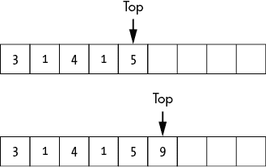
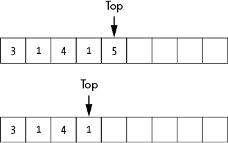
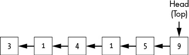
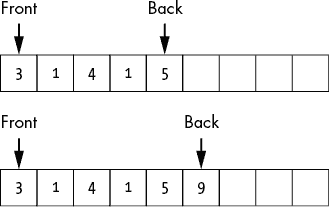
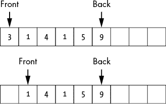
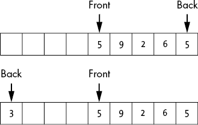
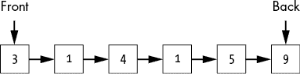
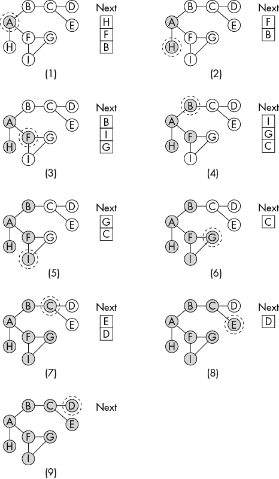

## 第四章：栈和队列


本章介绍了栈和队列，这两种数据结构根据数据插入的顺序来检索存储的数据。栈和队列非常相似，只有细微的实现差异。然而，栈返回最新插入的数据，而队列返回最早插入的数据，这一简单的事实彻底改变了算法的行为以及我们访问数据的效率。

栈是深度优先搜索的核心，深度优先搜索沿着单个路径不断深入，直到遇到死胡同。队列则启用广度优先搜索，广度优先搜索先探索相邻的路径，然后再深入。正如我们稍后所看到的，这一变化可以极大地影响现实世界中的行为，例如我们如何浏览网页或进行咖啡研究。

## 栈

*栈*是一种*后进先出（LIFO）*的数据结构，操作方式类似于一堆纸张：我们将新元素添加到栈顶，并从栈顶开始移除元素。正式地，栈支持两个操作：

1.  Push 将新元素添加到栈顶。

1.  Pop 从栈顶移除元素并返回该元素。

由于元素是从栈顶提取的，所以下一个被移除的元素将始终是最后添加的元素。如果我们将元素 1、2、3、4 和 5 插入栈中，那么我们将按 5、4、3、2、1 的顺序取出它们。

你可以将栈想象成一个沙拉吧的生菜箱，沙拉吧的生菜箱运行不佳，每隔几年就会清理一次。服务员不断地将新鲜的生菜倒入箱子的顶部，完全忽视堆积在底部的越来越软烂的生菜。食客们只看到顶部的新鲜生菜，将其舀到盘子里，完全不在意底部几层堆积的“恐怖”。

我们可以使用数组或链表来实现栈。

### 栈作为数组

当将栈实现为数组时，我们使用数组来保存栈中的值，并使用一个额外的变量来跟踪对应栈顶索引——即我们数组中的最后一个元素：

```py
Stack {
    Integer: array_size
    Integer: top
    Array of values: array
}
```

最初，我们将`top`索引设置为−1，表示栈中没有任何元素。

当我们将新元素推送到栈时，我们将`top`索引增加到下一个位置，并将新值添加到该位置。因此，我们按从底到顶的顺序排列数组，如图 4-1 所示。如果数组的最后一个元素是新鲜脆嫩的生菜，那么数组的第一个元素代表的是堆积在栈底的元素。



图 4-1：将一个元素推送到表示为数组的栈顶

当向一个固定大小的数组中添加元素时，我们必须小心避免添加超过可用空间的元素。如果空间用尽，我们可以使用数组扩展技术（如数组加倍，参见第三章）来扩展数组，正如以下代码所示。这样可以让栈随着数据的添加而增长，但需要注意的是，这会为某些插入操作带来额外的成本。

```py
Push(Stack: s, Type: value):
    IF s.top == s.array_size – 1:
        Expand the size of the array
    s.top = s.top + 1
    s.array[s.top] = value
```

将元素压入作为数组实现的栈的代码首先检查是否有足够的空间插入新元素。如果没有，代码会扩展数组。接着，代码增加栈顶元素的索引，并在新索引处插入该值。

当我们从栈中弹出一个元素时，我们再次使用`top`索引来找到正确的元素。我们将这个元素从数组中移除，并递减`top`索引，如图 4-2 所示。换句话说，我们从容器中取出最新的生菜，逐步接近下面的、更旧的层次。



图 4-2：从作为数组实现的栈中弹出元素

从数组实现的栈中弹出元素的代码比插入代码更简单：

```py
Pop(Stack: s):
    Type: value = null
    IF s.top > -1:
        value = s.array[s.top]
        s.top = s.top – 1
    return value
```

这段代码首先检查栈是否为空。如果栈不为空，代码将数组的最后一个元素复制到`value`中，然后递减指向最后一个元素的指针。代码返回栈顶元素的值，如果栈为空则返回`null`。由于我们只是在数组的末端进行添加或移除操作，因此不需要移动其他元素。

只要栈中有足够的空间，我们就可以以恒定的代价执行添加和移除操作。无论我们有 10 个元素还是 10,000 个元素，添加或移除一个元素所需的操作次数是相同的。然而，在插入时扩展数组的大小会带来额外的成本，因此提前分配足够大的栈空间以应对使用场景是有帮助的。

### 作为链表实现的栈

另外，我们也可以将栈实现为链表或双向链表，如图 4-3 所示。在这里，链表按从左到右的顺序绘制，与前几章中的链表顺序相反，目的是展示与数组表示相同的顺序。我们指向链表头部的标准指针也充当了指向栈顶的指针。

```py
Stack {
    LinkedListNode: head
}
```

与填充新数组格子并更新索引不同，链表实现要求我们在链表中创建和移除节点，更新相应的节点指针，并更新指向栈顶的指针。



图 4-3：作为链表实现的栈

我们通过将元素添加到链表的前端来将项推送到栈中：

```py
Push(Stack: s, Type: value):
    LinkedListNode: node = LinkedListNode(value)
    node.next = s.head
    s.head = node
```

推送的代码首先创建一个新的链表节点。然后它通过更新新节点的`next`指针和栈的`head`指针，将该节点插入到链表的前端。

类似地，当我们从栈中弹出一个项目时，我们返回头节点中的值，并将头节点指针移动到链表中的下一个元素：

```py
Pop(Stack: s):
    Type: value = null
 IF s.head != null:
        value = s.head.value
        s.head = s.head.next
    return value
```

代码从默认返回值`null`开始。如果栈不为空（`s.head != null`），代码会将返回值更新为头节点的值，然后将头指针更新到栈中的下一个节点。最后，它返回`value`。

除了存储额外指针的内存开销外，指针赋值还为推送和弹出操作增加了一些小的、常数级的成本。我们不再是设置一个单一的数组值并递增一个索引。然而，和所有动态数据结构一样，权衡之处在于更高的灵活性：链表可以随着数据的变化而增长或缩小。我们不再需要担心数组被填满，或者为增加数组的大小而支付额外的成本。

## 队列

*队列*是一个*先进先出（FIFO）*的数据结构，操作方式像你最喜欢的咖啡店排队：我们将新元素添加到队列的后端，并从前端移除旧元素。形式上，队列支持两个操作：

1.  入队 将一个新元素添加到队列的后端。

1.  出队 从队列的前端移除元素并返回它。

如果我们按照顺序 1, 2, 3, 4, 5 入队五个元素，我们将按相同的顺序取出它们：1, 2, 3, 4, 5。

队列保持元素添加的顺序，从而允许像按顺序处理项目这样的有用行为。例如，FIFO 属性使得我们最喜欢的咖啡馆能够有序地为顾客提供服务。由于其精彩的菜单，这家店总是有一群兴奋的顾客排队等着喝早晨的咖啡。新顾客进入商店并在队列的后端入队。下一个要服务的顾客是队列前端的人。他们下单，出队并热切地期待着完美的早晨开始。

像栈一样，队列也可以采用数组和链表两种形式。

### 队列作为数组

要用数组实现队列，我们跟踪两个索引：队列的第一个元素和最后一个元素。当我们入队一个新元素时，我们将其添加到当前最后一个元素之后，并递增后端索引，如图 4-4 所示。



图 4-4：在表示为数组的队列中入队一个元素

当我们出队一个元素时，我们移除前端元素并相应地增加前端索引，如图 4-5 所示。



图 4-5：从表示为数组的队列中出队一个元素

从固定数组中出队时，我们会迅速遇到一个问题：一块空白区域会积累在数组的前端。为了解决这个问题，我们可以选择将队列绕到数组的末尾，或者将元素下移以填补空白区域。如同我们在第一章所看到的，移动元素是昂贵的，因为每次出队操作都需要移动剩余的所有元素。而绕回则是更好的解决方案，尽管它要求我们在入队和出队时都要小心处理索引越过数组末尾的情况，如图 4-6 所示。



图 4-6：使用数组表示队列可能导致元素绕回。

尽管绕回增加了我们实现的复杂性，但它避免了移动元素的高昂成本。

### 链表形式的队列

更好的做法是将队列实现为链表或双向链表。除了维护一个指向列表头部（队列前端）的特殊指针外，我们还维护一个指向列表最后一个元素的指针，即尾部或后端：

```py
Queue {
    LinkedListNode: front
    LinkedListNode: back
}
```

如图 4-7 所示的这个列表类似于我们在图 4-3 中用于栈的链表。队列中的每个元素都链接到它后面的元素，允许我们从队列的前端遍历`next`指针到后端。



图 4-7：一个表示为链表的队列，带有额外的前端和后端元素指针

一如既往，插入和删除操作要求我们同时更新链表中的节点和我们的特殊指针节点：

```py
Enqueue(Queue: q, Type: value):
    LinkedListNode: node = LinkedListNode(value)
  ❶ IF q.back == null:
        q.front = node
        q.back = node
    ELSE:
      ❷ q.back.next = node
      ❸ q.back = node
```

当我们向队列添加新元素时，我们使用队列的`back`指针来找到插入的位置。代码首先为插入的值创建一个新的节点，然后检查队列是否为空 ❶。如果队列为空，代码通过将队列的`front`和`back`指针都指向新节点来添加新节点。两个指针都需要更新，否则它们将不再指向有效的节点。

如果队列不为空，代码通过修改当前最后一个节点的`next`指针，使其指向新节点，从而将新节点追加到列表末尾 ❷。最后，代码更新队列的`back`指针，使其指向新节点，表示它是队列中的新最后一个节点 ❸。除非队列之前为空，否则`front`指针不会改变。

删除操作主要更新队列前端的指针：

```py
Dequeue(Queue: q):
  ❶ IF q.front == null:
        return null

  ❷ Type: value = q.front.value
  ❸ q.front = q.front.next
    IF q.front == null:
        q.back = null
    return value
```

代码首先通过检查队列的`front`指针是否指向有效元素或为`null` ❶，来确认队列中是否有元素。如果队列为空（`q.front == null`），代码会立即返回`null`。如果队列中至少有一个元素，代码会保存该值以便稍后返回 ❷。然后，代码更新`q.front`，使其指向队列中的下一个元素 ❸。当出队最后一个元素时，我们必须小心更新`back`指针。如果`front`指针不再指向有效元素，那么队列为空，我们也需要将`back`指针设置为`null`。

无论队列的大小如何，入队和出队操作都需要固定数量的操作。每个操作都要求我们调整一些指针。我们不关心数据结构中其他的内容；我们可以把元素添加到一条贯穿计算机内存的链表的末端。

## 顺序的重要性

我们插入或移除元素的顺序可能对算法的行为产生巨大影响（在沙拉吧的情况下，甚至影响顾客的健康）。队列在我们需要存储时保留插入顺序时效果最佳。例如，在处理网络请求时，我们希望先处理早期的请求。相反，我们在需要处理最新项目时使用栈。例如，编程语言可能使用栈来处理函数调用。当调用一个新函数时，当前状态会被压入栈中，然后执行跳转到新函数。当一个函数完成时，栈顶的状态会被弹出，程序返回到调用该函数的位置。

我们可以根据选择的数据结构来改变搜索算法的整个行为。想象一下，我们正在探索我们最喜欢的在线百科全书来研究咖啡研磨方法。当我们浏览“磨豆机”页面时，我们看到指向其他有趣选项的链接。如果我们跟随其中一个链接，我们会到达另一个信息页面，并伴随出现一系列新的潜在主题需要探索。无论我们使用堆栈还是队列来跟踪稍后要追踪的主题，都将影响我们咖啡探索的性质，正如我们将在接下来的两节中看到的那样。

### 深度优先搜索

*深度优先搜索* 是一种算法，它沿着一条单一路径不断深入，直到遇到死胡同。然后，算法会回溯到上一个分支点并检查其他选项。它使用堆栈来维护待探索的未来状态，始终选择最近插入的选项作为下一个尝试的目标。

在咖啡研究示例中，假设我们从“磨豆机”页面开始进行深度优先搜索，并迅速找到三个额外的主题可以继续探讨。我们将这些主题压入堆栈，如图 4-8(1)所示。大多数搜索会按照遇到主题的顺序添加选项。在这个示例中，为了一致性，我们按字母逆序添加元素，因此我们从 A 开始研究，一直进行到 Z（或最终的那个字母主题）。

为了简化起见，图 4-8 将每个主题（网页）表示为一个单独的字母。它们之间绘制的线条代表网页链接。这种结构被称为*图*，我们将在第十五章详细讨论。阴影节点表示我们已探索的主题，圈住的主题表示当前迭代中我们正在查看的主题。存储未来待探索选项的堆栈数据表示为图右侧的`Next`数组。

一旦我们完成了关于磨豆机（A）的所有阅读，我们就转到下一个主题：刀片磨豆机（B）。此时，我们的搜索正在等待探索 B、F 和 H 主题。我们从堆栈顶部取出 B 主题，打开该页面，开始阅读，并发现更多感兴趣的主题（C）。显然，咖啡是一个深奥而复杂的主题；我们可以花一生时间研究它的细节。我们将新主题 C 压入堆栈顶部以备将来探讨，如图 4-8(2)所示。因此，更新的主题将成为下一个待探索的领域。

搜索以这种方式继续，优先考虑最近添加的主题，这使得这种搜索方法非常适合那些总是想探索他们刚看到的最新主题的人。我们不断深入每个主题线程，直到遇到死胡同，然后返回堆栈中的早期项。对于这个示例，已访问的节点不会重新访问或添加到堆栈中，但堆栈可能包含重复项。图 4-8 中的其余子图展示了这一过程。


图 4-8：深度优先搜索：使用栈追踪下一个要探索的话题，探索话题图

### 广度优先搜索

*广度优先搜索*使用与深度优先搜索相似的逻辑来探索话题，但通过队列存储未来的状态。在每一步，搜索会探索等待时间最长的选项，实际上是在深入之前向不同的方向分支。图 4-9 展示了上节中关于咖啡研磨机相关网站的广度优先搜索。圆圈代表话题，线条是它们之间的链接。阴影部分代表已被探索的话题，圆圈中的话题是我们在当前迭代中研究的话题。

在图 4-9(1)中，我们阅读了一篇关于 burr 研磨机（A）的页面，并以反向字母顺序记录了三个未来感兴趣的话题（B、F 和 H）。队列中的第一个话题与栈中的最后一个话题相同——这就是两个数据结构之间的关键排序区别。

我们继续研究，从队列前面取出项目（H），阅读该页面，并将任何新感兴趣的项目添加到队列的末尾。在图 4-9(2)中，我们探索下一个页面，但很快就碰到了死胡同。

在图 4-9(3)中，搜索继续前进，进入队列中的下一个话题（F）。在这里我们发现了新话题（I 和 G），并将这些新链接添加到队列中。

我们没有继续跟进这些话题，而是从队列的前面取出下一个项目（B），如图 4-9(4)所示，探索初始页面的最终链接。再次提醒，搜索只会将未被探索且不在队列中的节点添加进去。



图 4-9：广度优先搜索：使用队列追踪下一个要探索的话题，探索话题图

随着搜索的推进，其优势变得显而易见：我们不是在返回之前深入探索每一条路径，而是沿着一个话题的边界进行探索，优先考虑广度而非深度。我们可能会在深入了解每种研磨机制及其各自发明者的历史之前，先浏览五种不同类型的研磨机。这种搜索非常适合那些不希望让旧话题拖延的人，他们更倾向于在开始新话题之前先把旧话题处理掉。

由于深度优先搜索和广度优先搜索每次只探索一个选项，它们的工作速率是相同的：深度优先搜索在广度优先搜索浅尝辄止地探索许多路径的时间内，深入探索了少数路径。然而，搜索的实际行为是截然不同的。

## 为什么这很重要

不同的数据结构既能让程序员以不同的方式使用数据，又能极大地影响与这些数据一起工作的算法的行为。栈和队列都存储对象，且都可以使用数组或链表来实现，且都能高效地处理插入和移除操作。从单纯存储数据的角度来看，任意一种都足够。然而，它们处理数据的方式，特别是返回数据项的顺序，使得这两种相似的数据结构表现出截然不同的行为。栈返回的是它们存储的最新数据，因此非常适合优先处理最新的项。与此相反，队列总是返回它们存储的最旧数据，非常适合处理按到达顺序处理项的情况。

在我们努力有效使用数据结构时，效率并不是唯一的考虑因素。在为特定算法设计或选择数据结构时，我们必须考虑该数据结构的属性如何影响算法的行为。正如本章中的搜索示例所示，我们仅通过交换数据结构，就可以从广度优先行为转变为深度优先行为。后续章节将详细阐述这一逻辑，并利用这一点设计其他有助于算法行为和性能的数据结构。
