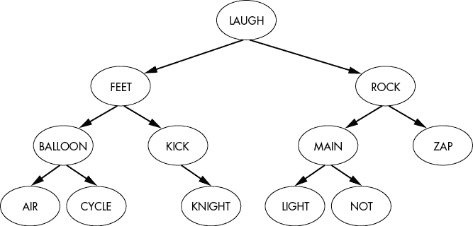
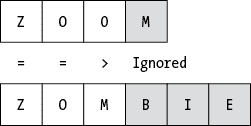
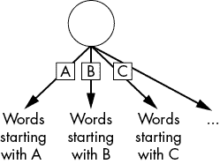
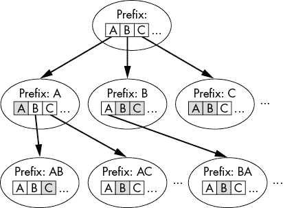
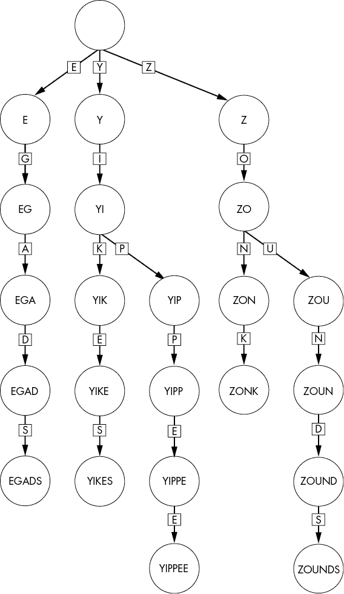
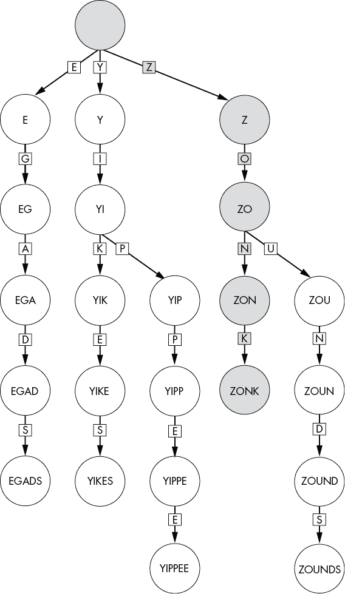
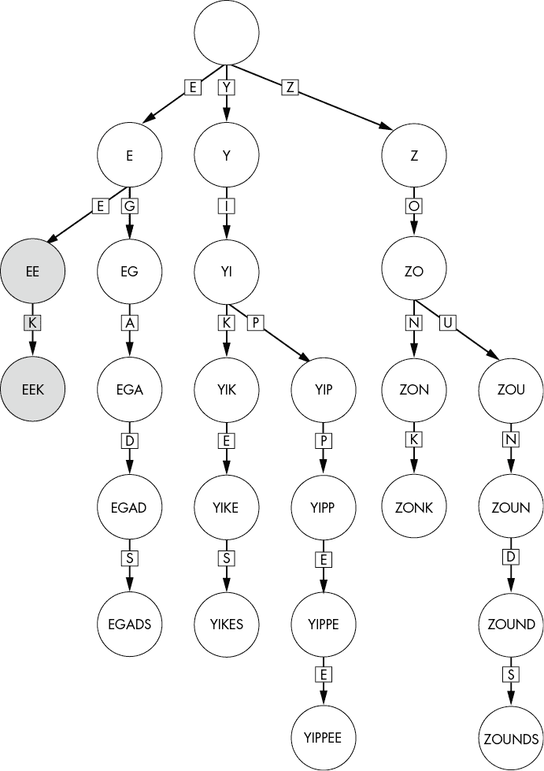
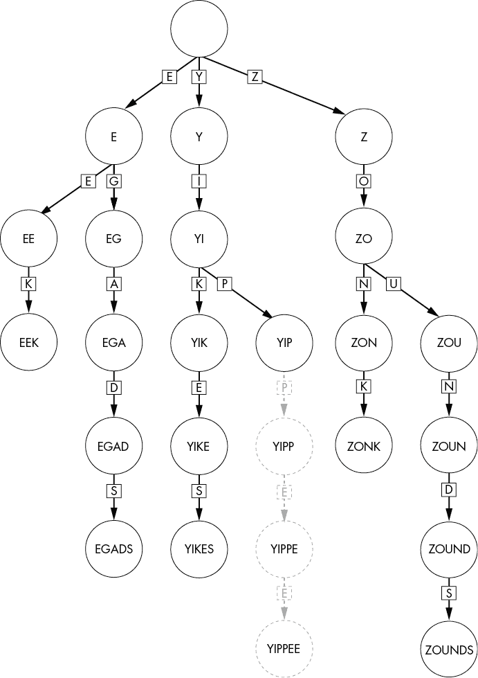
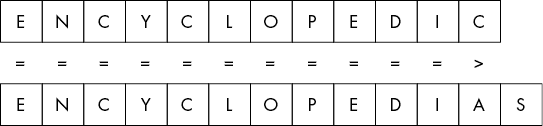

## Trie 树与数据结构的调整


二叉搜索树虽然功能强大，但它只是使用树形结构更好地组织数据的一种方式。我们可以不再依赖“小于”或“大于”的比较，而是根据具体的搜索问题优化树的分裂方式。例如，在本章中，我们将解决在树中存储和搜索字符串的问题。通过扩展二叉搜索树的一般分支方法来捕捉数据中的额外结构，使我们能够在字符串集合中高效地搜索目标字符串。

我们首先讨论如何将二叉搜索树直接应用于字符串数据，但它比其他数据类型的成本更高。考虑到字符串的顺序特性，我们接着将调整我们的搜索树，以便更高效地存储字符串。最终，我们得到一种分支结构，可能有一天会激发出世界上最华丽的、过于奢华的文件柜：Trie 树（发音为“try”）。

Trie 树是一种数据结构，在每一层基于字符串的*单个*字符进行分支。这种分割策略极大地减少了每个节点进行比较的成本。通过这个视角，我们探讨了各种算法和数据结构的基础概念是如何被调整以适应一种全新的问题类型。

## 字符串的二叉搜索树

在考虑我们是否能改进一个算法时，我们应该首先了解当前方法的局限性——否则，就没有理由构建更复杂的数据结构。因此，在深入讨论特定于字符串的数据结构之前，我们将检查二叉搜索树在存储字符串时存在的不足。首先，让我们看看二叉搜索树是如何用于这种搜索的。

### 树中的字符串

二叉搜索树不仅可以存储数字，还可以存储任何可排序的事物，从鞋子（按大小或气味排序）到僵尸电影（按票房收入或恐怖程度排序），再到食物（按价格、辛辣程度或在接下来的 24 小时内引发呕吐的可能性排序）。从这个角度来看，二叉搜索树非常灵活。我们所需要的只是能够对这些项目进行排序的能力。

要在二叉搜索树中存储字符串，我们可以按字母顺序对元素进行排序。例如，图 6-1 中的每个二叉搜索树节点都是一个单独的字符串，它将其子树分割成字典中位于它之前和之后的字符串。我们复用了来自二叉搜索树的“大于”和“小于”符号，其中 X < Y 表示字符串 X 在字母表中排在字符串 Y 之前。



图 6-1：通过单词构建的二叉搜索树

我们像对待数字一样搜索字符串的二叉搜索树。例如，为了在图 6-1 中找到字符串 LIGHT，我们从根节点开始。然后，我们将目标值与节点值进行比较，使用字母顺序，并沿着左分支或右分支继续：

1.  LIGHT > LAUGH：我们沿右分支继续搜索。

1.  LIGHT < ROCK：我们沿左分支继续搜索。

1.  LIGHT < MAIN：我们沿左分支继续搜索。

1.  LIGHT == LIGHT：我们已经找到了目标值，可以终止搜索。

在图 6-2 中，阴影椭圆标示了搜索过程中探索的 12 个节点中的 4 个节点。


图 6-2：搜索字符串 LIGHT 时遍历二叉搜索树的路径

一开始，二叉搜索树似乎提供了一种简单、高效的字符串数据搜索机制——无需修改。如果我们的树是平衡的，最坏情况下的搜索成本将与条目数量的对数成比例。在图 6-2 中，我们能够将搜索限制为仅检查 12 个节点中的 4 个节点。

然而，我们忽视了一个关键因素——每次比较的成本。正如我们在第一章中看到的，比较两个字符串比比较一对数字要更昂贵。事实上，在最坏情况下，字符串比较操作的成本与字符串的长度成正比。现在，我们的树形搜索成本不仅依赖于字符串的数量，还与它们的长度有关，这意味着我们增加了一个新的复杂度维度。

为了解决这个问题，并在二叉搜索树提供的基础上实现更大的计算节省，我们必须考虑字符串数据结构的两个重要方面：字符串的顺序性和涉及的字母或字符的数量有限性。

### 字符串比较的成本

到目前为止，我们在搜索字符串的过程中忽略了两个重要的信息。第一个是字符串比较的顺序性。为了确定字符串的字母顺序，我们从字符串的第一个字符开始，逐一比较字符，直到找到不同之处。这个不同之处决定了字符串在搜索树中的相对顺序——其余的字符不重要。

在图 6-3 中的例子中，ZOMBIE 排在 ZOOM 之前，是因为在第三个位置的字符：M 排在 O 之前。我们不关心剩余字符 BIE 和 M 之间的关系，可以忽略它们。



图 6-3：两个字符串的比较按字符逐一进行，直到找到第一个不匹配的字符对。

正如我们在第一章中所看到的，二叉搜索树中对字符串进行顺序比较的代价，本质上比比较两个数字更高。即使是比较图 6-3 中那两个相对较短的字符串，也需要进行三次单独的比较：Z 对 Z，O 对 O，O 对 M。当我们处理更长的字符串时，比如我们最喜欢的电影台词，成本就可能变得很高。当字符串之间的重叠度较高时，情况会变得更加严峻。想象一下，一个按名称索引我们咖啡收藏的二叉搜索树。如果我们将几百种咖啡添加到品牌名为“Jeremy’s Gourmet High Caffeine Experience”下，我们就需要比较相当多的字符，才能判断“Jeremy’s Gourmet High Caffeine Experience: Medium Roast”是排在“Jeremy’s Gourmet High Caffeine Experience: City Roast”之前还是之后。我们的二叉搜索树算法在每个节点都会付出这一成本。

我们尚未考虑的第二个关键信息是，在许多语言中，每个位置只能包含少数几个字母。英文单词仅使用 26 个字母（忽略大小写）。即使我们包括数字和其他字符，实际有效字符的集合也是有限的。这意味着，在每个位置上，字符串的延续方式是有限的——下一步的选择有限。正如我们即将看到的，这一见解使我们能够定义一个划分函数，该函数可以根据字符串中的下一个字符进行多重分裂。

我们可以结合这些见解构建一种数据结构，其操作方式类似于现实中比较字符串的方式。由此产生的数据结构是一个字典树，它经过优化，能够考虑到字符串中的附加结构。

## 尝试

*字典树*是一种基于树的数据结构，它根据字符串的前缀在不同的分支上进行划分。计算机科学家 René de la Briandais 提出了字典树的通用方法，用于改进计算机中内存访问速度较慢时的文件搜索，而计算机科学家兼物理学家 Edward Fredkin 提出了它的名字。与其在每个节点将数据划分为两个集合，我们根据当前的前缀将树进行分支（顺序比较）。此外，我们允许树在每个节点上分裂成多个分支，而不仅仅是两个（有限字符数）。实际上，对于英文单词，我们可以在每个节点上让树分成 26 个分支——每个分支对应可能的下一个字母。因此，字典树中的每个节点都代表了到目前为止的前缀。

类似于二叉搜索树，trie 也从根节点开始，在这种情况下表示空的前缀。每个分支接着定义字符串中的下一个字符。自然地，这意味着每个节点可以有超过两个子节点，如图 6-4 所示。



图 6-4：trie 节点在当前字符位置上进行所有可能字符的分支。

我们可以通过使用指针数组来实现每个 trie 节点的分支，每个字符对应一个数组桶。在某些情况下，我们可能能够使用比数组更节省内存的表示方式。毕竟，即使是对于英语单词，大多数非平凡的前缀也会有显著少于 26 个有效选项来确定下一个字母。然而，出于简单性考虑，我们现在仍将使用数组实现。本章中的讨论和示例实现也主要集中在英语单词（26 个字母和一个 26 元素的子节点数组）上，尽管这些算法同样适用于其他字符集。

将 trie 的分支结构想象成一个大型活动的注册台。参加世界顶级的计算机科学咖啡类比大会时，我们会去注册台领取属于自己的个性化信息包和免费会议小礼品（希望是一个咖啡杯）。由于参与者众多，组织者将信息包分成可管理的小组，以防止排成一条长队绕到大会中心。在此，组织者没有采取一对一分割（比如“你的姓氏是在 Smith 之前还是之后？”），而是根据参与者姓氏的首字母将与会者分成 26 条不同的队伍。通过这一步骤，拥挤的与会者数量被缩减为 26 个更易管理的队伍。trie 在每个节点执行这种壮观的多路分支。

和二叉搜索树一样，我们不需要为树的空分支创建节点。图 6-5 展示了这种结构的一个例子，其中阴影部分的字母表示 trie 的空分支。我们不会为这些分支创建子节点。使用与二叉搜索树相同的术语，我们将至少有一个子节点的节点称为*内部节点*，而没有任何子节点的节点称为*叶节点*。因此，尽管我们每个节点可能最多分支 26 次（当仅使用英语字母时），但我们的 trie 会相对稀疏。后续节点可能只分支少数几次。



图 6-5：Trie 只为非空分支创建节点，从而避免在未使用的分支上浪费空间。

与二叉搜索树不同，字典树中的每个节点并不都代表一个有效条目。虽然每个叶子节点都是有效条目，但一些内部节点可能只是通往完整字符串的前缀。例如，包含字符串 COFFEE 的字典树会有一个表示前缀 COFFE 的中间节点。尽管这是作者在喝了太多咖啡时经常使用的拼写方式，但它实际上并不是一个有效的单词或条目。我们不希望我们的数据结构暗示因为有一个与该前缀对应的节点，就意味着 COFFE 是可以接受的。然而，在其他情况下，内部节点可能是完全有效的条目。如果字典树包含字符串 CAT 和 CATALOG，CAT 的节点将是内部节点，因为它至少有一个子节点，位于通向 CATALOG 节点的路径上。

为了解决这个歧义，我们在字典树节点中存储一个指示器，表示当前前缀是否代表一个有效条目。这个指示器可以像一个简单的布尔值`is_entry`，对于任何对应有效条目的节点，其值为`True`，否则为`False`：

```py
TrieNode {
    Boolean: is_entry
    Array of TrieNodes: children
}
```

在这个例子中，COFFE 的节点会有`is_entry = False`，而 COFFEE 的节点会有`is_entry = True`。

另外，我们可以在字典树节点中存储更有用的信息，比如记录某个条目被插入多少次。或者，如果我们正在跟踪每个条目的辅助数据，例如一个单词的定义或一系列滑稽的双关语，我们可以利用这些数据的存在本身作为一个指示器。那些不代表有效条目的前缀可以指向`null`或空的数据结构。这看起来可能有些严格，但只有真实的单词才能成为我们最佳的双关语。

与二叉搜索树一样，我们可以通过将根节点包装在字典树对象中来清理字典树的接口：

```py
Trie {
    TrieNode: root
}
```

与二叉搜索树不同，我们的字典树总是有一个（非空）根节点。我们在创建字典树数据结构的同时也会创建这个根节点。即使是完全空的字典树，我们也会分配一个根节点（`is_entry = False`），它表示字符串的起始点。`Trie`数据结构不仅会将根节点封装成一个便捷的容器，还能让我们隐藏一些进行各种操作时所需的额外管理信息。

一个有用的物理类比是字典树的最终现实世界文件系统。假设有一栋大楼，它作为一个存储系统，存放着世界上每个话题的详细文件——这是一个高效归档系统的纪念碑。我们根据话题的第一个字母来划分这些话题，就像百科全书中的书籍一样，所以我们的楼宇有 26 层。我们为每个字母保留一层楼，这些楼层提供了我们的第一层划分。然后，每层楼有 26 个房间，每个房间代表话题的第二个字母。每个房间里有 26 个文件柜，按第三个字母来划分；每个文件柜有 26 个抽屉（第四个字母），每个抽屉有 26 个隔层（第五个字母），以此类推。在每一层，我们根据共同的前缀将条目分组。只要我们有高速电梯，我们就可以相对轻松地找到任何话题。

### 查找字典树

查找字典树与查找二叉搜索树类似，都是从树的顶部，即根节点开始，逐步向下，选择通向搜索目标的分支。然而，在字典树的情况下，我们选择与字符串中下一个字母对应的分支。我们不需要比较完整的字符串，甚至不需要比较前缀的开始部分。这些已经在之前的节点中完成了。我们只需考虑下一个字符——在每一层进行一次简单的比较。

回到文件楼宇的类比，假设你正在搜索关于你最喜欢的作者的信息。到达 K 楼后，你面前有 26 个标有 A 到 Z 的房间，它们代表着前缀 KA 到 KZ。你接下来的步骤只取决于作者名字的第二个字母。你不需要浪费时间再次考虑第一个字母——那已经在电梯里完成了。这个楼层的每个房间都以 K 开头。你自信地朝着标有 U 的房间走去。

实现这种方法的一个复杂之处在于我们在每一层的比较方式都会发生变化。在第一层，我们检查第一个字符是否匹配——但在第二层，我们需要检查第二个字符。我们的搜索不再将整个目标与节点的值进行比较。我们需要额外的信息，即在这一层我们正在检查的字符的位置。我们可以通过将要检查的索引传递给递归搜索函数，并在每一层递归时递增它，来跟踪这一额外的状态。

字典树封装器允许我们隐藏根节点的引用和递归函数所需的初始计数器，从而简化字典树用户看到的代码：

```py
TrieSearch(Trie: trie, String: target):
    return TrieNodeSearch(tr.root, target, 0)
```

这个封装器确保后续的搜索函数在调用时传递一个非空节点和正确的初始索引。

递归查找字典树的代码比查找二叉搜索树的代码要复杂一些，因为我们必须处理不同长度的目标值：

```py
TrieNodeSearch(TrieNode: current, String: target, Integer: index):
  ❶ IF index == length(target):
        IF current.is_entry:
            return current
        ELSE:
            return null

  ❷ Character: next_letter = target[index]
  ❸ Integer: next_index = LetterToIndex(next_letter)
    TrieNode: next_child = current.children[next_index]
  ❹ IF next_child == null:
        return null
    ELSE:
        return TrieNodeSearch(next_child, target, index+1)
```

这段代码首先通过检查目标字符串的长度与当前深度进行比较，以确定目标是否应位于此层级 ❶。如果索引等于字符串的长度（即超出了字符串的最后一个字符），代码会检查当前节点是否本身是一个有效条目。当搜索在一个内部节点终止时，这一检查尤为必要，因为我们需要确认该节点是否表示一个有效条目，而不仅仅是另一个条目的前缀。

如果代码尚未到达目标字符串的末尾，它将继续通过检查目标中的下一个字符来进行搜索 ❷。我们可以定义一个辅助函数，将字符映射到数组中的正确索引 ❸。然后，代码检查是否存在相应的子节点 ❹。如果没有相应的子节点，代码返回 `null`，确定 `target` 不在字典树中。如果存在相应的子节点，代码则沿着该分支继续。

以最近一集我们最喜欢的周六早晨卡通节目中的感叹词 YIKES 和 ZOUNDS 为例，如图 6-6 所示，考虑一下这种搜索过程。我们可以记录辅助数据，例如该词的频率以及谁说的，这样我们就能在聚会中纠正他人的引用。毕竟，如果数据结构不能帮助我们在啰嗦的争论中获胜，那它们还有什么用呢？



图 6-6：由卡通短语构建的字典树

为了检查本周的剧集是否包含我们最喜欢的卡通词汇 ZONK，我们可以直接搜索字典树。从字典树的顶部开始，按每个字符选择相应的分支，如图 6-7 所示。



图 6-7：对卡通短语字典树进行 ZONK 搜索的过程。阴影节点表示搜索过程中经过的路径。

由于字典树仅包含有数据的节点，我们可以通过观察死胡同来确定某个字符串是否不在字典树中。例如，我们知道 ZIPPY 并没有出现在剧集中，因为我们在前缀 Z 后遇到了死胡同。前缀 ZI 没有分支。如果某个自以为是的专家声称他们最喜欢的台词中包含感叹词 ZIPPY，我们可以通过简单的搜索证明他们是错的。

乍一看，似乎添加大量的内部节点增加了搜索的成本。然而，这种新结构实际上大大提高了搜索效率。在我们目标字符串的每个字符处，我们只需在当前节点进行一次查找，检查该字符是否有现有的子节点，然后继续访问合适的子节点；因此，查找和比较的次数与目标字符串的长度成正比。与二叉搜索树不同，成功的 trie 搜索比较次数与 trie 中存储的字符串数量无关。即使我们将整个词典填充进 trie，我们仍然只需要访问六个节点来检查字符串 EGADS。

当然，和计算机科学中的一切一样，这种效率并非无代价。我们在内存使用上付出了显著的代价。我们不再为每个字符串存储一个节点和指向两个子节点的指针，而是为字符串中的每个字符存储一个节点，并存储大量指向潜在子节点的指针。重叠的前缀有助于减少每个字符串的内存开销。如果多个条目共享相同的前缀，例如在图 6-6 中，ZOUNDS 和 ZONK 共享前缀 ZO，那么这些条目会共享这些初始重叠字符的节点。

### 添加和删除节点

像二叉搜索树一样，trie 是动态数据结构，随着节点的添加或删除会自动调整，能够准确表示数据的变化。向 trie 中添加字符串的过程与向二叉搜索树添加数据类似。我们沿着树向下遍历，就像是在搜索字符串一样。一旦遇到死胡同，我们就可以在该节点下创建一个子树来存储该字符串剩余的字符。与二叉搜索树的插入不同，在插入单个条目时，我们可能会添加多个新的内部节点。

顶层的`Trie`函数通过调用递归搜索函数，并传入（非空的）根节点和正确的初始深度来设置插入操作：

```py
TrieInsert(Trie: tr, String: new_value):
    TrieNodeInsert(tr.root, new_value, 0)
```

我们不需要将根节点的创建视为特殊情况，因为在创建 trie 时，我们会分配一个初始的根节点。

插入的代码与搜索函数类似：

```py
TrieNodeInsert(TrieNode: current, String: new_value, Integer: index):
  ❶ IF index == length(new_value):
        current.is_entry = True
    ELSE:
        Character: next_letter = new_value[index]
        Integer: next_index = LetterToIndex(next_letter)
        TrieNode: next_child = current.children[next_index]
      ❷ IF next_child == null:
            current.children[next_index] = TrieNode()
          ❸ TrieNodeInsert(current.children[next_index], 
                           new_value, index + 1)
        ELSE:
          ❹ TrieNodeInsert(next_child, new_value, index + 1)
```

这段代码首先通过检查当前的位置与插入字符串的长度进行比较❶。当到达字符串末尾时，它会将当前节点标记为有效条目。根据使用场景，代码可能还需要更新节点的辅助数据。若代码还未到达字符串末尾，它会查找下一个字符并检查是否存在相应的子节点❷。如果不存在，代码会创建一个新的子节点。然后，它会递归调用`TrieNodeInsert`来处理正确的子节点（❸或❹）。

例如，如果我们想将字符串 EEK 添加到我们的卡通感叹词列表中，我们将添加两个节点：一个用于前缀 EE 的内部节点和一个用于完整字符串 EEK 的叶节点。图 6-8 演示了这个添加过程，带阴影的节点表示在插入过程中创建的 trie 节点。

删除节点遵循类似的过程，但顺序相反：从最后一个字符的节点开始，我们向上遍历树，删除不再需要的节点。我们停止删除节点，一旦遇到一个内部节点，该节点要么至少有一个非空子分支，从而表示 trie 中其他字符串的有效前缀，要么本身就是树中存储的字符串，表示一个有效的叶节点。

与搜索和插入类似，我们从包装器代码开始，在根节点处启动删除操作，并使用正确的索引：

```py
TrieDelete(Trie: tr, String: target):
    TrieNodeDelete(tr.root, target, 0)
```

该函数不返回任何值。

删除节点的代码基于搜索和插入的代码，最初会沿着树向下遍历，直到找到要删除的条目。当它返回到 trie 时，附加的逻辑会修剪空的分支。代码返回一个布尔值，指示当前节点是否可以安全删除，从而允许父节点修剪该分支。



图 6-8：将 EEK 添加到卡通短语的 trie 中。新增的节点已加阴影。

```py
TrieNodeDelete(TrieNode: current, String: target, Integer: index):
  ❶ IF index == length(target):
        IF current.is_entry:
            current.is_entry = False
    ELSE:
      ❷ Character: next_letter = target[index]
        Integer: next_index = LetterToIndex(next_letter)
        TrieNode: next_child = current.children[next_index]
        IF next_child != null:
          ❸ IF TrieNodeDelete(next_child, target, index+1):
               current.children[next_index] = null

    # Do not delete this node if it has either an entry or a child.
  ❹ IF current.is_entry:
        return False
  ❺ FOR EACH ptr IN current.children:
        IF ptr != null:
            return False
    return True
```

这段代码首先通过比较删除字符串的长度与当前层级，若当前节点正在被删除，则更改 `is_entry` 的值 ❶。否则，算法会递归地沿树向下遍历，使用与我们搜索和插入函数相同的逻辑 ❷。它查找下一个字符，找到相应的节点，检查节点是否存在，如果存在，则递归下降到该节点。如果节点不存在，则目标字符串不在 trie 中，代码将停止向下继续。然后，代码从父节点删除空的分支。每次调用 `TrieNodeDelete` 都会返回一个布尔值，指示是否可以安全删除对应的节点。如果 `TrieNodeDelete` 返回 `True`，则父节点会立即删除该子节点 ❸。

函数的最后通过逻辑判断父节点是否可以删除当前节点。如果`is_entry == True` ❹，即表示是有效条目，或者当前节点至少有一个非空子节点 ❺，则返回`False`。它通过一个`FOR`循环来遍历每个子节点并检查其是否为`null`。如果有任何子节点不是`null`，代码会立即返回`False`，因为它是一个必要的内部节点。请注意，代码会在目标字符串不在 trie 中时返回`False`，因为代码从未将`is_entry`设置为`False`，因此不会出现新的修剪机会。

考虑从我们的示例字典树中删除字符串 YIPPEE。如果字典树中也包含单词 YIP 作为条目，我们将删除从 YIP 开始的所有后续节点，如图 6-9 所示。YIPPEE 节点本身被标记为安全删除，因为它是一个叶节点，并且`is_entry`已被标记为`False`，作为删除过程的一部分。当函数返回到 YIPPE 节点时，它立即删除其唯一子节点（分支 E）。此时，YIPPE 节点变成一个叶节点，`is_entry == False`，可以由其父节点删除。该过程会继续向上遍历树，直到我们到达 YIP 节点，它的`is_entry == True`，因为字符串 YIP 存在于字典树中。

由于删除操作需要从根节点到单个叶节点的往返，成本再次与目标字符串的长度成正比。与搜索和插入操作一样，删除操作的成本与字典树中存储的字符串总数无关。



图 6-9：从包含字符串 YIP 的卡通短语的字典树中删除字符串 YIPPEE。被删除的节点用虚线标出，并且灰色显示。

## 为什么这很重要

我们现在可以看到字典树如何解决我们之前提出的二叉搜索树问题：它们的搜索成本既取决于单词的数量，也取决于单词的长度。在本章的简短示例中，字典树并没有提供太大的优势。实际上，额外的分支开销可能使它们比二叉搜索树或排序列表效率更低。然而，当我们添加越来越多的字符串，并且具有相似前缀的字符串数量增加时，字典树变得越来越具有成本效益。这有两个原因：首先，字典树中的查找成本与条目的数量无关；其次，字符串比较本身可能很昂贵。在二叉搜索树中，这两个因素相互叠加，因为我们在每个节点都需要比较两个字符串，从而增加了成本。

在实际应用中，例如，我们可能会在文字处理器中使用字典树来跟踪字典中的单词。每个节点的辅助数据可能包括定义或常见拼写错误。当用户输入和编辑时，程序可以高效地检查每个单词是否在字典中，如果不在，则高亮显示。该程序极大地受益于自然语言中共享的前缀和有限的字符数量。

例如，如果我们正在撰写一篇关于百科全书历史的深入文章，我们不希望在比较*encyclopedia*与相邻的单词*encyclopedias*、*encyclopedic*、*encyclopedist*时付出过高的成本。记住，正如图 6-10 所示，比较两个字符串的字母顺序的算法是通过遍历字符串，逐个比较字符。尽管程序一旦找到不同的字符就会停止，但比较相似前缀的成本是累积的。在一个活跃的文字处理文档中，我们可能需要不断修改词汇集。每次插入或编辑都需要在我们的数据结构中进行查找。



图 6-10：一个昂贵的字符串比较示例

一个更好的应用场景可能是用来跟踪结构化标签的数据结构——例如序列号、型号或 SKU 码——这些通常格式化为简短的字母数字字符串。例如，我们可以创建一个简单的 Trie 来存储按序列号索引的产品注册信息。即使销售了数十亿个产品，所有操作的成本也与序列号的长度成线性关系。如果我们的序列号包含结构，比如表示设备型号的前缀，我们可以通过限制初始节点的分支因子来进一步节省开销（因为许多字符串会使用相同的前缀）。辅助数据可能包括设备购买的时间或地点信息。

比任何具体应用更重要的是，Trie 展示了如何在数据中使用更多结构来优化操作成本。我们将二叉搜索树的分支结构改编为使用字符串的顺序特性。这一改进再次体现了本书的一个核心主题：我们可以通过利用数据中固有的结构来提高算法效率。
