## 第八章：网格


在本章中，我们将探讨在考虑多维值和目标时会发生什么。到目前为止，我们所检查的数据结构都具有一个共同的约束——它们基于单一值组织数据。许多现实世界的问题涉及多个重要维度，我们需要扩展数据结构以处理这种数据的搜索。

本章首先介绍最近邻搜索，它将作为我们多维数据的激励用例。正如我们所看到的，最近邻搜索的通用性使得它非常灵活，适用于广泛的空间和非空间问题。它可以帮助我们找到离当前位置最近的咖啡，或是最适合我们口味的品牌。

我们接着介绍网格数据结构，并展示它如何通过使用数据中的空间关系修剪掉不可行的搜索空间区域，来促进二维的最近邻搜索。我们简要讨论如何将这些方法扩展到二维以上的情况。我们还将看到这些数据结构的不足之处，这为进一步的空间数据结构提供了动机。

## 引入最近邻搜索

顾名思义，*最近邻搜索*就是找到离给定搜索目标最近的特定数据点——例如，离我们当前位置最近的咖啡店。正式地，我们将最近邻搜索定义如下：

> 给定一组 *N* 个数据点 *X* = {*x*[1], *x*[2], … , *x*[N]}，一个目标值 *x*’，以及一个距离函数 *dist*(*x*,*y*)，找出数据集 *X* 中的点 *x*[*i*] ∈ *X*，使得 *dist*(*x*’，*x*[*i*]) 最小。

最近邻搜索与我们在第二章中用于激励二分查找的目标值搜索密切相关。这两种算法都在数据集中搜索特定的数据点。关键的区别在于成功标准。二分查找测试数据集中是否存在精确匹配，而最近邻搜索只关心找到最接近的匹配。

这种框架使得最近邻搜索在处理多维数据时非常有用。我们可能在地图上寻找附近的咖啡店，在历史气温列表中寻找与当前日期相似的天数，或在给定单词的“近似”拼写中进行搜索。只要我们能定义搜索目标与其他值之间的距离，就能找到最近邻。

在前面的章节中，我们主要考虑了那些作为单一数值的目标，例如存储在二叉搜索树和堆中的数据。虽然有时会包含辅助数据，但目标本身仍然保持简单。相比之下，最近邻搜索在处理多维数据时最为有趣，这些数据可能存储在各种其他数据结构中，如数组、元组或复合数据结构。在本章后续内容中，我们将讨论一些二维搜索问题及其目标。不过，现在让我们先介绍一个基本的搜索算法。

### 使用线性扫描的最近邻搜索

作为最近邻搜索的基准算法，我们从第二章中的线性扫描算法的修改版本开始。线性扫描算法并不特别引人注目；你可以通过在大多数编程语言中写一个简单的循环来实现它。然而，由于它的简洁性，线性扫描为我们提供了一个很好的起点，能够从中检视更复杂和高效的算法。

设想一个使用绝对距离进行最近邻搜索的问题：*dist*(*x*,*y*) = |*x* – *y*|。给定一个数字列表和一个搜索目标，我们希望找到列表中最接近的数字。也许我们在一个陌生的城市醒来，早晨需要找第一杯咖啡。酒店的礼宾部提供了同一条街道上的咖啡店列表，并附带了一张有用的地图。由于我们对这些商店并不熟悉，因此决定优先选择便利，去酒店附近的咖啡店。

我们可以通过数轴来可视化这个搜索过程，如图 8-1 所示。这些点代表不同的咖啡店及其相对于地图起点的位置，而 X 则表示我们的酒店，位于街道上 2.2 英里处。

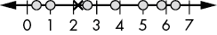

图 8-1：一维最近邻搜索表示为数轴

在程序中，图 8-1 中的点可能表示数组中未排序的值。然而，在最近邻搜索的背景下，将这些值可视化为实数轴上的值有两个优势。首先，它阐明了距离的重要性：我们可以看到目标值与每个数据点之间的间隔。其次，它帮助我们将技术推广到多维空间，正如我们将在下一节看到的那样。

目前，线性扫描算法按顺序遍历每个数据点，如图 8-2 所示，计算当前数据点的距离，并与迄今为止找到的最小距离进行比较。这里我们考虑的是按排序顺序排列的点，因为它们已经沿着数轴排列，但线性扫描不要求特定的排序。它使用的是列表中数据的排列顺序。

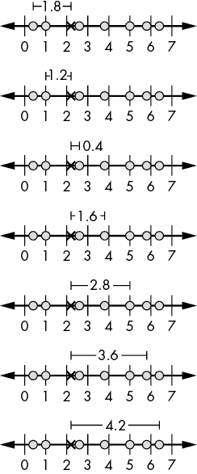

图 8-2：一维最近邻搜索中数据点的线性扫描

在图 8-2 的第一次比较中，我们发现一个距离为 1.8 的点。这成为了我们迄今为止的最佳选择，我们的*候选最近邻*。它可能不是一个*好*邻居——1.8 英里步行去喝早上的咖啡有点远——但它是我们看到的最好的。接下来的两步发现了分别位于 1.2 和 0.4 距离处的更好候选点。遗憾的是，剩下的四次比较并没有找到更好的候选点；距离 0.4 的点仍然是我们找到的最接近的点。最终，算法返回了数字线上的第三个点作为最近邻。我们信心满满地走向咖啡店，确信我们正朝着街上最近的一家咖啡店走去。

清单 8-1 展示了使用任意距离函数的线性扫描代码。我们使用浮动值进行一维情况，但可以通过使用复合数据结构或其他表示方法将其扩展到多维。

```py
LinearScanClosestNeighbor(Array: A, Float: target, Function: dist):
    Integer: N = length(A)
  ❶ IF N == 0:
        return null

  ❷ Float: candidate = A[0]
    Float: closest_distance = dist(target, candidate)

    Integer: i = 1
  ❸ WHILE i < N:
        Float: current_distance = dist(target, A[i])
      ❹ IF current_distance < closest_distance:
            closest_distance = current_distance
            candidate = A[i]
        i = i + 1
  ❺ return candidate
```

清单 8-1：线性扫描最近邻算法的代码

代码首先检查数组是否为空，如果为空，则返回`null` ❶，因为没有最近的点。然后，代码选择数组中的第一个项作为初始候选最近邻，并计算该点到目标的距离 ❷。这些信息为我们的搜索提供了起点：我们将所有后续点与目前为止的最佳候选点和距离进行比较。剩余的代码使用`WHILE`循环遍历数组中的其余元素 ❸，计算到目标的距离，并将其与目前找到的最佳距离进行比较。每当找到一个更接近的候选点时，代码都会更新最佳候选点和最佳距离 ❹，然后返回最近的邻居 ❺。

除了提供最近邻搜索的简单实现外，线性扫描算法还轻松支持不同的距离函数，甚至是高维数据点。首先，让我们来看一些在二维空间中的示例问题。

### 搜索空间数据

想象一下，您已经开车好几个小时，正在进行一场跨国公路旅行，急需加一次咖啡。突然间，当您意识到自己没有规划沿途的最佳咖啡店时，慌乱涌上心头。您深吸一口气，拿出图 8-3 中显示的地图，找到了几个已知有咖啡店的城镇。优先考虑快捷而非质量，您下定决心要找到最近的咖啡馆。

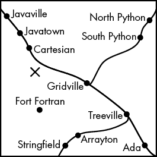

图 8-3：作为二维数据示例的地图

数据由二维点组成——带有*x*、*y*坐标的城镇。这些数据点可以存储为有序元组（*x*，*y*）、一个小的固定大小数组[*x*，*y*]，甚至可以使用一个复合数据结构来表示二维空间点：

```py
Point {
    Float: x
    Float: y
}
```

在确定哪个城镇最接近时，我们将仅关注到咖啡馆的直线距离。在任何实际的导航任务中，我们还需要考虑我们与咖啡之间的障碍物。然而现在，让我们仅考虑到咖啡馆的欧几里得距离。如果我们当前的位置是(*x*[1]*，y*[1])，而咖啡馆位于(*x*[2]*，y*[2])，则距离为：

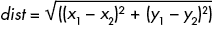

我们可以使用清单 8-1 中的线性扫描算法。该算法计算从目标点到每个候选点的距离，如图 8-4 所示。

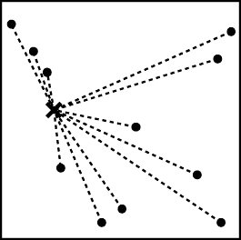

图 8-4：线性扫描最近邻搜索计算从目标点到每个候选点的距离。

距离目标最近的点，如图 8-5 所示，就是目标的最近邻。虚线表示到最近点的距离，虚圆圈显示的是我们地图上比最近点更近（或等于）的区域。没有其他点比最近邻更靠近目标。

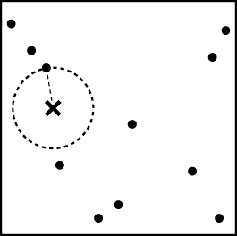

图 8-5：距离目标最近的点即为该目标的最近邻。

正如我们多次看到的那样，随着点的数量增加，这种线性扫描搜索很快就变得低效。如果《*咖啡爱好者的路边咖啡指南*》当前列出了 100,000 家咖啡馆，那么检查每一家就会变得不必要地耗时。

我们不需要查看二维空间中的每个数据点。有些点距离太远，根本不重要。当我们开车穿越佛罗里达时，我们绝不会考虑阿拉斯加的咖啡馆。这并不是要贬低阿拉斯加的咖啡馆——我确信其中有很多在口味和质量上与佛罗里达的同行相当。这仅仅是出于实用考虑。我们不能在没有咖啡的情况下生存一小时，更不用说长时间的车程了。如果我们正在穿越佛罗里达北部，我们需要关注的是佛罗里达北部的咖啡馆。

正如我们在二分查找中看到的，我们通常可以利用数据中的结构来帮助消除大量候选项。我们甚至可以将二分查找方法应用于一维空间中寻找最近邻。不幸的是，在二维情况下，简单的排序并不会有所帮助。如果我们对 X 或 Y 维度进行排序并搜索，如图 8-6 所示，我们会得到错误的答案——一维空间中最近的邻居与二维空间中最近的邻居并不相同。

我们需要利用所有相关维度的信息来做出准确的剪枝决策。在某一维度上接近目标的点，在其他维度上可能相距极远。如果我们按照纬度对咖啡店进行排序，我们在佛罗里达北部寻找接近当前纬度的位置时，可能会返回一些来自休斯顿的“接近”结果。同样，如果我们按经度排序，可能会被克利夫兰的条目淹没。我们需要探索新的方法，这些方法源自我们在一维数据上的经验，同时也利用了高维数据固有的结构。

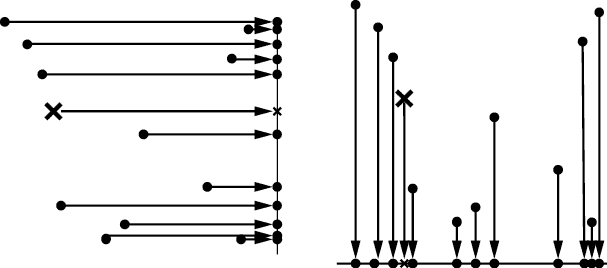

图 8-6：将数据投影到 Y 轴（左）或 X 轴（右）上的一维空间，会丧失关于另一个维度的重要空间信息。

## 网格

*网格*是用于存储二维数据的数据结构。像数组一样，网格由一组固定的*单元格*组成。由于我们最初是处理二维数据，我们使用二维排列的单元格，并通过两个数字 *xbin* 和 *ybin* 来索引每个单元格，分别表示沿 X 轴和 Y 轴的单元格编号。图 8-7 展示了一个网格的示例。

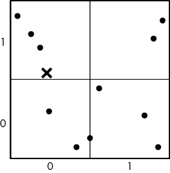

图 8-7：一个 2×2 的空间数据点网格

与数组不同，我们不能限制每个单元格只存储一个值。网格单元是由空间边界定义的——每个维度上有高低边界。无论我们如何细化网格，多个点可能落入同一个单元格，因此我们需要让每个单元格存储多个元素。每个单元格存储一个包含该单元格范围内*所有*数据点的列表。

我们可以将网格和数组的区别比作不同类型的冰箱存储方式。蛋盒是一个数组，每个鸡蛋都有一个独立的空间。相比之下，蔬菜抽屉就像一个网格容器。它包含多个相同类型的物品，全部是蔬菜。我们可能会把一个抽屉塞满二十五个洋葱。而蛋盒则只包含固定数量的鸡蛋，每个鸡蛋都有其指定的位置。虽然蔬菜抽屉可能引发关于番茄或黄瓜应该正确存放在哪里的激烈争论，但网格单元的边界是通过数学精确定义的。

网格使用点的坐标来决定它们的存储方式，这使得我们可以利用数据的空间结构来限制搜索范围。为了理解这是如何实现的，我们首先需要考虑网格结构的细节。

### 网格结构

我们网格的顶层数据结构包含了一些额外的记录信息。如图 8-8 所示，我们需要在每个维度上包含多项信息。除了沿 x 轴和 y 轴的容器数量外，我们还必须跟踪每个维度的空间边界。我们使用`x_start`和`x_end`来指示网格中包含的 x 值的最小值和最大值。类似地，`y_start`和`y_end`用于捕捉 y 维度的空间边界。

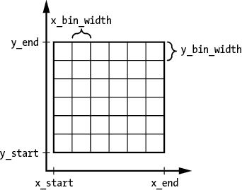

图 8-8：一个在每个维度上都有指定起始值和结束值的网格

我们可以从容器的数量和空间边界中推导出一些顶层信息，但为了方便起见，我们通常希望存储有关网格的额外信息。预先计算每个维度上容器的宽度可以简化后续的代码：

```py
x_bin_width = (x_end – x_start) / num_x_bins
y_bin_width = (y_end – y_start) / num_y_bins
```

其他有用的信息可能包括网格中存储的总点数或空的容器数量。我们可以通过一个复合数据结构来跟踪所有这些信息。对于二维数据，我们的典型数据结构大致如下所示：

```py
Grid {
    Integer: num_x_bins
    Integer: num_y_bins
    Float: x_start
    Float: x_end
 Float: x_bin_width
    Float: y_start
    Float: y_end
    Float: y_bin_width
    Matrix of GridPoints: bins
}
```

对于一个固定大小的网格，我们可以通过一个简单的数学计算将点的空间坐标映射到网格的容器中：

```py
xbin = Floor((x – x_start) / x_bin_width)
ybin = Floor((y – y_start) / y_bin_width)
```

从“一个容器，一个值”到“空间分区”的转变具有重要的后果，超出了索引映射的范畴。这意味着我们不能再将数据作为一组固定的容器存储在计算机内存中。每个方格可以包含任意数量的数据点。每个网格方格需要拥有自己的内部数据结构来存储其点。存储点的一个常见且有效的数据结构是链表，如图 8-9 所示。

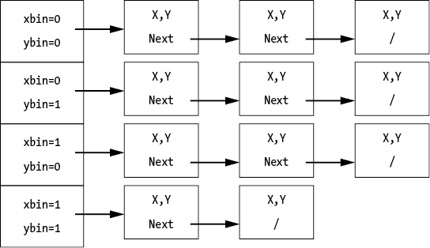

图 8-9：用于存储网格中点的数据显示结构

每个桶存储指向链表头部的指针，链表中包含该桶的所有点。我们通过另一个内部数据结构来存储单个点来实现这一点：

```py
GridPoint {
    Float: x
    Float: y
    GridPoint: next
}
```

或者，我们可以使用第三章中的`LinkedListNode`数据结构，并存储一对表示 *x*，*y* 坐标的值。

### 构建网格并插入点

我们通过分配一个空的网格数据结构并使用一个单一的`FOR`循环遍历数据点，迭代地插入点来构建数据集的网格。网格本身的高级结构（空间范围和每个维度的桶数量）在创建时是固定的，并且不会随着添加的数据变化。

如清单 8-2 所示，插入点的过程包括找到正确的桶并将新点添加到该桶对应链表的开头。

```py
GridInsert(Grid: g, Float: x, Float: y):
  ❶ Integer: xbin = Floor((x - g.x_start) / g.x_bin_width)
    Integer: ybin = Floor((y - g.y_start) / g.y_bin_width)

    # Check that the point is within the grid.
  ❷ IF xbin < 0 OR xbin >= g.num_x_bins:
        return False
    IF ybin < 0 OR ybin >= g.num_y_bins:
        return False

    # Add the point to the front of the list. 
  ❸ GridPoint: next_point = g.bins[xbin][ybin]
    g.bins[xbin][ybin] = GridPoint(x, y)
    g.bins[xbin][ybin].next = next_point

  ❹ return True
```

清单 8-2：一个将新点插入网格的函数

代码首先计算新点的 x 和 y 桶 ❶，并确认新点落在有效的桶中 ❷。虽然在使用数组时，始终要确保访问的是有效的数组索引，但空间数据结构带来了额外的关注点。我们可能无法预定义一个适用于每个未来可能点的固定、有限的网格。因此，考虑到之前未见过的点可能会落在空间数据结构所覆盖范围之外，显得尤为重要。在这个例子中，我们返回一个布尔值来指示点是否能被插入 ❹。然而，根据编程语言的不同，您可能更倾向于使用其他机制，比如抛出异常。

一旦我们确定该点适合放入网格中，代码会找到合适的桶。代码将新点添加到列表的前端，如果桶之前为空，则创建一个新的列表 ❸。函数最终返回`True` ❹。

### 删除点

我们可以使用类似的插入方法来删除网格中的点。一个额外的难点是确定要删除桶中哪一个点。在许多使用场景中，用户可能会在网格中插入任意接近甚至重复的点。例如，如果我们要存储可购买的咖啡列表，可能会为同一家咖啡店插入多个点。理想情况下，我们使用其他标识信息，如咖啡的名称或 ID 编号，来确定要删除哪个点。在本节中，我们介绍了删除链表中第一个匹配点的简单通用方法。

由于浮点数变量的精度限制，我们可能无法使用直接的相等性测试。在清单 8-3 中，我们使用一个辅助函数来找到一个足够接近的点。`approx_equal`函数会在两个点在两个维度上都在阈值距离内时返回`True`。

```py
approx_equal(Float: x1, Float: y1, Float: x2, Float: y2):
    IF abs(x1 – x2) > threshold:
        return False
    IF abs(y1 – y2) > threshold:
        return False
    return True
```

Listing 8-3: 检查两个数据点（表示为一对浮点数）是否相等的代码

代码独立检查每个维度，并将距离与阈值进行比较。阈值将取决于具体的应用场景和编程语言的数值精度。通常，我们希望这些阈值足够大，以便考虑到浮点数的数值精度。

删除操作包括找到正确的桶，遍历链表直到找到匹配项，然后通过从链表中切除匹配项来完成删除。我们的删除函数如果找到并删除了一个点，则返回`True`，否则返回`False`。

```py
GridDelete(Grid: g, Float: x, Float: y):
  ❶ Integer: xbin = Floor((x - g.x_start) / g.x_bin_width)
    Integer: ybin = Floor((y - g.y_start) / g.y_bin_width)

    # Check that the point is within the grid.
  ❷ IF xbin < 0 OR xbin >= g.num_x_bins:
        return False
    IF ybin < 0 OR ybin >= g.num_y_bins:
        return False

    # Check if the bin is empty.
  ❸ IF g.bins[xbin][ybin] == null:
        return False

    # Find the first matching point and remove it.
  ❹ GridPoint: current = g.bins[xbin][ybin]
    GridPoint: previous = null
    WHILE current != null:
      ❺ IF approx_equal(x, y, current.x, current.y):
          ❻ IF previous == null:
                g.bins[xbin][ybin] = current.next
            ELSE:
                previous.next = current.next
 return True
      ❼ previous = current
        current = current.next
    return False
```

代码首先计算新点的 x 和 y 桶❶，并确认新点是否落在一个有效的桶内❷。接下来，它检查目标桶是否为空❸，如果为空则返回`False`。

如果有点需要检查，代码会遍历列表❹。与插入操作的代码不同，我们同时追踪当前节点和前一个节点，以便能够从链表中切除目标节点。代码使用 Listing 8-3 中的`approx_equal`辅助函数来测试每个点❺。当找到匹配的点时，它会将其从链表中切除，特别处理链表中第一个节点的特殊情况❻，然后返回`True`。因此，只有列表中*第一个*匹配的点会被删除。如果当前点不匹配，搜索将继续到下一个节点❼。如果搜索完成整个列表，函数将返回`False`，表示没有匹配的节点被删除。

## 网格上的搜索

现在我们已经学会了如何构建网格数据结构，让我们利用它们来改进最近邻搜索。首先，我们检查如何修剪距离过远的网格单元，这将帮助我们避免在网格单元内进行不必要的计算。接着，我们考虑两种基本的搜索方式：对所有桶进行线性扫描和扩展搜索。

### 修剪桶

网格的空间结构使我们能够限制需要检查的点数，排除那些位于我们不感兴趣的范围之外的点（如北佛罗里达）。一旦我们有了一个候选邻居及其相关的距离，我们就可以利用这个距离来*修剪桶*。在检查一个桶中的点之前，我们会问是否有*任何*点在该桶的空间范围内可能比当前最好的距离更近。如果没有，我们可以忽略这个桶。*

*确定桶内的*任意*点是否在距离目标点给定的范围内听起来可能是一项艰巨的任务。然而，如果我们使用欧几里得距离 ，我们可以将其封装在这个简单的辅助函数中：

```py
euclidean_dist(Float: x1, Float: y1, Float: x2, Float: y2):
    return sqrt((x1-x2)*(x1-x2) + (y1-y2)*(y1-y2))
```

那么测试简化为简单的数学运算。我们首先找出网格单元中最接近的可能点，并用它进行剪枝测试。具体来说，如果网格单元中最接近的可能点距离当前最优候选点更远，那么就没有必要检查网格单元中存储的任何实际点。它们的距离肯定都更远。如果目标点位于该单元内——也就是说，如果它的 x 和 y 值分别位于单元格的 x 和 y 范围内——则该单元的距离（即最接近的可能点）为零。

如果点位于单元外，则单元内最接近的点必须位于单元的边缘。图 8-10 显示了网格单元外的各种点及其对应的单元内最接近点。对于网格单元外的点，我们需要计算到最接近的边缘点的距离。

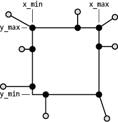

图 8-10：网格单元外的点（灰色圆圈）及其对应的最接近点（实心圆圈）

我们可以通过分别考虑每个维度来计算点与网格单元最近边缘之间的欧几里得距离。我们找出将 x 值调整到单元范围内所需的最小距离，以及将 y 值调整到单元范围内所需的最小距离。对于网格单元 (*xbin*, *ybin*)，最小和最大 x 及 y 维度为：

```py
x_min = x_start + xbin * x_bin_width
x_max = x_start + (xbin + 1) * x_bin_width
y_min = y_start + ybin * y_bin_width
y_max = y_start + (ybin + 1) * y_bin_width
```

我们可以按如下方式计算距离（在欧几里得距离的情况下）：

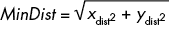

其中

如果 *x* < *x*_*min* 那么 *x*[dist] *= *x*_*min* − *x*

如果 *x*_*min* ≤ *x* ≤ *x*_*max* 那么 *x*[dist] = 0

如果 *x* > *x*_*max* 那么 *x*[dist] = *x* − *x*_*max*

和

如果 *y* < *y_min* 那么 *y*[dist] = *y_min* − *y*

如果 *y_min* ≤ *y* ≤ *y_max* 那么 *y*[dist] = 0

如果 *y* > *y_max* 那么 *y*[dist] = *y* − *y_max*

如果某个可能的点到当前最近点的最小距离大于当前最近点的距离，那么该网格单元中的任何点都无法替代当前的最近点。我们可以忽略整个网格单元！

计算从点到网格单元的最小距离的代码可以封装到以下帮助函数中。该函数实现了上述数学逻辑。

```py
MinDistToBin(Grid: g, Integer: xbin, Integer: ybin, Float: x, Float: y):
    # Check that the bin is valid.
  ❶ IF xbin < 0 OR xbin >= g.num_x_bins:
        return Inf
    IF ybin < 0 OR ybin >= g.num_y_bins:
        return Inf

  ❷ Float: x_min = g.x_start + xbin * g.x_bin_width
    Float: x_max = g.x_start + (xbin + 1) * g.x_bin_width
    Float: x_dist = 0
    IF x < x_min:
      x_dist = x_min - x
    IF x > x_max:
      x_dist = x - x_max

  ❸ Float: y_min = g.y_start + ybin * g.y_bin_width
    Float: y_max = g.y_start + (ybin + 1) * g.y_bin_width
    Float: y_dist = 0
    IF y < y_min:
      y_dist = y_min - y
    IF y > y_max:
      y_dist = y - y_max
    return sqrt(x_dist*x_dist + y_dist*y_dist)
```

列表 8-4：一个帮助函数，用于计算目标点与给定网格单元的最短距离

代码首先检查单元索引是否有效 ❶。在这个例子中，我们使用无限大距离来表示函数调用者引用了一个无效的单元。这个逻辑使我们能够在可能查询无效单元的剪枝计算中使用此查找函数。然而，这可能会导致混淆：为什么函数会为无效的单元返回一个距离？根据使用情况，最好抛出一个错误，指出单元索引无效。无论如何，函数的行为应该清楚地记录下来，供用户参考。

其余的代码按照上面的距离逻辑，依次处理 x 和 y 维度（分别是 ❷ 和 ❸）。代码计算该单元的最小值和最大值，比较它们与该维度上点的值，并计算距离。

为了可视化这个距离测试，想象一个喧闹的接球游戏把球扔过了我们的篱笆，落入了我们友好但极其懒散的邻居家院子里。当然，他们会把球扔回来，但不会付出比绝对必要的更多努力。他们需要投掷球的最短距离是多少，才能（勉强）把球投回我们的院子？如果他们的经度已经在我们院子的范围内，他们将朝正北或正南方向投掷，以避免增加不必要的东西/西方距离。最终，他们的投掷总是精确地落在篱笆上，使得球重新落回我们的院子。我们的邻居可能懒惰，但他们有一些令人印象深刻的投掷技巧。

### 对单元进行线性扫描

搜索网格的最简单方法是通过线性扫描遍历所有网格单元，并仅检查那些可能包含潜在最近邻的单元。这不是一个特别好的算法，但它为使用和剪枝单元提供了一个简单的入门。

线性搜索算法简单地在检查每个单元内容之前，应用前述的最小距离测试：

```py
GridLinearScanNN(Grid: g, Float: x, Float: y): 
  ❶ Float: best_dist = Inf
    GridPoint: best_candidate = null

    Integer: xbin = 0
  ❷ WHILE xbin < g.num_x_bins:
        Integer: ybin = 0
        WHILE ybin < g.num_y_bins:

            # Check if we need to process the bin.
          ❸ IF MinDistToBin(g, xbin, ybin, x, y) < best_dist:

                # Check every point in the bin's linked list.
                GridPoint: current = g.bins[xbin][ybin]
              ❹ WHILE current != null:
                    Float: dist = euclidean_dist(x, y, current.x, current.y)
                  ❺ IF dist < best_dist:
                        best_dist = dist
                        best_candidate = current
                    current = current.next
            ybin = ybin + 1
        xbin = xbin + 1
  ❻ return best_candidate
```

列表 8-5：一种使用线性扫描遍历网格单元并对每个单元进行剪枝测试的最近邻搜索方法。

代码首先将最佳距离设置为无限大，表示到目前为止还没有找到最佳点 ❶。然后，算法使用一对嵌套的`WHILE`循环，扫描 x 和 y 单元 ❷。在检查单元中的每个点之前，代码执行最小距离测试，检查单元中的*任何*点是否可能是更好的邻居 ❸。如果单元可能包含更好的邻居，代码使用第三个 `WHILE` 循环遍历单元中的链表 ❹。它测试每个点到当前最佳距离的距离，并与已找到的最佳距离进行比较 ❺。函数最后通过返回找到的最佳候选点来完成，如果网格为空，则可能返回`null` ❻。

清单 8-5 中的算法允许我们在确定某个箱子内任何点的最小距离大于到目前为止找到的最佳点的距离时，剪除整个箱子以及其中包含的所有点。如果每个箱子内的点数很大，这可以节省大量计算。然而，如果网格稀疏，我们可能会发现检查每个箱子所需的成本比逐个检查每个点更高。

与清单 8-2 中的`GridInsert`函数不同，我们的线性扫描方法适用于位于网格空间边界内外的目标点。`GridLinearScanNN`不需要将目标点映射到箱子，因此不关心目标是否位于网格本身上。它仍然会返回网格中最近的邻居（如果网格为空，则返回`null`）。这为我们的最近邻搜索提供了额外的灵活性，尤其是在遇到新的、非典型目标时。

### 理想的扩展搜索在箱子中的应用

虽然线性扫描算法允许我们根据目标点的最小距离来剪枝掉整个箱子，但我们仍然没有充分利用所有的空间信息。我们通过测试远离目标点的箱子，浪费了大量计算。我们可以做得更好，通过优先考虑与目标点接近的箱子，首先搜索离目标点最近的箱子，当剩余的箱子距离我们已找到的最近邻更远时，就停止搜索。我们称这种方法为*扩展搜索*，因为我们实际上是从包含目标点的箱子开始扩展，直到找到最近的邻居为止。

为了可视化这种改进的扫描方法，想象一下早晨我们焦急寻找车钥匙的情形。我们从车钥匙应该存放的地方开始（这与一个网格单元类似），如果我们正确存放的话。我们检查厨房台面上的每一寸地方，直到承认我们一定是把钥匙放错地方了。接着，我们将视野扩展到屋子的其他部分（即其他箱子），检查附近的地方，比如咖啡桌和地板，然后才会进一步寻找。这个搜索会继续，探索那些越来越不可能的地方，直到我们发现钥匙神奇地出现在袜子抽屉里。

以一个扩展扫描为例，考虑我们覆盖有四乘四网格的地图，如图 8-11 所示。我们通过询问“我们的目标点落入哪个箱子？”并使用网格索引映射方程来找到离目标点最近的箱子。由于目标点可能落在网格外部，我们可能还需要将计算出的箱子索引调整到有效范围内。在图 8-11 中，目标点位于最左列第三个箱子内（在我们的符号中，*xbin* = 0 和 *ybin* = 2）。

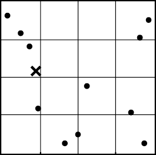

图 8-11：二维点的 4×4 网格

我们可以从目标点所在的区域开始搜索，并测试该区域中的每个点。只要该区域不为空，我们就能保证找到第一个*候选*最近邻，如图 8-12 所示。不幸的是，由于我们没有对每个区域内的点进行组织或排序，因此在这种情况下我们只能进行线性扫描。自然地，如果初始区域为空，我们必须逐步向外推进，搜索相邻区域，直到找到一个包含数据点的区域，作为我们的候选最近邻。

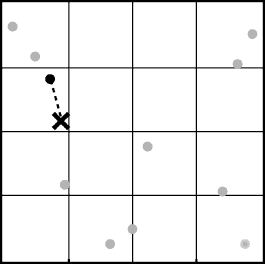

图 8-12：一个在与目标点相同区域内找到的初始候选最近邻

一旦我们获得了这个初始的最近邻候选点，我们仍然没有完成。候选点只是一个候选点。可能在相邻的区域内有更近的点。如果我们的目标点接近某个区域的边缘，这种情况更为可能。在图 8-13 中，虚线圆圈代表所有距离当前候选点相等或更近的点的空间。任何落在圆圈内的点都可能是真正的最近邻。阴影网格单元就是那些与该区域重叠的单元。

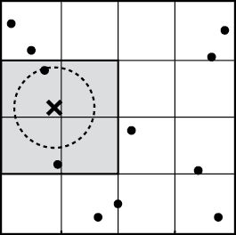

图 8-13：一个候选最近邻和可能包含更接近目标点的网格单元

为了形象化我们为何需要继续检查其他区域，想象你想要在户外派对上找出离你最近的人。你正在讲述一个特别尴尬的故事，涉及到在咖啡中使用了变质的牛奶，并且想确保只有预定的听众听到你的故事。你旁边站着的最好的朋友可能看起来离你最近，但是，如果你靠近围栏，你还需要考虑对面的人。如果你的邻居正在围栏旁边种花，他们实际上可能更近，能听到所有的羞辱细节。你不能因为有围栏在中间就忽略他们。这就是为什么我们总是检查相邻的区域——也就是为什么你在公开场合讲尴尬故事时一定要小心。

我们继续扩展搜索范围，包含*所有*邻近的格子，直到我们能够保证没有任何剩余格子中的点比我们候选的最近邻点更近。一旦检查完所有在候选最近邻半径范围内的格子，我们可以忽略更远的格子，甚至不需要检查它们的距离。

这种改进的网格搜索所带来的权衡是算法复杂度。与扫描每一个格子（我们可以通过嵌套的`FOR`循环实现这种算法）相比，优化后的搜索从单一格子开始，逐步扩展，直到我们能证明没有未探索的格子包含更好的邻居。这需要在搜索顺序（向外螺旋）、边界检查（避免测试网格边缘外的格子）和终止条件（知道何时停止）中加入额外的逻辑。下一节将展示一个简化扩展搜索的简单示例，供说明用途。

### 简化扩展搜索

假设我们考虑一个简化的（非优化的）扩展搜索版本，它以菱形模式向外扩展。为了简单实现，搜索使用从初始格子开始的增大距离，而不是执行一个完美的螺旋。为了实现的简便，我们将在网格索引上使用曼哈顿距离，计算网格单元之间的步数：

*d* = |*xbin*[1] − *xbin*[2]| + |*ybin*[1] − *ybin*[2]|

尽管这种搜索模式对于每个维度中格子宽度差异很大的网格可能效率不高，但它提供了一个易于理解的示例。

图 8-14 展示了搜索的前四次迭代。在图 8-14(a)的第一次迭代中，我们搜索包含目标点的格子（距离为零）。在接下来的图 8-14(b)迭代中，我们搜索所有距离一步的格子。在随后的每次迭代中，我们搜索所有进一步的格子。

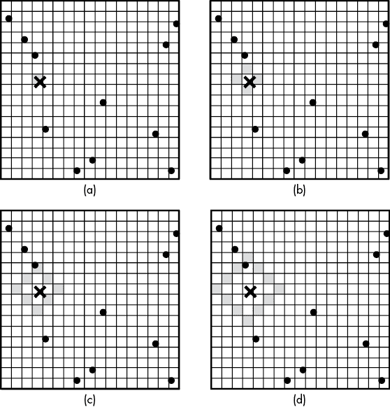

图 8-14：在网格上执行简化扩展搜索的前四次迭代

我们从一个辅助函数开始，该函数检查指定格子内是否有任何点比目标点(`x`, `y`)距离更近，且小于给定的`threshold`。该函数执行对格子内点的线性扫描。如果存在至少一个比阈值更近的点，函数将返回距离最近的点。使用阈值可以让我们将该辅助函数用于将格子内的点与其他格子的最佳候选点进行比较。

```py
GridCheckBin(Grid: g, Integer: xbin, Integer: ybin, 
             Float: x, Float: y, Float: threshold):
    # Check that it is a valid bin and within the pruning threshold.
  ❶ IF xbin < 0 OR xbin >= g.num_x_bins:
        return null
    IF ybin < 0 OR ybin >= g.num_y_bins:
        return null

 # Check each of the points in the bin one by one.
    GridPoint: best_candidate = null
  ❷ Float: best_dist = threshold
    GridPoint: current = g.bins[xbin][ybin]
  ❸ WHILE current != null:
      ❹ Float: dist = euclidean_dist(x, y, current.x, current.y)
        IF dist < best_dist:
            best_dist = dist
            best_candidate = current
        current = current.next
  ❺ return best_candidate
```

清单 8-6：一个辅助函数，用于返回与目标点距离小于给定阈值的格子中的最近点

代码首先进行安全检查，确保我们正在访问一个有效的格子 ❶。如果不是，它会返回`null`以表示没有有效的点。然后，代码使用`WHILE`循环遍历格子中的每个点 ❸，计算其与目标点的距离，将其与当前已知的最佳距离进行比较，如果更近，则将其保存为新的最佳候选点 ❹。最后，代码返回最接近的点 ❺。由于代码在检查任何点之前，已经将`best_dist`设置为`threshold`值 ❷，因此只有距离小于`threshold`的点才会被标记为新的候选点。如果格子中的点都没有比`threshold`更近，则函数返回`null`。

执行扩展搜索的代码通过迭代不同步数的步骤，检查所有在这些步骤内能到达的格子。与之前的搜索一样，我们追踪到目前为止看到的最佳候选项。搜索在第*d*次迭代后结束，如果在*d*步的范围内没有包含更近邻居的有效网格单元。

```py
GridSearchExpanding(Grid: g, Float: x, Float: y):
    Float: best_d = Inf
    GridPoint: best_pt = null

  ❶ # Find the starting x and y bins for our search.
    Integer: xb = Floor((x - g.x_start) / g.x_bin_width)
    IF xb < 0:
        xb = 0
    IF xb >= g.num_x_bins:
        xb = g.num_x_bins - 1

    Integer: yb = Floor((y - g.y_start) / g.y_bin_width)
    IF yb < 0:
        yb = 0
    IF yb >= g.num_y_bins:
        yb = g.num_y_bins - 1

 Integer: steps = 0
    Boolean: explore = True
  ❷ WHILE explore:
        explore = False

      ❸ Integer: xoff = -steps
        WHILE xoff <= steps:
          ❹ Integer: yoff = steps - abs(xoff)
          ❺ IF MinDistToBin(g, xb + xoff, yb - yoff, x, y) < best_d:
              ❻ GridPoint: pt = GridCheckBin(g, xb + xoff, yb - yoff, 
                                             x, y, best_d)
                IF pt != null:
                    best_d = euclidean_dist(x, y, pt.x, pt.y)
                    best_pt = pt
              ❼ explore = True

          ❽ IF (MinDistToBin(g, xb + xoff, yb + yoff, x, y) < best_d
                AND yoff != 0):
                GridPoint: pt = GridCheckBin(g, xb + xoff, yb + yoff, 
                                             x, y, best_d)
                IF pt != null:
                    best_d = euclidean_dist(x, y, pt.x, pt.y)
                    best_pt = pt
              ❾ explore = True

            xoff = xoff + 1
        steps = steps + 1
    return best_pt
```

这段代码首先通过查找网格中离目标点最近的格子开始，确保将网格外的目标映射到其最近的网格格子 ❶。最终得到的格子（`xb`，`yb`）将作为搜索的起点。通过将网格外的格子映射到有效的格子，函数可以返回位于网格外的目标点的最近邻。

代码随后使用一个`WHILE`循环，从这个初始格子开始向外扩展，步长逐渐增加 ❷。变量`steps`记录当前迭代使用的距离。`WHILE`循环的条件是变量`explore`，它表示下一次迭代可能包含一个有效的格子，因此我们应该在下一步继续探索。正如我们稍后会看到的那样，`WHILE`循环在完成一次完整迭代后终止，此时*没有*任何访问过的格子能包含更近的邻居。

在主`WHILE`循环内，代码按从`-steps`到`steps`的不同 x 索引偏移量进行迭代，就像在网格上水平扫描一样❸。x 方向和 y 方向的总步数由`steps`固定，因此代码可以程序化地计算剩余的步数，使用（正或负）y 方向的步数❹。从负 y 方向开始，代码使用清单 8-4 中的`MinDistToBin`检查箱子索引是否有效，如果有效，则计算到该箱子的距离❺。它可以跳过任何无效的或距离过远的箱子。如果该箱子可能包含比当前候选点更近的点，代码将使用清单 8-6 中的`GridCheckBin`检查是否存在这样的点❻。每当找到更近的点时，代码会将其保存为新的最近候选点，并更新其对最近距离的估计值。第二个`IF`块在正 y 方向执行相同的检查，只要 y 偏移量不为零（在这种情况下，我们已经检查了负 y 方向的箱子）❽。

在外部`WHILE`循环的每次迭代中❷，代码将`explore`重置为`False`。如果任何一次对`MinDistToBin`的调用表明某个箱子可能包含更近的邻居（❼和❾），则代码稍后将`explore`更新为`True`。因此，外部循环会继续，直到达到一个步骤数，在该步骤中每个箱子都要么比`best_d`更远，要么位于网格外（因此无效）。虽然其他终止标准可能提供更精确的测试并更早终止，但由于其简单性，我们在代码中使用了这个规则。

## 网格大小的重要性

我们网格箱子的大小对搜索效率有巨大影响。我们的箱子越大，可能需要检查的每个箱子里的点就越多。记住，我们的网格搜索仍然会对每个访问到的箱子中的点进行线性扫描。然而，将网格划分为更精细的箱子在内存和我们可能遇到的空箱子数量上都有权衡。当我们缩小网格箱子的大小时，我们通常需要搜索更多的单独箱子才能找到第一个候选最近邻，而且检查箱子的成本也增加了。

图 8-15 显示了一个极端案例，其中网格太精细。

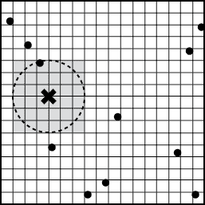

图 8-15：一个精细的网格，其中大多数箱子为空

在图 8-15 中，我们必须搜索 36 个箱子才能找到最近邻。显然，这比图 8-13 中的示例更昂贵，在后者中我们只需要检查四个箱子和两个单独的点。遗憾的是，这甚至可能比线性扫描搜索还要贵，因为线性扫描检查了所有 11 个数据点。

在我们寻找咖啡店的情境下考虑这个问题。如果我们将空间划分得过细，比如 1 米×1 米的方格，我们将面临一个大多数空桶的网格。如果我们将空间划分得过粗，比如 5 公里×5 公里的方格，我们可能会把整个城市及其众多的咖啡店归入一个桶中，同时仍然（让我们极为震惊地发现）留下大量几乎完全为空的桶。

最优的网格大小通常取决于多个因素，包括点的数量及其分布。更复杂的技术，如非均匀网格，可以用于动态地适应数据。在下一章中，我们将讨论几种基于树的数据结构，它们能够动态地实现这种适应。

## 超越二维

为二维开发的基于网格的技术也可以扩展到更高维的数据。我们可能需要在一栋多层的办公楼中搜索最接近的可用会议室。我们可以通过将*z*坐标纳入距离计算来在三维数据中搜索最近邻：

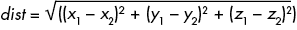

或者，更一般地，我们可以定义*d*维数据上的欧几里得距离为：

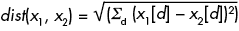

其中 *x*[i][*d*]是第*i*个数据点的第*d*维。

高维数据为我们在本章中考虑的基于网格的方法带来了另一个挑战：它要求我们沿更多的维度划分空间。随着我们考虑更高维度，存储这些数据结构所需的空间会迅速膨胀。对于具有*D*维和每维*K*个桶的数据，我们需要*K*^(*D*)个独立的桶！这可能需要大量内存。图 8-16 展示了一个三维示例，即一个 5×5×5 的网格，已经包含了大量的独立桶。

更糟的是，随着我们增加网格桶的数量，我们很可能增加空桶的比例。检查这些空桶是浪费的工作。因此，网格对于高维问题来说并不是理想的。在下一章中，我们将介绍一种更好的方法来扩展到高维数据——k-d 树。

虽然很难用超过三维的空间来思考日常的空间问题，但我们可以将最近邻方法应用于超越空间点的数据。在下一节中，我们将看到如何使用最近邻搜索帮助我们找到相似的咖啡店或天气条件相似的日子。

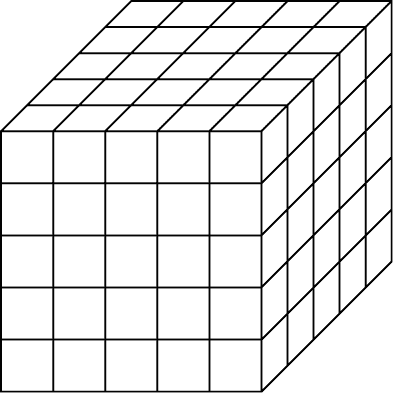

图 8-16：三维点的网格

## 超越空间数据

空间数据，比如地图上的位置，为最近邻搜索和网格提供了一个简单的视觉示例。我们习惯于从邻近的角度思考位置，因为我们经常会问自己像“哪里是最近的加油站？”或“离会议中心最近的酒店在哪里？”这样的问句。然而，最近邻问题并不仅仅局限于空间数据。

让我们考虑一个关键问题：当我们最喜欢的咖啡品牌缺货时，如何选择下一个最佳的咖啡品牌。为了找到与我们喜欢的咖啡类似的品牌，我们可能会考虑我们喜欢的咖啡特性，比如强度或酸度水平，然后寻找具有相似特征的其他咖啡。我们可以扩展最近邻搜索来找到这些“接近”的咖啡。为此，我们首先在咖啡日志中记录下我们曾经品尝过的每一款咖啡，标注出像强度和酸度这样的属性，如图 8-17 所示。

多年来，我们构建了一个全面的咖啡地理图谱。对这些数据执行最近邻搜索可以帮助我们找到与目标值相似的咖啡品种。想找一款强烈且低酸度的咖啡来提神，赶在紧迫的截止日期前完成工作吗？我们可以准确地想象出我们想要的那款咖啡，就是我们曾经在夏威夷喝过的那款绝妙咖啡。不幸的是，眼前的截止日期让我们没有足够的时间去夏威夷。但别担心！我们可以利用对咖啡属性的全面分析，这些分析记录在我们的咖啡日志中，来定义一个搜索目标，然后寻找本地品牌，看看有没有足够相似的。

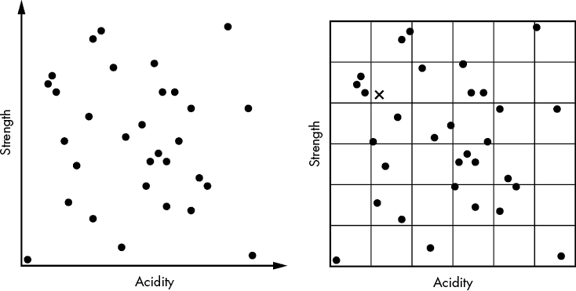

图 8-17：咖啡属性作为二维数据的示例（左）以及这些点在网格中的位置（右）

要进行这个搜索，我们只需要一种方法来计算像咖啡强度或酸度这样的属性的距离。最近邻算法依赖于我们区分“近”与“远”邻居的能力。虽然我们可以为其他类型的数据定义距离度量，例如字符串，但为了保持一致性，本章将限制讨论实值属性。

对于空间数据点，我们有简单的标准方法来测量两个点之间的距离，如(*x*[1]*, y*[1]*) 和 (*x*[2]*, y*[2]*) 之间的欧几里得距离（之前已经使用过）。但任何问题的最优距离度量方法都依赖于问题本身。在评估咖啡品牌时，我们可能希望在不同的情境下对属性赋予不同的权重。比如，在临近的截止日期前，咖啡因含量可能比酸度等其他因素更为重要。

一种常见的非空间数据距离度量方法是加权欧几里得距离：

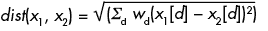

其中，*x*[*i*][*d*]是第*i*个数据点的第*d*维，*w*[*d*]是第*d*维的权重。这种公式让我们可以加权不同维度的影响。在这种情况下，我们可能会将咖啡因含量的权重设置为酸度的两倍，从而使搜索偏向于咖啡因含量相似的咖啡。我们甚至可以在每次搜索时调整权重。

当然，我们的搜索并不保证咖啡的其他方面是否适合。我们只是在测量指定维度上的接近度。如果我们只通过匹配强度和酸度来寻找日常咖啡，那么我们不会考虑烘焙程度、批次大小、种植条件、咖啡因含量，甚至土壤中的营养成分浓度。如果最近邻是去咖啡因咖啡，我们的搜索将无法解释这个灾难。我们最终会得到低质量的咖啡和失望的泪水。确保你的距离计算考虑所有相关维度是很重要的。

## 为什么这很重要

最近邻搜索允许我们找到“接近”某个目标值的点，无论是空间的还是非空间的。从算法的角度来看，最近邻搜索使我们从寻找精确目标转向基于距离度量的搜索。随着我们从一维数据集进入多维数据领域，搜索的细节变得更加复杂。正如我们从数组到网格的转变所看到的，这一扩展打开了一系列新的问题，涉及如何组织和搜索数据。我们不再能够像在一维数据的二分搜索中那样考虑简单的排序。我们需要将我们的数据结构适应新的多维结构类型。网格提供了一种新的数据结构方式，将位于相同空间区域的点聚合到同一个桶中。

与我们在数组中看到的“一桶一个值”结构不同，网格展示了另一种结构。网格使用链表或其他内部数据结构来存储每个桶中的多个值，这种技术我们将在后续章节中重复使用。通过使用这种结构，网格还引入了一个新的权衡因素——桶的大小。通过增大桶的大小，我们可以将成本从评估许多小桶转移到每个桶扫描大量数据点上。选择正确的桶数是*调整*我们数据结构以适应当前问题的一个典型例子。

在下一章，我们将通过将树的自适应特性与网格的空间特性相结合，进一步推进空间分区。这样做，我们将解决网格的一些主要缺点——并使寻找一杯好咖啡的过程更高效。
