# 9

空间树


上一章展示了最近邻搜索如何帮助我们找到附近或接近的数据点，拓宽了我们回答与咖啡相关的问题的能力，比如找到最近的物理位置或找到具有相似属性的项目。在本章中，我们基于树形数据结构和空间划分的概念，进一步改进我们的最近邻搜索。

第八章讨论了如何将寻找特定值的算法概念适应到更一般的寻找最近邻问题中。我们还看到，当从一维过渡到多维时，操作变得更加复杂。也许我们想要在二维空间中找到附近的咖啡店，或者寻找相似的朋友（基于同理心、愿意倾听和永恒重要的酷感）。网格取代了简单的数组，单纯沿着一个维度排序已经不再足够。

本章介绍了两种基于树的数据结构：统一四叉树和 k-d 树。*四叉树*这个术语通常用来描述一类二维数据结构，基于计算机科学家 Raphael Finkel 和 Jon Bentley 提出的原始四叉树，该树将每个二维节点划分为四个子象限。我们关注的是统一四叉树，如研究员和发明家 David P. Anderson 提出的结构。该结构具有与网格结构相对应的大小相等的子区域，从而建立在上一章的讨论基础上。相比之下，*k-d 树*由 Jon Bentley 发明，采用一种更灵活的二叉划分方案，可以进一步适应数据，并允许我们扩展到更高维度。通过研究四叉树和 k-d 树，我们学会了如何推广和修改基于树的数据结构，并通过与城市规划项目的对比来考察这些数据结构。

## 四叉树

虽然网格为存储二维数据提供了一个便捷的数据结构，但它们也有自己的一系列复杂性。正如我们在上一章所看到的，网格的开销和实用性很大程度上取决于我们如何划分空间。使用大量网格箱子（通过创建细粒度网格）需要大量内存，并且可能需要我们搜索多个箱子。另一方面，粗略的划分可能导致每个箱子内有大量数据点，如图 9-1 所示，这类似于对大量单个点进行简单线性扫描。

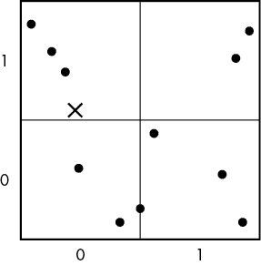

图 9-1：具有少量箱子的网格

我们可以从不同的家庭组织方法来思考这些网格。如果我们把所有厨房用具都扔进一个巨大的抽屉里，找到某个物品就需要花费很长时间。这相当于使用一个巨大的网格箱。为了改善这种情况，假设我们将餐具分开存放在不同的抽屉里，并根据用途将炊具存放在不同的橱柜中。我们甚至将麦片放在一层架子上，将香料放在另一层架子上。这相当于使用更细粒度的网格。突然之间，情况变得好转了——我们不再需要在煎锅下方寻找肉桂粉。稍加额外的结构就能大大简化我们的烹饪流程。

然而，我们可能会将这一概念推得过头。也许我们拥有太多的餐具，且整理的抽屉过于拥挤，搜索起来非常耗时。我们或许可以通过将餐具分为一个专门放铲子、另一个放非铲子的抽屉来提高效率。但试想一下，将每个餐具都单独存放在一个抽屉里，甚至为每一个可能购买的餐具分配一个抽屉——这种做法的开销可想而知。很快，我们将面对一整面墙的抽屉，心里想着到底要打开多少个抽屉，才能找到一个打蛋器。这就是当我们使用过于精细的网格时的情况。

解决这一难题的方法是根据数据动态划分空间。只有在需要时，我们才引入额外的结构及其相应的开销。我们从对空间进行粗粒度划分开始。也许我们等到至少拥有五个铲子时，再为它们分配一个单独的抽屉。在此之前，我们可以将它们和勺子、搅拌器一起存放。当我们需要更精细的粒度时，我们进一步对子空间进行划分。为了提供这种动态性，我们可以借助*均匀四叉树*。

一个均匀的四叉树将树的分支结构引入网格。树中的每个节点代表一个空间区域。根节点代表树所覆盖的整个空间以及该空间内的所有点。每个节点被划分为四个大小相等的象限，每个非空象限都有一个子节点。术语*均匀*指的是节点被划分为大小相等的空间区域，因此在节点内均匀地划分了空间。图 9-2 展示了四叉树的分割。

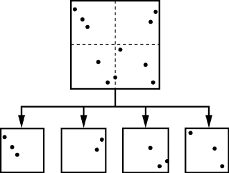

图 9-2：一个四叉树节点最多可以有四个子节点，分别代表该空间的四个大小相等的象限。

在讨论四个子树时，通常将它们标记为西北（NorthWest）、东北（NorthEast）、西南（SouthWest）和东南（SouthEast），以反映它们在原始区域中的空间位置。

内部四叉树节点存储指向最多四个子节点的指针，并附带相关的元数据，如分支中点的数量或区域的空间边界（该节点在 x 维和 y 维的最小值和最大值）。叶节点存储一个包含该区域内点的列表，以及任何所需的元数据。我们可以通过保持一个 2×2 的子节点指针网格（对于内部节点）和一个点数组（对于叶节点）来使用单一的数据结构表示内部节点和叶节点。我们要么将叶节点中的子条目设置为`null`，要么在内部节点中使用一个空数组。

以下是`QuadTreeNode`的复合数据结构示例：

```py
QuadTreeNode {
    Boolean: is_leaf
    Integer: num_points
    Float: x_min
    Float: x_max
    Float: y_min
    Float: y_max
    Matrix of QuadTreeNodes: children
    Array of Points: points
}
```

我们为点使用了一个简单的复合数据结构：

```py
Point {
    Float: x
    Float: y
}
```

如同前一章所述，我们也可以将点存储在数组或有序元组中。

从技术上讲，我们不需要显式地存储节点的空间边界。我们可以通过根节点的边界和分割序列推导出每个节点的边界，因为每个节点在每个维度的中间对其点进行分区，将空间切割成四个可预测大小的子区域。给定根节点的原始边界和一系列分支，我们可以精确计算出任何子节点的边界。然而，预计算并存储边界有一个明显的优势：在任何给定的节点，我们可以简单地查找边界，而不是推导它们，这使得实现搜索算法变得更加容易。我常常发现，存储这种类型的额外空间信息的价值远远超过了额外的内存成本。

四叉树的优势在于，每个级别的分支（当有足够多的点时）实际上创建了一个自适应的层次网格。图 9-3 展示了一个四叉树空间分区的示例。

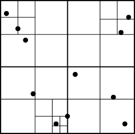

图 9-3：四叉树创建的空间分区

想象四叉树的连续分区以及我们如何像科幻惊悚片中的互动地理搜索软件那样搜索它们。主角们挤满指挥室，盯着代表整个城市的大屏幕。紧张的音乐响起。随着新信息的涌入，操作员从屏幕中选择一个象限。有人说：“放大那里并增强，”操作员照做了。无论对话如何，这个操作相当于在四叉树中向下一级。刹那间，指挥室的屏幕显示了城市的一个子集。屏幕下的整个范围是上一级的一个象限。每个人都专注地盯着新的地理子集，然后选择一个更小的子象限再次放大。当我们的英雄们找到了离目标点最近的发射器时，搜索结束。

与其他树结构一样，我们可以在统一的四叉树上添加一个包装数据结构，以简化账务管理：

```py
QuadTree {
    QuadTreeNode: root
}
```

根节点作为一个空节点在树创建时以正确的尺寸创建，因此我们不需要担心它为空。

### 构建均匀四叉树

我们通过递归地将分配的空间划分为越来越小的子区域，构建这些神奇的四叉树。由于数据可能包含任意接近或甚至重复的点，我们需要额外的逻辑来确定何时停止细分，并将包含多个点的节点指定为叶节点。在每一层，我们检查是否需要将当前节点设为内部节点（具有子节点）或叶节点（包含点的列表）。我们可以使用不同的机制来进行此测试，但以下是最常见的几种：

1.  是否有足够的点来证明需要分裂？如果点太少，检查与子节点的距离的成本将高于逐一检查每个点的成本。这样做是不值得的。

1.  空间边界是否足够大，值得进行分裂？如果我们有 10 个点在完全相同的位置呢？我们可能会不停地分裂而从未真正划分这些点。这将浪费时间和内存。

1.  我们是否已达到最大深度？这为我们提供了一个备用检查，防止我们在过度细分时浪费时间和内存，通过限制树的最大深度来实现。

我们可以将这个过程可视化为一个非常规城市规划师尝试划分土地，使每块土地上都有建筑物。这个规划师不熟悉现代地理划分技术，总是将区域划分为四个相等的象限。每次查看一块土地时，他们都会问：“这块土地上的建筑物是否太多？”以及“这块地大到足以继续划分吗？我不能卖一个 2 英尺 x 2 英尺的地块，人们会笑话的。”第三个标准（最大深度）代表规划师在放弃之前愿意进行多少次细分。经过四层，规划师可能会觉得“差不多了”并继续进行。如果停止的标准没有达到，规划师会叹气，嘟囔道“真的吗？又来？”然后继续细分这块地。

在划分某一层时，我们将当前空间分成四个相等的象限，按象限划分点，并递归地检查每个子区。如果我们将点的最小数量设置为 1，并将最大深度设置为 4（包括根节点），我们将在图 9-4 中构建该树。如图所示，我们可以通过仅存储每个节点的非空子节点来节省内存。如果某个象限没有子节点，我们可以将其指针设置为`null`。

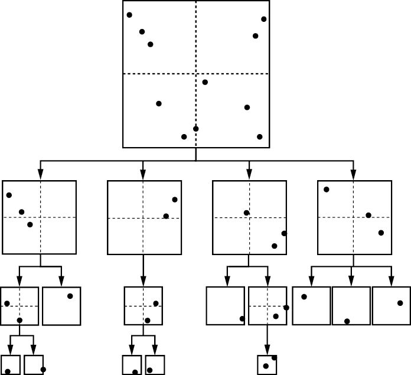

图 9-4：一个四层的四叉树示例

批量构建四叉树的代码与下一节添加点的代码非常相似。事实上，将点迭代地添加到空的四叉树中是构建四叉树的一个好方法。

### 添加点

由于四叉树是动态数据结构，我们可以在保持树结构的同时高效地添加点。我们从`QuadTree`数据结构的包装函数开始：

```py
QuadTreeInsert(QuadTree: tree, Float: x, Float: y):
    IF x < tree.root.x_min OR x > tree.root.x_max:
        return False
    IF y < tree.root.y_min OR y > tree.root.y_max:
        return False
    QuadTreeNodeInsert(tree.root, x, y)
    return True
```

这个包装器保证我们总是以非空节点调用`QuadTreeNodeInsert`。代码还会检查插入的点是否在四叉树的边界内。这一点至关重要，因为均匀四叉树使用相同大小的区域，不能动态调整大小。所有的点必须落在根节点的空间边界内。如果点超出范围，代码会返回`False`，但是根据实现方式，您可能希望使用其他机制，如返回错误或抛出异常。

如下列代码所示，将点添加到节点的过程包括遍历树以找到新点的位置。这个搜索可以以两种方式之一结束：在叶子节点处或在内部死胡同处。如果我们在叶子节点处终止搜索，我们可以将新点添加到该处。根据我们的拆分标准（空间边界、最大深度和点的数量），我们可能需要将节点拆分为子节点。如果我们停在了内部死胡同处，那么我们找到了一个先前没有包含任何点的路径。我们可以创建合适的节点。

```py
QuadTreeNodeInsert(QuadTreeNode: node, Float: x, Float: y):
  ❶ node.num_points = node.num_points + 1

    # Determine into which child bin the point should go.
  ❷ Float: x_bin_size = (node.x_max - node.x_min) / 2.0
    Float: y_bin_size = (node.y_max - node.y_min) / 2.0
    Integer: xbin = Floor((x - node.x_min) / x_bin_size)
    Integer: ybin = Floor((y - node.y_min) / y_bin_size)

    # Add the point to the correct child.
  ❸ IF NOT node.is_leaf:
      ❹ IF node.children[xbin][ybin] == null:
            node.children[xbin][ybin] = QuadTreeNode(
                  node.x_min + xbin * x_bin_size,
                  node.x_min + (xbin + 1) * x_bin_size,
                  node.y_min + ybin * y_bin_size,
                  node.y_min + (ybin + 1) * y_bin_size)
        QuadTreeNodeInsert(node.children[xbin][ybin], x, y)
        return

 # Add the point to a leaf node and split if needed.
  ❺ node.points.append(Point(x, y))
  ❻ IF we satisfy the conditions to split:
        node.is_leaf = False
      ❼ FOR EACH pt IN node.points:
            QuadTreeNodeInsert(node, pt.x, pt.y)
      ❽ node.num_points = (node.num_points -
                           length(node.points))
        node.points = []
```

代码首先通过递增`num_points`来表示新的点❶。然后，函数通过计算各个区域的大小，确定新点属于四个区域中的哪一个，并使用这些信息将 x 和 y 索引映射到`0`或`1`❷。如果节点不是叶子节点，代码需要递归地将点添加到正确的子节点❸。它首先检查子节点是否存在。如果不存在（如果子节点的指针是`null`），则创建子节点❹。我们利用`xbin`和`ybin`都只有`0`或`1`这一事实，简化逻辑。我们可以通过算术运算计算出子节点的边界，而无需枚举所有四种情况。最后，在叶子节点上，代码直接将点插入到节点中❺。

然而，我们还没有完成。代码需要检查是否满足拆分条件❻；如果满足，则拆分当前的叶子节点。幸运的是，我们可以重复使用相同的插入函数来进行拆分，就像我们用来添加点的函数一样。代码将节点标记为非叶子节点（`node.is_leaf = False`），并使用`FOR`循环将点逐个重新插入❼。由于当前节点不再是叶子节点，重新插入的点现在会通过到正确的子节点，并根据需要创建新的子节点。然而，由于我们对每个点都使用了该函数两次，我们必须修正`num_points`以避免重新插入的点被重复计算❽（因为在❶时进行了计数器递增）。代码还会清空新内部节点的点列表。

图 9-5 展示了将两个点添加到树中的情况。插入的开口圆形点导致一个节点在触发最大深度条件之前就发生了分裂。结果叶子节点包含两个点。插入的开口方形点则为其父节点的西北象限添加了一个新的子节点。由于最小点数条件，代码不会再次分裂。

如前一节所述，我们可以使用这种方法从一组点构建一个统一的四叉树。首先，我们创建一个具有必要空间边界的空根节点。然后，我们逐步添加集合中的每个点。由于每个维度的分割总是基于中点，因此树的结构不会因我们插入点的顺序而改变。

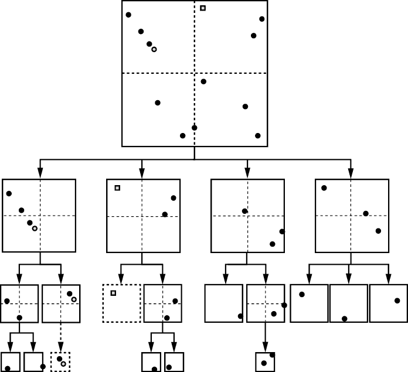

图 9-5：在四叉树中添加两个点的示例，分别用阴影圆圈和阴影方块表示

### 移除点

从节点中移除点的过程类似于插入点，但更复杂。我们从叶子节点的列表中删除该点。然后，我们可以沿着树向上操作，移除不再符合标准的分裂。这可能涉及递归地提取每个节点子节点（它们自己可能也有子节点）中的点，并将它们合并到下一个叶子节点的单一列表中。

另一个额外的难点是确定删除哪个点。与网格一样，用户可能会插入任意接近的或甚至是重复的点。在下面的代码中，我们删除叶子节点列表中的第一个匹配点。由于浮点数错误（由于浮点变量精度有限而发生的四舍五入），我们也不能使用直接的相等测试。因此，我们使用一个辅助函数来找到足够接近的点。我们可以重用清单 8-3 中的`approx_equal`函数来进行此测试。

我们还使用一个辅助函数来合并不再符合分割标准的节点。该代码会合并一个有子节点的节点，并返回一个包含所有子树中点的数组：

```py
QuadTreeNodeCollapse(QuadTreeNode: node):
  ❶ IF node.is_leaf:
        return node.points

  ❷ FOR i IN [0, 1]:
        FOR j IN [0, 1]:
            IF node.children[i][j] != null:
                Array: sub_pts = QuadTreeNodeCollapse(node.children[i][j])
                FOR EACH pt IN sub_pts:
                    node.points.append(pt)
                node.children[i][j] = null
  ❸ node.is_leaf = True
  ❹ return node.points
```

该代码首先检查当前节点是否已经是叶子节点，如果是，则直接返回点的数组❶。否则，节点是内部节点，代码需要从每个子节点聚合数据点。代码会遍历每个子节点，检查它们是否为`null`，如果不是，则递归调用`QuadTreeNodeCollapse`来聚合这些点❷。该函数最终通过将当前节点设置为叶子节点❸，并返回点❹来结束。

有了那个辅助函数后，我们可以继续处理删除功能。我们从包装函数开始。

```py
QuadTreeDelete(QuadTree: tree, Float: x, Float: y):
    IF x < tree.root.x_min OR x > tree.root.x_max:
        return False
    IF y < tree.root.y_min OR y > tree.root.y_max:
        return False
    return QuadTreeNodeDelete(tree.root, x, y)
```

包装函数首先检查点是否位于树的边界内，因此可能在树中。如果是，它会调用递归删除函数。

递归删除代码按照搜索点的方式向树下方继续。当它到达叶节点时，如果点存在，它会删除该点。然后它会返回到上层节点，根据需要合并节点。如果删除了点，函数返回`True`。

```py
QuadTreeNodeDelete(QuadTreeNode: node, Float: x, Float: y):
  ❶ IF node.is_leaf:
        Integer: i = 0
      ❷ WHILE i < length(node.points):
          ❸ IF approx_equal(node.points[i].x, node.points[i].y, x, y):
                remove point i from node.points
                node.num_points = node.num_points - 1
                return True
 i = i + 1
        return False

    # Determine into which child bin the point to be removed would go.
  ❹ Float: x_bin_size = (node.x_max - node.x_min) / 2.0
    Float: y_bin_size = (node.y_max - node.y_min) / 2.0
    Integer: xbin = Floor((x - node.x_min) / x_bin_size)
    Integer: ybin = Floor((y - node.y_min) / y_bin_size)

  ❺ IF node.children[xbin][ybin] == null:
        return False

  ❻ IF QuadTreeNodeDelete(node.children[xbin][ybin], x, y):
        node.num_points = node.num_points - 1

      ❼ IF node.children[xbin][ybin].num_points == 0:
            node.children[xbin][ybin] = null

      ❽ IF node no longer meets the split conditions
            node.points = QuadTreeNodeCollapse(node)
        return True
  ❾ return False
```

代码首先检查递归是否已经到达叶节点❶。如果是，它会遍历点数组❷，检查每个点是否与目标点匹配❸。如果代码找到了匹配的点，它将从数组中移除该点，减少该节点中的点数，并返回`True`表示删除成功。请注意，每次只删除一个匹配的点。如果代码在叶节点没有找到匹配的点，它将返回`False`。

搜索然后继续进入目标点应分配的桶❹。代码检查是否存在正确的子节点，如果不存在，返回`False`，表示该点不在树中❺。否则，代码递归地在子节点上调用 `QuadTreeNodeDelete` ❻。

如果递归调用 `QuadTreeNodeDelete` 返回 `True`，则代码已从某个子节点删除了一个点。它更新点的数量，并检查该子节点是否为空❼。如果为空，它删除子节点。然后代码检查当前节点是否仍符合内部节点的标准❽。如果不符合，它将合并该节点。代码返回 `True`，表示删除成功。如果递归调用没有返回 `True`，则没有删除任何点。函数最终返回 `False`❾。

### 搜索均匀四叉树

我们从根节点开始搜索四叉树。在每个节点，我们首先问该节点是否可能包含比我们当前候选点更接近的点。如果是，对于内部节点我们递归地探索子节点，对于叶节点我们直接测试点。然而，如果我们确定当前节点*不能*包含最近邻点，我们可以通过忽略该节点及其整个子树来修剪搜索。

我们使用与第八章中对网格单元应用的相同测试来检查节点内点的兼容性。我们拥有类似的信息：点的位置和区域的边界框。如前一章所述，距离计算公式为：


哪里

如果 *x* < *x*[min] 那么 *x*[dist] = *x*[min] – *x*

如果 *x*[min] ≤ *x* ≤ *x*[max] 那么 *x*[dist] = 0

如果 *x* > *x*[max] 那么 *x*[dist] = *x* – *x*[max]

和

如果 *y < y*[min] 那么 *y*[dist] *= y*[min] *– y*

如果 *y*[min] ≤ *y* ≤ *y*[max] 那么 *y*[dist] = 0

如果 *y* > *y*[max] 那么 *y*[dist] = *y* – *y*[max]

简而言之，我们正在检查搜索目标到节点空间区域中可能存在的最近点的距离。回顾一下上一章的例子，我们再次问：我们的懒惰邻居需要扔多远的球才能刚好把它扔回我们的院子里？这个检查只测试一个点在此距离内是否可能存在于节点中。我们需要探索该节点，以查看其中存在的点。

考虑搜索标记为 X 的点在图 9-6 中的最近邻。该图显示了与我们在图 8-3 中的原始咖啡馆位置地图相同的点分布，其中 X 是我们当前位置，其他点是附近的咖啡馆。

我们从根节点开始，使用一个具有无限距离的虚拟候选点。我们还没有看到任何候选邻居，因此我们需要一些东西来开始我们的搜索。使用一个虚拟的无限远点使得算法能够接受它找到的第一个点作为新的候选点，而无需任何特殊的逻辑。我们找到的任何点都将比无限远的点更近，并且每个区域都会包含更近的点。在寻找咖啡馆的例子中，这相当于从一个想象中的无限远的咖啡馆开始。我们列表中的任何真实咖啡馆都保证比这个虚拟点更近。

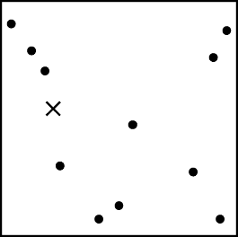

图 9-6：最近邻搜索的示例数据集

由于我们的（虚拟）候选点的距离是无限的，因此我们对根节点的兼容性测试通过了。根节点中的至少一个点*可能*距离不再是无限远的。尽管这个测试在数学上与我们对网格单元使用的测试是相同的，但它有一个大的实际差异：我们测试的单元格的大小在树的每一层都不同。在较高层级，每个节点覆盖的空间较大。随着层级下降，空间范围变得更加紧凑。

我们根据子节点与查询点的接近程度来优先决定首先搜索哪个子节点。毕竟，我们最终是想找到最近的点并尽可能地进行剪枝。因此，我们考虑 x 和 y 的划分，并问：“我们的目标点会落入哪一个象限？”在这种情况下，我们的查询点位于西北象限，如图 9-7 所示，所以我们从这里开始。

我们沿着指针进入西北子节点，发现自己专注于空间和点的子集，如图 9-8 所示。灰色区域的节点表示尚未探索的节点，灰色的点表示尚未检查的点。

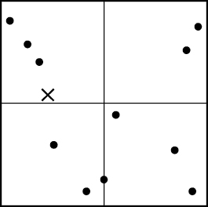

图 9-7：查询点位于四叉树根节点的西北象限内。

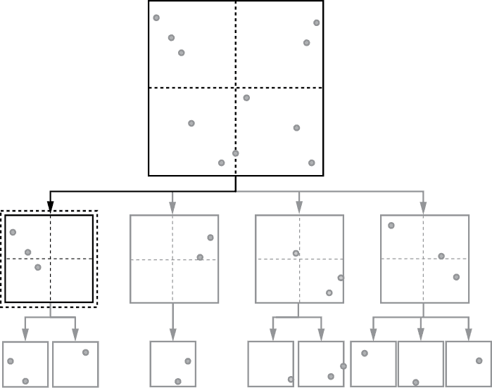

图 9-8：如图 9-6 所示的例子中的最近邻搜索，从搜索根节点的西北象限对应的子树开始。

再次，我们的空间兼容性测试表明这个节点*可能*包含我们的最近邻。该节点中任何点的最小距离都比当前（假定的）候选点距离更小。我们处于另一个内部节点，这意味着空间进一步被划分成四个子区域。

我们的搜索继续到相关内部节点的西南子节点，如图 9-9 所示。我们选择这个节点，因为它离查询点最近。第三次，兼容性测试通过。由于我们处于叶子节点，因此我们显式检查该节点中每个点到查询点的距离。在这个例子中，只有一个点，它比我们的假定候选点更近。

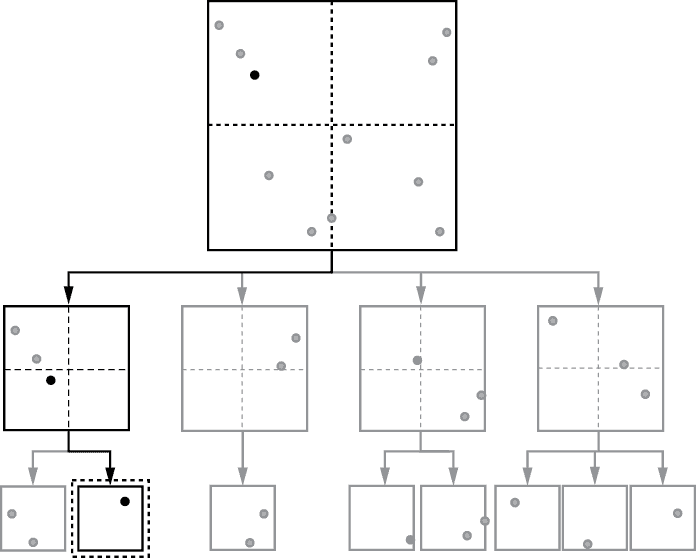

图 9-9：在四叉树的第二级，我们的搜索从离目标点最近的象限开始，即西南象限。

我们找到了第一个真正的最近邻候选！它的距离成为迄今为止的最小距离。我们可以在未来的所有点中更加挑剔。在我们寻找附近咖啡店的例子中，这个第一个邻居代表了目前为止找到的最近咖啡店。到这个点的距离是我们为了喝一杯咖啡而需要走的最远距离。我们可能在搜索过程中找到更近的咖啡店，但至少我们不必走无穷远。松了一口气。

一旦我们测试了叶子节点中的所有点，我们会返回到（内部）父节点并检查其余子节点。现在我们有了一个真实的候选点和距离，我们的剪枝测试便有了实际意义。我们检查所有剩余子象限的兼容性：西北、东北和东南。我们的距离测试显示我们可以跳过西北象限：如图 9-10 所示，其空间范围内的最近可能点比我们已有的候选点更远。它不可能包含更好的邻居。

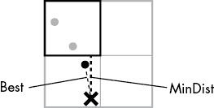

图 9-10：一个示意图，显示当前节点的西北象限与迄今为止最佳候选点之间的相对距离

我们还可以跳过空的东北和东南象限。由于它们没有任何点，因此也没有更好的邻居。我们的搜索可以在不进行距离测试的情况下丢弃这两个象限，因为它们的指针将是`null`，表示不存在这样的子节点。如图 9-11 所示，我们成功地修剪掉了该节点的四个象限中的三个，灰色的象限表示已被修剪。东北象限中的两个数据点也保持灰色，因为我们从未对它们进行测试。

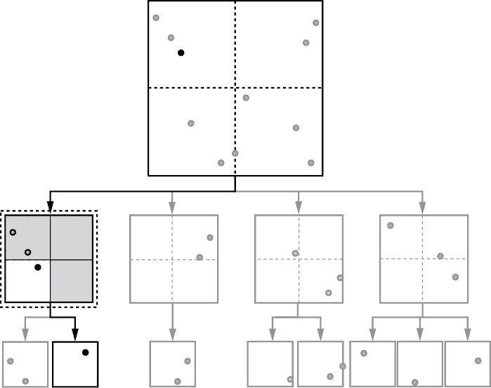

图 9-11：最近邻搜索能够跳过节点的四个象限中的三个。

一旦我们检查完内部节点中的象限，我们就返回到其父节点并重复这一过程。下一个最接近的象限是西南象限，我们的修剪测试确认它足够接近，可能包含一个更好的邻居，如图 9-12 所示。

每当我们发现一个子节点，根据我们的简单距离测试，*可能*包含一个更近的点时，我们会继续沿着这条路径向下检查，看看是否真的存在更近的邻居。在这种情况下，我们的搜索进入了西南象限。

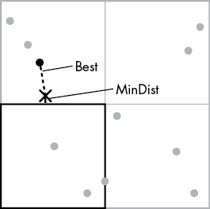

图 9-12：修剪测试，其中候选象限可能包含比当前最佳点更接近的邻居

在下一级别，四个潜在的象限再次争夺我们的注意力。带着一个真正的候选点及其对应的距离，我们可以积极地修剪我们的搜索，如图 9-13 所示。我们检查西北象限（及其唯一的点），因为它在我们的距离阈值内。我们可以跳过其他三个象限；东北和西南象限都是空的，因此它们有空指针，我们使用距离测试确认东南象限距离太远，无法包含更好的邻居。

这一次，当我们返回根节点时，我们可以修剪掉剩余的两个子节点，如图 9-14 所示。

东北和东南象限的远端区域远远超出了我们的距离阈值。

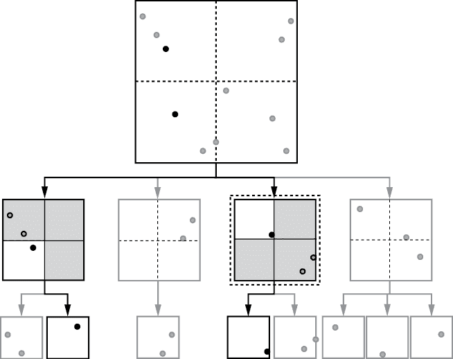

图 9-13：在检查根节点的西南象限时，最近邻搜索再次能够跳过四个子象限中的三个。

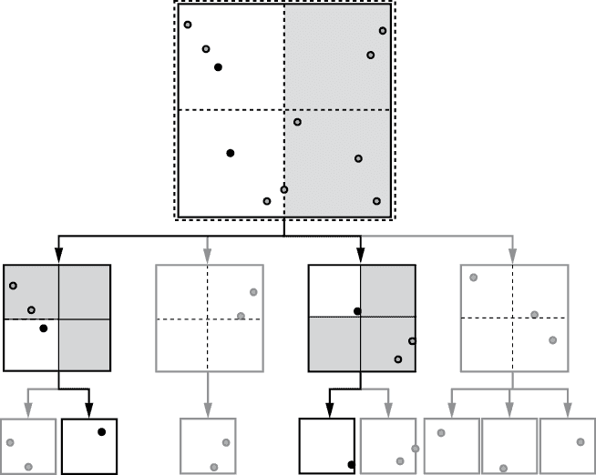

图 9-14：返回四叉树的根节点时，搜索可以跳过该节点的两个象限。

### 最近邻搜索代码

为了简化我们最近邻搜索代码的实现，我们首先编写一个辅助函数来计算目标点（*x*，*y*）到一个节点的距离。检查节点最小距离的代码与上一章中为网格展示的最小距离代码类似：

```py
MinDist(QuadTreeNode: node, Float: x, Float: y):
    Float: x_dist = 0.0
    IF x < node.x_min:
        x_dist = node.x_min – x
    IF x > node.x_max:
        x_dist = x – node.x_max

    Float: y_dist = 0.0
    IF y < node.y_min:
        y_dist = node.y_min – y
    IF y > node.y_max:
        y_dist = y – node.y_max

    return sqrt(x_dist*x_dist + y_dist*y_dist)
```

然而，在这种情况下，代码无需计算节点的最小和最大边界，因为每个节点都显式地存储了这些信息。

主要的搜索算法采用与其他基于树的方法相同的递归形式。我们对这个搜索算法的实现包括一个参数`best_dist`，表示当前的最小距离。通过将`best_dist`传递给我们的搜索函数，我们可以简化剪枝逻辑。如果当前节点的最小距离大于到目前为止的最佳距离，我们可以终止该分支的搜索。然后，如果找到了更接近的点，函数将返回一个*更近*的点，否则返回`null`。需要注意的是，在这个实现中，返回值为`null`意味着当前节点中没有比`best_dist`更近的点。

我们使用一个简单的包装函数，传递根节点和初始的无限距离：

```py
QuadTreeNearestNeighbor(QuadTree: tree, Float: x, Float: y):
    return QuadTreeNodeNearestNeighbor(tree.root, x, y, Inf)
```

我们的最近邻搜索包装函数并不会检查目标点是否位于四叉树的边界内。这使得我们可以使用该代码在四叉树外部的目标点找到邻居，增加了代码的实用性。

这是递归搜索节点的代码：

```py
QuadTreeNodeNearestNeighbor(QuadTreeNode: node, Float: x,
                            Float: y, Float: best_dist):
    # Prune if the node is too far away. 
  ❶ IF MinDist(node, x, y) >= best_dist:
        return null
    Point: best_candidate = null

 # If we are in a leaf, search the points.
  ❷ IF node.is_leaf:
        FOR EACH current IN node.points:
            Float: dist = euclidean_dist(x, y, current.x, current.y)

            IF dist < best_dist:
                best_dist = dist
                best_candidate = current
        return best_candidate

    # Recursively check all 4 children starting with the closest.
  ❸ Float: x_bin_size = (node.x_max - node.x_min) / 2.0 
    Float: y_bin_size = (node.y_max - node.y_min) / 2.0 
    Integer: xbin = Floor((x - node.x_min) / x_bin_size)
    IF xbin < 0:
        xbin = 0
    IF xbin > 1:
        xbin = 1

    Integer: ybin = Floor((y - node.y_min) / y_bin_size)
    IF ybin < 0:
        ybin = 0
    IF ybin > 1:
        ybin = 1

  ❹ FOR EACH i IN [xbin, (xbin + 1) % 2]:
        FOR EACH j IN [ybin, (ybin + 1) % 2]:
            IF node.children[i][j] != null:
                Point: quad_best = QuadTreeNodeNearestNeighbor(
                                       node.children[i][j], 
                                       x, y, best_dist)
              ❺ IF quad_best != null:
                    best_candidate = quad_best
                    best_dist = euclidean_dist(x, y, quad_best.x, 
                                               quad_best.y)
    return best_candidate
```

该函数首先进行剪枝测试，如果没有任何点比`best_dist`更接近，则跳过该节点并返回`null` ❶。然后，代码检查是否到达了叶子节点 ❷。如果已经到达叶子节点，它使用`FOR`循环检查每个点是否比`best_dist`更接近，如果是，则更新`best_dist`和`best_candidate`。在这个循环结束时，我们返回`best_candidate`，如果没有找到更接近的点，它的值将是`null`。

下一段代码处理内部节点的逻辑。只有在节点不是叶节点并且没有候选点时，我们才会到达这里。一些基本的数值测试和整数操作控制代码搜索子节点的顺序，允许代码先搜索最接近的子节点，然后扩展到其他子节点。代码首先计算候选点应该落入哪个 x 和 y 的区间 ❸，并调整值，使得`xbin`和`ybin`都落在[0, 1]范围内，从而指示最接近的子节点。这个调整是必要的，因为对于许多内部节点，我们的目标点完全可能位于当前节点表示的 2×2 网格之外。

然后，我们使用一对嵌套的`FOR`循环递归地探索非空子节点，迭代对 ❹。每次我们检查是否找到了更近的点（由`quad_best != null`表示），如果找到了，就更新`best_candidate`和`best_dist` ❺。在函数结束时，我们返回`best_candidate`。与叶节点的情况类似，如果我们没有找到比原始`best_dist`更近的点，`best_candidate`可能为`null`。

## k-d 树

我们已经解决了二维动态拆分的问题，现在是时候将注意力转向使用 k-d 树在三维或更高维度中搜索点或最近邻了。我们已经看到，如果我们没有考虑到咖啡中的所有相关属性，结果可能会令人失望。高维问题在我们寻找数据集中的相似点时非常常见，比如在天气数据集中寻找相似的条件（温度、气压、湿度）。

从理论上讲，我们可以通过沿着更多维度进行拆分来扩展四叉树。例如，*八叉树*是三维版本，每一层拆分成八个子节点。八路拆分看起来可能还不错，但这种方法显然在维度数增多时并不会优雅地扩展。如果我们想要在*D*维数据上构建一棵树，我们需要在所有*D*维度上同时拆分，这样每个内部节点就会有 2^(*D*)个子节点。如果我们正在构建一个包含温度、气压、湿度、降水量和风速的天气数据结构，那么我们就需要使用五维数据点，并在每一层拆分出 32 个子树！这种巨大的开销就是我们在将网格扩展到更高维度时遇到的相同问题。

为了有效地扩展到更高维度，我们需要限制分支因子。为此，已经设计了多种强大的数据结构，以实现高维度中的高效邻近搜索。其中一个例子是 k-d 树，它基于与四叉树类似的概念。

### k-d 树结构

*k-d 树* 是一种空间数据结构，它将四叉树的空间划分与二叉搜索树的二叉分支因子结合在一起，为我们提供了两者的优点。k-d 树不是在每一层沿着每个维度进行划分，而是选择一个单一的维度，并沿着该维度对数据进行划分。因此，每个内部节点将数据划分为恰好两个子节点：一个左子节点，其数据点在划分值以下（或等于），另一个右子节点，其数据点在划分值以上。

在使用 k-d 树时，我们失去了四叉树那种规则的网格状结构，但作为交换，我们回到了二叉搜索树中我们熟悉并喜爱的二叉分支因子。这种在单一维度上进行划分的能力，反过来又使得 k-d 树能够扩展到更高维的数据集。我们不再需要在每一层进行 2^(*D*) 个子节点的划分。图 9-15 展示了一个 k-d 树的示例。

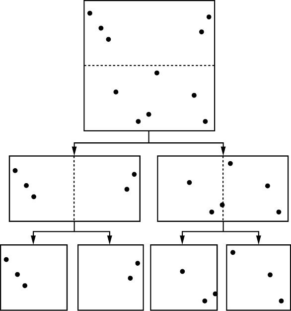

图 9-15：k-d 树在每一层沿着单一维度进行划分

k-d 树比四叉树更能灵活地调整数据的结构。我们不再受到每次在每个维度上都必须在中点进行划分的限制。我们可以选择在每个节点上最适合数据的划分维度和值，而不是将空间划分为 2^(*D*) 个相等大小的网格单元。每个内部节点因此会存储划分维度（`split_dim`）和值（`split_val`），如果数据在该维度的值小于或等于节点的划分值，则将该点分配给左子节点：

```py
pt[split_dim] <= split_val
```

我们不再像四叉树那样在交替的坐标轴上进行划分（如 图 9-15 所示），而是通过选择根据当前节点中数据点的组成来进行划分，从而量身定制我们的树结构，这样可以使得未来的搜索更加高效。我们可能会根据节点的整体范围来选择划分值，比如在最宽维度的中间进行划分。或者我们可以根据数据点的分布来选择划分值，比如在范围的中间或数据点值的中位数处进行划分。这两种选择的差异如 图 9-16 所示。

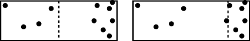

图 9-16：节点在中间（左）和中位数（右）处划分

k-d 树的灵活结构意味着我们在处理节点的空间边界时需要额外小心。与统一的四叉树的方形网格单元不同，k-d 树的节点覆盖了整体搜索空间的多维矩形。每个维度的宽度可以完全不同。有些节点可能是接近正方形的，而其他节点可能是细长的。我们通过显式跟踪定义其空间边界的多维矩形来表示节点的区域——每个维度的最小值和最大值。由于我们可以有任意数量的维度，我们将边界存储在两个数组`x_min`和`x_max`中，其中`x_min[d]`表示当前节点中维度`d`的最低值，`x_max[d]`表示最高值。节点内的所有点满足：

```py
x_min[d] <= pt[d] <= x_max[d] FOR ALL d
```

由于其复杂性，每个 k-d 树节点存储了大量信息。虽然这初看起来可能像是昂贵的开销，但正如我们将在本节中看到的，这种成本是通过树本身的强大功能和灵活性来抵消的。与本书中的其他数据结构一样，我们在内存、数据结构复杂性和后续算法效率方面做出了明确的权衡。

这是一个`KDTreeNode`的复合数据结构示例：

```py
KDTreeNode {
    Boolean: is_leaf
    Integer: num_dimensions
    Integer: num_points
    Array of Floats: x_min
    Array of Floats: x_max
    Integer: split_dim
    Float: split_val
    KDTreeNode: left
    KDTreeNode: right
    Array of Arrays: points
}
```

在这种情况下，我们使用一个数组来表示每个点，使其能够具有任意维度。

与本书中的其他树一样，我们可以将节点包装在一个外部数据结构中，比如`KDTree`。

```py
KDTree {
    Integer: num_dimensions
    KDTreeNode: root
}
```

在这个包装数据结构中存储维度数量对于检查一致性非常有帮助，尤其是在插入、删除或搜索等操作时。`num_dimensions`的值在 k-d 树创建时设置，并且在此树的整个生命周期中保持固定。

选择分割节点策略的灵活性展示了 k-d 树的真正强大之处：我们增强了四叉树的空间划分，以进一步适应数据。如果我们的点是集中的，我们选择通过关注这些区域来提供最多信息的分割。图 9-17 展示了这种动态划分。

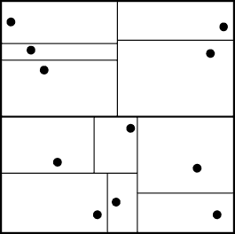

图 9-17：k-d 树创建的空间划分

考虑我们正在进行的任务——定位附近的咖啡店。如果我们沿着 95 号州际公路从佛罗里达到缅因州进行公路旅行，我们可以预处理数据，仅存储离高速公路 50 英里内的咖啡店。图 9-18 显示了这种形状的分布示例。

这种预过滤有助于将搜索空间限制在高速公路附近的咖啡店，但我们可以通过将这些位置存储在空间数据结构中，使搜索更加高效。我们还希望将搜索范围缩小到高速公路沿线的适当区域。毕竟，当我们还在南卡罗来纳州时，没有必要检查马萨诸塞州的咖啡店。我们很快发现，均匀的划分方案远非理想：我们的行程覆盖了超过 1,500 英里的大部分北行路程。由于我们已经筛选出仅沿高速公路的咖啡店，因此通过东西方向的均匀划分无法带来太多的剪枝效果。通过沿南北方向偏向划分，我们可以增加剪枝的数量，从而降低搜索成本。

另一个类比是，如果四叉树是城市规划师按照严格规定划分地图的日常工作，那么 k-d 树则代表了一个拥有更多工具选择的城市规划师。他们不再受限于将每个地块划分为完美的正方形，而是有更多灵活性，根据实际点的分布来划分空间。我们的城市规划师选择最宽的维度进行划分，以最小化狭长区域的出现。他们还使用此维度的中位点来提供平衡的树结构。结果可能不会像四叉树的正方形那样整齐，但它通常会更有效。

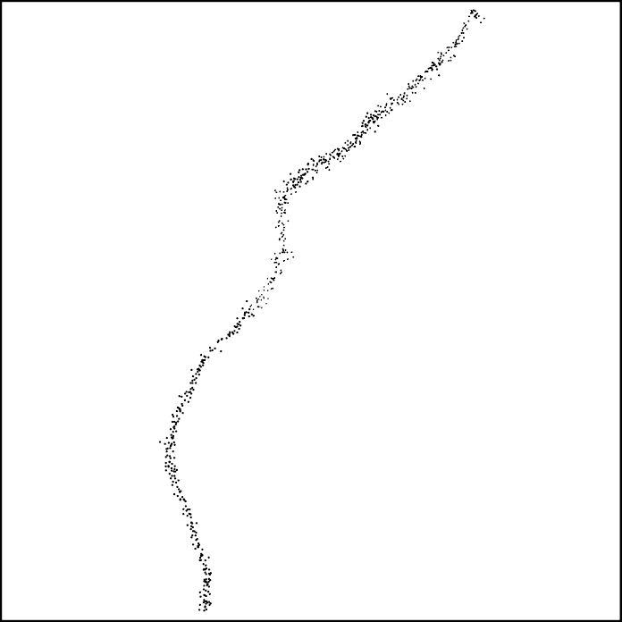

图 9-18：咖啡店在主要高速公路上的分布示例

### 更紧密的空间边界

我们通常可以通过追踪给定节点内所有点的边界框，而不是节点的总空间边界，进一步提高空间树的剪枝能力。这将使我们的剪枝问题从“最近邻候选点是否可能存在于节点所覆盖的空间中？”转变为“最近邻候选点是否可能存在于节点内实际点的边界框中？”虽然这看似是一个小的变化，但根据我们用来分割节点的逻辑，可能会看到显著的节省，如图 9-19 所示。

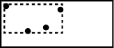

图 9-19：k-d 树节点内点的边界框

如果我们在节点构建过程中使用这些更紧密的边界框，就能更好地适应数据。我们不再基于整个可能的空间区域进行划分，而是根据实际点占据的区域进行划分。由此生成的 k-d 树结构如图 9-20 所示。黑色框表示每个节点的紧密边界框。灰色的点和线则显示了节点边界与其余数据集的关系。

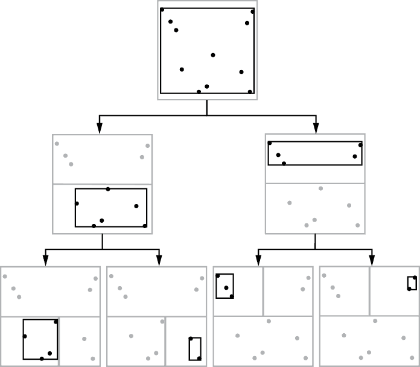

图 9-20：一个三层 k-d 树以及每个节点的边界框

在搜索过程中，我们使用黑框（紧致边界框）进行剪枝。正如你从图中看到的那样，最终的区域可以显著变小，这使得我们能够更加积极地进行剪枝。由于紧致边界框较小，它通常会与查询点之间有更大的最小距离。

我们可以使用一个简单的辅助函数从一组以数组表示的点计算紧致的边界框（示例 9-1）：

```py
ComputeBoundingBox(Array of Arrays: pts):
  ❶ Integer: num_points = length(pts)
    IF num_points == 0:
        return Error
    Integer: num_dims = length(pts[0])

  ❷ Array: L = Array of length num_dims
    Array: H = Array of length num_dims
    Integer: d = 0
  ❸ WHILE d < num_dims:
        L[d] = pts[0][d]
        H[d] = pts[0][d]
        d = d + 1

    Integer: i = 1
  ❹ WHILE i < num_points:
        d = 0
        WHILE d < num_dims:
            IF L[d] > pts[i][d]:
                L[d] = pts[i][d]
            IF H[d] < pts[i][d]:
                H[d] = pts[i][d]
            d = d + 1
        i = i + 1
  ❺ return (L, H)
```

示例 9-1：一个辅助函数，用于计算节点中点的紧致边界框

这段代码提取输入数据中的点数和维度数❶。然后，它创建新的数组 `L` 和 `H` 来分别存储低和高边界❷，并用数组中第一个点的坐标初始化这些边界❸。接着，代码遍历数组中剩余的点，检查它们是否超出了边界❹。如果是，它会扩展边界。最后，代码返回这两个数组❺。

这个辅助函数还展示了在 `KDTree` 的包装函数中预先检查所有点是否包含正确的维度数的好处。这个检查确保我们不会尝试访问无效的数组条目来获取数据点。

当然，跟踪这些附加的边界会增加相当大的复杂性，特别是在我们开始处理动态变化时。向 k-d 树中添加点可能会增加给定节点的边界。类似地，移除节点可能会缩小边界。

### 构建 k-d 树

构建 k-d 树采用递归过程，这个过程与二叉搜索树类似，但有几个主要的区别。我们从所有数据点开始，通过选择一个划分维度和值将它们分成两个子集。这个过程在每个层级上重复，直到满足终止条件：节点上的最小点数、最小宽度或最大深度。通常，我们使用两个测试条件，最小点数和最小宽度，但至少使用最后两个条件中的一个是非常重要的，这样可以避免在数据点重复时导致无限递归。

我们从一个包装函数开始，检查我们的数据是否有效：

```py
BuildKDTree(KDTree: tree, Array of Arrays: pts):
  FOR EACH pt IN pts:
      IF length(pt) != tree.num_dimensions:
          Return an error.
  IF length(pts) > 0:
      tree.root = KDTreeNode()
      RecursiveBuildKDTree(tree.root, tree.num_dimensions, pts)
  ELSE:
      tree.root = null
```

这段代码首先检查所有点是否具有正确的维度。然后，它检查是否有点可用于构建树。如果有，它会分配一个新的根节点（覆盖先前的树）并使用下面的函数递归构建 k-d 树。否则，它会将根节点设置为 `null`，表示空树。

k-d 树与四叉树构建的主要区别在于，k-d 树要求我们在每一层选择一个单一的分割维度。如果我们使用紧密的边界框，还需要计算 *D* 维度的边界框。虽然这些变化使得代码稍微长一些（有额外的 *D* 循环），但它们并没有增加实质性的复杂度。构建 k-d 树的代码递归地将我们的点集分配到子节点，直到满足终止条件。

```py
RecursiveBuildKDTree(KDTreeNode: node, Integer: num_dims,
                     Array of Arrays: pts):
  ❶ node.num_points = length(pts)
    node.num_dimensions = num_dims
    node.left = null
    node.right = null
    node.points = empty array
    node.split_dim = -1
    node.split_val = 0.0
    node.is_leaf = True

    # Compute the bounding box of the points.
  ❷ (node.x_min, node.x_max) = ComputeBoundingBox(pts)

    # Compute the width of the widest dimension.
  ❸ Float: max_width = 0.0
    Integer: d = 0
    WHILE d < node.num_dimensions:
        IF node.x_max[d] - node.x_min[d] > max_width:
            max_width = node.x_max[d] - node.x_min[d]
        d = d + 1
 # If we meet the conditions for a leaf, append the
    # remaining points to the node's point list.
  ❹ IF we do not satisfy the conditions to split:
        FOR EACH pt IN pts:
            node.points.append(pt)
        return

    # Choose split dimension and value.
  ❺ node.split_dim = chosen split dimension
    node.split_val = chosen split value along node.split_dim
    node.is_leaf = False

    # Partition the points into two sets based on
    # the split dimension and value.
    Array of Arrays: left_pts = []
    Array of Arrays: right_pts = []
  ❻ FOR EACH pt IN pts:
        IF pt[node.split_dim] <= node.split_val:
            left_pts.append(pt)
        ELSE:
            right_pts.append(pt)

    # Recursively build the child nodes.
  ❼ node.left = KDTreeNode()
    RecursiveBuildKDTree(node.left, num_dims, left_pts)

    node.right = KDTreeNode()
    RecursiveBuildKDTree(node.right, num_dims, right_pts)
```

这段代码首先进行簿记操作，填充每个节点所需的信息。我们记录下当前点集的基本信息，如点的数量和维度数量 ❶。然后，函数遍历所有点，使用清单 9-1 中的辅助函数计算该节点的紧密边界框 ❷。

一旦我们获得了边界，代码就会遍历每个维度来找到最宽的维度 ❸。我们使用这个循环作为递归的停止条件之一（如果一个节点太小则不再分割）。如果节点不满足继续分割的条件，代码将把所有点存储在叶节点的列表中 ❹。否则，代码会为该节点选择一个分割维度和分割值 ❺。然后，代码遍历当前点集，将其根据分割维度和值划分为两个数组`left_pts`和`right_pts` ❻。这两个数组会被用来递归地构建两个子节点 ❼。

选择`split_dim`和`split_val`的一种方法是沿着最宽的维度进行分割。这个方法的代码相对简单，大部分代码可以整合到最初找出最宽维度的代码块中 ❸：

```py
 Float: max_width = 0.0
    Integer: split_dim = 0
    Integer: d = 0
 WHILE d < node.num_dimensions:
        IF node.x_max[d] - node.x_min[d] > max_width:
            max_width = node.x_max[d] - node.x_min[d]
            split_dim = d
        d = d + 1
```

然后在 ❺ 处设置分割维度和值：

```py
 node.split_dim = split_dim
    node.split_val = (node.x_min[node.split_dim] + 
                      node.x_max[node.split_dim]) / 2.0
```

批量构建 k-d 树相对于动态插入和删除点具有显著的优势。在构建过程中考虑所有数据点，我们可以更好地使树的结构适应数据。我们根据所有数据点选择分割，而不是仅根据已经插入的子集。

### k-d 树操作

插入点、删除点和搜索 k-d 树的基本操作与四叉树类似。我们从树的顶部（根节点）开始所有操作，并使用分割值来导航到相应的分支。主要的不同之处在于，我们不再选择探索哪个四个象限，而是使用`split_dim`并根据`split_val`来选择两个子节点中的一个。由于这些高层次的概念与四叉树中呈现的相似，我们将不会详细讲解每一段代码。相反，我们来看看其中的一些不同之处。

1.  插入操作 在将点插入 k-d 树节点时，我们使用 `split_dim` 和 `split_val` 来决定选择哪个分支。如果叶节点满足我们的分割条件，我们就像在大规模构建时一样进行分割。最后，如果我们跟踪每个节点的紧密边界框，我们需要更新边界以考虑新添加的点。由于是添加点，这个更新会始终增加边界框的大小。

    ```py
     Integer: d = 0
        WHILE d < node.num_dimensions:
            IF x[d] < node.x_min[d]:
                node.x_min[d] = x[d]
            IF x[d] > node.x_max[d]:
                node.x_max[d] = x[d]
            d = d + 1
    ```

    这段代码会遍历新点的每个维度，检查该维度的点是否超出了边界框，如果超出了，则更新边界框。

1.  删除操作 在删除 k-d 树中的点时，我们使用 `split_dim` 和 `split_val` 来决定在搜索点时应该选择哪个分支。删除节点后，我们返回到树的根节点。在路径中的每个节点上，我们检查是否可以缩小边界（使用叶节点中的点或内部节点的两个子节点的边界框）。我们还检查是否可以将内部节点合并。

1.  搜索 操作之间的关键区别是，四叉树和 k-d 树在搜索操作中是否能够修剪节点。例如，我们可以使用扩展的公式 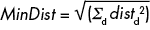 来计算点 *x* 和节点（非均匀，*D*维度）边界框中最接近点的欧几里得距离，这与我们用于四叉树和网格的公式类似。我们首先计算从点到节点的空间边界在每个维度上的最小距离：

如果 *x*[*d*] < *x*[min][*d*]，则 *dist*[d] = *x*[min][*d*] − *x*[*d*]

如果 *x*[min][*d*] ≤ *x* ≤ *x*[max][*d*]，则 *dist*[d] = 0

如果 *x*[*d*] > *x*[max][*d*]，则 *dist*[d] = *x*[*d*] − *x*[max][*d*]

1.  其中 *x*[*d*] 表示查询点的第 *d* 维度，*x*[min][*d*] 和 *x*[max][*d*] 分别表示节点在第 *d* 维度上的低和高边界。然后我们计算每个维度上的平方距离之和，并取平方根。我们可以通过在各维度上执行 `WHILE` 循环来实现这个计算过程：

    ```py
    KDTreeNodeMinDist(KDTreeNode: node, Point: pt):
        Float: dist_sum = 0.0
        Integer: d = 0
        WHILE d < node.num_dimensions:
            Float: diff = 0.0
            IF pt[d] < node.x_min[d]:
                diff = node.x_min[d] - pt[d]
            IF pt[d] > node.x_max[d]:
                diff = pt[d] - node.x_max[d]
            dist_sum = dist_sum + diff * diff
            d = d + 1
        return sqrt(dist_sum)
    ```

请注意，k-d 树比四叉树对增加和删除操作更敏感。虽然两种树由于分割规则和点的分布可能会变得不平衡，但 k-d 树的分割是基于当时的数据来选择的。如果我们显著改变点的分布，原来的分割值可能不再适用。在大规模构建时，我们可以根据当前的数据来调整分割，考虑如树的深度、是否平衡以及节点空间边界的紧凑性等因素。这揭示了数据结构的另一个权衡问题——随着数据的变化，结构的性能可能会下降。

## 为什么这很重要

四叉树和 k-d 树是我们如何将动态数据结构的力量与空间结构结合以解决搜索问题的例子。通过同时在多个维度上分支，四叉树使我们能够根据局部区域数据点的密度调整网格的分辨率。高密度区域会导致更深的分支，从而形成更精细的网格。同时，保持规则网格结构会带来更高维度的额外开销。研究四叉树、八叉树及其变种如何在不同数据集上扩展，为我们如何利用空间结构提供了一个重要的视角。

k-d 树代表了我们在过去几章中构建的概念的结合，用于解决最近邻搜索问题。它通过回归到二叉搜索树的核心概念，并选择一个维度在每个节点进行划分，从而解决了高分支因子的问题。此外，它还允许更多的灵活性以适应数据的结构，增强了剪枝能力。

四叉树和 k-d 树并不是唯一能促进最近邻搜索的数据结构。还有许多其他基于树和非树的方案。空间数据结构这一话题足以写成多本书。就像计算机科学中的几乎所有事物一样，每种方法在程序复杂度、计算成本和内存使用方面都有各自的权衡。对于本书的目的，四叉树和 k-d 树是如何将最近邻搜索的空间剪枝与基于树的结构相结合的优秀例子，从而使空间树能够适应手头的数据。
