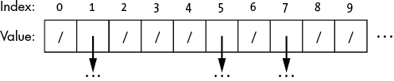
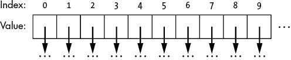
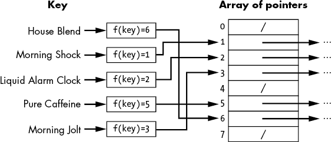
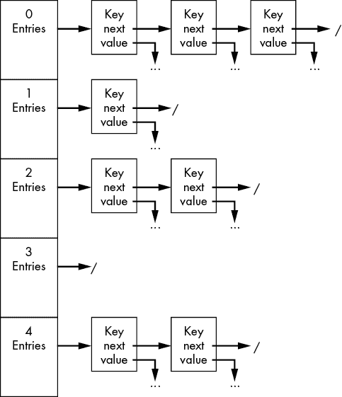
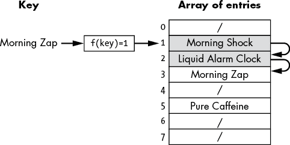
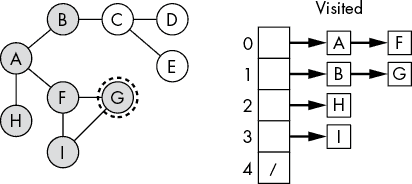

# 10

哈希表


本章介绍了*哈希表*，这是一种针对插入和查找进行了高度优化的动态数据结构。哈希表使用数学函数指引我们到数据的位置。在纯存储的情况下，它们特别有用，目标是快速找到和检索信息。

这是我们在咖啡储藏室中可能需要做出的权衡。忘记试图按过期日期或口感排序咖啡吧——我们是真正的咖啡爱好者，能够轻松记住我们储藏室中每一颗咖啡豆的最小细节。对于任何给定的属性（或属性组合），我们都能立即记住咖啡的名称。当我们走到咖啡储藏室时，我们已经决定了要喝哪种咖啡。将咖啡按这些其他维度排序存放只会拖慢我们的速度。我们需要的是高效的检索：只要给出我们想喝的咖啡的名字，我们就希望能够最小化努力地找到这些咖啡豆。哈希表正是通过名称实现这种快速检索的。

数组提供了一种紧凑的结构，用于存储单个数据项，并提供了一种高效的检索机制——但前提是我们知道该项的索引。有了索引，我们可以在常数时间内查找任何元素。正如我们在第二章中看到的，如果没有索引，查找数组中的项目就变得更加复杂。如果我们只有项的值，那么我们需要遍历数组来找到它的正确位置。只有通过二分查找，我们才能高效地查找项目，但前提是保持数组的排序顺序，这会导致插入和删除操作效率低下。

在前几章中，我们探讨了数据结构和算法，以高效地搜索目标值。想象一下，如果我们能构建一个神奇的函数，将目标值直接映射到它的索引（当然有一些前提条件）。这就是哈希表的核心思想。哈希表使用数学函数来计算数据结构中值的索引，从而使我们能够直接从值映射到数组的桶中。缺点是没有任何映射是完美的。我们将看到不同的值如何映射到同一个位置，导致碰撞。然后我们将探讨解决碰撞的两种方法。

与所有数据结构一样，哈希表并不是解决所有问题的完美方案——我们将探讨它的优缺点，包括内存使用和最坏情况性能。在这个过程中，我们将研究一种通过使用数学映射来组织数据的新方式。

## 使用键的存储和搜索

在我们深入了解哈希表的工作原理之前，让我们考虑一个理想化的索引方案，以高效地检索整数值——为每个*可能的*值维护一个独立的数组槽，并用该值本身来索引该槽。这个结构如图 10-1 所示。为了插入值 9，我们只需将其放入索引为 9 的槽中。在这种安排下，我们可以以常数时间插入或检索项目。



图 10-1：一个为每个潜在条目分配槽的大型数组

我们理想化的数据结构的明显缺点是维护每个可能键的数组的荒谬成本。考虑存储所有可能的 16 位数字信用卡号的情况。我们需要几个千万亿个槽，准确地说是 10¹⁶个。这是一个庞大的内存需求。更糟糕的是，我们甚至不太可能使用这么多槽。如果我们在编写一个程序来跟踪一个 1000 人公司的企业信用卡，我们只需要一个很小的部分槽——我们分配的 10¹³个槽中的一个。其余的都是浪费。它们空着，希望某天能存储数据。同样，我们也不希望为每一本可能的书籍保留一个图书馆的位置，为每位可能的顾客保留一个酒店房间，或者为每种已知的咖啡在咖啡储藏室中预留一个位置。这太荒谬了（也许咖啡例外）。

但是，作为一种思维实验，让我们考虑这个理想化的数据结构如何适用于其他类型的数据。我们立刻遇到的问题是，如何为更复杂的数据类型（如字符串或甚至复合数据类型）选择值。假设我们要创建一个简单的咖啡记录数据库。第三章展示了如何使用指针数组来存储此类动态大小的数据，如以下代码所示：

```py
CoffeeRecord {
    String: Name
    String: Brand
    Integer: Rating
    FloatingPoint: Cost_Per_Pound
    Boolean: Is_Dark_Roast
    String: Other_Notes
    Image: Barcode
}
```

我们仍然可以将所有项目放入一个单一的大型数组中，为每个*可能的*条目设置一个槽。在这种情况下，槽中不仅包含单个值，还包含指向更复杂数据结构的指针，如图 10-2 中的指针数组。



图 10-2：一个指针数组

然而，这仍然留下了如何进行实际查找的问题。如果我们想要查找我们为“Jeremy’s Gourmet High-Caffeine Experience: Medium Roast”——第六章介绍的一款咖啡——给出的评分，我们无法将整个复合数据结构作为值。我们并没有手头上所有这些信息。即使我们手头有完整的信息，也不清楚如何使用复合数据结构甚至是字符串作为索引。

计算机程序通常使用键来标识记录。*键* 是与数据本身一起存储或从数据中派生出来的单一值，可以用来标识一条记录。在 RSVP 列表中，键可能是包含受邀者姓名的字符串；在我们的咖啡记录中，键可以是咖啡的名称或条形码。在许多数据结构中，从排序数组到字典树，我们使用键来组织数据。对于本书早期的数字示例，键就是数值本身。对排序数组或二叉查找树进行的每一次搜索，都是通过查找匹配的数字键来获取记录。类似地，第六章介绍的字典树使用字符串作为键。

然而，这并没有解决索引问题。除非我们有整数键，否则我们仍然无法索引数组箱子。数组中并没有一个箱子，其索引为“Jeremy’s Gourmet High-Caffeine Experience: Medium Roast”。我们可以在数据结构中进行搜索，寻找一个具有匹配键的记录。线性扫描和二分查找都可以这样工作，使用目标值作为键。然而，我们失去了理想化数据结构的魔力。我们又回到了搜索匹配键的过程。

在某些情况下，我们可能能够找到一个自然的数字键来表示我们的记录。在咖啡的例子中，我们可以按照第一次品尝的时间顺序列出我们品尝过的每一款咖啡，并将相应的日期作为键。如果“Jeremy’s Gourmet High-Caffeine Experience: Medium Roast”是在 2020 年 1 月 1 日首次品尝的（假设我们记得这一点），我们可以通过二分查找来检索该记录。或者，我们也可以使用咖啡的条形码或它在《世界咖啡、品牌与制造商大全》中的页码。

更一般地，我们希望有一个函数能够根据我们的键生成一个索引。在接下来的章节中，我们将介绍哈希函数，它正是解决这个问题的。

## 哈希表

哈希表使用数学映射来压缩键空间。它们通过使用*哈希函数*将原始键映射到表中的位置（也叫做*哈希值*），将大的键空间压缩到一个较小的范围内。我们用哈希函数 *f*(*k*) 表示将键 *k* 映射到包含 *b* 个箱子的表中，范围为[*0*, *b* − 1]*。这个映射解决了前一部分的两个问题。我们不再需要无限数量的箱子，只需要 *b* 个箱子。正如我们将看到的，函数也可以将非整数映射到数字范围，从而解决非整数键的问题。

一个简单的哈希函数示例是使用除法法则，根据数字键计算哈希值。我们将键除以箱子的数量并取余数：

*f*(*k*) = *k* % *b*

其中 *%* 是取模操作。每一个可能的（整数）键都被映射到正确范围[*0*, *b* − 1]*内的单一箱子中。例如，对于一个包含 20 个箱子的哈希表，这个函数会生成如表 10-1 所示的映射。

表 10-1：使用 20 个桶的除法法哈希映射示例

| ***k*** | ***f*(*k*)** |
| --- | --- |
| 5 | 5 |
| 20 | 0 |
| 21 | 1 |
| 34 | 14 |
| 41 | 1 |

考虑将所有信用卡号映射到 100 个桶的问题。除法法将键空间从 16 位数字压缩到 2 位数字，方法是使用卡号的最后两位数字。当然，这种简化的映射对于某些键分布可能并不会产生最佳效果。如果我们有许多以 10 结尾的信用卡，它们都会映射到同一个桶。然而，这也解决了我们的核心问题之一：通过一次（且高效的）数学运算，我们将一个大范围的键压缩到有限数量的索引中。

怀疑的读者可能会对上述描述产生疑问：“我们不能将两个不同的项目存储在数组的同一个元素中。你在第一章中就告诉过我们这一点。而哈希函数显然可以将两个不同的值映射到同一个桶。看看表 10-1。21 和 41 都映射到了桶 1。”这就是前面提到的警告。遗憾的是，哈希函数并非真正的神奇法宝。正如我们将在下一节看到的那样，这种复杂性正是哈希表其他结构的作用所在——用来处理冲突。目前，我们可以注意到哈希函数将我们的键分成不相交的集合，我们只需要担心集合内部的冲突。

哈希函数不仅限于数字。我们也可以定义一个哈希函数，将咖啡的名称映射到一个桶。这允许我们通过两步直接访问任何条目的咖啡记录，如图 10-3 所示。首先，我们使用咖啡的名称计算其哈希值。键“House Blend”映射到值 6；我们将在本章稍后描述一种简单的字符串哈希方法。其次，我们通过使用哈希值作为索引，查找表中的哈希值。我们甚至可以使用这种方案将我们庞大的现实世界咖啡收藏映射到咖啡储藏室的固定数量的架子上。



图 10-3：哈希函数将字符串映射到数组中的索引

哈希表的一个现实世界例子就是我们生活中经常看到的注册表，无论是在夏令营的第一天，比赛的早晨，还是学术会议的开始。要存储的项目（注册包）根据其键（姓名）分配到唯一的桶中。人们可以通过应用一个哈希函数找到正确的桶，这个哈希函数通常很简单，比如将字母范围映射到某一行。以 A−D 开头的名字放到第 1 行，E−G 开头的名字放到第 2 行，以此类推。

### 冲突

即使是世界上最好的哈希函数，也无法提供完美的一一映射，将键映射到桶中。为了做到这一点，我们需要回到那个巨大的数组及其过度使用的内存。任何将大量键映射到较小值集合的数学函数，都可能会遇到偶尔的*冲突*——即两个键映射到相同的哈希值。想象一下，如果我们通过提取车牌上的第一个数字将车牌映射到 10 个停车位上。我们并不需要同事的车牌与自己的车牌完全匹配，就能因为停车位争执起来。假设你去注册你的车，车牌号是“Binary Search Trees Are #1”，结果发现同事已经用车牌“100,000 Data Structures and Counting”占用了那个车位。两者的哈希值可能恰好都为 1，因此它们会被分配到同一个位置。

我们在会议的注册桌前排队，就是因为有了冲突。考虑一个基于姓氏首字母将人分配到八个注册台的情况。姓氏首字母为 A−D 的人去第 1 台，姓氏首字母为 E−G 的人去第 2 台，以此类推。如果与会者人数超过几位，我们几乎可以保证会发生冲突。如果没有冲突，每个人都会有自己检查的地方。相反，姓氏为 A−D 的与会者将站在同一队伍里，因为他们的键（姓氏）发生了冲突。

我们可以通过增大哈希表的大小或选择更好的哈希函数来缓解一些冲突。然而，只要我们的键空间大于桶的数量，就不可能完全消除冲突。我们需要一种优雅的方式来处理两个数据项争抢同一位置的情况。如果这是一个幼儿园班级，我们可能会采用“安妮先坐在那里”或者“你需要学会分享”之类的策略。但这些方法在数据结构的上下文中并不适用。我们不能忽视新的键或覆盖旧的数据。数据结构的目的就是存储所有必需的数据。在接下来的两个章节中，我们将讨论链式法和线性探测法，这两种常见的处理哈希表冲突的方法。

### 链接法

链接法是一种通过在桶内使用额外结构来处理哈希表中冲突的方法。我们可以将指向链表头的指针存储在每个桶中，而不是在每个桶中存储固定的数据（或指向单一数据的指针）：

```py
HashTable {
    Integer: size
    Array of ListNodes: bins
}
```

其中

```py
ListNode {
    Type: key
 Type: value
    ListNode: next
}
```

这些列表就像我们的会议注册队伍。队伍中的每个人都是独一无二的个体，但都对应同一个注册桌。

如图 10-4 所示，每个桶的链表包含所有映射到该桶的数据。这使得我们可以在每个桶中存储多个元素。链表中的每个项目对应一个插入该桶的元素。



图 10-4：使用链表存储同一桶中的条目的哈希表

向哈希表插入新项的代码相对简单：

```py
HashTableInsert(HashTable: ht, Type: key, Type: value):
  ❶ Integer: hash_value = HashFunction(key, ht.size)

    # If the bin is empty, create a new linked list.
  ❷ IF ht.bins[hash_value] == null:
        ht.bins[hash_value] = ListNode(key, value)
        return

    # Check if the key already exists in the table.
  ❸ ListNode: current = ht.bins[hash_value]
 WHILE current.key != key AND current.next != null:
        current = current.next
    IF current.key == key:
      ❹ current.value = value
    ELSE:
      ❺ current.next = ListNode(key, value)
    return
```

我们首先计算`key`的哈希值❶，并检查相应的桶。如果桶为空（即指针为`null`），则创建一个新的链表节点，保存插入的`key`和`value`❷。否则，我们需要扫描桶的链表，并检查每个元素是否匹配键❸。`WHILE`循环检查是否既没有找到正确的键（`current.key != key`），也没有扫描到链表末尾（`current.next != null`）。如果链表已经包含匹配的键，我们更新与该键相关联的值❹。否则，我们将新键和其对应的值附加到链表的末尾❺。

查找过程采用类似的方法。但是，因为我们不再需要插入新节点，逻辑更加简单：

```py
HashTableLookup(HashTable: ht, Type: key):
  ❶ Integer: hash_value = HashFunction(key, ht.size)
  ❷ IF ht.bins[hash_value] == null:
        return null

    ListNode: current = ht.bins[hash_value]
  ❸ WHILE current.key != key AND current.next != null:
        current = current.next
    IF current.key == key:
      ❹ return current.value
  ❺ return null
```

查找的代码首先计算`key`的哈希值❶，检查相应的桶，如果桶为空则返回`null`❷。否则，它使用`WHILE`循环扫描链表中的每个元素❸，并返回匹配键的值❹。如果我们遍历完链表仍未找到匹配的键，代码返回`null`，表示该键不在表中❺。

最后，在删除项时，我们需要在列表中找到该项，并在找到后将其删除。以下代码既删除项又返回与目标键匹配的链表节点：

```py
HashTableRemove(HashTable: ht, Type: key):
  ❶ Integer: hash_value = HashFunction(key, ht.size)
    IF ht.bins[hash_value] == null:
        return null

    ListNode: current = ht.bins[hash_value]
    ListNode: last = null
  ❷ WHILE current.key != key AND current.next != null:
 last = current
        current = current.next
  ❸ IF current.key == key:
        IF last != null:
          ❹ last.next = current.next
        ELSE:
          ❺ ht.bins[hash_value] = current.next
        return current
    return null
```

这段代码首先计算`key`的哈希值，检查相应的桶，如果桶为空则返回`null`❶。如果桶不为空，我们使用`WHILE`循环扫描其中的元素，寻找匹配的键❷。为了正确删除元素，我们需要跟踪一条额外的信息：当前节点之前的最后一个链表节点。如果找到了匹配项❸，我们需要检查是否要删除链表中的第一个元素（即`last`为`null`）。如果不是，我们可以修改`last`节点的`next`指针，跳过正在删除的节点❹。否则，我们需要修改哈希桶中指向链表的指针，跳过该节点❺。最后，如果没有找到匹配的节点，返回`null`。

```py`The skeptical reader might pause here and ask, “How does this help? We still must scan through a bunch of elements of a linked list. We have lost the ability to directly map to a single entry. We’re back where we started.” However, the primary advantage to this new approach is that we are no longer scanning through a linked list of *all* the entries. We only scan through those entries whose hash values match. Instead of searching through a giant list, we search through a single tiny list for this bin. In our coffee pantry, where our hash function maps the coffee’s name to its corresponding shelf, we might be able to cull our search from 1,000 varieties to the 20 varieties on that one shelf. Back in the computational realm, if we maintain enough bins in our hash table, we can keep the size of these lists small, perhaps with only one or two elements.    Of course, the worst-case time for a lookup can be linear in the number of elements. If we choose a terrible hash function, such as *f*(*k*) = 1, we’re basically implementing a single linked list with extra overhead. It’s vital to be careful when selecting a hash function and sizing the hash table, as we’ll discuss later.    ### Linear Probing    An alternate approach to handling collisions is to make use of adjacent bins. If we are trying to insert data into a bin that already contains another key, we simply move on and check the next bin. If that neighbor is also full, we move onto the next. We keep going until we find an empty bin or a bin containing data with the same key. Linear probing extends this basic idea to the hash table’s operations. We start at the index corresponding to the key’s hash value and progress until we find what we are looking for or can conclude it is not in the hash table.    Hash tables using linear probing need a slightly different structure. Because we are not using a linked list of nodes, we use a wrapper data structure to store the combination of keys and values:    ``` HashTableEntry {     类型: 键     类型: 值 } ```py    We also include an additional piece of data in the hash table itself, the number of keys currently stored in the table:    ``` HashTable {     整数: 大小     整数: 键的数量     HashTableEntry 数组: 桶 } ```py    This information is critical, because when the number of keys reaches the size of the hash table, there are no available bins left. Often hash tables will increase the array size when they start to get too full, although care must be taken here. Because we are using a hash function that maps keys onto the range of the current array, keys may map to different locations in a larger array. In this section, we will only consider a simplified implementation of a fixed size table for illustration purposes.    Consider a hash table with linear probing where we have inserted a few of our favorite coffees, as shown in Figure 10-5.      Figure 10-5: A hash table with three entries      After we have inserted these initial three entries, we try to insert “Morning Zap” as shown in Figure 10-6. The insertion function finds another key, Morning Shock, in bin 1\. It proceeds to bin 2, where it finds Liquid Alarm Clock. The insertion function finally finds an opening at bin 3.      Figure 10-6: Inserting the entry “Morning Zap” requires scanning through several bins in the hash table.      The code for inserting items into a fixed-size hash table is shown below. As noted previously, it is possible to increase the size of the array when the hash table is full, but this adds complexity to ensure the items are mapped correctly to new bins. For now, we will return a Boolean to indicate whether the item could be inserted.    ``` HashTableInsert(HashTable: ht, 类型: 键, 类型: 值):   ❶ 整数: 索引 = HashFunction(键, ht.size)   ❷ 整数: 计数 = 0      HashTableEntry: 当前 = ht.bins[索引]   ❸ 当 当前 != null 且 当前.key != 键 且 计数 != ht.size:         索引 = 索引 + 1       ❹ 如果 索引 >= ht.size:             索引 = 0         当前 = ht.bins[索引]         计数 = 计数 + 1    ❺ 如果 计数 == ht.size:         返回 False    ❻ 如果 当前 == null:         ht.bins[索引] = HashTableEntry(键, 值)         ht.num_keys = ht.num_keys + 1     否则:       ❼ ht.bins[索引].value = 值     返回 True ```py    The code starts the search at the new key’s hash value ❶. The code also maintains a count of bins it has checked to prevent infinite loops if the table is full ❷. This count is not needed if we use resizing or otherwise ensure there is always at least one empty bin. The code then loops through each bin using a `WHILE` loop ❸. The loop tests three conditions: (1) whether it found an empty bin, (2) whether it found the target key, and (3) whether it has searched all the bins. The first and third conditions test whether the key is not in the table. After incrementing the index, the code checks whether the index should wrap back to the beginning of the table ❹, which allows the code to search the entire table.    After the loop completes, the code first checks whether it has examined every bin in the table without finding the key. If so, the table is full and does not contain the key ❺, so the code returns `False`. The code then checks whether it has found an empty bin or matching key. If the bin is empty ❻, a new `HashTableEntry` is created and stored. Otherwise, the value of the entry with the matching key is updated ❼. The code returns `True` to indicate that it successfully inserted the key and value.    Search follows the same pattern. We start at the index of the key’s hash value and iterate over bins from there. At each step, we check whether the current entry is empty (`null`), in which case the key is not in the table, or whether the current entry matches the target key.    ``` HashTableLookup(HashTable: ht, 类型: 键):   ❶ 整数: 索引 = HashFunction(键, ht.size)   ❷ 整数: 计数 = 0      HashTableEntry: 当前 = ht.bins[索引]   ❸ 当 当前 != null 且 当前.key != 键 且 计数 != ht.size:         索引 = 索引 + 1       ❹ 如果 索引 >= ht.size:             索引 = 0         当前 = ht.bins[索引]         计数 = 计数 + 1      # 如果找到匹配项，则返回值。   ❺ 如果 当前 != null 且 当前.key == 键:         返回 当前.value   ❻ 返回 null ```py    The code starts by computing the hash value for the `key` to get the starting location of the search ❶. As with insertion, the code also maintains a count of bins it has checked to prevent infinite loops if the table is full ❷. The code then loops through each bin using a `WHILE` loop ❸. The loop tests three conditions: (1) whether it found an empty bin, (2) whether it found the target key, and (3) whether it has searched all the bins. After incrementing `index`, the code tests whether the search has run off the end of the table and, if so, wraps the search back to the start ❹. Once the loop terminates, the code checks whether it has found the matching key ❺. If so, it returns the corresponding value. Otherwise, the key is not in the table, and the code returns `null` ❻.    In contrast to search and insertion, deletion with linear probing requires more than a simple scan. If we remove an arbitrary element such as “Liquid Alarm Clock,” shown in Figure 10-6, we might break the chain of comparisons needed for other elements. If we replace “Liquid Alarm Clock” with null in Figure 10-6, we can no longer find “Morning Zap.” Different implementations use different solutions to this problem, from scanning through the table and fixing later entries to inserting dummy values into the bin.    The advantage of linear probing over chaining is that we make fuller use of the initial array bins and do not add the overhead of linked lists within the bins. The downside is that, as our table gets full, we might iterate over many entries during a search, and, unlike with chaining, these entries are not restricted to ones with matching keys.    ## Hash Functions    The difference between a good and bad hash function is effectively the difference between a hash table and a linked list. We’d want our hash function to map keys uniformly throughout the space of bins, rather than pile them into a few overloaded bins. A good hash function is like a well-run conference registration. Any clumping of attendees will lead to collisions, and collisions lead to more linear scanning (more time waiting in line). Similarly, in our conference registration example, bad hash functions, such as dividing the table into two lines for names starting with A−Y and names starting with Z, leads to long waits and annoyed attendees.    In addition, any hash function must be meet a couple of key criteria. It must:    1.  Be deterministic The hash function needs to map the same key to the same hash bin every time. Without this attribute, we might insert items into a hash table only to lose the ability to retrieve them. 2.  Have a predefined range for a given size The hash function needs to map any key into a limited range, corresponding to the number of hash buckets. For a table with *b* buckets, we need the function to map onto the range [0, *b* − 1]. We’d also like to be able to vary the hash function’s range with the size of our hash table. If we need a larger table, we need a correspondingly larger range to address all the buckets. Without this ability to adjust the range, we may be stuck with a limited number of viable hash table sizes.    In our conference registration example, these criteria correspond to people being able to find their packets (deterministic for all users) and having everyone map to a line (correct range). It would be wasteful to set up a conference check-in with lines for empty parts of the range (all names starting with Zzza through Zzzb), and it would be rude to map some people’s names to no line at all (no line for names starting with K). The best hash functions are like in-person organizers, holding clipboards and directing people to the correct lines.    ### Handling Non-numeric Keys    For numeric keys, we can often use a range of mathematical functions, such as the division method above. However, we may often need to handle non-numeric keys as well. Most importantly, we need to be able to compute the hash of a string containing the coffee name. The general approach to handling non-numeric keys is to use a function that first transforms the non-numeric input into a numeric value. For example, we could map each character to a numeric value (such as the ASCII value), compute the sum of values in a word, and modulo the resulting sum into the correct number of buckets. This approach, while straightforward and easy to implement, may not provide a good distribution of hash values due to how letters occur. For example, the hash function does not take into account the order of the letters, so words with the same letters, such as *act* and *cat*, will always be mapped to the same bin.    A better approach to hashing strings is an approach often called *Horner’s method*. Instead of directly adding the letters’ values, we multiply the running sum of letters by a constant after each addition:    ``` StringHash(字符串: 键, 整数: 大小):     整数: 总计 = 0     对于 键中的每个字符:         总计 = CONST * 总计 + CharacterToNumber(字符)     返回 总计 % 大小 ```py    where `CONST` is our multiplier, typically a prime number that is larger than the largest value for any character. Of course, by multiplying our running sum, we greatly increase the size of the value, so we need to be careful to handle overflow.    There are a wide variety of hash functions, each with their own trade-offs. A full survey of the potential hash functions and their relative merits is a topic worthy of its own book; this chapter presents just a few simple functions for the point of illustration. The key takeaway is that we can use these mathematical functions to reduce the range of our key space.    ### An Example Use Case    Hash tables are particularly useful when tracking a set of items, which is why Python uses them to implement data structures such as dictionary and set. We can use them to aid in tracking metadata for the searches such as those seen in Chapter 4.    In both the depth-first and breadth-first search, we maintained a list of future options to explore. We used a queue for breadth-first search and a stack for depth-first. However, there is an additional set of information we need to track: the set of items we have already visited. In both searches, we avoid adding items to the list that we have already seen, allowing us to avoid loops or, at least, wasted effort. Hash tables provide an excellent mechanism for storing this set.    Consider the sixth step of our example breadth-first search from Chapter 4, as shown on the left side of Figure 10-7. The search has already visited the gray nodes (A, B, F, G, H, and I), and the circled node (G) is our current node. We do not want to re-add either of G’s two neighbors to our list of items to explore; we have already visited both F and I.      Figure 10-7: The visited nodes of a breadth-first search tracked in a hash table      We could store the visited items in a hash table as shown on the right of Figure 10-7. This hash table uses a simple function: the division function maps the letter’s index in the alphabet into 5 bins. The letter *A* has index 0 and maps to bin 0\. The letter *G* has index 6 and maps to bin 1\. We insert a key for each item when we visit it. Before adding new items to our list of future topics, we check whether their key is in the hash table. If so, we skip the addition. Hash tables are particularly well suited to tracking this type of data because they are optimized for fast insertions and lookups.    ## Why This Matters    Hash tables provide a new way of organizing data by using a mathematical function. As opposed to tree-based structures, which structure the data around the keys themselves, hash tables introduce the intermediate step of mapping the keys to a reduced range. As with all things in computer science, this mapping comes with tradeoffs. Collisions mean that we can’t always access the desired data directly. We must add another level of indirection, such as a linked list, to store items that map to the same location. As such, hash tables provide another example of how we can creatively combine data structures (in this case, an array and linked lists).    Understanding hash functions and how they map keys to bins provides a side benefit. We can use these types of mappings to partition items or spread out work, such as the lines at a conference registration or the coffees on our shelves; in the computational domain, we might use hashing to assign tasks to servers in a simple load balancer. In the next chapter, we see how hash tables can be used to create caches. Hash tables are used throughout computer science, since they provide a handy data structure with (on average) fast access time and reasonable memory tradeoffs. They are a vital tool for every computer scientist’s toolbox.```
