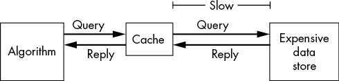
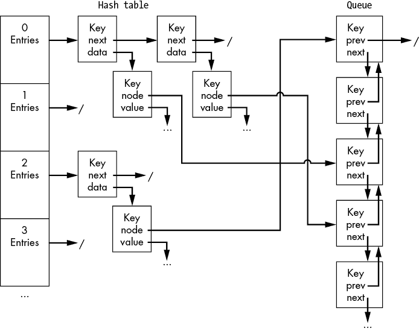
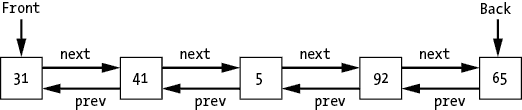

## 第十一章：缓存


本章介绍了*缓存*，一种旨在通过将部分数据存储在离计算更近的位置来降低高数据访问成本的数据结构。正如我们在前几章中所看到的，数据访问的成本是影响我们算法效率的关键因素。这不仅关系到我们如何组织存储中的数据，也关系到我们使用的存储类型。我们说数据是*本地的*，当它存储在离处理器更近的位置时，这样可以更快地进行处理。如果我们将一些数据从更昂贵、远离的地方复制到本地存储中，我们就能显著提高数据的读取速度。

例如，我们可以使用缓存来加速网页的访问。加载网页的过程包括查询服务器获取页面上的信息，将这些数据传输到本地计算机，并在视觉上呈现这些信息。如果网页包含大量元素，如图像或视频，我们可能需要传输大量数据。为了减少这种成本，浏览器会缓存常访问的数据。每次访问页面时，浏览器不会重新下载我们最喜欢网站的 logo，而是将该图像保存在计算机硬盘的本地缓存中，这样可以更快地从磁盘读取它。

我们应该如何选择哪些数据加载到缓存中呢？显然，我们无法存储所有的东西。如果我们能够存储所有数据，那我们就不需要缓存了——我们直接把整个数据集复制到最近的内存中就行了。缓存有多种策略，其有效性总是取决于具体的使用场景。在这一章中，我们结合之前探讨的数据结构，构建了一种策略——最少最近使用（LRU）缓存，它能极大地提高我们最喜欢的咖啡店的运营效率。我们还将简要讨论几种其他缓存策略以做对比。

## 引入缓存

到目前为止，我们对计算机的所有存储进行了等同处理，把它当作一个单一的书架，可以大致用相同的精力拿到任何我们需要的物品。然而，数据存储并非如此简单。我们可以把存储看作一个大型的多层图书馆。我们将受欢迎的书籍安排在靠近入口的书架上，以满足大多数读者的需求，而把发霉的计算机科学旧期刊堆放在地下室。我们甚至可能有一个外部仓库，存储那些很少使用的书籍，直到某位读者特别请求它们。想要查找关于 PILOT 编程语言的资料？很可能它不在受欢迎书籍区域。

除了关注我们在程序中如何组织数据外，我们还需要考虑数据存储的*位置*。并非所有数据存储都是平等的。实际上，对于不同的存储介质，通常存在存储容量、速度和成本之间的权衡。CPU 本身的内存（寄存器或本地缓存）速度极快，但只能存储非常有限的数据。计算机的随机存取内存（RAM）提供了更大的存储空间，但速度较慢。硬盘的容量显著更大，但比 RAM 慢得多。通过网络访问可以访问范围更广的存储，例如整个互联网，但也带来了相应的开销。在处理非常大的数据集时，可能无法将全部数据加载到内存中，这会对算法的性能产生巨大影响。理解这些权衡如何影响算法的性能非常重要。

将此与我们自己早晨制作咖啡的例程进行比较。虽然理想情况下我们可以随时得到成千上万种咖啡，但我们的公寓只能存储有限的咖啡。街道尽头有一家咖啡供应商，那里储备了成百上千种咖啡，但我们真的希望每次想喝新的一杯咖啡时都走到那儿去吗？相反，我们在公寓里存储了我们最喜欢的少量咖啡。这个本地存储加速了我们早晨咖啡的制作过程，让我们在踏入外界之前就能享受第一杯咖啡。

缓存是在访问昂贵数据之前的一步，如图 11-1 所示。在调用远程服务器或访问本地硬盘之前，我们会检查是否已经将数据存储在本地缓存中。如果有，我们直接从缓存中访问数据，这样既便宜又快捷。当我们在缓存中找到数据时，这就是一次*缓存命中*。我们可以停止查找，避免访问更昂贵的存储。如果数据不在缓存中，那就是*缓存未命中*。我们会叹气，然后继续进行更昂贵的访问。



图 11-1：缓存位于算法和慢速、昂贵的数据存储之间。

想象一下在一个繁忙的咖啡柜台的情景。每日菜单上有 10 种咖啡，从超受欢迎的招牌咖啡到很少有人购买的薄荷肉桂南瓜爆炸口味不等。在柜台的最远端是一个咖啡站，那里有 10 壶咖啡，每壶都放在自己的加热器上。收到订单后，咖啡师走到咖啡站，倒满相应的咖啡。每天走上几英里，咖啡师请求老板在收银台旁边安装另一个加热器，好让他们的疲惫双脚得到休息。老板同意了，但问道：“你打算把哪种咖啡放在收银台附近？”这个问题让咖啡师十分困扰，他们尝试了几种策略。

咖啡师很快意识到，这不仅仅是选择哪种咖啡的问题，还包括什么时候更换它。他们可以在一天中的不同时间点存储不同的咖啡。他们尝试了全天把招牌咖啡保持在缓存中，晚上把低咖啡因咖啡放得更近，在过去 10 分钟内没有顾客时将当前选择换成招牌咖啡。有些策略有效，而有些则失败，尤其是涉及到缓存薄荷肉桂南瓜爆炸口味时，结果更是惨不忍睹。如果咖啡师选择得当，大部分订单都能命中缓存，他们就能避免长时间的步行。如果选择不当，附近的咖啡对于大多数订单来说是无用的。

咖啡师可以通过在收银台旁安装第二个加热器进一步改善情况。他们现在可以不只存储一种咖啡，而是存储两种。然而，代价是这个第二个加热器占用了宝贵的柜台空间。无论是计算机还是咖啡店都有有限的本地空间。我们不能将每种咖啡都存储在收银台旁边，就像我们不能将整个互联网存储在计算机的 RAM 中一样。如果我们将缓存做得太大，就需要使用更慢的存储设备来容纳它。这就是缓存的基本权衡——使用的内存与带来的加速之间的平衡。

当缓存满时，我们需要决定保留哪些数据，替换哪些数据。我们说被替换的数据被*驱逐*出缓存。也许在一个秋天的早晨高峰期，三重浓缩咖啡会替代低咖啡因咖啡。通过将低咖啡因咖啡从附近的加热器上驱逐，咖啡师节省了数小时的步行时间来取用更流行的混合咖啡。不同的缓存方法采用不同的驱逐策略来决定哪些数据被替换，从统计数据访问的频率到预测这些数据是否会在不久的将来再次使用。

## LRU 驱逐与缓存

*最久未使用（LRU）缓存* 存储最近使用的信息。LRU 缓存是一种简单且常见的方法，能够很好地说明我们在使用缓存时面临的各种权衡。这个缓存策略的直觉是，我们可能会重新访问最近需要的信息，这与我们上面提到的网页浏览示例非常契合。如果我们经常访问相同的页面集，那么将这些页面的某些（不变的）元素存储在本地就有意义。我们不需要每次访问网站时都重新请求该站点的徽标。LRU 缓存由一定量的存储组成，存储的是最近访问过的项目。当缓存满时，缓存会开始驱逐最老的项目——即那些最久未使用的。

如果我们的咖啡师决定将靠近收银台的加热器当作一个 LRU 缓存，他们会将最后点的咖啡放在那个加热器上。当他们收到一个不同的订单时，他们会把当前缓存的咖啡拿回咖啡站，将其放在那里的加热器上，然后取回新的咖啡。他们将这杯新的咖啡带回收银台，用它来完成订单，然后把它留在那里。

如果每个顾客点的都是不同的东西，那么这个策略只会增加开销。咖啡师不再是拿着一杯咖啡走到柜台的尽头，而是要拿着一壶咖啡走同样的路程——可能会低声抱怨柜台的长度，或者带着不满的情绪评判顾客的口味：“谁会点薄荷肉桂南瓜爆炸？”然而，如果大多数顾客点的是相似的咖啡，这个策略可以非常有效。三位顾客连续点了普通咖啡，就意味着节省了两趟来回的路程。随着顾客互动的影响，这个优势可以进一步放大。在看到前面的人点了南瓜混合饮料之后，下一个顾客做出了（值得怀疑的）决定，选择了复制前人的订单，说：“我要一样的。”

这正是我们在浏览自己最喜欢的网站时可能遇到的场景。我们从网站的一个页面跳转到同一网站的另一个页面。某些元素，如徽标，会在后续页面中重新出现，从而通过将这些项目保存在缓存中节省了大量时间。

### 构建一个 LRU 缓存

使用 LRU 驱逐策略的缓存要求我们支持两个操作：查找任意元素和找到最久未使用的元素（用于驱逐）。我们必须能够快速执行这两项操作。毕竟，缓存的目的是加速查找。如果我们必须扫描整个无结构的数据集来检查缓存命中，我们更可能增加开销而不是节省时间。

我们可以使用之前讨论过的两个组件构建一个 LRU 缓存：哈希表和队列。哈希表使我们能够快速查找，高效地检索缓存中的任何项。队列是一个 FIFO 数据结构，它帮助我们跟踪哪些项最近没有被使用。我们可以通过出队列中的*最早*项，而不是遍历每一项并检查时间戳，来确定要删除的数据，如下面的代码所示。这提供了一种高效的方式来确定删除哪些数据。

```py
LRUCache {
    HashTable: ht
    Queue: q
    Integer: max_size
    Integer: current_size
 }
```

哈希表中的每个条目都存储一个复合数据结构，至少包含三个条目：键、相应的值（或该条目的数据）以及指向缓存队列中相应节点的指针。这最后一部分信息至关重要，因为我们需要一种方式来查找和修改队列中的条目。如清单 11-1 所示，我们将这些信息直接存储在哈希表节点的值条目中。

```py
CacheEntry {
    Type: key
    Type: value
    QueueListNode: node
}
```

清单 11-1：包含数据的键、值以及指向其在队列中节点的链接的缓存项数据结构

图 11-2 展示了这些组件如何组合在一起的结果图。图看起来有点复杂，但当我们将其分解成两部分时，就会变得更容易理解。左侧是哈希表。如第十章所述，每个哈希值对应一个条目的链表。这些条目的值是清单 11-1 中的`CacheEntry`数据结构。右侧是队列数据结构，存储条目的键。一个指针跨越这些数据结构，指向`CacheEntry`数据结构并指向具有相应键的队列节点。

当然，在图 11-2 中，组件在计算机内存中的实际布局比图中所示的还要杂乱，因为节点实际上并不相邻。



图 11-2：LRU 缓存的实现，结合了哈希表和队列

在清单 11-2 中，我们定义了一个查找函数`CacheLookup`，该函数返回给定查找键的值。如果是缓存命中，查找函数将直接返回值并更新该数据的最近访问时间。如果是缓存未命中，函数将通过耗时的查找获取数据，将其插入缓存，并在必要时删除最旧的数据。

```py
CacheLookup(LRUCache: cache, Type: key):
  ❶ CacheEntry: entry = HashTableLookup(cache.ht, key)

    IF entry == null:
      ❷ IF cache.current_size >= cache.max_size:
            Type: key_to_remove = Dequeue(cache.q)
            HashTableRemove(cache.ht, key_to_remove)
            cache.current_size = cache.current_size - 1

      ❸ Type: data = retrieve data for the key from 
                     the slow data source.

      ❹ Enqueue(cache.q, key)
        entry = CacheEntry(key, data, cache.q.back)
      ❺ HashTableInsert(cache.ht, key, entry)
        cache.current_size = cache.current_size + 1
    ELSE:
        # Reset this key's location in the queue.
 ❻ RemoveNode(cache.q, entry.node)
      ❼ Enqueue(cache.q, key)

        # Update the CacheEntry's pointer.
      ❽ entry.node = cache.q.back
    return entry.value
```

清单 11-2：通过键查找项的代码

这段代码首先检查`key`是否出现在缓存表中❶。如果存在，则为缓存命中；否则，表示缓存未命中。

我们首先处理缓存未命中的情况。如果哈希表返回`null`，我们需要从更昂贵的数据存储中获取数据。我们将新获取的值存储到缓存中，同时驱逐队列最前面的（最旧的）项。我们分三步完成这项操作。首先，如果缓存已满 ❷，我们将队列中最旧项的键出队，并用该键删除哈希表中对应的条目。这样就完成了最旧项的驱逐。其次，我们检索新数据 ❸。第三，我们将（`key`，`data`）对插入缓存。我们将`key`入队到队列末尾 ❹。然后，我们创建一个新的哈希表条目，包含新的`key`、`data`和指向该键在队列中对应位置的指针（使用队列的`back`指针）。我们将该条目存储到哈希表中 ❺。

最后一段代码处理缓存命中的情况。当我们看到缓存命中时，我们希望将该键对应的元素从当前位置移到队列的末尾。毕竟，我们刚刚访问过它，它现在应该是我们希望丢弃的最后一个元素。我们通过两个步骤来移动该元素。首先，我们使用`RemoveNode`函数和指向节点的指针从队列中移除它 ❻。其次，我们将该键重新入队到队列末尾 ❼，并更新指向该队列节点的指针 ❽。

我们可以将此更新操作类比为咖啡店排队的顾客。如果一个顾客离开了队列，他们就失去了当前位置。当他们将来重新加入队列时，他们会排到队尾。

### 更新元素的最近访问时间

为了支持清单 11-2 中的`RemoveNode`操作，我们需要修改队列以支持*更新*元素的位置。我们需要将最近访问的项从队列中的当前位置移动到队尾，以表明它们是最近访问的。首先，我们将第四章中的队列实现修改为使用双向链表，这样可以高效地从队列中间移除项：

```py
QueueListNode {
    Type: value
    QueueListNode: next
    QueueListNode: prev
}
```

如图 11-3 所示，`next`字段指向当前节点后面的节点（即下一个将被出队的节点），而`prev`字段指向当前节点前面的节点。



图 11-3：作为双向链表实现的队列

其次，我们相应地修改入队和出队操作。对于入队和出队，我们增加了额外的逻辑来更新前一个指针。与第四章的主要变化在于我们如何设置`prev`指针：

```py
Enqueue(Queue: q, Type: value):
    QueueListNode: node = QueueListNode(value)
    IF q.back == null:
        q.front = node
        q.back = node
    ELSE:
        q.back.next = node
      ❶ node.prev = q.back
        q.back = node
```

在入队操作中，代码需要将新节点的`prev`指针设置为之前的最后一个元素`q.back` ❶。

```py
Dequeue(Queue: q):
    IF q.front == null:
        return null

    Type: value = q.front.value
    q.front = q.front.next
    IF q.front == null:
        q.back = null
    ELSE:
      ❶ q.front.prev = null
    return value
```

出队操作将新前端节点的`prev`指针设置为`null`，以表示它前面没有节点 ❶。

最后，我们添加了`RemoveNode`操作，它提供了从队列中间移除节点的能力。此时双向链表的使用就发挥了作用。通过保持双向指针，我们无需扫描整个队列来找到当前节点之前的条目。`RemoveNode`的代码通过调整相邻节点（`node.prev`和`node.next`）、队列前端（`q.front`）和队列后端（`q.back`）的指针来移除节点。

```py
RemoveNode(Queue: q, QueueListNode: node):
    IF node.prev != null:
        node.prev.next = node.next
    IF node.next != null:
        node.next.prev = node.prev
    IF node == q.front:
       q.front = q.front.next
    IF node == q.back:
       q.back = q.back.prev
```

这段代码包含多个`IF`语句，用于处理从队列两端添加或移除的特殊情况。

还有一个问题：我们如何高效地找到要移除并重新插入的元素？我们不能在寻找要更新的节点时扫描整个队列。支持缓存命中需要快速查找。在我们上面的缓存示例中，我们直接从缓存的条目维护一个指针，指向队列中的元素。这使我们能够通过跟踪指针，在常数时间内访问、移除和重新插入元素。

## 其他驱逐策略

让我们考虑三种与 LRU 驱逐策略比较的替代驱逐策略——最近最少使用、最不常用和预测驱逐。目标不是对这些方法进行深入分析，而是帮助你直观地理解选择缓存策略时可能出现的各种权衡。对于特定场景，最佳的缓存策略取决于该场景的具体情况。了解这些权衡将帮助你为你的用例选择最佳策略。

当我们看到某些缓存项在使用频率上出现突发性高峰，但又预计缓存项的分布会随时间变化时，LRU 是一种不错的驱逐策略。之前描述的注册台附近的咖啡壶就是一个很好的例子。当有人点了一种新类型的咖啡时，咖啡师走到柜台的另一端，取回旧的咖啡豆，拿出新的咖啡豆，并将咖啡壶放在收银台旁边。

让我们将其与驱逐*最近最少使用（MRU）*元素进行对比。你可以把它想象成一个电子书阅读器，它会预取并缓存你可能喜欢的书籍。由于我们不太可能连续两次阅读同一本书，因此将最近读完的书从缓存中移除，以腾出空间给新书，可能是合理的。虽然 MRU 对于不常重复出现的项来说是一种不错的策略，但同样的驱逐策略如果应用于我们的咖啡储藏室，将会带来不断的悲剧。试想一下，如果每次我们煮一杯咖啡时都必须驱逐掉最喜欢的常备咖啡豆，那该有多糟糕。

我们可以不考虑*上次访问该项目的时间*，而是追踪它被访问的总次数。*最不常用（LFU）*驱逐策略会丢弃访问次数最少的元素。这种方法在缓存的数据集保持稳定时特别有效，比如我们家里常备的咖啡种类。我们不会因为最近在本地咖啡馆尝试了季节限定的混合咖啡，就将我们家里常备的三种咖啡中的一种丢弃。缓存中的物品有着经过验证的使用记录，它们会一直存在——至少在我们找到新的最爱之前。遗憾的是，当口味变化时，新的流行物品可能需要一段时间才能积累足够的访问次数，进入我们的缓存。如果我们遇到了一款比家中所有咖啡更好的新咖啡，我们就需要多次品尝，做很多次咖啡店的回访，然后才会为自己购买这种咖啡豆。

*预测驱逐（predictive eviction）*策略提供了一种前瞻性的方式，试图预测未来哪些元素会被需要。我们不仅依赖简单的计数或时间戳，而是可以建立一个模型，预测哪些缓存项最可能在未来被访问。该缓存的有效性取决于模型的准确性。如果我们拥有一个非常准确的模型，例如预测我们将只在 10 月和 11 月将常备的咖啡豆换成季节性秋季咖啡豆，那么命中率会大大提高。然而，如果模型不准确，可能会将每个月与去年该月第一次喝到的咖啡联系起来，我们可能就会重蹈覆辙，在 8 月时喝下薄荷肉桂南瓜拿铁。预测驱逐的另一个缺点是，它增加了缓存本身的复杂性。单纯的计数或时间戳已经不够，缓存必须学习一个模型。

## 为什么这很重要

缓存可以减轻处理高成本存储介质时的访问开销。缓存并不是直接访问昂贵的存储，而是将一部分数据存储在更接近且更快速的地方。如果我们选择正确的缓存策略，就可以通过从缓存中提取数据而非从较慢的位置获取数据，节省大量时间。这使得缓存成为我们计算工具箱中常见且强大的工具。它们在现实世界中得到了广泛应用，从网页浏览器到图书馆的书架，再到咖啡馆。

缓存还展示了几个关键概念。首先，它们突出了在从不同介质访问数据时需要考虑的潜在权衡。如果我们能够将所有数据存储在最快的内存中，就不需要缓存了。不幸的是，这通常不可行；我们的算法将需要访问更大、更慢的数据存储，因此理解这一点可能带来的潜在成本是值得的。在下一章中，我们将介绍 B 树，一种基于树的数据结构，它减少了数据访问的次数。这种优化有助于减少当我们无法将数据存储在附近的快速内存中时的整体成本。

其次，缓存重新审视了我们在前几章中看到的数据结构调优问题。缓存的大小和驱逐策略都是可以对缓存性能产生巨大影响的参数。考虑选择缓存大小的问题。如果缓存太小，它可能存不下足够的数据来提供益处。我们咖啡馆里那唯一的附近咖啡壶只能帮到那么多。另一方面，缓存过大则会占用可能被算法其他部分所需的重要内存资源。

最后，最重要的是，对于本书的目的，缓存展示了我们如何结合基本数据结构，如哈希表和队列，来提供更复杂和更有影响力的行为。在这种情况下，通过使用指针将哈希表条目与队列中的节点关联起来，我们可以高效地追踪缓存中下一个应当被移除的条目。
