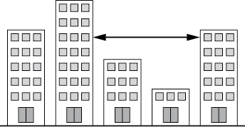
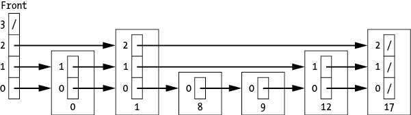
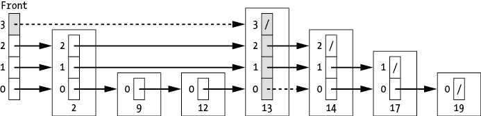
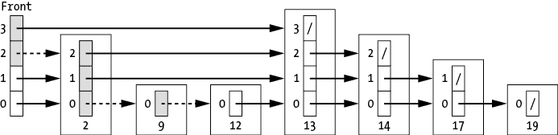
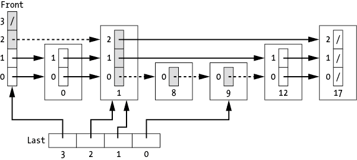

## 跳表


本章介绍了*跳表*，一种带有多个指针的排序链表，它允许我们在进行搜索、插入或删除等操作时，偶尔跳跃到链表中更远的元素。这种跳跃的可能性缓解了链表的一大主要问题——我们必须扫描所有元素才能找到一个目标。跳过一些元素节省了宝贵的时间。

为了理解跳表是如何工作的，可以考虑我每次在看书时丢失位置的策略。为了避免剧透，我不使用二分查找，因为它可能会跳到我还没读过的部分。相反，我从书的开头开始，每次跳过多页——跳得足够大，以免扫描每一页，但又足够小，避免跳得太远破坏了故事情节。我在搜索的开始使用较大的跳跃，但随着接近我停下的位置，我会逐渐改用更小的跳跃。跳表采用了类似的方式，显著改变了链表的行为，使其能够解决之前我们只会交给基于树的数据结构的问题。

跳表由计算机科学家威廉·普赫（William Pugh）提出，是一种概率性数据结构，可以显著提高插入、删除和搜索等操作在*平均*情况下的效率。跳表并不是存储一个单一的链表，而是有效地创建了一层层链表，每层只包含下层链表中的部分节点。这意味着我们从跳表的较高层开始搜索，在这些层中节点较少，并且可以大步跳过不必要的节点。随着我们逐渐接近目标并精细化搜索，我们会在多级层次结构中向下移动。在搜索书籍中的位置时，这就相当于在接近我们最近的位置时，逐渐使用越来越小的跳跃。

我在本书中加入跳表有两个原因。首先，和本书介绍的几乎所有其他数据结构一样，跳表展示了额外的信息或结构如何提供显著的算法优势。在这种情况下，多层链接降低了搜索的成本。第二，也是可能更令人兴奋的，跳表是随机化数据结构。与布隆过滤器（Bloom filters）不同，后者在数据给定的情况下是确定性的，跳表将随机性的使用更进一步：它们的结构本身是通过概率性的方法来决定的，以平衡平均情况下的性能。我们使用随机数生成器来选择每个节点的层级，从而决定它能够跳过多少远的元素。

## 随机化结构与确定性结构

从一个确定性生成的数据结构转变为一个随机化的数据结构引入了复杂性和益处。到目前为止，我们所研究的每个数据结构的结构都完全由我们插入的数据决定。例如，如果我们将相同的数据按相同的顺序插入二叉搜索树，我们总是会得到相同的结构。堆、前缀树、网格、四叉树等结构也一样。即使是两个哈希表或布隆过滤器，如果我们使用相同的哈希函数并插入相同的数据集，它们也将是相同的。

这种确定性可能会在最坏情况的数据面前引发问题。正如我们在第五章中看到的，如果我们从一个空的二叉搜索树开始，并按排序顺序插入元素，那么我们的树实际上会变成一个排序链表。每个节点将只拥有一个子节点，且方向相同。缓解这个问题的一种潜在方法是按随机顺序插入数据。虽然我们仍然可能选择一个不理想的顺序，但这种情况的概率显著降低。

我们可以将这种随机化方法扩展到构建数据结构本身，在每次插入时随机选择参数。我们不再变化数据的顺序，而是变化如何将数据链接到我们的结构中。

一开始，随机化方法可能显得不直观。如果我们不了解输入的分布，我们可能会轻易地为该分布做出糟糕的结构选择。我们可能担心总是会选择最坏的参数。然而，如果我们使用一个好的随机化策略，这种失败的可能性将极为罕见。另一方面，随机化设计可以防止我们做出持续的不优选择。虽然它可能不会导致最优解，但它通常会产生一个合理的解。随机性可以提供良好的平均情况表现，也有助于平滑数据以病态方式到达的情况。

## 引入跳表

正如我们在第三章中看到的，链表上的某些操作本质上受到链表结构的限制。我们不能高效地搜索链表，因为我们不能随机访问元素。这会产生悲惨的后果；即使我们知道节点是有序的，我们也不能使用二分查找。我们被迫沿着指针从一个节点爬行到另一个节点，直到找到目标节点。这一令人沮丧的限制让许多新计算机科学家抓狂，嘀咕着不太友善的话。

跳表通过提供一次跳跃多个条目的能力来缓解这种低效。跳表的核心就是一个带有多层节点的排序链表：

```py
SkipList {
    Integer: top_level
    Integer: max_level
    SkipListNode: front
}
```

字段`top_level`表示当前使用的最高级别，而字段`max_level`表示允许的最高级别。为了简化，我们独立指定`max_level`，这样我们可以在列表开始时预分配一个指针数组。

跳跃列表的复杂性，也因此是其强大的地方，源于节点内部的指针结构。每个节点不仅存储指向列表中下一个节点的单个指针，还具有预定义的层级或*高度*，在该层级中，它存储指向下一个节点的多个指针。层级为 *L* 的节点维护 *L* + 1 个不同的前向指针，每个指针对应一个层级 [0, *L*]。关键的是，层级 *L* 处的指针将当前节点链接到同一高度的下一个节点，这意味着 `next` 中的指针通常会指向不同的跳跃列表节点。

```py
SkipListNode {
    Type: key
    Type: value
    Integer: height
    Array of SkipListNodes: next
}
```

由于跳跃列表的高层包含的节点比低层少，这些高层的节点可以链接得比低层更远。这使得算法可以在较高的层级上跨越更多的节点，从而跳过许多中间节点。随着层级的逐步提高，节点的数量减少，这些链接也跳得越来越远。

想象一下，在跳跃列表中搜索的过程就像通过手电筒在建筑物之间传递消息一样。你能传递消息的距离取决于你所在的楼层以及路径中建筑物的高度。如果你被困在一楼，你只能将消息传递到邻近的建筑物。更远的建筑物会被邻近的建筑物本身阻挡。然而，如果你幸运地处在一座高楼里，你可以越过更近但较矮的建筑物传递消息，正如图 14-1 所示。或者，如果你需要将消息发送给紧邻的邻居，你可以简单地移到最低楼层。



图 14-1：在跳跃列表中节点之间的移动就像是在城市的建筑物之间通过手电筒传递消息一样。

跳跃列表通过概率性地创建这些链接。程序为每个节点分配一个随机高度，这与节点中存储的键无关，并将新节点插入到每个层级的对应列表中。因此，具有高度 0 的节点只会出现在最底层的列表中，而高度为 2 的节点将出现在层级 0、1 和 2 的列表中。图 14-2 展示了这一点。在上述的消息传递示例中，这相当于一座只有一层的建筑与一座有三层的建筑。那座有三层的建筑能够在三个不同的高度上传递消息，可能访问最多三个邻居。



图 14-2：一个跳跃列表的示例

由于较高层的节点提供了跳过更远的能力，越过较低层的节点，我们理想的做法是稀疏使用这些节点，并将它们分布在整个列表中。在消息传递的例子中，我们不希望我们的城市景观只包括相同高度的建筑。我们希望有很多单层建筑，配合一些中层建筑和几座较高的建筑，允许我们将消息跳过街道。通过选择具有正确概率分布的高度，我们可以在平均情况下平衡每一层的密度。*L* + 1 层的节点数量少于*L*层的节点数量。这有助于实现良好的平均性能，并且可以避免其他数据结构中可能出现的最坏情况。

如图 14-2 所示，这个跳表实现使用了一个虚拟节点`front`来存储每一层前面的指针。节点`front`是一个`SkipListNode`，但不包含键或值。将跳表的前端跟踪到一个`SkipListNode`中，使得插入和删除的代码大大简化，正如我们在本章稍后的内容中将看到的那样。

### 跳表搜索

要搜索一个跳表，我们从最上层的前端开始，遍历列表中的节点。根据图 14-2 中的插图，通俗地说，我们从左上角开始，然后向下并向右移动。在每次迭代时，我们检查当前层是否有另一个节点，如果有，检查该节点的键是否小于目标。如果这两个条件都满足，我们就继续移动到当前层的下一个节点。如果任一条件不成立（我们到达了该层的末尾，或者找到了一个键大于或等于目标的节点），我们就下降到下一层并从那里继续搜索。当我们尝试下降到最低层以下时，搜索终止。

```py
SkipListSearch(SkipList: list, Type: target):
    Integer: level = list.top_level
  ❶ SkipListNode: current = list.front

  ❷ WHILE level >= 0:
        WHILE (current.next[level] != null AND
               current.next[level].key < target):
           current = current.next[level]
        level = level - 1

  ❸ SkipListNode: result = current.next[0]
  ❹ IF result != null AND result.key == target:
        return result.value
    ELSE:
        return null
```

跳表搜索的代码从顶层列表的`current`节点开始 ❶。两个嵌套的`WHILE`循环负责遍历。内循环遍历当前的链表，直到遇到链表的末尾（`current.next[level] == null`）或者一个键大于或等于目标的节点（`current.next[level].key >= target`）。外循环每次迭代时下降一级，直到到达列表的底部 ❷。如果目标存在于列表中，它将出现在列表中的下一个节点 ❸。但是，我们必须检查该节点是否存在并且具有正确的键 ❹。当搜索循环结束时，我们可以确保停留在列表中键值*小于*目标的最后一个节点。目标要么是列表中的下一个节点，要么不存在。

考虑在图 14-3 所示的列表中搜索目标 14。我们从第 3 层的前端开始。该层的第一个节点的键值为 13，小于我们的目标，因此我们继续到该节点。此时，我们已经到达了第 3 层的列表末端，无法在此高度进一步前进。下一个节点的指针为 null。

搜索然后下降到第 2 层并继续进行。在这里，我们发现列表中的下一个键值（14）*不*小于我们的目标，因此我们继续下降到第 1 层。第 1 层和第 0 层的条件相同——列表中的下一个键值不小于我们的目标。搜索在完成第 0 层后终止。此时，我们当前节点（键值 = 13）的`next`指针指向目标节点。



图 14-3：在跳表中搜索目标 14。阴影部分的条目和虚线指针表示在搜索过程中遍历的节点。

请注意，尽管我们已经对目标节点进行了多次迭代（在第 2 层、第 1 层和第 0 层），但我们仍然继续搜索直到通过了最底层。这是由于我们在代码中的终止标准。我们可以添加额外的逻辑来更早地停止搜索，但为了简化逻辑，我们在这里保持与后续插入逻辑一致的简化方式。

相比之下，如果我们在相同的列表中搜索目标 12，如图 14-4 所示，我们会在搜索的早期就迅速降到最底层，并在底层继续搜索。



图 14-4：在跳表中搜索目标 12。阴影部分的条目和虚线指针表示在搜索过程中遍历的节点。

我们可以将这次遍历想象成一只松鼠在一排树木之间的导航。它在高处欣赏美景，跳跃着从一棵树到另一棵树，直到到达目标前的树木高度无法再继续跳跃为止。每当有可能时，它会在高大、古老的橡树之间跳跃，飞跃其间较矮的树苗。由于高大的橡树较为稀少，因此它们之间的距离较远，所以松鼠每次跳跃所覆盖的距离较长。从一棵大树的宽大树枝跳到另一棵大树的树枝所需的跳跃次数少于穿越中间的所有小树苗。

然而，松鼠不愿意浪费时间回溯，因此永远不会超越它的目标。最终，松鼠会到达一个地方，在这里，如果它跳到这个高度的下一个树上，它就会超过目标。或者，可能没有更多的同高度树。不管怎样，松鼠叹了口气，勉强降落到较低的树枝层级，然后继续向前。它在下一个层级前进，尽可能跳得更远，享受风景路线，直到它再次遇到需要下降的地方。

### 添加节点

我们用于选择新节点高度的分布方式对跳表的结构和性能有重要影响。如果所有节点都处于相同的层级，无论是最小层级还是最大层级，那么我们的跳表就会退化成一个排序链表，且附带额外的内存开销。更糟糕的是，如果我们将所有高度设置为最大值，我们就会创建多个并行列表，但并没有增加任何搜索效率。理想情况下，我们希望有较少的高节点，并且在每个下层级上节点数量逐渐增加。

William Pugh 最初选择高度的方法是不断使用一个常数概率 *p* 来添加另一个层级。所有节点从 0 层开始。我们不断抛一个加权硬币——选择一个从 0 到 1 的随机数，检查它是否小于 *p*——直到得到一个大于 *p* 的数字或达到最大允许高度。我们计算小于 *p* 的抛掷次数，并将其设为新的层级。例如，我们可以使用 *p* = 0.5，在这种情况下，我们期望大约一半的节点在 *L* 层被提升到 *L* + 1 层。我们可以通过调整 *p* 的值来平衡搜索效率和内存使用。较小的 *p* 值意味着较少的高节点，从而每个节点的指针也更少。我们将节点的高度限制在 `max_level`，以保持与 `front` 节点中预分配数组的一致性。

你可以通过一个不一致的父母回应孩子要求更多糖果的情境来形象化这种方法。当孩子得到糖果时，他们总是得到一块，而之后总是想要更多。每次孩子请求糖果时，父母都会随机（以概率*p*）决定是否满足请求。如果同意，他们就会再给孩子一块糖果。这相当于将节点的高度增加一。自然地，孩子看到自己获胜后，会立刻再次提出请求。这个过程会继续，直到父母最终感到恼火，以概率（1 − *p*）喊出“不给糖果了！”类似地，我们会继续增加节点的高度，直到我们的随机数生成器或最大阈值告诉我们要完全停止。

向跳表中添加节点的过程与搜索目标节点的流程相同：我们向下和向右移动，寻找插入新节点的位置。事实上，我们可以重用搜索的基本结构来进行插入。我们只需要跟踪一个额外的数据：每个层级中可以指向新节点的最后一个节点。

```py
SkipListInsert(SkipList: list, Type: key, Type: value):
    Integer: level = list.top_level
  ❶ SkipListNode: current = list.front
  ❷ Array: last = a size list.max_level + 1 array of SkipListNode pointers 
                  initially set to list.front for all levels.

  ❸ WHILE level >= 0:
      ❹ WHILE (current.next[level] != null AND
               current.next[level].key < key):
           current = current.next[level]
      ❺ last[level] = current
        level = level - 1

    SkipListNode: result = current.next[0]
  ❻ IF result != null AND result.key == key:
       result.value = value
       return

  ❼ Integer: new_level = pick a random level
  ❽ IF new_level > list.top_level:
        list.top_level = new_level
    SkipListNode: new_node = SkipListNode(key, value, new_level)

    Integer: j = 0
  ❾ WHILE j <= new_level:
         new_node.next[j] = last[j].next[j]
         last[j].next[j] = new_node
         j = j + 1
```

我们从列表的左上角开始（`list.front` 的 `list.top_level`） ❶。通过一对嵌套的 `WHILE` 循环，我们在寻找插入节点的正确位置时向下和向右移动。外层 `WHILE` 循环 ❸ 遍历列表的各个层级，保存每个层级看到的最后一个节点，然后下降到下一个层级。内层 `WHILE` 循环 ❹ 遍历跳表，每当当前层级的另一个节点的键值小于我们的目标时，就向前移动。

数组 `last` 中的每个条目一开始都指向 `list.front`，表示该节点被插入到列表的最前端 ❷。我们会在每个层级下降时更新 `last` ❺，因为我们发现该层级的下一个节点的键值大于或等于要插入的键值（或者下一个节点为 `null`），因此我们需要在该节点之前插入。如果在遍历跳表时恰好找到一个匹配的键值，我们只需更新该键的相关数据 ❻。这意味着，像我们的其他数据结构一样，我们的跳表实现将每个键视为唯一。

当我们找到正确的插入位置时，我们为该节点选择一个随机的层级 ❼。正如我们之前讨论的，选择这个高度的概率分布会对跳表的结构和性能产生重大影响。由于我们将新层级限制为小于 `list.max_level`，我们避免了对 `last` 数组的无效访问。我们检查所选层级是否代表列表的新顶部层级，如果是，则更新 `list.top_level` ❽。

最后，代码使用 `WHILE` 循环更新指针，将新节点的指针指向正确的下一个节点 ❾。然后，它更新 `last` 中列出的每个节点，将它们的指针指向我们的新节点。在这里，我们可以看到使用虚拟节点 `front`（具有最大高度）来存储指向列表开头的指针的好处。我们可以像更新任何其他节点一样跟踪并更新这个“列表前端”位置。这大大简化了代码。

图 14-5 显示了我们如何将键值 10 插入到一个示例跳表中。阴影节点表示在搜索过程中我们遍历的条目。



图 14-5：将键值 10 插入跳表。数组 `last` 跟踪插入节点前的节点。

通过追踪每一层级上位于目标节点*之前*的最后一个节点，我们实际上在追踪哪个节点需要指向新的节点。随着我们遍历列表，我们记录下需要插入新链接的位置。在每一层级，我们会到达一个位置，其中下一个键值大于或等于我们的新键值，然后我们就可以喊道：“我看到了需要插入新节点的位置，就在这个节点后面！”接着我们会下移到下一层继续工作。当搜索阶段到达底层时，我们已经完整记录了所有需要调整前向指针的节点。

### 删除节点

从跳表中删除节点几乎遵循与插入节点相同的算法。我们首先搜索跳表以找到删除目标，同时追踪每一层级上位于目标节点*之前*的最后一个节点。一旦搜索阶段完成，我们更新这些先前节点的列表以删除我们要删除的节点。

```py
SkipListDelete(SkipList: list, Type: target):
    Integer: level = list.top_level
  ❶ SkipListNode: current = list.front
    Array: last = a size list.max_level + 1 array of SkipListNode pointers 
                  initially set to list.front for all levels.

  ❷ WHILE level >= 0:
        WHILE (current.next[level] != null AND
 current.next[level].key < target):
           current = current.next[level]
        last[level] = current
        level = level - 1

  ❸ SkipListNode: result = current.next[0]
    IF result == null OR result.key != target:
        return

    level = result.height
    Integer: j = 0
  ❹ WHILE j <= level:
         last[j].next[j] = result.next[j]
         result.next[j] = null
         j = j + 1

  ❺ IF level == list.top_level:
        Integer: top = list.top_level
        WHILE top > 0 AND list.front.next[top] == null:
             top = top - 1
        list.top_level = top
```

删除代码的初始块与插入代码相同。我们从列表的左上角开始 ❶。一对嵌套的`WHILE`循环 ❷ 会在每一层级上进行搜索，直到我们遇到一个键值大于或等于`target`的节点，或者遇到列表的末尾（`null`）。此时，我们记录下最后访问的节点，并下移到下一层继续搜索。在搜索结束时，我们检查是否找到一个`key`与`target`匹配的节点 ❸。否则，跳表中没有匹配项，因此没有节点可供删除。

为了删除识别出的节点，我们使用一个`WHILE`循环 ❹ 来简单地链接跳表中每个节点的`last`节点的`next`指针，使其指向当前节点之后的节点：`last[j].next[j] = result.next[j]`，对于所有层级`j`。这将把我们的节点从列表中剪切掉。我们还将`result.next[j]`设置为`null`，因为`result`不再在列表中。

最后，我们需要检查跳表的顶部层级是否仍然有效 ❺。如果我们删除了唯一一个高度为`top_level`的节点，那么`top_level`应该减小，以反映当前的最大高度。我们可以通过沿着`front`节点向下，并检查`next`指针，直到找到一个不为`null`的指针，来更新`top_level`。在我们的删除函数中的最后一段代码，会在需要时更新列表的顶部层级。它找到第一个层级，其中我们的虚拟前端节点指向一个有效的数据节点。如果列表为空，我们就默认将顶部层级设为零。

再次，我们可以通过我们如何查看下一个节点并维护需要更新的节点列表来形象化删除所需的初始搜索。在每一层，我们识别需要删除的节点（如果它存在），同时仍停留在该层的前一个节点。下一个节点的键值大于或等于我们需要删除的键值。我们暂停：“我最好标记下这个当前节点，因为我将需要修改它的指针来跳过被删除的节点。”我们将当前节点的指针记录在`last`中，并继续前往下一层。在我们的旅程结束时，我们已经收集了一个完整的需要更新指针的节点列表。

## 执行时间

搜索、插入和删除操作的成本将取决于节点的位置和高度分布。在理想情况下，*L*层的节点将包含*L* − 1 层的每隔一个节点。我们在每一层丢弃一半的节点，并将它们均匀地分布开来。在这种情况下，跳表的行为与二叉搜索相似。我们可以通过查看顶层的单个节点来修剪掉一半的搜索空间。然后，我们再下降一层，再次将空间减半。因此，在最好的情况下，我们的性能将在条目数量上呈对数增长。

跳表的最坏情况性能与标准链表相当——它与节点数量成线性比例。如果列表中的每个节点都具有相同的高度，那么我们的跳表就只是一个排序链表。我们被迫按顺序扫描每个节点，以找到给定的目标。

假设我们使用了良好的高度概率分布，比如之前描述的 Pugh 原始技术（其中*p* = 0.5），那么插入、删除和搜索的*预期*成本都会随着条目数量的对数级别增长。与最坏情况成本不同，预期成本提供了数据结构在平均情况下的性能估计。这使得跳表的平均性能与二叉搜索树相当。

## 为什么这很重要

跳表旨在作为平衡搜索树的简单替代方案，它是另一种动态数据结构，能够实现高效的搜索。然而，与我们为此任务应用的其他算法不同，包括排序数组和二叉搜索树，跳表依赖于随机化结构来提供良好的性能。我们常见操作——搜索、插入和删除的*预期*计算成本——是列表大小的对数级别。

这自然引出了一个问题：为什么我们要把算法的性能寄托于随机化行为上？我们很容易遇到高节点聚集的情况，或者高度分布过于平坦的情况。然而，二叉搜索树也有类似的问题。如果我们以次优顺序插入和删除节点，最终可能会得到一个链表结构的树节点。在更复杂的二叉搜索树扩展中，可以通过避免这种最坏情况的发生来解决问题，而跳表则依赖随机化来避免糟糕的表现。作为交换，跳表使用了更简单的代码。因此，跳表展示了随机化如何同时提供对坏数据的强大防御和数据结构实现的简洁性。
