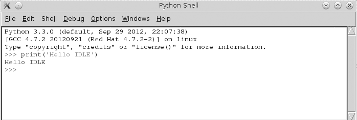
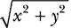
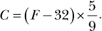
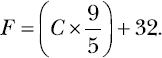
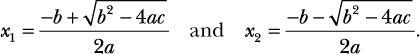
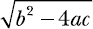

## 第一章：**与数字打交道**


让我们迈出使用 Python 探索数学和科学世界的第一步。现在我们保持简单，帮助你掌握如何使用 Python 本身。我们将从执行基本的数学运算开始，然后编写简单的程序来操作和理解数字。让我们开始吧！

### **基本数学运算**

*Python 交互式 shell* 将成为我们在本书中的好朋友。启动 Python 3 IDLE shell 并打个“招呼”（见 图 1-1），通过输入 `print('Hello IDLE')` 然后按 ENTER。 （有关如何安装 Python 和启动 IDLE 的说明，请参见 附录 A）。IDLE 会执行你的命令并将文字打印回屏幕。恭喜——你刚刚编写了一个程序！

当你再次看到 `>>>` 提示符时，IDLE 准备好接受更多指令。



*图 1-1：Python 3 IDLE shell*

Python 可以像一个高级计算器一样进行简单的计算。只需输入表达式，Python 就会评估它。按下 ENTER 后，结果会立即显示。

试试吧。你可以使用加法（`+`）和减法（`–`）运算符来进行加减法运算。例如：

```py
>>> 1 + 2
3
>>> 1 + 3.5
4.5
>>> -1 + 2.5
1.5
>>> 100 – 45
55
>>> -1.1 + 5
3.9
```

要进行乘法运算，使用乘法（`*`）运算符：

```py
>>> 3 * 2
6
>>> 3.5 * 1.5
5.25
```

要进行除法运算，使用除法（`/`）运算符：

```py
>>> 3 / 2
1.5
>>> 4 / 2
2.0
```

如你所见，当你让 Python 执行除法运算时，它还会返回数字的小数部分。如果你希望结果是整数形式，并去掉任何小数值，你应该使用 floor 除法（`//`）运算符：

```py
>>> 3 // 2
1
```

floor 除法运算符将第一个数字除以第二个数字，然后将结果向下舍入到下一个最小整数。当其中一个数字为负时，这个操作会变得有趣。例如：

```py
>>> -3 // 2
-2
```

最终结果是除法操作结果的下一个整数（`-3/2 = -1.5`，因此最终结果为 `-2`）。

另一方面，如果你只需要余数，应该使用模运算符（`%`）：

```py
>>> 9 % 2
1
```

你可以使用指数（`**`）运算符计算数字的幂。以下示例演示了这一点：

```py
>>> 2 ** 2
4
>>> 2 ** 10
1024
>>> 1 ** 10
1
```

我们还可以使用指数符号来计算小于 1 的幂。例如，数字 *n* 的平方根可以表示为 *n*^(1/2)，立方根可以表示为 *n*^(1/3)：

```py
>>> 8 ** (1/3)
2.0
```

正如这个例子所示，你可以使用括号将数学运算结合成更复杂的表达式。Python 将按照标准的 *PEMDAS* 规则来评估表达式的计算顺序——括号、指数、乘法、除法、加法和减法。考虑以下两个表达式——一个没有括号，一个有括号：

```py
>>> 5 + 5 * 5
30
>>> (5 + 5) * 5
50
```

在第一个例子中，Python 先进行乘法运算：5 乘以 5 得 25；25 加 5 得 30。在第二个例子中，括号内的表达式首先被评估，正如我们所期望的那样：5 加 5 得 10；10 乘以 5 得 50。

这些是在 Python 中操作数字的基本知识。现在让我们学习如何将数字赋予名称。

### **标签：为数字附加名称**

随着我们开始设计更复杂的 Python 程序，我们会给数字赋予名称——有时是为了方便，但大多数时候是出于必要性。这里有一个简单的例子：

```py
➊ >>> a = 3
   >>> a + 1
   4
➋ >>> a = 5
   >>> a + 1
   6
```

在 ➊，我们将名称 `a` 赋给数字 3。当我们让 Python 计算表达式 `a + 1` 的结果时，它看到 `a` 所代表的数字是 3，然后它加上 1 并显示结果（4）。在 ➋，我们将 `a` 的值改为 5，这个变化反映在第二次加法操作中。使用名称 `a` 很方便，因为你可以简单地改变 `a` 所指向的数字，之后每次引用 `a` 时，Python 都会使用这个新的值。

这种名称被称为*标签*。你可能在其他地方接触过术语 *变量* 来描述相同的概念。然而，考虑到 *变量* 也是一个数学术语（用于表示像 *x* 这样的东西，比如在方程 *x* + 2 = 3 中），在本书中我仅在数学方程和表达式的上下文中使用术语 *变量*。

### **不同种类的数字**

你可能注意到，我用两种不同的数字来演示数学运算——没有小数点的数字，你已经知道是*整数*，以及带有小数点的数字，程序员称之为*浮点数*。我们人类在识别和处理数字时，无论它们是以整数、浮点小数、分数还是罗马数字形式出现，都不会遇到问题。但在我们在本书中编写的一些程序中，只对某种特定类型的数字执行任务才有意义，因此我们通常需要编写一些代码，检查我们输入的数字是否属于正确的类型。

Python 将整数和浮点数视为不同的*类型*。如果你使用 `type()` 函数，Python 会告诉你你输入的数字是哪种类型。例如：

```py
>>> type(3)
<class 'int'>

>>> type(3.5)
<class 'float'>

>>> type(3.0)
<class 'float'>
```

在这里，你可以看到 Python 将数字 3 分类为整数（类型 `'int'`），而将 3.0 分类为浮点数（类型 `'float'`）。我们都知道 3 和 3.0 在数学上是等价的，但在许多情况下，Python 会将这两个数字视为不同的类型。

本章中我们编写的一些程序只有在输入为整数时才能正确工作。正如我们刚才看到的，Python 不会将像 1.0 或 4.0 这样的数字识别为整数，所以如果我们想让这些数字在程序中作为有效输入，我们需要将它们从浮点数转换为整数。幸运的是，Python 中有一个内置函数可以完成这项转换：

```py
>>> int(3.8)
3
>>> int(3.0)
3
```

函数 `int()` 接受输入的浮点数字，去掉小数点后的部分，并返回结果整数。`float()` 函数类似，用于执行反向转换：

```py
>>> float(3)
3.0
```

`float()` 函数接收输入的整数，并在其后添加小数点，将其转换为浮动点数。

#### ***分数操作***

Python 也可以处理分数，但为了实现这一点，我们需要使用 Python 的 `fractions` 模块。你可以将*模块*视为他人编写的程序，你可以在自己的程序中使用。一个模块可以包含类、函数，甚至是标签定义。它可以是 Python 的标准库的一部分，或者来自第三方的位置。在后一种情况下，你需要在使用之前先安装该模块。

`fractions` 模块是标准库的一部分，这意味着它已经安装好了。它定义了一个 `Fraction` 类，我们将使用这个类将分数输入到程序中。在使用之前，我们需要先*导入*它，这是一种告诉 Python 我们希望使用该模块中类的方法。让我们看一个简单的例子——我们将创建一个新标签 `f`，它表示分数 3/4：

```py
➊ >>> from fractions import Fraction
➋ >>> f = Fraction(3, 4)
➌ >>> f
   Fraction(3, 4)
```

我们首先从 `fractions` 模块导入 `Fraction` 类 ➊。接下来，我们通过传入分子和分母作为参数来创建该类的一个对象 ➋。这将创建一个表示分数 3/4 的 `Fraction` 对象。当我们打印该对象 ➌ 时，Python 会以 `Fraction(numerator, denominator)` 的形式显示该分数。

基本的数学运算，包括比较运算，对于分数都是有效的。你还可以将分数、整数和浮动点数结合在一个表达式中：

```py
>>> Fraction(3, 4) + 1 + 1.5
3.25
```

当表达式中包含浮动点数时，表达式的结果将返回浮动点数。

另一方面，当表达式中只有分数和整数时，结果将是分数，即使结果的分母为 1。

```py
>>> Fraction(3, 4) + 1 + Fraction(1/4)
Fraction(2, 1)
```

现在你已经了解了在 Python 中使用分数的基本知识。接下来我们将介绍另一种数字类型。

#### ***复数***

到目前为止，我们看到的数字是所谓的*实数*。Python 还支持*复数*，其虚部用字母 *j* 或 *J* 表示（而不是数学符号中使用的字母 *i*）。例如，复数 2 + 3*i* 在 Python 中将写作 2 + 3*j*：

```py
>>> a = 2 + 3j
>>> type(a)
<class 'complex'>
```

如你所见，当我们在复数上使用 `type()` 函数时，Python 会告诉我们这是一个 `complex` 类型的对象。

你也可以使用 `complex()` 函数来定义复数：

```py
>>> a = complex(2, 3)
>>> a
(2 + 3j)
```

在这里，我们将复数的实部和虚部分别作为两个参数传递给 `complex()` 函数，它会返回一个复数。

你可以像处理实数一样处理复数的加法和减法：

```py
>>> b = 3 + 3j
>>> a + b
(5 + 6j)
>>> a - b
(-1 + 0j)
```

复数的乘法和除法也采用类似的方式进行：

```py
>>> a * b
(-3 + 15j)
>>> a / b
(0.8333333333333334 + 0.16666666666666666j)
```

模运算符（`%`）和地板除法（`//`）运算符对复数无效。

复数的实部和虚部可以通过其 `real` 和 `imag` 属性来获取，如下所示：

```py
>>> z = 2 + 3j
>>> z.real
2.0
>>> z.imag
3.0
```

复数的*共轭*具有相同的实部，但虚部的大小相同并且符号相反。它可以通过`conjugate()`方法获得：

```py
>>> z.conjugate()
(2 - 3j)
```

实部和虚部都是浮点数。使用实部和虚部，你可以使用以下公式计算复数的*大小*，其中*x*和*y*分别是复数的实部和虚部：。在 Python 中，这样写：

```py
>>> (z.real ** 2 + z.imag ** 2) ** 0.5
3.605551275463989
```

找到复数的大小的一种更简单的方法是使用`abs()`函数。`abs()`函数在传入实数时返回绝对值。例如，`abs(5)`和`abs(-5)`都返回 5。然而，对于复数，它返回的是复数的大小：

```py
>>> abs(z)
3.605551275463989
```

标准库的`cmath`模块（`cmath`代表*复数数学*）提供了许多其他专门的函数，用于处理复数。

### **获取用户输入**

当我们开始编写程序时，拥有一个简单的方式通过`input()`函数接受用户输入会非常有帮助。这样，我们可以编写要求用户输入数字、对数字执行特定操作并显示操作结果的程序。让我们看看它的实际应用：

```py
➊ >>> a = input()
➋ 1
```

在➊处，我们调用了`input()`函数，它会等待你输入内容，如➋所示，按下 ENTER 键。输入的内容会存储在`a`中：

```py
   >>> a
➌ '1'
```

注意在➌处 1 周围的单引号。`input()`函数返回的输入是一个*字符串*。在 Python 中，字符串是任何位于两个引号之间的字符集合。当你想创建一个字符串时，可以使用单引号或双引号：

```py
>>> s1 = 'a string'
>>> s2 = "a string"
```

在这里，`s1`和`s2`都指向相同的字符串。

即使字符串中的唯一字符是数字，Python 也不会将该字符串视为数字，除非我们去除这些引号。因此，在进行任何数学运算之前，我们需要将其转换为正确的数字类型。字符串可以分别通过`int()`或`float()`函数转换为整数或浮点数：

```py
>>> a = '1'
>>> int(a) + 1
2
>>> float(a) + 1
2.0
```

这些是我们之前看到的相同的`int()`和`float()`函数，但这次它们不是将输入从一种数字类型转换为另一种，而是将一个字符串作为输入（如`'1'`）并返回一个数字（`2`或`2.0`）。然而，需要注意的是，`int()`函数不能将包含浮点小数的字符串转换为整数。如果你将一个包含浮点数的字符串（如`'2.5'`甚至`'2.0'`）传递给`int()`函数，它会返回一个错误信息：

```py
>>> int('2.0')
Traceback (most recent call last):

  File "<pyshell#26>", line 1, in <module>
    int('2.0')
ValueError: invalid literal for int() with base 10: '2.0'
```

这是一个*异常*的例子——Python 用来告诉你，由于错误它无法继续执行程序。在这种情况下，异常的类型是`ValueError`。（有关异常的快速复习，请参见附录 B）

类似地，当你输入像 3/4 这样的分数时，Python 无法将其转换为等效的浮点数或整数。再次出现 `ValueError` 异常：

```py
>>> a = float(input())
3/4
Traceback (most recent call last):
  File "<pyshell#25>", line 1, in <module>
    a=float(input())
ValueError: could not convert string to float: '3/4'
```

你可能会发现将转换操作放在 `try...except` 块中很有用，这样你就可以*处理*这个异常，并提醒用户程序遇到了无效输入。接下来，我们将讨论 `try...except` 块。

#### ***处理异常和无效输入***

如果你不熟悉 `try...except`，其基本思想是这样的：如果你在 `try...except` 块中执行一个或多个语句，并且执行时发生了错误，程序不会崩溃并打印出 `Traceback`。相反，执行会转移到 `except` 块，在这里你可以执行适当的操作，例如打印一条有帮助的错误信息或尝试其他方法。

这是如何在 `try...except` 块中执行上述转换并在输入无效时打印有帮助的错误信息：

```py
>>> try:
        a = float(input('Enter a number: '))
except ValueError:
        print('You entered an invalid number')
```

请注意，我们需要指定要处理的异常类型。在这里，我们要处理 `ValueError` 异常，所以我们指定为 `except ValueError`。

现在，当你输入无效的内容时，例如 3/4，它会打印出一个有帮助的错误信息，如 ➊ 所示：

```py
   Enter a number: 3/4
➊ You entered an invalid number
```

你还可以在 `input()` 函数中指定一个提示信息，告诉用户期望的输入类型。例如：

```py
>>> a = input('Input an integer: ')
```

用户现在会看到提示信息，提示输入一个整数：

```py
Input an integer: 1
```

在本书的许多程序中，我们会要求用户输入一个数字，因此我们必须确保在执行任何操作之前处理好转换。你可以将输入和转换结合在一条语句中，如下所示：

```py
>>> a = int(input())
1
>>> a + 1
2
```

如果用户输入的是整数，这个方法运行得非常好。但正如我们之前看到的，如果输入的是浮点数（即使是与整数等价的数字，比如 1.0），这会导致错误：

```py
>>> a = int(input())
1.0
Traceback (most recent call last):
  File "<pyshell#42>", line 1, in <module>
    a=int(input())
ValueError: invalid literal for int() with base 10: '1.0'
```

为了避免这个错误，我们可以像之前处理分数那样设置一个 `ValueError` 捕获机制。这样，程序就会捕获浮点数，这在处理整数的程序中是不可行的。然而，它也会标记像 1.0 和 2.0 这样的数字，虽然 Python *视为* 浮点数，但它们等价于整数，如果按正确的 Python 类型输入，它们完全能正常工作。

为了避免这个问题，我们将使用 `is_integer()` 方法来过滤掉小数点后有有效数字的数字。（此方法仅适用于 Python 中的 `float` 类型数字；它无法处理已经以整数形式输入的数字。）

这是一个例子：

```py
>>> 1.1.is_integer()
False
```

在这里，我们调用 `is_integer()` 方法来检查 1.1 是否为整数，结果是 `False`，因为 1.1 确实是浮点数。另一方面，当使用 1.0 这个浮点数调用该方法时，结果是 `True`：

```py
>>> 1.0.is_integer()
True
```

我们可以使用 `is_integer()` 来过滤掉非整数输入，同时保留像 1.0 这样的输入，虽然它是浮点数表示，但与整数等价。稍后我们将看到该方法如何融入一个更大的程序中。

#### ***分数和复数作为输入***

我们之前学习过的 `Fraction` 类也可以将类似 `'3/4'` 的字符串转换为 `Fraction` 对象。实际上，这就是我们接受分数作为输入的方式：

```py
>>> a = Fraction(input('Enter a fraction: '))
Enter a fraction: 3/4
>>> a
Fraction(3, 4)
```

尝试输入一个分数，如 3/0：

```py
>>> a = Fraction(input('Enter a fraction: '))
Enter a fraction: 3/0
Traceback (most recent call last):
  File "<pyshell#2>", line 1, in <module>
    a = Fraction(input('Enter a fraction: '))
  File "/usr/lib64/python3.3/fractions.py", line 167, in __new__
    raise ZeroDivisionError('Fraction(%s, 0)' % numerator)
ZeroDivisionError: Fraction(3, 0)
```

`ZeroDivisionError` 异常消息告诉你（如你所知），分母为 0 的分数是无效的。如果你计划让用户在你的程序中输入分数作为输入，最好总是捕获此类异常。以下是你如何处理类似情况的示例：

```py
>>> try:
        a = Fraction(input('Enter a fraction: '))
except ZeroDivisionError:
        print('Invalid fraction')

Enter a fraction: 3/0
Invalid fraction
```

现在，每当程序的用户输入一个分母为 0 的分数时，它会打印出 `Invalid fraction` 消息。

同样，`complex()` 函数可以将类似 `'2+3j'` 的字符串转换为复数：

```py
>>> z = complex(input('Enter a complex number: '))
Enter a complex number: 2+3j
>>> z
(2+3j)
```

如果你输入的字符串是 `'2 + 3j'`（带有空格），将会导致 `ValueError` 错误消息：

```py
>>> z = complex(input('Enter a complex number: '))
Enter a complex number: 2 + 3j
Traceback (most recent call last):
  File "<pyshell#43>", line 1, in <module>
    z = complex(input('Enter a complex number: '))
ValueError: complex() arg is a malformed string
```

在将字符串转换为复数时，像我们对其他数字类型所做的那样，捕获 `ValueError` 异常是一个好主意。

### **编写为你做数学运算的程序**

现在我们已经学习了一些基本概念，我们可以将它们与 Python 的条件语句和循环语句结合起来，编写一些稍微复杂一些的有用程序。

#### ***计算整数的因子***

当一个非零整数 `a` 能够整除另一个整数 `b` 并且余数为 0 时，称 `a` 为 `b` 的 *因子*。例如，2 是所有偶数的因子。我们可以编写如下函数来判断一个非零整数 `a` 是否是另一个整数 `b` 的因子：

```py
>>> def is_factor(a, b):
        if b % a == 0:
            return True
        else:
            return False
```

我们使用本章前面介绍的 `%` 运算符来计算余数。如果你曾经问过类似“4 是 1024 的因子吗？”这样的问题，你可以使用 `is_factor()` 函数：

```py
>>> is_factor(4, 1024)
True
```

对于任何正整数 *n*，我们如何找到它的所有正因子？对于从 1 到 *n* 之间的每个整数，我们检查将 *n* 除以该整数后的余数。如果余数为 0，它就是一个因子。我们将使用 `range()` 函数编写一个程序，遍历 1 到 *n* 之间的每个数字。

在编写完整程序之前，让我们先看看 `range()` 是如何工作的。`range()` 函数的典型用法如下：

```py
>>> for i in range(1, 4):
        print(i)
1
2
3
```

在这里，我们设置了一个`for`循环，并给`range()`函数传递了两个参数。`range()`函数从作为第一个参数给定的整数（*起始值*）开始，一直到第二个参数给定的整数的*前一个*整数（*停止值*）。在这个例子中，我们告诉 Python 打印出这个范围内的数字，从 1 开始，停在 4 之前。注意，这意味着 Python 不会打印 4，因此它打印的最后一个数字是停止值之前的那个数字（3）。同样需要注意的是，`range()`函数只接受整数作为其参数。

你也可以在不指定起始值的情况下使用`range()`函数，这时默认的起始值为 0。例如：

```py
>>> for i in range(5):
        print(i)
0
1
2
3
4
```

`range()`函数产生的两个连续整数之间的差值被称为*步长值*。默认情况下，步长值为 1。如果你想指定不同的步长值，可以将其作为第三个参数来指定（当你指定步长值时，起始值*不是*可选的）。例如，下面的程序打印出小于 10 的奇数：

```py
>>> for i in range(1,10,2):
        print(i)
1
3
5
7
9
```

好的，现在我们已经了解了`range()`函数的工作原理，我们可以开始编写一个计算因子的程序了。因为我要写一个比较长的程序，所以我不在交互式的 IDLE 提示符中编写程序，而是使用 IDLE 编辑器。在 IDLE 中，你可以通过选择**文件**▸**新建窗口**来启动编辑器。注意，我们在代码中开始时用三个连续的单引号（`'`）来注释代码。单引号之间的文本不会被 Python 执行，它只是供我们人类参考的注释。

```py
   '''
   Find the factors of an integer
   '''

   def factors(b):

➊     for i in range(1, b+1):
           if b % i == 0:
               print(i)

   if __name__ == '__main__':

       b = input('Your Number Please: ')
       b = float(b)

➋     if b > 0 and b.is_integer():
           factors(int(b))
       else:
           print('Please enter a positive integer')
```

`factors()`函数定义了一个`for`循环，使用`range()`函数迭代从 1 到输入整数之间的每个整数，在➊处迭代。这里，我们想要迭代到用户输入的整数`b`，所以停止值设置为`b+1`。对于每一个整数`i`，程序会检查它是否能整除输入的数字，并在能够整除时打印该整数。

当你运行这个程序（通过选择**运行**▸**运行模块**），它会要求你输入一个数字。如果你的数字是一个正整数，它会打印出这个数字的因子。例如：

```py
Your Number Please: 25
1
5
25
```

如果你输入一个非整数或负整数作为输入，程序会打印一条错误信息，要求你输入一个正整数：

```py
Your Number Please: 15.5
Please enter a positive integer
```

这是一个例子，展示了我们如何通过在程序中检查无效输入来让程序更具用户友好性。因为我们的程序仅适用于查找正整数的因子，所以我们使用`is_integer()`方法➋来检查输入的数字是否大于 0 且为整数，从而确保输入有效。如果输入的不是正整数，程序会打印一条用户友好的提示信息，而不是一个错误信息。

#### ***生成乘法表***

考虑三个数字，*a*、*b* 和 *n*，其中 *n* 是一个整数，满足

*a* × *n* = *b*。

我们可以在这里说 *b* 是 *a* 的 *n* 次倍数。例如，4 是 2 的第二个倍数，1024 是 2 的第 512 个倍数。

一个数字的乘法表列出了该数字的所有倍数。例如，2 的乘法表如下（这里展示前三个倍数）：

2 × 1 = 2

2 × 2 = 4

2 × 3 = 6

我们的下一个程序会生成用户输入的任意数字的乘法表，最高到 10。在这个程序中，我们将使用 `format()` 方法配合 `print()` 函数，以帮助使程序的输出看起来更加美观和易读。如果你以前没有见过这个方法，我现在简要说明一下它是如何工作的。

`format()` 方法允许你插入标签并设置它们，以便它们以漂亮、可读的字符串格式打印出来，并且加上一些额外的格式化。例如，如果我有一个我在杂货店买的所有水果的名字，每个名字都有单独的标签，并且我想把它们打印成一个连贯的句子，我可以使用 `format()` 方法，像这样：

```py
>>> item1 = 'apples'
>>> item2 = 'bananas'
>>> item3 = 'grapes'
>>> print('At the grocery store, I bought some {0} and {1} and {2}'.format(item1, item2, item3))
At the grocery store, I bought some apples and bananas and grapes
```

首先，我们创建了三个标签（`item1`、`item2` 和 `item3`），每个标签对应一个不同的字符串（`apples`、`bananas` 和 `grapes`）。然后，在 `print()` 函数中，我们输入了一个包含三个占位符的字符串，分别是 `{0}`、`{1}` 和 `{2}`。接着我们使用 `.format()`，它包含了我们创建的三个标签。这告诉 Python 用这些标签中存储的值按顺序替换这些占位符，从而 Python 会打印出文本，`{0}` 被第一个标签替换，`{1}` 被第二个标签替换，以此类推。

不一定需要有标签来指向我们想要打印的值。我们也可以直接将值输入到 `.format()` 中，像下面这个例子：

```py
>>> print('Number 1: {0} Number 2: {1} '.format(1, 3.578))
Number 1: 1 Number 2: 3.578
```

请注意，位置占位符的数量和标签或值的数量必须相等。

现在我们已经了解了 `format()` 是如何工作的，我们可以来看看我们乘法表打印程序的代码：

```py
   '''
   Multiplication table printer
   '''

   def multi_table(a):

➊     for i in range(1, 11):
           print('{0} x {1} = {2}'.format(a, i, a*i))

   if __name__ == '__main__':
       a = input('Enter a number: ')
       multi_table(float(a))
```

函数 `multi_table()` 实现了程序的主要功能。它接收一个参数 `a`，这个参数是将要打印乘法表的数字。因为我们想打印从 1 到 10 的乘法表，所以我们在 ➊ 处有一个 `for` 循环，它会遍历这些数字，打印出该数字和 `a` 的乘积。

当你执行程序时，它会要求你输入一个数字，然后程序打印出该数字的乘法表：

```py
Enter a number : 5
5.0 x 1 = 5.0
5.0 x 2 = 10.0
5.0 x 3 = 15.0
5.0 x 4 = 20.0
5.0 x 5 = 25.0
5.0 x 6 = 30.0
5.0 x 7 = 35.0
5.0 x 8 = 40.0
5.0 x 9 = 45.0
5.0 x 10 = 50.0
```

看看这张表格多么整齐和有序？这正是因为我们使用了 `.format()` 方法按可读的、统一的模板打印了输出。

你可以使用 `format()` 方法进一步控制数字的打印方式。例如，如果你想显示只有两位小数的数字，可以通过 `format()` 方法来指定。下面是一个例子：

```py
>>> '{0}'.format(1.25456)
'1.25456'
>>> '{0:.2f}'.format(1.25456)
'1.25'
```

上面的第一个格式语句仅仅是按照我们输入的方式打印数字。在第二个语句中，我们修改了占位符为`{0:.2f}`，意味着我们只想保留小数点后两位，`f`表示浮动小数点数。如你所见，接下来的输出中只有两个小数位。请注意，如果小数点后有比指定更多的数字，数字会四舍五入。例如：

```py
>>> '{0:.2f}'.format(1.25556)
'1.26'
```

这里，1.25556 被四舍五入到最接近的百分位，并打印为 1.26。如果你使用`.2f`并且你要打印的数字是整数，零会被加在末尾：

```py
>>> '{0:.2f}'.format(1)
'1.00'
```

添加两个零是因为我们指定了要在小数点后打印出恰好两个数字。

#### ***单位转换***

国际单位制定义了七个*基本量*。这些基本量用于推导其他量，称为*导出量*。长度（包括宽度、高度和深度）、时间、质量和温度是七个基本量中的四个。每个基本量都有一个标准的计量单位：米、秒、千克和开尔文，分别对应。

但这些标准计量单位也有多个非标准的计量单位。你更熟悉将温度报告为 30 摄氏度或 86 华氏度，而不是 303.15 开尔文。这是否意味着 303.15 开尔文比 86 华氏度热三倍？当然不是！我们不能仅通过数值比较 86 华氏度和 303.15 开尔文，因为它们使用了不同的计量单位，尽管它们衡量的是相同的物理量——温度。只有当物理量的两个测量值使用相同的计量单位时，才能进行比较。

不同计量单位之间的转换可能比较复杂，这也是为什么在高中时你经常被要求解决涉及单位转换的问题。这是测试你基本数学技能的好方法。但 Python 也有很多数学技能，而且与一些高中生不同，它不会在循环中反复进行数值计算时感到疲倦！接下来，我们将探索编写程序来为你执行这些单位转换。

我们从长度开始。在美国和英国，英寸和英里通常用于衡量长度，而大多数其他国家使用厘米和公里。

一英寸等于 2.54 厘米，你可以使用乘法运算将英寸单位转换为厘米单位。然后，你可以将厘米单位的测量值除以 100 以得到米单位的测量值。例如，下面是如何将 25.5 英寸转换为米：

```py
>>> (25.5 * 2.54) / 100
0.6476999999999999
```

另一方面，一英里大约等于 1.609 公里。所以如果你看到目的地距离 650 英里，你实际上是 650 × 1.609 公里远：

```py
>>> 650 * 1.609
1045.85
```

现在，让我们看看*温度*转换——将温度从华氏度转换为摄氏度，反之亦然。用华氏度表示的温度可以使用公式转换为其等效的摄氏度值。



*F* 是华氏温度，*C* 是其等效的摄氏温度。你知道 98.6 华氏度是正常人体体温。要找出其对应的摄氏温度，我们在 Python 中计算上述公式：

```py
>>> F = 98.6
>>> (F - 32) * (5 / 9)
37.0
```

首先，我们创建一个标签`F`，其值为华氏温度 98.6。接着，我们使用公式将此温度转换为其等效的摄氏度，结果是 37.0 摄氏度。

要将温度从摄氏度转换为华氏度，你需要使用以下公式：



你可以以类似的方式来评估这个公式：

```py
>>> C = 37
>>> C * (9 / 5) + 32
98.60000000000001
```

我们创建一个标签`C`，其值为 37（正常人体体温，摄氏度）。然后，我们使用公式将其转换为华氏度，结果是 98.6 度。

一遍又一遍地编写这些转换公式真是麻烦。让我们写一个单位转换程序来帮助我们进行转换。这个程序会展示一个菜单，允许用户选择他们想要执行的转换，要求输入相关数据，然后打印计算结果。程序如下：

```py
   '''
   Unit converter: Miles and Kilometers
   '''

   def print_menu():
       print('1. Kilometers to Miles')
       print('2. Miles to Kilometers')

   def km_miles():
       km = float(input('Enter distance in kilometers: '))
       miles = km / 1.609

       print('Distance in miles: {0}'.format(miles))

   def miles_km():
       miles = float(input('Enter distance in miles: '))
       km = miles * 1.609

       print('Distance in kilometers: {0}'.format(km))

   if __name__ == '__main__':
➊     print_menu()
➋     choice = input('Which conversion would you like to do?: ')
       if choice == '1':
           km_miles()

       if choice == '2':
           miles_km()
```

这是一个稍微长一点的程序，但不用担心，实际上很简单。我们从➊开始。调用`print_menu()`函数，它会打印一个包含两种单位转换选择的菜单。在➋，程序会要求用户选择其中一个转换。如果选择输入为 1（公里到英里），则调用`km_miles()`函数。如果选择输入为 2（英里到公里），则调用`miles_km()`函数。在这两个函数中，程序首先会要求用户输入所选择单位的距离（`km_miles()`使用公里，`miles_km()`使用英里）。然后，程序使用对应的公式进行转换，并显示结果。

下面是该程序的一个示例运行：

```py
   1. Kilometers to Miles
   2. Miles to Kilometers
➊ Which conversion would you like to do?: 2
   Enter distance in miles: 100
   Distance in kilometers: 160.900000
```

用户在➊处被要求输入选择。用户选择了 2（英里转公里）。程序接着要求用户输入需要转换为公里的英里数，并打印转换结果。

这个程序仅仅是进行英里与公里之间的转换，但在以后的编程挑战中，你将扩展这个程序，使其能够进行其他单位的转换。

#### ***求解二次方程的根***

当你有一个像 *x* + 500 – 79 = 10 这样的方程，并且需要找出未知变量 *x* 的值时，你需要重新排列方程，使得常数（500、-79 和 10）在方程的一边，变量 (*x*) 在另一边。这样就得到了以下方程： *x* = 10 – 500 + 79。

通过求解右边表达式的值，你将得到 *x* 的值，这个值就是该方程的解，也称为该方程的 *根*。在 Python 中，你可以按如下方式进行计算：

```py
>>> x = 10 - 500 + 79
>>> x
-411
```

这是一个 *线性方程* 的例子。一旦你将方程两边的项重新排列，该表达式就足够简单，能够进行求解。另一方面，对于如 *x*² + 2*x* + 1 = 0 这样的方程，求解 *x* 的根通常涉及到求解一个复杂的表达式，称为 *二次公式*。这样的方程被称为 *二次方程*，通常表示为 *ax*² + *bx* + *c* = 0，其中 *a*、*b* 和 *c* 是常数。用于计算根的二次公式如下所示：



二次方程有两个根——即使这两个根的值有时可能相同，它们也表示 *x* 的两个值，使得二次方程的两边相等。这一点在二次公式中的 *x*[1] 和 *x*[2] 处有所体现。

将方程 *x*² + 2*x* + 1 = 0 与通用的二次方程进行比较，我们可以看到 *a* = 1，*b* = 2，*c* = 1。我们可以将这些值直接代入二次公式中来计算 *x*[1] 和 *x*[2] 的值。在 Python 中，我们首先将 *a*、*b* 和 *c* 的值存储为标签 `a`、`b` 和 `c`，并赋予相应的数值：

```py
>>> a = 1
>>> b = 2
>>> c = 1
```

然后，考虑到两个公式中都有 *b*² – 4*ac* 这一项，我们将定义一个新的标签 *D*，使得 ：

```py
>>> D = (b**2 – 4*a*c)**0.5
```

如你所见，我们通过将 *b*² – 4*ac* 的平方根提升到 0.5 次方来进行计算。现在，我们可以写出求解 *x*[1] 和 *x*[2] 的表达式：

```py
>>> x_1 = (-b + D)/(2*a)
>>> x_1
-1.0
>>> x_2 = (-b - D)/(2*a)
>>> x_2
-1.0
```

在这种情况下，两个根的值是相同的，如果你将这个值代入方程 *x*² + 2*x* + 1，方程的结果将为 0。

我们的下一个程序将这些步骤整合在一个名为 `roots()` 的函数中，该函数将 *a*、*b* 和 *c* 的值作为参数，计算出根并打印出来：

```py
'''
Quadratic equation root calculator
'''

def roots(a, b, c):

    D = (b*b - 4*a*c)**0.5
    x_1 = (-b + D)/(2*a)
    x_2 = (-b - D)/(2*a)

    print('x1: {0}'.format(x_1))
    print('x2: {0}'.format(x_2))

if __name__ == '__main__':
    a = input('Enter a: ')
    b = input('Enter b: ')
    c = input('Enter c: ')
    roots(float(a), float(b), float(c))
```

最初，我们使用标签 `a`、`b` 和 `c` 来引用二次方程中三个常数的值。然后，我们调用 `roots()` 函数，将这三个值作为参数（在将它们转换为浮动点数之后）。该函数将 `a`、`b` 和 `c` 代入二次公式，计算该方程的根，并打印出来。

当你执行程序时，它将要求用户输入对应二次方程的 *a*、*b* 和 *c* 的值，用以求解该方程的根。

```py
Enter a: 1
Enter b: 2
Enter c: 1

x1: -1.000000
x2: -1.000000
```

尝试解决一些具有不同常数值的二次方程，程序将正确地找到根。

你很可能知道，二次方程也可以有复数根。例如，方程 *x*² + *x* + 1 = 0 的根就是复数。上述程序也可以找到这些根。让我们再次运行程序试试看（常数为 *a* = 1，*b* = 1，*c* = 1）：

```py
Enter a: 1
Enter b: 1
Enter c: 1
x1: (-0.49999999999999994+0.8660254037844386j)
x2: (-0.5-0.8660254037844386j)
```

上面打印出的根是复数（由`j`表示），程序能够正确计算和显示它们。

### **你学到了什么**

恭喜你完成了第一章！你学会了编写识别整数、浮点数、分数（可以用分数或浮点数表示）和复数的程序。你编写了生成乘法表、执行单位转换和求解二次方程根的程序。我相信你已经很激动，因为你已经迈出了编写能为你做数学计算的程序的第一步。在我们继续之前，以下是一些编程挑战，给你提供了一个进一步应用所学知识的机会。

### **编程挑战**

这里有一些挑战，给你一个机会来练习这一章的概念。每个问题都有多种解法，你可以在*[`www.nostarch.com/doingmathwithpython/`](http://www.nostarch.com/doingmathwithpython/)*找到示例解答。

#### ***#1: 偶数-奇数自动售货机***

试着编写一个“偶数-奇数自动售货机”，它将接受一个数字作为输入，并做两件事：

1\. 打印数字是偶数还是奇数。

2\. 显示数字后跟着下一个 9 个偶数或奇数。

如果输入是`2`，程序应该打印`even`，然后打印`2, 4, 6, 8, 10, 12, 14, 16, 18, 20`。同样，如果输入是`1`，程序应该打印`odd`，然后打印`1, 3, 5, 7, 9, 11, 13, 15, 17, 19`。

你的程序应该使用`is_integer()`方法，如果输入的是小数点后有显著数字的数字，则显示错误消息。

#### ***#2: 增强型乘法表生成器***

我们的乘法表生成器很酷，但它只打印前 10 个倍数。增强该生成器，使用户可以指定数字和最多显示到*哪个*倍数。例如，我应该能够输入我想查看列出 9 的前 15 个倍数的表格。

#### ***#3: 增强型单位转换器***

我们在这一章写的单位转换程序仅限于公里与英里之间的转换。试着扩展该程序，使其支持质量单位（如千克和磅）和温度单位（如摄氏度和华氏度）之间的转换。

#### ***#4: 分数计算器***

编写一个可以对两个分数进行基本数学运算的计算器。它应该询问用户两个分数以及用户想要执行的操作。作为起点，这里是只实现加法操作的程序示例：

```py
   '''
   Fraction operations
   '''
   from fractions import Fraction

   def add(a, b):
       print('Result of Addition: {0}'.format(a+b))

   if __name__ == '__main__':
➊     a = Fraction(input('Enter first fraction: '))
➋     b = Fraction(input('Enter second fraction: '))
       op = input('Operation to perform - Add, Subtract, Divide, Multiply: ')
       if op == 'Add':
           add(a,b)
```

你已经看到了该程序中的大部分元素。在➊和➋，我们让用户输入两个分数。然后，我们询问用户对这两个分数要进行什么操作。如果用户输入`'Add'`作为操作，程序会调用我们定义的`add()`函数，用于计算传入的两个分数的和。`add()`函数执行操作并打印结果。例如：

```py
Enter first fraction: 3/4
Enter second fraction: 1/4
Operation to perform - Add, Subtract, Divide, Multiply: Add
Result of Addition: 1
```

尝试添加对其他操作的支持，比如减法、除法和乘法。例如，下面是你的程序应该如何计算两个分数之差：

```py
Enter first fraction: 3/4
Enter second fraction: 1/4
Operation to perform - Add, Subtract, Divide, Multiply: Subtract
Result of Subtraction: 2/4
```

在除法的情况下，你应该让用户知道是第一个分数除以第二个分数，还是相反。

#### ***#5：赋予用户退出的权力***

到目前为止，我们写的所有程序只适用于一次输入和输出。例如，考虑打印乘法表的程序：用户执行程序并输入一个数字；然后程序打印乘法表并退出。如果用户想要打印另一个数字的乘法表，就必须重新运行程序。

如果用户可以选择是否退出或继续使用程序，那会更方便。编写这类程序的关键是设置一个*无限循环*，即一个除非明确要求退出，否则不会结束的循环。下面，你可以看到这种程序布局的示例：

```py
   '''
   Run until exit layout
   '''

   def fun():
       print('I am in an endless loop')

   if __name__ == '__main__':
➊     while True:
           fun()
➋         answer = input('Do you want to exit? (y) for yes ')
           if answer == 'y':
               break
```

我们在➊使用`while True`定义了一个无限循环。`while`循环会持续执行，除非条件评估为`False`。因为我们选择了循环条件为常量值`True`，所以它会一直运行，除非我们以某种方式中断它。在循环内部，我们调用`fun()`函数，它打印字符串`I am in an endless loop`。在➋，会询问用户“你想退出吗？”如果用户输入`y`，程序就会通过`break`语句退出循环（`break`语句会退出最内层循环，不执行该循环中的任何其他语句）。如果用户输入其他内容（或者什么也不输入，只按 ENTER 键），`while`循环将继续执行——也就是说，它会再次打印字符串，并且会继续这样做，直到用户希望退出。以下是程序的示例运行：

```py
I am in an endless loop
Do you want to exit? (y) for yes n
I am in an endless loop
Do you want to exit? (y) for yes n
I am in an endless loop
Do you want to exit? (y) for yes n
I am in an endless loop
Do you want to exit? (y) for yes y
```

基于这个例子，让我们重新编写乘法表生成器，使其在用户希望退出之前一直运行。程序的新版本如下所示：

```py
'''
Multiplication table printer with
exit power to the user
'''

def multi_table(a):

    for i in range(1, 11):
        print('{0} x {1} = {2}'.format(a, i, a*i))

if __name__ == '__main__':

    while True:
        a = input('Enter a number: ')
        multi_table(float(a))

        answer = input('Do you want to exit? (y) for yes ')
        if answer == 'y':
            break
```

如果你将这个程序与我们之前写的程序进行对比，你会发现唯一的变化就是添加了`while`循环，该循环包含了提示用户输入数字的部分，以及调用`multi_table()`函数的部分。

当你运行程序时，程序会像以前一样要求输入一个数字并打印它的乘法表。然而，它还会接着询问用户是否希望退出程序。如果用户不想退出，程序将准备好打印另一个数字的乘法表。以下是一个示例运行：

```py
Enter a number: 2
2.000000 x 1.000000 = 2.000000
2.000000 x 2.000000 = 4.000000
2.000000 x 3.000000 = 6.000000
2.000000 x 4.000000 = 8.000000

2.000000 x 5.000000 = 10.000000
2.000000 x 6.000000 = 12.000000
2.000000 x 7.000000 = 14.000000
2.000000 x 8.000000 = 16.000000
2.000000 x 9.000000 = 18.000000
2.000000 x 10.000000 = 20.000000
Do you want to exit? (y) for yes n
Enter a number:
```

尝试重写本章中的一些其他程序，使它们在用户要求退出之前持续执行。
