## 第二章：**通过图形可视化数据**


本章将向你介绍一种强大的数值数据呈现方式：通过 Python 绘制图形。我们将从数轴和笛卡尔平面开始讨论。接下来，我们将学习强大的绘图库 *matplotlib* 以及如何使用它创建图形。然后，我们将探索如何制作能够清晰、直观地呈现数据的图形。最后，我们将使用图形探索牛顿的万有引力定律和抛体运动。让我们开始吧！

### **理解笛卡尔坐标平面**

考虑一个*数轴*，如图 2-1 所示。数轴上标记了从 -3 到 3 的整数，但在这两个数字之间（例如，1 和 2）存在所有可能的数字：1.1、1.2、1.3 等等。

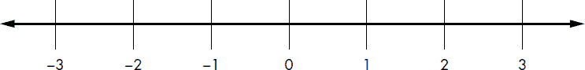

*图 2-1：数轴*

数轴使得某些属性变得直观。例如，0 右侧的所有数字是正数，左侧的则是负数。当一个数字 *a* 位于另一个数字 *b* 右侧时，*a* 总是大于 *b*，而 *b* 总是小于 *a*。

数轴两端的箭头表示该数轴无限延伸，数轴上的每一个点都对应某个实数，无论这个数字多大。一个数字足以描述数轴上的一个点。

现在考虑两个数轴，如图 2-2 所示。两个数轴相交于直角，并且在各自的 0 点交叉。这形成了一个*笛卡尔坐标平面*，或称 *x*-*y* 平面，其中水平数轴称为 *x* 轴，垂直数轴称为 *y* 轴。

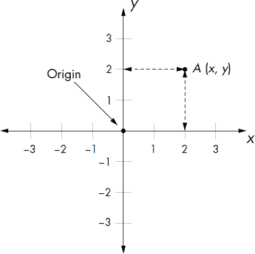

*图 2-2：笛卡尔坐标平面*

与数轴一样，我们可以在平面上有无数多个点。我们用一对数字来描述一个点，而不是一个数字。例如，我们用两个数字 *x* 和 *y* 来描述图中的点 *A*，通常写作 (*x*, *y*)，这对数字被称为该点的 *坐标*。如图 2-2 所示，*x* 是该点沿 *x* 轴从原点起的距离，*y* 是该点沿 *y* 轴的距离。两个坐标轴交叉的点称为 *原点*，其坐标为 (0, 0)。

笛卡尔坐标平面使我们能够可视化两组数字之间的关系。在这里，我用*集合*这个词泛指一组数字。（我们将在第五章学习数学集合以及如何在 Python 中使用它们。）无论这两组数字代表什么——温度、棒球得分，还是班级测试分数——你所需要的只是这些数字本身。然后，你可以将它们绘制出来——无论是在图纸上，还是通过用 Python 编写的程序在计算机上绘制。接下来，在本书中，我将用*绘制*这个动词来描述绘制两组数字的行为，而用*图形*来描述结果——一条线、一条曲线，或者仅仅是笛卡尔平面上的一组点。

### **处理列表和元组**

在使用 Python 绘制图形时，我们将处理*列表*和*元组*。在 Python 中，这两者是存储一组值的两种不同方式。元组和列表在大多数情况下非常相似，主要的区别在于：创建列表后，你可以向其中添加值，并且可以改变值的顺序。另一方面，元组中的值一旦创建就固定了，不能更改。我们将使用列表来存储我们想要绘制的点的*x*和*y*坐标。元组将在《自定义图形》（第 41 页）中出现，届时我们将学习如何自定义图形的范围。首先，让我们回顾一下列表的一些特性。

你可以通过在方括号中输入用逗号分隔的值来创建一个列表。以下语句创建了一个列表，并使用标签`simplelist`来引用它：

```py
>>> simplelist = [1, 2, 3]
```

现在你可以通过标签和列表中数字的位置（即*索引*）来引用单个数字——1、2 和 3。因此，`simplelist[0]`指的是第一个数字，`simplelist[1]`指的是第二个数字，`simplelist[2]`指的是第三个数字：

```py
>>> simplelist[0]
1
>>> simplelist[1]
2
>>> simplelist[2]
3
```

请注意，列表的第一个项目位于索引 0，第二个项目位于索引 1，依此类推——也就是说，列表中的位置从 0 开始计数，而不是从 1 开始。

列表也可以存储字符串：

```py
>>> stringlist = ['a string','b string','c string']
>>> stringlist[0]
'a string'
>>> stringlist[1]
'b string'
>>> stringlist[2]
'c string'
```

创建列表的一个优点是，你不必为每个值创建单独的标签；你只需为列表创建一个标签，并使用索引位置来引用每个项目。此外，当你需要存储新值时，可以随时向列表添加内容，因此如果你事先不知道需要存储多少数字或字符串，列表是存储数据的最佳选择。

一个*空列表*就是一个没有任何项目或元素的列表，可以像这样创建：

```py
>>> emptylist = []
```

空列表主要在你事先不知道列表中会有哪些项目，但计划在程序执行过程中填充值时非常有用。在这种情况下，你可以创建一个空列表，然后使用`append()`方法稍后添加项目：

```py
➊ >>> emptylist
   []
➋ >>> emptylist.append(1)
   >>> emptylist
   [1]
➌ >>> emptylist.append(2)
   >>> emptylist
➍ [1, 2]
```

在 ➊ 处，`emptylist` 初始为空。接下来，在 ➋ 处我们将数字 1 添加到列表中，然后在 ➌ 处添加 2。到 ➍ 这一行时，列表已经是 [1, 2]。注意，当你使用 `.append()` 时，值会被添加到列表的末尾。这只是一种向列表添加值的方式。还有其他方法，但在这一章中我们不需要它们。

创建元组与创建列表类似，不过是使用圆括号而不是方括号：

```py
>>> simpletuple = (1, 2, 3)
```

你可以像对待列表一样，通过对应的索引来引用 `simpletuple` 中的单个数字：

```py
>>> simpletuple[0]
1

>>> simpletuple[1]
2
>>> simpletuple[2]
3
```

你也可以对列表和元组使用 *负索引*。例如，`simplelist[-1]` 和 `simpletuple[-1]` 将引用列表或元组中的最后一个元素，`simplelist[-2]` 和 `simpletuple[-2]` 将引用倒数第二个元素，依此类推。

元组与列表一样，也可以包含字符串作为值，你可以创建一个没有元素的 *空元组*，表示为 `emptytuple=()`。然而，元组没有 `append()` 方法来向现有元组添加新值，因此你不能向空元组中添加值。一旦创建了元组，元组的内容就无法更改。

#### ***迭代遍历列表或元组***

我们可以使用 `for` 循环遍历列表或元组，如下所示：

```py
>>> l = [1, 2, 3]
>>> for item in l:
        print(item)
```

这将打印列表中的元素：

```py
1
2
3
```

元组中的元素可以以相同的方式进行检索。

有时你可能需要知道列表或元组中某个元素的位置或索引。你可以使用 `enumerate()` 函数遍历列表中的所有元素，并返回元素的索引以及元素本身。我们用 `index` 和 `item` 标签来引用它们：

```py
>>> l = [1, 2, 3]
>>> for index, item in enumerate(l):
        print(index, item)
```

这将产生如下输出：

```py
0 1
1 2
2 3
```

这对元组也适用。

### **使用 Matplotlib 创建图表**

我们将使用 matplotlib 来绘制 Python 图表。Matplotlib 是一个 Python *包*，意味着它是一个包含相关功能模块的集合。在这个案例中，这些模块用于绘制数字和生成图表。Matplotlib 并不包含在 Python 的标准库中，因此你需要安装它。安装说明请参见 附录 A。安装完成后，启动 Python shell。正如安装说明中所述，你可以继续使用 IDLE shell，或者使用 Python 自带的 shell。

现在我们准备好创建我们的第一个图表。我们将从一个简单的图表开始，只有三个点：(1, 2)、(2, 4) 和 (3, 6)。为了创建这个图表，我们首先将创建两个数字列表，一个存储这些点的 *x* 坐标，另一个存储 *y* 坐标。下面的两个语句正是做了这件事，创建了两个列表 `x_numbers` 和 `y_numbers`：

```py
>>> x_numbers = [1, 2, 3]
>>> y_numbers = [2, 4, 6]
```

从这里开始，我们可以创建图表：

```py
>>> from pylab import plot, show
>>> plot(x_numbers, y_numbers)
[<matplotlib.lines.Line2D object at 0x7f83ac60df10>]
```

在第一行中，我们从 `pylab` 模块导入了 `plot()` 和 `show()` 函数，这个模块是 matplotlib 包的一部分。接下来，我们在第二行调用了 `plot()` 函数。`plot()` 函数的第一个参数是我们想要在 *x* 轴上绘制的数字列表，第二个参数是我们想要在 *y* 轴上绘制的对应数字列表。`plot()` 函数返回一个对象——更准确地说，是一个包含对象的列表。这个对象包含了我们请求 Python 创建的图形信息。在这个阶段，你可以向图形添加更多信息，比如标题，或者你也可以直接显示图形。现在我们先只显示图形。

`plot()` 函数仅创建图形。为了实际显示图形，我们还需要调用 `show()` 函数：

```py
>>> show()
```

你应该能够在 matplotlib 窗口中看到图形，如 图 2-3 所示。（显示窗口可能会因操作系统的不同而有所不同，但图形应该是一样的。）


*图 2-3：一条经过点 (1, 2)、(2, 4) 和 (3, 6) 的线图*

请注意，*x* 轴不是从原点 (0, 0) 开始，而是从数字 1 开始，*y* 轴从数字 2 开始。这是两个列表中的最小值。同时，你还可以看到每个坐标轴上标有增量（例如 *y* 轴上有 2.5、3.0、3.5 等）。在 “自定义图形” 章节的 第 41 页，我们将学习如何控制这些图形的各个方面，包括如何添加坐标轴标签和图形标题。

你会注意到，在交互式命令行中，直到你关闭 matplotlib 窗口之前，你无法输入更多的语句。关闭图形窗口后，你就可以继续编程了。

#### ***在图形上标记点***

如果你希望图形标记出你提供的绘制点，可以在调用 `plot()` 函数时使用额外的关键字参数：

```py
>>> plot(x_numbers, y_numbers, marker='o')
```

通过输入 `marker='o'`，我们告诉 Python 用一个看起来像 *o* 的小圆点来标记列表中的每个点。再次输入 `show()` 后，你会看到每个点都被一个圆点标记（参见 图 2-4）。

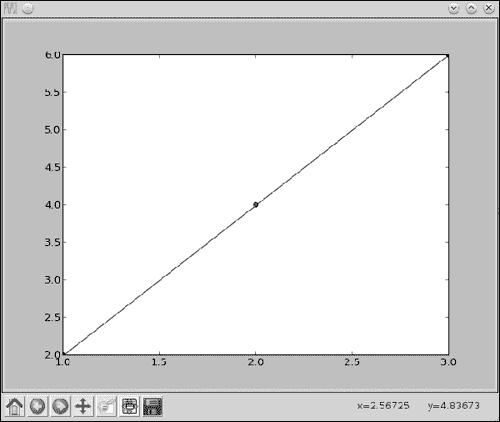

*图 2-4：一条经过点 (1, 2)、(2, 4) 和 (3, 6) 的线图，并且各点由小圆点标记*

位于 (2, 4) 的标记非常明显，而其他标记则隐藏在图形的角落里。你可以从多个 `marker` 选项中进行选择，包括 `'o'`、`'*'`、`'x'` 和 `'+'`。使用 `marker=` 会在各点之间连接一条线（这是默认设置）。你还可以绘制仅标记指定点的图形，不连接它们的线，只需省略 `marker=` 参数即可：

```py
>>> plot(x_numbers, y_numbers, 'o')
[<matplotlib.lines.Line2D object at 0x7f2549bc0bd0>]
```

这里，`'o'` 表示每个点应当用一个点标记，但点与点之间不应有连接线。调用 `show()` 函数以显示图表，图表应该和 图 2-5 中显示的一样。

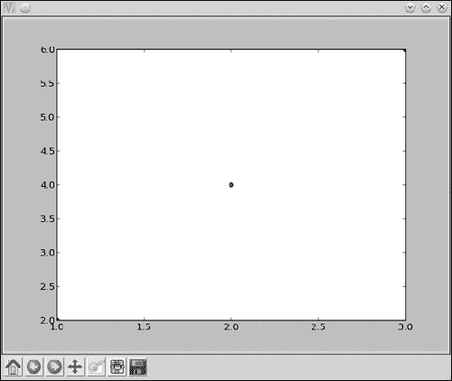

*图 2-5：显示点 (1, 2)、(2, 4) 和 (3, 6) 的图表*

如你所见，现在图表上只显示了点，没有连接这些点的线条。和之前的图表一样，第一个和最后一个点几乎不可见，但我们很快就会看到如何改变这一点。

#### ***绘制纽约市的平均年温度***

让我们看一下一个稍大的数据集，以便探索 matplotlib 的更多功能。2000 年到 2012 年间，纽约市——具体来说是中央公园——的年平均气温如下：53.9、56.3、56.4、53.4、54.5、55.8、56.8、55.0、55.3、54.0、56.7、56.4 和 57.3 华氏度。现在，这看起来像是随机的数字杂乱无章，但我们可以将这些温度数据绘制在图表上，以便更清晰地展示每年温度的升降：

```py
>>> nyc_temp = [53.9, 56.3, 56.4, 53.4, 54.5, 55.8, 56.8, 55.0, 55.3, 54.0, 56.7, 56.4, 57.3]
>>> plot(nyc_temp, marker='o')
[<matplotlib.lines.Line2D object at 0x7f2549d52f90>]
```

我们将平均温度存储在一个列表 `nyc_temp` 中。然后，我们调用 `plot()` 函数，只传入这个列表（以及标记字符串）。当你在单个列表上使用 `plot()` 时，这些数字会自动绘制在 *y* 轴上。*x* 轴上对应的值是每个值在列表中的位置。也就是说，第一个温度值 53.9 对应的 *x* 轴值是 0，因为它在列表的位置是 0（记住，列表的位置是从 0 开始计数的，不是从 1 开始）。因此，绘制在 *x* 轴上的数字是从 0 到 12 的整数，我们可以认为它们对应于我们拥有温度数据的 13 年。

输入 `show()` 来显示图表，图表显示在 图 2-6 中。图表显示了平均温度年年波动。如果你看看我们绘制的数字，它们实际上并不相距太远。然而，图表使得这些变化看起来相当剧烈。那么，发生了什么呢？原因在于 matplotlib 会选择 *y* 轴的范围，使其恰好足够包含提供的绘图数据。所以在这张图表中，*y* 轴从 53.0 开始，最高值为 57.5。这使得即使是小的差异也显得被放大了，因为 *y* 轴的范围非常小。我们将在 “自定义图表” 中学习如何控制每个轴的范围，第 41 页。

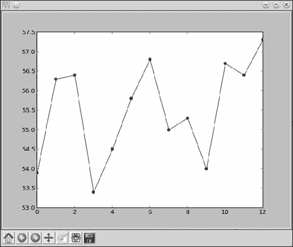

*图 2-6：显示纽约市 2000-2012 年间的年平均气温的图表*

你也可以看到，*y* 轴上的数字是浮点数（因为我们要求绘制的是浮动的数字），而 *x* 轴上的数字是整数。Matplotlib 可以处理这两者。

不显示对应年份的温度变化图是快速且简便的方式来观察不同年份之间的差异。然而，如果你打算向别人展示这张图表，你可能会希望通过标明每个温度对应的年份来使图表更加清晰。我们可以通过创建一个包含年份的列表，并调用 `plot()` 函数来轻松实现这一点：

```py
>>> nyc_temp = [53.9, 56.3, 56.4, 53.4, 54.5, 55.8, 56.8, 55.0, 55.3, 54.0, 56.7, 56.4, 57.3]
>>> years = range(2000, 2013)
>>> plot(years, nyc_temp, marker='o')
[<matplotlib.lines.Line2D object at 0x7f2549a616d0>]
>>> show()
```

我们使用在第一章中学到的 `range()` 函数来指定从 2000 年到 2012 年的年份。现在你会看到这些年份显示在 *x* 轴上（参见图 2-7）。

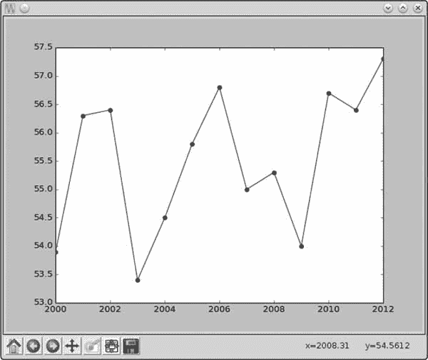

*图 2-7：显示纽约市的平均年度温度，年份显示在 *x* 轴上*

#### ***比较纽约市的月度温度趋势***

继续观察纽约市的情况，我们来看看平均月温度在这些年份中的变化。这将帮助我们了解如何在一张图上绘制多条线。我们选择 2000 年、2006 年和 2012 年这三年，分别绘制这三年的 12 个月的平均温度。

首先，我们需要创建三个列表来存储温度（单位为华氏度）。每个列表将包含 12 个数字，分别对应每年从一月到十二月的平均温度：

```py
>>> nyc_temp_2000 = [31.3, 37.3, 47.2, 51.0, 63.5, 71.3, 72.3, 72.7, 66.0, 57.0, 45.3, 31.1]
>>> nyc_temp_2006 = [40.9, 35.7, 43.1, 55.7, 63.1, 71.0, 77.9, 75.8, 66.6, 56.2, 51.9, 43.6]
>>> nyc_temp_2012 = [37.3, 40.9, 50.9, 54.8, 65.1, 71.0, 78.8, 76.7, 68.8, 58.0, 43.9, 41.5]
```

第一个列表对应于 2000 年，接下来的两个列表分别对应 2006 年和 2012 年。我们可以将这三组数据绘制在三个不同的图表上，但那样就不容易比较每一年之间的差异了。试试看吧！

比较这些温度的最清晰方式是将这三组数据绘制在 *同一* 图表上，就像这样：

```py
>>> months = range(1, 13)
>>> plot(months, nyc_temp_2000, months, nyc_temp_2006, months, nyc_temp_2012)
[<matplotlib.lines.Line2D object at 0x7f2549c1f0d0>, <matplotlib.lines.Line2D
object at 0x7f2549a61150>, <matplotlib.lines.Line2D object at 0x7f2549c1b550>]
```

首先，我们创建一个列表（`months`），使用 `range()` 函数将数字 1、2、3 等依次存储到 12。接着，我们用三对列表调用 `plot()` 函数。每对列表包含一个表示月份的 *x* 轴列表和一个表示每年（2000、2006 和 2012 年）平均月温度的 *y* 轴列表。到目前为止，我们每次只使用 `plot()` 函数绘制一对列表，但实际上你可以将多个列表对传递给 `plot()` 函数。每对列表之间用逗号分隔，`plot()` 函数会自动为每对列表绘制不同的线条。

`plot()` 函数返回的是三个对象的列表，而不是一个。Matplotlib 将这三条曲线视为相互独立的，当你调用 `show()` 时，它会知道将它们绘制在同一张图上。我们可以调用 `show()` 来显示图表，如图 2-8 所示。

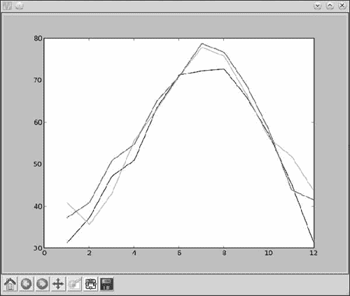

*图 2-8：显示纽约市在 2000、2006 和 2012 年的平均月温度的图表*

现在，我们将三条图线绘制在同一张图表上。Python 会自动为每条线选择不同的颜色，以表明这些线条来源于不同的数据集。

我们可以选择分别调用三次`plot`函数，而不是一次性将所有三个数据对传入，分别为每个数据对调用一次：

```py
>>> plot(months, nyc_temp_2000)
[<matplotlib.lines.Line2D object at 0x7f1e51351810>]
>>> plot(months, nyc_temp_2006)
[<matplotlib.lines.Line2D object at 0x7f1e5ae8e390>]
>>> plot(months, nyc_temp_2012)
[<matplotlib.lines.Line2D object at 0x7f1e5136ccd0>]
>>> show()
```

Matplotlib 会记录哪些图形尚未显示。因此，只要在调用`plot()`三次之后再调用`show()`，这些图形都会在同一张图表上显示。

然而，我们遇到了一个问题，因为我们不知道哪种颜色代表哪一年。为了解决这个问题，我们可以使用`legend()`函数来为图表添加图例。图例是一个小的显示框，用来标识图表中不同部分的含义。在这里，我们将使用图例来标明每条彩色线条对应的年份。要添加图例，首先像之前一样调用`plot()`函数：

```py
>>> plot(months, nyc_temp_2000, months, nyc_temp_2006, months, nyc_temp_2012)
[<matplotlib.lines.Line2D object at 0x7f2549d6c410>, <matplotlib.lines.Line2D
object at 0x7f2549d6c9d0>, <matplotlib.lines.Line2D object at 0x7f2549a86850>]
```

然后，从`pylab`模块导入`legend()`函数，并按如下方式调用：

```py
>>> from pylab import legend
>>> legend([2000, 2006, 2012])
<matplotlib.legend.Legend object at 0x7f2549d79410>
```

我们通过`legend()`函数传入一个标签列表，用来标识图表中每一条线的含义。这些标签的顺序与`plot()`函数中输入的列表数据对顺序相匹配。也就是说，`2000`将作为我们在`plot()`函数中输入的第一对数据的标签；`2006`作为第二对数据的标签；`2012`作为第三对数据的标签。你还可以为该函数指定第二个参数，来设置图例的位置。默认情况下，图例总是位于图表的右上角。但是，你可以指定一个特定的位置，比如`'lower center'`、`'center left'`和`'upper left'`。或者，你可以将位置设置为`'best'`，这样图例将自动放置在不会干扰图表的地方。

最后，我们调用`show()`来显示图表：

```py
>>> show()
```

正如你在图表中看到的（参见图 2-9），现在右上角有了一个图例框。它告诉我们哪条线表示 2000 年的月平均气温，哪条线表示 2006 年，哪条线表示 2012 年。

从图表中可以得出两个有趣的结论：三个年份的最高气温都出现在 7 月左右（对应于*X*轴的 7），而且从 2000 年到 2012 年之间，气温逐年升高，尤其是 2000 年到 2006 年之间的升幅最为显著。将三条线绘制在同一个图表中，能够更容易地看出这些关系。这比单纯查看一长串的数字或是将三条线分别绘制在三个不同图表中要清晰得多。

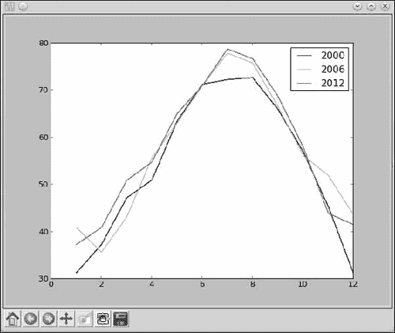

*图 2-9：展示纽约市平均月气温的图表，并有图例标明每条颜色对应的年份*

#### ***自定义图形***

我们已经了解了一种自定义图形的方法——通过添加图例。接下来，我们将学习更多自定义图形的方法，通过给*X*轴和*Y*轴添加标签、给图表添加标题，并控制坐标轴的范围和步长，来使图表更加清晰。

##### **添加标题和标签**

我们可以使用`title()`函数为图表添加标题，并使用`xlabel()`和`ylabel()`函数分别为* x *轴和* y *轴添加标签。让我们重新创建上一个图表，并添加所有这些附加信息：

```py
>>> from pylab import plot, show, title, xlabel, ylabel, legend
>>> plot(months, nyc_temp_2000, months, nyc_temp_2006, months, nyc_temp_2012)
[<matplotlib.lines.Line2D object at 0x7f2549a9e210>, <matplotlib.lines.Line2D
object at 0x7f2549a4be90>, <matplotlib.lines.Line2D object at 0x7f2549a82090>]
>>> title('Average monthly temperature in NYC')
<matplotlib.text.Text object at 0x7f25499f7150>
>>> xlabel('Month')
<matplotlib.text.Text object at 0x7f2549d79210>
>>> ylabel('Temperature')
<matplotlib.text.Text object at 0x7f2549b8b2d0>

>>> legend([2000, 2006, 2012])
<matplotlib.legend.Legend object at 0x7f2549a82910>
```

所有三个函数——`title()`、`xlabel()`和`ylabel()`——都通过字符串传入我们希望显示在图表上的对应文本。调用`show()`函数将显示带有所有新增信息的图表（参见图 2-10）。

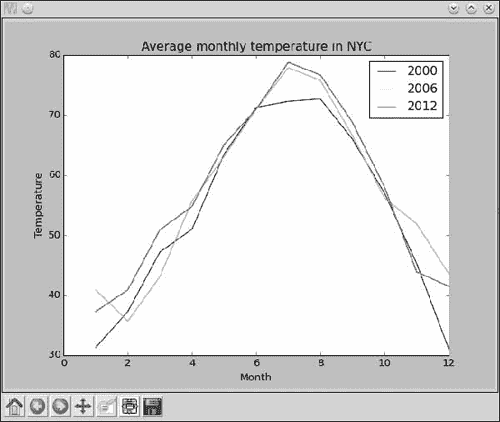

*图 2-10：图表中已添加坐标轴标签和标题。*

添加了这三项新信息后，图表变得更容易理解。

##### **自定义坐标轴**

到目前为止，我们让 Python 根据传递给`plot()`函数的数据自动确定了两个坐标轴上的数字范围。对于大多数情况，这样做是可以的，但有时这种自动范围的方式并不是最清晰的数据呈现方式，就像我们在绘制纽约市年平均温度的图表时所看到的那样（参见图 2-7）。在那里，即使温度的变化很小，由于自动选择的* y *轴范围非常狭窄，看起来变化也很大。我们可以通过`axis()`函数来调整坐标轴的范围。这个函数既可以用来获取当前的范围，也可以用来设置坐标轴的新范围。

再次考虑 2000 到 2012 年间纽约市的年平均温度，并像之前一样创建图表。

```py
>>> nyc_temp = [53.9, 56.3, 56.4, 53.4, 54.5, 55.8, 56.8, 55.0, 55.3, 54.0, 56.7, 56.4, 57.3]
>>> plot(nyc_temp, marker='o')
[<matplotlib.lines.Line2D object at 0x7f3ae5b767d0>]
```

现在，导入`axis()`函数并调用它：

```py
>>> from pylab import axis
>>> axis()
(0.0, 12.0, 53.0, 57.5)
```

函数返回了一个包含四个数字的元组，这些数字对应于* x *轴的范围（0.0, 12.0）和* y *轴的范围（53.0, 57.5）。这些值与我们之前绘制的图形中的范围值相同。现在，让我们将* y *轴的起始值从 53.0 改为 0：

```py
>>> axis(ymin=0)
(0.0, 12.0, 0, 57.5)
```

调用`axis()`函数并设置新的* y *轴起始值（由`ymin=0`指定）会改变范围，返回的元组也会确认这一点。如果通过调用`show()`函数显示图表，* y *轴将从 0 开始，连续年份之间的差异看起来就不那么剧烈了（参见图 2-11）。

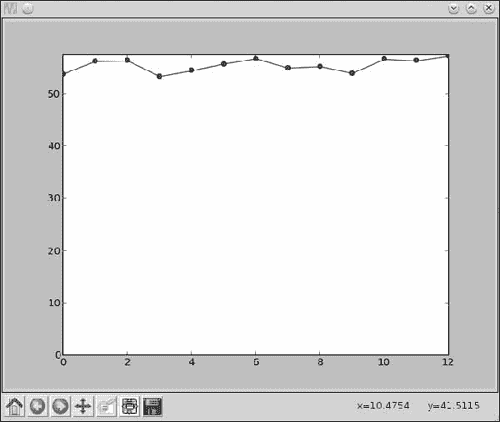

*图 2-11：显示 2000 到 2012 年间纽约市年平均温度的图表。* y *轴已被自定义为从 0 开始。*

类似地，你可以使用`xmin`、`xmax`和`ymax`分别设置* x *轴的最小值和最大值，以及* y *轴的最大值。如果你要更改所有四个值，可能会觉得调用`axis()`函数，并将所有四个范围值作为列表传入（例如`axis([0, 10, 0, 20])`）更为方便。这样将会把* x *轴的范围设置为（0, 10），而* y *轴的范围设置为（0, 20）。

##### **使用 pyplot 绘图**

`pylab`模块适用于在交互式 shell 中创建图表，例如我们一直在使用的 IDLE shell。然而，在 IDLE shell 之外使用 matplotlib 时——例如作为更大程序的一部分——`pyplot`模块更加高效。别担心——你在使用`pylab`时学到的所有方法，在使用`pyplot`时也会以相同的方式工作。

以下程序使用`pyplot`模块重新创建了本章中的第一个图表：

```py
   '''
   Simple plot using pyplot
   '''

➊ import matplotlib.pyplot

➋ def create_graph():
       x_numbers = [1, 2, 3]
       y_numbers = [2, 4, 6]

       matplotlib.pyplot.plot(x_numbers, y_numbers)
       matplotlib.pyplot.show()

   if __name__ == '__main__':
       create_graph()
```

首先，我们通过语句`import matplotlib.pyplot`导入`pyplot`模块 ➊。这意味着我们正在从 matplotlib 包中导入整个`pyplot`模块。为了引用该模块中定义的任何函数或类定义，你必须使用语法`matplotlib.pyplot.item`，其中`item`是你要使用的函数或类。

这与我们之前按需导入单个函数或类有所不同。例如，在第一章中，我们通过`from fractions import Fraction`导入了`Fraction`类。导入整个模块在你打算使用该模块中的多个函数时非常有用。你可以一次性导入整个模块，然后在需要时引用不同的函数，而不必单独导入它们。

在`create_graph()`函数中（见➋），我们创建了要绘制在图表上的两个数字列表，然后将这两个列表传递给`plot()`函数，方式与我们之前使用`pylab`时相同。然而，这一次，我们调用函数为`matplotlib.pyplot.plot()`，这意味着我们正在调用在 matplotlib 包的`pyplot`模块中定义的`plot()`函数。然后，我们调用`show()`函数来显示图表。与之前绘制数字的方式相比，唯一的不同之处是调用函数的机制。

为了减少输入量，我们可以通过输入`import matplotlib.pyplot as plt`来导入`pyplot`模块。然后，在程序中，我们可以使用标签`plt`来引用`pyplot`，而不必每次都输入`matplotlib.pyplot`：

```py
'''
Simple plot using pyplot
'''
import matplotlib.pyplot as plt

def create_graph():
    x_numbers = [1, 2, 3]
    y_numbers = [2, 4, 6]
    plt.plot(x_numbers, y_numbers)
    plt.show()

if __name__ == '__main__':
    create_graph()
```

现在，我们可以通过在函数前添加简写`plt`来调用这些函数，而不是使用`matplotlib.pyplot`。

接下来，在本章和本书的其余部分，我们将使用`pylab`在交互式 shell 中，而在其他情况下使用`pyplot`。

#### ***保存图表***

如果你需要保存你的图表，可以使用`savefig()`函数。此函数将图表保存为图像文件，你可以在报告或演示文稿中使用。你可以选择多种图像格式，包括 PNG、PDF 和 SVG。

这是一个示例：

```py
>>> from pylab import plot, savefig
>>> x = [1, 2, 3]
>>> y = [2, 4, 6]
>>> plot(x, y)
>>> savefig('mygraph.png')
```

本程序将把图形保存为图像文件 *mygraph.png*，并保存在当前目录中。在 Microsoft Windows 上，当前目录通常是 *C:\Python33*（即你安装 Python 的目录）。在 Linux 上，当前目录通常是你的主目录 *(/home/<username>*)，其中 *<username>* 是你登录的用户名。在 Mac 上，IDLE 默认将文件保存到 *~/Documents*。如果你想将其保存到不同的目录中，可以指定完整的路径。例如，要将图像保存在 Windows 的 *C:\* 目录下并命名为 *mygraph.png*，你可以按照如下方式调用 `savefig()` 函数：

```py
>>> savefig('C:\mygraph.png')
```

如果你在图像查看程序中打开该图像，你会看到与调用 `show()` 函数时相同的图形。（你会注意到，图像文件只包含图形——而不是包含 `show()` 函数弹出窗口的整个内容）。要指定不同的图像格式，只需使用适当的扩展名命名文件。例如，`mygraph.svg` 会创建一个 SVG 图像文件。

另一种保存图形的方法是使用弹出窗口中的“保存”按钮，该窗口在调用 `show()` 时会显示。

### **使用公式绘图**

到目前为止，我们一直在根据观测到的科学数据在图表上绘制点。在这些图表中，我们已经预先拥有了 *x* 和 *y* 的所有数值。例如，在我们想要创建纽约市的温度变化图时，记录的温度和日期已经可以使用了。在本节中，我们将基于数学公式创建图表。

#### ***牛顿万有引力定律***

根据牛顿的万有引力定律，一个质量为 *m*[1] 的物体会根据公式与另一个质量为 *m*[2] 的物体相互吸引，产生的力为 *F*。

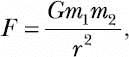

其中 *r* 是两个物体之间的距离，*G* 是引力常数。我们想观察随着两个物体之间的距离增加，引力如何变化。

假设有两个物体的质量：第一个物体的质量（*m*[1]）为 0.5 kg，第二个物体的质量（*m*[2]）为 1.5 kg。引力常数的值为 6.674 × 10^(–11) N m² kg^(–2)。现在我们准备计算这两个物体在 19 个不同距离下的引力：100 m、150 m、200 m、250 m、300 m，一直到 1000 m。以下程序执行这些计算，并绘制图形：

```py
   '''
   The relationship between gravitational force and
   distance between two bodies
   '''

   import matplotlib.pyplot as plt

   # Draw the graph
   def draw_graph(x, y):
       plt.plot(x, y, marker='o')
       plt.xlabel('Distance in meters')

       plt.ylabel('Gravitational force in newtons')
       plt.title('Gravitational force and distance')
       plt.show()

   def generate_F_r():
       # Generate values for r
➊     r = range(100, 1001, 50)
       # Empty list to store the calculated values of F
       F = []

       # Constant, G
       G = 6.674*(10**-11)
       # Two masses
       m1 = 0.5
       m2 = 1.5

       # Calculate force and add it to the list, F
➋     for dist in r:
           force = G*(m1*m2)/(dist**2)
           F.append(force)

       # Call the draw_graph function
➌     draw_graph(r, F)

   if __name__=='__main__':
       generate_F_r()
```

`generate_F_r()`函数在上面的程序中完成了大部分工作。在➊处，我们使用`range()`函数创建一个名为`r`的列表，列出不同距离的数值，步长为 50\。最终值设置为 1001，因为我们希望包含 1000。然后我们创建一个空列表（`F`），在其中存储这些距离对应的重力值。接下来，我们创建了表示重力常数（`G`）和两个质量（`m1`和`m2`）的标签。然后使用`for`循环 ➋，对距离列表（`r`）中的每一个值计算重力。在计算过程中，我们使用`force`作为标签来表示计算出的力，并将其添加到列表（`F`）中。最后，在➌处，我们调用`draw_graph()`函数，传入距离列表和计算出的力列表。图表的*x*轴表示力，*y*轴表示距离。该图在图 2-12 中展示。

随着距离（`r`）的增加，重力逐渐减小。根据这种关系，我们可以说重力与两个物体之间的距离成*反比*。另外，请注意，当两个变量中的一个发生变化时，另一个变量的变化不一定是成比例的。这种关系被称为*非线性关系*。因此，我们在图表上得到的是一条曲线，而不是直线。

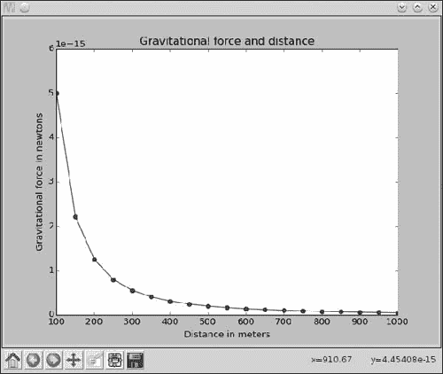

*图 2-12：重力与平方距离之间关系的可视化*

#### ***抛体运动***

现在，让我们绘制一个你日常生活中熟悉的图形。如果你把球扔过一个田野，它会沿着类似于图 2-13 中所示的轨迹运动。

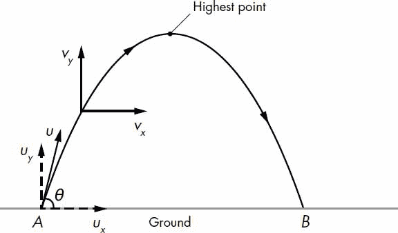

*图 2-13：从点* A*以一定角度（*θ*）和初速度（*U*）投掷的球体运动，最终在点* B*落地*

在图中，球体从点*A*被投掷，最终落在点*B*。这种运动称为*抛体*运动。我们的目标是利用抛体运动的方程，绘制一个物体的轨迹图，展示从球体投掷的起点到它再次落地的整个过程。

当你投掷球体时，它具有一个初速度，并且该速度的方向与地面之间形成一定的角度。我们将初速度称为*u*，与地面形成的角度称为*θ*（theta），如图 2-13 所示。球体具有两个速度分量：一个沿着*x*方向，由*u[x]* = *u* cos*θ*计算，另一个沿着*y*方向，其中*u[y]* = *u* sin*θ*。

随着球的运动，速度发生变化，我们将用*v*来表示这种变化的速度：水平分量是*v[x]*，竖直分量是*v[y]*。为简化起见，假设水平分量（*v[x]*）在物体运动过程中保持不变，而竖直分量（*v[y]*）因重力作用而减小，按照方程*v[y]* = *u[y] – gt*来表示。在这个方程中，*g*是重力加速度，*t*是测量速度的时间。因为*u[y]* = *u* sin*θ*，我们可以代入得到

*v[y]* = *u* sin*θ* – *gt*。

由于水平速度分量保持不变，水平位移（*S[x]*）由公式*S[x]* = *u*(cos*θ*)*t*给出。不过，竖直分量的速度发生变化，竖直位移由下列公式给出：

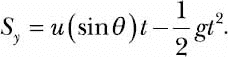

换句话说，*S[x]* 和 *S[y]* 给出了球在飞行过程中任意时刻的 *x* 和 *y* 坐标。我们将在编写程序绘制轨迹时使用这些方程。使用这些方程时，时间（*t*）以秒为单位，速度以米每秒（m/s）为单位，投射角度（*θ*）以度为单位，重力加速度（*g*）以米每秒平方（m/s²）为单位。

然而，在编写程序之前，我们需要先计算出球体飞行多长时间才会撞击地面，以便知道程序何时停止绘制球的轨迹。为此，我们首先需要找出球体达到最高点所需的时间。当竖直速度分量（*v[y]*）为 0 时，球体达到最高点，即*v[y]* = *u* sin *θ* – *gt* = 0。因此，我们要利用以下公式求解时间*t*：

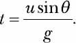

我们将这个时间称为`t_peak`。当球达到最高点后，它将在空中再停留`t_peak`秒，然后撞击地面，因此球的总飞行时间（`t_flight`）为

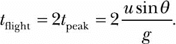

假设我们投掷一个初速度（*u*）为 5 m/s，投射角度（*θ*）为 45 度的球体。为了计算总飞行时间，我们将 *u* = 5，*θ* = 45，*g* = 9.8 代入我们上面看到的方程中：

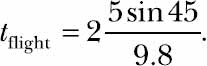

在这种情况下，球体的飞行时间为 0.72154 秒（四舍五入到小数点后五位）。球体将在空中停留这段时间，因此为了绘制轨迹，我们将在这段时间内定期计算其 *x* 和 *y* 坐标。我们应该多频繁地计算坐标呢？理想情况下，越频繁越好。在本章中，我们将在每 0.001 秒计算一次坐标。

##### **生成等间隔的浮点数**

我们使用了`range()`函数来生成等间隔的整数——也就是说，如果我们想要一个从 1 到 10 的整数列表，每个整数之间相隔 1，我们将使用 range(1, 10)。如果我们想要不同的步长值，可以将其作为第三个参数传递给 range 函数。不幸的是，对于浮点数并没有类似的内建函数。例如，并没有一个函数可以帮助我们创建从 0 到 0.72 的数字列表，其中每两个连续数字之间相隔 0.001。我们可以通过如下的`while`循环来创建自己的函数：

```py
   '''
   Generate equally spaced floating point
   numbers between two given values
   '''

   def frange(start, final, increment):

       numbers = []
➊     while start < final:
➋         numbers.append(start)
           start = start + increment

       return numbers
```

我们定义了一个函数`frange()`（“浮点数”范围），它接收三个参数：`start`和`final`分别表示数值范围的起始点和终点，`increment`表示两个连续数字之间的差值。在➊处，我们初始化了一个`while`循环，只要`start`所指的数字小于`final`，循环就会继续执行。在➋处，我们将`start`所指的数字存储到列表`numbers`中，然后在每次循环迭代中将我们输入的`increment`值加到`start`上。最后，我们返回列表`numbers`。

我们将在接下来的轨迹绘制程序中使用这个函数来生成等间隔的时间点。

##### **绘制轨迹**

以下程序绘制了一个以特定速度和角度投掷的球的轨迹——这两个值作为输入传递给程序：

```py
   '''
   Draw the trajectory of a body in projectile motion
   '''

   from matplotlib import pyplot as plt
   import math

   def draw_graph(x, y):
       plt.plot(x, y)
       plt.xlabel('x-coordinate')
       plt.ylabel('y-coordinate')
       plt.title('Projectile motion of a ball')

   def frange(start, final, interval):

       numbers = []
       while start < final:
           numbers.append(start)
           start = start + interval

       return numbers

   def draw_trajectory(u, theta):

➊     theta = math.radians(theta)
       g = 9.8

       # Time of flight
➋     t_flight = 2*u*math.sin(theta)/g
       # Find time intervals
       intervals = frange(0, t_flight, 0.001)

       # List of x and y coordinates
       x = []
       y = []
➌     for t in intervals:
           x.append(u*math.cos(theta)*t)
           y.append(u*math.sin(theta)*t - 0.5*g*t*t)

       draw_graph(x, y)

   if __name__ == '__main__':
➍     try:
           u = float(input('Enter the initial velocity (m/s): '))
           theta = float(input('Enter the angle of projection (degrees): '))
       except ValueError:
           print('You entered an invalid input')
       else:
           draw_trajectory(u, theta)
           plt.show()
```

在这个程序中，我们使用了标准库`math`模块中的`radians()`、`cos()`和`sin()`函数，所以我们在一开始就导入了这个模块。`draw_trajectory()`函数接受两个参数，`u`和`theta`，分别对应投掷球的速度和角度。`math`模块中的正弦和余弦函数要求输入角度为弧度制，因此在➊处，我们使用`math.radians()`函数将角度（`theta`）从度数转换为弧度。接着，我们创建了一个标签（`g`）来表示重力加速度的值，即 9.8 米/秒²。在➋处，我们计算了飞行时间，并调用了`frange()`函数，传入了`start`、`final`和`increment`的值，分别为 0、`t_flight`和 0.001。然后，我们在每个时间点计算* x *和* y *坐标，并将它们分别存储在两个列表中，`x`和`y` ➌。为了计算这些坐标，我们使用了之前讨论过的* S[x]*和* S[y]*的距离公式。

最后，我们调用`draw_graph()`函数并传入*x*和*y*坐标来绘制轨迹。请注意，`draw_graph()`函数没有调用`show()`函数（我们将在下一个程序中看到原因）。我们使用`try...except`块➍来报告错误信息，以防用户输入无效数据。此程序的有效输入为任何整数或浮动点数。当你运行程序时，它会要求输入这些值，然后绘制轨迹（见图 2-14）：

```py
Enter the initial velocity (m/s): 25
Enter the angle of projection (degrees): 60
```

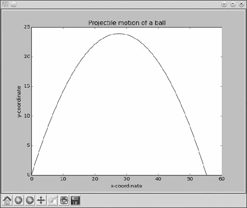

*图 2-14：以 25 m/s 的速度，角度为 60 度时，投掷球体的轨迹*

##### **比较不同初速度下的轨迹**

之前的程序让你能够进行有趣的实验。例如，对于三个以不同速度投掷但初始角度相同的球体，轨迹会是什么样的？为了同时绘制三条轨迹，我们可以用以下代码替换之前程序中的`main`代码块：

```py
   if __name__ == '__main__':

       # List of three different initial velocities
➊     u_list = [20, 40, 60]
       theta = 45
       for u in u_list:
           draw_trajectory(u, theta)

       # Add a legend and show the graph
➋     plt.legend(['20', '40', '60'])
       plt.show()
```

在这里，我们不再要求程序的用户输入速度和投射角度，而是在➊处创建一个包含 20、40 和 60 的速度列表(`u_list`)，并将投射角度设置为 45 度（使用标签`theta`）。然后，我们使用`u_list`中的每个值调用`draw_trajectory()`函数，并使用相同的`theta`值，计算*x*和*y*坐标列表并调用`draw_graph()`函数。当我们调用`show()`函数时，所有三条轨迹将在同一图表上显示。由于现在我们有一个包含多个图表的图表，在➋处我们为图表添加一个图例，然后调用`show()`以显示每条线的速度。当你运行上述程序时，你将看到图 2-15 所示的图表。

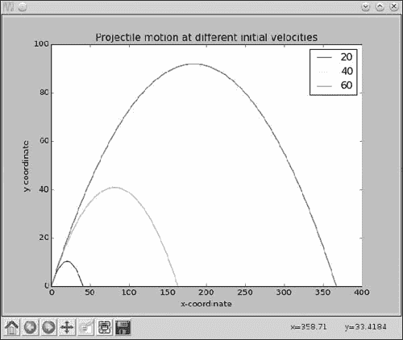

*图 2-15：以 60 度角、速度分别为 20、40 和 60 m/s 的投掷球体轨迹*

### **你学到的内容**

在本章中，你学习了使用 matplotlib 创建图表的基础知识。你了解了如何绘制一组值的图表，如何在同一图表上创建多个图表，以及如何标注图表的不同部分使其更加信息化。你使用图表分析了一个城市的温度变化，研究了牛顿的万有引力定律，并研究了物体的抛体运动。在下一章中，你将使用 Python 开始探索统计学，并了解如何通过绘制图表帮助更容易理解一组数字之间的关系。

### **编程挑战**

这里有一些挑战，基于你在本章中所学的内容。你可以在 *[`www.nostarch.com/doingmathwithpython/`](http://www.nostarch.com/doingmathwithpython/)* 找到示例解决方案。

#### ***#1：白天气温是如何变化的？***

如果你在谷歌搜索引擎中输入类似“纽约天气”这样的搜索词，你会看到其中包括一个图表，展示当天不同时间的温度。你的任务是重新创建这样一个图表。

选择你喜欢的城市，找到不同时间点的温度数据。使用这些数据在你的程序中创建两个列表，并绘制一个图表，图表的横坐标是一天中的时间，纵坐标是对应的温度。这个图表应该展示温度如何随一天中的时间变化。尝试使用另一个城市，并通过将两座城市的曲线绘制在同一张图表上，看看它们的比较结果。

一天中的时间可以通过类似`'10:11 AM'`或`'09:21 PM'`这样的字符串表示。

#### ***#2: 直观展示二次函数***

在第一章中，你学会了如何求解二次方程的根，比如*x*² + 2*x* + 1 = 0。我们可以通过将其写为*y* = *x*² + 2*x* + 1，将此方程转化为一个函数。对于任何值的*x*，二次函数都会产生一个对应的*y*值。例如，当*x* = 1 时，*y* = 4。以下是一个计算六个不同*x*值对应*y*值的程序：

```py
   '''
   Quadratic function calculator
   '''

   # Assume values of x
➊ x_values = [-1, 1, 2, 3, 4, 5]
➋ for x in x_values:
       # Calculate the value of the quadratic function
       y = x**2 + 2*x + 1
       print('x={0} y={1}'.format(x, y))
```

在➊处，我们创建一个包含六个不同`x`值的列表。➋处开始的`for`循环为这些值计算上述函数的值，并使用标签`y`表示结果列表。接下来，我们打印出`x`值和对应的`y`值。当你运行程序时，你应该看到如下输出：

```py
x=-1 y=0
x=1 y=4
x=2 y=9

x=3 y=16
x=4 y=25
x=5 y=36
```

注意，输出的第一行是二次方程的一个根，因为它是一个使得函数值为 0 的`x`值。

你的编程挑战是增强这个程序，创建该函数的图表。尝试使用至少 10 个`x`值，而不是上面提到的 6 个。使用该函数计算对应的`y`值，然后使用这两个值集创建图表。

一旦你创建了图表，花一些时间分析*y*值是如何随*x*值变化的。变化是线性的吗？还是非线性？

#### ***#3: 增强型抛射轨迹比较程序***

你在这里的挑战是以几种方式增强轨迹比较程序。首先，程序应打印出每种速度和抛射角度组合的飞行时间、最大水平距离和最大垂直距离。

另一个增强功能是让程序能够接受任意数量的初速度和抛射角度值，由用户提供。例如，程序应该这样询问用户输入：

```py
How many trajectories? 3
Enter the initial velocity for trajectory 1 (m/s): 45
Enter the angle of projection for trajectory 1 (degrees): 45
Enter the initial velocity for trajectory 2 (m/s): 60
Enter the angle of projection for trajectory 2 (degrees): 45
Enter the initial velocity for trajectory(m/s) 3: 45
Enter the angle of projection for trajectory(degrees) 3: 90
```

你的程序还应确保通过使用`try...except`块来正确处理错误输入，就像原始程序一样。

#### ***#4: 可视化你的支出***

我总是在月末问自己：“那笔钱都去哪了？”我相信这不仅是我个人的困扰。

对于这个挑战，你将编写一个程序，用于轻松比较每周的支出。程序首先会询问支出的类别数量以及每个类别的每周总支出，然后它将创建显示这些支出的柱状图。

这是程序运行的示例：

```py
Enter the number of categories: 4
Enter category: Food
Expenditure: 70

Enter category: Transportation
Expenditure: 35
Enter category: Entertainment
Expenditure: 30
Enter category: Phone/Internet
Expenditure: 30
```

图 2-16 展示了将要创建的柱状图，用于比较支出。如果你每周都保存柱状图，到月底时，你就能看到不同类别的支出在各周之间的变化。

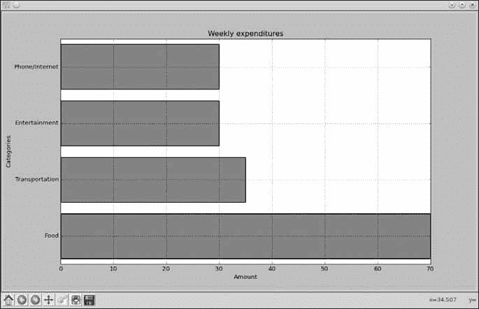

*图 2-16：显示一周内各类别支出的柱状图*

我们还没有讨论如何使用 matplotlib 创建柱状图，所以让我们尝试一个示例。

可以使用 matplotlib 的 `barh()` 函数来创建柱状图，该函数也定义在 `pyplot` 模块中。图 2-17 显示了一张柱状图，展示了我过去一周走的步数。星期天、星期一、星期二等被称为*标签*。每个水平条形图都从 *y* 轴开始，我们需要为每个条形图指定该位置的 *y* 坐标的 *中心*。每个条形图的长度与步数相对应。

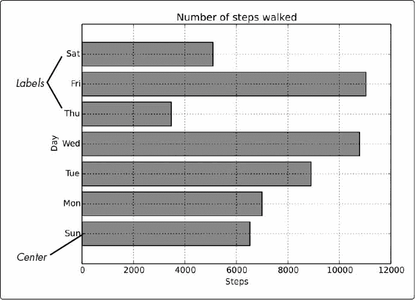

*图 2-17：显示一周内步数的柱状图*

以下程序将创建柱状图：

```py
   '''
   Example of drawing a horizontal bar chart
   '''
   import matplotlib.pyplot as plt
   def create_bar_chart(data, labels):
       # Number of bars
       num_bars = len(data)
       # This list is the point on the y-axis where each
       # Bar is centered. Here it will be [1, 2, 3...]
➊     positions = range(1, num_bars+1)
➋     plt.barh(positions, data, align='center')
       # Set the label of each bar
       plt.yticks(positions, labels)
       plt.xlabel('Steps')
       plt.ylabel('Day')
       plt.title('Number of steps walked')
       # Turns on the grid which may assist in visual estimation
       plt.grid(
       plt.show()

   if __name__ == '__main__':
       # Number of steps I walked during the past week
       steps = [6534, 7000, 8900, 10786, 3467, 11045, 5095]
       # Corresponding days
       labels = ['Sun', 'Mon', 'Tue', 'Wed', 'Thu', 'Fri', 'Sat']
       create_bar_chart(steps, labels)
```

`create_bar_chart()` 函数接受两个参数——`data`，这是一个我们想用条形图表示的数字列表，和相应的 `labels` 列表。每个条形图的中心必须指定，我在 ➊ 处使用 `range()` 函数随意选择了中心点，分别为 1、2、3、4 等等。

接下来，我们调用 `barh()` 函数，传入 `positions` 和 `data` 作为前两个参数，然后在 ➋ 处传入关键字参数 `align='center'`。该关键字参数指定了条形图在 *y* 轴上的位置居中。接着，我们使用 `yticks()` 函数设置每个条形图的标签、坐标轴标签和标题。我们还调用 `grid()` 函数来打开网格，这对于大致估算步数可能有帮助。最后，我们调用 `show()` 函数。

#### ***#5: 探索斐波那契数列与黄金比例之间的关系***

斐波那契数列（1, 1, 2, 3, 5, ...）是一个数列，其中第 *i* 个数是前两个数的和——即位置在 (*i* – 2) 和 (*i* – 1) 的数。这个数列中的连续数字展示了一个有趣的关系。当你增加数列中的项数时，连续数字对的比率几乎相等。这个值趋近于一个特殊的数字，称为 *黄金比*。从数字上看，黄金比是 1.618033988 ...，它已经成为音乐、建筑和自然界广泛研究的对象。对于这个挑战，编写一个程序，在图表上绘制前 100 个斐波那契数之间的比率，这将展示这些值趋近于黄金比。

你可能会发现以下函数有用，它返回前 *n* 个斐波那契数的列表，这对实现你的解决方案有帮助：

```py
def fibo(n):
    if n == 1:
        return [1]
    if n == 2:
        return [1, 1]
    # n > 2
    a = 1
    b = 1
    # First two members of the series
    series = [a, b]
    for i in range(n):
        c = a + b
        series.append(c)
        a = b
        b = c

    return series
```

你解决方案的输出应该是一个图表，如图 2-18 所示。

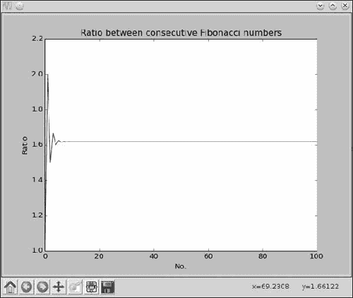

*图 2-18：连续斐波那契数列之间的比率接近黄金比。*
