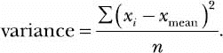
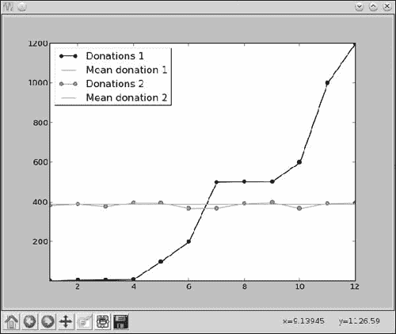
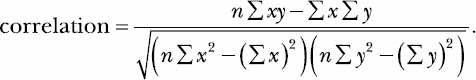
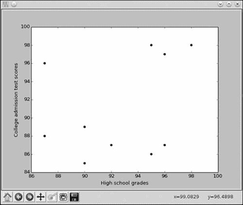
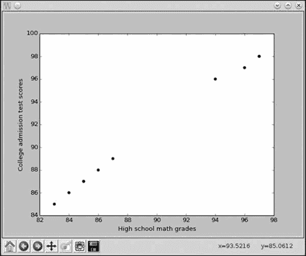
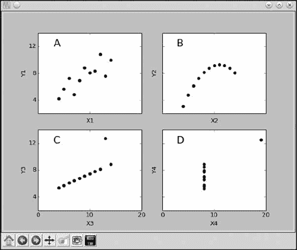
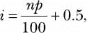

## 第三章：**用统计学描述数据**


在本章中，我们将使用 Python 来探索统计学，以便研究、描述和更好地理解数据集。在介绍一些基本的统计量——均值、中位数、众数和极差之后，我们将进入一些更高级的统计量，如方差和标准差。然后，我们将学习如何计算相关系数，这使得你可以量化两组数据之间的关系。最后，我们将学习如何绘制散点图。在这个过程中，我们还将更多地了解 Python 语言和标准库模块。让我们从最常用的统计量——均值开始吧。

**注意**

*在统计学中，一些统计量的计算方法会根据你是拥有整个总体的数据还是仅有样本数据而有所不同。为了简化起见，本章我们将使用总体的计算方法。*

### **计算均值**

*均值* 是一种常见且直观的方式，用来总结一组数字。它通常被我们称为“平均数”，尽管正如我们所见，还有其他类型的平均数。让我们取一个样本数据集并计算均值。

假设有一个学校慈善机构，它在过去的 12 天里（我们称之为周期 A）接受了捐款。在这段时间里，以下 12 个数字表示每天收到的捐款总额：100、60、70、900、100、200、500、500、503、600、1000 和 1200。我们可以通过将这些总额相加，然后将总和除以天数来计算均值。在这个例子中，数字的总和是 5733。如果我们将这个数字除以 12（天数），我们得到 477.75，这就是每一天的*均值*捐款。这个数字给了我们一个大致的了解，即每一天捐赠的金额。

稍后，我们将编写一个程序来计算并打印一组数字的均值。正如我们刚才看到的，计算均值时，我们需要先求出数字列表的总和，然后再将总和除以列表中的项数。我们来看看两个非常简单的 Python 函数：`sum()` 和 `len()`，它们使这两个操作变得非常简单。

当你对一组数字使用`sum()`函数时，它会将列表中的所有数字加起来并返回结果：

```py
>>> shortlist = [1, 2, 3]
>>> sum(shortlist)
6
```

我们可以使用`len()`函数来获取列表的长度：

```py
>>> len(shortlist)
3
```

当我们对列表使用`len()`函数时，它返回`3`，因为`shortlist`中有三个项。现在我们可以编写一个程序来计算捐款列表的均值了。

```py
   '''
   Calculating the mean
   '''

   def calculate_mean(numbers):
➊     s = sum(numbers)
➋     N = len(numbers)
       # Calculate the mean
➌     mean = s/N

       return mean

   if __name__ == '__main__':
➍     donations = [100, 60, 70, 900, 100, 200, 500, 500, 503, 600, 1000, 1200]
➎     mean = calculate_mean(donations)
       N = len(donations)
➏     print('Mean donation over the last {0} days is {1}'.format(N, mean))
```

首先，我们定义一个函数`calculate_mean()`，它接受参数`numbers`，这是一个数字列表。在➊处，我们使用`sum()`函数将列表中的数字相加，并创建一个标签`s`来表示总和。同样，在➋处，我们使用`len()`函数获取列表的长度，并创建一个标签`N`来表示它。然后，正如你在➌处看到的，我们通过将总和（`s`）除以元素个数（`N`）来计算均值。在➍处，我们创建一个列表`donations`，其中包含之前列出的捐赠值。然后，我们调用`calculate_mean()`函数，在➎处将此列表作为参数传递给它。最后，在➏处我们打印出计算出的均值。

当你运行程序时，你应该看到如下内容：

```py
Mean donation over the last 12 days is 477.75
```

`calculate_mean()`函数将计算*任何*列表的总和和长度，因此我们也可以重复使用它来计算其他数字集合的均值。

我们计算得出每日均捐赠额为 477.75。值得注意的是，前几天的捐赠额远低于我们计算的均值，而最后几天的捐赠额则远高于均值。均值为我们提供了一种总结数据的方式，但它并没有提供完整的图景。然而，其他统计量可以在与均值比较时，给我们更多有关数据的信息。

### **查找中位数**

数字集合的*中位数*是另一种平均值。为了找到中位数，我们将数字按升序排列。如果数字列表的长度是奇数，则列表中间的数字就是中位数。如果数字列表的长度是偶数，我们通过取中间两个数字的均值来得到中位数。让我们找出之前捐赠列表的中位数：100, 60, 70, 900, 100, 200, 500, 500, 503, 600, 1000 和 1200。

按照从小到大的顺序排序后，数字列表变为 60, 70, 100, 100, 200, 500, 500, 503, 600, 900, 1000 和 1200。我们有一个偶数个数的项目（12 个），因此为了得到中位数，我们需要取中间两个数字的均值。在这个例子中，中间两个数字是第六个和第七个数字——500 和 500——这两个数字的均值是(500 + 500)/2，结果是 500。这意味着中位数是 500。

现在假设——仅仅是为了这个示例——我们在第 13 天有了另一个捐赠总额，因此列表现在看起来像这样：100, 60, 70, 900, 100, 200, 500, 500, 503, 600, 1000, 1200 和 800。

再次，我们需要对列表进行排序，排序后的列表为 60, 70, 100, 100, 200, 500, 500, 503, 600, 800, 900, 1000 和 1200。这个列表中有 13 个数字（奇数个），因此这个列表的中位数就是中间的数字。在这个例子中，它是第七个数字，即 500。

在编写程序以查找数字列表的中位数之前，让我们思考如何自动计算列表中的中间元素。如果列表的长度（*N*）是奇数，则中间数字位于位置（*N* + 1）/2。如果*N*是偶数，则两个中间元素位于*N*/2 和(*N*/2) + 1 的位置。在本节的第一个示例中，*N* = 12，所以两个中间元素是 12/2（第六个）和 12/2 + 1（第七个）元素。在第二个示例中，*N* = 13，所以第七个元素（(*N* + 1)/2）是中间元素。

为了编写一个计算中位数的函数，我们还需要将列表按升序排序。幸运的是，`sort()`方法正好可以实现这一点：

```py
>>> samplelist = [4, 1, 3]
>>> samplelist.sort()
>>> samplelist
[1, 3, 4]
```

现在我们可以编写下一个程序，它可以查找数字列表的中位数：

```py
   '''
   Calculating the median
   '''

   def calculate_median(numbers):
➊     N = len(numbers)
➋     numbers.sort()

       # Find the median
       if N % 2 == 0:
           # if N is even
           m1 = N/2
           m2 = (N/2) + 1
           # Convert to integer, match position
➌         m1 = int(m1) - 1
➍         m2 = int(m2) - 1
➎         median = (numbers[m1] + numbers[m2])/2
       else:
➏         m = (N+1)/2
           # Convert to integer, match position
           m = int(m) - 1
           median = numbers[m]

       return median

   if __name__ == '__main__':
       donations = [100, 60, 70, 900, 100, 200, 500, 500, 503, 600, 1000, 1200]

       median = calculate_median(donations)
       N = len(donations)
       print('Median donation over the last {0} days is {1}'.format(N, median))
```

程序的整体结构类似于前面计算均值的程序。`calculate_median()`函数接受一个数字列表并返回中位数。在➊处，我们计算列表的长度并创建一个标签`N`来引用它。接下来，在➋处，我们使用`sort()`方法对列表进行排序。

然后，我们检查`N`是否为偶数。如果是，我们找到中间的两个元素，`m1`和`m2`，它们分别是排序后列表中位置为`N/2`和`(N/2) + 1`的数字。接下来的两个语句（➌和➍）以两种方式调整`m1`和`m2`。首先，我们使用`int()`函数将`m1`和`m2`转换为整数。这是因为除法运算符的结果总是以浮动点数返回，即使结果相当于整数。例如：

```py
>>> 6/2
3.0
```

我们不能使用浮动点数作为列表的索引，所以我们使用`int()`将该结果转换为整数。我们还从`m1`和`m2`中各减去 1，因为 Python 中的列表位置是从 0 开始的。这意味着要从列表中获取第六和第七个数字，我们必须请求索引为 5 和 6 的数字。在➎处，我们通过计算中间两个位置的数字的平均值来得到中位数。

从➏开始，程序在列表中有奇数项时找到中位数，再次使用`int()`并减去 1 来找到正确的索引。最后，程序计算捐赠列表的中位数并返回结果。当你执行程序时，它计算出中位数是 500：

```py
Median donation over the last 12 days is 500.0
```

如你所见，均值（477.75）和中位数（500）在这个特定的列表中相当接近，但中位数稍微高一些。

### **查找众数并创建频率表**

与其找出一组数字的平均值或中位数值，不如问问哪个数字最常出现？这个数字叫做*众数*。例如，考虑一场数学考试的分数（满分 10 分），20 个学生的成绩分别为：7、8、9、2、10、9、9、9、9、4、5、6、1、5、6、7、8、6、1 和 10。这个列表的众数告诉我们哪个分数在班级中最常见。从列表中可以看到，分数 9 出现的次数最多，所以 9 是这个数字列表的众数。计算众数没有符号公式——你只需要统计每个独特数字出现的次数，并找出出现最多的那个。

要编写一个程序来计算众数，我们需要让 Python 计算每个数字在列表中出现的次数，并打印出出现次数最多的那个数字。`collections`模块中的`Counter`类，作为标准库的一部分，使这一操作变得非常简单。

#### ***查找最常见的元素***

在数据集中找出最常见的数字，可以看作是找出若干个最常见数字的子问题。例如，除了找出最常见的分数之外，如果你想知道最常见的五个分数呢？`Counter`类的`most_common()`方法让我们轻松回答这些问题。让我们看一个例子：

```py
>>> simplelist = [4, 2, 1, 3, 4]
>>> from collections import Counter
>>> c = Counter(simplelist)
>>> c.most_common()
[(4, 2), (1, 1), (2, 1), (3, 1)]
```

在这里，我们从五个数字的列表开始，并从`collections`模块导入`Counter`。然后，我们创建一个`Counter`对象，用`c`来引用这个对象。接着，我们调用`most_common()`方法，它返回一个按照最常见元素排序的列表。

列表中的每个成员都是一个元组。第一个元组的第一个元素是出现频率最高的数字，第二个元素是它出现的次数。第二、第三和第四个元组包含其他数字及其出现次数。这个结果告诉我们，4 是出现次数最多的（出现两次），而其他数字仅出现一次。请注意，`most_common()`方法返回的数字顺序是随机的，若多个数字出现相同次数。

当你调用`most_common()`方法时，你还可以提供一个参数，告诉它你希望返回最常见元素的数量。例如，如果我们只想找到最常见的元素，可以使用参数`1`来调用：

```py
>>> c.most_common(1)
[(4, 2)]
```

如果你再次调用该方法，并将`2`作为参数，你将看到以下结果：

```py
>>> c.most_common(2)
[(4, 2), (1, 1)]
```

现在，`most_common`方法返回的结果是一个包含两个元组的列表，第一个是最常见的元素，第二个是次常见的元素。当然，在这种情况下，有几个元素的出现次数并列为最多，因此，函数返回 1（而不是 2 或 3）是随机的，正如之前所提到的。

`most_common()`方法返回的既有数字，也有它们出现的次数。如果我们只想要数字，而不关心它们出现的次数，应该如何获取这个信息呢？你可以这样来获取：

```py
➊ >>> mode = c.most_common(1)
   >>> mode
   [(4, 2)]
➋ >>> mode[0]
   (4, 2)
➌ >>> mode[0][0]
   4
```

在 ➊，我们使用标签`mode`来表示`most_common()`方法返回的结果。我们通过`mode[0]` ➋获取该列表的第一个（也是唯一的）元素，这会返回一个元组。因为我们只需要元组的第一个元素，所以可以通过`mode[0][0]` ➌来获取。这会返回 4——最常见的元素，即众数。

现在我们已经了解了`most_common()`方法的工作原理，我们将应用它来解决接下来的两个问题。

#### ***寻找众数***

我们已经准备好编写一个程序来找出数字列表的众数：

```py
   '''
   Calculating the mode
   '''

   from collections import Counter

   def calculate_mode(numbers):
➊     c = Counter(numbers)
➋     mode = c.most_common(1)
➌     return mode[0][0]

   if __name__=='__main__':
       scores = [7,8,9,2,10,9,9,9,9,4,5,6,1,5,6,7,8,6,1,10]
       mode = calculate_mode(scores)

       print('The mode of the list of numbers is: {0}'.format(mode))
```

`calculate_mode()`函数找到并返回作为参数传入的数字的众数。为了计算众数，我们首先从`collections`模块导入`Counter`类，并在 ➊ 使用它来创建一个`Counter`对象。然后，在 ➋ 我们使用`most_common()`方法，正如之前所看到的，它会返回一个包含最常见数字及其出现次数的元组的列表。我们将该列表命名为`mode`。最后，我们使用`mode[0][0]` ➌来访问我们想要的数字：列表中最频繁的数字，即众数。

程序的其余部分应用了`calculate_mode`函数来处理我们之前看到的测试分数列表。当你运行程序时，应该会看到以下输出：

```py
The mode of the list of numbers is: 9
```

如果你有一组数据，其中两个或更多的数字出现的次数相同且为最大次数怎么办？例如，在数字列表 5、5、5、4、4、4、9、1 和 3 中，4 和 5 都出现了三次。在这种情况下，数字列表被认为有多个众数，我们的程序应当找到并打印所有的众数。修改后的程序如下：

```py
   '''
   Calculating the mode when the list of numbers may
   have multiple modes
   '''

   from collections import Counter

   def calculate_mode(numbers):

       c = Counter(numbers)
➊     numbers_freq = c.most_common()
➋     max_count = numbers_freq[0][1]

       modes = []
       for num in numbers_freq:
➌         if num[1] == max_count:
               modes.append(num[0])
       return modes

   if __name__ == '__main__':
       scores = [5, 5, 5, 4, 4, 4, 9, 1, 3]
       modes = calculate_mode(scores)
       print('The mode(s) of the list of numbers are:')
➍     for mode in modes:
           print(mode)
```

在 ➊，我们不仅仅找出最常见的元素，而是获取所有的数字以及每个数字出现的次数。接下来，在 ➋，我们找到最大计数的值——即任何数字出现的最大次数。然后，对于每个数字，我们检查它出现的次数是否等于最大计数 ➌。每个满足此条件的数字都是众数，我们将它们添加到`modes`列表中并返回该列表。

在 ➍，我们遍历`calculate_mode()`函数返回的列表，并打印每个数字。

当你执行前面的程序时，应该会看到以下输出：

```py
The mode(s) of the list of numbers are:
4
5
```

如果你想找出每个数字出现的次数，而不仅仅是众数怎么办？*频率表*，顾名思义，是一张表格，显示了每个数字在数字集合中出现的次数。

#### ***创建频率表***

让我们再考虑一下测试分数列表：7、8、9、2、10、9、9、9、9、4、5、6、1、5、6、7、8、6、1 和 10。该列表的频率表如下所示：表 3-1。对于每个数字，我们在第二列列出它出现的次数。

**表 3-1：** 频率表

| **分数** | **频率** |
| --- | --- |
| 1 | 2 |
| 2 | 1 |
| 4 | 1 |
| 5 | 2 |
| 6 | 3 |
| 7 | 2 |
| 8 | 2 |
| 9 | 5 |
| 10 | 2 |

注意，第二列中各个频率的总和等于所有分数的总数（在本例中为 20）。

我们将再次使用`most_common()`方法打印给定数字集合的频率表。回顾一下，当我们不向`most_common()`方法提供参数时，它会返回一个包含所有数字及其出现次数的元组列表。我们可以直接打印每个数字及其频率，从而显示频率表。

这是程序：

```py
   '''
   Frequency table for a list of numbers
   '''

   from collections import Counter

   def frequency_table(numbers):
➊     table = Counter(numbers)
       print('Number\tFrequency')
➋     for number in table.most_common():
           print('{0}\t{1}'.format(number[0], number[1]))

   if __name__=='__main__':
       scores = [7,8,9,2,10,9,9,9,9,4,5,6,1,5,6,7,8,6,1,10]
       frequency_table(scores)
```

函数`frequency_table()`打印传递给它的数字列表的频率表。在➊处，我们首先创建一个`Counter`对象，并为其创建标签`table`。接下来，在使用`for`循环➋遍历每个元组时，打印第一个元素（数字本身）和第二个元素（该数字的频率）。我们使用`\t`来在每个值之间打印制表符，以便表格对齐。当你运行程序时，你将看到以下输出：

```py
Number  Frequency
9       5
6       3
1       2
5       2
7       2
8       2
10      2
2       1
4       1
```

在这里，你可以看到数字按频率从高到低的顺序列出，因为`most_common()`函数会以这种顺序返回数字。如果你希望程序打印一个按值从低到高排序的频率表，如表 3-1 所示，你需要重新排序元组列表。

`sort()`方法是我们修改早期频率表程序所需的全部：

```py
   '''
   Frequency table for a list of numbers
   Enhanced to display the table sorted by the numbers
   '''

   from collections import Counter

   def frequency_table(numbers):
       table = Counter(numbers)
➊     numbers_freq = table.most_common()
➋     numbers_freq.sort()

       print('Number\tFrequency')
➌     for number in numbers_freq:
           print('{0}\t{1}'.format(number[0], number[1]))

   if __name__ == '__main__':
       scores = [7,8,9,2,10,9,9,9,9,4,5,6,1,5,6,7,8,6,1,10]
       frequency_table(scores)
```

在这里，我们在➊处将`most_common()`方法返回的列表存储在`numbers_freq`中，然后通过调用`sort()`方法在➋处对其进行排序。最后，我们使用`for`循环遍历排序后的元组，打印每个数字及其频率➌。现在，当你运行程序时，你会看到以下表格，它与表 3-1 完全相同：

```py
Number  Frequency
1       2
2       1
4       1
5       2
6       3
7       2
8       2
9       5
10      2
```

在本节中，我们已经讨论了均值、中位数和众数，它们是描述一组数字的三种常见度量方法。每个度量方法都有其用处，但在单独考虑时也可能掩盖数据的其他方面。接下来，我们将探讨其他更高级的统计度量方法，它们可以帮助我们对一组数字做出更多的结论。

### **衡量离散程度**

接下来，我们要看的统计计算是衡量*离散程度*，它告诉我们一组数据中数字与数据集均值的偏差程度。我们将学习计算三种不同的离散程度度量：极差、方差和标准差。

#### ***计算一组数字的极差***

再次考虑期间 A 的捐款列表：100、60、70、900、100、200、500、500、503、600、1000 和 1200。我们发现每日捐款的均值为 477.75。但仅仅看均值，我们无法知道所有捐款是否都落在一个狭窄的范围内——例如在 400 和 500 之间，还是它们的差异比这大得多——比如在 60 和 1200 之间，就像这个例子一样。对于一组数字，*范围*是最高值和最低值之间的差异。你可以有两个均值完全相同的数字组，但它们的范围却差异巨大，所以了解范围能为我们提供关于一组数字的更多信息，超越了仅仅通过均值、中位数和众数所能获得的信息。

下一个程序查找前面提到的捐款列表的范围：

```py
   '''
   Find the range
   '''

   def find_range(numbers):

➊     lowest = min(numbers)
➋     highest = max(numbers)
       # Find the range
       r = highest-lowest

➌     return lowest, highest, r

   if __name__ == '__main__':
       donations = [100, 60, 70, 900, 100, 200, 500, 500, 503, 600, 1000, 1200]
➍     lowest, highest, r = find_range(donations)
       print('Lowest: {0} Highest: {1} Range: {2}'.format(lowest, highest, r))
```

`find_range()`函数接受一个列表作为参数并找到范围。首先，它在 ➊ 和 ➋ 使用`min()`和`max()`函数来计算最低值和最高值。正如函数名所示，它们分别用于找到列表中数字的最小值和最大值。

然后，我们通过计算最高值和最低值之间的差异来计算范围，用标签`r`表示这个差异。在 ➌ 处，我们返回三个数字——最低值、最高值和范围。这是书中第一次从函数返回多个值——不是只返回一个值，而是返回三个值。在 ➍ 处，我们使用三个标签来*接收*从`find_range()`函数返回的三个值。最后，我们打印这些值。当你运行程序时，应该会看到以下输出：

```py
Lowest: 60 Highest: 1200 Range: 1140
```

这告诉我们，捐款的总额相对分散，范围为 1140，因为我们的日捐款总额从 60 到 1200 不等。

#### ***方差和标准差的计算***

范围告诉我们一组数字中两个极端值之间的差异，但如果我们想了解所有单独的数字与平均值的差异呢？它们是都相似，接近均值，还是差异很大，接近极端值？有两个相关的离散度度量可以告诉我们更多关于数字列表的变化情况：*方差*和*标准差*。要计算这两者中的任何一个，我们首先需要找到每个数字与平均值的差异。方差是这些差异的平方的平均值。高方差意味着值远离均值；低方差意味着值聚集在均值附近。我们使用以下公式来计算方差：



在这个公式中，*x[i]* 代表单个数字（在这里是每日总捐款），*x*[mean] 代表这些数字的均值（即每日捐款的均值），*n* 是列表中数值的数量（即接收捐款的天数）。对于列表中的每个值，我们计算该数值与均值之间的差异并进行平方。然后，我们将所有这些平方差异相加，最后除以 *n* 来得到方差。

如果我们还想计算标准差，只需对方差取平方根即可。值与均值相差一个标准差以内的可以被认为是比较典型的，而与均值相差三倍或更多标准差的值则可以认为是非常不典型的——我们称这样的值为 *离群值*。

为什么我们有这两种离散度的度量——方差和标准差？简而言之，这两种度量在不同情况下有不同的用途。回到我们用来计算方差的公式，你可以看到，方差以平方单位表示，因为它是平均偏差的平方。对于某些数学公式，使用这些平方单位更方便，而不是通过求平方根来计算标准差。另一方面，标准差与数据的单位相同。例如，如果你计算我们的捐款列表的方差（稍后我们将这样做），结果会以“美元平方”表示，这没有太大意义。与此同时，标准差则简单地以“美元”表示，这是每笔捐款的单位。

以下程序用于计算一个数字列表的方差和标准差：

```py
   '''
   Find the variance and standard deviation of a list of numbers
   '''

   def calculate_mean(numbers):
       s = sum(numbers)
       N = len(numbers)
       # Calculate the mean
       mean = s/N

       return mean

   def find_differences(numbers):
       # Find the mean
       mean = calculate_mean(numbers)
       # Find the differences from the mean
       diff = []
       for num in numbers:
           diff.append(num-mean)

       return diff

   def calculate_variance(numbers):

       # Find the list of differences
➊     diff = find_differences(numbers)
       # Find the squared differences
       squared_diff = []
➋     for d in diff:
           squared_diff.append(d**2)
       # Find the variance
       sum_squared_diff = sum(squared_diff)
➌     variance = sum_squared_diff/len(numbers)
       return variance

   if __name__ == '__main__':
       donations = [100, 60, 70, 900, 100, 200, 500, 500, 503, 600, 1000, 1200]
       variance = calculate_variance(donations)
       print('The variance of the list of numbers is {0}'.format(variance))

➍     std = variance**0.5
       print('The standard deviation of the list of numbers is {0}'.format(std))
```

函数 `calculate_variance()` 计算传递给它的数字列表的方差。首先，它调用 `find_differences()` 函数在 ➊ 处计算每个数字与均值的差异。`find_differences()` 函数返回每笔捐款与均值的差异，并将结果作为一个列表返回。在这个函数中，我们使用之前编写的 `calculate_mean()` 函数来计算均值捐款。然后，从 ➋ 开始，计算这些差异的平方并将其保存在标记为 `squared_diff` 的列表中。接下来，我们使用 `sum()` 函数来计算这些平方差异的总和，最后在 ➌ 处计算方差。在 ➍ 处，我们通过对方差取平方根来计算标准差。

当你运行前面的程序时，你应该会看到以下输出：

```py
The variance of the list of numbers is 141047.35416666666
The standard deviation of the list of numbers is 375.5627166887931
```

方差和标准差都非常大，这意味着单个每日捐款总额与平均值差异很大。现在，让我们比较另一组捐款的方差和标准差，这组捐款的平均值相同：382、389、377、397、396、368、369、392、398、367、393 和 396。在这种情况下，方差和标准差分别为 135.38888888888889 和 11.63567311713804。较低的方差和标准差值表明个别数据点更接近平均值。图 3-1 形象地展示了这一点。



*图 3-1：捐款围绕平均捐款的变化*

两组捐款的平均值相似，因此图中的两条线重叠，呈现为一条线。然而，第一组的捐款与平均值差异较大，而第二组的捐款则非常接近平均值，这验证了我们从较低方差值中推断出的结论。

### **计算两个数据集之间的相关性**

在本节中，我们将学习如何计算一个统计量，该统计量告诉我们两个数字集合之间关系的性质和强度：*皮尔逊相关系数*，我将简称为 *相关系数*。请注意，该系数衡量的是*线性*关系的强度。如果两个集合存在非线性关系，我们需要使用其他度量（这里不讨论）来找到系数。该系数可以是正值或负值，且其绝对值范围在 -1 到 1 之间（包括 -1 和 1）。

相关系数为 0 表示这两个量之间没有线性相关性。（注意，这并不意味着这两个量是相互独立的，它们之间仍然可能存在非线性关系，例如）。相关系数为 1 或接近 1 表示存在强的正线性相关性；相关系数恰好为 1 被称为完美正相关。同样，相关系数为 –1 或接近 –1 表示存在强的负相关性，其中 –1 表示完美负相关。

**相关性与因果性**

在统计学中，你常常会遇到“相关性不代表因果性”这一说法。这是提醒我们，即使两个观察集合之间存在很强的相关性，也不意味着一个变量*导致*另一个变量。当两个变量之间的相关性很强时，有时是第三方因素同时影响这两个变量，从而解释了这种相关性。一个经典的例子是冰淇淋销量与犯罪率之间的相关性——如果你在一个典型的城市追踪这两个变量，你很可能会发现它们之间有相关性，但这并不意味着冰淇淋销量导致了犯罪（或反之亦然）。冰淇淋销量和犯罪的相关性是因为它们在夏天天气变热时都会增加。当然，这并不意味着炎热的天气直接导致了犯罪的增加；这种相关性背后也有更复杂的原因。

#### ***计算相关系数***

相关系数通过以下公式计算：



在上述公式中，*n*是每个数字集合中存在的总值个数（这两个集合的长度必须相等）。这两个数字集合分别用*x*和*y*表示（哪个表示哪个不重要）。其他项的描述如下：

| Σ*xy* | 两个数字集合*x*和*y*中各个元素乘积的和 |
| --- | --- |
| Σ*x* | 集合*x*中数字之和 |
| Σ*y* | 集合*y*中数字之和 |
| (Σ*x*)² | 集合*x*中数字之和的平方 |
| (Σ*y*)² | 集合*y*中数字之和的平方 |
| Σ*x*² | 集合*x*中数字的平方和 |
| Σ*y*² | 集合*y*中数字的平方和 |

一旦我们计算了这些项，就可以根据前述公式将它们结合起来，找到相关系数。对于较小的列表，这可以通过手动计算完成而不费太多力气，但随着每个数字集合大小的增加，这个过程会变得复杂。

一会儿，我们将编写一个程序来计算相关系数。在这个程序中，我们将使用`zip()`函数，它帮助我们计算两个数字集合的乘积和。以下是`zip()`函数如何工作的示例：

```py
>>> simple_list1 = [1, 2, 3]
>>> simple_list2 = [4, 5, 6]
>>> for x, y in zip(simple_list1, simple_list2):
        print(x, y)

1 4
2 5
3 6
```

`zip()`函数返回`x`和`y`中对应元素的配对，然后可以在循环中使用这些配对进行其他操作（如在前面的代码中显示的打印）。如果两个列表长度不相等，函数会在较小列表的所有元素被读取完后终止。

现在我们准备写一个程序，计算相关系数：

```py
   def find_corr_x_y(x,y):
       n = len(x)

       # Find the sum of the products
       prod = []
➊     for xi,yi in zip(x,y):
           prod.append(xi*yi)

➋     sum_prod_x_y = sum(prod)
➌     sum_x = sum(x)
➍     sum_y = sum(y)
       squared_sum_x = sum_x**2
       squared_sum_y = sum_y**2

       x_square = []
➎     for xi in x:
           x_square.append(xi**2)
       # Find the sum
       x_square_sum = sum(x_square)

       y_square=[]
        for yi in y:
           y_square.append(yi**2)
       # Find the sum
       y_square_sum = sum(y_square)

       # Use formula to calculate correlation
➏     numerator = n*sum_prod_x_y - sum_x*sum_y
       denominator_term1 = n*x_square_sum - squared_sum_x
       denominator_term2 = n*y_square_sum - squared_sum_y
➐     denominator = (denominator_term1*denominator_term2)**0.5
➑     correlation = numerator/denominator

       return correlation
```

`find_corr_x_y()` 函数接受两个参数，`x` 和 `y`，这两个是我们要计算相关性的两个数字集。在此函数的开始部分，我们先找出列表的长度，并创建一个标签 `n` 来表示它。接下来，在 ➊ 处，我们使用 `for` 循环，通过 `zip()` 函数计算每个列表中对应值的乘积（先将每个列表的第一个元素相乘，然后是第二个元素，依此类推）。我们使用 `append()` 方法将这些乘积添加到标签为 `prod` 的列表中。

在 ➋ 处，我们使用 `sum()` 函数计算存储在 `prod` 中的乘积之和。在 ➌ 和 ➍ 处的语句中，我们分别计算了 `x` 和 `y` 中数字的总和（同样使用 `sum()` 函数）。然后，我们计算了 `x` 和 `y` 中元素总和的平方，并分别创建标签 `squared_sum_x` 和 `squared_sum_y` 来表示这两个值。

在从 ➎ 开始的循环中，我们计算了 `x` 中每个元素的平方，并找出这些平方的和。然后，我们对 `y` 中的元素做相同的操作。现在我们已经获得了计算相关性所需的所有项，并在 ➏、➐ 和 ➑ 处的语句中进行了相关性计算。最后，我们返回相关性。相关性是统计研究中经常引用的一个指标——在流行媒体和科学文章中都很常见。有时我们事先知道存在相关性，只是想找出这种相关性的强度。我们将在 “从 CSV 文件读取数据” 一节中，在 第 86 页 看到这个例子，届时我们将计算从文件中读取数据的相关性。其他时候，我们可能只是怀疑存在相关性，需要通过数据调查来验证是否真的存在相关性（如下例所示）。

#### ***高中成绩与大学入学考试成绩***

在本节中，我们将考虑一个虚构的 10 人高中生小组，并研究他们的高中成绩和大学入学考试成绩之间是否存在关系。表 3-2 列出了我们假设的研究数据，并基于这些数据进行实验。表中的“高中成绩”列列出了学生的高中成绩百分位数，而“大学入学考试成绩”列列出了他们的大学入学考试百分位数。

**表 3-2：** 高中成绩与大学入学考试成绩

| **高中成绩** | **大学入学考试成绩** |
| --- | --- |
| 90 | 85 |
| 92 | 87 |
| 95 | 86 |
| 96 | 97 |
| 87 | 96 |
| 87 | 88 |
| 90 | 89 |
| 95 | 98 |
| 98 | 98 |
| 96 | 87 |

为了分析这些数据，让我们看一个 *散点图*。 图 3-2 展示了前述数据集的散点图，其中 *x* 轴表示高中成绩，*y* 轴表示对应的大学入学考试成绩。



*图 3-2：高中成绩与大学入学考试成绩的散点图*

数据图表显示，成绩最好的高中生并不一定在大学入学考试中表现更好，反之亦然。有些高中成绩差的学生在大学入学考试中表现非常好，而一些高中成绩优秀的学生则在大学考试中相对较差。如果我们计算这两个数据集的相关系数（使用我们之前的程序），我们会发现它大约是 0.32。这意味着有一定的相关性，但并不很强。如果相关性接近 1，我们会在散点图中看到这种趋势——数据点会更贴近一条直线。

假设表 3-2 中显示的高中成绩是数学、科学、英语和社会科学各科目成绩的平均值。我们还假设大学考试特别重视数学——比其他学科要重得多。与其看学生的总体高中成绩，不如只看他们的数学成绩，以判断数学成绩是否更能预测他们在大学考试中的表现。表 3-3 现在只显示数学成绩（按百分位数）和大学入学考试成绩。相应的散点图显示在图 3-3 中。

**表 3-3：** 高中数学成绩与大学入学考试表现

| **高中数学成绩** | **大学入学考试成绩** |
| --- | --- |
| 83 | 85 |
| 85 | 87 |
| 84 | 86 |
| 96 | 97 |
| 94 | 96 |
| 86 | 88 |
| 87 | 89 |
| 97 | 98 |
| 97 | 98 |
| 85 | 87 |

现在，散点图（图 3-3）显示数据点几乎完全沿一条直线分布。这表明高中数学成绩与大学入学考试成绩之间有很高的相关性。此时，相关系数大约为 1。通过散点图和相关系数的帮助，我们可以得出结论：在这个数据集中，高中数学成绩与大学入学考试成绩之间确实存在很强的关系。



*图 3-3：高中数学成绩与大学入学考试成绩的散点图*

### **散点图**

在上一节中，我们看到散点图如何为我们提供两个数据集之间是否存在相关性的初步指示。在这一节中，我们将通过查看一组四个数据集来了解分析散点图的重要性。对于这些数据集，传统的统计指标结果都是相同的，但每个数据集的散点图揭示了重要的差异。

首先，让我们了解如何在 Python 中创建散点图：

```py
   >>> x = [1, 2, 3, 4]
   >>> y = [2, 4, 6, 8]
   >>> import matplotlib.pyplot as plt
➊ >>> plt.scatter(x, y)
   <matplotlib.collections.PathCollection object at 0x7f351825d550>
   >>> plt.show()
```

`scatter()`函数用于创建两个数值列表`x`和`y`之间的散点图➊。这张图与我们在第二章中创建的图表唯一的不同之处是，在这里我们使用了`scatter()`函数，而不是`plot()`函数。我们仍然需要调用`show()`来显示图表。

为了深入了解散点图，我们来看一个重要的统计学研究：“统计分析中的图表”，作者是统计学家弗朗西斯·安斯科姆。¹ 该研究考虑了四个不同的数据集—统称为*安斯科姆四重奏*—它们具有相同的统计属性：均值、方差和相关系数。

数据集如表 3-4 所示（摘自原始研究）。

**表 3-4：** 安斯科姆四重奏—四个几乎相同统计度量的不同数据集

| **A** | **B** | **C** | **D** |
| --- | --- | --- | --- |
| **X1** | **Y1** | **X2** | **Y2** | **X3** | **Y3** | **X4** | **Y4** |
| --- | --- | --- | --- | --- | --- | --- | --- |
| 10.0 | 8.04 | 10.0 | 9.14 | 10.0 | 7.46 | 8.0 | 6.58 |
| 8.0 | 6.95 | 8.0 | 8.14 | 8.0 | 6.77 | 8.0 | 5.76 |
| 13.0 | 7.58 | 13.0 | 8.74 | 13.0 | 12.74 | 8.0 | 7.71 |
| 9.0 | 8.81 | 9.0 | 8.77 | 9.0 | 7.11 | 8.0 | 8.84 |
| 11.0 | 8.33 | 11.0 | 9.26 | 11.0 | 7.81 | 8.0 | 8.47 |
| 14.0 | 9.96 | 14.0 | 8.10 | 14.0 | 8.84 | 8.0 | 7.04 |
| 6.0 | 7.24 | 6.0 | 6.13 | 6.0 | 6.08 | 8.0 | 5.25 |
| 4.0 | 4.26 | 4.0 | 3.10 | 4.0 | 5.39 | 19.0 | 12.50 |
| 12.0 | 10.84 | 12.0 | 9.13 | 12.0 | 8.15 | 8.0 | 5.56 |
| 7.0 | 4.82 | 7.0 | 7.26 | 7.0 | 6.42 | 8.0 | 7.91 |
| 5.0 | 5.68 | 5.0 | 4.74 | 5.0 | 5.73 | 8.0 | 6.89 |

我们将一对对数据（X1, Y1）、（X2, Y2）、（X3, Y3）和（X4, Y4）分别称为数据集 A、B、C 和 D。表 3-5 展示了这些数据集的统计度量，并四舍五入保留两位小数。

**表 3-5：** 安斯科姆四重奏—统计度量

| **数据集** | **X** | **Y** |
| --- | --- | --- |
| **均值** | **标准差** | **均值** | **标准差** | **相关系数** |
| --- | --- | --- | --- | --- |
| A | 9.00 | 3.32 | 7.50 | 2.03 | 0.82 |
| B | 9.00 | 3.32 | 7.50 | 2.03 | 0.82 |
| C | 9.00 | 3.32 | 7.50 | 2.03 | 0.82 |
| D | 9.00 | 3.32 | 7.50 | 2.03 | 0.82 |

每个数据集的散点图展示在图 3-4 中。



*图 3-4：安斯科姆四重奏的散点图*

如果我们只看传统的统计度量（见表 3-5），比如均值、标准差和相关系数，这些数据集似乎几乎相同。但是散点图显示，这些数据集实际上彼此之间有很大的不同。因此，散点图可以成为一个重要的工具，应该与其他统计度量一起使用，才能在得出关于数据集的结论之前进行全面的分析。

### **从文件中读取数据**

在本章的所有程序中，我们用于计算的数字列表都是明确写入程序中的，或者说是*硬编码*的。如果你想为一个不同的数据集计算度量值，你必须在程序中输入整个新数据集。你也知道如何制作允许用户输入数据的程序，但对于大型数据集来说，每次让用户输入长长的数字列表并不是很方便。

一个更好的替代方案是从文件中读取用户数据。让我们看一个简单的例子，看看如何从文件中读取数字并对它们进行数学运算。首先，我将展示如何从一个简单的文本文件中读取数据，文件中的每一行包含一个新的数据元素。然后，我会向你展示如何从一个文件中读取数据，这些数据是以著名的 CSV 格式存储的，这为我们打开了许多可能性，因为你可以从互联网上下载许多有用的数据集，它们都是以 CSV 格式存储的。（如果你不熟悉 Python 中的文件操作，可以参考附录 B 进行简短的介绍。）

#### ***从文本文件中读取数据***

假设我们有一个文件，*mydata.txt*，其中包含了在 A 期内的捐款列表（每行一个捐款），这是我们在本章开始时考虑过的内容：

```py
100
60
70
900
100
200
500
500
503
600
1000
1200
```

以下程序将读取这个文件并打印出文件中存储的数字的总和：

```py
   # Find the sum of numbers stored in a file
   def sum_data(filename):
       s = 0
➊     with open(filename) as f:
           for line in f:
➋             s = s + float(line)
       print('Sum of the numbers: {0}'.format(s))

   if __name__ == '__main__':
       sum_data('mydata.txt')
```

`sum_data()` 函数在 ➊ 打开由参数 `filename` 指定的文件，并逐行读取它（`f` 被称为*文件对象*，你可以把它看作是指向一个打开的文件）。在 ➋，我们使用 `float()` 函数将每个数字转换为浮动点数字，然后继续累加，直到读取完所有数字。最终的数字 `s` 保存了这些数字的总和，最后在函数末尾打印出来。

在运行程序之前，你必须首先创建一个名为 *mydata.txt* 的文件，并在其中放入适当的数据，然后将其保存到与程序相同的目录下。你可以通过在 IDLE 中点击 **文件**▸**新建窗口**，在新窗口中输入数字（每行一个），然后将文件保存为 *mydata.txt*，并确保它与程序保存在同一目录下。现在，如果你运行程序，你会看到如下输出：

```py
Sum of the numbers: 5733.0
```

本章中的所有程序都假设输入数据是以列表的形式存在的。为了在文件数据上使用我们之前的程序，我们首先需要从文件中创建一个列表。一旦我们拥有了这个列表，我们就可以使用之前编写的函数来计算相应的统计数据。以下程序计算存储在文件 *mydata.txt* 中数字的平均值：

```py
   '''
   Calculating the mean of numbers stored in a file
   '''
   def read_data(filename):

       numbers = []
       with open(filename) as f:
           for line in f:
➊             numbers.append(float(line))

       return numbers

   def calculate_mean(numbers):
       s = sum(numbers)
       N = len(numbers)
       mean = s/N

       return mean

   if __name__ == '__main__':
➋     data = read_data('mydata.txt')
       mean = calculate_mean(data)
       print('Mean: {0}'.format(mean))
```

在我们调用 `calculate_mean()` 函数之前，需要先读取文件中存储的数字并将其转换为列表。为此，使用 `read_data()` 函数，该函数逐行读取文件。与其求和，函数将数字转换为浮动点数并添加到 `numbers` 列表中 ➊。然后返回该列表，并用标签 `data` 来表示 ➋。接着，我们调用 `calculate_mean()` 函数，它返回数据的平均值。最后，我们打印出结果。

当你运行程序时，应该会看到以下输出：

```py
Mean: 477.75
```

当然，如果文件中的数字与此示例中的不同，平均值也会有所不同。

请参见 附录 B，了解如何提示用户输入文件名，并相应修改你的程序。这样可以让程序的用户指定任何数据文件。

#### ***从 CSV 文件读取数据***

逗号分隔值（CSV）文件由行和列组成，列之间通过逗号分隔。你可以使用操作系统上的文本编辑器或专用软件（如 Microsoft Excel、OpenOffice Calc 或 LibreOffice Calc）查看 CSV 文件。

这是一个示例 CSV 文件，包含一些数字及其平方：

```py
Number,Squared
10,100
9,81
22,484
```

第一行被称为 *表头*。在本例中，它告诉我们文件中第一列的条目是数字，第二列是相应的平方。接下来的三行（或行）包含一个数字及其平方，数字和平方之间用逗号分隔。你可以使用类似我展示过的 *.txt* 文件读取方法来读取该文件的数据。然而，Python 的标准库中有一个专门用于读取（和写入）CSV 文件的模块（`csv`），这使得操作稍微简单了一些。

将数字及其平方保存到与程序位于同一目录下的文件 *numbers.csv* 中。以下程序展示了如何读取此文件并创建一个散点图，展示数字与其平方之间的关系：

```py
   import csv
   import matplotlib.pyplot as plt

   def scatter_plot(x, y):
       plt.scatter(x, y)
       plt.xlabel('Number')
       plt.ylabel('Square')
       plt.show()

   def read_csv(filename):

       numbers = []
       squared = []
       with open(filename) as f:
➊         reader = csv.reader(f)
           next(reader)
➋         for row in reader:
               numbers.append(int(row[0]))
               squared.append(int(row[1]))
           return numbers, squared

   if __name__ == '__main__':
       numbers, squared = read_csv('numbers.csv')
       scatter_plot(numbers, squared)
```

`read_csv()` 函数使用在 `csv` 模块中定义的 `reader()` 函数读取 CSV 文件（该模块在程序开头导入）。此函数通过将文件对象 `f` 作为参数传入来调用 ➊。然后，该函数返回指向 CSV 文件第一行的 *指针*。我们知道文件的第一行是表头，通常我们希望跳过它，因此我们使用 `next()` 函数将指针移动到下一行。接着，我们读取文件的每一行，每行用标签 `row` 来表示 ➋，其中 `row[0]` 表示数据的第一列，`row[1]` 表示第二列。对于这个特定文件，我们知道这两列的数据都是整数，因此我们使用 `int()` 函数将这些字符串转换为整数，并将它们存储到两个列表中。然后，这两个列表会被返回——一个包含数字，另一个包含它们的平方。

然后，我们调用`scatter_plot()`函数，并传入这两个列表来创建散点图。我们之前编写的`find_corr_x_y()`函数也可以轻松用于计算这两个数值集之间的相关系数。

现在让我们尝试处理一个更复杂的 CSV 文件。在浏览器中打开*[`www.google.com/trends/correlate/`](https://www.google.com/trends/correlate/)*，输入你想要的任何搜索查询（例如，*summer*），然后点击**搜索相关性**按钮。你会看到在“与夏季相关”这一标题下返回了多个结果，第一个结果是相关性最高的（每个结果左侧的数字）。点击图表上方的**散点图**选项，查看带有*x*-轴标签为*summer*，*y*-轴标签为最高相关结果的散点图。忽略两轴上的具体数字，因为我们这里只关注相关性和散点图。

在散点图上方，点击**导出数据为 CSV**，下载文件将开始。将此文件保存在与你的程序相同的目录下。

这个 CSV 文件与我们之前看到的略有不同。在文件的开头，你会看到一些空行和带有`'#'`符号的行，直到最后你才会看到表头和数据。这些行对我们没有用处——请使用你打开文件时所用的软件手动删除它们，确保文件的第一行是表头。同时，删除文件末尾的空行。现在保存文件。这个步骤——我们清理文件以便用 Python 处理——通常被称为*数据预处理*。

表头包含多个列。第一列包含每一行数据的日期（每一行的数据对应于以此列日期开始的那一周）。第二列是你输入的搜索查询，第三列显示与你的搜索查询有*最高*相关性的搜索查询，其他列包含许多其他搜索查询，按与输入查询的相关性降序排列。这些列中的数字是相应搜索查询的*z*-分数。*z*-分数表示某个术语在特定一周的搜索次数与该术语每周平均搜索次数之间的差异。正*z*-分数表示该周的搜索次数高于该术语的周平均搜索次数，负*z*-分数则表示低于平均值。

现在，让我们只处理第二列和第三列。你可以使用以下`read_csv()`函数来读取这两列：

```py
   def read_csv(filename):

       with open(filename) as f:
           reader = csv.reader(f)
           next(reader)

           summer = []
           highest_correlated = []
➊         for row in reader:
               summer.append(float(row[1]))
               highest_correlated.append(float(row[2]))

       return summer, highest_correlated
```

这与之前版本的`read_csv`函数差不多；这里的主要变化是在➊处我们如何将值附加到每个列表：我们现在读取每一行的第二和第三个成员，并将它们作为浮动点数存储。

以下程序使用这个函数来计算你提供的搜索查询的值与与其相关性最高的查询的值之间的相关性。它还创建了这些值的散点图：

```py
   import matplotlib.pyplot as plt
   import csv

   if __name__ == '__main__':
➊     summer, highest_correlated = read_csv('correlate-summer.csv')
       corr = find_corr_x_y(summer, highest_correlated)
       print('Highest correlation: {0}'.format(corr))
       scatter_plot(summer, highest_correlated)
```

假设 CSV 文件保存为*correlate-summer.csv*，我们调用`read_csv()`函数来读取第二列和第三列的数据➊。然后，我们调用之前编写的`find_corr_x_y()`函数，传入两个列表`summer`和`highest_correlated`。它返回相关系数，我们将其打印出来。接下来，我们再次调用之前编写的`scatter_plot()`函数，传入这两个列表。在运行这个程序之前，你需要包含`read_csv()`、`find_corr_x_y()`和`scatter_plot()`函数的定义。

运行时，你会看到它打印出相关系数并且创建散点图。两者应该与 Google 相关性网站上显示的数据非常相似。

### **你学到了什么**

在本章中，你学习了如何计算描述一组数字及其之间关系的统计量。你还使用图表来帮助理解这些统计量。在编写程序计算这些统计量时，你学会了许多新的编程工具和概念。

### **编程挑战**

接下来，将你所学的应用于以下编程挑战。

#### ***#1: 更好的相关系数寻找程序***

我们之前编写的`find_corr_x_y()`函数用于查找两组数字之间的相关系数，它假设这两组数字的长度相同。改进该函数，使其首先检查列表的长度。如果它们相等，函数才继续进行剩余的计算；否则，函数应打印出无法找到相关性的信息。

#### ***#2: 统计计算器***

实现一个统计计算器，读取文件*mydata.txt*中的数字列表，然后使用我们在本章中编写的函数来计算并打印它们的均值、中位数、众数、方差和标准差。

#### ***#3: 试验其他 CSV 数据***

你可以自由地尝试互联网上提供的许多有趣的数据源。网站* [`www.quandl.com/`](http://www.quandl.com/)* 就是一个这样的数据源。对于这个挑战，下载以下数据作为 CSV 文件，来源于 *[`www.quandl.com/WORLDBANK/USA_SP_POP_TOTL/`](http://www.quandl.com/WORLDBANK/USA_SP_POP_TOTL/)*：1960 年至 2012 年间美国每年年末的总人口。然后，计算这些年人口*差异*的均值、中位数、方差和标准差，并创建一张展示这些差异的图表。

#### ***#4: 查找百分位数***

百分位数是常用的统计量，用于表示给定百分比的观测值低于某个特定值。例如，如果一名学生在考试中获得了 95 百分位的分数，意味着 95%的学生得分低于或等于该学生的分数。再举个例子，在数字列表 5, 1, 9, 3, 14, 9, 7 中，第 50 百分位数是 7，第 25 百分位数是 3.5，这是一个列表中不存在的数字。

有许多方法可以找到与给定百分位数对应的观测值，以下是一种方法。²

假设我们想计算百分位数*p*对应的观测值：

1\. 按升序排序给定的数字列表，我们可以将其称为`data`。

2\. 计算



其中 *n* 是`data`中的项数。

3\. 如果*i*是整数，则`data[i]`是百分位数*p*对应的数字。

4\. 如果*i*不是整数，将*k*设为*i*的整数部分，*f*设为*i*的分数部分。数字`(1-f)*data[k] + f*data[k+1]`就是百分位数*p*对应的数字。

使用这种方法，编写一个程序，从文件中读取一组数字并显示与程序输入的特定百分位数对应的数字。

#### ***#5: 创建分组频率表***

对于这个挑战，你的任务是编写一个程序，从一组数字中创建一个分组频率表。分组频率表显示了不同*类*中的数据频率。例如，考虑我们在“创建频率表”中讨论过的分数，出现在第 69 页：7, 8, 9, 2, 10, 9, 9, 9, 9, 4, 5, 6, 1, 5, 6, 7, 8, 6, 1, 10。一个分组频率表将以如下方式显示这些数据：

| **成绩** | **频率** |
| --- | --- |
| 1–6 | 6 |
| 6–11 | 14 |

该表将成绩分为两类：1–6（包括 1 但不包括 6）和 6–11（包括 6 但不包括 11）。它显示了每个类别中属于的成绩数量。确定类的数量和每个类中数字的范围是创建该表的两个关键步骤。在这个例子中，我展示了两个类，并且每个类的数字范围在两个类之间均等分配。

这里有一种简单的方法来创建类，它假设类的数量可以任意选择：

```py
def create_classes(numbers, n):
    low = min(numbers)
    high = max(numbers)

    # Width of each class
    width = (high - low)/n
    classes = []
    a = low
    b = low + width
    classes = []
    while a < (high-width):
        classes.append((a, b))
        a = b
        b = a + width
    # The last class may be of a size that is less than width
    classes.append((a, high+1))
    return classes
```

`create_classes()`函数接受两个参数：一个数字列表`numbers`和`n`，即要创建的类的数量。它将返回一个包含元组的列表，每个元组表示一个类。例如，如果调用时传入数字 7, 8, 9, 2, 10, 9, 9, 9, 9, 4, 5, 6, 1, 5, 6, 7, 8, 6, 1, 10，并且`n` = 4，它将返回如下列表：[(1, 3.25), (3.25, 5.5), (5.5, 7.75), (7.75, 11)]。获得这个列表后，下一步是遍历每个数字，找出它属于哪个返回的类。

你的挑战是编写一个程序，从文件中读取一组数字，然后利用`create_classes()`函数打印分组频率表。
