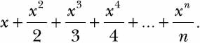
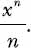
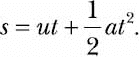
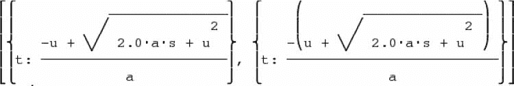
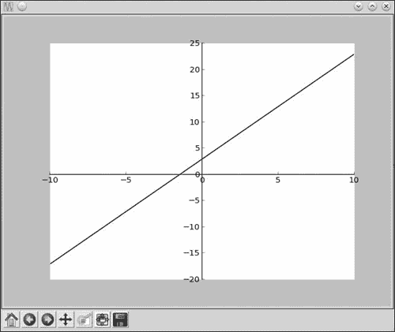
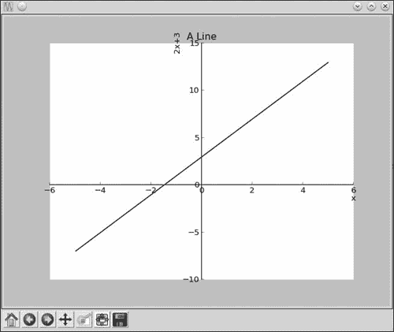
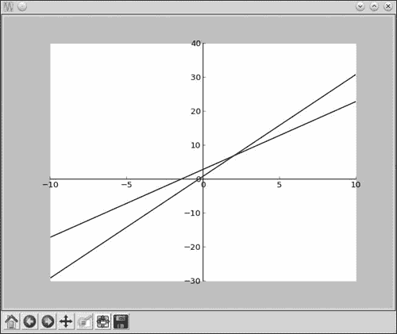
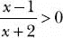

## 第四章：**使用 SymPy 进行代数和符号数学**


到目前为止，我们程序中的数学问题和解决方案都涉及数字的操作。但是，数学的学习和应用还有另一种方式，那就是通过符号以及它们之间的运算。想想典型代数问题中的所有 *x* 和 *y* 吧。我们把这种数学称为 *符号数学*。我相信你一定记得在数学课上那些让人头疼的“因式分解 *x*³ + 3*x*² + 3*x* + 1”的题目。别怕，在这一章中，我们将学习如何编写程序来解决这些问题，甚至更多。为此，我们将使用 *SymPy*——一个 Python 库，它允许你编写包含符号的表达式并对其进行运算。因为这是一个第三方库，你需要在使用它之前先安装它。安装说明请参见附录 A。

### **定义符号和符号运算**

*符号* 是符号数学的构建块。*符号* 这个术语就是指代你在方程式和代数表达式中使用的 *x*、*y*、*a*、*b* 等。创建和使用符号将让我们以不同的方式进行操作。考虑以下语句：

```py
>>> x = 1
>>> x + x + 1
3
```

在这里，我们创建了一个标签 `x`，表示数字 1。然后，当我们写下语句 `x + x + 1` 时，它会被自动计算，结果是 3。那么，如果你希望结果以符号 *x* 来表示呢？也就是说，如果你希望 Python 告诉你结果是 2*x* + 1，而不是 3，你不能直接写 `x + x + 1` *而不*写上语句 `x = 1`，因为 Python 不知道 `x` 指的是什么。

SymPy 让我们编写程序，通过符号来表示和计算数学表达式。要在程序中使用符号，你需要创建一个 `Symbol` 类的对象，像这样：

```py
>>> from sympy import Symbol
>>> x = Symbol('x')
```

首先，我们从 `sympy` 库中导入 `Symbol` 类。然后，我们创建这个类的一个对象，传入 `'x'` 作为参数。请注意，这里的 `'x'` 是作为字符串写在引号中的。现在，我们可以用这个符号来定义表达式和方程。例如，这里是之前的表达式：

```py
>>> from sympy import Symbol
>>> x = Symbol('x')
>>> x + x + 1
2*x + 1
```

现在，结果是以符号 *x* 来表示的。在语句 `x = Symbol('x')` 中，左边的 `x` 是 Python 标签。它是我们之前使用过的标签，只不过这次它表示的是符号 *x*，而不是数字——更具体地说，它是一个表示符号 `'x'` 的 `Symbol` 对象。这个标签不一定非要与符号匹配——我们也可以使用标签 `a` 或 `var1` 等。因此，将之前的语句写成如下也是完全可以的：

```py
>>> a = Symbol('x')
>>> a + a + 1
2*x + 1
```

然而，使用不匹配的标签可能会让人困惑，因此我建议选择与符号相同字母的标签。

**查找由符号对象表示的符号**

对于任何 `Symbol` 对象，它的 `name` 属性是一个字符串，表示它所代表的实际符号：

```py
>>> x = Symbol('x')
>>> x.name
'x'
>>> a = Symbol('x')
>>> a.name
'x'
```

你可以在标签上使用 `.name` 来检索它所存储的符号。

为了明确起见，你创建的符号必须作为字符串指定。例如，你不能通过 `x = Symbol(x)` 来创建符号 *x*——你必须像这样定义它：`x = Symbol('x')`。

要定义多个符号，你可以创建单独的 `Symbol` 对象，或者使用 `symbols()` 函数更简洁地定义它们。假设你想在程序中使用三个符号——*x*、*y* 和 *z*。你可以像之前那样逐个定义它们：

```py
>>> x = Symbol('x')
>>> y = Symbol('y')
>>> z = Symbol('z')
```

但一种更简洁的方法是使用 `symbols()` 函数一次性定义所有三个符号：

```py
>>> from sympy import symbols
>>> x,y,z = symbols('x,y,z')
```

首先，我们从 SymPy 导入 `symbols()` 函数。然后，调用该函数并传入我们想要创建的三个符号，符号名称用逗号分隔。在执行完这行代码后，`x`、`y` 和 `z` 将分别代表符号 `'x'`、`'y'` 和 `'z'`。

一旦你定义了符号，你可以对它们执行基本的数学运算，使用你在第一章中学到的相同运算符（`+`、`-`、`/`、`*` 和 `**`）。例如，你可能会这样做：

```py
>>> from sympy import Symbol
>>> x = Symbol('x')
>>> y = Symbol('y')

>>> s = x*y + x*y
>>> s
2*x*y
```

让我们看看是否能够找到 `x(x + x)` 的积：

```py
>>> p = x*(x + x)
>>> p
2*x**2
```

SymPy 会自动进行这些简单的加法和乘法运算，但如果我们输入更复杂的表达式，它将保持不变。让我们看看当我们输入表达式 `(x + 2)*(x + 3)` 时会发生什么：

```py
>>> p = (x + 2)*(x + 3)
>>> p
(x + 2)*(x + 3)
```

你可能预期 SymPy 会将所有内容展开并输出 `x**2 + 5*x + 6`。然而，表达式被打印得完全和我们输入的一样。SymPy 只会自动简化最基本的表达式，像前面的例子这种情况，需要程序员显式要求简化。如果你想将表达式展开以获得扩展版本，你需要使用 `expand()` 函数，稍后我们会看到如何使用它。

### **处理表达式**

现在我们知道如何定义自己的符号表达式，接下来让我们了解如何在程序中使用它们。

#### ***因式分解与展开表达式***

`factor()` 函数将表达式分解为它的因子，而 `expand()` 函数将表达式展开，表示为各个单独项的和。让我们用基本的代数恒等式 *x*² – *y*² = (*x* + *y*)(*x* – *y*) 来测试这些函数。恒等式的左边是展开后的版本，右边则是相应的因式分解。由于我们有两个符号，接下来我们会创建两个 `Symbol` 对象：

```py
>>> from sympy import Symbol
>>> x = Symbol('x')
>>> y = Symbol('y')
```

接下来，我们导入 `factor()` 函数，并用它将展开版本（恒等式左边）转换为因式分解版本（右边）：

```py
>>> from sympy import factor
>>> expr = x**2 - y**2
>>> factor(expr)
(x - y)*(x + y)
```

正如预期的那样，我们得到了表达式的因式分解版本。现在让我们展开这些因子，恢复成原来的展开版本：

```py
>>> factors = factor(expr)
>>> expand(factors)
x**2 - y**2
```

我们将因式分解的表达式存储在一个新的标签 `factors` 中，然后用它调用 `expand()` 函数。当我们这样做时，我们会得到我们最初的表达式。让我们用更复杂的恒等式 *x*³ + 3*x*²*y* + 3*xy*² + *y*³ = (*x* + *y*)³ 来试试：

```py
>>> expr = x**3 + 3*x**2*y + 3*x*y**2 + y**3
>>> factors = factor(expr)
>>> factors
(x + y)**3

>>> expand(factors)
x**3 + 3*x**2*y + 3*x*y**2 + y**3
```

`factor()` 函数能够对表达式进行因式分解，然后 `expand()` 函数会展开已因式分解的表达式，返回原始表达式。

如果你尝试对无法因式分解的表达式进行因式分解，`factor()` 函数会返回原始表达式。例如，见下：

```py
>>> expr = x + y + x*y
>>> factor(expr)
x*y + x + y
```

同样，如果你将一个不能进一步展开的表达式传递给 `expand()`，它将返回相同的表达式。

#### ***漂亮打印***

如果你希望我们一直在处理的表达式在打印时看起来更美观，可以使用 `pprint()` 函数。这个函数会以一种更接近我们通常在纸上书写的方式打印表达式。例如，下面是一个表达式：

```py
>>> expr = x*x + 2*x*y + y*y
```

如果我们像之前那样打印，或者使用 `print()` 函数，结果如下所示：

```py
>>> expr
x**2 + 2*x*y + y**2
```

现在，让我们使用 `pprint()` 函数打印上面的表达式：

```py
>>> from sympy import pprint
>>> pprint(expr)
x2 + 2·x·y + y2
```

现在，表达式看起来干净多了——例如，指数出现在数字的上方，而不是一堆丑陋的星号。

你还可以在打印表达式时改变项的顺序。考虑表达式 1 + 2*x* + 2*x*²：

```py
>>> expr = 1 + 2*x + 2*x**2
>>> pprint(expr)
2·x2 + 2·x + 1
```

这些项按 *x* 的幂次顺序排列，从最高到最低。如果你希望以相反的顺序打印表达式，即将 *x* 的最高次幂放在最后，可以通过以下方式使用 `init_printing()` 函数来实现：

```py
>>> from sympy import init_printing
>>> init_printing(order='rev-lex')
>>> pprint(expr)
1 + 2·x + 2·x2
```

`init_printing()` 函数首先被导入并调用，使用关键字参数 `order='rev-lex'`。这表示我们希望 SymPy 打印表达式时按照 *逆字典顺序* 排列。在这种情况下，关键字参数告诉 Python 先打印低次幂的项。

**注意**

*虽然我们在这里使用了* `init_printing()` *函数来设置表达式的打印顺序，但这个函数可以以许多其他方式使用，以配置如何打印表达式。欲了解更多选项以及如何在 SymPy 中打印，参见文档：[`docs.sympy.org/latest/tutorial/printing.html`](http://docs.sympy.org/latest/tutorial/printing.html)。*

让我们应用到目前为止学到的内容，来实现一个序列打印程序。

##### **打印一个序列**

考虑以下序列：



让我们编写一个程序，要求用户输入一个数字 *n*，并打印该数字的序列。在这个序列中，*x* 是一个符号，*n* 是程序用户输入的整数。该序列中的第 *n* 项由以下公式给出：



我们可以使用以下程序打印这个序列：

```py
   '''
   Print the series:
   x + x**2 + x**3 + ... + x**n
       ____  _____         _____
         2    3              n
   '''

   from sympy import Symbol, pprint, init_printing
   def print_series(n):

       # Initialize printing system with reverse order
       init_printing(order='rev-lex')

       x = Symbol('x')
➊     series = x
➋         for i in range(2, n+1):
➌         series = series + (x**i)/i
       pprint(series)

   if __name__ == '__main__':
       n = input('Enter the number of terms you want in the series: ')
➍     print_series(int(n))
```

`print_series()` 函数接受一个整数 `n` 作为参数，这是将要打印的级数的项数。请注意，我们在调用该函数时，在 ➍ 处使用 `int()` 函数将输入转换为整数。然后，我们调用 `init_printing()` 函数，将级数设置为按反向字典顺序打印。

在 ➊，我们创建标签 `series`，并将其初始值设置为 `x`。然后，在 ➋，我们定义一个 `for` 循环，循环遍历从 2 到 `n` 的整数。每次循环迭代时，都会将每一项加到 `series` 中，具体如下：

```py
i = 2, series = x + x**2 / 2
i = 3, series = x + x**2/2 + x**3/3

--snip--
```

`series` 的值开始时只是单纯的 `x`，但随着每次迭代，`x**i/i` 会被添加到 `series` 的值中，直到完成我们想要的级数。你可以看到 SymPy 加法在这里得到了很好的应用。最后，使用 `pprint()` 函数打印出级数。

当你运行程序时，它会提示你输入一个数字，然后打印出直到该项的级数：

```py
Enter the number of terms you want in the series: 5

    x2 x3 x4 x5
x + -- + -- + -- + --
    2    3    4    5
```

每次尝试使用不同数量的项。接下来，我们将看到如何计算在特定值的*x*下，这个级数的和。

#### ***替代数值***

让我们看看如何使用 SymPy 将数值代入代数表达式中。这将使我们能够计算在特定变量值下的表达式值。考虑以下数学表达式 *x*² + 2*xy* + *y*²，它可以定义如下：

```py
>>> x = Symbol('x')
>>> y = Symbol('y')
>>> x*x + x*y + x*y + y*y
x**2 + 2*x*y + y**2
```

如果你想要计算这个表达式，你可以使用 `subs()` 方法将数字替代符号：

```py
➊ >>> expr = x*x + x*y + x*y + y*y
   >>> res = expr.subs({x:1, y:2})
```

首先，我们创建一个新的标签来引用 ➊ 处的表达式，然后调用 `subs()` 方法。`subs()` 方法的参数是一个 Python *字典*，其中包含两个符号标签和我们想要替代每个符号的数值。让我们来看看结果：

```py
>>> res
9
```

你还可以将一个符号表示为另一个符号，并根据需要进行替代，使用 `subs()` 方法。例如，如果你知道 *x* = 1 – *y*，你可以通过以下方式计算前面的表达式：

```py
>>> expr.subs({x:1-y})
y**2 + 2*y*(-y + 1) + (-y + 1)**2
```

**PYTHON 字典**

字典是 Python 中的另一种数据结构（列表和元组是其他数据结构的例子，你之前见过）。字典包含键值对，放在大括号内，其中每个键与一个值匹配，并通过冒号分隔。在前面的代码示例中，我们将字典 `{x:1, y:2}` 作为参数传递给 `subs()` 方法。这个字典包含两个键值对——`x:1` 和 `y:2`，其中 `x` 和 `y` 是键，`1` 和 `2` 是相应的值。你可以通过在方括号中输入关联的键来从字典中检索一个值，就像我们通过索引从列表中检索元素一样。例如，在这里我们创建了一个简单的字典，然后检索与 `key1` 相关联的值：

```py
>>> sampledict = {"key1": 5, "key2": 20}
>>> sampledict["key1"]
5
```

要了解更多关于字典的内容，请参见 附录 B。

如果你希望进一步简化结果——例如，如果有些项可以互相抵消，我们可以使用 SymPy 的 `simplify()` 函数，方法如下：

```py
➊ >>> expr_subs = expr.subs({x:1-y})
   >>> from sympy import simplify
➋ >>> simplify(expr_subs)
   1
```

在 ➊ 处，我们创建了一个新标签 `expr_subs`，用来表示将 *x* = 1 – *y* 代入表达式后的结果。然后我们从 SymPy 导入 `simplify()` 函数，并在 ➋ 处调用它。结果是 1，因为表达式中的其他项相互抵消了。

尽管在前面的示例中有一个简化版本的表达式，但你必须通过 `simplify()` 函数来请求 SymPy 对其进行简化。再一次，这是因为 SymPy 不会自动简化任何表达式，除非明确要求。

`simplify()` 函数还可以简化复杂的表达式，例如包括对数和三角函数的表达式，但我们这里不会深入讨论。

##### **计算级数的值**

让我们重新审视一下级数打印程序。除了打印级数之外，我们希望程序能够计算给定 *x* 值时，级数的和。也就是说，我们的程序现在将从用户那里接收两个输入——级数项数和要计算级数值的 *x* 值。然后，程序将输出级数和级数的和。以下程序扩展了级数打印程序，加入了这些功能：

```py
   '''
   Print the series:
   x + x**2 + x**3 + ... + x**n
       ____  _____         _____
         2     3             n
   '''

   from sympy import Symbol, pprint, init_printing
   def print_series(n, x_value):

       # Initialize printing system with reverse order
       init_printing(order='rev-lex')

       x = Symbol('x')
       series = x
       for i in range(2, n+1):
           series = series + (x**i)/i

       pprint(series)

       # Evaluate the series at x_value
➊     series_value = series.subs({x:x_value})
       print('Value of the series at {0}: {1}'.format(x_value, series_value))

   if __name__ == '__main__':
       n = input('Enter the number of terms you want in the series: ')
➋     x_value = input('Enter the value of x at which you want to evaluate the series: ')

       print_series(int(n), float(x_value))
```

`print_series()` 函数现在需要一个额外的参数 `x_value`，它是我们用于计算级数的 *x* 值。在 ➊ 处，我们使用 `subs()` 方法来执行评估，并用标签 `series_value` 来表示结果。在接下来的代码行中，我们显示该结果。

在 ➋ 处新增的输入语句要求用户输入 `x` 的值，使用 `x_value` 标签来引用它。在调用 `print_series()` 函数之前，我们使用 `float()` 函数将该值转换为浮动点数。

如果现在运行程序，它将要求你输入这两个参数，并打印出级数和级数值：

```py
Enter the number of terms you want in the series: 5
Enter the value of x at which you want to evaluate the series: 1.2

    x2 x3 x4 x5
x + -- + -- + -- + --
    2    3    4    5
Value of the series at 1.2: 3.51206400000000
```

在这个示例运行中，我们请求输入五项级数，其中 `x` 设置为 1.2，程序会打印并计算该级数。

#### ***将字符串转换为数学表达式***

到目前为止，我们每次想要处理一个表达式时，都需要手动写出单独的表达式。但是，如果你想编写一个更通用的程序，能够处理用户提供的任何表达式呢？为此，我们需要一种方法，将用户输入的字符串转换为我们可以进行数学运算的形式。SymPy 的 `sympify()` 函数正是用来完成这个任务的。之所以称为“sympify”，是因为它将字符串转换为一个 SymPy 对象，这样就可以对输入应用 SymPy 的函数了。让我们看一个例子：

```py
➊ >>> from sympy import sympify
   >>> expr = input('Enter a mathematical expression: ')
   Enter a mathematical expression: x**2 + 3*x + x**3 + 2*x
➋ >>> expr = sympify(expr)
```

我们首先在 ➊ 导入 `sympify()` 函数。然后，我们使用 `input()` 函数请求输入一个数学表达式，并使用标签 `expr` 来引用它。接下来，在 ➋ 我们调用 `sympify()` 函数，并将 `expr` 作为参数传入，使用相同的标签引用转换后的表达式。

你可以对这个表达式执行各种操作。例如，让我们尝试将表达式乘以 2：

```py
>>> 2*expr
2*x**3 + 2*x**2 + 10*x
```

当用户提供无效的表达式时会发生什么呢？我们来看一下：

```py
>>> expr = input('Enter a mathematical expression: ')
Enter a mathematical expression: x**2 + 3*x + x**3 + 2x
>>> expr = sympify(expr)
Traceback (most recent call last):
  File "<pyshell#146>", line 1, in <module>
    expr = sympify(expr)
  File "/usr/lib/python3.3/site-packages/sympy/core/sympify.py", line 180, in sympify
    raise SympifyError('could not parse %r' % a)
sympy.core.sympify.SympifyError: SympifyError: "could not parse 'x**2 + 3*x + x**3 + 2x'"
```

最后一行告诉我们 `sympify()` 无法转换提供的输入表达式。由于这个用户没有在 `2` 和 `x` 之间加上运算符，SymPy 不明白它的意思。你的程序应该预期到这种无效输入，并在出现时打印错误信息。我们来看一下如何通过捕获 `SympifyError` 异常来实现：

```py
>>> from sympy import sympify
>>> from sympy.core.sympify import SympifyError
>>> expr = input('Enter a mathematical expression: ')
Enter a mathematical expression: x**2 + 3*x + x**3 + 2x
>>> try:
    expr = sympify(expr)
except SympifyError:
    print('Invalid input')

Invalid input
```

前面程序的两个改动是，我们从 `sympy.core.sympify` 模块导入了 `SympifyError` 异常类，并在 `try...except` 块中调用了 `sympify()` 函数。现在，如果出现 `SympifyError` 异常，就会打印错误信息。

##### **表达式乘法器**

让我们应用 `sympify()` 函数编写一个程序来计算两个表达式的乘积：

```py
   '''
   Product of two expressions
   '''

   from sympy import expand, sympify
   from sympy.core.sympify import SympifyError

   def product(expr1, expr2):
       prod = expand(expr1*expr2)
       print(prod)

   if __name__=='__main__':
➊     expr1 = input('Enter the first expression: ')
➋     expr2 = input('Enter the second expression: ')

       try:
           expr1 = sympify(expr1)
           expr2 = sympify(expr2)
       except SympifyError:
           print('Invalid input')
       else:
➌         product(expr1, expr2)
```

在 ➊ 和 ➋，我们要求用户输入两个表达式。然后，我们使用 `sympify()` 函数将其转换为 SymPy 可以理解的形式，并放在 `try...except` 块中。如果转换成功（由 `else` 块指示），我们在 ➌ 调用 `product()` 函数。在这个函数中，我们计算两个表达式的乘积并打印出来。请注意，我们如何使用 `expand()` 函数打印乘积，使得所有的项都作为其组成项的和来表示。

下面是程序的示例执行：

```py
Enter the first expression: x**2 + x*2 + x
Enter the second expression: x**3 + x*3 + x
x**5 + 3*x**4 + 4*x**3 + 12*x**2
```

最后一行显示了两个表达式的乘积。输入中也可以包含多个符号在任意一个表达式中：

```py
Enter the first expression: x*y+x
Enter the second expression: x*x+y
x**3*y + x**3 + x*y**2 + x*y
```

### **求解方程**

SymPy 的 `solve()` 函数可以用来求解方程。当你输入一个包含表示变量的符号（如 *x*）的表达式时，`solve()` 会计算该符号的值。此函数总是通过假设你输入的表达式等于零来进行计算——也就是说，它会输出当该符号被代入时，使整个表达式等于零的值。让我们从简单的方程 *x* – 5 = 7 开始。如果我们想使用 `solve()` 来求解 `x` 的值，我们首先需要将方程的一边变为零（*x* – 5 – 7 = 0）。然后，我们就可以使用 `solve()` 了，如下所示：

```py
>>> from sympy import Symbol, solve
>>> x = Symbol('x')
>>> expr = x - 5 - 7
>>> solve(expr)
[12]
```

当我们使用 `solve()` 时，它计算出 `'x'` 的值为 12，因为这是使得表达式 (*x* – 5 – 7) 等于零的值。

注意，结果 12 以列表的形式返回。一个方程可以有多个解——例如，一个二次方程有两个解。在这种情况下，列表会包含所有解作为其成员。你还可以要求`solve()`函数返回结果，每个成员作为字典。每个字典由符号（变量名）及其值（解）组成。当求解联立方程时，这种方式特别有用，因为我们有多个变量需要求解，返回字典格式的解能够帮助我们知道每个解对应哪个变量。

#### ***求解二次方程***

在第一章中，我们通过写出二次方程*ax*² + *bx* + *c* = 0 的两根公式，并代入常数*a*、*b*和*c*的值来求解方程的根。现在，我们将学习如何使用 SymPy 的`solve()`函数来求解根，而无需写出公式。让我们看一个例子：

```py
➊ >>> from sympy import solve
   >>> x = Symbol('x')
➋ >>> expr = x**2 + 5*x + 4
➌ >>> solve(expr, dict=True)
➍ [{x: -4}, {x: -1}]
```

`solve()`函数首先在➊处被导入。然后，我们在➋处定义一个符号`x`，并编写与二次方程`x**2 + 5*x + 4`相对应的表达式。接着，在➌处调用`solve()`函数来解这个方程。传递给`solve()`函数的第二个参数（`dict=True`）指定我们希望结果以 Python 字典的列表形式返回。

返回列表中的每个解都是一个字典，字典使用符号作为键，并与其对应的值匹配。如果解为空，将返回一个空列表。前面方程的根是-4 和-1，如你在➍处看到的那样。

我们在第一章中发现，方程的根是

*x*² + *x* + 1 = 0

这些是复数。我们来尝试使用`solve()`求解它们：

```py
>>> x=Symbol('x')
>>> expr = x**2 + x + 1
>>> solve(expr, dict=True)
[{x: -1/2 - sqrt(3)*I/2}, {x: -1/2 + sqrt(3)*I/2}]
```

这两个根都是虚数，正如预期的那样，虚部由`I`符号表示。

#### ***求解一个变量并表示为其他变量的函数***

除了求解方程的根，我们还可以利用符号计算，使用`solve()`函数将方程中一个变量用其他变量表示。让我们来看一个求解通用二次方程*ax*² + *bx* + *c* = 0 的例子。为此，我们将定义*x*和三个额外的符号——*a*、*b*和*c*，它们分别对应三个常数：

```py
>>> x = Symbol('x')
>>> a = Symbol('a')
>>> b = Symbol('b')
>>> c = Symbol('c')
```

接下来，我们编写与方程对应的表达式，并对其使用`solve()`函数：

```py
>>> expr = a*x*x + b*x + c
>>> solve(expr, x, dict=True)
[{x: (-b + sqrt(-4*a*c + b**2))/(2*a)}, {x: -(b + sqrt(-4*a*c + b**2))/(2*a)}]
```

在这里，我们必须为`solve()`函数添加一个额外的参数`x`。因为方程中有多个符号，我们需要告诉`solve()`应解哪个符号，这就是为什么我们将`x`作为第二个参数传递给它。正如我们所预期的，`solve()`打印出了二次公式：用于求解多项式表达式中*x*值的通用公式。

为了明确，当我们对包含多个符号的方程使用`solve()`时，我们将要求解的符号作为第二个参数指定（而现在，第三个参数指定我们希望如何返回结果）。

接下来，让我们考虑一个物理学中的例子。根据运动方程之一，物体在初速度*u*和恒定加速度*a*下，在时间*t*内所走的距离*s*可以表示为：



然而，给定*u*和*a*，如果你想找出在给定距离*s*下所需的时间*t*，你必须首先将*t*表示为其他变量的函数。下面是如何使用 SymPy 的`solve()`函数来做到这一点：

```py
>>> from sympy import Symbol, solve, pprint
>>> s = Symbol('s')
>>> u = Symbol('u')
>>> t = Symbol('t')
>>> a = Symbol('a')
>>> expr = u*t + (1/2)*a*t*t - s
>>> t_expr = solve(expr,t, dict=True)
>>> pprint(t_expr)
```

结果如下所示：



现在，我们有了*t*的表达式（由标签`t_expr`表示），可以使用`subs()`方法替换*s*、*u*和*a*的值，从而找到*t*的两个可能值。

#### ***求解线性方程组***

考虑以下两个方程：

2*x* + 3*y* = 6

3*x* + 2*y* = 12

假设我们想找到满足这两个方程的值对(*x*, *y*)。我们可以使用`solve()`函数来求解像这样的方程组。

首先，我们定义这两个符号并创建这两个方程：

```py
>>> x = Symbol('x')
>>> y = Symbol('y')
>>> expr1 = 2*x + 3*y - 6
>>> expr2 = 3*x + 2*y – 12
```

这两个方程分别由`expr1`和`expr2`表示。注意我们是如何重新排列表达式，使它们都等于零（我们将给定方程的右边移到了左边）。为了找到解，我们调用`solve()`函数，并将这两个表达式组成一个元组：

```py
>>> solve((expr1, expr2), dict=True)
[{y: -6/5, x: 24/5}]
```

正如我之前提到的，得到一个字典形式的解在这里是非常有用的。我们可以看到`x`的值是 24/5，`y`的值是–6/5。让我们验证一下我们得到的解是否真的满足这些方程。为此，我们首先创建一个标签`soln`来表示我们得到的解，然后使用`subs()`方法将`x`和`y`的对应值代入两个表达式中：

```py
>>> soln = solve((expr1, expr2), dict=True)
>>> soln = soln[0]
>>> expr1.subs({x:soln[x], y:soln[y]})
0
>>> expr2.subs({x:soln[x], y:soln[y]})
0
```

将`x`和`y`的值代入两个表达式中得到的结果是零。

### **使用 SymPy 绘图**

在第二章中，我们学会了绘制图形，其中我们明确指定了要绘制的数字。例如，要绘制重力与两个物体之间距离的关系图，你需要为每个距离值计算重力，并将距离和重力的列表提供给 matplotlib。而使用 SymPy，你只需要告诉 SymPy 你想绘制的直线方程，图形就会为你创建出来。让我们绘制一个方程为*y* = 2*x* + 3 的直线：

```py
>>> from sympy.plotting import plot
>>> from sympy import Symbol
>>> x = Symbol('x')
>>> plot(2*x+3)
```

我们只需要导入`plot`和`Symbol`，创建一个符号`x`，然后调用`plot()`函数，并传入表达式`2*x+3`。SymPy 会处理其余的工作，绘制出该函数的图形，如图 4-1 所示。



*图 4-1：* y = *2*x + *3 的线性图*

图表显示了一个自动选择的默认*x*值范围：-10 到 10。你可能注意到，图表窗口看起来与第二章和第三章中看到的非常相似。这是因为 SymPy 在后台使用 matplotlib 来绘制图表。还要注意，我们不需要调用`show()`函数来显示图表，因为 SymPy 会自动完成这项工作。

假设你想将前面图表中`'x'`的值限制在-5 到 5 的范围内（而不是-10 到 10）。你可以按照以下方式进行：

```py
>>> plot((2*x + 3), (x, -5, 5))
```

这里，指定了一个包含符号、下限和上限范围的元组——`(x, -5, 5)`，作为`plot()`函数的第二个参数。现在，图表仅显示与-5 到 5 之间*x*值对应的*y*值（见图 4-2）。


*图 4-2：* y = *2*x + *3 的线性图，*x*的值限制在-5 到 5 的范围内*

你可以在`plot()`函数中使用其他关键字参数，比如`title`来输入标题，或者使用`xlabel`和`ylabel`来分别标记*x*-轴和*y*-轴。以下`plot()`函数指定了前面提到的三个关键字参数（参见图 4-3 中的相应图表）：

```py
>>> plot(2*x + 3, (x, -5, 5), title='A Line', xlabel='x', ylabel='2x+3')
```



*图 4-3：* y = *2*x + *3 的线性图，*x*的范围和其他属性已指定*

在图 4-3 中显示的图表现在有了标题和*x*-轴与*y*-轴的标签。你还可以向`plot()`函数指定其他一些关键字参数，以自定义函数和图表本身的行为。`show`关键字参数允许我们指定是否希望显示图表。当你调用`plot()`函数时，传入`show=False`将导致图表不显示：

```py
>>> p = plot(2*x + 3, (x, -5, 5), title='A Line', xlabel='x', ylabel='2x+3', show=False)
```

你会看到没有图表显示。标签`p`指的是创建的图表，因此你现在可以调用`p.show()`来显示图表。你还可以使用`save()`方法将图表保存为图像文件，如下所示：

```py
>>> p.save('line.png')
```

这将把图表保存为当前目录下的*line.png*文件。

#### ***用户输入的表达式绘图***

你传递给`plot()`函数的表达式必须仅以*x*为变量。例如，我们之前绘制了*y* = 2*x* + 3，并将其直接作为 2*x* + 3 输入到`plot()`函数中。如果表达式最初不是这个形式，我们就需要重写它。当然，我们可以在程序外部手动完成这个过程。但是，如果你想编写一个允许用户绘制任意表达式的程序呢？假设用户输入一个形式为 2*x* + 3*y* – 6 的表达式，我们就需要先将其转换。`solve()`函数可以在这里帮助我们。我们来看一个例子：

```py
   >>> expr = input('Enter an expression: ')
   Enter an expression: 2*x + 3*y - 6
➊ >>> expr = sympify(expr)
➋ >>> y = Symbol('y')
   >>> solve(expr, y)
➌ [-2*x/3 + 2]
```

在 ➊ 处，我们使用 `sympify()` 函数将输入的表达式转换为 SymPy 对象。在 ➋ 处，我们创建一个 `Symbol` 对象来表示 `'y'`，以便告诉 SymPy 我们希望解方程的变量。然后，我们通过将 `y` 作为第二个参数传递给 `solve()` 函数来解出表达式，从而找到 `y` 关于 `x` 的解。 在 ➌ 处，这将返回以 `x` 为变量的方程，这是绘图所需要的。

请注意，这个最终的表达式存储在一个列表中，因此在使用它之前，我们必须从列表中提取它：

```py
   >>> solutions = solve(expr, 'y')
➍ >>> expr_y = solutions[0]
   >>> expr_y
   -2*x/3 + 2
```

我们创建一个标签 `solutions`，用来表示 `solve()` 函数返回的结果，它是一个仅包含一个项的列表。然后，我们在 ➍ 处提取该项。现在，我们可以调用 `plot()` 函数来绘制该表达式。接下来的代码展示了一个完整的绘图程序：

```py
'''
Plot the graph of an input expression
'''

from sympy import Symbol, sympify, solve
from sympy.plotting import plot

def plot_expression(expr):

    y = Symbol('y')
    solutions = solve(expr, y)
    expr_y = solutions[0]
    plot(expr_y)

if __name__=='__main__':

    expr = input('Enter your expression in terms of x and y: ')

    try:
        expr = sympify(expr)
    except SympifyError:
        print('Invalid input')
    else:
        plot_expression(expr)
```

请注意，前面的程序包括一个 `try...except` 块来检查无效输入，就像我们之前使用 `sympify()` 一样。当您运行程序时，它会要求您输入一个表达式，并创建相应的图表。

#### ***绘制多个函数***

您可以在调用 SymPy 的 `plot` 函数时输入多个表达式，将多个表达式绘制在同一张图上。例如，以下代码一次绘制两条线（见 图 4-4）：

```py
>>> from sympy.plotting import plot
>>> from sympy import Symbol
>>> x = Symbol('x')
>>> plot(2*x+3, 3*x+1)
```



*图 4-4：在同一张图上绘制两条线*

这个例子展示了在 matplotlib 和 SymPy 中绘图的另一个区别。在 SymPy 中，两个线条是相同颜色的，而 matplotlib 会自动使线条呈现不同颜色。要在 SymPy 中为每条线设置不同的颜色，我们需要执行一些额外的步骤，如下所示的代码，这段代码还向图表中添加了图例：

```py
   >>> from sympy.plotting import plot
   >>> from sympy import Symbol
   >>> x = Symbol('x')
➊ >>> p = plot(2*x+3, 3*x+1, legend=True, show=False)
➋ >>> p[0].line_color = 'b'
➌ >>> p[1].line_color = 'r'
   >>> p.show()
```

在 ➊ 处，我们调用 `plot()` 函数，并传入两个线条的方程式，同时传递两个额外的关键字参数——`legend` 和 `show`。通过将 `legend` 参数设置为 `True`，我们向图表中添加了图例，就像在第二章中看到的那样。不过请注意，图例中显示的文本将与您绘制的表达式一致——您不能指定其他文本。我们还将 `show=False` 设置为 `False`，因为我们希望在绘制图表之前先设置线条的颜色。在 ➋ 处的语句 `p[0]` 指代第一个线条 2*x* + 3，我们将其属性 `line_color` 设置为 `'b'`，表示我们希望这条线是蓝色的。同样，我们使用字符串 `'r'` 设置第二条线的颜色为红色 ➌。最后，我们调用 `show()` 来显示图表（见 图 4-5）。


*图 4-5：两条线的绘制，每条线采用不同的颜色*

除了红色和蓝色，您还可以使用绿色、青色、品红色、黄色、黑色和白色绘制线条（每种颜色使用该颜色的首字母）。

### **您学到的内容**

在本章中，你学习了使用 SymPy 进行符号数学的基础知识。你了解了如何声明符号、使用符号和数学运算符构建表达式、求解方程和绘制图形。在后续章节中，你将学习 SymPy 的更多功能。

### **编程挑战**

以下是一些编程挑战，帮助你进一步应用所学的知识。你可以在*[`www.nostarch.com/doingmathwithpython/`](http://www.nostarch.com/doingmathwithpython/)*找到示例解答。

#### ***#1: 因数查找器***

你学会了`factor()`函数，它用于打印表达式的因数。现在你知道程序如何处理用户输入的表达式，写一个程序，让用户输入一个表达式，计算它的因数并打印出来。你的程序应该能够通过异常处理来应对无效的输入。

#### ***#2: 图形方程求解器***

之前，你学会了如何编写一个程序，让用户输入类似于 3*x* + 2*y* - 6 的表达式并绘制相应的图形。编写一个程序，要求用户输入两个表达式，然后同时绘制它们的图形，示例如下：

```py
>>> expr1 = input('Enter your first expression in terms of x and y: ')
>>> expr2 = input('Enter your second expression in terms of x and y: ')
```

现在，`expr1`和`expr2`将存储用户输入的两个表达式。你应该使用`try...except`块中的`sympify()`步骤，将这两个表达式转换为 SymPy 对象。

接下来，你只需要绘制这两个表达式，而不是一个。

完成此操作后，增强程序的功能，打印出解—即同时满足这两个方程的*x*和*y*值。这也将是图中两条线交点的位置。（提示：参考我们如何使用`solve()`函数来求解两个线性方程组的解。）

#### ***#3: 求序列和***

我们在《打印序列》中看到过如何求一个序列的和，该内容位于第 99 页。在那里，我们通过循环遍历所有项手动相加。以下是该程序的一部分：

```py
for i in range(2, n+1):
    series = series + (x**i)/i
```

SymPy 的`summation()`函数可以直接用于求和。以下示例打印了我们之前讨论的序列前五项的和：

```py
   >>> from sympy import Symbol, summation, pprint
   >>> x = Symbol('x')
   >>> n = Symbol('n')
➊ >>> s = summation(x**n/n, (n, 1, 5))
   >>> pprint(s)
   x5   x4   x3   x2
   -- + -- + -- + -- + x
   5     4   3     2
```

我们在➊处调用了`summation()`函数，第一个参数是序列的*第 n*项，第二个参数是一个元组，表示*n*的范围。我们这里要求前五项的和，因此第二个参数为`(n, 1, 5)`。

一旦得到了和，你可以使用`subs()`方法为*x*替换一个值，从而得到和的数值：

```py
>>> s.subs({x:1.2})
3.51206400000000
```

你的挑战是编写一个程序，能够根据你提供的序列的*第 n*项和项数，求出该序列的和。以下是程序如何工作的示例：

```py
Enter the nth term: a+(n-1)*d
Enter the number of terms: 3
3·a + 3·d
```

在这个例子中，提供的第 *n* 项是一个 *等差数列*。从`a`和`d`作为 *公差* 开始，求和的项数为 3。求和结果是 `3a + 3d`，这与已知的公式一致。

#### ***#4: 解单变量不等式***

你已经学会了如何使用 SymPy 的`solve()`函数解方程。但是，SymPy 也能够解单变量不等式，例如 *x* + 5 > 3 和 sin*x* – 0.6 > 0。也就是说，SymPy 不仅能解等式，还能解不等式，如 >、< 等。因此，创建一个名为`isolve()`的函数，它可以接受任何不等式，解出并返回解决方案。

首先，让我们了解一下 SymPy 中可以帮助你实现这些功能的函数。解不等式的函数分为三个独立的函数：用于多项式、不等式和其他所有不等式的函数。我们需要选择正确的函数来解不同的不等式，否则会遇到错误。

*多项式*是由一个变量和系数组成的代数表达式，仅涉及加法、减法和乘法运算，并且只有变量的正整数次幂。一个多项式不等式的例子是 *x*² + 4 < 0。

要解多项式不等式，使用 `solve_poly_inequality()` 函数：

```py
   >>> from sympy import Poly, Symbol, solve_poly_inequality
   >>> x = Symbol('x')
➊ >>> ineq_obj = -x**2 + 4 < 0
➋ >>> lhs = ineq_obj.lhs
➌ >>> p = Poly(lhs, x)
➍ >>> rel = ineq_obj.rel_op
   >>> solve_poly_inequality(p, rel)
   [(-oo, -2), (2, oo)]
```

首先，在 ➊ 创建表示不等式的表达式 –*x*² + 4 < 0，并用标签`ineq_obj`来引用此表达式。接着，使用 `lhs` 属性在 ➋ 提取不等式的左边部分——也就是代数表达式 –*x*² + 4。然后，在 ➌ 创建一个 `Poly` 对象来表示我们在 ➋ 提取的多项式。创建对象时传入的第二个参数是代表变量 `x` 的符号对象。接下来，在 ➍ 使用 `rel` 属性从不等式对象中提取关系运算符。最后，使用 `solve_poly_inequality()` 函数，传入多项式对象 `p` 和关系符号 `rel` 作为两个参数。程序将返回一个由元组组成的解决方案列表，每个元组表示不等式的解，包含数值范围的下限和上限。对于这个不等式，解是所有小于 –2 的数和所有大于 2 的数。

*有理表达式*是一个代数表达式，其中分子和分母都是多项式。这里有一个有理不等式的例子：



对于有理不等式，使用 `solve_rational_inequalities()` 函数：

```py
   >>> from sympy import Symbol, Poly, solve_rational_inequalities
   >>> x = Symbol('x')
➊ >>> ineq_obj = ((x-1)/(x+2)) > 0
   >>> lhs = ineq_obj.lhs
➋ >>> numer, denom = lhs.as_numer_denom()
   >>> p1 = Poly(numer)
   >>> p2 = Poly(denom)
   >>> rel = ineq_obj.rel_op
➌ >>> solve_rational_inequalities([[((p1, p2), rel)]])
   (-oo, -2) U (1, oo)
```

创建一个表示我们示例有理不等式的对象，位于➊，然后使用`lhs`属性提取有理表达式。通过`as_numer_denom()`方法在➋处将分子和分母分别提取为`numer`和`denom`标签，它会返回一个包含分子和分母的元组。然后，创建两个多项式对象`p1`和`p2`，分别表示分子和分母。获取关系运算符并调用`solve_rational_inequalities()`函数，将两个多项式对象——`p1`和`p2`——以及关系运算符传递给它。

程序返回解`(-oo, -2) U (1, oo)`，其中`U`表示解是两个*集合*的*并集*，这些集合分别包含所有小于–2 的数和所有大于 1 的数。（我们将在第五章中学习集合。）

最后，sin*x* – 0.6 > 0 是一个既不属于多项式也不属于有理表达式类别的不等式示例。如果你有这样的不等式需要求解，可以使用`solve_univariate_inequality()`函数：

```py
>>> from sympy import Symbol, solve, solve_univariate_inequality, sin
>>> x = Symbol('x')
>>> ineq_obj = sin(x) - 0.6 > 0
>>> solve_univariate_inequality(ineq_obj, x, relational=False)
(0.643501108793284, 2.49809154479651)
```

创建一个表示不等式`sin(x) – 0.6 > 0`的不等式对象，然后调用`solve_univariate_inequality()`函数，第一个和第二个参数为不等式对象`ineq_obj`和符号对象`x`。关键字参数`relational=False`指定函数返回解时应以*集合*的形式返回。该不等式的解最终是所有位于程序返回的元组的第一个和第二个成员之间的数字。

##### **提示：实用函数**

现在记住——你的挑战是（1）创建一个函数`isolve()`，它将接受任何不等式，(2) 选择本节中讨论的适当函数来求解它并返回解。以下提示可能对实现此函数有所帮助。

`is_polynomial()`方法可以用来检查一个表达式是否为多项式：

```py
>>> x = Symbol('x')
>>> expr = x**2 - 4
>>> expr.is_polynomial()
True
>>> expr = 2*sin(x) + 3
>>> expr.is_polynomial()
False
```

`is_rational_function()`可以用来检查一个表达式是否为有理表达式：

```py
>>> expr = (2+x)/(3+x)
>>> expr.is_rational_function()
True
>>> expr = 2+x
>>> expr.is_rational_function()
True
>>> expr = 2+sin(x)
>>> expr.is_rational_function()
False
```

`sympify()`函数可以将表示为字符串的不等式转换为不等式对象：

```py
>>> from sympy import sympify
>>> sympify('x+3>0')
x + 3 > 0
```

当你运行程序时，它应该要求用户输入不等式表达式并打印出解。
