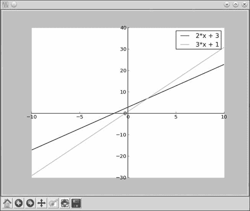

## **4**

**代数与符号数学与 SymPy**

到目前为止，我们程序中的数学问题和解决方案都涉及了数字的运算。但是，数学的另一种教学、学习和实践方式是通过符号及其运算。想想看，典型代数问题中那些* x *和* y *。我们将这种类型的数学称为*符号数学*。我相信你还记得数学课上那些让人头疼的“因式分解 *x*³ + 3*x*² + 3*x* + 1”问题吧。别害怕，在这一章中，我们将学习如何编写程序来解决这些问题，甚至更多。为此，我们将使用*SymPy*——一个允许你编写包含符号的表达式并对其进行运算的 Python 库。由于这是一个第三方库，你需要在使用它之前进行安装。安装说明在附录 A 中有描述。

### **定义符号与符号运算**

*符号*是符号数学的构建块。术语*符号*只是一个通用名称，指代你在方程式和代数表达式中使用的*x*、*y*、*a*和*b*。创建和使用符号将使我们以不同的方式进行操作。考虑以下语句：

>>> x = 1

>>> x + x + 1

3

在这里，我们创建了一个标签 x，来表示数字 1。然后，当我们写出语句 x + x + 1 时，它会自动为我们计算，结果是 3。假设你希望结果以符号*x*的形式表示呢？也就是说，如果你希望 Python 告诉你结果是 2*x* + 1，而不是 3 呢？你不能仅仅写 x + x + 1*而不*声明 x = 1，因为 Python 不知道 x 指的是什么。

SymPy 让我们编写程序，能够用符号来表示和计算数学表达式。要在程序中使用符号，必须像这样创建 Symbol 类的一个对象：

>>> from sympy import Symbol

>>> x = Symbol('x')

首先，我们从 sympy 库导入 Symbol 类。然后，我们创建此类的一个对象，并传递'x'作为参数。注意，这个'x'是作为字符串在引号中写的。现在，我们可以用这个符号来定义表达式和方程式。例如，以下是之前的表达式：

>>> from sympy import Symbol

>>> x = Symbol('x')

>>> x + x + 1

2*x + 1

现在结果是以符号*x*的形式给出的。在语句 x = Symbol('x')中，左边的 x 是 Python 的标签。这个标签与我们以前使用的标签相同，只不过这次它表示的是符号*x*，而不是数字——更具体地说，是表示符号'x'的 Symbol 对象。这个标签不一定非要与符号相匹配——我们也可以使用像 a 或 var1 这样的标签。所以，完全可以将前面的语句写成如下：

>>> a = Symbol('x')

>>> a + a + 1

2*x + 1

使用不匹配的标签可能会导致混淆，因此我建议选择与符号所代表的字母相同的标签。

**查找符号对象表示的符号**

对于任何符号对象，其 name 属性是一个字符串，表示它所代表的实际符号：

>>> x = Symbol('x')

>>> x.name

'x'

>>> a = Symbol('x')

>>> a.name

'x'

你可以使用 .name 属性来检索标签存储的符号。

为了更清楚地说明，您创建的符号必须作为字符串指定。例如，你不能使用 x = Symbol(x) 来创建符号 *x* ——你必须将其定义为 x = Symbol('x')。

要定义多个符号，你可以创建单独的 Symbol 对象，或者使用 symbols() 函数更简洁地定义它们。假设你想在程序中使用三个符号——*x*、*y* 和 *z*——你可以像我们之前那样单独定义它们：

>>> x = Symbol('x')

>>> y = Symbol('y')

>>> z = Symbol('z')

但有一种更简便的方法，可以使用 symbols() 函数一次性定义所有三个符号：

>>> from sympy import symbols

>>> x,y,z = symbols('x,y,z')

首先，我们从 SymPy 导入 symbols() 函数。然后，使用逗号分隔的字符串传递我们要创建的三个符号。执行这条语句后，x、y 和 z 将分别表示符号 'x'、'y' 和 'z'。

一旦定义了符号，你就可以使用你在 第一章 中学到的运算符 (+, -, /, *, 和 **) 对其进行基本的数学运算。例如，你可能会这样做：

>>> from sympy import Symbol

>>> x = Symbol('x')

>>> y = Symbol('y')

>>> s = x*y + x*y

>>> s

2*x*y

让我们看看能否找到 x(x + x) 的积：

>>> p = x*(x + x)

>>> p

2*x**2

SymPy 会自动进行这些简单的加法和乘法计算，但如果我们输入一个更复杂的表达式，它将保持不变。让我们来看一下当我们输入表达式 (x + 2)*(x + 3) 时会发生什么：

>>> p = (x + 2)*(x + 3)

>>> p

(x + 2)*(x + 3)

你可能期待 SymPy 会将所有内容乘开并输出 x**2 + 5*x + 6。但实际上，表达式被打印成我们输入的样子。SymPy 只会自动简化最基础的表达式，并且需要程序员在遇到像前面的情况时显式要求进行简化。如果你想将表达式乘开并得到展开版，你需要使用 expand() 函数，我们稍后会看到。

### **操作表达式**

现在我们已经知道如何定义自己的符号表达式，让我们进一步了解如何在程序中使用它们。

#### ***因式分解与展开表达式***

factor() 函数将一个表达式分解成因式，而 expand() 函数则展开一个表达式，将其表示为单个项的和。让我们用基本的代数恒等式 *x*² – *y*² = (*x* + *y*)(*x* – *y*) 来测试这些函数。恒等式的左侧是展开式，右侧是相应的因式分解。由于该恒等式中有两个符号，我们将创建两个 Symbol 对象：

>>> from sympy import Symbol

>>> x = Symbol('x')

>>> y = Symbol('y')

接下来，我们导入 factor() 函数，并使用它将展开式（等式左侧）转换为因式分解后的形式（等式右侧）：

>>> from sympy import factor

>>> expr = x**2 - y**2

>>> factor(expr)

(x - y)*(x + y)

正如预期的那样，我们得到了该表达式的因式分解形式。现在让我们展开因式，回到原来的展开式：

>>> factors = factor(expr)

>>> expand(factors)

x**2 - y**2

我们将因式分解后的表达式存储在一个新标签 factors 中，然后使用 expand() 函数调用它。这样，我们就能得到我们开始时的原始表达式。让我们试试更复杂的恒等式 *x*³ + 3*x*²*y* + 3*xy*² + *y*³ = (*x* + *y*)³：

>>> expr = x**3 + 3*x**2*y + 3*x*y**2 + y**3

>>> factors = factor(expr)

>>> factors

(x + y)**3

>>> expand(factors)

x**3 + 3*x**2*y + 3*x*y**2 + y**3

factor() 函数能够对表达式进行因式分解，然后 expand() 函数展开分解后的表达式，返回原来的表达式。

如果你尝试对一个没有可能因式分解的表达式进行因式分解，factor() 函数将返回原始表达式。例如，见下例：

>>> expr = x + y + x*y

>>> factor(expr)

x*y + x + y

类似地，如果你传递一个无法再展开的表达式给 expand()，它将返回相同的表达式。

#### ***漂亮打印***

如果你希望我们一直使用的表达式在打印时看起来更漂亮，可以使用 pprint() 函数。这个函数会以一种更接近我们在纸上书写的方式打印表达式。例如，这是一个表达式：

>>> expr = x*x + 2*x*y + y*y

如果我们像之前那样打印，或者使用 print() 函数，结果将如下所示：

>>> expr

x**2 + 2*x*y + y**2

现在，让我们使用 pprint() 函数打印前面的表达式：

>>> from sympy import pprint

>>> pprint(expr)

x² + 2·x·y + y²

现在表达式看起来更简洁了——例如，指数出现在其余数字的上方，而不再是一些难看的星号。

你还可以在打印表达式时更改项的顺序。考虑表达式 1 + 2*x* + 2*x*²：

>>> expr = 1 + 2*x + 2*x**2

>>> pprint(expr)

2·x² + 2·x + 1

这些术语按 *x* 的幂次从高到低排列。如果你希望按相反的顺序，即将 *x* 的最高次幂放在最后，可以使用 `init_printing()` 函数来实现，具体如下：

>>> from sympy import init_printing

>>> init_printing(order='rev-lex')

>>> pprint(expr)

1 + 2·x + 2·x²

首先导入并调用 init_printing() 函数，并使用关键字参数 order='rev-lex'。这表示我们希望 SymPy 打印表达式时采用 *反向字典顺序*。在这种情况下，关键字参数告诉 Python 先打印低次项。

**注意**

*虽然我们在这里使用了* init_printing() *函数来设置表达式的打印顺序，但这个函数可以以多种方式配置如何打印表达式。有关更多选项以及了解 SymPy 打印功能的更多信息，请参阅文档：[`docs.sympy.org/latest/tutorial/printing.html`](http://docs.sympy.org/latest/tutorial/printing.html)。

让我们将迄今所学应用到实现一个系列打印程序。

##### **打印一个级数**

考虑以下级数：

让我们编写一个程序，要求用户输入一个数字 *n*，并为该数字打印这个级数。在这个级数中，*x* 是一个符号，*n* 是程序用户输入的整数。该级数中的第 *n* 项由以下公式给出：

我们可以使用以下程序打印这个级数：

'''

打印该级数：

x + x**2 + x**3 + ... + x**n

____  _____         _____

2    3              n

'''

from sympy import Symbol, pprint, init_printing

def print_series(n):

# 初始化打印系统，采用逆序

init_printing(order='rev-lex')

x = Symbol('x')

➊     series = x

➋         for i in range(2, n+1):

➌         series = series + (x**i)/i

pprint(series)

if __name__ == '__main__':

n = input('请输入级数项数：')

➍     print_series(int(n))

print_series() 函数接受一个整数 n 作为参数，表示要打印的级数项数。请注意，在调用函数时，我们使用 int() 函数将输入转换为整数，如 ➍ 处所示。然后，我们调用 init_printing() 函数设置级数按反向字典顺序打印。

在 ➊ 处，我们创建标签 series，并将其初始值设为 x。然后，在 ➋ 处定义一个 for 循环，该循环将从 2 到 n 的整数进行迭代。每次迭代时，它将每个项加到 series 中，如 ➌ 所示：

i = 2, series = x + x**2 / 2

i = 3, series = x + x**2/2 + x**3/3

--snip--

series 的初始值只是简单的 x，但每次迭代时，x**i/i 会被添加到 series 中，直到我们得到所需的级数。你可以在这里看到 SymPy 加法的实际应用。最后，使用 pprint() 函数打印这个级数。

当你运行程序时，它会要求你输入一个数字，并打印该级数直到该项：

输入你想要的项数：5

x² x³ x⁴ x⁵

x + -- + -- + -- + --

2    3    4    5

每次尝试时，可以使用不同的项数。接下来，我们将看看如何为某个特定值的*x*计算此级数的和。

#### ***代入值***

让我们看看如何使用 SymPy 将值代入代数表达式。这将使我们能够计算特定变量值下的表达式值。考虑数学表达式*x*² + 2*xy* + *y*²，它可以定义如下：

>>> x = Symbol('x')

>>> y = Symbol('y')

>>> x*x + x*y + x*y + y*y

x**2 + 2*x*y + y**2

如果你想评估这个表达式，可以使用 subs()方法将数字代入符号：

➊ >>> expr = x*x + x*y + x*y + y*y

>>> res = expr.subs({x:1, y:2})

首先，我们创建一个新的标签来引用➊处的表达式，然后我们调用 subs()方法。subs()方法的参数是一个 Python *字典*，其中包含我们要代入的两个符号标签和对应的数值。让我们看看结果：

>>> res

9

你还可以通过 subs()方法将一个符号表示成另一个符号，并相应地进行代入。例如，如果你知道*x* = 1 – *y*，那么你可以按照如下方式评估前面的表达式：

>>> expr.subs({x:1-y})

y**2 + 2*y*(-y + 1) + (-y + 1)**2

**PYTHON 字典**

字典是 Python 中的另一种数据结构（列表和元组是你之前见过的其他数据结构的例子）。字典包含键值对，这些键值对被放在花括号中，其中每个键都与一个值匹配，键和值之间用冒号分隔。在上面的代码中，我们将字典{x:1, y:2}作为 subs()方法的参数。这个字典有两个键值对—x:1 和 y:2，其中 x 和 y 是键，1 和 2 是对应的值。你可以通过在方括号中输入关联的键来从字典中检索值，就像我们通过索引从列表中检索元素一样。例如，这里我们创建一个简单的字典，然后检索与 key1 对应的值：

>>> sampledict = {"key1": 5, "key2": 20}

>>> sampledict["key1"]

5

要了解更多关于字典的内容，请参见附录 B。

如果你希望结果进一步简化——例如，如果有项相互抵消，我们可以使用 SymPy 的 simplify()函数，如下所示：

➊ >>> expr_subs = expr.subs({x:1-y})

>>> from sympy import simplify

➋ >>> simplify(expr_subs)

1

在➊处，我们创建一个新标签 expr_subs，来引用将*x* = 1 – *y*代入表达式后的结果。然后我们从 SymPy 导入 simplify()函数，并在➋处调用它。结果是 1，因为表达式中的其他项相互抵消。

尽管在前面的示例中有一个简化版的表达式，但你必须要求 SymPy 使用 simplify() 函数来简化它。再次说明，这是因为 SymPy 不会主动进行任何简化，除非你明确要求。

simplify() 函数还可以简化复杂的表达式，例如包含对数和三角函数的表达式，但我们在这里不讨论这个。

##### **计算级数的值**

让我们重新审视这个打印级数的程序。除了打印级数，我们还希望我们的程序能够计算出给定 *x* 值时级数的值。也就是说，程序现在将接受两个用户输入——级数中的项数和计算级数值时的 *x* 值。然后，程序将输出级数和它的和。以下程序扩展了打印级数程序，加入了这些增强功能：

'''

打印级数：

x + x**2 + x**3 + ... + x**n

____  _____         _____

2     3             n

'''

from sympy import Symbol, pprint, init_printing

def print_series(n, x_value):

# 初始化打印系统，使用反向顺序

init_printing(order='rev-lex')

x = Symbol('x')

series = x

for i in range(2, n+1):

series = series + (x**i)/i

pprint(series)

# 在 x_value 处评估级数

➊     series_value = series.subs({x:x_value})

print('级数在 {0} 处的值为：{1}'.format(x_value, series_value))

if __name__ == '__main__':

n = input('请输入你希望级数中项数的数量：')

➋     x_value = input('请输入你希望评估级数时 x 的值：')

print_series(int(n), float(x_value))

print_series() 函数现在接受一个额外的参数 x_value，这是你希望评估级数的 x 值。在 ➊ 处，我们使用 subs() 方法执行评估，并使用标签 series_value 来引用结果。在下一行中，我们显示结果。

在 ➋ 处的额外输入语句要求用户输入 x 的值，并用标签 x_value 来引用它。在调用 print_series() 函数之前，我们使用 float() 函数将此值转换为浮动小数。

如果你现在执行这个程序，它将要求你输入这两个值，并打印出级数和级数值：

请输入你希望级数中项数的数量：5

请输入你希望评估级数时 x 的值：1.2

x² x³ x⁴ x⁵

x + -- + -- + -- + --

2    3    4    5

在 1.2 处的级数值：3.51206400000000

在这个示例运行中，我们要求级数有五项，x 设置为 1.2，程序将打印并计算级数。

#### ***将字符串转换为数学表达式***

到目前为止，我们每次想处理表达式时，都在单独编写表达式。但是，如果你想编写一个更通用的程序，能够处理用户提供的任何表达式，该怎么办呢？为此，我们需要一种方法，将用户的输入（一个字符串）转换为我们可以进行数学运算的内容。SymPy 的 sympify() 函数正好可以帮我们实现这一点。这个函数之所以这样命名，是因为它将字符串转换为一个 SymPy 对象，从而可以对输入应用 SymPy 的各种函数。我们来看一个例子：

➊ >>> from sympy import sympify

>>> expr = input('输入一个数学表达式：')

输入一个数学表达式： x**2 + 3*x + x**3 + 2*x

➋ >>> expr = sympify(expr)

我们首先在 ➊ 处导入了 sympify() 函数。然后，我们使用 input() 函数请求输入一个数学表达式，并使用标签 expr 来引用它。接着，我们在 ➋ 处调用 sympify() 函数，将 expr 作为参数，并使用相同的标签来引用转换后的表达式。

你可以对这个表达式进行各种操作。例如，我们尝试将该表达式乘以 2：

>>> 2*expr

2*x**3 + 2*x**2 + 10*x

如果用户输入无效的表达式会发生什么？我们来看看：

>>> expr = input('输入一个数学表达式：')

输入一个数学表达式： x**2 + 3*x + x**3 + 2x

>>> expr = sympify(expr)

回溯（最近的调用最先显示）：

文件 "<pyshell#146>"，第 1 行，在 <module>中

expr = sympify(expr)

文件 "/usr/lib/python3.3/site-packages/sympy/core/sympify.py"，第 180 行，在 sympify

raise SympifyError('无法解析 %r' % a)

sympy.core.sympify.SympifyError: SympifyError: "无法解析 'x**2 + 3*x + x**3 + 2x'"

最后一行告诉我们，sympify() 无法转换提供的输入表达式。因为用户没有在 2 和 x 之间添加运算符，SymPy 无法理解它的含义。你的程序应该能够预料到这种无效输入，并在出现时打印错误信息。我们来看看如何通过捕获 SympifyError 异常来处理这个问题：

>>> from sympy import sympify

>>> from sympy.core.sympify import SympifyError

>>> expr = input('输入一个数学表达式：')

输入一个数学表达式： x**2 + 3*x + x**3 + 2x

>>> try:

expr = sympify(expr)

except SympifyError:

print('无效输入')

无效输入

上述程序中的两个变化是：我们从 sympy.core.sympify 模块导入了 SympifyError 异常类，并在 try...except 块中调用了 sympify() 函数。现在，如果出现 SympifyError 异常，将会打印错误信息。

##### **表达式乘法器**

我们来应用 sympify() 函数，编写一个程序，计算两个表达式的乘积：

'''

两个表达式的乘积

'''

from sympy import expand, sympify

from sympy.core.sympify import SympifyError

def product(expr1, expr2):

prod = expand(expr1*expr2)

print(prod)

如果 __name__=='__main__'：

➊     expr1 = input('输入第一个表达式：')

➋     expr2 = input('输入第二个表达式：')

try:

expr1 = sympify(expr1)

expr2 = sympify(expr2)

except SympifyError:

print('无效输入')

else:

➌         product(expr1, expr2)

在➊和➋处，我们让用户输入两个表达式。然后，使用 sympify()函数在 try...except 块中将它们转换为 SymPy 可以理解的形式。如果转换成功（由 else 块指示），我们在➌调用 product()函数。在这个函数中，我们计算两个表达式的乘积并打印出来。注意，我们如何使用 expand()函数来打印乘积，以便所有的项都以组成项的和的形式表示。

这是程序的一个示例执行：

输入第一个表达式：x**2 + x*2 + x

输入第二个表达式：x**3 + x*3 + x

x**5 + 3*x**4 + 4*x**3 + 12*x**2

最后一行显示了两个表达式的乘积。输入中也可以包含多个符号：

输入第一个表达式：x*y + x

输入第二个表达式：x*x + y

x**3*y + x**3 + x*y**2 + x*y

### **求解方程**

SymPy 的 solve()函数可以用来求解方程。当你输入一个包含变量符号的表达式，比如*x*，solve()会计算该符号的值。这个函数总是通过假设你输入的表达式等于零来进行计算——也就是说，它返回一个值，当这个值代入符号时，会使整个表达式等于零。我们从简单的方程*x* – 5 = 7 开始。如果我们想使用 solve()来找到 x 的值，首先要把方程的一边设为零（*x* – 5 – 7 = 0）。然后，我们就可以使用 solve()，如下所示：

>>> from sympy import Symbol, solve

>>> x = Symbol('x')

>>> expr = x - 5 - 7

>>> solve(expr)

[12]

当我们使用 solve()时，它计算出'x'的值为 12，因为这是使得表达式(*x* – 5 – 7)等于零的值。

请注意，结果 12 以列表的形式返回。一个方程可能有多个解——例如，二次方程有两个解。在这种情况下，列表将包含所有解。你还可以要求 solve()函数返回结果，以便每个成员都是字典。每个字典由符号（变量名）和它的值（解）组成。这在求解含有多个变量的联立方程时尤其有用，因为当解以字典的形式返回时，我们可以知道哪个解对应哪个变量。

#### ***求解二次方程***

在第一章中，我们通过编写两个根的公式并代入常数*a*、*b*、*c*的值，求解了二次方程*ax*² + *bx* + *c* = 0。现在，我们将学习如何使用 SymPy 的 solve()函数找到根，而无需编写公式。我们来看一个示例：

➊ >>> from sympy import solve

>>> x = Symbol('x')

➋ >>> expr = x**2 + 5*x + 4

➌ >>> solve(expr, dict=True)

➍ [{x: -4}, {x: -1}]

solve() 函数在 ➊ 被首次导入。然后，我们在 ➋ 定义了符号 x 和与二次方程 x**2 + 5*x + 4 对应的表达式。接着，在 ➌ 调用 solve() 函数来处理前面的表达式。solve() 函数的第二个参数（dict=True）指定我们希望结果以 Python 字典列表的形式返回。

返回的每个解都以字典的形式呈现，使用符号作为键，并与其对应的值匹配。如果解集为空，将返回一个空列表。前面方程的根为 -4 和 -1，正如你在 ➍ 所看到的。

我们在第一章中发现，该方程的根为

*x*² + *x* + 1 = 0

这些解是复数。让我们尝试通过 solve() 找出这些解：

>>> x=Symbol('x')

>>> expr = x**2 + x + 1

>>> solve(expr, dict=True)

[{x: -1/2 - sqrt(3)*I/2}, {x: -1/2 + sqrt(3)*I/2}]

两个根都是虚数，正如预期的那样，虚部通过 I 符号表示。

#### ***求解单变量与其他变量的关系***

除了找到方程的根，我们还可以利用符号数学，通过 solve() 函数将方程中的一个变量表示为其他变量的函数。让我们来看一下如何解通用的二次方程 *ax*² + *bx* + *c* = 0 的根。为此，我们将定义 *x* 和三个额外的符号——*a*、*b* 和 *c*，它们分别对应三个常数：

>>> x = Symbol('x')

>>> a = Symbol('a')

>>> b = Symbol('b')

>>> c = Symbol('c')

接下来，我们写出对应方程的表达式，并对其使用 solve() 函数：

>>> expr = a*x*x + b*x + c

>>> solve(expr, x, dict=True)

[{x: (-b + sqrt(-4*a*c + b**2))/(2*a)}, {x: -(b + sqrt(-4*a*c + b**2))/(2*a)}]

在这里，我们需要向 solve() 函数传入一个额外的参数 x。由于方程中有多个符号，我们需要告诉 solve() 应该解哪个符号，这就是我们通过将 x 作为第二个参数传入来指定的。正如我们预期的那样，solve() 输出了二次方程的解：寻找多项式表达式中 *x* 值的通用公式。

为了明确，当我们对一个包含多个符号的方程使用 solve() 时，我们需要将要解的符号作为第二个参数指定（现在第三个参数则指定了结果返回的形式）。

接下来，让我们看一个物理学中的例子。根据运动方程之一，一个物体在恒定加速度 *a* 下，从初速度 *u* 开始，经过时间 *t* 后所行进的距离 *s* 由以下公式给出：

给定 *u* 和 *a*，然而，如果你想要找出完成某个特定距离 *s* 所需的时间 *t*，你必须先将 *t* 表示为其他变量的函数。你可以使用 SymPy 的 solve() 函数来实现这一点：

>>> from sympy import Symbol, solve, pprint

>>> s = Symbol('s')

>>> u = Symbol('u')

>>> t = Symbol('t')

>>> a = Symbol('a')

>>> expr = u*t + (1/2)*a*t*t - s

>>> t_expr = solve(expr,t, dict=True)

>>> pprint(t_expr)

结果如下所示：

现在我们有了 *t* 的表达式（用标签 t_expr 表示），我们可以使用 subs() 方法来替换 *s*、*u* 和 *a* 的值，从而找到 *t* 的两个可能值。

#### ***求解线性方程组***

考虑以下两个方程：

2*x* + 3*y* = 6

3*x* + 2*y* = 12

假设我们想要找到满足两个方程的值对 (*x*, *y*)。我们可以使用 solve() 函数来求解这样的方程组。

首先，我们定义这两个符号并创建两个方程：

>>> x = Symbol('x')

>>> y = Symbol('y')

>>> expr1 = 2*x + 3*y - 6

>>> expr2 = 3*x + 2*y – 12

这两个方程由表达式 expr1 和 expr2 定义。注意我们如何将表达式重新排列，使它们都等于零（我们将给定方程的右侧移到了左侧）。为了找到解，我们调用 solve() 函数，传入这两个组成元组的表达式：

>>> solve((expr1, expr2), dict=True)

[{y: -6/5, x: 24/5}]

如前所述，将解返回为字典格式在这里非常有用。我们可以看到 x 的值为 24/5，y 的值为 –6/5。让我们验证一下我们得到的解是否真正满足这两个方程。为此，我们首先创建一个标签 soln 来引用我们得到的解，然后使用 subs() 方法将 x 和 y 对应的值代入这两个表达式：

>>> soln = solve((expr1, expr2), dict=True)

>>> soln = soln[0]

>>> expr1.subs({x:soln[x], y:soln[y]})

0

>>> expr2.subs({x:soln[x], y:soln[y]})

0

将解对应的 x 和 y 值代入两个表达式后的结果为零。

### **使用 SymPy 绘制图表**

在第二章中，我们学习了如何绘制图表，其中我们显式指定了要绘制的数字。例如，要绘制重力与两物体之间距离的图表，你需要为每个距离值计算重力，并将距离和重力的列表传递给 matplotlib。而使用 SymPy 时，你只需要告诉 SymPy 你想绘制的方程式，图表就会自动生成。让我们绘制一个方程为 *y* = 2*x* + 3 的直线：

>>> from sympy.plotting import plot

>>> from sympy import Symbol

>>> x = Symbol('x')

>>> plot(2*x+3)

我们所需要做的只是从 sympy.plotting 中导入 plot 和 Symbol，创建一个符号 x，然后调用 plot() 函数并传入表达式 2*x+3。SymPy 会处理其他所有事项，并绘制出该函数的图表，如图 4-1 所示。

*图 4-1：y = 2*x + 3 的直线图*

图表显示了一个默认范围的*x*值被自动选择：–10 到 10。你可能会注意到，图表窗口看起来和你在第二章和第三章中看到的非常相似。这是因为 SymPy 在后台使用 matplotlib 来绘制图表。还要注意，我们不需要调用 show()函数来显示图表，因为 SymPy 会自动完成这项操作。

现在，假设你想将前面图表中'x'的值限制在–5 到 5 的范围内（而不是–10 到 10）。你可以按如下方式操作：

>>> plot((2*x + 3), (x, -5, 5))

这里，作为 plot()函数第二个参数的一个元组，指定了符号、下界和上界范围——(x, -5, 5)。现在，图表仅显示在–5 到 5 之间的*x*值对应的*y*值（参见图 4-2）。

*图 4-2：绘制的直线* y = *2*x + *3，*x*的值限制在–5 到 5 的范围内*

你可以在 plot()函数中使用其他关键字参数，例如 title 来输入标题，xlabel 和 ylabel 分别用于标记*x*-轴和*y*-轴。以下 plot()函数指定了前面提到的三个关键字参数（参见图 4-3 中的相应图表）：

>>> plot(2*x + 3, (x, -5, 5), title='一条直线', xlabel='x', ylabel='2x+3')

*图 4-3：绘制的直线* y = *2*x + *3，*x*的范围和其他属性已指定*

在图 4-3 中显示的图表现在有了标题和*x*-轴以及*y*-轴的标签。你可以为 plot()函数指定其他许多关键字参数，以自定义函数的行为以及图表本身的样式。show 关键字参数允许我们指定是否显示图表。传递 show=False 会使图表在调用 plot()函数时不显示：

>>> p = plot(2*x + 3, (x, -5, 5), title='一条直线', xlabel='x', ylabel='2x+3', show=False)

你将看到没有图表显示。标签 p 指的是创建的图表，所以你可以现在调用 p.show()来显示图表。你还可以使用 save()方法将图表保存为图像文件，方法如下：

>>> p.save('line.png')

这将把图表保存为当前目录下的文件*line.png*。

#### ***用户输入的表达式绘图***

你传递给 plot()函数的表达式必须仅以*x*表示。例如，之前我们绘制了*y* = 2*x* + 3，我们将其作为 2*x* + 3 直接传入 plot 函数。如果表达式不是这种形式，我们就需要重新写它。当然，我们可以在程序外手动完成这一步。但如果你想编写一个程序，允许用户绘制任何表达式的图形呢？比如用户输入的表达式是 2*x* + 3*y* - 6，我们就需要首先转换它。solve()函数将在这里帮助我们。来看一个例子：

>>> expr = input('请输入一个表达式: ')

请输入一个表达式: 2*x + 3*y - 6

➊ >>> expr = sympify(expr)

➋ >>> y = Symbol('y')

>>> solve(expr, y)

➌ [-2*x/3 + 2]

在➊，我们使用 sympify()函数将输入的表达式转换为 SymPy 对象。在➋，我们创建一个 Symbol 对象来表示‘y’，这样我们就可以告诉 SymPy 我们希望为哪个变量求解方程。然后，我们通过将‘y’作为第二个参数传递给 solve()函数，求解表达式以找出 y 关于 x 的表达式。在➌，这会返回以 x 为变量的方程，这是我们绘图所需要的形式。

请注意，这个最终的表达式被存储在一个列表中，因此在使用之前，我们需要从列表中提取它：

>>> solutions = solve(expr, 'y')

➍ >>> expr_y = solutions[0]

>>> expr_y

-2*x/3 + 2

我们创建一个标签 solutions 来引用 solve()函数返回的结果，它是一个只有一个项的列表。然后，我们在➔提取这个项。现在，我们可以调用 plot()函数来绘制这个表达式的图形。下面的代码展示了一个完整的绘图程序：

'''

绘制输入表达式的图形

'''

from sympy import Symbol, sympify, solve

from sympy.plotting import plot

def plot_expression(expr):

y = Symbol('y')

solutions = solve(expr, y)

expr_y = solutions[0]

plot(expr_y)

if __name__=='__main__':

expr = input('请输入你的表达式，包含 x 和 y: ')

try:

expr = sympify(expr)

except SympifyError:

print('无效输入')

else:

plot_expression(expr)

请注意，前面的程序包含了一个 try...except 块，用来检查无效输入，就像我们之前对 sympify()的处理一样。当你运行程序时，它会要求你输入一个表达式，然后创建相应的图形。

#### ***绘制多条函数图像***

你可以在调用 SymPy 的绘图函数时输入多个表达式，这样可以在同一图上绘制多个表达式。例如，下面的代码一次性绘制两条直线（参见图 4-4）：

>>> from sympy.plotting import plot

>>> from sympy import Symbol

>>> x = Symbol('x')

>>> plot(2*x+3, 3*x+1)

*图 4-4：在同一图上绘制两条直线*

这个示例展示了在 matplotlib 和 SymPy 中绘图的另一个区别。在 SymPy 中，两个线条是相同的颜色，而在 matplotlib 中，系统会自动将线条设置为不同的颜色。要在 SymPy 中为每条线设置不同的颜色，我们需要执行一些额外的步骤，如以下代码所示，它还为图形添加了图例：

>>> from sympy.plotting import plot

>>> from sympy import Symbol

>>> x = Symbol('x')

➊ >>> p = plot(2*x+3, 3*x+1, legend=True, show=False)

➋ >>> p[0].line_color = 'b'

➌ >>> p[1].line_color = 'r'

>>> p.show()

在 ➊ 处，我们调用了 plot() 函数并传入了两个线条的方程，同时传递了两个额外的关键字参数——legend 和 show。通过将 legend 参数设置为 True，我们向图形添加了图例，如我们在第二章中看到的那样。不过需要注意，图例中显示的文本将与您绘制的表达式一致，您不能指定其他文本。我们还将 show=False，因为我们希望在绘制图形之前设置线条的颜色。在 ➋ 处，p[0] 指的是第一条线 2*x* + 3，并将其属性 line_color 设置为 'b'，这意味着我们希望该线条为蓝色。同样，我们使用字符串 'r' 将第二条线的颜色设置为红色 ➌。最后，我们调用 show() 来显示图形（见图 4-5）。

*图 4-5: 两条线的图形，每条线的颜色不同*

除了红色和蓝色，你还可以将线条绘制为绿色、青色、品红色、黄色、黑色和白色（在每种情况下使用颜色的首字母）。

### **你学到了什么**

在这一章中，你学习了使用 SymPy 进行符号计算的基础知识。你了解了如何声明符号，使用符号和数学运算符构造表达式，求解方程，以及绘制图形。在后续的章节中，你将学习更多 SymPy 的功能。

### **编程挑战**

这里有一些编程挑战，帮助你进一步应用所学的内容。你可以在 *[`www.nostarch.com/doingmathwithpython/`](http://www.nostarch.com/doingmathwithpython/)* 找到示例解答。

#### ***#1: 因数查找器***

你学习了 factor() 函数，它可以打印一个表达式的因数。现在你知道了如何处理用户输入的表达式，编写一个程序，要求用户输入一个表达式，计算其因数并打印出来。你的程序应该能够通过异常处理来应对无效输入。

#### ***#2: 图形方程求解器***

之前，你学习了如何编写一个程序，提示用户输入一个表达式，例如 3*x* + 2*y* – 6，并创建相应的图形。编写一个程序，要求用户输入两个表达式，然后将它们都绘制出来，如下所示：

>>> expr1 = input('请输入第一个关于 x 和 y 的表达式：')

>>> expr2 = input('请输入第二个关于 x 和 y 的表达式：')

现在，expr1 和 expr2 将存储用户输入的两个表达式。你应该使用 sympify() 步骤将这两个表达式转换为 SymPy 对象，并放入 try...except 块中。

从这里开始，你只需要绘制这两个表达式，而不是一个。

完成此步骤后，增强你的程序，使其打印解决方案——即满足两个方程的 *x* 和 *y* 值。这也将是图上两条线交点的位置。（提示：参考我们之前如何使用 solve() 函数来求解一组线性方程组的解。）

#### ***#3: 求和一个序列***

我们在 “打印序列” 中看到了如何求解序列的和，在 第 99 页。在那里，我们通过遍历所有项手动添加了序列的项。以下是该程序的一个片段：

for i in range(2, n + 1):

series = series + (x ** i) / i

SymPy 的 summation() 函数可以直接用于求解此类求和。以下示例打印了我们之前考虑的序列的前五项的和：

>>> from sympy import Symbol, summation, pprint

>>> x = Symbol('x')

>>> n = Symbol('n')

➊ >>> s = summation(x ** n / n, (n, 1, 5))

>>> pprint(s)

x⁵   x⁴   x³   x²

--  +  --  +  --  +  --  + x

5     4   3     2

我们在 ➊ 调用了 summation() 函数，第一个参数是序列的 *n* 项，第二个参数是一个元组，表示 *n* 的范围。我们这里要求的是前五项的和，因此第二个参数是 (n, 1, 5)。

一旦你得到了和，你可以使用 subs() 方法为 *x* 替换一个值，来找到和的数值：

>>> s.subs({x: 1.2})

3.51206400000000

你的挑战是编写一个程序，能够在你提供系列的 *n* 项和项数时，找到一个任意系列的和。以下是程序如何工作的示例：

输入第 n 项：a + (n - 1) * d

输入项数：3

3·a + 3·d

在这个示例中，所提供的 *n* 项是一个 *等差数列* 的项。从 a 和 d 作为 *公差* 开始，计算和的项数是 3。结果和为 3a + 3d，这与已知的公式一致。

#### ***#4: 求解单变量不等式***

你已经看到如何使用 SymPy 的 solve() 函数解方程。但 SymPy 还能够解单变量不等式，例如 *x* + 5 > 3 和 sin*x* – 0.6 > 0。也就是说，SymPy 可以解除了等式外的其他关系，比如 >、< 等等。为了这个挑战，创建一个函数 isolve()，它将接受任何不等式，求解它，然后返回解决方案。

首先，让我们了解一些 SymPy 函数，这些函数将帮助你实现这一点。解不等式的函数有三个不同的函数，分别用于多项式、不等式和其他所有类型的不等式。我们需要选择合适的函数来解决不同的不等式，否则会报错。

*多项式*是一个代数表达式，由一个变量、系数以及只涉及加法、减法、乘法运算和变量的正整数次方构成。一个多项式不等式的例子是 *x*² + 4 < 0。

要求解一个多项式不等式，使用 solve_poly_inequality()函数：

>>> from sympy import Poly, Symbol, solve_poly_inequality

>>> x = Symbol('x')

➊ >>> ineq_obj = -x**2 + 4 < 0

➋ >>> lhs = ineq_obj.lhs

➌ >>> p = Poly(lhs, x)

➍ >>> rel = ineq_obj.rel_op

>>> solve_poly_inequality(p, rel)

[(-∞, -2), (2, ∞)]

首先，在 ➊ 创建表示不等式的表达式 –*x*² + 4 < 0，并使用标签 ineq_obj 引用该表达式。然后，使用 ➋ 的 lhs 属性提取不等式的左侧，即代数表达式 –*x*² + 4。接下来，在 ➌ 创建一个 Poly 对象，以表示在 ➋ 提取的多项式。创建对象时传入的第二个参数是表示变量 x 的符号对象。然后，在 ➍ 使用 rel 属性从不等式对象中提取关系运算符。最后，调用 solve_poly_inequality()函数，传入多项式对象 p 和关系运算符 rel 作为两个参数。程序将返回一个包含元组的解，元组中的每个元素表示该不等式的解，即数值范围的下限和上限。对于此不等式，解为所有小于 –2 的数和所有大于 2 的数。

*有理表达式*是一个代数表达式，其中分子和分母都是多项式。以下是一个有理不等式的例子：

对于有理不等式，使用 solve_rational_inequalities() 函数：

>>> from sympy import Symbol, Poly, solve_rational_inequalities

>>> x = Symbol('x')

➊ >>> ineq_obj = ((x-1)/(x+2)) > 0

>>> lhs = ineq_obj.lhs

➋ >>> numer, denom = lhs.as_numer_denom()

>>> p1 = Poly(numer)

>>> p2 = Poly(denom)

>>> rel = ineq_obj.rel_op

➌ >>> solve_rational_inequalities([[((p1, p2), rel)]])

(-∞, -2) ∪ (1, ∞)

创建表示我们示例有理不等式的不等式对象，并在 ➊ 使用 lhs 属性提取有理表达式。然后，通过 as_numer_denom() 方法在 ➋ 将分子和分母分别分离到 numer 和 denom 标签中，该方法返回一个包含分子和分母的元组。接着，创建两个多项式对象 p1 和 p2，分别表示分子和分母。获取关系运算符并调用 solve_rational_inequalities() 函数，传入两个多项式对象 p1 和 p2 以及关系运算符。

程序返回解 (-∞, -2) ∪ (1, ∞)，其中 ∪ 表示解是两个 *集合* 的 *并集*，这些集合分别包含所有小于 –2 和大于 1 的数。（我们将在第五章学习集合。）

最后，sin*x* – 0.6 > 0 是一个既不属于多项式也不属于有理表达式类别的不等式。如果你有这样的不等式需要求解，可以使用 solve_univariate_inequality() 函数：

>>> from sympy import Symbol, solve, solve_univariate_inequality, sin

>>> x = Symbol('x')

>>> ineq_obj = sin(x) - 0.6 > 0

>>> solve_univariate_inequality(ineq_obj, x, relational=False)

(0.643501108793284, 2.49809154479651)

创建一个表示不等式 sin(x) – 0.6 > 0 的不等式对象，然后调用 solve_univariate_inequality() 函数，前两个参数分别是这个不等式对象 ineq_obj 和符号对象 x。关键字参数 relational=False 指定我们希望函数返回的是一个 *集合*。这个不等式的解就是程序返回的元组中的第一和第二个成员之间的所有数字。

##### **提示：常用函数**

现在记住——你的挑战是（1）创建一个函数 isolve()，它将接受任何不等式，并（2）选择本节讨论的适当函数来解决它并返回解。以下提示可能对实现此函数有所帮助。

is_polynomial() 方法可以用来检查一个表达式是否是多项式：

>>> x = Symbol('x')

>>> expr = x**2 - 4

>>> expr.is_polynomial()

True

>>> expr = 2*sin(x) + 3

>>> expr.is_polynomial()

False

is_rational_function() 可以用来检查一个表达式是否是有理表达式：

>>> expr = (2+x)/(3+x)

>>> expr.is_rational_function()

True

>>> expr = 2+x

>>> expr.is_rational_function()

True

>>> expr = 2+sin(x)

>>> expr.is_rational_function()

False

sympify() 函数可以将以字符串形式表示的不等式转换为不等式对象：

>>> from sympy import sympify

>>> sympify('x+3>0')

x + 3 > 0

当你运行程序时，它应该会要求用户输入一个不等式表达式，并打印出解决方案。
