## 第五章：**玩转集合与概率**


在这一章中，我们将首先学习如何使我们的程序理解和操作数字集合。接着，我们将看到集合如何帮助我们理解概率的基本概念。最后，我们将学习如何生成随机数以模拟随机事件。让我们开始吧！

### **什么是集合？**

*集合*是一个包含不同对象的集合，通常称为*元素*或*成员*。集合有两个特点使它不同于任何其他对象的集合。集合是“明确定义”的，这意味着问题“某个特定对象是否在这个集合中？”总是有一个明确的“是”或“不是”的答案，通常基于某种规则或给定的标准。第二个特点是集合的任何两个成员都不相同。集合可以包含任何东西——数字、人物、事物、单词等等。

让我们通过一些基本的集合特性来学习如何使用 SymPy 在 Python 中操作集合。

#### ***集合构造***

在数学符号中，集合通常通过将集合成员括在大括号中表示。例如，{2, 4, 6}表示一个包含 2、4 和 6 作为成员的集合。要在 Python 中创建集合，我们可以使用来自`sympy`包的`FiniteSet`类，如下所示：

```py
>>> from sympy import FiniteSet
>>> s = FiniteSet(2, 4, 6)
>>> s
{2, 4, 6}
```

在这里，我们首先从 SymPy 导入`FiniteSet`类，然后通过将集合成员作为参数传递来创建该类的一个对象。我们将标签`s`赋给我们刚创建的集合。

我们可以在同一个集合中存储不同类型的数字——包括整数、浮点数和分数：

```py
>>> from sympy import FiniteSet
>>> from fractions import Fraction
>>> s = FiniteSet(1, 1.5, Fraction(1, 5))
>>> s
{1/5, 1, 1.5}
```

集合的*基数*是集合中成员的数量，你可以通过使用`len()`函数来找到：

```py
>>> s = FiniteSet(1, 1.5, 3)
>>> len(s)
3
```

##### **检查一个数字是否在集合中**

要检查一个数字是否是已存在集合的成员，可以使用`in`运算符。这个运算符会问 Python：“这个数字是否在这个集合中？”如果数字属于该集合，它返回`True`，如果不属于，则返回`False`。例如，如果我们想检查 4 是否在之前的集合中，我们可以这样做：

```py
>>> 4 in s
False
```

由于 4 不在集合中，因此运算符返回`False`。

##### **创建空集合**

如果你想创建一个*空集合*，即没有任何元素或成员的集合，只需创建一个不传递任何参数的`FiniteSet`对象。结果是一个`EmptySet`对象：

```py
>>> s = FiniteSet()
>>> s
EmptySet()
```

##### **从列表或元组创建集合**

你还可以通过将一个列表或元组作为集合成员传递给`FiniteSet`来创建一个集合：

```py
>>> members = [1, 2, 3]
>>> s = FiniteSet(*members)
>>> s
{1, 2, 3}
```

在这里，我们并没有直接将集合成员传递给`FiniteSet`，而是先将它们存储在一个我们称为`members`的列表中。然后，我们使用这种特殊的 Python 语法将列表传递给`FiniteSet`，这基本上相当于创建一个`FiniteSet`对象，并将列表成员作为单独的参数传递，而不是作为列表。也就是说，这种创建`FiniteSet`对象的方法等同于`FiniteSet(1, 2, 3)`。当集合成员在运行时计算时，我们将使用这种语法。

##### **集合的重复性与顺序**

Python 中的集合（像数学中的集合一样）会忽略成员的重复项，并且不跟踪集合成员的顺序。例如，如果你从一个包含多个相同数字的列表中创建集合，那么该数字只会被添加一次，其他重复的实例会被丢弃：

```py
>>> from sympy import FiniteSet
>>> members = [1, 2, 3, 2]
>>> FiniteSet(*members)
{1, 2, 3}
```

在这里，即使我们传入了一个包含两个数字 2 的列表，但从该列表创建的集合中，数字 2 只出现了一次。

在 Python 列表和元组中，每个元素都是按特定顺序存储的，但集合并不总是如此。例如，我们可以通过以下方式遍历集合并打印出其中的每个成员：

```py
>>> from sympy import FiniteSet
>>> s = FiniteSet(1, 2, 3)
>>> for member in s:
        print(member)

2
1
3
```

当你运行这段代码时，元素可能会以任何可能的顺序打印出来。这是因为集合在 Python 中的存储方式——它跟踪集合中包含的成员，但并不跟踪这些成员的任何特定顺序。

让我们看另一个例子。当两个集合具有相同的元素时，它们是 *相等* 的。在 Python 中，你可以使用相等运算符 `==` 来检查两个集合是否相等：

```py
>>> from sympy import FiniteSet
>>> s = FiniteSet(3, 4, 5)
>>> t = FiniteSet(5, 4, 3)
>>> s == t
True
```

虽然这两个集合的成员顺序不同，但它们仍然是相等的。

#### ***子集、超集和幂集***

如果集合 *s* 中的所有成员也都是集合 *t* 的成员，那么集合 *s* 就是集合 *t* 的 *子集*。例如，集合 {1} 是集合 {1, 2} 的子集。你可以使用 `is_subset()` 方法来检查一个集合是否是另一个集合的子集：

```py
>>> s = FiniteSet(1)
>>> t = FiniteSet(1,2)
>>> s.is_subset(t)
True
>>> t.is_subset(s)
False
```

请注意，空集合是每个集合的子集。同时，任何集合都是自身的子集，正如你在以下示例中看到的：

```py
>>> s.is_subset(s)
True
>>> t.is_subset(t)
True
```

同样，如果集合 *t* 包含了集合 *s* 中的所有成员，那么集合 *t* 就是集合 *s* 的 *超集*。你可以使用 `is_superset()` 方法来检查一个集合是否是另一个集合的超集：

```py
>>> s.is_superset(t)
False
>>> t.is_superset(s)
True
```

集合 *s* 的 *幂集* 是 *s* 所有可能子集的集合。任何集合 *s* 的子集数量正好是 2^(|*s*|)，其中 |*s*| 是集合的基数。例如，集合 {1, 2, 3} 的基数为 3，所以它有 2³ 或 8 个子集：{}（空集合）、{1}、{2}、{3}、{1, 2}、{2, 3}、{1, 3} 和 {1, 2, 3}。

所有这些子集的集合形成了幂集，我们可以使用 `powerset()` 方法来找出幂集：

```py
>>> s = FiniteSet(1, 2, 3)
>>> ps = s.powerset()
>>> ps
{{1}, {1, 2}, {1, 3}, {1, 2, 3}, {2}, {2, 3}, {3}, EmptySet()}
```

由于幂集本身就是一个集合，你可以使用 `len()` 函数来找出它的基数：

```py
>>> len(ps)
8
```

幂集的基数是 2^(|*s*|)，即 2³ = 8。

根据我们对子集的定义，任何两个具有完全相同成员的集合，既是彼此的子集，又是彼此的超集。相反，集合 *s* 只有在 *t* 中包含 *s* 的所有成员，并且 *t* 至少有一个不在 *s* 中的成员时，*s* 才是 *t* 的 *真子集*。例如，如果 *s* = {1, 2, 3}，它只有在 *t* 包含 1、2 和 3，并且还有至少一个额外的成员时，才是 *t* 的真子集。这也意味着 *t* 是 *s* 的 *真超集*。你可以使用 `is_proper_subset()` 方法和 `is_proper_superset()` 方法来检查这些关系：

```py
>>> from sympy import FiniteSet
>>> s = FiniteSet(1, 2, 3)
>>> t = FiniteSet(1, 2, 3)
>>> s.is_proper_subset(t)
False
>>> t.is_proper_superset(s)
False
```

现在，如果我们重新创建集合`t`，使其包含另一个成员，则`s`将被认为是`t`的真子集，而`t`是`s`的真超集：

```py
>>> t = FiniteSet(1, 2, 3, 4)
>>> s.is_proper_subset(t)
True
>>> t.is_proper_superset(s)
True
```

**常见数集**

在第一章中，我们学习了不同种类的数字——整数、浮动点数、分数和复数。所有这些数字构成不同的数集，并且它们有特殊的名称。

所有正整数和负整数构成*整数*集合。所有正整数构成*自然数*集合（有时，0 也包括在这个集合中，尽管它不是正数，但有时也不包括）。这意味着自然数集合是整数集合的一个真子集。

*有理数*集合包括所有可以表示为分数的数字，这包括所有整数，以及任何终止或重复的小数（包括像 1/4 或 0.25，以及 1/3 或 0.33333 ...这样的数字）。相比之下，不重复、不终止的小数被称为*无理数*。2 的平方根和*π*都是无理数的例子，因为它们永远不会重复且无限延续。

如果你将所有有理数和无理数放在一起，你就得到了*实数*集合。比这更大的集合是*复数*集合，它包括所有实数以及所有包含虚部的数字。

这些数集都是无限集，因为它们包含无限个成员。相比之下，我们在本章中讨论的集合具有有限个成员，这也是我们使用的 SymPy 类被称为`FiniteSet`的原因。

#### ***集合运算***

集合运算，如并集、交集和笛卡尔积，允许你以某种有规律的方式组合集合。当我们需要一起考虑多个集合时，这些集合运算在现实世界的解决问题中非常有用。稍后在本章中，我们将看到如何使用这些运算将公式应用于多个数据集合，并计算随机事件的概率。

##### **并集与交集**

两个集合的*并集*是一个包含这两个集合所有*不同*成员的集合。在集合论中，我们使用符号∪来表示并集运算。例如，{1, 2} ∪ {2, 3}将得到一个新集合{1, 2, 3}。在 SymPy 中，这两个集合的并集可以通过`union()`方法创建：

```py
>>> from sympy import FiniteSet
>>> s = FiniteSet(1, 2, 3)
>>> t = FiniteSet(2, 4, 6)
>>> s.union(t)
{1, 2, 3, 4, 6}
```

我们通过对`s`应用`union`方法并将`t`作为参数传递给`s`，来找到`s`和`t`的并集。结果是一个包含这两个集合所有不同成员的第三个集合。换句话说，这个第三个集合中的每个成员都是前两个集合中一个或两个的成员。

两个集合的*交集*从两个集合中共有的元素创建一个新的集合。例如，集合{1, 2}和{2, 3}的交集将结果为一个包含唯一公共元素{2}的新集合。在数学中，这个运算表示为{1, 2} ∩ {2, 3}。

在 SymPy 中，使用`intersect()`方法来查找交集：

```py
>>> s = FiniteSet(1, 2)
>>> t = FiniteSet(2, 3)
>>> s.intersect(t)
{2}
```

而并集操作找到的是属于一个集合*或*另一个集合的成员，交集操作找到的是同时存在于两个集合中的元素。这两种操作也可以应用于超过两个集合。例如，这是你如何找到三个集合的并集：

```py
>>> from sympy import FiniteSet
>>> s = FiniteSet(1, 2, 3)
>>> t = FiniteSet(2, 4, 6)
>>> u = FiniteSet(3, 5, 7)
>>> s.union(t).union(u)
{1, 2, 3, 4, 5, 6, 7}
```

类似地，这是你如何找到三个集合交集的方法：

```py
>>> s.intersect(t).intersect(u)
EmptySet()
```

集合`s`、`t`和`u`的交集实际上是一个空集合，因为没有任何元素是这三个集合共有的。

##### **笛卡尔积**

两个集合的*笛卡尔积*创建了一个由每个集合中取一个元素组成的所有可能的对组成的集合。例如，集合{1, 2}和{3, 4}的笛卡尔积是{(1, 3), (1, 4), (2, 3), (2, 4)}。在 SymPy 中，你可以通过简单地使用乘法运算符来找到两个集合的笛卡尔积：

```py
>>> from sympy import FiniteSet
>>> s = FiniteSet(1, 2)
>>> t = FiniteSet(3, 4)
>>> p = s*t
>>> p
{1, 2} x {3, 4}
```

这会获取集合`s`和`t`的笛卡尔积，并将其存储为`p`。为了实际查看笛卡尔积中的每一对，我们可以通过遍历并打印它们，如下所示：

```py
>>> for elem in p:
        print(elem)
(1, 3)
(1, 4)
(2, 3)
(2, 4)
```

这个笛卡尔积的每个元素是一个元组，包含来自第一个集合的成员和来自第二个集合的成员。

笛卡尔积的基数是各个集合基数的乘积。我们可以在 Python 中演示这一点：

```py
>>> len(p) == len(s)*len(t)
True
```

如果我们对一个集合应用指数运算符（`**`），我们得到的是该集合与自身的笛卡尔积，次数由指定的次数决定。

```py
>>> from sympy import FiniteSet
>>> s = FiniteSet(1, 2)
>>> p = s**3
>>> p
{1, 2} x {1, 2} x {1, 2}
```

例如，这里我们将集合`s`的指数提升到 3。由于我们正在进行三个集合的笛卡尔积，这给我们带来一个包含每个集合成员的所有可能三元组的集合：

```py
>>> for elem in p:
        print(elem)
(1, 1, 1)
(1, 1, 2)
(1, 2, 1)
(1, 2, 2)
(2, 1, 1)
(2, 1, 2)
(2, 2, 1)
(2, 2, 2)
```

查找集合的笛卡尔积对于找出集合成员的所有可能组合非常有用，接下来我们将探讨这一点。

##### **将公式应用于多个变量集合**

考虑一个长度为*L*的简单摆。这个摆的*周期*，*T*，即摆完成一个完整摆动所需的时间，可以通过以下公式给出：

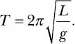

这里，*π*是数学常数*pi*，*g*是局部的重力加速度，地球上的值大约是 9.8 m/s²。由于*π*和*g*是常数，长度*L*是方程右边唯一一个没有常数值的变量。

如果你想查看一个简单摆的周期如何随其长度变化，你可以假设不同的长度值，并使用公式测量每个这些值对应的周期。一个典型的高中实验是将你用前面的公式得到的周期（理论结果）与实验室测量的周期（实验结果）进行比较。例如，我们选择五个不同的长度值：15、18、21、22.5 和 25（单位是厘米）。使用 Python，我们可以编写一个快速程序来加速理论结果的计算：

```py
   from sympy import FiniteSet, pi
➊ def time_period(length):
       g = 9.8
       T = 2*pi*(length/g)**0.5
       return T

   if __name__ == '__main__':
➋     L = FiniteSet(15, 18, 21, 22.5, 25)
       for l in L:
➌         t = time_period(l/100)
           print('Length: {0} cm Time Period: {1:.3f} s'. format(float(l), float(t)))
```

我们首先在➊定义了`time_period`函数。这个函数将前面展示的公式应用于给定的长度，长度作为`length`传入。然后，我们的程序在➋定义了一个长度集合，并在➌将`time_period`函数应用于每个值。注意，当我们将长度值传递给`time_period`时，我们将其除以 100。这个操作将长度从厘米转换为米，以便与重力加速度的单位（米/秒²）相匹配。最后，我们打印出计算得到的周期。当你运行程序时，你会看到如下输出：

```py
Length: 15.0 cm Time Period: 0.777 s
Length: 18.0 cm Time Period: 0.852 s
Length: 21.0 cm Time Period: 0.920 s
Length: 22.5 cm Time Period: 0.952 s
Length: 25.0 cm Time Period: 1.004 s
```

##### **不同的重力，不同的结果**

现在，假设我们在三个不同的地方进行这个实验——我现在的位置，澳大利亚布里斯班；北极；以及赤道。重力的大小会根据你所在纬度略有变化：在赤道稍低（约为 9.78 m/s²），而在北极则较高（9.83 m/s²）。这意味着我们可以把重力看作公式中的一个变量，而不是常数，并根据三个不同的重力加速度值进行计算：{9.8, 9.78, 9.83}。

如果我们想要计算每个位置的五个不同长度的摆钟周期，可以通过计算这些值的笛卡尔积来系统地得出所有组合，以下程序展示了这一过程：

```py
   from sympy import FiniteSet, pi

   def time_period(length, g):

       T = 2*pi*(length/g)**0.5
       return T

   if __name__ == '__main__':

       L = FiniteSet(15, 18, 21, 22.5, 25)
       g_values = FiniteSet(9.8, 9.78, 9.83)
➊     print('{0:¹⁵}{1:¹⁵}{2:¹⁵}'.format('Length(cm)', 'Gravity(m/s²)', 'Time Period(s)'))
➋     for elem in L*g_values:
➌         l = elem[0]
➍         g = elem[1]
           t = time_period(l/100, g)

➎         print('{0:¹⁵}{1:¹⁵}{2:¹⁵.3f}'.format(float(l), float(g), float(t)))
```

在➋，我们取两个变量集`L`和`g_values`的笛卡尔积，然后遍历每一个组合来计算周期。每个组合都表示为一个元组，对于每个元组，我们在➌提取第一个值，即长度，在➍提取第二个值，即重力。然后，就像之前一样，我们调用`time_period()`函数，将这两个标签作为参数传入，并打印出长度（`l`）、重力（`g`）和相应的周期（`T`）值。

输出以表格的形式呈现，便于查看。表格是通过➊和➎的`print`语句格式化的。格式化字符串`{0:¹⁵} {1:¹⁵}{2:¹⁵.3f}`创建了三个字段，每个字段宽度为 15 个字符，`^`符号将每个条目居中。在➎的`print`语句的最后一个字段中，`'.3f'`限制小数点后数字的位数为三位。

当你运行程序时，你会看到如下输出：

```py
Length(cm)   Gravity(m/s²)   Time Period(s)
    15.0           9.78             0.778
    15.0            9.8             0.777
    15.0           9.83             0.776

    18.0           9.78             0.852
    18.0            9.8             0.852
    18.0           9.83             0.850
    21.0           9.78             0.921
    21.0            9.8             0.920
    21.0           9.83             0.918
    22.5           9.78             0.953
    22.5            9.8             0.952
    22.5           9.83             0.951
    25.0           9.78             1.005
    25.0            9.8             1.004
    25.0           9.83             1.002
```

这个实验展示了一个简单的场景，在这种情况下，你需要多个集合（或数字组）所有可能的组合。在这种情况下，笛卡尔积正是你所需要的。

### **概率**

集合帮助我们推理概率的基本概念。我们将从几个定义开始：

**实验** *实验*就是我们想要进行的测试。我们进行测试是因为我们对每个可能结果的概率感兴趣。掷骰子、抛硬币和从一副扑克牌中抽牌都是实验的例子。一次实验的单次运行被称为*试验*。

**样本空间** 所有实验的可能结果构成一个集合，称为*样本空间*，我们通常在公式中称它为*S*。例如，当掷一次六面骰子时，样本空间是{1, 2, 3, 4, 5, 6}。

**事件** *事件*是我们想要计算概率的结果集合，它是样本空间的一个*子集*。例如，我们可能想知道某个特定结果的概率，比如掷出 3，或者多个结果的概率，例如掷出偶数（2、4 或 6）。我们将在公式中使用字母*E*表示一个事件。

如果存在*均匀分布*——也就是说，样本空间中的每个结果发生的可能性相等——那么事件*P*(*E*)发生的概率可以使用以下公式计算（稍后我会在本章中讨论非均匀分布）：


这里，*n*(*E*)和*n*(*S*)分别是事件*E*和样本空间*S*的基数。*P*(*E*)的值范围从 0 到 1，较高的值表示事件发生的可能性较大。

我们可以应用这个公式来计算某个特定掷骰子的概率——比如，掷出 3：

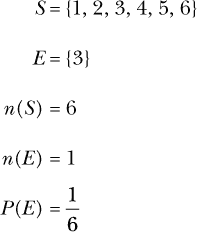

这验证了我们一直以来的直觉：某个特定的掷骰子结果的概率是 1/6。你可以轻松地用脑算出这个计算结果，但我们可以使用这个公式在 Python 中写出以下函数，用来计算任何事件`event`在任何样本空间`space`中的概率：

```py
def probability(space, event):
    return len(event)/len(space)
```

在这个函数中，两个参数`space`和`event`——样本空间和事件——不必是通过`FiniteSet`创建的集合。它们也可以是列表，或者任何支持`len()`函数的其他 Python 对象。

使用这个函数，让我们写一个程序来计算当掷一个 20 面骰子时，出现质数的概率：

```py
     def probability(space, event):
         return len(event)/len(space)

➊   def check_prime(number):
         if number != 1:
             for factor in range(2, number):
                 if number % factor == 0:
                     return False
         else:
             return False
         return True

     if __name__ == '__main__':
➋       space = FiniteSet(*range(1, 21))
         primes = []
         for num in s:
➌           if check_prime(num):
                 primes.append(num)
➍           event= FiniteSet(*primes)
         p = probability(space, event)

         print('Sample space: {0}'.format(space))
         print('Event: {0}'.format(event))
         print('Probability of rolling a prime: {0:.5f}'.format(p))
```

我们首先在➋处使用`range()`函数创建一个表示样本空间`space`的集合。为了创建事件集合，我们需要从样本空间中找到质数，因此我们在➊处定义了一个函数`check_prime()`。这个函数接受一个整数并检查它是否能被 2 到它自身之间的任何数字整除（没有余数）。如果能整除，则返回`False`。因为质数只能被 1 和它本身整除，所以如果整数是质数，这个函数返回`True`，否则返回`False`。

我们在 ➌ 处调用此函数为样本空间中的每个数字生成随机数，并将素数添加到列表 `primes` 中。然后，在 ➍ 处，我们从这个列表中创建事件集合 `event`。最后，我们调用之前创建的 `probability()` 函数。当我们运行程序时，得到以下输出：

```py
Sample space: {1, 2, 3, ..., 18, 19, 20}
Event: {2, 3, 5, 7, 11, 13, 17, 19}
Probability of rolling a prime: 0.40000
```

这里，*n*(*E*) = 8，*n*(*S*) = 20，因此概率 *P* 为 0.4。

在我们的 20 面骰子程序中，我们其实不需要创建这些集合；相反，我们可以将样本空间和事件作为列表传递给 `probability()` 函数：

```py
if __name__ == '__main__':
    space = range(1, 21)
    primes = []
    for num in space:
        if check_prime(num):
            primes.append(num)
    p = probability(space, primes)
```

`probability()` 函数在这种情况下同样有效。

#### ***事件 A 或事件 B 的概率***

假设我们对两个可能的事件感兴趣，并且想要找到*任意*一个事件发生的概率。例如，回到简单的掷骰子，让我们考虑以下两个事件：

A = 数字是素数。

B = 数字是奇数。

就像之前一样，样本空间 *S* 是 {1, 2, 3, 4, 5, 6}。事件 A 可以表示为子集 {2, 3, 5}，即样本空间中的素数集合，事件 B 可以表示为 {1, 3, 5}，即样本空间中的奇数集合。为了计算任意一个结果集合的概率，我们可以计算两个集合的*并集*的概率。在我们的符号中，我们可以这样表示：

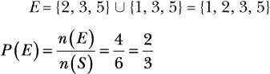

现在让我们用 Python 执行这个计算：

```py
   >>> from sympy import FiniteSet
   >>> s = FiniteSet(1, 2, 3, 4, 5, 6)
   >>> a = FiniteSet(2, 3, 5)
   >>> b = FiniteSet(1, 3, 5)
➊ >>> e = a.union(b)
   >>> len(e)/len(s)
   0.6666666666666666
```

我们首先创建一个集合 `s`，表示样本空间，接着创建两个集合 `a` 和 `b`。然后，在 ➊ 处，我们使用 `union()` 方法来找到事件集合 `e`。最后，我们使用之前的公式计算两个集合的并集的概率。

#### ***事件 A 和事件 B 的概率***

假设你有两个事件，并且想要计算*两者*同时发生的概率——例如，骰子掷点是既是素数又是奇数的概率。要确定这一点，你需要计算两个事件集合的交集的概率：

*E* = *A* ∩ *B* = {2, 3, 5} ∩ {1, 3, 5} = {3, 5}

我们可以通过使用 `intersect()` 方法来计算 A 和 B 同时发生的概率，这与我们在前一个例子中做的类似：

```py
>>> from sympy import FiniteSet
>>> s = FiniteSet(1, 2, 3, 4, 5, 6)
>>> a = FiniteSet(2, 3, 5)
>>> b = FiniteSet(1, 3, 5)
>>> e = a.intersect(b)
>>> len(e)/len(s)
0.3333333333333333
```

#### ***生成随机数***

概率概念让我们能够推理并计算事件发生的概率。为了实际模拟这些事件——比如一个简单的骰子游戏——我们需要一种生成随机数的方法。

##### **模拟骰子掷点**

为了模拟一个六面骰子的掷点，我们需要一种方法来生成一个 1 到 6 之间的随机整数。Python 标准库中的 `random` 模块提供了多种生成随机数的函数。本章将使用两个函数，`randint()` 函数，它在给定的范围内生成一个随机整数，以及 `random()` 函数，它生成一个介于 0 和 1 之间的浮动数。让我们看一个 `randint()` 函数如何工作的简短示例：

```py
>>> import random
>>> random.randint(1, 6)
4
```

`randint()`函数接受两个整数作为参数，返回介于这两个数字之间的一个随机整数（包括这两个数字）。在这个例子中，我们传入了范围`(1, 6)`，它返回了数字 4，但如果我们再次调用它，很可能会得到不同的数字：

```py
>>> random.randint(1, 6)
6
```

调用`randint()`函数可以模拟我们虚拟骰子的掷骰过程。每次调用此函数时，我们都会得到一个介于 1 和 6 之间的数字，就像我们在掷一个六面骰子一样。请注意，`randint()`要求你首先提供较小的数字，所以`randint(6, 1)`是无效的。

##### **你能掷出那个分数吗？**

我们的下一个程序将模拟一个简单的掷骰游戏，我们将不断掷六面骰子，直到我们总共掷出 20 点：

```py
   '''
   Roll a die until the total score is 20
   '''

   import matplotlib.pyplot as plt
   import random

   target_score = 20

   def roll():
       return random.randint(1, 6)

   if __name__ == '__main__':
       score = 0
       num_rolls = 0
➊     while score < target_score:
           die_roll = roll()
           num_rolls += 1
           print('Rolled: {0}'.format(die_roll))
           score += die_roll

       print('Score of {0} reached in {1} rolls'.format(score, num_rolls))
```

首先，我们定义之前创建的相同的`roll()`函数。然后，在➊处我们使用`while`循环调用此函数，跟踪掷骰次数，打印当前的掷骰结果，并累计总分数。循环会一直进行，直到分数达到 20，然后程序会打印总分数和掷骰次数。

这是一次示例运行：

```py
Rolled: 6
Rolled: 2
Rolled: 5
Rolled: 1
Rolled: 3
Rolled: 4
Score of 21 reached in 6 rolls
```

如果你多次运行该程序，你会注意到，达到 20 点所需的掷骰次数是不同的。

##### **目标分数可能吗？**

我们的下一个程序类似，但它会告诉我们是否能在最大掷骰次数内达到某个目标分数：

```py
   from sympy import FiniteSet
   import random

   def find_prob(target_score, max_rolls):

       die_sides = FiniteSet(1, 2, 3, 4, 5, 6)
       # Sample space
➊     s = die_sides**max_rolls
       # Find the event set
       if max_rolls > 1:
           success_rolls = []
➋         for elem in s:
               if sum(elem) >= target_score:
                   success_rolls.append(elem)
       else:
           if target_score > 6:
➌             success_rolls = []
           else:
               success_rolls = []
               for roll in die_sides:
➍                 if roll >= target_score:
                       success_rolls.append(roll)
➎     e = FiniteSet(*success_rolls)
       # Calculate the probability of reaching target score
       return len(e)/len(s)

   if __name__ == '__main__':

       target_score = int(input('Enter the target score: '))
       max_rolls = int(input('Enter the maximum number of rolls allowed: '))

       p = find_prob(target_score, max_rolls)
       print('Probability: {0:.5f}'.format(p))
```

当你运行这个程序时，它会要求输入目标分数和允许的最大掷骰次数，然后它会打印出达到该目标的概率。

这里有两个示例执行：

```py
Enter the target score: 25
Enter the maximum number of rolls allowed: 4
Probability: 0.00000

Enter the target score: 25
Enter the maximum number of rolls allowed: 5
Probability: 0.03241
```

让我们理解`find_prob()`函数的工作原理，该函数执行概率计算。这里的样本空间是笛卡尔积，`die_sides`^(`max_rolls`) ➊，其中`die_sides`是集合{1, 2, 3, 4, 5, 6}，表示六面骰子上的数字，`max_rolls`是允许的最大掷骰次数。

事件集是样本空间中所有有助于我们达到目标分数的集合。这里有两种情况：当剩余的掷骰次数大于 1 时，以及当我们进入最后一次掷骰时。对于第一种情况，在➋处，我们遍历笛卡尔积中的每个元组，将那些总和等于或超过`target_score`的元组加入`success_rolls`列表。第二种情况是特殊的：我们的样本空间只有{1, 2, 3, 4, 5, 6}这一集合，并且我们只剩下一次掷骰机会。如果目标分数大于 6，则无法实现，且我们会在➌处将`success_rolls`设置为空列表。然而，如果`target_score`小于或等于 6，我们会遍历每个可能的掷骰结果，并在➍处将那些大于或等于`target_score`的结果加入列表。

在➎处，我们从之前构建的`success_rolls`列表中计算出事件集`e`，然后返回达到目标分数的概率。

#### ***非均匀随机数***

我们对概率的讨论至今假设样本空间中的每个结果都是等可能的。例如，`random.randint()` 函数返回一个指定范围内的整数，假设每个整数的出现是*等可能的*。我们将这种概率称为*均匀概率*，并将通过 `randint()` 函数生成的随机数称为*均匀随机数*。但是，假设我们要模拟一个偏向的硬币投掷——一个加重的硬币，正面出现的概率是反面的两倍。那么，我们就需要一种生成*不均匀*随机数的方法。

在我们编写程序之前，我们先回顾一下其背后的思想。

考虑一个长度为 1 的数轴，分成两个相等的区间，如 图 5-1 所示。

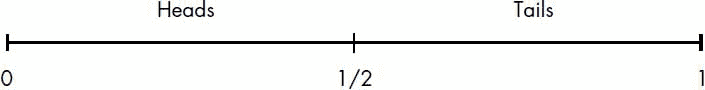

*图 5-1：一个长度为 1 的数轴，分成两个相等的区间，分别对应于硬币投掷时正面或反面的概率*

我们将这条线称为*概率数轴*，其中每个分割代表一个等可能的结果——例如，公正硬币投掷时的正面或反面。现在，在 图 5-2 中，考虑这个不同版本的数轴。

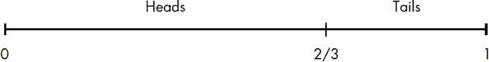

*图 5-2：一个长度为 1 的数轴，分成两个不相等的区间，分别对应于偏向的硬币投掷中正面或反面的概率*

这里，正面对应的分割是总长度的 2/3，反面对应的分割是 1/3。这表示在 2/3 的投掷中，硬币更可能出现正面，而在 1/3 的投掷中则更可能出现反面。以下 Python 函数将模拟这种硬币投掷，考虑到正面或反面出现的不均匀概率：

```py
   import random

   def toss():
       # 0 -> Heads, 1-> Tails
➊     if random.random() < 2/3:
           return 0
       else:
           return 1
```

我们假设函数返回 0 表示正面，1 表示反面，然后在 ➊ 处使用 `random.random()` 函数生成一个介于 0 和 1 之间的随机数。如果生成的数字小于 2/3——我们偏向硬币投掷时正面的概率——程序返回 0；否则返回 1（反面）。

现在我们来看一下如何将前述函数推广，用于模拟具有多个可能结果的非均匀事件。假设我们有一台虚拟的自动取款机，当按下按钮时，它会发放 $5、$10、$20 或 $50 美元的钞票。这些不同面额的钞票有不同的发放概率，如 图 5-3 所示。

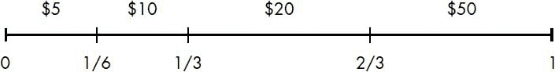

*图 5-3：一个长度为 1 的数轴，分成四个不同长度的区间，分别对应于发放不同面额钞票的概率*

这里，$5 或 $10 美元钞票被发放的概率是 1/6，而 $20 或 $50 美元钞票被发放的概率是 1/3。

我们创建了一个列表来存储概率的滚动和，然后生成一个 0 到 1 之间的随机数。我们从存储和的列表的左端开始，并返回该列表中第一个元素，其对应的和小于或等于生成的随机数。`get_index()`函数实现了这个思路：

```py
   '''
   Simulate a fictional ATM that dispenses dollar bills
   of various denominations with varying probability
   '''

   import random

   def get_index(probability):
       c_probability = 0
➊     sum_probability = []
       for p in probability:
           c_probability += p
           sum_probability.append(c_probability)
➋     r = random.random()
       for index, sp in enumerate(sum_probability):
➌         if r <= sp:
               return index
➍     return len(probability)-1

   def dispense():

       dollar_bills = [5, 10, 20, 50]
       probability = [1/6, 1/6, 1/3, 2/3]
       bill_index = get_index(probability)
       return dollar_bills[bill_index]
```

我们调用`get_index()`函数，传入一个包含相应位置事件发生概率的列表。然后，在 ➊ 处构建列表`sum_probability`，其中第`i`个元素是列表`probability`中前`i`个元素的和。也就是说，`sum_probability`中的第一个元素等于`probability`中的第一个元素，第二个元素等于`probability`中前两个元素的和，以此类推。在 ➋ 处，使用标签`r`生成一个 0 到 1 之间的随机数。接下来，在 ➌ 处，我们遍历`sum_probability`并返回第一个超过`r`的元素的索引。

函数的最后一行，在 ➍ 处，处理了一个特殊情况，最好通过一个例子来说明。考虑一个包含三个事件的列表，每个事件的发生概率为 0.33。在这种情况下，列表`sum_probability`看起来像`[0.33, 0.66, 0.99]`。现在，假设生成的随机数`r`是`0.99314`。对于这个`r`值，我们希望选择事件列表中的最后一个元素。你可能会争辩说，这并不完全正确，因为最后一个事件的选择概率超过了 33%。根据 ➌ 处的条件，`sum_probability`中没有大于`r`的元素，因此函数不会返回任何索引。 ➍处的语句处理了这个问题并返回了最后一个索引。

如果你调用`dispense()`函数来模拟 ATM 机发放大量纸币，你会看到每种纸币出现的次数比例与指定的概率紧密遵循。我们将在下一章中创建*分形*时发现这个技巧非常有用。

### **你学到了什么**

在本章中，你首先学习了如何在 Python 中表示集合。然后，我们讨论了各种集合概念，你学习了集合的并集、交集和笛卡尔积。你将一些集合概念应用于探索概率的基础知识，并最终学习了如何在程序中模拟均匀和非均匀的随机事件。

### **编程挑战**

接下来，你将解决一些编程挑战，这些挑战将为你提供应用本章所学内容的机会。

#### ***#1: 使用维恩图可视化集合之间的关系***

*维恩图*是查看集合关系的一种简单方式，它以图形的形式告诉我们两个集合之间有多少共同元素，有多少元素只存在于一个集合中，以及有多少元素不属于任何集合。考虑集合*A*，它表示小于 20 的正奇数，即*A* = {1, 3, 5, 7, 9, 11, 13, 15, 17, 19}；再考虑集合*B*，它表示小于 20 的质数，即*B* = {2, 3, 5, 7, 11, 13, 17, 19}。我们可以使用 Python 的`matplotlib_venn`包绘制维恩图（有关该包的安装说明，请参见附录 A）。安装完成后，可以按如下方式绘制维恩图：

```py
'''
Draw a Venn diagram for two sets
'''

from matplotlib_venn import venn2
import matplotlib.pyplot as plt
from sympy import FiniteSet

def draw_venn(sets):

    venn2(subsets=sets)
    plt.show()

if __name__ == '__main__':

    s1 = FiniteSet(1, 3, 5, 7, 9, 11, 13, 15, 17, 19)
    s2 = FiniteSet(2, 3, 5, 7, 11, 13, 17, 19)

    draw_venn([s1, s2])
```

一旦我们导入了所有必需的模块和函数（`venn2()`函数、`matplotlib.pyplot`以及`FiniteSet`类），我们所需要做的就是创建这两个集合，然后调用`venn2()`函数，使用`subsets`关键字参数将集合作为元组指定。

图 5-4 展示了前述程序创建的维恩图。集合*A*和*B*共享七个共同元素，因此数字 7 被写在共同区域内。每个集合也都有独特的元素，因此唯一元素的数量——分别为 3 和 1——被写在各自的独立区域内。两个集合下方的标签显示为*A*和*B*。你可以使用`set_labels`关键字参数指定自己的标签：

```py
>>> venn2(subsets=(a,b), set_labels=('S', 'T'))
```

这将把集合标签更改为`S`和`T`。

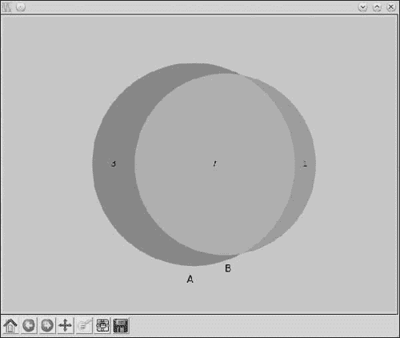

*图 5-4：展示两个集合 A 和 B 之间关系的维恩图*

作为你的挑战，假设你已经创建了一个在线问卷，询问你的同学以下问题：*你玩足球、其他运动，还是不玩运动？* 一旦你得到结果，创建一个 CSV 文件，*sports.csv*，如下所示：

```py
StudentID,Football,Others
1,1,0
2,1,1
3,0,1
--snip--
```

为你的班级中的 20 个学生创建 20 行数据。第一列是学生 ID（该调查并非匿名），第二列为 1 表示该学生标记了“足球”作为他们喜欢的运动，第三列为 1 表示该学生玩其他运动或根本不玩任何运动。编写程序创建一个维恩图，以显示调查结果的汇总，如图 5-5 所示。

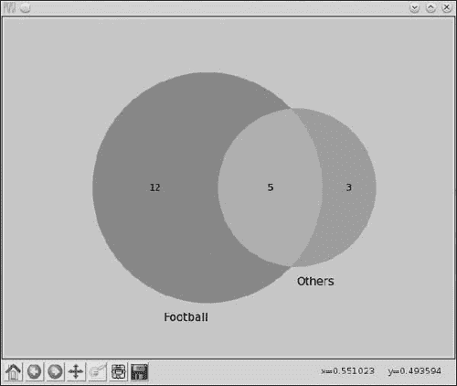

*图 5-5：展示喜欢踢足球的学生人数与喜欢其他运动的学生人数的维恩图*

根据你创建的*sports.csv*文件中的数据，每个集合中的数字将有所不同。以下函数读取 CSV 文件，并返回两个列表，对应于那些玩足球和其他运动的学生 ID：

```py
def read_csv(filename):
    football = []
    others = []
    with open(filename) as f:
        reader = csv.reader(f)
        next(reader)
        for row in reader:
            if row[1] == '1':
                football.append(row[0])
            if row[2] == '1':
                others.append(row[0])

    return football, others
```

#### ***#2：大数法则***

我们已经提到过掷骰子和掷硬币作为两个可以通过随机数模拟的随机事件的例子。我们使用“事件”这个术语来表示在掷骰子时出现的某个数字，或者在掷硬币时出现的正面或反面，每个事件都有一个关联的概率值。在概率论中，*随机变量*——通常表示为*X*——描述了一个事件。例如，*X* = 1 描述了掷骰子时出现 1 的事件，而*P*(*X* = 1)描述了关联的概率。随机变量有两种类型：（1）*离散*随机变量，它们只取整数值，并且是我们在本章中看到的唯一类型的随机变量；（2）*连续*随机变量，正如其名所示，它们可以取任何实数值。

离散随机变量的*期望*，*E*，相当于我们在第三章学到的平均值或均值。期望值可以按以下方式计算：

*E* = *x*[1]*P*(*x*[1]) + *x*[2]*P*(*x*[2]) + *x*[3]*P*(*x*[3]) + ... + *x[n]*P*(*x[n]*)

因此，对于一个六面骰子，掷骰子的*期望值*可以像这样计算：

```py
>>> e = 1*(1/6) + 2*(1/6) + 3*(1/6) + 4*(1/6) + 5*(1/6) + 6*(1/6)
>>> e
3.5
```

根据*大数法则*，经过多次试验后的结果的平均值会随着试验次数的增加而趋近于期望值。你在这个任务中的挑战是验证这个法则，模拟掷六面骰子时在以下试验次数下的情况：100 次、1000 次、10000 次、100000 次和 500000 次。以下是你完整程序的一个预期运行示例：

```py
Expected value: 3.5
Trials: 100 Trial average 3.39
Trials: 1000 Trial average 3.576
Trials: 10000 Trial average 3.5054
Trials: 100000 Trial average 3.50201
Trials: 500000 Trial average 3.495568
```

#### ***#3：在你没钱之前需要多少次掷硬币？***

假设我们有一个简单的公平掷硬币的游戏。玩家掷到正面时赢得$1，掷到反面时损失$1.50。当玩家的余额达到$0 时，游戏结束。给定用户指定的初始金额，你的挑战是编写一个程序来模拟这个游戏。假设计算机有一个无限的现金储备——它是你的对手。以下是一个可能的游戏过程：

```py
Enter your starting amount: 10
Tails! Current amount: 8.5
Tails! Current amount: 7.0
Tails! Current amount: 5.5
Tails! Current amount: 4.0
Tails! Current amount: 2.5
Heads! Current amount: 3.5
Tails! Current amount: 2.0
Tails! Current amount: 0.5
Tails! Current amount: -1.0
Game over :( Current amount: -1.0. Coin tosses: 9
```

#### ***#4：洗牌一副扑克牌***

考虑一副标准的 52 张扑克牌。你的挑战是编写一个程序来模拟这副牌的洗牌过程。为了保持实现简单，我建议你使用整数 1、2、3、...、52 来表示这副牌。每次运行程序时，它应该输出一副洗过的牌——在这个例子中，是一组洗过的整数列表。

这是你程序的一个可能输出：

```py
[3, 9, 21, 50, 32, 4, 20, 52, 7, 13, 41, 25, 49, 36, 23, 45, 1, 22, 40, 19, 2,
35, 28, 30, 39, 44, 29, 38, 48, 16, 15, 18, 46, 31, 14, 33, 10, 6, 24, 5, 43,
47, 11, 34, 37, 27, 8, 17, 51, 12, 42, 26]
```

Python 标准库中的`random`模块有一个函数`shuffle()`，用于执行这个操作：

```py
   >>> import random
   >>> x = [1, 2, 3, 4]
➊ >>> random.shuffle(x)
   >>> x
   [4, 2, 1, 3]
```

创建一个列表`x`，包含数字[1, 2, 3, 4]。然后，调用`shuffle()`函数 ➊，将这个列表作为参数传入。你会看到列表`x`中的数字已经被洗牌。请注意，列表是“就地洗牌”的，也就是说，原始顺序丢失了。

但是，如果你想在卡片游戏中使用这个程序呢？在游戏中，仅仅输出打乱后的整数列表是不够的。你还需要一种方法将整数映射回每张卡片的具体花色和点数。你可以通过创建一个 Python 类来表示一张卡片来实现这一点：

```py
class Card:
    def __init__(self, suit, rank):
        self.suit = suit
        self.rank = rank
```

为了表示梅花 A，创建一个卡片对象`card1 = Card('clubs', 'ace')`。然后，对其他所有卡片进行相同的操作。接着，创建一个包含每个卡片对象的列表并打乱这个列表。程序的输出应该类似于这样：

```py
10 of spades
6 of clubs
jack of spades
9 of spades
```

#### ***#5: 估算圆的面积***

考虑一个飞镖板，半径为* r *的圆内切于边长为 2*r*的正方形中。现在假设你开始向其投掷大量飞镖。一部分飞镖会击中圆内——假设为*N*，而另一部分会落在圆外——假设为*M*。如果我们考虑落在圆内的飞镖的比例，

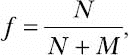

那么*f* × *A*的值，其中*A*是正方形的面积，将大致等于圆的面积（参见图 5-6）。飞镖在图中由小圆点表示。我们将*f* × *A*的值称为估算面积。实际的面积当然是*πr*²。

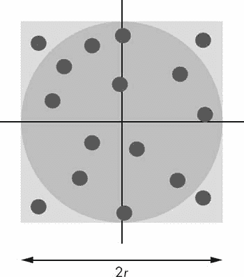

*图 5-6：一个半径为* r *的圆内切于边长为 2*r* 的正方形板上。点表示随机投掷在板上的飞镖。*

作为本次挑战的一部分，编写一个程序，给定任意半径，使用这种方法估算圆的面积。程序应该打印出三种不同飞镖数量的圆的估算面积：10³、10⁵ 和 10⁶。那可是很多飞镖！你会发现，增加飞镖数量会使估算面积越来越接近实际面积。以下是完成解决方案的示例输出：

```py
Radius: 2
Area: 12.566370614359172, Estimated (1000 darts): 12.576
Area: 12.566370614359172, Estimated (100000 darts): 12.58176
Area: 12.566370614359172, Estimated (1000000 darts): 12.560128
```

投掷飞镖可以通过调用`random.uniform(a, b)`函数来模拟，该函数将返回一个介于*a*和*b*之间的随机数。在此案例中，*a* = 0，*b* = 2*r*（正方形的边长）。

##### **估算π的值**

再次考虑图 5-6。正方形的面积是 4*r*²，内切圆的面积是*πr*²。如果我们将圆的面积除以正方形的面积，就得到*π*/4。我们之前计算出的比例*f*，

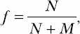

因此，这是*π*/4 的近似值，这也意味着

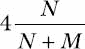

这个值应该接近*π*的值。你接下来的挑战是编写一个程序，假设半径为任意值，来估算*π*的值。当你增加投掷飞镖的数量时，估算的*π*值应该接近已知的常数值。
