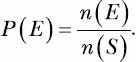

## **5**

**玩转集合与概率**

在本章中，我们将首先学习如何让我们的程序理解和操作数字集合。接着，我们将看到集合如何帮助我们理解概率的基本概念。最后，我们将学习如何生成随机数来模拟随机事件。让我们开始吧！

### **什么是集合？**

一个 *集合* 是一组不同的对象，通常称为 *元素* 或 *成员*。集合的两个特点使它与任何其他对象集合不同。集合是“定义明确的”，意味着问题“某个特定的对象在这个集合中吗？”总是有一个明确的是或否的答案，通常基于规则或某些给定的标准。第二个特点是集合中的成员不能重复。集合可以包含任何东西——数字、人物、物品、词语等等。

让我们通过一些基本的集合属性来学习如何使用 SymPy 在 Python 中操作集合。

#### ***集合构建***

在数学表示法中，你通过将集合成员用花括号括起来来表示一个集合。例如，{2, 4, 6} 表示一个集合，包含 2、4 和 6 作为其成员。要在 Python 中创建一个集合，我们可以使用 sympy 包中的 FiniteSet 类，如下所示：

>>> from sympy import FiniteSet

>>> s = FiniteSet(2, 4, 6)

>>> s

{2, 4, 6}

这里，我们首先从 SymPy 导入 FiniteSet 类，然后通过传入集合成员作为参数来创建该类的对象。我们将刚创建的集合赋值给标签 s。

我们可以将不同类型的数字——包括整数、浮点数和分数——存储在同一个集合中：

>>> from sympy import FiniteSet

>>> from fractions import Fraction

>>> s = FiniteSet(1, 1.5, Fraction(1, 5))

>>> s

{1/5, 1, 1.5}

*集合的基数*是集合中成员的数量，可以使用 len() 函数来找到：

>>> s = FiniteSet(1, 1.5, 3)

>>> len(s)

3

##### **检查一个数字是否在集合中**

要检查一个数字是否是现有集合的成员，可以使用 in 操作符。这个操作符会问 Python：“这个数字在这个集合中吗？”如果数字属于集合，它会返回 True；如果不属于，则返回 False。例如，如果我们想检查 4 是否在前面的集合中，我们可以这样做：

>>> 4 in s

False

因为 4 不在集合中，所以操作符返回 False。

##### **创建空集合**

如果你想创建一个 *空集合*，即一个没有任何元素或成员的集合，可以创建一个不传递任何参数的 FiniteSet 对象。结果是一个 EmptySet 对象：

>>> s = FiniteSet()

>>> s

EmptySet()

##### **从列表或元组创建集合**

你也可以通过将一个包含集合成员的列表或元组作为参数传递给 FiniteSet 来创建集合：

>>> members = [1, 2, 3]

>>> s = FiniteSet(*members)

>>> s

{1, 2, 3}

在这里， instead of passing in the set members directly to FiniteSet，我们首先将它们存储在一个列表中，并将该列表命名为 `members`。然后，我们将这个列表通过特殊的 Python 语法传递给 FiniteSet，这实际上是创建一个 FiniteSet 对象，将列表中的成员作为单独的参数传递，而不是作为一个列表。也就是说，这种创建 FiniteSet 对象的方法等价于 FiniteSet(1, 2, 3)。当集合成员在运行时计算时，我们将使用这种语法。

##### **集合的重复和顺序**

Python 中的集合（像数学集合一样）忽略任何成员的重复，而且它们不会追踪集合成员的顺序。例如，如果你从一个包含多个相同数字的列表创建集合，那么数字只会添加一次，其余的重复实例会被丢弃：

>>> from sympy import FiniteSet

>>> members = [1, 2, 3, 2]

>>> FiniteSet(*members)

{1, 2, 3}

在这里，即使我们传入了一个包含两次数字 2 的列表，数字 2 在由该列表创建的集合中只会出现一次。

在 Python 列表和元组中，每个元素都按特定顺序存储，但集合并不总是如此。例如，我们可以通过如下方式遍历集合并打印出每个成员：

>>> from sympy import FiniteSet

>>> s = FiniteSet(1, 2, 3)

>>> for member in s:

print(member)

2

1

3

当你运行这段代码时，元素可能会以任何可能的顺序打印出来。这是因为 Python 存储集合的方式——它跟踪集合中的成员，但不跟踪这些成员的任何特定顺序。

让我们看一个不同的例子。当两个集合拥有相同的元素时，它们是*相等*的。在 Python 中，你可以使用相等运算符 == 来检查两个集合是否相等：

>>> from sympy import FiniteSet

>>> s = FiniteSet(3, 4, 5)

>>> t = FiniteSet(5, 4, 3)

>>> s == t

True

尽管这两个集合的成员顺序不同，但它们仍然是相等的。

#### ***子集、超集和幂集***

一个集合 *s* 是另一个集合 *t* 的*子集*，如果 *s* 的所有成员都是 *t* 的成员。例如，集合 {1} 是集合 {1, 2} 的子集。你可以使用 is_subset() 方法来检查一个集合是否是另一个集合的子集：

>>> s = FiniteSet(1)

>>> t = FiniteSet(1, 2)

>>> s.is_subset(t)

True

>>> t.is_subset(s)

False

请注意，空集合是每个集合的子集。此外，任何集合都是其自身的子集，如下所示：

>>> s.is_subset(s)

True

>>> t.is_subset(t)

True

同样，集合 *t* 被称为另一个集合 *s* 的*超集*，如果 *t* 包含 *s* 中的所有成员。你可以使用 is_superset() 方法来检查一个集合是否是另一个集合的超集：

>>> s.is_superset(t)

False

>>> t.is_superset(s)

True

一个集合 *s* 的*幂集合*是 *s* 的所有可能子集的集合。任何集合 *s* 都恰好有 2^(|*s*|) 个子集，其中 |*s*| 是集合的基数。例如，集合 {1, 2, 3} 的基数是 3，因此它有 2³ 或 8 个子集：{}（空集合）、{1}、{2}、{3}、{1, 2}、{2, 3}、{1, 3} 和 {1, 2, 3}。

所有这些子集构成了幂集合，我们可以使用 powerset() 方法找到幂集合：

>>> s = FiniteSet(1, 2, 3)

>>> ps = s.powerset()

>>> ps

{{1}, {1, 2}, {1, 3}, {1, 2, 3}, {2}, {2, 3}, {3}, EmptySet()}

由于幂集合本身也是一个集合，你可以使用 len() 函数来找到它的基数：

>>> len(ps)

8

幂集合的基数是 2^(|*s*|)，即 2³ = 8。

根据我们对子集的定义，任何两个具有完全相同成员的集合都是彼此的子集和超集。相比之下，集合 *s* 只有在 *s* 的所有成员都在 *t* 中且 *t* 至少有一个不在 *s* 中的成员时，*s* 才是 *t* 的*真子集*。因此，如果 *s* = {1, 2, 3}，只有当 *t* 包含 1、2 和 3 外加至少一个其他成员时，*s* 才是 *t* 的真子集。这也意味着 *t* 是 *s* 的*真超集*。你可以使用 is_proper_subset() 方法和 is_proper_superset() 方法来检查这些关系：

>>> from sympy import FiniteSet

>>> s = FiniteSet(1, 2, 3)

>>> t = FiniteSet(1, 2, 3)

>>> s.is_proper_subset(t)

False

>>> t.is_proper_superset(s)

False

现在，如果我们重新创建集合 t 并加入另一个成员，那么 s 将被认为是 t 的真子集，t 则是 s 的真超集：

>>> t = FiniteSet(1, 2, 3, 4)

>>> s.is_proper_subset(t)

True

>>> t.is_proper_superset(s)

True

**常见的数字集合**

在第一章中，我们学习了不同种类的数字——整数、浮动点数、分数和复数。这些数字形成了不同的数字集合，并且每个集合都有特殊的名称。

所有正整数和负整数组成了 *整数* 集合。所有正整数组成了 *自然数* 集合（有时 0 会被包括在这个集合中，尽管它不是正数，但有时也不包括）。这意味着自然数集合是整数集合的真子集。

*有理数* 集合包括任何可以表示为分数的数字，这包括所有整数，以及任何小数部分终止或重复的数字（如 1/4 或 0.25，以及 1/3 或 0.33333 ...）。相比之下，不重复且不终止的小数被称为 *无理数*。2 的平方根和 *π* 都是无理数的例子，因为它们无限延续且不重复。

如果你把所有有理数和无理数放在一起，你得到的就是 *实数* 集合。而更大的集合是 *复数* 集合，它包括所有实数以及所有具有虚数部分的数。

所有这些数集都是无限集，因为它们有无限个成员。与此相对的是，本章讨论的集合都是有限集合，拥有有限的成员，这也是我们使用的 SymPy 类被称为 FiniteSet 的原因。

#### ***集合操作***

集合操作如并集、交集和笛卡尔积可以让你以某种有规律的方式合并集合。这些集合操作在实际问题解决中非常有用，特别是当我们需要考虑多个集合时。本章后面我们将看到如何使用这些操作对多个数据集合应用公式并计算随机事件的概率。

##### **并集与交集**

两个集合的*并集*是一个包含两个集合所有*不同*成员的集合。在集合论中，我们使用符号∪来表示并集操作。例如，{1, 2} ∪ {2, 3}将得到一个新的集合{1, 2, 3}。在 SymPy 中，可以使用 union()方法创建这两个集合的并集：

>>> from sympy import FiniteSet

>>> s = FiniteSet(1, 2, 3)

>>> t = FiniteSet(2, 4, 6)

>>> s.union(t)

{1, 2, 3, 4, 6}

我们通过对 s 应用 union 方法并传入 t 作为参数，找到了 s 和 t 的并集。结果是第三个集合，包含了两个集合中所有不同的成员。换句话说，这个第三个集合中的每个成员要么是第一个集合的成员，要么是第二个集合的成员，或者是两个集合的成员。

两个集合的*交集*是由两个集合中共有的元素组成的新集合。例如，集合{1, 2}和{2, 3}的交集将得到一个包含唯一共同元素{2}的新集合。数学上，这个操作写作{1, 2} ∩ {2, 3}。

在 SymPy 中，可以使用 intersect()方法来找到交集：

>>> s = FiniteSet(1, 2)

>>> t = FiniteSet(2, 3)

>>> s.intersect(t)

{2}

而并集操作找到的是在一个集合*或*另一个集合中的成员，交集操作找到的是同时出现在两个集合中的元素。这两个操作也可以应用于多个集合。例如，下面是如何找到三个集合的并集：

>>> from sympy import FiniteSet

>>> s = FiniteSet(1, 2, 3)

>>> t = FiniteSet(2, 4, 6)

>>> u = FiniteSet(3, 5, 7)

>>> s.union(t).union(u)

{1, 2, 3, 4, 5, 6, 7}

类似地，下面是如何找到三个集合的交集：

>>> s.intersect(t).intersect(u)

EmptySet()

集合 s、t 和 u 的交集是一个空集合，因为这三个集合没有任何共同的元素。

##### **笛卡尔积**

两个集合的*笛卡尔积*是一个由每个集合中的元素配对组成的集合。例如，集合{1, 2}和{3, 4}的笛卡尔积是{(1, 3), (1, 4), (2, 3), (2, 4)}。在 SymPy 中，你可以通过使用乘法运算符来找到两个集合的笛卡尔积：

>>> from sympy import FiniteSet

>>> s = FiniteSet(1, 2)

>>> t = FiniteSet(3, 4)

>>> p = s * t

>>> p

{1, 2} x {3, 4}

这将集合 s 和 t 的笛卡尔积存储为 p。为了实际查看笛卡尔积中的每一对元素，我们可以通过迭代并打印它们，如下所示：

>>> for elem in p:

print(elem)

(1, 3)

(1, 4)

(2, 3)

(2, 4)

每个笛卡尔积的元素是一个元组，包含了第一个集合和第二个集合中的一个成员。

笛卡尔积的基数是各个集合基数的乘积。我们可以通过 Python 来展示这一点：

>>> len(p) == len(s)*len(t)

True

如果我们对一个集合应用指数运算符（**），我们得到的是该集合与自身笛卡尔积的指定次数。

>>> from sympy import FiniteSet

>>> s = FiniteSet(1, 2)

>>> p = s**3

>>> p

{1, 2} x {1, 2} x {1, 2}

例如，在这里我们将集合 s 的每个元素都提升到 3 次方。因为我们正在进行三个集合的笛卡尔积操作，这样我们就得到了一个包含每个集合成员的所有可能三元组的集合：

>>> for elem in p:

print(elem)

(1, 1, 1)

(1, 1, 2)

(1, 2, 1)

(1, 2, 2)

(2, 1, 1)

(2, 1, 2)

(2, 2, 1)

(2, 2, 2)

寻找集合的笛卡尔积对找到集合成员的所有可能组合非常有用，我们将在接下来进行探讨。

##### **对多个变量集合应用公式**

考虑一个长度为 *L* 的简单摆。这个摆的*周期*，*T*，也就是摆完成一次完整摆动所需的时间，可以用以下公式表示：

在这里，*π* 是数学常数 *pi*，*g* 是局部重力加速度，地球上的值大约为 9.8 m/s²。由于 *π* 和 *g* 是常数，长度 *L* 是方程右侧唯一没有常数值的变量。

如果你想观察简单摆的周期如何随长度变化，你可以假设不同的长度值，并使用公式测量这些值对应的时间周期。一个典型的高中实验是将你使用上述公式得到的理论结果与在实验室测得的实验结果进行比较。例如，我们选择五个不同的值：15、18、21、22.5 和 25（单位为厘米）。使用 Python，我们可以编写一个快速的程序来进行理论结果的计算：

from sympy import FiniteSet, pi

➊ def time_period(length):

g = 9.8

T = 2*pi*(length/g)**0.5

return T

if __name__ == '__main__':

➋     L = FiniteSet(15, 18, 21, 22.5, 25)

for l in L:

➌         t = time_period(l/100)

print('长度: {0} cm 周期: {1:.3f} s'. format(float(l), float(t)))

我们首先在 ➊ 定义了时间周期函数 time_period。该函数使用之前提到的公式来处理给定的长度，该长度作为参数传入。然后，程序在 ➋ 定义了一组长度，并在 ➌ 对每个值应用 time_period 函数。注意，在将长度值传递给 time_period 时，我们将其除以 100。这一操作将长度从厘米转换为米，以匹配重力加速度的单位，后者的单位是米/秒²。最后，我们打印出计算出的时间周期。当你运行程序时，你将看到以下输出：

长度：15.0 厘米 周期：0.777 秒

长度：18.0 厘米 周期：0.852 秒

长度：21.0 厘米 周期：0.920 秒

长度：22.5 厘米 周期：0.952 秒

长度：25.0 厘米 周期：1.004 秒

##### **不同的重力，不同的结果**

现在，假设我们在三个不同的地方进行此实验——我目前所在的地点，澳大利亚布里斯班；北极；以及赤道。重力的大小会略有不同，具体取决于你所在的纬度：在赤道，重力略低（大约 9.78 m/s²），而在北极则较高（9.83 m/s²）。这意味着我们可以将重力作为公式中的一个变量，而不是常量，并计算出三种不同重力加速度值的结果：{9.8, 9.78, 9.83}。

如果我们想要为每个长度在这三个位置计算钟摆的周期，一个系统的方法是计算所有这些值的笛卡尔积，如下面的程序所示：

from sympy import FiniteSet, pi

def time_period(length, g):

T = 2*pi*(length/g)**0.5

返回 T

if __name__ == '__main__':

L = FiniteSet(15, 18, 21, 22.5, 25)

g_values = FiniteSet(9.8, 9.78, 9.83)

➊     print('{0:¹⁵}{1:¹⁵}{2:¹⁵}'.format('长度(cm)', '重力(m/s²)', '周期(s)'))

➋     for elem in L*g_values:

➌         l = elem[0]

➍         g = elem[1]

t = time_period(l/100, g)

➎         print('{0:¹⁵}{1:¹⁵}{2:¹⁵.3f}'.format(float(l), float(g), float(t)))

在 ➋，我们计算了两个变量集 L 和 g_values 的笛卡尔积，并通过每一个结果组合来计算时间周期。每个组合表示为一个元组，对于每个元组，我们提取第一个值——长度（l）在 ➌，第二个值——重力（g）在 ➍。然后，像之前一样，我们使用这两个值调用 time_period() 函数，并打印出长度（l）、重力（g）和相应的时间周期（T）。

输出以表格的形式呈现，方便查看。表格是通过 ➊ 和 ➎ 的 print 语句格式化的。格式字符串 {0:¹⁵} {1:¹⁵}{2:¹⁵.3f} 创建了三个宽度为 15 个空格的字段，^ 符号将每个条目居中对齐。在 ➎ 的最后一个字段中，'.3f' 限制了小数点后的数字为三位。

当你运行程序时，你会看到以下输出：

长度（cm）   重力（m/s²）   周期（s）

15.0           9.78             0.778

15.0            9.8             0.777

15.0           9.83             0.776

18.0           9.78             0.852

18.0            9.8             0.852

18.0           9.83             0.850

21.0           9.78             0.921

21.0            9.8             0.920

21.0           9.83             0.918

22.5           9.78             0.953

22.5            9.8             0.952

22.5           9.83             0.951

25.0           9.78             1.005

25.0            9.8             1.004

25.0           9.83             1.002

这个实验展示了一个简单的场景，你需要计算多个集合（或一组数字）元素的所有可能组合。在这种情况下，笛卡尔积正是你所需要的。

### **概率**

集合让我们能够推理概率的基本概念。我们将从一些定义开始：

**实验** *实验* 只是我们想要进行的测试。我们进行测试是因为我们对每种可能结果的概率感兴趣。掷骰子、抛硬币和从一副扑克牌中抽取一张牌都是实验的例子。一次实验的单次运行称为*试验*。

**样本空间** 实验的所有可能结果形成一个称为*样本空间*的集合，通常我们在公式中称它为*S*。例如，当掷一个六面骰子时，样本空间为{1, 2, 3, 4, 5, 6}。

**事件** *事件* 是我们希望计算其概率的一组结果，它构成样本空间的*子集*。例如，我们可能想知道某个特定结果的概率，比如掷出 3，或者一组多个结果的概率，比如掷出一个偶数（2、4 或 6）。在公式中，我们将使用字母 *E* 来代表一个事件。

如果存在*均匀分布*——也就是说，样本空间中的每个结果发生的概率相等——那么事件*P*(*E*)发生的概率可以使用以下公式计算（稍后我会谈到非均匀分布）：

这里，*n*(*E*) 和 *n*(*S*) 分别是*E*（事件）和*S*（样本空间）这两个集合的基数。*P*(*E*)的值范围是从 0 到 1，值越高表示事件发生的可能性越大。

我们可以将这个公式应用于掷骰子来计算某个特定掷骰子的概率——比如掷出 3：

这验证了一个显而易见的事实：某次特定掷骰子的概率是 1/6。你可以很容易地用脑算出这个结果，但我们可以使用这个公式编写以下 Python 函数来计算任何事件的概率，事件发生在任何样本空间中：

def probability(space, event):

return len(event)/len(space)

在此函数中，两个参数 space 和 event——样本空间和事件——不必是通过 FiniteSet 创建的集合。它们也可以是列表，或者任何其他支持 len()函数的 Python 对象。

使用这个函数，让我们编写一个程序来找出掷 20 面骰子时出现素数的概率：

def 概率(space, event):

return len(event)/len(space)

➊   def check_prime(number):

if number != 1:

for factor in range(2, number):

if number % factor == 0:

return False

否则：

return False

return True

if __name__ == '__main__':

➋       space = 有限集合(*range(1, 21))

primes = []

for num in s:

➌           if check_prime(num):

primes.append(num)

➍           event= 有限集合(*primes)

p = 概率(space, event)

print('样本空间：{0}'.format(space))

print('事件：{0}'.format(event))

print('掷骰子得到素数的概率：{0:.5f}'.format(p))

我们首先使用 range()函数在➋处创建了表示样本空间 space 的集合。为了创建事件集，我们需要从样本空间中找出素数，因此在➊处定义了一个函数 check_prime()。该函数接受一个整数并检查它是否能被 2 到该整数自身之间的任何数字整除（且没有余数）。如果能，返回 False。由于素数只能被 1 和它自身整除，如果一个整数是素数，这个函数返回 True，否则返回 False。

我们在➌处为样本空间中的每个数字调用此函数，并将素数添加到列表 primes 中。然后，我们从这个列表中创建事件集 event，位置在➍。最后，我们调用之前创建的概率()函数。运行程序时，我们得到以下输出：

样本空间：{1, 2, 3, ..., 18, 19, 20}

事件：{2, 3, 5, 7, 11, 13, 17, 19}

掷骰子得到素数的概率：0.40000

在这里，*n*(*E*) = 8 和 *n*(*S*) = 20，所以概率 *P* 是 0.4。

在我们的 20 面骰子程序中，实际上我们不需要创建这些集合；相反，我们可以将样本空间和事件作为列表传入概率()函数：

if __name__ == '__main__':

space = range(1, 21)

primes = []

for num in space:

if check_prime(num):

primes.append(num)

p = 概率(space, primes)

概率()函数在这种情况下同样适用。

#### ***事件 A 或事件 B 的概率***

假设我们对两个可能发生的事件感兴趣，并且我们想要找到*其中*一个事件发生的概率。例如，回到简单的掷骰子，我们考虑以下两个事件：

A = 这个数字是素数。

B = 这个数字是奇数。

正如之前一样，样本空间 *S* 是 {1, 2, 3, 4, 5, 6}。事件 A 可以表示为子集{2, 3, 5}，即样本空间中的素数集合，事件 B 可以表示为{1, 3, 5}，即样本空间中的奇数集合。为了计算这两个结果集合的概率，我们可以求得这两个集合的*并集*的概率。在我们的符号中，我们可以说：

现在让我们在 Python 中进行这个计算：

>>> from sympy import FiniteSet

>>> s = FiniteSet(1, 2, 3, 4, 5, 6)

>>> a = FiniteSet(2, 3, 5)

>>> b = FiniteSet(1, 3, 5)

➊ >>> e = a.union(b)

>>> len(e)/len(s)

0.6666666666666666

我们首先创建一个集合 s，表示样本空间，然后是两个集合 a 和 b。接着，在 ➊ 处，我们使用 union() 方法来找到事件集 e。最后，我们使用之前的公式来计算两个集合的并集的概率。

#### ***事件 A 和事件 B 的概率***

假设你有两个事件，并且你想计算它们*都*发生的概率——例如，掷骰子时同时是质数和奇数的概率。为了计算这个，你需要计算这两个事件集合的交集概率：

*E* = *A* ∩ *B* = {2, 3, 5} ∩ {1, 3, 5} = {3, 5}

我们可以通过使用 intersect() 方法来计算事件 A 和事件 B 同时发生的概率，这与我们在前一个例子中的做法类似：

>>> from sympy import FiniteSet

>>> s = FiniteSet(1, 2, 3, 4, 5, 6)

>>> a = FiniteSet(2, 3, 5)

>>> b = FiniteSet(1, 3, 5)

>>> e = a.intersect(b)

>>> len(e)/len(s)

0.3333333333333333

#### ***生成随机数***

概率概念让我们能够推理并计算事件发生的机会。为了实际模拟这样的事件——比如一个简单的掷骰子游戏——我们需要一种生成随机数的方法。

##### **模拟掷骰子**

为了模拟一个六面骰子的掷骰过程，我们需要一种方法来生成介于 1 到 6 之间的随机整数。Python 标准库中的 random 模块提供了多种生成随机数的函数。本章我们将使用两个函数：randint() 函数，它在指定范围内生成一个随机整数，和 random() 函数，它生成一个介于 0 和 1 之间的浮动数字。我们来看一下 randint() 函数的一个简单示例：

>>> import random

>>> random.randint(1, 6)

4

randint() 函数接受两个整数作为参数，并返回一个介于这两个数字之间的随机整数（包括这两个数字）。在这个例子中，我们传入了范围(1, 6)，它返回了数字 4，但是如果我们再次调用它，我们很可能会得到一个不同的数字：

>>> random.randint(1, 6)

6

调用 randint() 函数允许我们模拟掷骰子的过程。每次调用这个函数时，我们都会得到一个介于 1 到 6 之间的数字，就像我们掷六面骰子时一样。注意，randint() 期望你先提供较小的数字，所以 randint(6, 1) 是无效的。

##### **你能掷出这个分数吗？**

我们的下一个程序将模拟一个简单的掷骰子游戏，我们会不断掷六面骰子，直到总分达到 20：

'''

继续掷骰子直到总分达到 20

'''

import matplotlib.pyplot as plt

import random

target_score = 20

def roll():

return random.randint(1, 6)

如果 __name__ == '__main__':

score = 0

num_rolls = 0

➊     while score < target_score:

die_roll = roll()

num_rolls += 1

print('投掷结果：{0}'.format(die_roll))

score += die_roll

print('在 {1} 次投掷中达到 {0} 分'.format(score, num_rolls))

首先，我们定义与之前创建的相同的 roll() 函数。然后，在 ➊ 处使用 while 循环调用该函数，跟踪投掷次数，打印当前投掷结果，并累计总分。该循环将重复执行，直到分数达到 20，然后程序打印总分和投掷次数。

这是一个示例运行：

投掷结果：6

投掷结果：2

投掷结果：5

投掷结果：1

投掷结果：3

投掷结果：4

在 6 次投掷中达到 21 分

如果你多次运行程序，你会发现达到 20 分所需的投掷次数是不同的。

##### **目标分数是否可达？**

我们的下一个程序类似，但它将告诉我们在最大投掷次数内是否能达到某个目标分数：

from sympy import FiniteSet

import random

def find_prob(target_score, max_rolls):

die_sides = FiniteSet(1, 2, 3, 4, 5, 6)

# 样本空间

➊ s = die_sides**max_rolls

# 查找事件集合

如果 max_rolls > 1:

success_rolls = []

➋ for elem in s:

如果 sum(elem) >= target_score:

success_rolls.append(elem)

否则：

如果 target_score > 6:

➌ success_rolls = []

否则：

success_rolls = []

for roll in die_sides:

➍ 如果 roll >= target_score:

success_rolls.append(roll)

➎ e = FiniteSet(*success_rolls)

# 计算达到目标分数的概率

return len(e)/len(s)

如果 __name__ == '__main__':

target_score = int(input('请输入目标分数：'))

max_rolls = int(input('请输入允许的最大投掷次数：'))

p = find_prob(target_score, max_rolls)

print('概率：{0:.5f}'.format(p))

当你运行此程序时，它会要求输入目标分数和允许的最大投掷次数，然后它会输出达到该目标的概率。

下面是两次示例执行：

输入目标分数：25

输入允许的最大投掷次数：4

概率：0.00000

输入目标分数：25

输入允许的最大投掷次数：5

概率：0.03241

让我们理解 find_prob() 函数的工作原理，它执行概率计算。这里的样本空间是笛卡尔积，die_sides^(max_rolls) ➊，其中 die_sides 是集合 {1, 2, 3, 4, 5, 6}，表示六面骰上的数字，max_rolls 是允许的最大投掷次数。

事件集是样本空间中帮助我们达到目标分数的所有集合。这里有两种情况：一种是剩余的回合数大于 1，另一种是我们处于最后一回合。对于第一种情况，在 ➋ 位置，我们遍历笛卡尔积中的每个元组，并将那些总和达到或超过目标分数的元组添加到 success_rolls 列表中。第二种情况特殊：我们的样本空间只有 {1, 2, 3, 4, 5, 6} 这一集合，并且我们只剩下最后一次掷骰的机会。如果目标分数大于 6，则无法实现目标，我们在 ➌ 位置将 success_rolls 设置为空列表。然而，如果目标分数小于或等于 6，我们会遍历每个可能的掷骰结果，并将那些大于或等于目标分数的结果添加到 ➍ 位置的列表中。

在 ➎ 位置，我们从之前构建的 success_rolls 列表中计算事件集 e，然后返回达到目标分数的概率。

#### ***非均匀随机数***

到目前为止，我们讨论的概率假设了样本空间中的每个结果都是等可能的。例如，random.randint() 函数返回指定范围内的整数，假设每个整数的出现几率是*相等的*。我们称这种概率为*均匀概率*，由 randint() 函数生成的随机数为*均匀随机数*。然而，假设我们想模拟一个偏置的硬币投掷——一个正面朝上的概率是反面两倍的硬币。那么，我们就需要一种方法来生成*非均匀*随机数。

在我们编写程序之前，我们先来回顾一下其背后的思想。

考虑一个长度为 1 的数轴，分成两个相等的区间，如图 5-1 所示。

*图 5-1：一个长度为 1 的数轴，分成两个相等的区间，分别对应硬币投掷时正反面的概率*

我们将这一行称为*概率数轴*，每个划分代表一个等可能的结果——例如，公平硬币投掷时的正反面。现在，在图 5-2 中，考虑这种不同版本的数轴。

*图 5-2：一个长度为 1 的数轴，分成两个不等的区间，分别对应偏置硬币投掷时正反面的概率*

在这里，正面对应的划分占总长度的 2/3，反面对应的划分占 1/3。这代表了一个硬币的情况，其中正面在 2/3 次投掷中出现，而反面只会在 1/3 次投掷中出现。以下的 Python 函数将模拟这种硬币投掷，考虑到正反面出现的概率不等：

导入 random

def toss():

# 0 -> 正面，1 -> 反面

➊     如果 random.random() < 2/3：

返回 0

否则：

返回 1

我们假设该函数返回 0 表示正面，1 表示反面，然后我们在➊使用 random.random()函数生成一个介于 0 和 1 之间的随机数。如果生成的数字小于 2/3——我们偏置硬币翻出正面的概率——程序返回 0；否则返回 1（反面）。

接下来我们将看到如何将之前的函数扩展到模拟一个具有多个可能结果的非均匀事件。让我们考虑一个虚构的 ATM 机，它在按下按钮时会发放$5、$10、$20 或$50 的钞票。不同面额的钞票有不同的发放概率，如图 5-3 所示。

*图 5-3：一个长度为 1 的数轴，被分成四个不同长度的区间，分别对应不同面额钞票的发放概率*

这里，$5 钞票或$10 钞票的发放概率是 1/6，而$20 钞票或$50 钞票的发放概率是 1/3。

我们创建一个列表来存储概率的累加和，然后生成一个介于 0 和 1 之间的随机数。我们从存储累加和的列表的左端开始，返回第一个满足其对应和小于或等于生成的随机数的索引。get_index()函数实现了这个思想：

'''

模拟一个虚构的 ATM 机，它根据不同的概率发放不同面额的钞票

返回不同面额钞票的概率

'''

import random

def get_index(probability):

c_probability = 0

➊     sum_probability = []

for p in probability:

c_probability += p

sum_probability.append(c_probability)

➋     r = random.random()

for index, sp in enumerate(sum_probability):

➌         if r <= sp:

return index

➍     return len(probability)-1

def dispense():

dollar_bills = [5, 10, 20, 50]

probability = [1/6, 1/6, 1/3, 2/3]

bill_index = get_index(probability)

return dollar_bills[bill_index]

我们调用 get_index()函数，传入一个包含每个位置事件期望发生概率的列表。然后，在➊，我们构造列表 sum_probability，其中第 i 个元素是列表 probability 中前 i 个元素的和。也就是说，sum_probability 中的第一个元素等于 probability 中的第一个元素，第二个元素等于 probability 中前两个元素的和，依此类推。在➋，我们使用标签 r 生成一个介于 0 和 1 之间的随机数。接下来，在➌，我们遍历 sum_probability，并返回第一个超过 r 的元素的索引。

函数的最后一行，在 ➍，处理了一个特殊情况，最好通过一个例子来说明。考虑一个包含三个事件的列表，每个事件发生的百分比均为 0.33。在这种情况下，列表 sum_probability 看起来像 [0.33, 0.66, 0.99]。现在，假设生成的随机数 r 为 0.99314。对于这个 r 值，我们希望选择列表中的最后一个事件。你可能会争辩说，这不完全正确，因为最后一个事件的被选中几率大于 33%。根据 ➌ 中的条件，sum_probability 中没有任何元素大于 r，因此该函数不会返回任何索引。➍ 处的语句处理了这个问题，并返回最后一个索引。

如果你调用 dispense() 函数来模拟 ATM 发放大量钞票，你会发现每种钞票出现的次数比例与指定的概率紧密符合。在下一章创建 *分形* 时，我们会发现这种技术非常有用。

### **你学到了什么**

在这一章中，你首先学习了如何在 Python 中表示集合。然后，我们讨论了各种集合的概念，你了解了集合的并集、交集和笛卡尔积。你应用了一些集合概念来探索概率的基础知识，最后，学习了如何在程序中模拟均匀和非均匀的随机事件。

### **编程挑战**

接下来，你将面临一些编程挑战，解决这些挑战将给你提供应用本章所学知识的机会。

#### ***#1: 使用 Venn 图可视化集合之间的关系***

*Venn 图* 是一种直观展示集合之间关系的方式。它告诉我们两个集合中有多少个元素是公共的，有多少个元素只在一个集合中，且有多少个元素既不在集合 A 也不在集合 B 中。考虑一个集合 *A*，表示小于 20 的正奇数——即 *A* = {1, 3, 5, 7, 9, 11, 13, 15, 17, 19}——以及另一个集合 *B*，表示小于 20 的素数——即 *B* = {2, 3, 5, 7, 11, 13, 17, 19}。我们可以使用 Python 的 matplotlib_venn 包来绘制 Venn 图（有关此包的安装说明，请参见 附录 A）。安装完成后，你可以通过以下方式绘制 Venn 图：

'''

为两个集合绘制 Venn 图

'''

从 matplotlib_venn 导入 venn2

import matplotlib.pyplot as plt

从 sympy 导入 FiniteSet

def draw_venn(sets):

venn2(subsets=sets)

plt.show()

if __name__ == '__main__':

s1 = FiniteSet(1, 3, 5, 7, 9, 11, 13, 15, 17, 19)

s2 = FiniteSet(2, 3, 5, 7, 11, 13, 17, 19)

draw_venn([s1, s2])

一旦我们导入了所有所需的模块和函数（包括 venn2() 函数、matplotlib.pyplot 和 FiniteSet 类），我们所要做的就是创建这两个集合，然后调用 venn2() 函数，使用 subsets 关键字参数将集合作为元组传入。

图 5-4 显示了通过前面的程序创建的维恩图。集合*A*和*B*共享七个公共元素，因此在交集区域写入 7。每个集合还有各自独有的元素，因此独有元素的数量——分别是 3 和 1——被写入各自的区域。两个集合下方的标签显示为*A*和*B*。你可以使用 set_labels 关键字参数指定自己的标签：

>>> venn2(subsets=(a,b), set_labels=('S', 'T'))

这将把集合标签更改为 S 和 T。

*图 5-4：显示两个集合*A*和*B*之间关系的维恩图*

对于你的挑战，假设你已经创建了一个在线问卷，询问你的同学以下问题：*你是否踢足球，参与其他运动，还是不参与任何运动？* 一旦得到结果，创建一个 CSV 文件，名为*sports.csv*，内容如下：

学生 ID, 足球, 其他

1,1,0

2,1,1

3,0,1

--snip--

为班级中的 20 个学生创建 20 行数据。第一列是学生 ID（调查不是匿名的），第二列如果学生选择了“足球”作为他们喜欢玩的运动，则填写 1，第三列如果学生参与任何其他运动或完全不参与任何运动，则填写 1。编写程序创建一个维恩图来表示调查结果的总结，如图 5-5 所示。

*图 5-5：显示喜欢踢足球的学生人数以及喜欢其他运动的学生人数的维恩图*

根据你创建的*sports.csv*文件中的数据，每个集合中的数字将有所不同。以下函数读取 CSV 文件并返回两个列表，分别对应那些踢足球和参与其他运动的学生 ID：

def read_csv(filename):

football = []

others = []

with open(filename) as f:

reader = csv.reader(f)

next(reader)

对 row 在 reader 中：

如果 row[1] == '1'：

football.append(row[0])

如果 row[2] == '1'：

others.append(row[0])

return football, others

#### ***#2: 大数法则***

我们已经提到过投掷骰子和抛硬币作为可以通过随机数模拟的随机事件示例。我们使用*事件*一词来指代在掷骰子时出现某个数字，或在抛硬币时出现正面或反面，每个事件都有一个相关的概率值。在概率论中，*随机变量*——通常表示为*X*——描述一个事件。例如，*X* = 1 表示掷骰子时出现 1 的事件，而*P*(*X* = 1)描述了相关的概率。随机变量有两种类型：（1）*离散*随机变量，它只取整数值，是本章中我们看到的唯一类型的随机变量；（2）*连续*随机变量，顾名思义，可以取任何实数值。

离散随机变量的*期望值*，*E*，等同于我们在第三章中学习的平均值或均值。期望值可以通过以下方式计算：

*E* = *x*[1]*P*(*x*[1]) + *x*[2]*P*(*x*[2]) + *x*[3]*P*(*x*[3]) + ... + *x[n]P*(*x[n]*)

因此，对于一个六面骰子，*期望值*可以这样计算：

>>> e = 1*(1/6) + 2*(1/6) + 3*(1/6) + 4*(1/6) + 5*(1/6) + 6*(1/6)

>>> e

3.5

根据*大数法则*，在多次试验中，结果的平均值随着试验次数的增加，接近期望值。你在这个任务中的挑战是验证这个法则，尝试掷一个六面骰子，进行以下次数的试验：100、1000、10000、100000 和 500000。下面是你完整程序的一个预期示例运行：

期望值：3.5

试验次数：100 次 平均值 3.39

试验次数：1000 次 平均值 3.576

试验次数：10000 次 平均值 3.5054

试验次数：100000 次 平均值 3.50201

试验次数：500000 次 平均值 3.495568

#### ***#3: 你需要多少次投币才会把钱用完？***

让我们考虑一个简单的游戏，玩家通过抛硬币获胜。如果硬币正面朝上，玩家赢得 1 美元；如果反面朝上，玩家亏损 1.50 美元。游戏在玩家的余额为 0 时结束。给定一个用户输入的初始金额，你的挑战是编写一个程序来模拟这个游戏。假设计算机拥有无限现金储备——你在游戏中的对手。以下是一个可能的游戏过程：

输入你的初始金额：10

正面！当前金额：8.5

正面！当前金额：7.0

正面！当前金额：5.5

反面！当前金额：4.0

反面！当前金额：2.5

正面！当前金额：3.5

反面！当前金额：2.0

反面！当前金额：0.5

正面！当前金额：-1.0

游戏结束 :( 当前金额：-1.0。 投币次数：9

#### ***#4: 洗牌一副牌***

考虑一副标准的 52 张扑克牌。你的挑战是编写一个程序来模拟洗牌过程。为了简化实现，建议你使用整数 1, 2, 3, ..., 52 来表示这副牌。每次运行程序时，它应输出一副洗过的牌——即一组洗乱的整数。

这是你程序的一个可能输出：

[3, 9, 21, 50, 32, 4, 20, 52, 7, 13, 41, 25, 49, 36, 23, 45, 1, 22, 40, 19, 2,

35, 28, 30, 39, 44, 29, 38, 48, 16, 15, 18, 46, 31, 14, 33, 10, 6, 24, 5, 43,

47, 11, 34, 37, 27, 8, 17, 51, 12, 42, 26]

Python 标准库中的 random 模块有一个 shuffle()函数，正是用来执行这个操作：

>>> import random

>>> x = [1, 2, 3, 4]

➊ >>> random.shuffle(x)

>>> x

[4, 2, 1, 3]

创建一个包含数字[1, 2, 3, 4]的列表 x。然后，调用 shuffle()函数 ➊，并将此列表作为参数传递。你会看到 x 中的数字已经被打乱。请注意，列表是“就地”打乱的，也就是说，原来的顺序丢失了。

但如果你想在扑克牌游戏中使用这个程序呢？在那里，单纯输出洗牌后的整数列表是不够的。你还需要一种方法将这些整数映射回每张牌的特定花色和点数。你可以通过创建一个 Python 类来表示一张单牌来实现：

class Card:

def __init__(self, suit, rank):

self.suit = suit

self.rank = rank

为了表示梅花 A，创建一个卡片对象，card1 = Card('clubs', 'ace')。然后，对所有其他卡片执行相同操作。接下来，创建一个由每个卡片对象组成的列表并对该列表进行洗牌。程序的输出应类似于以下内容：

黑桃 10

梅花 6

黑桃杰克

黑桃 9

#### ***#5：估算圆的面积***

考虑一个正方形边长为 2*r*，内切圆半径为*r*的飞镖板。假设你开始向它投掷大量飞镖。其中一些飞镖会击中圆内——假设是*N*——而其他飞镖则击中圆外——假设是*M*。如果我们考虑落在圆内的飞镖比例，

那么*f* × *A*的值，其中*A*是正方形的面积，将大致等于圆的面积（参见图 5-6）。飞镖在图中由小圆点表示。我们将*f* × *A*的值称为估算面积。实际的面积当然是*πr*²。

*图 5-6：一个半径为* r *的圆被内切于边长为 2*r*的正方形板中。点表示随机投掷到板上的飞镖。*

作为这个挑战的一部分，编写一个程序，使用此方法估算给定半径的圆的面积。程序应打印出在三种不同的飞镖数值下圆的估算面积：10³，10⁵，和 10⁶。这是很多飞镖！你会看到，增加飞镖的数量会使估算的面积接近实际面积。以下是完整解决方案的示例输出：

半径：2

区域：12.566370614359172，估算值（1000 投掷）：12.576

区域：12.566370614359172，估算值（100000 投掷）：12.58176

区域：12.566370614359172，估算值（1000000 投掷）：12.560128

投掷飞镖可以通过调用 random.uniform(a, b)函数来模拟，该函数将返回一个介于*a*和*b*之间的随机数。在此情况下，使用值*a* = 0，*b* = 2*r*（正方形的边长）。

##### **估算圆周率的值**

再次考虑图 5-6。正方形的面积是 4*r*²，内切圆的面积是*πr*²。如果我们将圆的面积除以正方形的面积，得到*π*/4。我们之前计算的分数*f*，

因此，它是*π*/4 的近似值，这反过来意味着

应该接近*π*的值。你的下一个挑战是编写一个程序，估算圆周率的值，假设任何半径值。随着飞镖数量的增加，估算的*π*值应该接近常数的已知值。
