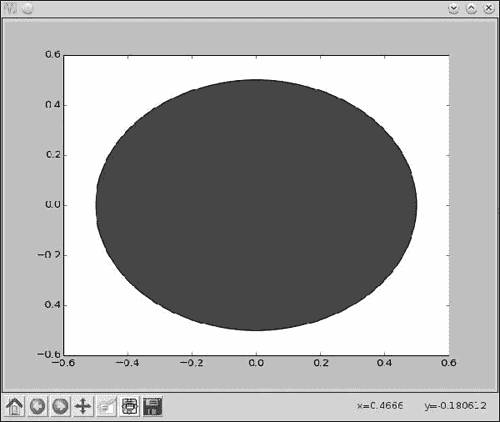

## 第六章：**绘制几何形状和分形**


在本章中，我们将首先学习 matplotlib 中的补丁（patches），它们使我们能够绘制几何形状，如圆形、三角形和多边形。接着，我们将学习 matplotlib 的动画支持，并编写一个程序来展示投射物的轨迹。最后一部分，我们将学习如何绘制 *分形*——通过反复应用简单的几何变换创建的复杂几何形状。让我们开始吧！

### **使用 Matplotlib 补丁绘制几何形状**

在 matplotlib 中，*补丁*允许我们绘制几何形状，每个几何形状都被称为一个 *补丁*。例如，您可以指定圆形的半径和圆心，以便将相应的圆形添加到您的图表中。这与我们迄今为止使用 matplotlib 的方式有很大不同，之前我们通过提供点的 *x* 和 *y* 坐标来绘制图形。然而，在编写一个程序来利用补丁功能之前，我们需要稍微了解一下 matplotlib 图表是如何创建的。考虑以下程序，它使用 matplotlib 绘制点 (1, 1)，(2, 2) 和 (3, 3)：

```py
>>> import matplotlib.pyplot as plt
>>> x = [1, 2, 3]
>>> y = [1, 2, 3]
>>> plt.plot(x, y)
[<matplotlib.lines.Line2D object at 0x7fe822d67a20>]
>>> plt.show()
```

这个程序创建了一个 matplotlib 窗口，展示了一条经过给定点的直线。在背后，当调用 `plt.plot()` 函数时，首先会创建一个 `Figure` 对象，其中创建坐标轴，最后数据会被绘制到坐标轴中（参见 图 6-1）。¹


*图 6-1：matplotlib 图表的架构*

以下程序重新创建了这个图表，但我们将显式地创建 `Figure` 对象并向其中添加坐标轴，而不是仅仅调用 `plot()` 函数并依赖它来创建这些对象：

```py
   >>> import matplotlib.pyplot as plt
   >>> x = [1, 2, 3]
   >>> y = [1, 2, 3]
➊ >>> fig = plt.figure()
➋ >>> ax = plt.axes()
   >>> plt.plot(x, y)
   [<matplotlib.lines.Line2D object at 0x7f9bad1dcc18>]
   >>> plt.show()
   >>>
```

在这里，我们在 ➊ 使用 `figure()` 函数创建了 `Figure` 对象，然后在 ➋ 使用 `axes()` 函数创建了坐标轴。`axes()` 函数还会将坐标轴添加到 `Figure` 对象中。最后两行与之前的程序相同。这一次，当我们调用 `plot()` 函数时，它会看到已经存在一个包含 `Axes` 对象的 `Figure` 对象，并直接绘制提供给它的数据。

除了手动创建 `Figure` 和 `Axes` 对象外，您还可以使用 `pyplot` 模块中的两个不同函数来获取当前 `Figure` 和 `Axes` 对象的引用。当调用 `gcf()` 函数时，它返回当前 `Figure` 的引用，而当调用 `gca()` 函数时，它返回当前 `Axes` 的引用。一个有趣的特点是，如果这些对象尚不存在，每个函数都会自动创建它们。随着我们在本章中逐步使用这些函数，它们的工作原理会变得更加清晰。

#### ***绘制一个圆形***

要绘制一个圆形，您可以将 `Circle` 补丁添加到当前的 `Axes` 对象中，如下所示：

```py
   '''
   Example of using matplotlib's Circle patch
   '''
   import matplotlib.pyplot as plt

   def create_circle():
➊     circle = plt.Circle((0, 0), radius = 0.5)
       return circle

   def show_shape(patch):
➋     ax = plt.gca()
       ax.add_patch(patch)
       plt.axis('scaled')
       plt.show()

   if __name__ == '__main__':
➌     c = create_circle()
       show_shape(c)
```

在这个程序中，我们将`Circle`补丁对象的创建与将补丁添加到图形中的操作分成了两个函数：`create_circle()`和`show_shape()`。在`create_circle()`中，我们通过传入中心坐标(0, 0)和半径 0.5，使用相同名称的关键字参数在第➊步创建了一个`Circle`对象。该函数返回创建的`Circle`对象。

`show_shape()`函数的编写方式使其能够与任何 matplotlib 补丁一起使用。首先，在第➋步，它通过`gca()`函数获取当前`Axes`对象的引用。然后，它使用`add_patch()`函数将传入的补丁添加到图形中，最后调用`show()`函数显示图形。我们在这里调用了`axis()`函数，并传入`scaled`参数，这基本上告诉 matplotlib 自动调整坐标轴的范围。我们需要在所有使用补丁的程序中加入此语句，以便自动缩放坐标轴。当然，你也可以像我们在第二章中看到的那样，指定固定的坐标轴范围。

在第➌步，我们通过标签`c`调用`create_circle()`函数来引用返回的`Circle`对象。然后，我们调用`show_shape()`函数，并将`c`作为参数传入。当你运行程序时，你会看到一个 matplotlib 窗口显示圆形（见图 6-2）。



*图 6-2：中心在(0, 0)，半径为 0.5 的圆形*

正如你所看到的，这里的圆形看起来并不像圆形。这是因为自动的纵横比（aspect ratio）决定了* x *轴和* y *轴的长度比。如果你在第➋步后插入语句`ax.set_aspect('equal')`，你会看到圆形确实变得像一个圆。`set_aspect()`函数用于设置图形的纵横比；通过使用`equal`参数，我们告诉 matplotlib 将* x *轴和* y *轴的长度比设置为 1:1。

通过`ec`和`fc`关键字参数，可以更改补丁的边缘颜色和填充颜色。例如，传入`fc='g'`和`ec='r'`将创建一个具有绿色填充和红色边缘的圆形。

Matplotlib 支持多种其他补丁类型，如`Ellipse`、`Polygon`和`Rectangle`。

#### ***创建动画图形***

有时我们可能希望创建带有移动形状的图形。Matplotlib 的动画支持将帮助我们实现这一点。在本节的最后，我们将创建一个动画版本的抛物线轨迹绘制程序。

首先，让我们看看一个更简单的例子。我们将绘制一个 matplotlib 图形，其中的圆形一开始很小，然后会无限增大到某个半径（除非关闭 matplotlib 窗口）：

```py
   '''
   A growing circle
   '''

   from matplotlib import pyplot as plt
   from matplotlib import animation

   def create_circle():
       circle = plt.Circle((0, 0), 0.05)
       return circle

   def update_radius(i, circle):
       circle.radius = i*0.5
       return circle,

   def create_animation():
➊     fig = plt.gcf()
       ax = plt.axes(xlim=(-10, 10), ylim=(-10, 10))
       ax.set_aspect('equal')
       circle = create_circle()
➋     ax.add_patch(circle)
➌     anim = animation.FuncAnimation(
           fig, update_radius, fargs = (circle,), frames=30, interval=50)
       plt.title('Simple Circle Animation')
       plt.show()

   if __name__ == '__main__':
       create_animation()
```

我们首先从 matplotlib 包中导入`animation`模块。`create_animation()`函数在这里实现了核心功能。它通过在➊处使用`gcf()`函数获取当前`Figure`对象的引用，然后创建了坐标轴，坐标轴的限制为-10 和 10，分别适用于*x*轴和*y*轴。之后，它创建了一个`Circle`对象，表示一个半径为 0.05、中心在(0, 0)的圆，并在➋处将这个圆添加到当前坐标轴。然后，我们创建了一个`FuncAnimation`对象➌，并传递了以下关于我们想要创建的动画的数据：

`fig` 这是当前的`Figure`对象。

`update_radius` 这个函数负责绘制*每一帧*。它接受两个参数——一个帧编号，该编号在调用时会自动传递给它，另一个是我们希望每帧更新的补丁对象。这个函数还必须返回该对象。

`fargs` 这个元组包含所有传递给`update_radius()`函数的参数，除了帧编号。如果没有需要传递的参数，可以不指定这个关键字参数。

`frames` 这是动画中的帧数。我们的`update_radius()`函数会被调用这么多次。在这里，我们任意选择了 30 帧。

`interval` 这是两帧之间的时间间隔（以毫秒为单位）。如果动画看起来太慢，可以减小这个值；如果看起来太快，可以增大这个值。

然后我们使用`title()`函数设置标题，最后使用`show()`函数显示图形。

如前所述，`update_radius()`函数负责更新每一帧会发生变化的圆的属性。在这里，我们将半径设置为`i*0.5`，其中`i`是帧编号。因此，你会看到一个在 30 帧内逐渐增大的圆——也就是说，最大圆的半径是 15。由于坐标轴的限制被设置为-10 和 10，这就造成了圆超出图形尺寸的效果。当你运行程序时，你将看到你的第一个动画图形，如图 6-3 所示。

你会注意到动画会一直持续，直到你关闭 matplotlib 窗口。这是默认行为，你可以通过在创建`FuncAnimation`对象时将关键字参数设置为`repeat=False`来更改此行为。


*图 6-3：简单的圆形动画*

**FUNCANIMATION 对象与持久性**

你可能注意到，在动画圆圈程序中，我们将创建的`FuncAnimation`对象赋值给了标签`anim`，尽管我们在其他地方没有再次使用它。这是由于 matplotlib 当前的行为问题——它不会存储对`FuncAnimation`对象的任何引用，这使得该对象可能会被 Python 的垃圾回收机制回收。这意味着动画不会被创建。创建一个引用该对象的标签可以防止这种情况发生。

欲了解更多相关问题，您可以关注在*[`github.com/matplotlib/matplotlib/issues/1656/`](https://github.com/matplotlib/matplotlib/issues/1656/)*上的讨论。

#### ***动画化投射物的轨迹***

在第二章中，我们绘制了一个抛物线运动中球的轨迹。在这里，我们将基于该图形，利用 matplotlib 的动画功能将轨迹动画化，以便更接近于展示在现实生活中看到球运动的效果：

```py
   '''
   Animate the trajectory of an object in projectile motion
   '''

   from matplotlib import pyplot as plt
   from matplotlib import animation
   import math

   g = 9.8

   def get_intervals(u, theta):

       t_flight = 2*u*math.sin(theta)/g
       intervals = []
       start = 0
       interval = 0.005
       while start < t_flight:
           intervals.append(start)
           start = start + interval
       return intervals

   def update_position(i, circle, intervals, u, theta):

       t = intervals[i]
       x = u*math.cos(theta)*t
       y = u*math.sin(theta)*t - 0.5*g*t*t
       circle.center = x, y
       return circle,

   def create_animation(u, theta):

       intervals = get_intervals(u, theta)

       xmin = 0
       xmax = u*math.cos(theta)*intervals[-1]
       ymin = 0
       t_max = u*math.sin(theta)/g
➊     ymax = u*math.sin(theta)*t_max - 0.5*g*t_max**2
       fig = plt.gcf()
➋     ax = plt.axes(xlim=(xmin, xmax), ylim=(ymin, ymax))

       circle = plt.Circle((xmin, ymin), 1.0)
       ax.add_patch(circle)

➌     anim = animation.FuncAnimation(fig, update_position,
                           fargs=(circle, intervals, u, theta),
                           frames=len(intervals), interval=1,
                           repeat=False)

       plt.title('Projectile Motion')
       plt.xlabel('X')
       plt.ylabel('Y')
       plt.show()

   if __name__ == '__main__':
       try:
           u = float(input('Enter the initial velocity (m/s): '))
           theta = float(input('Enter the angle of projection (degrees): '))
       except ValueError:
           print('You entered an invalid input')
       else:
           theta = math.radians(theta)
           create_animation(u, theta)
```

`create_animation()` 函数接受两个参数：`u` 和 `theta`。这些参数对应程序输入的初速度和发射角度 (*θ*)。`get_intervals()` 函数用于找到计算 *x* 和 *y* 坐标的时间间隔。此函数通过利用我们在第二章中使用的相同逻辑来实现，当时我们实现了一个单独的函数 `frange()` 来帮助我们。

为了设置动画的坐标轴范围，我们需要找出 *x* 和 *y* 的最小值和最大值。每个坐标的最小值都是 0，这是它们的初始值。*x* 坐标的最大值是球飞行结束时的坐标值，即列表 `intervals` 中最后的时间间隔。*y* 坐标的最大值是球的最高点——也就是在 ➊ 点，我们通过公式计算这个点的位置。


一旦我们得到了这些值，我们就在 ➋ 创建坐标轴，并传入适当的坐标轴范围。在接下来的两条语句中，我们创建了一个球的表示，并通过在 (`xmin`, `ymin`)（即 *x* 和 *y* 轴的最小坐标）创建一个半径为 `1.0` 的圆，将其添加到图形的 `Axes` 对象中。

然后我们创建 `FuncAnimation` 对象 ➌，并为其提供当前的图形对象以及以下参数：

`update_position` 该函数将在每一帧中改变圆心的位置。这里的想法是每个时间间隔都会创建一个新的帧，因此我们将帧数设置为时间间隔的大小（请参阅此列表中 `frames` 的描述）。我们计算在第 `i` 个时间间隔的时间瞬间，球的 *x* 和 *y* 坐标，并将圆心的位置设置为这些值。

`fargs` `update_position()` 函数需要访问时间间隔列表 `intervals`、初速度和角度 `theta`，这些都通过这个关键字参数指定。

`frames` 因为我们将在每个时间间隔绘制一帧，所以将帧数设置为 `intervals` 列表的大小。

`repeat` 正如我们在第一个动画示例中讨论的，动画默认情况下会无限重复。我们不希望在这个情况下发生这种情况，因此我们将该关键字设置为 `False`。

当您运行程序时，它会要求输入初始值，然后生成动画，如图 6-4 所示。


*图 6-4：抛射物轨迹的动画*

### **绘制分形**

分形是从出奇简单的数学公式中产生的复杂几何图案或形状。与几何形状（如圆形和矩形）相比，分形看起来不规则且没有明显的模式或描述，但如果仔细观察，你会发现图案会显现出来，并且整个形状是由无数自我复制的部分组成的。由于分形涉及在平面上对点进行相同*几何变换*的重复应用，因此计算机程序非常适合生成它们。在本章中，我们将学习如何绘制巴恩斯利蕨、谢尔宾斯基三角形和曼德尔布罗集合（后两者在挑战中介绍）——这是分形领域中常见的例子。分形在自然界中也随处可见——常见的例子包括海岸线、树木和雪花。

#### ***平面上点的变换***

创建分形的基本思想是点的变换。给定平面上的一个点 *P*(*x*, *y*)，变换的一个例子是 *P* (*x*, *y*) → *Q* (*x* + 1, *y* + 1)，这意味着在应用变换后，会创建一个新点 *Q*，它位于 *P* 上方和右侧各一单位。如果然后把 *Q* 作为起点，你会得到另一个点 *R*，它位于 *Q* 上方和右侧各一单位。假设起始点 *P* 为 (1, 1)。图 6-5 显示了点的变化情况。


*图 6-5：点* Q *和* R *通过对点* P *进行两次变换获得。*

因此，这个变换是一个规则，描述了一个点在 *x*-*y* 平面中如何从初始位置开始，经过每次迭代后移动到不同的点。我们可以把变换看作是点在平面上的*轨迹*。现在，考虑到不仅有一个变换规则，而是有两个这样的规则，并且在每一步中随机选择其中一个变换规则。我们来看一下这些规则：

规则 1: *P* 1 (*x*, *y*) → *P* 2 (*x* + 1, *y* – 1)

规则 2: *P* 1 (*x*, *y*) → *P* 2 (*x* + 1, *y* + 1)

假设 *P*1(1, 1) 为起始点。如果进行四次迭代，我们可以得到以下的点序列：

*P* 1 (1, 1) → *P* 2 (2, 0)（规则 1）

*P* 2 (2, 0) → *P* 3 (3, 1)（规则 2）

*P* 3 (3, 1) → *P* 4 (4, 2)（规则 2）

*P* 4 (4, 2) → *P* 5 (5, 1)（规则 1）

…依此类推。

变换规则是随机选取的，每个规则被选中的概率相等。无论选中哪个规则，点都会朝右移动，因为在两种情况下我们都会增加 *x* 坐标。当点朝右移动时，它们要么向上，要么向下，从而形成锯齿状路径。以下程序绘制了一个点在进行某一变换规则下，经过指定次数迭代后的路径：

```py
   '''
   Example of selecting a transformation from two equally probable
   transformations
   '''
   import matplotlib.pyplot as plt
   import random

   def transformation_1(p):
       x = p[0]
       y = p[1]
       return x + 1, y - 1

   def transformation_2(p):
       x = p[0]
       y = p[1]
       return x + 1, y + 1

   def transform(p):
➊     # List of transformation functions
       transformations = [transformation_1, transformation_2]
       # Pick a random transformation function and call it
➋     t = random.choice(transformations)
➌     x, y = t(p)
       return x, y

   def build_trajectory(p, n):
       x = [p[0]]
       y = [p[1]]
       for i in range(n):
           p = transform(p)
           x.append(p[0])
           y.append(p[1])

           return x, y

   if __name__ == '__main__':
       # Initial point
       p = (1, 1)
       n = int(input('Enter the number of iterations: '))
➍     x, y = build_trajectory(p, n)
       # Plot
➎     plt.plot(x, y)
       plt.xlabel('X')
       plt.ylabel('Y')
       plt.show()
```

我们定义了两个函数，`transformation_1()`和`transformation_2()`，分别对应之前的两个变换。在`transform()`函数中，我们在➊处创建一个包含这两个函数名的列表，并使用`random.choice()`函数在➋处从列表中选择一个变换。现在我们已经选择了要应用的变换，我们用点*P*调用它，并将变换后的点的坐标存储在标签`x`、`y`中 ➌，并返回它们。

**从列表中选择随机元素**

我们在第一个分形程序中看到的`random.choice()`函数可以用来从列表中选择一个随机元素。每个元素都有*相等*的机会被返回。以下是一个示例：

```py
>>> import random
>>> l = [1, 2, 3]
>>> random.choice(l)
3
>>> random.choice(l)
1
>>> random.choice(l)
1
>>> random.choice(l)
3
>>> random.choice(l)
3
>>> random.choice(l)
2
```

该函数同样适用于元组和字符串。在后者的情况下，它从字符串中返回一个随机字符。

当你运行程序时，它会询问你迭代的次数`n`——即变换应用的次数。然后，它会调用`build_trajectory()`函数，传入`n`和初始点*P*，其值为(1, 1) ➍。`build_trajectory()`函数会重复调用`transform()`函数`n`次，使用两个列表`x`和`y`来存储所有变换点的*x*坐标和*y*坐标。最后，它返回这两个列表，并将其绘制出来 ➎。

图 6-6 和 6-7 分别展示了点在 100 次和 10,000 次迭代中的轨迹。在这两幅图中，锯齿状运动非常明显。这种锯齿路径通常被称为*线上的随机游走*。


*图 6-6: 点(1, 1)在经过两种变换之一随机进行 100 次迭代时所描绘的锯齿路径*


*图 6-7: 点(1, 1)在经过两种变换之一随机进行 10,000 次迭代时所描绘的锯齿路径。*

这个示例展示了创建分形的基本思路——从一个初始点出发，并反复对该点应用变换。接下来，我们将看到将相同的思路应用于绘制*巴恩斯利蕨*的示例。

#### ***绘制巴恩斯利蕨***

英国数学家迈克尔·巴恩斯利描述了如何通过对一个点反复应用简单的变换来创建蕨类植物结构（见图 6-8）。


*图 6-8: 女士蕨²*

他提出了以下步骤来创建类似蕨类植物的结构：从点(0, 0)开始，并*随机*选择以下变换之一，按指定的*概率*：

**变换 1** (0.85 概率):

*x*[*n*+1] = 0.85*x[n]* + 0.04*y[n]*

*y*[*n*+1] = –0.04*y[n]* + 0.85*y[n]* + 1.6

**变换 2** (0.07 概率):

*x*[*n*+1] = 0.2*x[n]* – 0.26*y[n]*

*y*[*n*+1] = 0.23*y[n]* + 0.22*y[n]* + 1.6

**变换 3** (0.07 概率):

*x*[*n*+1] = –0.15*x[n]* – 0.28*x[n]*

*y*[*n*+1] = 0.26*y[n]* + 0.24*y[n]* + 0.44

**变换 4**（概率 0.01）：

*x*[*n*+1] = 0

*y*[*n*+1] = 0.16*y[n]*

这些变换中的每一个都负责创建蕨类植物的一部分。第一个变换以最高的概率被选中——因此应用的次数最多——它创建了蕨类植物的茎和底部的羽叶。第二个和第三个变换分别创建了左侧和右侧的底部羽叶，第四个变换则创建了蕨类植物的茎。

这是一个非均匀概率选择的例子，我们在 第五章 中首次学习过。以下程序会根据指定的点数绘制 Barnsley 蕨类植物：

```py
   '''
   Draw a Barnsley Fern
   '''
   import random
   import matplotlib.pyplot as plt

   def transformation_1(p):
       x = p[0]
       y = p[1]
       x1 = 0.85*x + 0.04*y
       y1 = -0.04*x + 0.85*y + 1.6
       return x1, y1

   def transformation_2(p):
       x = p[0]
       y = p[1]
       x1 = 0.2*x - 0.26*y
       y1 = 0.23*x + 0.22*y + 1.6
       return x1, y1

   def transformation_3(p):
       x = p[0]
       y = p[1]
       x1 = -0.15*x + 0.28*y
       y1 = 0.26*x + 0.24*y + 0.44
       return x1, y1

   def transformation_4(p):
       x = p[0]
       y = p[1]
       x1 = 0
       y1 = 0.16*y
       return x1, y1

   def get_index(probability):
       r = random.random()
       c_probability = 0
       sum_probability = []
       for p in probability:
           c_probability += p
           sum_probability.append(c_probability)
       for item, sp in enumerate(sum_probability):
           if r <= sp:
               return item
       return len(probability)-1

   def transform(p):
       # List of transformation functions
       transformations = [transformation_1, transformation_2,
                              transformation_3, transformation_4]
➊     probability = [0.85, 0.07, 0.07, 0.01]
       # Pick a random transformation function and call it
       tindex = get_index(probability)
➋     t = transformations[tindex]
       x, y = t(p)
       return x, y

   def draw_fern(n):
       # We start with (0, 0)
       x = [0]
       y = [0]

       x1, y1 = 0, 0
       for i in range(n):
          x1, y1 = transform((x1, y1))
          x.append(x1)
          y.append(y1)
       return x, y

   if __name__ == '__main__':
       n = int(input('Enter the number of points in the Fern: '))
       x, y = draw_fern(n)
       # Plot the points
       plt.plot(x, y, 'o')
       plt.title('Fern with {0} points'.format(n))
       plt.show()
```

当你运行这个程序时，它会要求指定蕨类植物的点数，然后创建蕨类植物。图 6-9 和 6-10 分别展示了含有 1,000 和 10,000 个点的蕨类植物。


*图 6-9：含 1,000 个点的蕨类植物*


*图 6-10：含 10,000 个点的蕨类植物*

四个变换规则分别在 `transformation_1()`、`transformation_2()`、`transformation_3()` 和 `transformation_4()` 函数中定义。每个变换被选中的概率在 ➊ 处声明，然后在每次 `draw_fern()` 函数调用 `transform()` 时，都会随机选取其中一个进行应用 ➋。

初始点 (0, 0) 被变换的次数与程序输入的蕨类植物中指定的点数相同。

### **你学到了什么**

在本章中，你首先学习了如何绘制基本的几何形状以及如何为它们添加动画。这个过程让你接触到了一些新的 matplotlib 功能。然后，你学习了几何变换，并看到重复的简单变换如何帮助你绘制出复杂的几何形状——*分形*。

### **编程挑战**

这里有一些编程挑战，应该能帮助你进一步应用所学的内容。你可以在 *[`www.nostarch.com/doingmathwithpython/`](http://www.nostarch.com/doingmathwithpython/)* 找到示例解决方案。

#### ***#1：将圆形填充到正方形中***

我之前提到过，matplotlib 支持创建其他几何形状。`Polygon` 补丁尤其有趣，因为它允许你绘制具有不同边数的多边形。以下是如何绘制一个边长为 4 的正方形的方法：

```py
'''
Draw a square
'''

from matplotlib import pyplot as plt

def draw_square():
    ax = plt.axes(xlim = (0, 6), ylim = (0, 6))
    square = plt.Polygon([(1, 1), (5, 1), (5, 5), (1, 5)], closed = True)
    ax.add_patch(square)
    plt.show()

if __name__ == '__main__':
    draw_square()
```

`Polygon` 对象通过将顶点坐标的列表作为第一个参数来创建。因为我们绘制的是一个正方形，所以我们传入四个顶点的坐标：(1, 1)、(5, 1)、(5, 5) 和 (1, 5)。传入 `closed=True` 告诉 matplotlib 我们想绘制一个封闭的多边形，其中起点和终点是相同的。

在这个挑战中，你将尝试解决一个简化版的“将圆圈填入正方形”问题。半径为 0.5 的圆圈能在这段代码生成的正方形中填充多少个？绘制并找出答案！图 6-11 展示了最终图像的样子。


*图 6-11：圆圈填充进正方形*

这里的技巧是从正方形的左下角开始——也就是(1, 1)——然后继续添加圆，直到整个正方形填满。以下代码片段展示了如何创建圆并将其添加到图形中：

```py
y = 1.5
while y < 5:
    x = 1.5
    while x < 5:
        c = draw_circle(x, y)
        ax.add_patch(c)

        x += 1.0
    y += 1.0
```

这里值得注意的一点是，这*并不是*将圆圈填入正方形的最优方法，或者说，解决此问题的唯一方法，寻找不同的解决方案在数学爱好者中非常流行。

#### ***#2: 绘制谢尔宾斯基三角形***

谢尔宾斯基三角形是以波兰数学家瓦茨瓦夫·谢尔宾斯基的名字命名的，它是一个分形，构成它的是一个等边三角形，其中嵌入了更小的等边三角形。图 6-12 展示了一个由 10,000 个点组成的谢尔宾斯基三角形。


*图 6-12：带有 10,000 个点的谢尔宾斯基三角形*

有趣的是，绘制蕨类植物时使用的相同过程也能绘制谢尔宾斯基三角形——只是变换规则及其概率会有所变化。以下是绘制谢尔宾斯基三角形的方法：从点(0, 0)开始，应用以下某一变换：

**变换 1：**

*x*[*n*+1] = 0.5*x[n]*

*y*[*n*+1] = 0.5*y[n]*

**变换 2：**

*x*[*n*+1] = 0.5*x[n]* + 0.5

*y*[*n*+1] = 0.5*y[n]* + 0.5

**变换 3：**

*x*[*n*+1] = 0.5*x[n]* + 1

*y*[*n*+1] = 0.5*y[n]*

每个变换的选择概率是相等的——1/3。你的挑战是编写一个程序，绘制出由指定数量的点组成的谢尔宾斯基三角形。

#### ***#3: 探索亨农函数***

1976 年，米歇尔·亨农（Michel Hénon）提出了亨农函数，它描述了如下的点 *P*(*x*, *y*) 的变换规则：

*P* (*x*, *y*) → *Q* (*y* + 1 – 1.4*x*², 0.3*x*)

无论初始点在哪里（只要它距离原点不太远），你会发现随着点的增加，它们开始沿着弯曲的线排列，如图 6-13 所示。


*图 6-13：带有 10,000 个点的亨农函数*

你的挑战是编写一个程序，绘制出显示 20,000 次迭代的图形，从点(1, 1)开始。

额外加分项：编写另一个程序，创建一个动画图形，展示点开始沿着曲线排列的过程！示例请见 *[`www.youtube.com/watch?v=76ll818RlpQ`](https://www.youtube.com/watch?v=76ll818RlpQ)*。

这是一个动态系统的例子，所有点似乎都被吸引到的曲线被称为*吸引子*。要了解更多关于这个函数、动态系统和分形的一般知识，您可以参考肯尼斯·法尔科纳（Kenneth Falconer）所著的《分形：非常简短的介绍》（牛津大学出版社，2013 年）。

#### ***#4: 绘制曼德尔布罗集***

你的挑战是编写一个程序来绘制*曼德尔布罗集*——这是应用简单规则形成复杂形状的另一个例子（请参见图 6-14）。不过，在我讲解具体步骤之前，我们先了解一下 matplotlib 的 `imshow()` 函数。


*图 6-14：曼德尔布罗集，平面范围为 (–2.5, –1.0) 到 (1.0, 1.0)*

##### **imshow() 函数**

`imshow()` 函数通常用于显示外部图像，如 JPEG 或 PNG 图像。你可以查看[`matplotlib.org/users/image_tutorial.html`](http://matplotlib.org/users/image_tutorial.html)上的示例。不过，在这里，我们将使用这个函数通过 matplotlib 绘制我们自己创建的新图像。

考虑笛卡尔平面中 *x* 和 *y* 均在 0 到 5 之间的部分。现在，考虑在每个轴上六个等距的点：（0, 1, 2, 3, 4, 5）沿 *x*-轴分布，沿 *y*-轴同样分布一组相同的点。如果我们将这些点的笛卡尔积考虑进去，我们会得到 36 个等距的点，坐标为 (0, 0)、(0, 1) … (0, 5)、(1, 0)、(1, 1) … (1, 5) … (5, 5)。现在，假设我们想为这些点中的每一个着上灰色的阴影——也就是说，其中一些点将是黑色的，有些是白色的，其他的将随机选择一个中间的灰色阴影。图 6-15 展示了这个情形。


*图 6-15：部分* x-y *平面，* x *和* y *的范围均为 0 到 5。我们在该区域内考虑了 36 个等距的点，并为每个点着上了不同深浅的灰色。*

要创建这个图形，我们必须创建一个由六个列表组成的列表。这六个列表中的每一个将包含六个整数，范围从 0 到 10。每个数字代表一个点的颜色，0 代表黑色，10 代表白色。然后我们将这个列表传递给 `imshow()` 函数，并附上其他必要的参数。

##### **创建一个列表的列表**

一个列表也可以包含其他列表作为其成员：

```py
>>> l1 = [1, 2, 3]
>>> l2 = [4, 5, 6]
>>> l = [l1, l2]
```

在这里，我们创建了一个列表 `l`，它由两个列表 `l1` 和 `l2` 组成。列表的第一个元素 `l[0]` 就是 `l1` 列表，而列表的第二个元素 `l[1]` 就是 `l2` 列表：

```py
>>> l[0]
[1, 2, 3]

>>> l[1]
[4, 5, 6]
```

若要引用其中一个成员列表中的单个元素，我们必须指定两个索引——`l[0][1]` 指的是第一个列表中的第二个元素，`l[1][2]` 指的是第二个列表中的第三个元素，以此类推。

现在我们知道如何处理列表的列表，我们可以编写程序来创建一个类似于图 6-15 的图形：

```py
   import matplotlib.pyplot as plt
   import matplotlib.cm as cm
   import random

➊ def initialize_image(x_p, y_p):
       image = []
       for i in range(y_p):
          x_colors = []
           for j in range(x_p):
               x_colors.append(0)
           image.append(x_colors)
       return image

   def color_points():
       x_p = 6
       y_p = 6
       image = initialize_image(x_p, y_p)
       for i in range(y_p):
           for j in range(x_p):
➋             image[i][j] = random.randint(0, 10)
➌     plt.imshow(image, origin='lower', extent=(0, 5, 0, 5),
                  cmap=cm.Greys_r, interpolation='nearest')
       plt.colorbar()
       plt.show()

   if __name__ == '__main__':
       color_points()
```

在➊处，`initialize_image()`函数创建了一个元素都初始化为 0 的列表列表。它接受两个参数，`x_p`和`y_p`，分别对应于* x *轴和* y *轴上的点数。这实际上意味着初始化后的列表`image`将由`x_p`个列表组成，每个列表包含`y_p`个零。

在`color_points()`函数中，一旦你从`initialize_image()`获取到图像列表，就将一个介于 0 和 10 之间的随机整数赋值给➋处的元素`image[i][j]`。当我们将这个随机整数赋给元素时，我们实际上是将一个颜色分配给笛卡尔平面中距离原点* i *步沿* y *轴和* j *步沿* x *轴的点。需要注意的是，`imshow()`函数会根据点在`image`列表中的位置自动推断该点的颜色，而不关心其具体的* x *和* y *坐标。

然后，在➌处调用`imshow()`函数，将`image`作为第一个参数传入。关键字参数`origin='lower'`指定`image[0][0]`中的数字对应点（0, 0）的颜色。关键字参数`extent=(0, 5, 0, 5)`将图像的左下角和右上角分别设置为(0, 0)和(5, 5)。关键字参数`cmap=cm.Greys_r`指定我们将创建一张灰度图像。

最后的关键字参数`interpolation='nearest'`指定 matplotlib 应该为那些没有指定颜色的点着上与其最近的点相同的颜色。这是什么意思呢？请注意，我们只考虑并为区域(0, 5)和(5, 5)中的 36 个点指定了颜色。因为该区域中有无限多个点，所以我们告诉 matplotlib 将没有指定颜色的点设置为与其最近的点相同的颜色。这就是你在图形中看到每个点周围出现“颜色框”的原因。

调用`colorbar()`函数在图形中显示一个颜色条，显示哪个整数对应哪个颜色。最后，调用`show()`来展示图像。请注意，由于使用了`random.randint()`函数，你的图像将与图 6-15 中的图像有所不同。

如果你通过将`color_points()`中的`x_p`和`y_p`设为，比如说`20`，增加每个轴上的点的数量，你会看到类似于图 6-16 的图形。请注意，颜色框的大小变小了。如果你继续增加点的数量，你会看到框的大小进一步缩小，从而产生每个点颜色不同的错觉。


*图 6-16：部分* x-y *平面，其中* x *和* y *都从 0 到 5。我们考虑了该区域中等距离的 400 个点，并为每个点着上了一种灰色阴影。*

##### **绘制曼德尔布罗集**

我们将考虑* x*–* y*平面中(–2.5, –1.0)和(1.0, 1.0)之间的区域，并将每个轴划分为 400 个均匀间隔的点。这些点的笛卡尔积将给我们 1,600 个均匀分布的点。我们将这些点称为(*x*[1], *y*[1])，(*x*[1], *y*[2]) ... (*x*[400], *y*[400])。

通过调用我们之前看到的`initialize_image()`函数并将`x_p`和`y_p`都设置为 400 来创建一个列表`image`。然后，按照以下步骤处理*每个*生成的点（*x[i]*，*y[k]*）：

1\. 首先，创建两个复数，*z*[1] = 0 + 0*j* 和 *c* = *x[i]* + *y[k] j*。（请记住，我们用*j*表示。）

2\. 创建一个标签`iteration`并将其设置为 0——即`iteration=0`。

3\. 创建一个复数，。

4\. 将`iteration`中的值加 1——即`iteration = iteration + 1`。

5\. 如果`abs(z1) < 2`并且`iteration < max_iteration`，则返回第 3 步；否则，继续到第 6 步。`max_iteration`的值越大，图像越详细，但生成图像所需的时间也会更长。这里将`max_iteration`设置为 1,000。

6\. 将点(*x[i]*，*y[k]*)的颜色设置为`iteration`中的值——即`image[k][i] = iteration`。

一旦你完成了整个`image`列表，调用`imshow()`函数，并将`extent`关键字参数修改为表示由(–2.5, –1.0)和(1.0, 1.0)所界定的区域。

这个算法通常被称为*逃逸时间算法*。当一个点的幅值在达到最大迭代次数之前没有超过 2 时，该点属于曼德尔布罗集，并被涂成白色。那些在较少迭代次数内幅值超过 2 的点被称为“逃逸”；它们不属于曼德尔布罗集，并被涂成黑色。你可以通过减少或增加每个轴上的点的数量来进行实验。减少点的数量会导致图像出现颗粒感，而增加点的数量则会生成更详细的图像。
