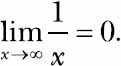
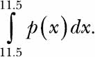

## 第七章：**解答微积分问题**


在本章的最后部分，我们将学习如何解答微积分问题。我们首先了解数学函数，然后快速回顾 Python 标准库和 SymPy 中常见的数学函数。接着，我们将学习如何求解函数的极限，计算导数和积分——也就是你在任何微积分课堂上会做的事情。让我们开始吧！

### **什么是函数？**

让我们从一些基本定义开始。函数是输入集合和输出集合之间的*映射*。函数的特殊条件是输入集合中的每个元素都与*恰好一个*输出集合中的元素相关联。例如，图 7-1 显示了两个集合，其中输出集合中的一个元素是属于输入集合的某个元素的平方。


*图 7-1：一个函数描述了输入集合和输出集合之间的映射关系。在这里，输出集合中的一个元素是输入集合中一个元素的平方。*

使用常见的函数表示法，我们可以将这个函数写为 *f*(*x*) = *x*²，其中 *x* 是自变量。所以 *f*(2) = 4, *f*(100) = 10000，依此类推。我们称 *x* 为自变量，因为我们可以自由地为其假设一个值，只要该值在其定义域内（参见下一部分）。

函数也可以根据多个变量来定义。例如，*f*(*x*, *y*) = *x*² + *y*² 定义了一个关于两个变量 *x* 和 *y* 的函数。

#### ***函数的定义域与值域***

函数的*定义域*是自变量可以合法取值的输入值集合。函数的输出集合叫做*值域*。

例如，函数 *f*(*x*) = 1/*x* 的定义域是所有非零的实数和复数，因为 1/0 是未定义的。值域是通过将定义域中的每个数代入 1/*x* 得到的值集合，因此在这个例子中，值域也是所有非零的实数和复数。

**注意**

*函数的定义域和值域可以是不同的。例如，对于函数* x*²，定义域是所有正负数，但值域只有正数。*

#### ***常见数学函数概述***

我们已经使用了 Python 标准库 `math` 模块中的许多常见数学函数。几个熟悉的例子是 `sin()` 和 `cos()` 函数，它们对应于三角函数正弦和余弦。其他三角函数——`tan()` 以及这些函数的反函数 `asin()`、`acos()` 和 `atan()` 也都有定义。

`math`模块还包含一些函数，用于计算一个数字的对数——自然对数函数`log()`，以 2 为底的对数`log2()`，以及以 10 为底的对数`log10()`——还有`exp()`函数，用于计算*e^x*的值，其中*e*是欧拉数（约等于 2.71828）。

所有这些函数的一个缺点是，它们不适合处理符号表达式。如果我们想要操作包含符号的数学表达式，就必须开始使用 SymPy 定义的等效函数。

让我们看一个简单的例子：

```py
>>> import math
>>> math.sin(math.pi/2)
1.0
```

这里，我们使用标准库`math`模块定义的`sin()`函数来计算角度*π*/2 的正弦值。然后，我们可以使用 SymPy 做同样的事情。

```py
>>> import sympy
>>> sympy.sin(math.pi/2)
1.00000000000000
```

与标准库的`sin()`函数类似，SymPy 的`sin()`函数期望角度以弧度表示。两个函数都返回 1。

现在，让我们尝试使用符号来调用每个函数，看看会发生什么：

```py
   >>> from sympy import Symbol
   >>> theta = Symbol('theta')
➊ >>> math.sin(theta) + math.sin(theta)
   Traceback (most recent call last):
     File "<pyshell#53>", line 1, in <module>
       math.sin(theta) + math.sin(theta)
     File "/usr/lib/python3.4/site-packages/sympy/core/expr.py", line 225, in
   __float__
       raise TypeError("can't convert expression to float")
   TypeError: can't convert expression to float

➋ >>> sympy.sin(theta) + sympy.sin(theta)
   2*sin(theta)
```

标准库的`sin()`函数不知道当我们以`theta`为➊调用它时该怎么办，因此它会引发异常，表示它期望一个数值作为`sin()`函数的参数。另一方面，SymPy 能够在➋执行相同的操作，并返回`2*sin(theta)`作为结果。现在我们已经不觉得这有什么意外，但它说明了标准库的数学函数在某些任务中可能会有所不足。

让我们考虑另一个例子。假设我们想推导出一个物体在投射运动中达到最高点所需的时间表达式，如果它以初速度`u`和角度`theta`被投掷（参见“抛体运动”在第 48 页）。

在最高点，`u*sin(theta)-g*t = 0`，因此为了求解`t`，我们将使用在第四章中学到的`solve()`函数：

```py
>>> from sympy import sin, solve, Symbol
>>> u = Symbol('u')
>>> t = Symbol('t')
>>> g = Symbol('g')
>>> theta = Symbol('theta')
>>> solve(u*sin(theta)-g*t, t)
[u*sin(theta)/g]
```

如我们之前学到的，`t`的表达式是`u*sin(theta)/g`，这也展示了如何使用`solve()`函数来求解包含数学函数的方程。

### **SymPy 中的假设**

在我们所有的程序中，我们都在 SymPy 中创建了一个`Symbol`对象，像这样定义变量：`x = Symbol('x')`。假设作为你要求 SymPy 执行的操作的结果，SymPy 需要检查表达式*x* + 5 是否大于 0。我们来看一下会发生什么：

```py
>>> from sympy import Symbol
>>> x = Symbol('x')
>>> if (x+5) > 0:
    print('Do Something')
else:
    print('Do Something else')

Traceback (most recent call last):
  File "<pyshell#45>", line 1, in <module>
    if (x + 5) > 0:
  File "/usr/lib/python3.4/site-packages/sympy/core/relational.py", line 103,
in __nonzero__
    raise TypeError("cannot determine truth value of\n%s" % self)
TypeError: cannot determine truth value of
x + 5 > 0
```

由于 SymPy 不知道*x*的符号，它无法推断*x* + 5 是否大于 0，因此会显示错误。但是基础数学告诉我们，如果*x*是正数，*x* + 5 永远大于 0，如果*x*是负数，只有在某些情况下它才会大于 0。

所以，如果我们创建一个指定`positive=True`的`Symbol`对象，我们告诉 SymPy 只考虑正值。现在，它确定了*x* + 5 一定大于 0：

```py
>>> x = Symbol('x', positive=True)
>>> if (x+5) > 0:
    print('Do Something')
else:
    print('Do Something else')

Do Something
```

请注意，如果我们指定`negative=True`，我们可能会得到与第一个情况相同的错误。就像我们可以将符号声明为`positive`和`negative`一样，也可以将其指定为`real`、`integer`、`complex`、`imaginary`等。这些声明在 SymPy 中被称为*假设*。

### **求函数的极限**

微积分中的常见任务是求函数的*极限值*（或简称*极限*），当变量的值趋近于某个特定值时。考虑一个函数*f*(*x*) = 1/*x*，其图像如图 7-2 所示。

当*x*的值增加时，*f*(*x*)的值趋近于 0。使用极限符号，我们可以将其写为



*图 7-2：显示函数 1/*x*的图像，随着*x*值的增加*

我们可以通过创建`Limit`类的对象来在 SymPy 中找到函数的极限，方法如下：

```py
➊ >>> from sympy import Limit, Symbol, S
➋ >>> x = Symbol('x')
➌ >>> Limit(1/x, x, S.Infinity)
   Limit(1/x, x, oo, dir='-')
```

在➊，我们导入`Limit`和`Symbol`类，以及`S`，这是一个特殊的 SymPy 类，包含了无穷大（正无穷和负无穷）以及其他特殊值的定义。然后在➋，我们创建一个符号对象`x`，表示*x*。在➌，我们创建`Limit`对象，传入三个参数：`1/x`，变量`x`，以及最后我们希望计算函数极限的值（无穷大，由`S.Infinity`表示）。

结果作为一个*未求值*对象返回，`oo`符号表示正无穷，`dir='-'`符号表示我们从负侧逼近极限。

要求得极限值，我们使用`doit()`方法：

```py
>>> l = Limit(1/x, x, S.Infinity)
>>> l.doit()
0
```

默认情况下，极限是从正方向计算的，除非要计算极限的值是正无穷或负无穷。在正无穷的情况下，方向为负，反之亦然。你可以通过以下方式更改默认方向：

```py
>>> Limit(1/x, x, 0, dir='-').doit()
-oo
```

在这里，我们计算


当我们从负侧逼近 0 时，*x*的极限值趋近于负无穷。另一方面，如果我们从正侧逼近 0，极限值趋近于正无穷：

```py
>>> Limit(1/x, x, 0, dir='+').doit()
oo
```

`Limit`类还处理具有不定形极限的函数，


自动地：

```py
>>> from sympy import Symbol, sin
>>> Limit(sin(x)/x, x, 0).doit()
1
```

你很可能使用了 l'Hôpital 法则来找到这种极限，但正如我们在这里看到的，`Limit`类为我们处理了这个问题。

#### ***连续复利***

假设你在银行存入了 1 美元。这笔存款是*本金*，它会支付你*利息*——在这种情况下，利息是每年复利`n`次，年利率为 100%。你在 1 年后的最终金额为：


杰出的数学家詹姆斯·伯努利发现，当*n*的值增加时，项(1 + 1/*n*)*^n*趋近于*e*的值——这个常数我们可以通过求函数的极限来验证：

```py
>>> from sympy import Limit, Symbol, S
>>> n = Symbol('n')
>>> Limit((1+1/n)**n, n, S.Infinity).doit()
E
```

对于任何本金 *p*、任何利率 *r* 和任何年份 *t*，复利的计算公式为：


假设连续复利，我们可以通过以下公式求出 *A* 的表达式：

```py
>>> from sympy import Symbol, Limit, S
>>> p = Symbol('p', positive=True)
>>> r = Symbol('r', positive=True)
>>> t = Symbol('t', positive=True)
>>> Limit(p*(1+r/n)**(n*t), n, S.Infinity).doit()
p*exp(r*t)
```

我们创建了三个符号对象，分别表示本金 `p`、利率 `r` 和年份 `t`。我们还告诉 SymPy 这些符号将假定为正值，在创建 `Symbol` 对象时传入 `positive=True` 关键字参数。如果我们不指定，SymPy 不知道符号可以假定哪些数值，可能无法正确计算极限。然后，我们将复利表达式输入，创建 `Limit` 对象，并使用 `doit()` 方法求值。结果是 `p*exp(r*t)`，这告诉我们复利随着时间的推移呈指数增长，假设利率是固定的。

#### ***瞬时变化率***

假设一辆汽车沿着道路行驶。它均匀加速，使得行驶的距离 *S* 由函数给出：

*S*(*t*) = 5*t*² + 2*t* + 8。

在这个函数中，自变量是 *t*，它表示汽车开始移动以来经过的时间。

如果我们测量在时间 *t*[1] 和 *t*[2] 之间的行驶距离，其中 *t*[2] > *t*[1]，那么我们可以使用以下表达式计算汽车在 1 单位时间内的行驶距离：


这也被称为函数 *S*(*t*) 相对于变量 *t* 的平均变化率，或者换句话说，平均速度。如果我们将 *t*[2] 写作 *t*[1] + *δ[t]*——其中 *δ[t]* 是 *t*[2] 和 *t*[1] 之间的时间差——我们可以将平均速度的表达式重写为：


这个表达式也是一个以 *t*[1] 为变量的函数。现在，如果我们进一步假设 *δ[t]* 非常小，以至于它接近于 0，我们可以使用极限符号将其写作：


我们现在将计算上述极限。首先，让我们创建各种表达式对象：

```py
   >>> from sympy import Symbol, Limit
   >>> t = Symbol('t')
➊ >>> St = 5*t**2 + 2*t + 8

   >>> t1 = Symbol('t1')
   >>> delta_t = Symbol('delta_t')

➋ >>> St1 = St.subs({t: t1})
➌ >>> St1_delta = St.subs({t: t1 + delta_t})
```

我们首先在 ➊ 处定义函数 *S*(*t*)。然后，我们定义两个符号，`t1` 和 `delta_t`，分别对应 *t*[1] 和 *δ[t]*。通过使用 `subs()` 方法，我们然后通过在 ➋ 和 ➌ 处分别将 `t` 的值替换为 `t1` 和 `t1_delta_t`，来找到 *S*(*t*[1]) 和 *S*(*t*[1] + *δ[t]*)。

现在，让我们计算这个极限：

```py
>>> Limit((St1_delta-St1)/delta_t, delta_t, 0).doit()
10*t1 + 2
```

极限结果是 `10*t1 + 2`，它是 *S*(*t*) 在时间 `t1` 的变化率，或者说是瞬时变化率。这个变化通常被称为汽车在瞬时时间 `t1` 的*瞬时速度*。

我们在这里计算的极限被称为函数的*导数*，并且我们可以直接使用 SymPy 的 `Derivative` 类来计算它。

### **求函数的导数**

函数的导数*y* = *f*(*x*)表示因变量*y*相对于自变量*x*的变化率。它通常表示为*f*′(*x*)或*dy*/*dx*。我们可以通过创建`Derivative`类的对象来求得一个函数的导数。让我们使用之前的函数——表示汽车运动的函数——作为示例：

```py
➊ >>> from sympy import Symbol, Derivative

   >>> t = Symbol('t')
   >>> St = 5*t**2 + 2*t + 8

➋ >>> Derivative(St, t)
   Derivative(5*t**2 + 2*t + 8, t)
```

我们在➊导入了`Derivative`类。在➋，我们创建了一个`Derivative`类的对象。创建对象时传入的两个参数是函数`St`和符号`t`，它对应变量*t*。和`Limit`类一样，`Derivative`类的对象被返回，但导数并没有实际计算。我们在未求值的`Derivative`对象上调用`doit()`方法来求导：

```py
>>> d = Derivative(St, t)
>>> d.doit()
10*t + 2
```

导数的表达式为`10*t + 2`。现在，如果我们想计算导数在某个特定值的值——例如，*t* = *t*[1]或*t* = 1——我们可以使用`subs()`方法：

```py
>>> d.doit().subs({t:t1})
10*t1 + 2
>>> d.doit().subs({t:1})
12
```

让我们尝试一个复杂的任意函数，以*x*为唯一变量：(*x*³ + *x*² + *x*) × (*x*² + *x*)。

```py
>>> from sympy import Derivative, Symbol
>>> x = Symbol('x')
>>> f = (x**3 + x**2 + x)*(x**2+x)
>>> Derivative(f, x).doit()
(2*x + 1)*(x**3 + x**2 + x) + (x**2 + x)*(3*x**2 + 2*x + 1)
```

你可以将这个函数视为两个独立函数的乘积，这意味着，如果手动求导，我们需要使用*乘积法则*来求导。但是在这里我们不需要担心这些，因为我们只需创建一个`Derivative`类的对象，它会为我们处理这些。

尝试一些其他复杂的表达式，比如涉及三角函数的表达式。

#### ***一个导数计算器***

现在让我们编写一个导数计算器程序，它将接受一个函数作为输入，然后输出对指定变量求导后的结果：

```py
   '''
   Derivative calculator
   '''

   from sympy import Symbol, Derivative, sympify, pprint
   from sympy.core.sympify import SympifyError

   def derivative(f, var):
       var = Symbol(var)
       d = Derivative(f, var).doit()
       pprint(d)

   if __name__=='__main__':

➊     f = input('Enter a function: ')
       var = input('Enter the variable to differentiate with respect to: ')
       try:
➋         f = sympify(f)
       except SympifyError:
           print('Invalid input')
       else:
➌         derivative(f, var)
```

在➊，我们要求用户输入一个待求导的函数，然后询问对哪个变量进行求导。在➋，我们使用`sympify()`函数将输入的函数转换为 SymPy 对象。我们将这个函数放在`try...except`块中，这样如果用户输入了无效的内容，我们可以显示错误信息。如果输入表达式是有效的，我们会在➌调用导数函数，传入转换后的表达式和待求导的变量作为参数。

在`derivative()`函数中，我们首先创建一个`Symbol`对象，表示要对其求导的变量。我们使用标签`var`来表示这个变量。接下来，我们创建一个`Derivative`对象，传入待求导的函数和符号对象`var`。我们立即调用`doit()`方法来计算导数，然后使用`pprint()`函数打印结果，以便它与数学表达式的形式接近。以下是程序的示例执行：

```py
Enter a function: 2*x**2 + 3*x + 1
Enter the variable to differentiate with respect to: x
4·x + 3
```

下面是使用两个变量函数时的一个示例运行：

```py
Enter a function: 2*x**2 + y**2
Enter the variable to differentiate with respect to: x
4·x
```

#### ***计算偏导数***

在前面的程序中，我们看到使用 `Derivative` 类可以计算多变量函数相对于任何变量的导数。这种计算通常称为*偏导数*，其中*偏*意味着我们假设只有一个变量发生变化，而其他变量保持不变。

让我们考虑函数 *f*(*x*, *y*) = 2*xy* + *xy*²。关于 *x* 的偏导数是


上述程序能够找到偏导数，因为这仅仅是指定正确的变量的问题：

```py
Enter a function: 2*x*y + x*y**2
Enter the variable to differentiate with respect to: x
y2 + 2·y
```

**注意**

*在本章中，我做出的一个关键假设是，我们计算导数的所有函数在其各自的定义域内都是可导的。*

### **高阶导数及寻找极值**

默认情况下，通过 `Derivative` 类创建导数对象时，会计算一阶导数。要计算高阶导数，只需在创建 `Derivative` 对象时，将导数的阶数作为第三个参数指定即可。在本节中，我将向你展示如何使用一阶和二阶导数来找出函数在某个区间内的最大值和最小值。

考虑函数 *x*⁵ – 30*x*³ + 50*x*，其定义域为 [–5, 5]。请注意，我使用方括号表示一个闭区间，意味着变量 *x* 可以取任何大于或等于 –5 且小于或等于 5 的实数值（见 图 7-3）。


*图 7-3：函数* x*⁵ – 30*x*³* + *50*x* 的图像，其中 –5* ≤ x ≤ *5*

从图中可以看出，函数在区间 –2 ≤ *x* ≤ 0 上的点 *B* 达到了最小值。同样，在区间 0 ≤ *x* ≤ 2 上，函数在点 *C* 达到了最大值。另一方面，函数在我们考虑的整个 *x* 定义域上分别在点 *A* 和 *D* 达到了最大值和最小值。因此，当我们考虑整个区间 [–5, 5] 时，点 *B* 和 *C* 分别被称为*局部最小值*和*局部最大值*，而点 *A* 和 *D* 则分别是*全局最大值*和*全局最小值*。

*极值*（复数形式为 *极值点*）指的是函数达到局部最大值或最小值的点。如果 *x* 是函数 *f*(*x*) 的一个极值点，那么 *f* 在 *x* 处的一阶导数 *f*′(*x*) 必须为零。这个性质表明，寻找可能的极值点的一个有效方法是尝试解方程 *f*′(*x*) = 0。这样的解称为函数的*临界点*。让我们来试试：

```py
>>> from sympy import Symbol, solve, Derivative
>>> x = Symbol('x')
>>> f = x**5 - 30*x**3 + 50*x
>>> d1 = Derivative(f, x).doit()
```

现在我们已经计算了一级导数 *f*′(*x*)，接下来我们将解 *f*′(*x*) = 0 来找到临界点：

```py
>>> critical_points = solve(d1)
>>> critical_points
[-sqrt(-sqrt(71) + 9), sqrt(-sqrt(71) + 9), -sqrt(sqrt(71) + 9),
sqrt(sqrt(71) + 9)]
```

这里列出的`critical_points`中的数字分别对应点*B*、*C*、*A*和*D*。我们将创建标签来引用这些点，然后可以在命令中使用这些标签：

```py
>>> A = critical_points[2]
>>> B = critical_points[0]
>>> C = critical_points[1]
>>> D = critical_points[3]
```

因为该函数的所有关键点都位于考虑的区间内，所以它们对于我们寻找*f*(*x*)的全局最大值和最小值都是相关的。现在，我们可以应用所谓的*二阶导数测试*来缩小哪些关键点可能是全局最大值或最小值。

首先，我们计算函数*f*(*x*)的二阶导数。请注意，为此，我们输入`2`作为第三个参数：

```py
>>> d2 = Derivative(f, x, 2).doit()
```

现在，我们通过将每个关键点的值依次代入*x*来求得二阶导数的值。如果结果小于 0，则该点是局部最大值；如果结果大于 0，则该点是局部最小值。如果结果为 0，则测试结果不确定，我们无法推断出关键点*x*是局部最小值、最大值，还是两者都不是。

```py
>>> d2.subs({x:B}).evalf()
127.661060789073
>>> d2.subs({x:C}).evalf()
-127.661060789073
>>> d2.subs({x:A}).evalf()
-703.493179468151
>>> d2.subs({x:D}).evalf()
703.493179468151
```

在关键点处评估二阶导数测试告诉我们，点*A*和*C*是局部最大值，点*B*和*D*是局部最小值。

在区间[–5, 5]上，*f*(*x*)的全局最大值和最小值要么出现在关键点*x*处，要么出现在域的端点（*x* = –5 和 *x* = 5）。我们已经找到了所有关键点，分别是点*A*、*B*、*C*和*D*。由于点*A*和*C*是局部最大值，因此函数不能在这两个点处达到全局最小值。通过类似的逻辑，函数也不能在点*B*或*D*处达到全局最大值。

因此，为了找到全局最大值，我们必须计算*f*(*x*)在点*A*、*C*、–5 和 5 处的值。在这些点中，*f*(*x*)值最大的地方必须是全局最大值。

我们将创建两个标签，`x_min`和`x_max`，用来引用域边界，并在点`A`、`C`、`x_min`和`x_max`处评估函数：

```py
>>> x_min = -5
>>> x_max = 5

>>> f.subs({x:A}).evalf()
705.959460380365
>>> f.subs({x:C}).evalf()
25.0846626340294
>>> f.subs({x:x_min}).evalf()
375.000000000000
>>> f.subs({x:x_max}).evalf()
-375.000000000000
```

通过这些计算，以及通过检查所有关键点和区间边界的函数值（见图 7-3），我们发现点*A*是全局最大值。

类似地，为了确定全局最小值，我们必须计算*f*(*x*)在点*B*、*D*、–5 和 5 处的值：

```py
>>> f.subs({x:B}).evalf()
-25.0846626340294
>>> f.subs({x:D}).evalf()
-705.959460380365
>>> f.subs({x:x_min}).evalf()
375.000000000000
>>> f.subs({x:x_max}).evalf()
-375.000000000000
```

*f*(*x*)取最小值的点必须是该函数的全局最小值；这就是点*D*。

这种寻找函数极值的方法——通过考虑所有关键点（在可能通过二阶导数测试排除某些点后）和边界值的函数值——只要函数是二次可导的，就总是有效的。也就是说，函数的第一导数和第二导数在域内必须处处存在。

对于像*e^x*这样的函数，可能在定义域内没有任何临界点，但在这种情况下，该方法仍然有效：它只告诉我们极值出现在定义域的边界上。

### **使用梯度上升法寻找全局最大值**

有时候，我们仅仅关注找到一个函数的全局最大值，而不是所有局部和全局的最大值和最小值。例如，我们可能想要发现一个投球的投射角度，使得球能覆盖最大水平距离。我们将学习一种新的、更实用的方法来解决这种问题。这个方法仅使用一阶导数，因此仅适用于那些可以计算一阶导数的函数。

该方法被称为*梯度上升法*，它是一种寻找全局最大值的迭代方法。由于梯度上升法涉及大量的计算，因此它是通过编程而非手工解决的理想方法。让我们通过寻找投射角度的例子来尝试一下。在第二章中，我们推导出了以下表达式：


计算一个物体在投射运动中的飞行时间，该物体以速度*u*在角度*θ*下投射。投射的*射程*，*R*，是物体所走的总水平距离，由*u[x] × t*[flight]给出。这里，*u[x]*是初速度的水平分量，等于*u* cos*θ*。代入*u[x]*和*t*[flight]的公式，我们得到以下表达式：


图 7-4 中的图表显示了*θ*在 0 到 90 度之间的取值，以及每个角度对应的射程（飞行距离）。从图中我们可以看到，当投射角度约为 45 度时，射程最大。接下来我们将学习如何使用梯度上升法来数值求解这个*θ*值。


*图 7-4：初速度为 25 m/s 的投射物在不同投射角度下的射程*

梯度上升法是一种迭代方法：我们从一个初始值*θ*开始——假设为 0.001，或者*θ*[old] = 0.001——然后逐渐接近与最大射程对应的*θ*值（见图 7-5）。使我们逐渐接近的步骤是以下方程：


其中，*λ*是*步长*，并且


是*R*对*θ*的导数。我们将*θ*[old] = 0.001 后，执行如下步骤：

1. 使用上述方程计算*θ*[new]。

2. 如果*θ*[new] – *θ*[old]的绝对差值大于某个值*ε*，我们将*θ*[old]设置为*θ*[new]并返回第 1 步。否则，进入第 3 步。

3. *θ*[new]是一个近似值，它是使*R*取得最大值的*θ*。

*epsilon*（*ε*）的值决定了我们何时决定停止算法的迭代。在《步长和 Epsilon 的作用》中有详细讨论，见第 197 页。


*图 7-5：梯度上升法通过迭代不断接近函数的最大值。*

以下`grad_ascent()`函数实现了梯度上升算法。参数`x0`是开始迭代时变量的初始值，`f1x`是我们想要找到最大值的函数的导数，`x`是与该函数变量对应的`Symbol`对象。

```py
   '''
   Use gradient ascent to find the angle at which the projectile
   has maximum range for a fixed velocity, 25 m/s
   '''

   import math
   from sympy import Derivative, Symbol, sin

   def grad_ascent(x0, f1x, x):
➊     epsilon = 1e-6
➋     step_size = 1e-4
➌     x_old = x0
➍     x_new = x_old + step_size*f1x.subs({x:x_old}).evalf()
➎     while abs(x_old - x_new) > epsilon:
           x_old = x_new
           x_new = x_old + step_size*f1x.subs({x:x_old}).evalf()

       return x_new

➏ def find_max_theta(R, theta):
       # Calculate the first derivative
       R1theta = Derivative(R, theta).doit()
       theta0 = 1e-3
       theta_max = grad_ascent(theta0, R1theta, theta)
➐     return theta_max

   if __name__ == '__main__':

       g = 9.8
       # Assume initial velocity
       u = 25
       # Expression for range
       theta = Symbol('theta')
➑     R = u**2*sin(2*theta)/g

➒     theta_max = find_max_theta(R, theta)
       print('Theta: {0}'.format(math.degrees(theta_max)))
       print('Maximum Range: {0}'.format(R.subs({theta:theta_max})))
```

我们在➊和➋处分别将 epsilon 值设置为`1e-6`，步长设置为`1e-4`。epsilon 值必须始终是一个非常小的正值，接近 0，步长应该选择得足够小，以便在每次算法迭代时变量的增量较小。epsilon 值和步长的选择在《步长和 Epsilon 的作用》中有更详细的讨论，见第 197 页。

我们在➌处将`x_old`设置为`x0`，并在➍处首次计算`x_new`。我们使用`subs()`方法将`x_old`的值代入变量，然后使用`evalf()`计算数值。如果绝对差`abs(x_old – x_new)`大于`epsilon`，则在➎处的`while`循环将继续执行，我们将根据梯度上升算法的第 1 步和第 2 步不断更新`x_old`和`x_new`的值。一旦退出循环——即`abs(x_old – x_new) > epsilon`——我们返回`x_new`，即对应最大函数值的变量值。

我们在➏处开始定义`find_max_theta()`函数。在这个函数中，我们计算`R`的一阶导数；创建一个标签`theta0`，并将其设置为`1e-3`；然后调用`grad_ascent()`函数，传入这两个值作为参数，以及第三个参数，即符号对象`theta`。当我们得到对应最大函数值的*θ*（即`theta_max`）后，我们在➐处返回该值。

最后，我们在➑处创建表示水平射程的表达式，设置初速度为`u = 25`，并使用与角度*θ*对应的`theta`符号对象。然后，我们在➒处调用`find_max_theta()`函数，传入`R`和`theta`。

当你运行这个程序时，你应该看到如下输出：

```py
Theta: 44.99999978475661
Maximum Range: 63.7755102040816
```

*θ*的值以度为单位打印，结果接近 45 度，正如预期的那样。如果你将初速度改为其他值，你会发现达到最大射程的投射角始终接近 45 度。

#### ***一个通用的梯度上升程序***

我们可以稍微修改前面的程序，制作一个通用的梯度上升程序：

```py
   '''
   Use gradient ascent to find the maximum value of a
   single-variable function
   '''

   from sympy import Derivative, Symbol, sympify

   def grad_ascent(x0, f1x, x):
       epsilon = 1e-6
       step_size = 1e-4
       x_old = x0
       x_new = x_old + step_size*f1x.subs({x:x_old}).evalf()
       while abs(x_old - x_new) > epsilon:
           x_old = x_new
           x_new = x_old + step_size*f1x.subs({x:x_old}).evalf()

       return x_new

   if __name__ == '__main__':

       f = input('Enter a function in one variable: ')
       var = input('Enter the variable to differentiate with respect to: ')
       var0 = float(input('Enter the initial value of the variable: '))
       try:
           f = sympify(f)
       except SympifyError:
           print('Invalid function entered')
       else:
➊         var = Symbol(var)
➋         d = Derivative(f, var).doit()
➌         var_max = grad_ascent(var0, d, var)
           print('{0}: {1}'.format(var.name, var_max))
           print('Maximum value: {0}'.format(f.subs({var:var_max})))
```

函数`grad_ascent()`在这里保持不变。不过，现在程序要求用户输入函数、函数中的变量以及变量的初始值，从哪里开始进行梯度上升。一旦我们确定 SymPy 能够识别用户输入，我们会在➊处创建一个与变量对应的 Symbol 对象，在➋处找到关于它的第一阶导数，并使用这三个参数调用`grad_ascent()`函数。在➌处返回最大值。

这里是一次示例运行：

```py
Enter a function in one variable: 25*25*sin(2*theta)/9.8
Enter the variable to differentiate with respect to: theta
Enter the initial value of the variable: 0.001
theta: 0.785360029379083
Maximum value: 63.7755100185965
```

这里的函数输入与我们第一次实现梯度上升时相同，*θ*的值以弧度显示。

这是程序的另一次运行，它将找到 cos*y*的最大值：

```py
Enter a function in one variable: cos(y)
Enter the variable to differentiate with respect to: y
Enter the initial value of the variable: 0.01
y: 0.00999900001666658
Maximum value: 0.999950010415832
```

这个程序对于像`cos(y) + k`这样的函数也能正确工作，其中`k`是常数：

```py
Enter a function in one variable: cos(y) + k
Enter the variable to differentiate with respect to: y
Enter the initial value of the variable: 0.01
y: 0.00999900001666658
Maximum value: k + 0.999950010415832
```

然而，像`cos(ky)`这样的函数无法正常工作，因为它的一级导数`kcos(ky)`仍然包含`k`，而 SymPy 对`k`的值一无所知。因此，SymPy 无法执行梯度上升算法中的一个关键步骤——即比较`abs(x_old - x_new) > epsilon`。

#### ***关于初始值的警告***

从哪个初始值开始迭代梯度上升法在算法中起着非常重要的作用。考虑函数 *x*⁵ – 30*x*³ + 50*x*，我们在图 7-3 中作为例子使用过它。我们用我们通用的梯度上升程序来寻找最大值：

```py
Enter a function in one variable: x**5 - 30*x**3 + 50*x
Enter the variable to differentiate with respect to: x
Enter the initial value of the variable: -2
x: -4.17445116397103
Maximum value: 705.959460322318
```

梯度上升算法在找到*最接近的峰值*时停止，这不一定是全局最大值。在这个例子中，当你从初始值-2 开始时，它停在了一个峰值，这个峰值也对应于考虑区间中的全局最大值（大约是 706）。为了进一步验证这一点，让我们尝试不同的初始值：

```py
Enter a function in one variable: x**5 - 30*x**3 + 50*x
Enter the variable to differentiate with respect to: x
Enter the initial value of the variable: 0.5
x: 0.757452532565767
Maximum value: 25.0846622605419
```

在这种情况下，梯度上升算法停止的最接近的峰值不是函数的真实全局最大值。图 7-6 展示了这两种情况的梯度上升算法结果。


*图 7-6：不同初始值下梯度上升算法的结果。梯度上升始终将我们带到最接近的峰值。*

因此，在使用该方法时，必须小心选择初始值。算法的一些变体试图解决这个局限性。

#### ***步长和ε的作用***

在梯度上升算法中，变量的下一个值是通过以下公式计算的：


其中*λ*是*步长*。步长决定了下一步的距离。它应该足够小，以避免越过峰值。也就是说，如果当前的*x*值接近函数最大值所对应的值，那么下一步就不应该超越这个峰值，否则算法将失败。另一方面，步长太小会导致计算时间过长。我们使用了一个固定的步长 10^(–3)，但这可能*不是*对所有函数最合适的值。

确定何时停止算法迭代的ε（*ε*）值应该足够小，以至于我们可以确认*x*的值不再发生变化。我们期望在最大值点，第一导数*f*′(*x*)为 0，并且理想情况下，绝对差值|*θ*[new] – *θ*[old]|为 0（参见第 192 页的梯度上升算法第 2 步）。然而，由于数值不准确，我们可能无法精确得到 0 的差值；因此，ε的值被选为接近 0 的一个值，实际上它可以告诉我们*x*的值已经不再变化。我使用了 10^(–6)作为所有函数的ε值。这个值尽管足够小，并且适用于那些具有*f*′(*x*) = 0 解的函数，例如`sin(x)`，但对于其他函数，这个值可能并不合适。因此，最好在最后验证最大值以确保其正确性，并在需要时相应地调整`epsilon`值。

梯度上升算法的第 2 步还意味着，为了让算法终止，方程*f*′(*x*) = 0 必须有解，但对于像*e^x*或 log(*x*)这样的函数，这并不成立。因此，如果你将这些函数作为输入提供给前面的程序，程序将不会给出解，并且将继续运行。我们可以通过增加一个检查是否*f*′(*x*) = 0 有解的步骤，使梯度上升程序在这种情况下变得更有用。以下是修改后的程序：

```py
   '''
   Use gradient ascent to find the maximum value of a
   single-variable function. This also checks for the existence
   of a solution for the equation f'(x)=0.
   '''

   from sympy import Derivative, Symbol, sympify, solve

   def grad_ascent(x0, f1x, x):
       # Check if f1x=0 has a solution
➊     if not solve(f1x):
           print('Cannot continue, solution for {0}=0 does not exist'.format(f1x))
           return
       epsilon = 1e-6
       step_size = 1e-4
       x_old = x0
       x_new = x_old + step_size*f1x.subs({x:x_old}).evalf()
       while abs(x_old - x_new) > epsilon:
           x_old = x_new
           x_new = x_old + step_size*f1x.subs({x:x_old}).evalf()

       return x_new

   if __name__ == '__main__':

       f = input('Enter a function in one variable: ')
       var = input('Enter the variable to differentiate with respect to: ')
       var0 = float(input('Enter the initial value of the variable: '))
       try:
           f = sympify(f)
       except SympifyError:
           print('Invalid function entered')
       else:
           var = Symbol(var)
           d = Derivative(f, var).doit()
           var_max = grad_ascent(var0, d, var)
➋         if var_max:
              print('{0}: {1}'.format(var.name, var_max))
              print('Maximum value: {0}'.format(f.subs({var:var_max})))
```

在`grad_ascent()`函数的这个修改中，我们在➊处调用了 SymPy 的`solve()`函数来判断方程*f*′(*x*) = 0（这里是`f1x`）是否有解。如果没有解，我们将打印一条信息并返回。另一个修改出现在➋处的`__main__`块中。我们检查`grad_ascent()`函数是否成功返回了结果；如果返回了结果，我们接着打印函数的最大值以及相应的变量值。

这些变化使得程序可以处理像 log(*x*)和*e^x*这样的函数：

```py
Enter a function in one variable: log(x)
Enter the variable to differentiate with respect to: x
Enter the initial value of the variable: 0.1
Cannot continue, solution for 1/x=0 does not exist
```

对于*e^x*你也会看到类似的情况。

**梯度下降算法**

梯度上升算法的反向算法是梯度*下降*算法，它是一种寻找函数最小值的方法。它与梯度上升算法类似，但我们不是“向上爬”沿着函数，而是“向下爬”。第 205 页的挑战#2 讨论了这两种算法之间的区别，并给出了实现反向算法的机会。

### **寻找函数的积分**

一个函数*f*（*x*）的*不定积分*或*反导数*是另一个函数*F*（*x*），使得*F*′（*x*） = *f*（*x*）。也就是说，一个函数的积分是另一个函数，其导数为原函数。在数学上，它写作*F*（*x*） = ∫ *f*（*x*）*dx*。而*定积分*则是


它实际上是*F*（*b*）– *F*（*a*），其中*F*（*b*）和*F*（*a*）分别是函数的反导数在*x* = *b*和*x* = *a*时的值。我们可以通过创建`Integral`对象来找到这两个积分。

这是我们如何找到积分∫ *kxdx*，其中*k*是常数项：

```py
>>> from sympy import Integral, Symbol
>>> x = Symbol('x')
>>> k = Symbol('k')
>>> Integral(k*x, x)
Integral(k*x, x)
```

我们导入`Integral`和`Symbol`类，并创建两个对应于`k`和`x`的`Symbol`对象。然后，我们创建一个`Integral`对象，使用函数`kx`，并指定要积分的变量是`x`。类似于`Limit`和`Derivative`类，我们现在可以使用`doit()`方法来求解积分：

```py
>>> Integral(k*x, x).doit()
k*x**2/2
```

该积分的结果为*kx*²/2。如果你计算*kx*²/2 的导数，你会得到原始函数*kx*。

要找到*定积分*，我们只需在创建`Integral`对象时，指定变量、下限和上限作为一个元组：

```py
>>> Integral(k*x, (x, 0, 2)).doit()
2*k
```

返回的结果是定积分


通过在几何上下文中讨论定积分，可能对我们有帮助。考虑图 7-7，该图显示了函数*f*（*x*） = *x*在*x* = 0 和*x* = 5 之间的图形。

现在考虑图形*ABDE*下方的区域，该区域由*x*轴和点*x* = 2 与*x* = 4（分别为点*A*和*B*）之间的区域所界定。该区域的面积可以通过加上正方形*ABCE*的面积和直角三角形*ECD*的面积来计算，面积为 2 × 2 + (1/2) × 2 × 2 = 6。


*图 7-7：一个函数在两点之间的定积分是由函数图形与*x*轴所围成的面积。*

现在让我们计算积分！：

```py
>>> from sympy import Integral, Symbol
>>> x = Symbol('x')
>>> Integral(x, (x, 2, 4)).doit()
6
```

积分的值恰好等于区域*ABDE*的面积。这并不是巧合；你会发现，对于任何可以确定积分的*x*函数，情况都是如此。

理解定积分是由函数在指定的 *x* 轴点之间包围的面积，这是理解涉及连续随机变量的随机事件概率计算的关键。

### **概率密度函数**

让我们考虑一个虚构班级的学生及其在数学小测验中的成绩。每个学生的成绩可以在 0 到 20 之间，包括小数成绩。如果我们把成绩看作一个随机事件，那么成绩本身是一个*连续随机变量*，因为它可以在 0 到 20 之间取*任何*值。如果我们想计算一个学生在 11 和 12 之间得到成绩的概率，我们不能应用我们在第五章中学到的策略。为了说明为什么，假设均匀概率，我们来看一下公式，


其中 *E* 是 11 到 12 之间所有可能成绩的集合，*S* 是所有可能成绩的集合——即 1 到 20 之间的所有实数。根据我们对前述问题的定义，*n*(*E*) 是无限的，因为不可能计算出 11 和 12 之间所有可能的实数；*n*(*S*) 同样也是如此。因此，我们需要一种不同的方法来计算概率。

*概率密度函数*，*P*(*x*), 表示随机变量取值*接近* *x* 的概率，一个任意的值。¹ 它也可以告诉我们 *x* 落在某个区间内的概率。也就是说，如果我们知道表示我们虚构班级成绩概率的概率密度函数，计算 *P*(11 < *x* < 12) 就能给我们我们需要的概率。但我们该如何计算呢？原来，这个概率就是由概率密度函数的图形与 *x* 轴之间、*x* = 11 和 *x* = 12 之间的区域面积。假设一个任意的概率密度函数，图 7-8 展示了这一点。


*图 7-8：数学小测验成绩的概率密度函数*

我们已经知道这个区域的面积等于积分的值，


因此，我们有了一种简单的方法来找到成绩在 11 和 12 之间的概率。数学问题解决之后，我们现在可以找出概率是多少了。我们先前假设的概率密度函数是


其中 *x* 是所获得的成绩。这个函数的选择使得成绩接近 10（不论是大于还是小于 10）的概率较高，但随后会急剧下降。

现在，让我们计算积分


其中 *p*(*x*) 是前面提到的函数：

```py
>>> from sympy import Symbol, exp, sqrt, pi, Integral
>>> x = Symbol('x')
>>> p = exp(-(x - 10)**2/2)/sqrt(2*pi)
>>> Integral(p, (x, 11, 12)).doit().evalf()
0.135905121983278
```

我们为这个函数创建了 `Integral` 对象，`p` 代表概率密度函数，指定我们想要计算 *x* 轴上 11 和 12 之间的定积分。我们使用 `doit()` 评估函数，并通过 `evalf()` 找到数值结果。因此，成绩在 11 和 12 之间的概率接近 0.14。

**概率密度函数：一个警告**

严格来说，这个密度函数为低于 0 或高于 20 的成绩分配了一个非零概率。然而，正如您可以通过本节中的思想检查到的那样，这样的事件的概率非常小，以至于对于我们的目的来说可以忽略不计。

概率密度函数有两个特殊性质：（1）对于任何 *x*，函数值总是大于 0，因为概率不能小于 0；（2）定积分的值


等于 1。第二个性质值得讨论。因为 *p*(*x*) 是一个概率密度函数，它所围成的面积，也就是积分的值


在任何两个点 *x* = *a* 和 *x* = *b* 之间，给出了 *x* 位于 *x* = *a* 和 *x* = *b* 之间的概率。这也意味着无论 *a* 和 *b* 的值是多少，积分的值都不能超过 1，因为根据定义，概率不能大于 1。因此，即使 *a* 和 *b* 是非常大的值，趋近于–∞ 和 ∞，积分的值仍然是 1，正如我们可以自己验证的那样：

```py
>>> from sympy import Symbol, exp, sqrt, pi, Integral, S
>>> x = Symbol('x')
>>> p = exp(-(x – 10)**2/2)/sqrt(2*pi)
>>> Integral(p, (x, S.NegativeInfinity, S.Infinity)).doit().evalf()
1.00000000000000
```

`S.NegativeInfinity` 和 `S.Infinity` 分别表示负无穷和正无穷，我们在创建 `Integral` 对象时将它们指定为下限和上限。

当我们处理连续随机变量时，可能会出现一个棘手的情况。在离散概率中，像公平六面骰子掷出 7 点这样的事件的概率是 0。我们称概率为 0 的事件为*不可能*事件。在连续随机变量的情况下，变量取某个确切值的概率是 0，即使这个事件是*可能的*。例如，学生的成绩恰好是 11.5 是可能的，但由于连续随机变量的特性，概率为 0。要了解为什么这样，考虑到概率将是积分的值



因为这个积分的下限和上限相同，所以它的值为 0。这有点违反直觉且显得矛盾，因此我们来尝试理解它。

考虑我们之前讨论的成绩范围——0 到 20。学生可以获得的成绩可以是这个区间内的任何数字，这意味着有无限多个数字。如果每个数字被选中的概率相等，那么这个概率是多少呢？根据离散概率公式，这应该是 1/∞，也就是一个非常小的数字。事实上，这个数字小到在所有实际应用中，我们通常认为它是 0。因此，成绩为 11.5 的概率是 0。

### **你学到的内容**

在本章中，你学习了如何求解函数的极限、导数和积分。你学习了使用梯度上升法寻找函数最大值，并且看到如何应用积分原理来计算连续随机变量的概率。接下来，你有一些任务需要尝试。

### **编程挑战**

以下挑战建立在你在本章所学的基础上。你可以在*[`www.nostarch.com/doingmathwithpython/`](http://www.nostarch.com/doingmathwithpython/)*找到示例解答。

#### ***#1：验证函数在某一点的连续性***

函数在某一点可导的必要但不充分条件是该函数在该点必须是连续的。也就是说，函数必须在该点有定义，并且其左极限和右极限必须存在并等于该点的函数值。如果*f*（*x*）是函数，*x* = *a*是我们感兴趣的评估点，那么这在数学上可以表示为


你的挑战是编写一个程序，要求（1）接受一个单变量函数及该变量的值作为输入，且（2）检查输入函数在该点处是否连续，其中该点为变量的输入值。

这里是完成解决方案的示例：

```py
Enter a function in one variable: 1/x
Enter the variable: x
Enter the point to check the continuity at: 1
1/x is continuous at 1.0
```

函数 1/*x*在 0 处是不连续的，我们来验证一下：

```py
Enter a function in one variable: 1/x
Enter the variable: x
Enter the point to check the continuity at: 0
1/x is not continuous at 0.0
```

#### ***#2：实现梯度下降法***

梯度下降法用于寻找函数的最小值。与梯度上升法类似，梯度下降法是一种迭代方法：我们从变量的初始值开始，逐渐接近对应于函数最小值的变量值。使我们接近的步骤是


其中*λ*是步长，且


这是对函数进行求导的结果。因此，和梯度上升法的唯一区别在于我们如何从`x_old`获取`x_new`的值。

你的挑战是使用梯度下降算法实现一个通用程序，用于找到用户指定的单变量函数的最小值。该程序还应该创建函数的图形，并展示在找到最小值之前找到的所有中间值。（你可能需要参考图 7-5 中的内容，见第 193 页）。

#### ***#3: 两条曲线之间的面积***

我们学到，积分


表示由函数 *f*(*x*) 和 *x* 轴之间的 *x* = *a* 和 *x* = *b* 所围成的面积。两条曲线之间的面积可以表示为积分


*a* 和 *b* 是两条曲线交点的坐标，且 *a* < *b*。函数 *f*(*x*) 被称为 *上函数*，而 *g*(*x*) 被称为 *下函数*。图 7-9 展示了这一点，假设 *f*(*x*) = *x*，*g*(*x*) = *x*²，且 *a* = 0，*b* = 1。

你这里的挑战是编写一个程序，允许用户输入任意两个单变量函数 *x*，并打印这两个函数之间围成的面积。程序应明确要求第一个输入的函数为上函数，并询问计算面积的 *x* 值范围。


*图 7-9：函数* f*(*x*) =* x * 和 *g*(*x*) =* x*² 在 *x = *0 到 *x = *1* 之间围成的面积。*

#### ***#4: 求曲线长度***

假设你刚刚骑行完一条大致像图 7-10 那样的道路。因为你没有里程表，所以你想知道是否有数学方法来确定你骑行的距离。首先，我们需要找到一个方程——即使是近似方程——来描述这条路径。


*图 7-10：骑行路径的近似图*

注意它看起来和我们在前几章讨论过的二次函数非常相似？事实上，在这个挑战中，假设方程为 *y* = *f*(*x*) = 2*x*² + 3*x* + 1，且你从点 *A* (–5, 36) 循环到点 *B* (10, 231)。要找到这段弧线的长度——即你骑行的距离——我们需要计算积分


其中 *y* 描述了前述函数。你这里的挑战是编写一个程序来计算弧线 *AB* 的长度。

你也可能想要将你的解决方案泛化，使其能够找到任何两个点之间的弧线长度，适用于任何任意的函数 *f*(*x*)。
