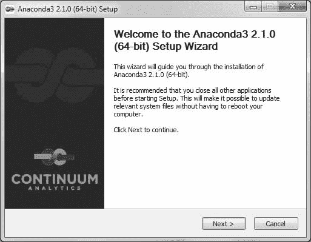
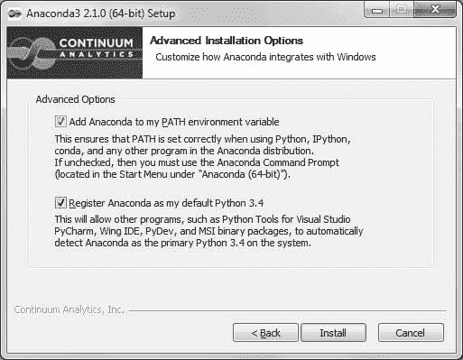
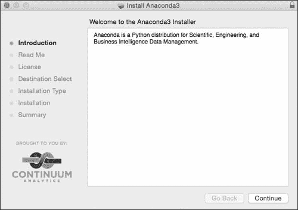
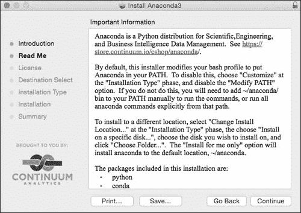
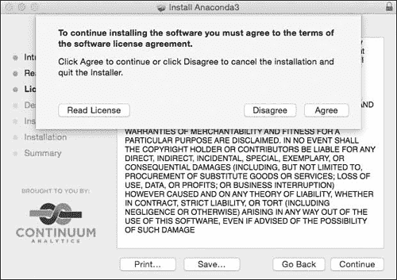
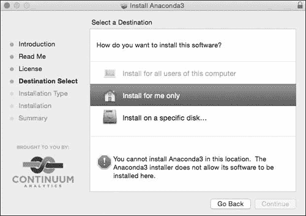

## 第九章：**A**

**软件安装**


本书中的程序和解决方案已经过测试，可以在 Python 3.4、matplotlib 1.4.2、matplotlib-venn 0.11 和 SymPy 0.7.6 上运行。这些版本只是最低要求，程序也应该可以在软件的较新版本上运行。有关更改和更新的信息将发布在本书的网站上，* [`www.nostarch.com/doingmathwithpython/`](http://www.nostarch.com/doingmathwithpython/)*。

虽然有许多方法可以获取 Python 以及所需的库，但最简单的方法之一是使用 Anaconda Python 3 软件分发版，它可以自由用于 Microsoft Windows、Linux 和 Mac OS X。在撰写本文时，Anaconda 的最新版本是 2.1.0，搭载 Python 3.4。Anaconda (*[`store.continuum.io/cshop/anaconda/`](https://store.continuum.io/cshop/anaconda/)*）是安装 Python 3 以及许多数学和数据分析包的快捷方式，所有内容都可以通过一个简易的安装程序完成。如果您想添加新的数学 Python 库，Anaconda 还允许您使用 `conda` 和 `pip` 命令快速添加它们。Anaconda 还有许多其他功能，使其在 Python 开发中非常有用。它内置了 conda 包管理器，方便安装第三方包，正如我们很快会看到的那样。它支持创建隔离的 Python 环境，这意味着您可以使用相同的 Anaconda 安装拥有多个 Python 安装——例如 Python 2、Python 3.3 和 Python 3.4。您可以通过 Anaconda 网站和 conda 文档了解更多信息 (*[`conda.pydata.org/docs/intro.html`](http://conda.pydata.org/docs/intro.html)*)。

接下来的章节将简要描述在 Microsoft Windows、Linux 和 Mac OS X 上安装 Anaconda，因此请跳到适合您的部分。您需要一个互联网连接来进行安装，但仅此而已。

如果遇到任何问题，您还可以访问 *[`continuum.io/`](http://continuum.io/)* 获取故障排除信息。

### **Microsoft Windows**

从 *[`continuum.io/downloads`](http://continuum.io/downloads)* 下载 Anaconda GUI 安装程序用于 Python 3。双击安装程序，然后按照以下步骤进行操作：

1\. 点击**下一步**并接受许可协议：



2\. 您可以选择仅为您的用户名安装该分发版，或为使用此计算机的所有用户安装。

3\. 选择您希望 Anaconda 安装程序安装的位置。默认设置应该可以正常工作。

4\. 请确保在**高级选项**对话框中勾选两个框，以便您可以从命令提示符的任何位置调用 Python shell 和其他程序，例如`conda`、`pip` 和 `idle`。此外，任何其他寻找 Python 3.4 安装的 Python 程序将指向 Anaconda 安装的版本：



5\. 点击 **安装** 开始安装。安装完成后，点击 **下一步**，然后点击 **完成** 完成安装。你应该能够在开始菜单中找到 Python。

6\. 打开 Windows 命令提示符并执行以下步骤。

#### ***更新 SymPy***

安装程序可能已经包含了 SymPy，但我们想确保安装至少是 0.7.6 版本，因此我们将使用以下命令进行安装：

```py
$ conda install sympy=0.7.6
```

这将安装或升级到 SymPy 0.7.6。

#### ***安装 matplotlib-venn***

要安装 matplotlib-venn，请使用以下命令：

```py
$ pip install matplotlib-venn
```

你的计算机现在已设置好运行所有程序。

#### ***启动 Python Shell***

打开 Windows 命令提示符并输入 `idle` 启动 IDLE shell，或输入 `python` 启动 Python 3 默认 shell。

### **Linux**

Linux 安装程序作为 shell 脚本分发，因此你需要从 *[`continuum.io/downloads`](http://continuum.io/downloads)* 下载 Anaconda Python 安装程序。然后，通过执行以下命令启动安装程序：

```py
$ bash Anaconda3-2.1.0-Linux-x86_64.sh

Welcome to Anaconda3 2.1.0 (by Continuum Analytics, Inc.)

In order to continue the installation process, please review the license
agreement.
Please, press ENTER to continue
>>>
```

将显示“Anaconda 终端用户许可协议”。阅读完毕后，输入 `yes` 继续安装：

```py
Do you approve the license terms? [yes|no]
[no] >>> yes

Anaconda3 will now be installed into this location:
/home/testuser/anaconda3

  - Press ENTER to confirm the location
  - Press CTRL-C to abort the installation
  - Or specify a different location below
```

在提示时按 ENTER 键，安装将开始：

```py
[/home/testuser/anaconda3] >>>
PREFIX=/home/testuser/anaconda3
installing: python-3.4.1-4 ...
installing: conda-3.7.0-py34_0
..

creating default environment...
installation finished.
Do you wish the installer to prepend the Anaconda3 install location
to PATH in your /home/testuser/.bashrc ? [yes|no]
```

当被要求确认安装位置时，输入 `yes`，以便每次从终端调用 Python 程序时，始终调用 Anaconda 安装的 Python 3.4 解释器：

```py
[no] >>> yes

Prepending PATH=/home/testuser/anaconda3/bin to PATH in /home/testuser/.bashrc
A backup will be made to: /home/testuser/.bashrc-anaconda3.bak

For this change to become active, you have to open a new terminal.

Thank you for installing Anaconda3!
```

打开一个新的终端以进行下一步操作。

#### ***更新 SymPy***

首先，确保已安装 SymPy 0.7.6：

```py
$ conda install sympy=0.7.6
```

#### ***安装 matplotlib-venn***

使用以下命令安装 matplotlib-venn：

```py
$ pip install matplotlib-venn
```

#### ***启动 Python Shell***

一切就绪。打开一个新的终端并输入 `idle3` 启动 IDLE 编辑器，或输入 `python` 启动 Python 3.4 shell。现在你应该能够运行所有程序并尝试新的程序。

### **Mac OS X**

从 *[`continuum.io/downloads`](http://continuum.io/downloads)* 下载图形安装程序。然后双击 *.pkg* 文件并按照指示操作：

1\. 在每个信息窗口上点击 **继续**：



2\. 点击 **同意** 接受“Anaconda 终端用户许可协议”：



3\. 在以下对话框中，选择“仅为我安装”选项。你看到的错误信息是安装程序软件中的一个 bug。只需点击它，它会消失。点击 **继续** 继续操作。



4\. 选择 **安装**：


5\. 安装完成后，打开终端应用程序并按照以下步骤更新 SymPy 并安装 matplotlib-venn。

#### ***更新 SymPy***

首先，确保已安装 SymPy 0.7.6：

```py
$ conda install sympy=0.7.6
```

#### ***安装 matplotlib-venn***

使用以下命令安装 matplotlib-venn：

```py
$ pip install matplotlib-venn
```

#### ***启动 Python Shell***

一切就绪。关闭终端窗口，打开一个新窗口，输入`idle3`启动 IDLE 编辑器，或输入`python`启动 Python 3.4 命令行。现在你应该能够运行所有程序并尝试新的程序。
