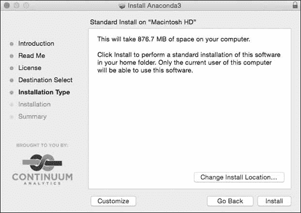

## **A**

**软件安装**

本书中的程序和解决方案已在 Python 3.4、matplotlib 1.4.2、matplotlib-venn 0.11 和 SymPy 0.7.6 上进行了测试。这些版本仅为最低要求，程序也应适用于软件的更新版本。更新和变动将会在本书网站上发布，* [`www.nostarch.com/doingmathwithpython/`](http://www.nostarch.com/doingmathwithpython/) *。

获取 Python 和所需库的方式有很多种，其中最简单的一种是使用 Anaconda Python 3 软件分发版，它可以在 Microsoft Windows、Linux 和 Mac OS X 上免费使用。在撰写本文时，Anaconda 的最新版本是 2.1.0，配备 Python 3.4。Anaconda (*[`store.continuum.io/cshop/anaconda/`](https://store.continuum.io/cshop/anaconda/)*) 是一种快速简便的安装 Python 3 和许多数学及数据分析包的方法，所有内容都打包在一个简单的安装程序中。如果你想添加新的数学 Python 库，Anaconda 也允许你使用 conda 和 pip 命令快速添加它们。Anaconda 还具有许多其他特性，使其在 Python 开发中非常有用。它内置了 conda 包管理器，方便安装第三方包，正如我们稍后将看到的那样。它支持创建隔离的 Python 环境，这意味着你可以使用相同的 Anaconda 安装运行多个 Python 版本——例如，Python 2、Python 3.3 和 Python 3.4。你可以通过 Anaconda 网站和 conda 文档了解更多信息 (*[`conda.pydata.org/docs/intro.html`](http://conda.pydata.org/docs/intro.html)*).

接下来的部分将简要介绍如何在 Microsoft Windows、Linux 和 Mac OS X 上安装 Anaconda，因此请跳转到适合你的部分。你需要连接互联网才能跟随教程，但其他的就没有问题了。

如果遇到任何问题，还可以访问 *[`continuum.io/`](http://continuum.io/)* 查找故障排除信息。

### **Microsoft Windows**

从 *[`continuum.io/downloads`](http://continuum.io/downloads)* 下载适用于 Python 3 的 Anaconda GUI 安装程序。双击安装程序，然后按照以下步骤操作：

1. 点击 **下一步** 并接受许可协议：

2. 你可以选择只为你的用户名安装分发版，或者为这台计算机上的所有用户安装。

3. 选择你希望 Anaconda 安装程序安装程序的位置。默认设置应该没问题。

4. 在 **高级选项** 对话框中确保勾选两个框，这样你就可以从命令提示符的任何位置调用 Python shell 以及其他程序，如 conda、pip 和 idle。此外，任何其他寻找 Python 3.4 安装的 Python 程序将会指向 Anaconda 安装的 Python 版本：

5. 点击**安装**以开始安装。安装完成后，点击**下一步**，然后点击**完成**以完成安装。您应该能够在开始菜单中找到 Python。

6. 打开 Windows 命令提示符，并执行以下步骤。

#### ***更新 SymPy***

安装可能已经包括了 SymPy，但我们想确保至少安装了 0.7.6，因此我们将使用以下命令安装它：

$ conda install sympy=0.7.6

这将安装或升级到 SymPy 0.7.6。

#### ***安装 matplotlib-venn***

要安装 matplotlib-venn，请使用以下命令：

$ pip install matplotlib-venn

您的计算机现在已设置好运行所有程序。

#### ***启动 Python Shell***

打开 Windows 命令提示符，输入 idle 启动 IDLE shell，或输入 python 启动默认的 Python 3 shell。

### **Linux**

Linux 安装程序以 shell 脚本的形式分发，因此您需要从*[`continuum.io/downloads`](http://continuum.io/downloads)*下载 Anaconda Python 安装程序。然后通过执行以下命令启动安装程序：

$ bash Anaconda3-2.1.0-Linux-x86_64.sh

欢迎使用 Anaconda3 2.1.0（由 Continuum Analytics, Inc.提供）

为了继续安装过程，请审阅许可协议

协议。

请按 ENTER 键继续

>>>

将显示“Anaconda 最终用户许可协议”。阅读完毕后，输入 yes 继续安装：

您是否同意许可条款？[yes|no]

[no] >>> yes

Anaconda3 现在将安装到此位置：

/home/testuser/anaconda3

- 按 ENTER 键确认位置

- 按 CTRL-C 中止安装

- 或指定一个不同的安装位置

按提示按 ENTER 键，安装将开始：

[/home/testuser/anaconda3] >>>

PREFIX=/home/testuser/anaconda3

正在安装：python-3.4.1-4 ...

正在安装：conda-3.7.0-py34_0

..

正在创建默认环境...

安装完成。

您是否希望安装程序在 Anaconda3 安装位置之前加上路径？

是否将路径添加到您的/home/testuser/.bashrc 中？[yes|no]

当询问是否确认安装位置时，输入 yes，这样每次从终端调用 Python 程序时，Anaconda 安装的 Python 3.4 解释器将被调用：

[no] >>> yes

正在将 PATH=/home/testuser/anaconda3/bin 添加到/home/testuser/.bashrc 中的 PATH

将备份保存到：/home/testuser/.bashrc-anaconda3.bak

为了使此更改生效，您必须打开一个新的终端。

感谢您安装 Anaconda3！

打开一个新的终端以进行下一步操作。

#### ***更新 SymPy***

首先，确保已安装 SymPy 0.7.6：

$ conda install sympy=0.7.6

#### ***安装 matplotlib-venn***

使用以下命令安装 matplotlib-venn：

$ pip install matplotlib-venn

#### ***启动 Python Shell***

一切就绪。打开一个新的终端，输入 idle3 以启动 IDLE 编辑器，或输入 python 启动 Python 3.4 shell。您现在应该能够运行所有程序并尝试新的程序。

### **Mac OS X**

从 *[`continuum.io/downloads`](http://continuum.io/downloads)* 下载图形安装程序。然后双击 *.pkg* 文件并按照提示进行操作：

1\. 在每个信息窗口中点击**继续**：

2\. 点击**同意**以接受“Anaconda 最终用户许可协议”：

3\. 在以下对话框中，选择“仅为我安装”选项。你看到的错误信息是安装程序中的一个 bug。只需点击它，它就会消失。点击**继续**以继续操作。

4\. 选择**安装**：

5\. 安装完成后，打开终端应用程序，并按照接下来的步骤更新 SymPy 并安装 matplotlib-venn。

#### ***更新 SymPy***

首先，确保安装了 SymPy 0.7.6：

$ conda install sympy=0.7.6

#### ***安装 matplotlib-venn***

使用以下命令来安装 matplotlib-venn：

$ pip install matplotlib-venn

#### ***启动 Python Shell***

一切准备就绪。关闭终端窗口，打开一个新窗口，输入 idle3 启动 IDLE 编辑器，或者输入 python 启动 Python 3.4 shell。现在你应该能够运行所有程序并尝试新的程序。
