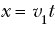
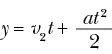
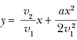
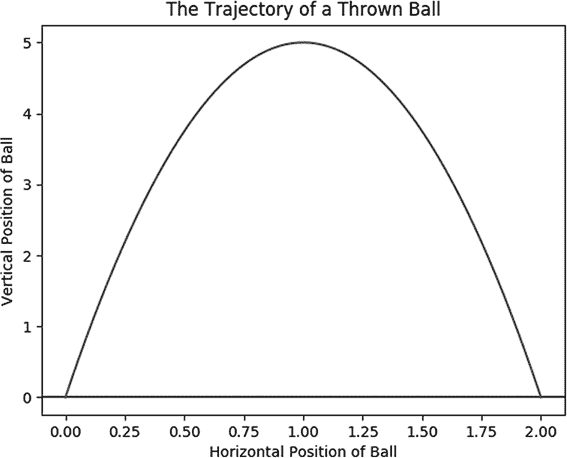
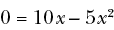
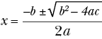
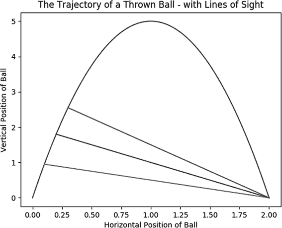
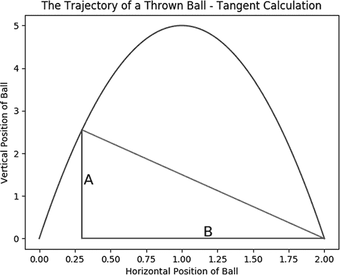
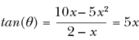

## 第一章：使用算法解决问题


接住一个球的动作是值得称奇的。一个球可能从非常远的地方开始，似乎只是地平线上的一个小点。它可能只在空中停留几秒钟甚至更短的时间。球会遇到空气阻力、风力，当然还有重力，沿着类似抛物线的轨迹运动。而且每次投掷球时，所施加的力、角度和环境条件都各不相同。那么，如何解释当击球员打出一颗棒球时，300 英尺外的外野手似乎立刻知道该跑到哪里，以便在球落地之前接住它呢？

这个问题被称为*外野手问题*，至今仍在学术期刊中讨论。我们从外野手问题开始，因为它有两种截然不同的解决方案：分析性解决方案和算法性解决方案。比较这两种解决方案将生动地说明什么是算法，它与其他问题解决方法有何不同。此外，外野手问题将帮助我们可视化一个偶尔显得抽象的领域——你可能有过投掷和接住某物的经验，而这种经验可以帮助你理解实践背后的理论。

在我们真正理解人类如何准确知道一个球会落在哪里之前，理解机器是如何做到这一点的将会有所帮助。我们将从分析性解决方案开始，研究外野手问题。这个解决方案在数学上是精确的，且计算机可以瞬间执行，而且它通常会在基础物理课程中教授。它可以使足够灵活的机器人为棒球队担任外野手。

然而，人类不容易在脑中快速运行分析方程式，显然无法像计算机那样快速。更适合人类大脑的解决方案是算法性解决方案，我们将用它来探索什么是算法以及它相较于其他问题解决方案的优势。此外，算法性解决方案将向我们展示算法是符合人类思维过程的，并不需要让人感到畏惧。外野手问题旨在介绍一种新的问题解决方式：算法方法。

## 分析方法

要从分析的角度解决这个问题，我们需要回溯几个世纪，了解早期的运动模型。

### 伽利略模型

用来模拟球的运动的方程式最早可以追溯到伽利略，几百年前他制定了捕捉加速度、速度和距离的多项式。如果我们忽略风和空气阻力，并假设球从地面开始，伽利略的模型表示，在时间*t*时，投掷的球的水平位置将由以下公式给出：



*v*[1]代表球在*x*（水平）方向上的起始速度。此外，根据伽利略的理论，投掷的球的高度（*y*）可以通过以下公式在时间*t*时计算：



*v*[2]代表球在*y*（垂直）方向上的起始速度，*a*代表由于重力引起的恒定向下加速度（如果我们使用公制单位，这个值大约是-9.81）。当我们将第一个方程代入第二个方程时，我们发现投掷的球的高度（*y*）与球的水平位置（*x*）的关系如下：



我们可以使用伽利略的方程在 Python 中建模一个假设的球的轨迹，使用列表 1-1:中的函数。列表 1-1 中的具体多项式适用于初始水平速度约为 0.99 米/秒，初始垂直速度约为 9.9 米/秒的球。您可以随意尝试其他* v*[1]和*v*[2]的值，以模拟任何您感兴趣的投掷方式。

```py
def ball_trajectory(x):
    location = 10*x - 5*(x**2)
    return(location)
```

列表 1-1: 一个计算球轨迹的函数

我们可以在 Python 中绘制列表 1-1:中的函数，看看球的轨迹大致是什么样子（忽略空气阻力和其他微不足道的因素）。在第一行，我们将从一个名为`matplotlib`的模块中导入一些绘图功能。`matplotlib`模块是我们在本书中将导入的许多第三方模块之一。在使用第三方模块之前，您需要先安装它。您可以按照[`automatetheboringstuff.com/2e/appendixa/`](http://automatetheboringstuff.com/2e/appendixa/)中的说明来安装`matplotlib`和其他任何第三方模块。

```py
import matplotlib.pyplot as plt
xs = [x/100 for x in list(range(201))]
ys = [ball_trajectory(x) for x in xs]
plt.plot(xs,ys)
plt.title('The Trajectory of a Thrown Ball')
plt.xlabel('Horizontal Position of Ball')
plt.ylabel('Vertical Position of Ball')
plt.axhline(y = 0)
plt.show()
```

列表 1-2: 绘制一个假设的球的轨迹，从它被投掷的那一刻（*x* = 0）到它再次落地的时刻（*x* = 2）

输出（图 1-1:）是一个漂亮的图，展示了我们假设的球预计将穿越空间的路径。这条美丽的弯曲路径对每个受重力影响的运动物体都是相似的，并且被小说家托马斯·品钦（Thomas Pynchon）诗意地称为*重力的彩虹*。

不是所有的球都会遵循这条完全相同的路径，但这是一条球可能遵循的路径。球从 0 开始，先向上再向下，正如我们习惯看到的球从我们视野的左侧飞到右侧一样。



图 1-1: 一个假设的投掷球的轨迹

### 求解 x 的策略

既然我们已经有了描述球位置的方程，我们就可以求解出任何我们感兴趣的内容：例如，球会达到的最高点，或者它再次回到地面的位置——这是外场手需要知道的唯一信息，才能接到球。全世界的物理课堂上，学生们都在学习如何找到这些解，如果我们想教机器人打外场，教它这些方程也是非常自然的。求解球最终位置的方法就像我们最初使用的 `ball_trajectory()` 函数一样简单，只需要将其设为 0：



然后，我们可以使用青少年们学过的二次方程公式来解这个 *x*：



在这种情况下，我们发现 *x* = 0 和 *x* = 2 是解答。第一个解 *x* = 0 是球开始的地方，就是投手投出或击球员击出的地方。第二个解 *x* = 2 是球飞行后再次落地的地方。

我们刚才使用的策略是相对简单的。我们可以称它为 *解 *x* 策略*。我们写下一个描述情境的方程，然后解这个方程，找出我们感兴趣的变量的值。解 *x* 的策略在硬科学中非常常见，无论是在高中还是大学水平。学生们常常被要求解答：球的预期着陆点、经济生产的理想水平、实验中应使用的化学物质比例，或者其他许多问题。

解 *x* 的策略极其强大。例如，如果一支军队观察到敌方发射了一个投射武器（比如导弹），他们可以迅速将伽利略的方程输入到计算器中，几乎瞬间就能找出导弹预计着陆的位置，从而躲避或拦截它。这项操作可以在一台运行 Python 的消费者级笔记本电脑上免费完成。如果一个机器人在棒球比赛中担任外场，它也可以通过这种方法接到球，轻松应对。

在这种情况下，解 *x* 的策略很简单，因为我们已经知道需要解的方程和解法。我们所说的投掷球的方程来自于伽利略，正如之前所提到的。而求解二次方程的公式则归功于伟大的穆罕默德·伊本·穆萨·阿尔-花拉兹米，他是第一个给出完全一般的二次方程解法的人。

阿尔-花拉兹米是九世纪的博学者，他在天文学、制图学和三角学方面做出了贡献，还给我们带来了“代数”一词及其相关方法。他是使我们能够走到这本书这一步的重要人物之一。由于我们生活在像伽利略和阿尔-花拉兹米这样巨人的后代，我们不需要经历推导他们方程的艰难过程——我们只需要记住它们并恰当地使用。

### 内在物理学家

使用伽利略和阿尔·花拉子米的方程式以及解 *x* 的策略，一台复杂的机器可以接住一个球或拦截一枚导弹。但合理的假设是，大多数棒球运动员看到球飞向空中时并不会马上开始写出方程式。可靠的观察者报告称，职业棒球春季训练项目包含了大量的跑动和比赛时间，而围绕白板推导纳维-斯托克斯方程的时间则相对较少。解开球落地点的谜团并不能直接解决外野手问题——即，*人类*如何凭直觉知道球会落在哪，而不是将其输入计算机程序中。

或许它能解决。最简单的外野手问题解决方案就是断言，如果计算机通过解伽利略二次方程来确定球的落点，那么人类也是如此。我们将这一解决方案称为*内在物理学家理论*。根据这一理论，我们大脑中的“湿件”能够设立并解出二次方程，或者画出图形并推断出它们的线条，这一切都远在我们意识的层面之下。换句话说，我们每个人的大脑深处都有一个“内在物理学家”，能够在几秒钟内计算出复杂数学问题的精确解，并将解传递给我们的肌肉，进而引导我们的身体和手套去接球。即使我们从未上过物理课或解过 *x*，我们的潜意识也许能做到这一点。

内在物理学家理论并非没有支持者。著名数学家基思·德夫林在 2006 年出版了一本书，名为*数学本能：为什么你是数学天才（与龙虾、鸟类、猫和狗一起）*。书的封面展示了一只狗跳起来接飞盘，箭头描绘了飞盘和狗各自的轨迹向量，暗示着狗能够进行复杂的计算，从而让这些向量交汇。

狗能够接飞盘和人类能够接棒球的显著能力似乎支持了内在物理学家理论。潜意识是一个神秘而强大的存在，我们还未完全探索它的深度。那么，为什么它不能偶尔解解一些高中水平的方程呢？更紧迫的是，内在物理学家理论难以反驳，因为很难想到其他替代方案：如果狗不能通过解偏微分方程来接飞盘，那么它们究竟是怎么接到的呢？它们大力跃起，用嘴巴像毫不费力般接住不规则飞行的飞盘。如果它们的大脑里没有解决物理问题的过程，那么我们（以及它们）又是如何精确拦截一个球的呢？

直到 1967 年，没人能给出一个好的答案。那一年，工程师范尼瓦尔·布什写了一本书，在书中他描述了自己理解的棒球的科学特征，但他无法解释外场手是如何知道该往哪里跑以接飞球的。幸运的是，物理学家塞维尔·查普曼读了布什的书，并受到了启发，次年他提出了自己的理论。

## 算法方法

查普曼，作为一位真正的科学家，并不满足于对人类潜意识的神秘且未经验证的信任，他想要为外场手的能力提供一个更为具体的解释。这就是他发现的内容。

### 颈部思考法

查普曼开始解决外场手问题时，注意到捕球者可用的信息。尽管人类很难准确估计一个物体的速度或抛物线轨迹，但他认为我们更容易观察角度。如果某人从地面投掷或击打球，并且地面是平坦的，那么外场手会看到球几乎是从眼平线开始的。想象由两条线构成的角度：地面和外场手眼睛与球之间的线。当球被击打的那一刻，这个角度大约是 0 度。在球飞行了一小段时间后，它会高于地面，因此地面与外场手视线之间的角度会增大。即使外场手没有学过几何学，他们也会对这个角度有一种“感觉”——比如，通过感觉自己需要将脖子向后仰多远才能看到球。

如果我们假设外场手站在球最终会落地的位置，假设 *x* = 2，我们可以通过绘制从球的轨迹初期开始的视线来感受外场手与球之间视角的变化。以下代码行在 Listing 1-2 中绘制了我们所画的视线的线段，并且应该在同一个 Python 会话中运行。这一线段表示的是外场手眼睛与球之间的线段，当球水平移动了 0.1 米之后。

```py
xs2 = [0.1,2]
ys2 = [ball_trajectory(0.1),0]
```

我们可以绘制这条视线以及其他的视线，看看球的轨迹中，视角是如何不断增加的。以下几行代码向我们在 Listing 1-2 中绘制的图表中添加了更多线段。这些线段表示的是外场手眼睛与球之间的线段，分别对应球在轨迹中水平移动了 0.1、0.2 和 0.3 米时的位置。创建了所有这些线段后，我们将它们全部绘制在一起。

```py
xs3 = [0.2,2]
ys3 = [ball_trajectory(0.2),0]
xs4 = [0.3,2]
ys4 = [ball_trajectory(0.3),0]
plt.title('The Trajectory of a Thrown Ball - with Lines of Sight')
plt.xlabel('Horizontal Position of Ball')
plt.ylabel('Vertical Position of Ball')
plt.plot(xs,ys,xs2,ys2,xs3,ys3,xs4,ys4)
plt.show()
```

结果图表显示了几条视线，这些视线与地面形成了持续增大的角度（见 Figure 1-2）。



图 1-2： 假设投掷球的轨迹，线段表示外野手在球飞行过程中注视球的状态

随着球的飞行，外野手的视线角度不断增大，外野手需要不停地仰头，直到完成接球。我们将地面和外野手视线与球之间的角度称为*theta*。我们假设外野手站在球最终落点的位置（*x* = 2）。回想一下高中几何课，直角三角形中角度的正切值是与该角相对的边长与邻边长的比例（邻边不包括斜边）。在这个例子中，theta 的正切值是球的高度与球到外野手水平距离的比例。我们可以使用以下 Python 代码绘制这些比例对应的边：

```py
xs5 = [0.3,0.3]
ys5 = [0,ball_trajectory(0.3)]
xs6 = [0.3,2]
ys6 = [0,0]
plt.title('The Trajectory of a Thrown Ball - Tangent Calculation')
plt.xlabel('Horizontal Position of Ball')
plt.ylabel('Vertical Position of Ball')
plt.plot(xs,ys,xs4,ys4,xs5,ys5,xs6,ys6)
plt.text(0.31,ball_trajectory(0.3)/2,'A',fontsize = 16)
plt.text((0.3 + 2)/2,0.05,'B',fontsize = 16)
plt.show()
```

结果图像见 图 1-3。



图 1-3： 假设投掷球的轨迹，线段表示外野手在球飞行过程中注视球的状态，线段 A 和 B 显示了长度比例构成我们关心的正切值

我们通过取 A 边的长度与 B 边的长度之比来计算正切值。A 边的高度方程为 10*x* – 5*x*²，B 边的长度方程为 2 – *x*。所以以下方程隐式地描述了球飞行过程中每一刻的角度*theta*：



整体情况较为复杂：球被打得很远，迅速通过一个抛物线曲线，且其结束位置很难立即估计。但在这个复杂的情况下，查普曼找到了一个简单的关系：*当外野手站在正确的位置时*，角度的正切值以简单且恒定的速率增长。查普曼突破的核心在于，角度的正切值，即球与地面的角度，随着时间线性增长。由于查普曼在外野手问题的复杂情境中发现了这一简单关系，他得以开发出一个优雅的算法解决方案。

他的解决方案依赖于这样的事实：如果某物——在这个案例中是θ的切线——以恒定速率增长，则其加速度为零。因此，如果你站在球即将到达的位置，你会观察到一个切线加速度为零的角度。相比之下，如果你站得离球的初始位置太近，你会观察到正加速度。如果你站得离球的初始位置太远，你会观察到负加速度。（如果你愿意，可以验证这些真理背后的复杂微积分。）这意味着外野手可以通过感觉自己在看球上升时需要多稳当地后仰头部，来知道该去哪儿——可以说是用脖子思考。

### 应用查普曼算法

机器人不一定有脖子，因此“用脖子思考”的方法可能对机器人外野手并不有用。记住，它们可以直接且瞬间解出二次方程来找出该去哪里接球，而无需担心θ的切线的加速度。但对人类来说，查普曼的脖子思维法可能极为有用。为了到达球的最终位置，人类外野手可以遵循这个相对简单的过程：

1.  观察你与球之间的视线与地面之间角度的切线的加速度。

1.  如果加速度为正，向后迈步。

1.  如果加速度为负，向前迈步。

1.  重复步骤 1–3，直到球正好在你面前。

1.  接住球。

查普曼的五步法有一个严重的异议，那就是按照这个过程的外野手似乎必须在飞行过程中计算角度的切线，这意味着我们正在用一种“内在几何学理论”来替代“内在物理学理论”，即棒球运动员能够瞬间并潜意识地求出切线。

解决这个异议的一种潜在方法是，对于许多角度，tan(θ)大致等于θ，因此外野手不需要观察切线的加速度，而只需观察角度的加速度。如果角度的加速度可以通过脖关节在脖子回转以观察球时的感觉加速度来估算，并且如果角度是其切线的合理近似，那么我们就不需要假设外野手具有任何强大的潜意识数学或几何能力——只需要具备准确感知微妙感觉输入的身体技能。

通过将加速度估算作为过程中的唯一难点，我们已经获得了一个比内心物理学家关于潜意识推演抛物线的理论更具心理合理性的外场员问题潜在解决方案。当然，解决方案的心理吸引力并不意味着它只能被人类使用。机器人外场员也可以被编程来遵循查普曼的五步过程，甚至可能表现得更好，因为例如，查普曼的过程使得使用者能够动态应对风速或弹跳的变化。

除了心理上的合理性之外，查普曼洞察力所暗示的五步过程还具备一个至关重要的特性：它不依赖于解算 *x* 的策略，也不依赖任何显式的方程式。相反，它提出了通过简单的观察和小而渐进的步骤，逐步达成一个明确目标的方式。换句话说，我们从查普曼理论中推导出的过程是一个算法。

### 使用算法解决问题

*算法* 这个词来源于伟大的阿尔·花拉子米的名字，前面已经提到过。这个词并不容易定义，尤其是因为它的公认定义随着时间的推移发生了变化。简单来说，算法只是一个产生明确结果的指令集合。这是一个广泛的定义；正如我们在导言中所看到的，税表和帕菲的食谱都可以被认为是算法。

查普曼的接球过程，或者我们可以称之为查普曼的算法，甚至比帕菲食谱更具算法特征，因为它包含了一个循环结构，其中小步骤会被反复执行，直到达到一个明确的条件。这是你在本书中会看到的常见算法结构。

查普曼提出了一个算法解决方案来应对外场员问题，因为解算 *x* 的方案并不可信（外场员通常不知道相关的方程式）。一般来说，当解算 *x* 的策略失败时，算法最为有效。有时我们不知道应该使用什么方程式，但更多时候是因为没有任何方程式能完全描述一个情境，方程式无法求解，或者我们面临时间或空间上的限制。算法存在于可能性边缘，每当一个算法被创建或改进时，我们都会把效率和知识的前沿推得更远。

今天，普遍的看法是算法难懂、深奥、神秘，并且严格是数学性的，需要多年学习才能理解。根据我们现在的教育体系，我们尽早开始教孩子们解 *x* 的方法，而只有在大学或研究生阶段才会明确教授算法（如果教授的话）。对于许多学生来说，掌握解 *x* 的方法需要多年时间，而且总是让他们觉得不自然。曾有过这种经历的人可能会假设算法同样会感到不自然，而且由于它们“更高级”，理解起来也会更加困难。

然而，我从查普曼算法中得到的教训是，我们完全搞错了。在课间休息时，学生们学习并完善他们在抓球、投掷、踢球、奔跑和移动等方面的数十种算法。可能还有许多更复杂的算法，虽然尚未完全明确，但它们支配着课间休息的社交世界：谈话、寻求地位、八卦、结盟和友谊的培养。当我们结束休息时间并开始数学课时，我们把学生从一个算法探索的世界中带走，逼迫他们去学习一个不自然且机械化的解 *x* 的过程，这个过程既不是人类发展的自然部分，也不是解决分析问题的最有效方法。只有当学生进入高级数学和计算机科学的学习时，他们才会重新回到自然的算法世界，并掌握他们在课间休息时无意识且愉快地掌握的强大过程。

本书旨在为好奇的人提供一个智力上的课间休息——在这里，课间休息意味着一个年轻学生所说的：所有重要活动的开始，所有繁重工作的结束，以及与朋友们一起继续愉快探索的时光。如果你对算法感到一丝恐惧，提醒自己，我们人类天生就是算法型的，如果你能接住一个球或烤一个蛋糕，你就能掌握一个算法。

在本书的剩余部分，我们将探索许多不同的算法。有些会排序列表或计算数字，其他的则支持自然语言处理和人工智能。我鼓励你记住，算法不是从天而降的。在这些算法成为主流并在本书中被广泛介绍之前，它们是由像查普曼（Chapman）这样的人发现或创造的，他在某一天醒来时，发现自己身处一个没有他发明的算法的世界，而在这一天结束时，他又进入了一个算法已经存在的世界。我鼓励你尽量进入这些英雄发现者的思维方式。也就是说，我鼓励你不仅把算法当作一个工具使用，还要把它看作一个已经解决的复杂问题。算法的世界还远未被完全描绘出来——许多算法仍然有待发现和完善，我真心希望你能参与到这个发现过程当中。

## 摘要

在这一章中，你看到了两种解决问题的方法：分析性方法和算法性方法。通过用两种方式解决外场问题，我们探索了这些方法之间的差异，最终得出了查普曼的算法。查普曼在一个复杂的情境中发现了一个简单的模式（θ切线的恒定加速度），并利用它发展出了一个迭代循环的过程，这个过程只需要一个简单的输入（脖子伸长时的加速度感觉），就能达到一个明确的目标（接住一个球）。当你在自己的工作中寻求开发和使用算法时，可以尝试模仿查普曼的例子。

在接下来的章节中，我们将查看一些历史上的算法实例。这些实例将加深你对算法的理解，包括它们是什么以及如何工作。我们将讨论来自古埃及、古希腊和帝国日本的算法。你学到的每一个新算法，都会成为你“工具箱”中的一部分，帮助你在最终能够设计和完善自己的算法时有所依靠。
