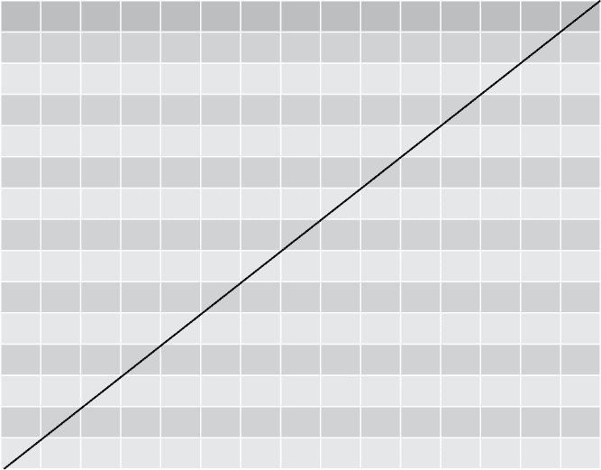

## 第二章：历史中的算法


大多数人将算法与计算机联系在一起。这并不无道理；计算机操作系统使用许多复杂的算法，编程非常适合精确实现各种算法。但算法比我们实现它们的计算机架构更为基础。如第一章所提到的，*算法*这个词可以追溯到大约千年前，而且早期的记录中就已有描述算法的内容。即使在没有文字记录的情况下，也有大量证据表明古代世界使用了复杂的算法——例如在他们的建筑方法中。

本章介绍了几种古老的算法。考虑到这些算法必须在没有计算机帮助的情况下被发明和验证，它们展现了极大的巧妙与洞察力。我们首先讨论俄罗斯农民乘法，这是一种算术方法，尽管名字如此，它可能起源于埃及，并且实际上与农民并无直接关联。接着我们介绍欧几里得算法，这是一种经典的“经典”算法，用于求最大公约数。最后，我们介绍一种来自日本的算法，用于生成魔方阵。

## 俄罗斯农民乘法

许多人记得学习乘法表是他们教育过程中最痛苦的部分。小孩子会问父母为什么学习乘法表是必要的，父母通常会回答说，如果不懂它就不能进行乘法计算。他们错得很离谱。*俄罗斯农民乘法*（RPM）是一种方法，可以让人们在不熟悉大部分乘法表的情况下进行大数乘法运算。

RPM 的起源尚不明确。一份古埃及卷轴《林德纸草书》包含了这个算法的一种版本，一些历史学家提出了（大多不太令人信服的）猜测，认为该方法可能从古埃及学者传入俄罗斯辽阔的农民中。不管它的历史细节如何，RPM 依然是一个有趣的算法。

### 手工进行 RPM

以 89 乘以 18 为例。俄罗斯农民乘法的步骤如下。首先，创建两列并排。第一列称为*除法*列，起始值为 89。第二列称为*倍增*列，起始值为 18（见表 2-1）。

**表 2-1:** 除法/倍增表，第一部分

| **除法** | **倍增** |
| --- | --- |
| 89 | 18 |

我们首先填写除法列。除法列的每一行都将上一行的数值除以 2，忽略余数。例如，89 除以 2 为 44 余 1，因此在除法列的第二行填写 44（见表 2-2）。

**表 2-2:** 除法/倍增表，第二部分

| **除法** | **倍增** |
| --- | --- |
| 89 | 18 |
| 44 |  |

我们继续除以 2，直到达到 1，每次都丢弃余数并将结果写入下一行。继续下去，我们发现 44 除以 2 是 22，然后一半是 11，再然后一半（丢掉余数）是 5，再然后是 2，最后是 1。将这些写入减半列后，我们得到了表 2-3。

**表 2-3:** 减半/倍增表，第三部分

| **减半** | **倍增** |
| --- | --- |
| 89 | 18 |
| 44 |  |
| 22 |  |
| 11 |  |
| 5 |  |
| 2 |  |
| 1 |  |

我们已经完成了减半列。顾名思义，倍增列中的每个条目都将是前一个条目的两倍。所以，由于 18 × 2 是 36，36 就是倍增列中的第二个条目（见表 2-4）。

**表 2-4:** 减半/倍增表，第四部分

| **减半** | **倍增** |
| --- | --- |
| 89 | 18 |
| 44 | 36 |
| 22 |  |
| 11 |  |
| 5 |  |
| 2 |  |
| 1 |  |

我们继续按照相同的规则向倍增列中添加条目：只需将前一个条目乘以 2。我们一直这样做，直到倍增列的条目数量与减半列一样多（见表 2-5）。

**表 2-5:** 减半/倍增表，第五部分

| **减半** | **倍增** |
| --- | --- |
| 89 | 18 |
| 44 | 36 |
| 22 | 72 |
| 11 | 144 |
| 5 | 288 |
| 2 | 576 |
| 1 | 1,152 |

下一步是划掉或移除减半列中包含偶数的每一行。结果如表 2-6 所示。

**表 2-6:** 减半/倍增表，第六部分

| **减半** | **倍增** |
| --- | --- |
| 89 | 18 |
| 11 | 144 |
| 5 | 288 |
| 1 | 1,152 |

最后一步是将倍增列中剩下的条目求和。结果是 18 + 144 + 288 + 1,152 = 1,602。你可以用计算器验证这是正确的：89 × 18 = 1,602。通过减半、倍增和加法，我们完成了乘法运算，而无需记忆大多数年轻孩子所讨厌的繁琐乘法表。

为了理解这种方法为什么有效，试着将倍增列用 18 来表示，即我们要乘的数字（见表 2-7）。

**表 2-7:** 减半/倍增表，第七部分

| **减半** | **倍增** |
| --- | --- |
| 89 | 18 × 1 |
| 44 | 18 × 2 |
| 22 | 18 × 4 |
| 11 | 18 × 8 |
| 5 | 18 × 16 |
| 2 | 18 × 32 |
| 1 | 18 × 64 |

现在倍增列已经用 1、2、4、8，依此类推，直到 64 来表示。这些是 2 的幂次，我们也可以将它们表示为 2⁰、2¹、2²，依此类推。当我们求出最终的和（将倍增列中减半列为奇数的行相加），实际上我们是在求这个和：


RPM 工作的关键在于


如果你仔细观察分半列，你就能明白为什么前面的方程成立。我们还可以将此列以 2 的幂的形式表示（表 2-8）。这样做时，从最底部的项开始并向上进行计算会更容易。记住 2⁰是 1，2¹是 2。在每一行中，我们都乘以 2¹，而在分半数字为奇数的行中，我们还会加上 2⁰。随着你向上走，你会看到这个表达式越来越像我们的方程。等到我们到达表格的顶部时，我们得到了一个简化为 2⁶ + 2⁴ + 2³ + 2⁰的表达式。

**表 2-8：** 分半/倍增表，第八部分

| **分半** | **倍增** |
| --- | --- |
| (2⁵ + 2³ + 2²) × 2¹ + 2⁰ = 2⁶ + 2⁴ + 2³ + 2⁰ | 18 × 2⁰ |
| (2⁴ + 2² + 2¹) × 2¹ = 2⁵ + 2³ + 2² | 18 × 2¹ |
| (2³ + 2¹ + 2⁰) × 2¹ = 2⁴ + 2² + 2¹ | 18 × 2² |
| (2² + 2⁰) × 2¹ + 2⁰ = 2³ + 2¹ + 2⁰ | 18 × 2³ |
| 2¹ × 2¹ + 2⁰ = 2² + 2⁰ | 18 × 2⁴ |
| 2⁰ × 2¹ = 2¹ | 18 × 2⁵ |
| 2⁰ | 18 × 2⁶ |

如果你从顶行开始编号分半列的行，从 0 行开始，然后是 1、2，一直到最底行为 6 行，你可以看到分半列中包含奇数值的行是 0、3、4 和 6 行。现在注意到一个关键的模式：这些行号恰好是我们在表达式中找到的 89 的指数：2⁶ + 2⁴ + 2³ + 2⁰。这不是巧合；我们构造分半列的方式意味着奇数项的行号总是 2 的幂和中等于我们原始数字的指数。当我们将这些指数的倍增项加起来时，我们是在求 18 与 2 的幂之和，结果正好是 89，所以我们的结果将是 89 × 18。

之所以有效，是因为实际上，RPM 是一个嵌套在另一个算法中的算法。分半列本身是一个算法的实现，用于找到与列顶端数字相等的 2 的幂的和。这个 2 的幂的和也叫做*二进制展开*。二进制是一种只使用 0 和 1 来表示数字的方式，近年来变得极其重要，因为计算机以二进制方式存储信息。我们可以将 89 表示为二进制的 1011001，其中 1 出现在第 0、3、4 和 6 位（从右向左数），与分半列的奇数行相同，也与我们方程中的指数相同。我们可以将二进制表示中的 1 和 0 解释为 2 的幂和中的系数。例如，如果我们写 100，我们将其在二进制中解释为

1 × 2² + 0 × 2¹ + 0 × 2⁰

或我们通常写作 4。如果我们写 1001，我们将其在二进制中解释为

1 × 2³ + 0 × 2² + 0 × 2¹ + 1 × 2⁰

或我们通常写作 9。在运行这个小算法得到 89 的二进制展开后，我们已经准备好轻松地运行完整算法并完成乘法过程。

### 在 Python 中实现 RPM

在 Python 中实现 RPM 相对简单。假设我们要乘以两个数字，我们称之为*n*[1]和*n*[2]。首先，让我们打开一个 Python 脚本并定义这些变量：

```py
n1 = 89
n2 = 18
```

接下来，我们将开始创建除法列。正如之前所描述的，除法列以我们想要相乘的一个数字开始：

```py
halving = [n1]
```

下一个条目将是`halving[0]/2`，忽略余数。在 Python 中，我们可以使用`math.floor()`函数来实现这一点。这个函数返回一个小于给定数字的最接近整数。例如，除法列的第二行可以按如下方式计算：

```py
import math
print(math.floor(halving[0]/2))
```

如果你在 Python 中运行这个，你将看到答案是 44。

我们可以遍历每一行除法列，在每次循环迭代中，我们将以相同的方式找到除法列中的下一个条目，直到达到 1 为止：

```py
while(min(halving) > 1):
    halving.append(math.floor(min(halving)/2))
```

这个循环使用`append()`方法进行连接。在每次`while`循环的迭代中，它将`halving`向量与其最后一个值的一半连接，使用`math.floor()`函数忽略余数。

对于倍增列，我们可以做同样的操作：从 18 开始，然后通过一个循环继续。在每次循环中，我们将把前一个条目的两倍加到倍增列中，直到该列与除法列的长度相同为止：

```py
doubling = [n2]
while(len(doubling) < len(halving)):
    doubling.append(max(doubling) * 2)
```

最后，让我们把这两列合并到一个名为`half_double`的数据框中：

```py
import pandas as pd
half_double = pd.DataFrame(zip(halving,doubling))
```

我们在这里导入了一个名为`pandas`的 Python 模块。这个模块使我们能够轻松地处理表格。在这种情况下，我们使用了`zip`命令，顾名思义，它像拉链一样将`halving`和`doubling`连接在一起。两个数字集合，`halving`和`doubling`，开始时是独立的列表，在被“拉链”连接并转换成一个`pandas`数据框后，作为两列对齐的数据存储在表格中，如表 2-5 所示。由于它们已经对齐并被拉链连接，我们可以引用表 2-5 的任何一行，例如第三行，并获取该行的完整数据，包括`halving`和`doubling`中的元素（22 和 72）。能够引用和处理这些行将使我们能够轻松删除不需要的行，正如我们对表 2-5 所做的那样，将其转换为表 2-6。

现在我们需要删除除法列中条目为偶数的行。我们可以使用 Python 中的`%`（取模）运算符来测试偶性，它会在除法后返回余数。如果一个数字*`x`*是奇数，那么`x%2`将是 1。以下代码行将只保留除法列中条目为奇数的行：

```py
half_double = half_double.loc[half_double[0]%2 == 1,:]
```

在这种情况下，我们使用`pandas`模块中的`loc`功能来选择我们想要的行。当我们使用`loc`时，我们需要在其后面的方括号（`[]`）中指定我们要选择的行和列。在方括号内，我们按顺序指定我们想要的行和列，并用逗号隔开：格式是[`行`,`列`]。例如，如果我们想要索引为 4 的行和索引为 1 的列，我们可以写`half_double.loc[4,1]`。在这种情况下，我们不仅仅指定索引。我们将表达一个逻辑模式来选择我们想要的行：我们希望所有`halving`列为奇数的行。我们通过`half_double[0]`指定`halving`列，因为它是索引为 0 的列。我们通过`%2 == 1`指定奇数性。最后，我们通过写冒号来指定我们想要所有列，冒号是一个快捷方式，表示我们想要每一列。

最后，我们简单地计算剩余的倍增项之和：

```py
answer = sum(half_double.loc[:,1])
```

这里，我们再次使用`loc`。我们在方括号中指定使用冒号快捷方式选择每一行。我们在逗号后指定我们想要的`doubling`列，即索引为 1 的列。请注意，我们之前做的 89 × 18 的例子如果改为计算 18 × 89 会更快更容易——也就是说，如果我们把 18 放在 halving 列，把 89 放在 doubling 列。我鼓励你试试看，感受一下改进。一般来说，如果较小的乘数放在 halving 列，较大的放在 doubling 列，RPM 会更快。

对于那些已经记住乘法表的人来说，RPM 可能显得毫无意义。但除了它的历史魅力外，RPM 还是值得学习的，原因有几个。首先，它表明即使像乘法这种枯燥的事情也可以有多种做法，并且可以采取创造性的方法。仅仅因为你学会了一种算法，并不意味着它是唯一的，或者是最好的算法——保持思维开放，去接受新的、可能更好的方法。

RPM 可能较慢，但它在前期要求较少的记忆，因为它不需要知道大多数乘法表。为了低内存需求，有时牺牲一点速度是非常有用的，而这种速度/内存的权衡是我们在设计和实现算法时要考虑的一个重要因素。

像许多优秀的算法一样，RPM 也将看似不相关的思想之间的关系呈现出来。二进制展开可能看起来只是一个好奇心的产物，对于晶体管工程师来说有兴趣，但对普通人甚至是专业程序员来说没什么用。但 RPM 展示了数字的二进制展开和一种仅需最少的乘法表知识就能进行乘法的便捷方法之间的深刻联系。这也是为什么要不断学习的另一个原因：你永远不知道什么时候一些看似无用的细节可能成为一个强大算法的基础。

## 欧几里得算法

古希腊人给人类带来了许多礼物，其中最伟大的之一就是理论几何学，它由伟大的欧几里得在他的 13 本书《几何原本》中严谨地整理而成。欧几里得的大部分数学著作采用定理/证明的形式，其中一个命题是从更简单的假设中逻辑推导出来的。他的一些工作也是 *构造性的*，意味着它提供了一种使用简单工具绘制或创建有用图形的方法，比如具有特定面积的正方形或曲线的切线。尽管那个时候这个词还没有被创造出来，欧几里得的构造性方法实际上是算法，他的算法背后的某些思想今天仍然是有用的。

### 手动进行欧几里得算法

欧几里得最著名的算法通常被称为 *欧几里得算法*，尽管这只是他所写的众多算法中的一种。欧几里得算法是一种用于求解两个数的最大公约数的方法。它简单而优雅，只需几行代码即可在 Python 中实现。

我们从两个自然数（整数）开始：我们将它们叫做 *a* 和 *b*。假设 *a* 大于 *b*（如果不是，直接将 *a* 和 *b* 交换名称，那么 *a* 就会大于 *b*）。如果我们进行 *a*/*b* 的除法，我们将得到一个整数商和一个整数余数。我们将商记作 *q*[1]，余数记作 *c*。我们可以将其写成如下形式：


例如，如果我们说 *a* = 105 且 *b* = 33，我们会发现 105/33 的商为 3，余数为 6。注意，余数 *c* 总是小于 *a* 和 *b*——这就是余数的特性。接下来的步骤是忘记 *a*，只关注 *b* 和 *c*。像之前一样，我们假设 *b* 大于 *c*。然后我们找出 *b*/*c* 的商和余数。如果我们说 *b*/*c* 的商是 *q*[2]，余数是 *d*，我们可以将结果写成如下形式：


再次说明，*d* 将比 *b* 和 *c* 都小，因为它是余数。如果你看我们这里的两个方程，你可以开始看到一个模式：我们正在按字母表的顺序进行，每次将项移到左边。我们从 *a*、*b* 和 *c* 开始，然后我们得到了 *b*、*c* 和 *d*。你可以看到这个模式在我们下一步中继续进行，在这一步中我们将 *c*/*d* 相除，并将商记作 *q*[3]，余数记作 *e*。


我们可以继续这个过程，一直执行直到余数为零。记住，余数总是比被除数小，所以 *c* 小于 *a* 和 *b*，*d* 小于 *b* 和 *c*，*e* 小于 *c* 和 *d*，以此类推。这意味着每一步，我们都在处理越来越小的整数，所以最终我们一定会得到零。当余数为零时，我们停止这个过程，并知道最后一个非零余数就是最大公约数。例如，如果我们发现 *e* 为零，那么 *d* 就是原始两个数的最大公约数。

### 在 Python 中实现欧几里得算法

我们可以非常容易地在 Python 中实现这个算法，如 Listing 2-1 所示。

```py
def gcd(x,y):
    larger = max(x,y)
    smaller = min(x,y)

    remainder = larger % smaller

    if(remainder == 0):
        return(smaller)

    if(remainder != 0):
  1       return(gcd(smaller,remainder))
```

Listing 2-1: 使用递归实现欧几里得算法

首先需要注意的是，我们不需要任何 *q*[1]、*q*[2]、*q*[3] 等商。我们只需要余数，即字母表中的连续字母。在 Python 中，获取余数很容易：我们可以使用上一节的 `%` 运算符。我们可以编写一个函数，接受两个数字的除法余数。如果余数为零，那么最大公约数就是较小的那个输入。如果余数不为零，我们就使用较小的输入和余数作为输入，递归调用同一个函数。

注意，如果余数不为零，函数会调用自身 1。函数调用自身的行为称为*递归*。递归刚开始可能会让人感到害怕或困惑；一个调用自身的函数可能看起来像是自相矛盾的，比如一条能够吃掉自己的蛇，或者一个人通过拉自己的靴带来飞行。但不要害怕。如果你不熟悉递归，最好的方法之一是从一个具体的例子入手，比如计算 105 和 33 的最大公约数，并像计算机一样一步步跟随代码。你会发现，在这个例子中，递归只是以简洁的方式表达我们在《手工做欧几里得算法》一节中列出的步骤。递归有一个危险，就是可能会造成无限递归——函数不断调用自己，在调用自身时又调用自己，永远没有结束的条件，导致函数永无休止地调用自己，这是一个问题，因为我们需要程序终止才能得到最终的答案。在这种情况下，我们可以放心，因为每一步我们得到的余数会越来越小，最终会变为零，从而让我们退出函数。

欧几里得算法简洁、有效且实用。我鼓励你在 Python 中创建一个更简洁的实现。

## 日本魔方阵

日本数学史特别引人入胜。在 1914 年首次出版的《日本数学史》中，历史学家 David Eugene Smith 和 Yoshio Mikami 写道，日本数学历来拥有“耐心极致的天赋”和“解开千头万绪的巧妙智慧”。一方面，数学揭示了不受时间和文化影响的绝对真理。另一方面，不同群体倾向于关注的问题类型以及他们独特的解决方式，更不用说符号和沟通方式的差异，都为数学这一严谨的领域提供了广阔的文化差异空间。

### 在 Python 中创建洛书方阵

日本数学家喜欢几何学，他们的许多古代手稿中提出并解决了与计算一些特殊形状的面积相关的问题，例如椭圆内的圆和日本手扇。另一个长期关注的领域是日本数学家们对魔方阵的研究。

*魔方阵*是一个由独特且连续的自然数组成的矩阵，使得所有的行、所有的列和两个主对角线的和都相等。魔方阵可以是任何大小的。表 2-9 展示了一个 3×3 魔方阵的例子。

**表 2-9：** 洛书方阵

| 4 | 9 | 2 |
| --- | --- | --- |
| 3 | 5 | 7 |
| 8 | 1 | 6 |

在这个方阵中，每一行、每一列和两个主对角线的和都为 15。这不仅仅是一个随机的例子——它是著名的*洛书方阵*。根据中国的一个古老传说，这个魔方阵最早出现在一只神奇乌龟的背上，这只乌龟从河里浮现出来，回应一个受苦人民的祈祷和祭祀。除了每行、每列和对角线之和为 15 的定义模式外，还有一些其他模式。例如，数字的外环交替出现奇数和偶数，且 4、5、6 这三个连续的数字出现在主对角线上。

关于这个简单却迷人的方阵突然作为神赐的礼物出现的传说，恰如其分地反映了算法的研究。算法通常容易验证和使用，但从零开始设计却非常困难。尤其是那些优雅的算法，当我们有幸发明一个时，常常显得如同启示般，好像它们从无到有，犹如神赐的礼物，刻在神奇乌龟的背上。如果你对此有疑问，可以试着从零开始创建一个 11×11 的魔方阵，或者尝试发现一个生成新魔方阵的通用算法。

这些魔方阵的知识显然至少在 1673 年通过中国传入日本，当时一位名叫三信信的数学家在日本发表了一个 20×20 的魔方阵。我们可以用以下命令在 Python 中创建洛书方阵：

```py
luoshu = [[4,9,2],[3,5,7],[8,1,6]]
```

如果有一个功能能够验证给定的矩阵是否是一个魔方阵，那将非常方便。以下的函数通过验证所有行、列和对角线的和，然后检查它们是否都相同，来实现这一功能：

```py
def verifysquare(square):
    sums = []
    rowsums = [sum(square[i]) for i in range(0,len(square))]
    sums.append(rowsums)
    colsums = [sum([row[i] for row in square]) for i in range(0,len(square))]
    sums.append(colsums)
    maindiag = sum([square[i][i] for i in range(0,len(square))])
    sums.append([maindiag])
    antidiag = sum([square[i][len(square) - 1 - i] for i in \range(0,len(square))])
    sums.append([antidiag])
    flattened = [j for i in sums for j in i]
    return(len(list(set(flattened))) == 1)
```

### 在 Python 中实现 Kurushima 算法

在前面的章节中，我们讨论了如何在“手工”执行算法之前，提供代码实现的详细信息。在 Kurushima 算法的情况下，我们将同时概述步骤并介绍代码。之所以做出这种改变，是因为该算法的相对复杂性，特别是实现所需的代码长度。

生成魔方阵最优雅的算法之一是*Kurushima 算法*，它以江户时代的 Kurushima Yoshita 命名。Kurushima 算法只适用于*奇数维度*的魔方阵，即当*n*是奇数时，适用于任何*n*×*n*的正方形。它首先按照与洛书正方形相匹配的方式填充正方形的中心。特别是，中心的五个方格由以下公式给出，其中*n*是正方形的维度（表 2-10）。

**表 2-10:** Kurushima 正方形的中心

|  | *n*² |  |
| --- | --- | --- |
| *n* | (*n*² + 1)/2 | *n*² + 1 – *n* |
|  | 1 |  |

Kurushima 算法生成*n*×*n*的魔方阵（当*n*为奇数时）可以简要描述如下：

1.  根据表 2-10 填充中心的五个方格。

1.  从任何已知值的条目开始，通过遵循接下来介绍的三条规则之一，确定未知相邻条目的值。

1.  重复步骤 2，直到填满整个魔方阵。

#### 填充中心方格

我们可以通过创建一个空的方形矩阵来开始创建魔方阵的过程，之后再填充它。例如，如果我们想创建一个 7×7 的矩阵，我们可以定义`n=7`，然后创建一个具有`n`行和`n`列的矩阵：

```py
n = 7
square = [[float('nan') for i in range(0,n)] for j in range(0,n)]
```

在这种情况下，我们不知道应该在正方形中放入什么数字，因此我们将其完全填充为`float('nan')`。这里，`nan`代表*不是一个数字*，我们可以在 Python 中使用它作为占位符，当我们想先填充一个列表，但还不知道要使用哪些数字时。如果我们运行`print(square)`，会发现该矩阵默认填充为`nan`条目：

```py
[[nan, nan, nan, nan, nan, nan, nan], [nan, nan, nan, nan, nan, nan, nan], [nan, nan, nan, nan, nan, nan, nan], [nan, nan, nan, nan, nan, nan, nan], [nan, nan, nan, nan, nan, nan, nan], [nan, nan, nan, nan, nan, nan, nan], [nan, nan, nan, nan, nan, nan, nan]]
```

由于该正方形在 Python 控制台中输出时并不太美观，我们可以编写一个函数，以更易读的方式打印它：

```py
def printsquare(square):
    labels = ['['+str(x)+']' for x in range(0,len(square))]
    format_row = "{:>6}" * (len(labels) + 1)
    print(format_row.format("", *labels))
    for label, row in zip(labels, square):
        print(format_row.format(label, *row))
```

不用担心`printsquare()`函数的细节，因为它只是为了美观地打印输出，并不是我们算法的一部分。我们可以用简单的命令填充中心的五个方格。首先，我们可以按如下方式获取中心条目的索引：

```py
import math
center_i = math.floor(n/2)
center_j = math.floor(n/2)
```

中心的五个方格可以根据表 2-10 中的公式填充，如下所示：

```py
square[center_i][center_j] = int((n**2 +1)/2)
square[center_i + 1][center_j] = 1
square[center_i - 1][center_j] = n**2
square[center_i][center_j + 1] = n**2 + 1 - n
square[center_i][center_j - 1] = n
```

#### 指定三条规则

Kurushima 算法的目的是根据简单的规则填充其余的 `nan` 项。我们可以指定三个简单的规则，帮助我们填充每一项，无论魔方阵有多大。第一个规则见图 2-1。


Figure 2-1: Kurushima 算法的规则 1

所以对于魔方阵中的任何 *x*，我们可以通过简单地加上 *n* 并对 *n*² 取模（mod 代表取模运算），来确定与 *x* 具有这种对角关系的项。当然，我们也可以通过逆向操作进行计算：减去 *n* 并对 *n*² 取模。

第二条规则更简单，表达式见图 2-2。


Figure 2-2: Kurushima 算法的规则 2

对于魔方阵中的任何 *x*，位于 *x* 右下方的项比 *x* 大 1，mod *n*²。这是一个简单的规则，但有一个重要的例外：当我们从魔方阵的左上半部分穿越到右下半部分时，这个规则不适用。换句话说，如果我们穿越魔方阵的 *反对角线*（即从左下到右上的对角线，见图 2-3），我们就不遵循第二条规则。



Figure 2-3: 方阵的反对角线

你可以看到反对角线上的单元格。反对角线完全通过这些单元格。当我们处理这些单元格时，可以遵循我们正常的两条规则。只有当我们从完全在反对角线上方的单元格出发，并穿越到完全位于反对角线下方的单元格，或反之时，才需要第三条例外规则。最后这条规则见图 2-4，其中显示了反对角线和两个在穿越时需要遵循此规则的单元格。


Figure 2-4: Kurushima 算法的规则 3

当我们穿越反对角线时，遵循此规则。如果我们从右下角穿越到左上角，则可以遵循此规则的逆操作，其中 *x* 被转换为 *x* + *n* – 1，mod *n*²。

我们可以通过定义一个接收 `x` 和 `n` 作为参数并返回 `(x+n)%n**2` 的函数，用 Python 简单实现规则 1：

```py
def rule1(x,n):
    return((x + n)%n**2)
```

我们可以尝试从洛书方阵的中心项开始。记住，洛书方阵是一个 3×3 的方阵，所以 *n* = 3。洛书方阵的中心项是 5。该项下方且左侧的项是 8，如果我们正确实现了 `rule1()` 函数，当我们运行以下代码时，会得到一个 8：

```py
print(rule1(5,3))
```

你应该在 Python 控制台中看到一个 `8`。我们的 `rule1()` 函数似乎按预期工作。然而，我们可以通过使它能够“倒退”来进行改进，确定不仅是给定条目左下方的条目，还包括右上方的条目（也就是说，不仅可以从 5 走到 8，也可以从 8 走到 5）。我们可以通过向函数添加一个额外的参数来进行改进。我们将把这个新参数命名为 `upright`，它将是一个 `True`/`False` 指示器，表示我们是否要查找 `x` 上方和右侧的条目。如果不是，默认情况下我们将查找 `x` 左下方的条目：

```py
def rule1(x,n,upright):
    return((x + ((-1)**upright) * n)%n**2)
```

在数学表达式中，Python 会将 `True` 解释为 1，将 `False` 解释为 0。如果 `upright` 为 `False`，我们的函数将返回与之前相同的值，因为 (–1)⁰ = 1。如果 `upright` 为 `True`，则它会减去 `n` 而不是加上 `n`，这将使我们能够朝相反的方向前进。让我们检查一下它是否可以确定 Luo Shu 方阵中 1 上方和右侧的入口：

```py
print(rule1(1,3,True))
```

它应该打印出 `7`，这是 Luo Shu 方阵中的正确值。

对于规则 2，我们可以创建一个类似的函数。我们的规则 2 函数将像规则 1 一样接受 `x` 和 `n` 作为参数。但规则 2 默认查找 `x` 右下方的条目。因此，我们将添加一个 `upleft` 参数，如果我们想要反向规则，它将为 `True`。最终规则如下：

```py
def rule2(x,n,upleft):
    return((x + ((-1)**upleft))%n**2)
```

你可以在 Luo Shu 方阵上测试这一点，尽管只有两对条目不会遇到规则 2 的例外情况。对于这个例外情况，我们可以编写以下函数：

```py
def rule3(x,n,upleft):
    return((x + ((-1)**upleft * (-n + 1)))%n**2)
```

这条规则只有在我们穿越魔方的反对角线时才需要遵循。稍后我们会看到如何判断是否在穿越反对角线。

现在我们知道如何填充五个中央方块，并且有了基于这些中央方块的知识来填充其余方块的规则，我们可以填充其余部分的方阵。

#### 填充其余部分的方阵

填充方阵其余部分的一种方法是通过随机“行走”，使用已知的条目填充未知的条目。首先，我们将按如下方式确定中央条目的索引：

```py
center_i = math.floor(n/2)
center_j = math.floor(n/2)
```

然后，我们可以随机选择一个方向进行“行走”，如下所示：

```py
import random
entry_i = center_i
entry_j = center_j
where_we_can_go = ['up_left','up_right','down_left','down_right']
where_to_go = random.choice(where_we_can_go)
```

这里，我们使用了 Python 的 `random.choice()` 函数，该函数从列表中随机选择元素。它从我们指定的集合（`where_we_can_go`）中选择一个元素，但它是随机选择的（或者说尽可能接近随机）。

在我们决定了前进方向之后，可以根据我们选择的方向遵循相应的规则。如果我们选择了 `down_left` 或 `up_right`，我们将遵循规则 1，并按如下方式选择正确的参数和索引：

```py
if(where_to_go == 'up_right'):
    new_entry_i = entry_i - 1
    new_entry_j = entry_j + 1
    square[new_entry_i][new_entry_j] = rule1(square[entry_i][entry_j],n,True)
 if(where_to_go == 'down_left'):
    new_entry_i = entry_i + 1
    new_entry_j = entry_j - 1
    square[new_entry_i][new_entry_j] = rule1(square[entry_i][entry_j],n,False)
```

类似地，如果我们选择了 `up_left` 或 `down_right`，我们将遵循规则 2：

```py
if(where_to_go == 'up_left'):
    new_entry_i = entry_i - 1
    new_entry_j = entry_j - 1
    square[new_entry_i][new_entry_j] = rule2(square[entry_i][entry_j],n,True)

if(where_to_go == 'down_right'):
    new_entry_i = entry_i + 1
    new_entry_j = entry_j + 1
    square[new_entry_i][new_entry_j] = rule2(square[entry_i][entry_j],n,False)
```

这段代码用于向上左移动和向下右移动，但只有在不跨越反对角线时，我们才应遵循它。如果我们跨越了反对角线，就必须确保在这种情况下遵循规则 3。我们有一种简单的方法可以判断我们是否处在接近反对角线的条目：反对角线正上方的条目，其索引和为`n-2`，而反对角线正下方的条目，其索引和为`n`。在这些特殊情况下，我们需要实现规则 3：

```py
if(where_to_go == 'up_left' and (entry_i + entry_j) == (n)):
    new_entry_i = entry_i - 1
    new_entry_j = entry_j - 1
    square[new_entry_i][new_entry_j] = rule3(square[entry_i][entry_j],n,True)

if(where_to_go == 'down_right' and (entry_i + entry_j) == (n-2)):
    new_entry_i = entry_i + 1
    new_entry_j = entry_j + 1
    square[new_entry_i][new_entry_j] = rule3(square[entry_i][entry_j],n,False)
```

请记住，我们的魔方阵是有限的，因此我们不能像从顶部行或最左列那样向上或向左移动。通过根据当前位置创建可移动的列表，我们可以添加一些简单的逻辑，确保只朝着允许的方向移动：

```py
where_we_can_go = []

if(entry_i < (n - 1) and entry_j < (n - 1)):
    where_we_can_go.append('down_right')

if(entry_i < (n - 1) and entry_j > 0):
    where_we_can_go.append('down_left')

if(entry_i > 0 and entry_j < (n - 1)):
    where_we_can_go.append('up_right')

if(entry_i > 0 and entry_j > 0):
    where_we_can_go.append('up_left')
```

我们已经拥有了编写实现 Kurushima 算法的 Python 代码所需的所有元素。

#### 将一切整合在一起

我们可以将所有内容整合到一个函数中，该函数接受一个包含一些`nan`条目的起始方格，并使用我们的三条规则穿越它来填充这些条目。列表 2-2 包含了完整的函数。

```py
import random
def fillsquare(square,entry_i,entry_j,howfull):
     while(sum(math.isnan(i) for row in square for i in row) > howfull):
        where_we_can_go = []

        if(entry_i < (n - 1) and entry_j < (n - 1)):
            where_we_can_go.append('down_right')
        if(entry_i < (n - 1) and entry_j > 0):
            where_we_can_go.append('down_left')
        if(entry_i > 0 and entry_j < (n - 1)):
            where_we_can_go.append('up_right')
        if(entry_i > 0 and entry_j > 0):
            where_we_can_go.append('up_left')

        where_to_go = random.choice(where_we_can_go)
        if(where_to_go == 'up_right'):
            new_entry_i = entry_i - 1
            new_entry_j = entry_j + 1
            square[new_entry_i][new_entry_j] = rule1(square[entry_i][entry_j],n,True)

        if(where_to_go == 'down_left'):
            new_entry_i = entry_i + 1
            new_entry_j = entry_j - 1
            square[new_entry_i][new_entry_j] = rule1(square[entry_i][entry_j],n,False)

        if(where_to_go == 'up_left' and (entry_i + entry_j) != (n)):
            new_entry_i = entry_i - 1
            new_entry_j = entry_j - 1
            square[new_entry_i][new_entry_j] = rule2(square[entry_i][entry_j],n,True)

        if(where_to_go == 'down_right' and (entry_i + entry_j) != (n-2)):
            new_entry_i = entry_i + 1
            new_entry_j = entry_j + 1
            square[new_entry_i][new_entry_j] = rule2(square[entry_i][entry_j],n,False)

        if(where_to_go == 'up_left' and (entry_i + entry_j) == (n)):
            new_entry_i = entry_i - 1
            new_entry_j = entry_j - 1
            square[new_entry_i][new_entry_j] = rule3(square[entry_i][entry_j],n,True)

 if(where_to_go == 'down_right' and (entry_i + entry_j) == (n-2)):
            new_entry_i = entry_i + 1
            new_entry_j = entry_j + 1
            square[new_entry_i][new_entry_j] = rule3(square[entry_i][entry_j],n,False)

     1 entry_i = new_entry_i
        entry_j = new_entry_j

    return(square)
```

列表 2-2: 一个实现 Kurushima 算法的函数

这个函数将接受四个参数：首先，一个包含一些`nan`条目的起始方格；第二和第三，表示我们想要开始的条目的索引；第四，我们希望填充方格的程度（由我们愿意容忍的`nan`条目数量来衡量）。这个函数由一个`while`循环组成，每次迭代时通过遵循我们三条规则之一来向方格中的条目写入一个数字。它会一直执行，直到写入的`nan`条目数达到我们在函数第四个参数中指定的数量。每次写入后，它会通过改变索引 1 来“移动”到该条目，然后继续执行。

现在我们已经有了这个函数，剩下的就是以正确的方式调用它。

#### 使用正确的参数

让我们从中央条目开始，从这里填充魔方阵。对于我们的`howfull`参数，我们将指定`(n**2)/2-4`。使用这个值作为`howfull`的原因将在我们看到结果后变得清晰：

```py
entry_i = math.floor(n/2)
entry_j = math.floor(n/2)

square = fillsquare(square,entry_i,entry_j,(n**2)/2 - 4)
```

在这种情况下，我们使用之前定义的`square`变量调用`fillsquare()`函数。记得我们定义它时，除了我们指定的五个中央元素外，其他位置都填充了`nan`。当我们用这个`square`作为输入运行`fillsquare()`函数后，`fillsquare()`函数会填充许多剩余的条目。接下来让我们打印出结果方阵，看看它看起来如何：

```py
printsquare(square)
```

结果如下：

```py
 [0]   [1]   [2]   [3]   [4]   [5]   [6]
   [0]    22   nan    16   nan    10   nan     4
   [1]   nan    23   nan    17   nan    11   nan
   [2]    30   nan    24    49    18   nan    12
   [3]   nan    31     7    25    43    19   nan
   [4]    38   nan    32     1    26   nan    20
   [5]   nan    39   nan    33   nan    27   nan
   [6]    46   nan    40   nan    34   nan    28
```

你会注意到`nan`值占据了交替的条目，就像棋盘一样。原因在于我们用于斜向移动的规则使得我们只能访问总条目的大约一半，具体取决于我们从哪个条目开始。有效的移动规则与跳棋相同：从黑色格子上开始的棋子可以斜着移动到其他黑色格子，但它的斜向移动模式永远无法移动到任何白色格子。如果我们从中心条目开始，看到的`nan`条目是不可访问的。我们在`howfull`参数中指定了`(n**2)/2``-``4`而不是零，因为我们知道仅仅调用一次我们的函数无法完全填充矩阵。但如果我们从中心条目的邻居开始，就能访问我们“棋盘”中的其余`nan`条目。让我们再次调用`fillsquare()`函数，这次从不同的条目开始，并将第四个参数指定为零，表示我们希望完全填满方阵：

```py
entry_i = math.floor(n/2) + 1
entry_j = math.floor(n/2)

square = fillsquare(square,entry_i,entry_j,0)
```

如果我们现在打印出我们的方阵，可以看到它已经完全填满：

```py
>>> **printsquare(square)**
         [0]   [1]   [2]   [3]   [4]   [5]   [6]
   [0]    22    47    16    41    10    35     4
   [1]     5    23    48    17    42    11    29
   [2]    30     6    24     0    18    36    12
   [3]    13    31     7    25    43    19    37
   [4]    38    14    32     1    26    44    20
   [5]    21    39     8    33     2    27    45
   [6]    46    15    40     9    34     3    28
```

我们只需要做一个最后的更改。由于`%`运算符的规则，我们的方阵包含了从 0 到 48 的连续整数，但久留岛算法是用来填充从 1 到 49 的整数。我们可以加上一行代码，将方阵中的 0 替换为 49：

```py
square=[[n**2 if x == 0 else x for x in row] for row in square]
```

现在我们的方阵已经完成。我们可以使用之前创建的`verifysquare()`函数验证它是否确实是一个魔方阵：

```py
verifysquare(square)
```

这应该返回`True`，表示我们已经成功。

我们刚刚使用久留岛算法创建了一个 7×7 的魔方阵。让我们测试一下我们的代码，看看它是否能创建一个更大的魔方阵。如果我们将`n`更改为 11 或任何其他奇数，我们可以运行完全相同的代码，得到任何大小的魔方阵：

```py
n = 11
square=[[float('nan') for i in range(0,n)] for j in range(0,n)]

center_i = math.floor(n/2)
center_j = math.floor(n/2)

square[center_i][center_j] = int((n**2 + 1)/2)
square[center_i + 1][center_j] = 1
square[center_i - 1][center_j] = n**2
square[center_i][center_j + 1] = n**2 + 1 - n
square[center_i][center_j - 1] = n

entry_i = center_i
entry_j = center_j

square = fillsquare(square,entry_i,entry_j,(n**2)/2 - 4)

entry_i = math.floor(n/2) + 1
entry_j = math.floor(n/2)

square = fillsquare(square,entry_i,entry_j,0)

square = [[n**2 if x == 0 else x for x in row] for row in square]
```

我们的 11×11 方阵如下所示：

```py
>>> **printsquare(square)**
         [0]   [1]   [2]   [3]   [4]   [5]   [6]   [7]   [8]   [9]  [10]
   [0]    56   117    46   107    36    97    26    87    16    77     6
   [1]     7    57   118    47   108    37    98    27    88    17    67
   [2]    68     8    58   119    48   109    38    99    28    78    18
   [3]    19    69     9    59   120    49   110    39    89    29    79
   [4]    80    20    70    10    60   121    50   100    40    90    30
   [5]    31    81    21    71    11    61   111    51   101    41    91
   [6]    92    32    82    22    72     1    62   112    52   102    42
   [7]    43    93    33    83    12    73     2    63   113    53   103
   [8]   104    44    94    23    84    13    74     3    64   114    54
   [9]    55   105    34    95    24    85    14    75     4    65   115
  [10]   116    45   106    35    96    25    86    15    76     5    66
```

我们可以手动验证，或者使用我们的`verifysquare()`函数，来确认这确实是一个魔方阵。你可以用任何奇数`n`做同样的操作，惊叹于结果。

魔方阵虽然没有太多实际意义，但观察它们的模式仍然很有趣。如果你感兴趣，可以花些时间思考以下问题：

+   我们创建的更大魔方阵是否遵循了罗书方阵外缘所见的奇偶交替模式？你认为每个可能的魔方阵都遵循这个模式吗？如果有的话，为什么会有这个模式？

+   你是否发现我们创建的魔方阵中还有其他未提及的模式？

+   你能找到另一组规则来创建久留岛的方阵吗？例如，是否有规则能够让人们通过久留岛的方阵上下移动，而不是斜着移动？

+   是否存在其他类型的魔方阵，它们符合魔方阵的定义，但完全不遵循久留岛规则？

+   是否有更高效的方式编写代码来实现久留岛算法？

魔方占据了几百年来日本伟大数学家的注意力，并且在世界各地的文化中找到了重要的位置。我们可以认为自己非常幸运，因为过去的伟大数学家为我们提供了生成和分析魔方的算法，我们可以轻松地在今天强大的计算机上实现这些算法。与此同时，我们也可以钦佩他们仅凭纸笔和智慧（偶尔还有神奇的海龟）进行魔方研究所需的耐心和洞察力。

## 总结

在本章中，我们讨论了一些历史性的算法，时间跨度从几个世纪到几千年不等。对历史算法感兴趣的读者可以找到更多的算法进行学习。这些算法今天可能没有很大的实际用途，但研究它们是值得的——首先因为它们让我们感受到了历史的气息，其次因为它们帮助我们拓宽视野，并且可能为编写我们自己创新算法提供灵感。

下一章中的算法使我们能够完成一些常见且有用的数学功能任务：最大化和最小化它们。现在我们已经讨论了算法的概念以及历史中的算法，你应该对什么是算法以及它是如何工作的有了充分的了解，并且准备好深入研究当今最前沿软件中使用的严肃算法。
