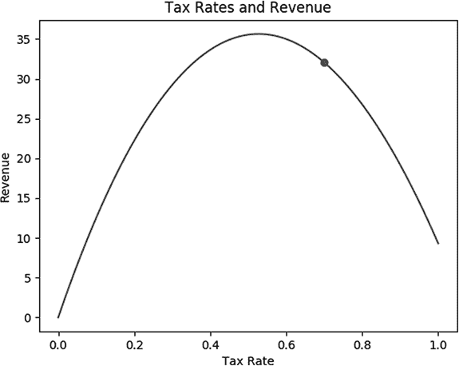
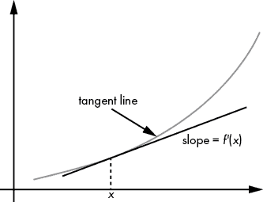
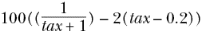
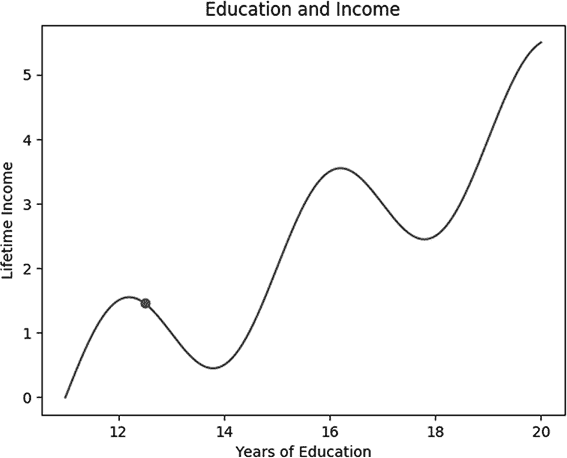
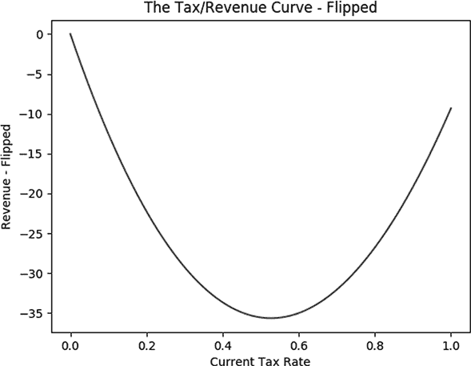

## 第三章：最大化与最小化


金发姑娘偏爱中间的选项，但在算法的世界里，我们通常更关心极端的高值和低值。一些强大的算法能够帮助我们找到极值（例如，最大收入、最大利润、最大效率、最大生产力）和极小值（例如，最小成本、最小错误、最小不适、最小损失）。本章介绍了梯度上升和梯度下降两种简单但有效的方法，用于高效地找到函数的极值点。我们还讨论了最大化和最小化问题中出现的一些问题，以及如何处理这些问题。最后，我们讨论了如何判断某个算法是否适合在特定情况下使用。我们将从一个假设场景开始——尝试设定最优税率以最大化政府收入——并看看如何使用算法找到正确的解决方案。

## 设置税率

假设你被选为一个小国的总理。你有雄心勃勃的目标，但你觉得自己的预算不足以实现它们。所以你上任后的第一项工作就是最大化政府的税收收入。

要最大化收入，选择什么样的税率并不显而易见。如果税率为 0%，你将获得零收入。如果税率为 100%，看起来纳税人很可能会避免生产性活动，拼命寻找避税工具，以至于收入可能接近零。优化收入将需要找到一个正确的平衡点，在这个平衡点上，税率既不会高到让生产性活动受到抑制，也不会低到导致收入不足。要实现这种平衡，你需要了解税率与收入之间的关系。

### 正确方向的步骤

假设你和你的经济学团队讨论了这个问题。他们理解你的观点后，便回到他们的研究办公室，在那里他们使用了顶级研究经济学家们普遍使用的工具——主要是试管、在跑步机上跑的仓鼠、星盘和占卜棒——来确定税率和收入之间的确切关系。

经过一段时间的隔离后，团队告诉你他们已经确定了一个将税率与税收收入相关联的函数，并且他们很友好地用 Python 为你编写了这个函数。也许这个函数看起来如下所示：

```py
import math
def revenue(tax):
    return(100 * (math.log(tax+1) - (tax - 0.2)**2 + 0.04))
```

这是一个 Python 函数，它以`tax`为参数并返回一个数值输出。这个函数本身存储在一个名为`revenue`的变量中。你启动 Python 来生成这个曲线的简单图表，在控制台中输入以下内容。就像在第一章中一样，我们将使用`matplotlib`模块来绘制图表。

```py
import matplotlib.pyplot as plt
xs = [x/1000 for x in range(1001)]    
ys = [revenue(x) for x in xs]
plt.plot(xs,ys)
plt.title('Tax Rates and Revenue')
plt.xlabel('Tax Rate')
plt.ylabel('Revenue')
plt.show()
```

这个图表展示了你们经济学家团队预计在 0 到 1 之间各个税率下的收入（单位为你国家的货币，单位为十亿）。其中 1 代表 100%的税率。如果你们国家当前对所有收入实行 70%的统一税率，我们可以在代码中添加两行来将该点绘制在曲线上，代码如下：

```py
import matplotlib.pyplot as plt
xs = [x/1000 for x in range(1001)]    
ys = [revenue(x) for x in xs]
plt.plot(xs,ys)
current_rate = 0.7
plt.plot(current_rate,revenue(current_rate),'ro')
plt.title('Tax Rates and Revenue')
plt.xlabel('Tax Rate')
plt.ylabel('Revenue')
plt.show()
```

最终输出是图 Figure 3-1 中的简单图表。



Figure 3-1: 税率与收入之间的关系，图中的点表示你们国家当前的情况

根据经济学家的公式，你们国家当前的税率并没有完全最大化政府的收入。尽管通过简单地视觉检查图表，可以大致判断哪个税率对应最大收入，但你不满足于粗略的估算，想要找到更精确的最优税率。通过曲线图可以明显看出，从当前 70%的税率开始，任何增加都将导致总收入下降，而任何减少都会增加总收入，因此，在这种情况下，收入最大化需要降低总体税率。

我们可以通过更正式的方式验证这一点，即求经济学家收入公式的导数。*导数*是切线的斜率度量，较大的值表示陡峭，负值表示向下运动。你可以在 Figure 3-2 中看到导数的示意图：它只是用来衡量一个函数增长或收缩的速度。



Figure 3-2: 为了计算导数，我们在曲线的某个点上取切线并找出其斜率。

我们可以在 Python 中创建一个函数来指定这个导数，代码如下：

```py
def revenue_derivative(tax):
    return(100 * (1/(tax + 1) - 2 * (tax - 0.2)))
```

我们使用了四条微积分规则来推导这个函数。首先，我们使用了*log*(*x*)的导数是 1/*x*的规则。正因为如此，*log*(*tax* + 1)的导数是 1/(*tax* + 1)。另一个规则是*x*²的导数是 2*x*。因此，(*tax* – 0.2)²的导数是 2(*tax* – 0.2)。另外还有两个规则：常数的导数永远是 0，100*f*(*x*)的导数是 100 乘以*f*(*x*)的导数。将这些规则结合起来，你会发现我们的税收-收入函数，100(*log*(*tax* + 1) – (*tax* – 0.2)² + 0.04)，其导数如下所示，正如 Python 函数中所描述的那样：



我们可以检查该国当前税率下的导数确实是负值：

```py
print(revenue_derivative(0.7))
```

这将给我们输出`-41.17647`。

负导数意味着提高税率会导致收入减少。反之，降低税率应该会导致收入增加。虽然我们还不确定与曲线最大值对应的准确税率，但我们可以至少确信，如果我们从当前位置朝着减少税收的方向迈出一小步，收入应该会增加。

为了朝着收入最大值迈出一步，我们首先应当指定一个步长。在 Python 中，我们可以将一个适当小的步长存储在一个变量中，如下所示：

```py
step_size = 0.001
```

接下来，我们可以通过找到一个新的税率，使得它与当前税率之间的差距与一个步长成比例，从而朝着最大值的方向迈出一步：

```py
current_rate = current_rate + step_size * revenue_derivative(current_rate)
```

到目前为止，我们的过程是从当前的税率开始，朝着最大值迈出一步，这一步的大小与我们选择的`step_size`成正比，方向由当前税率下税收函数的导数决定。

我们可以验证，在这一步之后，新的`current_rate`是`0.6588235`（大约是 66%的税率），对应的新税率的收入是`33.55896`。但是，虽然我们朝着最大值迈出了步伐并增加了收入，但我们发现自己基本上处于与之前相同的情况：我们还没有到达最大值，但我们知道了函数的导数以及我们应该朝哪个方向走才能达到最大值。所以，我们只需要再迈出一步，就像之前一样，不过这次是使用代表新税率的值。再次设置：

```py
current_rate = current_rate + step_size * revenue_derivative(current_rate)
```

再次运行后，我们发现新的`current_rate`是`0.6273425`，对应的新税率的收入是`34.43267`。我们在正确的方向上迈出了另一 步。但我们仍然没有到达最大收入税率，我们还需要再迈出一步才能更接近。

### 将步骤转化为算法

你可以看到正在出现的模式。我们正在重复执行以下步骤：

1.  从一个`current_rate`和`step_size`开始。

1.  计算你试图最大化的函数在`current_rate`处的导数。

1.  将`step_size` * `revenue_derivative`(`current_rate`)加到当前税率，得到新的`current_rate`。

1.  重复步骤 2 和 3。

唯一缺少的就是一个停止规则，一个在达到最大值时触发的规则。实际上，我们很可能会*渐近*地接近最大值：越来越接近它，但始终保持微小的距离。因此，虽然我们可能永远无法达到最大值，但我们可以接近它，精确到 3 位、4 位或 20 位小数。当我们离渐近线足够近时，我们就知道停止了，这时我们改变税率的幅度非常小。我们可以在 Python 中为此指定一个阈值：

```py
threshold = 0.0001
```

我们的计划是，当我们每次迭代中税率变化的幅度小于某个量时停止过程。可能我们的步骤过程永远无法收敛到我们期望的最大值，所以如果我们设置一个循环，可能会陷入无限循环。为此，我们会指定一个“最大迭代次数”，如果我们达到这个最大次数，就会放弃并停止。

现在，我们可以将所有这些步骤汇总在一起（清单 3-1）。

```py
threshold = 0.0001
maximum_iterations = 100000

keep_going = True
iterations = 0
while(keep_going):
    rate_change = step_size * revenue_derivative(current_rate)
    current_rate = current_rate + rate_change

    if(abs(rate_change) < threshold):
        keep_going = False

    if(iterations >= maximum_iterations):
        keep_going = False

    iterations = iterations+1
```

清单 3-1: 实现梯度上升法

运行这段代码后，你会发现收入最大化的税率大约是`0.528`。我们在清单 3-1 中做的就是所谓的*梯度上升法*。之所以这么叫，是因为它被用来“上升”到一个最大值，并通过计算梯度来确定移动的方向。（在像我们这样二维的情况下，梯度就叫做导数。）我们可以将我们遵循的步骤完整列出，包括停止标准的描述：

1.  从一个`current_rate`和`step_size`开始。

1.  计算你试图最大化的函数在`current_rate`处的导数。

1.  将`step_size * revenue_derivative`(`current_rate`)加到当前税率上，得到一个新的`current_rate`。

1.  重复步骤 2 和 3，直到你接近最大值，使得每次步骤中当前税率的变化小于一个非常小的阈值，或者直到你达到足够高的迭代次数。

我们的过程可以简单地用四个步骤来写。尽管它外观简朴、概念简单，梯度上升法依然是一个算法，就像前几章中描述的算法一样。然而，与大多数这些算法不同，梯度上升法今天被广泛应用，并且是许多专业人员日常使用的高级机器学习方法的关键部分。

## 对梯度上升法的反对意见

我们刚刚通过梯度上升法来最大化假设政府的收入。许多学习梯度上升法的人对此有实际的，甚至是道德上的反对。以下是人们对梯度上升法提出的一些论点：

+   这没有必要，因为我们可以通过视觉检查来找到最大值。

+   这没有必要，因为我们可以通过反复猜测、一种猜测与检查的策略来找到最大值。

+   这没有必要，因为我们可以解一阶条件。

让我们依次考虑这些反对意见。我们之前讨论过视觉检查。对于我们的税收/收入曲线，通过视觉检查很容易大致判断出最大值的位置。但对图表的视觉检查并不能提供高精度的结果。更重要的是，我们的曲线非常简单：它可以在二维中绘制，并且在我们关心的范围内显然只有一个最大值。如果你想象更复杂的函数，就会明白为什么视觉检查不能作为找到函数最大值的有效方法。

例如，考虑一个多维的情况。如果我们的经济学家得出结论，认为收入不仅依赖于税率，还依赖于关税率，那么我们的曲线就必须在三维中绘制。如果它是一个复杂的函数，可能会更难看出最大值的位置。如果我们的经济学家构造了一个将 10 个、20 个甚至 100 个预测变量与预期收入相关联的函数，那么根据我们宇宙、眼睛和大脑的局限性，我们就无法同时绘制所有这些函数图。如果我们甚至无法绘制税收/收入曲线，那么视觉检查就不可能帮助我们找到它的最大值。视觉检查适用于像税收/收入曲线这样简单的示例，但不适用于高度复杂的多维问题。除此之外，绘制曲线本身需要计算每一个感兴趣点的函数值，因此总是比一个写得好的算法花费更多的时间。

可能看起来梯度上升使问题变得过于复杂，而猜测检查策略就足以找到最大值。猜测检查策略包括猜测一个潜在的最大值，并检查它是否高于所有先前猜测的候选最大值，直到我们确信找到了最大值。对此，一种可能的回应是指出，就像视觉检查一样，对于高复杂度的多维函数，猜测检查在实践中可能会变得过于困难。然而，针对猜测检查法来找最大值的最好回应是，这正是梯度上升*已经在做的事*。梯度上升本质上就是一种猜测检查策略，但它是通过沿着梯度的方向移动猜测，而不是随机猜测，从而“引导”猜测。梯度上升只是猜测检查的一个更高效的版本。

最后，考虑通过求解一阶条件来找到最大值的思路。这是世界各地微积分课程中教授的一种方法。它可以被称为一种算法，其步骤是：

1.  找到你要最大化的函数的导数。

1.  将该导数设为零。

1.  求解使导数为零的点。

1.  确保该点是最大值而不是最小值。

（在多维空间中，我们可以使用梯度而不是导数，并执行类似的过程。）这个优化算法在其适用范围内是有效的，但可能很难或者无法找到一个闭式解，使得导数为零（步骤 2），而且找到这个解可能比简单地执行梯度上升更为困难。此外，它可能需要大量的计算资源，包括空间、处理能力或时间，并且并非所有软件都具有符号代数能力。从这个角度来看，梯度上升比这个算法更为稳健。

## 局部极值问题

任何尝试寻找最大值或最小值的算法都面临着局部极值（局部最大值和最小值）的严重潜在问题。我们可能完美地执行了梯度上升，但最终意识到我们达到的顶点只是一个“局部”峰值——它比周围的每个点都高，但比某个远处的全局最大值要低。这种情况在现实生活中也可能发生：你尝试攀登一座山峰，虽然你到达的山顶比周围所有地方都高，但你意识到你只是在山脚下，真正的山顶还远远在上方，而且更高。具有讽刺意味的是，你可能需要稍微下山一点才能到达更高的山顶，因此梯度上升所遵循的“天真”策略——始终向稍微更高的邻近点迈进——无法达到全局最大值。

### 教育与终身收入

局部极值是梯度上升中的一个非常严重的问题。举个例子，假设我们尝试通过选择最优的教育水平来最大化终身收入。在这种情况下，我们可能假设终身收入与教育年限之间存在如下公式关系：

```py
import math
def income(edu_yrs):
    return(math.sin((edu_yrs - 10.6) * (2 * math.pi/4)) + (edu_yrs - 11)/2)
```

这里，`edu_yrs`是一个变量，表示一个人接受了多少年的教育，而`income`是衡量一个人终身收入的标准。我们可以按照以下方式绘制这条曲线，包括一个拥有 12.5 年正式教育的人的数据点——也就是一个高中毕业生（12 年正式教育），并且已经完成了半年的本科学位课程：

```py
import matplotlib.pyplot as plt
xs = [11 + x/100 for x in list(range(901))]    
ys = [income(x) for x in xs]
plt.plot(xs,ys)
current_edu = 12.5
plt.plot(current_edu,income(current_edu),'ro')
plt.title('Education and Income')
plt.xlabel('Years of Education')
plt.ylabel('Lifetime Income')
plt.show()
```

我们在图 3-3 中得到了这个图。



图 3-3: 正式教育与终身收入的关系

这张图，以及用于生成它的收入函数，并非基于实证研究，而仅作为一个说明性的、纯粹假设性的例子。它展示了教育与收入之间可能的直观关系。对于那些没有高中毕业的人（拥有不到 12 年正式教育的人），他们的一生收入可能会很低。高中毕业（12 年教育）是一个重要的里程碑，应当对应着比辍学者更高的收入。换句话说，这是一个最大值，但值得注意的是，它只是一个局部最大值。获得超过 12 年的教育是有帮助的，但一开始并不显著。只完成了几个月大学教育的人，可能不会获得与高中毕业生有太大区别的工作机会，但因为多上了几个月的学，他们错过了那些几个月的收入机会，因此他们的终生收入实际上低于那些高中毕业后直接进入职场并一直待在那里的人的收入。

只有经过几年的大学教育，才能获得那些能够使一个人在一生中赚取比高中毕业生更多的技能——这还考虑到了在学校度过的几年所失去的收入潜力。然后，大学毕业生（拥有 16 年教育）的收入达到了比本地高中毕业生更高的收入峰值。再次强调，这只是一个局部的峰值。在获得本科学位之后再接受一些教育，和高中毕业后接受更多教育的情况类似：你并不会立即获得足够的技能来弥补那段未能赚取收入的时间。最终，这种情况会发生逆转，在获得研究生学位后，你会达到看似另一个收入峰值。很难再对这个问题做出更多推测，但这个简单的教育与收入的关系可以满足我们的目的。

### 攀登教育山丘——正确的方式

对于我们所想象的个体，其在图表中所代表的是 12.5 年的教育，我们可以像之前所述的那样执行梯度上升。列表 3-2 是我们在列表 3-1 中介绍的梯度上升代码的稍微修改版。

```py
def income_derivative(edu_yrs):
    return(math.cos((edu_yrs - 10.6) * (2 * math.pi/4)) + 1/2)

threshold = 0.0001
maximum_iterations = 100000

current_education = 12.5
step_size = 0.001

keep_going = True
iterations = 0
while(keep_going):
    education_change = step_size * income_derivative(current_education)
    current_education = current_education + education_change
    if(abs(education_change) < threshold):
        keep_going = False
    if(iterations >= maximum_iterations):
        keep_going=False
    iterations = iterations + 1
```

列表 3-2: 一种爬升收入山丘而非收入山丘的梯度上升实现

Listing 3-2 中的代码完全遵循了与我们之前实现的收入最大化过程相同的梯度上升算法。唯一的区别是我们所处理的曲线不同。我们的税收/收入曲线有一个全局最大值，同时也是唯一的局部最大值。与此相比，我们的教育/收入曲线更为复杂：它有一个全局最大值，但也有多个局部最大值（局部峰值或极大值），这些局部最大值都低于全局最大值。我们必须指定这条教育/收入曲线的导数（在 Listing 3-2 的前几行），我们有不同的初始值（12.5 年的教育而不是 70%的税率），变量的名称也不同（`current_education`而不是`current_rate`）。但这些差异是表面的；从根本上说，我们做的事情是一样的：在梯度方向上采取小步骤，朝着最大值前进，直到我们达到适当的停止点。

这个梯度上升过程的结果是我们得出结论：这个人受教育程度过高，实际上，约 12 年是收入最大化的教育年限。如果我们过于天真，过度依赖梯度上升算法，我们可能会建议大学新生立刻辍学并加入工作市场，以在这个局部最大值下最大化收入。过去确实有一些大学生得出过这样的结论，因为他们看到自己高中毕业的朋友比他们挣得多，而他们则在为一个不确定的未来努力。显然，这是不对的：我们的梯度上升过程找到了局部山顶，但并没有找到全局最大值。梯度上升过程令人沮丧地局限于局部：它只爬上它所在的山丘，并且无法为了最终到达更高的山顶而暂时向下走一步。生活中也有类似的例子，比如那些因为短期内无法赚到钱而未能完成大学学位的人。他们没有考虑到，如果他们通过局部最低点，继续爬向另一个更高的山丘（他们的下一个、更有价值的学位），长期收入将会提高。

局部极值问题是一个严峻的问题，并没有什么灵丹妙药来解决它。一种解决问题的方法是尝试多个初始猜测，并对每个初始值执行梯度上升。例如，如果我们对 12.5 年、15.5 年和 18.5 年的教育年限执行梯度上升，我们每次都会得到不同的结果，然后可以比较这些结果，发现实际上全局最大值是通过最大化教育年限来获得的（至少在这个尺度上）。

这是处理局部极值问题的一种合理方法，但它可能需要花费过长的时间进行足够多次的梯度上升才能找到正确的最大值，而且即便尝试了数百次，我们也无法保证得到正确的答案。一种看似更好的方法是向过程引入一定程度的随机性，这样我们有时可能会朝着一个局部较差的解迈进，但从长远来看，这样的做法可能会帮助我们找到更好的最大值。梯度上升的高级版本，称为*随机梯度上升*，正是因为这个原因引入了随机性，其他算法，如模拟退火，也采取了类似的做法。我们将在第六章讨论模拟退火和与高级优化相关的问题。现在，只需记住，尽管梯度上升非常强大，但它始终面临局部极值问题的挑战。

## 从最大化到最小化

到目前为止，我们一直在寻求最大化收入：爬上山顶，向上攀登。合理的疑问是，我们是否曾经想过要下山，下降并最小化某些东西（比如成本或误差）。你可能认为最小化需要一整套新技巧，或者我们现有的技巧需要完全翻转、内外调换，或者反向运行。

实际上，从最大化到最小化是非常简单的。一种方法是“翻转”我们的函数，或者更准确地说，取它的负值。以我们的税收/收入曲线为例，定义一个新的翻转函数就像这样简单：

```py
def revenue_flipped(tax):
    return(0 - revenue(tax))
```

我们可以按如下方式绘制翻转后的曲线：

```py
import matplotlib.pyplot as plt
xs = [x/1000 for x in range(1001)]    
ys = [revenue_flipped(x) for x in xs]
plt.plot(xs,ys)
plt.title('The Tax/Revenue Curve - Flipped')
plt.xlabel('Current Tax Rate')
plt.ylabel('Revenue - Flipped')
plt.show()
```

图 3-4 显示了翻转后的曲线。



图 3-4: 税收/收入曲线的负值或“翻转”版本

因此，如果我们想最大化税收/收入曲线，一种选择是最小化翻转后的税收/收入曲线。如果我们想最小化翻转后的税收/收入曲线，一种选择是最大化翻转后的翻转曲线——换句话说，就是原始曲线。每个最小化问题都是翻转函数的最大化问题，每个最大化问题都是翻转函数的最小化问题。如果你能解决一个，你也能解决另一个（在翻转后）。与其学习最小化函数，不如直接学习最大化它们，每次需要最小化时，就去最大化翻转后的函数，你就会得到正确的答案。

翻转并不是唯一的解决方案。实际的最小化过程与最大化过程非常相似：我们可以使用*梯度下降*代替梯度上升。唯一的区别是每一步的移动方向；在梯度下降中，我们是向下而不是向上。记住，为了找到税收/收入曲线的最大值，我们是沿着梯度的方向移动。为了最小化，我们则沿着梯度的反方向移动。这意味着我们可以按照清单 3-3 中的方式修改我们原有的梯度上升代码。

```py
threshold = 0.0001
maximum_iterations = 10000

**def revenue_derivative_flipped(tax):**
    **return(0-revenue_derivative(tax))**

current_rate = 0.7

keep_going = True
iterations = 0
while(keep_going):
    rate_change = step_size * revenue_derivative_flipped(current_rate)
    **current_rate = current_rate - rate_change**
    if(abs(rate_change) < threshold):
        keep_going = False
    if(iterations >= maximum_iterations):
        keep_going = False
    iterations = iterations + 1
```

列表 3-3： 实现梯度下降

这里一切相同，只是当我们改变`current_rate`时，将一个`+`改成了`-`。通过这个微小的改变，我们将梯度上升代码转换为梯度下降代码。从某种意义上来说，它们本质上是相同的；它们使用梯度来确定方向，然后朝着这个方向朝着一个确定的目标前进。事实上，现在最常见的惯例是讲梯度下降，而将梯度上升称为梯度下降的稍微修改版本，这与本章介绍的方式相反。

## 一般的爬山算法

被选为总理是一个罕见的事件，即使是总理，设定税率以最大化政府收入也不是日常事务。（对于本章开头关于税收/收入讨论的现实版本，我鼓励你查阅拉弗曲线。）然而，最大化或最小化某事的思想是非常常见的。企业试图选择价格以最大化利润。制造商试图选择能够最大化效率并最小化缺陷的做法。工程师试图选择能够最大化性能或最小化阻力或成本的设计特性。经济学在很大程度上是围绕最大化和最小化问题构建的：尤其是最大化效用，也包括最大化像 GDP 和收入这样的货币金额，以及最小化估计误差。机器学习和统计学的核心方法依赖于最小化；它们最小化一个“损失函数”或误差指标。对于这些问题，都有可能使用类似爬山算法的解决方案，如梯度上升或下降，来获得最优解。

即使在日常生活中，我们也会选择花费多少钱，以最大化实现我们的财务目标。我们努力最大化幸福、快乐、和平与爱，同时最小化痛苦、不适和悲伤。

举一个生动且容易理解的例子，想象你正在自助餐厅，像我们所有人一样，试图吃到适量的食物以最大化满足感。如果你吃得太少，你会饿着离开，并且可能会觉得花了自助餐的全价却只吃了很少的食物，觉得没物有所值。如果你吃得太多，你会感到不适，甚至可能会生病，可能还会违反你自己制定的饮食计划。总会有一个最佳的平衡点，就像税收/收入曲线的顶点一样，它是最大化满足感的最佳自助餐消费量。

我们人类能够感知并解读来自我们胃部的感官输入，这些输入告诉我们是饿了还是饱了，这有点像物理上对曲线求梯度的过程。如果我们太饿了，我们就会采取某个预先决定的步伐，比如吃一口，朝着满足的最佳状态迈进。如果我们吃得太饱了，我们就停止进食；我们不能“吃回”已经吃过的东西。如果我们的步伐足够小，我们就能确信自己不会大大超过那个最佳状态。我们在自助餐时决定吃多少的过程是一个迭代过程，涉及反复的方向检查和小步调整——换句话说，它本质上与我们在本章学习的梯度上升算法是一样的。

就像捕捉球的例子一样，我们可以在这个自助餐的例子中看到，像梯度上升这样的算法在人的生活和决策中是自然的。即使我们从未上过数学课或写过一行代码，它们对我们来说也是自然的。本章中的工具仅仅是为了使你已经拥有的直觉更加形式化和精确。

## 何时不使用算法

学习一个算法常常让我们感到强大。我们觉得，只要遇到需要最大化或最小化的情况，就应该立刻应用梯度上升或下降，并盲目相信我们找到的任何结果。然而，有时候，比了解一个算法更重要的是知道何时不使用它，何时它不适合当前任务，或者何时有其他更好的方法可以尝试。

我们什么时候应该使用梯度上升（或下降），什么时候又不该使用呢？如果我们从正确的因素开始，梯度上升通常效果很好：

+   一个数学函数来最大化

+   了解我们当前所处的位置

+   一个明确的目标来最大化该函数

+   改变我们所处位置的能力

有很多情况下，其中一个或多个因素是缺失的。在设定税率的案例中，我们使用了一个假设函数，描述税率与收入之间的关系。然而，经济学家们并没有就这种关系及其功能形式达成共识。因此，我们可以尽情地进行梯度上升和下降，但直到我们能够就需要最大化的函数达成一致，我们无法依赖我们所找到的结果。

在其他情况下，我们可能会发现梯度上升并不是非常有用，因为我们没有采取行动来优化我们状况的能力。例如，假设我们推导出一个公式，关联了一个人的身高与他们的幸福感。也许这个函数表达了那些身高过高的人因为无法在飞机上舒适地坐着而感到痛苦，而身高过矮的人则因为无法在街头篮球比赛中脱颖而出而感到痛苦，但身高不太高也不太矮的“黄金区间”往往能最大化幸福感。即使我们能够完美地表达这个函数并应用梯度上升找到最大值，这对我们也没有用，因为我们无法控制自己的身高。

如果我们进一步放大视野，可能会发现我们拥有梯度上升（或任何其他算法）所需的所有要素，但仍然因为更深层的哲学原因而选择放弃。例如，假设你能精确地确定税收收入函数，并且你当选为总理，完全控制国家的税率。在你应用梯度上升并攀登到收入最大化的峰值之前，你可能需要问问自己，最大化税收收入是否是一个值得追求的目标。也许你更关心的是自由、经济活力、再分配正义，甚至是民意调查，而不是国家收入。即使你已经决定要最大化收入，最大化短期收入（也就是今年）也不一定能带来长期收入的最大化。

算法在实际应用中非常强大，使我们能够实现诸如接住棒球和寻找最大化税收收入的税率等目标。但尽管算法可以有效地达成目标，它们并不适合用于决定哪些目标值得追求这个更具哲学性的问题。算法可以让我们聪明，但它们无法让我们变得智慧。重要的是要记住，如果算法的巨大力量被用于错误的目的，它是无用的，甚至可能是有害的。

## 总结

本章介绍了梯度上升和梯度下降，作为简单且强大的算法，用于分别找到函数的最大值和最小值。我们还讨论了局部极值可能带来的严重问题，以及在何时使用算法、何时优雅地避免使用算法的一些哲学思考。

紧紧抓住，因为在下一章我们将讨论各种搜索和排序算法。搜索和排序在算法的世界中是基础且重要的内容。我们还会讨论“大 O”符号和评估算法性能的标准方法。
