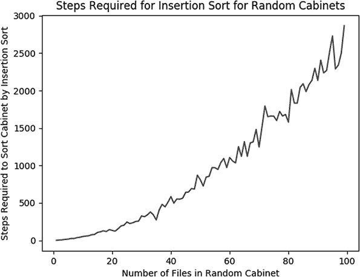
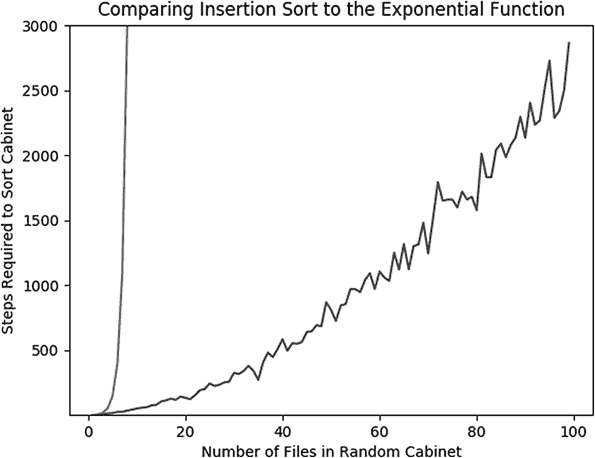
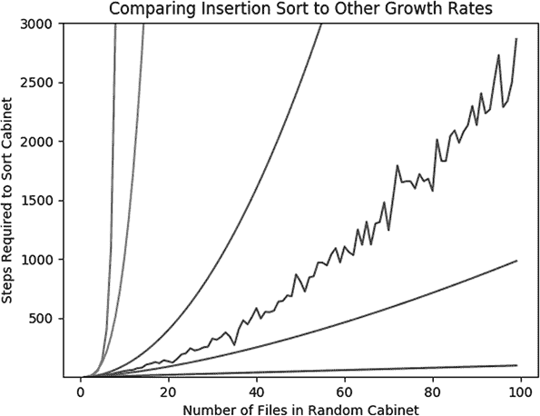
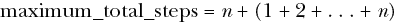
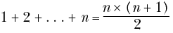
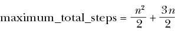

## 第四章：排序和查找


在几乎所有类型的程序中，我们都会使用一些基础的算法。有时这些算法是如此基本，以至于我们把它们视为理所当然，甚至没有意识到我们的代码依赖于它们。

排序和查找的几种方法属于这些基础算法之一。它们值得了解，因为它们被广泛使用，并且深受算法爱好者（以及那些让人痛苦的面试官）的喜爱。这些算法的实现可以非常简短和简单，但每个字符都至关重要，由于它们需求如此广泛，计算机科学家们一直致力于使它们能够以惊人的速度进行排序和查找。因此，我们还将在本章讨论算法速度和比较算法效率时使用的特殊符号。

我们首先介绍插入排序，这是一种简单直观的排序算法。我们将讨论插入排序的速度和效率，并了解如何衡量算法的效率。接下来，我们将介绍归并排序，这是一种更快速的算法，目前是搜索算法中的先进技术。我们还会探讨睡眠排序，这是一种奇怪的算法，虽然在实践中不常用，但作为一种好奇心的产物还是值得关注。最后，我们将讨论二分查找，并展示一些有趣的查找应用，包括反转数学函数。

## 插入排序

想象一下，你被要求整理文件柜中的所有文件。每个文件都有一个编号，你需要将这些文件重新排序，使得编号最小的文件排在最前面，编号最大的文件排在最后，其他文件的编号按顺序排列。

无论你采用什么方法来整理文件柜，我们都可以将其描述为一种“排序算法”。但在你打开 Python 编程来实现该算法之前，先停下来想一想，如何在现实生活中整理这个文件柜。这个任务看似普通，但请让你内心的冒险者发挥创造力，考虑一系列广泛的可能性。

在这一部分，我们将介绍一种非常简单的排序算法，叫做*插入排序*。该方法依赖于逐个查看列表中的每个项目，并将其插入到一个新的列表中，最终该列表是按正确顺序排序的。我们算法的代码将分为两个部分：插入部分，它执行将文件插入列表的简单任务；以及排序部分，它重复执行插入操作，直到完成排序任务。

### 将“插入”放入插入排序

首先，考虑插入任务本身。假设你有一个文件柜，里面的文件已经排序好。如果有人递给你一个新文件，让你将它插入到文件柜中合适的（已排序的）位置，你该如何完成这个任务？这项任务可能看起来如此简单，以至于不需要解释，甚至不需要考虑任何可能性（*直接做就行！*你可能会这样想）。但是在算法的世界里，每个任务，不论多么简单，都必须完全解释清楚。

以下方法描述了一种合理的算法，用于将一个文件插入到已排序的文件柜中。我们将要插入的文件称为“要插入的文件”。我们假设我们可以比较两个文件，并称一个文件“高于”另一个文件。这可能意味着一个文件的编号比另一个文件的编号高，或者它可能在字母顺序或其他排序中排得更靠前。

1.  选择文件柜中最高的文件。（我们将从文件柜的底部开始，逐步向前移动。）

1.  将你选择的文件与要插入的文件进行比较。

1.  如果你选择的文件比要插入的文件低，就将要插入的文件放在该文件后面一个位置。

1.  如果你选择的文件比要插入的文件高，选择文件柜中下一个较高的文件。

1.  重复步骤 2 到 4，直到你插入了文件，或者与每个现有文件进行了比较。如果在与每个现有文件比较后你还没有插入文件，则将其插入到文件柜的最前面。

这个方法应该或多或少与你插入记录到已排序列表中的直觉相匹配。如果你愿意，也可以从列表的开头开始，而不是从末尾开始，并按照类似的过程进行，结果也是一样的。注意，我们不仅仅是插入了一个记录；我们是将记录插入了*正确的位置*，所以插入后，我们仍然会得到一个已排序的列表。我们可以编写一个 Python 脚本来执行这个插入算法。首先，我们可以定义我们的排序文件柜。在这个例子中，我们的文件柜将是一个 Python 列表，而我们的文件将仅仅是数字。

```py
cabinet = [1,2,3,3,4,6,8,12]
```

然后，我们可以定义我们想要插入到文件柜中的“文件”（在这个例子中只是一个数字）。

```py
to_insert = 5
```

我们按顺序逐一处理列表中的每个数字（文件柜中的每个文件）。我们将定义一个变量叫做`check_location`。如广告所示，它将存储我们想要检查的文件柜位置。我们从文件柜的最底部开始：

```py
check_location = len(cabinet) - 1
```

我们还将定义一个变量叫做`insert_location`。我们算法的目标是确定`insert_location`的正确值，然后只需将文件插入到`insert_location`即可。我们将假设`insert_location`的初始值为 0：

```py
insert_location = 0
```

然后，我们可以使用一个简单的`if`语句检查要插入的文件是否大于位于`check_location`的文件。一旦我们遇到一个比要插入的数字小的数字，就可以使用其位置来决定新数字的插入位置。我们加 1 是因为插入的位置就在我们找到的较小数字之后：

```py
if to_insert > cabinet[check_location]:
    insert_location = check_location + 1
```

在我们确定了正确的`insert_location`之后，可以使用 Python 内置的列表操作方法`insert`将文件插入到文件柜中：

```py
cabinet.insert(insert_location,to_insert)
```

然而，运行这段代码仍然不能正确插入文件。我们需要将这些步骤整合到一个连贯的插入函数中。这个函数将所有之前的代码合并在一起，并且还添加了一个`while`循环。`while`循环用于遍历文件柜中的文件，从最后一个文件开始，直到我们找到合适的`insert_location`，或者检查完所有文件。文件柜插入的最终代码在示例 4-1 中。

```py
def insert_cabinet(cabinet,to_insert):
  check_location = len(cabinet) - 1
  insert_location = 0
  while(check_location >= 0):
    if to_insert > cabinet[check_location]:
        insert_location = check_location + 1
        check_location = - 1
    check_location = check_location - 1
  cabinet.insert(insert_location,to_insert)
  return(cabinet)

cabinet = [1,2,3,3,4,6,8,12]
newcabinet = insert_cabinet(cabinet,5)
print(newcabinet)
```

示例 4-1： 将一个编号文件插入到我们的文件柜中

当你运行示例 4-1 中的代码时，它会输出`newcabinet`，你可以看到，5 这个新“文件”已经按正确的位置（4 和 6 之间）插入到文件柜中了。

现在值得花一点时间思考插入的一个极端情况：插入到一个空列表中。我们的插入算法提到过“依次处理文件柜中的每个文件”。如果文件柜中没有文件，那么就没有什么可以依次处理的了。在这种情况下，我们只需要关注最后一句话，它告诉我们将新文件插入到柜子的开头。当然，这比说起来容易，因为空文件柜的开头也是文件柜的结尾和中间。因此，在这种情况下，我们所需要做的就是把文件插入到柜子里，而不必考虑位置。我们可以通过使用 Python 中的`insert()`函数，并在位置 0 插入文件来做到这一点。

### 通过插入排序

既然我们已经严格定义了插入操作并知道如何执行它，我们几乎可以开始执行插入排序了。插入排序很简单：它一次处理未排序列表中的每个元素，并使用我们的插入算法将其正确地插入到一个新的已排序列表中。在文件柜的术语中，我们从一个未排序的文件柜开始，称之为“旧文件柜”，以及一个空的文件柜，称之为“新文件柜”。我们移除旧文件柜中的第一个元素，并使用插入算法将其添加到新的空文件柜中。我们对旧文件柜中的第二个元素执行相同操作，然后是第三个，以此类推，直到将所有旧文件柜中的元素都插入到新文件柜中。然后，我们忘记旧文件柜，只使用新的已排序文件柜。由于我们一直在使用插入算法进行插入，而且该算法总是返回一个排序好的列表，因此我们知道在过程结束时，我们的新文件柜将是已排序的。

在 Python 中，我们从一个未排序的文件柜和一个空的`newcabinet`开始：

```py
cabinet = [8,4,6,1,2,5,3,7]
newcabinet = []
```

我们通过反复调用我们的`insert_cabinet()`函数来实现插入排序，这个函数来自于列表 4-1。为了调用它，我们需要手中有一个文件，这通过从未排序的文件柜中弹出文件来实现：

```py
to_insert = cabinet.pop(0)
newcabinet = insert_cabinet(newcabinet, to_insert)
```

在这个代码片段中，我们使用了一种名为`pop()`的方法。这个方法会移除指定索引位置的列表元素。在本例中，我们移除了`cabinet`中索引为 0 的元素。使用`pop()`后，`cabinet`不再包含该元素，我们将它存储在变量`to_insert`中，以便将其放入`newcabinet`。

我们将在列表 4-2 中把这一切结合起来，在那里我们定义了一个`insertion_sort()`函数，它循环遍历未排序的文件柜中的每个元素，将元素一个一个地插入到`newcabinet`中。最后，在过程的末尾，我们打印出结果，即一个名为`sortedcabinet`的已排序文件柜。

```py
cabinet = [8,4,6,1,2,5,3,7]
def insertion_sort(cabinet):
  newcabinet = []
  while len(cabinet) > 0:
    to_insert = cabinet.pop(0)
    newcabinet = insert_cabinet(newcabinet, to_insert)
  return(newcabinet)

sortedcabinet = insertion_sort(cabinet)
print(sortedcabinet)
```

列表 4-2: 插入排序的实现

既然我们已经能够实现插入排序，那么我们就可以对任何遇到的列表进行排序了。我们可能会倾向于认为这意味着我们已经掌握了所有需要的排序知识。然而，排序是如此基础和重要，我们希望能够以最佳的方式来完成它。在讨论插入排序的替代方法之前，让我们先看看什么意味着一个算法比另一个更好，并且更基本地，什么才算是一个好的算法。

## 测量算法效率

插入排序是一个好的算法吗？这个问题很难回答，除非我们明确知道“好”是什么意思。插入排序有效——它能够排序列表——所以从它完成目标的意义上来说，它是好的。另一个优点是，它很容易理解，并且可以通过许多人熟悉的物理任务来解释。它的又一个优势是，表达它所需的代码行数不多。到目前为止，插入排序看起来是一个好的算法。

然而，插入排序有一个关键的缺陷：它需要很长时间来执行。示例 4-2 中的代码几乎肯定在你的计算机上运行不到一秒钟，因此插入排序所需的“长时间”并不是指像小种子成长为参天红木那样的漫长时光，也不是指在车管所排队等待的长时间。它更像是与一只蚊子拍一次翅膀所需的时间相比的“长时间”。

担心一只小蚊子拍翅膀所需要的“长时间”似乎有些极端。但推向零秒运行时间是有几个合理的原因的。

### 为什么追求效率？

不断追求算法效率的第一个原因是它能提升我们的基础能力。如果你的低效算法排序一个八项列表需要一分钟，可能看起来不成问题。但假设这种低效算法排序一个千项列表需要一小时，排序一个百万项列表需要一周，排序一个十亿项列表可能需要一年甚至一个世纪，或者根本无法完成排序。如果我们能够改善这个算法，让它能更有效地排序一个八项列表（虽然它只节省了一分钟，但似乎是微不足道的），那可能就能在一小时内排序一个十亿项的列表，而不是一个世纪，这能开启许多可能性。像 k 均值聚类和 k-NN 监督学习这样的高级机器学习方法依赖于对长列表的排序，而改进排序等基础算法的性能可以使我们在处理庞大的数据集时，能够执行这些方法，否则这些数据集可能会超出我们的掌控。

即使是对短列表的排序，如果是我们需要多次执行的任务，也应该尽量快速完成。例如，全球的搜索引擎每几个月就会收到万亿次搜索，并且必须按相关性从高到低对每一组结果进行排序，然后再呈现给用户。如果它们能将一次简单排序所需的时间从一秒钟减少到半秒钟，它们就能将所需的处理时间从万亿秒减少到半万亿秒。这为用户节省了时间（为五亿人节省一千秒真的是个大数！），同时降低了数据处理成本，而通过减少能量消耗，高效的算法也更环保。

创建更快算法的最终原因与人们在任何追求中试图做得更好的原因相同。即使没有明显的需求，人们也会试图跑得更快，棋下得更好，做出比以往任何人更美味的披萨。他们这样做的原因正如乔治·马洛里所说的，他想攀登珠穆朗玛峰：“因为它在那里。”人类天生就有推动可能性边界的欲望，努力变得更好、更快、更强大、更聪明。算法研究人员之所以想做得更好，部分原因是他们希望做出一些令人瞩目的事情，无论它是否在实际中有用。

### 精确测量时间

由于算法运行所需的时间非常重要，我们应该比说插入排序“很长时间”或“不到一秒”更精确。究竟需要多长时间？为了得到确切的答案，我们可以使用 Python 中的 `timeit` 模块。通过 `timeit`，我们可以创建一个计时器，在运行排序代码前启动，并在运行之后结束。当我们检查开始时间和结束时间的差异时，就能得出代码运行所需的时间。

```py
from timeit import default_timer as timer

start = timer()
cabinet = [8,4,6,1,2,5,3,7]
sortedcabinet = insertion_sort(cabinet)
end = timer()
print(end - start)
```

当我在我的消费级笔记本电脑上运行这段代码时，它大约花了 0.0017 秒。这是表达插入排序好坏的一种合理方式——它可以在 0.0017 秒内完全排序一个包含八个项目的列表。如果我们想将插入排序与其他排序算法进行比较，我们可以通过比较这个 `timeit` 定时的结果来看哪个更快，并认为更快的那个更好。

然而，使用这些定时来比较算法性能存在一些问题。例如，当我第二次在笔记本电脑上运行定时代码时，我发现它只用了 0.0008 秒。第三次，我发现它在另一台电脑上运行用了 0.03 秒。你得到的精确时长取决于你的硬件的速度和架构、操作系统（OS）的当前负载、你运行的 Python 版本、操作系统内部的任务调度器、代码的效率，可能还有其他随机性的混乱因素、电子运动以及月相等。由于每次定时尝试可能会得到非常不同的结果，因此很难仅依赖定时来比较算法的效率。一位程序员可能吹嘘说他们能在 *Y* 秒内排序一个列表，而另一位程序员则笑着说他们的算法在 *Z* 秒内得到更好的性能。我们可能会发现他们运行的其实是完全相同的代码，但在不同的硬件上、不同的时间运行，因此他们的比较并不是算法效率的比较，而是硬件速度和运气的比较。

### 计算步骤

与其使用秒数作为时间度量，更可靠的算法性能衡量标准是执行算法所需的步骤数。算法所需的步骤数是算法本身的特性，它不依赖于硬件架构，甚至不一定依赖于编程语言。清单 4-3 是我们在清单 4-1 和 4-2 中的插入排序代码，增加了几行代码，其中我们指定了 `stepcounter+=1`。每次我们从旧列表中取出一个新元素插入时，每次我们将该元素与新列表中的其他元素进行比较时，以及每次我们将该元素插入新列表时，都会增加我们的步骤计数器。

```py
def insert_cabinet(cabinet,to_insert):
  check_location = len(cabinet) - 1
  insert_location = 0
  global stepcounter
  while(check_location >= 0):
    stepcounter += 1
    if to_insert > cabinet[check_location]:
        insert_location = check_location + 1
        check_location = - 1
    check_location = check_location - 1
  stepcounter += 1
  cabinet.insert(insert_location,to_insert)
  return(cabinet)

def insertion_sort(cabinet):
  newcabinet = []
  global stepcounter
  while len(cabinet) > 0:
    stepcounter += 1
    to_insert = cabinet.pop(0)
    newcabinet = insert_cabinet(newcabinet,to_insert)
  return(newcabinet)

cabinet = [8,4,6,1,2,5,3,7]
stepcounter = 0
sortedcabinet = insertion_sort(cabinet)
print(stepcounter)
```

清单 4-3: 我们带有步骤计数器的插入排序代码

在这种情况下，我们可以运行这段代码，看到它需要执行 36 步才能完成一个长度为 8 的列表的插入排序。让我们尝试对其他长度的列表进行插入排序，看看需要多少步骤。

为此，让我们编写一个函数，检查不同长度的未排序列表进行插入排序所需的步骤数。我们可以使用 Python 中的简单列表推导式生成任意指定长度的随机列表，而不是手动编写每个未排序的列表。我们可以导入 Python 的 `random` 模块，使得随机生成列表变得更加容易。以下是如何生成一个长度为 10 的随机未排序列表：

```py
import random
size_of_cabinet = 10
cabinet = [int(1000 * random.random()) for i in range(size_of_cabinet)]
```

我们的函数将简单地生成一个给定长度的列表，运行我们的插入排序代码，并返回它找到的 `stepcounter` 最终值。

```py
def check_steps(size_of_cabinet):
  cabinet = [int(1000 * random.random()) for i in range(size_of_cabinet)]
  global stepcounter
  stepcounter = 0
  sortedcabinet = insertion_sort(cabinet)
  return(stepcounter)
```

让我们创建一个包含 1 到 100 之间所有数字的列表，并检查对每个长度的列表进行排序所需的步骤数。

```py
random.seed(5040)
xs = list(range(1,100))
ys = [check_steps(x) for x in xs]
print(ys)
```

在这段代码中，我们首先调用 `random.seed()` 函数。这不是必需的，但如果你运行相同的代码，它将确保你看到的结果与这里打印的一致。你可以看到，我们定义了 *x* 的值集，存储在 `xs` 中，以及 *y* 的值集，存储在 `ys` 中。*x* 值只是 1 到 100 之间的数字，*y* 值是对应每个 *x* 的随机生成的列表所需的排序步骤数。如果你查看输出，你可以看到插入排序对长度从 1 到 99 的随机生成列表所需的步骤数。我们可以绘制列表长度和排序步骤之间的关系，如下所示。我们将导入 `matplotlib.pyplot` 来完成绘图。

```py
import matplotlib.pyplot as plt
plt.plot(xs,ys)
plt.title('Steps Required for Insertion Sort for Random Cabinets')
plt.xlabel('Number of Files in Random Cabinet')
plt.ylabel('Steps Required to Sort Cabinet by Insertion Sort')
plt.show()
```

图 4-1 展示了输出结果。你可以看到输出曲线有些锯齿状——有时较长的列表会比较短的列表排序所需的步骤更少。之所以会这样，是因为我们每次都随机生成列表。偶尔，我们的随机列表生成代码会创建一个插入排序可以快速处理的列表（因为它已经部分排序），而偶尔它会创建一个通过纯随机方式难以快速处理的列表。由于这个原因，如果你没有使用相同的随机种子，你可能会发现屏幕上的输出与这里打印的结果不完全一样，但整体形状应该是相同的。



图 4-1: 插入排序步骤

### 与著名函数的比较

超越图 4-1 表面上的锯齿状，我们可以检查曲线的一般形状，并尝试推测其增长速率。从*x* = 1 到大约*x* = 10 之间，所需的步骤数增长得相当缓慢。之后，它似乎开始逐渐变陡（而且更加锯齿状）。在大约*x* = 90 到*x* = 100 之间，增长速率确实变得非常陡峭。

说随着列表长度的增加，图表逐渐变陡，这样的说法仍然不够精确。我们有时口语中会把这种加速增长称为“指数型”。我们这里是在处理指数增长吗？严格来说，有一个叫做*指数函数*的函数，它由*e*^(*x*)定义，其中*e*是欧拉数，约等于 2.71828。那么，插入排序所需的步骤数是否遵循这个指数函数，从而可以说它符合最狭义的指数增长定义呢？我们可以通过将我们的步骤曲线与指数增长曲线一起绘制来获取答案的线索，方法如下。我们还将导入`numpy`模块，以便获取步骤值的最大值和最小值。

```py
import math
import numpy as np
random.seed(5040)
xs = list(range(1,100))
ys = [check_steps(x) for x in xs]
ys_exp = [math.exp(x) for x in xs]
plt.plot(xs,ys)
axes = plt.gca()
axes.set_ylim([np.min(ys),np.max(ys) + 140])
plt.plot(xs,ys_exp)
plt.title('Comparing Insertion Sort to the Exponential Function')
plt.xlabel('Number of Files in Random Cabinet')
plt.ylabel('Steps Required to Sort Cabinet')
plt.show()
```

就像之前一样，我们定义`xs`为 1 到 100 之间的所有数字，`ys`为排序每个大小对应的随机生成列表所需的步骤数。我们还定义了一个变量`ys_exp`，它是每个存储在`xs`中的值对应的*e*^(*x*)。然后，我们将`ys`和`ys_exp`都绘制在同一个图表上。这个结果让我们能够看到排序一个列表所需步骤的增长与真正的指数增长之间的关系。

运行这段代码会生成图 4-2 所示的图表。



图 4-2: 插入排序步骤与指数函数的比较

我们可以看到图表左侧的真实指数增长曲线朝着无限大急速上升。尽管插入排序步骤曲线以加速的速率增长，但它的加速似乎并没有接近匹配真正的指数增长。如果你绘制其他增长速率也可以称为指数型的曲线，如 2^(*×*)或 10^(*×*)，你会发现这些曲线的增长速度也远远快于我们的插入排序步骤计数曲线。所以，如果插入排序步骤曲线并不符合指数增长，它可能匹配什么样的增长呢？我们不妨尝试在同一张图中绘制更多的函数。在这里，我们将绘制 *y* = *x*、*y* = *x*^(1.5)、*y* = *x*² 和 *y* = *x*³ 以及插入排序步骤曲线。

```py
random.seed(5040)
xs = list(range(1,100))
ys = [check_steps(x) for x in xs]
xs_exp = [math.exp(x) for x in xs]
xs_squared = [x**2 for x in xs]
xs_threehalves = [x**1.5 for x in xs]
xs_cubed = [x**3 for x in xs]
plt.plot(xs,ys)
axes = plt.gca()
axes.set_ylim([np.min(ys),np.max(ys) + 140])
plt.plot(xs,xs_exp)
plt.plot(xs,xs)
plt.plot(xs,xs_squared)
plt.plot(xs,xs_cubed)
plt.plot(xs,xs_threehalves)
plt.title('Comparing Insertion Sort to Other Growth Rates')
plt.xlabel('Number of Files in Random Cabinet')
plt.ylabel('Steps Required to Sort Cabinet')
plt.show()
```

这就得出了 图 4-3。



图 4-3: 插入排序步骤与其他增长率的比较

在 图 4-3 中绘制了五种增长速率，除了用于计数插入排序步骤的锯齿状曲线。你可以看到指数曲线增长最快，紧随其后的是几乎没有出现在图表上的三次方曲线，因为它的增长速度也非常快。与其他曲线相比，*y* = *x* 曲线增长极其缓慢；你可以看到它位于图表的最底部。

与插入排序曲线最接近的曲线是 *y* = *x*² 和 *y* = *x*^(1.5)。目前还不明显哪条曲线最能与插入排序曲线进行比较，因此我们无法确切说明插入排序的增长速率。但通过绘制图形，我们能够做出类似“如果我们正在排序一个包含 *n* 个元素的列表，插入排序将需要介于 *n*^(1.5) 和 *n*² 步之间”的表述。这比“像一只蚊子翅膀的摆动一样”或“今天早上在我的独特笔记本上大约是 0.002 秒”这样的表述更精确且更有力。

### 添加更多的理论精确度

为了更加精确，我们应该仔细推理插入排序所需的步骤。让我们再次想象，假设我们有一个新的未排序列表，包含 *n* 个元素。在 表 4-2 中，我们逐步进行插入排序并计算每个步骤所需的步骤数。

**表 4-2:** 插入排序中的步骤计数

| **操作描述** | **从旧柜子中取文件所需的步骤数** | **与其他文件比较时所需的最大步骤数** | **将文件插入新柜子所需的步骤数** |
| --- | --- | --- | --- |
| 从旧柜子中取出第一个文件，并将其插入到（空的）新柜子中。 | 1 | 0\.（没有文件可以比较。） | 1 |
| 从旧柜子中取出第二个文件并将其插入到现在已有一个文件的新柜子中。 | 1 | 1\.（有一个文件需要比较，我们必须进行比较。） | 1 |
| 从旧柜子中取出第三个文件，并将其插入到新柜子中（新柜子现在包含两个文件）。 | 1 | 2 个或更少。（有两个文件，我们需要在其中一个文件和所有文件之间进行比较。） | 1 |
| 从旧柜子中取出第四个文件，并将其插入到新柜子中（新柜子现在包含三个文件）。 | 1 | 3 个或更少。（有三个文件，我们需要在其中一个文件和所有文件之间进行比较。） | 1 |
| . . . | . . . | . . . | . . . |
| 从旧柜子中取出第*n*个文件，并将其插入到新柜子中（新柜子包含*n*   – 1 个文件）。 | 1 | *n*   – 1 个或更少。（有*n*   – 1 个文件，我们需要在其中一个文件和所有文件之间进行比较。） | 1 |

如果我们将表中描述的所有步骤加起来，我们得到以下的最大总步骤数：

+   拉取文件所需的步骤：*n*（每个*n*文件拉取需要 1 步）

+   比较所需的步骤：最多 1 + 2 + . . . + (*n* – 1)

+   插入文件所需的步骤：*n*（每个*n*文件插入需要 1 步）

如果我们将这些加起来，我们得到如下的表达式：



我们可以使用一个便捷的恒等式来简化这个表达式：



如果我们使用这个恒等式并将所有内容加起来并简化，我们会发现所需的总步骤数是



我们最终得到了一个非常精确的表达式，表示执行插入排序所需的最大总步骤数。但信不信由你，这个表达式甚至可能过于精确，原因有几个。其一是它表示的是所需的最大步骤数，而最小值和平均值可能要低得多，几乎每一个我们可能想要排序的列表所需的步骤都要少得多。记住我们在图 4-1 中绘制的曲线的锯齿状——执行算法所需的时间总是会有所变化，这取决于我们选择的输入。

我们的最大步骤数的表达式可能被认为过于精确的另一个原因是，算法的步骤数对大*n*值最为重要，但随着*n*的增大，表达式中的小部分开始主导其余部分，因为不同函数的增长速率差异非常大。

考虑表达式*n*² + *n*。它是两个项的和：一个*n*²项和一个*n*项。当*n* = 10 时，*n*² + *n*是 110，比*n*²高 10%。当*n* = 100 时，*n*² + *n*是 10,100，比*n*²高 1%。随着*n*的增加，表达式中的*n*²项变得比*n*项更重要，因为二次函数增长速度远快于线性函数。所以，如果我们有一个算法需要*n*² + *n*步来执行，另一个算法需要*n*²步来执行，当*n*非常大时，它们之间的差异会越来越不重要。它们两个差不多都在*n*²步内运行。

### 使用大 O 符号表示法

说一个算法大致运行 *n*² 步是我们在精确度和简洁度之间的一种合理平衡（以及我们拥有的随机性）。我们以正式的方式表达这种“或多或少”关系是通过使用 *大 O* 表示法（*O* 是 *order* 的缩写）。我们可以说某个特定的算法是“*n*² 的大 O”，即 *O*(*n*²)，如果在最坏情况下，它对于大 *n* 来说大致运行 *n*² 步。技术定义表明，如果存在某个常数 *M*，使得对于所有足够大的 *x*，函数 *f*(*x*) 的绝对值始终小于 *M* 倍的 *g*(*x*)，那么函数 *f*(*x*) 是函数 *g*(*x*) 的大 O。

以插入排序为例，当我们查看执行该算法所需的最大步骤数时，我们发现它是两个项的和：一个是 *n*² 的倍数，另一个是 *n* 的倍数。正如我们刚才讨论的那样，随着 *n* 的增加， *n* 的倍数项变得越来越不重要，而 *n*² 项将成为我们唯一关心的。因此，插入排序的最坏情况是它是一个 *O*(*n*²)（“大 O 的 *n*²”）算法。

算法效率的追求在于寻找运行时间为更小函数的大 O 的算法。如果我们能找到一种方法来改变插入排序，使其为 *O*(*n*^(1.5)) 而不是 *O*(*n*²)，那将是一个重大突破，并能在 *n* 较大的情况下显著提高运行时间。我们可以使用大 O 表示法不仅来讨论时间，也可以讨论空间。一些算法通过将大数据集存储在内存中来提高速度。它们的运行时间可能是小函数的大 O，但在内存需求方面却是较大函数的大 O。根据具体情况，我们可能需要通过消耗内存来提高速度，或者通过牺牲速度来释放内存。在本章中，我们将专注于提高速度，并设计运行时间为最小函数的大 O 的算法，而不考虑内存需求。

在学习了插入排序并看到其运行时间为 *O*(*n*²) 后，我们自然会想知道可以合理地期望多少改进。我们能否找到一种“圣杯”算法，可以在不到 10 步的时间内排序任何可能的列表？不能。每个排序算法至少需要 *n* 步，因为必须依次考虑列表中的每个元素。因此，任何排序算法的最少步骤数都将是 *O*(*n*)。我们无法做到比 *O*(*n*) 更好，但我们能否做得比插入排序的 *O*(*n*²) 更好？可以。接下来，我们将考虑一种已知是 *O*(*n*log(*n*)) 的算法，它比插入排序有了显著改进。

## 归并排序

*归并排序* 是比插入排序更快的一种算法。和插入排序一样，归并排序包含两个部分：一部分用于合并两个列表，另一部分则通过反复合并来实现实际的排序。让我们在考虑排序之前，先来考虑合并的过程。

假设我们有两个文件柜，这两个文件柜各自已经排序，但从未进行过比较。我们想要将它们的内容合并到一个最终的文件柜中，这个文件柜也要完全排序。我们将这一任务称为两个已排序文件柜的 *合并*。我们该如何处理这个问题？

再次提醒，值得在打开 Python 开始编写代码之前，先考虑一下如果我们面对真实的文件柜会如何操作。在这种情况下，我们可以想象面前有三个文件柜：两个已经排序好的文件柜，我们需要将它们的文件合并在一起；还有一个第三个空文件柜，我们将把文件插入其中，最终这个文件柜将包含来自原始两个文件柜的所有文件。我们可以将这两个原始的文件柜称为“左边”文件柜和“右边”文件柜，假设它们分别放置在我们的左右两边。

### 合并

合并时，我们可以同时拿起两个原始柜子的第一个文件：用左手拿起左边柜子的第一个文件，用右手拿起右边柜子的第一个文件。无论哪个文件较小，就将其插入到新柜子的第一个位置。要找到新柜子的第二个文件，再次拿起左边和右边柜子的第一个文件进行比较，插入较小的文件到新柜子的最后一个位置。当左边柜子或右边柜子为空时，将非空柜子中的剩余文件一起取出并放到新柜子的末尾。完成后，你的新柜子将包含来自左边和右边柜子的所有文件，并且按照顺序排序。我们成功地合并了原来的两个柜子。

在 Python 中，我们将使用 `left` 和 `right` 变量来表示我们原始的已排序柜子，并且我们将定义一个 `newcabinet` 列表，它开始时为空，最终将按顺序包含 `left` 和 `right` 中的所有元素。

```py
newcabinet = []
```

我们将定义两个示例柜子，分别称为 `left` 和 `right`：

```py
left = [1,3,4,4,5,7,8,9]
right = [2,4,6,7,8,8,10,12,13,14]
```

为了比较左边和右边柜子中的第一个元素，我们将使用以下的 `if` 语句（在我们填充 `--snip--` 部分之前，这些语句无法执行）：

```py
 if left[0] > right[0]:
    `--snip--`
   elif left[0] <= right[0]:
    *--snip--*
```

请记住，如果左边柜子的第一个元素小于右边柜子的第一个元素，我们需要将左边柜子的该元素弹出并插入到`newcabinet`中，反之亦然。我们可以通过使用 Python 内置的 `pop()` 函数来完成这一操作，并将其插入到我们的 `if` 语句中，代码如下：

```py
if left[0] > right[0]:
    to_insert = right.pop(0)
    newcabinet.append(to_insert)
elif left[0] <= right[0]:
    to_insert = left.pop(0)
    newcabinet.append(to_insert)
```

这个过程——检查左柜子和右柜子的第一个元素，并将适当的元素弹出到新柜子中——需要继续进行，直到这两个柜子中至少有一个没有文件。正因如此，我们会将这些`if`语句嵌套在一个`while`循环中，循环检查`left`和`right`的最小长度。只要`left`和`right`都包含至少一个文件，过程就会继续：

```py
while(min(len(left),len(right)) > 0):
    if left[0] > right[0]:
        to_insert = right.pop(0)
        newcabinet.append(to_insert)
    elif left[0] <= right[0]:
        to_insert = left.pop(0)
        newcabinet.append(to_insert)
```

我们的`while`循环将在`left`或`right`中的任意一个文件插入完毕后停止执行。此时，如果`left`为空，我们将把`right`中所有剩余的文件按照当前顺序插入到新柜子的末尾，反之亦然。我们可以通过以下方式实现最后的插入：

```py
if(len(left) > 0):
    for i in left:
        newcabinet.append(i)

if(len(right) > 0):
    for i in right:
        newcabinet.append(i)
```

最后，我们将所有这些代码片段合并成最终的归并算法，如 Listing 4-4 所示。

```py
def merging(left,right):
    newcabinet = []
    while(min(len(left),len(right)) > 0):
        if left[0] > right[0]:
            to_insert = right.pop(0)
            newcabinet.append(to_insert)
        elif left[0] <= right[0]:
            to_insert = left.pop(0)
            newcabinet.append(to_insert)
    if(len(left) > 0):
        for i in left:
            newcabinet.append(i)
    if(len(right)>0):
        for i in right:
            newcabinet.append(i)
    return(newcabinet)

left = [1,3,4,4,5,7,8,9]
right = [2,4,6,7,8,8,10,12,13,14]

newcab=merging(left,right)
```

Listing 4-4: 合并两个已排序列表的算法

Listing 4-4 中的代码创建了`newcab`，一个包含`left`和`right`中所有元素的列表，且这些元素已经合并并按顺序排列。你可以运行`print(newcab)`来验证我们的合并函数是否有效。

### 从合并到排序

一旦我们了解如何进行合并，归并排序就易如反掌。让我们从创建一个简单的归并排序函数开始，它只处理包含两个或更少元素的列表。一个包含一个元素的列表本身已经是排序好的，所以如果我们将它作为输入传递给归并排序函数，我们应该直接返回它而不做修改。如果我们将一个包含两个元素的列表传递给归并排序函数，我们可以将这个列表拆分成两个包含一个元素的列表（这些列表已经排序），然后对这两个列表调用合并函数，得到最终的排序结果。下面的 Python 函数实现了我们所需的功能：

```py
import math

def mergesort_two_elements(cabinet):
    newcabinet = []
    if(len(cabinet) == 1):
        newcabinet = cabinet
    else:
        left = cabinet[:math.floor(len(cabinet)/2)]
        right = cabinet[math.floor(len(cabinet)/2):]
        newcabinet = merging(left,right)
    return(newcabinet)
```

这段代码依赖于 Python 的列表索引语法，将我们想要排序的任何柜子分成左柜子和右柜子。你可以看到在定义`left`和`right`的代码行中，我们使用了`:math.floor(len(cabinet)/2)`和`math.floor(len(cabinet)/2):`分别表示原柜子的前半部分和后半部分。你可以使用任何包含一个或两个元素的柜子来调用此函数，例如，`mergesort_two_elements([3,1])`，并看到它成功返回一个已排序的柜子。

接下来，让我们编写一个可以排序包含四个元素的列表的函数。如果我们将一个四元素的列表拆分为两个子列表，每个子列表将包含两个元素。我们可以按照合并算法将这些列表合并。然而，回想一下，我们的合并算法是设计用来合并两个已经排好序的列表的。而这两个列表可能并没有排好序，因此使用我们的合并算法并不能成功排序它们。然而，每个子列表只有两个元素，而且我们刚刚编写了一个可以对两个元素的列表执行归并排序的函数。所以我们可以将四元素列表拆分为两个子列表，然后对每个子列表调用我们处理两个元素列表的归并排序函数，最后将这两个已排序的子列表合并起来，得到一个包含四个元素的排序结果。这个 Python 函数实现了这一过程：

```py
def mergesort_four_elements(cabinet):
    newcabinet = []
    if(len(cabinet) == 1):
        newcabinet = cabinet
 else:
        left = mergesort_two_elements(cabinet[:math.floor(len(cabinet)/2)])
        right = mergesort_two_elements(cabinet[math.floor(len(cabinet)/2):])
        newcabinet = merging(left,right)
    return(newcabinet)

cabinet = [2,6,4,1]
newcabinet = mergesort_four_elements(cabinet)
```

我们可以继续编写这些函数来处理越来越大的列表。但突破性进展出现在我们意识到可以通过递归来简化整个过程。考虑清单 4-5 中的函数，并将其与前面的`mergesort_four_elements()`函数进行比较。

```py
def mergesort(cabinet):
    newcabinet = []
    if(len(cabinet) == 1):
        newcabinet = cabinet
    else:
   1 left = mergesort(cabinet[:math.floor(len(cabinet)/2)])
   2 right = mergesort(cabinet[math.floor(len(cabinet)/2):])
        newcabinet = merging(left,right)
    return(newcabinet)
```

清单 4-5: 使用递归实现归并排序

你可以看到，这个函数几乎与我们的`mergesort_four_elements()`函数完全相同。关键的区别在于，创建已排序的左边和右边子列表时，它并没有调用另一个处理更小列表的函数。而是它自己递归调用了较小的列表。归并排序是一种*分治法*算法。我们从一个大的未排序列表开始。然后我们反复将这个列表拆分成越来越小的部分（分治），直到我们得到每个只包含一个元素的已排序列表，接着我们只需依次将这些列表合并起来，直到最终得到一个大的已排序列表。我们可以将这个归并排序函数应用于任何大小的列表，并检查它是否有效：

```py
cabinet = [4,1,3,2,6,3,18,2,9,7,3,1,2.5,-9]
newcabinet = mergesort(cabinet)
print(newcabinet)
```

当我们将所有的归并排序代码组合在一起时，我们得到了清单 4-6。

```py
def merging(left,right):
    newcabinet = []
    while(min(len(left),len(right)) > 0):
        if left[0] > right[0]:
            to_insert = right.pop(0)
            newcabinet.append(to_insert)
        elif left[0] <= right[0]:
            to_insert = left.pop(0)
            newcabinet.append(to_insert)
    if(len(left) > 0):
        for i in left:
            newcabinet.append(i)
 if(len(right) > 0):
        for i in right:
            newcabinet.append(i)
    return(newcabinet)

import math

def mergesort(cabinet):
    newcabinet = []
    if(len(cabinet) == 1):
        newcabinet=cabinet
    else:
        left = mergesort(cabinet[:math.floor(len(cabinet)/2)])
        right = mergesort(cabinet[math.floor(len(cabinet)/2):])
        newcabinet = merging(left,right)
    return(newcabinet)

cabinet = [4,1,3,2,6,3,18,2,9,7,3,1,2.5,-9]
newcabinet=mergesort(cabinet)
```

清单 4-6: 我们的完整归并排序代码

你可以在归并排序代码中添加一个步骤计数器，来检查运行所需的步骤数，并将其与插入排序进行比较。归并排序的过程包括将初始列表反复拆分成子列表，然后将这些子列表合并回去，同时保持排序顺序。每次我们拆分列表时，都会将其对半切割。一个长度为*n*的列表能够被拆分为子列表的次数大约是 log(*n*)（这里的 log 是以 2 为底的对数），而在每次合并时我们需要进行的比较次数最多是*n*。因此，每次 log(*n*)次比较最多进行*n*次比较，这意味着归并排序的时间复杂度是 O(n×log(n))，这可能看起来不那么惊人，但实际上它使得归并排序成为排序领域的先进技术。事实上，当我们调用 Python 内置的排序函数`sorted`时：

```py
print(sorted(cabinet))
```

Python 在背后使用了一种混合版的归并排序和插入排序来完成这个排序任务。通过学习归并排序和插入排序，你已经跟上了计算机科学家们所能创造的最快排序算法，这是每天在每种可能的应用中使用数百万次的算法。

## 睡眠排序

互联网对人类的巨大负面影响偶尔会被它提供的一个小而闪亮的宝藏所抵消。偶尔，互联网的深处甚至会产生一种科学发现，这些发现会悄然进入科学期刊或“主流”之外的世界。2011 年，匿名用户在在线图片论坛 4chan 上提出并提供了一种以前从未发表过的排序算法的代码，这种算法后来被称为*睡眠排序*。

睡眠排序并不是为了模拟现实世界的任何情境，比如将文件插入文件柜。如果我们要找一个类比，或许可以考虑在*Titanic*号开始下沉时，分配救生艇位置的任务。我们可能希望先让孩子和年轻人有机会上救生艇，然后让年长者尝试获得剩余的席位。如果我们宣布“年轻人在年长者之前上船”，那么我们会面临混乱，因为每个人都得比较自己的年龄——在沉船的混乱中，他们将面临一个艰难的排序问题。

对于*Titanic*号救生艇的睡眠排序方法如下。我们会宣布：“大家请站稳，按自己的年龄数：1，2，3，...。当你数到自己的年龄时，走到前面去上救生艇。”我们可以想象，8 岁的小孩会比 9 岁的小孩早大约一秒钟完成数数，因此他们会提前一秒钟，并且能够在 9 岁的人之前得到救生艇的名额。8 岁和 9 岁的小孩也会比 10 岁的小孩先上船，依此类推。我们无需做任何比较，只需依靠每个人根据我们要排序的度量暂停相应的时间，并随后插入自己，排序就会轻松完成——没有直接的人与人之间的比较。

这个*Titanic*救生艇过程展示了睡眠排序的思想：允许每个元素直接插入，但必须先暂停一段时间，暂停的时长与其排序依据的度量成正比。从编程的角度来看，这些暂停被称为*sleeps*，并且可以在大多数编程语言中实现。

在 Python 中，我们可以这样实现睡眠排序。我们将导入`threading`模块，这样可以为列表中的每个元素创建不同的计算机进程来进行睡眠，然后再让它插入自己。我们还将导入`time.sleep`模块，这样可以使不同的“线程”根据适当的时间间隔休眠。

```py
import threading
from time import sleep

def sleep_sort(i):
    sleep(i)
    global sortedlist
    sortedlist.append(i)
    return(i)

items = [2, 4, 5, 2, 1, 7]
sortedlist = []
ignore_result = [threading.Thread(target = sleep_sort, args = (i,)).start() \for i in items]
```

排序后的列表将存储在`sortedlist`变量中，你可以忽略我们创建的名为`ignore_result`的列表。你可以看到，睡眠排序的一个优点是它可以用简洁的 Python 代码编写。还有一个有趣的地方是，在排序完成之前（在这个例子中，大约 7 秒内），打印`sortedlist`变量也很有趣，因为根据你执行`print`命令的具体时间，你会看到不同的列表。然而，睡眠排序也有一些主要的缺点。其中之一是，由于不可能以负时间长度进行睡眠，睡眠排序无法对包含负数的列表进行排序。另一个缺点是，睡眠排序的执行高度依赖于异常值——如果你向列表中添加 1000，你必须至少等待 1000 秒才能完成算法的执行。还有一个缺点是，如果线程没有完全并发执行，彼此接近的数字可能会被错误地插入。最后，由于睡眠排序使用了线程，它无法在不支持（或支持不好）线程的硬件或软件上良好执行。

如果我们必须用大 O 符号表示睡眠排序的运行时间，我们可能会说它是*O*(*max*(*list*))。与其他所有著名排序算法的运行时间不同，它的运行时间不仅取决于列表的大小，还取决于列表中元素的大小。这使得睡眠排序难以依赖，因为我们只能对某些列表的性能有信心——即使是一个短列表，如果其中的元素过大，也可能需要花费太长时间来排序。

即使在一艘沉船上，睡眠排序也可能永远没有实际应用。我在这里提它有几个原因。首先，因为它与所有其他现存的排序算法都截然不同，它提醒我们，即使是最陈旧、最静态的研究领域，也有创造力和创新的空间，并为看似狭窄的领域提供了耳目一新的视角。其次，因为它是匿名设计并发布的，可能是由研究和实践主流之外的人创作的，它提醒我们，伟大的思想和天才不仅出现在名校、权威期刊和顶级公司，也出现在没有学历和未被认可的人中。第三，它代表了新一代有趣的算法，这些算法是“计算机本土化”的，意味着它们不是可以用柜子和两只手做的类似许多旧算法的翻译，而是基于计算机独有的能力（在这种情况下，是睡眠和线程）。第四，它所依赖的计算机本土化的思想（睡眠和线程）非常有用，值得放进任何算法工程师的工具箱中，以便在设计其他算法时使用。第五，我对它有一种特别的喜爱，可能只是因为它是一个奇特、创造性的“不合群者”，或者因为我喜欢它自组织排序的方法，并且如果我负责拯救沉船，我也可以使用它。

## 从排序到搜索

搜索和排序一样，是计算机科学中各种任务的基础（在生活中的其他领域也是如此）。我们可能想要在电话簿中查找一个名字，或者（因为我们生活在 2000 年以后）可能需要访问一个数据库并找到相关的记录。

搜索通常只是排序的一个附带结果。换句话说，一旦我们对列表进行了排序，搜索就变得非常直接——排序通常是最困难的部分。

### 二分查找

*二分查找*是一种快速有效的在排序列表中查找元素的方法。它有点像猜数字游戏。假设有人想到了一个从 1 到 100 之间的数字，你要猜它。你可能会猜 50 作为第一次尝试。你的朋友说 50 不对，但允许你再次猜，并给出提示：50 太大了。既然 50 太大，你就猜 49。你还是错了，你的朋友告诉你 49 也太大，再给你一次机会。你可以猜 48，然后是 47，依此类推，直到你猜对为止。但这可能会花费很长时间——如果正确的数字是 1，你需要猜 50 次才能猜到，这看起来有点太多了，因为一开始只有 100 种可能性。

一种更好的方法是在确定你的猜测是太高还是太低之后，再进行更大的跳跃。如果 50 太高，考虑下次猜 40 而不是 49，我们能从中学到什么。如果 40 太低，我们已经排除了 39 个可能性（1–39），而且我们肯定能在最多 9 次猜测内猜出（41–49）。如果 40 太高，我们至少排除了 9 个可能性（41–49），而且我们肯定能在最多 39 次猜测内猜出（1–39）。所以在最坏的情况下，猜 40 可以将可能性从 49（1–49）缩小到 39（1–39）。相比之下，猜 49 会将可能性从 49（1–49）缩小到 48（1–48）在最坏情况下。显然，猜 40 比猜 49 是一种更好的搜索策略。

事实证明，最好的搜索策略是猜剩余可能性的正中间。如果你这样做，然后检查你的猜测是太高还是太低，你总是可以排除剩余可能性的一半。如果每次猜测都能排除一半可能性，你实际上可以相当快速地找到正确的值（对于在家记分的人来说是*O*(log(*n*))）。例如，一个包含 1000 个项目的列表，只需要 10 次猜测就能通过二分查找策略找到任何元素。如果我们只能有 20 次猜测，我们就能正确地找到一个包含超过一百万个项目的列表中某个元素的位置。顺便说一下，这就是为什么我们可以编写猜谜游戏应用程序，通过仅仅问大约 20 个问题就能“读懂你的心”。

为了在 Python 中实现这一点，我们将从定义文件在文件柜中可能占据的位置的上下限开始。下限将是 0，上限将是柜子的长度：

```py
sorted_cabinet = [1,2,3,4,5]
upperbound = len(sorted_cabinet)
lowerbound = 0
```

一开始，我们将猜测文件位于柜子的中间。我们将导入 Python 的*math*库来使用`floor()`函数，该函数可以将小数转换为整数。记住，猜测中间点给我们提供了最大可能的信息量：

```py
import math
guess = math.floor(len(sorted_cabinet)/2)
```

接下来，我们将检查我们的猜测是太低还是太高。我们将根据找到的结果采取不同的行动。我们使用`looking_for`变量来表示我们正在寻找的值：

```py
if(sorted_cabinet[guess] > looking_for):
    `--snip--`
if(sorted_cabinet[guess] < looking_for):
    `--snip--`
```

如果柜子里的文件太高，那么我们会将我们的猜测设为新的上限，因为没有必要再往柜子的更高处寻找。然后我们新的猜测会更低——准确来说，它将位于当前猜测和下限之间的中间位置：

```py
looking_for = 3
if(sorted_cabinet[guess] > looking_for):
    upperbound = guess
    guess = math.floor((guess + lowerbound)/2)
```

如果柜子里的文件太低，我们将采取类似的过程：

```py
if(sorted_cabinet[guess] < looking_for):
    lowerbound = guess
    guess = math.floor((guess + upperbound)/2)
```

最后，我们可以将所有这些步骤整合成一个`binarysearch()`函数。该函数包含一个*while*循环，将一直运行，直到我们找到我们一直在寻找的柜子部分（Listing 4-7）。

```py
import math
sortedcabinet = [1,2,3,4,5,6,7,8,9,10]

def binarysearch(sorted_cabinet,looking_for):
    guess = math.floor(len(sorted_cabinet)/2)
    upperbound = len(sorted_cabinet)
    lowerbound = 0
    while(abs(sorted_cabinet[guess] - looking_for) > 0.0001):
        if(sorted_cabinet[guess] > looking_for):
            upperbound = guess
            guess = math.floor((guess + lowerbound)/2)
        if(sorted_cabinet[guess] < looking_for):
            lowerbound = guess
            guess = math.floor((guess + upperbound)/2)
    return(guess)

print(binarysearch(sortedcabinet,8))
```

Listing 4-7: 二分查找的实现

这段代码的最终输出告诉我们，数字 8 在我们的`sorted_cabinet`中的位置是 7。这是正确的（记住，Python 列表的索引从 0 开始）。这种通过消除剩余可能性的一半来猜测的策略在许多领域中都非常有用。例如，它是曾经流行的桌游*Guess Who*中最有效策略的基础。它也是查找大型、不熟悉字典中单词的最佳方法（理论上）。

### 二分查找的应用

除了猜谜游戏和查找单词，二分查找还在其他一些领域中得到了应用。例如，在调试代码时，我们也可以使用二分查找的思路。假设我们编写了一段不工作的代码，但我们不确定是哪个部分出了问题。我们可以使用二分查找策略来找到问题所在。我们将代码分成两半，并分别运行这两部分。无论哪一半运行不正常，问题就出在那一半。然后，我们再将有问题的部分分成两半，测试每一半，以进一步缩小可能性，直到找到问题所在的代码行。一个类似的思想已经在流行的代码版本控制软件 Git 中实现，命令为`git bisect`（尽管`git bisect`是通过时间上分隔的代码版本迭代，而不是通过同一版本中的代码行）。

二分查找的另一个应用是反转一个数学函数。例如，假设我们需要编写一个函数，能够计算给定数字的反正弦（arcsin）。只需几行代码，我们就能编写一个调用`binarysearch()`函数来得到正确答案的函数。首先，我们需要定义一个定义域；这些是我们将搜索的值，用以找到特定的反正弦值。`sine`函数是周期性的，它的所有可能值都位于–pi/2 到 pi/2 之间，因此这些极值之间的数字将构成我们的定义域。接下来，我们为定义域中的每个值计算正弦值。然后我们调用`binarysearch()`函数，找到该值的正弦值与我们正在寻找的值相符的位置，并返回具有相应索引的定义域值，像这样：

```py
def inverse_sin(number):
    domain = [x * math.pi/10000 - math.pi/2 for x in list(range(0,10000))]
    the_range = [math.sin(x) for x in domain]
    result = domain[binarysearch(the_range,number)]
    return(result)
```

你可以运行`inverse_sin(0.9)`并看到该函数返回正确答案：大约 1.12。

这并不是反转函数的唯一方法。有些函数可以通过代数操作反转。然而，代数函数反转对于许多函数来说可能非常困难，甚至不可能。相比之下，这里介绍的二分查找方法可以适用于任何函数，并且由于其*O*(log(*n*))的运行时间，它的速度非常快。

## 总结

排序和查找可能对你来说显得平凡，就像你从环游世界的冒险中抽空去参加一个关于叠衣服的研讨会。也许是这样，但请记住，如果你能高效地叠衣服，就可以为登上基里曼扎罗峰准备更多的装备。排序和查找算法可以成为推动者，帮助你在它们的基础上构建更新、更伟大的事物。除此之外，深入研究排序和查找算法是值得的，因为它们是基础且常见的，而你在其中看到的思想对于你今后的智力生涯都是有益的。在这一章中，我们讨论了一些基础且有趣的排序算法，以及二分查找。我们还讨论了如何比较算法并使用大 O 标记法。

在下一章，我们将转向纯数学的一些应用。我们将看看如何利用算法探索数学世界，以及数学世界如何帮助我们理解自己。
