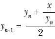

## 第五章：纯数学


算法的定量精确性使得它们自然适用于数学应用。在本章中，我们将探讨在纯数学中有用的算法，并讨论数学思想如何改善我们的算法。我们将从讨论连分数开始，这是一个严谨的话题，它将带领我们攀登无限的高峰，并赋予我们在混乱中找到秩序的能力。接着，我们将讨论平方根，这是一个更为平凡但无疑更有用的话题。最后，我们将讨论随机性，包括随机性的数学以及一些生成随机数的重要算法。

## 连分数

1597 年，伟大的约翰内斯·开普勒写到他认为几何学的“两个伟大宝藏”：毕达哥拉斯定理和一个后来被称为*黄金比例*的数字。黄金比例通常用希腊字母*phi*表示，约等于 1.618，而开普勒只是众多被它吸引的伟大思想家中的一位。像圆周率(pi)以及其他一些著名常数，如指数基数*e*，phi 也有一种倾向，常常出现在一些出乎意料的地方。人们在大自然中发现了 phi，并且费心记录它在美术作品中的出现，比如 Figure 5-1 中注释版的《罗克比维纳斯》。

在 Figure 5-1 中，一位 phi 爱好者添加了叠加图层，标示出某些长度的比率，如*b*/*a*和*d*/*c*，似乎等于 phi。许多伟大的画作的构图都适合进行这种 phi 狩猎。


Figure 5-1: Phi/Venus（来自*[`commons.wikimedia.org/wiki/File:DV_The_Toilet_of_Venus_Gr.jpg`](https://commons.wikimedia.org/wiki/File:DV_The_Toilet_of_Venus_Gr.jpg)*）

### 压缩与传递 phi

phi 的精确值出奇地难以表达。我可以说它等于 1.61803399...。这里的省略号是一种“作弊”方式；它意味着后面有更多的数字（实际上是无限多个数字），但我并没有告诉你这些数字是什么，因此你仍然不知道 phi 的精确值。

对于某些具有无限小数扩展的数字，一个分数可以精确表示它们。例如，数字 0.11111...等于 1/9——在这里，分数提供了一种简便的方法来表达无限连续小数的精确值。即使你不知道这种分数表示法，你也可以看到 0.1111...中重复 1 的模式，从而理解它的精确值。不幸的是，黄金比例是所谓的*无理数*，这意味着没有两个整数*x*和*y*，使得我们可以说 phi 等于*x*/*y*。而且，至今没有人能够辨认出它的数字中有任何规律。

我们有一个无限的小数展开式，既没有明显的规律，也没有分数表示。似乎不可能清楚地表达 phi 的精确值。但是，如果我们进一步了解 phi，就能找到一种既精确又简洁的表达方式。我们知道，phi 是这个方程的解：


我们可以设想一种表达 phi 精确值的方法，那就是写下“上面这段文字中所写方程的解”。这种方法既简洁又在技术上是精确的，但这意味着我们必须以某种方式求解该方程。而且，这种描述并没有告诉我们 phi 展开式中的第 200 位或第 500 位数字。

如果我们将方程除以 phi，我们得到以下结果：


如果我们重新排列该方程，我们得到：


现在，想象一下，如果我们尝试将这个方程奇异地代入自己：


这里，我们将右侧的 phi 重写为 1 + 1/phi。我们可以再次进行同样的代入，为什么不呢？


我们可以任意多次进行这种代入，没有终点。随着我们继续，phi 会被越来越多的层次“推入”一个不断增长的分数的角落。清单 5-1 显示了一个包含 phi 的七级表达式。


清单 5-1: 一个七级连分式，表示 phi 的值

如果我们想象继续这个过程，我们可以把 phi 推向无限层次。然后，剩下的部分在清单 5-2 中显示。


清单 5-2: 一个表达 phi 值的无限连分式

理论上，在由省略号表示的无穷多个 1 和加号以及分数线之后，我们应该在清单 5-2 中插入一个 phi，就像它在清单 5-1 的右下角出现的那样。但我们永远无法完成所有的 1（因为它们是无穷多个），因此我们完全可以忽略掉本应嵌套在右侧的 phi。

### 更多关于连分式的内容

刚才展示的表达式称为连分数。一个*连分数*由多个层次嵌套的和与倒数构成。连分数可以是有限的，比如列表 5-1 中的那个，在七层后就结束，或者是无限的，像列表 5-2 中的那个，无限延续下去。连分数特别适合我们的目的，因为它们让我们能够精确表示黄金比例的值，而无需砍伐无限的森林来制造足够的纸张。事实上，数学家有时会使用一种更简洁的表示法，让我们能够在一行中表示一个连分数。我们可以不写出所有连分数中的分数线，而使用方括号（[ ]）来表示我们正在处理一个连分数，并用分号将“孤立”的数字与组成分数的其他数字分开。通过这种方法，我们可以将黄金比例的连分数写成如下形式：


在这种情况下，省略号不再丢失信息，因为黄金比例的连分数有一个明确的模式：全是 1，所以我们知道它的第 100 项或第 1000 项是什么。这是数学向我们展示奇迹的一次：一种简洁地写下我们曾认为是无限的、没有规律的、难以言喻的数字的方法。但黄金比例并不是唯一可能的连分数。我们还可以写出另一个连分数，如下所示：


在这种情况下，在前几个数字之后，我们找到了一个简单的模式：一对对的 1 与逐渐增大的偶数交替。接下来的值将是 1、1、10、1、1、12，依此类推。我们可以用更常规的方式写出这个连分数的开头，如下所示：


事实上，这个神秘数字不就是我们老朋友*e*吗？它是自然对数的底数！常数*e*就像黄金比例和其他无理数一样，具有无限的小数展开，没有明显的规律，并且无法用有限的分数表示，似乎不可能简洁地表示其准确的数值。但通过使用新的连分数概念和新的简洁表示法，我们可以在一行中写出这些看似不可处理的数字。实际上，还有几种独特的方式可以使用连分数表示圆周率π。这是数据压缩的胜利。这也是秩序与混乱之间长期斗争的胜利：我们曾以为数字背后只有无休止的混乱，但我们发现，表面下总有一股深邃的秩序存在。

我们的黄金比例连分数来自一个只对黄金比例有效的特殊方程。但事实上，任何数字都可以生成连分数表示。

### 生成连分数的算法

要为任何数字找到连分数展开式，我们将使用一个算法。

对于已经是整数分数的数字，最容易找到连分数展开。例如，考虑求 105/33 的连分数表示。我们的目标是将这个数字表示为如下形式：


其中省略号可能指的是一个有限而非无限的延续。我们的算法将首先生成 *a*，然后是 *b*，再然后是 *c*，并依次处理字母表中的项，直到达到最终项或直到我们要求它停止。

如果我们将我们的例子 105/33 解释为除法问题，而非分数，我们发现 105/33 等于 3，余数为 6。我们可以将 105/33 重新写成 3 + 6/33：


该方程的左右两边都由一个整数（3 和 *a*）和一个分数（6/33 以及右侧其余部分）组成。我们得出结论，整数部分相等，因此 *a* = 3。之后，我们需要找到合适的 *b*、*c* 等，确保表达式的整个分数部分等于 6/33。

为了找到正确的 *b*、*c* 和其余部分，来看一下在得出 *a* = 3 后我们需要解决的内容：


如果我们对方程的两边取倒数，就得到以下方程：


我们现在的任务是找到 *b* 和 *c*。我们可以再次进行除法；33 除以 6 等于 5，余数为 3，因此我们可以将 33/6 重新写成 5 + 3/6：


我们可以看到，方程的两边都有一个整数（5 和 *b*）和一个分数（3/6 以及右侧其余部分）。我们可以得出结论，整数部分相等，因此 *b* = 5。我们已经得到了另一个字母，现在需要将 3/6 简化，以便进一步推进。如果你不能立刻看出 3/6 等于 1/2，你可以按照我们之前对 6/33 的处理方法：说 3/6 的倒数是 1/(6/3)，然后我们会发现 6/3 是 2，余数为 0。我们遵循的算法要求在余数为 0 时结束，因此我们会意识到过程已完成，并且可以像在 Listing 5-3 中那样写出完整的连分数。


Listing 5-3: 105/33 的连分数

如果你觉得这个通过反复除以两个整数来得到商和余数的过程有些熟悉，那应该没错。事实上，这正是我们在第二章的欧几里得算法中所遵循的相同过程！我们遵循相同的步骤，但记录不同的答案：对于欧几里得算法，我们记录最终的非零余数作为最后的答案，而在连分数生成算法中，我们记录了沿途的每个商（每个字母）。正如数学中常常发生的那样，我们发现了一个意外的联系——在本例中，是连分数生成与最大公约数发现之间的联系。

我们可以按如下方式在 Python 中实现这个连分数生成算法。

我们假设从一个 *x*/*y* 形式的分数开始。首先，我们决定 *x* 和 *y* 哪个更大，哪个更小：

```py
x = 105
y = 33
big = max(x,y)
small = min(x,y)
```

接下来，我们将较大的数除以较小的数，正如我们处理 105/33 时所做的那样。当我们发现结果是 3，余数是 6 时，我们得出结论，3 是连分数的第一个项（*a*）。我们可以将这个商存储如下：

```py
import math
output = []
quotient = math.floor(big/small)
output.append(quotient)
```

在这种情况下，我们已经准备好获取完整的字母表结果（*a*、*b*、*c* 等），因此我们创建一个空列表 `output`，并将我们的第一个结果附加到其中。

最后，我们必须重复该过程，就像我们对 33/6 执行的那样。记住，33 之前是`small`变量，但现在它变成了`big`，而除法过程的余数是新的`small`变量。由于余数总是小于除数，`big` 和 `small` 会始终正确标记。我们可以在 Python 中通过以下方式完成这一转换：

```py
new_small = big % small
big = small
small = new_small
```

到此为止，我们已经完成了一轮算法，现在需要对下一组数字（33 和 6）重复执行。为了简洁地完成这个过程，我们可以将其放入一个循环中，如清单 5-4 所示。

```py
import math
def continued_fraction(x,y,length_tolerance):
    output = []
    big = max(x,y)
    small = min(x,y)

 while small > 0 and len(output) < length_tolerance:
        quotient = math.floor(big/small)
        output.append(quotient)
        new_small = big % small
        big = small
        small = new_small
    return(output)
```

清单 5-4: 一个将分数表示为连分数的算法

在这里，我们将 *x* 和 *y* 作为输入，并定义了一个`length_tolerance`变量。记住，某些连分数是无限长的，而其他一些则非常长。通过在函数中加入一个`length_tolerance`变量，如果输出变得过于复杂，我们可以提前停止过程，从而避免陷入无限循环。

记住，当我们执行欧几里得算法时，我们使用了递归解法。而在这种情况下，我们则使用了 `while` 循环。递归非常适合欧几里得算法，因为它只需要在最后得到一个最终输出结果。然而，在这里，我们希望将一系列数字收集到一个列表中。循环更适合这种按顺序收集的任务。

我们可以按如下方式运行我们的新 `continued_fraction` 生成函数：

```py
print(continued_fraction(105,33,10))
```

我们将得到以下简单的输出：

```py
[3,5,2]
```

我们可以看到，这里的数字与清单 5-3 右侧的关键整数是相同的。

我们可能想要检查某个特定的连分数是否正确地表示了我们感兴趣的数字。为了做到这一点，我们应该定义一个`get_number()`函数，将连分数转换为十进制数，如清单 5-5 所示。

```py
def get_number(continued_fraction):
    index = -1
    number = continued_fraction[index]

    while abs(index) < len(continued_fraction):
        next = continued_fraction[index - 1]
        number = 1/number + next
        index -= 1
    return(number) 
```

清单 5-5: 将连分数转换为数字的十进制表示

我们不需要担心这个函数的细节，因为我们只是用它来检查我们的连分数。我们可以通过运行`get_number([3,5,2])`来检查该函数是否正常工作，看到输出结果是 3.181818 . . .，这就是另一种表示 105/33（我们最初的数字）的方法。

### 从小数到连分数

假设我们不是从某个*x*/*y*开始作为输入进入我们的连分数算法，而是从一个小数开始，例如 1.4142135623730951？我们需要做一些调整，但基本上可以沿用我们对分数所采取的相同过程。记住，我们的目标是找到*a*、*b*、*c*，以及接下来字母表中的其他字母，像下面这种类型的表达式：


找到*a*是最简单的，它就是小数点左边的数字部分。我们可以将这个`first_term`（我们方程中的*a*）和剩余部分定义如下：

```py
x = 1.4142135623730951
output = []
first_term = int(x)
leftover = x - int(x)
output.append(first_term)
```

就像之前一样，我们将连续的答案存储在一个名为`output`的列表中。

解决了*a*后，我们会有一个剩余部分，需要为其找到一个连分数表示：


同样，我们可以取这个数的倒数：


我们的下一个项*b*将是这个新项的小数点左边的整数部分——在这个例子中是 2。然后我们将重复这个过程：取倒数的小数部分，找到小数点左边的整数部分，以此类推。

在 Python 中，我们可以通过以下方式完成每一轮：

```py
next_term = math.floor(1/leftover)
leftover = 1/leftover - next_term
output.append(next_term)
```

我们可以将整个过程组合成一个函数，如清单 5-6 所示。

```py
def continued_fraction_decimal(x,error_tolerance,length_tolerance):
    output = []
    first_term = int(x)
    leftover = x - int(x)
    output.append(first_term)
    error = leftover
    while error > error_tolerance and len(output) <length_tolerance:
        next_term = math.floor(1/leftover)
        leftover = 1/leftover - next_term
        output.append(next_term)
        error = abs(get_number(output) - x)
    return(output)
```

清单 5-6: 从小数找到连分数

在这种情况下，我们像之前一样包含一个`length_tolerance`项。我们还添加了一个`error_tolerance`项，这使得我们能够在得到一个“足够接近”精确答案的近似值时退出算法。为了判断我们是否足够接近，我们计算`x`（我们想要逼近的数字）与我们已经计算出的连分数项的小数值之间的差异。为了获得这个小数值，我们可以使用我们在清单 5-5 中编写的`get_number()`函数。

我们可以很容易地尝试我们新的函数，方法如下：

```py
print(continued_fraction_decimal(1.4142135623730951,0.00001,100))
```

我们得到以下输出：

```py
[1, 2, 2, 2, 2, 2, 2, 2]
```

我们可以将这个连分数写成如下形式（使用近似等号，因为我们的连分数是一个近似值，存在微小误差，并且我们没有时间计算无限序列中每一项）：


请注意，在右边的分数中，沿对角线有 2。我们已经找到了另一个无限连分数的前七项，其无限展开式由所有的 2 组成。我们可以将它的连分数展开式写为[1,2,2,2,2,...]。这是√2 的连分数展开式，√2 是另一个不能表示为整数分数的无理数，它的十进制数字没有规律，但却有一个方便且易于记忆的连分数表示。

### 从分数到根式

如果你对连分数感兴趣，我推荐你阅读关于斯里尼瓦萨·拉马努金的资料，他在短暂的一生中，心灵穿越了无限的边缘，并为我们带回了一些宝贵的瑰宝。除了连分数，拉马努金还对*连根数*（也称为*嵌套根式*）感兴趣——例如，以下三个无限嵌套的根式：


和


和


结果发现，*x* = 2（这是一个古老的匿名结果），*y* = 3（拉马努金证明了这一点），而*z*不就是黄金比例 phi 吗！我鼓励你尝试在 Python 中构思一个生成嵌套根式表示的方法。平方根显然很有趣，如果我们将它们延伸到无限长，但实际上即使只考虑它们本身，它们也非常有趣。

## 平方根

我们理所当然地认为手持计算器是理所应当的，但当我们思考它们能做什么时，实际上它们非常令人印象深刻。例如，你可能记得在几何课上学习过，正弦是通过三角形的边长来定义的：角的对边的长度除以斜边的长度。但如果正弦是如此定义的，计算器如何有一个 sin 按钮来瞬间完成这个计算呢？计算器是不是在内部画出一个直角三角形，拿出一把尺子，测量各边的长度，然后再进行除法运算？我们可能会对平方根提出类似的问题：平方根是平方的逆运算，并且没有简单的封闭形式的算术公式，计算器如何使用呢？我想你已经能猜到答案：计算平方根有一个快速计算的算法。

### 巴比伦算法

假设我们需要找到一个数字*x*的平方根。像所有数学问题一样，我们可以尝试猜测并检查的策略。假设我们对*x*的平方根的最佳猜测是某个数字*y*。我们可以计算*y*²，如果它等于*x*，那么我们就完成了（成功实现了稀有的一步“幸运猜测算法”）。

如果我们的猜测 *y* 不完全是 *x* 的平方根，那么我们就需要再猜一次，我们希望下一次的猜测能更接近 *x* 的真实平方根值。巴比伦算法提供了一种系统地改进猜测的方法，直到我们逼近正确答案。这个算法很简单，只需要除法和平均操作：

1.  对 *x* 的平方根值做一个猜测 *y*。

1.  计算 *z* = *x*/*y*。

1.  计算 *z* 和 *y* 的平均值。这个平均值就是你新的 *y* 值，或者说你对 *x* 的平方根的新猜测值。

1.  重复步骤 2 和 3，直到 *y*² – *x* 足够小。

我们将巴比伦算法描述为四个步骤。相反，一位纯粹的数学家可能会将整个过程用一个方程表示：



在这种情况下，数学家会依赖于通过继续下标描述无限序列的常见数学做法，如：(*y*[1], *y*[2], . . . *y*[n], . . .)。如果你知道这个无限序列的第 *n* 项，你就可以从上面的方程中得到第 *n* + 1 项。这个序列会收敛到 ，换句话说，y[∞] = 。无论你更喜欢四步描述的清晰，方程的优雅简洁，还是我们将要编写的代码的实用性，这都是个人口味的问题，但了解描述算法的所有可能方式是很有帮助的。

如果你考虑这两个简单的情况，你就能理解为什么巴比伦算法有效：

+    所以 ，所以 。

    但请注意 。所以 *z*² > *x*。**这意味着** 。

+   * 所以 ，所以 。

    但请注意 。所以 *z*² < *x*。**这意味着** 。*

*我们可以通过去掉一些文本来简洁地表示这些情况：

+   

+   

如果 *y* 是正确值的低估值 ，那么 *z* 就是高估值。如果 *y* 是正确值的高估值 ，那么 *z* 就是低估值。巴比伦算法的步骤 3 要求我们计算一个高估值和一个低估值的平均值。低估值和高估值的平均值会比低估值高、比高估值低，因此它会比 *y* 或 *z* 中任何一个较差的猜测更接近真实值。最终，在多轮逐步改进我们的猜测后，我们会得到 ** 的真实值。

### Python 中的平方根

巴比伦算法在 Python 中并不难实现。我们可以定义一个函数，将`x`、`y`和一个`error_tolerance`变量作为参数。我们创建一个`while`循环，反复执行，直到我们的误差足够小。在每次`while`循环的迭代中，我们计算`z`，将`y`的值更新为`y`和`z`的平均值（就像算法中步骤 2 和步骤 3 描述的那样），并更新我们的误差，误差为*y*² – *x*。列表 5-7 展示了这个函数。

```py
def square_root(x,y,error_tolerance):
    our_error = error_tolerance * 2
    while(our_error > error_tolerance):
        z = x/y
        y = (y + z)/2
        our_error = y**2 - x
    return y
```

列表 5-7： 使用巴比伦算法计算平方根的函数

你可能会注意到，巴比伦算法与梯度上升法和外场算法有一些相似之处。它们都由小而迭代的步骤组成，直到接近最终目标。这是算法的一种常见结构。

我们可以按如下方式检查我们的平方根函数：

```py
print(square_root(5,1,.000000000000001))
```

我们可以看到数字 2.23606797749979 被打印在控制台中。你可以检查这是否与我们从 Python 标准的`math.sqrt()`方法中得到的相同数字：

```py
print(math.sqrt(5))
```

我们得到了完全相同的输出：2.23606797749979。我们成功地编写了自己的平方根计算函数。如果你曾被困在荒岛上，无法下载像`math`模块这样的 Python 模块，你可以放心地知道，你可以自己编写类似`math.sqrt()`的函数，并且你可以感谢巴比伦人，他们为我们提供了这个算法。

## 随机数生成器

到目前为止，我们已将混乱转化为秩序。数学擅长这一点，但在本节中，我们将考虑一个完全相反的目标：在秩序中寻找混乱。换句话说，我们将研究如何算法地创造随机性。

随机数的需求是常态。视频游戏依赖于随机选择的数字，以保持玩家对游戏角色的位置和移动感到惊讶。许多最强大的机器学习方法（包括随机森林和神经网络）在正常运作时都严重依赖随机选择。同样，强大的统计方法（如自助法）也依赖随机性，使得静态数据集更能像混乱的世界一样。公司和研究人员进行 A/B 测试，依赖随机分配被试者到不同条件，以便能够正确比较各条件的效果。这个清单还在继续；在大多数技术领域，对于随机性的需求巨大且持续。

### 随机性的可能性

随机数需求如此庞大的唯一问题是，我们不确定它们是否真正存在。有些人认为宇宙是决定论的：就像碰撞的台球一样，如果某物在运动，那么它的运动是由另一个完全可以追溯的运动引起的，而这个运动又是由另一个运动引起的，依此类推。如果宇宙像台球桌上的台球一样运作，那么通过了解宇宙中每个粒子的当前状态，我们就能确定宇宙的完整过去和未来。如果真是这样，那么任何事件——赢得彩票、在世界另一端偶遇失联多年的朋友、被陨石击中——实际上并非我们通常所认为的随机事件，而仅仅是宇宙在大约一百亿年前设定的完全预定结果。这意味着没有随机性，我们就像在一台玩家钢琴上听旋律，事情之所以看起来随机，只是因为我们对它们了解得不够多。

我们理解的物理学数学规则与决定论的宇宙是一致的，但它们也与一个非决定论的宇宙相符，在这个宇宙中确实存在随机性，正如一些人所说，神“掷骰子”。它们也与“多重宇宙”情景一致，在这种情景下，每一个事件的可能版本都会发生，但发生在不同的宇宙中，这些宇宙彼此不可接触。如果我们试图为自由意志在宇宙中找到一个位置，那么这些物理学定律的所有解释都会更加复杂。我们接受的数学物理学解释，并不取决于我们的数学理解，而是取决于我们的哲学倾向——任何立场在数学上都是可以接受的。

无论宇宙本身是否包含随机性，你的笔记本电脑是没有的——或者至少它不应该有。计算机是我们完美服从的仆人，它们只做我们明确指令的事情，按照我们指令的时间和方式去做。让计算机运行一个视频游戏、通过随机森林执行机器学习，或者进行一个随机化实验，就是让一台本应是决定性的机器生成某些非决定性的东西：一个随机数。这是一个不可能的请求。

由于计算机无法产生真正的随机性，我们设计了可以提供下一个最佳选择的算法：*伪随机性*。伪随机数生成算法之所以重要，是因为随机数的重要性。由于计算机上无法产生真正的随机性（而且在整个宇宙中也可能无法实现），伪随机数生成算法必须非常小心地设计，以便它们的输出尽可能地接近真正的随机性。我们判断一个伪随机数生成算法是否真正类似于随机性的标准，取决于我们将要探索的数学定义和理论。

我们从查看一个简单的伪随机数生成算法开始，检查它的输出在多大程度上看起来像随机。

### 线性同余生成器

最简单的*伪随机数生成器**(PRNG)*示例之一是*线性同余生成器**(LCG)*。要实现这个算法，你需要选择三个数字，我们将其称为*n*[1]、*n*[2]和*n*[3]。LCG 从某个自然数（比如 1）开始，然后简单地应用以下公式来得到下一个数字：


这是整个算法，可以说只需要一步。在 Python 中，我们会使用`%`代替*模*，并且我们可以像清单 5-8 中那样写出完整的 LCG 函数。

```py
def next_random(previous,n1,n2,n3):
    the_next = (previous * n1 + n2) % n3
    return(the_next)
```

清单 5-8: 一个线性同余生成器

请注意，`next_random()`函数是确定性的，这意味着如果我们输入相同的内容，我们总是会得到相同的输出。再一次，我们的 PRNG 必须是这样，因为计算机总是确定性的。LCG 并不会生成真正的随机数，而是生成看起来像随机数的数字，或者说是*伪随机数*。

为了评估这个算法生成伪随机数的能力，查看它的许多输出一起可能会有所帮助。我们可以通过编写一个函数，重复调用我们刚才创建的`next_random()`函数，来编译一个完整的列表，而不是一次得到一个随机数，代码如下：

```py
def list_random(n1,n2,n3):
    output = [1]
    while len(output) <=n3:
        output.append(next_random(output[len(output) - 1],n1,n2,n3))
    return(output)
```

考虑我们通过运行`list_random(29,23,32)`得到的列表：

```py
[1, 20, 27, 6, 5, 8, 31, 26, 9, 28, 3, 14, 13, 16, 7, 2, 17, 4, 11, 22, 21, 24, 15, 10, 25, 12, 19, 30, 29, 0, 23, 18, 1]
```

在这个列表中，很难检测到简单的模式，这正是我们想要的。我们能注意到的一件事是，它只包含介于 0 和 32 之间的数字。我们还可能注意到，这个列表的最后一个元素是 1，与第一个元素相同。如果我们想要更多的随机数，可以通过在最后一个元素 1 上调用`next_random()`函数来扩展这个列表。然而，请记住，`next_random()`函数是确定性的。如果我们扩展列表，我们得到的只是列表开头的重复，因为 1 之后的下一个“随机”数总是 20，20 之后的下一个随机数总是 27，依此类推。如果我们继续下去，最终会再次得到数字 1，整个列表会永远重复。我们在它们重复之前得到的独特值的数量称为我们 PRNG 的*周期*。在这种情况下，我们 LCG 的周期是 32。

### 评估 PRNG

这种随机数生成方法最终会开始重复是一个潜在的弱点，因为它允许人们预测接下来会发生什么，而这正是我们在寻求随机性的情况下不希望发生的事情。假设我们使用 LCG 来管理一个在线轮盘应用，这个轮盘有 32 个槽位。一位足智多谋的赌徒如果观察轮盘足够长的时间，可能会注意到中奖号码遵循着一个每 32 次旋转就会重复的规律，这样他们就可以通过押注他们现在确定每一轮都会赢的号码，赢得我们所有的钱。

足智多谋的赌徒试图在轮盘上赢钱的这个想法，对于评估任何 PRNG 都很有帮助。如果我们管理的是一个具有真实随机性的轮盘，没有赌徒能够可靠地赢钱。但是，任何微小的弱点或偏离真实随机性的地方，都可以被足够聪明的赌徒利用。即使我们为一个与轮盘无关的目的创建一个 PRNG，我们也可以问自己：“如果我用这个 PRNG 来管理一个轮盘应用，我会不会把所有的钱都输掉？”这个直观的“轮盘测试”是判断任何 PRNG 好坏的合理标准。如果我们从不进行超过 32 次旋转，我们的 LCG 可能会通过轮盘测试，但之后，赌徒可能会注意到输出的重复模式，并开始精准下注。我们 LCG 的短周期导致它未能通过轮盘测试。

因此，确保 PRNG 具有长周期是有帮助的。但在像只有 32 个槽位的轮盘这样的情况下，任何确定性算法的周期都不可能超过 32。因此，我们常常通过 PRNG 是否具有*完整周期*来评判，而不是它是否具有长周期。考虑我们通过生成`list_random(1,2,24)`得到的 PRNG：

```py
[1, 3, 5, 7, 9, 11, 13, 15, 17, 19, 21, 23, 1, 3, 5, 7, 9, 11, 13, 15, 17, 19, 21, 23, 1]
```

在这种情况下，周期是 12，这对于非常简单的用途来说可能已经足够长了，但它不是一个完整的周期，因为它没有涵盖其范围内的所有可能值。同样，足智多谋的赌徒可能会注意到，轮盘永远不会选择偶数（更不用说所选的奇数遵循的简单模式了），从而通过增加他们的投注来增加他们的收益，而我们则因此受损。

与完整周期的概念相关的是*均匀分布*的概念，我们的意思是，PRNG 范围内的每个数字被输出的可能性是相等的。如果我们运行`list_random(1,18,36)`，我们得到：

```py
[1, 19, 1, 19, 1, 19, 1, 19, 1, 19, 1, 19, 1, 19, 1, 19, 1, 19, 1, 19, 1, 19, 1, 19, 1, 19, 1, 19, 1, 19, 1, 19, 1, 19, 1, 19, 1]
```

在这里，1 和 19 每个被 PRNG 输出的概率是 50%，而其他数字的输出概率是 0%。一个轮盘玩家将非常容易利用这个不均匀的 PRNG。相比之下，在`list_random(29,23,32)`的情况下，我们发现每个数字被输出的概率大约是 3.1%。

我们可以看到，这些评判伪随机数生成器（PRNG）数学标准之间是有一定联系的：周期过短或不完整可能导致分布不均匀。从更实际的角度来看，这些数学属性之所以重要，是因为它们导致我们的轮盘应用程序亏损。更一般地说，伪随机数生成器的唯一重要测试就是是否可以在其中检测到模式。

不幸的是，检测模式的能力在数学或科学语言中很难简洁地描述。因此，我们寻找长周期、完整周期和均匀分布作为给我们提供关于模式检测线索的标志。但当然，它们并不是唯一能帮助我们检测模式的线索。考虑一下 LCG（线性同余生成器），它由`list_random(1,1,37)`表示。它输出以下列表：

```py
[1, 2, 3, 4, 5, 6, 7, 8, 9, 10, 11, 12, 13, 14, 15, 16, 17, 18, 19, 20, 21, 22, 23, 24, 25, 26, 27, 28, 29, 30, 31, 32, 33, 34, 35, 36, 0, 1]
```

这个生成器有一个长周期（37），一个完整周期（37），并且有均匀分布（每个数字出现的概率是 1/37）。然而，我们仍然可以在其中检测到模式（数字每轮增加 1，直到达到 36，然后从 0 重新开始）。它通过了我们设计的数学测试，但它显然没有通过轮盘测试。

### 随机性 Diehard 测试

没有单一的灵丹妙药测试能够指示一个伪随机数生成器（PRNG）是否存在可被利用的模式。研究人员设计了许多创造性的测试来评估一组随机数在多大程度上抵抗模式检测（或者换句话说，能否通过轮盘测试）。其中一组这样的测试被称为*Diehard*测试。Diehard 测试共有 12 个，每个测试以不同的方式评估一组随机数。通过所有 Diehard 测试的数字集被认为与真实随机性非常相似。Diehard 测试中的一个，叫做*重叠和测试*，对整个随机数列表进行处理，计算列表中连续数字部分的和。所有这些和的集合应当遵循数学上通常所称的*钟形曲线*模式。我们可以在 Python 中实现一个生成重叠和列表的函数，如下所示：

```py
def overlapping_sums(the_list,sum_length):
    length_of_list = len(the_list)
    the_list.extend(the_list)
    output = []
    for n in range(0,length_of_list):
        output.append(sum(the_list[n:(n + sum_length)]))
    return(output)
```

我们可以像这样在一个新的随机列表上运行这个测试：

```py
import matplotlib.pyplot as plt
overlap = overlapping_sums(list_random(211111,111112,300007),12)
plt.hist(overlap, 20, facecolor = 'blue', alpha = 0.5)
plt.title('Results of the Overlapping Sums Test')
plt.xlabel('Sum of Elements of Overlapping Consecutive Sections of List')
plt.ylabel('Frequency of Sum')
plt.show()
```

我们通过运行`list_random(211111,111112,300007)`创建了一个新的随机列表。这个新的随机列表足够长，可以使得重叠和测试表现得很好。此代码的输出是一个直方图，记录了观察到的和的频率。如果该列表类似于真正的随机集合，我们期望一些和较高，一些和较低，但大多数和应该接近可能值范围的中间。这正是我们在图表输出中看到的情况（图 5-2）。


图 5-2: LCG 的重叠和测试结果

如果你眯起眼睛，你会看到这个图像像一只钟。记住，Diehard 重叠求和测试说，如果我们的列表与钟形曲线高度相似，它就会通过，这是一个在数学上非常重要的曲线（见图 5-3）。


图 5-3: 钟形曲线，或高斯正态曲线（来源：维基共享资源）

像黄金比例一样，钟形曲线出现在数学和宇宙中的许多有时令人惊讶的地方。在这种情况下，我们将重叠求和测试结果与钟形曲线的高度相似解释为我们的伪随机数生成器（PRNG）类似于真正的随机性。

随机性深层数学的知识可以帮助你设计随机数生成器。然而，你仅凭常识，了解如何在轮盘赌中获胜，几乎也能做得很好。

### 线性反馈移位寄存器

线性同余生成器（LCGs）易于实现，但对于许多伪随机数生成器应用来说并不够复杂；一个精明的轮盘赌玩家可以很快破解 LCG。让我们看看一种更先进且可靠的算法类型，称为*线性反馈移位寄存器**（LFSRs）*，它可以作为伪随机数生成器算法高级研究的起点。

线性反馈移位寄存器（LFSRs）是在考虑计算机架构的情况下设计的。在计算机的最低层次，数据以一系列 0 和 1 的形式存储，这些 0 和 1 被称为*比特*。我们可以如图 5-4 所示，表示一个可能的 10 比特字符串。


图 5-4: 10 比特字符串

从这些比特开始，我们可以通过一个简单的 LFSR 算法继续。我们首先计算一组比特的简单和——例如，第 4 位、第 6 位、第 8 位和第 10 位的和（我们也可以选择其他子集）。在这种情况下，这个和是 3。我们的计算机架构只能存储 0 和 1，所以我们将和对 2 取模，最终得到 1 作为我们的最终和。然后，我们删除最右边的比特，并将其余所有比特向右移动一位（见图 5-5）。


图 5-5: 删除并移位后的比特

由于我们删除了一个比特并将所有比特向右移动，我们会在应该插入新比特的位置上留下一个空位。我们在这里插入的比特就是我们之前计算的和。插入之后，我们得到了新的比特状态（见图 5-6）。


图 5-6: 用选定比特和替换后的比特

我们将从右侧删除的比特作为算法的输出，即这个算法应该生成的伪随机数。现在我们有了一组新的 10 个有序比特，我们可以再次运行算法，像之前一样得到一个新的伪随机比特。我们可以根据需要重复这个过程。

在 Python 中，我们可以相对简单地实现反馈移位寄存器。我们不会直接覆盖硬盘上的单个位，而是创建一个类似下面的位列表：

```py
bits = [1,1,1]
```

我们可以用一行代码定义指定位置的位的总和。我们将其存储在名为`xor_result`的变量中，因为对和取模 2 也叫做*异或*或*XOR 操作*。如果你学过形式逻辑，可能会遇到 XOR，它有一个逻辑定义和一个等价的数学定义；在这里我们将使用数学定义。由于我们处理的是一个短位串，我们不对第 4、6、8 和 10 位求和（因为这些位不存在），而是对第 2 位和第 3 位求和：

```py
xor_result = (bits[1] + bits[2]) % 2
```

然后，我们可以轻松地用 Python 的`pop()`函数取出位列表中的最右侧元素，将结果存储在名为`output`的变量中：

```py
output = bits.pop()
```

然后，我们可以使用`insert()`函数插入我们的和，指定位置为 0，因为我们希望它位于列表的左侧：

```py
bits.insert(0,xor_result)
```

现在让我们把这些内容汇总到一个函数中，该函数将返回两个输出：一个伪随机位和`bits`序列的新状态（Listing 5-9）。

```py
def feedback_shift(bits):
    xor_result = (bits[1] + bits[2]) % 2
    output = bits.pop()
    bits.insert(0,xor_result)
    return(bits,output)
```

Listing 5-9: 实现 LFSR 的函数，完成我们本节的目标

就像我们在 LCG 中做的那样，我们可以创建一个函数，生成我们所有输出位的列表：

```py
def feedback_shift_list(bits_this):
    bits_output = [bits_this.copy()]
    random_output = []
    bits_next = bits_this.copy()
 while(len(bits_output) < 2**len(bits_this)):
        bits_next,next = feedback_shift(bits_next)
        bits_output.append(bits_next.copy())
        random_output.append(next)
    return(bits_output,random_output)
```

在这种情况下，我们运行`while`循环直到预期序列重复。由于我们的位列表有 2³ = 8 种可能的状态，我们可以预计周期最多为 8。实际上，LFSR 通常不能输出一整套零值，因此实际上我们预计周期最多为 2³ – 1 = 7。我们可以运行以下代码来查找所有可能的输出并检查周期：

```py
bitslist = feedback_shift_list([1,1,1])[0]
```

果然，我们存储在`bitslist`中的输出是：

```py
[[1, 1, 1], [0, 1, 1], [0, 0, 1], [1, 0, 0], [0, 1, 0], [1, 0, 1], [1, 1, 0], [1, 1, 1]]
```

我们可以看到我们的 LFSR 输出了所有七种可能的非零位串。我们拥有一个周期完整的 LFSR，同时也有一个显示输出均匀分布的 LFSR。如果我们使用更多的输入位，最大可能的周期会呈指数增长：使用 10 个位时，最大可能的周期是 2¹⁰– 1 = 1023，使用 20 个位时，最大可能的周期是 2²⁰ – 1=1,048,575。

我们可以通过以下方式检查我们简单的 LFSR 生成的伪随机位列表：

```py
pseudorandom_bits = feedback_shift_list([1,1,1])[1]
```

我们存储在`pseudorandom_bits`中的输出看起来相当随机，考虑到我们的 LFSR 及其输入有多简单：

```py
[1, 1, 1, 0, 0, 1, 0]
```

LFSR（线性反馈移位寄存器）用于生成伪随机数，在多种应用中，包括白噪声。我们在此介绍它们，以便让你体验高级伪随机数生成器（PRNG）的概念。目前在实践中最广泛使用的 PRNG 是*Mersenne Twister*，它是经过修改的、广义的反馈移位寄存器——本质上是一个比这里展示的 LFSR 更为复杂的版本。如果你继续深入学习 PRNG，你会遇到大量的复杂性和高级数学，但这一切都将基于这里介绍的思想：确定性的数学公式，这些公式能够通过严格的数学测试显示出类随机性。

## 总结

数学和算法总是密切相关的。你越深入一个领域，就越能为掌握另一个领域的高级概念做好准备。数学可能看起来深奥且不切实际，但它是一个长远的过程：数学的理论进展有时需要几百年后才能转化为实际技术。在本章中，我们讨论了连分数以及生成任何数字的连分数表示的算法。我们还讨论了平方根，并研究了手持计算器用来计算平方根的算法。最后，我们讨论了随机性，包括生成伪随机数的两个算法，以及我们可以用来评估声称是随机的列表的数学原理。

在下一章中，我们将讨论优化，包括一种你可以用来环游世界或锻造剑的强大方法。*
