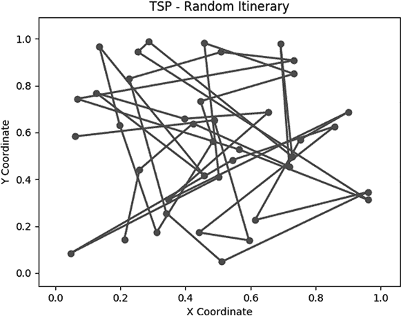
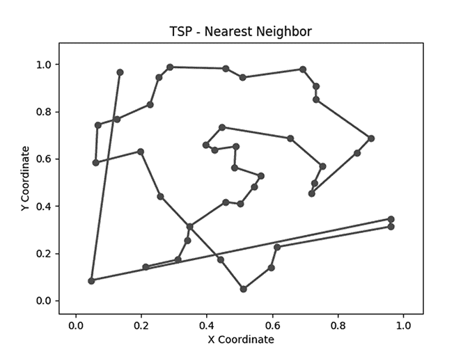
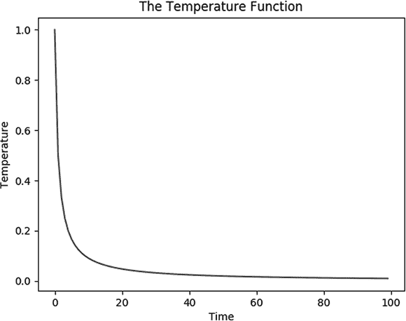
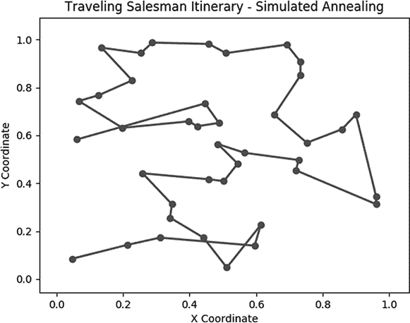

## 第六章：高级优化


你已经了解了优化。在第三章中，我们介绍了梯度上升/下降方法，它帮助我们“爬坡”以找到最大值或最小值。任何优化问题都可以看作是爬坡问题：我们努力从大量可能性中找到最佳的结果。梯度上升工具简单且优雅，但它有一个致命缺点：它可能会引导我们找到一个局部最优解，而非全局最优解。在爬坡的比喻中，它可能会把我们带到一个小山丘的顶部，而事实上，稍微下坡一点就能让我们开始攀登真正想要登上的大山。解决这个问题是高级优化中的最困难也是最关键的方面。

在本章中，我们将通过一个案例研究讨论一种更先进的优化算法。我们将考虑旅行推销员问题，以及其几种可能的解决方案及其缺点。最后，我们将介绍模拟退火算法，这是一种克服这些缺点的高级优化算法，能够进行全局优化，而不仅仅是局部优化。

## 推销员的生活

*旅行推销员问题（TSP）*是计算机科学和组合学中极为著名的问题。假设一个旅行推销员希望拜访多个城市来兜售商品。由于多种原因——失去的收入机会、汽车油费、长时间旅行后的头痛（图 6-1）——城市之间的旅行成本很高。


图 6-1: 那不勒斯的旅行推销员

TSP 要求我们确定城市之间的旅行顺序，以最小化旅行成本。像所有科学领域中的最佳问题一样，陈述起来很容易，但解决起来极其困难。

### 问题设置

让我们启动 Python 并开始探索。首先，我们将随机生成一张地图供我们的推销员穿越。我们从选择一个数字*N*开始，这个数字代表我们想要在地图上设置的城市数量。假设*N* = 40。接着我们将选择 40 组坐标：每个城市一个*x*值和一个*y*值。我们将使用`numpy`模块来进行随机选择：

```py
import numpy as np
random_seed = 1729
np.random.seed(random_seed)
N = 40
x = np.random.rand(N)
y = np.random.rand(N)
```

在这个代码片段中，我们使用了`numpy`模块的`random.seed()`方法。这个方法接受你传入的任何数字，并将该数字作为“种子”来初始化其伪随机数生成算法（更多关于伪随机数生成的内容，请参见第五章）。这意味着如果你使用与我们在前面的代码片段中使用的相同的种子，你将生成与我们在这里生成的随机数相同，这样就更容易跟随代码，你也将得到与我们相同的图表和结果。

接下来，我们将把*x*值和*y*值配对在一起，创建一个`cities`列表，包含每个我们随机生成的 40 个城市位置的坐标对。

```py
points = zip(x,y)
cities = list(points)
```

如果你在 Python 控制台中运行`print(cities)`，你可以看到一个包含随机生成点的列表。这些点中的每一个代表一个城市。我们不会特意给任何城市命名，而是可以将第一个城市称为`cities[0]`，第二个城市称为`cities[1]`，依此类推。

我们已经拥有了解决 TSP 问题所需的一切。我们首先提出的解法将是按`cities`列表中出现的顺序依次访问所有城市。我们可以定义一个`itinerary`变量，将这个顺序以列表形式存储：

```py
itinerary = list(range(0,N))
```

这仅仅是另一种写法：

```py
itinerary = [0,1,2,3,4,5,6,7,8,9,10,11,12,13,14,15,16,17,18,19,20,21,22,23,24,25,26,27,28,29, \30,31,32,33,34,35,36,37,38,39]
```

我们行程中的数字顺序就是我们建议访问城市的顺序：首先是城市 0，然后是城市 1，依此类推。

接下来，我们需要判断这个行程并决定它是否是一个好的，或者至少是可接受的 TSP（旅行商问题）解法。记住，TSP 的核心目的是最小化销售员在各城市之间旅行时所面临的成本。那么，旅行的成本是什么呢？我们可以指定任何我们想要的成本函数：也许某些道路的交通比其他道路更拥堵，也许有些河流很难跨越，或者也许向北旅行比向东旅行更困难，反之亦然。但让我们从简单开始：假设旅行 1 个单位的距离需要 1 美元，无论方向如何，也无论我们在两个城市之间旅行。由于我们的算法在不论是英里、公里还是光年之间旅行时都能以相同的方式工作，本章中我们不会指定任何距离单位。在这种情况下，最小化成本就等同于最小化所旅行的距离。

为了确定特定行程所需的距离，我们需要定义两个新函数。首先，我们需要一个函数来生成一组连接所有点的线。接着，我们需要将这些线所代表的距离加总起来。我们可以从定义一个空列表开始，用来存储关于我们线路的信息：

```py
lines = []
```

接下来，我们可以遍历行程中的每个城市，在每一步将一条新线添加到`lines`集合中，连接当前城市和下一个城市。

```py
for j in range(0,len(itinerary) - 1):
    lines.append([cities[itinerary[j]],cities[itinerary[j + 1]]])
```

如果你运行`print(lines)`，你可以看到我们在 Python 中如何存储关于线路的信息。每一条线作为一个列表存储，其中包含两座城市的坐标。例如，你可以通过运行`print(lines[0])`来查看第一条线，它会显示以下输出：

```py
[(0.21215859519373315, 0.1421890509660515), (0.25901824052776146, 0.4415438502354807)]
```

我们可以将这些元素整合成一个名为`genlines`的函数（"generate lines"的缩写），它接受`cities`和`itinerary`作为参数，并返回一个集合，这个集合包含按行程指定顺序连接每座城市的线：

```py
def genlines(cities,itinerary):
    lines = []
    for j in range(0,len(itinerary) - 1):
        lines.append([cities[itinerary[j]],cities[itinerary[j + 1]]])
    return(lines)
```

现在我们有了一个生成城市间连接线的方式，可以创建一个函数来计算沿这些线的总距离。它将从将总距离定义为 0 开始，然后对 `lines` 列表中的每个元素，都会将该线的长度加到 `distance` 变量中。我们将使用勾股定理来计算这些线的长度。

```py
import math
def howfar(lines):
    distance = 0
    for j in range(0,len(lines)):
        distance += math.sqrt(abs(lines[j][1][0] - lines[j][0][0])**2 + \
        abs(lines[j][1][1] - lines[j][0][1])**2)
    return(distance)
```

这个函数以一组线为输入，输出所有线段长度的总和。现在我们有了这些函数，我们可以将它们与我们的行程安排一起调用，以确定销售员需要行进的总距离：

```py
totaldistance = howfar(genlines(cities,itinerary))
print(totaldistance)
```

当我运行这段代码时，我发现 `totaldistance` 大约是 16.81。如果你使用相同的随机种子，应该得到相同的结果。如果使用不同的种子或城市集，结果会略有不同。

为了更好地理解这个结果，帮助我们绘制行程安排会更有意义。为此，我们可以创建一个 `plotitinerary()` 函数：

```py
import matplotlib.collections as mc
import matplotlib.pylab as pl
def plotitinerary(cities,itin,plottitle,thename):
    lc = mc.LineCollection(genlines(cities,itin), linewidths=2)
    fig, ax = pl.subplots()
    ax.add_collection(lc)
    ax.autoscale()
    ax.margins(0.1)
    pl.scatter(x, y)
    pl.title(plottitle)
    pl.xlabel('X Coordinate')
    pl.ylabel('Y Coordinate')
    pl.savefig(str(thename) + '.png')
    pl.close()
```

`plotitinerary()` 函数接受 `cities`、`itin`、`plottitle` 和 `thename` 作为参数，其中 `cities` 是我们城市的列表，`itin` 是我们想要绘制的行程安排，`plottitle` 是显示在图表顶部的标题，`thename` 是我们给 `png` 输出图像命名的名称。该函数使用 `pylab` 模块进行绘图，并使用 matplotlib 的 `collections` 模块来创建一组线条。然后它绘制了行程安排的点和我们连接这些点所创建的线条。

如果你使用 `plotitinerary(cities,itinerary,'TSP - Random Itinerary','figure2')` 来绘制行程安排，你将生成如图 6-2 所示的图表。



图 6-2: 访问按随机顺序生成的城市所得到的行程安排

也许你仅凭 图 6-2 就能看出，我们还没有找到最优的旅行商问题解决方案。我们给可怜的销售员安排的行程让他多次横穿地图，去到一个非常远的城市，而显然他可以通过在途中停靠其他城市来做得更好。本章接下来的目标是使用算法找到一个最短的行程安排。

我们将讨论的第一个潜在解决方案是最简单的，但它的性能最差。之后，我们将讨论一些解决方案，它们通过增加一些复杂性来换取显著的性能提升。

### 智力与力量的对决

你可能会想到列出所有可能的行程安排，以便连接我们的城市并逐一评估它们，看看哪一个最优。如果我们要访问三个城市，以下是它们可以被访问的所有顺序的详尽列表：

+   1, 2, 3

+   1, 3, 2

+   2, 3, 1

+   2, 1, 3

+   3, 1, 2

+   3, 2, 1

评估哪种方法最优不应该花费太长时间，只需要逐一测量每个长度并比较所得结果。这被称为*暴力破解*解决方案。它指的不是物理上的力量，而是通过使用我们 CPU 的“蛮力”来检查一个详尽的列表，而不是依赖于算法设计者的智慧，后者可以找到一个更优雅、运行更快的方法。

有时候，暴力破解的解决方案恰恰是最合适的方法。它们通常容易编写代码，并且运行可靠。它们的主要缺点是运行时间，通常没有比算法解决方案更好，甚至通常更差。

在 TSP（旅行商问题）中，所需的运行时间增长得太快，以至于对于超过大约 20 座城市的情况，暴力破解解决方案就不再实际。为了说明这一点，考虑以下论点：如果我们处理的是四座城市，并试图找到所有可能的访问顺序，需要检查多少种可能的行程：

1.  当我们选择第一座城市时，我们有四个选择，因为总共有四座城市，而我们还没有访问过其中任何一座。因此，选择第一座城市的总方式数是 4。

1.  当我们选择第二座城市时，我们有三个选择，因为总共有四座城市，而我们已经访问了其中一座。因此，选择前两座城市的总方式数是 4 × 3 = 12。

1.  当我们选择第三座城市时，我们有两个选择，因为总共有四座城市，而我们已经访问了其中两座。因此，选择前三座城市的总方式数是 4 × 3 × 2 = 24。

1.  当我们选择第四座城市时，只有一个选择，因为总共有四座城市，而我们已经访问了其中三座。因此，选择所有四座城市的总方式数是 4 × 3 × 2 × 1 = 24。

你应该注意到这里的规律：当我们有*N*座城市要访问时，所有可能的行程总数是 N × (N–1) × (N–2) × . . . × 3 × 2 × 1，也就是*N!*（“*N*阶乘”）。阶乘函数增长得非常快：虽然 3!仅为 6（我们甚至可以不用电脑就能暴力破解），但我们发现 10!已经超过 300 万（在现代计算机上很容易暴力破解），而 18!超过 6 千兆，25!超过 15 千兆，35!及以上则开始接近今天技术下暴力破解的极限，考虑到宇宙的寿命预期。

这种现象称为*组合爆炸*。组合爆炸没有严格的数学定义，但它指的是像这样的情况：看似小的集合，在考虑组合和排列时，会导致远远超出原集合大小的选择数量，且超出我们使用暴力破解可以处理的范围。

例如，连接罗德岛 90 个邮政编码的所有可能行程数量，比宇宙中估算的原子数量要大得多，尽管罗德岛比宇宙要小得多。类似地，尽管棋盘比罗德岛还小，但一个棋盘能够进行的可能棋局数量也比宇宙中原子数量要多。这些看似矛盾的情况——在有限的事物中迸发出几乎无限的可能性——使得良好的算法设计变得更加重要，因为暴力搜索永远无法解决最难的问题。组合爆炸意味着我们必须考虑解决 TSP（旅行商问题）的算法方案，因为全世界的 CPU 都不足以计算暴力破解的解决方案。

### 最近邻算法

接下来，我们将考虑一种简单直观的方法，称为*最近邻*算法。我们从列表中的第一个城市开始。然后，我们简单地找到与第一个城市最接近的未访问城市，并将该城市作为第二个城市访问。在每一步，我们只需要查看当前位置，并选择最近的未访问城市作为下一个行程城市。虽然这种方法可能不会最小化总的旅行距离，但它在每一步都会最小化旅行距离。请注意，我们不是像暴力搜索那样查看所有可能的行程，而是每次只找到最近的邻居。这使得即使对于非常大的*N*，我们的运行时间也非常快。

### 实现最近邻搜索

我们将从编写一个可以找到任何给定城市最近邻的函数开始。假设我们有一个名为`point`的点和一个名为`cities`的城市列表。`point`和`cities`中第`j`个城市之间的距离由以下毕达哥拉斯式公式给出：

```py
point = [0.5,0.5]
j = 10
distance = math.sqrt((point[0] - cities[j][0])**2 + (point[1] - cities[j][1])**2)
```

如果我们想找出`cities`中哪个元素最接近我们的`point`（即`point`的最近邻城市），我们需要遍历`cities`中的每个元素，检查`point`与每个城市之间的距离，如清单 6-1 所示。

```py
def findnearest(cities,idx,nnitinerary):
    point = cities[idx]
    mindistance = float('inf')
    minidx = - 1
    for j in range(0,len(cities)):
        distance = math.sqrt((point[0] - cities[j][0])**2 + (point[1] - cities[j][1])**2)
        if distance < mindistance and distance > 0 and j not in nnitinerary:
            mindistance = distance
            minidx = j
    return(minidx)
```

清单 6-1: `findnearest()`函数，找到给定城市的最近邻城市

在我们拥有了`findnearest()`函数之后，我们就准备好实现最近邻算法了。我们的目标是创建一个名为`nnitinerary`的行程。我们将从假设`cities`中的第一个城市是我们的销售员出发的地方开始：

```py
nnitinerary = [0]
```

如果我们的行程需要有*N*个城市，我们的目标是遍历从 0 到*N*–1 之间的所有数字，找到每个数字对应的最近邻城市（即我们最近访问的城市的邻近城市），并将这个城市添加到我们的行程中。我们将通过清单 6-2 中的`donn()`函数（即“do nearest neighbor”的缩写）来实现这一点。它从`cities`中的第一个城市开始，在每一步将最接近最近添加的城市的城市添加到行程中，直到所有城市都被添加到行程中。

```py
def donn(cities,N):
    nnitinerary = [0]
    for j in range(0,N - 1):
        next = findnearest(cities,nnitinerary[len(nnitinerary) - 1],nnitinerary)
        nnitinerary.append(next)
    return(nnitinerary)
```

列表 6-2: 一个函数，依次找到每个城市的最近邻并返回完整的行程

我们已经拥有检查最近邻算法性能所需的所有内容。首先，我们可以绘制最近邻行程：

```py
plotitinerary(cities,donn(cities,N),'TSP - Nearest Neighbor','figure3')
```

图 6-3 显示了我们得到的结果。



图 6-3: 最近邻算法生成的行程

我们还可以检查使用这个新行程时，销售员需要走多远：

```py
print(howfar(genlines(cities,donn(cities,N))))
```

在这种情况下，我们发现，尽管销售员沿着随机路径行驶了 16.81 的距离，但我们的算法将距离减少到了 6.29。记住，我们没有使用单位，因此我们可以将其解释为 6.29 英里（或公里或秒差距）。重要的是，这个距离小于我们从随机行程中找到的 16.81 英里、公里或秒差距。这是一个显著的改进，完全来自于一个非常简单、直观的算法。在图 6-3 中，性能的提升非常明显；往返地图两端的行程减少了，更多的是在彼此接近的城市之间的短途旅行。

### 检查进一步改进

如果你仔细看图 6-2 或图 6-3，你可能能想象出一些可以改进的地方。你甚至可以尝试这些改进，并使用我们的`howfar()`函数检查它们是否有效。例如，也许你看了我们的初始随机行程：

```py
initial_itinerary = [0,1,2,3,4,5,6,7,8,9,10,11,12,13,14,15,16,17,18,19,20,21,22,23,24,25,26, \27,28,29,30,31,32,33,34,35,36,37,38,39]
```

你认为通过交换销售员访问城市 6 和城市 30 的顺序，可以改进行程。你可以通过定义这个新行程并交换这两个城市的顺序来进行交换（用粗体显示）：

```py
new_itinerary = [0,1,2,3,4,5**,30,**7,8,9,10,11,12,13,14,15,16,17,18,19,20,21,22,23,24,25,26,27, \28,29**,6,**31,32,33,34,35,36,37,38,39]
```

然后我们可以做一个简单的比较，检查我们执行的交换是否减少了总距离：

```py
print(howfar(genlines(cities,initial_itinerary)))
print(howfar(genlines(cities,new_itinerary)))
```

如果`new_itinerary`比`initial_itinerary`更好，我们可能想丢弃`initial_itinerary`并保留新的行程。在这种情况下，我们发现新行程的总距离大约为 16.79，比我们最初的行程略有改进。在找到一个小的改进后，我们可以再次执行相同的过程：选择两个城市，交换它们在行程中的位置，然后检查距离是否减少。我们可以无限期地继续这个过程，每一步都有合理的机会找到减少旅行距离的方法。在重复这个过程多次后，我们可以（希望）得到一个总距离非常低的行程。

编写一个可以自动执行这个交换和检查过程的函数非常简单（列表 6-3）：

```py
def perturb(cities,itinerary):
    neighborids1 = math.floor(np.random.rand() * (len(itinerary)))
    neighborids2 = math.floor(np.random.rand() * (len(itinerary)))

    itinerary2 = itinerary.copy()

    itinerary2[neighborids1] = itinerary[neighborids2]
    itinerary2[neighborids2] = itinerary[neighborids1]

    distance1 = howfar(genlines(cities,itinerary))
    distance2 = howfar(genlines(cities,itinerary2))

    itinerarytoreturn = itinerary.copy()

    if(distance1 > distance2):
        itinerarytoreturn = itinerary2.copy()

    return(itinerarytoreturn.copy())
```

列表 6-3: 一个函数，对行程做出小的改变，将其与原始行程进行比较，并返回较短的行程

`perturb()`函数接受任意城市列表和行程作为参数。然后，它定义了两个变量：`neighborids1`和`neighborids2`，这两个变量是从 0 到行程长度之间随机选取的整数。接下来，它创建一个新的行程`itinerary2`，该行程与原始行程相同，唯一不同的是，`neighborids1`和`neighborids2`的城市交换了位置。然后，它计算`distance1`，即原始行程的总距离，以及`distance2`，即`itinerary2`的总距离。如果`distance2`小于`distance1`，则返回新的行程（包含交换）。否则，返回原始行程。因此，我们将行程传递给该函数，它总是返回一个与我们传入的行程一样好或者更好的行程。我们称这个函数为`perturb()`，因为它通过扰动给定的行程来尝试改进它。

现在我们有了`perturb()`函数，让我们在一个随机行程上反复调用它。实际上，我们不仅仅调用一次，而是调用 200 万次，尝试获得尽可能低的旅行距离：

```py
itinerary = [0,1,2,3,4,5,6,7,8,9,10,11,12,13,14,15,16,17,18,19,20,21,22,23,24,25,26,27,28,29, \30,31,32,33,34,35,36,37,38,39]

np.random.seed(random_seed)
itinerary_ps = itinerary.copy()
for n in range(0,len(itinerary) * 50000):
    itinerary_ps = perturb(cities,itinerary_ps)

print(howfar(genlines(cities,itinerary_ps)))
```

我们刚刚实现的东西可以称为*扰动搜索*算法。它通过成千上万的可能行程进行搜索，希望找到一个好的行程，就像暴力搜索一样。然而，它更好，因为暴力搜索会毫无差别地考虑每一个可能的行程，而这个算法是一个*引导搜索*，它考虑的是一组旅行距离逐渐减少的行程，因此它应该比暴力搜索更快找到一个好的解决方案。我们只需要对这个扰动搜索算法做一些小的改进，就可以实现模拟退火算法，这是本章的重点算法。

在我们进入模拟退火的代码之前，我们先来回顾一下它相对于我们目前讨论的算法提供了什么样的改进。我们还想介绍一个温度函数，允许我们在 Python 中实现模拟退火的特性。

### **贪婪算法**的算法

到目前为止，我们考虑过的最近邻和扰动搜索算法属于一种叫做*贪婪*算法的类别。贪婪算法按照步骤进行，每一步都做出局部最优的选择，但一旦考虑所有步骤，可能并不是全局最优的。在我们的最近邻算法中，在每一步，我们都寻找距离当前步骤最近的城市，而不考虑其他城市。访问最近的城市是局部最优的，因为它最小化了我们当前步骤的行程距离。然而，由于它没有同时考虑所有城市，可能并不是全局最优的——它可能会引导我们沿着地图上的奇怪路径行进，最终使得整体行程变得非常长，并且对推销员来说非常昂贵，尽管每个单独的步骤看起来都很合理。

“贪心”指的是这种局部优化决策过程的目光短浅性。我们可以通过尝试在复杂的山地地形中寻找最高点的问题来理解这些贪心的优化方法，其中“高”点类似于更好、更优化的解决方案（TSP 中的短距离），而“低”点则类似于更差、次优的解决方案（TSP 中的长距离）。在山地中寻找最高点的贪心方法是始终向上走，但这可能会让我们只到达一个小山坡的顶端，而不是最高山峰的顶端。有时候，最好是下到山坡的底部，从而开始更重要的登顶之旅。因为贪心算法只关注局部优化，它们永远不会允许我们下行，并可能让我们陷入局部极值。这正是第三章讨论的问题。

在了解这一点后，我们终于准备好引入一个可以帮助我们解决由贪心算法引起的局部优化问题的想法。这个想法就是放弃始终上升的单纯承诺。在旅行商问题（TSP）中，我们有时可能需要扰动到更差的路径，这样我们就能在后期找到最佳路径，就像我们为了最终爬上山顶，有时需要下到山脚一样。换句话说，为了最终做得更好，我们一开始必须做得更差。

### 引入温度函数

以做得更差为初衷，最终实现做得更好，这是一个微妙的过程。如果我们在愿意做得更差的态度上过于急功近，我们可能会在每一步都往下走，最终陷入低谷，而不是达到高峰。我们需要找到一种方法，只在少数情况下、偶尔地、并且在学习如何最终做得更好的背景下做得更差。

再次想象一下，我们身处复杂的山地地形中。我们在下午晚些时候开始，知道自己有两个小时的时间去找到整个地形的最高点。假设我们没有手表来跟踪时间，但我们知道傍晚空气逐渐变凉，因此我们决定利用温度来大致判断自己剩余的时间，以便找到最高点。

在我们开始的两个小时里，当外面相对较热时，我们自然会更开放于创造性探索。因为我们还有很长的时间，所以稍微向下走一点以更好地了解地形、看到一些新地方，并不是很大的风险。但随着气温变凉，我们接近两个小时的结束时，我们将变得不那么开放于广泛的探索。我们会更加专注于改进，减少了向下走的意愿。

花点时间思考一下这个策略，以及为什么它是到达最高点的最佳方式。我们已经讨论过为什么我们偶尔要向下走：这样我们可以避免“局部最优解”，或者说在巨大山脉旁边的小山顶。但是我们应该在什么时候下去呢？考虑我们两小时时间段的最后 10 秒。无论我们身处何处，我们应该尽可能直接向上走。因为即使我们发现了一个有前景的山峰，最后 10 秒也没有时间去爬它；如果我们在最后 10 秒时犯错并滑下来，也没有时间去纠正它。因此，最后 10 秒应该是我们直接向上走，而不考虑下去的时刻。

相比之下，考虑我们两小时时间段的前 10 秒。在那段时间里，不必急于直接向上走。一开始，我们可以通过稍微向下探索来学到最多的东西。如果我们在前 10 秒犯错，之后还有充足的时间来纠正。我们会有足够的时间利用我们所学到的任何东西，或者发现的任何山峰。在前 10 秒，我们应该最开放地考虑向下走，而对直接向上走的热情最小。

你可以通过思考相同的想法来理解剩余的两小时。如果我们考虑结束前 10 分钟的时间，我们将会有一个比结束前 10 秒更为温和的心态。由于结束临近，我们会被激励直接向上。但 10 分钟比 10 秒要长，因此我们对稍微向下探索还是有一定的开放性，以防我们发现有前景的东西。依此类推，开始后的 10 分钟将使我们形成一个比开始后 10 秒更温和的心态。整个两小时的时间段会呈现出一种意图的梯度：一开始愿意偶尔向下探索，随后逐渐增强的仅向上的热情。

为了在 Python 中模拟这个场景，我们可以定义一个函数。我们从一个较热的温度和愿意探索并向下走的心态开始，最终以较冷的温度和不愿意向下走的心态结束。我们的温度函数相对简单。它以 `t` 作为参数，其中 `t` 代表时间：

```py
temperature = lambda t: 1/(t + 1)
```

你可以通过在 Python 控制台中运行以下代码来查看温度函数的简单图形。该代码首先导入`matplotlib`功能，然后定义变量`ts`，它包含从 1 到 100 的`t`值范围。最后，它绘制了与每个`t`值相关的温度图形。同样，我们不关心单位或确切的数值，因为这是一个假设情境，目的是展示降温函数的大致形状。因此，我们用 1 表示最高温度，用 0 表示最低温度，用 0 表示最短时间，用 99 表示最长时间，而不指定单位。

```py
import matplotlib.pyplot as plt
ts = list(range(0,100))
plt.plot(ts, [temperature(t) for t in ts])
plt.title('The Temperature Function')
plt.xlabel('Time')
plt.ylabel('Temperature')
plt.show()
```

该图看起来像是图 6-4。



图 6-4: 温度随着时间的推移而下降

该图显示了我们在假设优化过程中将经历的温度。温度作为一个调度，决定了我们的优化过程：我们愿意接受更差解的程度与当前的温度成正比。

现在我们已经具备了完全实现模拟退火所需的所有要素。去吧——在你过度思考之前，直接动手实施吧。

## 模拟退火

让我们将所有的想法结合起来：温度函数、丘陵地形中的搜索问题、扰动搜索算法和旅行商问题（TSP）。在 TSP 的背景下，我们所处的复杂丘陵地形包含了所有可能的 TSP 解。我们可以想象，更好的解对应地形中的更高点，而更差的解对应地形中的更低点。当我们应用`perturb()`函数时，我们实际上是在移动到地形中的另一个点，希望这个点尽可能高。

我们将使用温度函数来指导我们在这个地形中的探索。刚开始时，我们的高温度将促使我们更开放地选择更差的路线。接近过程结束时，我们将不那么愿意选择更差的路线，而更专注于“贪婪”优化。

我们将实现的算法，*模拟退火*，是扰动搜索算法的一种修改形式。其本质的区别在于，在模拟退火中，我们有时会接受使行程更长的路线改变，因为这样可以避免局部最优化问题。我们接受更差路线的意愿取决于当前的温度。

让我们用这个最新的变化来修改我们的`perturb()`函数。我们将添加一个新的参数：`time`，我们需要将其传递给`perturb()`。`time`参数衡量我们在模拟退火过程中的进度；第一次调用`perturb()`时，时间从 1 开始，之后每次调用`perturb()`时，时间依次为 2、3，依此类推。我们将添加一行来指定温度函数，并添加一行来选择一个随机数。如果随机数小于温度值，那么我们愿意接受一个较差的路径；如果随机数大于温度值，那么我们就不愿意接受较差的路径。这样，我们偶尔会接受较差的路径，但不是常态，并且随着时间的推移，随着温度的降低，我们接受较差路径的可能性会减少。我们将这个新函数命名为`perturb_sa1()`，其中`sa`是模拟退火（simulated annealing）的缩写。清单 6-4 展示了我们带有这些变化的新的`perturb_sa1()`函数。

```py
def perturb_sa1(cities,itinerary**,time**):
    neighborids1 = math.floor(np.random.rand() * (len(itinerary)))
    neighborids2 = math.floor(np.random.rand() * (len(itinerary)))

    itinerary2 = itinerary.copy()

    itinerary2[neighborids1] = itinerary[neighborids2]
    itinerary2[neighborids2] = itinerary[neighborids1]

    distance1 = howfar(genlines(cities,itinerary))
    distance2 = howfar(genlines(cities,itinerary2))

    itinerarytoreturn = itinerary.copy()

    **randomdraw = np.random.rand()**
 **temperature = 1/((time/1000) + 1)**

   ** if((distance2 > distance1 and (randomdraw) < (temperature)) or (distance1 > distance2)):**
        itinerarytoreturn=itinerary2.copy()

    return(itinerarytoreturn.copy())
```

清单 6-4: 更新后的`perturb()`函数版本，考虑了温度和随机抽样

仅通过添加这两行简短的代码、一个新参数和一个新的`if`条件（在清单 6-4 中以粗体显示），我们已经有了一个非常简单的模拟退火函数。我们还稍微修改了温度函数；因为我们将使用非常高的`time`值来调用这个函数，我们在温度函数的分母参数中使用`time/1000`而不是`time`。我们可以如下比较模拟退火与扰动搜索算法和最近邻算法的性能：

```py
itinerary = [0,1,2,3,4,5,6,7,8,9,10,11,12,13,14,15,16,17,18,19,20,21,22,23,24,25,26,27,28,29, \30,31,32,33,34,35,36,37,38,39]
np.random.seed(random_seed)

itinerary_sa = itinerary.copy()
for n in range(0,len(itinerary) * 50000):
    itinerary_sa = perturb_sa1(cities,itinerary_sa,n)

print(howfar(genlines(cities,itinerary))) #random itinerary
print(howfar(genlines(cities,itinerary_ps))) #perturb search
print(howfar(genlines(cities,itinerary_sa))) #simulated annealing
print(howfar(genlines(cities,donn(cities,N)))) #nearest neighbor
```

恭喜！你可以执行模拟退火算法了。你可以看到一个随机路径的距离是 16.81，而最近邻路径的距离是 6.29，就像我们之前观察到的那样。扰动搜索路径的距离是 7.38，模拟退火路径的距离是 5.92。在这种情况下，我们发现扰动搜索的表现优于随机路径，最近邻的表现优于扰动搜索和随机路径，而模拟退火的表现则优于所有其他方法。当你尝试不同的随机种子时，可能会看到不同的结果，包括模拟退火表现不如最近邻的情况。这是因为模拟退火是一个敏感的过程，许多方面需要精确调整才能让它工作得好且可靠。经过调整后，它将始终比简单的贪婪优化算法提供显著更好的性能。本章的其余部分将关注模拟退火的细节，包括如何调整它以获得最佳的性能。

### 调整我们的算法

如前所述，模拟退火是一个敏感的过程。我们引入的代码展示了如何以基本方式进行，但我们希望对细节进行修改，以便做得更好。这个过程中，通过改变算法的小细节或参数来获得更好的性能，而不改变其主要方法，通常被称为*调优*，在像这种困难的情况下，它可能会带来很大的差异。

我们的`perturb()`函数对行程做了一个小的改变：它交换了两个城市的位置。但这并不是扰动行程的唯一方式。我们很难提前知道哪种扰动方法表现最佳，但我们总是可以尝试几种。

另一种扰动行程的自然方法是反转其中的一部分：选择一部分城市，并按相反的顺序访问它们。在 Python 中，我们可以用一行代码来实现这个反转。如果我们选择行程中的两个城市，索引分别是`small`和`big`，下面的代码片段展示了如何反转它们之间所有城市的顺序：

```py
small = 10
big = 20
itinerary = [0,1,2,3,4,5,6,7,8,9,10,11,12,13,14,15,16,17,18,19,20,21,22,23,24,25,26,27,28,29, \30,31,32,33,34,35,36,37,38,39]
itinerary[small:big] = itinerary[small:big][::-1]
print(itinerary)
```

当你运行这个代码片段时，你可以看到输出显示了一个城市从 10 到 19 按反序排列的行程：

```py
[0, 1, 2, 3, 4, 5, 6, 7, 8, 9, **19, 18, 17, 16, 15, 14, 13, 12, 11, 10**, 20, 21, 22, 23, 24, 25, 26, 27, 28, 29, 30, 31, 32, 33, 34, 35, 36, 37, 38, 39]
```

另一种扰动行程的方法是将某个区间从原位置提升并放到行程的另一部分。例如，我们可能会采用以下行程：

```py
itinerary = [0,1,2,3,4,5,6,7,8,9]
```

并将整个区间`[1,2,3,4]`移到行程后面，通过将其转换为以下新的行程：

```py
itinerary = [0,5,6,7,8,1,2,3,4,9]
```

我们可以通过以下 Python 代码片段来实现这种类型的提升和移动，它将把选定的区间移动到一个随机位置：

```py
small = 1
big = 5
itinerary = [0,1,2,3,4,5,6,7,8,9]
tempitin = itinerary[small:big]
del(itinerary[small:big])
np.random.seed(random_seed + 1)
neighborids3 = math.floor(np.random.rand() * (len(itinerary)))
for j in range(0,len(tempitin)):
    itinerary.insert(neighborids3 + j,tempitin[j])
```

我们可以更新我们的`perturb()`函数，使其在这些不同的扰动方法之间随机切换。我们将通过再次随机选择一个介于 0 和 1 之间的数字来实现这一点。如果这个新的随机数位于某个范围内（例如，0–0.45），我们将通过反转一部分城市的顺序来进行扰动；如果它位于另一个范围内（例如，0.45–0.55），我们将通过交换两个城市的位置来进行扰动。如果它位于最终的范围内（例如，0.55–1），我们将通过提升并移动一部分城市来进行扰动。通过这种方式，我们的`perturb()`函数可以在每种扰动类型之间随机切换。我们可以将这个随机选择和这些扰动类型放入我们新的函数中，现在称为`perturb_sa2()`，如 Listing 6-5 所示。

```py
def perturb_sa2(cities,itinerary,time):
    neighborids1 = math.floor(np.random.rand() * (len(itinerary)))
    neighborids2 = math.floor(np.random.rand() * (len(itinerary)))

    itinerary2 = itinerary.copy()

 **randomdraw2 = np.random.rand()**
 **small = min(neighborids1,neighborids2)**
 **big = max(neighborids1,neighborids2)**
 **if(randomdraw2 >= 0.55):**
 **itinerary2[small:big] = itinerary2[small:big][:: - 1]**
 **elif(randomdraw2 < 0.45):**
 **tempitin = itinerary[small:big]**
 **del(itinerary2[small:big])**
 **neighborids3 = math.floor(np.random.rand() * (len(itinerary)))**
 **for j in range(0,len(tempitin)):**
 **itinerary2.insert(neighborids3 + j,tempitin[j])**
 **else:**
        itinerary2[neighborids1] = itinerary[neighborids2]
        itinerary2[neighborids2] = itinerary[neighborids1]

    distance1 = howfar(genlines(cities,itinerary))
    distance2 = howfar(genlines(cities,itinerary2))

    itinerarytoreturn = itinerary.copy()

    randomdraw = np.random.rand()
    temperature = 1/((time/1000) + 1)  

    if((distance2 > distance1 and (randomdraw) < (temperature)) or (distance1 > distance2)):
        itinerarytoreturn = itinerary2.copy()

    return(itinerarytoreturn.copy())
```

Listing 6-5: 现在，我们使用几种不同的方法来扰动我们的行程。

我们的`perturb()`函数现在更复杂也更灵活；它可以根据随机抽样对行程进行几种不同类型的修改。灵活性并不一定是值得追求的目标，复杂性更是如此。为了判断在这种情况下（以及每种情况中）复杂性和灵活性是否值得增加，我们应该检查它们是否提升了性能。这就是调优的本质：就像调音一样，你事先并不知道弦需要拉多紧——你必须稍微调紧或松弛，听听它的声音，然后进行调整。当你测试这里的变化（在 Listing 6-5 中以粗体显示）时，你会发现它们确实相较于我们之前运行的代码提升了性能。

### 避免重大挫折

模拟退火的核心思想是，我们需要做得更差才能做得更好。然而，我们希望避免做出使我们*变得太糟*的改变。我们设置的`perturb()`函数会在每次随机选择小于温度时接受更差的行程。它通过以下条件实现这一点（该条件同样不打算单独运行）：

```py
if((distance2 > distance1 and randomdraw < temperature) or (distance1 > distance2)):
```

我们可能想要改变这个条件，使得我们接受更差行程的意愿不仅取决于温度，还取决于我们假设的变化使行程变得多么更差。如果它只是稍微更差，我们会比它变得更差时更愿意接受。为此，我们将在条件中加入衡量新行程有多差的量度。以下条件（同样不打算单独运行）是实现这一目标的有效方式：

```py
scale = 3.5
if((distance2 > distance1 and (randomdraw) < (math.exp(scale*(distance1-distance2)) * temperature)) or (distance1 > distance2)):
```

当我们在代码中加入这个条件时，我们就得到了 Listing 6-6 中的函数，其中我们只展示了`perturb()`函数的最后部分。

```py
`--snip--`
# beginning of perturb function goes here

    scale = 3.5
    if((distance2 > distance1 and (randomdraw) < (math.exp(scale * (distance1 - distance2)) * temperature)) or (distance1 > distance2)):
        itinerarytoreturn = itinerary2.copy()

    return(itinerarytoreturn.copy())
```

### 允许重置

在模拟退火过程中，我们可能会不自觉地接受一个明显不好的行程变化。在这种情况下，跟踪我们迄今为止遇到的最佳行程，并允许我们的算法在某些条件下重置为这个最佳行程可能会很有用。Listing 6-6 提供了执行此操作的代码，在一个新的完整扰动函数中，模拟退火的代码部分以粗体显示。

```py
def perturb_sa3(cities,itinerary,time**,maxitin**):
    neighborids1 = math.floor(np.random.rand() * (len(itinerary)))
    neighborids2 = math.floor(np.random.rand() * (len(itinerary)))
 **global mindistance**
 **global minitinerary**
 **global minidx**
    itinerary2 = itinerary.copy()
    randomdraw = np.random.rand()

    randomdraw2 = np.random.rand()
    small = min(neighborids1,neighborids2)
    big = max(neighborids1,neighborids2)
    if(randomdraw2>=0.55):
        itinerary2[small:big] = itinerary2[small:big][::- 1 ]
    elif(randomdraw2 < 0.45):
        tempitin = itinerary[small:big]
        del(itinerary2[small:big])
        neighborids3 = math.floor(np.random.rand() * (len(itinerary)))
        for j in range(0,len(tempitin)):
            itinerary2.insert(neighborids3 + j,tempitin[j])
 else:
        itinerary2[neighborids1] = itinerary[neighborids2]
        itinerary2[neighborids2] = itinerary[neighborids1]

    temperature=1/(time/(maxitin/10)+1)

    distance1 = howfar(genlines(cities,itinerary))
    distance2 = howfar(genlines(cities,itinerary2))

    itinerarytoreturn = itinerary.copy()

    scale = 3.5
    if((distance2 > distance1 and (randomdraw) < (math.exp(scale*(distance1 - distance2)) * \temperature)) or (distance1 > distance2)):
        itinerarytoreturn = itinerary2.copy()

 **reset = True**
 **resetthresh = 0.04**
 **if(reset and (time - minidx) > (maxitin * resetthresh)):**
 **itinerarytoreturn = minitinerary**
 **minidx = time**
 ****if(howfar(genlines(cities,itinerarytoreturn)) < mindistance):**
 **mindistance = howfar(genlines(cities,itinerary2))**
 **minitinerary = itinerarytoreturn**
 **minidx = time**

    if(abs(time - maxitin) <= 1):
        itinerarytoreturn = minitinerary.copy()

    return(itinerarytoreturn.copy())**
```

**Listing 6-6: 这个函数执行完整的模拟退火过程，并返回一个优化后的行程。**

在这里，我们定义了全局变量，用于存储迄今为止实现的最小距离、实现该距离的行程以及达到该距离的时间。如果时间进展很长而没有找到比已实现的最小距离更好的行程，我们可以得出结论，认为从那时起所做的改变是错误的，并允许重置为最佳行程。只有在我们尝试了许多扰动但没有找到比之前最好的更优结果时，我们才会重置，并通过一个名为`resetthresh`的变量来决定我们应该等待多长时间才重置。最后，我们添加了一个新的参数`maxitin`，它告诉函数我们打算调用此函数多少次，以便我们知道当前所处的过程阶段。我们在温度函数中也使用`maxitin`，以便温度曲线能灵活调整，适应我们打算进行的扰动次数。当时间到达时，我们返回迄今为止给出最好结果的行程。

### 测试我们的性能

现在我们已经进行这些编辑和改进，可以创建一个名为`siman()`的函数（即模拟退火的简写），该函数将创建我们的全局变量，然后反复调用我们最新的`perturb()`函数，最终得到一个距离非常低的行程（列表 6-7）。

```py
def siman(itinerary,cities):
    newitinerary = itinerary.copy()
    global mindistance
    global minitinerary
    global minidx
    mindistance = howfar(genlines(cities,itinerary))
    minitinerary = itinerary
    minidx = 0

    maxitin = len(itinerary) * 50000
    for t in range(0,maxitin):
        newitinerary = perturb_sa3(cities,newitinerary,t,maxitin)

    return(newitinerary.copy())
```

列表 6-7: 该函数执行完整的模拟退火过程，并返回一个优化后的行程。

接下来，我们调用我们的`siman()`函数，并将其结果与最近邻算法的结果进行比较：

```py
np.random.seed(random_seed)
itinerary = list(range(N))
nnitin = donn(cities,N)
nnresult = howfar(genlines(cities,nnitin))
simanitinerary = siman(itinerary,cities)
simanresult = howfar(genlines(cities,simanitinerary))
print(nnresult)
print(simanresult)
print(simanresult/nnresult)
```

当我们运行这段代码时，我们发现最终的模拟退火函数生成的行程距离为 5.32。与最近邻行程距离 6.29 相比，这已经提高了超过 15%。这可能对你来说看起来并不特别惊人：我们花费了十几页的篇幅深入探讨困难的概念，结果只是将总距离减少了大约 15%。这是一个合理的抱怨，可能你并不需要比最近邻算法提供的性能更好的结果。但想象一下，如果你能为像 UPS 或 DHL 这样的全球物流公司提供一种将旅行成本减少 15%的方法，你会看到他们的眼睛闪烁着美元符号，想到这将代表数十亿美元。物流在全球各行业中始终是高成本和环境污染的主要驱动因素，而在解决 TSP（旅行商问题）上取得成功将始终产生巨大的实际影响。除此之外，TSP 在学术上也极为重要，作为比较优化方法的基准，并作为研究高级理论思想的门户。

你可以通过运行`plotitinerary(cities, simanitinerary, 'Traveling Salesman Itinerary - Simulated Annealing', 'figure5')`来绘制我们获得的最终模拟退火结果行程图。你将在图 6-5 中看到该图。



图 6-5: 模拟退火的最终结果

一方面，它只是一个随机生成的点图，并且用线将它们连接起来。另一方面，它是我们在数十万次迭代过程中进行优化的结果，毫不妥协地追求在几乎无限的可能性中达到完美，从这个角度来看，它是美丽的。

## 总结

在本章中，我们以旅行商问题作为高级优化的案例研究。我们讨论了几种解决该问题的方法，包括暴力搜索、最近邻搜索，最后是模拟退火，这是一种强大的解决方案，它通过“做得更糟”来“做得更好”。我希望通过解决旅行商问题这个难题，你能够获得可以应用于其他优化问题的技能。在商业和科学中，先进的优化技术总会有实际需求。

在下一章，我们将注意力转向几何学，研究使几何操作和构造成为可能的强大算法。让冒险继续！**
