## 第七章：几何学


我们人类对几何学有着深刻的直觉理解。每当我们在走廊中搬动沙发、玩*Pictionary*时，或者判断高速公路上另一辆车的距离时，我们都在进行某种几何推理，通常依赖于我们潜意识中掌握的算法。到目前为止，你可能不会惊讶地发现，进阶的几何学与算法推理自然契合。

本章将使用几何算法来解决邮局问题。我们将从问题描述开始，看看如何使用 Voronoi 图来解决它。接下来的内容将解释如何通过算法生成这一解决方案。

## 邮局问题

想象一下，你是本杰明·富兰克林，并且你被任命为一个新国家的首任邮政总局长。随着国家的发展，原有的独立邮局是随意建立的，你的工作是将这些混乱的部分整合成一个高效运作的整体。假设在一个城镇中，四个邮局分布在各个住宅区，如同图 7-1 所示。

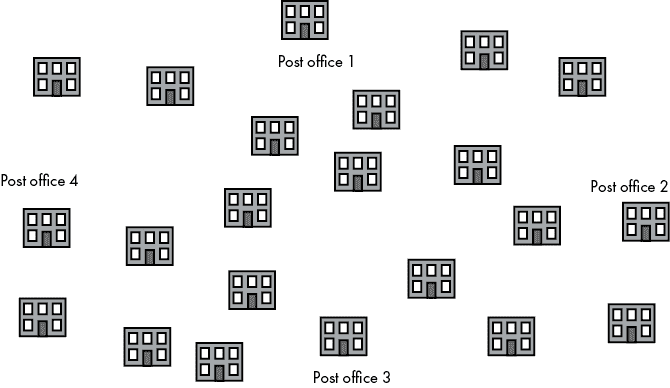

图 7-1： 一个城镇及其邮局

由于在你的新国家从未有过邮政总局长，因此没有人监督优化邮局的送达工作。可能是邮局 4 被分配给一个距离邮局 2 和 3 更近的家庭，而与此同时，邮局 2 却被分配给了一个离邮局 4 更近的家庭，如同图 7-2 所示。

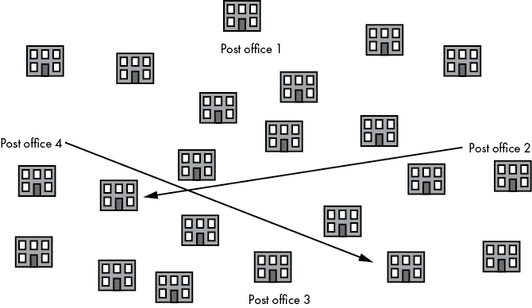

图 7-2： 邮局 2 和 4 的分配效率低。

你可以重新安排送达任务，使得每个家庭都能从理想的邮局接收邮件。一个送达任务的理想邮局可能是员工最多的邮局、拥有适合穿越某区域的设备的邮局，或者是拥有能够找到该区域内所有地址的机构知识的邮局。但最可能的是，送达任务的理想邮局只是最靠近的那个。你可能会注意到，这与旅行商问题（TSP）类似，至少在我们需要在地图上移动物体并希望减少旅行距离的方面。然而，TSP 是一个优化路线顺序的旅行者问题，而在这里，你面临的是多个旅行者（投递员）优化多个路线分配的问题。实际上，这个问题和 TSP 可以连续解决，以获得最大的收益：在你完成哪些邮局应送达哪些家庭的任务分配后，个别的投递员可以使用 TSP 来决定访问这些家庭的顺序。

解决这个问题的最简单方法，我们可以称之为*邮递员问题*，是依次考虑每座房子，计算房子与四个邮局之间的距离，并将最近的邮局分配给该房子。

这种方法有一些弱点。首先，它没有提供一种简单的方式来分配新建房屋；每一座新建的房子必须通过与每个现有邮局的比较，经历同样繁琐的过程。其次，在单独为每个房子做计算时，我们无法了解整个区域的情况。例如，也许某个社区的整个区域都处在某个邮局的覆盖范围内，但却远离其他邮局。最好在一步中得出结论，认为整个社区应该由同一个邻近的邮局提供服务。不幸的是，我们的方法要求我们对社区内的每座房子重复计算，最后得到相同的结果。

通过为每座房子单独计算距离，我们在重复做一些不必要的工作，如果我们能对整个社区或区域做出一些概括的话，就不需要做这些工作。而且这些工作会逐渐累积。在拥有数千万居民的超级城市中，考虑到如今世界各地许多邮局以及快速的建筑速度，这种方法会显得不必要地慢且消耗大量计算资源。

更优雅的方法是将地图整体考虑，并将其划分为不同的区域，每个区域代表一个邮局的服务区域。通过仅绘制两条直线，我们就可以完成这一任务，就像我们假设的小镇（图 7-3）一样。

我们绘制的区域表示最近邻的区域，这意味着对于每一座房子、每一个点和每一个像素，最近的邮局就是与它共享同一区域的邮局。现在，整个地图已被细分，我们可以通过简单地检查某个区域来轻松地将任何新的建筑分配到它最近的邮局。

将地图细分为最近邻区域的图形，正如我们所做的那样，叫做*Voronoi 图*。Voronoi 图有着悠久的历史，早在勒内·笛卡尔时期就已出现。它们曾被用来分析伦敦水泵的布置，为霍乱传播的方式提供证据，至今仍广泛应用于物理学和材料科学中，用于表示晶体结构。本章将介绍一种为任意一组点生成 Voronoi 图的算法，从而解决邮递员问题。

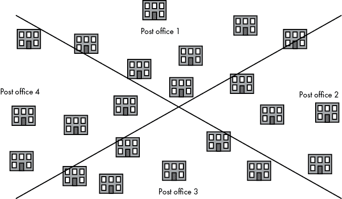

图 7-3： Voronoi 图将我们的城市划分为最佳邮政配送区域

## 三角形基础 101

让我们回过头来，从我们将要探索的算法的最简单元素开始。我们正在研究几何学，其中最简单的分析元素是点。我们将点表示为具有两个元素的列表：一个 x 坐标和一个 y 坐标，如以下示例所示：

```py
point = [0.2,0.8]
```

在下一个复杂度级别，我们将点组合成三角形。我们将三角形表示为由三个点组成的列表：

```py
triangle = [[0.2,0.8],[0.5,0.2],[0.8,0.7]]
```

我们还可以定义一个辅助函数，将三个不相干的点转换为一个三角形。这个小函数所做的只是将三个点收集到一个列表中，并返回该列表：

```py
def points_to_triangle(point1,point2,point3):
    triangle = [list(point1),list(point2),list(point3)]
    return(triangle)
```

能够可视化我们正在处理的三角形会很有帮助。让我们创建一个简单的函数，它可以接收任何三角形并将其绘制出来。首先，我们将使用在第六章中定义的`genlines()`函数。记住，这个函数接收一组点并将它们转换为直线。再一次，这是一个非常简单的函数，只是将点附加到一个名为`lines`的列表中：

```py
def genlines(listpoints,itinerary):
    lines = []
    for j in range(len(itinerary)-1):
        lines.append([listpoints[itinerary[j]],listpoints[itinerary[j+1]]])
    return(lines)
```

接下来，我们将创建一个简单的绘图函数。它将接收我们传递给它的三角形，拆分其* x *和* y *值，调用`genlines()`来根据这些值创建一组直线，绘制点和直线，最后将图像保存为.*png*文件。它使用`pylab`模块进行绘图，并使用`matplotlib`模块中的代码来创建直线集合。列表 7-1 展示了这个函数。

```py
import pylab as pl
from matplotlib import collections as mc
def plot_triangle_simple(triangle,thename):
    fig, ax = pl.subplots()

    xs = [triangle[0][0],triangle[1][0],triangle[2][0]]
    ys = [triangle[0][1],triangle[1][1],triangle[2][1]]

    itin=[0,1,2,0]

    thelines = genlines(triangle,itin)

    lc = mc.LineCollection(genlines(triangle,itin), linewidths=2)

    ax.add_collection(lc)

    ax.margins(0.1)
    pl.scatter(xs, ys)
    pl.savefig(str(thename) + '.png')
    pl.close()
```

列表 7-1: 绘制三角形的函数

现在，我们可以选择三个点，将它们转换为三角形，并在一行代码中绘制该三角形：

```py
plot_triangle_simple(points_to_triangle((0.2,0.8),(0.5,0.2),(0.8,0.7)),'tri')
```

图 7-4 展示了输出结果。

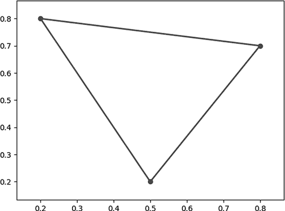

图 7-4: 一个简朴的三角形

另外，拥有一个函数来计算任何两个点之间的距离也会很有用，使用的是勾股定理：

```py
def get_distance(point1,point2):
    distance = math.sqrt((point1[0] - point2[0])**2 + (point1[1] - point2[1])**2)
    return(distance)
```

最后，提醒一下几种常见几何术语的含义：

1.  **平分** 将一条线分成两个相等的部分。平分一条线找到它的中点。

1.  **等边** 意思是“边长相等”。我们用这个术语来描述所有边长相等的形状。

1.  **垂直** 我们描述两条形成 90 度角的直线的方式。

1.  **顶点** 形状中两条边相交的点。

## 高级研究生级别的三角形研究

科学家和哲学家戈特弗里德·威廉·莱布尼茨认为，我们的世界是所有可能世界中最好的，因为它是“假设最简单、现象最丰富的”。他认为，科学的规律可以归结为几条简单的规则，而这些规则却能引发我们所观察到的世界的复杂多样性和美丽。虽然这可能不适用于整个宇宙，但对于三角形来说却完全正确。从一个假设极为简单的东西开始（即具有三条边的形状的概念），我们进入了一个现象极其丰富的世界。

### 寻找外接圆心

为了开始看到三角形世界现象的丰富性，考虑以下简单的算法，你可以用任何三角形来尝试：

1.  找出三角形每条边的中点。

1.  从三角形的每个顶点画一条线，连接到该顶点对面的边的中点。

在你遵循这个算法后，你会看到类似图 7-5 的情况。

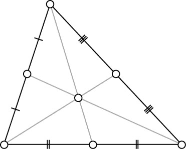

图 7-5: 三角形重心（来源：Wikimedia Commons）

值得注意的是，你画的所有线条都汇聚在一个点上，这个点看起来像是三角形的“中心”。无论你从哪个三角形开始，这三条线都会汇聚到一个点。它们汇聚的点通常被称为三角形的*重心*，并且总是位于三角形的内部，像是可以被称为三角形中心的地方。

有些形状，如圆形，总是有一个明确的点可以称为形状的中心。但三角形不是这样的：重心是一个可以称为三角形中心的点，但也有其他点也可以被视为中心。考虑这个新的算法，适用于任何三角形：

1.  将三角形的每条边平分。

1.  画一条垂直于每条边的线，穿过该边的中点。

在这种情况下，这些线条通常不像我们绘制重心时那样穿过顶点。比较图 7-5 与图 7-6。

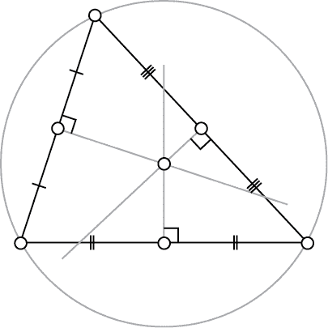

图 7-6: 三角形外接圆心（来源：Wikimedia Commons）

请注意，这些线确实会汇聚，再次汇聚到一个点，这个点不是重心，但通常在三角形内部。这个点有另一个有趣的性质：它是通过三角形所有三个顶点的唯一圆的圆心。这里是与三角形相关的另一个丰富现象：每个三角形都有一个唯一的圆，经过它的所有三个点。这个圆被称为*外接圆*，因为它是包围三角形的圆。我们刚才概述的算法找到了那个外接圆的圆心。正因为如此，这三条线的交点被称为*外接圆心*。

像重心一样，外接圆心是一个可以称为三角形中心的点，但它们并不是唯一的候选点——一本名为*https://faculty.evansville.edu/ck6/encyclopedia/ETC.html*的百科全书列出了 40,000 个（迄今为止）因各种原因可以称为三角形中心的点。正如百科全书本身所说，三角形中心的定义是“满足无穷多对象的条件，其中只有有限的对象会被发布。”令人惊讶的是，从三个简单的点和三条直线开始，我们得到了一个可能无限的独特中心百科全书——莱布尼茨一定会非常高兴。

我们可以编写一个函数，找到任意给定三角形的外心和*外接半径*（外接圆的半径）。该函数依赖于转换为复数。它以一个三角形作为输入，并返回一个中心和半径作为输出：

```py
def triangle_to_circumcenter(triangle):
    x,y,z = complex(triangle[0][0],triangle[0][1]), complex(triangle[1][0],triangle[1][1]), \    complex(triangle[2][0],triangle[2][1])
    w = z - x
    w /= y - x
    c = (x-y) * (w-abs(w)**2)/2j/w.imag - x
    radius = abs(c + x)
    return((0 - c.real,0 - c.imag),radius)
```

这个函数计算中心和半径的具体细节比较复杂。我们在这里不深入讨论，但如果你愿意，可以自己逐步查看代码。

### 增强我们的绘图功能

现在我们已经可以为每个三角形找到外心和外接半径了，让我们改进 `plot_triangle()` 函数，使其能够绘制所有内容。清单 7-2 显示了新函数。

```py
def plot_triangle(triangles,centers,radii,thename):
    fig, ax = pl.subplots()
   ** ax.set_xlim([0,1])**
 **ax.set_ylim([0,1])**
 **for i in range(0,len(triangles)):**
 **triangle = triangles[i]**
 **center = centers[i]**
 **radius = radii[i]**
        itin = [0,1,2,0]
        thelines = genlines(triangle,itin)
        xs = [triangle[0][0],triangle[1][0],triangle[2][0]]
        ys = [triangle[0][1],triangle[1][1],triangle[2][1]]

        lc = mc.LineCollection(genlines(triangle,itin), linewidths = 2)

        ax.add_collection(lc)
        ax.margins(0.1)
        pl.scatter(xs, ys)
        pl.scatter(center[0],center[1])

       ** circle = pl.Circle(center, radius, color = 'b', fill = False)**

 **ax.add_artist(circle)**
    pl.savefig(str(thename) + '.png')
    pl.close()
```

清单 7-2: 我们改进后的 `plot_triangle()` 函数，绘制外心和外接圆

我们从添加两个新的参数开始：一个 `centers` 变量，它是所有三角形外心的列表，另一个 `radii` 变量，它是每个三角形外接圆半径的列表。请注意，我们传入的是由列表组成的参数，因为这个函数是为了绘制多个三角形，而不仅仅是一个三角形。我们将使用 `pylab` 的圆形绘制功能来绘制这些圆。以后，我们将同时处理多个三角形。为了能够绘制多个三角形而不是一个，我们将在绘图函数中加入一个循环，遍历每个三角形及其外心，并依次绘制它们。

我们可以用我们定义的三角形列表调用这个函数：

```py
triangle1 = points_to_triangle((0.1,0.1),(0.3,0.6),(0.5,0.2))
center1,radius1 = triangle_to_circumcenter(triangle1)
triangle2 = points_to_triangle((0.8,0.1),(0.7,0.5),(0.8,0.9))
center2,radius2 = triangle_to_circumcenter(triangle2)
plot_triangle([triangle1,triangle2],[center1,center2],[radius1,radius2],'two')
```

我们的输出如图 7-7 所示。

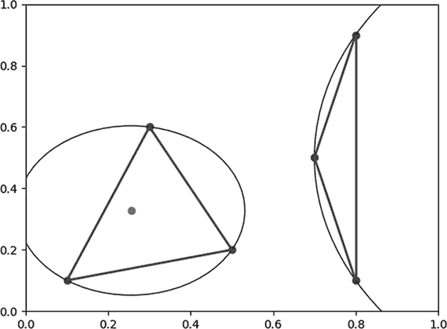

图 7-7: 两个带有外心和外接圆的三角形

请注意，我们的第一个三角形接近等边三角形。它的外接圆很小，外心位于外接圆内。我们的第二个三角形是一个狭长的三角形。它的外接圆很大，外心远离图形边界。每个三角形都有一个独特的外接圆，不同的三角形形状会导致不同类型的外接圆。你可能会发现自己可以独立探索不同的三角形形状及其相应的外接圆。稍后，这些三角形外接圆之间的差异将变得很重要。

## 德劳内三角剖分

我们准备好进入本章的第一个主要算法了。它接受一组点作为输入，并返回一组三角形作为输出。在这个上下文中，将一组点转化为一组三角形被称为*三角剖分*。

我们在本章开始时定义的`points_to_triangle()`函数是最简单的三角剖分算法。然而，它非常有限，因为它仅在我们输入恰好三个点时才有效。如果我们要对三个点进行三角剖分，只有一种可能的方式：输出一个由这三点构成的三角形。如果我们要对超过三个点进行三角剖分，必然会有多种方法。例如，考虑图 7-8 中展示的对相同七个点的两种不同的三角剖分方式。

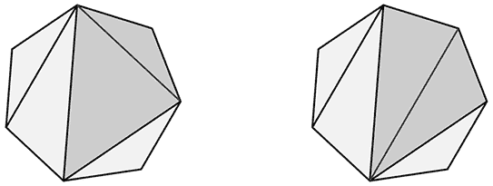

图 7-8: 两种不同的七点三角剖分方式（来自维基共享资源）

实际上，有 42 种可能的方式来对这个规则的七边形进行三角剖分，图 7-9 展示了这些方式。

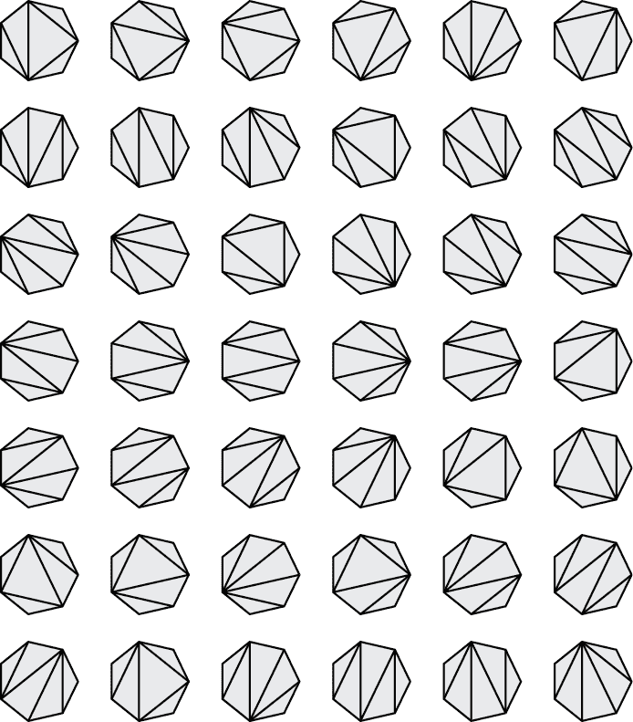

图 7-9: 所有 42 种可能的七点三角剖分方式（来源：维基百科）

如果你有超过七个点，并且它们的位置不规则，可能的三角剖分数量会达到惊人的数量级。

我们可以通过拿起笔和纸手动进行三角剖分。毫不奇怪，我们通过使用算法可以做得更好更快。

有几种不同的三角剖分算法。有些算法旨在快速运行，有些则注重简单性，还有一些旨在得到具有特定优良性质的三角剖分。我们将在这里讨论的是*Bowyer-Watson 算法*，它的设计目的是接受一组点作为输入并输出德劳内三角剖分。

*德劳内三角剖分（DT）*旨在避免狭长的细三角形。它倾向于输出接近等边三角形的三角形。记住，等边三角形的外接圆相对较小，而细长三角形的外接圆相对较大。考虑德劳内三角剖分的技术定义：对于一组点，它是连接所有点的三角形集，其中没有任何点位于任何三角形的外接圆内。细长三角形的大外接圆很可能会包含集合中的一个或多个其他点，因此规定没有点可以位于任何外接圆内，导致了相对较少的细长三角形。如果这一点不清楚，不要担心——你将在下一节看到可视化的解释。

### 增量生成德劳内三角剖分

我们最终的目标是编写一个函数，接受任何一组点并输出完整的德劳内三角剖分。但让我们从简单的开始：我们将编写一个函数，接受一个已有的*n*点的 DT，以及一个我们想要添加进去的点，并输出一个*n* + 1 点的 DT。这个“德劳内扩展”函数将使我们非常接近能够编写完整的 DT 函数。

首先，假设我们已经得到了图 7-10 中展示的九个点的 DT。

现在假设我们想在我们的 DT 中添加第 10 个点（图 7-11）。

一个 DT 只有一个规则：没有任何点可以位于其任何三角形的外接圆内。因此，我们检查现有 DT 中每个圆的外接圆，以确定第 10 个点是否位于其中任何一个圆内。我们发现第 10 个点位于三个三角形的外接圆内（图 7-12）。

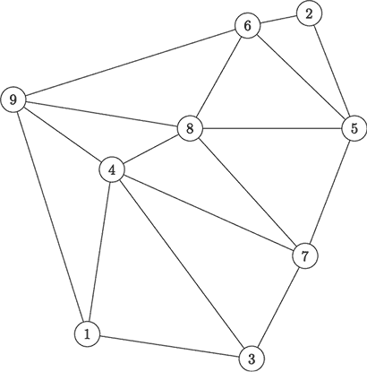

图 7-10: 一个包含九个点的 DT

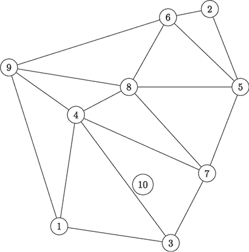

图 7-11: 我们想要添加的第 10 个点在 9 点 DT 中的位置

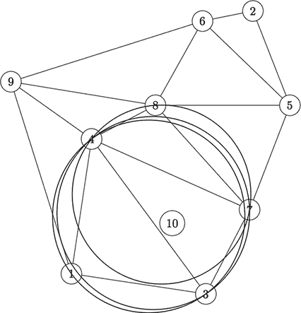

图 7-12: 在 DT 中的三个三角形的外接圆包含第 10 个点。

这些三角形不再允许出现在我们的 DT 中，因此我们将把它们移除，得到图 7-13。

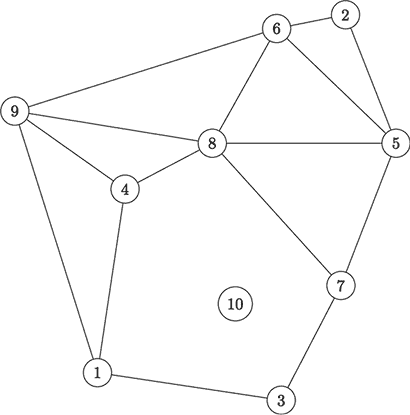

图 7-13: 我们已经移除了无效的三角形。

我们还没有完成。我们需要填补我们创建的空洞，并确保第 10 个点正确地与其他点连接。如果不这样做，我们就不会得到一组三角形，而只是一些点和线。我们连接第 10 个点的方式可以简单描述：添加一条边，将第 10 个点与它所处的最大空白多边形的每个顶点连接起来（图 7-14）。

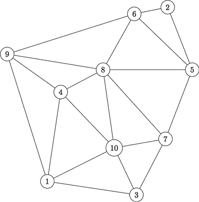

图 7-14: 通过重新连接有效三角形来完成 10 点 DT

啦！我们从一个 9 点 DT 开始，添加了一个新点，现在得到了一个 10 点 DT。这个过程看起来可能很简单。不幸的是，像许多几何算法一样，眼睛看起来直观而清晰的内容，写代码时却可能非常棘手。但让我们不要让这吓倒我们，勇敢的冒险者们。

### 实现德劳内三角剖分

假设我们已经有了一个 DT，我们称之为`delaunay`。它不过是一个三角形的列表。我们甚至可以从一个单独的三角形开始：

```py
delaunay = [points_to_triangle((0.2,0.8),(0.5,0.2),(0.8,0.7))]
```

接下来，我们将定义一个我们想要添加的点，称为`point_to_add`：

```py
point_to_add = [0.5,0.5]
```

我们首先需要确定，在现有的 DT 中，哪些三角形（如果有的话）现在是无效的，因为它们的外接圆包含`point_to_add`。我们将执行以下操作：

1.  使用循环遍历现有 DT 中的每个三角形。

1.  对于每个三角形，找到其外心和外接圆的半径。

1.  计算`point_to_add`与该外心之间的距离。

1.  如果这个距离小于外接圆半径，那么新点就在三角形的外接圆内。我们可以得出结论，这个三角形是无效的，需要从 DT 中移除。

我们可以通过以下代码片段来完成这些步骤：

```py
import math
invalid_triangles = []
delaunay_index = 0
while delaunay_index < len(delaunay):
    circumcenter,radius = triangle_to_circumcenter(delaunay[delaunay_index])
    new_distance = get_distance(circumcenter,point_to_add)
    if(new_distance < radius):
        invalid_triangles.append(delaunay[delaunay_index])
    delaunay_index += 1
```

这个代码片段创建了一个名为 `invalid_triangles` 的空列表，遍历我们现有 DT 中的每个三角形，并检查某个三角形是否无效。它通过检查 `point_to_add` 与外接圆心的距离是否小于外接圆的半径来判断。如果某个三角形无效，我们就将它添加到 `invalid_triangles` 列表中。

现在我们有了一份无效三角形的列表。由于它们无效，我们想要移除它们。最终，我们还需要向 DT 中添加新的三角形。为了做到这一点，拥有一个包含所有无效三角形中点的列表将非常有帮助，因为这些点将出现在我们的新有效三角形中。

我们接下来的代码片段将从我们的 DT 中移除所有无效的三角形，同时还会获取构成它们的点的集合。

```py
points_in_invalid = []

for i in range(len(invalid_triangles)):
    delaunay.remove(invalid_triangles[i])
    for j in range(0,len(invalid_triangles[i])):
        points_in_invalid.append(invalid_triangles[i][j])

1 points_in_invalid = [list(x) for x in set(tuple(x) for x in points_in_invalid)]
```

我们首先创建一个空列表，名为 `points_in_invalid`。然后，我们遍历 `invalid_triangles`，使用 Python 的 `remove()` 方法将每个无效的三角形从现有的 DT 中删除。接着，我们遍历每个三角形中的点，并将它们添加到 `points_in_invalid` 列表中。最后，由于我们可能已将一些重复的点添加到 `points_in_invalid` 列表中，我们将使用列表推导式 1 来重新创建 `points_in_invalid`，确保只包含唯一的值。

我们算法的最后一步是最棘手的一步。我们必须添加新的三角形来替换无效的三角形。每个新三角形将包含 `point_to_add` 作为其中一个点，并且另外两个点来自现有的 DT。然而，我们不能添加 `point_to_add` 和两个现有点的每一种可能组合。

在图 7-13 和 7-14 中，请注意我们需要添加的新三角形都是以点 10 作为其中一个顶点，并且边是从包含点 10 的空多边形中选择的。经过视觉检查后，这看起来很简单，但要为其编写代码并不直接。

我们需要找到一个简单的几何规则，能够用 Python 的超字面风格进行简单的解释。想想可以用来生成新三角形的规则，例如在图 7-14 中所示。像许多数学情况一样，我们可能会找到多个等效的规则集。我们可以使用与点相关的规则，因为三角形的定义之一是由三点组成。我们还可以使用与线段相关的规则，因为三角形的另一种等效定义是由三条线段组成。我们可以使用任何一组规则；我们只是想要一组最简单理解和在代码中实现的规则。一种可能的规则是，我们应该考虑无效三角形中所有可能的点组合与`point_to_add`结合，但只有当不包含`point_to_add`的边在无效三角形列表中恰好出现一次时，我们才会将该三角形添加到新图形中。这个规则有效，因为那些恰好出现一次的边将是包围新点的外多边形的边（在图 7-13 中，相关的边是连接点 1、4、8、7 和 3 的多边形的边）。

以下代码实现了这一规则：

```py
for i in range(len(points_in_invalid)):
    for j in range(i + 1,len(points_in_invalid)):
        #count the number of times both of these are in the bad triangles
        count_occurrences = 0
        for k in range(len(invalid_triangles)):
            count_occurrences += 1 * (points_in_invalid[i] in invalid_triangles[k]) * \            (points_in_invalid[j] in invalid_triangles[k])
        if(count_occurrences == 1):
            delaunay.append(points_to_triangle(points_in_invalid[i], points_in_invalid[j], \point_to_add))
```

在这里，我们遍历`points_in_invalid`中的每个点。对于每个点，我们会遍历`points_in_invalid`中每一个后续的点。这种双重循环使我们能够考虑位于无效三角形中的所有点对的组合。对于每一对组合，我们遍历所有无效三角形，并统计这两个点在无效三角形中同时出现的次数。如果这两个点只在一个无效三角形中一起出现，那么我们就可以得出结论，它们应该一起出现在我们新建的三角形中，并将这两个点与我们新点组成的新三角形添加到我们的 DT 中。

我们已经完成了将新点添加到现有 DT 中的步骤。因此，我们可以从一个包含 *n* 个点的 DT 开始，添加一个新点，最终得到一个包含 *n* + 1 个点的 DT。现在，我们需要学习如何利用这一能力从零开始构建 DT，从零点一直到 *n* 个点。当我们开始构建 DT 时，其实非常简单：我们只需要反复循环执行从 *n* 个点到 *n* + 1 个点的过程，直到我们将所有的点都添加进去。

还有一个额外的复杂问题。由于稍后我们会讨论的原因，我们希望向生成 DT 的点集合中添加三个点。这些点将位于我们选择的点之外，我们可以通过找到最上方和最左方的点，添加一个比这两者更高且更左的新点来确保这些点位于外部，类似地，对于最下方和最右方的点以及最下方和最左方的点进行类似的操作。我们将这些点作为我们的 DT 的第一个三角形。我们将从一个连接三个点的 DT 开始：即刚刚提到的这个新三角形的三个点。然后，我们将按照已经看到的逻辑，将三点 DT 转化为四点 DT，接着是五点 DT，依此类推，直到我们添加完所有点。

在列表 7-3 中，我们可以将之前编写的代码结合起来，创建一个名为`gen_delaunay()`的函数，该函数以一组点作为输入，并输出一个完整的 DT。

```py
def gen_delaunay(points):
    delaunay = [points_to_triangle([-5,-5],[-5,10],[10,-5])]
    number_of_points = 0

    while number_of_points < len(points): 1
        point_to_add = points[number_of_points]

        delaunay_index = 0

        invalid_triangles = [] 2
        while delaunay_index < len(delaunay):
            circumcenter,radius = triangle_to_circumcenter(delaunay[delaunay_index])
            new_distance = get_distance(circumcenter,point_to_add)
            if(new_distance < radius):
                invalid_triangles.append(delaunay[delaunay_index])
            delaunay_index += 1

        points_in_invalid = [] 3
        for i in range(0,len(invalid_triangles)):
            delaunay.remove(invalid_triangles[i])
            for j in range(0,len(invalid_triangles[i])):
                points_in_invalid.append(invalid_triangles[i][j])
        points_in_invalid = [list(x) for x in set(tuple(x) for x in points_in_invalid)]

        for i in range(0,len(points_in_invalid)): 4
            for j in range(i + 1,len(points_in_invalid)):
                #count the number of times both of these are in the bad triangles
                count_occurrences = 0
                for k in range(0,len(invalid_triangles)):
                    count_occurrences += 1 * (points_in_invalid[i] in invalid_triangles[k]) * \                    (points_in_invalid[j] in invalid_triangles[k])
                if(count_occurrences == 1):
                    delaunay.append(points_to_triangle(points_in_invalid[i], \points_in_invalid[j], point_to_add))

**number_of_points += 1**

    return(delaunay)
```

列表 7-3： 一个接受一组点并返回 Delaunay 三角剖分的函数

完整的 DT 生成函数首先添加了前面提到的新外部三角形。然后，它循环遍历我们点集合中的每个点。对于每个点，它会创建一个无效三角形的列表：即在 DT 中所有外接圆包含当前正在查看的点的三角形。接着，它从 DT 中删除这些无效三角形，并使用这些无效三角形中的每个点创建一个新的点集合。然后，使用这些点，它会添加符合 Delaunay 三角剖分规则的新三角形。它以增量的方式执行这一过程，完全按照我们已经介绍过的代码进行。最后，它返回`delaunay`，这是一个包含所有三角形的列表，构成了我们的 DT。

我们可以轻松地调用这个函数，为任何点集合生成 DT。在以下代码中，我们为`N`指定一个数值，并生成`N`个随机点（*x*和 *y* 值）。然后，我们将 *x* 和 *y* 值打包成一个列表，传递给`gen_delaunay()`函数，并返回一个完整有效的 DT，我们将其存储在名为`the_delaunay`的变量中：

```py
N=15
import numpy as np
np.random.seed(5201314)
xs = np.random.rand(N)
ys = np.random.rand(N)
points = zip(xs,ys)
listpoints = list(points)
the_delaunay = gen_delaunay(listpoints)
```

我们将在下一节中使用`the_delaunay`来生成 Voronoi 图。

## 从 Delaunay 到 Voronoi

现在我们已经完成了 DT 生成算法，Voronoi 图生成算法也触手可及了。我们可以通过以下算法将一组点转化为 Voronoi 图：

1.  查找一组点的 DT。

1.  获取 DT 中每个三角形的外心。

1.  绘制连接所有共享边的 DT 三角形外心的线条。

我们已经知道如何执行步骤 1（在上一节中已经做过了），我们可以通过`triangle_to_circumcenter()`函数完成步骤 2。所以我们需要的只是一个可以完成步骤 3 的代码片段。

我们在步骤 3 中编写的代码将位于我们的绘图函数中。记住，我们将一组三角形和外心传递给该函数作为输入。我们的代码需要创建一个连接外心的线条集合。但它不会连接所有外心，只连接那些共享边的三角形的外心。

我们将三角形存储为点的集合，而不是边。但仍然可以轻松检查两个三角形是否共享一条边；我们只需要检查它们是否共享恰好两个点。如果它们只共享一个点，那么它们有一个顶点相交，但没有公共边。如果它们共享三个点，它们就是相同的三角形，因此将有相同的外心。我们的代码会遍历每个三角形，对于每个三角形，再次遍历每个三角形，检查它们共享的点的数量。如果共同点的数量恰好是两个，那么它将连接这两个三角形的外心之间的连线。这些外心之间的连线将构成我们的 Voronoi 图的边界。以下代码片段展示了我们如何遍历三角形，但它是一个更大绘图函数的一部分，因此暂时不要运行它：

```py
--`snip`--
for j in range(len(triangles)):
    commonpoints = 0
    for k in range(len(triangles[i])):
        for n in range(len(triangles[j])):
            if triangles[i][k] == triangles[j][n]:
               commonpoints += 1
    if commonpoints == 2:
        lines.append([list(centers[i][0]),list(centers[j][0])])
```

这段代码将被添加到我们的绘图函数中，因为我们的最终目标是绘制 Voronoi 图。

在此过程中，我们可以对我们的绘图函数进行一些其他有用的改进。新的绘图函数如列表 7-4 所示，其中的更改用**粗体**标出：

```py
def plot_triangle_circum(triangles,centers,plotcircles,plotpoints, \plottriangles,plotvoronoi,plotvpoints,thename):
    fig, ax = pl.subplots()
    ax.set_xlim([-0.1,1.1])
    ax.set_ylim([-0.1,1.1])

    lines=[]
    for i in range(0,len(triangles)):
        triangle = triangles[i]
        center = centers[i][0]
        radius = centers[i][1]
        itin = [0,1,2,0]
        thelines = genlines(triangle,itin)
        xs = [triangle[0][0],triangle[1][0],triangle[2][0]]
        ys = [triangle[0][1],triangle[1][1],triangle[2][1]]

        lc = mc.LineCollection(genlines(triangle,itin), linewidths=2)
        **if(plottriangles):**
            ax.add_collection(lc)
        **if(plotpoints):**
            pl.scatter(xs, ys)

        ax.margins(0.1)
 1 **if(plotvpoints):**
 **pl.scatter(center[0],center[1])**

        circle = pl.Circle(center, radius, color = 'b', fill = False)
        **if(plotcircles):**
            ax.add_artist(circle)

     2 **if(plotvoronoi):**
 **for j in range(0,len(triangles)):**
 **commonpoints = 0**
 **for k in range(0,len(triangles[i])):**
 **for n in range(0,len(triangles[j])):**
 **if triangles[i][k] == triangles[j][n]:**
 **commonpoints += 1**
 **if commonpoints == 2:**
 **lines.append([list(centers[i][0]),list(centers[j][0])])**

        lc = mc.LineCollection(lines, linewidths = 1)

        ax.add_collection(lc)

    pl.savefig(str(thename) + '.png')
    pl.close()
```

列表 7-4: 一个绘制三角形、外心、外接圆、Voronoi 点和 Voronoi 边界的函数

首先，我们添加新的参数，明确指定我们希望绘制的内容。记住，在本章中，我们处理了点、边、三角形、外接圆、外心、DT 和 Voronoi 边界。将所有这些绘制在一起可能会让眼睛感到压迫，因此我们将添加`plotcircles`来指定是否希望绘制我们的外接圆，`plotpoints`来指定是否希望绘制我们的点集合，`plottriangles`来指定是否希望绘制我们的 DT，`plotvoronoi`来指定是否希望绘制我们的 Voronoi 图边界，以及`plotvpoints`来指定是否希望绘制我们的外心（它们是 Voronoi 图边界的顶点）。新的添加部分用**粗体**标出。一个添加项绘制 Voronoi 顶点（外心），如果我们在参数中指定要绘制它们的话。另一个较长的添加项绘制 Voronoi 边界。我们还指定了几个`if`语句，允许我们根据需要绘制或不绘制三角形、顶点和外接圆。

我们快要准备好调用这个绘图函数并查看最终的 Voronoi 图了。然而，首先我们需要获取我们 DT 中每个三角形的外心。幸运的是，这非常简单。我们可以创建一个空的列表`circumcenters`，并将 DT 中每个三角形的外心添加到该列表中，如下所示：

```py
circumcenters = []
for i in range(0,len(the_delaunay)):
    circumcenters.append(triangle_to_circumcenter(the_delaunay[i]))
```

最后，我们将调用我们的绘图函数，指定我们希望它绘制 Voronoi 边界：

```py
plot_triangle_circum(the_delaunay,circumcenters,False,True,False,True,False,'final')
```

图 7-15 展示了我们的输出。

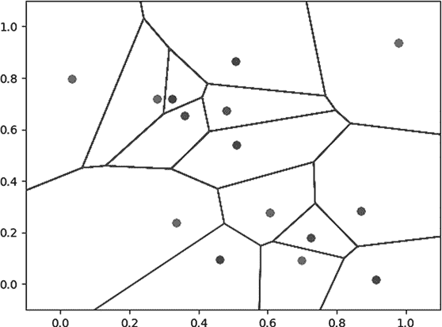

图 7-15: 一个 Voronoi 图。呼！

我们在短短几秒钟内将一组点转化为 Voronoi 图。你可以看到，这个 Voronoi 图中的边界一直延伸到图形的边缘。如果我们增加图形的大小，Voronoi 边界会继续延伸得更远。记住，Voronoi 边界连接的是 DT 中三角形外接圆的中心。但是我们的 DT 可能连接的是在图形中心非常接近的少数点，所以所有的外接圆中心可能都位于图形中间的一个小区域。如果发生这种情况，Voronoi 图的边界将不会延伸到图形的边缘。这就是为什么我们在`gen_delaunay()`函数的第一行中添加了新的外部三角形；通过使用一个其点远离图形区域的三角形，我们可以确保始终会有 Voronoi 边界延伸到地图的边缘，这样（例如）我们就知道应该为新建在城市边缘或外部郊区的区域分配哪个邮局来负责配送。

最后，你可能会喜欢玩一下我们的绘图函数。例如，如果你将所有输入参数设置为`True`，你就可以生成一张杂乱但美丽的图，展示本章讨论的所有元素：

```py
plot_triangle_circum(the_delaunay,circumcenters,True,True,True,True,True,'everything')
```

我们的输出在图 7-16 中显示。

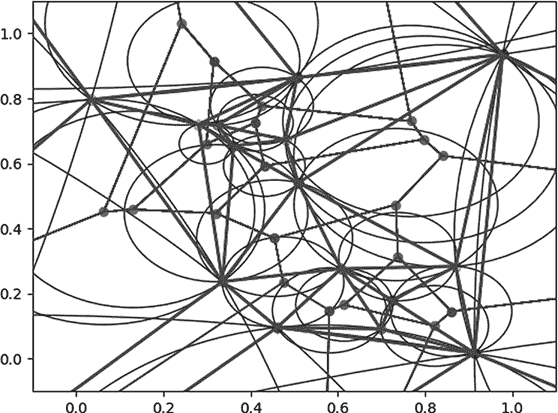

图 7-16: 魔眼

你可以用这张图片来说服你的室友和家人，告诉他们你正在为 CERN 进行顶级机密的粒子碰撞分析工作，或者也许你可以用它申请一个艺术奖学金，成为 Piet Mondrian 的精神继承者。当你看着这个带有 DT 和外接圆的 Voronoi 图时，你可以想象邮局、水泵、晶体结构或任何其他可能的 Voronoi 图应用。或者你也可以只想象点、三角形和线条，尽情享受几何学的纯粹乐趣。

## 总结

本章介绍了编写代码进行几何推理的方法。我们从绘制简单的点、线和三角形开始，接着讨论了不同的方式来寻找三角形的中心，以及如何利用这些方法为任何一组点生成 Delaunay 三角剖分。最后，我们简要介绍了使用 Delaunay 三角剖分生成 Voronoi 图的简单步骤，这些 Voronoi 图可以用来解决邮递员问题，或用于各种其他应用。它们在某些方面很复杂，但最终归结为点、线和三角形的基本操作。

在下一章中，我们将讨论可以用于处理语言的算法。特别是，我们将讲解如何通过算法修正缺少空格的文本，以及如何编写一个程序来预测自然短语中接下来应该出现的单词。
