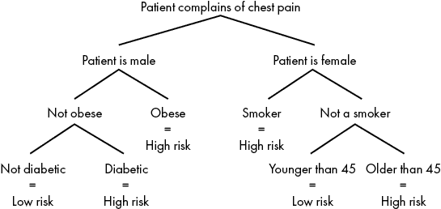
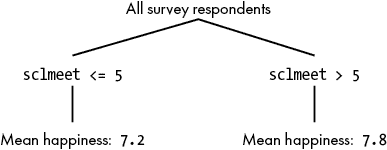
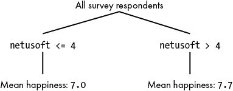
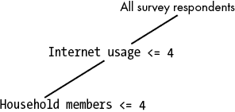

## 第九章：机器学习


现在你已经理解了许多基础算法背后的思想，我们可以转向更高级的概念。本章我们将探索机器学习。*机器学习*指的是一系列广泛的方法，但它们都有一个共同的目标：从数据中发现模式并利用这些模式进行预测。我们将讨论一种名为*决策树*的方法，并构建一个能够根据个人的一些特征预测一个人幸福感水平的模型。

## 决策树

决策树是具有分支结构、类似树形的图表。我们可以像使用流程图一样使用决策树——通过回答是/否问题，我们将沿着一条路径走向最终的决定、预测或建议。创建一个能够做出最佳决策的决策树的过程，是机器学习算法的典型例子。

让我们考虑一个现实场景，看看我们如何使用决策树。在急诊室，重要的决策者必须为每一位新入院的患者进行分诊。*分诊*意味着分配优先级：那些即将死亡但通过及时手术可以挽救的人将立即接受治疗，而那些只是纸割伤或轻微流感症状的人则会被要求等到更紧急的病例处理完再进行治疗。

分诊很困难，因为你必须在极短的时间或信息有限的情况下做出相对准确的诊断。如果一位 50 岁的女性来到急诊室，抱怨胸口剧烈疼痛，负责分诊的人必须决定她的疼痛是更可能是胃灼热还是心脏病发作。做出分诊决策的人的思维过程必然是复杂的。他们会考虑许多因素：患者的年龄和性别，是否肥胖或吸烟，报告的症状以及她们描述这些症状的方式，面部表情，医院的忙碌程度以及其他等待治疗的患者，甚至可能是她们没有意识到的因素。为了成为一名优秀的分诊员，必须学习许多模式。

理解一个分诊专业人员做决定的方式并不容易。图 9-1 展示了一个假设的、完全虚构的分诊决策过程（不作为医疗建议——请不要在家尝试！）。



图 9-1: 简化版心脏病发作分诊决策树

你可以从上到下阅读这个图表。在顶部，我们可以看到心脏病发作诊断过程从患者报告胸痛开始。之后，诊断过程根据患者的性别进行分支。如果患者是男性，诊断过程会沿左侧分支继续，我们会判断他是否肥胖。如果患者是女性，过程则沿右侧分支继续，我们会判断她是否吸烟。在每个步骤中，我们按照适当的分支进行，直到到达树的底部，在那里我们可以看到树的分类，判断患者是否处于高风险或低风险的心脏病发作状态。这个二叉分支过程类似于一棵树的结构，树干分支出越来越小的枝条，直到达到最远的分支。因此，图中展示的决策过程图 9-1 被称为决策树*。

每个你在图 9-1 中看到的文本都是决策树的*节点*。像“非肥胖”这样的节点被称为*分支节点*，因为在我们能够做出预测之前，至少还有一个分支需要跟随。“非糖尿病=低风险”节点是*终端节点*，因为一旦我们到达那里，就不再需要分支，我们已经知道决策树的最终分类（“低风险”）。

如果我们能够设计出一棵完善的、经过充分研究的决策树，始终能够做出正确的分诊决策，那么没有医学培训的人也有可能对心脏病发作的患者进行分诊，这将为全球所有的急诊室节省大量资金，因为他们将不再需要雇佣和培训那些谨慎且受过高等教育的分诊专家。一棵足够优秀的决策树甚至可能使机器人取代人工分诊专家，尽管这是否是一个好的目标仍有争议。一棵优秀的决策树甚至可能做出比普通人更好的决策，因为它有可能消除我们这些易犯错误的人的潜意识偏见。（事实上，这已经发生过：1996 年和 2002 年，两个不同的研究团队分别发表了论文，讲述他们通过使用决策树改善胸痛患者分诊结果的成功经验。）

决策树中描述的分支决策步骤构成了一个算法。执行这样的算法非常简单：只需在每个节点上决定应该选择哪一条分支，然后沿着分支走到终点。但不要盲目遵循你遇到的每一棵决策树。记住，任何人都可以创建一个描述任何可想象的决策过程的决策树，即使它导致错误的决策。决策树的难点不在于执行决策树算法，而在于设计决策树，使其能够得出最佳决策。创建一个最优的决策树是机器学习的应用，虽然仅仅遵循一棵决策树并不是机器学习。让我们讨论创建最优决策树的算法——一种生成算法的算法——并通过步骤生成一个准确的决策树。

## 构建决策树

让我们构建一个决策树，利用关于一个人的信息来预测他们的幸福感。几千年来，找出幸福的秘密一直困扰着数百万的人，而今天的社会科学研究人员则倾尽笔墨（并消耗大量的研究经费）来追寻答案。如果我们有一个决策树，能够利用几条信息可靠地预测一个人的幸福感，这将为我们提供关于决定一个人幸福的关键线索，甚至可能给我们一些关于如何实现幸福的启示。在本章结束时，你将学会如何构建这样的决策树。

### 下载我们的数据集

机器学习算法从数据中发现有用的模式，因此它们需要一个好的数据集。我们将使用来自欧洲社会调查（ESS）的数据来构建我们的决策树。你可以从*http://bradfordtuckfield.com/ess.csv* 和 *http://bradfordtuckfield.com/variables.csv* 下载我们将使用的文件。（我们最初是从*https://www.kaggle.com/pascalbliem/european-social-survey-ess-8-ed21-201617*获取的这些文件，那里它们是公开免费提供的）。ESS 是一个大规模的欧洲成年人调查，每两年进行一次。它提出了各种各样的个人问题，包括宗教信仰、健康状况、社交生活和幸福感水平。我们将要查看的文件是以*CSV*格式存储的。文件扩展名*.csv*是*逗号分隔*值的缩写，它是一种非常常见且简单的存储数据集的方式，可以通过 Microsoft Excel、LibreOffice Calc、文本编辑器和一些 Python 模块打开。

文件*variables.csv*包含了调查中每个问题的详细描述。例如，在*variables.csv*的第 103 行，我们可以看到一个名为`happy`的变量的描述。这个变量记录了受访者对问题“综合来看，你认为自己有多幸福？”的回答。这个问题的回答范围从 1（一点也不幸福）到 10（非常幸福）。查看*variables.csv*中的其他变量，了解可供我们使用的信息种类。例如，变量`sclmeet`记录了受访者与朋友、亲戚或同事社交的频率。变量`health`记录了受访者的主观健康状况。变量`rlgdgr`记录了受访者的宗教信仰程度，等等。

在查看了数据后，我们可以开始考虑与幸福预测相关的假设。我们可能合理地假设，拥有积极社交生活和良好健康的人比其他人更幸福。其他变量——如性别、家庭规模和年龄——可能不太容易形成假设。

### 查看数据

让我们从读取数据开始。下载数据并将其保存为本地文件*ess.csv*。然后，我们可以使用`pandas`模块来操作数据，并将其存储在一个名为`ess`的 Python 变量中：

```py
import pandas as pd
ess = pd.read_csv('ess.csv')
```

记住，为了读取 CSV 文件，你必须确保它和 Python 程序运行的路径在同一目录下，或者需要修改之前代码中的`'ess.csv'`，使其反映你存储 CSV 文件的准确路径。我们可以使用`pandas`数据框的`shape`属性来查看数据的行数和列数：

```py
print(ess.shape)
```

输出应该是`(44387, 534)`，这表示我们的数据集有 44,387 行（每一行代表一个受访者）和 534 列（每一列代表调查中的一个问题）。我们可以通过使用`pandas`模块的切片功能，进一步查看我们感兴趣的某些列。例如，以下是如何查看“happy”问题的前五个回答：

```py
print(ess.loc[:,'happy'].head())
```

我们的数据集`ess`有 534 列，每一列代表调查中的一个问题。出于某些目的，我们可能希望一次性处理所有 534 列。在这里，我们只想查看`happy`这一列，而不是其他 533 列。这就是我们使用`loc()`函数的原因。在这里，`loc()`函数从`pandas`数据框中提取了名为`happy`的变量。换句话说，它只取出了这一列，并忽略了其他 533 列。然后，`head()`函数展示了该列的前五行数据。你可以看到前五个回答分别是`5`、`5`、`8`、`8`和`5`。我们也可以对`sclmeet`变量做同样的操作：

```py
print(ess.loc[:,'sclmeet'].head())
```

结果应该是`6`、`4`、`4`、`4`和`6`。`happy`的回答和`sclmeet`的回答会一一对应。例如，`sclmeet`的第 134 个元素是由与`happy`的第 134 个元素相同的受访者给出的回答。

ESS 工作人员努力从每位调查参与者那里收集完整的回应。然而，也有一些情况下，调查问题的回答缺失，可能是因为参与者拒绝回答或者不知道如何回答。在 ESS 数据集中，缺失的回应会被赋予一个高于实际回答范围的代码。例如，如果问题要求受访者在 1 到 10 的范围内选择一个数字，而受访者拒绝回答，ESS 将记录为 77。在我们的分析中，我们只考虑完整的回应，即没有缺失的感兴趣变量的回答。我们可以限制`ess`数据，只保留包含我们关心的完整回应的记录，如下所示：

```py
ess = ess.loc[ess['sclmeet'] <= 10,:].copy()
ess = ess.loc[ess['rlgdgr'] <= 10,:].copy()
ess = ess.loc[ess['hhmmb'] <= 50,:].copy()
ess = ess.loc[ess['netusoft'] <= 5,:].copy()
ess = ess.loc[ess['agea'] <= 200,:].copy()
ess = ess.loc[ess['health'] <= 5,:].copy()
ess = ess.loc[ess['happy'] <= 10,:].copy()
ess = ess.loc[ess['eduyrs'] <= 100,:].copy().reset_index(drop=True)
```

### 划分我们的数据

我们可以通过多种方式使用这些数据来探索个人社交生活与幸福感之间的关系。最简单的方法之一是进行`二元划分`：我们将社交生活非常活跃的人的幸福感与社交生活较少活跃的人的幸福感进行比较（参见清单 9-1）。

```py
import numpy as np
social = list(ess.loc[:,'sclmeet'])
happy = list(ess.loc[:,'happy'])
low_social_happiness = [hap for soc,hap in zip(social,happy) if soc <= 5]
high_social_happiness = [hap for soc,hap in zip(social,happy) if soc > 5]

meanlower = np.mean(low_social_happiness)
meanhigher = np.mean(high_social_happiness)
```

清单 9-1: 计算社交生活不活跃和活跃人群的平均幸福感水平

在清单 9-1 中，我们导入了`numpy`模块来计算平均值。我们通过从`ess`数据框中切片定义了两个新变量，`social`和`happy`。然后，我们使用列表推导式来找到所有社交活动评分较低的人的幸福感（我们将其保存在变量`low_social_happiness`中），以及所有社交活动评分较高的人的幸福感（我们将其保存在变量`high_social_happiness`中）。最后，我们计算了不活跃社交人群的平均幸福感（`meanlower`）和高度活跃社交人群的平均幸福感（`meanhigher`）。如果你运行`print(meanlower)`和`print(meanhigher)`，你应该会看到，认为自己社交活跃的人，幸福感评分也略高于那些社交不活跃的人：社交活跃者的平均幸福感为`7.8`，而社交不活跃者的平均幸福感为`7.2`。

我们可以画出一个简单的图示，展示我们刚刚做的事情，如图 9-2 所示。



图 9-2: 一个简单的决策树，基于社交活动频率预测幸福感

这个简单二元分割的图已经开始类似于决策树。这不是巧合：在数据集上做二元分割并比较每一半的结果，正是决策树生成算法的核心过程。事实上，图 9-2 可以称之为一个决策树，尽管它只有一个分支节点。我们可以将图 9-2 作为一个非常简单的幸福感预测器：我们了解某人有多频繁外出社交。如果他们的`sclmeet`值为`5`或更低，那么我们可以预测他们的幸福感为`7.2`。如果高于`5`，则可以预测他们的幸福感为`7.8`。这不是一个完美的预测，但它是一个起点，而且比随机猜测更准确。

我们可以尝试使用决策树来得出关于各种特征和生活方式选择对幸福感的影响。例如，我们看到低社交幸福感和高社交幸福感之间的差异大约是 0.6，我们得出结论：将个人的社交活动水平从低提高到高，可能会使幸福感在 10 分制上提高大约 0.6。当然，尝试得出这类结论充满了困难。也许社交活动并不直接导致幸福感，反而是幸福感促使社交活动；或许快乐的人更容易心情愉悦，从而打电话给朋友并安排社交活动。区分相关性与因果关系超出了本章的讨论范围，但无论因果关系的方向如何，我们简单的决策树至少告诉了我们这个关联的事实，如果我们愿意，还可以进一步研究。正如漫画家 Randall Munroe 所说：“相关性并不意味着因果关系，但它确实用挑眉示意并偷偷做手势，嘴里嘀咕着‘看那边’。”

我们知道如何创建一个简单的具有两个分支的决策树。现在，我们只需要完善如何创建分支，然后生成更多分支，来构建一个更好、更完整的决策树。

### 更智能的分割

当我们比较社交活跃与不活跃人群的幸福感时，我们将`5`作为*分割点*，认为那些评分高于`5`的人拥有活跃的社交生活，而评分为`5`或以下的人则拥有不活跃的社交生活。我们选择`5`是因为它是从 1 到 10 的评分中一个自然的中点。然而，请记住，我们的目标是构建一个准确的幸福感预测器。与其根据直觉判断什么是自然的中点或什么看起来像是活跃的社交生活，最好是将二元分割点放在能够带来最佳准确度的位置。

在机器学习问题中，有几种不同的方式来衡量准确度。最自然的方式是求出我们所有错误的总和。在我们的例子中，我们关心的错误是我们对某人幸福感评分的预测与他们实际幸福感评分之间的差异。如果我们的决策树预测你的幸福感是`6`，但实际是`8`，那么该树在你的评分上的错误就是`2`。如果我们将某个群体中每个受访者的预测误差加起来，我们就可以得到一个误差总和，来衡量该决策树在预测该群体成员幸福感方面的准确度。我们越能将误差总和接近零，我们的树就越好（但请参见第 179 页的“过拟合问题”以了解重要的警告）。这个代码片段展示了一种简单的计算误差总和的方法：

```py
lowererrors = [abs(lowhappy - meanlower) for lowhappy in low_social_happiness]
highererrors = [abs(highhappy - meanhigher) for highhappy in high_social_happiness]

total_error = sum(lowererrors) + sum(highererrors)
```

这段代码计算了所有受访者的预测误差总和。它定义了`lowererrors`，一个包含每个低社交受访者预测误差的列表，以及`highererrors`，一个包含每个高社交受访者预测误差的列表。注意，我们使用了绝对值，这样我们只加上非负数来计算误差总和。当我们运行这段代码时，我们发现总误差大约是`60224`。这个数字远大于零，但如果考虑到这是一个超过 40,000 名受访者的错误总和，而且我们用的是一个仅有两个分支的决策树进行幸福感预测，突然间这就不显得那么糟糕了。

我们可以尝试不同的切分点，看看是否能够改进误差。例如，我们可以将社交评分高于`4`的每个人归为高社交，将社交评分为`4`或以下的每个人归为低社交，然后比较得到的误差率。或者，我们也可以选择`6`作为切分点。为了获得最高的准确度，我们应该依次检查每一个可能的切分点，并选择导致最低误差的切分点。列表 9-2 包含了一个实现此功能的函数。

```py
def get_splitpoint(allvalues,predictedvalues):
    lowest_error = float('inf')
    best_split = None
    best_lowermean = np.mean(predictedvalues)
    best_highermean = np.mean(predictedvalues)
    for pctl in range(0,100):
        split_candidate = np.percentile(allvalues, pctl)

        loweroutcomes = [outcome for value,outcome in zip(allvalues,predictedvalues) if \value <= split_candidate]
        higheroutcomes = [outcome for value,outcome in zip(allvalues,predictedvalues) if \value > split_candidate]

        if np.min([len(loweroutcomes),len(higheroutcomes)]) > 0:
            meanlower = np.mean(loweroutcomes)
            meanhigher = np.mean(higheroutcomes)

            lowererrors = [abs(outcome - meanlower) for outcome in loweroutcomes]
            highererrors = [abs(outcome - meanhigher) for outcome in higheroutcomes]

            total_error = sum(lowererrors) + sum(highererrors)

            if total_error < lowest_error:
                best_split = split_candidate
                lowest_error = total_error
                best_lowermean = meanlower
                best_highermean = meanhigher
    return(best_split,lowest_error,best_lowermean,best_highermean)
```

列表 9-2: 一个找到决策树分支点处最优切分点的函数

在这个函数中，我们使用一个名为`pctl`的变量（代表*百分位数*）来循环遍历从 0 到 100 的每一个数字。在循环的第一行，我们定义了一个新的`split_candidate`变量，它是数据的`pctl`-百分位数。之后，我们遵循在清单 9-2 中使用的相同过程。我们创建一个列表，其中包含`sclmeet`值小于或等于分割候选值的人的幸福感水平，以及`sclmeet`值大于分割候选值的人的幸福感水平，并检查使用该分割候选值时出现的误差。如果使用该分割候选值时的误差总和小于任何之前使用的分割候选值的误差总和，那么我们将`best_split`变量重新定义为等于`split_candidate`。当循环完成时，`best_split`变量就等于导致最高准确度的分割点。

我们可以对任何变量运行这个函数，例如以下示例中我们对`hhmmb`变量（记录受访者家庭成员数）运行该函数。

```py
allvalues = list(ess.loc[:,'hhmmb'])
predictedvalues = list(ess.loc[:,'happy'])
print(get_splitpoint(allvalues,predictedvalues))
```

这里的输出显示了正确的分割点以及该分割点定义的各组的预测幸福感水平：

```py
(1.0, 60860.029867951016, 6.839403436723225, 7.620055170794695)
```

我们解释这个输出的意思是，最佳的分割点是`1.0`；我们将受访者分为独自居住（一个家庭成员）和与他人同住（超过一个家庭成员）两组。我们还可以看到这两组的平均幸福感水平：分别约为`6.84`和`7.62`。

### 选择分割变量

对于我们在数据中选择的任何变量，我们都可以找到最佳的分割点。然而，请记住，在像图 9-1 这样的决策树中，我们不仅仅是在为单个变量寻找分割点。我们会将男性和女性分开，将肥胖者和非肥胖者分开，将吸烟者和非吸烟者分开，依此类推。一个自然的问题是，我们如何知道在每个分支节点上应该选择哪个变量进行分割？我们可以重新排列图 9-1 中的节点，使得首先按照体重分割，其次按性别分割，或者在左分支上仅按照性别分割，或者根本不分割性别。决定在每个分支点上选择哪个变量进行分割是生成最佳决策树的关键部分，因此我们应该为这个过程编写代码。

我们将使用与获取最佳分割点相同的原则来决定最佳分割变量：最好的分割方式是导致最小误差的方式。为了确定这一点，我们需要遍历每个可用的变量，并检查是否在该变量上进行分割会导致最小的误差。然后，我们确定哪个变量导致了误差最小的分割。我们可以通过使用清单 9-3 来实现这一点。

```py
def getsplit(data,variables,outcome_variable):
    best_var = ''
    lowest_error = float('inf')
    best_split = None
    predictedvalues = list(data.loc[:,outcome_variable])
 best_lowermean = -1
    best_highermean = -1
    for var in variables:
        allvalues = list(data.loc[:,var])
        splitted = get_splitpoint(allvalues,predictedvalues)

        if(splitted[1] < lowest_error):
            best_split = splitted[0]
            lowest_error = splitted[1]
            best_var = var
            best_lowermean = splitted[2]
            best_highermean = splitted[3]          

    generated_tree = [[best_var,float('-inf'),best_split,best_lowermean],[best_var,best_split,\    float('inf'),best_highermean]]

    return(generated_tree)
```

清单 9-3: 一个遍历每个变量并找到最佳分割变量的函数

在清单 9-3 中，我们定义了一个包含`for`循环的函数，该函数遍历一个变量列表中的所有变量。对于这些变量中的每一个，它都会通过调用`get_splitpoint()`函数来找到最佳切分点。每个变量在最佳切分点处的分割将导致我们预测的某个误差总和。如果某个变量的误差总和低于我们之前考虑的任何变量，我们将把该变量的名称存储为`best_var`。在遍历完每个变量名后，它找到了误差总和最低的变量，并将其存储在`best_var`中。我们可以在除了`sclmeet`之外的变量集上运行这段代码，方法如下：

```py
variables = ['rlgdgr','hhmmb','netusoft','agea','eduyrs']
outcome_variable = 'happy'
print(getsplit(ess,variables,outcome_variable))
```

在这种情况下，我们会看到以下输出：

```py
[['netusoft', -inf, 4.0, 7.041597337770383], ['netusoft', 4.0, inf, 7.73042471042471]]
```

我们的`getsplit()`函数输出了一个非常简单的“树形”结构，形式为一个嵌套列表。这个树形结构只有两条分支。第一条分支由第一个嵌套列表表示，第二条分支由第二个嵌套列表表示。两个嵌套列表的每个元素都告诉我们它们各自分支的某些信息。第一个列表告诉我们，我们正在查看一个基于受访者`netusoft`（互联网使用频率）值的分支。具体来说，第一个分支对应的是那些`netusoft`值在`-inf 和 4.0`之间的人，其中`inf`代表无限大。换句话说，位于这个分支的人在 5 分制中报告他们的互联网使用频率为 4 或更低。每个列表的最后一个元素显示了一个估计的幸福感评分：对于那些互联网使用频率不高的人，幸福感评分大约是`7.0`。我们可以在图 9-3 中绘制这个简单的树形图。



图 9-3: 我们第一次调用`getsplit()`函数生成的树形图

到目前为止，我们的函数告诉我们，互联网使用较少的人报告的幸福感较低，平均幸福感评分大约为`7.0`，而报告最高互联网使用频率的人则报告的幸福感水平平均为`7.7`。再次强调，我们需要小心从这个单一事实得出结论：互联网使用可能并不是幸福感的真正驱动因素，它可能只是与幸福感水平相关，因为它与年龄、财富、健康、教育等因素有着强相关性。仅凭机器学习通常无法让我们确定复杂的因果关系，但正如它在图 9-3 中所示，它使我们能够做出准确的预测。

### 添加深度

我们已经完成了每个分支点上做出最佳切分的所有步骤，并生成了一个包含两个分支的树。接下来，我们需要让树继续生长，而不仅仅是一个分支节点和两个终端节点。请查看图 9-1，注意到它有多个分支。它的*深度*为三，因为在到达最终诊断之前，你需要遵循多达三个连续的分支。我们决策树生成过程的最后一步是指定我们希望达到的深度，并建立新的分支直到达到该深度。我们通过在清单 9-4 中显示的 `getsplit()` 函数中进行的修改来实现这一点。

```py
maxdepth = 3
def getsplit(depth,data,variables,outcome_variable):
 `--snip--`
    generated_tree = [[best_var,float('-inf'),best_split,[]],[best_var,\best_split,float('inf'),[]]]

    if depth < maxdepth:
        splitdata1=data.loc[data[best_var] <= best_split,:]
        splitdata2=data.loc[data[best_var] > best_split,:]
        if len(splitdata1.index) > 10 and len(splitdata2.index) > 10:
            generated_tree[0][3] = getsplit(depth + 1,splitdata1,variables,outcome_variable)
            generated_tree[1][3] = getsplit(depth + 1,splitdata2,variables,outcome_variable)
        else:
            depth = maxdepth + 1
            generated_tree[0][3] = best_lowermean
            generated_tree[1][3] = best_highermean
 else:
        generated_tree[0][3] = best_lowermean
        generated_tree[1][3] = best_highermean
    return(generated_tree)
```

清单 9-4： 一个可以生成指定深度树的函数

在这个更新后的函数中，当我们定义 `generated_tree` 变量时，我们现在添加空列表，而不是均值。我们只在终端节点插入均值，但如果我们想要一个更深的树，我们需要在每个分支内插入其他分支（这就是空列表所包含的内容）。我们还在函数的末尾添加了一个带有长代码段的 `if` 语句。如果当前分支的深度小于我们希望在树中达到的最大深度，这个部分将递归地调用 `get_split()` 函数来填充其中的另一个分支。这个过程会一直持续，直到达到最大深度。

我们可以运行这段代码来找到导致我们的数据集中幸福预测误差最小的决策树：

```py
variables = ['rlgdgr','hhmmb','netusoft','agea','eduyrs']
outcome_variable = 'happy'
maxdepth = 2
print(getsplit(0,ess,variables,outcome_variable))
```

当我们这样做时，应该得到以下输出，表示一个深度为二的树：

```py
[['netusoft', -inf, 4.0, [['hhmmb', -inf, 4.0, [['agea', -inf, 15.0, 8.035714285714286], ['agea', 15.0, inf, 6.997666564322997]]], ['hhmmb', 4.0, inf, [['eduyrs', -inf, 11.0, 7.263969171483622], ['eduyrs', 11.0, inf, 8.0]]]]], ['netusoft', 4.0, inf, [['hhmmb', -inf, 1.0, [['agea', -inf, 66.0, 7.135361428970136], ['agea', 66.0, inf, 7.621993127147766]]], ['hhmmb', 1.0, inf, [['rlgdgr', -inf, 5.0, 7.743893678160919], ['rlgdgr', 5.0, inf, 7.9873320537428025]]]]]]
```

清单 9-5：使用嵌套列表表示决策树

你现在看到的是一个相互嵌套的列表集合。这些嵌套列表代表了我们完整的决策树，尽管它不像图 9-1 那样容易阅读。在每个嵌套级别，我们都会看到一个变量名及其范围，就像我们在图 9-3 中看到的简单树一样。第一层嵌套展示了我们在图 9-3 中看到的相同分支：一个表示 `netusoft` 值小于或等于 `4.0` 的响应者的分支。接下来的列表，嵌套在第一个列表中，开始于 `hhmmb, -inf, 4.0`。这是我们决策树的另一个分支，它从我们刚才检查过的分支分出来，包含了那些自报家庭规模为 `4` 或更少的人。如果我们画出到目前为止在嵌套列表中看到的决策树部分，它将类似于图 9-4。

我们可以继续查看嵌套列表，以便在决策树中填充更多分支。嵌套在其他列表中的列表对应于树中较低的分支。一个嵌套列表是从包含它的列表分支出来的。终端节点不像其他节点那样包含更多嵌套列表，而是包含一个估算的幸福评分。



图 9-4: 决策树分支的选择

我们已经成功地创建了一个决策树，使我们能够以相对较低的误差预测幸福水平。你可以检查输出，以查看幸福感的相对决定因素，以及与每个分支相关的幸福水平。

我们可以继续探索决策树和数据集的更多可能性。例如，我们可以尝试运行相同的代码，但使用不同或更大的变量集。我们还可以创建一个具有不同最大深度的树。下面是运行代码时使用不同变量列表和深度的示例：

```py
variables = ['sclmeet','rlgdgr','hhmmb','netusoft','agea','eduyrs','health']
outcome_variable = 'happy'
maxdepth = 3
print(getsplit(0,ess,variables,outcome_variable))
```

当我们使用这些参数运行时，我们发现了一个非常不同的决策树。你可以在这里看到输出：

```py
[['health', -inf, 2.0, [['sclmeet', -inf, 4.0, [['health', -inf, 1.0, [['rlgdgr', -inf, 9.0, 7.9919636617749825], ['rlgdgr', 9.0, inf, 8.713414634146341]]], ['health', 1.0, inf, [['netusoft', -inf, 4.0, 7.195121951219512], ['netusoft', 4.0, inf, 7.565659008464329]]]]], ['sclmeet', 4.0, inf, [['eduyrs', -inf, 25.0, [['eduyrs', -inf, 8.0, 7.9411764705882355], ['eduyrs', 8.0, inf, 7.999169779991698]]], ['eduyrs', 25.0, inf, [['hhmmb', -inf, 1.0, 7.297872340425532], ['hhmmb', 1.0, inf, 7.9603174603174605]]]]]]], ['health', 2.0, inf, [['sclmeet', -inf, 3.0, [['health', -inf, 3.0, [['sclmeet', -inf, 2.0, 6.049427365883062], ['sclmeet', 2.0, inf, 6.70435393258427]]], ['health', 3.0, inf, [['sclmeet', -inf, 1.0, 4.135036496350365], ['sclmeet', 1.0, inf, 5.407051282051282]]]]], ['sclmeet', 3.0, inf, [['health', -inf, 4.0, [['rlgdgr', -inf, 9.0, 6.992227707173616], ['rlgdgr', 9.0, inf, 7.434662998624484]]], ['health', 4.0, inf, [['hhmmb', -inf, 1.0, 4.948717948717949], ['hhmmb', 1.0, inf, 6.132075471698113]]]]]]]]
```

特别需要注意的是，第一分支是根据变量`health`而不是`netusoft`来拆分的。较低深度的其他分支则在不同的位置和不同的变量上拆分。决策树方法的灵活性意味着，即使使用相同的数据集和相同的最终目标，两个研究人员也可能根据他们使用的参数和处理数据的决策得出非常不同的结论。这是机器学习方法的一个常见特征，也是它们如此难以掌握的一部分原因。

## 评估我们的决策树

为了生成我们的决策树，我们比较了每个潜在拆分点和每个潜在拆分变量的误差率，并始终选择导致特定分支最低误差率的变量和拆分点。现在我们已经成功生成了决策树，进行类似的误差计算是有意义的，不仅仅是针对特定分支，而是针对整个树。评估整个树的误差率可以帮助我们了解我们在完成预测任务方面的表现，以及我们在未来任务中的表现如何（例如，未来因胸痛就诊的病人）。

如果你查看我们到目前为止生成的决策树输出，你会注意到嵌套的列表有点难以阅读，而且没有自然的方式来确定我们预测某人幸福感的水平，除非费力地阅读嵌套分支并找到正确的终端节点。编写代码来根据我们从 ESS 答案中了解到的内容，确定一个人预测的幸福水平会对我们有所帮助。以下函数`get_prediction()`可以为我们完成这个任务：

```py
def get_prediction(observation,tree):
    j = 0
    keepgoing = True
    prediction = - 1
    while(keepgoing):
        j = j + 1
        variable_tocheck = tree[0][0]
        bound1 = tree[0][1]
        bound2 = tree[0][2]
        bound3 = tree[1][2]
        if observation.loc[variable_tocheck] < bound2:
            tree = tree[0][3]
        else:
            tree = tree[1][3]
        if isinstance(tree,float):
            keepgoing = False
            prediction = tree
    return(prediction)
```

接下来，我们可以创建一个循环，遍历数据集的任何部分，并获取该部分的任何树的幸福预测值。在这个例子中，我们尝试使用最大深度为四的树：

```py
predictions=[]
outcome_variable = 'happy'
maxdepth = 4
thetree = getsplit(0,ess,variables,outcome_variable)
for k in range(0,30):
    observation = ess.loc[k,:]
    predictions.append(get_prediction(observation,thetree))

print(predictions)
```

这段代码只是反复调用`get_prediction()`函数，并将结果附加到我们的预测列表中。在这个例子中，我们仅对前 30 个观测值进行了预测。

最后，我们可以检查这些预测与实际幸福评分的比较，以了解我们的总误差率。这里，我们将对整个数据集进行预测，并计算预测值与记录的幸福评分之间的绝对差异：

```py
predictions = []

for k in range(0,len(ess.index)):
    observation = ess.loc[k,:]
    predictions.append(get_prediction(observation,thetree))

ess.loc[:,'predicted'] = predictions
errors = abs(ess.loc[:,'predicted'] - ess.loc[:,'happy'])

print(np.mean(errors))
```

当我们运行这个模型时，我们发现决策树的预测平均误差为`1.369`。这个误差高于零，但低于如果我们使用更差的预测方法时可能得到的误差。到目前为止，我们的决策树似乎做出了相对不错的预测。

### 过拟合问题

你可能已经注意到，我们评估决策树的方法在一个非常重要的方面与现实中的预测方式不太一样。回想一下我们做了什么：我们使用了完整的调查响应者数据集来生成决策树，然后又用同一组响应者来判断树的预测准确性。但预测那些已经完成调查的响应者的幸福评分是多余的——他们已经参与了调查，所以我们已经知道他们的幸福评分，根本不需要再预测！这就像获取一组过去心脏病患者的数据，仔细研究他们的治疗前症状，并建立一个机器学习模型来判断某人上周是否发生了心脏病发作。到现在，是否发生了心脏病发作已经很明显，比通过查看他们的初步分诊诊断数据要清楚得多。预测过去很容易，但记住，真正的预测总是关于未来的。正如沃顿商学院教授 Joseph Simmons 所说，“历史是关于发生了什么，科学是关于接下来会发生什么*（next）*。”

你可能认为这不是一个严重的问题。毕竟，如果我们能做出一个对上周心脏病患者有效的决策树，那么假设它对下周的心脏病患者也会有效是合理的。这在某种程度上是对的。然而，有一个危险是，如果我们不小心，我们可能会遇到一个常见的、可怕的陷阱，叫做*过拟合*，即机器学习模型在用于训练它们的数据集上（比如过去的数据）表现出非常低的误差率，但在其他数据上（比如真正重要的、来自未来的数据）却意外地出现高误差率。

以心脏病预测为例。如果我们观察一个急诊室几天，也许碰巧每个穿蓝色衬衫的病人都在遭受心脏病，而每个穿绿色衬衫的病人都很健康。一个包含衬衫颜色作为预测变量的决策树模型会捕捉到这个模式，并将其作为分支变量，因为它在我们的观察中具有很高的诊断准确度。然而，如果我们随后用这个决策树预测另一个医院或未来某一天的心脏病，我们会发现预测往往是错误的，因为许多穿绿色衬衫的人也会得心脏病，而许多穿蓝色衬衫的人并不会。我们用来构建决策树的观察被称为*样本内观察*，而我们随后测试模型的观察，这些观察不属于决策树生成过程的部分，被称为*样本外观察*。过拟合意味着，通过过于热衷于在样本内观察的预测中寻求低错误率，我们导致了决策树模型在预测样本外观察时错误率异常高。

过拟合是所有机器学习应用中的一个严重问题，它甚至会绊倒最优秀的机器学习从业者。为了避免过拟合，我们将采取一个重要步骤，使我们的决策树构建过程更接近真实生活中的预测场景。

请记住，现实生活中的预测是关于未来的，但当我们构建决策树时，我们只能从过去获取数据。我们不可能从未来获取数据，因此我们将数据集分为两个子集：一个是*训练集*，我们仅用它来构建决策树；另一个是*测试集*，我们仅用它来检查决策树的准确性。我们的测试集来自过去，就像其他数据一样，但我们将其视为未来；我们不使用它来创建决策树（就像它还没有发生一样），但在完全构建好决策树后，我们会使用它来测试决策树的准确性（就像我们是在未来得到它一样）。

通过进行这个简单的训练/测试划分，我们使得决策树生成过程更类似于预测未知未来的真实问题；测试集就像是一个模拟的未来。我们在测试集上找到的错误率给了我们对实际未来中错误率的合理预期。如果我们的训练集错误率非常低，而测试集错误率非常高，那么我们就知道我们犯了过拟合的错误。

我们可以这样定义训练集和测试集：

```py
import numpy as np
np.random.seed(518)
ess_shuffled = ess.reindex(np.random.permutation(ess.index)).reset_index(drop = True)
training_data = ess_shuffled.loc[0:37000,:]
test_data = ess_shuffled.loc[37001:,:].reset_index(drop = True)
```

在这个片段中，我们使用了`numpy`模块来打乱数据——换句话说，保持所有数据，但随机移动行。我们通过`pandas`模块的`reindex()`方法完成了这个操作。重新索引是通过随机打乱行号来完成的，这个行号通过使用`numpy`模块的排列功能获得。打乱数据集后，我们选择前 37,000 行作为训练数据集，剩下的行作为测试数据集。命令`np.random.seed(518)`并不是必须的，但如果你运行它，你将确保获得与我们在这里展示的相同的伪随机结果。

在定义了训练数据和测试数据之后，我们仅使用训练数据生成了一个决策树：

```py
thetree = getsplit(0,training_data,variables,outcome_variable)
```

最后，我们检查在测试数据上的平均误差率，测试数据没有用于训练我们的决策树：

```py
predictions = []
for k in range(0,len(test_data.index)):
    observation = test_data.loc[k,:]
    predictions.append(get_prediction(observation,thetree))

test_data.loc[:,'predicted'] = predictions
errors = abs(test_data.loc[:,'predicted'] - test_data.loc[:,'happy'])
print(np.mean(errors))
```

我们发现测试数据的平均误差率是`1.371`。这个误差率略高于我们在使用整个数据集进行训练和测试时得到的`1.369`的误差率。这表明我们的模型并没有遭遇过拟合：它在预测过去的数据时表现良好，在预测未来时也几乎同样准确。通常，我们得到的不是这个好消息，而是坏消息——我们的模型比我们预期的差——但是得到这个消息是好事，因为我们可以在开始在实际场景中使用模型之前做出改进。在这种情况下，在我们的模型准备好在实际生活中部署之前，我们需要对其进行改进，以使其在*测试集*上的误差率最小化。

### 改进与完善

你可能会发现你创建的决策树准确度比你预期的要低。例如，你的准确度可能比应有的还要差，因为你犯了过拟合的错误。解决过拟合问题的许多策略都归结为某种形式的简化，因为简单的机器学习模型比复杂模型更不容易遭遇过拟合。

简化决策树模型的第一种也是最简单的方法是限制其最大深度；由于深度是一个我们可以在一行代码中重新定义的变量，因此这很容易实现。为了确定合适的深度，我们需要检查不同深度下在样本外数据上的误差率。如果深度过大，可能会因为过拟合而导致高误差。如果深度过小，则可能因为*欠拟合*而导致高误差。你可以将欠拟合看作是过拟合的镜像。过拟合是指试图从任意或无关的模式中学习——换句话说，就是从训练数据中的噪声中“学得太多”，比如是否某人穿着绿色衬衫。欠拟合则是没有学到足够的东西——创建的模型忽视了数据中的关键模式，比如是否某人肥胖或使用烟草。

过拟合往往是由模型变量过多或深度过大造成的，而欠拟合则通常是由模型变量过少或深度过浅造成的。就像算法设计中的许多情况一样，理想的状态是在过高和过低之间找到一个平衡点。为机器学习模型选择合适的参数，包括决策树的深度，通常被称为*调参*，因为调节吉他或小提琴弦的松紧也依赖于在音高过高和过低之间找到一个平衡点。

简化我们的决策树模型的另一种方法是进行所谓的*剪枝*。为此，我们将决策树生长到其最大深度，然后找到我们可以从树中移除的分支，而不会显著增加我们的错误率。

另一个值得提及的改进是使用不同的度量方法来选择正确的分裂点和分裂变量。在本章中，我们介绍了使用分类错误总和来决定分裂点的位置的想法；正确的分裂点是能够最小化我们的错误总和的点。但实际上，还有其他方法来决定决策树的正确分裂点，包括基尼不纯度、熵、信息增益和方差减少。在实践中，这些其他度量，尤其是基尼不纯度和信息增益，几乎总是比分类错误率更常用，因为一些数学特性使得它们在很多情况下更有效。可以尝试不同的方式来选择分裂点和分裂变量，以找出最适合你的数据和决策问题的方式。

我们在机器学习中所做的一切，都是为了让我们能够对新数据做出准确的预测。当你试图改善机器学习模型时，你总是可以通过检查它在测试数据上的错误率提升情况来判断某个操作是否值得尝试。而且，尽管大胆尝试，任何能够改善测试数据上错误率的做法，都值得尝试。

## 随机森林

决策树有用且有价值，但在专业人士眼中，它们并不被视为最好的机器学习方法。这部分是因为它们容易过拟合且错误率相对较高，另一方面也因为出现了一种叫做*随机森林*的方法，最近变得非常流行，并且相较于决策树，提供了明确的性能提升。

正如其名称所示，随机森林模型由一组决策树模型组成。随机森林中的每棵决策树都依赖于某种随机化。通过随机化，我们得到了一片多样化的森林，包含许多树，而不是一棵树的重复。这种随机化发生在两个地方。首先，训练数据集是随机化的：每棵树的构建只考虑训练集的一个子集，而这个子集是随机选择的，每棵树的子集都不同。（测试集在过程开始时随机选择，但不会在每棵树构建时重新随机化或重新选择。）其次，用于构建树的变量也是随机化的：每棵树只使用完整变量集中的一个子集，而且这个子集每次可能都不同。

在构建了这些不同的随机化决策树之后，我们得到了一个完整的随机森林。为了对某个特定观察值做出预测，我们需要找出每棵决策树的预测结果，然后取所有决策树预测结果的平均值。由于决策树在数据和变量上都是随机化的，取其平均值有助于避免过拟合问题，并且通常能带来更准确的预测。

本章中的代码通过直接操作数据集、列表和循环，从“零基础”创建了决策树。当你在未来使用决策树和随机森林时，可以依赖现有的 Python 模块，这些模块为你处理了大部分繁重的工作。但不要让这些模块成为依赖：如果你能理解这些重要算法的每一步，并能够从零开始编写代码，那么你在机器学习的实践中将会更加高效。

## 总结

本章介绍了机器学习，并探讨了决策树学习，这是一种基础、简单且有用的机器学习方法。决策树构成了一种算法，决策树的生成本身也是一种算法，因此本章包含了一个生成算法的算法。通过学习决策树和随机森林的基本理念，你已经迈出了成为机器学习专家的重要一步。本章所获得的知识将成为你学习其他机器学习算法（包括神经网络等高级算法）的坚实基础。所有机器学习方法都试图完成我们在此尝试的任务：基于数据集中的模式进行预测。在下一章，我们将探讨人工智能，这是我们冒险旅程中最先进的课题之一。
