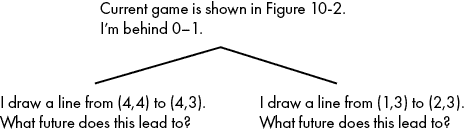

## 第十章：人工智能


在本书中，我们已经注意到人类大脑执行惊人任务的能力，无论是接球、校对文本，还是判断某人是否发生心脏病发作。我们探讨了如何将这些能力转化为算法及其中的挑战。在本章中，我们将再次面对这些挑战，并构建一个人工智能（AI）算法。我们将讨论的 AI 算法不仅适用于某个特定任务，比如接球，还能应用于广泛的竞争场景。这种广泛的适应性是人工智能让人兴奋的地方——就像人类可以在一生中学习新技能一样，最好的 AI 也可以在只需最少的重新配置的情况下，应用到它从未见过的领域。

*人工智能*这一术语常常让人感觉神秘且高度先进。有人认为人工智能让计算机能够像人类一样思考、感受并体验意识的思维；是否计算机最终能够做到这一点是一个开放的、困难的问题，远远超出了本章的讨论范围。我们将要构建的人工智能要简单得多，能够玩好一款游戏，但并不能写出真挚的爱情诗，也无法体验沮丧或欲望（就我所知！）。

我们的 AI 将能够玩*点与框*，这是一款简单但不平凡的全球性游戏。我们将从绘制游戏棋盘开始。接着，我们会构建一些函数来在游戏进行中记录分数。然后，我们将生成游戏树，表示在特定游戏中可以进行的所有可能的动作组合。最后，我们将引入极小极大算法，这是一种优雅的方法，可以在几行代码中实现 AI。

## La Pipopipette

点与框由法国数学家埃杜阿尔·卢卡斯发明，他将其命名为*la pipopipette*。游戏开始时使用的是*格子*，也就是点的网格，如图 10-1 所示。


图 10-1： 一个格子，我们可以用它作为点与框的游戏棋盘

这个格子通常是矩形的，但也可以是任何形状。两名玩家轮流对战。在每一轮中，玩家可以画出一条连接格子中两个相邻点的线段。如果他们用不同的颜色画线段，我们可以看到谁画了哪条线，尽管这并不是必须的。随着游戏的进行，线段将填满格子，直到每条连接相邻点的线段都被画出。你可以在图 10-2 中看到一个正在进行的示例游戏。

点与方框游戏中的玩家目标是绘制完成方格的线段。在 图 10-2 中，你可以看到在游戏棋盘的左下角，已经完成了一个方格。绘制了完成这个方格的线段的玩家将因此得一分。在右上角，你可以看到另一个方格的三条边已经绘制出来。现在是玩家一的回合，如果他们利用这一回合绘制从 (4,4) 到 (4,3) 的线段，他们将获得一分。如果他们选择绘制另一条线段，例如从 (4,1) 到 (5,1)，那么玩家二就有机会完成这个方格并获得一分。玩家仅在完成棋盘上最小的方格时才能得分：即边长为 1 的方格。当所有线段填满网格时，得分最多的玩家获胜。游戏还有一些变种，包括不同的棋盘形状和更高级的规则，但我们将在本章中构建的简单 AI 将适用于我们这里描述的规则。


图 10-2: 一个正在进行的点与方框游戏

## 绘制棋盘

虽然对我们的算法目的来说并非严格必要，但绘制棋盘可以使我们更容易可视化我们正在讨论的思想。一个非常简单的绘图函数可以通过遍历 x 和 y 坐标，并使用 Python 中 `matplotlib` 模块的 `plot()` 函数，绘制一个 *n*×*n* 的网格：

```py
import matplotlib.pyplot as plt
from matplotlib import collections as mc
def drawlattice(n,name):
    for i in range(1,n + 1):
        for j in range(1,n + 1):
            plt.plot(i,j,'o',c = 'black')
    plt.savefig(name)
```

在这段代码中，`n` 表示我们网格每一边的大小，我们使用 `name` 参数指定我们想要保存输出的文件路径。`c = 'black'` 参数指定网格中点的颜色。我们可以用以下命令创建一个 5×5 的黑色网格并保存它：

```py
drawlattice(5,'lattice.png')
```

这正是用来创建 图 10-1 的命令。

## 表示游戏

由于点与方框游戏由一系列按顺序绘制的线段组成，我们可以将游戏记录为一个按顺序排列的线条列表。就像我们在前几章中所做的那样，我们可以将一条线（一个回合）表示为一个包含两个有序对（线段的两端）的列表。例如，我们可以用以下列表表示从 (1,2) 到 (1,1) 的线段：

```py
[(1,2),(1,1)]
```

一个游戏将是这样一组按顺序排列的线条，例如以下示例：

```py
game = [[(1,2),(1,1)],[(3,3),(4,3)],[(1,5),(2,5)],[(1,2),(2,2)],[(2,2),(2,1)],[(1,1),(2,1)], \[(3,4),(3,3)],[(3,4),(4,4)]]
```

这个游戏是 图 10-2 中展示的游戏。我们可以看出它仍在进行中，因为并非所有可能的线段都已绘制出来以填充网格。

我们可以在 `drawlattice()` 函数中添加内容，创建一个 `drawgame()` 函数。这个函数应当绘制游戏棋盘上的点以及至今为止在游戏中绘制的所有线段。 清单 10-1 中的函数将完成这一任务。

```py
def drawgame(n,name,game):
    colors2 = []
    for k in range(0,len(game)):
        if k%2 == 0:
            colors2.append('red')
        else:
            colors2.append('blue')   
    lc = mc.LineCollection(game, colors = colors2, linewidths = 2)
    fig, ax = plt.subplots()
    for i in range(1,n + 1):
        for j in range(1,n + 1):
            plt.plot(i,j,'o',c = 'black')
    ax.add_collection(lc)
    ax.autoscale()
    ax.margins(0.1)
    plt.savefig(name)
```

清单 10-1: 一个绘制点与方框游戏棋盘的函数

这个函数接受`n`和`name`作为参数，和`drawlattice()`一样。它还包括我们在`drawlattice()`中用来绘制格点的完全相同的嵌套循环。你可以看到的第一个新增内容是`colors2`列表，它最初为空，我们用它来填充我们将要绘制的线段的颜色。在“点和框”游戏中，玩家轮流进行，因此我们会交替为线段分配颜色——在这种情况下，第一位玩家的线段为红色，第二位玩家的线段为蓝色。`colors2`列表定义后的`for`循环将其填充为交替的`'red'`和`'blue'`实例，直到颜色分配的数量与游戏中的步数一样多。我们添加的其他代码行创建了一组游戏步数的线段，并像我们在前几章中一样绘制它们。

我们可以像下面这样用一行代码调用我们的`drawgame()`函数：

```py
drawgame(5,'gameinprogress.png',game)
```

这正是我们创建图 10-2 的方式。

## 计分游戏

接下来，我们将创建一个可以记录“点和框”游戏得分的函数。我们从一个函数开始，该函数可以接受任何给定的游戏并找到已经完成的方块，然后我们创建一个计算得分的函数。我们的函数通过遍历游戏中的每一条线段来统计完成的方块。如果某条线是水平线，我们通过检查其下方平行的线是否也在游戏中绘制，以及该方块的左右两条边是否也已绘制来判断它是否是一个完全绘制的方块。列表 10-2 中的函数实现了这一点：

```py
def squarefinder(game):
    countofsquares = 0
    for line in game:
        parallel = False
        left=False
        right=False
        if line[0][1]==line[1][1]:
            if [(line[0][0],line[0][1]-1),(line[1][0],line[1][1] - 1)] in game:
                parallel=True
            if [(line[0][0],line[0][1]),(line[1][0]-1,line[1][1] - 1)] in game:
                left=True           
            if [(line[0][0]+1,line[0][1]),(line[1][0],line[1][1] - 1)] in game:
                right=True  
 if parallel and left and right:
                countofsquares += 1
    return(countofsquares)
```

列表 10-2: 一个计算“点和框”游戏棋盘上方块数量的函数

你可以看到，该函数返回`countofsquares`的值，我们在函数开始时将其初始化为`0`。该函数的`for`循环遍历游戏中的每一条线段。我们一开始假设该线下方的平行线以及连接这些平行线的左右线都还没有在游戏中绘制。如果某条线是水平线，我们检查这些平行线、左右线是否存在。如果我们检查的方块的四条线都出现在游戏中，那么我们将`countofsquares`变量加 1。通过这种方式，`countofsquares`记录了迄今为止游戏中完全绘制的方块总数。

现在我们可以编写一个简短的函数来计算游戏的得分。得分将以一个包含两个元素的列表记录，如`[2,1]`。得分列表的第一个元素代表第一位玩家的得分，第二个元素代表第二位玩家的得分。列表 10-3 展示了我们的得分函数。

```py
def score(game):
    score = [0,0]
    progress = []
    squares = 0
    for line in game:
        progress.append(line)
        newsquares = squarefinder(progress)
        if newsquares > squares:
            if len(progress)%2 == 0:
                score[1] = score[1] + 1
            else:
                score[0] = score[0] + 1
        squares=newsquares
    return(score)
```

列表 10-3: 一个计算正在进行的点线方块游戏得分的函数

我们的得分函数会按顺序遍历游戏中的每个线段，考虑每个回合所画的线段组成的部分游戏。如果在某个部分游戏中，绘制的方块数比上一个回合绘制的方块数多，那么我们就知道，当前回合的玩家得分了，我们将他们的得分加 1。你可以运行`print(score(game))`来查看图 10-2 中展示的游戏得分。

## 游戏树与如何赢得游戏

现在你已经了解了如何绘制和评分点线方块游戏，我们来考虑如何赢得这场游戏。你可能并不特别关心点线方块作为一款游戏，但赢得这场游戏的方式与赢得国际象棋、跳棋或井字游戏的方法是相同的，一个可以帮助你赢得所有这些游戏的算法，也可以为你提供一种全新的方式来思考你在生活中遇到的每一种竞争情境。制胜策略的本质，实际上就是系统地分析我们当前行动的未来后果，并选择能够带来最佳未来的行动。这听起来可能有些套话，但我们实现这一点的方式将依赖于小心、系统的分析；这可以呈现为一棵树，类似于我们在第九章中构建的树。

考虑图 10-3 中展示的可能的未来结果。


图 10-3: 我们游戏的一些可能延续的树形图

我们从树的顶部开始，考虑当前的情况：我们落后 0-1，现在轮到我们走棋。我们考虑的一步是左支路中的一步：从(4,4)到(4,3)画一条线。这一步将完成一个方块，并为我们获得 1 分。不论对手走什么棋（见图 10-3 中左下角两个分支列出的可能性），在对手下一步后，比赛将会平局。相反，如果我们在当前回合选择从(1,3)到(2,3)画一条线，如图 10-3 右支路所示，对手接下来将有两个选择：从(4,4)到(4,3)画线并完成一个方块得 1 分，或者画另一条线，如连接(3,1)和(4,1)，并保持比分为 0-1。

考虑这些可能性，在两步内，游戏的得分可能是三种不同的结果：1-1，0-2，或者 0-1。在这棵树中，很明显我们应该选择左支路，因为从左支路发展出来的每一个可能性都会比右支路发展出来的可能性为我们带来更好的得分。这种推理方式正是我们的 AI 决策最佳走法的精髓。它将构建一个游戏树，检查游戏树中所有终端节点的结果，然后通过简单的递归推理，决定采取什么行动，依据这一决策将开启的可能未来。

你可能注意到，图 10-3 中的游戏树显得非常不完整。看起来似乎只有两种可能的移动（左分支和右分支），而在每一次这些可能的移动之后，对方也只有两种可能的移动。当然，这是不正确的；两位玩家都有许多选择。请记住，他们可以连接格子中任何两个相邻的点。真正表示我们游戏中这个时刻的游戏树应该有许多分支，每个玩家每个可能的移动都会对应一个分支。这在树的每一层都是如此：不仅我有很多可以选择的移动，我的对手也有，而每一个这些移动都会在游戏树中的每一个可操作的点上有一个分支。只有在游戏接近尾声时，当几乎所有线段已经绘制完成，可能的移动数才会减少到两个和一个。我们没有在图 10-3 中画出所有分支，是因为页面空间不够——我们只有空间展示了几种移动，仅仅是为了说明游戏树的概念和我们的思考过程。

你可以想象一个游戏树，它可以扩展到任何可能的深度——我们不仅要考虑我们的移动和对方的反应，还要考虑我们对该反应的回应，以及对方对这个回应的反应，以此类推，直到我们想要继续构建游戏树为止。

### 构建我们的树

我们这里构建的游戏树在几个重要方面与第九章中的决策树不同。最重要的区别是目标：决策树通过特征进行分类和预测，而游戏树则简单地描述了所有可能的未来。由于目标不同，因此我们的构建方法也会有所不同。请记得在第九章中，我们需要选择一个变量和一个分裂点来决定树中的每一条分支。而在这里，知道接下来会有哪些分支很容易，因为对于每一个可能的移动，都会有恰好一条分支。我们所需要做的，就是生成一个游戏中所有可能移动的列表。我们可以通过几个嵌套循环来实现这一点，循环会考虑格子中每一对点之间的所有可能连接：

```py
allpossible = []

gamesize = 5

for i in range(1,gamesize + 1):
    for j in range(2,gamesize + 1):
        allpossible.append([(i,j),(i,j - 1)])

for i in range(1,gamesize):
    for j in range(1,gamesize + 1):
        allpossible.append([(i,j),(i + 1,j)])
```

这段代码首先定义了一个空的列表，名为`allpossible`，以及一个`gamesize`变量，表示我们格子中每一边的长度。接着，我们有两个循环。第一个循环是为了将垂直移动添加到我们的可能移动列表中。注意，对于每一个可能的`i`和`j`值，这个循环将`[(i,j),(i,j - 1)]`表示的移动添加到可能的移动列表中。这将始终是一个垂直线段。我们的第二个循环类似，不过对于每一组可能的`i`和`j`值，它会将水平移动`[(i,j),(i + 1,j)]`添加到可能的移动列表中。最终，我们的`allpossible`列表将包含所有可能的移动。

如果你考虑到一场正在进行的游戏，例如图 10-2 中展示的游戏，你会意识到并非每个移动总是可行的。如果某个玩家在游戏中已经执行了某个特定的移动，那么接下来的任何玩家都不能再执行这个相同的移动。我们需要一种方法来从所有可能的移动列表中移除那些已经执行过的移动，从而得到一个仅包含某个特定进行中的游戏中仍然可能的所有移动的列表。这很容易实现：

```py
for move in allpossible:
    if move in game:
        allpossible.remove(move)
```

正如你所看到的，我们遍历了所有可能的移动列表中的每一个移动，如果某个移动已经被执行过，我们就将它从列表中移除。最终，我们得到的列表只包含当前游戏中可能的移动。你可以运行`print(allpossible)`来查看所有这些移动，并检查它们是否正确。

现在我们已经有了每一个可能移动的列表，我们可以构建游戏树。我们将记录游戏树作为一个嵌套的移动列表。记住，每个移动可以记录为有序对的列表，例如`[(4,4),(4,3)]`，这是图 10-3 中左分支的第一个移动。如果我们想表示一个只包含图 10-3 中前两个移动的树，我们可以这样写：

```py
simple_tree = [[(4,4),(4,3)],[(1,3),(2,3)]]
```

这棵树只包含两个移动：我们在图 10-3 中考虑执行的当前状态下的移动。如果我们想包括对手的潜在回应，我们将需要添加另一层嵌套。我们通过将每个移动和它的*子节点*（从原始移动分支出的移动）放在一个列表中来实现这一点。让我们从添加表示移动子节点的空列表开始：

```py
simple_tree_with_children = [[[(4,4),(4,3)],[]],[[(1,3),(2,3)],[]]]
```

稍微停下来，确保你能看到我们所做的所有嵌套。每个移动本身就是一个列表，并且是一个列表的第一个元素，这个列表还将包含该列表的子节点。然后，所有这些列表一起存储在一个主列表中，这就是我们的完整树。

我们可以用这个嵌套的列表结构来表示图 10-3 中整个游戏树，包括对手的回应：

```py
full_tree = [[[(4,4),(4,3)],[[(1,3),(2,3)],[(3,1),(4,1)]]],[[(1,3),(2,3)],[[(4,4),(4,3)],\[(3,1),(4,1)]]]]
```

方括号很快就会变得不易管理，但我们需要这种嵌套结构，这样我们才能正确地追踪哪些移动是哪个移动的子节点。

我们可以通过编写一个函数来代替手动编写游戏树，它会为我们创建游戏树。该函数将接受我们的可能移动列表作为输入，然后将每个移动附加到树中（见列表 10-4）。

```py
def generate_tree(possible_moves,depth,maxdepth):
    tree = []
    for move in possible_moves:
        move_profile = [move]
        if depth < maxdepth:
            possible_moves2 = possible_moves.copy()
            possible_moves2.remove(move)
            move_profile.append(generate_tree(possible_moves2,depth + 1,maxdepth))
        tree.append(move_profile)
    return(tree)
```

列表 10-4: 一个创建指定深度游戏树的函数

这个函数`generate_tree()`首先定义了一个空列表，叫做`tree`。然后，它会遍历每一个可能的步伐。对于每一个步伐，它会创建一个`move_profile`。一开始，`move_profile`仅包含步伐本身。但对于还没有到达游戏树最低深度的分支，我们需要添加这些步伐的子步伐。我们递归地添加子步伐：我们再次调用`generate_tree()`函数，但这时我们已经从`possible_moves`列表中移除了一步。最后，我们将`move_profile`列表附加到树上。

我们可以用以下几行简单地调用这个函数：

```py
allpossible = [[(4,4),(4,3)],[(4,1),(5,1)]]
thetree = generate_tree(allpossible,0,1)
print(thetree)
```

当我们运行这个时，我们会看到以下的树结构：

```py
[[[(4, 4), (4, 3)], [[[(4, 1), (5, 1)]]]], [[(4, 1), (5, 1)], [[[(4, 4), (4, 3)]]]]]
```

接下来，我们将做出两个修改，使得我们的树更有用：第一个记录了游戏得分和步伐，第二个附加了一个空列表，用来为子步伐留个位置（清单 10-5）。

```py
def generate_tree(possible_moves,depth,maxdepth,game_so_far):
    tree = []
    for move in possible_moves:
        move_profile = [move]
        game2 = game_so_far.copy()
        game2.append(move)
        move_profile.append(score(game2))
        if depth < maxdepth:
            possible_moves2 = possible_moves.copy()
            possible_moves2.remove(move)
            move_profile.append(generate_tree(possible_moves2,depth + 1,maxdepth,game2))
 else:
            move_profile.append([])
        tree.append(move_profile)
    return(tree)
```

清单 10-5: 一个生成游戏树的函数，包括子步伐和游戏得分

我们可以按如下方式再次调用：

```py
allpossible = [[(4,4),(4,3)],[(4,1),(5,1)]]
thetree = generate_tree(allpossible,0,1,[])
print(thetree)
```

我们得到了以下结果：

```py
[[[(4, 4), (4, 3)], [0, 0], [[[(4, 1), (5, 1)], [0, 0], []]]], [[(4, 1), (5, 1)], [0, 0], \[[[(4, 4), (4, 3)], [0, 0], []]]]]
```

你可以看到，这棵树中的每个条目都是一个完整的步伐资料，包括一个步伐（比如`[(4,4),(4,3)]`）、一个得分（比如`[0,0]`）以及一个（有时为空的）子步伐列表。

### 获得游戏胜利

我们终于准备好创建一个可以玩“点与方块”游戏的函数了。在编写代码之前，让我们先考虑一下它背后的原则。具体来说，作为人类，我们是如何玩好“点与方块”这款游戏的？更一般地说，我们是如何赢得任何战略性游戏（比如国际象棋或井字棋）的？每个游戏都有独特的规则和特性，但有一种基于游戏树分析选择获胜策略的一般方法。

我们将用来选择获胜策略的算法叫做*极小极大*（*minimax*，由*minimum*和*maximum*两个词组合而成），之所以这样叫，是因为在我们尝试最大化游戏得分时，我们的对手则试图最小化我们的得分。我们在最大化和对手在最小化之间的持续斗争，就是我们在选择正确的步伐时需要战略性考虑的内容。

让我们仔细看看图 10-3 中的简单游戏树。从理论上讲，游戏树可以变得非常庞大，具有巨大的深度，并且每一层都有许多分支。但无论游戏树有多大，它都由相同的组件组成：许多小的嵌套分支。

在我们正在考虑的图 10-3 这一点上，我们有两个选择。图 10-4 展示了这两种选择。



图 10-4: 考虑选择两个步骤中的哪一个

我们的目标是最大化我们的得分。为了在这两个步伐之间做出选择，我们需要知道它们将带来什么后果，每个步伐会带来什么样的未来。为了了解这一点，我们需要进一步深入游戏树，查看所有可能的后果。让我们从右边的步伐开始（图 10-5）。


图 10-5: 假设对手将试图最小化你的得分，你可以找到每一步预计将导致的未来局面。

这一步可能会导致两种未来局面中的任何一种：在树的末端我们可能落后于 0-1，或者我们可能落后于 0-2。如果我们的对手玩得很好，他们会想要最大化自己的得分，这等同于最小化我们的得分。如果对手想要最小化我们的得分，他们会选择把我们置于 0-2 落后的局面。相反，考虑我们的另一个选择，即图 10-5 的左分支，其可能的未来局面在图 10-6 中进行了考虑。


图 10-6: 无论对手选择什么，我们都预期得到相同的结果。

在这种情况下，我们对手的两个选择都将导致 1-1 的得分。同样假设我们的对手会采取最小化我们得分的行动，我们可以说这一步将导致比赛以 1-1 平局结束。

现在我们知道了这两步将带来的未来局面。图 10-7 在图 10-4 的更新版本中记录了这些未来局面。

因为我们准确知道每一步可能带来的未来局面，我们可以进行最大化：导致最大得分的最佳步骤是左侧的那一步，所以我们选择了那一步。


图 10-7: 利用图 10-5 和 10-6，我们可以推理出每一步将导致的未来局面，并进行比较。

我们刚才经历的推理过程被称为最小最大算法（minimax algorithm）。我们现在的决策是为了最大化我们的得分。但是为了最大化得分，我们必须考虑对手所有试图最小化我们得分的方式。因此，最佳选择是最大化的最小值。

请注意，极小极大算法是通过逆向时间进行的。游戏的进程是向前的，从现在到未来。但是在某种意义上，极小极大算法是向后进行的，因为我们首先考虑可能的遥远未来的得分，然后再回到当前，找到能够通向最佳未来的选择。在我们的游戏树中，极小极大算法从树的顶部开始。它递归地调用每一个子分支。子分支又递归地调用极小极大算法，继续递归到终端节点。在终端节点处，我们不再继续调用极小极大算法，而是为每个节点计算游戏得分。因此，我们首先计算终端节点的游戏得分；我们从遥远的未来开始计算游戏得分。这些得分随后被传回父节点，以便父节点可以计算出最佳的走法及其对应的得分。这些得分和走法将被传回游戏树的上方，直到到达最顶层的父节点，这个父节点代表着现在。

清单 10-6 中包含了一个实现极小极大算法的函数。

```py
import numpy as np
def minimax(max_or_min,tree):
    allscores = []
    for move_profile in tree:
        if move_profile[2] == []:
            allscores.append(move_profile[1][0] - move_profile[1][1])
        else:
            move,score=minimax((-1) * max_or_min,move_profile[2])
            allscores.append(score)
    newlist = [score * max_or_min for score in allscores]
    bestscore = max(newlist)
    bestmove = np.argmax(newlist)
    return(bestmove,max_or_min * bestscore)
```

清单 10-6: 一个使用极小极大算法来寻找游戏树中最佳走法的函数

我们的`minimax()`函数相对较短。大部分代码是一个`for`循环，用于遍历树中的每个走法。如果该走法没有子走法，那么我们根据该走法与对手的得分差计算该走法的得分。如果该走法有子走法，我们就对每个子走法调用`minimax()`来获取每个走法的得分。然后，我们只需要找到与最大得分相关的走法。

我们可以调用我们的`minimax()`函数，在任何进行中的游戏中的任意回合找到最佳走法。在调用`minimax()`之前，让我们先确保一切都已正确定义。首先，让我们定义游戏，并使用之前的代码获取所有可能的走法：

```py
allpossible = []

game = [[(1,2),(1,1)],[(3,3),(4,3)],[(1,5),(2,5)],[(1,2),(2,2)],[(2,2),(2,1)],[(1,1),(2,1)],\[(3,4),(3,3)],[(3,4),(4,4)]]

gamesize = 5

for i in range(1,gamesize + 1):
    for j in range(2,gamesize + 1):
        allpossible.append([(i,j),(i,j - 1)])

for i in range(1,gamesize):
    for j in range(1,gamesize + 1):
        allpossible.append([(i,j),(i + 1,j)])

for move in allpossible:
    if move in game:
        allpossible.remove(move)
```

接下来，我们将生成一个完整的游戏树，扩展到三层深度：

```py
thetree = generate_tree(allpossible,0,3,game)
```

现在我们已经有了我们的游戏树，我们可以调用我们的`minimax()`函数：

```py
move,score = minimax(1,thetree)
```

最后，我们可以按如下方式检查最佳的走法：

```py
print(thetree[move][0])
```

我们看到最佳的走法是`[(4, 4), (4, 3)]`，这一步完成了一个方块并为我们赢得了一个积分。我们的 AI 可以玩点阵和方格游戏，并选择最佳的走法！你可以尝试其他游戏板大小，或者不同的游戏场景，或者不同的树深度，检查我们的极小极大算法实现是否表现良好。在本书的续集中，我们将讨论如何确保你的 AI 既不会突然自我觉醒，也不会变得邪恶，决定推翻人类。

### 添加增强功能

既然你已经能执行最小最大算法了，你就可以把它应用到任何你正在玩的游戏中。或者，你也可以将它应用到生活决策中，考虑未来并最大化每个最小可能性。（最小最大算法的结构对于任何竞争情境都是一样的，但为了将我们的最小最大代码用于其他游戏，我们需要编写新的代码来生成游戏树、枚举每个可能的动作，以及计算游戏分数。）

我们在这里构建的 AI 能力非常有限。它只能玩一个游戏，且仅适用于一种简单的规则版本。根据你使用的处理器，AI 可能只能提前看几个步骤，而不会在每次决策时花费过多的时间（几分钟或更长）。我们自然希望能增强我们的 AI，使其变得更强大。

我们肯定需要改善的一个方面是 AI 的速度。它之所以很慢，是因为它需要处理庞大的游戏树。提高最小最大算法性能的主要方法之一是修剪游戏树。正如你在第九章中学到的那样，修剪就是字面意思：我们会去除那些特别糟糕的分支，或者是与其他分支重复的分支。修剪并非易事，它需要学习更多的算法来做好这件事。一个例子就是*alpha–beta 修剪算法*，它会在某些子分支肯定比其他分支差的情况下，停止检查这些子分支。

另一个自然的改进方向是让我们的 AI 能适应不同的规则或不同的游戏。例如，在“点与盒”游戏中，一个常见的规则是，玩家在得分后可以再画一条线。有时，这会导致一个连锁反应，其中一名玩家在一轮内连续完成多个盒子。这一简单的变化，叫做“得分即得继续”规则，在我小学的操场上就是这么叫的，它改变了游戏的战略考虑，并需要对我们的代码做出一些调整。你也可以尝试实现一个能在交叉形状或其他可能影响策略的特殊形状的网格上玩的“点与盒”AI。最小最大算法的美妙之处在于它不需要微妙的战略理解；它只需要具备提前预测的能力，这也是为什么一个不擅长象棋的程序员能够编写出一个最小最大算法，并在象棋中战胜他自己的原因。

有一些强大的方法超出了本章的范围，它们可以提高计算机 AI 的表现。这些方法包括强化学习（例如，棋类程序通过自我对弈来提高水平）、蒙特卡罗方法（例如，将随机生成未来的将棋游戏来帮助理解可能性），以及神经网络（例如，井字棋程序使用类似于我们在第九章讨论的机器学习方法来预测对手的动作）。这些方法既强大又引人注目，但它们大多数只是让我们的树搜索和 minimax 算法更高效；树搜索和 minimax 仍然是战略性 AI 中那种谦逊的核心工具。

## 摘要

在本章中，我们讨论了人工智能。它是一个充满炒作的术语，但当你看到只需约十几行代码就能编写一个`minimax()`函数时，人工智能突然看起来不那么神秘和令人畏惧。当然，为了准备编写这些代码，我们首先需要学习游戏规则，绘制游戏棋盘，构建游戏树，并配置我们的`minimax()`函数以正确计算游戏结果。更不用说本书的其余部分，我们在其中精心构建了算法，帮助我们以算法化的方式思考，并在需要时编写这个函数。

下一章为有志于深入算法世界的算法学者们提出了下一步的建议，帮助他们不断推动算法的前沿。
