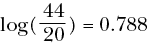
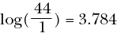
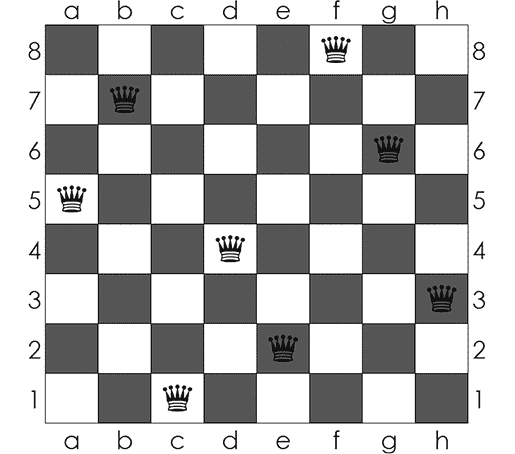
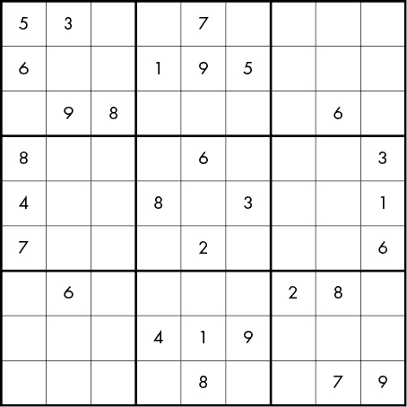

## 第十一章：继续前进


你已经穿越了搜索与排序的黑暗森林，越过了深奥数学的冰冻河流，攀越了梯度上升的危险山口，越过了几何绝望的沼泽，征服了慢运行时间的巨龙。恭喜你。如果你愿意，你可以回到你那无算法的舒适家园。本章是为那些希望在合上这本书后继续冒险的人准备的。

没有一本书能够涵盖关于算法的所有内容。要了解的东西实在太多了，而且新的知识不断被发现。本章内容涉及三件事：用算法做更多的事情，利用算法更好更快地完成任务，以及解决算法的深层次谜题。

在本章中，我们将构建一个简单的聊天机器人，它能够与我们讨论书中的前几章内容。接着，我们将讨论一些世界上最困难的问题，以及我们如何向着制定解决这些问题的算法迈进。最后，我们将讨论一些算法世界中最深奥的谜题，包括如何通过高级算法理论赢得百万美元的详细说明。

## 用算法做更多的事情

本书的前 10 章介绍了可以执行多种任务的算法，涵盖了多个领域。但算法能做的事情远不止我们在这里看到的。如果你希望继续你的算法冒险之旅，你应该探索其他领域及其相关的重要算法。

例如，许多信息压缩算法可以将一本长书存储为一种编码形式，其大小仅为原书的一个小部分，它们还能将复杂的照片或电影文件压缩成可管理的大小，且几乎不损失质量，甚至完全不损失质量。

我们在线上安全沟通的能力，包括自信地将我们的信用卡信息传递给第三方，依赖于加密算法。学习密码学非常有趣，因为它伴随着一段惊险的历史，涉及冒险家、间谍、背叛者，以及那些通过破译密码来赢得战争的英雄书呆子。

最近，创新的算法被开发出来用于执行并行分布式计算。与一次性执行一个操作、重复数百万次不同，分布式计算算法将一个数据集拆分成多个小部分，然后将它们发送到不同的计算机上，计算机同时执行所需操作并返回结果，结果再被重新组合并呈现为最终输出。通过并行处理数据的所有部分，而不是依次处理，並行计算节省了大量的时间。这对于机器学习中的应用非常有用，因为机器学习需要处理极其庞大的数据集，或者需要同时执行大量的简单计算。

几十年来，人们一直对量子计算的潜力感到兴奋。如果我们能将量子计算机工程化，使其正常工作，它们有潜力在今天的非量子超级计算机所需时间的极短时间内执行极其困难的计算（包括破解最先进加密技术所需的计算）。由于量子计算机与标准计算机的架构不同，因此有可能设计出新的算法，利用它们不同的物理特性，以更高的速度执行任务。目前，这更像是一个学术问题，因为量子计算机还没有进入可用于实际目的的状态。但如果技术成熟，量子算法可能会变得极为重要。

当你学习这些或其他许多领域的算法时，你不会从零开始。通过掌握本书的算法，你已经了解它们是什么，它们的功能倾向以及如何为它们编写代码。学习第一个算法可能会感觉非常困难，但学习第 50 个或第 200 个算法会容易得多，因为你的大脑已经习惯了它们的构造模式和思考方式。

为了证明你现在能够理解并编写算法，我们将探索几个共同工作的算法，提供聊天机器人的功能。如果你能够理解它们如何工作，以及如何为它们编写代码，那么你就能在任何领域掌握任何算法的工作原理。

## 构建一个聊天机器人

让我们构建一个简单的聊天机器人，可以回答有关本书目录的问题。我们将首先导入一些稍后会用到的模块：

```py
import pandas as pd
from sklearn.feature_extraction.text import TfidfVectorizer
from scipy import spatial
import numpy as np
import nltk, string
```

创建聊天机器人的下一步是进行*文本规范化*，即将自然语言文本转换为标准化子字符串的过程；它使得表面上不同的文本之间可以轻松进行比较。我们希望我们的机器人理解，*America*和*america*指的是同一件事，*regeneration*与*regenerate*表达的是相同的思想（尽管词性不同），*centuries*是*century*的复数形式，而且*hello;*本质上与*hello*没有什么不同。我们希望我们的聊天机器人对同根词汇进行相同的处理，除非有某些特殊原因。

假设我们有以下查询：

```py
query = 'I want to learn about geometry algorithms.'
```

我们能做的第一件事是将所有字符转换为小写。Python 的内置`lower()`方法可以完成这个任务：

```py
print(query.lower())
```

这将输出`i want to learn about geometry algorithms`。我们还可以做的另一件事是去除标点符号。为了做到这一点，首先我们将创建一个名为*字典*的 Python 对象：

```py
remove_punctuation_map = dict((ord(char), None) for char in string.punctuation)
```

这个代码片段创建了一个字典，将每个标准标点符号映射到 Python 对象`None`，并将字典存储在名为`remove_punctuation_map`的变量中。我们然后使用这个字典像这样去除标点：

```py
print(query.lower().translate(remove_punctuation_map))
```

在这里，我们使用了`translate()`方法，将查询中找到的所有标点符号替换为空—换句话说，移除标点符号。我们得到的输出与之前看到的一样—`i want to learn about geometry algorithms`—但没有结尾的句号。接下来，我们可以执行*分词*，将文本字符串转换为一组连贯的子字符串：

```py
print(nltk.word_tokenize(query.lower().translate(remove_punctuation_map)))
```

我们使用了`nltk`的分词函数来实现这个功能，得到了如下输出：`['i', 'want', 'to', 'learn', 'about', 'geometry', 'algorithms']`。

现在我们可以进行所谓的*词干提取*。在英语中，我们使用单词*jump*、*jumps*、*jumping*、*jumped*和其他派生形式，它们虽然不同，但共享一个*词干*：动词*jump*。我们不希望我们的聊天机器人被词形变化的小差异分心；我们希望把关于跳跃的句子和关于跳高者的句子看作是相似的，尽管它们在技术上是不同的单词。词干提取会去掉派生词的结尾部分，将其转换为标准化的词干。Python 的`nltk`模块中提供了词干提取的函数，我们可以通过列表推导式来使用这个函数，如下所示：

```py
stemmer = nltk.stem.porter.PorterStemmer()
def stem_tokens(tokens):
    return [stemmer.stem(item) for item in tokens]
```

在这个代码片段中，我们创建了一个名为`stem_tokens()`的函数。它接受一个标记（tokens）列表，并调用`nltk`的`stemmer.stem()`函数将它们转换为词干：

```py
print(stem_tokens(nltk.word_tokenize(query.lower().translate(remove_punctuation_map))))
```

输出结果是`['i', 'want', 'to', 'learn', 'about', 'geometri', 'algorithm']`。我们的词干提取器将*algorithms*转换为*algorithm*，将*geometry*转换为*geometri*。它用它认为的词干替换了单词：一个单数单词或词部分，便于文本比较。最后，我们将所有的标准化步骤合并在一个函数`normalize()`中：

```py
def normalize(text):
    return stem_tokens(nltk.word_tokenize(text.lower().translate(remove_punctuation_map)))
```

### 文本向量化

现在你已经准备好学习如何将文本转换为数字向量了。与单词相比，数字和向量之间的定量比较要容易得多，而我们将需要进行定量比较来让我们的聊天机器人正常工作。

我们将使用一种简单的方法，叫做*TFIDF*，即*词频-逆文档频率*，它将文档转换为数字向量。每个文档向量都有一个元素对应语料库中的每个词项。每个元素是给定词项的词频（即某个词在特定文档中出现的次数）和逆文档频率（即该词出现在文档中比例的倒数的对数）的乘积。

例如，假设我们正在为美国总统的传记创建 TFIDF 向量。在创建 TFIDF 向量的过程中，我们将每篇传记视作一个文档。在亚伯拉罕·林肯的传记中，词语*representative*可能至少出现一次，因为他曾在伊利诺伊州众议院和美国众议院任职。如果*representative*在传记中出现了三次，那么我们说它的词频是 3。美国众议院曾有十几位总统任职，所以大约在 44 位总统的传记中，有 20 篇包含了词语*representative*。我们可以通过以下方式计算逆文档频率：



我们要找的最终值是词频乘以逆文档频率：3 × 0.788 = 2.365。现在考虑词语*Gettysburg*。它可能在林肯的传记中出现了两次，但在其他任何传记中都没有出现，因此词频将是 2，逆文档频率将是：



与*Gettysburg*相关的向量元素将是词频乘以逆文档频率，即 2 × 3.784 = 7.568。每个术语的 TFIDF 值应该反映它在文档中的重要性。很快，这对于我们的聊天机器人理解用户意图将变得至关重要。

我们不需要手动计算 TFIDF。我们可以使用`scikit-learn`模块中的一个函数：

```py
vctrz = TfidfVectorizer(ngram_range = (1, 1),tokenizer = normalize, stop_words = 'english')
```

这一行创建了一个`TfidfVectorizer()`函数，它能够从文档集合中创建 TFIDF 向量。为了创建向量化器，我们需要指定一个`ngram_range`。这个参数告诉向量化器什么应该被视作一个术语。我们指定了`(1, 1)`，这意味着我们的向量化器将只把 1-gram（单个词）视作术语。如果我们指定`(1, 3)`，它将把 1-gram（单个词）、2-gram（两词短语）和 3-gram（三词短语）都视作术语，并为每个术语创建一个 TFIDF 元素。我们还指定了一个`tokenizer`，并且指定了我们之前创建的`normalize()`函数。最后，我们需要指定`stop_words`，即我们想要过滤掉的、没有信息量的词。在英语中，停用词包括*the*、*and*、*of*以及其他一些非常常见的词。通过指定`stop_words = 'english'`，我们告诉向量化器过滤掉内建的英语停用词集合，只对不太常见、信息量较大的词进行向量化。

现在，让我们配置一下我们的聊天机器人能讨论的内容。在这里，它将能够讨论本书的章节，因此我们将创建一个包含每个章节简单描述的列表。在这个上下文中，每个字符串将是我们一个*文档*。

```py
alldocuments = ['Chapter 1\. The algorithmic approach to problem solving, including Galileo and baseball.',
            'Chapter 2\. Algorithms in history, including magic squares, Russian peasant multiplication, and Egyptian methods.',
            'Chapter 3\. Optimization, including maximization, minimization, and the gradient ascent algorithm.',
            'Chapter 4\. Sorting and searching, including merge sort, and algorithm runtime.',
            'Chapter 5\. Pure math, including algorithms for continued fractions and random numbers and other mathematical ideas.',
            'Chapter 6\. More advanced optimization, including simulated annealing and how to use it to solve the traveling salesman problem.',
            'Chapter 7\. Geometry, the postmaster problem, and Voronoi triangulations.',
            'Chapter 8\. Language, including how to insert spaces and predict phrase completions.',
            'Chapter 9\. Machine learning, focused on decision trees and how to predict happiness and heart attacks.',
            'Chapter 10\. Artificial intelligence, and using the minimax algorithm to win at dots and boxes.',
            'Chapter 11\. Where to go and what to study next, and how to build a chatbot.']
```

我们将继续通过*拟合*我们的 TFIDF 向量器到这些章节描述，这将处理文档，使我们随时准备创建 TFIDF 向量。我们不需要手动完成这个过程，因为在`scikit-learn`模块中定义了一个`fit()`方法：

```py
vctrz.fit(alldocuments)
```

现在，我们将为章节描述和一个新的查询创建 TFIDF 向量，查询要求关于排序和搜索的章节：

```py
query = 'I want to read about how to search for items.'
tfidf_reports = vctrz.transform(alldocuments).todense()
tfidf_question = vctrz.transform([query]).todense()
```

我们的新查询是关于搜索的自然英语文本。接下来的两行使用内置的`translate()`和`todense()`方法创建章节描述和查询的 TFIDF 向量。

现在我们已将章节描述和查询转换为数字 TFIDF 向量。我们的简单聊天机器人将通过将查询的 TFIDF 向量与章节描述的 TFIDF 向量进行比较，得出用户正在寻找的章节是描述向量与查询向量最为接近的章节。

### 向量相似度

我们将通过一个名为*余弦相似度*的方法决定两个向量是否相似。如果你学过很多几何学，你会知道，对于任何两个数值向量，我们可以计算它们之间的角度。几何规则使我们能够计算向量之间的角度，不仅仅是在二维和三维空间中，还可以在四维、五维或任意维度中。如果向量之间非常相似，它们之间的角度将非常小。如果向量之间非常不同，角度将很大。很难想象我们可以通过计算“角度”来比较英文文本，但这正是我们创建数字 TFIDF 向量的原因——这样我们就可以使用像角度比较这样的数值工具来处理本来不是数值的文本数据。

实际上，计算两个向量之间角度的余弦比计算角度本身更容易。这不是问题，因为我们可以得出结论，如果两个向量之间角度的余弦值很大，那么角度本身很小，反之亦然。在 Python 中，`scipy`模块包含一个名为`spatial`的子模块，里面有一个计算向量之间角度余弦的函数。我们可以使用`spatial`中的功能，通过列表推导计算每个章节描述向量和查询向量之间的余弦：

```py
row_similarities = [1 - spatial.distance.cosine(tfidf_reports[x],tfidf_question) for x in \range(len(tfidf_reports)) ]
```

当我们打印出`row_similarities`变量时，我们看到以下向量：

```py
[0.0, 0.0, 0.0, 0.3393118510377361, 0.0, 0.0, 0.0, 0.0, 0.0, 0.0, 0.0]
```

在这种情况下，只有第四个元素大于零，意味着只有第四个章节描述向量与我们的查询向量有任何角度接近。通常，我们可以自动找出哪个行的余弦相似度最高：

```py
print(alldocuments[np.argmax(row_similarities)])
```

这给出了聊天机器人认为我们在寻找的章节：

```py
Chapter 4\. Sorting and searching, including merge sort, and algorithm runtime.
```

列表 11-1 将聊天机器人的简单功能放入一个函数中。

```py
def chatbot(query,allreports):
    clf = TfidfVectorizer(ngram_range = (1, 1),tokenizer = normalize, stop_words = 'english')
    clf.fit(allreports)
    tfidf_reports = clf.transform(allreports).todense()
    tfidf_question = clf.transform([query]).todense()
    row_similarities = [1 - spatial.distance.cosine(tfidf_reports[x],tfidf_question) for x in \range(len(tfidf_reports)) ]
    return(allreports[np.argmax(row_similarities)])
```

列表 11-1: 一个简单的聊天机器人功能，接受查询并返回与之最相似的文档

Listing 11-1 并没有包含任何新内容；所有的代码我们之前都已经见过。现在我们可以使用聊天机器人进行查询，询问在哪里可以找到某些内容：

```py
print(chatbot('Please tell me which chapter I can go to if I want to read about mathematics algorithms.',alldocuments))
```

输出将告诉我们去第五章：

```py
Chapter 5\. Pure math, including algorithms for continued fractions and random numbers and other mathematical ideas.
```

现在你已经看到了整个聊天机器人的工作原理，你可以理解为什么我们需要进行归一化和向量化。通过归一化和词干提取，我们可以确保“mathematics”这个词会促使机器人返回第五章的描述，即使该词并未直接出现在其中。通过向量化，我们启用了余弦相似性度量，它告诉我们哪一章的描述最匹配。

我们已经完成了我们的聊天机器人，它需要将几个不同的小型算法结合在一起（用于文本归一化、词干提取和数值化向量化的算法；用于计算向量之间夹角余弦的算法；以及基于查询/文档向量相似性提供聊天机器人回答的总体算法）。你可能已经注意到，我们并没有手动做很多计算——实际上，TFIDF 或余弦的计算是由我们导入的模块完成的。在实践中，你通常不需要真正理解一个算法的内部实现就可以导入它并在你的程序中使用。这有时是个福音，因为它可以加速我们的工作，并在需要时提供令人惊叹的复杂工具供我们使用。但它也可能是一个诅咒，因为它会导致人们误用他们不了解的算法；例如，《Wired》杂志中的一篇文章称，某个特定金融算法（使用高斯 copula 函数预测风险的方法）的误用导致了“摧毁华尔街”和“吞噬数万亿美元”，并且是大衰退的主要原因之一（* [`www.wired.com/2009/02/wp-quant/`](https://www.wired.com/2009/02/wp-quant/)*）。我鼓励你研究算法的深层理论，即使导入 Python 模块的便利性让这种研究看起来似乎不必要；这总能让你成为一个更好的学者或实践者。

这可能是最简单的聊天机器人，它只回答与本书章节相关的问题。你可以为它添加许多增强功能来改进它：使章节描述更具体，从而更容易匹配广泛的查询；找到一个比 TFIDF 表现更好的向量化方法；添加更多文档，让它能够回答更多问题。但是，尽管我们的聊天机器人不是最先进的，我们依然可以为它感到骄傲，因为它是我们的，并且是我们自己构建的。如果你能轻松地构建一个聊天机器人，你可以认为自己是一个合格的算法设计师和实施者——祝贺你在这本书的学习旅程中取得这一终极成就。

## 变得更好、更快

你现在能做的事情，比刚开始读这本书时多得多。但每个认真的冒险者也会希望能够做得更好、更快。

许多事情都可以让您在设计和实现算法方面变得更好。思考一下本书中我们实现的每个算法是如何依赖于对非算法主题的理解的。我们的棒球接球算法依赖于对物理学甚至是一点心理学的理解。俄罗斯农民乘法依赖于对指数和算术的深层次理解，包括二进制表示法。第七章的几何算法依赖于对点、线和三角形如何相关和拟合的深刻见解。您对您试图为其编写算法的领域的理解越深入，设计和实现算法就会越容易。因此，变得更擅长算法的方法很简单：只需完美理解一切。

另一个自然的下一步，是对您原始编程技能进行打磨和再打磨。记住，第八章介绍了列表推导作为 Pythonic 工具，使我们能够编写简洁且性能良好的语言算法。随着您学习更多的编程语言并掌握它们的特性，您将能够编写更加组织良好、更加紧凑和更加强大的代码。即使是熟练的程序员也可以通过回归基础和掌握基本原理来受益。许多有才华的程序员编写混乱、文档不佳或效率低下的代码，并认为他们可以凭借它“运行”。但请记住，代码通常不会单独成功——它几乎总是作为更广泛的程序的一部分存在，依赖于人们之间的合作和时间。因此，甚至像计划、口头和书面沟通、谈判以及团队管理等软技能也可以提高您在算法世界中的成功机会。

如果您喜欢创建完美的最优算法并将其推向最高效率，那么您很幸运。对于大量计算机科学问题来说，没有已知的高效算法能够比暴力算法快得多。在接下来的部分中，我们将概述其中的一些问题，并讨论它们的难点所在。如果您，亲爱的冒险家，能够快速解决这些问题的算法，那么您可能会一生享有名誉、财富和全世界的感激之情。我们还在等什么？让我们来看看我们中最勇敢的人面临的一些挑战。

## 雄心勃勃的算法

让我们考虑一个与国际象棋相关的相对简单的问题。国际象棋在一个 8×8 的棋盘上进行，两位对手轮流移动不同样式的棋子。一个棋子，皇后，可以沿着它所在的行、列或对角线移动任意数量的格子。通常，每个玩家只有一个皇后，但在标准的国际象棋比赛中，一个玩家最多可以有九个皇后。如果一个玩家有多个皇后，可能会出现两个或更多皇后互相“攻击”的情况——换句话说，它们被放置在同一行、同一列或同一对角线上。*八皇后问题*要求我们在标准棋盘上放置八个皇后，使得没有一对皇后处于同一行、同一列或同一对角线。图 11-1 展示了八皇后问题的一个解法。



图 11-1： 八皇后问题的一个解法（来源：Wikimedia Commons）

这个棋盘上的任何一个皇后都不会攻击其他皇后。解决八皇后问题的最简单方法就是简单地记住一个解法，比如 图 11-1 中的解法，并在每次被要求解决这个谜题时重复使用。然而，几个额外的难题使得记忆解法变得不可行。一个难题是增加皇后的数量和棋盘的大小。*n 皇后问题*要求我们在一个 *n*×*n* 的棋盘上放置 *n* 个皇后，使得没有一个皇后攻击任何其他皇后；*n* 可以是任何自然数，不管有多大。另一个难题是 *n 皇后完成问题*：你的对手首先放置一些皇后，可能是放置在一些位置，这会让你很难放置剩余的皇后，然后你需要将剩下的 *n* 个皇后放置到棋盘上，使得没有任何皇后会攻击其他皇后。你能设计一个运行非常快速并能解决这个问题的算法吗？如果能，你可能会赚到一百万美元（见第 212 页的“解决最深奥的谜题”）。

图 11-1 可能会让你联想到数独，因为它涉及到检查行和列中符号的唯一性。在数独中，目标是填入数字 1 到 9，使得每一行、每一列和每个 3×3 的小方块都包含每个数字的唯一一个实例 (图 11-2)。数独首先在日本流行起来，事实上，数独谜题让人想起我们在第二章中探讨的日本魔方阵。



图 11-2： 一个未完成的数独网格（来源：Wikimedia Commons）

想一想如何编写一个算法来解决数独难题是一个有趣的练习。最简单、最慢的算法是依靠暴力破解：尝试每一种可能的数字组合，并反复检查它们是否构成一个正确的解法，直到找到解法。这是可行的，但缺乏优雅，且可能需要极长的时间。直观上看，把 81 个数字填入一个网格，按照任何人都能轻松遵循的规则，似乎不应该突破我们世界计算资源的极限。更复杂的解法可以依靠逻辑来减少所需的运行时间。

*n*皇后问题和数独有另一个重要的共同特征：解法非常容易检查。也就是说，如果我给你看一个有皇后的棋盘，你可能只需几秒钟就能检查出它是否是*n*皇后问题的解法；如果我给你看一个 81 个数字的网格，你也能轻松判断它是否是一个正确的数独解法。我们可以轻松检查解法的便捷性，然而，遗憾的是，生成解法的便捷性远不及验证解法的便捷性——解决一个困难的数独难题可能需要几个小时，而验证它则只需几秒钟。生成与验证的努力不匹配在生活中的许多领域都很常见：我只需要很少的努力就能判断一顿饭是否好吃，但制作一顿美味的饭菜需要投入更多的时间和资源。同样，我检查一幅画是否美丽的时间远少于创作一幅美丽画作所需要的时间，而我验证一架飞机能否飞行所需的努力远少于制造一架能飞行的飞机所需的努力。

在理论计算机科学中，那些算法上难以解决但解法容易验证的问题是极其重要的，它们是该领域最深奥、最紧迫的谜团。尤其是那些勇敢的冒险者，可能会敢于深入这些谜团——但要小心那里潜伏的危险。

## 解开最深的谜团

当我们说数独解法容易验证但难以生成时，正式的说法是解法可以在*多项式时间*内验证；换句话说，验证解法所需的步骤数是数独棋盘大小的某个多项式函数。如果你回想一下第四章我们讨论的运行时间，你会记得，即使像*x*²和*x*³这样的多项式增长得很快，它们与像*e*^x 这样的指数函数相比，增长速度要慢得多。如果我们能够在多项式时间内验证一个问题的算法解法，我们认为验证是容易的，但如果解法的生成需要指数时间，我们就认为它是困难的。

有一个正式的名称来表示那些其解答可以在多项式时间内验证的问题类别：*NP 复杂性类*。（在这里，NP 代表 *非确定性多项式时间*，原因涉及到理论计算机科学，需要一个较长的讨论，这里不做展开。）NP 是计算机科学中两个最基本的复杂性类之一。第二个是 *P* 类，代表多项式时间。P 复杂性类包含所有可以通过在多项式时间内运行的算法找到解答的问题。对于 P 类问题，我们可以在多项式时间内 *找到* 完整的解答，而对于 NP 类问题，我们可以在多项式时间内 *验证* 解答，但找到这些解答可能需要指数级的时间。

我们知道数独是 NP 问题——在多项式时间内，验证一个给定的数独解是很容易的。那么，数独是否也是 P 问题呢？也就是说，是否存在一个算法能够在多项式时间内解决任何数独谜题？至今没有人找到过这样的算法，也没有人看起来接近找到它，但我们并不确定这是否是不可能的。

我们已知的属于 NP 类的问题列表非常长。一些旅行商问题的版本也属于 NP 类。魔方的最优解也是如此，还有像整数线性规划这样的重要数学问题。就像数独一样，我们不禁会想，这些问题是否也属于 P 类——我们能否在多项式时间内找到它们的解？可以这样提问：P 是否等于 NP？

2000 年，克莱数学研究所发布了一份名为千年奖问题的清单。它宣布，任何人如果发布一个已验证的解决方案，就能获得一百万美元的奖金。这个清单包含了七个与数学相关的世界上最重要的问题，而 P 是否等于 NP 也是其中之一；至今还没有人领取过这一奖项。是否会有某个高贵的冒险家在阅读这些文字后最终解开这个最关键的算法难题呢？我真诚地希望如此，并祝愿你们在这段旅程中好运、力量和快乐。

如果存在解决方案，它将证明以下两个论断之一：要么 P = NP，要么 P ≠ NP。证明 P = NP 可能相对简单，因为所需要的只是一个多项式时间算法来解决一个 NP 完全问题。*NP 完全*问题是一种特殊的 NP 问题，其特征是每个 NP 问题都可以快速简化为一个 NP 完全问题；换句话说，如果你能解决一个 NP 完全问题，就能解决所有 NP 问题。如果你能在多项式时间内解决任何一个 NP 完全问题，你就能在多项式时间内解决每个 NP 问题，这将证明 P = NP。事实上，数独和 n 皇后问题都是 NP 完全问题。这意味着找到一个多项式时间的算法来解决其中任何一个问题，不仅能解决所有现有的 NP 问题，还能为你赢得一百万美元和全球终身的声誉（更不用说在友好的数独比赛中击败你认识的每一个人）。

证明 P ≠ NP 可能不像解决数独那样直接。P ≠ NP 的概念意味着存在一些 NP 问题，它们无法通过任何具有多项式运行时间的算法解决。证明这一点等同于证明一个否定命题，从概念上讲，证明某个事物无法存在，比指出一个事物的例子要难得多。要在证明 P ≠ NP 的过程中取得进展，将需要深入研究理论计算机科学，超出本书的范围。虽然这条路更为艰难，但研究人员的共识似乎是 P ≠ NP，如果 P 与 NP 问题最终有解决方案，它很可能是证明 P ≠ NP。

P 与 NP 问题并不是唯一与算法相关的深刻谜题，尽管它是最直接能带来丰厚回报的那个。算法设计领域的每一个方面都有广阔的领域，供冒险者进军。这里不仅有理论和学术问题，还有一些实际问题，涉及如何在商业环境中实施算法上可靠的实践。不要浪费时间：记住你在这里学到的知识，继续前进，带着你的新技能，走向知识和实践的极限，开始你一生的算法冒险。朋友们，再见。
