## 第一章：探索性数据分析


这是一本数据科学书籍，因此让我们从数据入手。这是你应该习惯的做法：每一个数据科学问题的第一步就是探索数据。仔细查看数据的每一个细节将帮助你更好地理解它，并为下一步行动和更复杂的分析提供更清晰的思路。这也将帮助你尽早发现数据中的任何错误或问题。数据科学过程的这几个初步步骤被称为*探索性数据分析*。

我们将通过介绍一个商业场景并描述如何利用数据更好地运营企业来开始这一章。我们将讨论如何在 Python 中读取数据并检查基本的汇总统计信息。接着，我们将介绍一些 Python 工具来创建数据图表。我们将探讨可以执行的简单探索性分析，并讨论它们能为我们回答哪些问题。最后，我们将讨论这些分析如何帮助我们改进商业实践。本章中的简单分析正是你在处理任何数据科学问题时可以作为第一步进行的分析。让我们开始吧！

## 你作为首席执行官的第一天

假设你收到了一个工作邀请，成为华盛顿特区一家提供自行车租赁服务的公司的首席执行官。这家公司允许人们在短时间内租用自行车在城市中骑行。尽管你没有运营共享单车公司的经验，但你还是接受了这个邀请。

你第一天到公司上班，开始思考作为首席执行官的商业目标。你可能会考虑的一些目标与客户满意度、员工士气、品牌认知度、市场份额最大化、成本降低或收入增长等问题相关。你如何决定应该首先追求哪些目标，又该如何去实现它们呢？例如，考虑提高客户满意度。在专注于这一目标之前，你需要先弄清楚客户是否满意，如果不满意，需要找出导致满意度下降的原因以及如何改进。或者，假设你更关心的是增加收入。那么，你需要知道现在的收入状况，才能想出如何增加它。换句话说，在你更好地了解你的公司之前，你无法决定最初应该集中精力在哪个方向。

如果你想了解你的公司，你需要数据。你可能会尝试查看一些总结公司数据的图表和报告，但没有任何一份准备好的报告能够告诉你像你亲自深入数据所能学到的东西那么多。

### 在数据集中寻找模式

让我们来看一些来自实际共享单车服务的数据，并假设这些数据来自你的公司。你可以从[`bradfordtuckfield.com/hour.csv`](https://bradfordtuckfield.com/hour.csv)下载这些数据。（这个文件使用的是一种特殊的格式，叫做*.csv*，我们很快会详细讨论。）你可以在电子表格编辑器（如 Microsoft Excel 或 LibreOffice Calc）中打开这个文件；你应该会看到类似图 1-1 的内容。

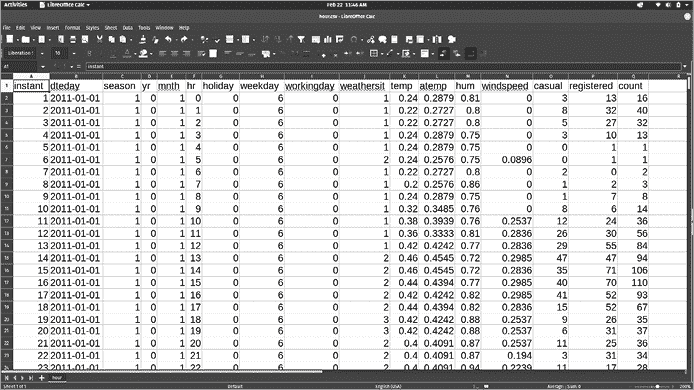

图 1-1：共享单车数据，显示在电子表格中

这个数据集和你以前可能见过的许多其他数据集没有什么不同：一个由行和列组成的矩形数组。在这个数据集中，每一行代表了 2011 年 1 月 1 日午夜至 2012 年 12 月 31 日晚上 11:59 之间某一特定小时的信息——总共有超过 17,000 个小时。这些行是按顺序排列的，因此前几行提供了 2011 年最初几个小时的信息，而最后几行则与 2012 年最后几个小时相关。

每一列包含了这些小时内测量的某个特定指标。例如，`windspeed`列给出了位于华盛顿特区的某个气象记录站的每小时风速测量值。请注意，这个测量值并不是使用我们熟悉的单位（如英里每小时）。相反，测量值已经被转换，使得它们始终介于 0 和 1 之间；我们只需要知道 1 代表高速风，0 代表没有风。

如果你查看前几行，你会发现`windspeed`值在这些行中为`0`，这意味着在共享单车服务的最初几个小时里没有测量到风速。在第七行（把标题行算作第一行）中，你可以看到终于有了风，其测量风速为 0.0896。如果你查看`hr`列，你会发现这个风速是在`hr` = `5`时记录的，即早上 5 点。我们知道这一行给出的信息是关于 2011 年 1 月 1 日的，因为第七行的`dteday`列的值为`2011-01-01`。

仅仅通过查看数据中的几个值，我们已经可以开始讲述一个故事，尽管这个故事并不激动人心：一个宁静的元旦夜晚，逐渐变成了一个稍微不那么安静的元旦早晨。如果我们想了解一些关于共享单车公司及其表现的故事，而不仅仅是天气情况，我们需要查看其他更相关的列。

最重要的信息列是最后三列：`casual`、`registered`和`count`。这些列显示了每小时使用你公司自行车的人数。注册并享受折扣和福利的用户是注册用户，他们的自行车使用记录在`registered`列中。但人们也可以不注册就使用你的自行车，他们的自行车使用记录在`casual`列中。`casual`和`registered`两列的总和即为每小时的总用户数，记录在`count`列中。

现在，既然你已经熟悉了数据集中一些更相关的列，你可以通过简单地浏览它们的数字学到很多东西。例如，看看图 1-1 中显示的前 20 个小时，你可以发现，在大多数小时内，注册用户数量多于临时用户数量（`registered`列的值高于`casual`列的值）。这只是一个简单的数字事实，但作为 CEO，你应该思考它对你的业务的含义。注册用户多于临时用户可能意味着你在说服人们注册方面做得很好，但也可能意味着在不注册的情况下随便使用你的服务并不像它应该那么容易。你需要思考一下，哪个客户群体更重要：像日常通勤者这样的常规注册用户，还是像观光游客这样的偶尔使用者。

我们可以更仔细地观察日常用户和注册用户的行为模式，看看是否能从中学到更多信息。我们再来看一下图 1-1 中显示的小时数。我们看到，临时用户在第一天的下午之前相对稀少，并在下午 1 点时达到峰值。注册用户即使在第一天的凌晨 1 点也相对较多，并在下午 2 点时达到峰值。注册用户和临时用户之间的行为差异虽小，但可能具有意义。例如，它们可能反映了这两个群体之间的人口统计差异。这反过来可能要求使用不同的营销策略，分别针对每个群体。

考虑一下我们已经做过的事情：仅仅通过查看前 24 行数据中的几列，我们就已经了解了关于公司的一些重要信息，并开始获得一些商业想法。数据科学有着需要精通复杂数学和计算机科学的神秘知识的声誉，但实际上，只需稍微浏览一下数据集，稍加思考，并运用常识，就可以在提升任何商业场景方面发挥很大作用。

### 使用 .csv 文件来回顾和存储数据

让我们更仔细地查看我们的数据。如果你在电子表格编辑器中打开数据文件（*hour.csv*），它将像图 1-1 所示。但是，你也可以在文本编辑器中打开此文件，如 Windows 中的记事本、macOS 中的 TextEdit，或 Linux 中的 GNU Emacs 或 gedit。当你在文本编辑器中打开此文件时，它将像图 1-2 所示。

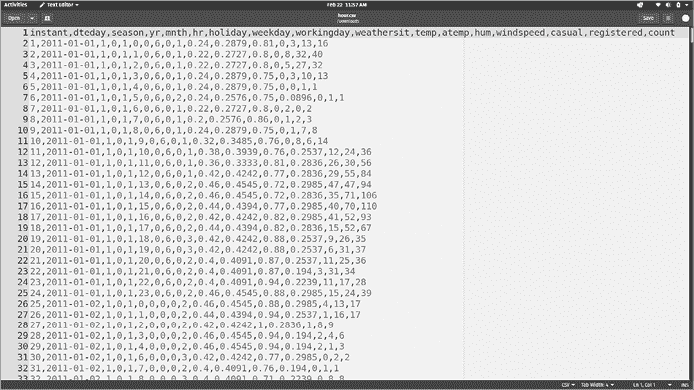

图 1-2：共享单车数据以原始文本显示

这些原始数据（即每个文本字符）构成了我们的*hour.csv*文件，没有你在电子表格中看到的直线对齐的列。注意到许多逗号。这个文件的扩展名，.*csv*，是*逗号分隔值*的缩写，因为每行中的数值是通过逗号与其他数值分隔的。

当你使用电子表格编辑器打开.*csv*文件时，编辑器会尝试将每个逗号解释为电子表格单元格之间的边界，以便将数据按直线对齐显示在行和列中。但数据本身并不是那样存储的：它仅仅是原始文本，包含一行行的数值，每个数值之间用逗号分隔。

*.csv*文件的简易性意味着它们可以轻松创建、被多种程序打开并轻松修改。这就是为什么数据科学家通常将数据存储为.*csv*格式的原因。

## 使用 Python 显示数据

使用 Python 将使我们能够进行比文本编辑器和电子表格程序更复杂的分析。它还将使我们能够自动化流程，更快速地运行分析。我们可以轻松地在 Python 中打开.*csv*文件。以下三行 Python 代码将读取*hour.csv*文件到你的 Python 会话中并显示其前五行：

```py
import pandas as pd
hour=pd.read_csv('hour.csv')
print(hour.head())
```

我们稍后会更仔细地查看这段代码的输出。现在，让我们先看一下代码本身。它的目的是读取并显示我们的数据。第二行通过使用`read_csv()`方法读取数据。*方法*是执行单一、明确功能的代码单元。顾名思义，`read_csv()`专门用于读取存储在.*csv*文件中的数据。运行这一行后，`hour`变量将包含*hour.csv*文件中的所有数据；然后你就可以在 Python 中访问这些数据。

在第三行，我们使用`print()`函数将数据打印到屏幕上。我们可以将第三行改为`print(hour)`，以查看整个数据集的输出。但是数据集可能非常庞大，一次性读取很难理解。因此，我们添加了`head()`方法，因为它仅返回数据集的前五行。

`read_csv()`和`head()`对我们非常有用。但它们并不是*Python 标准库*的一部分——即默认安装的标准 Python 功能。它们实际上是某个包的一部分，包是第三方的代码库，可以选择安装并在 Python 脚本中使用。

这两种方法是一个叫做*pandas*的流行包的一部分，里面包含了处理数据的代码。这就是为什么前一个代码片段的第一行是 `import pandas as pd`：它*导入*了 pandas 包，这样我们就可以在 Python 会话中访问它。当我们写`as pd`时，这为该包指定了一个*别名*，这样每次我们想访问 pandas 的功能时，都可以写`pd`，而不是完整的包名 pandas。因此，当我们写`pd.read_csv()`时，我们是在访问 pandas 包中的`read_csv()`方法。

如果你在运行`import pandas as pd`时遇到错误，可能是因为你的计算机上没有安装 pandas。（在你导入包之前，必须先安装它们。）要安装 pandas 或任何其他 Python 包，你应该使用标准的 Python 包安装工具——pip。你可以在本书的介绍部分找到如何安装 pip 并使用它安装像 pandas 这样的 Python 包的说明。在本书中，每次导入一个包时，你都应该确保首先使用 pip 在你的计算机上安装它。

当你运行这个代码片段时，可能会遇到另一个错误。最常见的错误之一是当 Python 无法找到*hour.csv*文件时。如果发生这种情况，Python 会打印出错误报告。错误报告的最后一行可能会这样写：

```py
FileNotFoundError: [Errno 2] No such file or directory: 'hour.csv'
```

即使你不是 Python 专家，你也可以推测出这意味着什么：Python 尝试读取*hour.csv*文件，但未能找到它。这可能是一个令人沮丧的错误，但也是可以解决的。首先，确保你已经下载了*hour.csv*文件，并且它在你的计算机上也叫*hour.csv*。计算机上的文件名必须与 Python 代码中的文件名完全一致。

如果你的 Python 代码中*hour.csv*的名称拼写正确（完全小写字母），那么问题可能出在文件的位置。记住，每个文件在你的计算机上都有一个唯一的文件路径，指定了你需要导航到的位置。一个文件路径可能是这样的：

```py
C:\Users\DonQuixote\Documents\hour.csv
```

这个文件路径是 Windows 操作系统中使用的格式。如果你使用的是 Windows，尽量确保你的目录和文件名不包含任何特殊字符（例如非英语字母表的字符），因为包含特殊字符的文件路径可能导致错误。下面是另一个文件路径的例子，它采用的是 Unix 风格操作系统（包括 macOS 和 Linux）使用的格式：

```py
/home/DonQuixote/Documents/hour.csv
```

你会注意到，Windows 文件路径与 macOS 和 Linux 的文件路径不同。在 macOS 和 Linux 中，我们只使用正斜杠，并且从斜杠（`/`）开始，而不是像 `C:\` 这样的驱动器名称。当你将文件读入 Python 时，避免错误的最直接方法是指定完整的文件路径，如下所示：

```py
import pandas as pd
hour=pd.read_csv('/home/DonQuixote/Documents/hour.csv')
print(hour.head())
```

当你运行这段代码时，可以将`read_csv()`方法中的文件路径替换为自己计算机上的文件路径。当你运行前面的代码片段，并正确指定文件路径以匹配计算机上*hour.csv*的位置时，你应该会得到以下输出：

```py
 instant      dteday  season  yr  ...  windspeed  casual  registered count
0        1  2011-01-01       1   0  ...        0.0       3          13    16
1        2  2011-01-01       1   0  ...        0.0       8          32    40
2        3  2011-01-01       1   0  ...        0.0       5          27    32
3        4  2011-01-01       1   0  ...        0.0       3          10    13
4        5  2011-01-01       1   0  ...        0.0       0           1     1

[5 rows x 17 columns]
```

该输出显示了我们数据的前五行。你可以看到数据按列排列，类似于我们的电子表格输出。就像在图 1-1 中一样，每一行包含与共享单车公司某一特定小时历史相关的数值。

在这里，我们看到一些列被省略号替代，这样更容易在屏幕上阅读，也不会太难阅读或复制粘贴到文本文件中。（你可能看到的是所有的列，而不是省略号——具体显示取决于 Python 和 pandas 在你计算机上的配置情况。）就像我们在电子表格编辑器中打开文件时做的那样，我们可以开始查看这些数字，发现关于公司历史的故事，并获得经营业务的灵感。

## 计算汇总统计

除了仅仅查看数据，量化其重要属性会非常有帮助。我们可以从计算某一列的均值开始，如下所示：

```py
print(hour['count'].mean())
```

在这里，我们通过使用方括号（`[]`）和列名（`count`）来访问`hour`数据集中的`count`列。如果你单独运行`print(hour['count'])`，你会看到整列数据被打印到屏幕上。但我们只想要列的*均值*，而不是整列数据，因此我们添加了`mean()`方法——这是 pandas 提供的另一个功能。我们看到均值大约是 189.46。这从商业角度来看很有趣，它是一个粗略的度量，表示覆盖数据中两年时间段的业务规模。

除了计算均值，我们还可以计算其他重要的指标，如下所示：

```py
print(hour['count'].median())
print(hour['count'].std())
print(hour['registered'].min())
print(hour['registered'].max())
```

在这里，我们通过使用`median()`方法计算`count`列的中位数。我们还使用`std()`方法计算`count`变量的标准差。（你可能已经知道，*标准差*是一个测量一组数字分布范围的指标。它有助于我们理解数据中不同时段之间骑行人数的波动程度。）我们还使用`min()`和`max()`方法分别计算`registered`变量的最小值和最大值。注册用户的数量从 0 到 886 不等，这告诉我们你设定的小时记录，以及如果你希望你的业务超过历史最佳成绩，你需要打破的记录。

这些简单的计算被称为*汇总统计*，它们对于你处理的每一个数据集都很有用。检查数据集的汇总统计有助于你更好地理解数据，在这个案例中，它帮助你更好地了解你的业务。

尽管这些总结性统计数据看起来很简单，但许多首席执行官如果被问到，可能连自己公司确切的客户数量都无法说出。了解一些简单的事情，比如任何一天的任意时段的平均客户数量，可以帮助你了解公司规模以及公司发展空间。

这些总结性统计信息还可以与其他信息结合，给我们提供更多的洞察。例如，如果你查找一下公司收费的单小时自行车使用费，你可以将这个费用与`count`列的均值相乘，得出这两年数据覆盖期内的总收入。

你可以通过使用像`mean()`和`median()`这样的 pandas 方法手动检查总结性统计数据，正如我们之前所做的。但是，还有一种方法可以轻松地检查总结性统计数据：

```py
print(hour.describe())
```

在这里，我们使用`describe()`方法检查数据集中所有变量的总结性统计数据。输出结果如下：

```py
 instant        season  ...    registered         count
count  17379.0000  17379.000000  ...  17379.000000  17379.000000
mean    8690.0000      2.501640  ...    153.786869    189.463088
std     5017.0295      1.106918  ...    151.357286    181.387599
min        1.0000      1.000000  ...      0.000000      1.000000
25%     4345.5000      2.000000  ...     34.000000     40.000000
50%     8690.0000      3.000000  ...    115.000000    142.000000
75%    13034.5000      3.000000  ...    220.000000    281.000000
max    17379.0000      4.000000  ...    886.000000    977.000000

[8 rows x 16 columns]
```

你可以看到，`describe()`为我们提供了一个完整的表格，表格包含了几个有用的指标，包括每个变量的均值、最小值和最大值。`describe()`的输出还包括百分位数。例如，`25%`行包含了`hour`数据中每个变量的第 25 百分位数。我们可以看到，`count`变量的第 25 百分位数是 40，这意味着我们数据集中 25%的时间段内用户数为 40 人或更少，而 75%的时间段内用户数超过 40 人。

我们从`describe()`方法得到的表格也有助于我们检查数据中的问题。数据集通常包含一些重大错误，而这些错误可以通过`describe()`的输出被发现。例如，如果你在一个包含人群的数据显示方法上运行`describe()`，并且看到他们的平均年龄是 200 岁，那么你的数据就有错误。虽然这看起来显而易见，但在最近一篇发表于顶级学术期刊的知名研究论文中，竟然发现了这个错误（平均年龄大于 200 岁）——如果那些研究人员使用了`describe()`，他们就能避免这个问题！你应该查看每个数据集的`describe()`输出，确保所有的数值至少是合理的。如果你发现平均年龄超过 200 岁，或者其他看起来不可信的数据，你就需要定位并修复数据中的问题。

在这个阶段，我们已经可以开始利用从数据中学到的知识，来为改进业务提供思路。例如，我们看到在数据的前 24 小时内，夜间的骑行人数远低于白天的骑行人数。我们还看到了每小时用户数量的巨大差异：25%的时段内骑行人数少于 40 人，但某个时段有 886 名骑行者。作为 CEO，你可能希望更多的时段能接近 886 名骑行者，而不是有些时段少于 40 名骑行者。

你可以通过多种方式来实现这个目标。例如，你可能会选择在夜间降低价格，以便吸引更多的顾客，从而减少低乘车率的时间段。通过简单的探索，你可以继续从数据中学习，并获得改善业务的思路。

## 数据子集分析

我们已经查看了与整个数据集相关的摘要统计信息，然后考虑在夜间提供更低的价格以增加夜间的乘车人数。如果我们真的想要追求这个想法，我们应该查看与夜间相关的摘要统计信息。

### 夜间数据

我们可以从使用`loc()`方法开始：

```py
print(hour.loc[3,'count'])
```

这个`loc()`方法允许我们指定一个完整数据集的子集。当我们使用`loc()`时，我们通过方括号和以下模式来指定我们想要选择的子集：[<`行`>,<`列`>]。在这里，我们指定了`[3,'count']`，表示我们要选择数据中的第 3 行和`count`列。我们从中得到的输出是 13，如果你查看图 1-1 或图 1-2 中的数据，你会发现这个结果是正确的。

这里需要指出的一个重要事项是，在 Python 和 pandas 中，标准的做法是使用*零索引*。我们从零开始计数，因此，如果我们的数据集有四行，我们会标记为第 0 行、第 1 行、第 2 行和第 3 行。数据的第四行被称为第 3 行，或者我们说它的索引是 3。同样，数据的第三行的索引是 2，第二行的索引是 1，第一行的索引是 0。因此，当我们运行`print(hour.loc[3,'count'])`时，我们会得到 13，这是存储在数据中的第四个值（来自索引为 3 的行），而不是 32，后者是存储在数据中的第三个值（来自索引为 2 的行）。零索引对许多人来说可能不太直观，但通过经验，你可以逐渐习惯并感到舒适。

在前面的代码片段中，我们查看了一个由单个数字（来自单行单列的`count`）组成的子集。但你可能想要了解一个包含多行或多列的子集。通过使用冒号（`:`），我们可以指定一个我们想查看的行范围：

```py
print(hour.loc[2:4,'registered'])
```

在这个代码片段中，我们指定了想要获取`registered`变量的值。通过在方括号中指定`2:4`，我们表示希望获取第 2 行到第 4 行之间的所有数据，因此我们会得到三个数字作为输出：27、10 和 1。如果你查看这些行，你会发现这些观察数据与凌晨 2 点、3 点和 4 点相关。我们并没有打印出所有数据，而只是打印了这三行。由于我们只打印了一个子集的数据，我们可以将这个过程称为*子集选择*——选择数据的子集。这在数据探索和分析中非常有用。

与其一次查看几行相邻的数据，不如直接查看数据中所有的夜间观测数据。我们可以使用逻辑条件和`loc()`方法来实现：

```py
print(hour.loc[hour['hr']<5,'registered'].mean())
```

这段代码使用`loc()`来访问数据的子集，就像我们之前做的那样。不过，它不是指定特定的行号，而是指定一个逻辑条件：`hour['hr']<5`，意思是它会选择数据中`hr`变量值小于 5 的所有行。这将给我们一个数据子集，代表了清晨的最早时段（午夜至凌晨 4 点）。我们可以指定多个条件来实现更复杂的逻辑。例如，我们可以特别检查寒冷或温暖的清晨的乘车人数：

```py
print(hour.loc[(hour['hr']<5) & (hour['temp']<.50),'count'].mean())
print(hour.loc[(hour['hr']<5) & (hour['temp']>.50),'count'].mean())
```

在这里，我们指定了多个逻辑条件，用`&`字符连接，表示*与*，这意味着两个条件必须同时为真。第一行选择了`hr`值小于 5*并且*`temp`值小于 0.50 的行。在这个数据集中，`temp`变量记录的是温度，但不是我们熟悉的华氏度或摄氏度，而是使用一个特殊的尺度，将所有温度都表示在 0 到 1 之间，其中 0 表示非常冷，1 表示非常暖和。每当你处理数据时，确保你了解每个变量使用的单位非常重要。我们指定`hour['temp']<.50`来选择温度较冷的时段，指定`hour['temp']>.50`来选择温暖的时段。这两行代码让我们能够比较寒冷清晨和温暖清晨的平均乘车人数。

我们还可以使用`|`符号表示*或*。这在这样的示例中可能会很有用：

```py
print(hour.loc[(hour['temp']>0.5) | (hour['hum']>0.5),'count'].mean())
```

这行代码选择了温度高*或*湿度高的行的平均乘车人数——这两者都不是必须的。能够选择这些复杂条件可能有助于你选择在不舒适的天气条件下提高乘车人数的方法。

### 季节性数据

夜间折扣并不是提高乘车人数和收入的唯一策略。你还可以考虑在某些季节或年份的特定时间推出特价。在我们的数据中，`season`变量记录了冬季为 1，春季为 2，夏季为 3，秋季为 4。我们可以使用`groupby()`方法来找到每个季节的平均用户数：

```py
print(hour.groupby(['season'])['count'].mean())
```

这段代码中的大部分内容应该看起来很熟悉。我们使用`print()`查看与`hour`数据相关的指标。我们使用`mean()`方法，表示我们在查看平均值。然后我们使用`['count']`来访问数据中的`count`列。所以很明显，我们将查看`hour`数据中的平均乘车人数。

唯一的新部分是`groupby(['season'])`。这是一个将数据分组的方法——在本例中，它会根据`season`列中出现的每个唯一值来划分组。输出结果显示了每个单独季节的平均乘车人数：

```py
season
1    111.114569
2    208.344069
3    236.016237
4    198.868856
Name: count, dtype: float64
```

解释这个输出很简单：在第一季（冬季），每小时的平均乘客量大约为 111.115；在第二季（春季），每小时的平均乘客量大约为 208.344；依此类推。可以看出一个明显的季节性模式：春季和夏季的乘客量较高，而秋季和冬季的乘客量较低。`groupby()`方法也可以对多个列进行分组，具体如下：

```py
print(hour.groupby(['season','holiday'])['count'].mean())
```

结果如下：

```py
season  holiday
1       0          112.685875
        1           72.042683
2       0          208.428472
        1          204.552083
3       0          235.976818
        1          237.822917
4       0          199.965998
        1          167.722222
Name: count, dtype: float64
```

在这里，我们指定了两个列进行分组：`season`和`holiday`。这将我们的每小时数据分成四个单独的季节，然后将每个季节分为节假日（由 1 表示）和非节假日（由 0 表示）。它分别展示了每个季节中节假日和非节假日的平均乘客量。结果是，我们可以看到节假日和非节假日之间的季节性差异。看起来寒冷季节的节假日乘客量低于非节假日，而温暖季节的节假日乘客量与非节假日相当。理解这些差异可以帮助你做出关于如何经营业务的决策，并可能为你提供关于在不同季节或不同节假日采取的策略的想法。

这个数据集很大，而且可以通过各种不同的方式进行分析。我们已经开始查看几个子集，并且开始得到一些想法。你应该做得更多：检查与所有列相关的子集，并从多个角度探索数据。即使不进行高级统计和机器学习，你仍然可以学到很多并得到许多有用的想法。

## 使用 Matplotlib 可视化数据

总结统计数据对于探索非常有价值和有用。然而，探索性数据分析中有一个非常重要的部分我们还没有做：*绘图*，或者说是将数据可视化成有组织的图表。

### 绘制并显示一个简单的图表

你应该在每次进行数据分析时，尽早并频繁地绘制数据。我们将使用一个流行的绘图包，叫做*Matplotlib*。我们可以通过以下方式绘制一个简单的图表：

```py
import matplotlib.pyplot as plt
fig, ax = plt.subplots(figsize=(10, 6))
ax.scatter(x = hour['instant'], y = hour['count'])
plt.show()
```

在这里，我们导入了 Matplotlib 包，并给它起了个别名`plt`。接下来，我们创建一个图形，称为`fig`，以及一个坐标轴，称为`ax`。图形`fig`将包含我们绘制的任何图表或图组的所有信息。坐标轴`ax`将为我们提供用于实际绘制图表的有用方法。`subplots()`方法为我们创建了这两个对象，并且在这个方法中，我们可以指定图形的大小（`figsize`）。在这种情况下，我们指定了一个图形大小为`(10,6)`，意味着我们的图形宽度为 10 英寸，高度为 6 英寸。

接下来，我们通过使用`scatter()`方法绘制图表。在`scatter()`中，我们指定`x=hour['instant']`，这样 x 轴将显示我们`hour`数据中的`instant`变量。我们指定`y=hour['count']`，这样 y 轴将显示`count`变量。最后，我们使用`plt.show()`来显示这个图表。这个代码片段生成的图表应该类似于图 1-3。

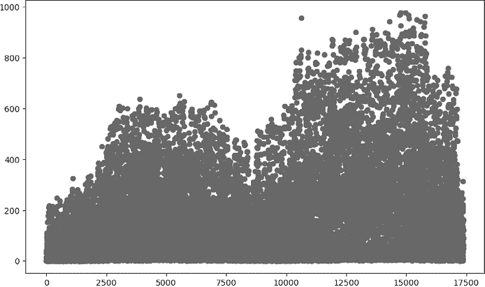

图 1-3：两年内每小时的乘客数

在这个图表中，你可以看到每个点代表了数据集中记录的每一小时。第一小时（2011 年的开始）出现在图表的最左边。最后一小时（2012 年的结束）出现在图表的最右边，所有其他小时按顺序排列。

这个图表，称为*散点图*，是绘制的第一个好图表，因为它显示了数据中的每个观察值；它还使得关系容易通过视觉识别。在这种情况下，我们可以看到`groupby()`语句之前提示的季节性变化的完整表示。我们还可以看到随着时间推移，乘客数量的整体增长。

### 用标题和标签来澄清图表

图 1-3 中的图表展示了数据，但它的呈现方式不够清晰。我们可以通过如下方式为图表添加标题和标签：

```py
fig, ax = plt.subplots(figsize=(10, 6))
ax.scatter(x = hour['instant'], y = hour['count'])
plt.xlabel("Hour")
plt.ylabel("Count")
plt.title("Ridership Count by Hour")
plt.show()
```

这个代码片段使用了`xlabel()`来为 x 轴添加标签，`ylabel()`来为 y 轴添加标签，`title()`来为图表添加标题。你可以在这些方法中指定任何文本，以获得你想要的标签。输出应该类似于图 1-4。

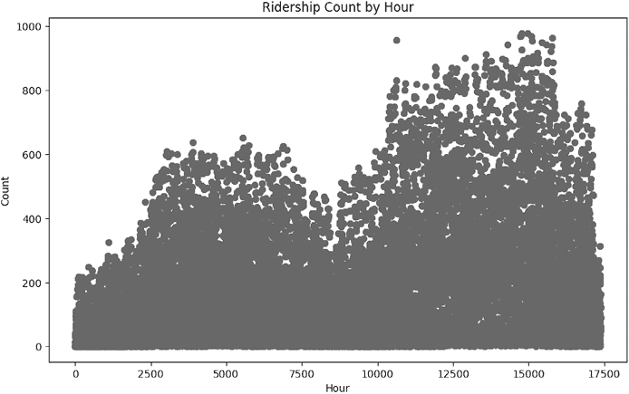

图 1-4：按小时划分的乘客数，带有轴标签和标题

我们的数据集非常大，一次查看所有数据很困难。让我们看看如何绘制数据的较小子集。

### 绘制数据子集

我们可以使用之前做的子集来仅绘制数据的一个子集：

```py
hour_first48=hour.loc[0:48,:]
fig, ax = plt.subplots(figsize=(10, 6))
ax.scatter(x = hour_first48['instant'], y = hour_first48['count'])
plt.xlabel("Hour")
plt.ylabel("Count")
plt.title("Count by Hour - First Two Days")
plt.show()
```

在这里，我们定义了一个新的变量`hour_first48`。这个变量包含了与原始数据中第 0 行到第 48 行相关的数据，大致对应数据中的前两天。

注意，我们通过写`hour.loc[0:48,:]`来选择这个子集。这是我们之前使用过的相同`loc()`方法。我们使用`0:48`来指定我们希望选择索引最大为 48 的行，但我们没有指定任何列——我们只是写了一个冒号（`:`），在我们通常指定列名的地方进行选择。这是一个有用的快捷方式：仅用冒号告诉 pandas 我们想选择数据集的所有列，因此不需要逐一写出每个列名。这个子集的图表看起来像图 1-5。

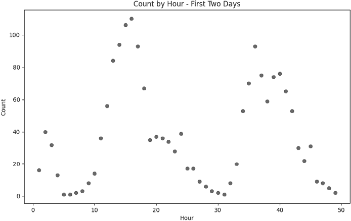

图 1-5：前两天按小时划分的乘客数

通过只绘制两天的数据，而不是两年的数据，我们避免了点重叠和相互遮挡的问题。我们可以更清楚地看到每个观测值。当你有一个大数据集时，最好同时做两件事：一次性绘制整个数据集（以了解整体的模式），同时也绘制数据的较小子集（以了解单个观测值和小范围的模式）。在这种情况下，我们不仅能看到每天的数据模式，还能看到跨年份的长期季节性模式。

### 测试不同的图类型

我们有多种方法可以改变图的外观。我们的`scatter()`函数包含一些参数，我们可以调整这些参数来获得不同的效果：

```py
fig, ax = plt.subplots(figsize=(10, 6))
ax.scatter(x = hour_first48['instant'], y = hour_first48['count'],c='red',marker='+')
plt.xlabel("Hour")
plt.ylabel("Count")
plt.title("Count by Hour - First Two Days")
plt.show()
```

在这里，我们使用`c`参数来指定图中点的颜色（红色）。我们还指定了一个`marker`参数来改变*标记样式*，即绘制的点的形状。通过将`+`指定为标记参数，我们得到的图点看起来像小加号，而不是小圆点。图 1-6 展示了输出结果。

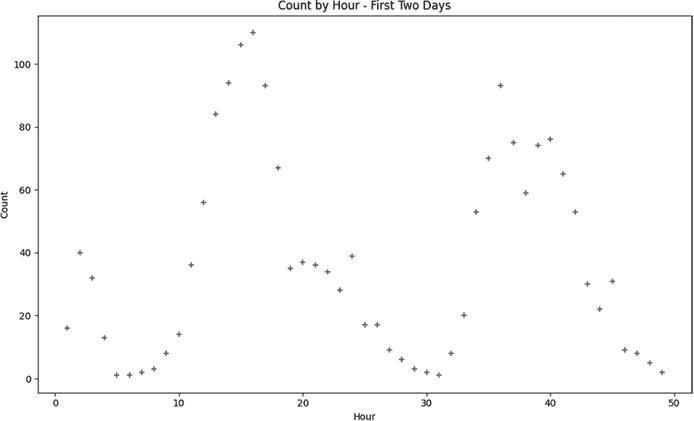

图 1-6：骑行人数统计，包含不同的样式选择

这本书没有彩色印刷，因此你在本页上看不到指定的红色。但如果你在家运行这段代码，应该能看到红色的点。

散点图并不是我们能绘制的唯一类型的图。让我们尝试绘制一条线图：

```py
fig, ax = plt.subplots(figsize=(10, 6))
ax.plot(hour_first48['instant'], hour_first48['casual'],c='red',label='casual',linestyle='-')
ax.plot(hour_first48['instant'],\
hour_first48['registered'],c='blue',label='registered',linestyle='--')
ax.legend()
plt.show()
```

在这种情况下，我们使用`ax.plot()`而不是`ax.scatter()`来绘制图形。`ax.plot()`方法允许我们绘制线图。在这里，我们调用`ax.plot()`两次，在同一张图上绘制两条线。这样我们就能比较临时用户和注册用户（图 1-7）。

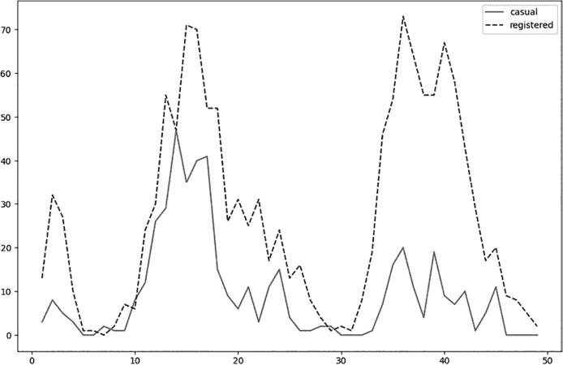

图 1-7：显示临时用户和注册用户在前两天的线图

这个图显示了临时骑行者的数量几乎总是低于注册骑行者的数量。图例显示了临时和注册用户的不同颜色，以及不同的线条样式（临时骑行者为实线，注册骑行者为虚线）。在家运行这段代码，你可以更清晰地看到颜色和它们的对比。

我们还可以尝试另一种类型的图：

```py
import seaborn as sns
fig, ax = plt.subplots(figsize=(10, 6))
sns.boxplot(x='hr', y='registered', data=hour)
plt.xlabel("Hour")
plt.ylabel("Count")
plt.title("Counts by Hour")
plt.show()
```

这次，我们导入了一个名为*seaborn*的包。这个包基于 Matplotlib，因此它包含了 Matplotlib 的所有功能，此外还提供了更多帮助快速创建美观、信息丰富的图形的特性。我们使用 seaborn 的`boxplot()`方法来创建一种新的图形：*箱线图*。图 1-8 展示了这段代码生成的箱线图。

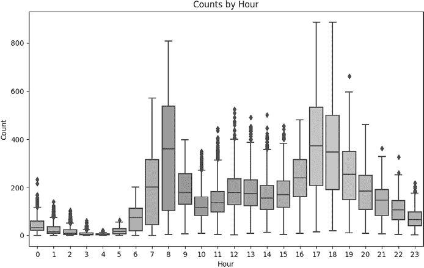

图 1-8：按时间段分组的骑行人数箱线图

你可以看到 24 个垂直箱形图，它们平行绘制——每一个都代表一天中特定小时的信息。箱形图是一种简单的图表，但它提供了大量的信息。在箱形图中，每个矩形的上边界和下边界分别代表所绘数据的第 75 百分位数和第 25 百分位数。矩形内的水平线表示中位数（或第 50 百分位数）。从每个矩形的顶部和底部延伸出的垂直线表示所有非异常值观察数据的完整范围。超出垂直线范围的独立绘制点被视为异常值。

在图 1-8 中一起查看这些箱形图可以让你比较不同时间段的乘车人数。例如，第 5 小时（大约早上 5 点）的中位数乘车人数非常低，而第 6 小时（大约早上 6 点）的中位数乘车人数要高得多。在第 7 小时（大约早上 7 点），中位数乘车人数更高。乘车人数在下午 5 点和下午 6 点再次出现高峰；也许这些高峰表明许多客户使用自行车上下班。

正如你所预期的那样，我们可以绘制更多类型的图表。另一个有用的图表是*直方图*，你可以按如下方式创建：

```py
fig, ax = plt.subplots(figsize=(10, 6))
ax.hist(hour['count'],bins=80)
plt.xlabel("Ridership")
plt.ylabel("Frequency")
plt.title("Ridership Histogram")
plt.show()
```

这个代码片段使用`hist()`命令绘制直方图。图 1-9 展示了输出结果。

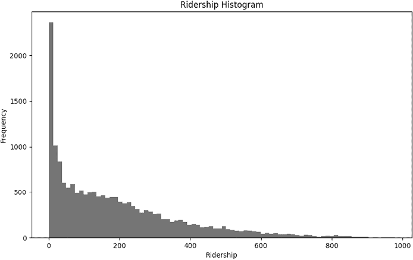

图 1-9：显示每小时乘车人数频率的直方图

在直方图中，每个柱形的高度表示频率。在这个例子中，我们的直方图展示了每个乘车人数的频率。例如，如果你查看 x 轴在 800 附近的位置，你会看到高度接近 0 的柱形。这意味着在我们的数据集中，只有极少数小时的乘车人数接近 800。相比之下，在 x 轴约 200 的位置，你会看到更高的柱形，接近 500 的高度。这表明在我们数据中的大约 500 个小时，乘车人数接近 200。我们在这个直方图中看到的模式是企业常见的模式：很多小时的客户很少，只有少数小时的客户很多。

你可以使用这种直方图来考虑公司容量。例如，也许你的公司今天有 1,000 辆自行车可供租赁。你认为出售 200 辆自行车可能是一个节省开支的好方法——这样，你将赚取一些额外的现金，同时不必担心多余自行车的维护和存储。这将使你剩下 800 辆可供租赁。通过查看直方图，你可以清楚地看到这种变化对公司容量的影响：由于只有少数小时的需求超过 800，这对你的容量影响应该相对较小。你可以根据直方图来决定到底出售多少辆自行车最为合适。

另一种类型的图表是*配对图*，它为数据中每一对可能的变量绘制所有可能的散点图：

```py
thevariables=['hr','temp','windspeed']
hour_first100=hour.loc[0:100,thevariables]
sns.pairplot(hour_first100, corner=True)
plt.show()
```

在这里，我们创建了一个`thevariables`变量，它是我们将要绘制的三个变量的列表。（我们仅绘制三个变量而不是所有变量，因为书中的空间有限。）我们还创建了`hour_first100`，它是我们完整数据集的一个子集，只包含`hour`数据集中索引为 100 或更小的行。同样，seaborn 包通过提供`pairplot()`方法帮助我们创建图表。结果，图 1-10 是一个包含散点图和直方图的图表集合。

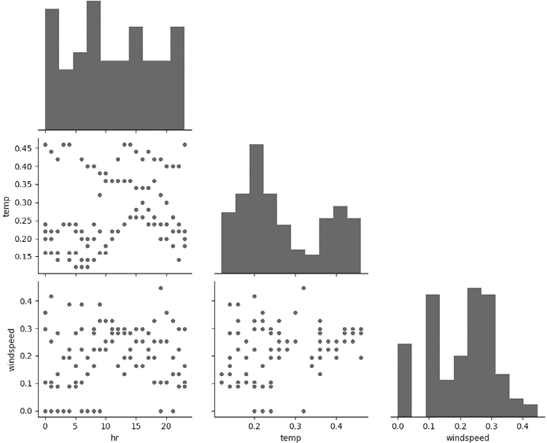

图 1-10：显示所选变量之间关系的配对图

配对图显示了我们选择的数据子集中的每一对可能组合的散点图，以及我们选择的单个变量的直方图。这里绘制了大量的数据，但散点图并未显示变量之间明显的关系；这些关系似乎基本上是随机的。

有时候，当我们绘制配对图时，我们看到的不仅仅是随机性。相反，我们可以看到变量之间的清晰关系。例如，如果我们在数据中有降雪量的测量值，我们会看到，随着温度升高，降雪量降低，反之亦然。变量之间这种清晰的关系被称为*相关性*，我们将在下一节探讨它。

## 探索相关性

如果两个变量的变化倾向于一起发生，我们说这两个变量是*相关的*。如果它们一起变化，我们说这两个变量是正相关的：一个变量在另一个变量上升时也倾向于上升，一个变量在另一个变量下降时也倾向于下降。在现实世界中，我们可以找到无数正相关的例子。例如，一个城市中家猫的数量与该城市购买猫粮的数量是正相关的。如果其中一个变量很高，另一个也倾向于很高；如果其中一个变量很低，另一个也倾向于很低。

我们也可以讨论负相关性：如果一个变量倾向于在另一个变量下降时上升，或者一个变量倾向于在另一个变量上升时下降，那么这两个变量是负相关的。负相关性在现实中也很常见。例如，一个城市的平均气温与该城市典型居民每年在厚冬季外套上的平均花费是负相关的。在一个城市中，如果其中一个数值很高，另一个数值通常很低；如果其中一个数值很低，另一个数值通常很高。

在数据科学的世界里，找到并理解相关性（无论是正相关还是负相关）是至关重要的。如果你能发现并理解这些相关性，作为 CEO 的表现将会提升。例如，你可能会发现骑行人数与温度之间存在正相关关系。如果是这样，意味着温度较低时骑行人数往往较少。你甚至可以考虑在骑行人数较少的季节出售一些自行车，以产生现金流，而不是让许多自行车闲置。你最终选择做什么将取决于你情况的许多其他细节，但深入理解数据将帮助你做出最佳的商业决策。

### 计算相关性

我们可以在 Python 中计算相关性：

```py
print(hour['casual'].corr(hour['registered']))
print(hour['temp'].corr(hour['hum']))
```

在这里，我们使用 `corr()` 方法，这是 pandas 提供的又一功能。`corr()` 方法计算一个被称为 *相关系数* 的数字。我们可以计算多种类型的相关系数，但默认情况下，`corr()` 计算的是皮尔逊相关系数。这是最常用的相关系数，因此在本书中提到的相关系数，指的通常都是皮尔逊相关系数。

皮尔逊相关系数是一个介于 –1 和 1 之间的数字，通常用变量 *r* 来表示。它用于描述两个变量之间的关系；其符号表示相关类型，大小表示相关性的强度。如果相关系数 *r* 是正数，说明这两个变量是正相关的；如果 *r* 是负数，说明它们是负相关的。如果相关系数为 0，或者接近 0，我们说这两个变量是 *不相关的*。

在这种情况下，这段代码的第一行计算了描述 `casual` 和 `registered` 变量之间关系的相关系数。对于这些变量，*r* 大约是 0.51，这是一个正数，表示正相关。

### 理解强相关与弱相关

除了注意相关系数是正数、负数还是 0，我们还要关注它们的确切 *大小*。如果相关系数很大（远离 0，接近 1 或 –1），我们通常说相关性是 *强* 的。查看 图 1-11 可以看到相关性的示例。

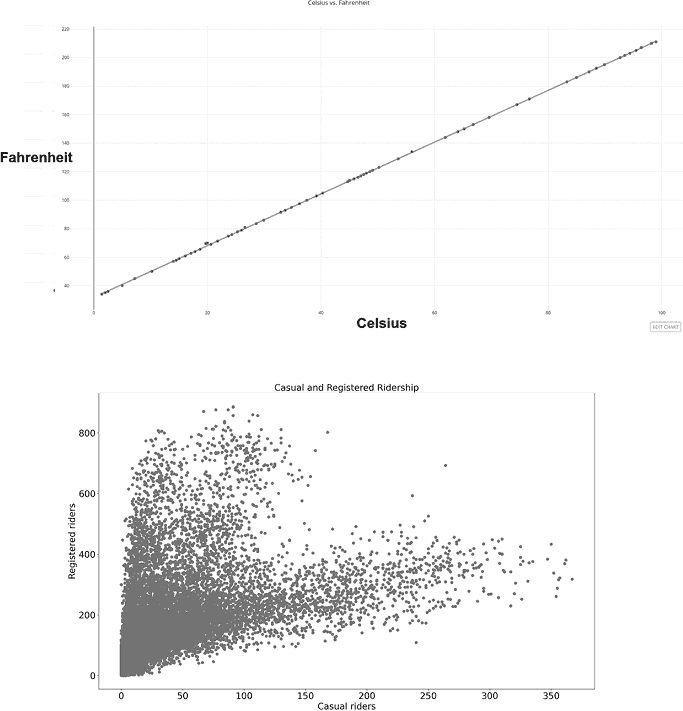

图 1-11：正相关变量

在这里，你可以看到两个图表。第一个图表显示了华氏温度和摄氏温度之间的关系。你可以看到，华氏温度和摄氏温度是正相关的：当一个上升时，另一个也上升，反之亦然。第二个图表显示了你公司中临时和注册乘客数量之间的关系。同样，我们看到它们是正相关的：当临时乘客数量上升时，注册乘客数量也倾向于上升，反之亦然。

图 1-11 中的两个相关性都是正相关的，但我们可以看到它们之间的定性差异。华氏温度和摄氏温度之间的关系是决定性的：知道华氏温度就能精确得知摄氏温度，没有不确定性或猜测。这种出现在图表上呈直线的决定性正相关也被称为*完美*相关，当我们计算完美正相关的相关系数时，我们会发现*r* = 1。

相比之下，临时乘客和注册乘客之间的关系是*非*决定性的。通常，临时乘客的数量与注册乘客的数量成正比。但有时并非如此；我们不能仅通过一个变量完美预测另一个变量。当两个变量相关，但没有决定性关系时，我们称这两个变量之间存在“噪声”或随机性。

*随机性*很难精确定义，但你可以把它看作是不可预测性。当你知道一个华氏温度时，你可以准确预测出摄氏温度。相比之下，当你知道临时乘客数量时，你可以预测注册乘客数量，但你的预测可能不完全准确。当存在这种不可预测性时，两个变量的相关系数会小于 1。在这种情况下，我们可以计算临时和注册乘客数量的相关性，发现*r* = 0.51。

你可以将相关系数的大小视为两个变量关系中随机性的衡量标准。较大的相关系数对应着较少的随机性（接近决定性关系，比如华氏温度和摄氏温度之间的关系）。较小的相关系数对应着更多的随机性和较低的可预测性。你可以把 0 的相关系数，表示变量之间没有任何关系，看作是纯随机性或纯噪声的标志。

你可以查看图 1-12，了解不同幅度的负相关性示例。

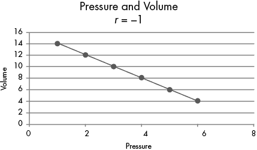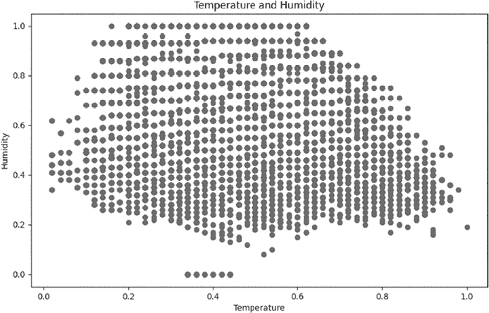

图 1-12：负相关变量

在这里，我们看到与图 1-11 中相同的思想。第一个图显示了一个*完美*的负相关性：这次是压力和体积之间的确定性关系。这里的相关性正好是 *r* = –1，表明变量之间的关系没有任何随机性；每个变量都可以通过另一个变量完美预测。

第二个图显示了我们数据中温度和湿度之间的关系。这两个变量也有负相关性，但相关系数要小得多：*r* 大约为 –0.07。就像我们在图 1-11 中分析正相关时所做的那样，我们可以将这些相关系数解释为随机性的度量：一个较大幅度的相关系数（意味着它更接近 1 或 –1）是一个高度可预测的相关性，随机性较小，而一个幅度较小的系数（更接近 0）则表示该相关性有更多的随机性。当我们看到 *r* = –0.07 时，我们解释为温度和湿度之间存在负相关关系，但它们的相关性非常弱——几乎接近纯随机性。

当你观察相关性时，有一件重要的事情需要记住，那就是一句名言：“相关性并不意味着因果关系。” 当我们观察到强烈的相关性时，唯一可以确定的是两个变量倾向于一起变化；我们不能确定其中一个变量是导致另一个变量变化的原因。

举个例子，假设我们研究硅谷的创业公司，发现它们的月收入与购买的乒乓球桌数量之间存在相关性。我们可能会仓促地得出结论，认为乒乓球桌导致了收入的增加；也许它们所促进的放松和团队精神提高了生产力，或者它们创造的有趣氛围提高了员工的留存率和招聘成功率。

另一方面，这些观点可能完全错误，也许因果关系是反向的；那些成功的公司（与它们的乒乓球桌完全无关）拥有更高的收入，并且由于预算突然增加，它们将部分新增的资金用于购买乒乓球桌等有趣的物品。在这种情况下，收入将导致乒乓球桌的购买，而不是相反。

最后，相关性可能只是纯粹的巧合。也许乒乓球桌并不会导致更高的收入，收入也不会导致更多的乒乓球桌，实际上我们观察到的是一个*虚假的相关性*：这是一种仅仅由于巧合而发生的相关性，并不表示任何因果关系或特殊的联系。相关性也可能是由于*遗漏变量*所致，这个变量我们没有观察到，但它独立地同时导致了收入的增加和乒乓球桌的购买。

无论如何，重要的是在发现并解释相关性时要始终保持谨慎。相关性意味着两个变量趋向于一起变化，它们可以帮助我们做出预测，但它们不一定意味着一个变量导致了另一个变量，甚至它们之间是否存在任何真正的关系。

发现和理解相关系数可以帮助你在 CEO 的职责中，尤其是当你发现意外的相关性时。例如，你可能会发现，租借自行车的团队规模与租后顾客满意度之间有很强的正相关。也许这能给你一些启示，鼓励人们与朋友一起租车，以提高顾客的满意度。发现相关性、理解相关性的大小及其对可预测性所带来的启示，对商业决策是非常有价值的。

### 查找变量之间的相关性

我们不仅可以计算成对变量之间的相关性，还可以进一步创建一个*相关矩阵*，它是一个矩阵（或矩形数组），每个元素都是测量两个特定变量之间关系的相关系数。相关矩阵将显示所有变量之间的关系：

```py
thenames=['hr','temp','windspeed']
cor_matrix = hour[thenames].corr()
print(cor_matrix)
```

在这里，我们使用与之前相同的`corr()`方法。当我们在括号内使用`corr()`而不传入任何参数时，它会创建一个包含数据集所有变量的相关矩阵。在这个例子中，我们创建了一个较小的相关矩阵，只显示三个选定变量之间的相关性。我们计算得到的相关矩阵如下所示：

```py
 hr      temp  windspeed
hr         1.000000  0.137603   0.137252
temp       0.137603  1.000000  -0.023125
windspeed  0.137252 -0.023125   1.000000
```

在这里，我们有一个 3×3 的矩阵。这个矩阵中的每个条目都是一个相关系数。例如，在第二行第三列，你可以看到`windspeed`和`temp`之间的相关性大约是*r* = –0.023。技术上讲，这是一个负相关，尽管它接近于 0，我们通常会描述这两个变量之间没有相关性。

你还可以看到，矩阵中的三个相关系数等于 1.0。这是预期的：这些完美的相关性测量的是每个变量与自身的相关性（`hr`与`hr`，`temp`与`temp`，以及`windspeed`与`windspeed`）。每个变量总是与自身具有完美的相关性。创建一个相关矩阵是查找数据中所有变量之间相关性以及发现任何意外的正相关或负相关的快速简便方法。

## 创建热图

创建相关矩阵后，我们可以绘制出所有这些相关性图表，使矩阵更易于阅读：

```py
plt.figure(figsize=(14,10))
corr = hour[thenames].corr()
sns.heatmap(corr, annot=True,cmap='binary',
        fmt=".3f",
        xticklabels=thenames,
        yticklabels=thenames)
plt.show()
```

在这里，我们创建了一个热图。在这种类型的图表中，单元格的颜色或深浅表示该单元格中数字的值。图 1-13 中的热图展示了变量之间的相关性测量。

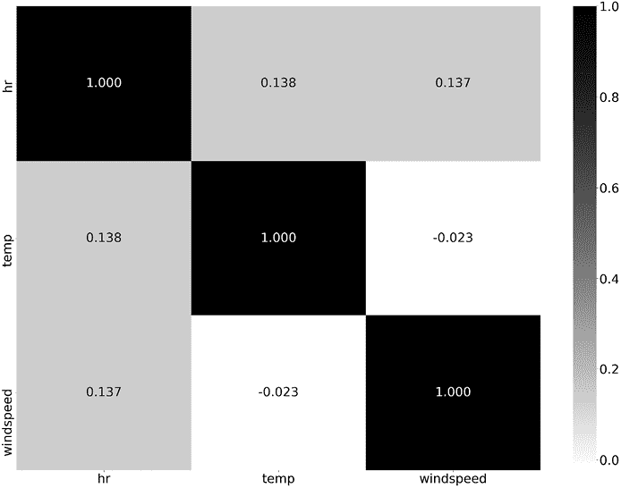

图 1-13：通过热力图展示的相关性

这个热力图展示了九个矩形的集合。正如右侧图例所示，矩形中较深的填充色表示特定的相关性较高，而较浅的填充色表示相关性较低。相关矩阵的热力图可以提供一种更快捷的方式来检查变量之间的模式和关系，因为强关系会迅速引起注意。

如果你更喜欢彩色图而不是灰度图，可以更改`sns.heatmap()`方法中的`cmap='binary'`参数。这个`cmap`参数指的是热力图的*颜色映射*，通过选择不同的`cmap`值，你可以获得不同的色彩方案。例如，如果你使用`cmap='coolwarm'`，你将看到一种热力图，其中较高的数值用红色表示，较低的数值用蓝色表示。

热力图不仅可以用于相关矩阵的绘制，也可以用于其他变量。例如，我们可以绘制一个热力图，显示一周内每个小时的乘客数量：

```py
# Create a pivot table
df_hm =hour.pivot_table(index = 'hr',columns ='weekday',values ='count')
# Draw a heatmap
plt.figure(figsize = (20,10)) # To resize the plot
sns.heatmap(df_hm,  fmt="d", cmap='binary',linewidths=.5, vmin = 0)
plt.show()
```

为了创建这个图表，我们需要创建一个数据透视表，即一个分组值的表格。如果你曾经花很多时间使用 Excel 或其他电子表格程序，可能已经遇到过数据透视表。在这里，我们的数据透视表根据每周的日期和每小时的时间对完整数据集进行了分组。我们列出了每一天（从周日到周六）每小时（0 到 23 点）的平均客流量。通过这种方式分组的数据透视表创建后，我们可以使用相同的`heatmap()`方法来创建图中所示的热力图图 1-14。

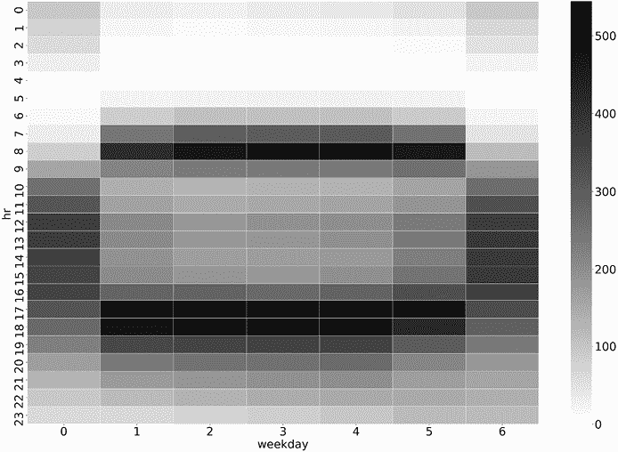

图 1-14：每天每小时的客流量

这个热力图包含了客流量较多的小时段用较深的矩形表示，而客流量较少的小时段则用较浅的矩形表示。我们可以看到通勤者在早上 8 点和下午 5 点的活动激增。我们还可以看到周六和周日下午的周末出行情况。

从商业角度来看，这个热力图可以为我们提供各种商业想法。例如，看到工作日早上 8 点左右客流量激增，可能会给你增加收入的启示。正如我们曾考虑在低活跃时段提供折扣一样，我们也可以考虑采取相反的策略：在特别活跃的时段进行加价（暂时提高价格）。其他交通公司，如 Uber、Lyft 和 Grab，也使用这一加价策略，不仅为了增加收入，还为了确保产品的高可用性。

## 深入探索

到目前为止，我们只看过一个数据集，而且只进行了其中一些无限可能的探索。当你从作为 CEO 的第一天早晨开始，直到第一天下午，再到第二天，甚至更远的时间，你将需要对你的业务及其运作方式做出许多决策。我们在这一章中所做的探索可以应用到你将来遇到的任何业务问题。例如，你可以考虑将自行车租赁与清爽的饮品捆绑销售，从而赚取额外的收入（更不用说这样可以让骑行者更加健康和安全）。分析与你的客户、他们的骑行模式以及骑行过程中他们的口渴程度相关的数据，能够帮助你判断这一策略是否可行。

其他分析可能与你的自行车维修需求相关。你的自行车维修的频率是多少？维修费用是多少？你可以检查维修的时间，确保它们没有发生在高峰时段。你可以检查各种类型自行车的维修费用。你可以检查维修费用的直方图，看看是否有任何异常值导致费用过高。这些探索将帮助你更好地理解你的业务，并为你提供改进业务的想法。

到目前为止，我们的分析并不特别复杂；大多数情况下，我们只是计算了一些汇总统计并绘制了图表。但这些简单的计算和图表，结合常识，作为做出商业决策的第一步，依然非常有价值。有些 CEO 不足够重视数据，其他一些则希望查看数据，但依赖员工为他们提供报告，而这些报告可能会很慢或者不完美。一个能够自信地检查与公司相关数据的 CEO，才能成为一名有效的 CEO。CEO 可以变得擅长数据，这与他们的商业知识结合起来，将使他们在工作中更加出色。同样，数据科学家也可以变得擅长商业，当他们的数据技能与商业眼光结合时，他们将真正成为一个不可忽视的力量。

## 总结

在本章中，我们从一个简单的商业场景开始：成为一名 CEO，并做出与更好地运营业务相关的决策。我们讨论了一些 CEO 需要做的事情，以及探索性数据分析如何发挥作用。我们涵盖了如何将数据读取到 Python 中，计算汇总统计，绘制图表，并在商业上下文中解读结果。在下一章中，我们将讨论线性回归，这是一种更复杂的方法，既可以用于探索，也可以用于预测。让我们继续！
