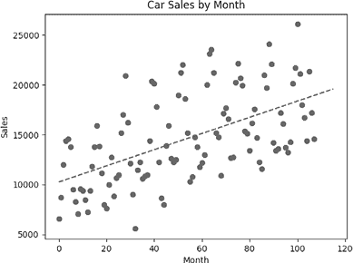

## 第二章：预测


让我们看看一些可以帮助你预测未来的数据科学工具。在本章中，我们将介绍一个简单的商业场景，假设一家公司需要预测客户需求。然后，我们将讨论如何应用数据科学工具来做出准确的预测，以及如何通过这些预测做出更好的商业决策。

我们将使用线性回归进行预测，并讨论单变量和多变量线性回归。最后，我们将研究回归线的外推以及如何评估各种回归模型，以选择最佳模型。

## 预测客户需求

假设你在加拿大魁北克经营一家汽车经销商。你使用的是标准的零售商业模式：你以低价从制造商那里购买汽车，然后以较高的价格卖给个人客户。每个月，你需要决定从制造商那里订购多少汽车。如果你订购了太多汽车，你将无法快速卖出，导致高额的存储成本或现金流问题。如果你订购的汽车太少，你将无法满足客户的需求。

订购正确数量的汽车很重要。但什么是正确的数量呢？答案取决于一些商业考虑因素，比如你的银行账户中的现金和你希望增长的规模——但在一个典型的月份，正确的订购数量正好是客户在下个月愿意购买的汽车数量。由于我们无法预测未来，我们需要通过预测需求来下订单。

我们可以选择几种经过验证的定量方法来获得下个月需求的预测。最好的方法之一是*线性回归*。在本章的其余部分，我们将解释如何使用线性回归进行预测。我们将利用过去的数据来预测未来的数据，从而了解我们需要订购多少汽车。我们将从简单的步骤开始，先读取并查看一些数据，然后进入预测过程的其他步骤。

## 清理错误数据

我们将分析的数据是魁北克的汽车经销商在连续 108 个月中每月销售的汽车数量记录。这些数据最初由统计学教授和预测专家 Rob Hyndman 在线提供。你可以从[`bradfordtuckfield.com/carsales.csv`](https://bradfordtuckfield.com/carsales.csv)下载这些数据。

这些数据较旧；记录的最近一个月是 1968 年 12 月。因此，在这个场景中，我们将假设我们生活在 1968 年 12 月，并为 1969 年 1 月做出预测。我们将讨论的预测原则是长久有效的，因此，如果你能用 1968 年的数据预测 1969 年的结果，你也能用年份*n*的数据预测年份*n* + 1 的结果，*n* = 2,023 或 3,023 或任何其他年份。

将此文件保存在你运行 Python 的相同目录下。然后我们将使用 Python 的 pandas 包读取数据：

```py
import pandas as pd
carsales=pd.read_csv('carsales.csv')
```

在这里，我们导入 pandas 并给它取别名`pd`。然后我们使用它的`read_csv()`方法将数据读取到 Python 中，并存储在`carsales`变量中。我们在这里导入并使用的 pandas 包是一个强大的模块，它使得在 Python 中处理数据变得更加容易。我们创建的`carsales`对象是一个 pandas 数据框（dataframe），它是 pandas 在 Python 会话中存储数据的标准格式。由于这个对象被存储为 pandas 数据框，我们将能够像在第一章中一样，使用许多有用的 pandas 方法来处理它。让我们从使用`head()`方法开始，它让我们能够检查 pandas 数据框：

```py
>>> **print(carsales.head())**
     Month  Monthly car sales in Quebec 1960-1968
0  1960-01                                 6550.0
1  1960-02                                 8728.0
2  1960-03                                12026.0
3  1960-04                                14395.0
4  1960-05                                14587.0
```

通过查看这些行，我们可以注意到几个重要的点。首先，我们可以看到列名。这个数据集的列名是`Month`和`Monthly car sales in Quebec 1960-1968`。第二个列名如果我们缩短它，将会更容易处理。在 Python 中我们可以很容易做到这一点：

```py
carsales.columns= ['month','sales']
```

在这段代码中，我们访问了数据框的列并重新定义它们，使用了更简短的名称（分别是`month`和`sales`）。

就像`head()`方法打印数据集的前五行一样，`tail()`方法打印数据集的后五行。如果你运行`print(carsales.tail())`，你会看到以下输出：

```py
>>> **print(carsales.tail())**
                                     month    sales
104                                1968-09  14385.0
105                                1968-10  21342.0
106                                1968-11  17180.0
107                                1968-12  14577.0
108  Monthly car sales in Quebec 1960-1968      NaN
```

我们可以看到，现在列名更短且更易读。但我们也看到，最后一行没有包含汽车销售数据。相反，它的第一项是一个*标签*，或者说是描述整个数据集的标签。它的第二项是`NaN`，代表*不是数字*，意味着该项没有数据或数据未定义。我们不需要标签项和空的（`NaN`）项，所以让我们删除整行最后一行（第 108 行）：

```py
carsales=carsales.loc[0:107,:].copy()
```

在这里，我们使用 pandas 的`loc()`方法来指定我们想要保留的行：在这种情况下，我们保留从第 0 行到第 107 行（包括第 107 行）的所有行。我们在逗号后面使用冒号（`:`）来表示我们想要保留数据集的两列。我们将结果存储在`carsales`变量中，从而删除了多余的第 108 行。如果你再次运行`print(carsales.tail())`，你会看到该行已经被删除。

通过查看数据的头部和尾部，我们还可以看到月份数据的格式。第一项是`1960-01`（1960 年 1 月），第二项是`1960-02`（1960 年 2 月），依此类推。

作为数据科学家，我们有兴趣使用数学、统计学和其他定量方法进行数值分析。日期有时会带来一些繁琐的挑战，使得我们很难按照想要的方式进行数学和统计分析。第一个挑战是日期有时不是以数字数据类型存储的。在这里，日期被存储为*字符串*，即字符的集合。

要理解为什么这是一个问题，可以在 Python 控制台尝试 `print(1960+1)`；你会发现结果是 `1961`。Python 识别到我们正在处理两个数字，并按照我们期望的方式将它们相加。接着，在 Python 控制台尝试 `print('1960'+'1')`；这时你得到的结果是 `19601`。这次，Python 识别到我们输入的是字符串，并假设 `+` 符号表示我们想要进行 *连接*，即将字符串简单地拼接在一起，而不是按照数学规则进行相加。

日期的另一个挑战是，即使它们是数字形式，它们也遵循与自然数逻辑不同的规则。例如，如果我们将 1 加到第 11 个月，我们得到第 12 个月，这符合算术规则：11 + 1 = 12。然而，如果我们将 1 加到第 12 个月，我们又回到了第 1 个月（因为每年的 12 月之后是 1 月），这与 12 + 1 = 13 的简单算术不一致。

在这种情况下，解决日期数据类型问题的最简单方法是定义一个新的变量叫做 `period`。我们可以如下定义它：

```py
carsales['period']=list(range(108))
```

我们的新 `period` 变量只是从 0 到 107 的所有数字的列表。我们将 1960 年 1 月称为期 0，1960 年 2 月称为期 1，以此类推，直到 1968 年 12 月，这是我们数据中的最后一个月，我们称其为期 107。这个新变量是数字类型的，因此我们可以对它进行加法、减法或其他任何数学运算。而且，它将遵循标准算术规则，期 13 紧跟在期 12 后面，正如我们对数字变量的预期。这种简单的解决方案之所以可行，是因为在这个特定的数据集中，行是按时间顺序排列的，因此我们可以确保每个期号都分配给了正确的月份。

这些简单的任务，比如为月份添加一个数字列、删除多余的行、修改列名，都是 *数据清理* 的一部分。这不是一个光鲜亮丽或特别令人兴奋的过程，但做得对非常重要，因为它为数据科学过程中更令人激动的步骤打下了基础。

## 绘制数据以寻找趋势

完成这些基本的数据清理任务后，我们应该立即绘制数据。在每个数据科学项目中，绘图应该尽早并且经常进行。让我们使用 Matplotlib 模块创建一个简单的图表来显示我们的数据：

```py
from matplotlib import pyplot as plt
plt.scatter(carsales['period'],carsales['sales'])
plt.title('Car Sales by Month')
plt.xlabel('Month')
plt.ylabel('Sales')
plt.show()
```

在这个代码片段中，我们导入了 Matplotlib 的 `pyplot` 模块，并将其别名设为 `plt`。然后，我们使用 `scatter()` 方法创建了一个散点图，显示了所有销售数据，按期（月份）组织。我们还用了几行代码来添加坐标轴标签和图表标题，然后展示图表。图 2-1 显示了结果。


图 2-1：九年内按月销售的汽车数量

这个简单的图表显示了我们的 `period` 变量在 x 轴上，`sales` 在 y 轴上。每个点代表一行数据，或者换句话说，代表一个特定月份的汽车销售数量。

看看在这个图表中有什么有趣的信息能引起你的注意。可能最明显的事情是从左到右的逐渐上升趋势：销售似乎随着时间的推移在逐步增加。除了这个趋势，数据似乎杂乱无章，散布着巨大的波动，且每个月之间的波动也很大。一年或季节内的波动看起来是随机的、嘈杂的，并且不可预测。我们接下来将实现的线性回归方法将尝试捕捉数据中的顺序和模式，帮助我们不那么被随机性和噪声所干扰。

到目前为止，我们所做的只是读取数据并绘制一个简单的图表。但我们已经开始看到一些模式，这些模式将有助于我们做出准确的预测。接下来，我们将进入一些更严谨的预测步骤。

## 执行线性回归

现在我们已经清理了数据、绘制了图表，并注意到了一些基本的模式，我们已经准备好进行认真的预测了。我们将使用线性回归来进行预测。*线性回归*是每个数据科学家工具箱中的必备工具：它找到一条能够捕捉变量之间噪声关系的直线，我们可以利用这条直线来对我们从未见过的事物进行预测。

线性回归是在“*机器学习*”一词被提出的一个多世纪之前就已经被发明的，历史上它一直被认为是纯统计学的一部分。然而，由于它与许多常见的机器学习方法有着非常相似的特点，并且与机器学习共享一些共同的理论基础，因此线性回归有时被视为机器学习领域的一部分。像所有最好的科学工具一样，它帮助我们从混乱中提取秩序。

在这个例子中，我们有魁北克汽车销售的混乱数据，其中季节性变化、时间趋势和单纯的随机性交织在一起，形成一个嘈杂的数据集。当我们将简单的线性回归应用于这些数据时，输出将是一条直线，这条直线捕捉到了一种潜在的结构，帮助我们对未来做出准确的预测。图 2-2 展示了线性回归的典型输出示例。


图 2-2：显示线性回归典型输出的虚线

在这张图中，你可以看到代表数据的点，就像在图 2-1 中一样。我们再次看到了数据集的混乱：整个数据集在每个月之间都有很大的波动。

从左到右略微向上的虚线代表线性回归的输出。它被称为 *回归线*，我们常常说这条回归线 *拟合* 数据。换句话说，它通过看起来大致处于所有点构成的云的中心的地方。它接近我们数据中的许多点，并且没有数据点特别远离它。就像这条线表达或揭示了时间与销量之间的基本关系（一种逐渐增长的关系）。线拟合一组点的概念是线性回归的基础。事实上，出于我们稍后讨论的原因，回归线有时被称为数据集的 *最佳拟合线*。

由于我们的回归线是一条直线，它没有真实数据中的随机波动。该线以可预测的方式前进。通过去除这些随机性，回归线向我们展示了数据潜在模式的清晰表示。在这种情况下，回归线显示数据随着时间的推移有一个整体向上的趋势，如果我们仔细测量回归线，我们可以精确找到该趋势的斜率和高度。

我们可以将回归线在任何特定月份的值解释为该月预期的汽车销量。稍后，我们将把这条简单的线向前外推到未来（通过继续用相同的斜率绘制它，直到它延伸到图表的右边缘之外），以生成未来几个月的销售预测。

让我们运行执行线性回归并输出回归线的代码。我们将使用对数据的 *形状* 非常敏感的线性回归方法，也就是说，销售数据是以 108 行 × 1 列的形式存储，还是以 108 列 × 1 行的形式存储。在这种情况下，如果我们的数据存储为 108 行，每行包含一个数字的列表，我们的线性回归代码将运行得更顺畅。为了将数据转化为这种形状，我们将使用 pandas 的 `reshape()` 方法，具体如下：

```py
x = carsales['period'].values.reshape(-1,1)
y = carsales['sales'].values.reshape(-1,1)
```

如果你运行 `print(x)` 和 `print(y)`，你可以看到数据的新形状：108 行的单元素列表。实际上，执行线性回归的代码非常简短。我们可以用三行代码完成整个过程，包括导入相关模块：

```py
from sklearn.linear_model import LinearRegression
regressor = LinearRegression()
regressor.fit(x, y)
```

在这里，我们从 scikit-learn 包导入线性回归功能，该包可以通过其标准缩写 sklearn 来引用。这个在机器学习领域极为流行的包提供了许多有用的机器学习功能，包括线性回归。在导入 sklearn 后，我们定义变量 `regressor`。如其名称所示，*回归器* 是一个 Python 对象，我们将使用它来执行回归操作。在创建回归器后，我们告诉它对 `x` 和 `y` 变量进行 `fit` 操作。我们告诉它通过匹配数据的位置和总体趋势来计算如 图 2-2 所示的拟合数据的直线。

描述*拟合回归*的一个更定量的方式是：它是确定两个数字的精确、优化值：一个系数和一个截距。在运行了前面的代码片段后，我们可以如下查看这两个数字：

```py
print(regressor.coef_)
print(regressor.intercept_)
```

这段代码打印出回归器`fit()`方法输出的两个数字：一个截距，你应该能看到大约是 10,250.8；以及一个叫做`coef_`的变量，`coef_`是*系数*的缩写，它的值应该大约是 81.2。结合这两个数字，可以指定图 2-2 中虚线回归线的确切位置和趋势。在接下来的部分，你将看到它们是如何做到这一点的。

### 将代数应用于回归线

要理解这两个数字如何指定回归线，回想一下你高中数学课学到的内容。你可能记得，每一条直线都可以用类似下面的形式表示：

*y* = *m* · *x* + *b*

在这里，*m*是斜率或系数，*b*是截距（严格来说是*y-截距*——即直线穿过图表 y 轴的精确位置）。在这种情况下，我们找到的`coef_`变量值，大约是 81.2，就是*m*的值，而我们找到的截距变量值，大约是 10,250.8，就是*b*的值。所以，通过我们的回归过程，我们学到的是，时间段和汽车销量之间的关系可以至少大致表示为：

*汽车销量* = 81.2 · *时间段* + 10250.8

汽车销售数据集看似随机变化的混乱（如图 2-1 所示）现在已简化为这个简单方程的规律。这个方程描述的直线就是图 2-2 中的虚线。我们可以将这条直线上的每一个点看作是对每个时间段内汽车销售预期的预测，忽略了干扰性随机性和噪音。

我们方程中的*m*和*b*值有着有用的解释。线性斜率 81.2 的解释是汽车销售的月度增长趋势。根据我们过去观察到的数据，我们得出结论，魁北克的汽车销量每月大约增长 81.2 辆。虽然仍然存在随机性和其他变动，但 81.2 的增长值是我们大致期望的。截距变量 10,250.8 的解释是汽车销售的*基准*值：即“移除”或忽略季节性变化、时间流逝和其他影响后，在第 0 个月预期的汽车销量。

线性回归找到的方程也可以叫做*模型*，即描述两个或多个变量之间关系的定量描述。因此，当我们执行前面的步骤时，我们可以说我们*拟合了回归*，或者我们可以等效地说我们*训练了一个模型*。我们的回归，或者等效地说我们的模型，告诉我们：在数据时间框架的开始，我们预期销售大约 10,250.8 辆汽车，并且每个月比前一个月多售出大约 81.2 辆汽车。

自然会有人想知道，我们的回归器是如何确定 81.2 和 10,250.8（回归器的 `coef_` 和 `intercept` 输出值）是回归线中*m*和*b*的最佳值的。这条线在图 2-2 中看起来足够好，但它并不是唯一一条可以穿过我们数据点云的线。实际上，还有无数条可以穿过数据点云的线，并且它们也可以被说成符合数据。例如，我们可能假设以下这条线更好地近似时间周期与销售之间的关系：

*汽车销售* = 125 · *时间周期* + 8000

我们将这条新线称为我们的*假设线*。如果我们将其作为数据模型，我们就有了新的*m*和*b*，从而得到了新的解释。特别是，这条线的斜率是 125，我们将其解释为预期每个月的汽车销售将增加大约 125 辆——这明显高于回归线估计的 81.2。接下来，我们将回归线和这条新的假设线与数据一起绘制如下：

```py
plt.scatter(carsales['period'],carsales['sales'])
plt.plot(carsales['period'],[81.2 * i + 10250.8 for i in \
carsales['period']],'r-',label='Regression Line')
plt.plot(carsales['period'],[125 * i + 8000 for i in
carsales['period']],'r--',label='Hypothesized Line')
plt.legend(loc="upper left")
plt.title('Car Sales by Month')
plt.xlabel('Month')
plt.ylabel('Sales')
plt.show()
```

你可以在图 2-3 中看到这个代码片段的输出，我们绘制了数据、回归线（浅色实线）以及我们新的假设线（更陡的虚线）。


图 2-3：一条回归线和一条更陡的线，这两条线都符合数据

两条线都穿过我们的数据点云，且都表现出随时间的上升趋势。它们都是合理的候选线，可以近似表示时间与销售之间的关系，并且都可以说符合数据。为什么我们的回归器输出了一条线而不是另一条呢？我们之前说过，线性回归过程中输出的回归线是*最佳拟合线*。是什么让我们能说它比任何其他线拟合得更好呢？

### 计算误差测量值

我们可以通过查看与*回归误差*相关的测量值来找到答案。记住，我们将回归线上的每个点解释为我们对数据中预期值的预测。图 2-4 显示了一条回归线及其所用数据。


图 2-4：回归误差：点与回归线之间的垂直距离

你可以看到，这条回归线很好地拟合了数据，意味着它接近大多数示例点。然而，它并不是完美拟合。对于每一个数据点，我们可以计算该数据点与回归线之间的垂直距离。回归线预测了一个特定值，而数据中的点与这个预测值之间有一个特定的距离。这个预测值与实际值之间的距离被称为回归的*误差*（error）相对于该点。在图 2-4 中，变量*e*[*i*]是数据中某一点的误差测量。你可以看到，*e*[*i*]是该点与回归线之间的垂直距离。我们可以为数据中的每一个点计算这个距离。

计算相对于每个数据点的误差将为我们提供一个量化任何线如何拟合我们数据的方法。误差小的线能够很好地拟合数据，而误差大的线则拟合得不好。这就是为什么我们说，衡量回归误差是衡量回归线的*拟合优度*（goodness of fit）的一种方式，即衡量一条线与数据拟合的程度。

让我们来计算这些关于汽车销售回归的误差测量。我们将计算我们感兴趣的线的每一个点，并将这些点与我们数据集中的每一个点进行比较：

```py
saleslist=carsales['sales'].tolist()
regressionline=[81.2 * i + 10250.8 for i in carsales['period']]
hypothesizedline=[125 * i + 8000 for i in carsales['period']]
error1=[(x-y) for x, y in zip(regressionline,saleslist)]
error2=[(x-y) for x, y in zip(hypothesizedline,saleslist)]
```

在这个代码片段中，我们创建了`销售列表`（saleslist），一个包含每个月汽车销售数量的变量。接着我们创建了两个变量，`回归线`（regressionline）和`假设线`（hypothesizedline）。这些变量分别记录回归线和假设线上的每一个点。我们想要衡量每个实际销售数字与这两条线的距离，因此我们创建了两个额外的变量：`误差 1`（error1），用于记录实际销售数字与回归线之间的距离，`误差 2`（error2），用于记录实际销售数字与假设线之间的距离。

我们可以打印出这些变量，以查看我们在两条线上的误差：

```py
print(error1)
print(error2)
```

当你查看这些误差列表时，你可以看到 108 个分别测量这两条线与原始数据的距离的独立值。这 108 个测量值表达了这些线如何拟合原始数据。然而，一次性查看这 216 个测量值是很困难的。如果我们能够将所有这些表示线拟合情况的信息压缩为一个数字，那会更容易。以下代码片段展示了一种实现方法：

```py
import numpy as np

error1abs=[abs(value) for value in error1]
error2abs=[abs(value) for value in error2]

print(np.mean(error1abs))
print(np.mean(error2abs))
```

在这个代码片段中，我们导入了 Python 的 NumPy 包。NumPy 在数据科学中非常常用，特别是在进行数组和矩阵计算时。这里，我们导入它是因为它能帮助我们计算一个列表的均值。然后，我们定义了两个新变量：`误差 1 绝对值`（error1abs）和`误差 2 绝对值`（error2abs），它们分别包含我们对两条线的误差测量的绝对值列表。最后，我们计算这些列表的均值。

我们得到的均值被称为*均值绝对误差（MAE）*，即每条线的误差测量值。希望 MAE 对你来说是一个直观的误差衡量：它只是线与数据集中的点之间的平均垂直距离。与数据集中点非常接近的线会有较低的 MAE，而与大多数点距离较远的线则会有较高的 MAE。

MAE 是一种合理的方式来表示回归线或任何其他线的拟合优度。MAE 越小，拟合效果越好。在这种情况下，我们可以看到回归线的 MAE 为 3,154.4，而我们假设的线的 MAE 为 3,239.8。至少根据这个测量，回归线比我们假设的线拟合得更好。

MAE 有一个简单的解释：它是我们使用特定回归线进行预测时，预计会有的平均误差。当我们说回归线的 MAE 为 3,154.4 时，我们的意思是，如果我们使用这条回归线进行预测，我们预计我们的预测结果平均会偏差大约 3,154.4（可能偏低或偏高）。

例如，假设我们预测三个月后将销售 20,000 辆汽车。我们等待三个月，统计每月的销售量，发现实际销售量是 23,154 辆，而不是 20,000。我们的预测错了；我们低估了汽车销售量 3,154 辆。所以，我们的预测并不完美，预测误差的大小正好告诉我们我们有多不完美。我们的误差大小是否令人惊讶？我们刚刚测得的 MAE（3,154.4）告诉我们，误差这么大并不奇怪——事实上，低估 3,154 辆（四舍五入后）正是我们在使用这个回归模型进行任何月度预测时，预计会遇到的误差大小。有时我们会高估，而不是低估；有时我们的误差会低于或高于 3,154。但无论如何，MAE 告诉我们，使用这个回归模型进行这种预测时，误差大约为 3,154 是我们所期望的。

MAE 并不是唯一衡量线拟合数据集程度的指标。让我们看看另一个可能的指标：

```py
error1squared=[(value)**2 for value in error1]
error2squared=[(value)**2 for value in error2]

print(np.sqrt(np.mean(error1squared)))
print(np.sqrt(np.mean(error2squared)))
```

在这里，我们创建了每个误差的平方值列表。然后，我们取这些误差平方和的平方根。这个指标被称为*均方根误差（RMSE）*。较低的 RMSE 值表示拟合效果更好的回归线——它预计能做出更准确的预测。

我们可以创建简单的 Python 函数来计算 MAE 和 RMSE：

```py
def get_mae(line,actual):
    error=[(x-y) for x,y in zip(line,actual)]
    errorabs=[abs(value) for value in error]
    mae=np.mean(errorabs)
    return(mae)

def get_rmse(line,actual):
    error=[(x-y) for x,y in zip(line,actual)]
    errorsquared=[(value)**2 for value in error]
    rmse=np.sqrt(np.mean(errorsquared))
    return(rmse)
```

这些函数分别计算 MAE 和 RMSE，和我们之前做的一样。如果你运行 `print(get_rmse(regressionline,saleslist))`，你会看到回归线的 RMSE 约为 3,725；如果你运行 `print(get_rmse(hypothesizedline,saleslist))`，你会看到我们假设的线的 RMSE 约为 3,969。

你会注意到我们回归线的 RMSE 比假设线的 RMSE 小。这使我们可以根据 RMSE 指标说回归线比假设线更适合数据。

我们回归线的 RMSE 低于假设线的 RMSE 并非偶然。当我们之前在 Python 中运行命令`regressor.fit(x,y)`时，`regressor.fit()`方法执行了由伟大数学家阿德里安-玛丽·勒让德（Adrien-Marie Legendre）发明的线性代数计算，并首次在 1805 年发布。勒让德的计算方法接受一组点作为输入，输出的是最小化 RMSE 值的截距和系数。换句话说，勒让德方法确定的系数对应的直线，在数学上保证比任何其他我们尝试绘制的、用来拟合数据的无数条直线具有更低的 RMSE。当我们称回归线为最优拟合线时，我们的意思是它在所有使用我们指定的变量的可能直线中，数学上保证具有最低的 RMSE。这一保证是线性回归持续受欢迎的原因，也是为什么它多年来仍然是寻找适合数据集的直线的标准方法。

回归器输出的直线是最优拟合线，不仅在宽松的意义上它看起来很好地拟合了数据点云，而且在严格的定量意义上，所有通过数据点云的无数条直线中，它保证具有最低的 RMSE。你可以随意尝试其他直线并检查它们的 RMSE 值——你不会找到比我们的回归线表现更好的直线。

## 使用回归进行未来趋势预测

到目前为止，我们使用线性回归找到了最适合历史数据的直线。但我们的历史数据都来自过去，因此我们还没有进行任何真正的预测。从线性回归到预测是简单的：我们只需要外推。

我们在图 2-2 中绘制的虚线回归线停止在图表的边缘，左边是第 0 个月，右边是第 107 个月，但没有理由它必须停在那里。如果我们继续将回归线向右延伸，我们可以看到任何未来月份的预期值，尽管时间跨度可能很远。当然，扩展回归线时，我们会保持相同的斜率和截距。让我们编写代码来实现这一点：

```py
x_extended = np.append(carsales['period'], np.arange(108, 116))
```

在这里，我们创建了变量`x_extended`。这个变量是由两组数字组合而成的。首先，它包含我们数据集中`period`列的值，这些值记录了从 0 到 107 的周期顺序。其次，它包含从 108 到 115 的所有数字——这些数字代表了数据结束后未来的月份（第 108 个月、第 109 个月……直到第 115 个月）。我们使用`np.append()`方法将这两者合并，最终结果是原始*x*变量的扩展版。

接下来，我们可以使用回归模型的`predict`方法来计算`x_extended`中每个月份对应的回归线上的值：

```py
x_extended=x_extended.reshape(-1,1)
extended_prediction=regressor.predict(x_extended)
```

现在，我们已经将预测值存储在变量`extended_prediction`中。如果你查看`extended_prediction`，你可以看到这些预测值。这些预测值遵循一个简单的规律：每个预测值比前一个高出约 81.2。这是因为 81.2 是回归线的斜率。记住，81.2 不仅仅是回归线的斜率，它也是我们预计每个月汽车销售增长的大小，忽略了随机性和季节性波动。

我们在这里使用的预测方法很有帮助，但我们并不真正需要它。我们可以通过将数字代入回归方程来获得回归线上的任何值：

*汽车销售* = 81.2 · *周期* + 10250.8

无论我们如何得到下一个预测值，我们都可以将其绘制出来，并查看它们在图表上的表现（图 2-5）：

```py
plt.scatter(carsales['period'],carsales['sales'])
plt.plot(x_extended,extended_prediction,'r--')
plt.title('Car Sales by Month')
plt.xlabel('Month')
plt.ylabel('Sales')
plt.show()
```



图 2-5：一条回归线向前推算了几个周期，用于预测

这个图表可能不会让你感到惊讶。它看起来几乎和图 2-2 一样，且本应如此。唯一的区别是我们将回归线向右延伸了几个周期，以查看我们预期的汽车销售量——也就是我们预测的销售量——在不久的未来会是什么样子。这种回归线的外推是一种简单但有效的预测方法。

我们已经通过线性回归完成了预测，但我们可以做更多的工作来提高预测的准确性。在接下来的几节中，我们将讨论如何评估和改进我们预测的表现。

## 尝试更多回归模型

我们在前几节做的线性回归是一个简单的类型，称为*单变量线性回归*。这种回归方法只使用一个变量来预测另一个变量。在我们的例子中，我们仅使用了周期变量来预测销售额。只使用一个变量有几个优点：首先，它很简单；其次，它创建了一条简单的直线，可以表达数据中的某些规律，而不会包括随机噪声。但我们还有其他选择。

### 多变量线性回归预测销售额

如果我们使用其他变量来预测销售，而不仅仅是时间周期，我们可以执行一种更复杂的回归分析，称为*多元线性回归*。多元线性回归的细节与单变量线性回归基本相同；唯一的真正区别是我们用于预测的变量数量。我们可以选择任何我们喜欢的变量进行多元回归：国内生产总值（GDP）增长率、人口估算、汽车价格、通货膨胀率，或任何我们想要的其他变量。

目前，我们受到限制，因为我们的数据集不包含任何这些变量。它仅包含时间周期和销售数据。然而，我们仍然可以进行多元回归，方法是使用从时间周期变量推导出来的变量。例如，我们可以使用*period*²作为多元回归中的新变量，或者使用 log(*period*)，或任何其他时间周期变量的数学变换。

请记住，当我们之前进行回归分析时，我们在以下方程式中找到了 *m* 和 *b*（斜率和截距）变量：

*y* = *m* · *x* + *b*

当我们使用多个变量来预测汽车销售时，我们也在求解斜率和截距变量。唯一的区别是我们还需要求解更多的变量。如果我们使用三个变量进行预测（可以分别称为 *x*[1]，*x*[2]，和 *x*[3]），那么我们需要在以下方程式中找到 *m*[1]，*m*[2]，*m*[3] 和 *b* 变量：

*y* = *m*[1] · *x*[1] + *m*[2] · *x*[2] + *m*[3] · *x*[3] + *b*

这个思想与单变量回归相同，但我们得到的斜率更多，因为有更多的预测变量。如果我们想用*period*、*period*²和*period*³来预测汽车销售，我们就需要估算方程式 2-1 中的 *m*[1]，*m*[2]，*m*[3] 和 *b* 变量：

*汽车销售* = *m*[1] · *period* + *m*[2] · *period*² + *m*[3] · *period*³ + *b*

方程式 2-1：使用我们的汽车销售数据进行多元回归的方程式

让我们看看生成这些时间周期变量转化并进行三变量线性回归的代码：

```py
carsales['quadratic']=carsales['period'].apply(lambda x: x**2)
carsales['cubic']=carsales['period'].apply(lambda x: x**3)

x3 = carsales.loc[:,['period','quadratic','cubic']].values.reshape(-1,3)
y = carsales['sales'].values.reshape(-1,1)

regressor_cubic = LinearRegression()
regressor_cubic.fit(x3, y)
plt.scatter(carsales['period'],carsales['sales'])
plt.plot(x,regressor.predict(x),'r-')
plt.plot(x,regressor_cubic.predict(x3),'r--')
plt.title('Car Sales by Month')
plt.xlabel('Month')
plt.ylabel('Sales')
plt.show()
```

在这段代码中，我们定义了两个新变量：`quadratic`，其值等于*period*²，和`cubic`，其值等于*period*³。然后，我们定义了一个新的`x3`数据框，其中包含这三个新变量，并且我们将它的形状调整为适合回归模型的形式。对于这个三变量的多元回归，正确的形状是一个包含 108 行的数组，每一行是我们三个变量在某个月份的值列表。只要数据具有正确的形状，我们就可以使用`fit()`方法进行任何单变量或多变量的线性回归，且变量数量不受限制。调用`fit()`方法后，我们计算出由此回归预测的数值，并将其绘制成图。这段代码生成了图 2-6 中的图表。


图 2-6：同样拟合数据的曲线

这里，你可以看到两条回归线。一条是（实线）直线，是我们之前（单变量）回归的结果。另一条新的回归线不是直线，而是一条（虚线）曲线——更准确地说，是一条*三次曲线*。线性回归最初是为了拟合直线而设计的（因此得名*线性*），但我们也可以用它来找到最佳拟合曲线和非线性函数，如图 2-6 中的三次多项式。

无论是找到最佳拟合直线还是最佳拟合曲线，我们所使用的线性回归方法都是完全相同的。同样，使用多个变量进行预测与使用一个变量进行单变量回归其实并没有太大区别：输出依然能够拟合我们的数据，实际上，我们的新曲线与直线非常接近。每次选择不同的变量进行回归时，输出会看起来稍有不同：可能形状不同或曲线不同。但它总是能够拟合数据。在这种情况下，如果你想知道方程 2-1 中的未知变量，我们可以像下面这样打印出来：

```py
print(regressor_cubic.coef_)
print(regressor_cubic.intercept_)
```

这些`print()`语句的输出结果如下：

```py
[[ 8.13410634e+01 7.90279561e-01 -8.19451188e-03]]
[9746.41276055]
```

这些输出使我们能够填写方程 2-1 中的所有变量，从而得到一个使用三次多项式估算汽车销量的方程：

*汽车销量* = 81.34 · *周期* + 0.79 · *周期*² – 0.008 · *周期*³ + 9746.41

关于图 2-6，一个重要的注意点是我们的回归线在最后几个周期中的不同表现，即图表右侧的部分。我们单变量回归得到的直线每个周期增加约 81.2，且当我们将其外推到更远的右侧时，它将继续预测每个周期约增加 81.2。相比之下，我们的多元回归得到的曲线在图表的右侧开始向下弯曲。如果我们将其外推到更远的右侧，它将预测每个月的汽车销量会永远下降。

这两条线虽然行为相似，且都是线性回归的结果，但它们对未来的预测却正好相反：一条预测增长，另一条预测收缩。本章稍后我们将详细讨论如何选择哪条回归线用于预测。

### 用三角函数捕捉变化

我们可以在多元回归中添加任意数量的变量。每一次选择的变量都会导致一条形状略有不同的曲线。我们在每个回归问题中需要做出的一个困难选择是：选择哪些变量来添加到回归模型中。

在这种情况下，单变量回归线（图 2-2 中的直线）和三次回归线（图 2-6 中的曲线）都是可接受的，并且都可以用来预测未来。然而，尽管它们都穿过看似我们的数据点云的中心，但仍然有太多变动它们没有捕捉到——许多单个月份的销售比这些线高得多或低得多。理想情况下，我们可以找到一组变量，当使用线性回归进行拟合时，得到一条更好地适应这些变动的曲线。在这种情况下，对数据绘制方式做一个小的改动，可以让我们接下来的工作变得更加清晰。

让我们通过对代码做一个小的修改（以**粗体**显示），将图 2-1 从散点图改为折线图。

```py
from matplotlib import pyplot as plt
plt**.plot**(carsales['period'],carsales['sales'])
plt.title('Car Sales by Month')
plt.xlabel('Month')
plt.ylabel('Sales')
plt.show()
```

图 2-7 展示了新的图示。


图 2-7：折线图使得每年内的模式（高夏季和低冬季）更加明显。

这个新的图示展示了相同的数据，但将其绘制为折线图，而不是一系列点。通过折线图，另一个模式变得更加明显。我们可以看到，单个年份内每月销售的波动比在散点图中看起来更有序。

特别是，我们的数据包括了九年的销售数据，图中的折线图显示了正好九个主要的峰值。看似完全随机的噪声实际上具有某些结构：每年夏季都有一个可预测的销售高峰，每年冬季都有一个相应的低谷。如果你再想一想，你可能会意识到为什么一年内会有这种波动：因为这些数据来自魁北克，在那里寒冷的冬季与低活动水平相关联，而温暖的美丽夏季则与外出购物和长途自驾游等活动相关联，这些活动需要汽车。

现在你可以看到汽车销量在一年中如何上下波动，也许它让你想起了一个数学函数。事实上，周期性增长和下降的模式看起来像是一个三角函数曲线，比如正弦曲线或余弦曲线。图 2-8 展示了正弦曲线和余弦曲线的例子。


图 2-8：正弦曲线和余弦曲线的图示

让我们尝试使用周期的正弦和余弦在多元回归中进行回归分析：

```py
import math
carsales['sin_period']=carsales['period'].apply(lambda x: math.sin(x*2*math.pi/12))
carsales['cos_period']=carsales['period'].apply(lambda x: math.cos(x*2*math.pi/12))

x_trig = carsales.loc[:,['period','sin_period','cos_period']].values.reshape(-1,3)
y = carsales['sales'].values.reshape(-1,1)

regressor_trig = LinearRegression()
regressor_trig.fit(x_trig, y)

plt.plot(carsales['period'],carsales['sales'])
plt.plot(x,regressor_trig.predict(x_trig),'r--')
plt.title('Car Sales by Month')
plt.xlabel('Month')
plt.ylabel('Sales')
plt.show()
```

在这个代码片段中，我们定义了`period`变量的正弦和余弦变换，然后我们拟合了一个回归模型，使用这些新变量作为预测因子。最后，我们绘制了结果，见图 2-9。


图 2-9：拟合到我们数据上的三角函数曲线

在图 2-9 中，你可以看到原始销售数据以实线形式绘制，而三角函数回归曲线以虚线形式绘制。你可以看到，我们现在真的取得了一些进展。依赖于三角函数的回归模型似乎特别适合这些数据。特别是，它似乎在每年的高峰期上升，在每年的低谷期下降，从而更加接近真实的销售数据。我们可以通过以下方式验证该三角曲线的 RMSE 低于直线模型：

```py
trig_line=regressor_trig.predict(x_trig)[:, 0]
print(get_rmse(trig_line,saleslist))
```

我们得到的 RMSE 输出是迄今为止最低的：约为 2,681。三角函数帮助我们很好地拟合数据并非完全是偶然的。事实上，我们星球上季节性温度的升高和下降是由于地球在围绕太阳公转过程中角度的变化。地球相对于太阳的角度变化呈现类似正弦曲线的变化，因此每年的温度变化也遵循类似正弦曲线的规律。如果汽车销售受冬季和夏季天气变化的影响，并且温度变化与之相关，那么它们也应该遵循类似正弦曲线的规律。无论我们是通过盲目偶然、观察图 2-1 中的散点图，还是因为我们知道地球绕太阳公转的天文学知识发现了三角模型，我们似乎都找到了一个拟合数据良好的回归曲线。

## 选择用于预测的最佳回归模型

我们已经观察到，包含正弦和余弦周期项的回归线似乎能很好地拟合数据。当我们说这条线拟合得很好时，我们的意思是，从定性上讲，图 2-9 中的虚线与实线非常接近。更准确地说，我们的意思是，从定量上讲，三角函数回归线的 RMSE 低于我们看过的其他回归线的 RMSE。每当我们找到一个 RMSE 较低的模型时，我们就得到了一个更好地拟合数据的模型。

自然的诱惑是不断寻找具有更低 RMSE 的新回归模型。例如，让我们尝试一个包含七个预测项的回归模型来预测销售，并计算该模型的 RMSE：

```py
carsales['squareroot']=carsales['period'].apply(lambda x: x**0.5)
carsales['exponent15']=carsales['period'].apply(lambda x: x**1.5)
carsales['log']=carsales['period'].apply(lambda x: math.log(x+1))

x_complex = carsales.loc[:,['period','log','sin_period','cos_period', \
'squareroot','exponent15','log','quadratic', 'cubic']].values.reshape(-1,9)
y = carsales['sales'].values.reshape(-1,1)

regressor_complex = LinearRegression()
regressor_complex.fit(x_complex,y)

complex_line=[prediction for sublist in regressor_complex.predict(x_complex) \
for prediction in sublist]
print(get_rmse(complex_line,saleslist))
```

在这个代码片段中，我们重复了之前做过的步骤：定义一些变量，在线性回归中使用这些变量，并检查回归的 RMSE。注意某些行末尾的反斜杠（`\`）。这些是*行续符*：它们告诉 Python，当前行和下一行应当视为一行代码。我们在这里使用它们是因为完整的行无法适应书页的大小。在家里，你可以使用行续符，或者如果能够输入完整的行而不需要换行，则可以忽略它们。

在前面的代码片段结束时，我们检查了这个新回归模型的 RMSE，结果发现它大约为 2,610，甚至低于图 2-9 中三角函数模型的 RMSE。如果 RMSE 是我们判断模型拟合优度的标准，并且我们得到了迄今为止最低的 RMSE，那么得出这是我们目前最好的模型，并且应该使用该模型进行预测，似乎是一个很自然的结论。

但是要小心；这个看似合理的结论其实并不正确。我们在模型选择时所采取的方法存在一个问题：它并不完全模拟我们在现实生活中遇到的预测情况。想想我们做了什么。我们用过去的数据来拟合回归线，然后根据回归线与过去数据点的接近程度（即它的 RMSE）来判断回归线的好坏。我们在使用*过去*的数据来拟合回归线并评估它的表现。在一个真实的预测场景中，我们会用过去的数据来拟合回归线，但我们应该用*未来*的数据来评估它的表现。只有当一种预测方法能够预测未知的未来时，它才是有价值的。

当我们选择最佳回归线用于预测时，我们希望找到一种方法，基于回归线在未来数据上的表现来评估不同的回归线。这是不可行的，因为未来还没有发生，所以我们永远无法获得未来数据。但我们可以在执行和评估回归时做出一些小的改变，这样我们在过去数据上的表现评估就能很好地估计它们在预测未来时的表现。

我们需要做的是将完整的数据集分成两个独立且互斥的子集：一个是*训练集*，包含大部分数据，另一个是*测试集*，包含其余数据。我们只使用训练集来拟合回归模型，或者换句话说，来*训练*它们。拟合/训练回归模型后，我们会使用测试集来评估回归模型的好坏，使用像 RMSE 或 MAE 这样的度量标准。

这个简单的变化带来了重要的区别。我们不再基于用来拟合回归模型的相同数据来评估性能，而是基于未在拟合过程中使用的独立数据来评估。我们的测试集来自过去，但它*仿佛*来自未来，因为它没有用于确定回归中的系数和截距，只用于测试回归预测的准确性。由于测试集没有用于拟合回归模型，我们有时会说回归模型没有*从*测试数据中“学习”，或者说它*仿佛*测试数据来自未来。通过拥有一些仿佛来自未来的数据，我们的回归评估更接近于一个真实的预测过程，在这个过程中，预测未来是最重要的目标。

让我们看看实现训练/测试分割的代码，然后我们将了解它为何如此有效：

```py
x_complex_train = carsales.loc[0:80,['period','log','sin_period','cos_period','squareroot', \
'exponent15','log','quadratic','cubic']].values.reshape(-1,9)
y_train = carsales.loc[0:80,'sales'].values.reshape(-1,1)

x_complex_test = carsales.loc[81:107,['period','log','sin_period','cos_period','squareroot', \
'exponent15','log','quadratic','cubic']].values.reshape(-1,9)
y_test = carsales.loc[81:107,'sales'].values.reshape(-1,1)

regressor_complex.fit(x_complex_train, y_train)
```

在这里，我们将数据分为两组：训练集和测试集。我们使用训练集来训练数据（拟合回归线）。然后，我们可以使用测试集来测试回归模型的表现。如果你考虑这个方法，它类似于实际的预测情况：我们仅通过过去的数据来训练模型，但模型必须能够在没有用于训练的数据（未来数据，或类似未来的数据）上表现良好。创建这样的测试集，本质上是在创造一个模拟的未来。

在上面的代码片段中，我们使用前 81 个时间段作为训练数据，其余的 27 个时间段作为测试数据。从百分比上看，我们使用了 75%的数据用于训练，约 25%的数据用于测试。按这种比例拆分训练集和测试集是很常见的：70%的训练数据和 30%的测试数据也很常见，80/20 和 90/10 的拆分也很常见。我们通常将大多数数据保留在训练集中，因为找到正确的回归线至关重要，使用更多数据来训练有助于我们找到最准确的回归线（具有最高预测精度的那一条）。与此同时，我们在测试集上需要足够的数据，因为我们还需要准确估算回归模型在新数据上的表现。

在创建了训练集和测试集之后，我们可以在测试集上测试不同的回归模型，并检查每个模型的 RMSE 或 MAE。测试集上 RMSE 或 MAE 最小的模型，是我们可以用来预测实际未来的合理选择。让我们检查一下迄今为止我们运行的几个回归模型的 RMSE：

```py
x_train = carsales.loc[0:80,['period']].values.reshape(-1,1)
x_test = carsales.loc[81:107,['period']].values.reshape(-1,1)
x_trig_train = carsales.loc[0:80,['period','sin_period','cos_period']].values.reshape(-1,3)
x_trig_test = carsales.loc[81:107,['period','sin_period','cos_period']].values.reshape(-1,3)

regressor.fit(x_train, y_train)
regressor_trig.fit(x_trig_train, y_train)

complex_test_predictions=[prediction for sublist in \
      regressor_complex.predict(x_complex_test) for prediction in sublist]
test_predictions=[prediction for sublist in regressor.predict(x_test) for \
      prediction in sublist]
trig_test_predictions=[prediction for sublist in \
      regressor_trig.predict(x_trig_test) for prediction in sublist]

print(get_rmse(test_predictions,saleslist[81:107]))
print(get_rmse(trig_test_predictions,saleslist[81:107]))
print(get_rmse(complex_test_predictions,saleslist[81:107]))
```

在运行了上面的代码片段后，你会看到我们的单变量回归在测试集上的 RMSE 约为 4,116。三角函数多元回归的 RMSE 约为 3,461——比单变量回归要好得多。相比之下，包含九个预测项的复杂回归模型在测试集上的 RMSE 约为 6,006——表现非常糟糕。尽管它在训练集上表现优秀，但我们发现它在测试集上的表现非常糟糕。

这个复杂的模型展示了一个特别糟糕的*过拟合*例子。在这个常见的机器学习问题中，模型过于复杂，拟合了数据中的噪声和偶然性，而不是数据的真实模式。过拟合通常发生在我们为了在训练集上获得低误差而导致在测试集上出现更高误差的情况下。

例如，假设由于某种巧合，魁北克的汽车销量在 1960 年至 1968 年期间，每次猎户座星 Betelgeuse 的 V 波段亮度大于 0.6 时都会出现激增。如果我们在回归分析中将 Betelgeuse 的 V 波段亮度作为一个参数，我们会发现由于这个巧合，在预测 1960 到 1968 年的数据时，我们的 RMSE 相当低。发现 RMSE 较低可能会让我们很有信心认为我们有一个表现优秀的模型。我们可能会将这种模式外推到未来，并预测在 Betelgeuse 亮度周期的高点时未来销量的激增。然而，由于 Betelgeuse 与汽车销量之间的过去关系只是巧合，将这种模式外推到未来会导致巨大的误差；这会导致未来预测的 RMSE 相当高。Betelgeuse/汽车销量的关系仅仅是噪声，我们的回归分析应当捕捉的只有真实信号，而不是噪声。将 Betelgeuse 的亮度数据包括在回归分析中就是一个过拟合的例子，因为我们为了降低过去的 RMSE，可能会导致未来的 RMSE 升高。

这个例子应该清楚地表明，使用训练集上的误差度量来选择最佳模型可能会导致我们选择一个在测试集上误差较高的模型。因此，在所有预测任务中，测试集上的误差度量是用来比较模型的正确指标。作为一般规则，当你在回归分析中包括了太多无关变量时，你可以预期会发生过拟合。因此，你可以通过从回归中移除无关变量（如 Betelgeuse 的亮度）来避免过拟合。

问题在于，我们并不总是完全确定哪些变量是无关的，哪些变量实际上是有用的。这就是为什么我们必须尝试几个模型并检查性能。找到在测试集上 RMSE 最低的模型，这将是那些变量组合恰当且不会让你分心于巧合或导致过拟合的模型。

现在我们已经根据模型在测试集上的 RMSE 进行了比较，我们可以选择三角函数模型作为目前为止的最佳模型。我们可以在该模型中向前外推一个周期，并确定下个月的消费者需求预测，就像我们之前在单变量模型中进行的外推一样。我们可以将这个数字作为基于严格线性回归分析的估算值报告给业务部门。不仅如此，我们还可以解释为什么做出这个预测，以及为什么使用这个模型，包括最佳拟合线的概念、季节的三角函数建模以及在测试集上较低（有利的）误差。如果没有反对意见或相反的业务考虑，我们可以在下个月订购这个数量的汽车，并且我们可以预计客户将会购买接近这个数量的汽车。

## 进一步探索

线性回归和预测都是可以填满很多教科书的主题。如果你继续学习数据科学，你将有机会了解与这些主题相关的许多细节和微妙之处。

如果你想在数据科学领域达到高级水平，其中一件你应该考虑学习的内容是线性回归背后的线性代数。你可以将数据中的每个观测值看作是矩阵的一行，然后你可以使用矩阵乘法和矩阵求逆来计算最佳拟合线，而不是依赖 Python 库来为你进行计算。如果你深入探索这些线性代数概念，你将了解线性回归背后的数学假设。理解这些数学假设将使你能更准确地判断线性回归是否是处理你的数据的最佳方法，或者你是否应该使用本书后面介绍的某些方法（特别是第六章讨论的监督学习话题）。

另一个你应该熟悉的问题是线性回归作为预测方法的局限性。正如其名称所示，线性回归是一种线性方法，旨在用于具有线性关系的变量。例如，如果客户每周比前一周多订购约 10 单位的产品，那么时间与客户需求之间存在线性关系，线性回归将是一个完美的工具来衡量这一增长并预测未来的客户需求。另一方面，如果你的销售额每周翻倍一年，然后突然崩溃，再过一段时间缓慢回升，那么时间与销售之间的关系将高度非线性，线性回归可能无法得出准确的预测。

同样，请记住，当我们使用线性回归进行预测时，我们是在将过去的增长外推来预测未来的增长。如果某些情况在你的历史数据中没有体现或没有考虑到，线性回归就无法准确预测它们在未来的发生。例如，如果你使用来自稳定、繁荣年份的数据作为训练数据，你可能会预测未来会有稳定、繁荣的增长。然而，你可能会发现全球金融危机或疫情改变了一切，而由于回归的训练数据没有包含疫情，未来就不会有任何关于疫情的预测。回归模型仅在未来类似过去时有效。像战争和疫情这样的事件是如此无法预测，以至于回归永远无法给出完全准确的预测。在这些情况下，准备工作比预测更为重要；确保你的企业为艰难时刻和意外情况做好准备，而不是指望线性回归总能给出完全正确的答案。尽管预测很重要，线性回归很强大，但记住这些限制是非常重要的。

## 摘要

我们从一个常见的商业场景开始本章：一个公司需要决定应该订购多少新库存。我们使用线性回归作为主要的预测工具，并稍微涉及了它的编程方面（如何编写回归的代码）、统计方面（我们可以使用哪些误差度量来确定模型的拟合度）以及数学方面（为什么我们的特定直线是最佳拟合线）。在经过这些方面的分析后，我们得出了一个我们认为最好的模型，用它来预测下个月的消费者需求。

这个场景——考虑一个商业问题，并使用编程、数学理论和常识来寻找一个数据驱动的解决方案——是数据科学的典型应用。在接下来的章节中，我们将探讨其他商业场景，并讨论如何使用数据科学来找到它们的理想解决方案。在下一章中，我们将介绍数据分布，并展示如何检验两个组是否显著不同。
