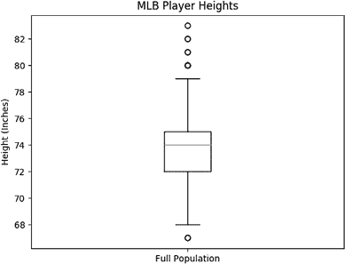
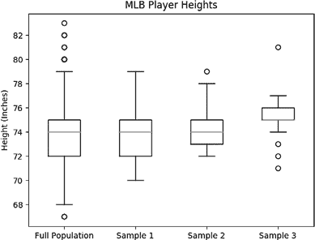
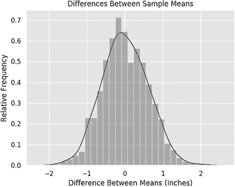
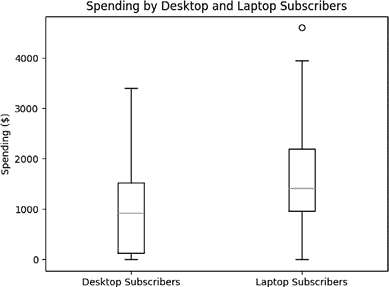

## 第三章：组间比较


在本章中，我们将讨论如何在不同组之间进行智能比较，使用来自商业场景的例子。我们将从小处开始，首先仅查看一个组。我们将了解哪些描述性统计量最简洁地描述它，绘制出能够捕捉其本质的图形，并比较它的各个样本。然后，我们将准备好对来自两个组的样本进行推理。最后，我们将通过查看统计显著性检验来结束：t 检验和曼-惠特尼 U 检验。

## 阅读人口数据

让我们从读取一些数据开始。这些数据记录了 1,034 名职业棒球运动员的身高、体重以及测量时的年龄。你可以直接从[`bradfordtuckfield.com/mlb.csv`](https://bradfordtuckfield.com/mlb.csv)下载这些数据。其原始来源是统计在线计算资源（SOCR）网站([`web.archive.org/web/20220629205951/https://wiki.stat.ucla.edu/socr/index.php/SOCR_Data_MLB_HeightsWeights`](https://web.archive.org/web/20220629205951/https://wiki.stat.ucla.edu/socr/index.php/SOCR_Data_MLB_HeightsWeights))。

```py
import pandas as pd
mlb=pd.read_csv('mlb.csv')
print(mlb.head())
print(mlb.shape)
```

在这个代码片段中，我们导入了 pandas 并使用其`read_csv()`方法来读取我们的数据。这都是简单的数据摄取，就像我们在第一章和第二章中所做的那样。运行这个片段后，你应该能看到以下输出：

```py
 name team       position  height  weight    age
0    Adam_Donachie  BAL        Catcher      74   180.0  22.99
1        Paul_Bako  BAL        Catcher      74   215.0  34.69
2  Ramon_Hernandez  BAL        Catcher      72   210.0  30.78
3     Kevin_Millar  BAL  First_Baseman      72   210.0  35.43
4      Chris_Gomez  BAL  First_Baseman      73   188.0  35.71
(1034, 6)
```

输出的最后一行显示了数据的*形状*，即数据集中的行数和列数。我们可以看到数据有 1,034 行和 6 列。每一行对应一个被测量的人，每一列对应记录的关于该人的一个事实。这 1,034 人被统称为我们的*总体*，在统计学中，总体指的是为回答特定问题而研究的一组相似项。

### 摘要统计

每当我们获得一个新的数据集时，进行探索性分析是非常有用的。我们可以做的一件事是运行`print(mlb.describe())`来一次性查看我们的摘要统计信息：

```py
 height       weight          age
count  1034.000000  1033.000000  1034.000000
mean     73.697292   201.689255    28.736712
std       2.305818    20.991491     4.320310
min      67.000000   150.000000    20.900000
25%      72.000000   187.000000    25.440000
50%      74.000000   200.000000    27.925000
75%      75.000000   215.000000    31.232500
max      83.000000   290.000000    48.520000
```

在任何数据分析工作中，尽早并频繁地绘制数据也是一个好主意。我们将使用以下代码创建一个箱型图：

```py
import matplotlib.pyplot as plt
fig1, ax1 = plt.subplots()
ax1.boxplot([mlb['height']])
ax1.set_ylabel('Height (Inches)')
plt.title('MLB Player Heights')
plt.xticks([1], ['Full Population'])
plt.show()
```

在这里，我们导入了 Matplotlib 来创建图表。我们使用其`boxplot()`命令创建我们人群中所有身高的箱型图。你可以在图 3-1 中看到结果。



图 3-1：展示我们职业棒球（MLB）人群身高分布的箱型图

这个箱线图类似于我们在第一章中看到的箱线图。记住，箱线图展示了数据的范围和分布。在这里，我们可以看到数据中身高的最小值约为 67，最大值约为 83。中位数（位于箱子中间的水平线）约为 74 英寸。我们可以看到，Matplotlib 将一些数据点视为离群值，这就是为什么它们被绘制成超出箱子上下垂直线范围的圆圈。箱线图提供了一种简单的方法来探索我们的群体并更好地理解它。

### 随机样本

在许多常见的情境中，我们有兴趣研究一个群体，但我们无法接触到整个群体，因此我们研究一个小部分或*样本*。例如，医学研究人员可能想开发一种能治愈 50 岁以上所有女性的疾病的药物。研究人员无法联系到全球所有 50 岁以上的女性，因此他们招募了这个整体人群的一个样本，也许是几百人。他们研究这种药物对这个样本的效果。他们希望他们的样本能代表整体人群，这样如果药物对样本有效，也能对整体人群有效。

招募样本是你应该小心进行的，以确保样本尽可能地代表整体人群。例如，如果你在奥林匹克训练设施招募参与者，你的样本将包含比平均水平更健康的人群，因此你可能会开发出只对极其健康的人有效的药物，而对普通人群无效。如果你在波兰社区节庆活动上招募参与者，你可能会开发出只对东欧人有效的药物，而对其他人无效。收集一个类似于整体人群的样本的最佳方法是随机抽样。通过从整个群体中随机选择样本，你期望每种不同类型的人被选择的概率相等。

让我们来看一下我们棒球运动员群体的样本，我们可以在 Python 中这样创建：

```py
sample1=mlb.sample(n=30,random_state=8675309)
sample2=mlb.sample(n=30,random_state=1729)
```

在这里，我们使用了方便的 pandas `sample()`方法。这个方法会随机选择 30 名棒球运动员作为我们的两个样本，`sample1`和`sample2`。设置`random_state`参数并不是必要的，但我们在这里设置了它，因为它确保你运行相同的代码时，得到的结果与你看到的一致。

你可能会想，为什么我们选择了 30 个样本，而不是 20 个、40 个或其他数量。实际上，我们可以通过将`n=30`改为`n=20`、`n=40`或任何我们喜欢的其他数字，轻松地选择任何其他数量的样本。当我们为随机样本选择一个较大的`n`时，我们期望样本能够非常接近整个总体。但有时招募参与者可能会比较困难，因此我们希望选择一个较小的`n`来避免招募的难度。在统计学中，选择*n* = 30 是一个常见的约定；当我们选择的样本大小至少为 30 时，我们可以合理地相信，样本足够大，可以使我们的统计计算给出良好的结果。

我们还可以创建第三个样本，我们将手动定义它如下：

```py
sample3=[71, 72, 73, 74, 74, 76, 75, 75, 75, 76, 75, 77, 76, 75, 77, 76, 75,\ 
76, 76, 75, 75, 81,77, 75, 77, 75, 77, 77, 75, 75]
```

我们知道`sample1`和`sample2`是来自我们棒球选手总体的随机样本，因为它们是通过`sample()`生成的。但`sample3`中的数据来源尚不清楚。稍后，你将学习如何使用统计检验推理`sample3`是否可能是我们棒球选手总体的随机样本，或者它是否更可能与另一个总体相关，如篮球选手或其他群体。继续思考`sample3`，因为推理`sample3`的来源（以及一般来说，判断两个给定样本是否来自同一总体）将是本章的核心目标。

让我们看一下这些样本的图表，看看它们是否彼此相似，并且与整个总体相似：

```py
import numpy as np
fig1, ax1 = plt.subplots()
ax1.boxplot([mlb['height'],sample1['height'],sample2['height'],np.array(sample3)])
ax1.set_ylabel('Height (Inches)')
plt.title('MLB Player Heights')
plt.xticks([1,2,3,4], ['Full Population','Sample 1','Sample 2','Sample 3'])
plt.show()
```

在这里，我们使用之前用过的相同箱线图代码，但这次不是仅绘制一个数据集，而是绘制四个数据集：整个总体的身高分布，以及三个样本的身高分布。我们可以在图 3-2 中看到结果。



图 3-2：我们完整的 MLB 总体（最左边）、两个来自总体的样本（中间）以及一个可能来自或不来自我们总体的神秘样本（右边）的箱线图

我们可以看到，这些箱线图没有完全相同，但它们之间确实有一些相似之处。我们看到一些相似的中位数值和 75 百分位数值，以及一些相似的最大值。前三个箱线图的相似性应该符合你的直觉：当我们从一个总体中抽取足够大的随机样本时，样本应该与总体相似，并且彼此相似。我们还可以检查与每个样本相关的简单汇总统计量，如均值：

```py
print(np.mean(sample1['height']))
print(np.mean(sample2['height']))
print(np.mean(sample3))
```

在这里，我们检查了所有样本的平均身高。`sample1`的平均身高为 73.8，`sample2`的平均身高为 74.4，`sample3`的平均身高为 75.4。这些均值与总体的平均身高 73.7 非常接近。在这个背景下，总体的平均身高有一个特殊的名称；它被称为总体的*期望值*。如果我们从总体中抽取一个随机样本，我们期望该样本的平均身高大致与总体的期望值 73.7 相同。至少有两个样本是来自总体的随机样本，我们可以看到它们的均值确实接近我们的期望值。

当我们查看`sample3`的箱形图时，我们可以看到它似乎不像其他三个箱形图那样相似。我们可以将其解释为它不是来自我们棒球运动员总体的随机样本。另一方面，它看起来并没有足够不同于总体或其他样本，以至于我们可以立刻确定它不是来自我们总体的随机样本。在我们能够确信`sample3`是来自我们总体的随机抽样，还是来自其他总体之前，我们需要更多的信息。

到目前为止，我们使用了模糊和印象性的语言来描述我们的样本：它们*相似*，它们的均值*相对接近*或者*大致相同*于我们的期望。如果我们想要做出具体的、基于证据的决策，我们需要更加精确。在下一部分，我们将探讨统计学家为推理群体间差异所开发的定量方法，包括一些易于使用的测试，帮助我们决定两个群体是否来自相同的总体。

### 样本数据之间的差异

我们看到`sample1`和`sample2`之间大约有 0.6 英寸的差异，而`sample1`和`sample3`之间的差异超过了 1.6 英寸。这里是我们想要回答的一个重要问题：我们是否相信`sample3`是来自与`sample1`和`sample2`相同总体的随机样本？我们需要一种比直觉更可靠的方法来判断，例如，样本均值之间 0.6 英寸的差异是合理或可能的，而样本均值之间 1.6 英寸的差异使得它们来自相同总体的可能性变得不太可信。样本均值之间的差异多大时，才会让我们认为这两个样本不可能来自同一总体？

要回答这个问题，我们需要理解我们期望从总体中随机抽取的样本之间的大小差异。到目前为止，我们只看了来自我们总体的两个随机样本。与其仅仅基于这两个样本进行概括，不如看一大批样本，看看它们之间的差异有多大。这将帮助我们理解哪些变化是合理的，哪些变化是不可接受的。

下面是一些代码，用来获取 2,000 个样本均值及其差异：

```py
alldifferences=[]
for i in range(1000):
    newsample1=mlb.sample(n=30,random_state=i*2)
    newsample2=mlb.sample(n=30,random_state=i*2+1)
    alldifferences.append(newsample1['height'].mean()-newsample2['height'].mean())

print(alldifferences[0:10])
```

在这个代码片段中，我们将 `alldifferences` 变量创建为空列表。然后我们创建一个循环，进行 1,000 次迭代。在每次迭代中，我们创建两个新的样本，并将它们的样本均值之差附加到 `alldifferences` 列表中。最终结果是一个完全填充的 `alldifferences` 列表，其中包含 1,000 个随机选取样本之间的差异。在运行此代码片段后，您应该看到以下输出：

```py
[0.8333333333333286, -0.30000000000001137, -0.10000000000000853,\
-0.1666666666666572, 0.06666666666667709, -0.9666666666666686,\
0.7999999999999972, 0.9333333333333371, -0.5333333333333314,\
-0.20000000000000284]
```

你可以看到我们检查的前两个样本的均值相差约 0.83 英寸。第二对样本的均值相差约 0.3 英寸。第六对样本的均值几乎相差一英寸（约 -0.97 英寸），而第五对样本的均值几乎相同，仅相差约 0.07 英寸。通过查看这 10 个数字，我们可以看到，0.6 并不是我们总体中两个样本之间不合理的差异，因为我们前 10 个差异中有几个大于 0.6。然而，到目前为止，我们看到的差异都没有超过 1 英寸，所以 1.6 英寸开始显得不太合理。

我们可以通过绘制 `alldifferences` 列表来查看我们 1,000 个差异的完整表现：

```py
import seaborn as sns
sns.set()
ax=sns.distplot(alldifferences).set_title("Differences Between Sample Means")
plt.xlabel('Difference Between Means (Inches)')
plt.ylabel('Relative Frequency')
plt.show()
```

这里，我们导入 seaborn 包，因为它可以绘制美观的图表。我们使用它的 `distplot()` 方法来绘制我们找到的差异。你可以在图 3-3 中查看结果。



图 3-3：显示随机样本均值差异分布的直方图，形成一个大致的钟形曲线模式

在这个直方图中，每个柱状条代表一个相对频率；它表示每个观察值相对于其他观察值的可能性。在 x 轴标记为 0 的位置有一个较高的柱状条。这表示我们的`alldifferences`列表中，接近 0 的差异相对较多。在 *x* = 1 的位置出现了一个较低的柱状条。这表示样本均值之间差异接近 1 的情况相对较少。整个图形的形状应该是直观上可以理解的：我们的随机样本之间很少有很大的差异，因为它们来自同一个总体，我们期望它们的均值大致相同。

图 3-3 中柱形图的形状类似于一个钟形曲线。你可以看到，我们在柱形图上绘制了一条线，显示了这个大致的钟形曲线。这个图形所近似的曲线被称为*钟形曲线*。在许多情况下，都可以找到近似的钟形曲线。统计学中有一个强大的理论结果叫做*中心极限定理*，它指出，在某些常见的条件下，样本均值之间的差异会呈现出一种大致为钟形曲线的分布。这一定理成立的技术条件是：随机样本彼此独立且*同分布*（即来自同一群体的随机抽样），且该群体具有有限的期望值和有限的方差。我们在许多领域看到近似的钟形曲线，表明这些技术条件在很多情况下得到了满足。

一旦我们了解了图 3-3 中钟形曲线的形状和大小，我们就可以更准确地推理出一些困难的统计问题。让我们回到 `sample3` 的问题。基于我们目前所知道的，我们是否认为 `sample3` 是我们棒球选手群体中的一个随机样本？我们看到 `sample3` 的均值与 `sample1` 的均值之间的差异大约是 1.6 英寸。当我们查看图 3-3 时，我们可以看到钟形曲线在那个位置非常低，接近 0。这意味着从我们群体中随机抽取的样本，均值差异达到 1.6 英寸的情况是非常罕见的。这使得 `sample3` 是我们棒球选手群体中的随机样本的可能性看起来相对不太可信。我们可以通过检查有多少差异大于或等于 1.6 英寸来了解它的不可信程度：

```py
largedifferences=[diff for diff in alldifferences if abs(diff)>=1.6]
print(len(largedifferences))
```

在这个代码片段中，我们创建了`largedifferences`，这是一个包含所有`alldifferences`中大于或等于 1.6 的元素的列表。然后我们检查`largedifferences`列表的长度。我们发现该列表仅包含八个元素，意味着从我们`mlb`群体中随机抽取的样本，均值差异达到 1.6 或更多的情况大约只有每千次中 8 次，或 0.8% 的时间。这个值，0.8% 或 0.008，是一个计算得出的可能性。我们可以把它看作是我们估算的概率，即从 `mlb` 群体中随机抽取的两个样本的均值差异大于或等于 1.6 英寸的概率。这个概率通常被称为*p 值*，其中*p*是*概率*的缩写。

如果我们假设 `sample3` 是来自我们 `mlb` 人群的随机样本，我们就必须相信这种罕见的差异，发生概率不到 1%，是自然发生的。这个事件发生的低概率可能让我们相信 `sample3` 并不来自与 `sample1` 相同的人群。换句话说，低 *p*-值促使我们拒绝这两个群体来自同一人群的观点。*p*-值越低，我们就越有信心拒绝这两个群体来自同一人群的观点，因为低 *p*-值要求我们相信越来越不可能发生的巧合。相反，考虑一下我们的人群中，样本均值差异达到 0.6 英寸或更多的情况有多常见：

```py
smalldifferences=[diff for diff in alldifferences if abs(diff)>=0.6]
print(len(smalldifferences))
```

在这里，我们创建了 `smalldifferences`，一个包含所有 `alldifferences` 中大于或等于 0.6 英寸的元素的列表。我们可以看到，这样大小的差异大约发生 31.4% 的时间。在这种情况下，我们会说我们的 *p*-值是 0.314。如果 `sample1` 和 `sample2` 来自同一人群，我们就必须相信这种差异的大小，约 31% 的概率会发生在我们的案例中。相信 31% 概率发生的事件并不难，所以我们得出结论，`sample1` 和 `sample2` 之间的差异是合理的；我们愿意接受它们虽然不完全相同，但它们是来自同一人群的随机样本。

我们在这里计算的 *p*-值使我们接受了 `sample1` 和 `sample2` 来自同一人群的观点，并拒绝了 `sample1` 和 `sample3` 来自同一人群的观点。你可以看到，*p*-值的大小在我们比较群体时有多么重要。

## 进行假设检验

我们已经概述了进行统计推理方法所需的所有要素，这种方法被称为 *假设检验*。我们可以用更科学的术语来形式化这种推理方法。我们正在尝试确定 `sample3` 是否是来自与 `sample1` 相同人群的随机样本。从科学的角度讲，我们可以说我们在考虑两种不同的假设：

假设 0 `sample1` 和 `sample3` 是来自同一人群的随机样本。

假设 1 `sample1` 和 `sample3` 不是来自同一人群的随机样本。

在常见的统计学术语中，我们将假设 0 称为 *零假设*，将假设 1 称为 *备择假设*。零假设断言这两个样本是从同一人群（我们的棒球运动员数据集）中随机抽取的，只有一个均值和一个标准差。备择假设则断言这两个样本是从两个完全不同的人群中随机抽取的，每个样本有自己的均值、标准差和所有独特特征。我们选择这两种假设之间的区别方式与我们之前遵循的推理方式相同：

1.  假设零假设（Hypothesis 0）为真。

1.  假设零假设为真，我们需要找到观察到的样本均值与假设的样本均值之间差异的可能性。这种可能性称为*p*-值。

1.  如果*p*-值足够小，我们就拒绝零假设，并因此愿意接受假设 1。

请注意，第 3 步表述得很模糊：它没有具体说明*p*-值需要小到什么程度才能证明拒绝零假设是合理的。这种模糊性是因为没有数学上的定量要求，决定*p*-值需要多小才能拒绝零假设。我们可以根据自己的判断和直觉选择一个合适的小值来证明拒绝零假设是合理的。我们认为可以用来拒绝零假设的*p*-值大小被称为*显著性水平*。

实证研究中最常用的显著性水平是 5%，这意味着如果*p* < 0.05，我们认为拒绝零假设是有依据的。对于`sample1`和`sample3`，我们可以在显著性水平仅为 1%的情况下拒绝零假设，因为我们发现*p* < 0.01。 当我们发现*p*-值小于我们选择的显著性水平时，我们称组间差异是*统计学显著的*。推荐的做法是在进行任何计算之前，先确定我们要使用的显著性水平；这样，我们可以避免选择一个能支持我们希望被确认的假设的显著性水平。

### t 检验

我们不必每次进行假设检验时都重新计算均值、绘制直方图，或者手动计算*p*-值。统计学家们发现了简洁的方程，定义了两组数据来自同一总体的可能性。他们创建了一种相对简单的检验方法，称为*t 检验*，它能快速而轻松地完成假设检验过程，无需使用`for`循环或直方图。我们可以使用 t 检验来检验我们的零假设（Hypothesis 0）和假设 1。我们将按照以下方式检查`sample1`和`sample2`是否来自同一总体：

```py
import scipy.stats
scipy.stats.ttest_ind(sample1['height'],sample2['height'])
```

在这里，我们导入`scipy.stats`模块。这个模块属于 SciPy 包，SciPy 是一个流行的 Python 库，包含了许多统计检验工具，在你深入学习统计学和数据科学时会非常有用。导入此模块后，我们使用其`ttest_ind`命令来检查样本之间的差异。它的输出如下：

```py
Ttest_indResult(statistic=-1.0839563860213952, pvalue=0.2828695892305152)
```

在这里，*p*-值相对较高（约为 0.283），明显高于 0.05 的显著性阈值。（它与我们之前计算的 0.314 *p*-值略有不同，因为之前的* p*-值计算方法是近似方法，而这一方法更为数学精确。）这个较高的*p*-值表明这些样本来自同一人群的可能性较大。这并不令人惊讶，因为我们知道它们来自同一人群（我们自己创建了这些样本）。在这种情况下，我们决定不拒绝原假设，并接受（直到有其他证据让我们改变看法）`sample1`和`sample2`来自同一人群。你也可以运行`scipy.stats.ttest_ind(sample1['height'], sample3)`来比较`sample1`和`sample3`，如果这样做，你会发现一个较低的*p*-值（小于 0.05），这表明我们可以拒绝原假设，即`sample1`和`sample3`来自同一人群。

存在几种类型的 t 检验，除了 t 检验，还有其他假设检验方法。我们目前使用的`ttest_ind`命令带有`_ind`后缀，表示它是用来处理独立样本的。在这里，*独立*意味着我们所期望的：一个样本中的个体与另一个样本中的个体之间没有有意义或一致的关系——这些样本由随机选择的不同人组成。

如果我们有*相关*样本而非独立样本，我们可以使用另一个命令`scipy.stats.ttest_rel`，它执行一种数学上与`ttest_ind`略有不同的 t 检验。当不同样本中的观测值之间有有意义的关系时，`ttest_rel`命令就适用——例如，如果它们是同一学生的两次考试成绩，或是同一患者的两项不同医疗测试结果。

另一种 t 检验类型是*Welch 的 t 检验*，它适用于我们不希望假设样本方差相等的情况。当我们不希望假设样本具有相同方差时，Welch 的 t 检验是设计用来比较样本的。你可以通过在 t 检验命令中添加`equal_var=False`来实现 Welch 的 t 检验。

t 检验是一种*参数检验*，意味着它依赖于我们数据集分布的假设。t 检验依赖于几个技术性假设：首先，被比较的组的样本均值应当遵循正态分布；其次，被比较组的方差应当相同（除非使用 Welch 的 t 检验）；第三，两个组之间应当是独立的。如果这些假设不成立，t 检验就不完全准确，尽管即使假设不成立，结果也通常不会偏差太大。

在某些情况下，我们希望进行假设检验时使用一种不做这些强假设的检验，因为这些假设可能并不成立。如果是这样，我们可以依赖一种称为*非参数统计*的知识体系，它提供了进行假设检验和其他统计推理的工具，这些工具对我们数据分布的假设较少（例如，我们不需要处理那些样本均值呈钟形曲线分布的总体）。一种来自非参数统计的假设检验叫做*Mann-Whitney U 检验*（或*Wilcoxon 秩和检验*），我们可以通过以下 Python 代码轻松实现：

```py
scipy.stats.mannwhitneyu(sample1['height'],sample2['height'])
```

这个检验只需要一行代码，因为 SciPy 包含了 Mann-Whitney U 检验的实现。就像 t 检验一样，我们需要输入的是我们要比较的数据，代码会输出一个*p*-值。如果你想深入了解各种假设检验及其准确使用时机，你应该阅读一些高级的理论统计学教材。现在，我们使用的简单独立样本 t 检验已经相当稳健，应该适用于大多数实际场景。

### 假设检验的细微差别

使用零假设和 t 检验进行假设检验足够常见，以至于被称为*流行*，但它并不像大多数流行事物那样受到喜爱。学生们往往不喜欢它，因为它对大多数人来说不直观，并且需要一些复杂的推理才能理解。教师们有时也不喜欢它，因为他们的学生不喜欢它并且在学习上遇到困难。许多方法学研究者感到恼火，因为在各个层次上，人们普遍误解和误用 t 检验、*p*-值和假设检验。对假设检验的反感甚至导致一些受尊敬的科学期刊禁止发表相关内容，尽管这种情况较为罕见。

大多数对假设检验的负面情绪源于误解。研究人员误解了假设检验的一些细微差别并滥用它，进而导致研究中的错误，这让方法学上的严格要求者感到不满。由于这些误解在专业人士中也很常见，因此值得在这里提到其中一些，并试图解释一些细微差别，帮助你避免这些相同的错误。

需要记住的一个重要点是*p*-值告诉你什么：它告诉你在假设零假设为真的情况下，观察到数据的可能性。人们常常认为或者希望它能告诉他们相反的内容：即在某些观察数据下假设为真之概率。始终记住，*p*-值不应直接解释为假设为真之概率。因此，当我们看到比较`sample1`和`sample3`身高的*p*-值为*p* = 0.008 时，我们不能说：“这些样本来自同一总体的概率只有 0.8%。”也不能说：“零假设为真的概率是 0.8%。”我们只能说：“如果零假设为真，发生了一个 0.8%的可能事件。”这使我们能够决定是否拒绝零假设，但并不能让我们准确判断任何一个假设的真实性有多大可能。

另一个重要的细微差别是接受假设和未能拒绝假设之间的区别。假设检验只有两种可能的结果：要么我们拒绝零假设，要么我们决定不拒绝零假设。未能拒绝并不等于完全接受它，而且仅仅因为一个*p*-值没有低于显著性阈值，并不意味着两个组一定相同。仅仅因为一个 t 检验未能拒绝零假设，并不意味着零假设一定成立。

同样，仅仅因为一个*p*-值似乎证明拒绝零假设是合理的，并不意味着零假设一定是错误的。尤其是在我们拥有有限数据、困难的噪声测量，或有理由怀疑我们的测量时，这一点尤为重要。假设检验并不能让我们在数据不确定的情况下，对假设做出完全确定的判断。相反，它提供了一部分证据，我们必须正确理解这些证据，并与大量其他证据一起加以权衡。

另一个需要记住的重要概念是安娜·卡列尼娜原则。列夫·托尔斯泰在《安娜·卡列尼娜》中写道：“所有幸福的家庭都是相似的；每个不幸的家庭都有不幸的方式。”统计学有一个类似的原则：所有接受零假设的情况都是相似的，但每次拒绝零假设的原因都是不同的。零假设认为两个样本是来自同一总体的随机抽样。如果我们拒绝零假设，可能有一个或多个原因：我们的两个样本可能来自不同的总体，或者两个样本可能来自同一总体但不是随机选择的，或者可能存在抽样偏差，或者可能是盲目运气。仅仅因为我们有信心拒绝零假设，并不意味着我们可以有信心知道零假设的哪部分是错误的。正如经验研究者常说的：“需要进一步研究。”

需要记住的一个细微差别是*统计显著性*和*实际显著性*之间的区别。一个运动员样本的平均身高可能是 73.11，另一个运动员样本的平均身高可能是 73.12，并且根据 t 检验，这两个平均值之间可能存在统计显著性差异。我们可以合理地得出结论，这两个群体不是来自同一总体的随机样本，并且由于它们的平均身高不同，我们应该以不同的方式对待它们。然而，即使这个 0.01 英寸的差异在统计上是显著的，是否具有实际显著性仍不明确。这两个群体的成员应该能够穿相同的衣服、坐在飞机的同样座位上，并且（平均而言）够得到同样高的橱柜。我们没有理由认为一个群体在棒球方面会比另一个群体更优秀，至少在任何实际重要的意义上是如此。在这种情况下，我们可能希望忽略 t 检验的结果，因为尽管存在统计上可检测到的差异，但这个差异并没有任何实际后果。在假设检验过程中，实际显著性始终是一个重要的考虑因素。

现在我们已经讨论了假设检验及其棘手的理论细节，让我们转向一个实际的商业例子。

## 在实际情境中比较不同的群体

到目前为止，本章主要集中在统计理论上。但对于数据科学家来说，理论性的考虑总是在实际情境中进行的。让我们从棒球的例子转到市场营销的例子。假设你正在运营一家制造计算机的公司。为了保持与客户的联系并增加销售额，你的公司维护着邮件列表：感兴趣的客户可以注册自己感兴趣的主题，并定期收到与你公司相关的邮件。目前，你只有两个邮件列表：桌面电脑列表和笔记本电脑列表，分别是为对桌面电脑和笔记本电脑感兴趣的客户设计的。

到目前为止，桌面电脑和笔记本电脑是你公司唯一的产品。但很快，你将推出一套已经开发了几年新产品：顶级的网络服务器。这是你公司自然的产品线，因为你已经制造计算机硬件，并且已有许多需要服务器基础设施的科技客户。但由于这个产品线是新的，几乎没有人知道它。你的营销团队计划通过邮件列表向订阅者发送邮件，告知他们这些新产品，并希望能够顺利启动并获得服务器产品的高销售额。

营销团队成员希望使这次电子邮件营销活动尽可能有效。他们与你讨论活动策略。他们可以设计一封电子邮件并发送给两个电子邮件列表中的每一个人，或者他们可以为桌面用户设计一封电子邮件，为笔记本用户设计另一封电子邮件。你们营销团队的专家们在定向方面知识丰富：例如，他们知道外向型的人最积极反应的电子邮件消息与内向型的人最积极反应的电子邮件消息不同。其他个人特征——包括年龄、收入和文化——也对广告反应有强烈的影响。

我们需要了解桌面用户和笔记本用户是否具有不同的特点。如果这两个群体本质上相同，我们可以节省营销团队成员的一些时间，让他们向所有人发送相同的电子邮件。如果这两个群体在我们能够理解的方面有显著不同，我们可以设计更有针对性的消息，以吸引每个群体并提高销售额。

我们可以通过读取数据开始我们的调查。我们将读取两个虚拟数据集（不是基于真实人物或产品，只是为了说明本章的观点）。你可以从[`bradfordtuckfield.com/desktop.csv`](https://bradfordtuckfield.com/desktop.csv)和[`bradfordtuckfield.com/laptop.csv`](https://bradfordtuckfield.com/laptop.csv)下载这两个数据集，然后按如下方式将它们读入 Python：

```py
desktop=pd.read_csv('desktop.csv')
laptop=pd.read_csv('laptop.csv')
```

你可以运行`print(desktop.head())`和`print(laptop.head())`来查看每个数据集的前五行。你会注意到这两个数据集都有四列：

`userid` 包含一个唯一的数字，用于标识特定用户

`spending` 包含用户在贵公司网站上消费的记录

`age` 包含用户的年龄，可能是在单独的调查中记录的

`visits` 包含用户访问贵公司网站页面的次数

我们的目标是确定`desktop`数据框中的用户和`laptop`数据框中的用户是否存在显著差异。我们可以绘制一些图表，看看是否有明显的差异。

我们可以从绘制每个列表订阅者在我们公司产品上花费的金额开始。我们将使用以下代码创建一个箱型图：

```py
import matplotlib.pyplot as plt
sns.reset_orig()
fig1, ax1 = plt.subplots()
ax1.set_title('Spending by Desktop and Laptop Subscribers')
ax1.boxplot([desktop['spending'].values,laptop['spending'].values])
ax1.set_ylabel('Spending ($)')
plt.xticks([1,2], ['Desktop Subscribers','Laptop Subscribers'])
plt.show()
```

在这里，我们导入 Matplotlib 来创建图表。我们使用它的`boxplot()`命令，结合`desktop`的消费列和`laptop`的消费列的数据。你可以在图 3-4 中看到结果。



图 3-4：显示桌面电子邮件列表订阅者（左）和笔记本电子邮件列表订阅者（右）消费水平的箱型图

我们可以通过查看这些箱线图学到一些东西。两个群体的最小值都是 0。笔记本电脑订阅者的第 25 百分位、第 50 百分位和第 75 百分位较高，并且有一个高于桌面订阅者群体中任何观测值的高异常值。另一方面，分布看起来也没有太大的不同；桌面订阅者似乎与笔记本电脑订阅者并没有完全不同。我们有一些不同的群体，但并不是非常不同。我们应该更仔细地观察，看看一些更精确的定量指标是否能帮助我们判断它们的差异有多大。

除了绘制图表，我们还可以进行简单的计算，得到我们数据的汇总统计。在下面的代码片段中，我们将获取一些描述性统计数据：

```py
print(np.mean(desktop['age']))
print(np.mean(laptop['age']))
print(np.median(desktop['age']))
print(np.median(laptop['age']))
print(np.quantile(laptop['spending'],.25))
print(np.quantile(desktop['spending'],.75))
print(np.std(desktop['age']))
```

在这个代码片段中，我们检查了桌面订阅者和笔记本电脑订阅者的平均年龄。结果显示，桌面订阅者的平均年龄约为 35.8 岁，而笔记本电脑订阅者的平均年龄约为 38.7 岁。我们可以得出结论，这两个群体是不同的，因为它们不是完全相同的。但还不清楚这两个群体是否存在足够的差异，以至于我们应该告诉市场营销团队创建两个不同的电子邮件，而不是只发送一个。为了做出这个判断，我们需要使用假设检验框架。我们可以按如下方式指定我们的零假设和备择假设：

假设 0 两个电子邮件列表是来自同一人群的随机样本。

假设 1 两个电子邮件列表不是来自同一人群的随机样本。

假设 0，我们的零假设，描述了一个这样一个世界：有一个对计算机感兴趣的群体，包括笔记本电脑和桌面电脑。来自这个群体的人偶尔会加入你公司电子邮件列表。但当他们加入一个列表时，他们完全是随机选择加入你们两个列表中的一个。在这个世界里，你的列表有表面上的差异，但它们确实是来自同一人群的两个随机样本，且没有任何本质上的差异，因此不需要你公司给予不同的对待。

假设 1，备择假设，描述了一个零假设不成立的世界。这意味着，订阅者加入不同电子邮件列表的原因，至少部分是因为喜欢桌面电脑和喜欢笔记本电脑的人之间的潜在差异。如果假设 0 成立，那么向两个群体发送相同的营销电子邮件是合理的。如果假设 1 成立，那么向每个群体发送不同的营销电子邮件更为合适。现在，商业决策依赖于统计检验的结果。

让我们进行 t 检验，看看我们的两个订阅者群体是否真的有差异。首先，我们需要指定显著性水平。我们使用在研究中常见的 5%显著性水平。我们可以通过一行代码运行 t 检验：

```py
scipy.stats.ttest_ind(desktop['spending'],laptop['spending'])
```

当你查看我们的 t 检验结果时，你会看到我们的*p*-值大约为 0.04。由于我们使用常见的 5%显著性水平，这个*p*-值足够低，足以让我们得出结论，桌面和笔记本组不是从同一总体中随机抽取的，因此我们可以拒绝原假设。看来，桌面和笔记本的电子邮件订阅者至少在某种可检测的方式上有所不同。

在发现这些差异后，我们可以与公司营销团队进行讨论，共同做出是否为不同组设计不同电子邮件活动的决策。假设团队决定这样做，我们可以为自己感到自豪，因为我们的统计分析为一个我们认为有充分依据的实际决策提供了支持。我们不仅仅是分析数据；我们用数据做出了决策。这在数据科学中很常见：我们用数据分析来做出数据驱动的决策，从而改善商业成果。

那接下来呢？我们在这一章中已经走了这么远，只做了一个决定：是否向两个订阅者列表发送不同的电子邮件。我们需要问的下一个问题是，每组的电子邮件应该有什么不同：它们的内容应该是什么，设计应该如何，如何知道我们是否做对了？在下一章中，我们将讨论 A/B 测试，这是一种强有力的框架，用于回答这些困难的问题。

## 总结

在本章中，我们讨论了总体和样本，以及来自同一总体的样本应该如何相似。我们介绍了假设检验，包括 t 检验，这是一种简单且有用的工具，用于检测两个组是否可能是从同一总体中随机抽取的。我们讨论了一些 t 检验有用的商业场景，包括一个营销场景以及是否向不同电子邮件列表发送不同电子邮件的决策。

下一章将建立在我们在这里介绍的工具基础上。我们不仅仅是比较不同的组，而是将讨论如何运行实验，然后使用组比较工具检查实验处理之间的差异。
