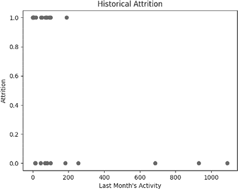
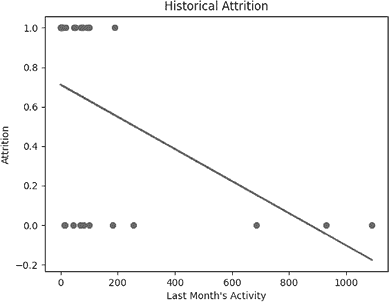
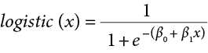
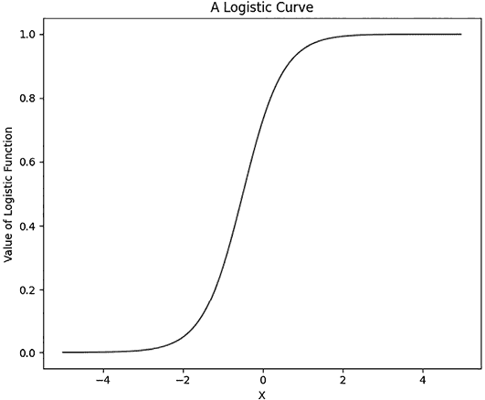
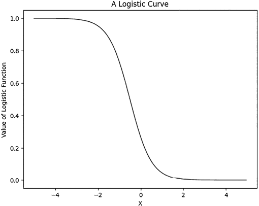
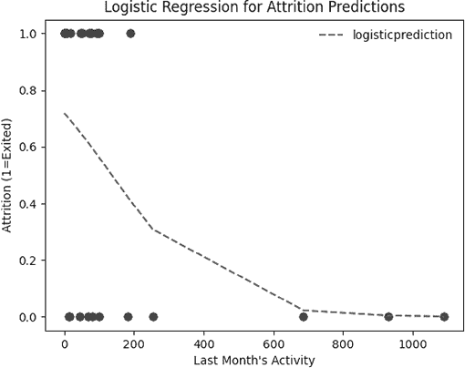

## 第五章：二元分类


许多难以回答的问题可以简单地表述为是/否问题：买这只股票还是不买？接受这份工作还是不接受？雇佣这个申请人还是不雇佣？本章讲述的是*二元分类*，这是回答是/否问题或在真与假、1 与 0 之间做出决策的技术术语。

我们将从介绍一个依赖于二元分类的常见商业场景开始。接着，我们将讨论线性概率模型，这是一种基于线性回归的简单但强大的二元分类方法。我们还会介绍逻辑回归，这是一种更先进的分类方法，能够改进线性概率模型的一些不足之处。最后，我们将讨论二元分类方法的众多应用，包括风险分析和预测。

## 最小化客户流失

假设你经营着一家大型科技公司，拥有大约 10,000 个大客户。每个客户与你签订了长期合同，承诺定期支付费用以使用贵公司的软件。然而，所有客户都可以随时退出合同，如果他们决定不再使用你的软件，就可以停止支付。你希望尽可能拥有更多的客户，因此你尽力做到两件事：一是通过与新客户签订新合同来推动公司发展，二是通过确保现有客户不退出合同来防止客户流失。

本章将重点讨论你的第二个目标：防止客户流失。这是各行业企业都非常关心的一个问题，也是每家公司都在努力解决的问题。特别重要的是，因为获取新客户的成本显然远高于留住现有客户的成本。

为了防止客户流失，你有一支客户经理团队与客户保持联系，确保他们满意，解决任何出现的问题，并确保他们足够满意以便继续无限期续签合同。然而，你的客户管理团队规模较小——只有几个人，他们必须共同努力保持 10,000 个客户的满意。对他们来说，无法与所有 10,000 个客户保持持续联系，难免会有一些客户的问题和担忧是你的客户管理团队无法发现或解决的。

作为公司领导者，你需要决定如何引导客户经理的努力，以最小化流失。他们每花一小时与高流失风险的客户合作，可能是值得的，但如果他们花太多时间在那些没有流失风险的客户身上，那就是浪费时间。客户经理们最有效的时间使用方式是集中精力处理那些最有可能取消合同的客户。所有经理需要的，只有一个高风险客户的名单，这样他们就可以以最高效率利用时间来减少流失。

获取准确的高流失风险客户列表并非易事，因为你不能读懂所有客户的心思，立即知道哪些客户面临取消合同的风险，哪些客户则一切如意。许多公司依赖直觉或猜测来决定哪些客户的流失风险最高。但直觉和猜测很少能得出最准确的结果。通过使用数据科学工具来决定每个客户是高风险还是低风险，我们可以获得更好的准确度，从而节省更多成本。

决定一个客户是高风险还是低风险流失是一个二分类问题；它由一个是或否的问题组成：这个客户面临高流失风险吗？最初作为一个令人头疼的商业问题（如何在有限的资源下增加收入增长）已经被简化为一个更简单的数据分析问题（如何进行流失风险的二分类）。我们将通过读取与过去流失相关的历史数据，分析这些数据以发现其中有用的模式，然后将我们对这些模式的理解应用于更近期的数据，以执行我们的二分类并提出有价值的商业建议。

## 使用线性概率模型来寻找高风险客户

我们可以从几种数据分析方法中选择来进行二分类。但在探索这些方法之前，我们需要先将一些数据读取到 Python 中。我们将使用关于我们虚构公司假设客户的虚拟数据。你可以通过使用以下代码段直接从它的在线地址加载到 Python 会话中：

```py
import pandas as pd
attrition_past=pd.read_csv('https://bradfordtuckfield.com/attrition_past.csv')
```

在这个代码段中，我们导入了 pandas 并读取了数据文件。这次我们直接从存储文件的一个网站读取该文件。该文件是*.csv*格式，你在之前的章节中已经遇到过。你可以按照以下方式打印数据的前五行：

```py
print(attrition_past.head())
```

你应该能看到以下输出：

```py
 corporation  lastmonth_activity  ...  number_of_employees  exited
0        abcd                  78  ...                   12       1
1        asdf                  14  ...                   20       0
2        xyzz                 182  ...                   35       0
3        acme                 101  ...                    2       1
4        qwer                   0  ...                   42       1
```

输出的最后一行告诉我们数据集有五列。假设数据的前四列是在大约六个月前生成的。第一列是每个客户的四字符代码。第二列是`lastmonth_activity`，即该客户公司在生成此数据之前的一个月内访问我们软件的次数（大约在 6 到 7 个月前）。第三列是`lastyear_activity`，即数据生成之前整整一年的相同测量（大约在 6 到 18 个月前）。`lastyear_activity`列在前面的代码段中不可见，我们只能看到第二列和第四列之间的省略号。原因是 pandas 包有默认的显示设置，确保其输出足够小，能轻松适应屏幕。如果你想更改 pandas 打印的最大列数，可以在 Python 中运行以下代码：

```py
pd.set_option('display.max_columns', 6)
```

在这里，我们使用 pandas 选项 `display.max_columns` 将 pandas 显示的最大列数更改为 `6`。这个更改确保了如果我们再次打印 `attrition_past` 数据集时，我们能够看到它的所有五列，当我们向数据集中添加一列时，我们就能看到它的所有六列。如果你希望显示所有数据集的所有列，不论多少列，你可以将 `6` 改为 `None`，这意味着 pandas 将不再对列数设置最大限制。

除了记录活动水平的列，我们还有记录每个公司六个月前员工数量的 `number_of_employees` 列。最后，假设最终列 `exited` 是今天生成的。这个列记录了某个公司是否在从前四列生成至今天的六个月期间退出了合同。这个列以二进制格式记录：1 表示在过去六个月内退出合同的客户，0 表示没有退出的客户。`exited` 列是我们衡量流失的二进制指标，它是我们最感兴趣的列，因为我们将学习如何预测它。

拥有四个六个月前的列和一个新列，可能看起来像是一个错误或不必要的复杂化。然而，我们列之间的时间差异使我们能够找到过去和未来之间的模式。我们将会在数据中找到一些模式，显示出某一时刻的活动水平和员工数量如何能够预测未来的流失水平。最终，我们在这些数据中找到的模式将使我们能够利用今天测量的客户活动来预测他们在接下来六个月内的流失可能性。如果我们能预测客户在未来六个月的流失风险，就可以在这六个月内采取行动，改变他们的想法，并留住他们。说服客户留下将是客户经理的角色——数据科学的贡献将是进行流失预测本身。

### 绘制流失风险

在我们深入寻找这些模式之前，让我们检查一下流失在数据中发生的频率：

```py
print(attrition_past['exited'].mean())
```

我们得到的结果是大约 0.58，意味着数据中大约 58% 的客户在过去六个月内退出了他们的合同。这表明流失是业务的一大问题。

接下来，我们应该绘制数据图表。在任何数据分析场景中，提前并经常绘制图表都是一个好主意。我们对每个变量与二元变量 `exited` 之间的关系感兴趣，所以我们可以从绘制 `lastmonth_activity` 和 `exited` 的关系开始：

```py
from matplotlib import pyplot as plt
plt.scatter(attrition_past['lastmonth_activity'],attrition_past['exited'])
plt.title('Historical Attrition')
plt.xlabel('Last Month\'s Activity')
plt.ylabel('Attrition')
plt.show()
```

我们可以在图 5-1 中看到结果。



图 5-1：假设公司客户的历史流失情况

在 x 轴上，我们看到的是上个月的活动，尽管由于数据是六个月前记录的，因此实际上显示的是六到七个月前的活动。y 轴展示了我们`exited`变量的流失情况，这就是为什么最近六个月所有值都为 0（未流失）或 1（已流失）。从直观上看，这个图可以给我们一个关于过去活动与未来流失之间关系的基本印象。特别是，活动最多的客户（> 600）在记录了高活动后的六个月内没有退出他们的合同。高活动似乎是客户忠诚度的预测因子，如果是这样，低活动则会是客户流失的预测因子。

### 使用线性回归确认关系

我们希望通过进行更严格的定量测试来确认我们最初的直观印象。特别是，我们可以使用线性回归。记住，在第二章中，我们有一组点，并使用线性回归找到了一条最佳拟合的线。在这里，由于*y*变量的范围有限，我们的点看起来不太像云状：我们的“云”是位于*y* = 0 和*y* = 1 的两条散点线。然而，线性回归是线性代数中的一种数学方法，它并不关心我们的图形看起来是否像云状。我们可以使用与之前几乎相同的代码在我们的流失数据上执行线性回归：

```py
x = attrition_past['lastmonth_activity'].values.reshape(-1,1)
y = attrition_past['exited'].values.reshape(-1,1)

from sklearn.linear_model import LinearRegression
regressor = LinearRegression()
regressor.fit(x, y)
```

在这段代码中，我们创建了一个名为`regressor`的变量，然后将其拟合到我们的数据上。在拟合完回归模型后，我们可以像在第二章中一样，将回归线绘制在我们的“数据云”上：

```py
from matplotlib import pyplot as plt
plt.scatter(attrition_past['lastmonth_activity'],attrition_past['exited'])
prediction = [regressor.coef_[0]*x+regressor.intercept_[0] for x in \
list(attrition_past['lastmonth_activity'])]
plt.plot(attrition_past['lastmonth_activity'],  prediction, color='red')
plt.title('Historical Attrition')
plt.xlabel('Last Month\'s Activity')
plt.ylabel('Attrition')
plt.show()
```

图 5-2 展示了这段代码的结果。



图 5-2：预测 0–1 流失结果的线性回归

你可以将这个图与第二章中的图 2-2 进行比较。就像我们在图 2-2 中所做的那样，我们有一组数据点，并且我们添加了一条回归线，我们知道这条回归线是这些数据点的最佳拟合线。记住，我们将回归线的值解释为期望值。在图 2-2 中，我们看到回归线大约通过了点*x* = 109，*y* = 17,000，我们将其解释为在第 109 个月，我们预计汽车销量大约为 17,000 辆。

在图 5-2 中，解释我们的期望值的方法可能看起来不是立即显而易见的。例如，在*x* = 400 时，回归线的*y*值约为 0.4。这意味着我们期望`exited`的值为 0.4，但这是一个不太合适的说法，因为`exited`只能是 0 或 1（要么退出，要么不退出，没有中间状态）。那么，在这个活动水平下，期望有 0.4 个“退出”，或者 0.4 个流失单位，这又意味着什么呢？

我们如何解释*0.4 单位流失*的预期值呢？我们将其解释为概率：我们得出结论，最近一个月活动水平约为 400 的客户有约 40% 的概率会退出合同。由于我们的流失数据是活动水平记录后六个月的流失情况，我们将回归线的值解释为活动水平记录后的接下来的六个月内，流失概率为 40%。我们也可以这样表述我们估计的 40% 流失概率：我们估计活动水平为 400 的客户的流失风险为 40%。

图 5-2 中的回归是一个标准的线性回归，正如我们在第二章中创建的线性回归模型并在图 2-2 中绘制的那样。然而，当我们对二进制数据（仅由 0 和 1 两个值组成的数据）进行标准线性回归时，我们有一个特殊的名称：我们称之为*线性概率模型（LPM）*。这些模型简单且易于实现，但当我们想要预测一些难以预测的事情时，它们非常有用。

在进行回归并解释其值后，最后一个重要步骤是根据我们学到的所有知识做出商业决策。图 5-2 展示了活动与退出概率之间的简单关系：较低的活动与较高的退出概率相关联，而较高的活动与较低的退出概率相关联。我们所称的*退出概率*，也可以称作*流失风险*，因此我们也可以说上个月的活动与接下来六个月的流失风险呈负相关。从商业角度来看，这个负相关是有意义的：如果一个客户非常活跃，我们预计他们不太可能退出合同，而如果客户非常不活跃，我们预计他们更可能退出。

知道活动与流失风险之间普遍存在负相关性是有帮助的。但如果我们计算出每个客户的确切预测流失风险，我们的推理和决策会更加具体。这将使我们能够根据每个客户的预测风险做出个性化决策。以下代码计算每个客户的流失风险（我们回归模型的预测值），并将其存储在一个名为`predicted`的新列中：

```py
attrition_past['predicted']=regressor.predict(x)
```

如果你运行`print(attrition_past.head())`，你可以看到我们的流失数据集现在有六列。它的新第六列是根据我们的回归模型预测的每个客户的流失概率。当然，这对我们并没有太大用处；我们不需要预测的流失概率，因为这是过去的流失记录，我们已经确定每个客户是否退出。

总的来说，员工流失预测有两个步骤。首先，我们通过使用过去的数据学习特征与目标变量之间的关系。其次，我们利用从过去数据中学到的关系来做未来的预测。到目前为止，我们只做了第一步：我们拟合了一个回归模型，捕捉了客户属性与流失风险之间的关系。接下来，我们需要做出未来的预测。

### 预测未来

让我们下载并打开更多的虚拟数据。这次，假设所有数据都是今天生成的，因此它的`lastmonthactivity`列指的是上个月，而`lastyearactivity`列指的是截至今天的 12 个月期间。我们可以按照以下方式读取我们的数据：

```py
attrition_future=pd.read_csv('http://bradfordtuckfield.com/attrition2.csv')
```

我们之前使用的`attrition_past`数据集使用了旧数据（超过六个月的旧数据）来预测最近发生的员工流失（过去六个月内的任何时间）。相比之下，使用这个数据集时，我们将使用新的数据（今天生成的）来预测我们预期将在不久的将来（接下来的六个月内）发生的员工流失。这就是我们将其称为`attrition_future`的原因。如果你运行`print(attrition_future.head())`，你可以看到数据的前五行：

```py
 corporation  lastmonth_activity  lastyear_activity  number_of_employees
0        hhtn                 166               1393                   91
1        slfm                 824              16920                  288
2        pryr                  68                549                   12
3        ahva                 121               1491                   16
4        dmai                   4                 94                    2
```

你可以看到这个数据集的前四列与`attrition_past`的前四列具有相同的名称和含义。然而，这个数据集没有第五列`exited`。数据集缺少这列是因为`exited`列应该记录客户在其他列生成后的六个月期间是否退出了他们的合同。但是那个六个月的时间段还没有发生；它是从今天开始的六个月。我们需要利用从流失数据集中学到的知识来预测这个新客户集的流失概率。当我们这样做时，我们就是在做未来的预测，而不是过去的预测。

`attrition_future`第一列中的所有四字符公司代码都是新的——它们在原始的流失数据集中没有出现。我们不能直接利用原始流失数据集中的任何数据来学习这个新的数据集。但是，我们可以利用我们拟合的回归模型来为这个新数据集做流失概率的预测。换句话说，我们不会直接用`attrition_past`中的实际数据来学习`attrition_future`，但我们会利用在`attrition_past`中发现的模式，这些模式我们通过线性回归编码出来，用来预测`attrition_future`。

我们可以以与预测`attrition_past`数据集流失概率相同的方式预测`attrition_future`数据集的流失概率，如下所示：

```py
x = attrition_future['lastmonth_activity'].values.reshape(-1,1)
attrition_future['predicted']=regressor.predict(x)
```

这段代码为`attrition_future`数据集添加了一个名为`predicted`的新列。我们可以运行`print(attrition_future.head())`来查看更改后的前五行：

```py
 corporation  lastmonth_activity  ...  number_of_employees  predicted
0        hhtn                 166  ...                   91   0.576641
1        slfm                 824  ...                  288   0.040352
2        pryr                  68  ...                   12   0.656514
3        ahva                 121  ...                   16   0.613317
4        dmai                   4  ...                    2   0.708676
```

你可以看到，高活动客户的低预测流失概率模式与我们在`attrition_past`数据集中观察到的模式相匹配。这是因为我们的预测概率是使用与`attrition_past`数据集训练的相同回归模型生成的。

### 制定业务建议

在计算这些预测概率后，我们希望将它们转化为针对客户管理团队的业务建议。最简单的方式是为团队成员提供一个高风险客户名单，帮助他们集中精力。我们可以指定一个客户数量 *n*，以此为依据选择我们认为他们有时间和精力关注的客户，并创建前 *n* 个高风险客户的名单。对于 *n* = 5，我们可以按如下方式操作：

```py
print(attrition_future.nlargest(5,'predicted'))
```

当我们运行这行代码时，得到如下输出：

```py
 corporation  lastmonth_activity  ...  number_of_employees  predicted
8         whsh                   0  ...                   52   0.711936
12        mike                   0  ...                   49   0.711936
24        pian                   0  ...                   19   0.711936
21        bass                   2  ...                 1400   0.710306
4         dmai                   4  ...                    2   0.708676

[5 rows x 5 columns]
```

你可以看到，我们的前五大高风险客户的预测概率超过了 0.7（70％），这是相当高的流失概率。

现在，假设你的客户经理们不确定他们可以关注多少客户。与其要求提供前* n *个客户，他们可能只想要一个从最高到最低流失概率排序的客户名单。客户经理可以从名单的开头开始，并尽可能深入地处理下去。你可以轻松地打印出这个名单，方法如下：

```py
print(list(attrition_future.sort_values(by='predicted',ascending=False).loc[:,'corporation']))
```

输出是一个按流失概率从高到低排名的`attrition_future`数据集中的所有公司名单：

```py
['whsh', 'pian', 'mike', 'bass', 'pevc', 'dmai', 'ynus', 'kdic', 'hlpd',\
 'angl', 'erin', 'oscr', 'grce', 'zamk', 'hlly', 'xkcd', 'dwgt', 'pryr',\
 'skct', 'frgv', 'ejdc', 'ahva', 'wlcj', 'hhtn', 'slfm', 'cred']
```

该名单中的前三家公司——`whsh`、`pian` 和 `mike`——预计具有最高的流失风险（即退出合同的概率最大）。在这种情况下，数据表明这三家公司存在三方平局的最高风险，因为这三家公司都具有相同的高风险预测，而其他公司则具有较低的流失风险预测。

最后，你可能决定只关注那些预测概率高于某个阈值 *x* 的客户。我们可以按如下方式进行操作，*x* = 0.7：

```py
print(list(attrition_future.loc[attrition_future['predicted']>0.7,'corporation']))
```

你将看到所有公司完整的名单，所有这些公司预计在未来六个月内流失风险超过 70％。这可能是一个有用的优先级名单，供你的客户经理使用。

### 衡量预测准确性

在前一部分，我们已经完成了所有必要的步骤，将高风险公司名单发送给客户经理。在报告了我们的流失风险预测后，我们可能会觉得任务已经完成，可以继续进行下一个任务。但实际上，我们还没有完成。一旦我们将预测结果交给客户经理，他们很可能会立刻问我们，预测结果的准确性有多高。他们希望了解在采取行动之前，他们可以多大程度上信任我们的预测。

在第二章中，我们讨论了衡量线性回归准确性的两种常见方法：均方根误差（RMSE）和平均绝对误差（MAE）。我们的 LPM 本质上是一个线性回归，因此可以再次使用这些指标。然而，对于分类问题，常见的惯例是使用一组不同的指标，这些指标以更易于解释的方式表达分类准确性。我们首先需要做的是分别创建预测值和实际值的列表：

```py
themedian=attrition_past['predicted'].median()
prediction=list(1*(attrition_past['predicted']>themedian))
actual=list(attrition_past['exited'])
```

在这个代码片段中，我们计算了`predicted`列的中位数值。然后我们创建了`prediction`，当 LPM 预测低于中位数概率时，`prediction`为 0，当 LPM 预测高于中位数概率时，`prediction`为 1。我们这样做是因为，在衡量分类任务的准确性时，我们将使用像`predicted` = 1，`actual` = 1 和 `predicted` = 0，`actual` = 0 这样的精确匹配的指标。典型的分类准确性指标不会对预测 0.99 概率而实际值为 1 的情况给予“部分积分”，因此我们将概率转换为 1 和 0，这样我们就能在可能的情况下获得“满分”。我们还将实际值列表（来自`exited`列）转换为 Python 列表。

现在我们的数据格式正确，我们可以创建一个*混淆矩阵*，这是衡量分类模型准确性的标准方法：

```py
from sklearn.metrics import confusion_matrix
print(confusion_matrix(prediction,actual))
```

输出的混淆矩阵显示了我们在对数据集进行预测时，得到的真正正例、真正负例、假阳性和假阴性的数量。我们的混淆矩阵如下所示：

```py
>>> **print(confusion_matrix(prediction,actual))**
[[7 6]
[4 9]]
```

每个混淆矩阵都有以下结构：

```py
[[`true positives`       `false positives`]
 [`false negatives`     `true negatives`]]
```

因此，当我们查看我们的混淆矩阵时，我们发现我们的模型做出了七个真正的正例分类：对于七家公司，我们的模型预测了高于中位数的退出概率（高流失风险），而这七家公司确实退出了。我们的假阳性是六个案例，其中我们预测了高于中位数的退出概率，但公司没有退出。我们的假阴性是四个案例，其中我们预测了低于中位数的退出概率，但公司却退出了。最后，我们的真正负例是九个案例，其中我们预测了低于中位数的退出概率，而这些客户并未退出。

我们总是对真正的正例和真正的负例感到满意，并且我们总是希望这两者（混淆矩阵的主对角线上的值）尽可能高。我们从不对假阳性或假阴性感到满意，并且我们总是希望这两者（主对角线外的值）尽可能低。

混淆矩阵包含了我们所做分类及其正确性的所有可能信息。然而，数据科学家永远不会满足于寻找新的方法来切分、分析和重新表示数据。我们可以从我们的小混淆矩阵中计算出大量的派生指标。

我们可以导出的两个最常见的指标是精确度和召回率。*精确度*被定义为*真正例* / (*真正例* + *假正例*)。*召回率*也叫*敏感性*，定义为*真正例* / (*真正例* + *假负例*)。精确度回答的问题是：我们认为是正例的所有情况中，实际上有多少次是真正的正例？（在我们的案例中，*正例*指的是流失——在我们认为客户有很高流失风险的所有情况中，实际上有多少次他们真的流失了？）召回率回答的是稍微不同的问题：在所有实际的正例中，我们认为有多少是正例？（换句话说，在所有实际流失的客户中，我们预测有多少客户是高流失风险？）如果假正例很多，精确度会低。如果假负例很多，召回率会低。理想情况下，两者应该尽可能高。

我们可以按如下方式计算精确度和召回率：

```py
conf_mat = confusion_matrix(prediction,actual)
precision = conf_mat[0][0]/(conf_mat[0][0]+conf_mat[0][1])
recall = conf_mat[0][0]/(conf_mat[0][0]+conf_mat[1][0])
```

你会看到我们的精确度大约为 0.54，召回率大约为 0.64。这些数值并不是非常令人鼓舞。精确度和召回率的值始终介于 0 和 1 之间，它们应该尽可能接近 1。我们的结果高于 0，这是好消息，但仍有很大的改进空间。让我们通过在接下来的部分中进行一些改进，尽力提高精确度和召回率。

### 使用多变量 LPMs

到目前为止，我们所有的结果都很简单：活动水平最低的客户也是预测流失概率最高的客户。这些模型如此简单，可能几乎看起来毫无价值。你可能会认为，低活动与流失风险之间的关系既直观又在图 5-2 中有清晰的视觉表现，因此拟合回归模型来确认这一点显得多余。这个观点是合理的，尽管即使在那些看似直观的情况下，寻求回归模型的严格验证仍然是明智的做法。

当我们没有明确的直觉关系，且没有能够立即显示这些关系的简单图表时，回归分析开始变得更有用。例如，我们可以使用三个预测变量来预测流失风险：上个月的活动、去年的活动以及客户的员工数量。如果我们想要同时绘制这三个变量与流失之间的关系，我们需要创建一个四维图表，这将很难读取和理解。如果我们不想创建四维图表，可以为每个单独的变量与流失之间的关系创建单独的图表。但每个图表只能显示一个变量与流失的关系，无法捕捉到整个数据集所传达的完整故事。

我们可以通过进行多变量回归分析，而不是通过绘制图表和直觉来发现流失风险，使用我们感兴趣的预测变量：

```py
x3 = attrition_past.loc[:,['lastmonth_activity', 'lastyear_activity',\
 'number_of_employees']].values.reshape(-1,3)
y = attrition_past['exited'].values.reshape(-1,1)
regressor_multi = LinearRegression()
regressor_multi.fit(x3, y)
```

这是一种多元线性回归，就像我们在第二章介绍的多元线性回归一样。由于我们运行它来预测 0–1 数据，它是一个*多元线性概率模型*。正如我们之前为其他回归模型所做的那样，我们可以使用这个新的多元回归器来预测`attrition_future`数据集的概率：

```py
attrition_future['predicted_multi']=regressor_multi.predict(x3)
```

当我们运行`print(attrition_future.nlargest(5,'predicted_multi'))`时，可以看到基于这个新多元回归器预测的五家公司流失风险最高。输出如下：

```py
 corporation  lastmonth_activity  lastyear_activity  number_of_employees  \
11        ejdc                  95               1005                   61
12        mike                   0                  0                   49
13        pevc                   4                  6                 1686
4         dmai                   4                 94                    2
22        ynus                   9                 90                   12

    predicted  predicted_multi
11   0.634508         0.870000
12   0.711936         0.815677
13   0.708676         0.788110
4    0.708676         0.755625
22   0.704600         0.715362

[5 rows x 5 columns]
```

由于我们使用了三个变量来预测流失概率，而不是一个，因此很难直接看出哪些公司将拥有最高和最低的预测流失风险。在这种更复杂的情况下，回归模型的预测能力将非常有用。

让我们看一下按流失风险从高到低排序的所有公司列表，这个排序基于最新的回归结果：

```py
print(list(attrition_future.sort_values(by='predicted_multi',\
ascending=False).loc[:,'corporation']))
```

你将看到以下公司列表：

```py
['ejdc', 'mike', 'pevc', 'dmai', 'ynus', 'wlcj', 'angl', 'pian', 'slfm',\
 'hlpd', 'frgv', 'hlly', 'oscr', 'cred', 'dwgt', 'hhtn', 'whsh', 'grce',\
 'pryr', 'xkcd', 'bass', 'ahva', 'erin', 'zamk', 'skct', 'kdic']
```

这些公司是我们之前看到的公司，但是它们的顺序不同，因为它们的流失风险是使用`regressor_multi`而不是`regressor`来预测的。你可以看到，在某些情况下，顺序相似。例如，`dmai`公司在`regressor`中排名第六，而在`regressor_multi`中排名第四。还有一些情况下，顺序变化很大。例如，`whsh`公司在`regressor`中排名第一（与另外两家公司并列），但在`regressor_multi`的预测中排名第十七。顺序的变化是因为不同的回归模型考虑了不同的信息，并找到了不同的模式。

### 创建新的度量指标

在运行使用数据集中所有数值型预测变量的回归后，你可能会认为我们已经完成了所有可能的回归。但我们还能做更多的事情，因为我们并不严格局限于基于我们流失数据集中原始形式的列来创建 LPM（线性概率模型）。我们还可以创建一个*派生特征*，或称为工程特征——即通过转换和组合现有变量而创建的特征或度量指标。以下是一个派生特征的示例：

```py
attrition_future['activity_per_employee']=attrition_future.loc[:,\
'lastmonth_activity']/attrition_future.loc[:,'number_of_employees']
```

在这里，我们创建了一个新的度量指标，叫做`activity_per_employee`。它简单地是整个公司上个月的活动总数除以公司员工的数量。这个新的派生度量指标可能比单独使用原始活动水平或原始员工数量更能有效预测员工流失风险。

例如，两家公司可能在 10,000 活跃度下相同。但是，如果其中一家公司有 10,000 名员工，另一家公司有 10 名员工，我们可能会对它们的员工流失风险有非常不同的预期。较小公司的平均员工每月使用我们的工具 1,000 次，而较大公司的平均员工每月只使用一次。尽管两家公司根据我们的原始测量具有相同的活跃度，但较小公司似乎具有较低的流失可能性，因为我们的工具对其员工的工作似乎更加重要。我们可以在回归分析中使用这个新的 `activity_per_employee` 指标，正如我们之前做过的所有回归分析一样：

```py
attrition_past['activity_per_employee']=attrition_past.loc[:,\
'lastmonth_activity']/attrition_past.loc[:,'number_of_employees']
x = attrition_past.loc[:,['activity_per_employee','lastmonth_activity',\
 'lastyear_activity', 'number_of_employees']].values.reshape(-1,4)
y = attrition_past['exited'].values.reshape(-1,1)

regressor_derived= LinearRegression()
regressor_derived.fit(x, y)
attrition_past['predicted3']=regressor_derived.predict(x)

x = attrition_future.loc[:,['activity_per_employee','lastmonth_activity',\
 'lastyear_activity', 'number_of_employees']].values.reshape(-1,4)
attrition_future['predicted3']=regressor_derived.predict(x)
```

这个代码片段包含了很多代码，但它所做的每一件事你之前都做过。首先，我们定义了 `activity_per_employee` 指标，这是我们新推出的衍生特征。然后，我们定义了 `x` 和 `y` 变量。`x` 变量将是我们的特征：我们用来预测流失的四个变量。`y` 变量将是我们的目标：我们尝试预测的那个变量。我们创建并拟合了一个线性回归模型，用 `x` 来预测 `y`，然后我们创建了 `predicted3`，这是一个新列，包含这个新回归模型做出的流失风险预测。我们为过去的数据和现在的数据都创建了一个 `predicted3` 列。

正如我们之前所做的，我们可以查看这个模型做出的预测：

```py
print(list(attrition_future.sort_values(by='predicted3',ascending=False).loc[:,'corporation']))
```

再次，你会发现顺序与我们之前尝试的回归模型给出的顺序不同：

```py
['pevc', 'bass', 'frgv', 'hlpd', 'angl', 'oscr', 'zamk', 'whsh', 'mike',\
 'hhtn', 'ejdc', 'grce', 'pian', 'ynus', 'dmai', 'kdic', 'erin', 'slfm',\
 'dwgt', 'pryr', 'hlly', 'xkcd', 'skct', 'ahva', 'wlcj', 'cred']
```

就像我们之前所做的那样，我们可以检查我们最新模型的混淆矩阵。首先，我们将预测值和实际值按正确的 0–1 格式放置：

```py
themedian=attrition_past['predicted3'].median()
prediction=list(1*(attrition_past['predicted3']>themedian))
actual=list(attrition_past['exited'])
```

现在我们可以计算我们最新的混淆矩阵：

```py
>>> **print(confusion_matrix(prediction,actual))**
[[9 4]
[2 11]]
```

这个混淆矩阵应该比我们之前的混淆矩阵看起来更好。如果你需要更多证据来证明我们最新的模型更好，看看这个模型的精度和召回率值：

```py
conf_mat = confusion_matrix(prediction,actual)
precision = conf_mat[0][0]/(conf_mat[0][0]+conf_mat[0][1])
recall = conf_mat[0][0]/(conf_mat[0][0]+conf_mat[1][0])
```

你会看到我们的精度大约是 0.69，召回率大约是 0.82——虽然还不是完美的，但比我们之前的较低值有了很大的改进。

### 考虑 LPM 的缺点

LPM（线性概率模型）有一些优点：它们的值易于解释，使用几百年的方法和许多有用的 Python 模块可以轻松估计它们，而且它们的结构简单，就像一条直线一样。然而，LPM 也有一些缺点。一个缺点是它们并不能很好地拟合数据集的点：它们通过数据点的中间，并且仅靠近少数几个点。

如果你看看图 5-2 的右侧，你会发现 LPM 的最大弱点。在那里，你可以看到回归线跌到了 *y* = 0 以下。如果我们尝试解释回归线在该图部分的值，我们就会得出一个荒谬的结论：我们预测，拥有大约 1200 次登录的公司流失概率大约为-20%。没有合理的方式来解释负概率；这是我们模型输出的无意义结果。不幸的是，任何非水平的 LPM 回归线都会不可避免地给出低于 0%或高于 100%的预测。这种无意义预测的不可避免性是 LPM 的主要弱点，也是你应该学习其他二分类方法的原因。

## 使用逻辑回归预测二元结果

我们需要一种适用于二分类的方法，这种方法不受 LPM（线性概率模型）弱点的影响。如果你想一想图 5-2，你会意识到我们使用的任何方法都不能依赖于将直线拟合到数据点，因为除非是完美水平的直线，否则任何直线都不可避免地会预测出超过 100%或低于 0%的结果。任何直线也都会远离它试图拟合的许多数据点。如果我们要拟合一条直线来进行二分类，它必须是一条不会低于 0 或超过 1 的曲线，并且能够接近许多数据点（这些点的 *y* 值都为 0 或 1）。

一条符合这些标准的重要曲线被称为*逻辑曲线*。从数学上讲，逻辑曲线可以通过以下函数来描述：



逻辑函数用于建模人口、流行病、化学反应和语言变化等问题。如果你仔细观察这个函数的分母，你会看到β[0] + β[1]· *x*。如果这让你想起了我们在第二章做线性回归时使用的表达式，那是有原因的——它与标准回归公式中的表达式完全相同（包含截距、斜率和 *x* 变量）。

很快，我们将使用这个逻辑函数来讲解一种新的回归类型。我们将使用与之前相同的许多元素，因此我们所做的大部分内容应该会让你感到熟悉。我们将使用逻辑函数来建模流失风险，而我们使用它的方式可以应用于任何需要建模“是/否”或“0/1”答案概率的情况。

### 绘制逻辑曲线

我们可以用 Python 绘制一个简单的逻辑曲线，如下所示：

```py
from matplotlib import pyplot as plt
import numpy as np
import math
x = np.arange(-5, 5, 0.05)
y = (1/(1+np.exp(-1-2*x)))
plt.plot(x,y)
plt.xlabel("X")
plt.ylabel("Value of Logistic Function")
plt.title('A Logistic Curve')
plt.show()
```

我们可以在图 5-3 中看到这段代码的输出结果。



图 5-3：逻辑曲线示例

逻辑曲线具有类似 S 形的形状，因此它在大多数范围内保持接近 *y* = 0 和 *y* = 1。同时，它永远不会超过 1，也永远不会低于 0，因此解决了 LPM 的弱点。

如果我们将逻辑方程中的系数从负数改为正数，我们就会反转逻辑曲线的方向，使其成为倒 S 形，而不是标准的 S 形：

```py
from matplotlib import pyplot as plt
import numpy as np
import math
x = np.arange(-5, 5, 0.05)
y = (1/(1+np.exp(**1+2***x)))
plt.plot(x,y)
plt.xlabel("X")
plt.ylabel("Value of Logistic Function")
plt.title('A Logistic Curve')
plt.show()
```

这个代码片段与之前的代码片段相同，唯一不同的是有两个数字从负数改为正数（以**加粗**显示）。我们可以在图 5-4 中看到最终的图表。



图 5-4：另一个逻辑曲线示例，显示倒 S 形曲线

现在让我们使用逻辑曲线来处理我们的数据。

### 将逻辑函数拟合到我们的数据

我们可以像将直线拟合到二元数据一样，将逻辑曲线拟合到二元数据，这与我们创建 LPM 时拟合直线的方法相同。将逻辑曲线拟合到二元数据也叫做执行*逻辑回归*，它是二元分类中常见的标准替代方法，通常用于替代线性回归。我们可以选择几个有用的 Python 模块来执行逻辑回归：

```py
from sklearn.linear_model import LogisticRegression
model = LogisticRegression(solver='liblinear', random_state=0)
x = attrition_past['lastmonth_activity'].values.reshape(-1,1)
y = attrition_past['exited']
model.fit(x, y)
```

在我们拟合模型后，可以如下获取每个元素的预测概率：

```py
attrition_past['logisticprediction']=model.predict_proba(x)[:,1]
```

然后我们可以绘制结果：

```py
fig = plt.scatter(attrition_past['lastmonth_activity'],attrition_past['exited'], color='blue')
attrition_past.sort_values('lastmonth_activity').plot('lastmonth_activity',\
'logisticprediction',ls='--', ax=fig.axes,color='red')
plt.title('Logistic Regression for Attrition Predictions')
plt.xlabel('Last Month\'s Activity')
plt.ylabel('Attrition (1=Exited)')
plt.show()
```

你可以从图 5-5 中的输出图中看到，我们得到了正是我们想要的结果：一个回归模型，它从不预测超过 100% 或低于 0% 的概率，并且非常接近我们那奇怪“云状”中的某些点。通过这种新方法，我们解决了 LPM 的弱点。



图 5-5：一个预测流失风险的逻辑回归

你可能会反对，我们介绍逻辑回归时提到它产生像图 5-3 和图 5-4 中的那种 S 形曲线，但图 5-5 中并没有 S 形曲线。但是，图 5-5 只显示了完整 S 曲线的一部分；它就像图 5-5 是放大了图 5-4 的右下角，所以我们只看到了 S 形曲线的右侧部分。如果我们将图形缩小并考虑假设的负活动水平，我们会看到一个更完整的倒 S 形曲线，包括接近 1 的预测流失概率。由于负活动水平是不可能的，我们只看到了逻辑方程指定的完整 S 曲线的一部分。

就像我们在其他回归中做的一样，我们可以查看我们的逻辑回归所做的预测。特别是，我们可以预测 `attrition2` 数据集中每个公司的流失概率，并按从最高到最低的流失风险顺序打印出来：

```py
x = attrition_future['lastmonth_activity'].values.reshape(-1,1)
attrition_future['logisticprediction']=model.predict_proba(x)[:,1]
print(list(attrition_future.sort_values(by='logisticprediction',\
ascending=False).loc[:,'corporation']))
```

我们可以看到输出由 `attrition2` 中的每个公司组成，按预测的流失概率从高到低排序，这些预测基于我们的逻辑回归结果：

```py
['whsh', 'pian', 'mike', 'bass', 'pevc', 'dmai', 'ynus', 'kdic', 'hlpd',\
'angl', 'erin', 'oscr', 'grce', 'zamk', 'hlly', 'xkcd', 'dwgt', 'pryr',\
'skct', 'frgv', 'ejdc', 'ahva', 'wlcj', 'hhtn', 'slfm', 'cred']
```

你可以查看这些结果，并将其与我们其他回归模型的预测进行比较。考虑到不同的信息，并使用不同的函数来建模数据，每次执行回归时可能会得到不同的结果。在这种情况下，由于我们的逻辑回归使用了与第一个 LPM 相同的预测变量（上个月的活动），因此它会按照相同的顺序将公司按风险从高到低排序。

## 二分类的应用

逻辑回归和 LPM 常用于预测二元结果。我们不仅可以用它们来预测流失，还可以用它们来预测股票是否会上涨、申请人是否会成功获得工作、项目是否会盈利、团队是否会赢得比赛，或者任何其他可以用真/假、0/1 框架表达的二分类问题。

本章中你学到的 LPM 和逻辑回归是统计工具，可以告诉我们流失的概率。但知道流失的概率并不能完全解决流失所代表的业务问题。业务领导者需要传达这些流失预测，并确保客户经理有效地采取行动。许多商业考虑因素可能会改变领导者应对流失问题的策略。例如，流失概率并不是决定客户优先级的唯一因素。该优先级还将取决于客户的相对重要性，可能包括公司期望从客户获得的收入、客户的规模以及其他战略性考虑。数据科学始终是更大业务流程的一部分，而这个流程中的每一步都既困难又重要。

LPM 和逻辑回归有一个重要的共同点：它们是*单调的*：它们表达的是只朝一个方向变化的趋势。在图 5-1、5-2 和 5-5 中，较少的活动总是与较高的流失风险相关，反之亦然。然而，想象一个更复杂的情况，其中低活动尤其与高流失风险相关，中等活动与低流失风险相关，而高活动再次与高流失风险相关。像本章中所研究的单调函数无法捕捉到这种模式，我们将不得不转向更复杂的模型。下一章将介绍机器学习方法——包括捕捉复杂、多变量数据中非单调趋势的方法——以使预测和分类更为准确。

## 总结

在本章中，我们讨论了二分类问题。我们从一个简单的商业场景开始，展示了线性回归如何帮助我们预测概率，从而解决商业问题。我们分析了这些线性概率模型的局限性，并引入了逻辑回归作为一种更复杂的模型，能够克服这些局限性。二分类问题看似一个不重要的主题，但我们可以用它来分析风险、预测未来，以及做出困难的**是/否**决策。在下一章的机器学习讨论中，我们将讨论超越回归的预测和分类方法。
