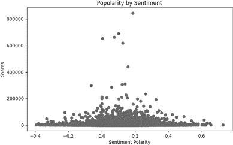
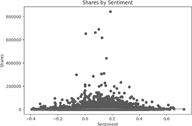
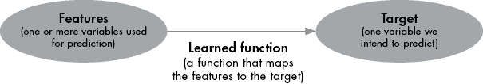
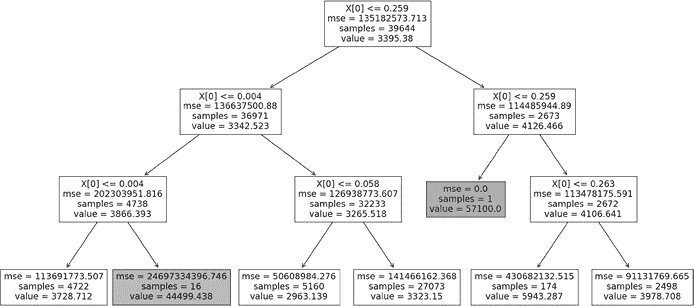
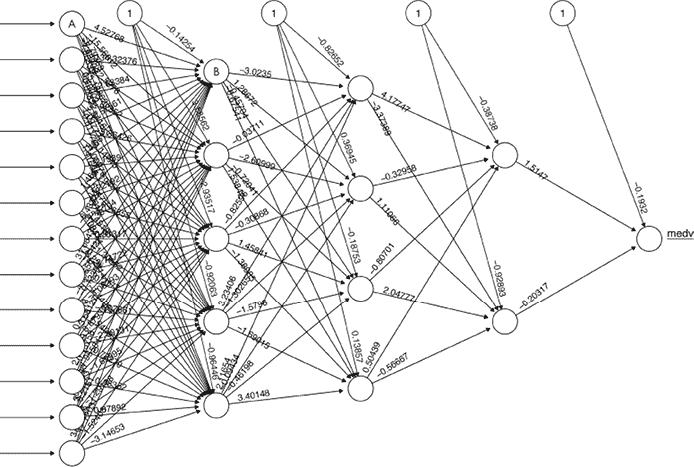

## 第六章：监督学习


计算机科学家使用术语*监督学习*来指代一系列预测和分类的定量方法。事实上，你已经做过监督学习：你在第二章做的线性回归以及第五章中的 LPM 和逻辑回归都属于监督学习的实例。通过学习这些方法，你已经熟悉了监督学习的基本概念。本章介绍了一些先进的监督学习方法，并讨论了监督学习的一般概念。我们如此详细地探讨这一话题，因为它是数据科学中至关重要的组成部分。

我们将通过介绍另一个商业挑战，描述监督学习如何帮助我们解决这个问题来开始。我们将讨论线性回归作为一个不完美的解决方案，并一般性地讨论监督学习。接下来，我们将介绍 k-NN，这是一种简单而优雅的监督学习方法。我们还将简要介绍决策树、随机森林和神经网络，并讨论如何使用它们进行预测和分类。最后，我们将讨论如何衡量准确性以及这些不同方法的共同点。

## 预测网站流量

假设你经营一个网站。你的网站商业模式很简单：你发布有趣话题的文章，通过访问你网站文章的人赚取收入。无论收入来自广告销售、订阅还是捐赠，你的收入与访问你网站的人数成正比：访问者越多，收入越高。

非专业作家将文章提交给你，希望你能在网站上发布它们。你收到大量的投稿，根本不可能阅读，更不用说发布所有收到的文章。因此，你必须进行一些筛选。在决定发布哪些文章时，你可能会考虑许多因素。当然，你会尽量考虑提交文章的质量。你还会考虑哪些文章与网站的“品牌”相符。但最终，你的目标是经营一家成功的企业，最大化网站的收入对确保企业的长期生存至关重要。由于你的收入与访问你网站的人数成正比，最大化收入将取决于选择那些可能会吸引大量访问者的文章进行发布。

你可以尝试依靠直觉来决定哪些文章可能会获得更多的访问者。这需要你或你的团队阅读每一篇提交的文章，并作出关于哪些文章可能吸引访问者的艰难判断。这将非常耗时，即使在花费大量时间阅读文章之后，也不能完全确定你的团队会做出正确的判断，知道哪些文章会吸引最多的访问者。

解决这个问题的一个更快速且可能更准确的方法是通过监督学习。想象一下，你能够编写代码，在文章到达你的邮箱后立即阅读它们，并利用代码从每篇提交的文章中获取的信息，准确预测它将吸引的访客数量，在发布之前。如果你有这样的代码，你甚至可以完全自动化你的发布过程：一个机器人可以从邮件中读取提交内容，预测每篇提交文章的预期收入，并发布每篇预期收入超过特定阈值的文章。

该过程最难的部分是预测文章的预期收入；这是我们需要依赖监督学习来完成的部分。在本章的其余部分，我们将介绍实现这种自动化系统所需的监督学习步骤，以预测某篇文章将吸引的访客数量。

## 读取和绘制新闻文章数据

与大多数数据科学场景一样，监督学习要求我们读取数据。我们将读取一个可以免费获得的数据集，来自加利福尼亚大学欧文分校（UCI）机器学习库（[`archive-beta.ics.uci.edu/`](https://archive-beta.ics.uci.edu/)）。该库包含了数百个数据集，供机器学习研究人员和爱好者用于研究和娱乐。

我们将使用的特定数据集包含有关 2013 年和 2014 年在 Mashable 网站上发布的新闻文章的详细信息（[`mashable.com`](https://mashable.com)）。这个在线新闻流行度数据集有一个网页 [`archive-beta.ics.uci.edu/dataset/332/online+news+popularity`](https://archive-beta.ics.uci.edu/dataset/332/online+news+popularity)，提供了更多关于数据的信息，包括数据的来源、包含的信息，以及已有分析的论文。

你可以从 [`archive.ics.uci.edu/ml/machine-learning-databases/00332/OnlineNewsPopularity.zip`](https://archive.ics.uci.edu/ml/machine-learning-databases/00332/OnlineNewsPopularity.zip) 获取该数据的 ZIP 文件。下载 ZIP 压缩包后，你必须将其解压到计算机中。然后你会看到 *OnlineNewsPopularity.csv* 文件，这就是数据集本身。在解压该 *.csv* 文件后，你可以按如下方式将其读取到 Python 会话中：

```py
import pandas as pd
news=pd.read_csv('OnlineNewsPopularity.csv')
```

我们导入我们老朋友 pandas 包，并将新闻数据集读取到一个名为 `news` 的变量中。`news` 的每一行包含关于某篇特定文章的详细信息，这些文章都发布在 Mashable 上。第一列 `url` 包含该文章的原始 URL。如果你访问特定文章的 URL，你可以看到与之相关的文本和图像。

总的来说，我们的 `news` 数据集有 61 列。每一列从第二列开始，都包含关于文章的某些数值度量。例如，第三列名为 `n_tokens_title`。这是标题中的*token*数量，在这种情况下，指的是标题中的单词数。`news` 数据集中的许多列名称都涉及到自然语言处理（NLP）中的高级方法。NLP 是一个相对较新的领域，旨在利用计算机科学和数学算法，以快速、自动的方式分析、生成和翻译自然人类语言，而不需要人工干预。

请考虑第 46 列，`global_sentiment_polarity`。这一列包含了每篇文章的整体*情感*度量，从 -1（高度负面）到 0（中性）再到 1（高度正面）。能够自动衡量用自然人类语言写成的文本的情感是自然语言处理（NLP）领域最近令人兴奋的进展之一。最先进的情感分析算法能够与人类的情感评分紧密匹配，因此，一篇关于死亡、恐怖和悲伤的文章，无论是人类还是 NLP 算法都会将其评定为高度负面的情感（接近 -1），而一篇关于快乐、自由和数据分析的文章则普遍被认为具有高度正面的情感（接近 1）。我们的数据集创建者已经运行了情感分析算法来衡量数据集中每篇文章的情感，结果存储在 `global_sentiment_polarity` 中。其他列则包含了其他度量值，包括文章长度等简单的指标以及其他高级的 NLP 结果。

最后一列，`shares`，记录了每篇文章在社交媒体平台上被分享的次数。我们的真正目标是通过增加访问量来增加收入。但我们的数据集中并没有直接测量收入或访问量！这是数据科学实践中的一种常见情况：我们想分析某些内容，但数据中只有其他信息。在这种情况下，合理的推测是，社交媒体分享的次数与文章的访问量相关，因为高访问量的文章会经常被分享，而高度分享的文章也会频繁被访问。正如我们之前提到的，收入直接与网站访问量相关。因此，我们可以合理地假设，文章的社交媒体分享次数与该文章所获得的收入紧密相关。这意味着我们将使用分享次数作为访问量和收入的*代理*。

如果我们能确定哪些文章的特征与分享数呈正相关，那将有助于我们的分析。例如，我们可能会猜测，情感分数较高的文章也会被更频繁地分享，如果我们相信人们喜欢分享愉快的事情的话。如果这是正确的，了解一篇文章的情感倾向将有助于我们预测它的分享次数。通过学习如何预测分享次数，我们假设我们也将同时学会如何预测访客数和收入。而且，如果我们知道一篇文章的高分享特征，我们将知道如何设计未来的文章以最大化我们的收入。

正如我们以前做过的那样（特别是在第一章中），我们可以从简单的探索开始。我们将从绘制图表开始。让我们考虑一个情感与分享数之间关系的图表：

```py
from matplotlib import pyplot as plt
plt.scatter(news[' global_sentiment_polarity'],news[' shares'])
plt.title('Popularity by Sentiment')
plt.xlabel('Sentiment Polarity')
plt.ylabel('Shares')
plt.show()
```

你可能会注意到，当我们在这段 Python 代码中访问数据集的列时，我们在每个列名的开头加了一个空格。例如，我们写 `news[' shares']` 而不是 `news['shares']` 来引用记录分享次数的列。我们这样做是因为原始数据文件中的列名本身就包含了一个空格。无论是什么原因，这个文件中的每个列名前都带有一个空格，而不是只有列名本身，因此我们在告诉 Python 访问每一列时，需要包含这个空格。你将在本章中看到这些空格；每个数据集都有它自己的特殊之处，而成为一名成功的数据科学家的一部分，就是能够理解并适应这些特殊之处。

图 6-1 显示了情感极性与分享数之间的关系。



图 6-1：我们数据集中每篇文章的情感与分享数之间的关系

我们可以从这个图中注意到的一点是，至少从肉眼来看，情感极性与分享数之间似乎不存在明显的线性关系。高情感的文章似乎并没有比低情感的文章更频繁地被分享，反之亦然。事实上，情感接近中立的文章（情感较为中性的文章）似乎获得了最多的分享。

## 使用线性回归作为预测方法

我们可以通过执行线性回归来对这种（缺乏）线性关系进行更严格的检验，就像我们在第二章和第五章中做的那样：

```py
from sklearn.linear_model import LinearRegression
x = news[' global_sentiment_polarity'].values.reshape(-1,1)
y = news[' shares'].values.reshape(-1,1)
regressor = LinearRegression()
regressor.fit(x, y)
print(regressor.coef_)
print(regressor.intercept_)
```

这段代码执行了一个使用情感极性预测分享数的线性回归。它的执行方式和我们在第二章中概述的相同。我们首先从 `sklearn.linear_model` 模块导入所需的 `LinearRegression()` 函数。接着，我们对数据进行重塑，以便导入的模块能够与之配合使用。我们创建一个名为 `regressor` 的变量，并将回归器拟合到我们的数据上。最后，我们打印出拟合回归后得到的系数和截距：499.3 和 3,335.8。

你会记得在第二章中，我们可以将这些数字解释为回归线的斜率和截距，分别对应于回归方程的系数。换句话说，我们的线性回归估计了情感与股票数之间的关系，如下所示：

*shares* = 3335.8 + 499.3 · *sentiment*

我们可以将这条回归线与我们的数据一起绘制，如下所示：

```py
regline=regressor.predict(x)
plt.scatter(news[' global_sentiment_polarity'],news[' shares'],color='blue')
plt.plot(sorted(news[' global_sentiment_polarity'].tolist()),regline,'r')
plt.title('Shares by Sentiment')
plt.xlabel('Sentiment')
plt.ylabel('Shares')
plt.show()
```

输出应该类似于图 6-2。



图 6-2：显示情感与股票数之间估计关系的回归线

我们的回归线，如果你在家创建图表的话应该是红色的，看起来非常平坦，显示情感与股票数之间的关系较弱。使用这条回归线来预测股票数可能不会有太大帮助，因为它为每个情感值预测几乎相同的股票数。我们将需要探索其他监督学习方法，以便得到更好、更准确的预测。但首先，让我们先思考一下监督学习的一般概念，包括线性回归为什么是一种监督学习方法，以及其他哪些监督学习方法可能适用于我们的商业场景。

## 理解监督学习

我们刚才做的线性回归是监督学习的一个例子。在本章中，我们多次提到了监督学习，但没有准确地定义它。我们可以将其定义为学习一个将特征变量映射到目标变量的函数的过程。听起来可能不太直观或清晰。为了理解我们的意思，请参考图 6-3。



图 6-3：监督学习过程

想一想这个图如何应用于我们在本章早些时候完成的线性回归。我们使用情感作为唯一的特征（左侧的椭圆）。我们的目标变量是股票数（右侧的椭圆）。以下方程展示了我们的*学习函数*（中间的箭头）：

*shares* = 3,335.8 + 499.3 · *sentiment*

这个函数做了监督学习中每个学习函数应该做的事情：它接受一个（或多个）特征作为输入，并输出目标变量值的预测。在我们的代码中，我们从 sklearn 模块中导入了功能，这些功能为我们确定了系数，或者说学习了这个函数。（在这方面，sklearn 通过依赖线性代数方程来学习这个函数，这些方程可以保证找到最小化目标变量均方误差的系数，正如我们在第二章中讨论的那样。）

*监督学习*一词指的是确定（学习）这个函数的过程。目标变量是监督这个过程的关键，因为在我们确定学习到的函数时，我们会检查它是否能准确预测目标值。如果没有目标变量，我们就无法学习函数，因为我们无法判断哪些系数导致了高准确度，哪些导致了低准确度。

你将使用的每一个监督学习方法都可以通过图 6-3 来描述。在某些情况下，我们可以进行*特征工程*，仔细选择数据集中哪些变量能够带来最准确的预测。在其他情况下，我们会调整目标变量——例如，使用代理变量或对原始变量进行转换。但任何监督学习方法中最重要的部分是学习到的函数，它将特征映射到目标。掌握新的监督学习方法就意味着掌握确定这些学习函数的新方法。

当我们选择线性回归作为监督学习方法时，得到的学习函数总是呈方程 6-1 所示的形式：

*目标* = *截距* + *系数*[1] · *特征*[1] + *系数*[2] · *特征*[2] + … + *系数*[*n*] · *特征*[*n*]

方程 6-1：每个线性回归的学习函数的一般形式

对于那些上过许多代数课的人来说，这可能是函数采取的自然形式。系数与特征相乘并加总。当我们在二维空间中进行这种操作时，我们得到一条直线，就像图 6-2 中的直线。

然而，这并不是学习到的函数唯一可能的形式。如果我们更深入地思考这种形式，我们会意识到，线性回归的函数隐含地表达了一种假设的世界观或*模型*。特别地，线性回归隐含地假设世界可以用直线来描述：每当我们有两个变量*x*和*y*时，就存在一种准确地将它们关联起来的方式，即直线*y* = *a* + *bx*，其中*a*和*b*是某些常数。世界上许多事物可以用直线来描述，但并非所有事物都如此。宇宙是一个庞大的地方，存在许多世界模型、许多学习到的函数，以及许多监督学习方法，通过放弃这种线性假设，我们可以获得更准确的预测。

如果世界不是通过直线和线性关系来描述的，那么哪种世界模型是正确的，或者最准确或最有用的呢？有许多可能的答案。例如，我们可以将世界视为由围绕点的小区组成，而不是由直线构成。我们可以不用直线来进行预测，而是测量点周围小区的特征，并利用这些小区来进行预测。（这种方法将在下一节中更加清晰。）

如果我们在世界上观察到的一切都可以通过直线和线性关系来关联，那么线性回归就是研究它的正确模型。如果世界是由邻域组成的，那么另一种监督学习模型更加合适：k 最近邻。我们接下来将探讨这种方法。

## k 最近邻

假设你有一个实习生，他从未学习过统计学、线性回归、监督学习或数据科学的任何内容。你刚刚收到一篇作者希望在你的网站上发布的新文章。你把这篇新提交的文章以及`news`数据集和一些 NLP 软件交给了实习生。你指派实习生预测这篇新文章将被分享的次数。如果实习生预测的分享次数很高，你将发布这篇文章。否则，你不会发布它。

你的实习生使用 NLP 软件确定这篇文章的`global_sentiment_polarity`为 0.42。你的实习生不知道如何做我们在本章开始时所做的线性回归分析。相反，他们有一个简单的想法来预测分享次数。他们的简单想法是遍历`news`数据集，直到找到一篇与这篇新文章相似的文章。如果数据集中有一篇现有文章与新提交的文章相似，那么可以合理地推测，新文章的分享次数将与现有文章的分享次数相似。

例如，假设他们在数据集中找到一篇现有文章，其`global_sentiment_polarity`为 0.4199。他们合理地得出结论，这篇现有文章与我们的新文章相似，因为它们的情感评分几乎相同。如果现有文章获得了 1,200 次分享，我们可以预期我们的新文章，具有几乎相同的`global_sentiment_polarity`，也应该有类似的分享次数。“相似的文章获得相似的分享次数”是对这种简单思维过程的总结。在监督学习的背景下，我们可以将其重新表述为“相似的特征值导致相似的目标值”，尽管你的实习生从未听说过监督学习。

由于我们正在处理的是数值数据，我们不需要仅仅定性地讨论文章之间的*相似性*。我们可以直接测量数据集中的任何两条观测值之间的*距离*。与我们的新文章相似的现有文章的`global_sentiment_polarity`为 0.4199，和我们新文章的`global_sentiment_polarity`（0.42）之间相差 0.0001。由于`global_sentiment_polarity`是我们迄今为止考虑的唯一变量，我们可以说这两篇文章之间的*距离*为 0.0001。

你可能认为距离是一个有着明确且不可改变定义的概念。但在数据科学和机器学习中，我们常常发现自己测量的距离并不符合我们日常生活中的定义。在这个例子中，我们使用的是情感评分的差异作为我们的距离，尽管这不是一种可以步行或用尺子测量的距离。在其他情况下，我们可能会发现自己在表达真假值之间的距离，特别是当我们在进行分类时，正如第五章所示。我们谈论距离时，通常是将其作为一种宽松的类比，而不是字面上的物理测量。

具有小距离的观测值可以被称为 *邻居*，在这个例子中，我们找到了两个相近的邻居。另一篇情感得分为 0.41 的文章，与我们新文章的距离是 0.1：仍然是一个邻居，但距离“街道”稍微远一些。对于任何两篇文章，我们都可以在所有感兴趣的变量上衡量它们之间的距离，并将此作为衡量它们是邻居的程度。

我们不仅仅考虑一个邻居文章，而是考虑围绕我们想要预测的新文章的整个邻里。我们可能会找到离新文章最近的 15 个邻居——数据集中 `global_sentiment_polarity` 最接近 0.42 的 15 个点。我们可以考虑这些 15 篇文章的分享数量。这 15 个最近邻的分享数量的平均值，是我们可以合理预测新文章将获得的分享数量。

你的实习生认为他们的预测方法没什么特别的，似乎只是一个简单自然的预测方式，没有使用任何微积分或计算机科学的知识。然而，他们的简单过程实际上是一个强大的监督学习算法，叫做 *k-最近邻（k-NN）*。我们可以用四个简单的步骤来描述整个方法；实际上，它本身就是简单：

1.  选择一个你想要对目标变量进行预测的点 *p*。

1.  选择一个自然数，*k*。

1.  找到数据集中与点 *p* 最近的 *k* 个邻居。

1.  *k* 个最近邻的目标值的平均值就是 *p* 的目标值预测。

你可能已经注意到，k-NN 过程不需要任何矩阵乘法、微积分，甚至不需要任何数学。尽管它通常只在研究生级别的计算机科学课程中教授，k-NN 其实只是一个简单的思想，孩子甚至实习生都能直观地理解：如果事物在某些方面相似，那么它们在其他方面也很可能相似。如果事物处于同一个邻里，它们可能是相似的。

### 实现 k-NN

编写 k-NN 监督学习的代码很直接。我们将首先定义 `k`，即我们将查看的邻居数量，以及 `newsentiment`，它将保存我们想要预测的假设新文章的 `global_sentiment_polarity`。在这种情况下，假设我们收到另一篇新文章，这篇文章的情感评分为 0.5：

```py
k=15
newsentiment=0.5
```

所以，我们将预测一个情感评分为 0.5 的新文章将获得的分享数量。我们将查看与新文章最接近的 15 个邻居来进行这些预测。将极性和分享数据转换为列表会更为方便，如下所示：

```py
allsentiment=news[' global_sentiment_polarity'].tolist()
allshares=news[' shares'].tolist()
```

接下来，我们可以计算数据集中每篇文章与假设的新文章之间的距离：

```py
distances=[abs(x-newsentiment) for x in allsentiment]
```

这段代码使用了列表推导式来计算每篇现有文章的情感与新文章情感之间差值的绝对值。

现在我们有了所有这些距离，我们需要找出哪些是最小的。记住，距离新文章最近的文章就是最邻近的邻居，我们将利用它们来做最终预测。Python 的 NumPy 包中的一个有用函数使我们可以轻松找到最近的邻居：

```py
import numpy as np
idx = np.argsort(distances)
```

在这段代码中，我们导入了 NumPy，然后定义了一个名为 `idx` 的变量，它是 *index*（索引）的缩写。如果你运行 `print(idx[0:k])`，你可以看到这个变量的内容：

```py
[30230, 30670, 13035, 7284, 36029, 19361, 29598, 22546, 25556, 6744, 26473,\
7211, 9200, 15198, 31496]
```

这 15 个数字是最邻近的邻居的索引编号。我们数据集中第 30,230 篇文章的 `global_sentiment_polarity` 是最接近 0.5 的。第 30,670 篇文章的 `global_sentiment_polarity` 排名第二，依此类推。我们使用的 `argsort()` 方法是一个便捷的方法，它将距离列表从小到大排序，然后提供 `k` 个最小距离（最邻近的邻居）的索引。

在我们知道了最近邻的索引后，我们可以创建一个包含每个邻居对应分享次数的列表：

```py
nearbyshares=[allshares[i] for i in idx[0:k]]
```

我们的最终预测只是这个列表的平均值：

```py
print(np.mean(nearbyshares))
```

你应该得到输出 7344.466666666666，这表明情感接近 0.5 的过去文章平均获得大约 7,344 次社交媒体分享。如果我们相信 k-NN 的逻辑，那么我们应该预期，任何未来情感接近 0.5 的文章也将获得大约 7,344 次社交媒体分享。

### 使用 Python 的 sklearn 执行 k-NN

我们不需要每次想要使用 k-NN 进行预测时都经过那个整个过程。某些 Python 包可以为我们执行 k-NN，包括 sklearn 包，我们可以通过以下方式将其相关模块导入到 Python 中：

```py
from sklearn.neighbors import KNeighborsRegressor
```

你可能会惊讶于我们这里导入的模块叫做 `KNeighborsRegressor`。我们刚刚描述了 k-NN 与线性回归非常不同，那么为什么一个 k-NN 模块会像线性回归模块一样使用 *regressor* 这个词呢？

k-NN 方法显然不是线性回归，它也不使用线性回归依赖的任何矩阵代数，也不会像线性回归那样输出回归线。然而，既然它是一个监督学习方法，它实现的目标与线性回归相同：确定一个将特征映射到目标的函数。由于回归是主导了一个多世纪的监督学习方法，人们开始将*回归*视为*监督学习*的同义词。因此，人们开始将 k-NN 函数称为*k-NN 回归器*，因为它们实现的目标与回归相同，尽管没有进行实际的线性回归。

今天，*回归*和*回归器*这两个词被用于所有关于连续数值型目标变量的监督学习方法，无论它们是否与线性回归直接相关。由于监督学习和数据科学是相对较新的领域（与数学相比，数学已有几千年的历史），许多混淆或冗余的术语仍然存在并未被清理；学习数据科学的一部分就是习惯这些令人困惑的名称。

就像我们对线性回归所做的那样，我们需要调整情感列表的形状，以便它符合这个包的预期格式：

```py
x=np.array(allsentiment).reshape(-1,1)
y=np.array(allshares)
```

现在，我们不再计算距离和索引，而是可以简单地创建一个“回归器”并将其拟合到我们的数据中：

```py
knnregressor = KNeighborsRegressor(n_neighbors=15)
knnregressor.fit(x,y)
```

现在，只要我们正确地调整了形状，就可以找到分类器对任何情感所做的预测：

```py
print(knnregressor.predict(np.array([newsentiment]).reshape(1,-1)))
```

这个 k-NN 回归器预测新文章将获得 7,344.46666667 次分享。这与我们之前在手动进行 k-NN 过程时得到的结果完全一致。你应该为结果匹配而感到高兴：这意味着你至少和受尊敬的、流行的 sklearn 包的作者一样，知道如何编写 k-NN 的代码。

现在你已经学习了一种新的监督学习方法，试着思考它与线性回归有何相似之处与不同之处。线性回归和 k-NN 都依赖特征变量和目标变量，如图 6-3 所示。它们都创建了一个学习到的函数，将特征变量映射到目标变量。在线性回归的情况下，学习到的函数是变量与系数相乘后的线性和，形式如方程 6-1 所示。在 k-NN 的情况下，学习到的函数是一个寻找相关数据集中*k*个最近邻居的均值目标值的函数。

虽然线性回归隐式地表达了一个模型，其中所有变量可以通过直线相互关联，但 k-NN 隐式地表达了一个模型，其中点的邻域彼此相似。这些世界模型及其所暗示的学习函数是截然不同的。由于学习到的函数不同，它们可能会对文章分享次数或我们想要预测的其他任何内容做出不同的预测。但准确预测目标变量的目标在两者中是相同的，因此这两者都是常用的监督学习方法。

## 使用其他监督学习算法

线性回归和 k-NN 只是我们预测场景中可以使用的众多监督学习算法中的两种。允许我们轻松进行 k-NN 回归的相同 sklearn 包，也可以使我们使用这些其他监督学习算法。列表 6-1 展示了如何使用五种方法进行监督学习，每种方法使用相同的特征和目标变量，但使用不同的监督学习算法（不同的学习函数）：

```py
#linear regression
from sklearn.linear_model import LinearRegression
regressor = LinearRegression()
regressor.fit(np.array(allsentiment).reshape(-1,1), np.array(allshares))
print(regressor.predict(np.array([newsentiment]).reshape(1,-1)))

#knn
from sklearn.neighbors import KNeighborsRegressor
knnregressor = KNeighborsRegressor(n_neighbors=15)
knnregressor.fit(np.array(allsentiment).reshape(-1,1), np.array(allshares))
print(knnregressor.predict(np.array([newsentiment]).reshape(1,-1)))

#decision tree
from sklearn.tree import DecisionTreeRegressor
dtregressor = DecisionTreeRegressor(max_depth=3)
dtregressor.fit(np.array(allsentiment).reshape(-1,1), np.array(allshares))
print(dtregressor.predict(np.array([newsentiment]).reshape(1,-1)))

#random forest
from sklearn.ensemble import RandomForestRegressor
rfregressor = RandomForestRegressor()
rfregressor.fit(np.array(allsentiment).reshape(-1,1), np.array(allshares))
print(rfregressor.predict(np.array([newsentiment]).reshape(1,-1)))

#neural network
from sklearn.neural_network import MLPRegressor
nnregressor = MLPRegressor()
nnregressor.fit(np.array(allsentiment).reshape(-1,1), np.array(allshares))
print(nnregressor.predict(np.array([newsentiment]).reshape(1,-1)))
```

列表 6-1：五种监督学习方法的集合

这个代码片段包含五个部分，每个部分有四行代码。前两个部分用于线性回归和 k-NN；它们是我们之前运行的相同代码，用于使用 sklearn 的预构建包轻松获得线性回归和 k-NN 预测。其他三个部分与前两个部分具有完全相同的结构：

1.  导入包。

1.  定义一个“回归器”。

1.  将回归器拟合到我们的数据。

1.  使用拟合的回归器打印预测结果。

区别在于五个部分中的每一个都使用不同类型的回归器。第三部分使用决策树回归器，第四部分使用随机森林回归器，第五部分使用神经网络回归器。你可能不知道这些回归器的具体类型，但你可以将其看作一种便利的事情：监督学习如此简单，你甚至可以在不知道模型是什么的情况下编写代码来构建模型并做出预测！(这并不是说这是一个好的实践——通常最好对你使用的每个算法有一个扎实的理论理解。)

描述所有这些监督学习算法的每个细节超出了本书的范围。但我们可以提供主要思想的概述。每种方法实现了相同的目标（预测目标变量），但使用不同的学习函数。反过来，这些学习函数隐式地表达了不同的假设和不同的数学，换句话说，不同的世界模型。

### 决策树

让我们从决策树开始，这在我们的代码中是 k-NN 部分之后的第一种模型。与假设变量通过直线（如线性回归）或通过邻域关系（如 k-NN）相关不同，*决策树*假设变量之间的关系可以通过一个包含二叉分裂的树形结构来最好地表达。如果这个描述听起来不太清楚，别担心；我们将使用 sklearn 的决策树绘图功能，创建一个名为`dtregressor`的决策树回归器的图，这个回归器是通过清单 6-1 中的代码创建的：

```py
from sklearn.tree import plot_tree
import matplotlib.pyplot as plt
plt.figure(figsize=(16,5))
plot_tree(dtregressor, filled=True, fontsize=8)
plt.savefig('decisiontree.png')
```

我们可以在图 6-4 中看到结果。



图 6-4：基于情感预测文章分享数的决策树

我们可以按照这个流程图，基于任何`global_sentiment_polarity`来做出关于分享数的预测。由于这个流程图具有类似树枝的分支结构，并且它能够进行决策，所以我们称它为*决策树*。

我们从树顶的框开始。框的第一行表达了一个条件：`X[0] <= 0.259`。这里，`X[0]`是指`global_sentiment_polarity`变量，它是我们数据集中的唯一特征。如果条件成立，我们就沿着左箭头继续向下进入下一层的框。否则，我们沿着右箭头前往树的另一侧。我们继续检查每个框中的条件，直到到达一个没有条件并且没有箭头指向其他下层框的框。然后我们查看那里指定的值，并将其作为我们的预测结果。

对于我们在示例中使用的情感值（0.5），我们从第一个框开始，因为 0.5 > 0.259，然后我们因为相同的原因继续向右走到第二个框，接着我们再向右走到第三个框，因为 0.5 > 0.263。最后，我们到达第四个框，它没有任何条件需要检查，我们得到了预测结果：情感极性为 0.5 的文章大约会有 3,979 次分享。

如果你在家里创建这个决策树，你会发现一些框是有阴影或颜色的。这个阴影是自动生成的，应用的阴影程度与决策树预测的值成正比。例如，你可以看到在图 6-4 中有一个框表示预测为 57,100 股，它有最深的阴影。预测较低股数的框会有较浅的阴影或根本没有阴影。这个自动阴影的目的是为了突出显示特别高的预测值。

你可以在高级机器学习教科书中找到关于 sklearn 如何创建决策树的详细信息，尤其是在图 6-4 中。对于大多数标准的商业用例来说，优化决策树的细节和数学公式并不像写几行简单的 Python 代码来创建决策树并读取其图表那样重要。

图 6-4 中的决策树只需要几行代码就能生成，并且无需任何特别的培训就能进行解释。这意味着决策树非常适合商业应用。你可以快速生成一棵决策树并展示给客户或公司领导，并且无需深入讲解任何数学、计算机科学或其他复杂的话题就能进行解释。因此，数据科学家常常说决策树是*可解释的模型*，与神经网络等其他模型相比，后者较为不透明，且难以快速理解或解释。决策树可以自然地、迅速地成为任何演示或报告中的一部分，既能提供视觉吸引力，也能帮助他人理解数据集或预测问题。这些是决策树在商业应用中的重要优势。另一方面，决策树的准确性通常低于像随机森林这样的更复杂的方法（参见下一节）。

就像线性回归和 k-NN 一样，决策树使用数据的某个特征（在这个例子中是情感）来对目标（在这个例子中是股票）进行预测。不同之处在于，决策树不依赖于变量之间通过一条直线相互关联的假设（线性回归的假设）或变量在点周围的小邻域中相互关联的假设（k-NN 的假设）。相反，决策树是在假设图 6-4 中显示的分支结构是世界的适当模型的基础上构建的。

### 随机森林

清单 6-1 的第四部分使用*随机森林*进行预测。随机森林是一种*集成方法*。集成方法得名于它们由许多简单方法组成。正如你从名字中可以推测的，随机森林由许多简单的决策树组成。每次使用随机森林回归器进行预测时，sklearn 代码都会创建许多决策树回归器。每个单独的决策树回归器都是用不同的训练数据子集和不同的训练特征子集创建的。最终的随机森林预测是由每棵单独的决策树所做预测的均值。

在图 6-3 的背景下，随机森林学习一个复杂的函数：它由多个随机选择的决策树所学习的多个函数的均值组成。尽管如此，因为随机森林学习的是一个将特征映射到目标变量的函数，它仍然是一种标准的监督学习方法，就像线性回归、k-NN 和其他方法一样。

随机森林变得流行的原因在于其代码相对容易编写，而且通常比决策树或线性回归具有更高的准确性。这些是它们的主要优势。另一方面，虽然我们可以绘制出一个容易解释的决策树表示，如图 6-4，但随机森林通常由数百棵独特的决策树组成，这些树被平均在一起，而要以人类能够理解的方式绘制随机森林的表示并不容易。选择随机森林作为监督学习方法可能会提高准确性，但代价是可解释性和可说明性。每种监督学习方法都有优缺点，选择适合您情况的权衡是任何希望在监督学习中取得成功的数据科学家的关键。

### 神经网络

*神经网络*在近年来变得极为流行，因为我们的计算机硬件已经发展到能够处理它们的计算复杂性。神经网络的复杂性也使它们难以简洁地描述，除非说我们可以用它们进行监督学习。我们可以从展示一个特定神经网络的示意图开始(图 6-5)。



图 6-5：神经网络示意图

该图表示的是神经网络学习到的函数。在这张图中，您可以看到左侧一列 13 个圆圈，称为*节点*。这 13 个节点统称为神经网络的*输入层*。输入层的每个节点代表训练数据的一个特征。最右侧的单个节点表示神经网络对目标变量的最终预测。左侧和右侧之间的所有线条和节点表示一个复杂的学习函数，它将特征输入映射到最终的目标预测。

例如，您可以看到最左侧列中的最上方节点（标记为*A*）有一条箭头指向另一个节点（标记为*B*），箭头旁边写着数字 4.52768。这个数字是一个*权重*，我们应该将这个权重与节点 A 对应的特征值相乘。然后将这个乘积的结果加到对应于节点 B 的运行总和中。您可以看到节点 B 有 13 条箭头指向它，每条箭头对应输入层中的一个节点。每个特征将乘以一个不同的权重，特征值和权重的乘积将加到节点 B 的运行总和中。然后，数字–0.14254 将被加到结果中；这个数字是在一个蓝色节点（里面有数字 1）和节点 B 之间的箭头上绘制的。（这个蓝色节点也叫做*偏置节点*。）

在完成所有的乘法和加法之后，我们将得到节点 B 的累计总和，并对其应用一个叫做*激活函数*的新函数。激活函数有很多种，其中之一就是你在第五章遇到的逻辑函数。应用激活函数之后，我们将得到节点 B 的最终数值。我们才刚刚开始计算神经网络的学习函数过程。你可以看到节点 B 有四个箭头从它发出，每个箭头指向更右边的其他节点。对于这些箭头，我们必须遵循相同的步骤，即将权重乘以节点值，添加到每个节点的累计总和中，并应用激活函数。完成所有节点和图中所有箭头的计算后，我们将得到最右边节点的最终值：这将是我们对目标值的预测。

神经网络的设计方式使得这个过程，包括重复的乘法和加法及激活函数，最终会给出一个高度准确的预测。神经网络的复杂性可能是一个挑战，但它也正是使得神经网络能够准确地建模我们复杂的非线性世界的原因。

这些网络被称为*神经网络*，因为图 6-5 中的节点和箭头类似于大脑中的神经元和突触。这种相似性主要是表面的。你可以用一种不看起来像大脑的方式描绘神经网络，或者你也可以像描绘线性回归那样，用一种看起来像大脑的方式来写下其他方法。

要真正掌握神经网络，你需要学习更多的内容。神经网络的一些有趣进展来自于实验不同的节点结构或*架构*。例如，*深度神经网络*在最左边的输入节点和最右边的输出节点之间有许多层。*卷积神经网络*向网络结构中添加了一种额外的层，执行一种叫做*卷积*的特殊操作。*递归神经网络*允许连接在多个方向上流动，而不仅仅是从左到右。

研究人员已经发现神经网络在计算机视觉（如识别狗、猫、车或人）、语言处理（如机器翻译和语音识别）等领域的显著应用。另一方面，神经网络难以解释、难以理解，并且难以正确训练，有时还需要专门的硬件。尽管神经网络非常强大，这些缺点有时会使它们在商业应用中变得不那么吸引人。

## 测量预测准确性

无论我们选择哪种监督学习模型，在拟合之后，我们都需要衡量它的预测准确性。以下是我们在预测文章分享量的场景中如何操作：

```py
allprediction=regressor.predict(np.array([allsentiment]).reshape(-1,1))
predictionerror=abs(allprediction-allsentiment)
print(np.mean(predictionerror))
```

这段简单的代码计算了平均绝对误差（MAE），正如我们之前所做的那样。在第一行，我们使用回归模型的`predict()`方法预测数据集中每篇文章的分享数。（记住，这个`regressor`是我们在本章开始时创建的线性回归模型。如果你愿意，你可以将`regressor`替换为`rfregressor`或`nnregressor`，以分别衡量我们的随机森林或神经网络的准确性。）在第二行，我们计算这些预测的预测误差：这只是预测值和实际值之间差异的绝对值。第三行计算的预测误差的平均值是我们特定监督学习方法表现如何的一个衡量标准，其中 0 是最佳值，较高的值则表示较差。我们可以使用这个过程来计算许多监督学习算法的预测准确性，然后选择导致最高准确度（最低平均绝对误差）的算法作为我们场景下的最佳方法。

这种方法唯一的问题是，它并不完全像一个真正的预测场景。在现实生活中，我们必须为那些不在训练数据集中的文章做出预测——这些是我们的回归模型在训练过程中从未见过的文章。相比之下，我们使用了 2013 年和 2014 年的一组文章数据，拟合回归模型到整个数据集，然后根据同一个 2013-14 数据集来评估我们的准确性，因为这个数据集用于拟合我们的回归模型。由于我们是根据用于拟合回归模型的相同数据来评估准确性的，因此我们所做的并不是真正的预测。这是*事后推断*——事后说明发生了什么，而不是事前预测。当我们进行事后推断时，我们可能会犯上过拟合的错误，这是我们在第二章中已经遇到的可怕陷阱。

为了避免事后推断和过拟合的问题，我们可以采用在第二章中使用过的相同方法：将数据集分为两个互不重叠的子集，一个训练集和一个测试集。我们使用训练集来训练数据，或者换句话说，允许我们的监督学习模型学习其学习的函数。在仅使用训练数据集训练数据后，我们使用测试数据对其进行测试。测试数据，因为它在训练过程中没有被使用，所以“仿佛”来自未来，因为我们的回归模型没有使用它进行学习，即使它实际上来自过去。

sklearn 包提供了一个方便的函数，我们可以用它来将数据拆分为训练集和测试集：

```py
from sklearn.model_selection import train_test_split
x=np.array([allsentiment]).reshape(-1,1)
y=np.array(allshares)
trainingx,testx,trainingy,testy=train_test_split(x,y,random_state=1)
```

这段代码的四个输出是`trainingx`和`trainingy`——我们的训练数据的*x*和*y*分量——以及`testx`和`testy`——我们的测试数据的*x*和*y*分量。让我们检查一下这些输出的长度：

```py
>>> **print(len(trainingx))**
29733
>>> **print(len(trainingy))**
29733
>>> **print(len(testx))**
9911
>>> **print(len(testy))**
9911
```

你可以看到，我们的训练数据包括`trainingx`（训练样本的情感得分）和`trainingy`（训练样本的市场份额统计）。这两个训练数据集都有 29,733 个观测值，占数据的 75%。测试数据集（`testx`和`testy`）有 9,911 个观测值，占剩余的 25%。这种划分方式与我们在第二章中采用的方法相同：用大部分数据训练模型，用较小的一部分数据测试模型。

我们在这里进行的训练/测试数据划分与第二章的不同之处在于，在第二章中，我们使用较早的数据（数据集的前几年）作为训练数据，而使用较晚的数据（数据集的后几年）作为测试数据。这里，我们没有按照时间顺序划分训练和测试数据。相反，我们使用的`train_test_split()`函数进行的是随机划分：随机选择训练集和测试集，而不是按时间顺序从早期和晚期数据中进行选择。这是一个重要的区分点：对于时间序列数据（按固定、顺序的时间间隔记录的数据），我们根据早期和晚期数据的划分来选择训练集和测试集；但对于其他所有数据集，我们都是随机选择训练集和测试集。

接下来，我们需要使用这些训练集来训练模型，并使用这些测试集来计算预测误差：

```py
rfregressor = RandomForestRegressor(random_state=1)
rfregressor.fit(trainingx, trainingy)
predicted = rfregressor.predict(testx)
predictionerror = abs(predicted-testy)
```

你可以看到，在这个代码片段中，我们只使用训练数据来拟合回归器。然后，我们仅使用测试数据来计算预测误差。尽管我们所有的数据来自过去，但通过对未包含在训练中的数据进行预测，我们确保我们的过程更像是一个真实的预测过程，而不是后验预测。

我们可以通过运行`print(np.mean(predictionerror))`来查看测试集上的误差。你会看到，当使用我们的随机森林回归器时，测试集上的平均预测误差约为 3,816。

我们也可以对其他回归器进行相同的操作。例如，以下是我们检查 k-NN 回归器预测误差的方法：

```py
knnregressor = KNeighborsRegressor(n_neighbors=15)
knnregressor.fit(trainingx, trainingy)
predicted = knnregressor.predict(testx)
predictionerror = abs(predicted-testy)
```

同样，我们可以使用`print(np.mean(predictionerror))`来找出这种方法是否比我们其他的监督学习方法表现更好。当我们这样做时，我们发现 k-NN 回归器在测试集上的平均预测误差约为 3,292。在这种情况下，k-NN 的表现优于随机森林，因为根据测试集上的预测误差来看，k-NN 的表现更好。当我们想为特定场景选择最好的监督学习方法时，最简单的方法是选择在*测试集上*预测误差最小的方法。

## 使用多变量模型

到目前为止，在本章中，我们只处理了单变量的监督学习，这意味着我们仅使用一个特征（情感）来预测分享数量。一旦你掌握了单变量监督学习，跳到*多变量监督学习*，即使用多个特征来预测一个目标，就变得非常简单。我们需要做的就是在我们的*x*变量中指定更多的特征，如下所示：

```py
x=news[[' global_sentiment_polarity',' n_unique_tokens',' n_non_stop_words']]
y=np.array(allshares)
trainingx,testx,trainingy,testy=train_test_split(x,y,random_state=1)
from sklearn.ensemble import RandomForestRegressor
rfregressor = RandomForestRegressor(random_state=1)
rfregressor.fit(trainingx, trainingy)
predicted = rfregressor.predict(testx)
predictionerror = abs(predicted-testy)
```

在这里，我们指定一个`x`变量，它不仅包含文章的情感特征，还包含我们数据集中其他列中的两个特征。之后，过程与我们之前遵循的相同：将数据拆分为训练集和测试集，使用训练集创建并拟合回归模型，并计算测试集上的预测误差。当我们现在运行`print(np.mean(predictionerror))`时，我们看到我们的多变量模型的平均预测误差大约为 3,474，表明我们的多变量随机森林模型在测试集上比我们的单变量随机森林模型表现更好。

## 使用分类代替回归

到目前为止，本章介绍了多种方法来预测分享数量，给定文章的不同特征。`shares`变量可以取从 0 到无穷大的任何整数值。对于这样的数据（连续的数值变量），使用回归来预测它将取什么值是合适的。我们使用了线性回归、k-NN 回归、决策树回归、随机森林回归和神经网络回归：五种监督学习方法，所有这些方法都用于预测可以取广泛值的目标。

与其进行预测和回归，我们可能更希望进行分类，如同我们在第五章所做的那样。在我们的业务场景中，我们可能并不关心预测准确的分享数量。相反，我们可能只关心一篇文章是否会达到一个高于中位数的分享量。决定某物是否高于或低于中位数是一个分类场景，因为它是对一个只有两个可能答案的问题（真/假）进行决策。

我们可以创建一个变量，帮助我们进行分类，如下所示：

```py
themedian=np.median(news[' shares'])
news['abovemedianshares']=1*(news[' shares']>themedian)
```

在这里，我们创建一个`themedian`变量，表示我们数据集中分享数量的中位数值。然后，我们在`news`数据集中添加一个名为`abovemedianshares`的新列。当文章的分享量高于中位数时，这一列的值为 1，否则为 0。这个新的测量值来源于一个数值测量（分享数量），但我们可以将其视为一个分类测量：它表达了一个真/假的命题，说明一篇文章是否属于高分享类别。由于我们的业务目标是发布高分享文章而不是低分享文章，能够准确地将新文章分类为可能的高分享文章或低分享文章，对我们来说是非常有用的。

要执行分类而非回归，我们需要更改我们的监督学习代码。但幸运的是，我们所需的更改非常小。在下面的代码片段中，我们使用分类器而不是回归器来处理新的类别目标变量：

```py
x=news[[' global_sentiment_polarity',' n_unique_tokens',' n_non_stop_words']]
y=np.array(news['abovemedianshares'])
from sklearn.neighbors import **KNeighborsClassifier**
**knnclassifier** = **KNeighborsClassifier**(n_neighbors=15)
trainingx,testx,trainingy,testy=train_test_split(x,y,random_state=1)
**knnclassifier**.fit(trainingx, trainingy)
predicted = **knnclassifier**.predict(testx)
```

你可以看到我们之前进行的回归和这里进行的分类之间的区别其实非常小。唯一的变化部分是加粗的。特别是，我们不再导入`KNeighborsRegressor`模块，而是导入`KNeighborsClassifier`模块。两个模块都使用 k-NN 算法，但一个是为回归设计的，另一个是为分类设计的。我们将变量命名为`knnclassifier`，而不是`knnregressor`，但除此之外，监督学习的过程完全一样：导入监督学习模块，拆分数据集为训练集和测试集，将模型拟合到训练数据集，最后使用拟合后的模型进行测试集的预测。

你应该记得在第五章中，我们通常在分类场景中与回归场景中测量准确度的方式不同。以下代码片段创建了一个混淆矩阵，就像我们在第五章中做的那样：

```py
from sklearn.metrics import confusion_matrix
print(confusion_matrix(testy,predicted))
```

记住，这段代码的输出是一个混淆矩阵，展示了我们测试集中的真阳性、真阴性、假阳性和假阴性的数量。混淆矩阵如下所示：

```py
[[2703 2280]
 [2370 2558]]
```

记住，每个混淆矩阵都有以下结构：

```py
[[`true positives `      `false positives`]
[`false negatives`     `true negatives`]]
```

因此，当我们查看混淆矩阵时，我们发现我们的模型做出了 2,703 个真阳性分类：我们的模型预测了 2,703 篇文章的分享数在中位数以上，而这些文章的分享数确实在中位数以上。我们有 2,280 个假阳性：预测分享数在中位数以上的文章，实际分享数在中位数以下。我们有 2,370 个假阴性：预测分享数在中位数以下的文章，实际分享数在中位数以上。最后，我们有 2,558 个真阴性：预测分享数在中位数以下的文章，实际分享数也在中位数以下。

我们可以按如下方式计算我们的精准度和召回率：

```py
from sklearn.metrics import precision_score
from sklearn.metrics import recall_score

precision = precision_score(testy,predicted)
recall = recall_score(testy,predicted)
```

你会看到我们的精准度大约为 0.53，召回率大约为 0.52。这些数值并不是非常鼓舞人心；精准度和召回率应该尽可能接近 1。这些数值较低的原因之一是我们在尝试做出困难的预测。无论你的算法多么强大，预测一篇文章将获得多少分享本质上是非常困难的。

需要记住的是，尽管监督学习是一套基于巧妙思想并在强大硬件上执行的复杂方法，但它并不是魔法。宇宙中有很多事情本质上是难以预测的，即便使用最好的方法也是如此。但是，仅仅因为完美的预测可能不可能实现，并不意味着我们应该放弃做预测。在这种情况下，一个即使只稍微有帮助的模型总比什么都不做要好。

## 总结

在本章中，我们探讨了监督学习。我们从一个与预测相关的商业场景开始，回顾了线性回归及其不足之处。接着，我们讨论了监督学习的一般概念，并介绍了几种其他的监督学习方法。随后，我们进一步讨论了监督学习的一些细节，包括多变量监督学习和分类。

在下一章中，我们将讨论监督学习的“亲弟弟”——不太受欢迎的无监督学习。无监督学习为我们提供了强大的方法，可以探索和理解数据中隐藏的关系，而不需要使用目标变量进行监督。监督学习和无监督学习一起构成了机器学习的核心内容，它是数据科学中最基本的技能之一。
