## 第七章：无监督学习


本章将从介绍无监督学习的概念开始，并将其与有监督学习进行比较。接着，我们将生成用于聚类的数据，聚类是与无监督学习最相关的任务。我们将首先聚焦于一种叫做 E-M 聚类的复杂方法。最后，我们将通过研究其他聚类方法与无监督学习其他部分的关系来完善本章内容。

## 无监督学习与有监督学习的对比

理解无监督学习最简单的方法是与有监督学习进行比较。记住在第六章中提到的，有监督学习过程在图 7-1 中有所展示。

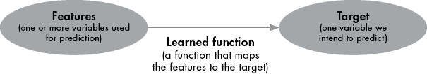

图 7-1：所有有监督学习方法的概念图

图 7-1 所提到的*目标*是我们数据集中我们希望预测的特殊变量。*特征*是我们数据集中用于预测目标的变量。*学习到的函数*是将特征映射到目标的函数。我们可以通过将我们的预测与实际目标值进行比较来检查学习到的函数的准确性。如果预测值与目标值相差很大，我们就知道应该尝试找到更好的学习函数。就像目标值通过告诉我们函数的准确度来监督我们的过程，帮助我们朝着尽可能高的准确度迈进。

无监督学习没有监督，因为它没有目标变量。图 7-2 展示了无监督学习的过程。

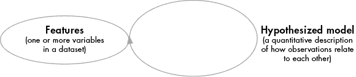

图 7-2：无监督学习过程的概念图

无监督学习并不像有监督学习那样试图将特征映射到目标变量，而是关注于创建特征本身的模型；它通过发现观察值与特征中的自然群体之间的关系来实现这一点。一般来说，它是一种探索特征的方式。找出我们数据中观察值之间的关系可以帮助我们更好地理解数据，它还可以帮助我们发现异常情况，并使数据集变得不那么繁琐。

图 7-2 中的箭头将特征与自身连接。这个箭头表示我们正在寻找特征之间的关系，例如它们自然形成的群体；它并不表示一个循环或重复过程。这可能听起来有些抽象，因此我们通过一个具体的例子来使其更加清晰。

## 生成和探索数据

我们先来看一些数据。不同于以往章节中读取现有数据的方法，这次我们将通过使用 Python 的随机数生成能力来生成新的数据。随机生成的数据比现实生活中的数据更简单、更易于处理；这有助于我们讨论无监督学习的复杂性。

更重要的是，无监督学习的一个主要目标是理解数据子集之间的关系。通过我们自己生成数据，意味着我们可以判断我们的无监督学习方法是否发现了数据子集之间正确的关系，因为我们会准确知道这些子集来自哪里以及它们如何关联。

### 掷骰子

我们将从生成一些简单的示例数据开始，进行几次骰子掷骰：

```py
from random import choices,seed
numberofrolls=1800
seed(9)
dice1=choices([1,2,3,4,5,6], k=numberofrolls)
dice2=choices([1,2,3,4,5,6], k=numberofrolls)
```

在这个代码段中，我们从`random`模块导入了`choices()`和`seed()`函数。这些是我们用来生成随机数的函数。我们定义了一个名为`numberofrolls`的变量，它存储了值`1800`，即我们希望 Python 为我们生成的模拟掷骰子次数。我们调用了`seed()`函数，虽然这个步骤并非必须，但它会确保你得到和书中展示的相同的结果。

接下来，我们使用`choices()`函数创建两个列表，`dice1`和`dice2`。我们传递给该函数两个参数：列表`[1,2,3,4,5,6]`，告诉`choices()`函数我们希望从 1 到 6 的整数中随机选择，以及`k=numberofrolls`，告诉`choices()`函数我们希望它进行 1,800 次随机选择。`dice1`列表表示 1,800 次掷骰子的结果，而`dice2`变量同样表示第二个骰子的 1,800 次掷骰子结果。

你可以如下查看`dice1`的前 10 个元素：

```py
print(dice1[0:10])
```

你应该会看到以下输出（如果你在前面的代码段中运行了`seed(9)`）：

```py
[3, 3, 1, 6, 1, 4, 6, 1, 4, 4]
```

这个列表看起来像是公平骰子 10 次掷骰子的记录。在生成了两颗骰子的 1,800 次随机掷骰子结果后，我们可以找出这 1,800 次掷骰子的和：

```py
dicesum=[dice1[n]+dice2[n] for n in range(numberofrolls)]
```

这里我们通过列表推导式创建了`dicesum`变量。`dicesum`的第一个元素是`dice1`的第一个元素和`dice2`的第一个元素之和，`dicesum`的第二个元素是`dice1`的第二个元素和`dice2`的第二个元素之和，依此类推。所有这些代码模拟了一个常见的场景：一起掷两个骰子并查看掷出后的点数和。但不同的是，我们不是自己掷骰子，而是让 Python 为我们模拟所有的 1,800 次掷骰子。

一旦我们得到了掷骰子的和，我们可以绘制所有结果的直方图：

```py
from matplotlib import pyplot as plt
import numpy as np
fig, ax = plt.subplots(figsize =(10, 7))
ax.hist(dicesum,bins=[2,3,4,5,6,7,8,9,10,11,12,13],align='left')
plt.show()
```

图 7-3 展示了结果。

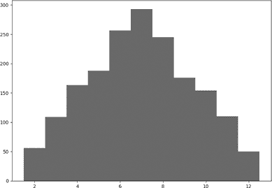

图 7-3：1,800 次模拟掷骰子的结果

这是一个直方图，类似于我们在第一章和第三章中看到的那些。每个垂直条形表示某一特定骰子结果的频率。例如，最左边的条形表示，在 1,800 次掷骰子中，大约 50 次的结果和为 2。中间最高的条形表示，大约 300 次的掷骰子的和为 7。

像这样的直方图向我们展示了数据的*分布*——不同观察值出现的相对频率。我们的分布显示，像 2 和 12 这样的极值是相对不常见的，而像 7 这样的中间值则更为常见。我们还可以通过概率来解读分布：如果我们掷两个公平的骰子，7 是一个非常可能的结果，而 2 和 12 的结果则不太可能。通过观察每个直方图条形的高度，我们可以知道每个结果的大致可能性。

我们可以看到这个直方图呈现出类似钟形的形状。我们掷骰子的次数越多，直方图就越接近钟形。对于大量的骰子掷骰次数，结果的直方图会被一种特殊的分布——*正态分布*（或称*高斯分布*）所近似。你在第三章中也遇到过这种分布，尽管在那一章中我们称其为它的另一个名字：钟形曲线。正态分布是我们在测量某些事物的相对频率时常见的模式，例如第三章中的均值差异，或者此处的骰子掷骰和结果的和。

每个钟形曲线可以通过两个数字来完全描述：一个是*均值*，表示钟形曲线的中心和最高点；另一个是*方差*，表示钟形曲线的扩展范围。方差的平方根就是*标准差*，它是钟形曲线扩展程度的另一个度量。我们可以通过以下简单的函数来计算骰子掷骰数据的均值和标准差：

```py
def getcenter(allpoints):
    center=np.mean(allpoints)
    stdev=np.sqrt(np.cov(allpoints))
    return(center,stdev)

print(getcenter(dicesum))
```

这个函数接受一个观察值列表作为输入。它使用`np.mean()`函数计算该列表的均值，并将其存储在名为`center`的变量中。然后，它使用`np.cov()`方法。这个方法的名字`cov`是*协方差*（covariance）的缩写，协方差是衡量数据变化的一种方式。当我们计算两个不同观察值列表的协方差时，它告诉我们这两个数据集是如何一起变化的。而当我们计算单一观察值列表的协方差时，它就是方差，方差的平方根就是标准差。

如果我们运行之前的代码段，我们应该能够得到骰子掷骰的均值和标准差：

```py
(6.9511111111111115, 2.468219092930105)
```

这个输出告诉我们，观察到的骰子掷骰的均值大约是 7，标准差大约是 2.5。现在我们知道了这些数字，我们可以将钟形曲线叠加在直方图上，像下面这样绘制：

```py
fig, ax = plt.subplots(figsize =(10, 7))
ax.hist(dicesum,bins=range(2,14),align='left')
import scipy.stats as stats
import math
mu=7
sigma=2.5
x = np.linspace(mu - 2*sigma, mu + 2*sigma, 100)*1
plt.plot(x, stats.norm.pdf(x, mu, sigma)*numberofrolls,linewidth=5)
plt.show()
```

图 7-4 显示了我们的输出。

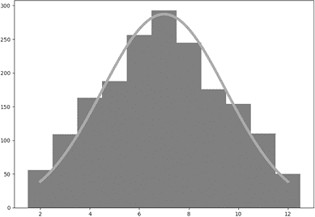

图 7-4：钟形曲线叠加在骰子掷骰的直方图上

你可以看到，钟形曲线是我们在直方图上绘制的连续曲线。它的值代表相对概率：由于它在 7 处的值较高，在 2 和 12 处的值较低，我们可以解读为掷出 7 的可能性比掷出 2 或 12 的可能性更大。我们可以看到，这些理论概率与我们观察到的骰子掷出的结果非常接近，因为钟形曲线的高度接近每个直方图条形的高度。我们可以轻松检查钟形曲线预测的掷骰次数，方法如下：

```py
stats.norm.pdf(2, mu, sigma)*numberofrolls
# output: 38.8734958894954

stats.norm.pdf(7, mu, sigma)*numberofrolls
# output: 287.23844188903155

stats.norm.pdf(12, mu, sigma)*numberofrolls
# output: 38.8734958894954
```

在这里，我们使用`stats.norm.pdf()`函数来计算 2、7 和 12 的预期掷骰次数。这个函数来自`stats`模块，函数名`norm.pdf`是*正态概率密度函数*的缩写，这也是我们熟悉的钟形曲线的另一种名称。这个代码片段使用`stats.norm.pdf()`来计算在*x* = 2、*x* = 7 和*x* = 12 时钟形曲线的高度（换句话说，就是根据我们之前计算的均值和标准差，掷出 2、掷出 7 和掷出 12 的可能性）。然后，它将这些可能性乘以我们希望掷骰的次数（在本例中为 1,800），以得到 2、7 和 12 的预期掷骰总次数。

### 使用另一种类型的骰子

我们已经计算了掷两个 6 面骰子的假设情境的概率，因为掷骰子为我们提供了一种简单、熟悉的方式来思考概率和分布等重要数据科学概念。但当然，这并不是我们可以分析的唯一数据类型，甚至不是我们可以分析的唯一类型的骰子掷骰。

想象一下，掷一对非标准的 12 面骰子，这些骰子面的标记为 4、5、6、...、14、15。当这对骰子一起掷出时，它们的和可能是 8 到 30 之间的任何整数。我们可以再次随机生成 1,800 次假设掷骰，并通过使用之前相同类型的代码，稍作修改，绘制这些掷骰的直方图：

```py
seed(913)
dice1=choices([4,5,6,7,8,9,10,11,12,13,14,15], k=numberofrolls)
dice2=choices([4,5,6,7,8,9,10,11,12,13,14,15], k=numberofrolls)
dicesum12=[dice1[n]+dice2[n] for n in range(numberofrolls)]
fig, ax = plt.subplots(figsize =(10, 7))
ax.hist(dicesum12,bins=range(8,32),align='left')
mu=np.mean(dicesum12)
sigma=np.std(dicesum12)
x = np.linspace(mu - 2*sigma, mu + 2*sigma, 100)*1
plt.plot(x, stats.norm.pdf(x, mu, sigma)*numberofrolls,linewidth=5)
plt.show()
```

图 7-5 显示了结果的直方图。

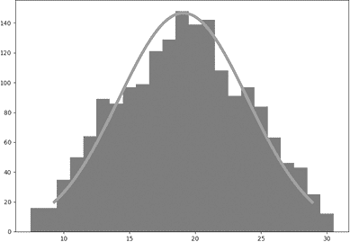

图 7-5：使用一对定制的 12 面骰子掷骰结果的钟形曲线和直方图

锥形曲线大致与图 7-4 中的相同，但在这种情况下，19 是最可能的结果，而不是 7，范围从 8 到 30，而不是从 2 到 12。所以我们再次得到一个正态分布或钟形曲线，但具有不同的均值和标准差。

我们可以将两个直方图（图 7-4 和图 7-5）一起绘制，方法如下：

```py
dicesumboth=dicesum+dicesum12
fig, ax = plt.subplots(figsize =(10, 7))
ax.hist(dicesumboth,bins=range(2,32),align='left')
import scipy.stats as stats
import math
mu=np.mean(dicesum12)
sigma=np.std(dicesum12)
x = np.linspace(mu - 2*sigma, mu + 2*sigma, 100)*1
plt.plot(x, stats.norm.pdf(x, mu, sigma)*numberofrolls,linewidth=5)
mu=np.mean(dicesum)
sigma=np.std(dicesum)
x = np.linspace(mu - 2*sigma, mu + 2*sigma, 100)*1
plt.plot(x, stats.norm.pdf(x, mu, sigma)*numberofrolls,linewidth=5)
plt.show()
```

图 7-6 显示了结果。

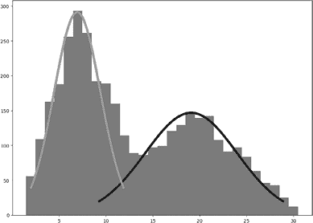

图 7-6：显示 6 面骰子和 12 面骰子配对结果的合并直方图

这在技术上是一个直方图，尽管我们知道它是通过结合两个独立直方图的数据生成的。记住，对于 6 面骰子对，7 是最常见的结果，而对于 12 面骰子对，19 是最常见的结果。我们可以在直方图中看到，7 处有一个局部峰值，19 处有另一个局部峰值。这两个局部峰值称为 *模态*。由于我们有两个模态，这就是我们所说的 *双峰* 直方图。

当你查看图 7-6 时，它应该帮助你开始理解图 7-2 中的概念图试图说明的内容。我们并不像在前面的监督学习章节中那样对掷骰子结果进行预测或分类。相反，我们在构建简单的理论模型——在这个例子中，就是我们的钟形曲线——来表达我们对数据的理解以及观察结果之间的关系。接下来的一节中，我们将使用这些钟形曲线模型来推理数据，并更好地理解它。

## 聚类观察的起源

假设我们从所有绘制的投骰子数据中随机选择一次掷骰子结果，如图 7-6 所示：

```py
seed(494)
randomselection=choices(dicesumboth, k=1)
print(randomselection)
```

你应该会看到输出 `[12]`，表示我们随机选择了一个数据点，其中我们掷出的和为 12。在没有任何其他信息的情况下，假设我要求你做出一个有根据的猜测，哪一对骰子最可能导致这个结果 12。可能是任何一对骰子：6 面骰子可能是两颗 6，或者 12 面骰子可能是其他组合，例如 8 和 4。那么，如何做出一个有根据的猜测，判断哪一对骰子最有可能是这个观察结果的来源呢？

你可能已经有强烈的直觉，认为 12 不太可能是由 6 面骰子掷出的。毕竟，12 是 6 面骰子中最不可能出现的结果（与 2 一起并列），但 12 更接近图 7-5 的中间位置，表明它是 12 面骰子更常见的结果。

你的有根据的猜测不需要仅仅依赖直觉。我们可以通过观察图 7-4 和图 7-5 中直方图条形的高度来看到，当我们掷骰子 1,800 次时，6 面骰子得到 12 的次数大约为 50 次，而 12 面骰子得到 12 的次数超过 60 次。从理论角度来看，图 7-6 中的钟形曲线高度使我们能够直接比较每对骰子每个结果的相对概率，因为我们对每对骰子投掷的次数是相同的。

我们可以用同样的推理方法来思考其他点数的掷骰结果。例如，我们知道 6 面骰子掷出 8 的概率更大，不仅仅是因为直觉，而且因为在图 7-6 中，左侧的钟形曲线在 *x* 值为 8 时高于右侧的钟形曲线。如果我们面前没有图 7-6，我们可以按照以下方法计算每个钟形曲线的高度：

```py
stats.norm.pdf(8, np.mean(dicesum), np.std(dicesum))*numberofrolls
# output: 265.87855493973007

stats.norm.pdf(8, np.mean(dicesum12), np.std(dicesum12))*numberofrolls
# output: 11.2892030357587252
```

在这里我们看到，6 面骰子更可能是观察到的 8 点投掷的来源：它在 1,800 次 6 面骰子的投掷中大约会出现 266 次，而我们预计在 1,800 次 12 面骰子的投掷中，8 点只会出现大约 11 或 12 次。我们可以完全按照相同的过程来判断 12 面骰子对更可能是观察到的 12 点投掷的来源：

```py
stats.norm.pdf(12, np.mean(dicesum), np.std(dicesum))*numberofrolls
# results in 35.87586208537935

stats.norm.pdf(12, np.mean(dicesum12), np.std(dicesum12))*numberofrolls
# results in 51.42993240324318
```

如果我们使用这种比较钟形曲线高度的方法，那么对于任何观察到的骰子投掷，我们都可以判断出最可能是哪个骰子对的来源。

现在我们可以对任何骰子投掷的来源做出有根据的猜测，我们已经准备好处理*聚类*，这是无监督学习中最重要、最常见的任务之一。聚类的目标是回答我们之前考虑过的一个全局版本的问题：哪一对骰子是我们数据中每个观测值的来源？

聚类开始时的推理过程类似于我们上一节中的推理。但不同的是，这次我们不是推理单次骰子投掷，而是尝试确定哪一对骰子是我们数据中每个观测值的来源。这是一个简单的过程，我们可以按如下步骤进行：

+   对于所有 2 点的投掷，骰子对 1 的钟形曲线高于骰子对 2 的曲线，因此，在不考虑其他因素的情况下，我们假设所有 2 点的投掷来自骰子对 1。

+   对于所有 3 点的投掷，骰子对 1 的钟形曲线高于骰子对 2 的曲线，因此，在不考虑其他因素的情况下，我们假设所有 3 点的投掷来自骰子对 1。

+   . . .

+   对于所有 12 点的投掷，骰子对 2 的钟形曲线高于骰子对 1 的曲线，因此，在不考虑其他因素的情况下，我们假设所有 12 点的投掷来自骰子对 2。

+   . . .

+   对于所有 30 点的投掷，骰子对 2 的钟形曲线高于骰子对 1 的曲线，因此，在不考虑其他因素的情况下，我们假设所有 30 点的投掷来自骰子对 2。

通过分别考虑 29 种可能的骰子投掷结果，我们可以对每个观测值的来源做出较好的猜测。我们也可以编写代码来完成这个过程：

```py
from scipy.stats import multivariate_normal
def classify(allpts,allmns,allvar):
    vars=[]
    for n in range(len(allmns)):
        vars.append(multivariate_normal(mean=allmns[n], cov=allvar[n]))
    classification=[]
    for point in allpts:
        this_classification=-1
        this_pdf=0
        for n in range(len(allmns)):
 if vars[n].pdf(point)>this_pdf:
                this_pdf=vars[n].pdf(point)
                this_classification=n+1
        classification.append(this_classification)
    return classification
```

让我们来看一下`classify()`函数。它需要三个参数。第一个参数是`allpts`，表示我们数据中每个观测值的列表。函数需要的另外两个参数是`allmns`和`allvar`。这两个参数分别表示我们数据中每组（即每对骰子）的均值和方差。

该函数需要完成我们在查看图 7-6 时所做的工作，即找出每次投掷的骰子对的来源。我们考虑每个骰子对的钟形曲线，并假设对于某次特定的骰子投掷，具有更高值的钟形曲线就是它来自的骰子对。在我们的函数中， instead of visually looking at bell curves，我们需要计算钟形曲线的值并查看哪一个更高。这就是我们创建一个名为`vars`的列表的原因。这个列表最初为空，但我们随后使用`multivariate_normal()`函数将我们的钟形曲线添加到该列表中。

在我们收集了钟形曲线后，我们考虑数据中的每个点。如果在某个点，第一条钟形曲线比其他钟形曲线更高，我们就说这个点与第一个骰子对相关联。如果第二条钟形曲线在这个点最高，我们就说这个点属于第二个骰子对。如果我们有超过两个钟形曲线，我们可以比较所有钟形曲线，并根据哪个钟形曲线更高来分类每个点。我们找到最高的钟形曲线的方法与我们之前查看图 7-6 时一样，只不过现在我们是通过代码而非眼睛来完成。每次我们分类一个点时，我们都会将它的骰子对编号附加到一个名为`classification`的列表中。当函数运行完成时，它将列表填充为我们数据中每个点的骰子对分类，并返回该列表作为最终值。

让我们试试我们新的`classify()`函数。首先，定义一些点、均值和方差：

```py
allpoints = [2,8,12,15,25]
allmeans = [7, 19]
allvar = [np.cov(dicesum),np.cov(dicesum12)]
```

我们的`allpoints`列表是一个包含我们想要分类的假设骰子投掷结果的集合。我们的`allmeans`列表由两个数字组成：7，即我们期望从 6 面骰子对中得到的平均投掷结果；19，即我们期望从 12 面骰子对中得到的平均投掷结果。我们的`allvar`列表包含两个骰子对的相应方差。现在我们有了三个必要的参数，我们可以调用`classify()`函数：

```py
print(classify(allpoints,allmeans,allvar))
```

我们看到以下输出：

```py
[1, 1, 2, 2, 2]
```

这个列表告诉我们，`allpoints`列表中的前两个骰子投掷结果，2 和 8，更可能与 6 面骰子对相关联。`allpoints`列表中的其他骰子投掷结果——12、15 和 25——更可能与 12 面骰子对相关联。

我们刚刚做的事情是将一个包含非常不同的骰子投掷结果的列表进行分类，分为两个不同的组。你可以称之为分类或分组，但在机器学习的世界里，这叫做*聚类*。如果你查看图 7-6，你可以开始理解原因。来自 6 面骰子的投掷结果似乎聚集在它们最常见的值 7 周围，而来自 12 面骰子的投掷结果则聚集在它们最常见的值 19 周围。它们形成了小山脉般的观察结果或组，我们将称这些为聚类，无论它们的形状或大小如何。

在实际应用中，数据通常具有这种类型的聚类结构，其中少数几个子集（聚类）是显而易见的，每个子集中的大多数观测值都接近该子集的均值，而只有少数观测值位于子集之间或远离均值。通过对我们数据中存在的聚类形成结论，并将每个观测值分配到一个聚类中，我们完成了本章的主要任务——聚类的简单版本。

## 聚类在商业应用中的作用

骰子掷出的结果具有容易理解和推理的概率，但在商业中，并非很多情境都需要直接关注骰子掷出的结果。尽管如此，聚类在商业中被广泛使用，尤其是营销人员。

假设图 7-6 不是骰子掷出的记录，而是你所经营的零售店的交易金额记录。围绕 7 的低聚类表明，一组人群在你的商店消费大约 7 美元，而围绕 19 的高聚类则表明，另一组人群在你的商店消费大约 19 美元。你可以说，你有一群低消费客户和一群高消费客户。

现在你知道你有两个截然不同的客户群体，并且知道他们是谁，你可以基于这一信息采取行动。例如，你可能不再对所有客户使用相同的广告策略，而是根据每个群体的不同进行有针对性的广告或营销。也许，强调优惠和实用性的广告对低消费群体有吸引力，而强调高端质量和社会声望的广告则更吸引高消费群体。一旦你清楚了解了这两个客户群体之间的边界、每个群体的大小以及他们最常见的消费习惯，你就有了制定复杂的双管齐下广告策略所需的主要信息。

另一方面，在发现数据中的聚类之后，你可能希望去除这些聚类，而不是迎合它们。例如，你可能认为低消费的客户并非预算紧张，而只是对你的一些价格较高但有用的产品不够了解。你可能会专门为他们推出更具攻击性和信息性的广告，以鼓励所有客户都成为高消费群体。你的具体方法将取决于许多其他的商业细节、你的产品以及你的战略。聚类分析能够通过显示客户群体及其特征为你的战略决策提供重要的输入，但它无法从零开始提供清晰的商业策略。

我们可以设想，直方图中图 7-6 的 x 轴表示另一个变量，比如客户年龄，而不是交易金额。这样，我们的聚类分析就会告诉我们，来光顾我们业务的有两个不同的群体：年轻群体和年长群体。你可以对任何你测量到的与客户相关的数值变量进行聚类分析，从而可能发现一些有趣的客户群体。

企业营销人员在“*数据科学*”这个术语普及之前，甚至在今天的大部分聚类方法发明之前，就已经在将客户分组。数据科学和聚类时代之前，营销人员通常称这种将客户分组的做法为*客户细分*。

实际上，营销人员常常以非科学的方式进行细分，他们并不是通过从数据中发现聚类和边界，而是通过猜测或直觉选择一些圆整的数字。例如，一位电视制片人可能会委托调查观众，并以一种看似自然的方式分析数据，先查看所有 30 岁以下观众的结果，再单独查看 30 岁及以上观众的结果。使用这个看似自然的圆整数字 30 可能提供一个潜在的边界，将年轻观众和年长观众区分开。然而，也许该制片人的节目 30 岁以上的观众极为稀少，所以单独分析这一组观众的反馈会分散注意力，反而忽略了 30 岁以下更大规模的观众群体。相反，简单的聚类分析可能会揭示出 18 岁左右的观众和 28 岁左右的观众各自有一个大的群体，这两个群体之间的边界在 23 岁。基于这个聚类分析来分析细分群体，而不是基于看似合理但最终误导性的“30 岁以下”和“30 岁以上”细分，将更有助于理解节目的观众及其观点。

细分早于聚类，但聚类是一种很好的细分方法，因为它使我们能够找到更准确、更有用的细分群体，并且能精确地划定它们之间的边界。在这种情况下，你可以说，聚类方法为我们提供了基于数据的客观洞察，而与之相对的是基于直觉或经验的圆整数字细分。由直觉转向客观、数据驱动的洞察，正是数据科学为商业带来的主要贡献之一。

到目前为止，我们仅讨论了单个变量的细分：单独分析掷骰结果、消费或年龄等。我们可以开始思考多个维度，而不仅仅是在单个变量上进行聚类和细分。例如，如果我们在美国经营零售公司，我们可能会发现，在西部有一群年轻的高消费人群；在东南部有一群年长的低消费人群；在北部有一群中年、适度高消费的人群。为了发现这一点，我们需要在多个维度上同时进行聚类。数据科学中的聚类方法具备这种能力，给它们提供了相较于传统细分方法的另一优势。

## 分析多个维度

在我们的掷骰数据中，每个观察值仅由一个数字组成：我们掷出的骰子正面朝上的数字之和。我们不记录骰子的温度或颜色，也不记录骰子的边长或宽度，或者除了每次掷骰的一个原始数字外的任何其他信息。我们的掷骰数据集是*一维*的。在这里，*维度*不一定指空间中的维度，而是指任何可以在低值和高值之间变化的测量。掷骰的结果可以有很大差异，从像 2 这样的低点到像 12（或更多，取决于我们使用的骰子）这样的高点，但我们只测量它们在一个度量标准上的高低：掷出骰子后正面朝上的数字之和。

在商业场景中，我们几乎总是关心多个维度。例如，在分析客户群体时，我们想要了解客户的年龄、位置、收入、性别、教育年限等尽可能多的信息，以便能够成功地进行市场营销。当我们处理多个维度时，一些事物会看起来不同。例如，我们在图 7-3 到 7-6 中看到的钟形曲线将增加一个额外的维度，就像在图 7-7 右侧所示的那样。

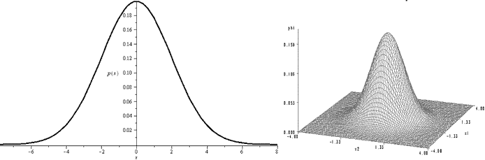

图 7-7：单变量钟形曲线（左）和双变量钟形曲线（右）

该图左侧显示的是*单变量钟形曲线*，之所以叫*单变量*，是因为它仅展示一个变量（x 轴）的相对概率。右侧显示的是*双变量钟形曲线*，它展示的是沿两个维度变化的相对概率：x 轴和 y 轴。我们可以想象，在图 7-7 右侧的图中，x 轴和 y 轴可能分别表示年龄和平均交易金额。

单变量高斯曲线的均值由一个数字表示，例如在图 7-7 的左侧，*x* = 0。双变量高斯曲线的均值由两个数字表示：由一个 x 坐标和一个 y 坐标组成的有序对，如 (0, 0)。维度的数量增加，但使用每个维度的均值来找到钟形曲线的最高点的思路是相同的。找到每个维度的均值将告诉我们钟形曲线的中心和最高点的位置，其他观察值通常会围绕这一点聚集。在单变量和双变量的情况下，我们可以将钟形曲线的高度解释为概率：钟形曲线较高的点对应于更可能的观察值。

从一维到二维的转变还会影响我们表达钟形曲线分布范围的方式。在一维中，我们使用方差（或标准差）作为一个数字，表示曲线的分布程度。在二维或更高维度中，我们使用矩阵，或一组数字的矩形数组，来表示钟形曲线的分布范围。我们使用的矩阵称为*协方差矩阵*，它记录了每个维度的分布程度，以及不同维度之间的共同变化程度。我们不需要关心协方差矩阵的细节；我们主要只需要通过`np.cov()`函数来计算它，并将其作为输入应用于我们的聚类方法。

当你在聚类分析中将维度从二维增加到三维或更多时，这一调整是直接的。我们将不再使用单变量或双变量的钟形曲线，而是使用*多变量钟形曲线*。在三维空间中，均值将有三个坐标；在*n*维空间中，均值将有*n*个坐标。每次增加问题的维度时，协方差矩阵也会变得更大。但是，无论你有多少维度，钟形曲线的特征始终相同：它有一个均值，大多数观察值会接近该均值，并且有一个协方差度量，显示钟形曲线的分布范围。

在本章的其余部分，我们将看一个二维示例，该示例将展示聚类的概念和过程，同时仍能让我们绘制出简单、易于理解的图形。这个示例将展示聚类和无监督学习的所有基本特征，你可以将其应用于任意维度。

## E-M 聚类

现在我们拥有了执行*E-M 聚类*所需的所有要素，这是一种强大的无监督学习方法，可以帮助我们智能地发现多维数据中的自然分组。这种技术也被称为*高斯混合建模*，因为它使用钟形曲线（高斯分布）来建模群体是如何相互融合的。无论你怎么称呼它，它都非常有用且相对直接。

我们将从查看我们想要进行聚类的新二维数据开始。我们可以按照以下方式从它的在线位置读取数据：

```py
import ast
import requests
link = "https://bradfordtuckfield.com/emdata.txt"
f = requests.get(link)
allpoints = ast.literal_eval(f.text)
```

这个代码片段使用了两个模块：`ast`和`requests`。`requests`包允许 Python 从网站请求文件或数据集——在这个例子中，网站是存放聚类数据的地方。数据以 Python 列表的形式存储在文件中。Python 默认将*.txt*文件读取为字符串，但我们希望将数据读取为 Python 列表，而不是字符串。`ast`模块包含一个`literal_eval()`方法，使我们能够读取文件中的列表数据，否则它们会被当作字符串处理。我们将列表读取到一个名为`allpoints`的变量中。

现在我们已经将数据读取到 Python 中，可以绘制图形来看数据长什么样子：

```py
allxs=[point[0] for point in allpoints]
allys=[point[1] for point in allpoints]
plt.plot(allxs, allys, 'x')
plt.axis('equal')
plt.show()
```

图 7-8 显示了结果。

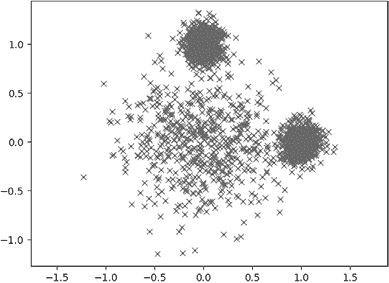

图 7-8：我们新的二维数据的图示

你可能会注意到这些轴没有标签。这不是偶然的：我们将把这些数据作为一个无标签的示例来处理，然后讨论它如何应用于多种场景。你可以想象在这个示例中，轴可能有许多不同的标签：也许这些点代表城市，x 轴是人口增长百分比，y 轴是经济增长百分比。如果是这样，执行聚类将会识别出那些增长趋势最近相似的城市聚类。也许如果你是一个 CEO，正在考虑在哪里开设新分店，这个信息会很有用。但这些轴不一定代表城市的增长：它们可以代表任何东西，而我们的聚类算法将以相同的方式工作。

在图 7-8 中，一些其他的现象也立即显现出来。两个特别密集的观测聚类分别出现在图的顶部和右侧。在图的中心，另一个聚类似乎比其他两个更为稀疏。我们似乎有三个位置不同、大小和密度不同的聚类。

与其仅仅依靠肉眼进行聚类练习，我们不如使用一个强大的聚类算法：E-M 算法。*E-M*是*期望最大化*（expectation-maximization）的缩写。我们可以用四个步骤来描述这个算法：

1.  猜测：为每个聚类的均值和协方差做出猜测。

1.  期望：根据最新的均值和协方差估计，按每个数据点最可能属于哪个聚类来对数据进行分类。（这被称为*E*，或*期望*，步骤，因为我们是根据每个点属于各个聚类的可能性进行分类。）

1.  最大化：利用期望步骤获得的分类结果来计算每个聚类的均值和协方差的新估计值。（这被称为*M*，或*最大化*，步骤，因为我们找到的均值和方差最大化了数据匹配的概率。）

1.  收敛：重复执行期望步骤和最大化步骤，直到达到停止条件。

如果这个算法看起来让你感到害怕，不要担心；你已经在本章的早期部分做了所有的困难部分。让我们依次通过每个步骤，以更好地理解它们。

### 猜测步骤

第一步是最简单的，因为我们可以对聚类的均值和协方差做出任何猜测。让我们做一些初步猜测：

```py
#initial guesses
mean1=[-1,0]
mean2=[0.5,-1]
mean3=[0.5,0.5]

allmeans=[mean1,mean2,mean3]

cov1=[[1,0],[0,1]]
cov2=[[1,0],[0,1]]
cov3=[[1,0],[0,1]]

allvar=[cov1,cov2,cov3]
```

在这段代码中，我们首先对`mean1`、`mean2`和`mean3`进行猜测。这些猜测是二维点，应该是我们三个聚类的各自中心。然后，我们对每个聚类的协方差做出猜测。我们对协方差做出最简单的猜测：我们猜测一个特别简单的矩阵——*单位矩阵*作为每个聚类的协方差矩阵。（单位矩阵的细节现在不重要；我们之所以使用它，是因为它简单，并且作为初步猜测时往往足够有效。）我们可以绘制一个图来看看这些猜测是什么样的：

```py
plt.plot(allxs, allys, 'x')
plt.plot(mean1[0],mean1[1],'r*', markersize=15)
plt.plot(mean2[0],mean2[1],'r*', markersize=15)
plt.plot(mean3[0],mean3[1],'r*', markersize=15)
plt.axis('equal')
plt.show()
```

图表类似于图 7-9。

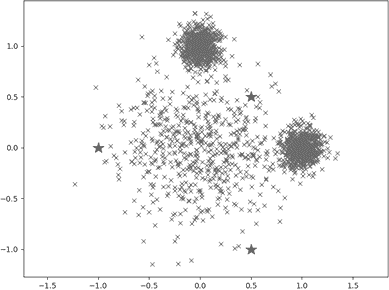

图 7-9：我们的数据以及一些作为星星显示的聚类中心猜测

你可以再次看到绘制的点，星星代表我们对聚类中心的猜测。（如果你在家里绘制，星星会是红色的。）显然，我们的猜测并不是很好。特别是，我们的猜测没有一个位于图表顶部和右侧的两个密集聚类的中心，也没有一个接近主要点云的中心。在这种情况下，从不准确的猜测开始是好的，因为它能让我们看到期望最大化（E-M）聚类算法的强大：即使我们的初步猜测在猜测步骤中相当糟糕，它依然能够找到正确的聚类中心。

### 期望步骤

我们已经完成了算法的猜测步骤。在下一步中，我们需要根据我们认为每个点所属的聚类，对所有点进行分类。幸运的是，我们已经有了`classify()`函数来处理这个：

```py
def classify(allpts,allmns,allvar):
    vars=[]
    for n in range(len(allmns)):
        vars.append(multivariate_normal(mean=allmns[n], cov=allvar[n]))
    classification=[]
    for point in allpts:
        this_classification=-1
        this_pdf=0
        for n in range(len(allmns)):
 if vars[n].pdf(point)>this_pdf:
                this_pdf=vars[n].pdf(point)
                this_classification=n+1
        classification.append(this_classification)
    return classification 
```

记住这个函数的作用。早些时候，我们使用它对骰子投掷结果进行分类。我们收集了一组骰子投掷的观察结果，通过比较两条钟形曲线的高度，找出每个骰子投掷结果最可能来自哪一对骰子。在这里，我们将使用这个函数来做一个类似的任务，但我们将使用新的未标记数据，而不是骰子投掷数据。对于我们新数据中的每个观察结果，这个函数通过比较与每个组相关联的钟形曲线的高度，来找出它最可能属于哪个组。我们将对我们的点、均值和方差调用这个函数：

```py
theclass=classify(allpoints,allmeans,allvar)
```

现在我们有一个名为`theclass`的列表，其中包含了我们数据中每个点的分类。我们可以通过运行`print(theclass[:10])`来查看`theclass`的前 10 个元素。我们看到以下输出：

```py
[1, 1, 1, 1, 3, 1, 3, 3, 1, 3]
```

这个输出告诉我们，我们数据中的第一个点似乎在第 1 类，第五个点在第 3 类，以此类推。我们已经完成了猜测步骤和期望步骤：我们有了每个簇的均值和方差，并且我们已经将每个数据点归类到了其中一个簇中。在继续之前，让我们创建一个函数来绘制我们的数据和簇：

```py
def makeplot(allpoints,theclass,allmeans):
    thecolors=['black']*len(allpoints)
    for idx in range(len(thecolors)):
        if theclass[idx]==2:
            thecolors[idx]='green'
        if theclass[idx]==3:
            thecolors[idx]='yellow'
    allxs=[point[0] for point in allpoints]
    allys=[point[1] for point in allpoints]
    for i in range(len(allpoints)):
        plt.scatter(allxs[i], allys[i],color=thecolors[i])
    for i in range(len(allmeans)):
        plt.plot(allmeans[i][0],allmeans[i][1],'b*', markersize=15)
    plt.axis('equal')
    plt.show()
```

这个函数将我们的数据（`allpoints`）、簇分类（`theclass`）和簇均值（`allmeans`）作为输入。然后它为每个簇分配颜色：第一个簇的点为黑色，第二个簇的点为绿色，第三个簇的点为黄色。`plt.scatter()`函数将所有的点绘制成相应的颜色。最后，它用红色星形标记绘制每个簇中心。请注意，本书是黑白印刷的，所以只有在你在自己的电脑上运行这段代码时，才能看到这些颜色。

我们可以通过运行`makeplot(allpoints,theclass,allmeans)`来调用这个函数，我们应该能看到图 7-10。

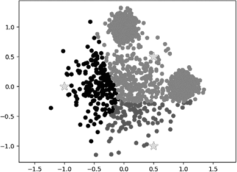

图 7-10：初始簇分类

这是一个二维图。但是，为了理解它是如何将数据分类到簇中的，你可以想象有三个双变量的钟形曲线（就像在图 7-7 右侧的那个），它们从页面中凸出，每个曲线的中心位于一个星形的簇中心上。我们估算的协方差将决定每个钟形曲线的分布范围。簇的分类是根据每个数据点在哪个钟形曲线最高来确定的。你可以想象，如果我们移动了中心点或改变了协方差估计值，我们的双变量钟形曲线会有所不同，分类结果也可能会变化。（这一点很快就会发生。）

从图 7-10 可以清楚地看到，我们的聚类任务还没有完成。首先，簇的形状与我们在图 7-8 中看到的形状不匹配。更明显的是，我们称为*簇中心*的点，在这个图中显示为星形标记，显然并不位于它们各自簇的中心位置；它们更像是位于数据的边缘。这就是我们需要执行 E-M 聚类算法中的最大化步骤的原因，在该步骤中，我们将重新计算每个簇的均值和方差（从而将簇中心移动到更合适的位置）。

### 最大化步骤

这个步骤很简单：我们只需要拿出每个簇中的点，计算它们的均值和方差。我们可以更新之前使用的`getcenters()`函数来完成这一任务：

```py
def getcenters(allpoints,theclass,k):
    centers=[]
    thevars=[]
    for n in range(k):
        pointsn=[allpoints[i] for i in range(0,len(allpoints)) if theclass[i]==(n+1)]
        xpointsn=[points[0] for points in pointsn]
 ypointsn=[points[1] for points in pointsn]
        xcenter=np.mean(xpointsn)
        ycenter=np.mean(ypointsn)
        centers.append([xcenter,ycenter])
        thevars.append(np.cov(xpointsn,ypointsn))
    return centers,thevars
```

我们更新后的`getcenters()`函数很简单。我们将一个数字`k`作为参数传递给该函数；这个数字表示我们数据中的聚类数量。我们还将数据和聚类分类传递给该函数。函数计算每个聚类的均值和方差，然后返回一个均值列表（我们称之为`centers`）和一个方差列表（我们称之为`thevars`）。

让我们调用更新后的`getcenters()`函数，找到我们三个聚类的实际均值和方差：

```py
allmeans,allvar=getcenters(allpoints,theclass,3)
```

现在我们已经重新计算了均值和方差，让我们通过运行`makeplot(allpoints,theclass,allmeans)`再次绘制聚类图。结果应该类似于图 7-11。


图 7-11：重新计算的聚类中心

你可以看到，我们的聚类中心（星形）在重新计算后已经移动。由于聚类中心已移动，我们之前的一些聚类分类可能已经不正确。如果你在你的电脑上运行这个，你会看到一些黄色点，它们离黄色聚类的中心（图中的右上角聚类）相当远，而离其他聚类的中心则相当近。由于聚类中心已移动，并且我们重新计算了协方差，我们需要重新运行分类函数，将所有点重新分类到正确的聚类中（这意味着，我们需要再次运行期望步骤）：

```py
theclass=classify(allpoints,allmeans,allvar)
```

再次，为了理解这个分类是如何完成的，你可以想象三个双变量的钟形曲线从页面上突出出来，钟形曲线的中心由星形的位置决定，宽度由我们计算出的钟形曲线协方差决定。在每个点上，最高的钟形曲线将决定该点的聚类分类。

让我们再绘制一个图，反映这些新重新计算的聚类分类，通过再次运行`makeplot(allpoints,theclass,allmeans)`。结果是图 7-12。

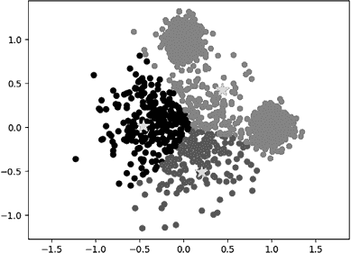

图 7-12：重新分类的聚类分类

在这里，你可以看到星形（聚类中心）的位置与图 7-11 中的相同。但我们已经完成了点的重新分类：通过比较每个聚类的钟形曲线，我们找到了最有可能包含每个点的聚类，并据此改变了颜色。你可以将此与图 7-10 进行对比，看看自我们开始以来取得的进展：我们已经改变了对聚类中心位置的估计，也改变了对每个点属于哪个聚类的估计。

### 收敛步骤

你可以看到，两个聚类已经变大（下方的聚类和左侧的聚类），而一个聚类变小了（右上角的聚类）。但现在我们又回到了之前的情况：在重新分类聚类后，中心位置不再正确，因此我们也需要重新计算聚类中心。

希望到现在你能看出这个过程的规律：每次我们重新分类簇时，都需要重新计算簇的中心，而每次重新计算中心时，我们又需要重新分类簇。换句话说，每次我们执行期望步骤时，都必须执行最大化步骤，而每次我们执行最大化步骤时，又必须重新执行期望步骤。

这就是为什么 E-M 聚类的下一步、最后一步是重复执行期望和最大化步骤：这两个步骤相互依赖。我们可以写一个简短的循环来为我们完成这个任务：

```py
for n in range(0,100):
    theclass=classify(allpoints,allmeans,allvar)
    allmeans,allvar=getcenters(allpoints,theclass,3)
```

循环体的第一行（以`theclass=`开始）完成了期望步骤，下一行则完成了最大化步骤。你可能会想，我们会不会陷入无限循环，需要不断重新计算中心并重新分类簇，永远无法得出最终答案。幸运的是，E-M 聚类在数学上是保证*收敛*的，这意味着最终我们会达到一个步骤，在这个步骤中我们重新计算中心并发现与上一步计算的中心相同，同时重新分类簇并发现与上一步分类的簇相同。此时，我们可以停止运行聚类，因为继续下去只是不断重复相同的结果。

在前面的代码片段中，我们没有检查是否收敛，而是设置了一个迭代次数限制为 100 次。对于像我们这样的小而简单的数据集，这肯定足够了。如果你有一个复杂的数据集，在 100 次迭代后似乎没有收敛，你可以增加到 1,000 次甚至更多，直到 E-M 聚类达到收敛。

让我们回顾一下我们做了什么。我们进行了猜测步骤，猜测了簇的均值和方差。我们进行了期望步骤，根据均值和方差对簇进行了分类。我们进行了最大化步骤，根据簇计算均值和方差。我们进行了收敛步骤，重复执行期望和最大化步骤直到达到停止条件。

我们已经完成了 E-M 聚类！现在，我们完成了聚类，让我们通过再次运行`makeplot(allpoints,theclass,allmeans)`来看一下最终估计的簇和中心的图形；见图 7-13。

当我们查看这个图表时，我们可以看到我们的聚类成功了。我们的一个聚类中心（星号）出现在那个大而分散的聚类中心附近。其他两个聚类中心出现在较小、更紧凑的聚类中心附近。重要的是，我们可以看到一些观察点，它们与小聚类的距离更近（绝对距离），但它们被归类为大聚类的一部分。这是因为 E-M 聚类考虑了方差；由于它看到中心聚类更分散，因此给它分配了更高的方差，从而能够包括更多的点。记住，我们开始时对聚类中心有一些非常糟糕的猜测，但最终得到了一个完全符合我们预期的结果。从图 7-10 中的糟糕猜测出发，我们最终在图 7-13 中得到了一个看起来合理的结果。这展示了 E-M 聚类的强大功能。

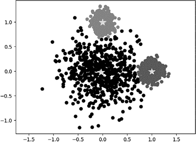

图 7-13：最终的 E-M 聚类结果

我们的 E-M 聚类过程已经识别出了数据中的聚类。我们已经完成了聚类算法，但还没有将其应用于任何业务场景。如何将其应用到业务中将取决于数据的具体内容。这只是为本书生成的示例数据，但我们可以在任何其他领域的数据上执行完全相同的 E-M 聚类过程。例如，我们可以假设，如前所述，图 7-13 中的点代表城市，x 轴和 y 轴代表不同类型的城市发展。或者，图 7-13 中的点可以代表客户，x 轴和 y 轴代表客户属性，如总消费、年龄、位置等。

你如何处理你的聚类将取决于你所使用的数据和你的目标。但在任何情况下，了解数据中存在的聚类可以帮助你为不同的聚类制定不同的营销方法、不同的产品，或者与每个聚类互动的不同策略。

## 其他聚类方法

E-M 聚类是一种强大的聚类方法，但它不是唯一的。另一种方法，*k-means 聚类*，更为流行，因为它更容易。如果你能做 E-M 聚类，那么通过一些简单的代码修改，k-means 聚类就变得容易了。以下是 k-means 聚类的步骤：

1.  猜测：对每个聚类的均值进行猜测。

1.  分类：根据每个观察点最有可能属于哪个聚类来分类我们的数据，依据的是它最接近哪个均值。

1.  调整：利用分类步骤得到的分类结果来计算每个聚类的均值的新估计。

1.  收敛：重复分类和调整步骤，直到达到停止条件。

你可以看到，k-means 聚类与 E-M 聚类一样，也由四个步骤组成。第一步和最后一步（猜测和收敛）是相同的：我们在两个过程的开始阶段都进行猜测，并且在两个过程中都重复步骤直到收敛。唯一的区别在于第二步和第三步。

在这两种算法中，第二步（E-M 聚类中的期望步骤，k-means 聚类中的分类步骤）决定了哪些观测值属于哪个聚类。区别在于我们如何确定哪些观测值属于哪个聚类。对于 E-M 聚类，我们通过比较钟形曲线的高度来确定一个观测值属于哪个聚类，如图 7-6 所示。对于 k-means 聚类，我们通过更简单的方式来确定观测值属于哪个聚类：即通过测量观测值与每个聚类中心之间的距离，找到最接近的聚类中心。所以，当我们看到一个掷骰子结果为 12 时，E-M 聚类会告诉我们这是 12 面骰子掷出的，因为在图 7-6 中钟形曲线的高度决定了这一点。然而，k-means 聚类会告诉我们这是 6 面骰子掷出的，因为 12 更接近 7（6 面骰子的平均点数），而不是 19（12 面骰子的平均点数）。

E-M 聚类和 k-means 聚类之间的另一个区别在于第三步（E-M 聚类中的最大化步骤和 k-means 聚类中的调整步骤）。在 E-M 聚类中，我们需要计算每个聚类的均值和协方差矩阵。但是在 k-means 聚类中，我们只需要计算每个聚类的均值—在 k-means 聚类中完全不使用协方差估计。你可以看到，E-M 聚类和 k-means 聚类有相同的基本框架，只有在分类和调整的具体步骤上有所不同。

实际上，我们只需导入正确的模块，就可以轻松地在 Python 中实现 k-means 聚类：

```py
from sklearn.cluster import KMeans
kmeans = KMeans(init="random", n_clusters=3, n_init=10, max_iter=300, random_state=42)
kmeans.fit(allpoints)
newclass=[label+1 for label in kmeans.labels_]
makeplot(allpoints,newclass,kmeans.cluster_centers_)
```

在这里，我们从之前使用过的相同 sklearn 模块中导入`KMeans()`。然后，我们创建一个名为`kmeans`的对象；这个对象将用于对我们的数据进行 k-means 聚类。你可以看到，当我们调用`KMeans()`函数时，需要指定一些重要参数，包括我们想要的聚类数量（`n_clusters`）。在创建了`kmeans`对象后，我们可以调用它的`fit()`方法，来找到我们`allpoints`数据中的聚类（也就是之前使用的数据）。当我们调用`fit()`方法时，它会决定每个数据点属于哪个聚类，我们可以通过`kmeans.labels_`对象访问每个聚类的分类。我们还可以通过`kmeans.cluster_centers_`对象访问聚类的中心。最后，我们可以调用我们的`makeplot()`函数，绘制我们的数据以及我们使用 k-means 找到的聚类。图 7-14 展示了结果。

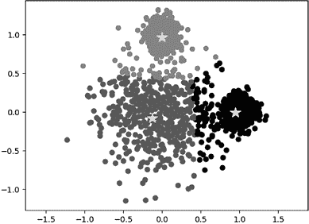

图 7-14：k-means 聚类的结果

你可以在这个图中看到，k-means 聚类的结果与 E-M 聚类的结果差别不大：我们已经识别出了图上方和右侧的两个密集簇，并且在图的其余部分识别出了一个较为松散的簇。一个不同之处是簇的边界不同：在 k-means 聚类中，上方和右侧的簇包含了一些看起来更像是较不密集簇的成员。这并非偶然；k-means 聚类的设计目的是发现大致相同大小的簇，它没有 E-M 聚类那样的灵活性，不能找到具有不同密度的不同大小的簇。

除了 E-M 和 k-means 聚类，还有许多其他聚类方法，这些方法多到无法在此详细列举。每种聚类方法都适用于特定类型的数据和特定的应用。例如，一种强大但被低估的聚类方法叫做 *基于密度的空间聚类算法（带噪声）*（*DBSCAN*）。与 E-M 和 k-means 聚类不同，DBSCAN 能够检测出具有独特、非球形、非钟形形状的簇，就像图 7-15 所示的形状。

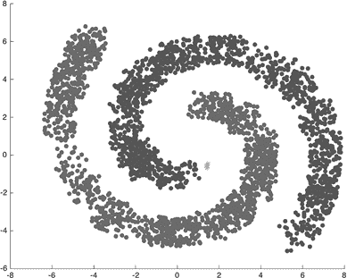

图 7-15：DBSCAN 聚类的结果，带有非球形簇

你可以看到两个明显的群体，或簇的数据。但由于它们彼此交织在一起，使用钟形曲线进行分类效果并不好。钟形曲线无法轻松找到这些簇的复杂边界。DBSCAN 并不依赖于钟形曲线，而是依靠对簇内外每个点之间距离的仔细考虑。

另一种重要的聚类方法叫做 *层次聚类*。层次聚类并不是简单地将观测值分类到不同的组中，而是生成一个嵌套的层次结构，展示观测值先是紧密相关的组，然后是逐渐更远的组。每种聚类方法都有不同的假设和方法。但它们的目标都是一样的：在没有标签或监督的情况下，将点分类到不同的组中。

## 其他无监督学习方法

聚类是无监督学习中最流行的应用，但除了聚类之外，许多算法也属于广义的无监督学习范畴。有几种无监督学习方法实现了 *异常检测*：即寻找那些不符合数据集一般模式的观测值。一些异常检测方法与聚类方法非常相似，因为它们有时会包含识别密集的邻近群体（像簇一样）并测量观测值与其最接近的簇之间的距离。

另一类无监督学习方法被称为*潜变量模型*。这些模型试图将数据集中的观测值表示为假设的隐藏变量或*潜变量*的函数。例如，一个数据集可能由学生在八门课程中的成绩组成。我们可能有一个假设，认为存在两种主要类型的智力：分析性智力和创造性智力。我们可以检查学生在定量的分析类课程（如数学和科学）中的成绩是否有相关性，以及学生在更具创造性的课程（如语言和音乐）中的成绩是否有相关性。换句话说，我们假设有两个隐藏的或潜在的变量——分析性智力和创造性智力——这两个潜变量在很大程度上决定了我们观察到的所有变量的值，也就是所有学生的成绩。

这并不是唯一的假设。我们也可以假设学生成绩仅由一个潜变量决定——通用智力，或者我们可以假设学生成绩是由三个或其他潜变量决定的，然后我们可以尝试测量和分析这些变量。

本章中我们完成的 E-M 聚类也可以看作是一种潜变量模型。在掷骰子聚类的情况下，我们感兴趣的潜变量是指示聚类位置和大小的钟形曲线的均值和标准差。许多潜变量模型依赖于线性代数和矩阵代数，因此如果你对无监督学习感兴趣，你应该认真学习这些主题。

请记住，所有这些方法都是无监督的，这意味着我们没有标签来严格地测试我们的假设。在图 7-13 和图 7-14 中，我们可以看到我们找到的聚类分类看起来是正确的，并在某些方面是有意义的，但我们不能确定它们是否是正确的。我们也不能确定 E-M 聚类（其结果如图 7-13 所示）或 k-means 聚类（其结果如图 7-14 所示）哪个更正确——因为没有“真实标签”可以用来判断正确性。这就是为什么无监督学习方法通常用于数据探索，但不常用于得出关于预测或分类的最终答案的原因。

由于无法明确判断任何无监督学习方法是否得出了正确的结果，做好无监督学习需要良好的判断力。它通常不会给出最终答案，而是通过提供对数据的洞察，帮助我们为其他分析（包括监督学习）提供思路。但这并不意味着它不值得一做；无监督学习可以提供无价的洞察和创意。

## 总结

在本章中，我们介绍了无监督学习，重点讲解了 E-M 聚类。我们讨论了无监督学习的概念、E-M 聚类的细节，以及 E-M 聚类与其他聚类方法（如 k-means 聚类）之间的区别。最后，我们讨论了其他无监督学习方法。在下一章中，我们将讨论网页抓取，以及如何从网站快速、轻松地获取数据进行分析和商业应用。
